-   [Reference Links](#reference-links)
-   [Base Graphics](#base-graphics)
    -   [1 variable continuous](#variable-continuous)
-   [ggplot2](#ggplot2)
    -   [1 variable continuous](#variable-continuous-1)
    -   [1 variable discrete](#variable-discrete)
    -   [2 variables discrete/continuous](#variables-discretecontinuous)
    -   [2 variables continuous/continuous](#variables-continuouscontinuous)
    -   [Layering in ggplot](#layering-in-ggplot)
    -   [Colors](#colors)
    -   [Facet wrap](#facet-wrap)
    -   [Facet grid](#facet-grid)
    -   [Saving ggplots as a variable](#saving-ggplots-as-a-variable)
    -   [Alpha transparency](#alpha-transparency)
    -   [Hexbin](#hexbin)
-   [Themes](#themes)

Reference Links
===============

<http://www.cookbook-r.com/Graphs/>

<http://ggplot2.tidyverse.org/reference/>

``` r
library(ggplot2)

diamonds
```

    ## # A tibble: 53,940 × 10
    ##    carat       cut color clarity depth table price     x     y     z
    ##    <dbl>     <ord> <ord>   <ord> <dbl> <dbl> <int> <dbl> <dbl> <dbl>
    ## 1   0.23     Ideal     E     SI2  61.5    55   326  3.95  3.98  2.43
    ## 2   0.21   Premium     E     SI1  59.8    61   326  3.89  3.84  2.31
    ## 3   0.23      Good     E     VS1  56.9    65   327  4.05  4.07  2.31
    ## 4   0.29   Premium     I     VS2  62.4    58   334  4.20  4.23  2.63
    ## 5   0.31      Good     J     SI2  63.3    58   335  4.34  4.35  2.75
    ## 6   0.24 Very Good     J    VVS2  62.8    57   336  3.94  3.96  2.48
    ## 7   0.24 Very Good     I    VVS1  62.3    57   336  3.95  3.98  2.47
    ## 8   0.26 Very Good     H     SI1  61.9    55   337  4.07  4.11  2.53
    ## 9   0.22      Fair     E     VS2  65.1    61   337  3.87  3.78  2.49
    ## 10  0.23 Very Good     H     VS1  59.4    61   338  4.00  4.05  2.39
    ## # ... with 53,930 more rows

Base Graphics
=============

1 variable continuous
---------------------

``` r
hist(diamonds$price)
```

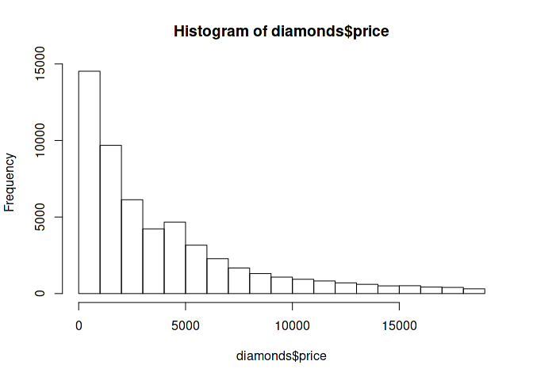

ggplot2
=======

``` r
ggplot()
```


1 variable continuous
---------------------

``` r
ggplot(data = diamonds, mapping = aes(x = price)) + geom_histogram()
```

    ## `stat_bin()` using `bins = 30`. Pick better value with `binwidth`.

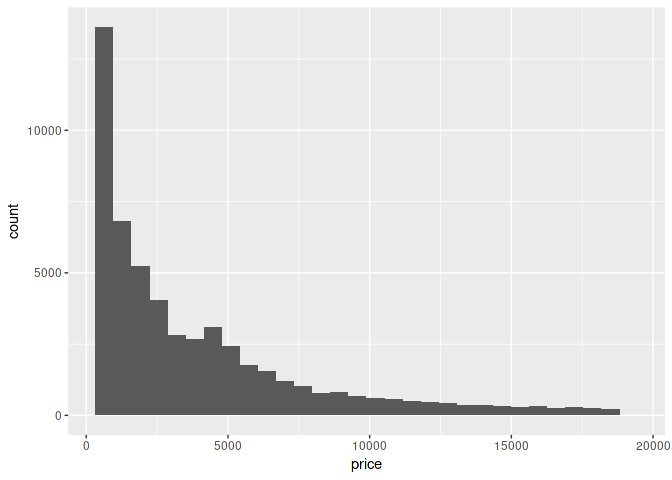

``` r
ggplot(data = diamonds, mapping = aes(x = price)) + geom_density()
```

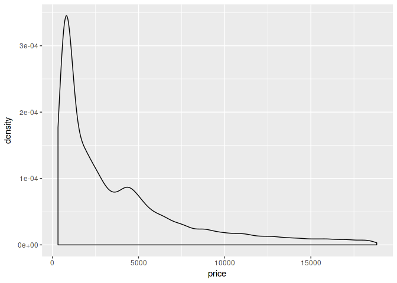

1 variable discrete
-------------------

``` r
ggplot(data = diamonds, mapping = aes(x = cut)) + geom_bar()
```

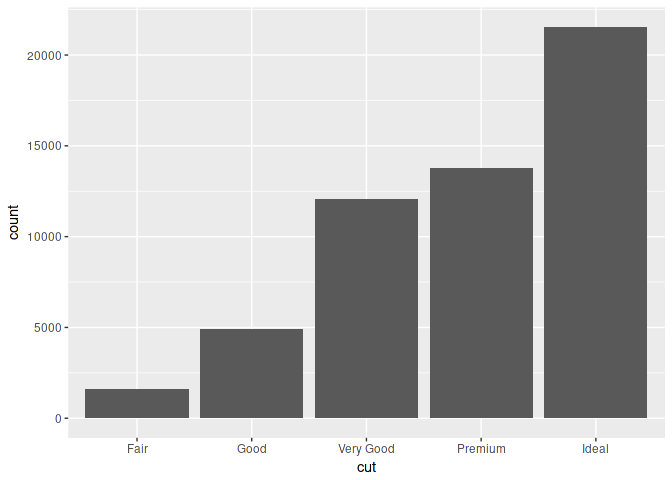

2 variables discrete/continuous
-------------------------------

``` r
ggplot(diamonds, aes(x = cut, y = price)) + geom_boxplot()
```

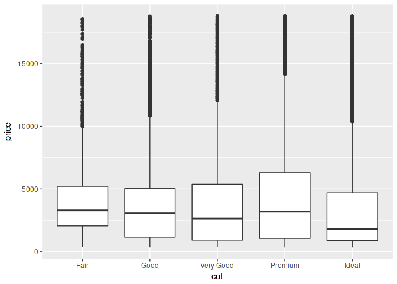

``` r
ggplot(diamonds, aes(x = cut, y = price)) + geom_violin()
```

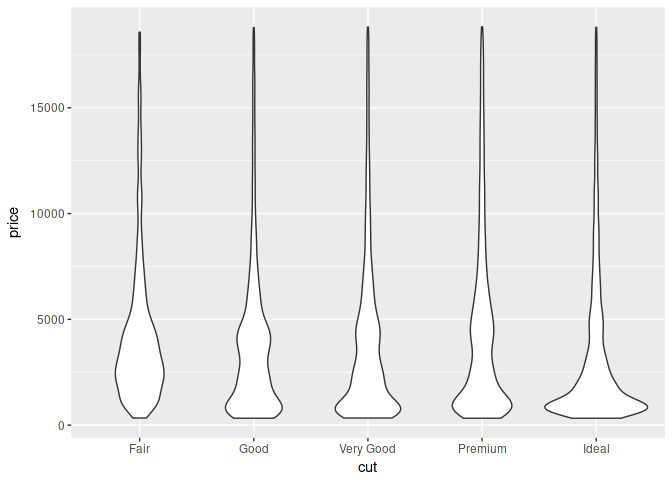

2 variables continuous/continuous
---------------------------------

``` r
ggplot(diamonds, aes(x = carat, y = price)) + geom_point()
```

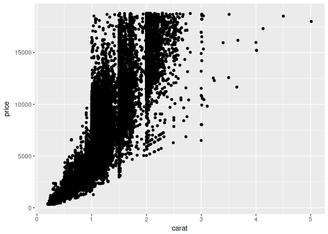

Layering in ggplot
------------------

``` r
ggplot(diamonds) +
  geom_point(aes(x = carat, y = price)) +
  geom_hline(yintercept = 10000)
```

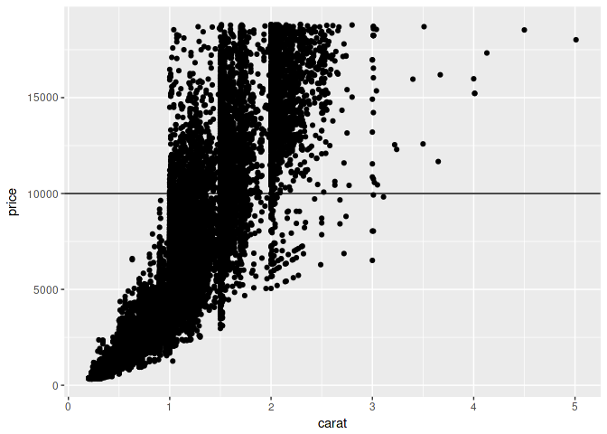

Colors
------

``` r
ggplot(diamonds, aes(x = carat, y = price)) + geom_point(color = "blue")
```

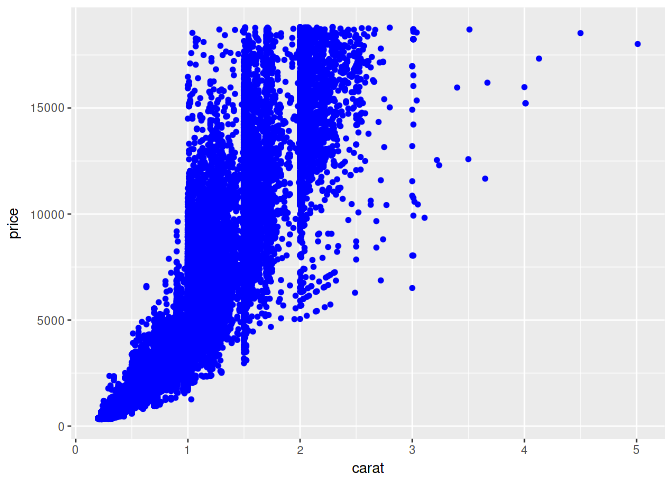

``` r
ggplot(diamonds, aes(x = carat, y = price, color = color)) + geom_point()
```


Facet wrap
----------

``` r
ggplot(diamonds, aes(x = carat, y = price, color = color)) +
  geom_point() +
  facet_wrap(~cut)
```

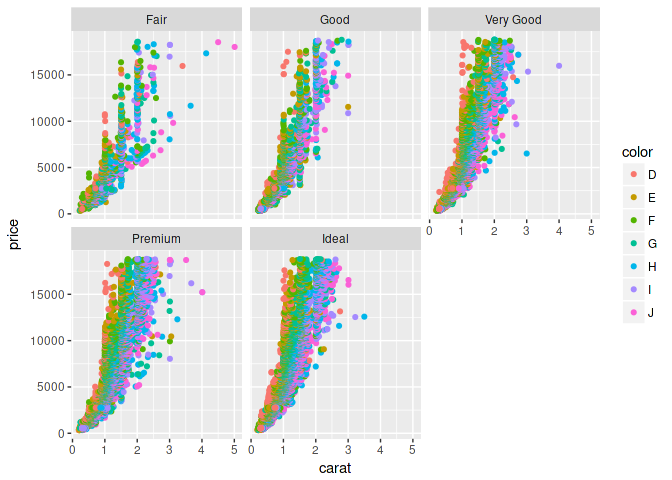

Facet grid
----------

``` r
ggplot(diamonds, aes(x = carat, y = price, color = color)) +
  geom_point() +
  facet_grid(clarity~cut)
```

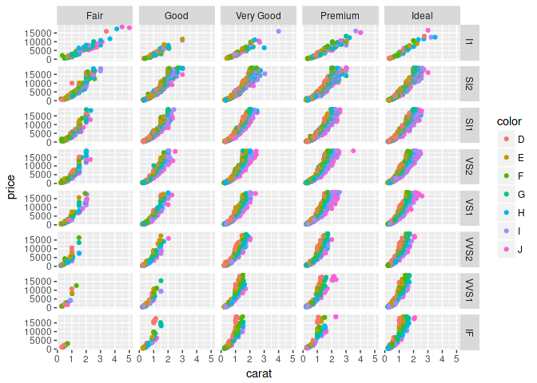

Saving ggplots as a variable
----------------------------

``` r
g <- ggplot(diamonds, aes(x = carat, y = price, color = color)) +
  geom_point()
g
```

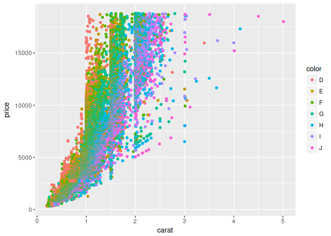

``` r
g + facet_grid(clarity ~ cut)
```


Alpha transparency
------------------

``` r
ggplot(diamonds, aes(x = carat, y = price, color = color)) + geom_point(alpha = .1)
```

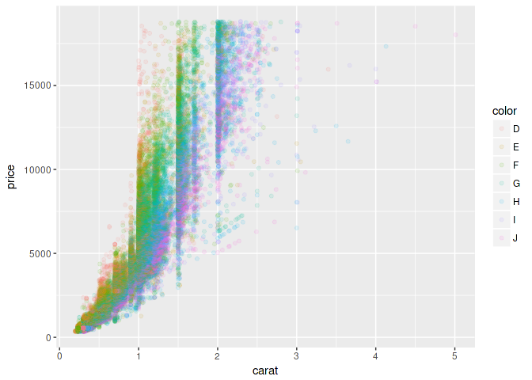

Hexbin
------

``` r
ggplot(diamonds, aes(x = carat, y = price, fill = color)) + geom_hex()
```

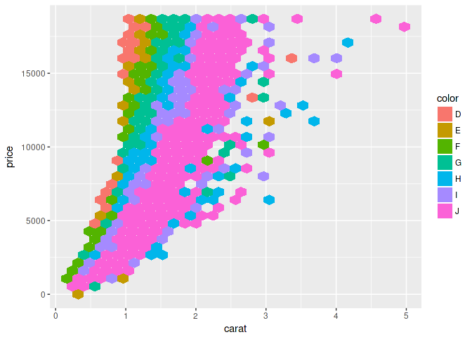

Themes
======

``` r
library(ggthemes)

g + theme_bw()
```

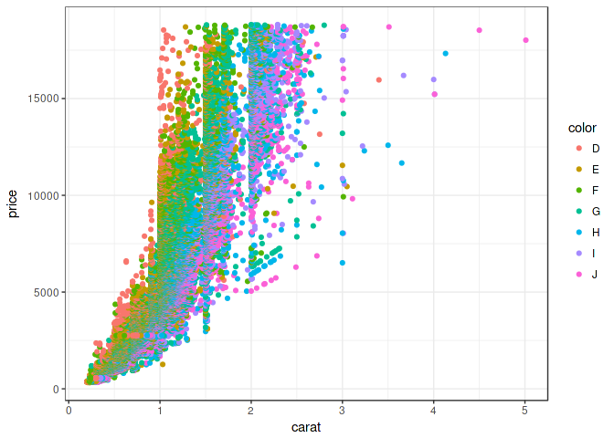

``` r
g + theme_minimal()
```

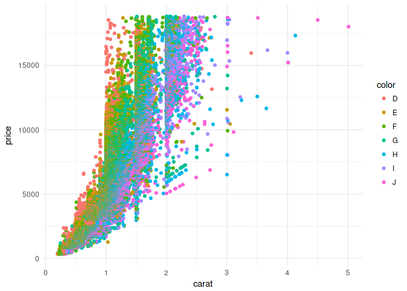

``` r
g + theme_economist()
```

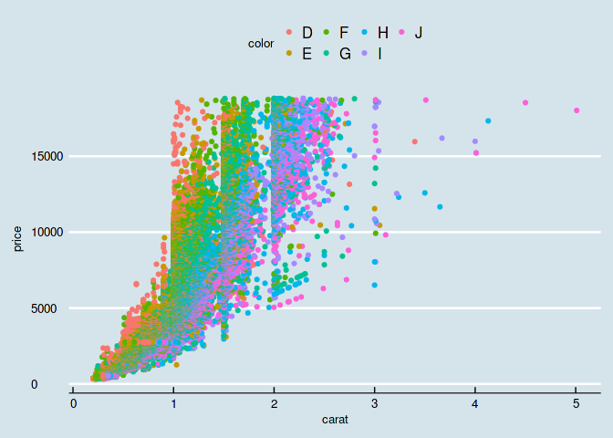

``` r
g + theme_wsj()
```

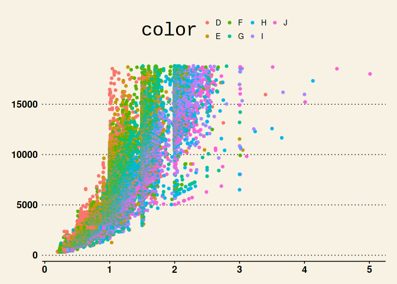

``` r
g + theme_excel()
```

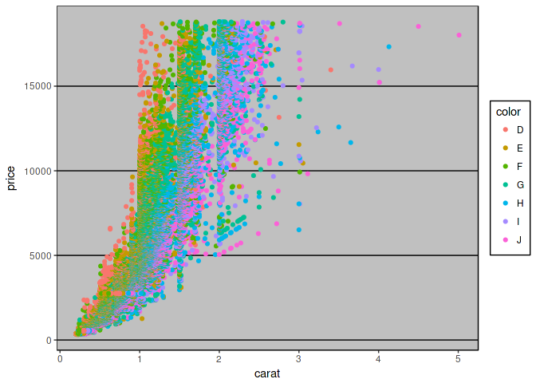
