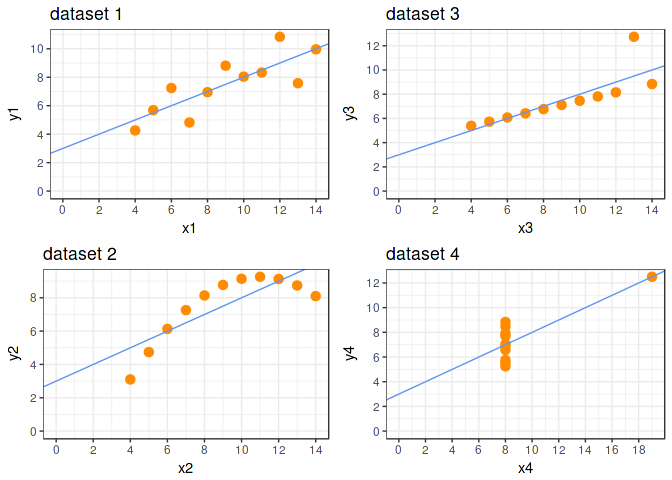
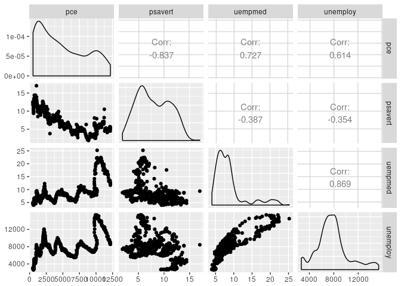

-   [Basic Statistics](#basic-statistics)
    -   [Summary Statistics](#summary-statistics)
    -   [Correlation](#correlation)
    -   [Covariance](#covariance)

> The fact that data science exists as a field is a colossal failure of statistics. To me, that is what statistics is all about. It is gaining insight from data using modelling and visualization. Data munging and manipulation is hard and statistics has just said that’s not our domain.”

-   Hadley Wickham, PhD

<https://priceonomics.com/hadley-wickham-the-man-who-revolutionized-r/>

``` r
diamonds <- ggplot2::diamonds
economics <- ggplot2::economics
```

Basic Statistics
================

Summary Statistics
------------------

``` r
summary(diamonds$price)
```

    ##    Min. 1st Qu.  Median    Mean 3rd Qu.    Max. 
    ##     326     950    2401    3933    5324   18823

``` r
summary(diamonds)
```

    ##      carat               cut        color        clarity     
    ##  Min.   :0.2000   Fair     : 1610   D: 6775   SI1    :13065  
    ##  1st Qu.:0.4000   Good     : 4906   E: 9797   VS2    :12258  
    ##  Median :0.7000   Very Good:12082   F: 9542   SI2    : 9194  
    ##  Mean   :0.7979   Premium  :13791   G:11292   VS1    : 8171  
    ##  3rd Qu.:1.0400   Ideal    :21551   H: 8304   VVS2   : 5066  
    ##  Max.   :5.0100                     I: 5422   VVS1   : 3655  
    ##                                     J: 2808   (Other): 2531  
    ##      depth           table           price             x         
    ##  Min.   :43.00   Min.   :43.00   Min.   :  326   Min.   : 0.000  
    ##  1st Qu.:61.00   1st Qu.:56.00   1st Qu.:  950   1st Qu.: 4.710  
    ##  Median :61.80   Median :57.00   Median : 2401   Median : 5.700  
    ##  Mean   :61.75   Mean   :57.46   Mean   : 3933   Mean   : 5.731  
    ##  3rd Qu.:62.50   3rd Qu.:59.00   3rd Qu.: 5324   3rd Qu.: 6.540  
    ##  Max.   :79.00   Max.   :95.00   Max.   :18823   Max.   :10.740  
    ##                                                                  
    ##        y                z         
    ##  Min.   : 0.000   Min.   : 0.000  
    ##  1st Qu.: 4.720   1st Qu.: 2.910  
    ##  Median : 5.710   Median : 3.530  
    ##  Mean   : 5.735   Mean   : 3.539  
    ##  3rd Qu.: 6.540   3rd Qu.: 4.040  
    ##  Max.   :58.900   Max.   :31.800  
    ## 

``` r
mean(diamonds$price)
```

    ## [1] 3932.8

``` r
sd(diamonds$price)
```

    ## [1] 3989.44

``` r
quantile(diamonds$price, probs = 0.25)
```

    ## 25% 
    ## 950

Correlation
-----------

$$
r\_{xy} = \\dfrac{\\sum\_{i = 1}^n (x\_i - \\bar{x}) (y\_i - \\bar{y})}{(n - 1) s\_x s\_y}
$$

``` r
cor(economics$pce, economics$psavert)
```

    ## [1] -0.837069

``` r
GGally::ggpairs(data = dplyr::select(economics, -date, -pop))
```



``` r
GGally::wrap(
  GGally::ggpairs(data = dplyr::select(economics, -date, -pop)),
  labelSize = 8
)
```

    ## function (data, mapping, ...) 
    ## {
    ##     allParams$data <- data
    ##     allParams$mapping <- mapping
    ##     argsList <- list(...)
    ##     allParams[names(argsList)] <- argsList
    ##     do.call(original_fn, allParams)
    ## }
    ## <environment: 0x55f5a00>
    ## attr(,"class")
    ## [1] "ggmatrix_fn_with_params"
    ## attr(,"name")
    ##  [1] "data"                "plots"               "title"              
    ##  [4] "xlab"                "ylab"                "showStrips"         
    ##  [7] "xAxisLabels"         "yAxisLabels"         "showXAxisPlotLabels"
    ## [10] "showYAxisPlotLabels" "labeller"            "xProportions"       
    ## [13] "yProportions"        "legend"              "gg"                 
    ## [16] "nrow"                "ncol"                "byrow"              
    ## attr(,"params")
    ## attr(,"params")$labelSize
    ## [1] 8
    ## 
    ## attr(,"fn")



Covariance
----------

$$
cov(X, Y) = \\dfrac{1}{N - 1} \\sum\_{i = 1}^N (x\_i - \\bar{x})(y\_i - \\bar{y})
$$

``` r
cov(economics$pce, economics$psavert)
```

    ## [1] -9361.028

``` r
identical(
  cov(economics$pce, economics$psavert),
  cor(economics$pce, economics$psavert) *
    sd(economics$pce) *
    sd(economics$psavert)
)
```

    ## [1] TRUE
