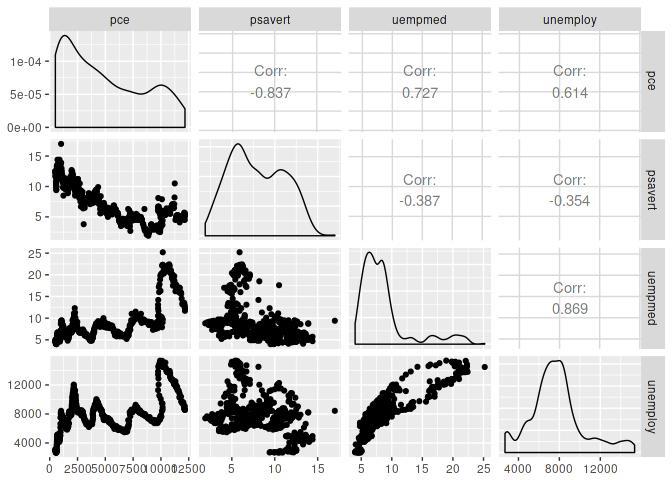

-   [Introducetion](#introducetion)
    -   [](#section)
-   [Summary Statistics](#summary-statistics)
    -   [Correlation](#correlation)
    -   [Covariance](#covariance)
-   [Linear Models](#linear-models)

> The fact that data science exists as a field is a colossal failure of statistics. To me, that is what statistics is all about. It is gaining insight from data using modelling and visualization. Data munging and manipulation is hard and statistics has just said that’s not our domain.”

-   Hadley Wickham, PhD

<https://priceonomics.com/hadley-wickham-the-man-who-revolutionized-r/>

``` r
diamonds <- ggplot2::diamonds
economics <- ggplot2::economics
```

Introducetion
=============

Understanding your dataset is more important than fitting a model and calling it a day.

<https://rpubs.com/neilfws/91339>

``` r
data(anscombe)
summary(anscombe)
```

    ##        x1             x2             x3             x4    
    ##  Min.   : 4.0   Min.   : 4.0   Min.   : 4.0   Min.   : 8  
    ##  1st Qu.: 6.5   1st Qu.: 6.5   1st Qu.: 6.5   1st Qu.: 8  
    ##  Median : 9.0   Median : 9.0   Median : 9.0   Median : 8  
    ##  Mean   : 9.0   Mean   : 9.0   Mean   : 9.0   Mean   : 9  
    ##  3rd Qu.:11.5   3rd Qu.:11.5   3rd Qu.:11.5   3rd Qu.: 8  
    ##  Max.   :14.0   Max.   :14.0   Max.   :14.0   Max.   :19  
    ##        y1               y2              y3              y4        
    ##  Min.   : 4.260   Min.   :3.100   Min.   : 5.39   Min.   : 5.250  
    ##  1st Qu.: 6.315   1st Qu.:6.695   1st Qu.: 6.25   1st Qu.: 6.170  
    ##  Median : 7.580   Median :8.140   Median : 7.11   Median : 7.040  
    ##  Mean   : 7.501   Mean   :7.501   Mean   : 7.50   Mean   : 7.501  
    ##  3rd Qu.: 8.570   3rd Qu.:8.950   3rd Qu.: 7.98   3rd Qu.: 8.190  
    ##  Max.   :10.840   Max.   :9.260   Max.   :12.74   Max.   :12.500

``` r
sapply(1:4, function(x) cor(anscombe[, x], anscombe[, x+4]))
```

    ## [1] 0.8164205 0.8162365 0.8162867 0.8165214

``` r
sapply(5:8, function(x) var(anscombe[, x]))
```

    ## [1] 4.127269 4.127629 4.122620 4.123249

``` r
lm(y1 ~ x1, data = anscombe)
```

    ## 
    ## Call:
    ## lm(formula = y1 ~ x1, data = anscombe)
    ## 
    ## Coefficients:
    ## (Intercept)           x1  
    ##      3.0001       0.5001

``` r
library(ggplot2)
library(gridExtra)

p1 <- ggplot(anscombe) +
  geom_point(aes(x1, y1), color = "darkorange", size = 3) +
  theme_bw() +
  scale_x_continuous(breaks = seq(0, 20, 2)) +
  scale_y_continuous(breaks = seq(0, 12, 2)) +
  geom_abline(intercept = 3, slope = 0.5, color = "cornflowerblue") +
  expand_limits(x = 0, y = 0) +
  labs(title = "dataset 1")

p2 <- ggplot(anscombe) +
  geom_point(aes(x2, y2), color = "darkorange", size = 3) +
  theme_bw() +
  scale_x_continuous(breaks = seq(0, 20, 2)) +
  scale_y_continuous(breaks = seq(0, 12, 2)) +
  geom_abline(intercept = 3, slope = 0.5, color = "cornflowerblue") +
  expand_limits(x = 0, y = 0) +
  labs(title = "dataset 2")

p3 <- ggplot(anscombe) +
  geom_point(aes(x3, y3), color = "darkorange", size = 3) +
  theme_bw() +
  scale_x_continuous(breaks = seq(0, 20, 2)) +
  scale_y_continuous(breaks = seq(0, 12, 2)) +
  geom_abline(intercept = 3, slope = 0.5, color = "cornflowerblue") +
  expand_limits(x = 0, y = 0) +
  labs(title = "dataset 3")

p4 <- ggplot(anscombe) +
  geom_point(aes(x4, y4), color = "darkorange", size = 3) +
  theme_bw() +
  scale_x_continuous(breaks = seq(0, 20, 2)) +
  scale_y_continuous(breaks = seq(0, 12, 2)) +
  geom_abline(intercept = 3, slope = 0.5, color = "cornflowerblue") +
  expand_limits(x = 0, y = 0) +
  labs(title = "dataset 4")

sdalr::multiplot(p1, p2, p3, p4, cols = 2)
```


``` r
data("anscombosaurus", package = 'sdalr')

summary(anscombosaurus)
```

    ##        x               y         
    ##  Min.   :22.31   Min.   : 2.949  
    ##  1st Qu.:44.10   1st Qu.:25.288  
    ##  Median :53.33   Median :46.026  
    ##  Mean   :54.26   Mean   :47.832  
    ##  3rd Qu.:64.74   3rd Qu.:68.526  
    ##  Max.   :98.21   Max.   :99.487

Summary Statistics
==================

``` r
summary(diamonds$price)
```

    ##    Min. 1st Qu.  Median    Mean 3rd Qu.    Max. 
    ##     326     950    2401    3933    5324   18823

``` r
summary(diamonds)
```

    ##      carat               cut        color        clarity     
    ##  Min.   :0.2000   Fair     : 1610   D: 6775   SI1    :13065  
    ##  1st Qu.:0.4000   Good     : 4906   E: 9797   VS2    :12258  
    ##  Median :0.7000   Very Good:12082   F: 9542   SI2    : 9194  
    ##  Mean   :0.7979   Premium  :13791   G:11292   VS1    : 8171  
    ##  3rd Qu.:1.0400   Ideal    :21551   H: 8304   VVS2   : 5066  
    ##  Max.   :5.0100                     I: 5422   VVS1   : 3655  
    ##                                     J: 2808   (Other): 2531  
    ##      depth           table           price             x         
    ##  Min.   :43.00   Min.   :43.00   Min.   :  326   Min.   : 0.000  
    ##  1st Qu.:61.00   1st Qu.:56.00   1st Qu.:  950   1st Qu.: 4.710  
    ##  Median :61.80   Median :57.00   Median : 2401   Median : 5.700  
    ##  Mean   :61.75   Mean   :57.46   Mean   : 3933   Mean   : 5.731  
    ##  3rd Qu.:62.50   3rd Qu.:59.00   3rd Qu.: 5324   3rd Qu.: 6.540  
    ##  Max.   :79.00   Max.   :95.00   Max.   :18823   Max.   :10.740  
    ##                                                                  
    ##        y                z         
    ##  Min.   : 0.000   Min.   : 0.000  
    ##  1st Qu.: 4.720   1st Qu.: 2.910  
    ##  Median : 5.710   Median : 3.530  
    ##  Mean   : 5.735   Mean   : 3.539  
    ##  3rd Qu.: 6.540   3rd Qu.: 4.040  
    ##  Max.   :58.900   Max.   :31.800  
    ## 

``` r
mean(diamonds$price)
```

    ## [1] 3932.8

``` r
sd(diamonds$price)
```

    ## [1] 3989.44

``` r
quantile(diamonds$price, probs = 0.25)
```

    ## 25% 
    ## 950

Correlation
-----------

$$
r\_{xy} = \\dfrac{\\sum\_{i = 1}^n (x\_i - \\bar{x}) (y\_i - \\bar{y})}{(n - 1) s\_x s\_y}
$$

``` r
cor(economics$pce, economics$psavert)
```

    ## [1] -0.837069

``` r
GGally::ggpairs(data = dplyr::select(economics, -date, -pop))
```



``` r
GGally::wrap(
  GGally::ggpairs(data = dplyr::select(economics, -date, -pop)),
  labelSize = 8
)
```

    ## function (data, mapping, ...) 
    ## {
    ##     allParams$data <- data
    ##     allParams$mapping <- mapping
    ##     argsList <- list(...)
    ##     allParams[names(argsList)] <- argsList
    ##     do.call(original_fn, allParams)
    ## }
    ## <environment: 0x42b63c0>
    ## attr(,"class")
    ## [1] "ggmatrix_fn_with_params"
    ## attr(,"name")
    ##  [1] "data"                "plots"               "title"              
    ##  [4] "xlab"                "ylab"                "showStrips"         
    ##  [7] "xAxisLabels"         "yAxisLabels"         "showXAxisPlotLabels"
    ## [10] "showYAxisPlotLabels" "labeller"            "xProportions"       
    ## [13] "yProportions"        "legend"              "gg"                 
    ## [16] "nrow"                "ncol"                "byrow"              
    ## attr(,"params")
    ## attr(,"params")$labelSize
    ## [1] 8
    ## 
    ## attr(,"fn")


Covariance
----------

$$
cov(X, Y) = \\dfrac{1}{N - 1} \\sum\_{i = 1}^N (x\_i - \\bar{x})(y\_i - \\bar{y})
$$

``` r
cov(economics$pce, economics$psavert)
```

    ## [1] -9361.028

``` r
identical(
  cov(economics$pce, economics$psavert),
  cor(economics$pce, economics$psavert) *
    sd(economics$pce) *
    sd(economics$psavert)
)
```

    ## [1] TRUE

Linear Models
=============

``` r
data(diamonds, package = 'ggplot2')
```

``` r
head(diamonds)
```

    ## # A tibble: 6 × 10
    ##   carat       cut color clarity depth table price     x     y     z
    ##   <dbl>     <ord> <ord>   <ord> <dbl> <dbl> <int> <dbl> <dbl> <dbl>
    ## 1  0.23     Ideal     E     SI2  61.5    55   326  3.95  3.98  2.43
    ## 2  0.21   Premium     E     SI1  59.8    61   326  3.89  3.84  2.31
    ## 3  0.23      Good     E     VS1  56.9    65   327  4.05  4.07  2.31
    ## 4  0.29   Premium     I     VS2  62.4    58   334  4.20  4.23  2.63
    ## 5  0.31      Good     J     SI2  63.3    58   335  4.34  4.35  2.75
    ## 6  0.24 Very Good     J    VVS2  62.8    57   336  3.94  3.96  2.48

``` r
glm(formula = price ~ carat, data = diamonds)
```

    ## 
    ## Call:  glm(formula = price ~ carat, data = diamonds)
    ## 
    ## Coefficients:
    ## (Intercept)        carat  
    ##       -2256         7756  
    ## 
    ## Degrees of Freedom: 53939 Total (i.e. Null);  53938 Residual
    ## Null Deviance:       8.585e+11 
    ## Residual Deviance: 1.293e+11     AIC: 945500

``` r
glm(formula = price ~ carat + depth + table + x + y + z, data = diamonds)
```

    ## 
    ## Call:  glm(formula = price ~ carat + depth + table + x + y + z, data = diamonds)
    ## 
    ## Coefficients:
    ## (Intercept)        carat        depth        table            x  
    ##    20849.32     10686.31      -203.15      -102.45     -1315.67  
    ##           y            z  
    ##       66.32        41.63  
    ## 
    ## Degrees of Freedom: 53939 Total (i.e. Null);  53933 Residual
    ## Null Deviance:       8.585e+11 
    ## Residual Deviance: 1.209e+11     AIC: 941800

``` r
m <- glm(formula = price ~ carat + depth + table + x + y + z, data = diamonds)
summary(m)
```

    ## 
    ## Call:
    ## glm(formula = price ~ carat + depth + table + x + y + z, data = diamonds)
    ## 
    ## Deviance Residuals: 
    ##      Min        1Q    Median        3Q       Max  
    ## -23878.2    -615.0     -50.7     347.9   12759.2  
    ## 
    ## Coefficients:
    ##              Estimate Std. Error t value Pr(>|t|)    
    ## (Intercept) 20849.316    447.562  46.584  < 2e-16 ***
    ## carat       10686.309     63.201 169.085  < 2e-16 ***
    ## depth        -203.154      5.504 -36.910  < 2e-16 ***
    ## table        -102.446      3.084 -33.216  < 2e-16 ***
    ## x           -1315.668     43.070 -30.547  < 2e-16 ***
    ## y              66.322     25.523   2.599  0.00937 ** 
    ## z              41.628     44.305   0.940  0.34744    
    ## ---
    ## Signif. codes:  0 '***' 0.001 '**' 0.01 '*' 0.05 '.' 0.1 ' ' 1
    ## 
    ## (Dispersion parameter for gaussian family taken to be 2240873)
    ## 
    ##     Null deviance: 8.5847e+11  on 53939  degrees of freedom
    ## Residual deviance: 1.2086e+11  on 53933  degrees of freedom
    ## AIC: 941815
    ## 
    ## Number of Fisher Scoring iterations: 2

``` r
library(broom)

broom::tidy(m)
```

    ##          term   estimate  std.error   statistic       p.value
    ## 1 (Intercept) 20849.3164 447.561823  46.5842155  0.000000e+00
    ## 2       carat 10686.3091  63.200807 169.0850101  0.000000e+00
    ## 3       depth  -203.1541   5.503984 -36.9103634 1.508901e-294
    ## 4       table  -102.4457   3.084213 -33.2161394 1.663814e-239
    ## 5           x -1315.6678  43.070264 -30.5470111 3.378404e-203
    ## 6           y    66.3216  25.523021   2.5985013  9.365715e-03
    ## 7           z    41.6277  44.304632   0.9395789  3.474378e-01

``` r
broom::augment(m)
```

    ##       price carat depth table     x     y     z       .fitted     .se.fit
    ## 1       326  0.23  61.5  55.0  3.95  3.98  2.43  3.469097e+02   17.436144
    ## 2       326  0.21  59.8  61.0  3.89  3.84  2.31 -7.146876e+01   22.507319
    ## 3       327  0.23  56.9  65.0  4.05  4.07  2.31  1.263687e+02   33.738736
    ## 4       334  0.29  62.4  58.0  4.20  4.23  2.63  1.939016e+02   13.926395
    ## 5       335  0.31  63.3  58.0  4.34  4.35  2.75  5.354959e+01   13.962939
    ## 6       336  0.24  62.8  57.0  3.94  3.96  2.48 -1.307132e+00   16.653866
    ## 7       336  0.24  62.3  57.0  3.95  3.98  2.47  8.802337e+01   16.255941
    ## 8       337  0.26  61.9  55.0  4.07  4.11  2.53  4.411418e+02   15.793591
    ## 9       337  0.22  65.1  61.0  3.87  3.78  2.49 -1.011495e+03   27.761389
    ## 10      338  0.23  59.4  61.0  4.00  4.05  2.39  9.605333e+01   22.100913
    ## 11      339  0.30  64.0  55.0  4.25  4.28  2.73  2.247507e+02   15.652996
    ## 12      340  0.23  62.8  56.0  3.93  3.90  2.46  2.620257e+00   16.518171
    ## 13      342  0.22  60.4  61.0  3.88  3.84  2.33 -7.250887e+01   22.087629
    ## 14      344  0.31  62.2  54.0  4.35  4.37  2.71  6.733063e+02   14.274942
    ## 15      345  0.20  60.2  62.0  3.79  3.75  2.27 -2.381064e+02   24.854773
    ## 16      345  0.32  60.9  58.0  4.38  4.42  2.68  5.970843e+02   12.558375
    ## 17      348  0.30  62.0  54.0  4.31  4.34  2.68  6.564623e+02   14.676842
    ## 18      351  0.30  63.4  54.0  4.23  4.29  2.70  4.748165e+02   15.814891
    ## 19      351  0.30  63.8  56.0  4.23  4.26  2.71  1.870902e+02   15.116848
    ## 20      351  0.30  62.7  59.0  4.21  4.27  2.66  1.281179e+02   15.650532
    ## 21      351  0.30  63.3  56.0  4.26  4.30  2.71  2.518500e+02   13.690997
    ## 22      352  0.23  63.8  55.0  3.85  3.92  2.48  9.324270e+00   19.200449
    ## 23      353  0.23  61.0  57.0  3.94  3.96  2.41  2.545931e+02   17.230603
    ## 24      353  0.31  59.4  62.0  4.39  4.43  2.62  3.701785e+02   20.280304
    ## 25      353  0.31  58.1  62.0  4.44  4.47  2.59  5.698994e+02   23.019406
    ## 26      354  0.23  60.4  58.0  3.97  4.01  2.41  2.378860e+02   17.890451
    ## 27      355  0.24  62.5  57.0  3.97  3.94  2.47  1.842634e+01   15.994983
    ## 28      357  0.30  62.2  57.0  4.28  4.30  2.67  3.448954e+02   12.222466
    ## 29      357  0.23  60.5  61.0  3.96  3.97  2.40 -7.967887e+01   20.836996
    ## 30      357  0.23  60.9  57.0  3.96  3.99  2.42  2.510011e+02   16.995940
    ## 31      402  0.23  60.0  57.0  4.00  4.03  2.41  3.834496e+02   18.393704
    ## 32      402  0.23  59.8  57.0  4.04  4.06  2.42  3.738596e+02   18.244465
    ## 33      402  0.23  60.7  59.0  3.97  4.01  2.42  7.491037e+01   17.866972
    ## 34      402  0.23  59.5  58.0  4.01  4.06  2.40  3.709977e+02   19.554921
    ## 35      402  0.23  61.9  58.0  3.92  3.96  2.44 -3.128979e+00   16.960296
    ## 36      402  0.23  58.2  59.0  4.06  4.08  2.37  4.669465e+02   23.266876
    ## 37      402  0.23  64.1  59.0  3.83  3.85  2.46 -4.405663e+02   22.189578
    ## 38      402  0.31  64.0  54.0  4.29  4.31  2.75  3.842549e+02   16.303244
    ## 39      403  0.26  60.8  59.0  4.13  4.16  2.52  1.787884e+02   15.792012
    ## 40      403  0.33  61.8  55.0  4.49  4.51  2.78  6.938539e+02   11.740625
    ## 41      403  0.33  61.2  56.0  4.49  4.50  2.75  7.113887e+02   11.253052
    ## 42      403  0.33  61.1  56.0  4.49  4.55  2.76  7.354364e+02   11.493979
    ## 43      403  0.26  65.2  56.0  3.99  4.02  2.61 -2.290975e+02   21.120730
    ## 44      403  0.26  58.4  63.0  4.19  4.24  2.46  1.804435e+02   25.541641
    ## 45      403  0.32  63.1  56.0  4.34  4.37  2.75  4.072612e+02   12.766069
    ## 46      403  0.29  62.4  58.0  4.24  4.26  2.65  1.440971e+02   13.275247
    ## 47      403  0.32  61.8  55.0  4.35  4.42  2.71  7.623014e+02   13.258132
    ## 48      403  0.32  63.8  56.0  4.36  4.38  2.79  2.410684e+02   14.066083
    ## 49      404  0.25  63.3  60.0  4.00  4.03  2.54 -3.751579e+02   20.056093
    ## 50      404  0.29  60.7  60.0  4.33  4.37  2.64  1.730367e+02   14.972066
    ## 51      404  0.24  60.9  61.0  4.02  4.03  2.45 -1.269568e+02   19.754793
    ## 52      404  0.23  61.9  54.0  3.93  3.95  2.44  3.928337e+02   18.548599
    ## 53      404  0.32  60.9  55.0  4.45  4.48  2.72  8.179689e+02   13.572076
    ## 54      404  0.22  61.6  58.0  3.93  3.89  2.41 -6.809388e+01   16.587252
    ## 55      404  0.22  59.3  62.0  3.91  3.88  2.31  1.086521e+01   24.887694
    ## 56      405  0.30  61.0  59.0  4.30  4.33  2.63  3.578001e+02   13.903590
    ## 57      405  0.30  59.3  61.0  4.43  4.38  2.61  3.297174e+02   18.201369
    ## 58      405  0.30  62.6  57.0  4.25  4.28  2.67  3.017774e+02   12.947706
    ## 59      405  0.30  63.0  57.0  4.28  4.32  2.71  1.853637e+02   13.023695
    ## 60      405  0.30  63.2  55.0  4.25  4.29  2.70  3.866883e+02   14.203435
    ## 61      552  0.35  60.9  57.0  4.54  4.59  2.78  8.250498e+02   10.992028
    ## 62      552  0.30  62.6  59.0  4.23  4.27  2.66  1.221199e+02   15.187402
    ## 63      552  0.30  62.5  57.0  4.29  4.32  2.69  2.729515e+02   12.232906
    ## 64      552  0.30  62.1  56.0  4.30  4.33  2.68  4.437490e+02   12.135424
    ## 65      552  0.42  61.5  59.0  4.78  4.84  2.96  9.546208e+02   10.333395
    ## 66      553  0.28  61.4  56.0  4.19  4.22  2.58  5.054960e+02   14.017070
    ## 67      553  0.32  62.0  55.3  4.39  4.42  2.73  6.391428e+02   12.080393
    ## 68      553  0.31  63.3  57.0  4.33  4.30  2.73  1.650033e+02   13.306746
    ## 69      553  0.31  61.8  58.0  4.35  4.32  2.68  3.402204e+02   11.931012
    ## 70      553  0.24  60.7  58.0  4.01  4.03  2.44  2.337514e+02   16.854559
    ## 71      553  0.24  61.5  60.0  3.97  4.00  2.45 -8.260982e+01   18.692312
    ## 72      554  0.30  63.1  56.0  4.29  4.27  2.70  2.506049e+02   13.044582
    ## 73      554  0.30  62.9  59.0  4.28  4.24  2.68 -5.766775e+00   15.062540
    ## 74      554  0.30  62.5  57.0  4.29  4.25  2.67  2.674764e+02   12.355930
    ## 75      554  0.30  63.7  57.0  4.28  4.26  2.72  3.959283e+01   14.640122
    ## 76      554  0.26  59.2  60.0  4.19  4.22  2.49  3.251796e+02   19.367246
    ## 77      554  0.26  59.9  58.0  4.15  4.23  2.51  4.419856e+02   16.988154
    ## 78      554  0.26  62.4  54.0  4.08  4.13  2.56  4.314290e+02   16.562069
    ## 79      554  0.26  62.8  60.0  4.01  4.05  2.53 -1.789643e+02   19.373580
    ## 80      554  0.26  62.6  59.0  4.06  4.09  2.55 -9.818584e+01   16.713989
    ## 81      554  0.26  63.4  59.0  4.00  4.04  2.55 -1.850851e+02   18.902448
    ## 82      554  0.26  62.1  60.0  4.03  4.12  2.53 -5.842733e+01   18.478927
    ## 83      554  0.26  62.9  58.0  4.02  4.06  2.54 -6.465613e+00   16.595937
    ## 84      554  0.38  61.6  56.0  4.65  4.67  2.87  9.702056e+02    9.846212
    ## 85      554  0.26  57.9  60.0  4.22  4.25  2.45  5.501344e+02   23.260103
    ## 86      554  0.24  62.3  59.0  3.95  3.92  2.45 -1.216798e+02   17.829063
    ## 87      554  0.24  61.2  58.0  4.01  3.96  2.44  1.275318e+02   16.175643
    ## 88      554  0.24  60.8  59.0  4.02  4.00  2.44  9.584400e+01   17.143570
    ## 89      554  0.24  60.7  58.0  4.07  4.04  2.46  1.563071e+02   15.736255
    ## 90      554  0.32  62.9  58.0  4.35  4.33  2.73  2.263586e+02   13.196225
    ## 91     2757  0.70  62.5  57.0  5.70  5.72  3.57  2.821866e+03    9.588896
    ## 92     2757  0.86  55.1  69.0  6.45  6.33  3.52  3.857292e+03   40.899604
    ## 93     2757  0.70  61.6  56.0  5.70  5.67  3.50  3.100920e+03    9.500767
    ## 94     2759  0.71  62.4  57.0  5.68  5.73  3.56  2.975605e+03    8.761657
    ## 95     2759  0.78  63.8  56.0  5.81  5.85  3.72  3.385259e+03   12.686443
    ## 96     2759  0.70  57.5  58.0  5.85  5.90  3.38  3.541869e+03   21.149740
    ## 97     2759  0.70  59.4  62.0  5.71  5.76  3.40  2.921835e+03   16.810395
    ## 98     2759  0.96  66.3  62.0  6.27  5.95  4.07  3.602230e+03   31.599158
    ## 99     2760  0.73  61.6  59.0  5.77  5.78  3.56  3.031869e+03    9.517380
    ## 100    2760  0.80  61.5  58.0  5.97  5.93  3.66  3.653649e+03    8.984953
    ## 101    2760  0.75  63.2  56.0  5.80  5.75  3.65  3.190172e+03   11.516681
    ## 102    2760  0.75  59.9  54.0  6.00  5.96  3.58  3.813352e+03   18.857186
    ## 103    2760  0.74  61.6  55.0  5.80  5.85  3.59  3.514936e+03   11.427650
    ## 104    2760  0.75  61.7  58.0  5.85  5.79  3.59  3.224384e+03    9.147715
    ## 105    2760  0.80  62.9  56.0  5.94  5.87  3.72  3.612113e+03   11.164617
    ## 106    2760  0.75  62.2  55.0  5.87  5.80  3.63  3.406159e+03   12.182941
    ## 107    2760  0.80  63.0  59.0  5.90  5.81  3.69  3.331859e+03   12.334786
    ## 108    2761  0.74  62.3  55.0  5.77  5.81  3.61  3.410378e+03   11.008803
    ## 109    2761  0.81  58.8  57.0  6.14  6.11  3.60  4.197250e+03   17.338552
    ## 110    2761  0.59  62.0  55.0  5.38  5.43  3.35  2.345463e+03   10.516456
    ## 111    2761  0.80  61.4  57.0  5.96  6.00  3.67  3.794626e+03    8.969427
    ## 112    2761  0.74  62.2  56.0  5.80  5.84  3.62  3.291183e+03    9.823297
    ## 113    2761  0.90  63.0  58.0  6.16  6.12  3.87  4.188915e+03   11.288212
    ## 114    2762  0.74  62.2  59.0  5.73  5.82  3.59  3.073368e+03   10.033923
    ## 115    2762  0.73  62.6  56.0  5.77  5.74  3.60  3.135064e+03   10.285910
    ## 116    2762  0.73  62.7  53.0  5.80  5.75  3.62  3.384111e+03   16.244560
    ## 117    2762  0.80  61.7  58.0  5.98  5.94  3.68  3.601357e+03    9.286508
    ## 118    2762  0.71  62.4  54.0  5.72  5.76  3.58  3.233137e+03   13.323012
    ## 119    2762  0.70  60.7  58.0  5.73  5.76  3.49  3.044950e+03    9.476264
    ## 120    2762  0.80  59.9  59.0  6.01  6.07  3.62  3.831243e+03   12.067230
    ## 121    2762  0.71  62.3  56.0  5.73  5.69  3.56  3.029930e+03    9.936839
    ## 122    2762  0.74  62.3  54.0  5.80  5.83  3.62  3.475096e+03   13.427494
    ## 123    2762  0.70  61.7  63.0  5.64  5.61  3.47  2.437197e+03   18.791151
    ## 124    2762  0.70  64.5  57.0  5.57  5.53  3.58  2.574410e+03   15.134638
    ## 125    2762  0.70  65.3  55.0  5.63  5.58  3.66  2.544484e+03   18.958132
    ## 126    2762  0.70  61.6  60.0  5.65  5.59  3.46  2.749950e+03   10.988802
    ## 127    2763  0.91  61.4  56.0  6.09  5.97  3.70  4.900788e+03    9.607930
    ## 128    2763  0.61  59.6  57.0  5.56  5.58  3.32  2.613747e+03   13.364495
    ## 129    2763  0.91  64.4  57.0  6.11  6.09  3.93  4.180099e+03   15.063461
    ## 130    2763  0.91  65.7  60.0  6.03  5.99  3.95  3.708116e+03   23.699924
    ## 131    2763  0.77  62.0  56.0  5.89  5.86  3.64  3.536152e+03    9.979775
    ## 132    2764  0.71  63.6  58.0  5.64  5.68  3.60  2.680350e+03   12.686853
    ## 133    2764  0.71  61.9  59.0  5.69  5.72  3.53  2.857222e+03    9.564551
    ## 134    2765  0.70  62.6  60.0  5.62  5.65  3.53  2.593160e+03   12.744537
    ## 135    2765  0.77  61.3  60.0  5.88  5.90  3.61  3.283138e+03   11.201891
    ## 136    2765  0.63  60.9  60.0  5.52  5.55  3.37  2.308754e+03   11.214601
    ## 137    2765  0.71  60.1  62.0  5.74  5.77  3.46  2.850181e+03   15.921869
    ## 138    2765  0.71  61.8  59.0  5.69  5.73  3.53  2.878200e+03    9.452518
    ## 139    2765  0.76  61.2  57.0  5.88  5.91  3.61  3.504591e+03    9.264849
    ## 140    2766  0.64  61.9  56.0  5.53  5.56  3.43  2.612250e+03    9.102419
    ## 141    2766  0.71  60.9  57.0  5.78  5.75  3.51  3.148014e+03    9.880509
    ## 142    2766  0.71  59.8  56.0  5.89  5.81  3.50  3.332769e+03   15.254604
    ## 143    2767  0.70  61.8  55.0  5.68  5.72  3.52  3.193197e+03   10.930225
    ## 144    2767  0.70  60.0  57.0  5.80  5.87  3.50  3.205219e+03   12.533376
    ## 145    2767  0.71  61.6  55.0  5.74  5.76  3.54  3.265236e+03   11.468739
    ## 146    2767  0.70  62.1  64.0  5.62  5.65  3.50  2.283705e+03   22.309586
    ## 147    2768  0.71  63.3  59.0  5.52  5.61  3.52  2.788758e+03   12.409000
    ## 148    2768  0.73  60.2  56.0  5.83  5.87  3.52  3.548985e+03   12.691212
    ## 149    2768  0.70  61.1  58.0  5.66  5.73  3.48  3.053380e+03    8.252417
    ## 150    2768  0.70  60.9  57.0  5.73  5.76  3.50  3.107181e+03    9.480191
    ## 151    2768  0.71  61.7  59.0  5.71  5.67  3.51  2.867391e+03    9.510691
    ## 152    2769  0.74  61.3  56.0  5.82  5.86  3.57  3.446954e+03   10.101284
    ## 153    2770  0.71  62.5  60.0  5.65  5.61  3.52  2.677799e+03   12.441993
    ## 154    2770  0.73  61.4  59.0  5.83  5.76  3.56  2.992233e+03   10.378189
    ## 155    2770  0.76  62.9  57.0  5.79  5.81  3.65  3.272672e+03    9.812929
    ## 156    2770  0.76  62.4  57.0  5.78  5.83  3.62  3.387483e+03    8.468946
    ## 157    2770  0.71  60.7  56.0  5.77  5.80  3.51  3.307563e+03   11.285452
    ## 158    2770  0.73  60.7  58.0  5.87  5.82  3.55  3.187823e+03   10.553734
    ## 159    2770  0.73  61.5  58.0  5.79  5.75  3.55  3.125911e+03    8.748748
    ## 160    2770  0.73  59.9  57.0  5.92  5.89  3.54  3.391235e+03   13.399898
    ## 161    2770  0.73  59.2  59.0  5.92  5.87  3.49  3.325144e+03   14.757514
    ## 162    2771  0.72  60.3  56.0  5.81  5.83  3.51  3.445051e+03   12.430994
    ## 163    2771  0.73  61.7  60.0  5.79  5.82  3.58  2.886280e+03   11.777354
    ## 164    2771  0.71  61.9  57.0  5.73  5.77  3.56  3.014051e+03    8.762317
    ## 165    2771  0.79  61.9  55.0  5.97  5.92  3.68  3.773031e+03   12.184595
    ## 166    2772  0.73  60.4  59.0  5.83  5.89  3.54  3.203177e+03   10.918886
    ## 167    2772  0.80  61.0  57.0  6.01  6.03  3.67  3.812093e+03   10.093127
    ## 168    2772  0.58  61.5  55.0  5.39  5.44  3.33  2.326851e+03   11.108744
    ## 169    2772  0.58  61.7  56.0  5.33  5.37  3.30  2.256823e+03    8.611851
    ## 170    2772  0.71  59.2  61.0  5.80  5.88  3.46  3.063821e+03   15.959286
    ## 171    2773  0.75  61.3  56.0  5.85  5.89  3.60  3.517585e+03   10.220190
    ## 172    2773  0.70  58.0  62.0  5.87  5.78  3.38  2.996238e+03   20.980078
    ## 173    2774  1.17  60.2  61.0  6.83  6.90  4.13  6.516769e+03   14.211130
    ## 174    2774  0.60  61.7  55.0  5.41  5.44  3.35  2.474465e+03   10.625376
    ## 175    2774  0.70  62.7  55.0  5.68  5.74  3.58  3.014183e+03   11.531317
    ## 176    2774  0.83  64.6  54.0  5.85  5.88  3.79  3.914219e+03   16.434282
    ## 177    2775  0.74  61.3  61.0  5.80  5.84  3.57  2.959712e+03   13.436448
    ## 178    2776  0.72  63.7  56.4  5.62  5.69  3.61  2.958204e+03   11.870276
    ## 179    2776  0.71  62.7  58.0  5.74  5.68  3.58  2.730789e+03   10.889516
    ## 180    2776  0.71  62.2  57.0  5.79  5.62  3.55  2.863801e+03   11.101838
    ## 181    2776  0.54  61.6  56.0  5.25  5.27  3.24  1.945810e+03    8.883105
    ## 182    2776  0.54  61.5  57.0  5.24  5.26  3.23  1.875757e+03    7.915177
    ## 183    2776  0.72  61.8  56.0  5.72  5.75  3.55  3.255089e+03    9.076693
    ## 184    2776  0.72  60.7  56.0  5.79  5.82  3.53  3.390272e+03   11.262035
    ## 185    2776  0.72  59.7  60.5  5.80  5.84  3.47  3.118093e+03   13.824819
    ## 186    2776  0.71  60.5  56.0  5.80  5.76  3.50  3.305655e+03   12.161065
    ## 187    2777  0.70  62.7  58.0  5.66  5.73  3.57  2.732080e+03   10.208066
    ## 188    2777  0.71  62.1  58.0  5.67  5.70  3.53  2.944024e+03    8.344090
    ## 189    2777  0.71  62.8  57.0  5.64  5.69  3.56  2.944317e+03    9.232883
    ## 190    2777  0.71  63.8  58.0  5.61  5.64  3.59  2.676120e+03   13.168075
    ## 191    2777  0.71  57.8  60.0  5.87  5.90  3.40  3.357414e+03   19.653952
    ## 192    2777  0.70  62.1  55.0  5.70  5.67  3.53  3.103038e+03   11.191331
    ## 193    2777  0.70  61.1  60.0  5.71  5.64  3.47  2.776320e+03   11.276950
    ## 194    2777  0.70  60.0  59.0  5.79  5.75  3.46  3.003860e+03   11.993683
    ## 195    2777  0.70  61.2  57.0  5.73  5.68  3.49  3.040513e+03    9.183785
    ## 196    2777  0.70  62.7  59.0  5.67  5.63  3.54  2.608596e+03   11.509032
    ## 197    2777  0.70  61.0  57.0  5.73  5.68  3.48  3.080728e+03    9.405178
    ## 198    2777  0.70  61.0  58.0  5.78  5.72  3.51  2.916400e+03    9.981324
    ## 199    2777  0.70  61.4  57.0  5.76  5.70  3.52  2.962988e+03    9.606740
    ## 200    2777  0.72  61.8  61.0  5.82  5.71  3.56  2.609058e+03   14.980333
    ## 201    2777  0.70  59.9  63.0  5.76  5.70  3.43  2.649298e+03   18.696039
    ## 202    2777  0.70  61.3  58.0  5.71  5.68  3.49  2.944066e+03    8.606516
    ## 203    2777  0.70  60.5  58.0  5.77  5.74  3.48  3.031212e+03   10.372585
    ## 204    2777  0.70  64.1  59.0  5.64  5.59  3.60  2.363495e+03   16.280515
    ## 205    2777  0.98  67.9  60.0  6.05  5.97  4.08  3.986991e+03   33.005220
    ## 206    2777  0.78  62.4  58.0  5.83  5.80  3.63  3.431407e+03    8.788299
    ## 207    2777  0.70  63.2  60.0  5.60  5.51  3.51  2.487463e+03   14.515147
    ## 208    2778  0.52  61.3  55.0  5.19  5.22  3.19  1.969018e+03   10.975933
    ## 209    2779  0.73  60.8  56.0  5.82  5.84  3.55  3.439509e+03   11.138210
    ## 210    2779  0.74  61.7  56.0  5.84  5.80  3.59  3.336232e+03   10.235172
    ## 211    2780  0.70  63.6  57.0  5.61  5.65  3.58  2.712580e+03   11.864317
    ## 212    2780  0.77  61.2  58.0  5.90  5.93  3.62  3.484438e+03    9.002414
    ## 213    2780  0.71  62.1  54.0  5.68  5.72  3.54  3.342392e+03   12.844696
    ## 214    2780  0.74  61.5  55.0  5.81  5.86  3.59  3.522758e+03   11.631383
    ## 215    2780  0.70  61.4  59.0  5.64  5.73  3.49  2.916717e+03    9.113877
    ## 216    2781  1.01  61.8  60.0  6.39  6.36  3.94  5.119530e+03   11.117245
    ## 217    2781  0.77  62.2  56.0  5.83  5.88  3.64  3.575788e+03    9.259608
    ## 218    2781  0.78  61.2  56.0  5.92  5.99  3.64  3.774691e+03   10.458422
    ## 219    2782  0.72  60.6  63.0  5.83  5.76  3.51  2.636029e+03   18.729175
    ## 220    2782  0.53  57.5  64.0  5.34  5.37  3.08  1.733875e+03   25.278348
    ## 221    2782  0.76  61.3  56.0  5.90  5.94  3.63  3.563230e+03   10.643974
    ## 222    2782  0.70  57.2  62.0  5.81  5.77  3.31  3.234124e+03   23.032823
    ## 223    2782  0.70  62.9  60.0  5.62  5.54  3.51  2.524085e+03   13.665813
    ## 224    2782  0.75  63.1  58.0  5.78  5.73  3.63  3.029751e+03   11.265526
    ## 225    2782  0.72  60.8  57.0  5.76  5.75  3.50  3.301090e+03    9.389734
    ## 226    2782  0.72  62.7  59.0  5.73  5.69  3.58  2.749027e+03   11.618664
    ## 227    2782  0.70  62.8  60.0  5.68  5.66  3.56  2.475501e+03   13.836824
    ## 228    2782  0.84  55.1  67.0  6.39  6.20  3.47  3.916694e+03   37.492207
    ## 229    2782  0.75  61.4  59.0  5.88  5.85  3.60  3.147810e+03   10.292856
    ## 230    2783  0.52  62.2  55.0  5.14  5.18  3.21  1.850142e+03   10.122518
    ## 231    2784  0.72  63.0  54.0  5.69  5.73  3.60  3.256421e+03   13.299874
    ## 232    2784  0.79  63.7  56.0  5.85  5.92  3.75  3.465702e+03   12.652395
    ## 233    2787  0.72  63.6  58.0  5.66  5.69  3.61  2.761979e+03   12.602282
    ## 234    2787  0.51  62.0  57.0  5.11  5.15  3.18  1.615250e+03    7.838642
    ## 235    2787  0.64  61.5  56.0  5.54  5.55  3.41  2.678859e+03    9.288205
    ## 236    2788  0.70  60.5  60.0  5.74  5.77  3.48  2.867780e+03   11.771619
    ## 237    2788  0.83  61.1  60.0  6.07  6.10  3.72  3.732814e+03   11.729313
    ## 238    2788  0.76  61.8  56.0  5.85  5.87  3.62  3.522378e+03    9.603282
    ## 239    2788  0.71  63.3  56.0  5.64  5.68  3.58  2.945355e+03   10.944597
    ## 240    2788  0.77  59.4  64.0  5.97  5.92  3.53  3.138935e+03   21.573995
    ## 241    2788  0.71  62.5  55.0  5.71  5.65  3.55  3.114989e+03   11.394303
    ## 242    2788  1.01  64.5  58.0  6.29  6.21  4.03  4.901270e+03   15.874035
    ## 243    2788  1.01  62.7  59.0  6.31  6.22  3.93  5.134689e+03   10.634563
    ## 244    2789  0.77  64.2  52.0  5.81  5.77  3.72  3.601611e+03   19.594053
    ## 245    2789  0.76  63.7  54.0  5.76  5.85  3.70  3.461690e+03   14.602563
    ## 246    2789  0.76  60.4  58.0  5.92  5.94  3.58  3.512783e+03   10.655244
    ## 247    2789  0.76  61.8  58.0  5.82  5.86  3.61  3.355877e+03    8.334277
    ## 248    2789  1.05  63.2  56.0  6.49  6.45  4.09  5.552996e+03   12.041199
    ## 249    2789  0.81  61.6  56.0  5.97  6.01  3.69  3.951643e+03    9.798762
    ## 250    2789  0.70  61.6  56.0  5.72  5.75  3.53  3.081162e+03    9.774255
    ## 251    2789  0.55  60.9  57.0  5.28  5.30  3.22  2.054122e+03    8.731419
    ## 252    2789  0.81  61.0  61.0  5.94  5.99  3.64  3.597369e+03   12.940616
    ## 253    2789  0.63  62.1  57.0  5.48  5.41  3.38  2.416064e+03    8.354685
    ## 254    2789  0.63  60.9  60.0  5.55  5.52  3.37  2.267294e+03   11.463211
    ## 255    2789  0.77  61.3  60.0  5.90  5.88  3.61  3.255499e+03   11.417820
    ## 256    2789  1.05  65.8  59.0  6.41  6.27  4.18  4.814520e+03   23.127456
    ## 257    2790  0.64  61.3  56.0  5.54  5.58  3.41  2.721479e+03    9.520464
    ## 258    2790  0.76  58.8  59.0  6.00  5.94  3.51  3.627216e+03   16.123362
    ## 259    2790  0.83  62.3  55.0  6.02  6.05  3.76  4.065390e+03   11.692059
    ## 260    2790  0.71  60.1  62.0  5.77  5.74  3.46  2.808721e+03   16.077319
    ## 261    2790  0.71  61.8  59.0  5.73  5.69  3.53  2.822921e+03    9.916470
    ## 262    2791  0.87  63.6  55.8  6.07  6.10  3.87  4.088897e+03   12.810493
    ## 263    2791  0.73  62.2  56.0  5.74  5.78  3.58  3.257616e+03    9.253285
    ## 264    2792  0.71  59.2  59.0  5.83  5.86  3.46  3.227915e+03   14.268372
    ## 265    2792  0.71  61.8  59.0  5.70  5.75  3.54  2.866787e+03    9.625001
    ## 266    2792  0.71  61.3  55.0  5.72  5.77  3.52  3.352327e+03   11.574826
    ## 267    2792  0.70  62.1  60.0  5.71  5.65  3.53  2.576326e+03   12.429875
    ## 268    2792  0.70  60.7  60.0  5.78  5.75  3.50  2.774029e+03   12.089988
    ## 269    2792  0.76  59.6  57.0  5.91  5.86  3.51  3.782688e+03   13.418044
    ## 270    2792  0.70  62.2  56.0  5.73  5.68  3.55  2.942302e+03   10.243311
    ## 271    2793  0.79  60.6  57.0  5.98  6.06  3.65  3.827119e+03   10.812520
    ## 272    2793  0.70  62.9  57.0  5.66  5.69  3.57  2.791242e+03   10.050217
    ## 273    2793  0.70  64.1  55.0  5.60  5.66  3.61  2.830963e+03   14.173781
    ## 274    2793  0.76  61.3  56.0  5.87  5.91  3.61  3.599878e+03   10.176512
    ## 275    2793  0.73  62.7  55.0  5.72  5.76  3.60  3.284304e+03   11.095799
    ## 276    2794  0.79  63.2  56.0  5.91  5.86  3.72  3.483111e+03   11.773206
    ## 277    2795  0.71  60.7  56.0  5.81  5.82  3.53  3.257096e+03   11.816369
    ## 278    2795  0.81  61.9  60.0  5.91  5.86  3.64  3.547824e+03   11.138831
    ## 279    2795  0.81  62.6  55.0  5.92  5.96  3.72  3.914650e+03   11.230224
    ## 280    2795  0.72  60.7  60.0  5.74  5.72  3.48  3.037559e+03   11.043134
    ## 281    2795  0.72  62.0  60.0  5.73  5.69  3.54  2.787124e+03   11.820309
    ## 282    2795  0.72  63.0  57.0  5.72  5.70  3.60  2.907624e+03   10.475687
    ## 283    2795  0.81  58.0  59.0  6.17  6.13  3.57  4.115490e+03   19.374705
    ## 284    2795  0.72  62.9  57.0  5.73  5.65  3.58  2.910634e+03   10.505098
    ## 285    2795  1.00  58.2  60.0  6.61  6.55  3.83  5.462597e+03   19.107248
    ## 286    2796  0.73  63.2  58.0  5.70  5.76  3.62  2.902536e+03   11.358054
    ## 287    2797  0.81  61.3  59.0  5.94  6.01  3.66  3.743473e+03    9.221864
    ## 288    2797  0.81  60.3  60.0  6.07  6.10  3.67  3.679530e+03   12.725230
    ## 289    2797  0.71  62.7  60.0  5.67  5.71  3.57  2.619568e+03   13.267694
    ## 290    2797  0.71  61.3  58.0  5.73  5.75  3.52  3.030507e+03    8.533849
    ## 291    2797  0.71  61.6  60.0  5.74  5.69  3.52  2.747533e+03   11.629260
    ## 292    2797  0.57  61.9  55.0  5.34  5.35  3.31  2.197708e+03   10.576761
    ## 293    2797  0.51  61.7  56.0  5.12  5.16  3.17  1.765732e+03    8.585726
    ## 294    2797  0.72  61.9  58.0  5.72  5.75  3.55  3.029883e+03    8.378940
    ## 295    2797  0.74  61.8  58.0  5.77  5.81  3.58  3.203369e+03    8.311848
    ## 296    2797  0.74  61.6  56.0  5.81  5.82  3.58  3.396928e+03    9.707389
    ## 297    2797  0.70  58.8  66.0  5.81  5.90  3.44  2.513328e+03   27.363640
    ## 298    2797  0.80  61.0  57.0  6.03  6.01  3.67  3.784454e+03   10.446521
    ## 299    2797  1.01  67.4  60.0  6.19  6.05  4.13  4.232350e+03   31.031950
    ## 300    2797  0.80  63.4  60.0  5.92  5.82  3.72  3.123751e+03   15.777086
    ## 301    2798  0.77  61.5  59.0  5.87  5.91  3.62  3.359189e+03    9.524628
    ## 302    2799  0.83  58.0  62.0  6.19  6.25  3.61  4.005190e+03   20.935101
    ## 303    2799  0.82  62.4  54.0  5.97  6.02  3.74  4.103618e+03   13.459257
    ## 304    2799  0.78  61.9  57.0  5.91  5.86  3.64  3.534572e+03    9.039404
    ## 305    2800  0.60  61.6  56.0  5.43  5.46  3.35  2.367348e+03    9.122282
    ## 306    2800  0.90  62.2  59.0  6.07  6.11  3.79  4.363409e+03    9.278866
    ## 307    2800  0.70  62.2  58.0  5.60  5.66  3.50  2.905040e+03    8.147243
    ## 308    2800  0.90  61.3  56.0  6.17  6.23  3.80  4.730393e+03   10.209881
    ## 309    2800  0.83  62.3  57.0  5.99  6.08  3.76  3.901958e+03    9.277412
    ## 310    2800  0.83  61.8  57.0  6.03  6.07  3.74  3.949413e+03    9.065334
    ## 311    2800  0.83  62.5  59.0  5.95  6.02  3.74  3.704251e+03   10.630394
    ## 312    2800  0.74  62.9  60.0  5.74  5.68  3.59  2.806273e+03   13.727279
    ## 313    2800  0.79  61.8  59.0  5.92  5.95  3.67  3.450920e+03    9.856548
    ## 314    2800  0.61  62.3  56.0  5.43  5.45  3.39  2.333005e+03    9.081362
    ## 315    2800  0.76  59.0  70.0  5.89  5.80  3.46  2.593040e+03   37.615350
    ## 316    2801  0.96  60.7  55.0  6.37  6.41  3.88  5.348044e+03   14.033078
    ## 317    2801  0.73  62.5  55.0  5.80  5.76  3.61  3.220098e+03   11.960531
    ## 318    2801  0.73  62.7  58.0  5.76  5.70  3.59  2.919945e+03   10.437117
    ## 319    2801  0.75  60.4  57.0  5.93  5.96  3.59  3.496951e+03   11.659799
    ## 320    2801  0.71  62.1  58.0  5.70  5.67  3.53  2.902564e+03    8.736491
    ## 321    2801  0.71  57.8  60.0  5.90  5.87  3.40  3.315954e+03   19.871601
    ## 322    2801  0.71  63.8  58.0  5.64  5.61  3.59  2.634660e+03   13.412363
    ## 323    2801  0.71  62.8  57.0  5.69  5.64  3.56  2.875218e+03    9.857000
    ## 324    2801  1.04  62.2  58.0  6.46  6.41  4.00  5.477466e+03    9.212610
    ## 325    2801  1.00  62.3  58.0  6.45  6.34  3.98  5.037380e+03   10.885971
    ## 326    2802  0.87  59.9  58.0  6.19  6.23  3.72  4.459684e+03   12.165960
    ## 327    2802  0.53  61.9  54.0  5.22  5.25  3.24  2.021035e+03   12.630164
    ## 328    2802  0.72  63.0  55.0  5.79  5.61  3.59  3.014034e+03   13.808762
    ## 329    2802  0.72  62.4  58.0  5.83  5.70  3.60  2.782348e+03   11.630177
    ## 330    2803  0.70  62.9  58.0  5.63  5.65  3.55  2.724780e+03   10.253114
    ## 331    2803  0.74  63.5  56.0  5.74  5.79  3.66  3.104372e+03   11.970954
    ## 332    2803  0.71  61.3  56.0  5.75  5.71  3.51  3.206015e+03   10.128152
    ## 333    2803  0.73  60.6  54.0  5.84  5.89  3.55  3.662034e+03   15.882722
    ## 334    2803  0.70  65.1  58.0  5.56  5.59  3.63  2.369289e+03   18.598345
    ## 335    2803  0.71  62.6  58.0  5.70  5.67  3.56  2.802236e+03    9.911553
    ## 336    2803  0.71  58.0  62.0  5.85  5.81  3.38  3.131404e+03   20.594391
    ## 337    2803  0.71  62.4  61.0  5.70  5.65  3.54  2.533371e+03   15.015276
    ## 338    2803  0.77  61.3  57.0  5.93  5.88  3.62  3.523782e+03    9.711266
    ## 339    2803  0.71  59.9  60.0  5.81  5.77  3.47  3.004023e+03   13.077208
    ## 340    2803  0.78  60.8  58.0  6.03  5.95  3.64  3.503685e+03   11.336038
    ## 341    2803  0.71  63.5  55.0  5.66  5.64  3.59  2.978620e+03   12.620649
    ## 342    2803  0.91  62.2  57.0  6.21  6.15  3.85  4.496121e+03    9.557970
    ## 343    2804  0.71  63.8  58.0  5.62  5.66  3.60  2.664706e+03   13.288373
    ## 344    2804  0.71  64.0  57.0  5.66  5.68  3.63  2.676470e+03   13.684396
    ## 345    2804  0.80  62.5  56.0  5.88  5.96  3.70  3.777451e+03    9.575216
    ## 346    2804  0.70  62.3  58.0  5.69  5.73  3.56  2.773455e+03    9.459892
    ## 347    2804  0.72  61.7  57.0  5.74  5.77  3.55  3.147972e+03    8.367967
    ## 348    2804  0.72  62.2  58.0  5.75  5.70  3.56  2.926567e+03    9.380110
    ## 349    2804  0.82  61.5  56.0  6.01  6.08  3.72  4.032086e+03   10.245492
    ## 350    2804  0.70  61.0  59.0  5.68  5.70  3.47  2.942530e+03    9.214471
    ## 351    2804  0.72  62.2  56.0  5.74  5.77  3.58  3.150090e+03    9.582475
    ## 352    2804  0.72  61.5  54.0  5.77  5.80  3.56  3.458876e+03   13.897000
    ## 353    2804  0.90  67.3  59.0  5.93  5.84  3.96  3.500687e+03   29.135058
    ## 354    2805  0.74  61.7  58.0  5.85  5.78  3.59  3.116858e+03    9.614310
    ## 355    2805  0.74  61.9  56.0  5.80  5.77  3.58  3.345822e+03    9.588583
    ## 356    2805  0.73  61.8  58.0  5.77  5.81  3.58  3.096506e+03    8.693813
    ## 357    2805  0.57  58.7  66.0  5.34  5.43  3.16  1.719960e+03   27.499476
    ## 358    2805  0.73  62.5  57.0  5.75  5.70  3.58  3.075762e+03    9.268081
    ## 359    2805  0.72  62.8  56.0  5.74  5.70  3.59  3.023971e+03   10.625298
    ## 360    2805  0.74  61.1  68.0  5.82  5.75  3.53  2.249276e+03   32.859156
    ## 361    2805  0.82  64.0  57.0  5.92  5.89  3.78  3.530062e+03   13.605985
    ## 362    2806  0.81  62.5  60.0  5.89  5.94  3.69  3.459632e+03   12.370879
    ## 363    2806  0.75  60.6  58.0  5.85  5.90  3.56  3.453900e+03    9.698582
    ## 364    2806  0.70  61.6  55.0  5.72  5.74  3.53  3.182944e+03   11.506907
    ## 365    2807  0.71  62.2  58.0  5.66  5.72  3.54  2.938608e+03    8.548437
    ## 366    2807  0.71  60.0  57.0  5.84  5.90  3.52  3.262277e+03   12.716330
    ## 367    2807  0.93  61.9  57.0  6.21  6.19  3.84  4.773030e+03    8.422924
    ## 368    2808  0.80  62.8  57.0  5.87  5.91  3.70  3.623900e+03    9.383685
    ## 369    2808  0.70  62.0  57.0  5.64  5.71  3.52  2.999639e+03    8.014035
    ## 370    2808  1.00  66.4  59.0  6.16  6.09  4.07  4.470712e+03   24.898565
    ## 371    2808  0.75  63.4  56.0  5.78  5.74  3.65  3.175192e+03   11.813218
    ## 372    2808  0.58  60.9  56.0  5.41  5.43  3.30  2.318072e+03   10.321996
    ## 373    2808  0.73  63.1  57.0  5.74  5.70  3.61  2.968275e+03   10.762903
    ## 374    2809  0.81  63.1  59.0  5.85  5.79  3.67  3.482031e+03   11.801801
    ## 375    2809  0.81  59.2  57.0  6.15  6.05  3.61  4.099269e+03   16.357903
    ## 376    2809  0.71  60.7  54.0  5.84  5.80  3.53  3.421191e+03   16.216161
    ## 377    2809  1.20  64.6  56.0  6.73  6.66  4.33  6.579684e+03   16.178992
    ## 378    2810  0.70  61.8  56.0  5.63  5.70  3.50  3.154376e+03    8.686754
    ## 379    2810  0.70  59.9  60.0  5.77  5.84  3.48  2.954845e+03   13.072720
    ## 380    2810  0.74  61.7  55.0  5.81  5.85  3.60  3.481880e+03   11.475840
    ## 381    2810  0.70  62.8  61.0  5.57  5.61  3.51  2.512381e+03   15.421127
    ## 382    2810  0.80  62.7  57.0  5.84  5.93  3.69  3.684596e+03    9.016012
    ## 383    2811  0.75  63.4  58.0  5.72  5.76  3.64  3.050151e+03   11.695045
    ## 384    2811  0.83  63.5  54.0  5.98  5.95  3.79  3.971294e+03   14.708381
    ## 385    2811  1.00  65.7  59.0  6.14  6.07  4.01  4.635409e+03   21.655524
    ## 386    2811  0.99  68.1  56.0  6.21  6.06  4.18  4.262630e+03   30.806325
    ## 387    2812  0.70  63.0  60.0  5.57  5.64  3.53  2.577018e+03   13.723864
    ## 388    2812  0.70  59.5  58.0  5.75  5.85  3.45  3.266726e+03   13.038297
    ## 389    2812  0.70  63.5  59.0  5.49  5.53  3.50  2.674596e+03   12.932099
    ## 390    2812  0.70  61.7  58.0  5.63  5.69  3.49  2.968721e+03    7.769558
    ## 391     554  0.32  62.7  58.0  4.37  4.34  2.73  2.413393e+02   12.621957
    ## 392     554  0.32  62.8  58.0  4.39  4.34  2.74  1.951268e+02   12.634014
    ## 393     554  0.32  62.4  57.0  4.37  4.35  2.72  4.049781e+02   11.555680
    ## 394     554  0.32  61.0  59.0  4.39  4.36  2.67  4.567710e+02   13.113948
    ## 395     554  0.32  63.1  56.0  4.39  4.36  2.76  3.412309e+02   12.295574
    ## 396     554  0.32  60.7  57.0  4.47  4.42  2.70  6.225832e+02   11.780237
    ## 397     554  0.30  60.9  59.0  4.31  4.29  2.62  3.618897e+02   13.889796
    ## 398     554  0.30  60.1  55.0  4.41  4.38  2.64  8.094303e+02   15.994026
    ## 399     554  0.30  62.9  58.0  4.28  4.24  2.68  9.667888e+01   13.721390
    ## 400     554  0.30  63.3  56.0  4.29  4.27  2.71  2.103904e+02   13.385476
    ## 401     554  0.30  63.8  55.0  4.26  4.20  2.70  2.456702e+02   15.339870
    ## 402     554  0.30  62.9  57.0  4.27  4.22  2.67  2.105385e+02   13.175611
    ## 403     554  0.30  63.4  60.0  4.25  4.23  2.69 -1.705664e+02   18.250943
    ## 404     554  0.32  63.9  55.0  4.36  4.34  2.78  3.201295e+02   14.755832
    ## 405     554  0.33  61.4  56.0  4.85  4.79  2.95  2.246762e+02   11.262110
    ## 406     555  0.29  61.9  55.0  4.28  4.33  2.66  5.054432e+02   13.303315
    ## 407     555  0.29  62.4  55.0  4.20  4.25  2.63  5.025650e+02   14.268594
    ## 408     555  0.31  61.8  58.0  4.32  4.35  2.68  3.816801e+02   12.341418
    ## 409     555  0.34  61.5  56.0  4.47  4.50  2.76  7.840352e+02   11.225171
    ## 410     555  0.34  60.4  57.0  4.54  4.57  2.75  8.171885e+02   12.051942
    ## 411     555  0.34  61.8  55.0  4.48  4.52  2.78  8.145369e+02   12.024720
    ## 412     555  0.34  62.0  56.0  4.50  4.53  2.80  6.466429e+02   10.429519
    ## 413     555  0.30  62.3  56.0  4.29  4.31  2.68  4.149484e+02   12.274823
    ## 414     555  0.29  61.6  56.0  4.26  4.31  2.64  4.880981e+02   12.871358
    ## 415     555  0.35  60.6  56.0  4.56  4.58  2.77  9.610488e+02   12.315164
    ## 416     555  0.43  58.4  62.0  4.94  5.00  2.90  1.181531e+03   20.085992
    ## 417     556  0.32  61.4  58.0  4.37  4.42  2.70  5.094965e+02   12.065099
    ## 418     556  0.36  61.9  56.0  4.54  4.57  2.82  8.315431e+02   10.396044
    ## 419     556  0.30  62.0  56.0  4.28  4.30  2.66  4.875556e+02   12.496470
    ## 420     556  0.26  61.5  57.0  4.09  4.12  2.52  2.914457e+02   14.645782
    ## 421    2812  0.70  62.3  58.0  5.64  5.72  3.54  2.837742e+03    8.964973
    ## 422    2812  0.70  60.9  61.0  5.66  5.71  3.46  2.784514e+03   13.011620
    ## 423    2812  0.71  62.4  57.0  5.69  5.72  3.56  2.961785e+03    8.837954
    ## 424    2812  0.99  55.0  61.0  6.72  6.67  3.68  5.760372e+03   32.184592
    ## 425    2812  0.73  58.6  60.0  5.92  5.89  3.46  3.344668e+03   16.965691
    ## 426    2812  0.51  62.0  57.0  5.15  5.11  3.18  1.559971e+03    8.149104
    ## 427    2813  0.91  59.8  58.0  6.30  6.29  3.77  4.768789e+03   12.704575
    ## 428    2813  0.84  63.4  55.0  6.00  5.95  3.79  3.969714e+03   12.966218
    ## 429    2813  0.91  64.3  58.0  6.09  6.05  3.90  4.120381e+03   15.159600
    ## 430    2814  0.76  62.2  59.0  5.86  5.81  3.63  3.117059e+03   10.759592
    ## 431    2814  0.76  61.7  57.0  5.88  5.85  3.62  3.399451e+03    9.141272
    ## 432    2814  0.75  61.1  59.0  5.86  5.83  3.57  3.232494e+03    9.900061
    ## 433    2815  0.55  61.5  56.0  5.23  5.27  3.23  2.098885e+03    8.652318
    ## 434    2815  0.76  58.5  62.0  5.93  6.01  3.49  3.476732e+03   19.095589
    ## 435    2815  0.74  61.7  58.0  5.79  5.81  3.58  3.197371e+03    8.458273
    ## 436    2815  0.70  60.4  56.0  5.75  5.81  3.49  3.287791e+03   12.081963
    ## 437    2815  0.70  61.4  56.0  5.70  5.76  3.52  3.148353e+03    9.701745
    ## 438    2815  0.70  61.5  55.0  5.73  5.79  3.54  3.193835e+03   11.788469
    ## 439    2815  0.70  61.4  56.0  5.72  5.77  3.53  3.123119e+03    9.947277
    ## 440    2815  0.90  65.0  56.0  6.08  6.04  3.94  4.090360e+03   17.328046
    ## 441    2815  0.95  56.0  60.0  6.62  6.53  3.68  5.354493e+03   28.210112
    ## 442    2815  0.89  60.2  59.0  6.26  6.23  3.76  4.419587e+03   11.942211
    ## 443    2815  0.72  58.3  58.0  5.99  5.92  3.47  3.413951e+03   18.975137
    ## 444    2815  0.96  53.1  63.0  6.73  6.65  3.55  5.600989e+03   40.643523
    ## 445    2815  1.02  60.3  58.0  6.55  6.50  3.94  5.534794e+03   11.838281
    ## 446    2816  0.78  61.4  56.0  5.91  5.95  3.64  3.744564e+03   10.013237
    ## 447    2816  0.61  60.1  57.0  5.52  5.54  3.32  2.562143e+03   11.419242
    ## 448    2816  0.71  63.4  55.0  5.61  5.69  3.58  3.067619e+03   11.995531
    ## 449    2816  0.78  61.5  59.0  5.96  5.88  3.64  3.346485e+03   10.644537
    ## 450    2816  0.87  62.7  56.0  6.16  6.13  3.85  4.133994e+03   11.717191
    ## 451    2816  0.83  62.5  55.0  6.04  6.00  3.76  3.995130e+03   12.201481
    ## 452    2817  0.71  61.3  56.0  5.78  5.73  3.53  3.168704e+03   10.604879
    ## 453    2817  0.71  60.2  56.0  5.84  5.89  3.53  3.323845e+03   13.389422
    ## 454    2817  0.71  62.7  57.0  5.66  5.64  3.54  2.934171e+03    9.098460
    ## 455    2817  0.71  62.3  58.0  5.69  5.65  3.53  2.873763e+03    9.028060
    ## 456    2817  0.63  61.5  56.0  5.48  5.52  3.38  2.647697e+03    8.922105
    ## 457    2817  0.71  59.2  59.0  5.86  5.83  3.46  3.186456e+03   14.581026
    ## 458    2817  0.71  61.8  59.0  5.75  5.70  3.54  2.797687e+03   10.236652
    ## 459    2817  0.71  61.3  55.0  5.77  5.72  3.52  3.283227e+03   12.242852
    ## 460    2817  0.71  61.4  58.0  5.77  5.73  3.53  2.956654e+03    9.211947
    ## 461    2817  0.90  62.8  55.0  6.20  6.16  3.88  4.487325e+03   12.727611
    ## 462    2817  0.71  62.8  64.0  5.60  5.54  3.50  2.267378e+03   23.552286
    ## 463    2818  0.70  62.4  61.0  5.66  5.63  3.52  2.476975e+03   14.884901
    ## 464    2818  0.70  59.3  60.0  5.78  5.73  3.41  3.053371e+03   14.404466
    ## 465    2818  0.70  63.0  60.0  5.64  5.60  3.54  2.482685e+03   14.065582
    ## 466    2818  1.00  61.3  60.0  6.43  6.39  3.93  5.063191e+03   11.370560
    ## 467    2818  0.86  59.3  62.0  6.36  6.22  3.73  3.841021e+03   19.592100
    ## 468    2818  0.80  61.0  57.0  6.07  6.00  3.68  3.731580e+03   11.333354
    ## 469    2818  0.70  62.9  57.0  5.66  5.61  3.54  2.784687e+03   10.087931
    ## 470    2818  0.70  59.6  57.0  5.91  5.83  3.50  3.139104e+03   15.212421
    ## 471    2818  0.70  61.8  60.0  5.69  5.64  3.50  2.661674e+03   11.627647
    ## 472    2818  0.70  62.7  57.0  5.68  5.64  3.55  2.801410e+03    9.775880
    ## 473    2818  1.00  65.3  62.0  6.34  6.12  4.08  4.152431e+03   26.866237
    ## 474    2819  0.72  63.8  58.0  5.64  5.68  3.61  2.746999e+03   13.232917
    ## 475    2819  0.72  62.3  56.0  5.73  5.77  3.58  3.142931e+03    9.568770
    ## 476    2819  0.70  59.7  63.0  5.76  5.79  3.45  2.696731e+03   18.864142
    ## 477    2819  0.86  64.3  60.0  5.97  5.95  3.83  3.529508e+03   18.162412
    ## 478    2820  0.71  62.9  58.0  5.66  5.69  3.57  2.795659e+03   10.333015
    ## 479    2821  0.75  62.0  57.0  5.80  5.78  3.59  3.331004e+03    8.374120
    ## 480    2821  0.73  61.6  59.0  5.77  5.73  3.54  3.027720e+03    9.533408
    ## 481    2821  0.53  61.9  55.0  5.20  5.21  3.22  1.941417e+03   10.292223
    ## 482    2821  0.73  61.3  58.0  5.83  5.76  3.55  3.114578e+03    9.532516
    ## 483    2821  0.73  63.6  57.0  5.72  5.70  3.63  2.893844e+03   12.227349
    ## 484    2821  0.73  59.6  61.0  5.92  5.85  3.51  3.038497e+03   15.729650
    ## 485    2821  0.73  62.2  59.0  5.77  5.68  3.56  2.903344e+03   10.689606
    ## 486    2821  0.73  61.7  55.0  5.84  5.82  3.60  3.333557e+03   12.214605
    ## 487    2821  0.73  63.2  58.0  5.76  5.70  3.62  2.819617e+03   12.046072
    ## 488    2822  0.70  60.8  60.0  5.74  5.71  3.48  2.802855e+03   11.546674
    ## 489    2822  0.72  60.3  59.0  5.84  5.80  3.51  3.096254e+03   11.438748
    ## 490    2822  0.72  60.9  60.0  5.80  5.76  3.52  2.922306e+03   11.651474
    ## 491    2822  0.72  62.4  59.0  5.77  5.70  3.58  2.758009e+03   11.427469
    ## 492    2822  0.70  60.2  60.0  5.73  5.70  3.44  2.935575e+03   12.002899
    ## 493    2822  0.60  62.0  55.0  5.37  5.40  3.34  2.463077e+03   10.169427
    ## 494    2822  0.74  60.8  57.0  5.85  5.89  3.57  3.408605e+03   10.051292
    ## 495    2822  0.73  62.1  55.0  5.75  5.78  3.58  3.367220e+03   10.921452
    ## 496    2822  0.71  62.7  60.0  5.71  5.67  3.57  2.564289e+03   13.593507
    ## 497    2822  0.71  61.3  58.0  5.75  5.73  3.52  3.002867e+03    8.831760
    ## 498    2822  0.70  60.2  60.0  5.82  5.75  3.48  2.822146e+03   13.131778
    ## 499    2822  0.70  60.7  56.0  5.75  5.72  3.48  3.220459e+03   11.356310
    ## 500    2822  0.90  64.0  61.0  6.04  6.03  3.86  3.829919e+03   18.892361
    ## 501    2822  0.71  60.2  56.0  5.86  5.83  3.52  3.293136e+03   13.655111
    ## 502    2822  0.70  61.5  59.0  5.73  5.68  3.51  2.775508e+03    9.978585
    ## 503    2822  0.70  62.6  56.0  5.71  5.66  3.56  2.886444e+03   10.509561
    ## 504    2822  0.70  59.7  58.0  5.82  5.77  3.46  3.129109e+03   12.986546
    ## 505    2822  0.70  61.4  64.0  5.71  5.66  3.49  2.307750e+03   21.597865
    ## 506    2822  0.70  62.5  57.0  5.62  5.59  3.51  2.916000e+03    8.406310
    ## 507    2822  0.70  61.8  56.0  5.73  5.63  3.51  3.018583e+03   10.278657
    ## 508    2822  0.70  60.7  62.0  5.72  5.68  3.46  2.641770e+03   15.740895
    ## 509    2822  0.70  60.6  58.0  5.80  5.72  3.49  2.970516e+03   10.851287
    ## 510    2822  0.70  61.4  54.0  5.75  5.71  3.52  3.284144e+03   14.341480
    ## 511    2823  0.79  62.8  59.0  5.86  5.90  3.69  3.324223e+03   11.447383
    ## 512    2823  0.90  63.8  57.0  6.06  6.13  3.89  4.261900e+03   12.554382
    ## 513    2823  0.71  62.3  58.0  5.71  5.66  3.54  2.848530e+03    9.354312
    ## 514    2823  0.61  61.3  54.0  5.51  5.59  3.40  2.645498e+03   14.121918
    ## 515    2823  0.90  65.8  54.0  6.05  5.98  3.96  4.169051e+03   21.160812
    ## 516    2823  0.71  60.5  56.0  5.77  5.73  3.47  3.341887e+03   11.814467
    ## 517    2824  0.71  61.2  59.0  5.74  5.69  3.50  2.930408e+03    9.633173
    ## 518    2824  0.77  62.1  57.0  5.84  5.86  3.63  3.478759e+03    8.396178
    ## 519    2824  0.74  63.1  58.0  5.73  5.75  3.62  2.989581e+03   10.925534
    ## 520    2824  0.82  62.4  54.0  6.02  5.97  3.74  4.034519e+03   14.122006
    ## 521    2824  0.82  60.8  60.0  6.05  6.03  3.67  3.706487e+03   11.715632
    ## 522    2825  0.71  62.2  59.0  5.73  5.66  3.54  2.740086e+03   10.747493
    ## 523    2825  0.83  60.0  59.0  6.08  6.05  3.64  4.038926e+03   11.742291
    ## 524    2825  0.73  62.0  57.0  5.75  5.80  3.58  3.183971e+03    8.443217
    ## 525    2825  0.83  62.5  59.0  6.02  5.95  3.74  3.607512e+03   11.411892
    ## 526    2825  1.17  60.2  61.0  6.90  6.83  4.13  6.420030e+03   14.854872
    ## 527    2825  0.91  61.3  67.0  6.24  6.19  3.81  3.616020e+03   29.854290
    ## 528    2826  0.73  62.6  60.0  5.75  5.68  3.58  2.746783e+03   13.233336
    ## 529    2826  0.70  57.2  59.0  5.94  5.88  3.38  3.380633e+03   22.601303
    ## 530    2826  0.90  62.2  59.0  6.11  6.07  3.79  4.308130e+03    9.601835
    ## 531    2826  0.70  62.2  58.0  5.66  5.60  3.50  2.822121e+03    8.817092
    ## 532    2826  0.70  63.3  56.0  5.60  5.58  3.54  2.882821e+03   10.724852
    ## 533    2826  0.70  59.4  61.0  5.78  5.74  3.42  2.931690e+03   15.407649
    ## 534    2826  0.90  63.5  56.0  6.17  6.07  3.88  4.276173e+03   13.051667
    ## 535    2826  0.78  60.8  60.0  5.97  5.94  3.62  3.376238e+03   11.948518
    ## 536    2826  0.96  60.7  55.0  6.41  6.37  3.88  5.292764e+03   14.562642
    ## 537    2827  0.70  62.3  59.0  5.67  5.70  3.54  2.694500e+03   10.455698
    ## 538    2827  0.72  64.0  54.0  5.68  5.70  3.64  3.066099e+03   15.292156
    ## 539    2827  0.79  62.6  58.0  5.96  5.90  3.71  3.336565e+03   11.072821
    ## 540    2827  0.70  61.6  57.0  5.69  5.74  3.52  3.017106e+03    8.389076
    ## 541    2827  0.70  62.3  55.0  5.66  5.70  3.54  3.117440e+03   10.774195
    ## 542    2828  0.70  60.6  57.0  5.74  5.77  3.49  3.155218e+03   10.176728
    ## 543    2828  1.01  61.6  61.0  6.39  6.31  3.91  5.053150e+03   13.155847
    ## 544    2829  0.72  62.2  58.0  5.75  5.70  3.56  2.926567e+03    9.380110
    ## 545    2829  0.80  63.7  54.0  5.91  5.87  3.75  3.695200e+03   15.122583
    ## 546    2829  0.59  62.0  56.0  5.36  5.38  3.33  2.265182e+03    8.615650
    ## 547    2829  0.72  61.7  57.0  5.77  5.74  3.55  3.106513e+03    8.862573
    ## 548    2829  0.75  61.9  57.0  5.88  5.82  3.62  3.249967e+03    9.813140
    ## 549    2829  0.80  60.2  57.0  6.05  6.01  3.63  3.918998e+03   12.248548
    ## 550    2830  0.71  62.7  59.0  5.65  5.70  3.56  2.747248e+03   11.098640
    ## 551    2830  0.77  61.7  56.0  5.84  5.89  3.62  3.664039e+03    9.214034
    ## 552    2830  0.97  60.7  56.0  6.41  6.43  3.90  5.301994e+03   12.384130
    ## 553    2830  0.53  60.9  57.0  5.23  5.29  3.19  1.904267e+03    8.882879
    ## 554    2830  0.53  61.8  57.0  5.16  5.19  3.20  1.807309e+03    7.586025
    ## 555    2830  0.80  62.1  54.4  5.94  5.99  3.70  3.945675e+03   12.650909
    ## 556    2830  0.90  60.6  62.0  6.21  6.13  3.74  4.196170e+03   15.626996
    ## 557    2831  0.76  60.8  60.0  5.89  5.98  3.61  3.270001e+03   11.862120
    ## 558    2831  0.72  62.3  57.0  5.70  5.76  3.57  3.078876e+03    8.551387
    ## 559    2831  0.75  61.4  57.0  5.82  5.87  3.59  3.432552e+03    8.608627
    ## 560    2831  0.72  62.1  58.0  5.73  5.76  3.57  2.977591e+03    8.860202
    ## 561    2831  0.79  61.8  56.0  5.93  5.91  3.66  3.742031e+03    9.800356
    ## 562    2832  0.72  62.5  58.0  5.71  5.75  3.58  2.922396e+03    9.500099
    ## 563    2832  0.91  62.8  61.0  6.15  6.18  3.87  4.046208e+03   15.603530
    ## 564    2832  0.71  62.1  57.0  5.75  5.65  3.54  2.938316e+03    9.626463
    ## 565    2832  0.81  63.0  60.0  5.87  5.81  3.68  3.375331e+03   13.583950
    ## 566    2832  0.82  62.5  57.0  5.91  5.97  3.71  3.850341e+03    8.615052
    ## 567    2832  0.71  62.2  58.0  5.72  5.66  3.54  2.855688e+03    9.327220
    ## 568    2832  0.90  64.3  63.0  6.05  6.01  3.88  3.550431e+03   24.843134
    ## 569    2833  0.80  62.0  58.0  5.86  5.95  3.66  3.698122e+03    8.153031
    ## 570    2833  0.56  61.0  59.0  5.28  5.34  3.24  1.939264e+03    9.362556
    ## 571    2833  0.70  59.6  61.0  5.77  5.80  3.45  2.909444e+03   14.967852
    ## 572    2833  0.70  61.0  57.0  5.74  5.76  3.51  3.074126e+03    9.470072
    ## 573    2833  0.61  61.7  55.0  5.45  5.48  3.37  2.532187e+03   10.771177
    ## 574    2833  0.85  62.5  57.0  6.02  6.07  3.78  4.035753e+03    9.197077
    ## 575    2833  0.70  60.7  57.0  5.73  5.75  3.49  3.146733e+03    9.828192
    ## 576    2834  0.80  62.2  56.0  5.94  5.87  3.67  3.752240e+03    9.997191
    ## 577    2834  0.80  62.8  57.0  5.91  5.87  3.70  3.568620e+03    9.912717
    ## 578    2834  0.51  59.9  58.0  5.16  5.19  3.10  1.872967e+03   11.202115
    ## 579    2834  0.53  61.4  57.0  5.20  5.23  3.20  1.838597e+03    7.915872
    ## 580    2834  0.78  61.8  55.0  5.92  5.95  3.67  3.753840e+03   11.712343
    ## 581    2834  0.90  63.4  54.0  6.17  6.14  3.90  4.506855e+03   15.016522
    ## 582    2834  0.90  65.3  59.0  6.07  6.00  3.94  3.732580e+03   20.827659
    ## 583    2834  0.77  60.7  55.0  6.01  5.95  3.63  3.750371e+03   14.640891
    ## 584    2835  0.73  61.2  56.0  5.89  5.81  3.58  3.265410e+03   11.891218
    ## 585    2835  0.63  61.9  57.0  5.47  5.51  3.40  2.477316e+03    7.854432
    ## 586    2835  0.70  61.5  54.0  5.70  5.75  3.52  3.332265e+03   13.653029
    ## 587    2835  0.72  62.8  57.0  5.71  5.73  3.59  2.962985e+03    9.749046
    ## 588    2835  0.72  61.0  57.0  5.78  5.80  3.53  3.238711e+03    9.350375
    ## 589    2835  0.75  59.6  59.0  6.04  5.94  3.57  3.307701e+03   14.916299
    ## 590    2836  0.82  60.7  56.0  6.04  6.06  3.67  4.151731e+03   11.597463
    ## 591    2836  0.71  62.8  60.0  5.60  5.65  3.53  2.685705e+03   13.030914
    ## 592    2837  0.70  62.6  59.0  5.69  5.66  3.55  2.605004e+03   11.460916
    ## 593    2837  0.70  61.8  56.0  5.74  5.69  3.53  3.010238e+03   10.164340
    ## 594    2838  0.71  59.8  53.0  5.86  5.82  3.49  3.679823e+03   20.885913
    ## 595    2838  0.76  60.9  55.0  5.92  5.94  3.61  3.719791e+03   13.220101
    ## 596    2838  0.82  64.9  58.0  5.83  5.79  3.77  3.356139e+03   17.402042
    ## 597    2838  0.72  58.8  60.0  5.91  5.89  3.47  3.210747e+03   16.493118
    ## 598    2838  0.70  62.3  58.0  5.72  5.64  3.54  2.727183e+03   10.030219
    ## 599    2838  0.70  61.7  58.0  5.69  5.63  3.49  2.885801e+03    8.533475
    ## 600    2838  0.70  62.6  55.0  5.73  5.64  3.56  2.961250e+03   12.271028
    ## 601    2838  0.70  59.4  61.0  5.83  5.79  3.45  2.870471e+03   15.859364
    ## 602    2838  0.70  63.5  59.0  5.53  5.49  3.50  2.619316e+03   13.042153
    ## 603    2838  0.70  60.9  61.0  5.71  5.66  3.46  2.715415e+03   13.313037
    ## 604    2838  0.70  59.5  58.0  5.85  5.75  3.45  3.128527e+03   14.140936
    ## 605    2838  0.70  63.0  60.0  5.64  5.57  3.53  2.480279e+03   14.123754
    ## 606    2839  0.74  60.0  57.0  5.85  5.89  3.52  3.569047e+03   11.934680
    ## 607    2839  0.71  61.5  57.0  5.74  5.71  3.52  3.076512e+03    8.734958
    ## 608    2839  0.70  61.6  54.0  5.75  5.72  3.53  3.244593e+03   14.130938
    ## 609    2839  0.71  62.1  55.0  5.82  5.68  3.57  3.054349e+03   13.243576
    ## 610    2839  0.71  59.1  61.0  5.84  5.81  3.44  3.026034e+03   16.329720
    ## 611    2839  0.71  59.0  60.0  5.82  5.80  3.43  3.174029e+03   15.314658
    ## 612    2839  0.71  60.5  58.0  5.75  5.72  3.47  3.162645e+03    9.774676
    ## 613    2839  0.70  62.4  53.0  5.73  5.71  3.57  3.211831e+03   16.028021
    ## 614    2839  0.73  61.8  54.0  5.80  5.82  3.59  3.467898e+03   13.746603
    ## 615    2839  0.70  62.1  54.0  5.69  5.72  3.54  3.222372e+03   13.163949
    ## 616    2839  0.70  61.3  57.0  5.71  5.74  3.51  3.051323e+03    8.724251
    ## 617    2839  0.71  60.3  58.0  5.82  5.78  3.50  3.116408e+03   11.160592
    ## 618    2839  0.71  59.2  58.0  5.87  5.82  3.46  3.275081e+03   14.808794
    ## 619    2839  0.79  59.3  62.0  6.09  6.01  3.59  3.428454e+03   18.113097
    ## 620    2839  0.71  62.7  59.0  5.70  5.62  3.55  2.675742e+03   11.670880
    ## 621    2840  0.77  61.0  60.0  5.90  5.87  3.59  3.314949e+03   11.318897
    ## 622    2840  0.75  59.8  56.0  5.85  5.92  3.52  3.820976e+03   13.749087
    ## 623    2840  0.70  61.0  56.0  5.75  5.80  3.52  3.166484e+03   10.829873
    ## 624    2840  0.71  59.3  56.0  5.88  5.82  3.47  3.446917e+03   16.562680
    ## 625    2840  0.92  61.9  56.0  6.27  6.20  3.86  4.691168e+03   10.916747
    ## 626    2840  0.83  61.4  59.0  6.08  6.04  3.72  3.757178e+03   10.470845
    ## 627    2840  0.70  59.2  60.0  5.87  5.78  3.45  2.960258e+03   15.684362
    ## 628    2841  0.73  60.3  59.0  5.90  5.87  3.55  3.130485e+03   11.954942
    ## 629    2841  0.71  63.4  55.0  5.69  5.61  3.58  2.957059e+03   12.909284
    ## 630    2841  0.73  63.9  57.0  5.66  5.71  3.63  2.912501e+03   12.819148
    ## 631    2841  0.82  61.7  53.0  6.00  6.12  3.74  4.315434e+03   16.650241
    ## 632    2841  0.82  62.3  56.0  5.96  6.02  3.73  3.931783e+03    9.678831
    ## 633    2841  0.82  59.7  57.0  6.12  6.14  3.66  4.152076e+03   13.890163
    ## 634    2841  0.52  61.2  56.0  5.19  5.21  3.18  1.885808e+03    9.299889
    ## 635    2841  1.00  58.9  60.0  6.60  6.55  3.87  5.335211e+03   16.880915
    ## 636    2841  0.95  66.7  56.0  6.16  6.03  4.06  4.178392e+03   24.665801
    ## 637    2841  0.73  61.4  57.0  5.76  5.80  3.55  3.291458e+03    8.371063
    ## 638    2841  0.73  59.9  59.0  5.87  5.77  3.50  3.242503e+03   12.511385
    ## 639    2841  0.73  61.4  58.0  5.82  5.77  3.56  3.108499e+03    9.266867
    ## 640    2842  0.80  62.6  54.0  5.92  5.96  3.72  3.910233e+03   13.472069
    ## 641    2842  0.70  58.7  61.0  5.80  5.72  3.38  3.044593e+03   17.328681
    ## 642    2843  0.70  60.2  62.0  5.71  5.75  3.45  2.760730e+03   15.864336
    ## 643    2843  0.70  62.7  58.0  5.65  5.67  3.55  2.740424e+03    9.873731
    ## 644    2843  0.71  59.4  58.0  5.76  5.82  3.44  3.378342e+03   13.100491
    ## 645    2843  0.81  63.2  58.0  5.91  5.92  3.74  3.496757e+03   11.395242
    ## 646    2843  0.71  61.5  58.0  5.73  5.79  3.54  2.993361e+03    8.694549
    ## 647    2843  0.73  61.3  57.0  5.81  5.84  3.57  3.249475e+03    9.187871
    ## 648    2843  0.73  61.8  59.0  5.73  5.79  3.56  3.044528e+03    9.411140
    ## 649    2843  0.72  62.0  57.0  5.71  5.74  3.55  3.124506e+03    8.121573
    ## 650    2843  0.81  62.1  57.0  5.91  5.95  3.68  3.822164e+03    8.113640
    ## 651    2843  0.71  60.7  57.0  5.81  5.78  3.52  3.151581e+03   10.667764
    ## 652    2844  0.73  57.7  61.0  5.92  5.96  3.43  3.428455e+03   20.602606
    ## 653    2844  0.70  62.0  59.0  5.65  5.68  3.51  2.779185e+03    9.568092
    ## 654    2844  1.01  61.5  57.0  6.45  6.46  3.97  5.416754e+03    9.554669
    ## 655    2844  1.01  63.1  57.0  6.35  6.39  4.02  5.220713e+03   10.609093
    ## 656    2844  0.79  62.5  57.0  5.91  5.93  3.70  3.526683e+03    9.527836
    ## 657    2845  0.70  61.8  59.0  5.65  5.68  3.50  2.819399e+03    9.244985
    ## 658    2845  0.70  58.9  60.0  5.83  5.85  3.44  3.078057e+03   15.912385
    ## 659    2845  0.80  63.4  60.0  5.92  5.82  3.72  3.123751e+03   15.777086
    ## 660    2845  1.27  59.3  61.0  7.12  7.05  4.20  7.399557e+03   16.634678
    ## 661    2846  0.79  61.5  56.0  5.96  5.91  3.65  3.763091e+03   10.428552
    ## 662    2846  0.72  60.2  59.0  5.79  5.84  3.50  3.184590e+03   11.041031
    ## 663    2846  0.73  61.6  56.0  5.79  5.84  3.58  3.317704e+03    9.832464
    ## 664    2846  1.01  65.4  59.0  6.30  6.26  4.11  4.609476e+03   21.050710
    ## 665    2846  1.01  64.2  61.0  6.25  6.18  3.99  4.703852e+03   19.340578
    ## 666    2846  0.73  59.1  59.0  5.92  5.95  3.51  3.351597e+03   15.016443
    ## 667    2846  0.70  61.6  57.0  5.71  5.76  3.53  2.992536e+03    8.702435
    ## 668    2846  0.70  59.1  61.0  5.76  5.84  3.43  3.025998e+03   16.094308
    ## 669    2846  0.77  62.9  59.0  5.84  5.79  3.66  3.107950e+03   12.057514
    ## 670    2846  0.77  61.3  60.0  5.91  5.81  3.59  3.236867e+03   11.783975
    ## 671    2846  0.77  61.4  58.0  5.94  5.89  3.63  3.388944e+03    9.725005
    ## 672    2847  0.84  61.2  57.0  6.10  6.12  3.74  4.089388e+03    9.913404
    ## 673    2847  0.72  60.3  57.0  5.83  5.85  3.52  3.318035e+03   11.420026
    ## 674    2847  0.76  61.1  59.0  5.93  5.88  3.61  3.252242e+03   10.678903
    ## 675    2848  0.70  62.9  59.0  5.61  5.68  3.55  2.650638e+03   11.680087
    ## 676    2848  0.54  61.5  55.0  5.25  5.29  3.24  2.069897e+03   10.759555
    ## 677    2848  0.75  64.6  57.0  5.74  5.72  3.70  2.882343e+03   15.971757
    ## 678    2849  0.79  64.1  54.0  5.86  5.84  3.75  3.570869e+03   15.802083
    ## 679    2849  0.74  63.1  58.0  5.75  5.73  3.62  2.961942e+03   11.149734
    ## 680    2850  0.70  61.0  60.0  5.74  5.77  3.51  2.767452e+03   11.571049
    ## 681    2850  0.70  60.8  59.0  5.69  5.79  3.49  2.976806e+03    9.883441
    ## 682    2850  0.75  61.5  56.0  5.83  5.87  3.60  3.501941e+03    9.767029
    ## 683    2850  1.20  63.1  60.0  6.75  6.67  4.23  6.444820e+03   14.072253
    ## 684    2851  0.80  63.4  57.0  5.89  5.82  3.71  3.470141e+03   11.635647
    ## 685    2851  0.66  62.1  56.0  5.54  5.57  3.45  2.773684e+03    8.710560
    ## 686    2851  0.87  61.0  63.0  6.22  6.07  3.75  3.675154e+03   19.271913
    ## 687    2851  0.86  62.7  59.0  6.04  5.98  3.77  3.864395e+03   11.231109
    ## 688    2851  0.74  61.0  57.0  5.85  5.81  3.56  3.362252e+03    9.760908
    ## 689    2852  0.58  60.6  59.0  5.37  5.43  3.27  2.123059e+03    9.946875
    ## 690    2852  0.78  61.5  57.0  5.88  5.92  3.63  3.658867e+03    8.388056
    ## 691    2852  0.74  61.3  55.0  5.85  5.86  3.59  3.510762e+03   12.303099
    ## 692    2852  0.73  62.7  55.0  5.70  5.79  3.60  3.312607e+03   11.059687
    ## 693    2852  0.91  63.5  57.0  6.12  6.07  3.87  4.345957e+03   11.656129
    ## 694    2853  0.71  62.6  58.0  5.67  5.70  3.56  2.843695e+03    9.538506
    ## 695    2853  0.71  63.5  55.0  5.64  5.66  3.59  3.006260e+03   12.395974
    ## 696    2853  0.79  62.8  57.0  5.90  5.85  3.69  3.473171e+03   10.149970
    ## 697    2853  0.79  60.0  60.0  6.07  6.03  3.63  3.520442e+03   13.758592
    ## 698    2853  0.71  62.7  58.0  5.73  5.66  3.57  2.742203e+03   10.768472
    ## 699    2853  0.82  61.9  58.0  5.99  5.97  3.70  3.764118e+03    8.826199
    ## 700    2854  0.78  61.9  57.1  5.87  5.95  3.66  3.583756e+03    8.541594
    ## 701    2854  0.70  62.4  56.0  5.64  5.70  3.54  3.020992e+03    9.191472
    ## 702    2854  1.12  59.1  61.0  6.78  6.75  4.00  6.256347e+03   16.478860
    ## 703    2854  0.73  62.0  57.0  5.86  5.76  3.60  3.037427e+03   10.662420
    ## 704    2854  0.91  64.4  62.0  6.06  6.03  3.89  3.728010e+03   22.658225
    ## 705    2854  0.91  65.4  60.0  6.04  6.00  3.94  3.756152e+03   22.443138
    ## 706    2854  0.91  64.2  58.0  6.12  6.09  3.92  4.104712e+03   15.036165
    ## 707    2854  0.91  65.8  58.0  6.04  6.01  3.96  3.881278e+03   21.438034
    ## 708    2854  0.70  58.4  59.0  5.91  5.83  3.43  3.175084e+03   18.027486
    ## 709    2854  0.68  61.7  57.0  5.67  5.64  3.49  2.801497e+03    8.797846
    ## 710    2855  0.73  62.5  57.0  5.70  5.75  3.58  3.144861e+03    8.588231
    ## 711    2855  1.03  63.6  57.0  6.38  6.29  4.03  5.287177e+03   12.202705
    ## 712    2855  0.74  62.4  57.0  5.80  5.74  3.60  3.140642e+03    9.524952
    ## 713    2855  0.98  53.3  67.0  6.82  6.74  3.61  5.254359e+03   43.161476
    ## 714    2856  1.02  53.0  63.0  6.84  6.77  3.66  6.130297e+03   40.837452
    ## 715    2856  1.00  67.8  61.0  5.96  5.90  4.02  4.229856e+03   33.941609
    ## 716    2856  1.02  61.6  55.0  6.49  6.43  3.98  5.653993e+03   12.915278
    ## 717    2856  0.60  60.8  57.0  5.44  5.49  3.32  2.415010e+03    9.191761
    ## 718    2856  0.80  61.6  56.0  5.97  6.01  3.69  3.844780e+03   10.146306
    ## 719    2856  0.97  60.7  56.0  6.43  6.41  3.90  5.274354e+03   12.678396
    ## 720    2856  1.00  67.9  62.0  6.19  6.03  4.15  3.818525e+03   36.826317
    ## 721     556  0.26  62.3  57.0  4.05  4.08  2.53  1.793126e+02   15.041835
    ## 722     556  0.26  62.1  56.0  4.09  4.12  2.55  2.732478e+02   14.442563
    ## 723     556  0.36  61.9  55.0  4.57  4.59  2.83  8.962615e+02   11.385255
    ## 724     556  0.34  57.5  61.0  4.60  4.66  2.66  9.198350e+02   23.008632
    ## 725     556  0.34  63.3  57.0  4.44  4.47  2.82  3.558903e+02   12.550425
    ## 726     556  0.34  63.5  55.0  4.44  4.47  2.83  5.205670e+02   13.366020
    ## 727     556  0.34  63.4  55.0  4.44  4.46  2.82  5.398029e+02   13.186146
    ## 728     556  0.34  59.6  62.0  4.54  4.56  2.71  4.651551e+02   18.891771
    ## 729     556  0.34  62.2  54.0  4.47  4.50  2.79  8.479675e+02   13.592241
    ## 730     556  0.32  64.1  54.0  4.34  4.37  2.79  4.106636e+02   16.209031
    ## 731     557  0.31  61.6  55.0  4.36  4.41  2.70  6.818330e+02   13.073163
    ## 732     557  0.31  61.3  56.0  4.36  4.38  2.68  6.375114e+02   12.315856
    ## 733     557  0.31  62.3  54.0  4.37  4.40  2.73  6.294997e+02   13.994184
    ## 734     557  0.31  62.0  54.0  4.37  4.40  2.72  6.900297e+02   14.195066
    ## 735     557  0.31  62.7  53.0  4.33  4.35  2.72  6.995781e+02   16.284761
    ## 736     557  0.31  62.2  53.0  4.36  4.38  2.72  7.636748e+02   16.214113
    ## 737     557  0.31  62.2  53.6  4.32  4.35  2.70  7.520119e+02   15.381257
    ## 738     557  0.31  61.6  54.8  4.35  4.37  2.69  7.124097e+02   13.511041
    ## 739     557  0.31  61.8  54.2  4.33  4.37  2.69  7.595596e+02   14.524258
    ## 740     557  0.33  59.4  59.0  4.52  4.50  2.68  7.273450e+02   15.379515
    ## 741     557  0.33  62.3  58.0  4.43  4.40  2.75  3.553358e+02   11.537578
    ## 742     557  0.33  62.6  58.0  4.42  4.40  2.76  3.079625e+02   12.025595
    ## 743     557  0.33  61.9  56.0  4.45  4.41  2.74  6.154223e+02   11.007716
    ## 744     557  0.33  63.0  58.0  4.42  4.40  2.78  2.275335e+02   12.780268
    ## 745     557  0.33  62.8  58.0  4.41  4.38  2.76  2.791620e+02   12.510613
    ## 746     557  0.33  61.5  61.0  4.46  4.39  2.72  1.691400e+02   16.027136
    ## 747     557  0.33  62.1  55.0  4.44  4.41  2.75  6.908101e+02   12.142263
    ## 748     557  0.33  63.0  57.0  4.39  4.37  2.76  3.666270e+02   12.322539
    ## 749     557  0.33  63.6  53.0  4.43  4.40  2.81  6.059615e+02   16.393536
    ## 750     557  0.33  60.4  59.0  4.54  4.50  2.73  4.999590e+02   12.467771
    ## 751    2856  1.00  66.1  56.0  6.21  5.97  4.04  4.764005e+03   22.105024
    ## 752    2856  0.77  60.8  59.0  5.92  5.86  3.58  3.430633e+03   10.297136
    ## 753    2856  0.77  61.0  58.0  5.94  5.90  3.61  3.470036e+03    9.802122
    ## 754    2857  0.70  60.1  63.0  5.68  5.71  3.42  2.714168e+03   18.185363
    ## 755    2857  0.90  63.1  58.0  6.08  6.02  3.82  4.265139e+03   10.604681
    ## 756    2857  0.72  62.3  57.0  5.76  5.70  3.57  2.995957e+03    9.465548
    ## 757    2857  0.90  61.9  59.0  6.20  6.14  3.82  4.256557e+03   10.357574
    ## 758    2857  0.72  62.1  58.0  5.76  5.73  3.57  2.936131e+03    9.299704
    ## 759    2858  0.70  62.1  56.0  5.63  5.71  3.52  3.094925e+03    8.839371
    ## 760    2858  0.81  61.3  57.0  6.02  6.05  3.70  3.847429e+03    9.642367
    ## 761    2858  0.81  61.7  57.0  6.00  6.05  3.72  3.793313e+03    9.333947
    ## 762    2858  0.71  61.0  60.0  5.76  5.69  3.49  2.841863e+03   11.551650
    ## 763    2858  0.70  61.4  59.0  5.73  5.70  3.51  2.797150e+03    9.868291
    ## 764    2858  0.71  61.5  60.0  5.76  5.68  3.52  2.740872e+03   11.856640
    ## 765    2858  0.71  63.5  59.0  5.68  5.59  3.58  2.538792e+03   14.172767
    ## 766    2858  0.92  62.9  58.0  6.22  6.18  3.90  4.349245e+03   11.204598
    ## 767    2858  0.76  62.7  54.0  5.88  5.83  3.67  3.504389e+03   14.225058
    ## 768    2858  0.73  61.5  56.0  5.84  5.80  3.58  3.269584e+03   10.668621
    ## 769    2858  0.71  60.4  62.0  5.74  5.72  3.46  2.785919e+03   15.705230
    ## 770    2858  0.70  63.6  62.0  5.61  5.58  3.56  2.194877e+03   20.547652
    ## 771    2858  0.90  64.5  56.0  6.06  6.00  3.89  4.213516e+03   15.111649
    ## 772    2858  0.71  56.9  65.0  5.89  5.84  3.34  2.995234e+03   28.406626
    ## 773    2859  0.70  61.0  57.0  5.76  5.74  3.51  3.046486e+03    9.785707
    ## 774    2859  0.70  62.4  56.0  5.72  5.66  3.55  2.913502e+03   10.377407
    ## 775    2859  0.77  60.9  60.0  5.91  5.88  3.59  3.322771e+03   11.450229
    ## 776    2859  0.71  61.5  56.0  5.74  5.78  3.54  3.184433e+03    9.789831
    ## 777    2859  0.70  59.6  61.0  5.80  5.77  3.45  2.867984e+03   15.197031
    ## 778    2859  0.75  55.8  70.0  6.09  5.98  3.37  2.881328e+03   41.281777
    ## 779    2859  0.83  59.2  60.0  6.17  6.12  3.64  3.985236e+03   15.453960
    ## 780    2860  0.71  61.3  61.0  5.68  5.73  3.50  2.786794e+03   13.141621
    ## 781    2860  0.90  63.6  58.0  6.07  6.10  3.87  4.184106e+03   12.373351
    ## 782    2860  0.60  61.9  54.9  5.41  5.44  3.35  2.444079e+03   10.739897
    ## 783    2860  0.71  62.9  57.0  5.66  5.60  3.54  2.890887e+03    9.781616
    ## 784    2860  0.53  61.4  57.0  5.23  5.20  3.20  1.797137e+03    8.187262
    ## 785    2861  0.71  60.7  58.0  5.95  5.78  3.56  2.866607e+03   13.653765
    ## 786    2861  0.62  61.6  56.0  5.45  5.48  3.37  2.556920e+03    8.790109
    ## 787    2861  0.62  61.6  56.0  5.48  5.51  3.38  2.519856e+03    9.117914
    ## 788    2861  0.90  63.0  58.0  6.09  6.01  3.81  4.271219e+03   10.464431
    ## 789    2861  0.62  60.1  61.0  5.53  5.56  3.33  2.247810e+03   14.060963
    ## 790    2861  0.82  61.7  59.0  6.01  5.98  3.70  3.676653e+03    9.943657
    ## 791    2861  0.66  61.0  58.0  5.67  5.57  3.43  2.620393e+03   10.004610
    ## 792    2862  0.70  62.5  55.0  5.67  5.72  3.56  3.065811e+03   11.104259
    ## 793    2862  0.80  62.6  58.0  5.90  5.92  3.70  3.523278e+03    9.658040
    ## 794    2862  0.80  62.5  59.0  5.88  5.92  3.69  3.467045e+03   10.517526
    ## 795    2862  0.79  62.3  54.0  5.97  5.91  3.70  3.794384e+03   14.322216
    ## 796    2862  0.71  63.2  60.0  5.65  5.61  3.56  2.537256e+03   14.572572
    ## 797    2862  0.70  61.1  57.0  5.71  5.74  3.50  3.091538e+03    8.916407
    ## 798    2862  0.70  58.7  63.0  5.73  5.69  3.35  2.928560e+03   20.120298
    ## 799    2862  0.79  60.0  60.0  6.07  5.99  3.64  3.518206e+03   13.850436
    ## 800    2862  0.70  59.5  59.0  5.82  5.77  3.45  3.066878e+03   13.591901
    ## 801    2862  1.22  60.9  57.0  6.93  6.88  4.21  7.189097e+03   11.498662
    ## 802    2862  1.01  67.6  57.0  6.21  6.11  4.18  4.478804e+03   28.645653
    ## 803    2862  0.73  62.5  61.0  5.78  5.64  3.59  2.622946e+03   15.781191
    ## 804    2863  0.91  64.3  58.0  6.05  6.09  3.90  4.175660e+03   14.899489
    ## 805    2863  0.71  60.8  56.0  5.80  5.77  3.52  3.246205e+03   11.525322
    ## 806    2863  0.83  62.3  58.0  6.01  5.97  3.73  3.764655e+03    9.518408
    ## 807    2863  0.84  62.3  59.0  6.06  6.01  3.76  3.707191e+03   11.108946
    ## 808    2863  0.71  61.0  61.0  5.82  5.75  3.53  2.666122e+03   14.293852
    ## 809    2863  0.71  59.7  59.0  5.82  5.80  3.47  3.135932e+03   12.733237
    ## 810    2863  0.71  61.7  56.0  5.80  5.68  3.54  3.058230e+03   11.190101
    ## 811    2863  0.71  61.7  57.0  5.75  5.70  3.53  3.022477e+03    8.997166
    ## 812    2863  0.71  61.4  58.0  5.79  5.75  3.54  2.932084e+03    9.573001
    ## 813    2863  0.71  60.6  58.0  5.79  5.77  3.50  3.094268e+03   10.121392
    ## 814    2863  0.91  59.5  62.0  6.40  6.18  3.74  4.279842e+03   18.889391
    ## 815    2863  0.90  59.8  62.0  6.24  6.21  3.72  4.323697e+03   16.282611
    ## 816    2863  0.71  61.5  62.0  5.74  5.68  3.51  2.561878e+03   16.279603
    ## 817    2863  0.71  59.1  61.0  5.84  5.80  3.44  3.025371e+03   16.340925
    ## 818    2863  0.72  59.5  57.0  5.91  5.86  3.50  3.375135e+03   14.759870
    ## 819    2863  0.72  60.9  60.0  5.78  5.74  3.51  2.946877e+03   11.403643
    ## 820    2863  0.71  61.0  55.0  5.79  5.75  3.52  3.319850e+03   12.881771
    ## 821    2864  0.81  60.3  57.0  6.07  6.04  3.65  3.982055e+03   11.956720
    ## 822    2865  0.83  61.6  58.0  6.05  6.07  3.73  3.860868e+03    9.215562
    ## 823    2865  0.73  60.8  55.0  5.87  5.81  3.55  3.474181e+03   13.748732
    ## 824    2866  0.56  62.0  56.0  5.25  5.30  3.27  2.081513e+03    8.449187
    ## 825    2866  0.56  61.8  55.0  5.27  5.31  3.27  2.198939e+03   10.281113
    ## 826    2866  0.71  62.2  55.0  5.74  5.70  3.56  3.140197e+03   11.491075
    ## 827    2866  0.70  62.3  58.0  5.66  5.70  3.54  2.810103e+03    9.008029
    ## 828    2866  0.96  61.3  58.0  6.39  6.30  3.89  4.885622e+03   10.297616
    ## 829    2867  0.71  62.9  57.0  5.67  5.69  3.57  2.884948e+03    9.820221
    ## 830    2867  0.70  62.4  57.0  5.68  5.61  3.52  2.859118e+03    9.201257
    ## 831    2867  0.71  60.4  57.0  5.78  5.81  3.50  3.253154e+03   10.838666
    ## 832    2867  0.80  61.2  53.0  6.05  5.98  3.68  4.125719e+03   18.097141
    ## 833    2867  0.95  58.4  57.0  6.49  6.41  3.77  5.341085e+03   19.474815
    ## 834    2867  0.82  62.3  56.0  5.99  5.95  3.72  3.887254e+03   10.061351
    ## 835    2867  0.52  61.2  56.0  5.21  5.19  3.18  1.858168e+03    9.473409
    ## 836    2867  0.82  61.7  53.0  6.12  6.00  3.74  4.149595e+03   18.157900
    ## 837    2867  0.82  62.3  56.0  6.02  5.96  3.73  3.848864e+03   10.639471
    ## 838    2867  0.82  59.7  57.0  6.14  6.12  3.66  4.124436e+03   14.173459
    ## 839    2867  0.80  61.3  57.0  5.96  5.91  3.64  3.807723e+03    9.051839
    ## 840    2867  0.96  68.2  61.0  6.07  5.88  4.10  3.578423e+03   36.384833
    ## 841    2868  0.72  62.4  55.0  5.72  5.75  3.58  3.236892e+03   11.006828
    ## 842    2868  0.62  60.5  57.0  5.52  5.56  3.35  2.590320e+03   10.124235
    ## 843    2868  0.79  61.0  58.0  5.96  5.90  3.62  3.657865e+03    9.415123
    ## 844    2868  0.75  63.1  56.0  5.78  5.70  3.62  3.232236e+03   11.081687
    ## 845    2869  1.08  61.9  60.0  6.55  6.48  4.03  5.648454e+03   11.486373
    ## 846    2869  0.72  60.8  55.0  5.77  5.84  3.53  3.500042e+03   12.780834
    ## 847    2869  0.62  61.8  56.0  5.43  5.47  3.37  2.541939e+03    8.542515
    ## 848    2869  0.73  61.3  57.0  5.84  5.81  3.57  3.208016e+03    9.710000
    ## 849    2869  0.72  60.9  57.0  5.79  5.77  3.52  3.243463e+03    9.651288
    ## 850    2870  0.52  61.8  60.0  5.16  5.13  3.18  1.388297e+03   11.618030
    ## 851    2870  0.83  62.2  57.0  6.00  6.05  3.75  3.906711e+03    9.031459
    ## 852    2870  0.64  62.1  58.0  5.56  5.51  3.44  2.324358e+03    9.354931
    ## 853    2870  0.80  62.5  57.0  5.94  5.90  3.70  3.592086e+03    9.654050
    ## 854    2870  0.74  62.1  56.0  5.77  5.83  3.60  3.349473e+03    9.338131
    ## 855    2870  0.72  61.5  56.0  5.72  5.79  3.54  3.318272e+03    9.320525
    ## 856    2870  0.82  59.5  57.0  6.12  6.09  3.63  4.188141e+03   14.533511
    ## 857    2870  0.73  61.3  59.0  5.81  5.78  3.55  3.039772e+03    9.906536
    ## 858    2870  1.04  61.6  61.0  6.47  6.45  3.98  5.280685e+03   13.187349
    ## 859    2871  0.73  61.3  58.0  5.76  5.83  3.55  3.211317e+03    8.456813
    ## 860    2871  0.73  63.6  57.0  5.70  5.72  3.63  2.921484e+03   11.999721
    ## 861    2871  0.90  62.8  59.0  6.13  6.03  3.82  4.158520e+03   11.641122
    ## 862    2871  0.75  61.8  55.0  5.83  5.85  3.61  3.542531e+03   11.371540
    ## 863    2871  0.79  62.6  55.0  5.91  5.95  3.71  3.713001e+03   11.686546
    ## 864    2872  0.70  62.5  56.7  5.59  5.62  3.51  2.988193e+03    8.154741
    ## 865    2872  0.75  60.7  55.0  5.87  5.92  3.58  3.716767e+03   13.300942
    ## 866    2872  1.02  61.7  56.0  6.44  6.49  3.99  5.601411e+03   10.334811
    ## 867    2872  0.70  59.0  62.0  5.79  5.81  3.42  2.901992e+03   17.943461
    ## 868    2872  0.70  61.8  56.0  5.63  5.73  3.51  3.156782e+03    8.890153
    ## 869    2872  0.70  61.4  64.0  5.66  5.71  3.49  2.376849e+03   21.447291
    ## 870    2872  0.70  61.4  54.0  5.71  5.75  3.52  3.339424e+03   13.854998
    ## 871    2872  0.70  60.7  56.0  5.72  5.75  3.48  3.261919e+03   10.961229
    ## 872    2872  0.70  60.2  60.0  5.75  5.82  3.48  2.918886e+03   12.365577
    ## 873    2872  0.72  58.3  57.0  5.89  5.94  3.45  3.648458e+03   18.712990
    ## 874    2872  0.74  62.3  58.0  5.74  5.78  3.59  3.139689e+03    8.737456
    ## 875    2872  0.84  65.1  55.0  5.88  5.97  3.86  3.786472e+03   17.630186
    ## 876    2873  0.76  62.0  58.0  5.80  5.86  3.62  3.341976e+03    8.428872
    ## 877    2873  0.77  63.2  58.0  5.80  5.84  3.68  3.206225e+03   11.299551
    ## 878    2873  0.76  62.8  56.0  5.78  5.82  3.64  3.408837e+03    9.854904
    ## 879    2873  1.00  61.7  56.0  6.45  6.41  3.97  5.368390e+03   11.026607
    ## 880    2873  1.00  65.5  62.0  6.14  6.07  4.00  4.368287e+03   26.333161
    ## 881    2873  0.90  65.7  58.0  6.03  6.00  3.95  3.806807e+03   21.078021
    ## 882    2873  0.90  61.8  58.0  6.16  6.13  3.80  4.430449e+03    8.535163
    ## 883    2873  0.90  64.0  61.0  6.00  5.96  3.83  3.876654e+03   18.669900
    ## 884    2873  0.90  65.3  61.0  5.98  5.94  3.89  3.640039e+03   23.729161
    ## 885    2873  0.90  65.8  56.0  6.01  5.96  3.94  4.014628e+03   20.188071
    ## 886    2873  0.90  60.9  61.0  6.26  6.22  3.80  4.180353e+03   13.890920
    ## 887    2874  0.78  62.6  58.0  5.91  5.82  3.67  3.288514e+03   10.744418
    ## 888    2874  0.71  61.2  59.0  5.69  5.74  3.50  2.999507e+03    9.088673
    ## 889    2874  0.70  59.0  59.0  5.79  5.77  3.41  3.206259e+03   14.759313
    ## 890    2874  0.70  60.8  62.0  5.71  5.67  3.46  2.633948e+03   15.687092
    ## 891    2874  0.70  61.8  58.0  5.67  5.63  3.49  2.891799e+03    8.252623
    ## 892    2874  0.70  61.0  55.0  5.77  5.73  3.51  3.237557e+03   12.913668
    ## 893    2874  0.70  61.6  55.0  5.75  5.71  3.53  3.141484e+03   11.984196
    ## 894    2874  0.70  62.4  56.0  5.69  5.65  3.54  2.951892e+03    9.820530
    ## 895    2874  0.70  62.9  59.0  5.68  5.61  3.55  2.553899e+03   12.325253
    ## 896    2875  1.00  67.7  60.0  6.11  5.98  4.09  4.163487e+03   32.179673
    ## 897    2875  0.77  62.4  56.0  5.84  5.90  3.66  3.524160e+03    9.695606
    ## 898    2875  1.00  65.5  55.0  6.30  6.25  4.11  4.891417e+03   19.669182
    ## 899    2875  1.00  66.3  61.0  6.08  6.03  4.01  4.384913e+03   27.483866
    ## 900    2875  1.00  69.5  55.0  6.17  6.10  4.26  4.246133e+03   36.482897
    ## 901    2876  0.73  62.6  60.0  5.68  5.75  3.58  2.843522e+03   12.733056
    ## 902    2876  0.79  60.6  53.0  6.04  5.98  3.64  4.152240e+03   19.180199
    ## 903    2877  0.72  62.2  54.0  5.74  5.76  3.57  3.353902e+03   13.217829
    ## 904    2877  0.71  62.4  56.0  5.75  5.70  3.57  2.984380e+03   10.449083
    ## 905    2877  0.74  62.3  55.0  5.80  5.83  3.62  3.372651e+03   11.391320
    ## 906    2877  0.70  62.7  56.0  5.60  5.66  3.53  3.009603e+03    9.253989
    ## 907    2877  0.70  59.1  62.0  5.82  5.86  3.44  2.846355e+03   17.997789
    ## 908    2878  0.79  62.8  59.0  5.86  5.89  3.69  3.323560e+03   11.419345
    ## 909    2878  0.79  62.7  60.0  5.82  5.89  3.67  3.293223e+03   12.864083
    ## 910    2878  0.79  59.7  58.0  6.00  6.07  3.60  3.879781e+03   12.672022
    ## 911    2878  0.71  61.5  55.0  5.76  5.78  3.55  3.260981e+03   11.810393
    ## 912    2878  0.79  62.8  56.0  5.88  5.90  3.70  3.605663e+03   10.249352
    ## 913    2879  0.73  61.4  56.0  5.81  5.86  3.58  3.333348e+03   10.245137
    ## 914    2879  0.63  60.3  62.0  5.55  5.53  3.34  2.183710e+03   15.989756
    ## 915    2879  0.70  60.4  60.0  5.73  5.70  3.45  2.895361e+03   11.735615
    ## 916    2879  0.71  62.7  58.0  5.71  5.67  3.57  2.769180e+03   10.363513
    ## 917    2879  0.84  61.0  56.0  6.13  6.10  3.73  4.191252e+03   11.816757
    ## 918    2879  0.84  62.3  55.0  6.08  6.03  3.77  4.092403e+03   12.333783
    ## 919    2879  1.02  60.3  54.0  6.53  6.50  3.93  5.970473e+03   17.687616
    ## 920    2879  0.72  56.9  69.0  5.93  5.77  3.33  2.634629e+03   37.096148
    ## 921    2879  0.72  62.0  56.0  5.76  5.73  3.56  3.160922e+03    9.739486
    ## 922    2880  0.92  58.7  61.0  6.34  6.43  3.75  4.747611e+03   17.495163
    ## 923    2880  0.74  63.9  57.0  5.72  5.74  3.66  2.943662e+03   13.122454
    ## 924    2881  0.70  62.0  55.0  5.74  5.71  3.55  3.074212e+03   11.733905
    ## 925    2881  0.71  60.0  59.0  5.84  5.83  3.50  3.051911e+03   12.290911
    ## 926    2881  1.05  62.0  59.0  6.50  6.47  4.02  5.474699e+03   10.050444
    ## 927    2882  0.70  62.8  56.0  5.62  5.65  3.54  2.962728e+03    9.600304
    ## 928    2882  0.54  61.8  56.0  5.23  5.26  3.24  1.930829e+03    8.655046
    ## 929    2882  0.73  59.9  58.0  5.87  5.84  3.51  3.350008e+03   12.123002
    ## 930    2882  0.88  56.6  65.0  6.39  6.32  3.60  4.257676e+03   29.514798
    ## 931    2882  0.73  58.7  57.0  5.97  5.92  3.49  3.569145e+03   17.812391
    ## 932    2883  0.72  61.8  56.0  5.75  5.81  3.57  3.220431e+03    9.593887
    ## 933    2883  0.90  62.7  64.0  6.09  6.00  3.79  3.715995e+03   23.055743
    ## 934    2883  0.90  65.0  61.0  6.01  5.96  3.89  3.662841e+03   22.638261
    ## 935    2884  1.03  65.3  55.0  6.32  6.27  4.11  5.227650e+03   18.519735
    ## 936    2885  0.84  63.8  57.0  5.95  6.00  3.81  3.753493e+03   12.729436
    ## 937    2885  1.01  62.7  60.0  6.36  6.27  3.96  4.971025e+03   12.903799
    ## 938    2885  0.77  61.5  55.0  5.90  5.93  3.64  3.731661e+03   11.899369
    ## 939    2885  0.80  56.3  63.0  6.22  6.14  3.48  3.875339e+03   27.906453
    ## 940    2885  0.90  66.9  57.0  6.02  5.90  3.99  3.673658e+03   25.825284
    ## 941    2886  0.73  61.4  56.0  5.79  5.81  3.56  3.355513e+03    9.876602
    ## 942    2886  0.72  62.7  55.0  5.64  5.69  3.55  3.275971e+03   10.513320
    ## 943    2887  0.71  62.4  54.0  5.71  5.79  3.59  3.248700e+03   13.324989
    ## 944    2887  0.70  62.6  59.0  5.66  5.69  3.55  2.646464e+03   11.128418
    ## 945    2888  0.79  61.7  59.0  5.93  5.96  3.67  3.458742e+03    9.874481
    ## 946    2889  0.72  62.5  58.0  5.68  5.72  3.56  2.959044e+03    9.094175
    ## 947    2889  0.70  63.5  54.0  5.62  5.66  3.58  3.027739e+03   13.943840
    ## 948    2889  0.70  62.2  58.0  5.64  5.75  3.54  2.860048e+03    8.987403
    ## 949    2889  0.90  63.5  58.0  6.09  6.14  3.88  4.181177e+03   12.268105
    ## 950    2889  0.71  62.8  56.0  5.69  5.72  3.58  2.983802e+03   10.208572
    ## 951    2889  0.50  62.2  54.0  5.08  5.12  3.17  1.812157e+03   12.233465
    ## 952    2889  0.50  62.2  54.0  5.09  5.11  3.17  1.798338e+03   12.261801
    ## 953    2889  0.74  61.2  56.0  5.83  5.87  3.58  3.455192e+03   10.364411
    ## 954    2889  0.77  61.8  56.0  5.94  5.90  3.66  3.514485e+03   10.789634
    ## 955    2889  0.77  59.8  61.0  5.99  5.95  3.57  3.342351e+03   15.050816
    ## 956    2890  0.80  61.5  54.0  6.07  6.00  3.71  3.938589e+03   15.673491
    ## 957    2890  0.80  62.4  57.0  5.90  5.87  3.67  3.661790e+03    8.766061
    ## 958    2890  0.80  61.5  60.0  5.97  5.94  3.66  3.449421e+03   11.547303
    ## 959    2890  0.80  63.8  59.0  5.87  5.83  3.73  3.211798e+03   14.819270
    ## 960    2890  0.66  61.5  56.0  5.61  5.58  3.44  2.803727e+03    9.623443
    ## 961    2891  0.71  61.2  58.0  5.71  5.79  3.52  3.079788e+03    8.563226
    ## 962    2891  0.71  61.2  56.0  5.73  5.77  3.52  3.257040e+03    9.935324
    ## 963    2891  0.71  61.6  56.0  5.74  5.76  3.54  3.162791e+03    9.707065
    ## 964    2891  0.71  62.7  56.0  5.71  5.75  3.59  2.980210e+03   10.312004
    ## 965    2891  0.72  61.1  56.0  5.78  5.81  3.54  3.321920e+03   10.410782
    ## 966    2891  0.71  62.3  61.0  5.70  5.73  3.56  2.559824e+03   14.828830
    ## 967    2892  0.86  61.8  55.0  6.12  6.14  3.79  4.363207e+03   12.089023
    ## 968    2892  1.19  65.1  59.0  6.62  6.55  4.29  6.199670e+03   19.411725
    ## 969    2893  0.71  62.6  55.0  5.66  5.71  3.56  3.164852e+03   10.822362
    ## 970    2893  0.82  62.5  56.0  5.99  6.04  3.76  3.854257e+03   10.410158
    ## 971    2893  0.71  61.5  57.0  5.73  5.75  3.53  3.092738e+03    8.553092
    ## 972    2893  0.75  62.5  57.0  5.78  5.83  3.63  3.260721e+03    9.045684
    ## 973    2893  0.70  59.2  60.0  5.87  5.78  3.45  2.960258e+03   15.684362
    ## 974    2893  0.80  62.5  55.0  5.89  5.92  3.69  3.863671e+03   10.988347
    ## 975    2893  0.82  59.9  62.0  6.02  6.04  3.61  3.722070e+03   16.003638
    ## 976    2893  0.82  63.4  55.0  6.00  5.93  3.78  3.754245e+03   13.658174
    ## 977    2893  0.82  59.9  59.0  6.09  6.06  3.64  3.939885e+03   12.387021
    ## 978    2894  0.81  62.4  57.0  5.91  5.99  3.71  3.765120e+03    8.844114
    ## 979    2894  0.81  62.2  57.0  5.96  6.00  3.72  3.741047e+03    9.074723
    ## 980    2894  0.76  61.4  56.0  5.88  5.92  3.62  3.567485e+03   10.240199
    ## 981    2895  0.71  60.9  56.0  5.75  5.78  3.51  3.291920e+03   10.640139
    ## 982    2895  0.70  61.8  59.0  5.66  5.76  3.53  2.812797e+03    9.776502
    ## 983    2895  0.70  62.1  53.0  5.71  5.75  3.56  3.301327e+03   15.824693
    ## 984    2896  0.74  59.8  58.0  5.85  5.89  3.51  3.506816e+03   11.912951
    ## 985    2896  0.77  61.3  60.0  5.81  5.91  3.59  3.375066e+03   10.867521
    ## 986    2896  0.77  58.3  63.0  6.00  6.05  3.51  3.433169e+03   21.388030
    ## 987    2896  0.53  61.6  56.0  5.18  5.24  3.21  1.927805e+03    8.693750
    ## 988    2896  0.79  61.5  56.0  5.91  5.96  3.65  3.832191e+03    9.651154
    ## 989    2896  0.73  61.5  55.0  5.82  5.86  3.59  3.402738e+03   12.039755
    ## 990    2896  0.77  62.1  56.0  5.83  5.89  3.64  3.596767e+03    9.222016
    ## 991    2896  0.77  60.9  58.0  5.94  5.88  3.60  3.488609e+03    9.952800
    ## 992    2896  1.01  63.1  57.0  6.39  6.35  4.02  5.165434e+03   11.054704
    ## 993    2896  1.01  61.5  57.0  6.46  6.45  3.97  5.402934e+03    9.712998
    ## 994    2897  0.60  60.6  57.0  5.48  5.51  3.33  2.404757e+03    9.994342
    ## 995    2897  0.76  61.1  58.0  5.91  5.85  3.59  3.378179e+03    9.697429
    ## 996    2897  0.54  61.4  52.0  5.30  5.34  3.26  2.335915e+03   18.699274
    ## 997    2897  0.72  62.5  55.0  5.69  5.74  3.57  3.254967e+03   10.781221
    ## 998    2897  0.72  59.4  61.0  5.82  5.89  3.48  3.105235e+03   15.448435
    ## 999    2897  0.74  61.8  58.0  5.81  5.77  3.58  3.148090e+03    8.898109
    ## 1000   2898  1.12  60.6  59.0  6.68  6.61  4.03  6.280038e+03   10.675360
    ## 1001   2898  0.75  62.3  55.0  5.83  5.80  3.62  3.438054e+03   11.517524
    ## 1002   2898  0.77  62.6  57.0  5.92  5.81  3.67  3.270277e+03   11.102769
    ## 1003   2898  0.98  57.9  56.0  6.51  6.47  3.76  5.842946e+03   22.256944
    ## 1004   2898  0.79  61.1  57.0  5.98  5.93  3.64  3.716504e+03    9.933021
    ## 1005   2898  0.79  62.3  57.0  5.90  5.85  3.66  3.573499e+03    8.997473
    ## 1006   2898  0.79  62.3  57.0  5.90  5.85  3.66  3.573499e+03    8.997473
    ## 1007   2898  0.79  62.3  57.0  5.90  5.85  3.66  3.573499e+03    8.997473
    ## 1008   2898  0.79  62.3  57.0  5.90  5.85  3.66  3.573499e+03    8.997473
    ## 1009   2898  0.79  62.3  57.0  5.90  5.85  3.66  3.573499e+03    8.997473
    ## 1010   2899  0.70  59.9  61.0  5.75  5.81  3.46  2.875891e+03   14.403486
    ## 1011   2900  0.70  61.9  58.0  5.71  5.72  3.54  2.826907e+03    8.961298
    ## 1012   2900  0.72  62.7  58.0  5.68  5.65  3.55  2.913354e+03    9.597224
    ## 1013   2901  0.80  62.7  58.0  5.91  5.93  3.71  3.490886e+03   10.094008
    ## 1014   2901  0.81  63.0  56.0  5.95  5.90  3.73  3.687910e+03   11.154530
    ## 1015   2901  0.81  62.5  59.0  5.97  5.90  3.71  3.455004e+03   11.377390
    ## 1016   2901  0.74  61.9  57.0  5.81  5.78  3.59  3.231299e+03    8.856957
    ## 1017   2902  0.73  62.0  60.0  5.76  5.73  3.56  2.858002e+03   11.856745
    ## 1018   2902  0.73  61.4  55.0  5.82  5.80  3.57  3.418242e+03   12.116456
    ## 1019   2902  0.75  61.6  55.0  5.82  5.86  3.60  3.596565e+03   11.375990
    ## 1020   2902  0.71  64.6  59.0  5.62  5.59  3.62  2.395927e+03   17.950241
    ## 1021   2902  0.71  59.6  60.0  5.85  5.80  3.47  3.014332e+03   14.140393
    ## 1022   2903  0.75  62.8  60.0  5.78  5.74  3.62  2.886053e+03   13.524663
    ## 1023   2903  0.75  62.3  57.0  5.83  5.80  3.62  3.233163e+03    9.351125
    ## 1024   2903  0.72  61.9  55.0  5.78  5.75  3.57  3.259112e+03   11.637479
    ## 1025   2903  0.72  61.4  59.0  5.79  5.71  3.53  2.933432e+03   10.187206
    ## 1026   2903  0.72  61.1  59.0  5.80  5.75  3.53  2.983874e+03   10.148569
    ## 1027   2904  0.79  63.0  54.0  5.91  5.94  3.73  3.734355e+03   14.037312
    ## 1028   2904  0.79  62.8  57.0  5.85  5.90  3.69  3.542271e+03    9.468166
    ## 1029   2904  0.70  58.4  59.0  5.83  5.91  3.43  3.285643e+03   17.279968
    ## 1030   2904  0.62  62.0  56.0  5.48  5.52  3.41  2.440506e+03    9.167644
    ## 1031   2905  0.70  59.3  62.0  5.78  5.82  3.44  2.855698e+03   17.367343
    ## 1032   2905  0.70  63.4  59.0  5.62  5.64  3.57  2.534084e+03   13.348963
    ## 1033   2905  0.70  63.3  59.0  5.59  5.62  3.55  2.591710e+03   12.734138
    ## 1034   2905  0.71  62.1  58.0  5.65  5.71  3.53  2.971000e+03    8.238405
    ## 1035   2905  0.86  61.2  58.0  6.10  6.16  3.75  4.203737e+03    9.011870
    ## 1036   2905  0.53  62.5  54.0  5.16  5.21  3.24  1.975430e+03   12.268716
    ## 1037   2905  0.91  63.5  58.0  6.17  6.12  3.90  4.182293e+03   12.874601
    ## 1038   2905  0.95  63.8  57.0  6.23  6.13  3.94  4.574633e+03   13.206474
    ## 1039   2905  0.91  62.8  59.0  6.19  6.14  3.87  4.195820e+03   11.968056
    ## 1040   2906  0.74  62.4  57.0  5.74  5.80  3.60  3.223562e+03    8.630893
    ## 1041   2906  0.80  62.2  58.0  5.92  5.95  3.69  3.579800e+03    9.008051
    ## 1042   2906  0.74  62.8  61.0  5.74  5.76  3.61  2.730281e+03   15.752917
    ## 1043   2907  0.61  62.4  53.9  5.42  5.43  3.38  2.539240e+03   12.823729
    ## 1044   2907  0.61  62.4  53.6  5.42  5.45  3.39  2.571716e+03   13.525442
    ## 1045   2907  0.61  62.1  54.2  5.43  5.45  3.38  2.557622e+03   12.180840
    ## 1046   2907  0.72  62.8  57.0  5.68  5.72  3.58  3.001376e+03    9.384719
    ## 1047   2907  0.70  62.3  53.0  5.69  5.73  3.56  3.285683e+03   15.590331
    ## 1048   2907  0.71  61.9  56.0  5.70  5.74  3.54  3.153145e+03    9.153047
    ## 1049   2907  0.79  60.3  60.0  5.98  6.02  3.62  3.576827e+03   12.206063
    ## 1050   2907  0.72  62.6  56.0  5.70  5.73  3.58  3.118802e+03    9.593702
    ## 1051    557  0.33  62.9  55.0  4.46  4.41  2.79  5.036386e+02   12.306125
    ## 1052    558  0.39  61.5  57.0  4.66  4.70  2.88  9.841877e+02    9.371146
    ## 1053    558  0.32  61.3  55.0  4.41  4.46  2.72  7.880075e+02   13.176439
    ## 1054    558  0.25  61.2  59.0  4.05  4.02  2.47  8.455069e+01   16.479970
    ## 1055    558  0.25  63.6  57.0  4.04  4.01  2.56 -1.818878e+02   16.447645
    ## 1056    558  0.25  60.7  59.0  4.13  4.11  2.50  8.809207e+01   15.625794
    ## 1057    558  0.25  61.5  60.0  4.04  4.02  2.48 -6.526822e+01   17.795019
    ## 1058    558  0.31  60.8  58.0  4.37  4.34  2.65  5.171387e+02   12.647542
    ## 1059    558  0.31  59.8  60.0  4.42  4.38  2.63  4.514384e+02   15.908101
    ## 1060    558  0.31  63.2  55.0  4.40  4.30  2.75  2.989458e+02   13.269453
    ## 1061    558  0.31  62.3  57.0  4.35  4.32  2.70  3.419216e+02   11.555548
    ## 1062    558  0.31  58.7  60.0  4.47  4.43  2.61  6.116080e+02   18.564488
    ## 1063    558  0.31  62.7  58.0  4.34  4.31  2.71  1.711241e+02   12.796707
    ## 1064    558  0.31  61.7  56.0  4.40  4.35  2.70  5.024659e+02   11.383616
    ## 1065    558  0.31  60.1  57.0  4.44  4.41  2.66  6.747542e+02   13.575560
    ## 1066    558  0.31  61.3  55.0  4.37  4.34  2.67  7.237312e+02   13.526671
    ## 1067    558  0.31  60.8  60.0  4.42  4.37  2.67  2.492862e+02   14.211701
    ## 1068    558  0.31  59.9  57.0  4.40  4.38  2.63  7.647733e+02   14.727590
    ## 1069    558  0.31  59.9  60.0  4.44  4.41  2.65  4.076318e+02   15.426469
    ## 1070    558  0.31  61.1  58.0  4.38  4.36  2.67  4.451948e+02   11.970399
    ## 1071    558  0.31  60.7  61.0  4.34  4.32  2.63  2.674282e+02   17.072913
    ## 1072    558  0.31  63.1  54.0  4.34  4.31  2.73  5.004776e+02   14.597809
    ## 1073    558  0.31  62.3  60.0  4.32  4.31  2.69  7.297517e+01   15.577292
    ## 1074    558  0.31  61.7  59.0  4.39  4.36  2.70  2.089489e+02   12.528639
    ## 1075    558  0.31  61.0  61.0  4.39  4.33  2.66  1.426106e+02   16.361307
    ## 1076    558  0.31  63.6  57.0  4.31  4.28  2.73  1.290440e+02   14.265175
    ## 1077    558  0.31  62.4  57.0  4.35  4.31  2.70  3.209430e+02   11.667698
    ## 1078    558  0.31  62.8  58.0  4.32  4.28  2.70  1.747161e+02   13.246940
    ## 1079    558  0.31  62.9  56.0  4.31  4.27  2.70  3.717854e+02   12.793543
    ## 1080    558  0.31  60.9  60.0  4.38  4.35  2.66  2.798548e+02   14.562014
    ## 1081   2908  0.82  63.6  56.0  5.90  5.95  3.77  3.743645e+03   12.004116
    ## 1082   2908  0.73  61.5  55.0  5.80  5.84  3.58  3.427309e+03   11.767550
    ## 1083   2909  0.70  61.0  60.0  5.75  5.70  3.49  2.748820e+03   11.683686
    ## 1084   2909  0.70  60.9  57.0  5.71  5.69  3.47  3.127603e+03    9.191987
    ## 1085   2909  0.71  61.2  56.0  5.76  5.81  3.54  3.221055e+03   10.377594
    ## 1086   2909  0.71  61.9  56.0  5.70  5.74  3.54  3.153145e+03    9.153047
    ## 1087   2909  0.90  61.9  57.0  6.19  6.13  3.81  4.473526e+03    9.268793
    ## 1088   2910  0.71  62.9  57.0  5.60  5.66  3.54  2.973806e+03    9.134566
    ## 1089   2911  1.05  58.3  57.0  6.72  6.67  3.90  6.150083e+03   20.091751
    ## 1090   2911  0.59  61.1  57.0  5.39  5.41  3.30  2.306846e+03    8.374302
    ## 1091   2911  0.71  60.6  56.0  5.76  5.80  3.50  3.340619e+03   11.397511
    ## 1092   2911  0.77  60.3  61.0  5.89  5.96  3.57  3.373004e+03   13.647879
    ## 1093   2912  0.73  64.2  54.0  5.68  5.72  3.66  3.134490e+03   15.655545
    ## 1094   2912  0.70  58.7  63.0  5.69  5.73  3.35  2.983839e+03   20.053697
    ## 1095   2912  0.73  63.2  56.0  5.75  5.76  3.64  3.042477e+03   11.416831
    ## 1096   2912  0.80  61.2  60.0  5.97  5.95  3.65  3.510614e+03   11.315715
    ## 1097   2912  1.00  65.2  54.0  6.30  6.22  4.08  5.051570e+03   19.317401
    ## 1098   2912  1.00  66.0  56.0  6.31  6.24  4.13  4.674407e+03   21.757317
    ## 1099   2912  1.00  67.0  55.0  6.25  6.12  4.16  4.645929e+03   25.740291
    ## 1100   2913  0.70  60.7  60.0  5.72  5.74  3.48  2.851473e+03   11.391330
    ## 1101   2913  0.71  61.4  58.0  5.75  5.79  3.54  2.987363e+03    8.902580
    ## 1102   2913  0.71  60.8  59.0  5.70  5.74  3.48  3.066780e+03    9.379666
    ## 1103   2913  0.71  60.6  58.0  5.77  5.79  3.50  3.121908e+03    9.830712
    ## 1104   2913  0.71  61.7  56.0  5.68  5.80  3.54  3.224068e+03    9.367610
    ## 1105   2913  0.71  61.7  57.0  5.70  5.75  3.53  3.091577e+03    8.188128
    ## 1106   2913  0.71  59.7  59.0  5.80  5.82  3.47  3.163572e+03   12.519039
    ## 1107   2913  0.91  62.0  59.0  6.18  6.23  3.85  4.376636e+03    9.976669
    ## 1108   2913  0.83  62.2  59.0  6.05  5.97  3.74  3.630315e+03   11.195413
    ## 1109   2913  0.85  62.0  57.0  6.10  6.02  3.76  4.027928e+03    9.814323
    ## 1110   2914  0.80  63.5  55.0  5.86  5.89  3.73  3.699662e+03   12.565882
    ## 1111   2914  0.73  61.4  58.0  5.76  5.80  3.55  3.189012e+03    8.300710
    ## 1112   2915  0.83  62.0  55.0  6.03  6.06  3.74  4.113010e+03   11.707804
    ## 1113   2915  0.77  63.6  57.0  5.79  5.88  3.71  3.244467e+03   12.202703
    ## 1114   2915  0.80  62.0  55.0  5.94  6.01  3.70  3.905850e+03   11.467699
    ## 1115   2915  0.71  62.2  56.0  5.74  5.71  3.56  3.038415e+03    9.962218
    ## 1116   2916  0.73  60.8  57.0  5.80  5.83  3.54  3.362297e+03    9.643576
    ## 1117   2917  0.93  62.0  57.0  6.22  6.26  3.87  4.745449e+03    8.749291
    ## 1118   2917  0.74  62.5  60.0  5.78  5.74  3.60  2.839303e+03   12.954934
    ## 1119   2917  0.70  62.5  58.0  5.63  5.67  3.53  2.806536e+03    9.104247
    ## 1120   2917  0.71  61.2  56.0  5.77  5.73  3.52  3.201760e+03   10.522006
    ## 1121   2918  0.71  59.5  58.0  5.82  5.87  3.48  3.284067e+03   13.292230
    ## 1122   2918  0.80  61.2  53.0  5.98  6.05  3.68  4.222458e+03   17.255265
    ## 1123   2918  0.71  62.1  54.0  5.70  5.76  3.56  3.319564e+03   13.091378
    ## 1124   2918  0.72  61.8  55.0  5.75  5.79  3.56  3.321134e+03   11.231213
    ## 1125   2918  0.83  63.1  57.0  5.95  5.90  3.74  3.779291e+03   10.414056
    ## 1126   2919  0.72  60.5  57.0  5.80  5.83  3.52  3.315548e+03   10.565486
    ## 1127   2919  0.80  62.5  56.0  5.92  5.96  3.71  3.725241e+03    9.962543
    ## 1128   2919  0.73  62.2  56.0  5.79  5.75  3.59  3.190259e+03   10.036098
    ## 1129   2919  0.70  63.8  58.0  5.61  5.58  3.57  2.564445e+03   13.370348
    ## 1130   2919  0.73  61.9  55.0  5.79  5.76  3.58  3.353898e+03   11.453357
    ## 1131   2919  0.73  61.9  55.0  5.83  5.77  3.59  3.302351e+03   12.139957
    ## 1132   2920  0.71  59.7  57.0  5.87  5.78  3.48  3.274130e+03   14.102181
    ## 1133   2920  0.72  61.0  55.0  5.78  5.85  3.55  3.447750e+03   12.522371
    ## 1134   2920  0.71  59.1  59.0  5.88  5.83  3.46  3.180458e+03   15.140339
    ## 1135   2920  0.71  62.6  55.0  5.71  5.67  3.56  3.096416e+03   11.446729
    ## 1136   2921  0.74  60.5  60.0  5.79  5.81  3.51  3.233351e+03   11.229888
    ## 1137   2921  0.71  59.9  59.0  5.77  5.81  3.47  3.161748e+03   11.739013
    ## 1138   2921  0.71  60.7  60.0  5.75  5.78  3.50  2.922351e+03   11.457552
    ## 1139   2921  0.71  60.1  60.0  5.76  5.79  3.47  3.030502e+03   12.229230
    ## 1140   2921  0.65  61.3  56.0  5.58  5.61  3.43  2.778538e+03    9.689185
    ## 1141   2921  0.90  64.1  66.0  6.04  5.98  3.85  3.293643e+03   32.234813
    ## 1142   2922  0.71  63.7  58.0  5.60  5.64  3.58  2.709176e+03   12.700891
    ## 1143   2922  0.71  63.3  59.0  5.62  5.66  3.57  2.662589e+03   12.789035
    ## 1144   2922  0.68  59.7  57.0  5.79  5.76  3.45  3.056219e+03   13.769932
    ## 1145   2922  0.53  61.6  56.0  5.24  5.18  3.21  1.844885e+03    9.230709
    ## 1146   2922  0.77  60.6  56.0  5.95  5.90  3.59  3.742200e+03   12.171731
    ## 1147   2923  0.72  63.0  57.0  5.69  5.73  3.60  2.949084e+03   10.129412
    ## 1148   2923  0.72  63.2  58.0  5.67  5.72  3.60  2.831658e+03   11.261165
    ## 1149   2923  0.70  61.8  59.0  5.63  5.69  3.50  2.846376e+03    9.173231
    ## 1150   2923  0.75  62.3  58.0  5.78  5.81  3.61  3.196747e+03    8.915017
    ## 1151   2923  0.75  61.5  58.0  5.82  5.86  3.59  3.309127e+03    8.490789
    ## 1152   2923  0.87  62.5  57.0  6.13  6.06  3.81  4.105341e+03   10.295393
    ## 1153   2923  0.71  62.4  54.0  5.71  5.74  3.57  3.244551e+03   13.191352
    ## 1154   2923  0.77  60.2  56.0  5.98  6.04  3.62  3.794525e+03   13.482377
    ## 1155   2923  0.78  61.1  56.0  5.94  5.98  3.64  3.768029e+03   10.780456
    ## 1156   2923  0.75  58.3  60.0  5.94  5.99  3.48  3.600492e+03   17.749151
    ## 1157   2923  0.90  58.7  60.0  6.35  6.28  3.70  4.611144e+03   17.142564
    ## 1158   2924  0.70  61.5  56.0  5.71  5.75  3.52  3.114217e+03    9.690168
    ## 1159   2925  0.80  58.2  63.0  6.07  6.03  3.52  3.681067e+03   21.529452
    ## 1160   2925  0.70  64.5  58.0  5.55  5.59  3.59  2.502673e+03   15.885824
    ## 1161   2925  0.51  63.3  58.0  5.03  5.08  3.20  1.350148e+03   11.483907
    ## 1162   2925  0.71  61.5  56.0  5.74  5.77  3.54  3.183769e+03    9.771039
    ## 1163   2925  1.02  61.7  56.0  6.49  6.44  3.99  5.532311e+03   11.053649
    ## 1164   2925  1.20  60.5  58.0  6.90  6.79  4.14  6.984774e+03   11.873141
    ## 1165   2926  0.81  63.6  55.0  5.91  5.86  3.74  3.718853e+03   13.206836
    ## 1166   2926  0.81  61.2  56.0  6.03  6.00  3.68  3.952885e+03   11.022711
    ## 1167   2926  0.81  61.3  60.0  6.00  5.94  3.66  3.557445e+03   11.509038
    ## 1168   2927  0.77  63.3  57.0  5.79  5.83  3.68  3.300849e+03   10.872491
    ## 1169   2927  0.80  59.4  58.0  6.07  6.09  3.61  3.957236e+03   14.025584
    ## 1170   2927  0.90  59.5  60.0  6.32  6.29  3.75  4.490835e+03   14.601463
    ## 1171   2928  0.70  61.3  54.0  5.72  5.76  3.52  3.347246e+03   14.084463
    ## 1172   2928  0.70  60.8  59.0  5.67  5.71  3.46  2.996564e+03    9.333908
    ## 1173   2929  0.74  61.0  58.0  5.82  5.85  3.56  3.301929e+03    8.993342
    ## 1174   2929  0.80  61.1  57.0  6.01  6.07  3.69  3.795264e+03   10.111704
    ## 1175   2929  0.70  61.8  57.0  5.68  5.71  3.52  2.987643e+03    8.230365
    ## 1176   2929  0.70  60.1  57.0  5.78  5.83  3.49  3.208148e+03   11.950342
    ## 1177   2930  0.71  61.3  60.0  5.74  5.71  3.51  2.809389e+03   11.315425
    ## 1178   2930  0.70  60.3  58.0  5.70  5.74  3.45  3.162690e+03    9.980341
    ## 1179   2930  0.70  62.3  54.0  5.67  5.72  3.55  3.208471e+03   13.000221
    ## 1180   2930  0.71  62.3  57.0  5.69  5.74  3.56  2.983427e+03    8.711500
    ## 1181   2930  0.71  62.7  57.0  5.69  5.73  3.58  2.902335e+03    9.592247
    ## 1182   2930  0.71  62.6  57.0  5.67  5.70  3.56  2.946141e+03    9.008901
    ## 1183   2930  0.90  58.7  63.0  6.23  6.20  3.65  4.454300e+03   19.971283
    ## 1184   2930  0.90  65.0  58.0  6.08  6.04  3.94  3.885468e+03   18.337720
    ## 1185   2930  0.71  61.7  57.0  5.75  5.70  3.53  3.022477e+03    8.997166
    ## 1186   2931  0.70  60.8  57.0  5.72  5.76  3.49  3.140237e+03    9.534176
    ## 1187   2931  0.72  63.3  57.0  5.69  5.72  3.61  2.887891e+03   11.100413
    ## 1188   2931  0.72  61.8  59.0  5.71  5.74  3.54  2.959830e+03    9.349013
    ## 1189   2932  0.70  62.0  61.0  5.71  5.62  3.51  2.491374e+03   14.600165
    ## 1190   2932  0.70  61.0  57.0  5.80  5.71  3.51  2.991869e+03   10.738988
    ## 1191   2932  0.70  63.2  58.0  5.66  5.60  3.56  2.621464e+03   11.698658
    ## 1192   2933  0.72  62.2  57.0  5.67  5.72  3.54  3.134760e+03    7.911157
    ## 1193   2933  0.59  60.6  59.0  5.44  5.49  3.31  2.143470e+03   10.251206
    ## 1194   2933  0.73  59.9  58.0  5.84  5.87  3.51  3.391467e+03   11.757527
    ## 1195   2933  0.75  62.3  57.0  5.81  5.87  3.64  3.264951e+03    9.159688
    ## 1196   2933  0.75  57.6  56.0  5.98  6.07  3.47  4.104745e+03   22.951595
    ## 1197   2934  0.90  62.7  64.0  6.00  6.09  3.79  3.840374e+03   22.983852
    ## 1198   2934  0.71  62.0  54.0  5.77  5.74  3.57  3.246873e+03   13.903039
    ## 1199   2935  0.91  60.2  52.0  6.27  6.15  3.74  5.331138e+03   22.810190
    ## 1200   2935  1.17  65.4  62.0  6.68  6.57  4.33  5.541712e+03   26.575136
    ## 1201   2935  0.80  62.0  60.0  5.92  5.86  3.65  3.407905e+03   11.713518
    ## 1202   2936  0.70  61.8  60.0  5.63  5.69  3.50  2.743930e+03   11.195127
    ## 1203   2936  0.81  60.2  58.0  6.06  6.10  3.66  3.917477e+03   11.481658
    ## 1204   2936  0.74  60.5  59.0  5.81  5.86  3.53  3.313632e+03   10.175865
    ## 1205   2936  0.70  62.6  54.0  5.69  5.72  3.57  3.122044e+03   13.348148
    ## 1206   2937  0.82  62.1  56.0  6.01  5.98  3.72  3.903561e+03   10.174169
    ## 1207   2937  0.76  58.3  62.0  6.12  5.95  3.52  3.264655e+03   21.475976
    ## 1208   2937  0.76  59.6  57.0  6.01  5.91  3.55  3.656103e+03   14.790166
    ## 1209   2937  0.95  58.8  60.0  6.35  6.31  3.72  5.127966e+03   15.811309
    ## 1210   2938  0.71  62.7  57.0  5.66  5.72  3.57  2.940725e+03    9.258466
    ## 1211   2938  0.71  62.7  59.0  5.65  5.67  3.55  2.744842e+03   10.997867
    ## 1212   2938  0.81  60.2  57.0  6.10  6.06  3.66  3.964643e+03   12.665380
    ## 1213   2939  0.73  62.7  58.0  5.73  5.75  3.60  2.963147e+03    9.942285
    ## 1214   2939  0.73  60.7  57.0  5.76  5.83  3.52  3.434407e+03    9.487735
    ## 1215   2939  0.83  61.9  56.0  5.99  6.02  3.72  4.080021e+03    9.402705
    ## 1216   2939  0.77  59.5  60.0  6.01  5.95  3.56  3.479014e+03   14.545514
    ## 1217   2939  0.80  60.8  56.0  6.02  6.01  3.66  3.940271e+03   11.745870
    ## 1218   2939  0.73  62.7  58.0  5.72  5.77  3.60  2.977630e+03    9.901940
    ## 1219   2939  0.72  62.4  57.0  5.71  5.74  3.57  3.044077e+03    8.770180
    ## 1220   2939  0.75  60.6  55.0  5.93  5.91  3.59  3.657896e+03   14.227411
    ## 1221   2939  0.80  59.9  58.0  6.03  5.96  3.59  3.898831e+03   12.229966
    ## 1222   2939  0.81  61.8  56.0  6.02  5.99  3.71  3.844735e+03   10.585000
    ## 1223   2939  0.82  62.6  59.0  5.99  5.93  3.73  3.518061e+03   11.564820
    ## 1224   2940  0.70  63.1  57.0  5.59  5.66  3.55  2.839885e+03    9.981349
    ## 1225   2940  1.24  61.9  55.0  6.85  6.92  4.26  7.514548e+03   12.763674
    ## 1226   2940  0.70  62.6  59.0  5.60  5.64  3.52  2.720839e+03   10.537776
    ## 1227   2940  0.70  61.2  54.0  5.92  5.64  3.54  3.097302e+03   18.635048
    ## 1228   2940  0.75  56.0  67.0  6.18  6.08  3.43  3.038754e+03   35.150359
    ## 1229   2940  1.00  57.6  61.0  6.67  6.60  3.82  5.406003e+03   22.114860
    ## 1230   2940  0.75  61.6  57.0  5.84  5.81  3.59  3.361628e+03    8.819592
    ## 1231   2940  0.70  61.5  56.0  5.73  5.68  3.51  3.082845e+03   10.050189
    ## 1232   2941  0.79  59.2  59.0  6.04  6.06  3.58  3.824790e+03   14.470097
    ## 1233   2941  0.80  63.8  59.0  5.83  5.87  3.73  3.267077e+03   14.522726
    ## 1234   2942  0.81  62.7  58.0  5.92  5.95  3.72  3.586335e+03    9.921513
    ## 1235   2942  0.71  61.1  58.0  5.76  5.72  3.51  3.029261e+03    9.111373
    ## 1236   2942  1.03  65.7  59.0  6.30  6.24  4.12  4.761346e+03   22.085510
    ## 1237   2942  0.70  60.8  56.0  5.78  5.79  3.52  3.166981e+03   11.534492
    ## 1238   2942  0.76  61.6  59.0  5.84  5.82  3.59  3.264263e+03    9.439355
    ## 1239   2942  1.01  67.1  59.0  6.27  6.19  4.18  4.301855e+03   28.609569
    ## 1240   2943  0.73  61.4  56.0  5.82  5.78  3.56  3.314053e+03   10.398086
    ## 1241   2943  0.72  62.0  56.0  5.77  5.75  3.57  3.149508e+03    9.881304
    ## 1242   2944  0.74  61.3  58.0  5.80  5.85  3.57  3.267713e+03    8.586586
    ## 1243   2944  0.79  61.6  55.0  5.96  5.98  3.68  3.851113e+03   12.042332
    ## 1244   2945  0.57  60.4  57.0  5.39  5.44  3.27  2.236068e+03   10.401326
    ## 1245   2945  0.79  61.5  55.0  5.89  5.94  3.64  3.959207e+03   11.286028
    ## 1246   2945  0.78  62.4  58.0  5.86  5.90  3.67  3.400234e+03    9.307171
    ## 1247   2945  0.85  64.9  56.0  5.95  5.98  3.87  3.740503e+03   16.777233
    ## 1248   2946  0.71  63.3  59.0  5.64  5.67  3.58  2.637355e+03   12.943350
    ## 1249   2946  0.71  62.7  57.0  5.69  5.73  3.58  2.902335e+03    9.592247
    ## 1250   2946  0.72  62.2  56.0  5.72  5.75  3.57  3.174660e+03    9.283836
    ## 1251   2946  0.72  62.5  57.0  5.70  5.73  3.57  3.036255e+03    8.843375
    ## 1252   2946  0.77  61.5  56.0  5.90  5.93  3.64  3.629215e+03   10.121209
    ## 1253   2946  0.79  62.3  55.0  5.90  5.94  3.69  3.785609e+03   11.253470
    ## 1254   2947  0.78  61.7  56.0  5.92  5.94  3.66  3.670630e+03   10.001096
    ## 1255   2947  0.76  62.1  57.0  5.82  5.87  3.63  3.398872e+03    8.556682
    ## 1256   2947  0.92  58.5  57.0  6.37  6.34  3.72  5.151336e+03   18.412334
    ## 1257   2947  0.73  60.9  59.0  5.82  5.77  3.53  3.106381e+03   10.147667
    ## 1258   2947  0.70  61.2  57.0  5.69  5.72  3.49  3.095793e+03    8.515742
    ## 1259   2947  0.70  60.5  58.0  5.76  5.81  3.50  3.049843e+03   10.294012
    ## 1260   2947  0.74  62.0  56.0  5.79  5.82  3.60  3.342812e+03    9.472600
    ## 1261   2947  0.74  61.1  57.0  5.83  5.86  3.57  3.371982e+03    9.296466
    ## 1262   2947  0.73  61.2  57.0  5.79  5.81  3.55  3.293282e+03    8.917965
    ## 1263   2947  0.82  62.4  54.0  5.97  6.04  3.75  4.105361e+03   13.526631
    ## 1264   2947  0.90  60.9  56.0  6.26  6.21  3.80  4.691918e+03   12.029445
    ## 1265   2948  0.73  61.7  55.0  5.80  5.84  3.59  3.387094e+03   11.640642
    ## 1266   2948  0.70  62.0  56.0  5.68  5.70  3.53  3.049211e+03    9.206898
    ## 1267   2948  0.90  62.5  58.0  6.15  6.10  3.83  4.300657e+03    9.691762
    ## 1268   2948  0.90  66.4  60.0  5.92  5.86  3.91  3.593482e+03   26.422815
    ## 1269   2948  0.90  60.6  60.0  6.28  6.23  3.79  4.317678e+03   12.470852
    ## 1270   2948  0.90  62.0  56.0  6.20  6.16  3.83  4.545321e+03   10.390844
    ## 1271   2948  1.00  65.8  58.0  6.28  6.16  4.09  4.542645e+03   21.806456
    ## 1272   2949  0.72  63.0  56.0  5.66  5.73  3.59  3.090583e+03   10.159822
    ## 1273   2949  0.76  61.7  57.0  5.84  5.89  3.62  3.454730e+03    8.539201
    ## 1274   2949  0.77  62.6  57.0  5.81  5.92  3.67  3.422296e+03    9.434129
    ## 1275   2949  0.72  62.3  55.0  5.72  5.74  3.57  3.256127e+03   10.912854
    ## 1276   2949  0.99  58.0  67.0  6.57  6.50  3.79  4.726890e+03   30.417185
    ## 1277   2950  0.81  62.7  58.0  5.90  5.96  3.72  3.613311e+03    9.784451
    ## 1278   2950  0.71  62.4  57.0  5.68  5.73  3.56  2.975605e+03    8.761657
    ## 1279   2950  0.71  62.1  60.0  5.72  5.68  3.54  2.672439e+03   12.203305
    ## 1280   2951  0.54  61.6  55.0  5.27  5.28  3.25  2.023021e+03   10.798884
    ## 1281   2951  0.72  62.7  58.0  5.65  5.68  3.55  2.954814e+03    9.287022
    ## 1282   2951  0.81  62.3  58.0  5.95  5.96  3.71  3.628373e+03    9.282390
    ## 1283   2951  0.73  61.6  55.0  5.77  5.81  3.56  3.443641e+03   11.300240
    ## 1284   2951  0.72  61.0  56.0  5.84  5.79  3.55  3.262385e+03   11.525474
    ## 1285   2952  0.70  62.4  58.0  5.66  5.68  3.54  2.788461e+03    9.184375
    ## 1286   2952  0.70  63.4  59.0  5.63  5.67  3.58  2.523333e+03   13.497548
    ## 1287   2952  0.70  61.8  59.0  5.63  5.67  3.49  2.844633e+03    9.065931
    ## 1288   2952  0.70  61.3  60.0  5.68  5.70  3.49  2.779971e+03   10.975044
    ## 1289   2952  0.72  61.5  55.0  5.76  5.79  3.55  3.368507e+03   11.522303
    ## 1290   2952  0.72  61.4  55.0  5.76  5.80  3.55  3.389486e+03   11.639607
    ## 1291   2952  0.70  61.9  58.0  5.70  5.73  3.54  2.840727e+03    8.844311
    ## 1292   2952  0.70  62.6  57.0  5.63  5.68  3.54  2.889746e+03    8.870504
    ## 1293   2952  0.70  62.1  55.0  5.71  5.75  3.56  3.096436e+03   11.326694
    ## 1294   2952  0.74  62.1  53.9  5.79  5.81  3.60  3.536969e+03   13.514382
    ## 1295   2952  0.70  61.0  61.0  5.69  5.72  3.48  2.726225e+03   13.193041
    ## 1296   2953  0.80  59.1  59.0  6.02  6.07  3.57  3.978528e+03   14.409533
    ## 1297   2953  0.79  63.0  59.0  5.84  5.80  3.66  3.302024e+03   11.804577
    ## 1298   2953  0.75  64.4  59.0  5.67  5.72  3.66  2.808514e+03   16.782196
    ## 1299   2954  0.71  59.6  60.0  5.80  5.85  3.47  3.083431e+03   13.643058
    ## 1300   2954  0.72  61.9  55.0  5.75  5.78  3.57  3.300572e+03   11.200091
    ## 1301   2954  0.72  61.1  59.0  5.75  5.80  3.53  3.052974e+03    9.512963
    ## 1302   2954  0.72  61.4  59.0  5.71  5.79  3.53  3.043991e+03    9.227691
    ## 1303   2954  0.75  62.3  57.0  5.80  5.83  3.62  3.274622e+03    8.859735
    ## 1304   2954  0.82  63.1  58.0  5.97  5.95  3.76  3.547818e+03   11.530594
    ## 1305   2954  0.76  61.7  54.0  5.88  5.92  3.64  3.712263e+03   13.997952
    ## 1306   2955  0.89  62.2  62.0  6.14  6.02  3.78  3.850727e+03   17.064382
    ## 1307   2956  0.70  62.4  57.0  5.67  5.71  3.55  2.880156e+03    8.936468
    ## 1308   2956  0.74  61.4  56.0  5.81  5.84  3.57  3.438469e+03    9.845447
    ## 1309   2956  0.74  62.3  56.0  5.75  5.78  3.59  3.331423e+03    9.154292
    ## 1310   2956  0.95  63.8  57.0  6.13  6.23  3.94  4.712832e+03   12.383452
    ## 1311   2956  0.91  62.8  59.0  6.14  6.19  3.87  4.264919e+03   11.442220
    ## 1312   2956  0.70  60.8  57.0  5.75  5.77  3.50  3.101847e+03    9.913223
    ## 1313   2956  0.71  58.2  60.0  5.89  5.94  3.44  3.254157e+03   18.438700
    ## 1314   2956  0.70  60.4  58.0  5.78  5.71  3.47  3.035965e+03   10.838466
    ## 1315   2956  0.72  62.6  56.0  5.75  5.72  3.59  3.052772e+03   10.338150
    ## 1316   2956  0.72  62.2  56.0  5.75  5.73  3.57  3.133864e+03    9.722606
    ## 1317   2958  0.72  62.0  55.0  5.74  5.77  3.57  3.292750e+03   11.068953
    ## 1318   2958  0.79  62.2  57.0  5.89  5.94  3.68  3.613773e+03    8.712651
    ## 1319   2958  0.72  58.0  57.8  5.85  5.87  3.40  3.673350e+03   18.945422
    ## 1320   2958  0.98  61.6  66.0  6.46  6.24  3.92  4.124010e+03   27.999083
    ## 1321   2959  0.56  60.1  58.0  5.36  5.42  3.24  2.124600e+03   10.825513
    ## 1322   2959  0.70  60.1  58.0  5.73  5.79  3.46  3.167584e+03   10.865768
    ## 1323   2959  0.79  62.3  58.0  5.92  5.89  3.68  3.448226e+03    9.562148
    ## 1324   2959  0.82  61.8  55.0  6.00  6.03  3.72  4.083426e+03   11.611999
    ## 1325   2959  0.74  65.2  58.0  5.70  5.60  3.69  2.595394e+03   19.411761
    ## 1326   2960  0.71  61.8  56.0  5.70  5.73  3.53  3.172381e+03    9.109397
    ## 1327   2960  0.70  63.0  56.0  5.61  5.69  3.56  2.938739e+03   10.186900
    ## 1328   2960  0.70  63.4  57.0  5.60  5.67  3.57  2.767278e+03   11.124887
    ## 1329   2960  0.70  61.3  57.0  5.72  5.76  3.52  3.039909e+03    8.912099
    ## 1330   2960  0.76  62.6  56.0  5.82  5.78  3.63  3.393772e+03    9.997582
    ## 1331   2960  0.72  61.3  56.0  5.77  5.81  3.55  3.294862e+03   10.052043
    ## 1332   2960  0.64  61.7  58.0  5.52  5.56  3.42  2.460730e+03    8.248786
    ## 1333   2960  0.71  58.9  61.0  5.80  5.90  3.44  3.125261e+03   16.736904
    ## 1334   2960  0.74  61.8  55.0  5.85  5.80  3.60  3.405622e+03   12.070134
    ## 1335   2961  0.77  62.8  58.0  5.75  5.78  3.62  3.346793e+03    9.336536
    ## 1336   2961  0.74  61.2  57.0  5.79  5.85  3.56  3.403214e+03    8.694499
    ## 1337   2961  0.72  61.5  60.0  5.79  5.75  3.55  2.814156e+03   11.810995
    ## 1338   2961  0.73  61.9  56.0  5.81  5.76  3.58  3.225139e+03   10.189330
    ## 1339   2961  0.73  62.7  56.0  5.75  5.73  3.60  3.140399e+03   10.152387
    ## 1340   2961  0.63  62.3  56.0  5.48  5.50  3.42  2.485513e+03    9.073910
    ## 1341   2961  0.72  61.1  57.0  5.80  5.82  3.55  3.194241e+03    9.554594
    ## 1342   2961  0.76  60.6  57.0  5.91  5.93  3.59  3.587507e+03   10.585344
    ## 1343   2961  0.71  62.1  53.0  5.77  5.70  3.56  3.325934e+03   16.382753
    ## 1344   2961  0.75  61.9  61.0  5.85  5.82  3.61  2.879238e+03   14.401238
    ## 1345   2961  0.96  60.4  56.0  6.32  6.23  3.79  5.356644e+03   12.556567
    ## 1346   2962  0.63  62.6  56.0  5.47  5.49  3.43  2.437476e+03    9.432165
    ## 1347   2962  0.72  62.0  56.0  5.73  5.76  3.56  3.202381e+03    9.264081
    ## 1348   2962  0.71  62.2  56.0  5.69  5.72  3.55  3.104445e+03    9.188249
    ## 1349   2962  0.82  62.4  56.0  6.01  5.98  3.74  3.843448e+03   10.510047
    ## 1350   2963  0.71  62.1  53.0  5.76  5.73  3.57  3.341497e+03   16.148507
    ## 1351   2963  0.91  58.6  63.0  6.38  6.32  3.72  4.395001e+03   21.050259
    ## 1352   2964  0.71  62.9  57.0  5.68  5.70  3.58  2.872871e+03    9.962582
    ## 1353   2964  0.71  62.9  55.0  5.64  5.68  3.56  3.128230e+03   11.038613
    ## 1354   2964  0.71  59.4  59.0  5.78  5.81  3.44  3.248919e+03   13.196402
    ## 1355   2964  0.70  63.6  58.0  5.61  5.56  3.55  2.602917e+03   12.609843
    ## 1356   2964  0.70  64.5  57.0  5.59  5.55  3.59  2.549839e+03   15.314698
    ## 1357   2964  0.75  61.7  56.0  5.84  5.86  3.61  3.447907e+03    9.807039
    ## 1358   2964  0.90  65.7  59.0  6.03  5.99  3.95  3.703699e+03   22.297255
    ## 1359   2964  0.90  64.2  62.0  6.08  6.00  3.88  3.633059e+03   22.218568
    ## 1360   2964  0.90  65.4  60.0  6.02  5.93  3.91  3.669711e+03   22.512402
    ## 1361   2964  0.90  62.1  62.0  6.12  6.05  3.78  4.006209e+03   16.366157
    ## 1362   2964  1.00  65.7  54.0  6.24  6.16  4.07  5.024538e+03   20.650594
    ## 1363   2964  1.50  65.6  54.0  7.26  7.09  4.70  9.133931e+03   22.193181
    ## 1364   2964  1.05  61.4  58.0  6.53  6.46  3.99  5.657655e+03    9.378596
    ## 1365   2964  0.90  64.6  58.0  6.12  6.06  3.93  3.915014e+03   17.018575
    ## 1366   2965  0.71  61.8  56.0  5.68  5.72  3.52  3.197615e+03    8.868239
    ## 1367   2965  0.71  61.6  56.0  5.71  5.75  3.53  3.201181e+03    9.314847
    ## 1368   2965  0.71  61.3  57.0  5.73  5.76  3.52  3.133615e+03    8.659903
    ## 1369   2965  0.71  61.5  56.0  5.72  5.76  3.52  3.208587e+03    9.497221
    ## 1370   2965  0.70  61.7  55.0  5.70  5.73  3.53  3.188279e+03   11.207445
    ## 1371   2965  0.70  60.9  56.0  5.73  5.79  3.51  3.212033e+03   10.766791
    ## 1372   2966  0.73  62.1  59.0  5.68  5.73  3.54  3.044553e+03    9.333090
    ## 1373   2966  0.85  63.1  58.0  6.02  6.00  3.79  3.807189e+03   11.236630
    ## 1374   2966  0.70  61.8  56.0  5.69  5.73  3.53  3.078674e+03    9.331190
    ## 1375   2966  0.75  61.2  55.0  5.87  5.92  3.61  3.616439e+03   12.448710
    ## 1376   2966  0.82  60.9  57.0  6.06  6.02  3.68  3.980105e+03   10.347047
    ## 1377   2967  0.70  61.3  56.0  5.68  5.71  3.49  3.190417e+03    9.449604
    ## 1378   2967  0.70  61.5  56.0  5.69  5.75  3.52  3.140531e+03    9.493141
    ## 1379   2967  0.86  62.6  56.0  6.01  6.07  3.78  4.237903e+03    9.616192
    ## 1380   2967  0.79  62.0  56.0  5.91  5.93  3.67  3.729457e+03    9.547943
    ## 1381    558  0.31  60.8  61.0  4.43  4.39  2.68  1.354266e+02   15.994535
    ## 1382    558  0.31  61.2  61.0  4.37  4.36  2.67  1.306991e+02   16.462844
    ## 1383    558  0.31  61.4  55.0  4.39  4.37  2.69  6.799246e+02   13.059728
    ## 1384    559  0.30  62.0  56.0  4.28  4.30  2.66  4.875556e+02   12.496470
    ## 1385    559  0.31  62.6  56.0  4.33  4.37  2.72  4.138830e+02   12.087567
    ## 1386    559  0.31  61.4  55.0  4.38  4.41  2.69  6.957342e+02   13.119110
    ## 1387    559  0.31  60.9  57.0  4.37  4.39  2.67  6.034176e+02   12.327924
    ## 1388    559  0.24  62.4  56.0  3.97  3.99  2.48  1.449198e+02   15.941342
    ## 1389    559  0.24  62.1  56.0  3.97  4.00  2.47  2.061129e+02   16.022048
    ## 1390    559  0.24  62.2  56.0  4.00  4.04  2.50  1.502292e+02   15.374432
    ## 1391    559  0.24  62.0  55.0  4.01  4.03  2.49  2.790695e+02   16.073403
    ## 1392    559  0.24  62.0  56.0  3.97  4.01  2.47  2.270915e+02   16.077424
    ## 1393    559  0.32  61.9  55.0  4.40  4.43  2.73  6.776984e+02   12.439152
    ## 1394    559  0.32  61.0  56.0  4.41  4.45  2.70  7.450123e+02   12.463120
    ## 1395    559  0.24  61.7  56.0  3.99  4.01  2.47  2.617244e+02   15.938186
    ## 1396    559  0.24  60.8  58.0  4.01  4.05  2.44  2.147624e+02   16.660706
    ## 1397    559  0.24  61.8  55.0  3.99  4.02  2.47  3.445179e+02   16.649360
    ## 1398    559  0.24  61.6  57.0  3.99  4.02  2.46  1.798411e+02   15.765552
    ## 1399    559  0.24  61.3  57.0  4.00  4.03  2.46  2.282938e+02   15.916463
    ## 1400    559  0.32  62.3  55.0  4.39  4.41  2.74  6.086833e+02   12.359458
    ## 1401    559  0.32  61.8  55.0  4.42  4.45  2.74  6.734432e+02   12.292747
    ## 1402    560  0.25  62.0  56.0  4.05  4.08  2.52  2.354251e+02   14.883479
    ## 1403    560  0.25  61.5  56.0  4.06  4.08  2.50  3.230129e+02   15.196925
    ## 1404    560  0.25  61.5  56.0  4.04  4.06  2.48  3.471673e+02   15.595815
    ## 1405    560  0.27  60.4  58.0  4.18  4.20  2.53  4.066445e+02   15.381336
    ## 1406    560  0.32  61.6  54.0  4.40  4.43  2.72  8.406740e+02   14.574082
    ## 1407    560  0.36  61.6  56.0  4.57  4.62  2.83  8.567517e+02   10.339235
    ## 1408    561  0.41  61.7  55.0  4.77  4.80  2.95  1.226997e+03   10.746905
    ## 1409    561  0.32  60.2  58.0  4.43  4.47  2.68  6.768248e+02   13.437680
    ## 1410    561  0.32  61.5  57.0  4.40  4.42  2.71  5.525730e+02   11.168615
    ## 1411   2968  0.75  60.2  60.0  5.89  5.93  3.56  3.279633e+03   12.424967
    ## 1412   2968  0.92  59.2  60.0  6.40  6.35  3.76  4.664650e+03   15.821508
    ## 1413   2968  1.13  64.8  59.0  6.52  6.42  4.19  5.738220e+03   18.245876
    ## 1414   2968  0.71  58.7  61.0  5.88  5.85  3.44  3.057322e+03   17.656343
    ## 1415   2968  1.06  61.5  57.0  6.57  6.49  4.02  5.797260e+03   10.078181
    ## 1416   2968  0.90  62.4  57.0  6.16  6.13  3.84  4.412667e+03    9.338871
    ## 1417   2969  0.80  61.2  57.0  6.02  6.07  3.70  3.762208e+03   10.176924
    ## 1418   2970  0.52  60.1  58.0  5.23  5.18  3.13  1.847689e+03   10.744941
    ## 1419   2970  0.72  60.6  56.0  5.84  5.87  3.55  3.348953e+03   12.133837
    ## 1420   2970  0.70  63.8  58.0  5.58  5.61  3.57  2.605905e+03   13.132141
    ## 1421   2970  0.78  62.6  57.0  5.91  5.85  3.68  3.393366e+03   10.235725
    ## 1422   2970  0.78  61.6  56.0  5.94  5.91  3.64  3.661810e+03   10.391979
    ## 1423   2970  1.04  59.9  64.0  6.51  6.45  3.88  5.261921e+03   20.500799
    ## 1424   2971  0.91  64.9  57.0  6.13  6.08  3.96  4.052795e+03   17.428399
    ## 1425   2972  0.81  63.8  58.0  5.85  5.97  3.77  3.458370e+03   13.541902
    ## 1426   2972  0.76  59.4  57.0  5.99  6.03  3.57  3.731838e+03   14.870629
    ## 1427   2972  0.70  61.7  56.0  5.64  5.71  3.50  3.162198e+03    8.815742
    ## 1428   2972  0.90  63.1  60.0  6.14  6.09  3.86  3.987616e+03   14.374651
    ## 1429   2972  0.81  62.6  58.0  5.96  5.90  3.71  3.550291e+03   10.265709
    ## 1430   2973  0.90  63.3  59.0  6.08  6.12  3.86  4.130360e+03   12.696345
    ## 1431   2973  0.75  62.3  57.0  5.83  5.86  3.64  3.237974e+03    9.374532
    ## 1432   2973  0.77  60.6  56.0  5.90  5.95  3.59  3.811299e+03   11.480823
    ## 1433   2973  0.70  60.5  56.0  5.74  5.79  3.49  3.279305e+03   11.700387
    ## 1434   2973  0.81  59.5  60.0  6.05  6.09  3.61  3.865206e+03   13.911189
    ## 1435   2973  0.70  59.8  62.0  5.74  5.80  3.45  2.805837e+03   16.457252
    ## 1436   2974  0.82  62.6  57.0  5.96  6.02  3.75  3.769224e+03    9.599008
    ## 1437   2974  0.57  61.8  54.0  5.33  5.35  3.30  2.333209e+03   12.754142
    ## 1438   2974  0.90  64.2  60.0  6.05  6.02  3.87  3.878330e+03   17.618837
    ## 1439   2974  1.00  69.3  58.0  5.96  5.87  4.10  4.233803e+03   36.725236
    ## 1440   2974  0.71  59.5  57.0  5.81  5.80  3.46  3.394195e+03   13.807876
    ## 1441   2975  0.70  62.1  57.0  5.69  5.72  3.54  2.915036e+03    8.691262
    ## 1442   2975  0.70  62.2  58.0  5.72  5.66  3.54  2.748825e+03    9.732011
    ## 1443   2975  0.82  63.3  56.0  5.99  5.95  3.78  3.686598e+03   12.216620
    ## 1444   2975  0.80  62.8  54.0  5.90  5.97  3.74  3.897411e+03   13.543451
    ## 1445   2975  0.83  61.6  59.0  6.02  5.99  3.70  3.791338e+03    9.622735
    ## 1446   2975  0.83  61.3  54.0  6.10  6.06  3.73  4.265151e+03   15.286212
    ## 1447   2975  0.77  60.4  58.0  6.00  5.88  3.59  3.510829e+03   11.968260
    ## 1448   2976  0.79  62.5  57.0  5.88  5.92  3.69  3.565073e+03    9.100898
    ## 1449   2976  0.72  61.0  56.0  5.82  5.85  3.56  3.293094e+03   11.142630
    ## 1450   2976  0.91  63.0  54.0  6.17  6.12  3.86  4.691988e+03   14.172940
    ## 1451   2977  0.71  60.8  58.0  5.75  5.77  3.50  3.106264e+03    9.234619
    ## 1452   2977  0.81  61.9  57.0  5.98  6.01  3.71  3.775927e+03    9.017870
    ## 1453   2977  0.76  60.9  58.0  5.90  5.85  3.58  3.431550e+03    9.639614
    ## 1454   2977  0.54  61.6  55.0  5.28  5.27  3.25  2.009201e+03   10.905275
    ## 1455   2978  0.71  62.5  58.0  5.70  5.73  3.57  2.826947e+03    9.682292
    ## 1456   2978  0.70  61.3  54.0  5.77  5.83  3.54  3.286938e+03   14.674913
    ## 1457   2978  0.80  61.0  55.0  6.00  6.03  3.67  4.030141e+03   12.969434
    ## 1458   2978  0.76  62.1  56.0  5.85  5.88  3.64  3.462927e+03    9.763060
    ## 1459   2979  0.72  59.9  59.0  5.76  5.82  3.47  3.282431e+03   11.486443
    ## 1460   2979  0.70  61.7  56.0  5.74  5.71  3.53  3.031880e+03   10.094624
    ## 1461   2980  0.86  61.8  58.0  6.12  6.15  3.79  4.056534e+03    9.451052
    ## 1462   2980  0.70  61.5  57.0  5.67  5.78  3.52  3.066388e+03    8.526879
    ## 1463   2980  0.70  61.3  61.0  5.63  5.69  3.47  2.741813e+03   13.037072
    ## 1464   2980  0.64  58.6  61.0  5.69  5.71  3.34  2.566125e+03   17.835663
    ## 1465   2981  0.70  62.2  55.0  5.67  5.71  3.54  3.125262e+03   10.837548
    ## 1466   2981  0.91  60.2  59.0  6.29  6.24  3.77  4.594923e+03   11.781720
    ## 1467   2981  0.91  61.6  57.0  6.24  6.23  3.84  4.583432e+03    9.523013
    ## 1468   2982  0.90  58.7  63.0  6.20  6.23  3.65  4.495760e+03   19.868640
    ## 1469   2982  0.71  61.7  57.0  5.70  5.75  3.53  3.091577e+03    8.188128
    ## 1470   2982  0.90  65.8  59.0  6.03  5.98  3.95  3.682720e+03   22.753401
    ## 1471   2982  0.71  59.5  57.0  5.86  5.83  3.48  3.331233e+03   14.375842
    ## 1472   2982  0.71  60.8  63.0  5.76  5.68  3.48  2.574078e+03   18.490888
    ## 1473   2982  0.71  62.6  58.0  5.72  5.68  3.57  2.777002e+03   10.231797
    ## 1474   2984  0.74  62.7  54.0  5.80  5.77  3.63  3.390272e+03   13.702333
    ## 1475   2984  0.90  63.1  57.0  6.12  6.06  3.84  4.318444e+03   10.619792
    ## 1476   2984  1.00  62.5  62.0  6.42  6.35  3.99  4.627516e+03   17.750460
    ## 1477   2985  0.70  63.1  56.0  5.62  5.69  3.57  2.905683e+03   10.524153
    ## 1478   2985  0.75  62.2  57.0  5.82  5.86  3.63  3.271030e+03    9.053965
    ## 1479   2985  0.82  62.3  60.0  5.97  5.94  3.71  3.502705e+03   12.317466
    ## 1480   2986  0.77  62.8  58.0  5.78  5.84  3.65  3.312551e+03    9.788896
    ## 1481   2986  0.80  61.9  54.1  5.92  5.98  3.69  4.042274e+03   13.187812
    ## 1482   2986  0.82  61.6  57.0  6.00  6.05  3.71  3.920075e+03    8.892152
    ## 1483   2986  0.84  62.0  56.0  6.02  6.05  3.74  4.129921e+03    9.556724
    ## 1484   2987  0.70  61.3  59.0  5.68  5.70  3.49  2.882416e+03    9.169218
    ## 1485   2987  0.74  61.5  56.0  5.80  5.84  3.58  3.431726e+03    9.658810
    ## 1486   2988  0.77  61.7  58.0  5.86  5.90  3.63  3.433914e+03    8.494177
    ## 1487   2988  0.60  60.1  54.0  5.50  5.58  3.33  2.792000e+03   16.753367
    ## 1488   2988  1.03  63.2  58.0  6.44  6.34  4.04  5.190785e+03   12.048315
    ## 1489   2988  0.76  61.6  55.0  5.92  5.89  3.64  3.575516e+03   12.466874
    ## 1490   2989  0.72  62.1  54.0  5.76  5.80  3.59  3.351389e+03   13.471419
    ## 1491   2990  0.83  61.3  58.0  6.03  6.00  3.69  3.941820e+03    8.790117
    ## 1492   2990  0.76  62.1  54.0  5.88  5.94  3.67  3.633577e+03   13.913596
    ## 1493   2990  0.72  62.9  57.0  5.68  5.73  3.59  2.982140e+03    9.722788
    ## 1494   2990  0.57  59.1  65.0  5.34  5.43  3.18  1.741977e+03   24.557395
    ## 1495   2991  0.75  60.6  55.0  5.91  5.93  3.59  3.685535e+03   13.949262
    ## 1496   2991  0.70  60.3  60.0  5.71  5.76  3.46  2.946385e+03   11.773853
    ## 1497   2992  0.70  62.8  56.0  5.66  5.68  3.56  2.912923e+03   10.103132
    ## 1498   2992  0.75  62.0  55.1  5.83  5.85  3.62  3.492072e+03   11.163745
    ## 1499   2992  1.06  61.0  66.0  6.54  6.35  3.93  5.003265e+03   26.499911
    ## 1500   2993  0.69  61.5  60.0  5.64  5.67  3.48  2.682698e+03   11.028769
    ## 1501   2993  0.87  61.0  56.0  6.15  6.19  3.77  4.493162e+03   11.146871
    ## 1502   2993  0.75  63.6  56.0  5.73  5.75  3.65  3.201008e+03   11.824738
    ## 1503   2993  0.70  63.0  55.0  5.65  5.69  3.57  2.988974e+03   11.612131
    ## 1504   2993  0.70  62.4  55.0  5.65  5.70  3.54  3.110281e+03   10.756089
    ## 1505   2993  0.75  61.1  57.0  5.83  5.86  3.57  3.478845e+03    8.939795
    ## 1506   2993  0.72  61.1  59.0  5.76  5.80  3.53  3.039817e+03    9.595200
    ## 1507   2993  1.01  65.1  57.0  6.27  6.22  4.07  4.910465e+03   17.556865
    ## 1508   2994  0.71  59.6  56.0  5.84  5.88  3.49  3.443409e+03   15.067293
    ## 1509   2994  0.71  59.3  55.0  5.88  5.95  3.51  3.559650e+03   18.182541
    ## 1510   2994  0.81  63.1  58.0  5.88  5.84  3.70  3.549572e+03   10.663935
    ## 1511   2994  1.24  61.9  55.0  6.92  6.85  4.26  7.417808e+03   13.324554
    ## 1512   2994  0.81  62.0  58.0  5.95  5.92  3.68  3.685418e+03    8.703490
    ## 1513   2994  0.81  61.7  58.0  5.97  5.93  3.67  3.720298e+03    8.702215
    ## 1514   2995  0.73  61.4  56.0  5.78  5.82  3.56  3.369333e+03    9.769914
    ## 1515   2995  0.70  60.9  56.0  5.76  5.80  3.52  3.173642e+03   11.109356
    ## 1516   2996  0.91  65.3  51.0  6.05  5.98  3.93  4.683579e+03   23.689549
    ## 1517   2996  0.88  63.3  55.0  6.11  6.06  3.85  4.282551e+03   13.036691
    ## 1518   2996  0.77  61.4  56.0  5.90  5.93  3.63  3.649114e+03   10.178599
    ## 1519   2997  0.74  61.9  55.0  5.80  5.83  3.60  3.453080e+03   11.262792
    ## 1520   2997  0.72  61.1  56.0  5.78  5.80  3.54  3.321257e+03   10.400557
    ## 1521   2998  0.70  62.8  57.0  5.69  5.75  3.59  2.776899e+03   10.324162
    ## 1522   2998  0.72  61.4  56.0  5.79  5.81  3.56  3.248650e+03   10.228791
    ## 1523   2998  0.70  61.6  57.0  5.70  5.73  3.52  3.003287e+03    8.475186
    ## 1524   2998  1.01  66.0  56.0  6.29  6.22  4.13  4.806257e+03   21.392271
    ## 1525   2998  0.85  57.7  67.0  6.26  6.19  3.59  3.670725e+03   31.018025
    ## 1526   2999  0.70  59.7  59.0  5.82  5.78  3.46  3.027326e+03   13.057844
    ## 1527   2999  0.73  62.4  58.1  5.71  5.75  3.58  3.039330e+03    9.017374
    ## 1528   2999  1.02  61.5  60.0  6.40  6.34  3.92  5.272024e+03   10.721717
    ## 1529   2999  0.87  61.6  58.0  6.14  6.10  3.77  4.173566e+03    9.206846
    ## 1530   2999  0.71  61.9  56.0  5.69  5.74  3.54  3.166302e+03    9.056329
    ## 1531   2999  0.70  60.6  60.0  5.77  5.69  3.47  2.802273e+03   12.148970
    ## 1532   2999  0.74  62.7  58.0  5.83  5.74  3.63  2.939029e+03   11.278413
    ## 1533   2999  0.74  60.9  62.0  5.83  5.80  3.54  2.895157e+03   15.812259
    ## 1534   2999  0.70  60.2  61.0  5.74  5.66  3.43  2.816904e+03   13.952682
    ## 1535   3000  0.77  62.5  56.0  5.87  5.91  3.68  3.465870e+03   10.255819
    ## 1536   3000  0.93  63.6  61.0  6.16  6.08  3.89  4.078455e+03   17.798810
    ## 1537   3001  0.90  60.6  60.0  6.23  6.28  3.79  4.386778e+03   11.845922
    ## 1538   3001  0.90  62.5  58.0  6.10  6.15  3.83  4.369757e+03    9.094382
    ## 1539   3001  0.90  62.0  56.0  6.16  6.20  3.83  4.600601e+03    9.762290
    ## 1540   3001  0.72  61.5  58.0  5.74  5.78  3.54  3.086404e+03    8.375194
    ## 1541   3001  0.70  61.6  61.0  5.66  5.61  3.47  2.636091e+03   13.403529
    ## 1542   3001  0.70  63.6  60.0  5.61  5.52  3.54  2.394957e+03   15.985487
    ## 1543   3001  0.70  63.4  59.0  5.58  5.55  3.53  2.579076e+03   12.970693
    ## 1544   3001  0.60  62.1  56.0  5.42  5.43  3.37  2.277771e+03    9.061039
    ## 1545   3002  0.75  60.6  57.0  5.86  5.89  3.56  3.542526e+03   10.213486
    ## 1546   3002  0.83  62.1  58.0  6.01  6.04  3.74  3.810345e+03    9.147999
    ## 1547   3002  0.77  60.4  58.0  5.91  5.95  3.58  3.633466e+03   10.231194
    ## 1548   3002  0.71  62.1  60.0  5.68  5.72  3.54  2.727718e+03   11.854051
    ## 1549   3002  0.89  63.3  59.0  6.04  6.09  3.84  4.073302e+03   12.581899
    ## 1550   3002  0.72  63.8  58.0  5.68  5.63  3.61  2.691056e+03   13.593610
    ## 1551   3002  0.72  61.6  55.0  5.78  5.77  3.56  3.320969e+03   11.704601
    ## 1552   3002  0.80  60.6  59.0  6.02  5.97  3.63  3.669663e+03   10.892176
    ## 1553   3002  0.73  58.6  66.0  5.92  5.88  3.46  2.729331e+03   27.473571
    ## 1554   3003  0.76  61.5  56.0  5.89  5.91  3.63  3.533766e+03   10.307413
    ## 1555   3003  1.01  64.6  56.0  6.31  6.24  4.05  5.062355e+03   15.676237
    ## 1556   3003  0.65  59.9  58.0  5.69  5.63  3.39  2.713000e+03   12.364723
    ## 1557   3004  0.81  61.9  58.0  5.99  5.96  3.70  3.656592e+03    9.247243
    ## 1558   3004  0.81  61.8  55.0  6.04  6.00  3.72  3.921946e+03   12.572322
    ## 1559   3004  0.70  61.7  55.0  5.69  5.72  3.52  3.200356e+03   11.079638
    ## 1560   3004  0.61  61.3  54.0  5.53  5.50  3.38  2.612384e+03   14.279117
    ## 1561   3004  0.78  60.6  57.0  5.95  5.97  3.61  3.752092e+03   10.499147
    ## 1562   3004  0.72  62.3  56.0  5.77  5.79  3.60  3.092463e+03   10.173134
    ## 1563   3004  0.92  60.2  61.0  6.32  6.27  3.79  4.460247e+03   14.307048
    ## 1564   3005  0.75  61.1  59.0  5.85  5.90  3.59  3.251126e+03    9.866727
    ## 1565   3005  0.55  61.2  54.0  5.30  5.35  3.26  2.279180e+03   13.642357
    ## 1566   3005  0.80  63.0  57.0  5.89  5.95  3.73  3.560857e+03   10.349940
    ## 1567   3005  0.72  60.4  56.0  5.80  5.86  3.52  3.440298e+03   12.129993
    ## 1568   3005  0.73  61.6  57.0  5.81  5.78  3.57  3.184550e+03    9.120048
    ## 1569   3006  0.91  63.4  58.0  6.08  6.12  3.87  4.319770e+03   11.516512
    ## 1570   3006  0.91  62.8  59.0  6.09  6.14  3.84  4.326138e+03   10.908191
    ## 1571   3006  0.71  61.1  58.0  5.80  5.76  3.53  2.980120e+03    9.789649
    ## 1572   3006  0.71  63.2  60.0  5.63  5.60  3.55  2.562490e+03   14.401809
    ## 1573   3006  0.55  60.3  59.0  5.34  5.30  3.21  1.891767e+03   10.809177
    ## 1574   3007  0.71  60.7  57.0  5.76  5.80  3.51  3.218274e+03    9.945739
    ## 1575   3007  0.71  60.4  57.0  5.78  5.81  3.50  3.253154e+03   10.838666
    ## 1576   3007  0.70  62.7  53.0  5.65  5.61  3.53  3.247841e+03   15.360261
    ## 1577   3007  0.71  61.3  55.0  5.73  5.79  3.53  3.340913e+03   11.716459
    ## 1578   3007  0.71  61.6  55.0  5.72  5.78  3.54  3.292876e+03   11.297491
    ## 1579   3007  0.71  61.9  56.0  5.73  5.76  3.55  3.115418e+03    9.571912
    ## 1580   3007  0.71  61.6  57.0  5.73  5.76  3.54  3.073502e+03    8.574853
    ## 1581   3007  0.71  61.4  56.0  5.72  5.77  3.53  3.229982e+03    9.619675
    ## 1582   3007  0.76  61.2  57.0  5.88  5.91  3.61  3.504591e+03    9.264849
    ## 1583   3007  0.91  63.1  60.0  6.13  6.10  3.86  4.108299e+03   14.011999
    ## 1584   3008  0.70  60.4  58.0  5.71  5.78  3.47  3.132704e+03    9.960028
    ## 1585   3008  0.61  61.2  56.0  5.46  5.48  3.35  2.517329e+03    9.549628
    ## 1586   3008  0.70  61.3  57.0  5.70  5.76  3.51  3.065806e+03    8.678198
    ## 1587   3008  0.82  62.5  59.0  5.96  5.94  3.72  3.578093e+03   10.803407
    ## 1588   3009  0.71  63.7  58.0  5.63  5.68  3.60  2.673191e+03   13.011150
    ## 1589   3009  0.71  62.1  57.0  5.67  5.69  3.53  3.045806e+03    7.995236
    ## 1590   3009  0.71  63.4  58.0  5.64  5.68  3.59  2.720565e+03   11.914871
    ## 1591   3009  0.74  61.3  58.0  5.80  5.84  3.57  3.267049e+03    8.552790
    ## 1592   3010  0.83  62.1  57.0  6.00  6.02  3.73  3.924204e+03    8.769547
    ## 1593   3010  0.83  62.1  58.0  5.98  6.06  3.74  3.851141e+03    8.941849
    ## 1594   3010  0.80  60.7  59.0  5.98  6.02  3.64  3.705706e+03   10.202376
    ## 1595   3011  0.80  62.2  57.0  5.89  5.85  3.65  3.713418e+03    8.278839
    ## 1596   3011  0.73  60.7  55.0  5.87  5.89  3.57  3.500635e+03   13.804131
    ## 1597   3011  1.00  62.5  62.0  6.42  6.35  3.99  4.627516e+03   17.750460
    ## 1598   3011  1.20  64.9  59.0  6.61  6.54  4.27  6.358825e+03   18.468904
    ## 1599   3011  1.20  62.2  66.0  6.77  6.70  4.20  5.987412e+03   27.463399
    ## 1600   3011  1.20  66.2  55.0  6.61  6.51  4.34  6.505432e+03   22.106723
    ## 1601   3011  0.61  62.0  54.0  5.43  5.47  3.38  2.599753e+03   12.688811
    ## 1602   3011  0.70  61.9  55.0  5.70  5.74  3.54  3.148727e+03   11.159940
    ## 1603   3011  0.70  61.8  57.0  5.67  5.75  3.53  3.003868e+03    8.335575
    ## 1604   3011  0.70  62.7  55.0  5.66  5.69  3.56  3.036347e+03   11.190528
    ## 1605   3011  0.70  61.4  58.0  5.70  5.73  3.51  2.941055e+03    8.470318
    ## 1606   3011  0.77  62.3  55.0  5.90  5.85  3.66  3.564665e+03   11.938577
    ## 1607   3011  0.75  61.9  55.0  5.82  5.85  3.61  3.535372e+03   11.228142
    ## 1608   3011  0.75  61.9  56.0  5.81  5.85  3.61  3.446083e+03    9.409059
    ## 1609   3011  1.00  55.4  62.0  6.63  6.59  3.66  5.795799e+03   30.239278
    ## 1610   3012  0.78  61.3  60.0  5.89  5.96  3.63  3.381657e+03   11.216131
    ## 1611   3012  0.82  62.2  57.0  6.00  5.97  3.72  3.793294e+03    9.313994
    ## 1612   3012  0.72  61.7  56.0  5.74  5.78  3.55  3.251081e+03    9.372927
    ## 1613   3012  0.72  61.0  57.0  5.77  5.80  3.53  3.251867e+03    9.224239
    ## 1614   3012  0.72  60.3  55.0  5.85  5.89  3.54  3.500098e+03   14.725350
    ## 1615   3013  0.80  63.9  56.0  5.84  5.87  3.74  3.541358e+03   12.841313
    ## 1616   3013  0.75  61.6  58.0  5.84  5.89  3.61  3.265321e+03    8.911583
    ## 1617   3013  0.71  62.1  53.0  5.70  5.77  3.56  3.422673e+03   15.573211
    ## 1618   3013  0.71  61.1  57.0  5.76  5.82  3.54  3.139588e+03    9.421319
    ## 1619   3013  0.81  61.8  56.0  6.00  5.97  3.70  3.869305e+03   10.235455
    ## 1620   3013  0.81  60.1  57.0  6.07  6.10  3.66  4.027081e+03   12.427986
    ## 1621   3013  0.90  62.2  60.0  6.08  6.05  3.77  4.242995e+03   11.248974
    ## 1622   3014  0.78  62.7  55.0  5.90  5.87  3.69  3.592841e+03   11.988227
    ## 1623   3014  0.71  61.8  56.0  5.70  5.75  3.54  3.174123e+03    9.175681
    ## 1624   3014  0.73  60.8  59.0  5.80  5.85  3.54  3.158732e+03    9.992301
    ## 1625   3014  1.01  61.1  61.0  6.49  6.35  3.92  5.026230e+03   14.073440
    ## 1626   3014  0.90  63.7  62.0  6.07  6.01  3.85  3.747207e+03   20.392823
    ## 1627   3015  0.84  62.8  57.0  6.00  6.04  3.78  3.892268e+03    9.943121
    ## 1628   3015  0.91  58.6  63.0  6.32  6.38  3.72  4.477920e+03   20.630320
    ## 1629   3015  0.78  61.7  55.0  5.90  5.94  3.65  3.798973e+03   11.485467
    ## 1630   3015  0.81  61.0  56.0  5.99  6.05  3.67  4.049042e+03   10.754564
    ## 1631   3016  0.72  62.1  59.0  5.70  5.73  3.55  2.911793e+03    9.748325
    ## 1632   3016  0.70  61.8  58.0  5.71  5.75  3.54  2.849212e+03    8.908981
    ## 1633   3016  0.70  62.7  57.0  5.65  5.70  3.56  2.845276e+03    9.408350
    ## 1634   3016  0.90  64.2  62.0  6.00  6.08  3.88  3.743618e+03   22.016470
    ## 1635   3016  0.76  61.9  55.0  5.85  5.88  3.64  3.606004e+03   11.351380
    ## 1636   3016  0.96  62.8  60.0  6.30  6.24  3.94  4.492512e+03   13.682090
    ## 1637   3016  0.90  62.8  55.0  6.18  6.11  3.86  4.509490e+03   12.513467
    ## 1638   3017  0.70  60.1  60.0  5.73  5.76  3.45  2.960286e+03   12.186858
    ## 1639   3017  0.71  61.8  60.0  5.66  5.70  3.51  2.812403e+03   11.125069
    ## 1640   3017  1.12  60.3  60.0  6.75  6.69  4.05  6.152580e+03   12.759210
    ## 1641   3017  0.70  61.1  56.0  5.72  5.74  3.50  3.180827e+03   10.209803
    ## 1642   3017  0.50  62.4  64.0  5.03  5.06  3.14  8.076254e+02   23.455737
    ## 1643   3017  1.12  61.2  63.0  6.68  6.59  4.05  5.747869e+03   18.158691
    ## 1644   3018  0.70  63.2  58.0  5.58  5.62  3.54  2.727212e+03   10.829815
    ## 1645   3018  1.03  60.8  57.0  6.51  6.55  3.97  5.699717e+03   10.637486
    ## 1646   3018  0.70  62.5  59.0  5.68  5.61  3.53  2.634328e+03   11.137705
    ## 1647   3018  0.71  62.6  56.0  5.70  5.65  3.55  3.005384e+03    9.996635
    ## 1648   3018  0.72  61.2  57.0  5.79  5.77  3.54  3.183350e+03    9.295478
    ## 1649   3018  0.70  60.2  61.0  5.71  5.75  3.45  2.863175e+03   13.672369
    ## 1650   3018  1.02  63.3  56.0  6.38  6.31  4.02  5.344615e+03   11.727904
    ## 1651   3018  0.77  62.4  59.0  5.85  5.81  3.64  3.196865e+03   10.713711
    ## 1652   3018  0.70  62.2  56.0  5.72  5.63  3.53  2.951311e+03   10.284069
    ## 1653   3019  0.93  61.4  56.0  6.27  6.23  3.84  4.900765e+03   10.595815
    ## 1654   3019  0.78  60.4  57.0  6.02  5.97  3.62  3.701042e+03   12.065885
    ## 1655   3020  0.71  60.4  53.0  5.81  5.85  3.52  3.626952e+03   18.889320
    ## 1656   3023  0.73  61.3  56.0  5.78  5.84  3.56  3.390975e+03    9.930448
    ## 1657   3023  0.65  62.1  57.0  5.55  5.60  3.46  2.553625e+03    8.502433
    ## 1658   3023  0.85  61.6  55.0  6.09  6.11  3.76  4.333207e+03   12.050352
    ## 1659   3024  0.90  63.1  60.0  6.09  6.14  3.86  4.056715e+03   14.019800
    ## 1660   3024  0.90  63.1  55.0  6.08  6.13  3.85  4.581021e+03   11.729122
    ## 1661   3024  0.75  62.1  57.0  5.90  5.79  3.63  3.181450e+03   10.703562
    ## 1662   3024  0.90  63.1  59.0  6.09  6.05  3.83  4.151943e+03   11.982361
    ## 1663   3024  0.90  63.9  58.0  6.15  6.08  3.91  4.018245e+03   14.491092
    ## 1664   3024  0.72  60.4  61.0  5.79  5.76  3.49  2.933346e+03   13.655424
    ## 1665   3024  0.90  65.6  57.0  6.04  6.01  3.95  3.917075e+03   19.885036
    ## 1666   3024  0.72  62.5  59.0  5.73  5.70  3.57  2.789904e+03   11.035344
    ## 1667   3024  0.75  63.6  58.0  5.77  5.65  3.63  2.936025e+03   13.263124
    ## 1668   3024  0.75  61.7  60.0  5.84  5.80  3.59  3.033313e+03   11.721613
    ## 1669   3024  0.72  60.1  63.0  5.86  5.82  3.51  2.702116e+03   18.941472
    ## 1670   3024  0.75  59.2  58.0  5.96  5.93  3.52  3.593917e+03   14.729280
    ## 1671   3025  0.65  57.7  60.0  5.69  5.74  3.30  2.958597e+03   19.898023
    ## 1672   3026  0.70  61.8  55.0  5.69  5.74  3.53  3.181783e+03   11.075863
    ## 1673   3026  0.59  61.8  57.0  5.35  5.40  3.32  2.217434e+03    7.690009
    ## 1674   3026  0.71  62.3  56.0  5.70  5.73  3.56  3.072053e+03    9.447269
    ## 1675   3027  0.83  61.3  54.0  6.06  6.10  3.73  4.320430e+03   14.754475
    ## 1676   3027  1.02  66.8  55.0  6.25  6.18  4.15  4.903849e+03   24.465036
    ## 1677   3027  1.00  64.9  57.0  6.29  6.20  4.05  4.815761e+03   17.102552
    ## 1678   3027  1.02  61.7  58.0  6.46  6.41  3.97  5.364068e+03    9.231187
    ## 1679   3027  0.77  57.9  61.0  6.07  6.01  3.50  3.624156e+03   20.369974
    ## 1680   3028  0.70  58.5  60.0  5.82  5.94  3.44  3.178444e+03   17.356194
    ## 1681   3030  0.80  62.1  54.0  5.96  5.99  3.71  3.960757e+03   13.764302
    ## 1682   3030  0.74  61.6  55.0  5.79  5.83  3.58  3.526350e+03   11.278499
    ## 1683   3031  0.77  66.8  57.0  5.66  5.76  3.82  2.762032e+03   25.198610
    ## 1684   3032  0.72  58.9  58.0  5.93  5.85  3.47  3.366357e+03   16.296282
    ## 1685   3032  1.01  63.8  57.0  6.40  6.33  4.06  5.010408e+03   13.619082
    ## 1686   3032  1.01  63.5  55.0  6.32  6.27  4.00  5.375022e+03   12.849415
    ## 1687   3032  0.55  61.2  54.0  5.35  5.30  3.26  2.210081e+03   14.112950
    ## 1688   3033  0.71  63.0  57.0  5.67  5.70  3.58  2.865712e+03   10.153273
    ## 1689   3033  0.73  61.6  57.0  5.76  5.79  3.56  3.250580e+03    8.295424
    ## 1690   3033  0.76  62.5  57.0  5.80  5.82  3.63  3.340608e+03    8.882369
    ## 1691   3033  0.52  61.1  57.0  5.17  5.21  3.17  1.829575e+03    8.319810
    ## 1692   3033  0.70  64.1  59.0  5.56  5.49  3.54  2.459619e+03   15.663147
    ## 1693   3033  0.70  63.2  60.0  5.61  5.56  3.53  2.478455e+03   14.481877
    ## 1694   3033  0.70  63.9  58.0  5.62  5.58  3.58  2.531389e+03   13.888872
    ## 1695   3033  0.92  64.4  58.0  6.13  6.10  3.94  4.159283e+03   15.750760
    ## 1696   3033  0.91  63.0  57.0  6.19  6.10  3.87  4.357427e+03   11.154374
    ## 1697   3034  0.91  61.6  57.0  6.23  6.24  3.84  4.597252e+03    9.349554
    ## 1698   3034  0.91  60.2  59.0  6.24  6.29  3.77  4.664022e+03   11.146377
    ## 1699   3034  0.70  61.4  57.0  5.70  5.73  3.51  3.043501e+03    8.514527
    ## 1700   3035  0.72  63.8  57.0  5.66  5.69  3.62  2.824210e+03   12.620814
    ## 1701   3035  0.71  59.5  57.0  5.83  5.86  3.48  3.372693e+03   14.016760
    ## 1702   3035  0.72  62.4  59.0  5.71  5.74  3.57  2.839186e+03   10.564715
    ## 1703   3035  0.78  62.4  57.0  5.87  5.89  3.67  3.488860e+03    9.030166
    ## 1704   3035  0.71  60.6  57.0  5.82  5.72  3.50  3.153928e+03   11.302743
    ## 1705   3036  0.80  62.9  56.0  5.90  5.96  3.73  3.671125e+03   10.571436
    ## 1706   3036  0.74  62.6  56.0  5.73  5.81  3.61  3.299613e+03    9.571358
    ## 1707   3036  0.74  62.4  59.0  5.73  5.80  3.60  3.031827e+03   10.394733
    ## 1708   3036  0.61  62.4  58.0  5.38  5.42  3.37  2.170760e+03    8.759408
    ## 1709   3036  0.78  61.0  55.0  6.00  5.96  3.65  3.810940e+03   13.624556
    ## 1710   3037  0.70  63.3  57.0  5.59  5.63  3.55  2.797265e+03   10.539299
    ## 1711    561  0.32  63.3  56.0  4.34  4.35  2.75  3.653040e+02   13.140182
    ## 1712    561  0.32  60.5  58.0  4.41  4.42  2.67  6.384596e+02   12.912084
    ## 1713    561  0.40  63.7  59.0  4.64  4.69  2.97  4.686172e+02   15.324855
    ## 1714    561  0.32  62.5  60.0  4.32  4.38  2.72  1.450988e+02   16.100815
    ## 1715    561  0.32  61.4  56.0  4.37  4.39  2.69  7.119819e+02   12.285987
    ## 1716    561  0.32  59.8  59.0  4.48  4.52  2.69  5.935897e+02   14.406577
    ## 1717    561  0.32  60.7  59.0  4.40  4.43  2.68  5.096193e+02   13.362172
    ## 1718    561  0.32  60.2  57.0  4.42  4.45  2.67  7.906844e+02   13.716681
    ## 1719    561  0.32  63.3  54.0  4.36  4.39  2.77  5.473674e+02   14.656934
    ## 1720    561  0.32  63.1  57.0  4.34  4.37  2.75  3.048156e+02   12.862288
    ## 1721    561  0.32  61.4  55.0  4.40  4.46  2.72  7.808488e+02   13.132233
    ## 1722    561  0.32  59.8  57.0  4.43  4.46  2.66  8.590363e+02   14.902975
    ## 1723    561  0.32  61.7  57.0  4.38  4.40  2.71  5.369291e+02   11.303675
    ## 1724    561  0.32  62.3  58.0  4.34  4.39  2.72  3.649708e+02   12.499899
    ## 1725    561  0.32  63.0  57.0  4.32  4.35  2.73  3.492854e+02   12.959091
    ## 1726    561  0.32  61.9  58.0  4.36  4.43  2.72  4.225719e+02   12.068489
    ## 1727    561  0.32  63.1  57.0  4.30  4.35  2.73  3.552833e+02   13.424601
    ## 1728    561  0.32  63.0  57.0  4.37  4.39  2.76  2.874037e+02   12.303570
    ## 1729    561  0.32  61.8  57.0  4.37  4.40  2.71  5.297703e+02   11.405966
    ## 1730    561  0.32  61.7  58.0  4.37  4.41  2.71  4.483033e+02   11.866908
    ## 1731    561  0.32  61.7  58.0  4.38  4.44  2.72  4.375526e+02   11.753823
    ## 1732    561  0.32  60.1  60.0  4.42  4.47  2.67  5.049893e+02   15.476055
    ## 1733    561  0.32  61.8  55.0  4.41  4.42  2.73  6.841939e+02   12.421636
    ## 1734    561  0.32  61.7  60.0  4.32  4.40  2.69  3.076996e+02   15.478191
    ## 1735    561  0.32  63.4  55.0  4.35  4.36  2.76  4.353570e+02   13.750112
    ## 1736    561  0.32  62.6  58.0  4.37  4.39  2.74  2.653871e+02   12.396488
    ## 1737    561  0.32  62.3  58.0  4.36  4.41  2.73  3.404001e+02   12.208006
    ## 1738    561  0.32  61.6  57.0  4.39  4.41  2.71  5.447510e+02   11.225276
    ## 1739    561  0.32  61.9  55.0  4.40  4.42  2.73  6.770352e+02   12.439923
    ## 1740    561  0.32  60.2  56.0  4.44  4.49  2.69  8.703021e+02   14.311877
    ## 1741   3037  0.72  62.2  58.0  5.72  5.75  3.57  2.969769e+03    8.904859
    ## 1742   3038  0.76  61.4  57.0  5.85  5.88  3.60  3.501024e+03    8.639804
    ## 1743   3038  0.70  61.5  56.0  5.71  5.73  3.52  3.112891e+03    9.658891
    ## 1744   3038  0.73  62.2  56.0  5.76  5.79  3.59  3.232382e+03    9.527490
    ## 1745   3039  0.70  61.0  59.0  5.67  5.70  3.47  2.955687e+03    9.139201
    ## 1746   3039  0.70  64.9  59.0  5.56  5.59  3.62  2.307058e+03   19.050970
    ## 1747   3040  0.77  62.1  58.0  5.84  5.89  3.64  3.378719e+03    8.753900
    ## 1748   3040  0.92  61.5  59.0  6.27  6.21  3.84  4.464923e+03   10.304455
    ## 1749   3041  0.73  61.8  57.0  5.78  5.81  3.58  3.185795e+03    8.686812
    ## 1750   3041  0.71  62.7  57.0  5.66  5.70  3.56  2.938982e+03    9.161548
    ## 1751   3041  0.71  61.7  55.0  5.73  5.77  3.55  3.259157e+03   11.314581
    ## 1752   3042  0.81  59.4  56.0  5.97  6.11  3.59  4.401051e+03   15.403160
    ## 1753   3042  0.71  62.5  57.0  5.73  5.70  3.57  2.887933e+03    9.685310
    ## 1754   3043  0.72  60.4  58.0  5.77  5.82  3.50  3.271392e+03    9.998560
    ## 1755   3043  0.81  61.9  59.0  5.97  5.95  3.69  3.579380e+03    9.967293
    ## 1756   3043  0.81  61.3  56.0  6.27  6.23  3.83  3.638307e+03   15.729418
    ## 1757   3044  0.77  59.6  60.0  5.95  5.97  3.55  3.538548e+03   13.597347
    ## 1758   3044  0.83  62.1  57.0  6.03  5.95  3.72  3.879676e+03    9.486701
    ## 1759   3045  0.71  62.2  55.0  5.68  5.74  3.56  3.221790e+03   10.763595
    ## 1760   3045  0.71  61.2  57.0  5.73  5.77  3.52  3.154594e+03    8.777741
    ## 1761   3045  0.78  62.4  58.0  5.83  5.86  3.65  3.436219e+03    8.843159
    ## 1762   3045  0.71  62.8  56.0  5.67  5.70  3.57  3.008372e+03    9.930157
    ## 1763   3045  0.72  60.2  60.0  5.76  5.81  3.48  3.118792e+03   11.889543
    ## 1764   3045  1.14  60.2  57.0  6.81  6.71  4.07  6.617177e+03   13.408380
    ## 1765   3045  0.75  60.8  56.0  5.91  5.89  3.59  3.539806e+03   11.783906
    ## 1766   3046  0.75  59.7  62.0  5.89  5.94  3.53  3.175733e+03   16.658109
    ## 1767   3046  0.70  61.1  61.0  5.67  5.69  3.47  2.729817e+03   13.051775
    ## 1768   3047  0.79  61.5  58.0  5.94  5.97  3.66  3.588909e+03    8.878517
    ## 1769   3047  0.73  66.0  54.0  5.56  5.66  3.70  2.924379e+03   21.328598
    ## 1770   3047  0.91  60.1  62.0  6.24  6.20  3.73  4.369367e+03   15.821670
    ## 1771   3047  0.91  62.8  59.0  6.14  6.12  3.85  4.259444e+03   11.283006
    ## 1772   3047  0.93  62.3  57.0  6.22  6.20  3.87  4.680523e+03    9.064738
    ## 1773   3048  0.82  63.9  56.9  5.85  5.92  3.76  3.653875e+03   12.620233
    ## 1774   3048  0.75  61.8  57.0  5.78  5.81  3.58  3.399521e+03    7.930850
    ## 1775   3048  0.72  58.7  59.0  5.94  5.88  3.47  3.293375e+03   16.803786
    ## 1776   3048  0.72  61.8  56.0  5.70  5.76  3.55  3.282066e+03    8.940368
    ## 1777   3048  0.72  57.9  60.0  5.97  5.91  3.44  3.314723e+03   19.958424
    ## 1778   3048  0.72  63.1  56.0  5.70  5.65  3.58  3.011919e+03   10.830522
    ## 1779   3048  0.90  62.6  55.0  6.13  6.11  3.83  4.614655e+03   11.435051
    ## 1780   3048  0.72  60.5  57.0  5.89  5.85  3.55  3.199713e+03   11.979106
    ## 1781   3048  0.72  62.6  54.0  5.78  5.72  3.60  3.218609e+03   14.026099
    ## 1782   3049  0.75  61.4  55.0  5.80  5.86  3.58  3.662677e+03   11.384901
    ## 1783   3049  0.66  61.6  57.0  5.64  5.57  3.45  2.641249e+03    9.258490
    ## 1784   3049  0.83  61.9  53.0  6.08  6.04  3.75  4.271523e+03   16.966392
    ## 1785   3050  0.62  58.1  63.0  5.59  5.66  3.27  2.374421e+03   21.931376
    ## 1786   3050  0.80  63.1  56.0  5.93  5.83  3.71  3.581570e+03   11.673828
    ## 1787   3050  0.76  61.3  55.0  5.87  5.93  3.62  3.704066e+03   12.069951
    ## 1788   3050  0.76  61.4  55.0  5.82  5.90  3.60  3.746712e+03   11.448622
    ## 1789   3050  0.82  61.8  56.0  5.95  5.99  3.69  4.042862e+03    9.156570
    ## 1790   3050  0.81  62.1  57.0  5.97  5.91  3.69  3.740988e+03    9.128875
    ## 1791   3051  1.02  63.1  60.0  6.31  6.40  4.01  5.073113e+03   13.821466
    ## 1792   3051  0.66  60.5  59.0  5.69  5.74  3.46  2.605735e+03   11.208145
    ## 1793   3052  0.70  62.5  55.0  5.65  5.71  3.55  3.091045e+03   10.889299
    ## 1794   3052  0.77  61.2  57.0  5.93  5.97  3.64  3.550899e+03    9.748684
    ## 1795   3052  0.70  60.2  61.0  5.66  5.74  3.43  2.927463e+03   13.522852
    ## 1796   3052  1.03  66.1  56.0  6.26  6.20  4.12  5.037395e+03   21.325634
    ## 1797   3053  0.70  62.6  58.0  5.67  5.70  3.56  2.736832e+03    9.886381
    ## 1798   3053  0.71  59.9  59.0  5.79  5.83  3.48  3.137177e+03   11.945286
    ## 1799   3053  0.70  62.8  59.0  5.65  5.69  3.56  2.619406e+03   11.646956
    ## 1800   3053  0.71  60.9  56.0  5.77  5.83  3.53  3.269755e+03   10.979113
    ## 1801   3053  0.81  62.3  54.0  5.94  5.98  3.72  4.053055e+03   13.317959
    ## 1802   3053  0.78  61.0  56.0  5.92  5.98  3.63  3.814242e+03   10.705939
    ## 1803   3053  0.75  61.3  57.0  5.84  5.91  3.60  3.429623e+03    9.071454
    ## 1804   3053  0.79  63.2  56.0  5.91  5.83  3.71  3.480705e+03   11.882832
    ## 1805   3053  0.79  62.3  56.0  5.94  5.87  3.68  3.625477e+03   10.464468
    ## 1806   3053  0.79  61.3  59.0  5.97  5.91  3.64  3.482812e+03   10.214862
    ## 1807   3053  0.79  62.1  54.0  5.96  5.92  3.69  3.848418e+03   14.090055
    ## 1808   3054  0.70  62.9  60.0  5.62  5.67  3.55  2.534372e+03   13.688529
    ## 1809   3054  1.01  61.1  60.0  6.46  6.41  3.93  5.172541e+03   11.435518
    ## 1810   3054  1.01  61.9  58.0  6.45  6.41  3.98  5.230147e+03    9.568846
    ## 1811   3054  1.01  66.1  58.0  6.21  6.04  4.05  4.671035e+03   22.742084
    ## 1812   3054  1.01  68.1  59.0  6.14  6.11  4.17  4.264016e+03   32.607082
    ## 1813   3055  0.78  60.9  57.0  5.93  5.97  3.62  3.717875e+03    9.702621
    ## 1814   3056  0.65  59.9  58.0  5.63  5.69  3.39  2.795920e+03   11.665586
    ## 1815   3056  0.61  60.8  56.0  5.50  5.47  3.34  2.544885e+03   10.725387
    ## 1816   3056  0.78  61.7  56.0  5.90  5.93  3.65  3.695864e+03    9.698578
    ## 1817   3056  0.76  62.4  54.0  5.84  5.86  3.65  3.619119e+03   13.406424
    ## 1818   3057  0.90  61.5  61.0  6.13  6.16  3.78  4.224685e+03   12.957593
    ## 1819   3057  0.92  60.2  61.0  6.27  6.32  3.79  4.529346e+03   13.835018
    ## 1820   3057  0.57  61.1  55.0  5.36  5.44  3.30  2.339470e+03   11.708628
    ## 1821   3057  0.76  59.9  61.0  5.89  5.98  3.56  3.348313e+03   14.432182
    ## 1822   3057  0.90  60.7  58.0  6.17  6.21  3.76  4.644402e+03    9.253541
    ## 1823   3057  0.82  64.9  58.0  5.82  5.77  3.76  3.367553e+03   17.344008
    ## 1824   3058  0.91  63.9  56.0  6.11  6.06  3.89  4.380467e+03   13.107987
    ## 1825   3058  0.79  61.4  59.0  5.96  5.89  3.64  3.474327e+03   10.128808
    ## 1826   3058  0.91  61.6  58.0  6.28  6.23  3.85  4.428776e+03   10.196460
    ## 1827   3059  0.72  62.1  59.0  5.69  5.74  3.55  2.925613e+03    9.711965
    ## 1828   3059  0.81  62.9  56.0  5.87  5.90  3.70  3.812230e+03    9.769064
    ## 1829   3059  0.71  61.8  56.0  5.74  5.78  3.56  3.124319e+03    9.733666
    ## 1830   3060  1.03  62.4  57.0  6.41  6.45  4.01  5.501270e+03    9.118023
    ## 1831   3060  0.90  63.6  57.0  6.10  6.04  3.86  4.242686e+03   12.073086
    ## 1832   3061  0.74  62.4  57.0  5.76  5.81  3.61  3.198328e+03    8.878994
    ## 1833   3061  0.70  61.1  55.0  5.72  5.77  3.51  3.285678e+03   12.120172
    ## 1834   3061  0.71  63.3  56.0  5.64  5.68  3.58  2.945355e+03   10.944597
    ## 1835   3061  0.90  63.8  56.0  6.11  6.14  3.91  4.300058e+03   13.037094
    ## 1836   3061  0.71  61.5  55.0  5.75  5.79  3.55  3.274801e+03   11.705520
    ## 1837   3061  0.91  57.9  60.0  6.46  6.39  3.72  4.743935e+03   20.555338
    ## 1838   3062  0.71  62.8  57.0  5.67  5.57  3.53  2.895640e+03    9.846035
    ## 1839   3062  0.70  58.7  60.0  5.80  5.75  3.39  3.149444e+03   16.311041
    ## 1840   3062  0.72  61.5  56.5  5.76  5.79  3.55  3.214839e+03    9.081322
    ## 1841   3062  0.90  65.7  63.0  6.01  5.96  3.93  3.317407e+03   29.877924
    ## 1842   3062  0.71  62.2  59.0  5.71  5.61  3.52  2.762251e+03   10.619481
    ## 1843   3062  0.71  62.0  61.0  5.71  5.65  3.52  2.600643e+03   14.256026
    ## 1844   3062  0.93  60.3  58.0  6.37  6.31  3.82  4.792250e+03   12.033826
    ## 1845   3063  0.70  62.2  57.0  5.63  5.68  3.52  2.970175e+03    8.041016
    ## 1846   3063  0.70  62.5  56.0  5.64  5.68  3.54  2.999350e+03    9.272471
    ## 1847   3063  0.70  59.4  61.0  5.79  5.83  3.45  2.925751e+03   15.525594
    ## 1848   3064  0.71  63.3  59.0  5.64  5.68  3.58  2.638018e+03   12.969345
    ## 1849   3064  0.76  61.7  62.0  5.85  5.82  3.60  2.923870e+03   16.331831
    ## 1850   3064  0.70  61.4  56.0  5.72  5.75  3.52  3.121376e+03    9.885662
    ## 1851   3064  0.70  61.6  55.0  5.72  5.75  3.53  3.183607e+03   11.515592
    ## 1852   3064  0.80  61.4  56.0  5.99  5.93  3.66  3.852542e+03   10.652246
    ## 1853   3065  0.72  63.0  58.0  5.69  5.73  3.60  2.846638e+03   10.765403
    ## 1854   3065  0.70  61.5  56.0  5.70  5.75  3.52  3.127374e+03    9.582486
    ## 1855   3065  0.65  61.5  55.0  5.60  5.62  3.45  2.815535e+03   11.530331
    ## 1856   3066  0.85  61.4  60.0  6.05  6.13  3.74  3.914730e+03   11.240214
    ## 1857   3066  0.77  61.4  56.0  5.90  5.93  3.63  3.649114e+03   10.178599
    ## 1858   3066  0.71  62.0  57.0  5.70  5.75  3.55  3.031463e+03    8.414228
    ## 1859   3066  0.71  62.1  57.0  5.73  5.76  3.57  2.973174e+03    8.967484
    ## 1860   3066  0.80  62.5  56.0  5.94  5.99  3.73  3.701750e+03   10.328508
    ## 1861   3066  0.80  61.8  59.0  5.94  5.96  3.68  3.532549e+03    9.767827
    ## 1862   3066  0.73  63.1  55.0  5.77  5.71  3.62  3.134776e+03   12.566425
    ## 1863   3067  0.90  63.7  62.0  6.01  6.07  3.85  3.830126e+03   20.255100
    ## 1864   3067  0.78  62.7  55.0  5.87  5.90  3.69  3.634301e+03   11.555620
    ## 1865   3068  0.70  63.4  60.0  5.63  5.66  3.58  2.420224e+03   15.383933
    ## 1866   3068  0.70  62.6  56.0  5.65  5.69  3.55  2.966958e+03    9.584534
    ## 1867   3070  0.85  60.0  57.0  6.10  6.16  3.68  4.440191e+03   12.068483
    ## 1868   3070  0.80  62.9  56.0  5.88  5.95  3.72  3.696359e+03   10.338339
    ## 1869   3070  0.80  62.6  59.0  5.84  5.91  3.68  3.498277e+03   10.522295
    ## 1870   3070  0.92  59.0  63.0  6.30  6.35  3.73  4.528262e+03   19.602655
    ## 1871   3071  0.80  62.1  56.0  6.01  5.85  3.68  3.679548e+03   11.767204
    ## 1872   3071  0.82  61.6  56.0  6.05  6.01  3.72  3.954501e+03   10.741942
    ## 1873   3072  0.71  62.7  61.0  5.64  5.68  3.55  2.553770e+03   15.389192
    ## 1874   3073  0.70  63.1  56.0  5.64  5.67  3.57  2.878043e+03   10.625750
    ## 1875   3073  0.79  58.5  61.0  6.03  6.08  3.54  3.774924e+03   17.867016
    ## 1876   3073  0.70  61.6  55.0  5.72  5.75  3.53  3.183607e+03   11.515592
    ## 1877   3073  0.75  61.6  55.0  5.86  5.89  3.62  3.546761e+03   11.888512
    ## 1878   3073  0.71  62.2  57.0  5.69  5.73  3.55  3.002663e+03    8.491570
    ## 1879   3073  0.62  61.9  59.0  5.62  5.50  3.44  1.969214e+03   12.325914
    ## 1880   3073  1.03  60.8  57.0  6.55  6.51  3.97  5.644437e+03   11.229793
    ## 1881   3073  0.70  58.0  65.0  5.81  5.73  3.39  2.764941e+03   25.956367
    ## 1882   3074  0.78  61.7  58.0  5.87  5.92  3.64  3.529363e+03    8.327644
    ## 1883   3074  0.90  67.0  56.0  5.91  5.83  3.93  3.893371e+03   25.075141
    ## 1884   3074  0.77  61.4  55.0  5.89  5.93  3.63  3.764717e+03   11.875975
    ## 1885   3074  0.90  63.7  56.0  6.10  6.06  3.87  4.326559e+03   12.532712
    ## 1886   3075  0.72  61.8  58.0  5.73  5.76  3.55  3.037705e+03    8.405632
    ## 1887   3075  0.72  62.6  59.0  5.69  5.72  3.57  2.823542e+03   10.877233
    ## 1888   3075  0.71  61.4  56.0  5.71  5.73  3.51  3.239653e+03    9.410307
    ## 1889   3075  0.70  62.4  57.0  5.64  5.67  3.53  2.916140e+03    8.467742
    ## 1890   3075  0.72  62.2  57.0  5.72  5.75  3.57  3.072215e+03    8.557493
    ## 1891   3075  0.76  61.7  56.0  5.87  5.90  3.63  3.518786e+03    9.938734
    ## 1892   3075  0.76  62.8  57.0  5.81  5.85  3.66  3.269743e+03    9.867424
    ## 1893   3075  0.79  62.9  55.0  5.93  5.86  3.71  3.619773e+03   12.539901
    ## 1894   3077  0.79  60.4  59.0  5.97  5.99  3.61  3.669708e+03   10.737906
    ## 1895   3077  0.79  63.7  58.0  5.79  5.85  3.71  3.333443e+03   12.679028
    ## 1896   3077  0.73  62.7  56.0  5.75  5.80  3.62  3.145874e+03   10.238276
    ## 1897   3077  0.71  64.7  58.0  5.61  5.58  3.62  2.490551e+03   16.964079
    ## 1898   3077  0.71  60.3  62.0  5.76  5.69  3.45  2.777515e+03   15.949458
    ## 1899   3078  0.75  63.6  58.0  5.65  5.77  3.63  3.101864e+03   12.331666
    ## 1900   3078  0.72  62.5  59.0  5.70  5.73  3.57  2.831364e+03   10.710509
    ## 1901   3078  0.83  62.7  56.0  6.01  5.98  3.76  3.890197e+03   10.653395
    ## 1902   3079  0.76  61.3  56.0  5.79  5.83  3.56  3.697744e+03    9.165865
    ## 1903   3079  0.94  63.8  60.0  6.21  6.14  3.94  4.187410e+03   16.635323
    ## 1904   3079  0.91  62.5  66.0  6.08  6.01  3.78  3.672001e+03   28.251701
    ## 1905   3080  1.00  62.3  58.0  6.33  6.38  3.96  5.197080e+03    8.854233
    ## 1906   3080  1.00  61.3  57.0  6.41  6.44  3.94  5.400573e+03    9.383689
    ## 1907   3080  1.00  66.6  57.0  6.07  6.03  4.03  4.747739e+03   23.484569
    ## 1908   3080  1.00  59.4  60.0  6.49  6.40  3.83  5.366744e+03   14.490591
    ## 1909   3080  1.00  62.8  60.0  6.46  6.34  4.02  4.719420e+03   14.781205
    ## 1910   3080  0.82  61.1  60.0  6.02  5.96  3.66  3.679952e+03   11.369126
    ## 1911   3080  0.71  61.8  55.0  5.75  5.78  3.56  3.213608e+03   11.524904
    ## 1912   3080  0.71  61.8  55.0  5.73  5.75  3.55  3.237515e+03   11.244606
    ## 1913   3081  0.79  63.2  57.0  5.81  5.86  3.69  3.510983e+03   10.240848
    ## 1914   3081  0.75  62.1  57.0  5.80  5.82  3.61  3.314174e+03    8.514430
    ## 1915   3081  0.79  62.0  55.0  5.93  5.95  3.68  3.807332e+03   11.511367
    ## 1916   3081  0.71  62.2  57.0  5.74  5.70  3.56  2.935306e+03    9.289752
    ## 1917   3082  0.80  63.5  58.0  5.89  5.85  3.73  3.350203e+03   12.550650
    ## 1918   3082  0.91  63.4  55.0  6.18  6.15  3.91  4.499195e+03   13.314284
    ## 1919   3082  0.60  62.5  53.7  5.35  5.43  3.38  2.524647e+03   13.119586
    ## 1920   3082  0.60  62.0  53.7  5.40  5.44  3.36  2.560271e+03   13.365216
    ## 1921   3082  0.70  57.7  60.0  5.83  5.86  3.37  3.319591e+03   19.927284
    ## 1922   3082  0.91  63.5  55.0  6.22  6.12  3.92  4.424679e+03   14.343453
    ## 1923   3082  0.71  58.6  62.0  5.88  5.82  3.43  2.972786e+03   19.290058
    ## 1924   3082  0.86  61.3  59.0  6.17  6.10  3.76  3.985317e+03   10.870288
    ## 1925   3082  0.80  61.0  56.0  6.05  5.98  3.67  3.858596e+03   12.080810
    ## 1926   3082  0.80  60.1  58.0  6.07  6.05  3.64  3.813624e+03   12.161961
    ## 1927   3082  0.80  61.1  58.0  5.94  5.90  3.62  3.770726e+03    8.591315
    ## 1928   3083  0.92  62.1  60.0  6.21  6.26  3.87  4.324090e+03   12.049006
    ## 1929   3083  0.72  63.2  57.0  5.69  5.73  3.61  2.908869e+03   10.785561
    ## 1930   3083  1.01  59.4  62.0  6.47  6.43  3.83  5.297018e+03   16.732560
    ## 1931   3084  0.71  61.8  55.0  5.72  5.74  3.54  3.249593e+03   11.112788
    ## 1932   3084  0.72  61.0  59.0  5.73  5.78  3.51  3.097444e+03    9.300769
    ## 1933   3084  0.81  62.9  59.0  5.95  5.84  3.71  3.396077e+03   12.431565
    ## 1934   3084  0.53  61.8  55.0  5.19  5.24  3.22  1.976879e+03   10.313733
    ## 1935   3084  0.61  62.2  56.0  5.43  5.47  3.39  2.354647e+03    9.007849
    ## 1936   3084  0.85  62.0  54.0  6.08  6.11  3.78  4.368380e+03   13.954247
    ## 1937   3084  0.75  62.6  58.0  5.73  5.78  3.60  3.199179e+03    9.114948
    ## 1938   3084  0.90  64.1  57.0  6.09  6.07  3.90  4.157921e+03   13.850898
    ## 1939   3084  0.90  63.4  62.0  6.02  6.00  3.81  3.871608e+03   19.154249
    ## 1940   3084  0.90  60.7  61.0  6.22  6.16  3.76  4.267966e+03   13.439062
    ## 1941   3084  0.90  59.5  61.0  6.30  6.24  3.73  4.410554e+03   15.591359
    ## 1942   3084  0.90  64.5  55.0  6.12  6.03  3.92  4.240260e+03   16.317400
    ## 1943   3084  0.90  65.8  58.0  6.02  5.98  3.95  3.798322e+03   21.464264
    ## 1944   3084  0.90  63.0  57.0  6.08  6.05  3.82  4.389890e+03    9.712086
    ## 1945   3084  0.81  61.6  56.0  6.03  5.98  3.70  3.871129e+03   10.815605
    ## 1946   3084  0.81  61.2  60.0  6.00  5.99  3.67  3.581493e+03   11.392263
    ## 1947   3084  0.90  63.1  54.0  6.20  6.17  3.90  4.530320e+03   14.906564
    ## 1948   3084  1.02  64.5  56.0  6.28  6.25  4.04  5.229251e+03   14.808835
    ## 1949   3084  0.72  62.4  56.0  5.76  5.72  3.58  3.079830e+03   10.188691
    ## 1950   3085  0.75  63.9  56.0  5.73  5.75  3.67  3.140894e+03   12.899027
    ## 1951   3086  0.84  59.2  59.0  6.19  6.14  3.65  4.169974e+03   14.943307
    ## 1952   3086  0.75  61.8  55.0  5.85  5.87  3.62  3.517960e+03   11.648994
    ## 1953   3087  0.70  63.9  58.0  5.58  5.62  3.58  2.586669e+03   13.569786
    ## 1954   3087  0.70  63.2  60.0  5.56  5.61  3.53  2.547554e+03   14.238714
    ## 1955   3087  0.91  63.0  57.0  6.10  6.19  3.87  4.481806e+03   10.057756
    ## 1956   3087  0.70  64.1  59.0  5.49  5.56  3.54  2.556358e+03   15.386782
    ## 1957   3087  0.76  62.4  57.0  5.83  5.87  3.65  3.325602e+03    9.200112
    ## 1958   3087  0.74  61.9  56.0  5.84  5.79  3.60  3.295354e+03   10.302548
    ## 1959   3088  1.01  63.7  60.0  6.40  6.29  4.05  4.720317e+03   16.646692
    ## 1960   3088  1.01  63.3  53.0  6.35  6.31  4.01  5.584143e+03   16.509153
    ## 1961   3089  0.79  60.7  60.0  5.95  5.97  3.62  3.531719e+03   11.436533
    ## 1962   3089  0.77  61.3  56.0  5.87  5.91  3.61  3.706741e+03    9.857244
    ## 1963   3089  0.73  61.4  57.0  5.74  5.79  3.54  3.316692e+03    8.126203
    ## 1964   3089  0.73  60.9  57.0  5.81  5.85  3.55  3.330568e+03    9.637055
    ## 1965   3089  0.73  60.6  57.0  5.84  5.87  3.55  3.353370e+03   10.590281
    ## 1966   3089  0.73  61.9  55.0  5.76  5.80  3.58  3.396021e+03   11.056404
    ## 1967   3089  0.73  61.2  57.0  5.79  5.86  3.56  3.297014e+03    9.084759
    ## 1968   3089  0.73  61.7  57.0  5.78  5.81  3.57  3.205694e+03    8.630566
    ## 1969   3090  0.71  62.5  57.0  5.71  5.68  3.56  2.912503e+03    9.349236
    ## 1970   3090  0.58  61.7  55.0  5.36  5.39  3.31  2.321541e+03   10.621759
    ## 1971   3090  0.87  62.2  56.0  6.03  6.13  3.78  4.403694e+03    9.311001
    ## 1972   3090  0.71  58.1  62.0  5.89  5.84  3.41  3.061700e+03   20.585197
    ## 1973   3091  0.72  60.8  57.0  5.79  5.82  3.53  3.267511e+03    9.826697
    ## 1974   3091  0.92  60.9  62.0  6.31  6.26  3.83  4.229752e+03   16.153378
    ## 1975   3091  1.20  60.3  58.0  6.82  6.77  4.10  7.127666e+03   11.303658
    ## 1976   3091  0.80  62.9  60.0  5.89  5.87  3.70  3.267281e+03   13.648798
    ## 1977   3091  0.98  63.4  57.0  6.41  6.32  4.04  4.756428e+03   13.455330
    ## 1978   3092  0.70  60.7  58.0  5.70  5.73  3.47  3.081598e+03    9.086351
    ## 1979   3092  0.70  61.6  58.0  5.66  5.70  3.50  2.950645e+03    7.989673
    ## 1980   3092  0.70  62.3  55.0  5.67  5.70  3.54  3.104283e+03   10.874659
    ## 1981   3093  0.80  63.1  58.0  5.89  5.93  3.73  3.436770e+03   11.171791
    ## 1982   3093  0.70  62.0  57.0  5.68  5.71  3.53  2.947428e+03    8.403347
    ## 1983   3093  0.70  61.9  57.0  5.69  5.72  3.53  2.955250e+03    8.460975
    ## 1984   3093  0.72  62.1  57.0  5.76  5.74  3.57  3.039240e+03    9.030709
    ## 1985   3095  0.71  62.5  57.0  5.70  5.73  3.57  2.929392e+03    9.212643
    ## 1986   3095  0.70  63.4  57.0  5.63  5.67  3.58  2.728224e+03   11.349171
    ## 1987   3095  0.81  62.3  59.0  5.93  5.98  3.71  3.553567e+03   10.362478
    ## 1988   3095  0.94  62.3  59.0  6.32  6.23  3.91  4.454583e+03   11.722087
    ## 1989   3095  0.90  62.4  56.0  6.13  6.05  3.80  4.547612e+03    9.848470
    ## 1990   3096  0.71  63.1  59.0  5.64  5.67  3.57  2.677569e+03   12.231280
    ## 1991   3096  0.71  63.0  58.0  5.65  5.68  3.57  2.787837e+03   10.548496
    ## 1992   3096  0.77  63.1  57.0  5.83  5.86  3.69  3.291259e+03   10.702565
    ## 1993   3096  0.91  62.1  56.0  6.26  6.21  3.87  4.557910e+03   11.157563
    ## 1994   3097  0.81  61.3  56.0  6.23  6.27  3.83  3.693587e+03   14.866346
    ## 1995   3097  0.81  60.3  59.0  5.98  6.05  3.63  3.895404e+03   10.650852
    ## 1996   3097  0.52  61.8  55.0  5.19  5.20  3.21  1.866947e+03   10.453975
    ## 1997   3097  0.53  61.6  55.0  5.21  5.27  3.23  1.993603e+03   10.624171
    ## 1998   3098  1.29  64.2  54.0  6.93  6.83  4.42  7.579493e+03   17.351550
    ## 1999   3099  0.90  60.4  58.0  6.25  6.31  3.79  4.607976e+03   10.978916
    ## 2000   3099  0.72  61.8  57.0  5.76  5.73  3.55  3.098691e+03    8.740844
    ## 2001   3099  0.94  63.0  59.0  6.16  6.10  3.86  4.512179e+03   11.470771
    ## 2002   3101  0.93  62.3  57.0  6.20  6.22  3.87  4.708163e+03    8.781053
    ## 2003   3101  0.74  61.5  54.0  5.84  5.86  3.60  3.586150e+03   14.187445
    ## 2004   3101  0.81  62.1  55.0  5.94  5.98  3.70  3.990408e+03   11.107323
    ## 2005   3101  0.71  62.2  59.0  5.79  5.76  3.59  2.669859e+03   11.593588
    ## 2006   3102  0.72  60.5  57.0  5.85  5.89  3.55  3.254992e+03   11.311895
    ## 2007   3102  0.90  62.6  55.0  6.11  6.13  3.83  4.642295e+03   11.192613
    ## 2008   3102  0.72  61.3  56.0  5.77  5.82  3.55  3.295526e+03   10.075574
    ## 2009   3102  0.90  62.6  54.0  6.16  6.23  3.88  4.687671e+03   13.925705
    ## 2010   3103  0.83  61.9  53.0  6.04  6.08  3.75  4.326803e+03   16.466713
    ## 2011   3103  0.66  61.6  57.0  5.57  5.64  3.45  2.737988e+03    8.173075
    ## 2012   3103  0.71  62.2  56.0  5.70  5.75  3.56  3.093694e+03    9.390419
    ## 2013   3103  0.78  61.8  59.0  5.93  5.88  3.65  3.325425e+03   10.365722
    ## 2014   3104  0.81  63.6  57.0  5.87  5.90  3.74  3.569242e+03   11.769301
    ## 2015   3104  0.71  63.3  58.0  5.67  5.64  3.58  2.698341e+03   11.809417
    ## 2016   3104  0.90  55.9  62.0  6.35  6.42  3.57  4.978957e+03   27.971282
    ## 2017   3104  0.90  64.7  58.0  5.94  6.03  3.87  4.127031e+03   16.308061
    ## 2018   3104  0.90  62.8  55.0  6.19  6.14  3.87  4.498739e+03   12.599482
    ## 2019   3105  0.70  62.6  59.0  5.66  5.62  3.53  2.640989e+03   11.090547
    ## 2020   3105  0.78  61.9  56.0  5.91  5.94  3.67  3.643572e+03    9.887707
    ## 2021   3105  0.78  60.7  56.0  5.97  6.03  3.64  3.813137e+03   11.925462
    ## 2022   3105  0.90  59.5  63.0  6.31  6.26  3.74  4.194249e+03   19.319673
    ## 2023   3105  0.90  62.4  61.0  6.11  6.03  3.79  4.059955e+03   14.395152
    ## 2024   3105  0.90  61.1  63.0  6.19  6.12  3.76  4.018630e+03   18.178380
    ## 2025   3105  1.52  57.3  58.0  7.53  7.42  4.28  1.027323e+04   25.011046
    ## 2026   3105  1.52  57.3  58.0  7.53  7.42  4.28  1.027323e+04   25.011046
    ## 2027   3105  0.90  59.8  56.0  6.27  6.24  3.74  4.901723e+03   14.712495
    ## 2028   3105  0.90  65.6  58.0  6.05  5.95  3.95  3.797493e+03   20.848894
    ## 2029   3105  0.75  58.9  60.0  5.99  5.97  3.52  3.413154e+03   16.293702
    ## 2030   3105  0.70  61.2  56.0  5.75  5.68  3.50  3.117062e+03   10.690144
    ## 2031   3105  0.90  63.4  60.0  6.08  6.03  3.84  4.000798e+03   14.817764
    ## 2032   3105  0.72  62.4  55.0  5.78  5.75  3.60  3.158784e+03   11.870284
    ## 2033   3105  0.90  59.6  59.0  6.38  6.24  3.76  4.491126e+03   15.108191
    ## 2034   3105  0.90  64.1  58.0  6.05  6.02  3.87  4.103537e+03   14.148766
    ## 2035   3105  0.72  61.6  59.0  5.78  5.72  3.54  2.907037e+03   10.106884
    ## 2036   3107  0.79  62.1  54.0  5.92  5.96  3.69  3.903698e+03   13.553331
    ## 2037   3107  0.79  63.2  56.0  5.83  5.91  3.71  3.591264e+03   10.851107
    ## 2038   3107  0.70  63.4  56.0  5.60  5.63  3.56  2.866655e+03   11.063837
    ## 2039   3107  0.70  62.2  58.0  5.62  5.69  3.52  2.881549e+03    8.442503
    ## 2040   3107  0.70  60.4  63.0  5.73  5.76  3.47  2.592836e+03   18.379140
    ## 2041    561  0.32  63.2  56.0  4.35  4.38  2.76  3.748686e+02   12.813380
    ## 2042    561  0.32  61.5  56.0  4.40  4.42  2.71  6.550186e+02   11.686588
    ## 2043    561  0.32  61.3  55.0  4.41  4.43  2.71  7.856016e+02   13.163344
    ## 2044    561  0.32  61.0  59.0  4.42  4.46  2.71  4.255982e+02   12.680551
    ## 2045    561  0.32  61.3  60.0  4.33  4.38  2.67  3.736456e+02   15.273818
    ## 2046    561  0.32  62.3  60.0  4.37  4.40  2.73  1.216889e+02   15.192825
    ## 2047    561  0.32  62.6  54.0  4.37  4.41  2.75  6.769124e+02   14.127541
    ## 2048    561  0.32  61.6  56.0  4.39  4.41  2.71  6.471967e+02   11.702090
    ## 2049    561  0.32  61.8  57.0  4.38  4.42  2.72  5.183564e+02   11.259027
    ## 2050    561  0.32  62.4  59.0  4.33  4.36  2.71  2.529605e+02   14.002063
    ## 2051    561  0.32  63.1  56.0  4.36  4.39  2.76  3.826906e+02   12.525588
    ## 2052    561  0.32  61.7  61.0  4.38  4.43  2.72  1.295524e+02   16.717417
    ## 2053    561  0.32  62.0  58.0  4.33  4.38  2.70  4.375779e+02   12.506688
    ## 2054    561  0.32  62.6  59.0  4.33  4.36  2.72  2.127459e+02   14.269001
    ## 2055    561  0.32  62.8  57.0  4.34  4.39  2.74  3.666719e+02   12.382393
    ## 2056    561  0.32  62.6  60.0  4.33  4.36  2.72  1.103003e+02   16.085416
    ## 2057    561  0.32  60.5  59.0  4.41  4.42  2.67  5.360139e+02   13.565555
    ## 2058    561  0.32  62.2  57.0  4.38  4.43  2.74  4.385905e+02   11.258042
    ## 2059    561  0.32  60.6  60.0  4.40  4.44  2.68  4.281523e+02   14.872709
    ## 2060    561  0.32  60.3  57.0  4.43  4.46  2.68  7.582918e+02   13.272218
    ## 2061    561  0.32  60.5  58.0  4.40  4.42  2.67  6.516163e+02   13.071769
    ## 2062    561  0.32  62.9  54.0  4.37  4.41  2.76  6.163824e+02   14.218904
    ## 2063    561  0.32  60.2  60.0  4.39  4.44  2.66  5.217380e+02   15.690373
    ## 2064    561  0.32  62.1  60.0  4.34  4.39  2.71  2.002940e+02   15.358448
    ## 2065    561  0.32  61.9  59.0  4.35  4.38  2.70  3.291343e+02   13.319953
    ## 2066    561  0.32  62.4  58.0  4.35  4.40  2.73  3.325782e+02   12.444254
    ## 2067    561  0.32  61.5  58.0  4.35  4.40  2.69  5.137517e+02   12.306228
    ## 2068    561  0.32  61.9  56.0  4.39  4.43  2.73  5.884094e+02   11.434624
    ## 2069    561  0.32  61.5  60.0  4.40  4.42  2.71  2.452360e+02   14.260831
    ## 2070    561  0.32  61.9  59.0  4.36  4.39  2.71  3.170571e+02   13.176668
    ## 2071   3107  0.76  63.0  59.0  5.79  5.76  3.64  3.043733e+03   12.057778
    ## 2072   3107  0.90  62.4  65.0  6.12  6.09  3.81  3.641827e+03   25.371680
    ## 2073   3107  0.90  63.3  59.0  6.12  6.07  3.86  4.074417e+03   13.033639
    ## 2074   3107  0.76  60.3  60.0  5.97  5.94  3.59  3.262840e+03   12.967867
    ## 2075   3107  0.81  61.7  58.0  5.98  5.95  3.68  3.708884e+03    8.850212
    ## 2076   3108  0.77  61.5  56.0  5.89  5.95  3.64  3.643698e+03   10.052530
    ## 2077   3108  0.74  62.4  59.0  5.77  5.73  3.59  2.974142e+03   10.641707
    ## 2078   3108  0.75  59.9  61.0  5.97  5.91  3.56  3.131554e+03   15.302923
    ## 2079   3109  0.70  62.0  60.0  5.61  5.64  3.49  2.725880e+03   11.261094
    ## 2080   3109  0.70  61.9  59.0  5.67  5.60  3.49  2.767048e+03    9.704935
    ## 2081   3109  0.81  62.4  57.0  5.92  5.97  3.71  3.750637e+03    8.827201
    ## 2082   3110  1.01  63.2  58.0  6.33  6.39  4.02  5.124266e+03   11.248119
    ## 2083   3111  0.76  61.0  58.0  5.88  5.93  3.60  3.443686e+03    9.251583
    ## 2084   3111  1.01  64.1  56.0  6.37  6.30  4.06  5.089388e+03   14.427762
    ## 2085   3111  0.80  63.1  58.0  5.89  5.96  3.74  3.439176e+03   11.314556
    ## 2086   3112  0.68  57.3  60.0  5.83  5.89  3.36  3.188700e+03   21.760490
    ## 2087   3112  0.91  61.6  58.0  6.23  6.28  3.85  4.497876e+03    9.320631
    ## 2088   3112  0.79  61.4  59.0  5.89  5.96  3.64  3.571066e+03    9.247134
    ## 2089   3112  0.71  59.8  58.0  5.78  5.82  3.47  3.272015e+03   11.930224
    ## 2090   3112  0.71  63.0  57.0  5.63  5.70  3.57  2.917922e+03    9.820972
    ## 2091   3112  0.71  61.6  57.0  5.71  5.79  3.54  3.101805e+03    8.492371
    ## 2092   3113  0.71  61.2  58.0  5.68  5.72  3.49  3.113367e+03    7.961174
    ## 2093   3113  0.78  62.6  58.0  5.81  5.89  3.66  3.424307e+03    9.370600
    ## 2094   3113  0.82  61.3  57.0  6.02  6.07  3.70  3.955618e+03    9.301257
    ## 2095   3114  0.90  60.4  61.0  6.14  6.22  3.73  4.436896e+03   13.089619
    ## 2096   3114  0.90  60.1  60.0  6.22  6.32  3.77  4.503332e+03   12.574209
    ## 2097   3114  0.76  61.7  55.0  5.86  5.91  3.63  3.635051e+03   11.566328
    ## 2098   3114  0.77  62.1  56.0  5.85  5.88  3.64  3.569790e+03    9.403294
    ## 2099   3114  0.90  64.3  58.0  5.97  6.03  3.86  4.168406e+03   14.599695
    ## 2100   3114  0.93  61.0  54.0  6.35  6.32  3.87  5.088882e+03   16.219443
    ## 2101   3115  0.86  63.8  56.0  6.02  6.05  3.85  3.982549e+03   13.006493
    ## 2102   3115  0.70  60.3  60.0  5.69  5.75  3.45  2.971619e+03   11.647516
    ## 2103   3115  0.90  64.3  60.0  6.00  6.10  3.89  3.929936e+03   18.065299
    ## 2104   3115  0.84  59.0  59.0  6.18  6.13  3.63  4.222266e+03   15.434199
    ## 2105   3116  0.80  63.3  55.0  5.87  5.92  3.73  3.729126e+03   12.214714
    ## 2106   3116  0.90  63.3  57.0  6.08  6.14  3.87  4.336994e+03   10.881886
    ## 2107   3116  0.90  63.2  59.0  6.06  6.13  3.85  4.177236e+03   12.281097
    ## 2108   3116  0.71  61.2  56.0  5.77  5.79  3.54  3.206572e+03   10.465494
    ## 2109   3117  0.92  64.9  58.0  6.10  6.04  3.94  4.093197e+03   17.671661
    ## 2110   3118  1.08  61.7  59.0  6.54  6.59  4.05  5.812816e+03    9.557697
    ## 2111   3118  0.85  60.4  56.0  6.26  6.17  3.75  4.254445e+03   14.816102
    ## 2112   3118  0.83  63.1  58.0  5.98  5.94  3.76  3.640861e+03   11.350239
    ## 2113   3118  1.16  68.2  55.0  6.47  6.37  4.38  5.848245e+03   30.412439
    ## 2114   3118  0.87  61.7  57.0  6.14  6.09  3.77  4.255033e+03    9.398067
    ## 2115   3119  0.90  61.9  59.0  6.14  6.20  3.82  4.339476e+03    9.610800
    ## 2116   3119  0.70  61.9  55.0  5.70  5.74  3.54  3.148727e+03   11.159940
    ## 2117   3119  0.70  61.2  55.0  5.74  5.76  3.52  3.238802e+03   12.169411
    ## 2118   3119  1.02  62.3  58.0  6.42  6.37  3.98  5.292566e+03    9.415615
    ## 2119   3119  1.02  65.0  59.0  6.34  6.24  4.08  4.742398e+03   19.493552
    ## 2120   3119  0.91  64.5  60.0  6.04  5.96  3.87  3.933424e+03   18.655679
    ## 2121   3120  0.75  62.0  56.0  5.82  5.85  3.62  3.413027e+03    9.584296
    ## 2122   3120  0.90  63.2  56.0  6.15  6.12  3.88  4.366748e+03   11.638132
    ## 2123   3121  0.77  62.4  54.0  5.93  5.89  3.69  3.611226e+03   14.362563
    ## 2124   3121  0.76  60.3  60.7  5.86  5.90  3.55  3.331533e+03   12.926491
    ## 2125   3121  0.90  61.8  58.0  6.26  6.20  3.85  4.305606e+03   10.438548
    ## 2126   3121  0.90  63.5  59.0  6.10  6.05  3.86  4.058774e+03   13.550405
    ## 2127   3121  0.90  62.1  59.0  6.19  6.15  3.83  4.230162e+03   10.508654
    ## 2128   3121  0.86  62.1  57.0  6.10  6.07  3.78  4.118624e+03    9.343729
    ## 2129   3122  0.71  60.0  56.0  5.85  5.78  3.49  3.342359e+03   14.156267
    ## 2130   3122  0.72  61.7  56.0  5.74  5.77  3.56  3.250834e+03    9.375358
    ## 2131   3122  0.72  60.1  56.0  5.85  5.88  3.52  3.436788e+03   13.445902
    ## 2132   3122  0.92  57.4  65.0  6.42  6.48  3.70  4.497910e+03   27.266375
    ## 2133   3123  0.90  64.2  56.0  6.04  6.11  3.90  4.308487e+03   13.882995
    ## 2134   3123  0.70  62.3  57.0  5.61  5.65  3.51  2.973767e+03    7.923265
    ## 2135   3123  0.71  61.8  56.2  5.70  5.75  3.53  3.153218e+03    8.894338
    ## 2136   3123  0.71  60.9  56.6  5.75  5.79  3.52  3.231532e+03    9.852618
    ## 2137   3123  0.71  61.8  56.1  5.72  5.74  3.54  3.136902e+03    9.246561
    ## 2138   3123  0.82  60.7  57.0  6.07  6.06  3.68  4.010232e+03   10.771921
    ## 2139   3124  0.77  62.8  59.0  5.81  5.84  3.66  3.171052e+03   11.415224
    ## 2140   3124  0.72  61.4  56.0  5.79  5.77  3.55  3.245581e+03   10.238561
    ## 2141   3125  0.84  62.1  58.0  6.02  6.09  3.76  3.908200e+03    9.131896
    ## 2142   3125  0.83  61.3  57.0  6.02  6.05  3.70  4.061155e+03    8.879956
    ## 2143   3125  0.94  57.9  61.0  6.48  6.43  3.74  4.939250e+03   20.544865
    ## 2144   3125  0.90  60.5  64.0  6.18  6.11  3.72  4.048905e+03   20.494393
    ## 2145   3125  0.52  61.8  55.0  5.20  5.19  3.21  1.853127e+03   10.548957
    ## 2146   3125  0.93  61.1  59.0  6.34  6.32  3.87  4.569495e+03   10.929729
    ## 2147   3126  0.57  62.8  56.0  5.27  5.31  3.32  2.002284e+03    9.453618
    ## 2148   3126  0.72  61.2  57.0  5.72  5.81  3.53  3.277683e+03    8.594691
    ## 2149   3126  0.57  61.6  56.0  5.33  5.35  3.29  2.168533e+03    8.870423
    ## 2150   3127  1.13  63.4  58.0  6.58  6.61  4.18  6.058326e+03   11.968955
    ## 2151   3127  0.70  61.6  57.0  5.69  5.73  3.52  3.016443e+03    8.357083
    ## 2152   3127  0.70  61.9  57.0  5.68  5.71  3.53  2.967744e+03    8.314269
    ## 2153   3127  0.73  62.2  55.0  5.77  5.74  3.58  3.317939e+03   11.245997
    ## 2154   3127  0.73  61.9  56.0  5.81  5.75  3.58  3.224476e+03   10.222243
    ## 2155   3127  0.73  61.9  57.0  5.79  5.75  3.57  3.147927e+03    8.954186
    ## 2156   3128  0.71  61.1  57.0  5.75  5.77  3.52  3.148596e+03    9.133504
    ## 2157   3129  0.70  61.5  56.0  5.70  5.74  3.52  3.126711e+03    9.557713
    ## 2158   3129  0.75  63.2  57.0  5.78  5.74  3.64  3.112961e+03   10.976050
    ## 2159   3129  0.75  62.6  55.0  5.72  5.79  3.60  3.520335e+03   10.567624
    ## 2160   3129  0.97  64.3  58.0  6.25  6.22  4.01  4.566906e+03   15.401881
    ## 2161   3130  0.74  61.3  57.0  5.82  5.85  3.57  3.343845e+03    8.957380
    ## 2162   3130  0.74  60.6  55.0  5.87  5.93  3.57  3.630466e+03   13.781155
    ## 2163   3130  0.74  61.9  55.0  5.80  5.83  3.60  3.453080e+03   11.262792
    ## 2164   3130  0.74  61.3  57.0  5.81  5.83  3.57  3.355675e+03    8.786071
    ## 2165   3131  0.70  61.2  60.0  5.73  5.77  3.52  2.740394e+03   11.540033
    ## 2166   3131  0.71  60.3  62.0  5.69  5.76  3.45  2.874254e+03   15.638942
    ## 2167   3131  0.82  62.6  55.0  5.94  5.98  3.73  3.996943e+03   11.204736
    ## 2168   3133  0.72  61.6  55.0  5.76  5.80  3.56  3.349272e+03   11.462552
    ## 2169   3133  0.82  61.8  55.0  6.02  6.05  3.73  4.058855e+03   11.892486
    ## 2170   3133  0.74  60.0  57.0  5.94  5.89  3.55  3.451885e+03   13.148330
    ## 2171   3134  0.94  63.8  60.0  6.14  6.21  3.94  4.284149e+03   16.248580
    ## 2172   3135  0.71  61.2  56.0  5.76  5.78  3.53  3.218649e+03   10.312551
    ## 2173   3135  0.71  60.4  57.0  5.77  5.82  3.50  3.266974e+03   10.759787
    ## 2174   3135  0.73  62.9  56.0  5.71  5.77  3.61  3.155464e+03   10.173071
    ## 2175   3135  0.80  63.1  57.0  5.94  5.89  3.73  3.470779e+03   11.310979
    ## 2176   3135  0.81  60.7  58.0  6.07  5.99  3.66  3.795448e+03   10.913095
    ## 2177   3136  0.70  62.6  59.0  5.66  5.62  3.53  2.640989e+03   11.090547
    ## 2178   3136  1.00  66.6  59.0  6.07  6.01  4.02  4.541105e+03   25.530322
    ## 2179   3136  0.80  59.6  59.0  6.09  6.00  3.60  3.781461e+03   13.910543
    ## 2180   3136  0.75  60.2  57.0  5.93  5.90  3.56  3.532354e+03   12.125614
    ## 2181   3136  1.00  62.3  58.0  6.38  6.33  3.96  5.127981e+03    9.433464
    ## 2182   3136  0.71  62.2  55.0  5.74  5.71  3.56  3.140860e+03   11.470516
    ## 2183   3136  1.00  67.0  53.0  6.19  6.13  4.13  4.929174e+03   26.114881
    ## 2184   3136  1.00  67.0  53.0  6.19  6.13  4.13  4.929174e+03   26.114881
    ## 2185   3136  1.00  62.5  59.0  6.41  6.33  3.98  4.946267e+03   11.471381
    ## 2186   3136  1.00  61.3  57.0  6.44  6.41  3.94  5.359114e+03    9.833474
    ## 2187   3137  0.80  61.0  56.0  5.98  6.05  3.67  3.955336e+03   10.966992
    ## 2188   3137  0.72  61.4  58.0  5.75  5.78  3.54  3.093563e+03    8.481608
    ## 2189   3137  0.71  61.1  56.0  5.78  5.81  3.53  3.214641e+03   10.744360
    ## 2190   3137  0.71  62.3  56.0  5.68  5.72  3.55  3.097286e+03    9.186016
    ## 2191   3137  1.01  62.0  63.0  6.34  6.25  3.90  4.828385e+03   18.658369
    ## 2192   3138  0.79  63.3  56.3  5.85  5.88  3.71  3.511912e+03   11.044413
    ## 2193   3138  0.74  61.5  59.0  5.76  5.82  3.56  3.174857e+03    9.148145
    ## 2194   3139  0.72  63.1  59.0  5.67  5.70  3.59  2.747785e+03   12.271976
    ## 2195   3139  0.90  60.7  61.0  6.16  6.22  3.76  4.350885e+03   12.986365
    ## 2196   3139  0.90  64.1  57.0  6.07  6.09  3.90  4.185560e+03   13.678531
    ## 2197   3139  0.90  63.4  62.0  6.00  6.02  3.81  3.899248e+03   19.128559
    ## 2198   3139  0.90  59.5  61.0  6.24  6.30  3.73  4.493474e+03   15.057026
    ## 2199   3139  0.72  62.4  57.0  5.71  5.76  3.58  3.045820e+03    8.851271
    ## 2200   3139  0.54  61.4  58.0  5.28  5.25  3.23  1.740336e+03    8.497481
    ## 2201   3140  0.73  61.1  57.0  5.80  5.89  3.57  3.306579e+03    9.471287
    ## 2202   3140  0.70  61.2  57.0  5.70  5.74  3.50  3.084379e+03    8.685831
    ## 2203   3140  0.72  60.8  62.0  5.73  5.78  3.50  2.830321e+03   15.556039
    ## 2204   3140  0.73  62.4  53.0  5.82  5.79  3.62  3.421397e+03   16.324018
    ## 2205   3141  1.02  62.5  60.0  6.39  6.41  4.00  5.089999e+03   12.386985
    ## 2206   3141  1.02  60.6  63.0  6.46  6.52  3.93  5.080939e+03   17.917900
    ## 2207   3141  0.90  60.4  59.0  6.27  6.24  3.78  4.474158e+03   11.429492
    ## 2208   3142  1.00  59.1  59.0  6.55  6.48  0.00  5.297067e+03  172.479992
    ## 2209   3142  0.70  61.9  56.0  5.69  5.72  3.53  3.057696e+03    9.322943
    ## 2210   3142  1.00  64.6  67.0  6.25  6.19  4.02  3.902965e+03   36.281145
    ## 2211   3142  1.02  58.8  57.0  6.61  6.55  3.87  5.863432e+03   17.798594
    ## 2212   3142  1.00  61.5  56.0  6.49  6.44  3.97  5.358384e+03   11.796350
    ## 2213   3142  1.00  68.3  54.0  6.21  6.12  4.20  4.538566e+03   31.250804
    ## 2214   3143  0.68  62.7  56.0  5.56  5.60  3.50  2.843276e+03    9.274713
    ## 2215   3143  0.83  61.0  57.0  6.06  6.13  3.72  4.075613e+03    9.980570
    ## 2216   3144  0.80  62.7  56.0  5.88  5.96  3.71  3.737237e+03    9.940568
    ## 2217   3144  1.21  57.2  62.0  7.01  6.95  3.99  7.211906e+03   23.654508
    ## 2218   3145  0.70  62.8  57.0  5.65  5.68  3.56  2.823634e+03    9.615658
    ## 2219   3145  0.71  58.1  62.0  5.84  5.89  3.41  3.130799e+03   20.301186
    ## 2220   3145  0.84  63.6  57.0  5.95  6.00  3.80  3.793707e+03   11.964226
    ## 2221   3145  0.90  60.7  58.0  6.30  6.19  3.79  4.473288e+03   11.578736
    ## 2222   3145  0.90  63.5  56.0  6.12  6.10  3.88  4.343946e+03   12.103268
    ## 2223   3145  0.70  61.2  56.0  5.72  5.75  3.51  3.161591e+03   10.090270
    ## 2224   3145  0.70  61.2  57.0  5.73  5.77  3.52  3.047731e+03    9.144133
    ## 2225   3145  0.71  60.1  59.0  5.79  5.83  3.49  3.096963e+03   11.497114
    ## 2226   3145  0.70  61.6  55.0  5.71  5.76  3.53  3.197427e+03   11.425256
    ## 2227   3145  0.90  65.4  57.0  6.04  5.95  3.92  3.952478e+03   19.063055
    ## 2228   3145  0.90  65.6  56.0  6.10  6.03  3.98  3.943156e+03   20.129135
    ## 2229   3145  0.90  65.4  59.0  6.04  6.00  3.94  3.751735e+03   21.017684
    ## 2230   3145  0.90  66.8  55.0  5.98  5.90  3.97  3.950659e+03   24.418228
    ## 2231   3145  0.74  61.2  59.0  5.84  5.79  3.56  3.128560e+03   10.008416
    ## 2232   3145  0.72  60.6  57.0  5.85  5.83  3.54  3.230281e+03   11.092622
    ## 2233   3145  0.72  61.3  65.0  5.76  5.72  3.52  2.378790e+03   24.288657
    ## 2234   3145  0.78  60.9  55.0  6.00  5.93  3.63  3.828433e+03   13.888294
    ## 2235   3146  0.71  63.3  57.0  5.65  5.69  3.59  2.830832e+03   10.935388
    ## 2236   3146  0.71  61.2  56.0  5.74  5.79  3.53  3.245626e+03   10.100528
    ## 2237   3146  0.92  60.9  62.0  6.26  6.31  3.83  4.298851e+03   15.753541
    ## 2238   3146  0.80  62.9  60.0  5.87  5.89  3.70  3.294921e+03   13.502954
    ## 2239   3146  0.81  61.2  57.0  6.00  6.05  3.69  3.893641e+03    9.432882
    ## 2240   3146  0.78  62.1  58.0  5.86  5.90  3.65  3.460348e+03    8.651101
    ## 2241   3146  0.73  63.7  59.0  5.67  5.69  3.62  2.733341e+03   14.238427
    ## 2242   3146  1.06  62.8  55.0  6.51  6.46  4.07  5.817083e+03   12.546429
    ## 2243   3146  1.00  65.5  56.0  6.30  6.19  4.09  4.784159e+03   19.584195
    ## 2244   3148  0.77  62.2  56.0  5.90  5.85  3.66  3.482534e+03   10.359088
    ## 2245   3148  0.70  61.2  58.0  5.66  5.72  3.48  3.032401e+03    8.103963
    ## 2246   3148  0.70  58.7  60.0  5.79  5.83  3.41  3.168739e+03   16.223872
    ## 2247   3148  1.02  62.8  57.0  6.45  6.39  4.03  5.257372e+03   10.872901
    ## 2248   3149  0.91  62.5  60.0  6.05  6.08  3.79  4.331204e+03   11.676267
    ## 2249   3149  1.03  64.1  62.0  6.37  6.33  4.07  4.690846e+03   21.656071
    ## 2250   3149  1.03  64.6  62.0  6.30  6.21  4.06  4.672991e+03   23.151843
    ## 2251   3149  1.03  62.2  59.0  6.42  6.40  3.99  5.319704e+03    9.919708
    ## 2252   3150  0.94  62.3  59.0  6.23  6.32  3.91  4.578962e+03   10.609259
    ## 2253   3150  0.88  59.1  58.0  6.22  6.30  3.70  4.693411e+03   14.864308
    ## 2254   3150  0.75  61.7  56.0  5.86  5.84  3.61  3.420267e+03   10.137920
    ## 2255   3150  0.75  61.8  58.0  5.85  5.83  3.61  3.207554e+03    9.142776
    ## 2256   3151  0.72  61.3  56.0  5.78  5.80  3.55  3.281043e+03   10.160677
    ## 2257   3152  0.77  62.2  57.0  5.81  5.86  3.63  3.497913e+03    8.198152
    ## 2258   3152  0.75  62.0  58.0  5.81  5.84  3.61  3.220213e+03    8.787858
    ## 2259   3153  0.83  63.1  60.0  5.91  5.98  3.75  3.530303e+03   14.015914
    ## 2260   3153  0.90  63.9  60.0  6.07  6.11  3.89  3.919764e+03   16.699369
    ## 2261   3153  0.80  60.6  56.0  6.03  6.08  3.67  3.972803e+03   12.323620
    ## 2262   3153  0.71  62.0  57.0  5.69  5.73  3.54  3.042877e+03    8.216417
    ## 2263   3153  0.92  62.0  64.0  6.20  6.16  3.83  3.939482e+03   21.867015
    ## 2264   3154  0.70  59.2  61.0  5.79  5.84  3.44  2.966629e+03   15.966180
    ## 2265   3154  0.70  62.2  55.0  5.65  5.67  3.52  3.148090e+03   10.568187
    ## 2266   3154  0.70  63.6  57.0  5.61  5.65  3.58  2.712580e+03   11.864317
    ## 2267   3154  0.95  63.4  55.0  6.25  6.21  3.95  4.840195e+03   13.140806
    ## 2268   3154  0.58  61.6  60.0  5.34  5.35  3.29  1.852456e+03   11.226778
    ## 2269   3154  0.73  61.7  56.0  5.79  5.81  3.58  3.295399e+03    9.744084
    ## 2270   3154  0.77  61.7  55.0  5.87  5.90  3.63  3.728094e+03   11.364520
    ## 2271   3154  0.70  61.2  58.0  5.70  5.73  3.50  2.981270e+03    8.517135
    ## 2272   3154  0.70  61.7  55.0  5.72  5.76  3.54  3.164371e+03   11.478636
    ## 2273   3154  0.95  58.0  66.0  6.50  6.46  3.76  4.490079e+03   28.252021
    ## 2274   3154  0.80  61.9  54.0  6.00  5.95  3.70  3.945692e+03   14.393298
    ## 2275   3156  1.22  62.6  59.0  6.79  4.24  3.76  6.629215e+03   66.115826
    ## 2276   3157  0.64  62.1  53.0  5.51  5.54  3.43  2.903943e+03   15.220092
    ## 2277   3158  1.06  60.3  58.0  6.59  6.56  3.96  5.914431e+03   11.279480
    ## 2278   3158  0.77  62.3  56.0  5.84  5.87  3.65  3.542069e+03    9.463408
    ## 2279   3158  0.80  59.5  63.0  6.11  6.05  3.61  3.369413e+03   19.756255
    ## 2280   3159  0.82  61.7  56.0  6.01  5.99  3.70  3.984653e+03   10.017391
    ## 2281   3159  0.78  62.1  54.0  5.92  5.94  3.68  3.795092e+03   13.795747
    ## 2282   3160  0.70  62.0  57.0  5.68  5.74  3.54  2.949834e+03    8.528452
    ## 2283   3160  0.90  62.8  57.0  6.15  6.20  3.88  4.350870e+03   10.250984
    ## 2284   3160  0.77  58.6  59.0  6.00  6.04  3.53  3.782175e+03   16.512762
    ## 2285   3160  0.90  63.4  60.0  6.03  6.08  3.84  4.069897e+03   14.586884
    ## 2286   3160  0.90  62.9  57.0  6.09  6.16  3.85  4.405593e+03    9.759378
    ## 2287   3160  0.90  62.4  61.0  6.03  6.11  3.79  4.170514e+03   14.110680
    ## 2288   3160  0.90  59.5  63.0  6.26  6.31  3.74  4.263349e+03   18.980801
    ## 2289   3160  0.90  61.3  57.0  6.16  6.24  3.80  4.641767e+03    8.936394
    ## 2290   3160  0.90  61.1  63.0  6.12  6.19  3.76  4.115370e+03   17.904998
    ## 2291   3160  0.90  59.2  61.0  6.23  6.27  3.70  4.564338e+03   15.578686
    ## 2292   3160  0.81  61.9  54.0  5.96  5.99  3.70  4.107834e+03   13.559143
    ## 2293   3160  0.90  66.0  57.0  6.06  6.00  3.98  3.810086e+03   21.890353
    ## 2294   3161  0.63  62.4  56.0  5.48  5.52  3.43  2.466940e+03    9.253309
    ## 2295   3161  0.71  62.4  59.0  5.73  5.68  3.56  2.701614e+03   11.153483
    ## 2296   3161  0.71  62.5  55.0  5.74  5.71  3.58  3.080747e+03   11.719749
    ## 2297   3161  0.71  59.2  59.0  5.86  5.80  3.45  3.184050e+03   14.650034
    ## 2298   3162  0.76  63.0  59.0  5.76  5.79  3.64  3.085193e+03   11.800398
    ## 2299   3162  0.90  62.4  65.0  6.09  6.12  3.81  3.683287e+03   25.320384
    ## 2300   3162  0.90  63.3  59.0  6.07  6.12  3.86  4.143517e+03   12.648264
    ## 2301   3162  0.90  63.0  55.0  6.10  6.16  3.86  4.577429e+03   11.789865
    ## 2302   3162  0.70  61.0  58.0  5.74  5.76  3.51  2.971680e+03    9.232992
    ## 2303   3163  0.74  63.9  54.0  5.77  5.81  3.70  3.191524e+03   15.553961
    ## 2304   3163  0.74  63.5  56.0  5.75  5.80  3.67  3.092295e+03   12.109622
    ## 2305   3163  0.78  64.0  54.0  5.86  5.82  3.74  3.482579e+03   15.809282
    ## 2306   3163  0.79  61.3  56.0  5.96  6.01  3.67  3.811187e+03   10.556660
    ## 2307   3164  0.73  61.4  55.0  5.79  5.82  3.56  3.458622e+03   11.711514
    ## 2308   3164  0.73  61.0  56.0  5.83  5.88  3.57  3.389207e+03   10.990198
    ## 2309   3164  1.00  63.7  54.0  6.42  6.27  4.06  5.200904e+03   16.594001
    ## 2310   3165  0.70  62.8  57.0  5.63  5.68  3.55  2.849531e+03    9.409848
    ## 2311   3165  0.92  60.7  59.0  6.34  6.25  3.82  4.537170e+03   11.701809
    ## 2312   3166  0.77  60.3  58.0  5.89  5.96  3.57  3.680341e+03   10.324708
    ## 2313   3166  0.73  58.2  63.0  5.87  6.01  3.46  3.192335e+03   21.813718
    ## 2314   3166  0.87  57.3  59.0  6.29  6.44  3.65  4.764886e+03   22.186727
    ## 2315   3167  1.01  58.1  59.0  6.66  6.60  0.00  5.470319e+03  173.320410
    ## 2316   3167  0.71  62.1  56.0  5.72  5.84  3.59  3.094914e+03   10.049416
    ## 2317   3167  0.72  61.8  55.0  5.78  5.81  3.58  3.283823e+03   11.628330
    ## 2318   3167  0.70  62.6  55.0  5.66  5.69  3.55  3.056246e+03   11.048656
    ## 2319   3167  0.79  61.4  56.0  5.93  5.96  3.65  3.826193e+03    9.957536
    ## 2320   3167  0.85  61.8  54.0  6.10  6.14  3.78  4.384687e+03   14.287928
    ## 2321   3167  0.70  62.2  55.0  5.68  5.71  3.54  3.112105e+03   10.941704
    ## 2322   3167  0.72  62.2  57.0  5.74  5.67  3.55  3.039763e+03    9.004810
    ## 2323   3167  1.01  64.5  54.0  6.26  6.15  4.00  5.345295e+03   16.701518
    ## 2324   3167  1.01  63.2  58.0  6.39  6.33  4.02  5.041346e+03   11.809662
    ## 2325   3168  1.08  61.8  56.0  6.64  6.62  4.10  5.972341e+03   11.491294
    ## 2326   3168  1.23  61.6  55.0  6.92  6.87  4.25  7.372802e+03   13.585654
    ## 2327   3169  0.91  62.4  61.0  6.13  6.20  3.85  4.154277e+03   14.541431
    ## 2328   3169  0.79  61.2  56.0  5.96  6.01  3.66  3.831086e+03   10.649847
    ## 2329   3169  0.77  61.4  55.0  5.93  5.95  3.65  3.714249e+03   12.396281
    ## 2330   3170  0.76  61.1  57.0  5.84  5.95  3.60  3.579770e+03    9.194783
    ## 2331   3170  0.92  62.6  58.0  6.18  6.22  3.88  4.464638e+03    9.804055
    ## 2332   3170  0.92  62.3  56.0  6.24  6.29  3.90  4.657010e+03   10.656514
    ## 2333   3170  0.76  61.8  57.0  5.84  5.87  3.62  3.433089e+03    8.512635
    ## 2334   3170  0.75  62.1  55.0  5.81  5.85  3.62  3.508314e+03   11.134867
    ## 2335   3170  0.74  61.7  57.0  5.85  5.79  3.59  3.219967e+03    9.552685
    ## 2336   3170  0.74  62.3  56.0  5.79  5.76  3.60  3.277886e+03    9.748200
    ## 2337   3170  1.09  66.3  56.0  6.47  6.39  4.27  5.380497e+03   22.829413
    ## 2338   3170  0.74  61.7  56.0  5.83  5.78  3.58  3.347646e+03   10.106309
    ## 2339   3170  0.74  62.3  57.0  5.79  5.77  3.60  3.176104e+03    9.050891
    ## 2340   3171  0.74  62.1  56.0  5.79  5.83  3.61  3.323576e+03    9.572442
    ## 2341   3171  0.83  62.3  58.0  5.97  6.01  3.73  3.819935e+03    8.948701
    ## 2342   3171  0.83  61.6  55.0  6.04  6.08  3.73  4.182025e+03   11.971802
    ## 2343   3171  0.78  62.2  57.0  5.87  5.90  3.66  3.529738e+03    8.683145
    ## 2344   3171  0.75  61.8  55.0  5.81  5.84  3.60  3.567765e+03   11.122801
    ## 2345   3171  0.83  61.8  55.0  6.05  6.09  3.75  4.129734e+03   12.033162
    ## 2346   3171  0.79  60.3  56.0  5.99  6.05  3.63  3.975859e+03   12.788682
    ## 2347   3172  1.03  61.5  57.0  6.48  6.52  4.00  5.596238e+03    9.473984
    ## 2348   3172  1.03  61.1  60.0  6.46  6.51  3.96  5.394148e+03   11.021657
    ## 2349   3172  1.03  62.4  57.0  6.43  6.36  4.00  5.468572e+03    9.429381
    ## 2350   3172  0.70  62.7  54.0  5.65  5.70  3.65  3.156359e+03   13.732614
    ## 2351   3172  0.70  62.2  55.0  5.64  5.67  3.52  3.161246e+03   10.473212
    ## 2352   3172  0.84  65.0  57.2  5.83  5.87  3.81  3.638477e+03   16.899962
    ## 2353   3172  0.93  66.1  58.1  6.00  6.04  3.98  4.079262e+03   22.513043
    ## 2354   3173  0.70  63.9  57.0  5.55  5.66  3.58  2.731238e+03   12.818400
    ## 2355   3173  1.01  60.1  58.0  6.54  6.39  3.89  5.472341e+03   13.004282
    ## 2356   3173  0.80  61.5  58.0  5.97  6.00  3.68  3.659124e+03    8.998830
    ## 2357   3173  1.01  68.5  63.0  6.08  6.00  4.14  3.843368e+03   40.857788
    ## 2358   3174  0.92  60.4  59.0  6.36  6.33  3.83  4.577525e+03   12.168759
    ## 2359   3175  0.71  62.9  55.0  5.68  5.71  3.58  3.078425e+03   11.481593
    ## 2360   3175  0.70  60.2  57.0  5.78  5.82  3.49  3.187169e+03   11.657344
    ## 2361   3175  0.90  62.5  55.0  6.18  6.14  3.85  4.572009e+03   12.038548
    ## 2362   3175  0.70  62.9  61.0  5.65  5.57  3.53  2.384992e+03   16.214153
    ## 2363   3175  0.90  61.9  61.0  6.13  6.06  3.77  4.136375e+03   13.514699
    ## 2364   3175  0.90  62.3  56.0  6.23  6.19  3.87  4.448560e+03   11.173155
    ## 2365   3175  0.70  63.6  58.0  5.67  5.62  3.59  2.529621e+03   13.289398
    ## 2366   3175  1.00  65.3  57.0  6.33  6.12  4.08  4.677815e+03   19.713489
    ## 2367   3175  1.50  69.3  61.0  6.99  6.81  4.78  8.005132e+03   40.997426
    ## 2368   3176  0.90  61.8  58.0  6.20  6.26  3.85  4.388526e+03    9.407484
    ## 2369   3176  0.90  63.5  59.0  6.05  6.10  3.86  4.127873e+03   13.216915
    ## 2370   3176  0.77  62.4  54.0  5.89  5.93  3.69  3.666506e+03   13.789912
    ## 2371    561  0.32  61.7  56.0  4.41  4.44  2.73  6.033901e+02   11.308749
    ## 2372    561  0.32  62.5  58.0  4.36  4.38  2.73  2.977797e+02   12.391727
    ## 2373    561  0.32  62.0  57.0  4.39  4.41  2.73  4.643220e+02   11.047539
    ## 2374    561  0.32  61.8  55.0  4.41  4.42  2.73  6.841939e+02   12.421636
    ## 2375    561  0.32  61.5  57.0  4.40  4.41  2.71  5.519097e+02   11.172264
    ## 2376    561  0.32  63.0  55.0  4.40  4.42  2.78  4.556471e+02   12.622335
    ## 2377    561  0.32  62.1  59.0  4.35  4.38  2.71  2.889198e+02   13.432799
    ## 2378    561  0.32  63.0  57.0  4.33  4.37  2.74  3.378714e+02   12.823454
    ## 2379    561  0.32  62.8  58.0  4.31  4.35  2.72  3.002109e+02   13.525432
    ## 2380    561  0.32  60.8  59.0  4.41  4.44  2.69  4.772267e+02   13.060659
    ## 2381    561  0.32  61.1  58.0  4.42  4.45  2.71  5.070652e+02   11.616088
    ## 2382    561  0.32  59.9  57.0  4.47  4.51  2.69  7.906591e+02   14.062450
    ## 2383    561  0.32  62.8  58.0  4.35  4.37  2.74  2.497432e+02   12.964599
    ## 2384    561  0.32  62.2  58.0  4.36  4.39  2.72  3.589728e+02   12.104593
    ## 2385    561  0.32  62.3  58.0  4.37  4.40  2.73  3.265802e+02   12.042117
    ## 2386    561  0.40  63.8  57.0  4.67  4.70  2.99  6.152189e+02   13.026702
    ## 2387    561  0.32  61.5  60.0  4.36  4.39  2.69  2.950405e+02   14.780911
    ## 2388    561  0.32  60.7  58.0  4.38  4.42  2.67  6.372988e+02   12.944103
    ## 2389    561  0.32  61.5  59.0  4.40  4.42  2.71  3.476817e+02   12.575192
    ## 2390    561  0.32  61.4  57.0  4.39  4.40  2.70  5.843023e+02   11.442629
    ## 2391    561  0.32  62.0  57.0  4.37  4.40  2.72  4.895558e+02   11.350819
    ## 2392    561  0.32  61.8  55.0  4.42  4.45  2.74  6.734432e+02   12.292747
    ## 2393    561  0.32  61.1  56.0  4.44  4.46  2.72  6.867227e+02   11.841641
    ## 2394    561  0.32  62.5  56.0  4.38  4.42  2.75  4.798430e+02   11.576062
    ## 2395    561  0.32  62.8  55.0  4.35  4.41  2.75  5.601493e+02   13.013961
    ## 2396    561  0.32  61.8  55.0  4.41  4.43  2.73  6.848571e+02   12.415476
    ## 2397    561  0.32  61.2  59.0  4.38  4.41  2.69  4.334455e+02   13.030276
    ## 2398    561  0.32  62.0  59.0  4.37  4.41  2.72  2.853277e+02   13.102005
    ## 2399    562  0.26  61.3  58.0  4.13  4.16  2.54  1.804896e+02   14.360990
    ## 2400    562  0.31  61.7  55.0  4.37  4.39  2.70  6.470345e+02   12.801142
    ## 2401   3176  0.70  61.1  56.0  5.73  5.76  3.51  3.169413e+03   10.360020
    ## 2402   3176  0.72  60.5  57.0  5.82  5.89  3.54  3.294046e+03   10.961174
    ## 2403   3177  0.70  63.8  57.0  5.61  5.65  3.59  2.672366e+03   12.642546
    ## 2404   3177  0.74  61.1  54.0  5.86  5.89  3.59  3.642671e+03   14.925465
    ## 2405   3178  0.67  62.0  56.0  5.60  5.62  3.48  2.826488e+03    9.088901
    ## 2406   3178  0.74  62.2  55.0  5.83  5.81  3.62  3.352169e+03   11.768177
    ## 2407   3179  0.72  62.6  56.0  5.70  5.74  3.58  3.119465e+03    9.616626
    ## 2408   3179  0.72  60.8  56.0  5.80  5.84  3.54  3.358543e+03   11.202888
    ## 2409   3179  0.72  62.1  57.0  5.69  5.75  3.55  3.131168e+03    8.078759
    ## 2410   3179  0.72  62.8  57.0  5.68  5.73  3.58  3.002039e+03    9.418533
    ## 2411   3179  0.81  63.9  58.0  5.90  5.85  3.75  3.363480e+03   13.985115
    ## 2412   3179  1.50  57.4  62.0  7.56  7.39  4.29  9.588358e+03   24.432683
    ## 2413   3180  0.74  61.8  58.0  5.79  5.82  3.59  3.178135e+03    8.588963
    ## 2414   3180  0.93  61.1  59.0  6.32  6.34  3.87  4.597135e+03   10.616057
    ## 2415   3180  0.87  62.2  57.0  6.05  6.11  3.78  4.273608e+03    8.451170
    ## 2416   3180  0.72  60.8  58.0  5.77  5.80  3.52  3.189636e+03    9.205557
    ## 2417   3180  0.72  61.8  55.0  5.74  5.78  3.56  3.333628e+03   11.109023
    ## 2418   3180  0.72  61.5  57.0  5.74  5.76  3.54  3.187524e+03    8.341367
    ## 2419   3180  0.91  64.4  60.0  6.10  6.07  3.92  3.884176e+03   18.630535
    ## 2420   3180  0.91  64.8  57.0  6.12  6.07  3.95  4.085187e+03   16.887667
    ## 2421   3180  0.91  62.2  56.0  6.23  6.18  3.86  4.574659e+03   10.710434
    ## 2422   3181  0.91  62.0  56.0  6.18  6.23  3.85  4.683973e+03    9.796546
    ## 2423   3181  0.95  62.6  58.0  6.22  6.18  3.88  4.729948e+03    9.362338
    ## 2424   3181  0.63  61.1  58.0  5.49  5.54  3.37  2.511821e+03    8.275630
    ## 2425   3181  0.92  61.7  57.0  6.21  6.26  3.85  4.711856e+03    8.788802
    ## 2426   3181  0.95  59.8  60.0  6.36  6.34  3.80  4.916975e+03   13.117721
    ## 2427   3181  0.80  61.7  56.0  5.98  5.92  3.67  3.804506e+03   10.372740
    ## 2428   3182  0.73  63.5  58.0  5.68  5.72  3.62  2.865250e+03   12.184538
    ## 2429   3182  0.73  62.1  56.0  5.77  5.80  3.59  3.240204e+03    9.589069
    ## 2430   3183  0.73  61.9  56.0  5.74  5.81  3.61  3.321801e+03    9.435830
    ## 2431   3183  0.73  62.2  55.0  5.74  5.77  3.58  3.359399e+03   10.833515
    ## 2432   3183  0.72  63.3  56.0  5.67  5.71  3.60  3.015570e+03   11.015953
    ## 2433   3183  1.11  61.8  59.0  6.65  6.58  4.09  5.969368e+03   10.256555
    ## 2434   3183  0.85  60.8  57.0  6.13  6.18  3.74  4.242022e+03   10.578851
    ## 2435   3183  0.76  61.5  55.0  5.92  5.88  3.63  3.594752e+03   12.551217
    ## 2436   3183  0.70  60.9  60.0  5.75  5.71  3.49  2.769799e+03   11.660941
    ## 2437   3184  0.73  62.9  58.0  5.70  5.75  3.60  2.961987e+03   10.278064
    ## 2438   3184  0.78  61.7  55.0  5.94  5.89  3.65  3.743030e+03   12.106933
    ## 2439   3185  0.70  61.2  55.0  5.71  5.76  3.51  3.277856e+03   11.856342
    ## 2440   3185  0.70  61.0  56.0  5.75  5.79  3.51  3.165404e+03   10.799406
    ## 2441   3185  0.70  61.7  57.0  5.66  5.70  3.50  3.032776e+03    7.916054
    ## 2442   3185  0.79  61.2  56.0  6.02  5.95  3.66  3.748167e+03   11.741434
    ## 2443   3185  0.72  60.1  58.0  5.89  5.86  3.53  3.178359e+03   12.265760
    ## 2444   3187  0.90  57.5  68.0  6.37  6.33  3.65  4.010285e+03   33.514109
    ## 2445   3187  0.96  62.9  59.0  6.30  6.22  3.94  4.573316e+03   12.297360
    ## 2446   3187  0.90  63.4  56.0  6.15  5.99  3.85  4.316247e+03   12.854373
    ## 2447   3188  1.03  56.2  62.0  6.69  6.73  3.77  5.888790e+03   27.138646
    ## 2448   3188  0.90  62.5  56.0  6.11  6.21  3.85  4.566303e+03    9.907437
    ## 2449   3188  0.75  58.4  56.0  5.98  6.06  3.52  3.943640e+03   19.807734
    ## 2450   3189  0.77  61.6  57.0  5.87  5.91  3.63  3.544182e+03    8.589465
    ## 2451   3189  0.91  60.3  59.0  6.23  6.28  3.77  4.656200e+03   10.829804
    ## 2452   3189  0.85  62.8  57.0  6.06  6.01  3.79  3.918617e+03   10.511560
    ## 2453   3189  0.71  61.9  55.0  5.74  5.77  3.56  3.205786e+03   11.371159
    ## 2454   3189  0.74  59.5  57.0  5.92  5.94  3.53  3.582259e+03   14.242012
    ## 2455   3189  0.73  61.8  56.0  5.80  5.76  3.57  3.258195e+03    9.963700
    ## 2456   3189  0.73  61.9  56.0  5.80  5.77  3.58  3.238959e+03    9.961205
    ## 2457   3190  1.01  62.4  60.0  6.45  6.35  3.99  4.920116e+03   13.206345
    ## 2458   3190  0.71  62.0  54.0  5.71  5.75  3.55  3.325644e+03   13.167334
    ## 2459   3190  0.89  61.1  58.0  6.24  6.17  3.79  4.362777e+03   10.323345
    ## 2460   3190  0.92  62.9  60.0  6.18  6.13  3.87  4.192415e+03   13.657046
    ## 2461   3190  1.01  65.8  55.0  6.29  6.24  4.12  4.950243e+03   20.621586
    ## 2462   3191  0.70  60.6  56.0  5.69  5.82  3.49  3.326763e+03   11.370795
    ## 2463   3191  0.70  60.3  57.0  5.75  5.83  3.49  3.206987e+03   11.168352
    ## 2464   3191  0.70  62.0  55.0  5.71  5.67  3.53  3.110197e+03   11.327847
    ## 2465   3191  0.71  62.1  57.0  5.71  5.75  3.56  2.998407e+03    8.662691
    ## 2466   3191  0.71  62.0  57.0  5.71  5.74  3.55  3.017643e+03    8.498632
    ## 2467   3192  0.80  61.4  55.0  5.96  5.99  3.67  3.998854e+03   11.919701
    ## 2468   3192  0.71  62.2  55.0  5.71  5.74  3.56  3.182320e+03   11.032999
    ## 2469   3192  0.75  60.2  57.0  5.93  5.90  3.56  3.532354e+03   12.125614
    ## 2470   3192  0.71  62.1  60.0  5.65  5.71  3.53  2.766109e+03   11.671166
    ## 2471   3192  0.71  61.5  57.0  5.74  5.77  3.54  3.081324e+03    8.739969
    ## 2472   3192  0.81  62.2  57.0  5.97  6.02  3.73  3.729633e+03    9.295079
    ## 2473   3192  0.76  61.5  56.0  5.92  5.89  3.63  3.492970e+03   10.841250
    ## 2474   3192  0.91  63.8  59.0  5.99  5.96  3.82  4.241780e+03   13.713819
    ## 2475   3192  1.00  62.0  64.0  6.43  6.29  3.94  4.504984e+03   22.246193
    ## 2476   3192  0.76  60.1  59.0  6.01  5.97  3.60  3.355695e+03   12.902891
    ## 2477   3192  1.00  64.4  57.0  6.35  6.29  4.07  4.845199e+03   15.568213
    ## 2478   3193  0.81  61.4  60.0  6.02  5.99  3.69  3.515381e+03   11.812566
    ## 2479   3193  0.73  62.2  54.0  5.80  5.75  3.59  3.381994e+03   13.770147
    ## 2480   3193  0.90  57.4  61.0  6.42  6.37  3.67  4.685422e+03   22.413280
    ## 2481   3193  0.70  60.4  63.0  5.68  5.74  3.45  2.656460e+03   18.192596
    ## 2482   3193  0.81  62.9  58.0  5.94  5.88  3.72  3.514748e+03   10.834646
    ## 2483   3193  0.90  63.6  60.0  6.11  6.06  3.87  3.923935e+03   15.814166
    ## 2484   3194  0.54  61.4  57.5  5.25  5.28  3.23  1.833019e+03    7.987730
    ## 2485   3195  0.83  62.7  58.0  5.97  6.03  3.76  3.741248e+03   10.093684
    ## 2486   3195  0.73  62.4  53.0  5.79  5.82  3.62  3.462857e+03   15.939849
    ## 2487   3195  0.71  62.3  54.0  5.68  5.72  3.55  3.302178e+03   12.849031
    ## 2488   3195  0.80  61.7  56.0  5.96  6.00  3.69  3.836958e+03    9.965593
    ## 2489   3195  0.83  63.7  60.9  5.84  5.92  3.75  3.404327e+03   17.730351
    ## 2490   3195  0.91  63.5  58.0  6.15  6.10  3.89  4.206864e+03   12.605678
    ## 2491   3195  0.91  63.3  60.0  6.10  6.06  3.85  4.104069e+03   14.424344
    ## 2492   3196  0.60  61.5  57.0  5.42  5.45  3.34  2.297295e+03    8.070922
    ## 2493   3196  0.90  63.0  53.0  6.08  6.15  3.85  4.807554e+03   15.715679
    ## 2494   3196  0.91  61.7  55.0  6.27  6.20  3.85  4.726965e+03   12.930395
    ## 2495   3197  0.90  62.9  56.0  6.13  6.18  3.87  4.457571e+03   10.672519
    ## 2496   3197  0.51  61.3  56.0  5.13  5.21  3.17  1.837153e+03    9.194946
    ## 2497   3197  0.77  61.1  54.0  5.91  5.94  3.62  3.902042e+03   14.760964
    ## 2498   3197  1.01  66.1  60.0  6.15  6.13  4.06  4.551469e+03   24.935364
    ## 2499   3198  0.83  62.0  59.0  6.04  5.99  3.73  3.685012e+03   10.539578
    ## 2500   3198  0.73  62.2  59.0  5.74  5.77  3.58  2.949616e+03   10.143118
    ## 2501   3198  0.71  61.4  59.0  5.71  5.75  3.52  2.934059e+03    9.322452
    ## 2502   3198  0.71  62.3  56.0  5.66  5.70  3.54  3.121857e+03    8.926028
    ## 2503   3198  0.83  62.1  55.0  6.05  6.00  3.74  4.062402e+03   12.099067
    ## 2504   3199  0.70  61.0  59.0  5.74  5.70  3.49  2.864422e+03    9.993224
    ## 2505   3199  1.00  56.3  64.0  6.58  6.54  3.69  5.471786e+03   28.491222
    ## 2506   3199  0.71  62.6  57.0  5.70  5.73  3.58  2.909493e+03    9.459288
    ## 2507   3199  0.71  61.1  56.0  5.71  5.74  3.50  3.300846e+03    9.815044
    ## 2508   3199  1.02  60.6  63.0  6.52  6.46  3.93  4.998020e+03   18.258836
    ## 2509   3199  0.70  62.4  56.0  5.67  5.65  3.53  2.977790e+03    9.481798
    ## 2510   3199  0.70  61.7  57.0  5.76  5.73  3.54  2.904864e+03    9.553685
    ## 2511   3199  1.02  62.5  60.0  6.41  6.39  4.00  5.062359e+03   12.535304
    ## 2512   3200  0.73  62.0  57.0  5.73  5.75  3.56  3.206136e+03    8.037420
    ## 2513   3200  0.74  62.1  56.0  5.83  5.79  3.61  3.268297e+03   10.222636
    ## 2514   3200  0.90  62.6  56.0  6.15  6.06  3.82  4.482164e+03   10.494387
    ## 2515   3201  0.90  63.8  57.0  6.07  6.13  3.89  4.248743e+03   12.600938
    ## 2516   3201  0.70  60.5  59.0  5.72  5.75  3.47  2.994796e+03   10.222653
    ## 2517   3201  0.70  61.1  59.0  5.67  5.73  3.48  2.937777e+03    9.203968
    ## 2518   3201  0.73  62.4  57.0  5.75  5.79  3.60  3.102879e+03    9.055068
    ## 2519   3201  0.84  61.4  57.0  6.03  6.09  3.72  4.138032e+03    8.741616
    ## 2520   3201  0.76  61.0  55.0  5.92  5.89  3.60  3.695744e+03   13.100312
    ## 2521   3203  0.71  59.7  55.0  5.85  5.88  3.50  3.512799e+03   16.587394
    ## 2522   3203  1.04  63.9  58.0  6.35  6.42  4.08  5.280821e+03   13.549800
    ## 2523   3203  1.04  61.6  61.0  6.45  6.47  3.98  5.308325e+03   13.066622
    ## 2524   3204  0.70  63.3  62.0  5.67  5.57  3.56  2.176220e+03   20.090783
    ## 2525   3204  0.70  63.0  60.0  5.62  5.59  3.53  2.507919e+03   13.882653
    ## 2526   3204  1.02  62.3  56.0  6.39  6.35  3.97  5.535184e+03    9.824582
    ## 2527   3204  1.04  63.8  56.0  6.36  6.32  4.05  5.484990e+03   12.589111
    ## 2528   3205  0.70  60.5  60.0  5.70  5.73  3.46  2.916921e+03   11.382568
    ## 2529   3205  1.11  61.0  59.0  6.61  6.67  4.05  6.188822e+03    9.702162
    ## 2530   3205  0.70  60.8  56.0  5.75  5.79  3.51  3.206035e+03   11.151138
    ## 2531   3205  0.70  61.0  56.0  5.74  5.77  3.51  3.177235e+03   10.646307
    ## 2532   3205  0.71  58.7  62.0  5.87  5.81  3.43  2.964964e+03   18.988610
    ## 2533   3205  0.90  62.7  59.0  6.20  6.14  3.87  4.096115e+03   12.182555
    ## 2534   3205  0.90  65.9  59.0  6.00  5.95  3.94  3.699469e+03   23.009417
    ## 2535   3205  0.90  66.0  58.0  6.00  5.97  3.95  3.783342e+03   22.247674
    ## 2536   3205  0.90  64.7  54.0  6.10  6.04  3.93  4.329468e+03   17.673632
    ## 2537   3205  0.90  65.7  60.0  5.98  5.93  3.91  3.661392e+03   23.563286
    ## 2538   3205  0.90  64.7  59.0  6.09  5.99  3.91  3.826247e+03   18.435893
    ## 2539   3205  0.90  59.0  61.0  6.32  6.28  3.72  4.488055e+03   16.806340
    ## 2540   3205  0.72  60.6  57.0  5.82  5.79  3.52  3.266266e+03   10.644907
    ## 2541   3206  0.75  61.8  58.0  5.83  5.85  3.61  3.235194e+03    8.821480
    ## 2542   3206  0.75  61.7  56.0  5.84  5.86  3.61  3.447907e+03    9.807039
    ## 2543   3206  0.75  62.8  55.0  5.77  5.79  3.63  3.415170e+03   11.269765
    ## 2544   3206  0.58  60.6  57.0  5.38  5.41  3.27  2.313467e+03    9.533084
    ## 2545   3206  0.70  61.2  56.0  5.71  5.75  3.50  3.174331e+03    9.968150
    ## 2546   3206  0.70  61.4  55.0  5.71  5.76  3.53  3.238058e+03   11.626132
    ## 2547   3206  0.70  59.9  62.0  5.69  5.74  3.42  2.846077e+03   16.029126
    ## 2548   3207  0.83  63.0  55.0  5.95  5.96  3.75  4.008894e+03   11.651834
    ## 2549   3207  0.83  62.1  56.0  6.00  6.04  3.74  4.028393e+03    9.684153
    ## 2550   3207  1.01  62.1  54.0  6.48  6.40  4.00  5.559998e+03   15.075261
    ## 2551   3208  0.77  61.1  56.0  5.89  5.92  3.61  3.721722e+03   10.367380
    ## 2552   3208  0.70  62.4  59.0  5.63  5.66  3.52  2.723326e+03   10.239531
    ## 2553   3208  0.70  60.1  60.0  5.73  5.76  3.45  2.960286e+03   12.186858
    ## 2554   3208  0.90  61.5  59.0  6.15  6.20  3.80  4.406749e+03    9.243532
    ## 2555   3208  0.93  63.3  61.0  6.19  6.14  3.90  4.104326e+03   16.992961
    ## 2556   3209  0.80  61.7  62.0  5.89  5.94  3.65  3.308736e+03   15.960407
    ## 2557   3209  0.90  62.5  57.0  6.12  6.20  3.85  4.450038e+03    9.221355
    ## 2558   3209  0.73  60.8  56.4  5.81  5.86  3.55  3.413014e+03   10.480948
    ## 2559   3209  0.79  61.1  57.0  5.94  6.00  3.65  3.774190e+03    9.333823
    ## 2560   3210  0.80  61.9  54.0  5.95  6.00  3.70  4.014791e+03   13.720993
    ## 2561   3210  0.70  61.5  60.0  5.71  5.64  3.49  2.695891e+03   11.525067
    ## 2562   3210  0.71  62.6  56.0  5.65  5.69  3.55  3.073821e+03    9.274484
    ## 2563   3210  0.79  60.8  55.0  5.98  6.05  3.66  3.991133e+03   13.432537
    ## 2564   3210  0.90  62.6  62.0  6.06  6.01  3.78  3.980919e+03   17.089104
    ## 2565   3210  0.90  64.3  57.0  6.16  6.06  3.93  4.025779e+03   15.672349
    ## 2566   3210  0.90  61.9  62.0  6.12  6.07  3.77  4.047750e+03   15.973178
    ## 2567   3210  0.91  64.2  60.0  6.01  5.95  3.84  4.031929e+03   17.248303
    ## 2568   3210  0.91  64.9  56.0  6.08  6.05  3.94  4.218201e+03   16.687577
    ## 2569   3211  0.90  63.1  54.0  6.13  6.16  3.88  4.620921e+03   14.024409
    ## 2570   3211  0.73  60.7  61.0  5.79  5.75  3.50  2.979016e+03   13.303083
    ## 2571   3211  0.73  62.6  56.0  5.73  5.71  3.58  3.184869e+03    9.661358
    ## 2572   3211  0.77  59.5  58.0  5.96  5.94  3.54  3.748192e+03   13.245445
    ## 2573   3211  0.82  61.2  61.0  5.98  5.95  3.65  3.608738e+03   13.032568
    ## 2574   3212  0.61  59.9  61.0  5.50  5.55  3.31  2.219552e+03   14.374695
    ## 2575   3212  0.71  62.7  57.0  5.70  5.75  3.59  2.890921e+03    9.785897
    ## 2576   3212  0.71  61.9  54.0  5.74  5.76  3.56  3.307568e+03   13.517742
    ## 2577   3212  0.71  62.3  54.0  5.69  5.73  3.56  3.290101e+03   12.954984
    ## 2578   3212  0.76  61.2  57.0  5.85  5.90  3.59  3.542565e+03    8.839278
    ## 2579   3213  0.81  60.8  59.0  5.99  5.95  3.63  3.774039e+03    9.879757
    ## 2580   3214  0.78  61.1  57.0  5.95  5.97  3.64  3.651764e+03    9.736115
    ## 2581   3214  0.70  62.9  59.0  5.72  5.66  3.58  2.505837e+03   12.830581
    ## 2582   3214  0.95  56.5  61.0  6.53  6.50  3.68  5.266891e+03   25.603372
    ## 2583   3215  0.92  61.1  57.0  6.31  6.22  3.83  4.698696e+03   10.867663
    ## 2584   3215  0.96  56.1  60.0  6.62  6.58  3.70  5.445189e+03   27.541867
    ## 2585   3215  0.96  62.7  60.0  6.29  6.11  3.89  4.515281e+03   13.873192
    ## 2586   3216  1.10  60.0  58.0  6.77  6.66  4.03  6.175556e+03   13.642573
    ## 2587   3216  1.10  61.7  56.0  6.65  6.60  4.09  6.191484e+03   11.136401
    ## 2588   3217  0.71  60.7  58.0  5.73  5.81  3.50  3.155546e+03    9.362665
    ## 2589   3217  0.71  59.2  59.0  5.80  5.86  3.45  3.266969e+03   14.059958
    ## 2590   3217  0.71  62.5  55.0  5.71  5.74  3.58  3.122206e+03   11.281916
    ## 2591   3217  0.71  62.4  59.0  5.68  5.73  3.56  2.770714e+03   10.589076
    ## 2592   3217  1.00  62.4  63.0  6.35  6.44  3.99  4.643451e+03   19.882896
    ## 2593   3217  0.90  62.8  54.0  6.05  6.15  3.83  4.784376e+03   13.141246
    ## 2594   3217  0.64  60.9  56.0  5.57  5.59  3.40  2.763518e+03   10.450936
    ## 2595   3217  0.71  60.3  56.0  5.80  5.84  3.51  3.352008e+03   12.607972
    ## 2596   3218  0.77  62.1  59.0  5.85  5.87  3.64  3.261790e+03   10.040881
    ## 2597   3218  0.52  62.0  57.0  5.15  5.17  3.20  1.671646e+03    7.826674
    ## 2598   3218  0.71  60.6  60.0  5.68  5.73  3.46  3.029782e+03   10.983242
    ## 2599   3218  0.90  62.0  63.0  6.09  6.14  3.79  3.969934e+03   18.849338
    ## 2600   3218  0.77  61.6  57.0  5.91  5.87  3.63  3.488902e+03    9.260027
    ## 2601   3219  1.18  59.9  63.0  6.80  6.85  4.09  6.514176e+03   18.147887
    ## 2602   3219  0.72  63.3  57.0  5.68  5.75  3.62  2.903453e+03   11.135209
    ## 2603   3219  0.72  62.8  58.0  5.70  5.73  3.59  2.873696e+03   10.205112
    ## 2604   3219  0.72  63.3  58.0  5.66  5.71  3.60  2.823836e+03   11.517999
    ## 2605   3219  0.72  62.7  56.0  5.71  5.78  3.60  3.089479e+03   10.081070
    ## 2606   3219  0.72  62.7  56.0  5.65  5.71  3.56  3.162111e+03    9.272613
    ## 2607   3220  0.90  62.6  58.0  6.08  6.15  3.83  4.375755e+03    9.238181
    ## 2608   3220  0.90  60.5  58.0  6.22  6.27  3.78  4.624062e+03   10.322934
    ## 2609   3220  0.75  60.9  59.0  5.83  5.87  3.56  3.314832e+03    9.624003
    ## 2610   3220  0.73  62.1  56.0  5.75  5.80  3.59  3.266518e+03    9.356827
    ## 2611   3220  1.15  60.4  58.0  6.80  6.75  4.09  6.597606e+03   11.627991
    ## 2612   3222  0.71  63.1  58.0  5.67  5.70  3.59  2.743367e+03   11.141326
    ## 2613   3222  0.71  61.4  57.0  5.73  5.77  3.53  3.114380e+03    8.634497
    ## 2614   3223  0.51  61.3  56.0  5.14  5.15  3.16  1.819601e+03    9.051380
    ## 2615   3223  0.72  61.3  57.0  5.76  5.79  3.54  3.203831e+03    8.758294
    ## 2616   3224  0.82  61.2  60.0  6.03  5.99  3.68  3.649302e+03   11.489557
    ## 2617   3224  1.01  62.9  58.0  6.38  6.34  4.00  5.115280e+03   10.664486
    ## 2618   3225  0.90  63.6  57.0  6.07  6.10  3.87  4.286552e+03   11.727056
    ## 2619   3225  0.68  61.9  55.0  5.63  5.68  3.50  3.021454e+03   10.887431
    ## 2620   3226  0.90  61.3  55.0  6.18  6.12  3.77  4.811138e+03   12.304915
    ## 2621   3226  0.74  61.7  57.0  5.79  5.85  3.59  3.302886e+03    8.530309
    ## 2622   3226  0.74  62.3  56.0  5.76  5.79  3.60  3.319346e+03    9.300863
    ## 2623   3226  0.73  62.3  58.0  5.72  5.74  3.57  3.055654e+03    8.733620
    ## 2624   3226  0.80  59.4  55.0  6.06  6.02  3.59  4.272254e+03   17.735661
    ## 2625   3226  0.90  57.7  62.0  6.29  6.23  3.61  4.681284e+03   21.410840
    ## 2626   3226  0.90  65.5  57.0  6.05  6.01  3.95  3.924234e+03   19.519908
    ## 2627   3226  0.72  61.1  56.0  5.92  5.80  3.55  3.137480e+03   13.355572
    ## 2628   3226  0.51  61.3  56.0  5.21  5.13  3.17  1.726594e+03    9.839832
    ## 2629   3228  0.86  59.7  59.0  6.14  6.23  3.69  4.355541e+03   12.615332
    ## 2630   3228  0.65  61.4  60.0  5.54  5.57  3.41  2.397581e+03   11.027803
    ## 2631   3228  0.74  62.7  58.0  5.77  5.72  3.60  3.015394e+03   10.185997
    ## 2632   3229  0.72  62.2  57.0  5.70  5.74  3.56  3.097449e+03    8.287234
    ## 2633   3229  0.70  61.6  60.0  5.63  5.60  3.46  2.776927e+03   10.755728
    ## 2634   3229  0.70  62.9  57.0  5.67  5.61  3.55  2.771947e+03   10.247093
    ## 2635   3229  0.71  61.8  55.0  5.72  5.77  3.55  3.251998e+03   11.167349
    ## 2636   3229  0.71  61.7  55.0  5.73  5.75  3.54  3.257414e+03   11.281149
    ## 2637   3229  0.71  60.8  57.0  5.74  5.79  3.51  3.223609e+03    9.532387
    ## 2638   3229  0.71  61.4  56.0  5.74  5.78  3.54  3.204748e+03    9.869177
    ## 2639   3229  0.96  62.7  58.0  6.24  6.20  3.90  4.792341e+03    9.622123
    ## 2640   3229  0.91  63.7  60.0  6.16  6.09  3.90  3.947938e+03   16.475227
    ## 2641   3230  0.79  59.4  60.0  6.08  6.05  3.60  3.629256e+03   14.993173
    ## 2642   3230  1.03  61.5  57.0  6.52  6.48  4.00  5.540959e+03   10.084989
    ## 2643   3230  0.81  61.0  59.0  6.01  5.99  3.66  3.710996e+03   10.010942
    ## 2644   3231  0.75  63.1  55.0  5.80  5.83  3.67  3.319072e+03   12.256166
    ## 2645   3231  0.81  60.4  57.0  6.02  6.06  3.65  4.028849e+03   11.019532
    ## 2646   3231  0.90  62.3  56.0  6.19  6.23  3.87  4.503839e+03   10.507468
    ## 2647   3231  0.70  62.9  60.0  5.57  5.62  3.52  2.595591e+03   13.330954
    ## 2648   3231  0.83  62.7  57.0  5.96  6.01  3.75  3.855108e+03    9.444045
    ## 2649   3234  0.59  61.8  57.0  5.37  5.41  3.33  2.192200e+03    7.860054
    ## 2650   3234  1.00  62.7  58.0  6.28  6.32  3.95  5.177206e+03    9.244528
    ## 2651   3234  0.71  62.2  57.0  5.70  5.74  3.56  2.990586e+03    8.655652
    ## 2652   3234  1.05  62.2  61.0  6.48  6.51  4.04  5.258976e+03   14.176225
    ## 2653   3234  0.70  59.9  58.0  5.78  5.80  3.47  3.143510e+03   11.876303
    ## 2654   3234  0.71  61.4  56.0  5.74  5.79  3.54  3.205411e+03    9.892984
    ## 2655   3234  0.70  58.7  63.0  5.82  5.79  3.41  2.819279e+03   20.546850
    ## 2656   3234  1.05  60.6  57.0  6.59  6.55  3.98  5.849237e+03   11.597274
    ## 2657   3234  0.70  62.8  58.0  5.68  5.62  3.55  2.677323e+03   10.644551
    ## 2658   3234  0.77  60.5  59.0  5.98  5.92  3.60  3.417451e+03   11.514201
    ## 2659   3235  0.70  60.0  60.0  5.78  5.85  3.49  2.922452e+03   13.001402
    ## 2660   3235  0.80  63.1  57.0  5.87  5.92  3.72  3.564449e+03   10.346087
    ## 2661   3235  0.73  62.5  57.0  5.73  5.76  3.59  3.106471e+03    8.931369
    ## 2662   3235  0.70  61.9  61.0  5.59  5.65  3.48  2.670310e+03   13.554406
    ## 2663   3235  0.70  62.2  55.0  5.71  5.76  3.57  3.077200e+03   11.401845
    ## 2664   3235  0.72  62.1  57.0  5.73  5.76  3.57  3.080037e+03    8.564091
    ## 2665   3236  0.72  60.9  55.0  5.77  5.89  3.55  3.483875e+03   12.822942
    ## 2666   3237  0.95  62.5  58.0  6.30  6.24  3.92  4.650654e+03   10.355593
    ## 2667   3237  0.85  61.0  58.0  6.11  6.08  3.72  4.117794e+03    9.537168
    ## 2668   3238  0.89  63.1  55.0  6.09  6.17  3.87  4.464486e+03   12.217019
    ## 2669   3238  0.72  61.6  58.0  5.75  5.78  3.55  3.053349e+03    8.546510
    ## 2670   3238  0.76  62.5  58.0  5.79  5.83  3.63  3.251982e+03    9.243814
    ## 2671   3238  0.91  62.0  59.0  6.19  6.22  3.85  4.362816e+03   10.036787
    ## 2672   3238  0.70  62.8  56.0  5.68  5.60  3.54  2.880471e+03   10.606956
    ## 2673   3238  0.71  60.4  56.0  5.80  5.85  3.52  3.332772e+03   12.385409
    ## 2674   3238  0.71  62.7  57.0  5.66  5.69  3.56  2.938319e+03    9.134102
    ## 2675   3239  0.70  57.8  60.0  5.85  5.87  3.39  3.274458e+03   19.680242
    ## 2676   3239  0.70  60.6  58.0  5.73  5.75  3.48  3.064186e+03    9.622718
    ## 2677   3239  0.70  61.5  55.0  5.70  5.74  3.52  3.229156e+03   11.366009
    ## 2678   3239  0.73  61.8  57.0  5.75  5.77  3.56  3.221780e+03    8.172725
    ## 2679   3239  0.90  63.2  61.0  6.06  5.99  3.81  3.961394e+03   16.258592
    ## 2680   3240  0.77  62.3  58.0  5.82  5.86  3.64  3.362412e+03    8.834988
    ## 2681   3241  0.77  59.9  59.0  5.90  5.95  3.55  3.644505e+03   11.607967
    ## 2682   3242  0.79  61.2  56.0  5.95  6.02  3.66  3.844906e+03   10.575681
    ## 2683   3242  0.72  60.2  57.0  5.83  5.86  3.52  3.339013e+03   11.685088
    ## 2684   3242  0.90  63.2  61.0  6.12  6.03  3.84  3.886356e+03   16.756247
    ## 2685   3243  0.77  60.9  55.0  5.90  5.96  3.61  3.854294e+03   12.770316
    ## 2686   3243  0.81  61.9  58.0  5.92  5.97  3.68  3.748519e+03    8.224497
    ## 2687   3243  0.68  61.3  55.0  5.67  5.71  3.49  3.092293e+03   11.770000
    ## 2688   3245  0.71  63.0  56.0  5.69  5.65  3.58  2.938528e+03   10.708894
    ## 2689   3246  0.90  64.1  56.0  6.12  6.08  3.91  4.221976e+03   14.200979
    ## 2690   3246  0.74  60.8  57.0  5.85  5.87  3.56  3.406862e+03   10.004625
    ## 2691   3246  0.84  61.8  56.0  6.04  6.06  3.74  4.144902e+03    9.792554
    ## 2692   3246  0.90  63.7  61.0  6.10  6.06  3.87  3.814331e+03   18.213376
    ## 2693   3246  0.90  62.1  58.0  6.13  6.08  3.79  4.405241e+03    8.535108
    ## 2694   3246  0.90  63.8  55.0  6.16  6.07  3.90  4.331661e+03   14.571548
    ## 2695   3246  0.90  63.8  59.0  6.05  6.02  3.85  4.061205e+03   14.233260
    ## 2696   3246  0.90  63.4  59.0  6.08  6.04  3.84  4.103907e+03   12.962073
    ## 2697   3246  0.90  63.8  56.0  6.16  6.13  3.92  4.234028e+03   13.660235
    ## 2698   3246  0.90  61.1  58.0  6.22  6.18  3.79  4.496617e+03    9.464731
    ## 2699   3246  1.03  56.2  62.0  6.73  6.69  3.77  5.833510e+03   27.412131
    ## 2700   3246  0.90  65.4  60.0  6.03  5.96  3.93  3.659377e+03   22.549440
    ## 2701    562  0.31  62.2  54.0  4.38  4.40  2.73  6.366585e+02   13.944462
    ## 2702    562  0.31  62.2  54.0  4.34  4.38  2.71  6.871262e+02   14.383659
    ## 2703    562  0.31  60.8  56.0  4.38  4.40  2.67  7.136852e+02   13.093531
    ## 2704    562  0.31  61.1  57.0  4.37  4.40  2.68  5.638663e+02   11.932751
    ## 2705    562  0.31  62.2  53.0  4.37  4.38  2.72  7.505181e+02   16.136071
    ## 2706    562  0.31  62.0  53.0  4.34  4.37  2.70  8.291232e+02   16.605193
    ## 2707    562  0.31  61.3  55.0  4.36  4.38  2.68  7.399570e+02   13.568235
    ## 2708    562  0.39  62.4  59.0  4.58  4.65  2.88  6.983951e+02   12.467866
    ## 2709    563  0.29  61.5  56.0  4.26  4.30  2.63  5.073340e+02   12.990671
    ## 2710    563  0.35  61.6  54.0  4.55  4.58  2.81  9.776078e+02   13.683394
    ## 2711    563  0.31  61.6  55.0  4.34  4.37  2.68  7.046609e+02   13.340014
    ## 2712    563  0.25  61.2  55.0  4.09  4.11  2.51  4.493406e+02   16.131541
    ## 2713    564  0.32  60.9  58.0  4.42  4.45  2.70  5.472798e+02   11.933197
    ## 2714    564  0.32  61.8  55.0  4.40  4.43  2.73  6.980138e+02   12.535024
    ## 2715    564  0.33  61.7  55.0  4.43  4.46  2.74  7.881282e+02   12.509924
    ## 2716    564  0.33  60.6  56.0  4.46  4.49  2.72  8.708391e+02   13.080998
    ## 2717    564  0.30  61.9  57.0  4.29  4.32  2.66  3.935951e+02   12.074727
    ## 2718    564  0.30  62.3  57.0  4.28  4.32  2.68  3.263227e+02   12.263707
    ## 2719    564  0.32  62.5  61.0  4.32  4.35  2.71  4.024722e+01   18.193648
    ## 2720    564  0.26  63.6  56.0  4.06  4.09  2.59  7.662174e+00   16.077943
    ## 2721    564  0.26  62.5  55.0  4.07  4.09  2.55  3.187555e+02   15.458664
    ## 2722    564  0.26  58.9  61.0  4.16  4.19  2.46  3.199117e+02   21.726162
    ## 2723    564  0.26  60.8  61.0  4.12  4.13  2.51 -1.535216e+01   18.831195
    ## 2724    564  0.26  61.7  61.0  4.08  4.12  2.53 -1.453948e+02   19.250355
    ## 2725    564  0.26  63.3  57.0  4.05  4.07  2.57 -2.283957e+01   15.935083
    ## 2726    565  0.36  61.8  56.0  4.58  4.61  2.84  8.027173e+02   10.029382
    ## 2727    565  0.34  61.9  55.0  4.51  4.53  2.80  7.562472e+02   11.619298
    ## 2728    565  0.34  62.6  55.0  4.46  4.49  2.80  6.771699e+02   12.017638
    ## 2729    565  0.31  61.3  56.0  4.36  4.41  2.69  6.399173e+02   12.337480
    ## 2730    565  0.31  61.7  55.0  4.37  4.41  2.71  6.487772e+02   12.800095
    ## 2731   3246  0.90  64.1  63.0  6.02  5.99  3.85  3.627956e+03   24.020378
    ## 2732   3246  0.90  62.8  61.0  6.12  6.02  3.81  3.965706e+03   15.588361
    ## 2733   3246  0.91  61.1  55.0  6.24  6.19  3.80  4.885583e+03   13.019336
    ## 2734   3247  0.70  62.5  58.0  5.63  5.67  3.53  2.806536e+03    9.104247
    ## 2735   3247  0.70  62.8  59.0  5.63  5.68  3.55  2.644640e+03   11.463903
    ## 2736   3247  0.70  62.6  57.0  5.65  5.70  3.55  2.865175e+03    9.138690
    ## 2737   3247  0.71  62.0  55.0  5.70  5.75  3.55  3.236355e+03   10.895027
    ## 2738   3247  0.71  62.5  55.0  5.67  5.73  3.56  3.173337e+03   10.848067
    ## 2739   3247  0.52  62.0  57.0  5.17  5.15  3.20  1.644006e+03    7.991167
    ## 2740   3248  0.76  63.0  56.0  5.83  5.79  3.66  3.301265e+03   11.045833
    ## 2741   3248  0.61  61.5  55.0  5.47  5.53  3.38  2.550237e+03   11.199989
    ## 2742   3248  0.61  61.4  56.0  5.44  5.49  3.36  2.504091e+03    9.169868
    ## 2743   3248  0.61  61.1  57.0  5.47  5.49  3.34  2.422289e+03    8.665738
    ## 2744   3248  0.65  61.9  56.0  5.56  5.59  3.45  2.682465e+03    9.178930
    ## 2745   3248  0.70  62.1  55.0  5.72  5.77  3.57  3.085022e+03   11.497666
    ## 2746   3248  1.00  66.5  62.0  6.19  6.10  4.09  4.105086e+03   30.650023
    ## 2747   3249  0.83  61.7  59.0  5.95  6.02  3.69  3.864693e+03    9.033930
    ## 2748   3249  0.76  61.5  56.0  5.89  5.92  3.63  3.534429e+03   10.320369
    ## 2749   3249  0.76  63.2  56.0  5.82  5.86  3.69  3.279683e+03   11.469957
    ## 2750   3249  0.76  61.0  56.0  5.85  5.91  3.59  3.686305e+03   10.384285
    ## 2751   3249  0.73  61.7  55.0  5.79  5.82  3.58  3.398508e+03   11.484956
    ## 2752   3250  0.81  62.9  58.0  5.88  5.94  3.72  3.597667e+03   10.161153
    ## 2753   3250  0.90  63.6  60.0  6.06  6.11  3.87  3.993035e+03   15.521626
    ## 2754   3250  0.90  59.6  59.0  6.38  6.24  3.76  4.491126e+03   15.108191
    ## 2755   3250  0.90  62.4  58.0  6.11  6.16  3.83  4.377579e+03    8.975741
    ## 2756   3250  0.72  61.1  58.0  5.78  5.84  3.55  3.119435e+03    9.161848
    ## 2757   3250  0.83  63.7  59.0  5.95  5.89  3.77  3.453093e+03   14.519211
    ## 2758   3250  0.90  65.2  59.0  6.05  6.01  3.93  3.779456e+03   20.200178
    ## 2759   3250  0.90  64.2  58.0  6.04  6.01  3.87  4.095715e+03   14.484724
    ## 2760   3250  0.93  62.3  60.0  6.30  6.23  3.90  4.271171e+03   13.321137
    ## 2761   3250  0.73  59.8  58.0  5.89  5.85  3.51  3.344673e+03   12.673957
    ## 2762   3251  0.90  63.3  59.0  6.14  6.05  3.86  4.046778e+03   13.372865
    ## 2763   3251  0.71  61.0  56.0  5.77  5.80  3.53  3.247450e+03   10.744402
    ## 2764   3251  0.80  60.9  57.0  6.00  6.03  3.66  3.845149e+03   10.069725
    ## 2765   3251  0.82  62.6  56.0  5.95  5.99  3.74  3.882420e+03    9.926795
    ## 2766   3251  0.90  62.3  56.0  6.18  6.12  3.83  4.508036e+03   10.377998
    ## 2767   3251  0.90  60.8  57.0  6.25  6.22  3.79  4.623191e+03   10.719005
    ## 2768   3251  0.90  61.8  58.0  6.21  6.19  3.83  4.369894e+03    9.393189
    ## 2769   3251  0.77  60.8  57.0  5.94  5.90  3.60  3.612696e+03   10.382762
    ## 2770   3252  0.71  62.0  55.0  5.71  5.76  3.56  3.224277e+03   11.028176
    ## 2771   3252  0.70  63.3  56.0  5.70  5.64  3.59  2.757315e+03   12.119593
    ## 2772   3253  0.70  61.9  56.0  5.68  5.70  3.52  3.069110e+03    9.159989
    ## 2773   3253  0.70  61.5  57.0  5.70  5.74  3.52  3.024265e+03    8.516944
    ## 2774   3253  0.70  61.6  57.0  5.70  5.73  3.53  3.003703e+03    8.503794
    ## 2775   3253  0.77  61.5  56.0  5.89  5.92  3.63  3.641293e+03    9.958659
    ## 2776   3253  0.90  61.8  56.0  6.11  6.16  3.79  4.702697e+03    9.089933
    ## 2777   3253  0.78  60.1  61.0  5.92  5.89  3.55  3.475553e+03   13.721663
    ## 2778   3254  0.83  62.1  55.0  6.00  6.05  3.74  4.131502e+03   11.356710
    ## 2779   3254  0.71  62.8  56.0  5.71  5.76  3.60  2.960974e+03   10.567344
    ## 2780   3254  0.74  61.0  55.0  5.86  5.88  3.58  3.559462e+03   12.848889
    ## 2781   3254  0.74  62.1  55.0  5.82  5.84  3.62  3.387631e+03   11.560728
    ## 2782   3255  0.90  64.1  59.0  5.97  6.07  3.86  4.109244e+03   15.321473
    ## 2783   3255  0.90  62.5  57.0  6.16  6.26  3.88  4.402639e+03    9.988317
    ## 2784   3255  0.73  61.9  56.0  5.76  5.81  3.58  3.294239e+03    9.379741
    ## 2785   3256  0.90  62.2  60.0  6.09  6.20  3.82  4.241868e+03   11.854087
    ## 2786   3256  0.91  62.1  56.0  6.18  6.22  3.85  4.662994e+03    9.810744
    ## 2787   3256  0.79  61.9  55.0  5.97  5.89  3.67  3.770625e+03   12.311127
    ## 2788   3257  0.76  61.0  55.0  5.89  5.92  3.60  3.737203e+03   12.675714
    ## 2789   3257  0.81  61.8  58.0  5.97  6.04  3.71  3.708943e+03    9.009897
    ## 2790   3257  0.72  61.4  56.0  5.76  5.80  3.55  3.287040e+03    9.817818
    ## 2791   3258  0.91  61.0  58.0  6.22  6.30  3.82  4.633003e+03    9.437652
    ## 2792   3258  0.78  62.5  58.0  5.86  5.89  3.67  3.379256e+03    9.521781
    ## 2793   3258  0.93  64.7  58.0  6.09  6.06  3.93  4.254757e+03   16.501745
    ## 2794   3259  0.78  61.3  57.0  5.91  5.93  3.63  3.660691e+03    8.902559
    ## 2795   3259  1.00  59.4  64.0  6.52  6.48  3.86  4.924046e+03   21.429969
    ## 2796   3260  0.75  59.2  59.0  5.93  5.97  3.52  3.533594e+03   14.323933
    ## 2797   3260  0.77  60.8  56.0  5.95  5.90  3.60  3.701985e+03   11.790907
    ## 2798   3261  0.70  63.0  60.0  5.59  5.62  3.53  2.549378e+03   13.709686
    ## 2799   3261  0.76  60.4  58.0  5.91  5.97  3.59  3.528345e+03   10.632690
    ## 2800   3261  0.70  61.5  55.0  5.73  5.75  3.53  3.190766e+03   11.712662
    ## 2801   3261  1.04  63.9  58.0  6.42  6.35  4.08  5.184082e+03   14.001840
    ## 2802   3261  1.04  61.6  61.0  6.47  6.45  3.98  5.280685e+03   13.187349
    ## 2803   3262  0.90  59.0  61.0  6.28  6.32  3.72  4.543334e+03   16.456256
    ## 2804   3262  0.71  60.9  57.0  5.75  5.79  3.51  3.190137e+03    9.441990
    ## 2805   3262  0.91  62.5  56.0  6.30  6.18  3.90  4.423281e+03   12.695505
    ## 2806   3263  0.75  62.4  57.0  5.76  5.81  3.61  3.305191e+03    8.527162
    ## 2807   3263  1.11  61.0  59.0  6.67  6.61  4.05  6.105902e+03   10.297251
    ## 2808   3264  0.72  63.4  57.0  5.68  5.70  3.61  2.879406e+03   11.311307
    ## 2809   3264  0.88  63.2  56.0  6.04  6.09  3.83  4.293675e+03   10.830281
    ## 2810   3264  0.88  62.4  55.0  6.12  6.16  3.83  4.458033e+03   11.690972
    ## 2811   3265  0.72  61.1  56.0  5.76  5.79  3.53  3.346491e+03   10.143682
    ## 2812   3265  0.70  61.7  59.0  5.67  5.71  3.51  2.815807e+03    9.387653
    ## 2813   3265  0.70  62.8  56.0  5.64  5.66  3.55  2.937494e+03    9.831903
    ## 2814   3265  1.00  63.6  62.0  6.25  6.20  3.96  4.616513e+03   19.687837
    ## 2815   3265  0.70  60.7  58.0  5.72  5.75  3.48  3.057028e+03    9.332983
    ## 2816   3265  0.84  61.5  54.0  6.07  6.13  3.75  4.376328e+03   14.437791
    ## 2817   3265  1.00  65.7  58.0  6.25  6.20  4.09  4.605084e+03   21.013458
    ## 2818   3265  1.00  63.2  58.0  6.43  6.32  4.03  4.881609e+03   12.900315
    ## 2819   3265  1.00  63.7  57.0  6.34  6.31  4.03  5.000225e+03   12.683646
    ## 2820   3265  1.00  65.1  55.0  6.26  6.23  4.07  5.022313e+03   17.730153
    ## 2821   3265  1.00  65.1  55.0  6.26  6.23  4.07  5.022313e+03   17.730153
    ## 2822   3266  0.93  62.0  57.0  6.31  6.28  3.90  4.629614e+03   10.291664
    ## 2823   3266  0.81  62.8  58.0  5.92  5.89  3.71  3.561624e+03   10.168517
    ## 2824   3266  0.81  62.4  59.0  5.96  5.89  3.70  3.487397e+03   10.967838
    ## 2825   3266  1.12  60.7  61.0  6.71  6.64  4.05  6.018183e+03   13.560908
    ## 2826   3266  0.81  62.3  56.0  5.95  5.89  3.69  3.827790e+03    9.849641
    ## 2827   3267  0.90  64.3  57.0  6.06  6.16  3.93  4.163978e+03   14.735700
    ## 2828   3267  0.90  63.1  57.0  6.11  6.18  3.88  4.341224e+03   10.654859
    ## 2829   3267  0.90  63.2  57.0  6.09  6.15  3.87  4.344816e+03   10.662874
    ## 2830   3267  0.90  61.9  62.0  6.07  6.12  3.77  4.116849e+03   15.800921
    ## 2831   3267  0.91  60.7  57.0  6.23  6.26  3.79  4.779336e+03   10.268627
    ## 2832   3267  0.70  63.3  54.0  5.60  5.64  3.56  3.092525e+03   13.359071
    ## 2833   3267  0.78  62.4  55.0  5.85  5.89  3.66  3.719648e+03   10.959726
    ## 2834   3267  0.80  61.6  56.0  5.96  6.00  3.68  3.856857e+03    9.980165
    ## 2835   3267  0.78  62.4  56.0  5.87  5.90  3.67  3.591969e+03    9.703524
    ## 2836   3267  0.78  62.2  55.0  5.87  5.90  3.66  3.734629e+03   11.064784
    ## 2837   3268  0.75  57.9  62.0  5.96  6.00  3.46  3.450379e+03   20.936413
    ## 2838   3268  0.70  62.6  55.0  5.66  5.68  3.55  3.055583e+03   11.036459
    ## 2839   3269  0.96  60.3  59.0  6.40  6.36  3.85  4.975488e+03   11.586183
    ## 2840   3269  0.90  58.4  55.0  6.34  6.39  3.72  5.205603e+03   21.785695
    ## 2841   3270  0.70  59.3  62.0  5.74  5.77  3.41  2.903760e+03   17.093233
    ## 2842   3270  0.72  59.8  57.0  5.84  5.89  3.51  3.408692e+03   12.968929
    ## 2843   3270  0.75  62.3  57.0  5.83  5.88  3.65  3.239717e+03    9.456816
    ## 2844   3270  0.81  60.8  59.0  5.95  5.99  3.63  3.829318e+03    9.418081
    ## 2845   3270  0.56  61.8  56.0  5.28  5.31  3.27  2.083337e+03    8.604124
    ## 2846   3270  0.73  61.5  56.0  5.80  5.77  3.56  3.319388e+03    9.989970
    ## 2847   3270  0.73  62.2  56.0  5.78  5.76  3.59  3.204079e+03    9.828098
    ## 2848   3270  0.79  61.3  54.0  6.01  5.96  3.67  3.946979e+03   15.257138
    ## 2849   3271  0.90  61.4  55.0  6.19  6.28  3.83  4.790775e+03   12.377775
    ## 2850   3271  1.10  59.3  62.0  6.75  6.70  3.99  5.935282e+03   17.593641
    ## 2851   3271  0.67  61.6  55.0  5.61  5.65  3.47  2.998612e+03   11.041551
    ## 2852   3272  0.71  59.7  57.0  5.84  5.86  3.49  3.319322e+03   13.489227
    ## 2853   3273  0.80  60.9  57.0  5.98  6.02  3.65  3.870383e+03    9.775304
    ## 2854   3273  0.73  60.2  56.0  5.86  5.90  3.54  3.512338e+03   13.042968
    ## 2855   3273  0.80  63.4  56.0  5.88  5.92  3.74  3.593625e+03   11.626333
    ## 2856   3273  0.80  64.5  56.0  5.80  5.86  3.76  3.472262e+03   14.876227
    ## 2857   3274  0.90  61.7  58.0  6.17  6.21  3.82  4.443746e+03    8.698841
    ## 2858   3274  0.90  62.2  65.0  6.13  6.08  3.80  3.668222e+03   25.017263
    ## 2859   3274  0.72  60.7  55.0  5.83  5.85  3.54  3.442497e+03   13.575094
    ## 2860   3274  0.72  61.5  55.0  5.77  5.85  3.56  3.359746e+03   11.775667
    ## 2861   3274  0.72  61.6  56.0  5.76  5.79  3.55  3.245746e+03    9.670591
    ## 2862   3275  0.70  61.6  63.0  5.65  5.69  3.49  2.450494e+03   18.783051
    ## 2863   3275  0.95  63.0  56.0  6.32  6.26  3.96  4.730646e+03   12.177131
    ## 2864   3275  0.73  61.9  55.0  5.76  5.80  3.57  3.395605e+03   11.047470
    ## 2865   3275  0.72  60.5  57.0  5.81  5.83  3.52  3.302391e+03   10.682672
    ## 2866   3275  0.72  62.6  55.0  5.70  5.73  3.58  3.221248e+03   10.974521
    ## 2867   3275  1.01  63.2  58.0  6.42  6.35  4.04  5.004035e+03   12.260680
    ## 2868   3276  0.90  58.4  62.0  6.35  6.29  3.69  4.467446e+03   19.854164
    ## 2869   3276  0.70  62.8  56.0  5.63  5.67  3.55  2.951314e+03    9.750550
    ## 2870   3276  0.83  59.4  59.0  6.08  6.11  3.62  4.163966e+03   13.351418
    ## 2871   3276  1.00  60.8  63.0  6.41  6.34  3.88  4.878347e+03   17.842346
    ## 2872   3276  0.90  59.6  60.0  6.37  6.24  3.76  4.401837e+03   15.421879
    ## 2873   3276  1.00  62.4  63.0  6.44  6.35  3.99  4.519072e+03   20.308226
    ## 2874   3276  0.90  67.6  56.0  5.94  5.90  4.00  3.739565e+03   27.947578
    ## 2875   3276  1.00  62.0  62.0  6.27  6.22  3.87  4.912826e+03   15.661167
    ## 2876   3276  0.78  62.0  55.0  5.95  5.89  3.67  3.669760e+03   12.264941
    ## 2877   3276  1.00  62.5  56.0  6.38  6.35  3.98  5.294400e+03   10.434920
    ## 2878   3276  1.25  60.9  56.0  6.95  6.91  4.22  7.588224e+03   12.645797
    ## 2879   3277  0.70  61.3  62.0  5.64  5.72  3.48  2.628616e+03   15.773007
    ## 2880   3277  0.92  57.8  63.0  6.40  6.36  3.69  4.639478e+03   22.773125
    ## 2881   3278  0.70  61.1  57.0  5.73  5.75  3.51  3.066304e+03    9.196258
    ## 2882   3278  1.18  59.9  63.0  6.85  6.80  4.09  6.445077e+03   18.335383
    ## 2883   3278  0.91  65.3  62.0  6.11  6.01  3.96  3.480976e+03   26.486557
    ## 2884   3279  0.84  62.4  57.0  6.06  6.03  3.77  3.893510e+03    9.934968
    ## 2885   3280  1.01  65.5  58.0  6.28  6.24  4.10  4.716177e+03   20.160847
    ## 2886   3281  0.71  62.8  58.0  5.69  5.75  3.59  2.781316e+03   10.523530
    ## 2887   3281  0.71  62.3  55.0  5.74  5.76  3.58  3.124694e+03   11.503680
    ## 2888   3281  0.93  62.3  56.0  6.26  6.22  3.89  4.732501e+03   10.573824
    ## 2889   3282  0.82  63.1  58.0  5.95  6.00  3.77  3.577864e+03   11.384662
    ## 2890   3282  0.90  66.1  57.0  5.94  5.99  3.94  3.945322e+03   21.609023
    ## 2891   3282  0.90  61.4  61.0  6.08  6.14  3.75  4.308209e+03   12.621750
    ## 2892   3282  0.91  63.0  58.0  6.15  6.07  3.85  4.304786e+03   10.929473
    ## 2893   3282  0.91  63.2  61.0  6.27  6.01  3.88  3.796208e+03   19.065627
    ## 2894   3282  0.92  65.3  58.0  6.08  6.04  3.96  4.039081e+03   19.283262
    ## 2895   3282  0.92  64.2  58.0  6.14  6.11  3.93  4.187004e+03   15.004838
    ## 2896   3282  0.91  63.6  59.0  6.15  6.11  3.90  4.085182e+03   14.217968
    ## 2897   3282  0.91  63.3  57.0  6.12  6.08  3.86  4.386835e+03   10.932330
    ## 2898   3282  0.92  65.1  58.0  6.12  6.07  3.97  4.029491e+03   18.728613
    ## 2899   3282  0.92  58.1  58.0  6.46  6.41  3.74  5.017217e+03   19.941793
    ## 2900   3282  0.92  58.9  59.0  6.38  6.35  3.75  4.853939e+03   15.972024
    ## 2901   3283  0.80  63.3  59.8  5.79  5.83  3.68  3.334590e+03   13.848029
    ## 2902   3283  0.84  62.3  59.0  5.99  6.04  3.75  3.800861e+03   10.220174
    ## 2903   3283  0.72  62.6  57.0  5.69  5.72  3.57  3.028434e+03    8.943819
    ## 2904   3283  0.72  61.9  55.0  5.74  5.77  3.56  3.312649e+03   11.066121
    ## 2905   3283  0.72  62.1  58.0  5.72  5.75  3.56  2.989668e+03    8.699534
    ## 2906   3283  0.80  60.5  62.3  5.97  6.01  3.62  3.419927e+03   16.424249
    ## 2907   3283  0.80  63.2  60.1  5.77  5.85  3.67  3.351395e+03   14.212567
    ## 2908   3284  0.52  61.5  55.0  5.19  5.22  3.20  1.928803e+03   10.706938
    ## 2909   3284  0.71  60.4  57.0  5.78  5.81  3.50  3.253154e+03   10.838666
    ## 2910   3284  0.86  60.2  56.0  6.16  6.19  3.72  4.533584e+03   13.229825
    ## 2911   3284  0.89  61.6  60.9  6.13  6.24  3.82  4.114722e+03   13.510343
    ## 2912   3285  0.74  62.7  58.0  5.72  5.77  3.60  3.084494e+03    9.585056
    ## 2913   3285  0.80  62.4  59.0  5.92  5.85  3.67  3.429259e+03   10.756088
    ## 2914   3285  0.94  68.4  53.0  6.05  5.97  4.11  4.176330e+03   31.803914
    ## 2915   3285  0.80  59.7  58.0  6.02  5.97  3.58  3.952866e+03   12.603395
    ## 2916   3285  1.04  58.2  64.0  6.64  6.53  3.85  5.440302e+03   23.459111
    ## 2917   3286  0.96  62.7  58.0  6.20  6.24  3.90  4.847620e+03    9.254265
    ## 2918   3286  0.91  64.3  60.0  6.12  6.04  3.91  3.875773e+03   18.432414
    ## 2919   3287  0.91  62.1  55.0  6.16  6.21  3.84  4.790674e+03   11.279386
    ## 2920   3287  0.74  62.5  55.0  5.76  5.79  3.61  3.381577e+03   11.033431
    ## 2921   3287  0.70  62.5  57.0  5.64  5.68  3.54  2.896904e+03    8.726114
    ## 2922   3287  0.70  62.6  58.0  5.64  5.67  3.54  2.773480e+03    9.474786
    ## 2923   3287  0.91  64.2  55.0  6.13  6.09  3.92  4.398892e+03   15.036243
    ## 2924   3288  1.03  58.4  60.0  6.60  6.58  3.85  5.758534e+03   17.734053
    ## 2925   3288  0.73  61.4  58.0  5.83  5.86  3.59  3.102560e+03    9.431543
    ## 2926   3288  1.01  62.4  59.0  6.35  6.41  3.98  5.157691e+03   10.266692
    ## 2927   3288  0.90  60.9  66.0  6.10  6.12  3.72  3.868669e+03   26.112047
    ## 2928   3288  1.03  63.1  56.0  6.43  6.38  4.04  5.431801e+03   11.531494
    ## 2929   3290  0.91  61.6  59.0  6.13  6.25  3.81  4.523342e+03    9.324534
    ## 2930   3290  0.90  64.2  59.0  6.05  6.01  3.87  3.980113e+03   15.873808
    ## 2931   3290  0.83  60.7  57.0  6.02  6.10  3.68  4.185531e+03    9.944613
    ## 2932   3290  0.71  61.1  56.0  5.74  5.78  3.52  3.264862e+03   10.203976
    ## 2933   3290  0.71  61.6  55.0  5.75  5.78  3.55  3.253822e+03   11.612051
    ## 2934   3290  0.91  61.3  61.0  6.18  6.25  3.81  4.313614e+03   13.155408
    ## 2935   3290  1.02  66.2  57.0  6.34  6.26  4.17  4.708578e+03   22.900275
    ## 2936   3291  0.77  60.5  59.0  5.92  5.98  3.60  3.500370e+03   10.683461
    ## 2937   3291  0.77  63.4  57.0  5.80  5.84  3.69  3.268456e+03   11.352330
    ## 2938   3291  0.77  61.8  58.0  5.84  5.81  3.60  3.432694e+03    8.196965
    ## 2939   3292  0.90  63.0  59.0  6.10  6.06  3.83  4.159765e+03   11.748370
    ## 2940   3292  0.90  62.6  62.0  6.13  6.04  3.81  3.892061e+03   17.598862
    ## 2941   3293  0.86  62.9  55.0  6.04  6.08  3.81  4.241845e+03   11.836424
    ## 2942   3293  1.00  62.8  63.0  6.26  6.19  3.19  4.630717e+03   37.809965
    ## 2943   3293  0.80  63.1  57.0  5.94  5.86  3.72  3.468373e+03   11.419521
    ## 2944   3293  1.00  63.2  62.0  6.32  6.27  3.98  4.611153e+03   18.819110
    ## 2945   3293  0.80  60.1  60.0  5.98  6.03  3.61  3.724568e+03   12.255154
    ## 2946   3293  1.05  62.2  61.0  6.51  6.48  4.04  5.217516e+03   14.377462
    ## 2947   3293  1.00  62.7  58.0  6.32  6.28  3.95  5.121927e+03    9.573417
    ## 2948   3293  0.76  60.2  56.0  5.95  5.92  3.57  3.717092e+03   13.348966
    ## 2949   3294  1.01  64.6  59.0  6.22  6.18  4.01  4.867784e+03   17.045825
    ## 2950   3294  0.72  61.1  56.0  5.79  5.76  3.53  3.305031e+03   10.574391
    ## 2951   3294  0.70  61.7  59.0  5.71  5.67  3.51  2.760528e+03    9.862162
    ## 2952   3294  0.74  58.0  59.0  6.00  5.93  3.46  3.573269e+03   19.352205
    ## 2953   3295  0.90  62.1  56.0  6.13  6.23  3.84  4.622161e+03    9.734664
    ## 2954   3295  0.70  60.7  56.0  5.77  5.82  3.52  3.202443e+03   11.641621
    ## 2955   3295  0.83  63.8  54.0  5.96  6.04  3.83  3.944295e+03   15.307992
    ## 2956   3295  0.72  61.0  56.0  5.80  5.84  3.55  3.318328e+03   10.862319
    ## 2957   3295  0.82  62.5  56.0  6.01  5.96  3.74  3.821806e+03   10.713783
    ## 2958   3296  1.01  62.4  60.0  6.45  6.35  3.99  4.920116e+03   13.206345
    ## 2959   3296  0.80  62.6  55.0  5.90  5.93  3.70  3.831278e+03   11.226693
    ## 2960   3296  0.70  58.5  62.0  5.72  5.81  3.37  3.093584e+03   18.938618
    ## 2961   3296  1.07  61.8  63.0  6.57  6.47  4.03  5.227593e+03   18.898006
    ## 2962   3296  0.91  60.7  57.0  6.26  6.23  3.79  4.737876e+03   10.713456
    ## 2963   3296  1.07  62.5  59.0  6.50  6.47  4.05  5.588097e+03   10.594540
    ## 2964   3297  0.80  62.0  57.0  5.97  5.94  3.69  3.656430e+03    9.331425
    ## 2965   3297  0.80  61.5  58.0  5.97  5.93  3.66  3.653649e+03    8.984953
    ## 2966   3297  1.01  60.9  60.0  6.45  6.42  3.91  5.226159e+03   11.307010
    ## 2967   3298  1.02  63.1  58.0  6.34  6.38  4.01  5.237208e+03   10.687358
    ## 2968   3298  0.91  62.7  59.0  6.16  6.22  3.88  4.261327e+03   11.439962
    ## 2969   3298  0.78  64.0  54.0  5.82  5.86  3.74  3.537858e+03   15.366882
    ## 2970   3298  0.78  58.5  56.0  6.08  6.12  3.57  4.118408e+03   19.679021
    ## 2971   3298  0.70  61.9  57.0  5.68  5.73  3.53  2.969070e+03    8.373983
    ## 2972   3299  0.91  62.6  55.0  6.17  6.19  3.87  4.675862e+03   11.688408
    ## 2973   3299  1.01  61.5  62.0  6.37  6.41  3.93  5.004798e+03   15.406897
    ## 2974   3299  0.62  61.4  56.0  5.46  5.50  3.37  2.585720e+03    9.085666
    ## 2975   3299  0.91  61.9  58.0  6.18  6.22  3.84  4.498317e+03    8.714919
    ## 2976   3299  0.71  61.8  56.0  5.68  5.72  3.52  3.197615e+03    8.868239
    ## 2977   3299  0.71  61.8  56.0  5.73  5.76  3.55  3.135733e+03    9.550576
    ## 2978   3299  0.71  61.8  56.0  5.72  5.75  3.55  3.148226e+03    9.410660
    ## 2979   3299  0.71  61.5  55.0  5.75  5.79  3.55  3.274801e+03   11.705520
    ## 2980   3299  1.05  59.6  57.0  6.58  6.53  3.91  6.061307e+03   14.206159
    ## 2981   3299  0.77  60.8  59.0  5.96  5.92  3.61  3.383234e+03   10.860821
    ## 2982   3299  0.96  69.7  59.0  6.09  5.90  4.18  3.456926e+03   40.633483
    ## 2983   3300  1.00  63.0  57.0  6.32  6.35  3.99  5.169734e+03   10.142416
    ## 2984   3300  0.70  62.4  56.0  5.69  5.63  3.53  2.950150e+03    9.906237
    ## 2985   3300  0.77  61.8  54.0  5.91  5.94  3.66  3.761499e+03   14.029620
    ## 2986   3300  0.70  60.8  56.0  5.73  5.80  3.51  3.233012e+03   11.003383
    ## 2987   3301  0.90  61.7  60.0  6.17  6.24  3.83  4.241261e+03   11.544762
    ## 2988   3301  0.72  60.9  56.0  5.81  5.84  3.55  3.325487e+03   11.149186
    ## 2989   3301  0.71  61.8  57.0  5.69  5.74  3.53  3.083755e+03    8.084475
    ## 2990   3301  0.73  62.2  54.0  5.76  5.82  3.60  3.439679e+03   13.256295
    ## 2991   3302  0.91  56.9  61.0  6.41  6.24  3.60  4.895483e+03   24.362311
    ## 2992   3302  1.08  64.9  60.0  6.46  6.32  4.15  5.151786e+03   20.617133
    ## 2993   3303  0.90  62.1  58.0  6.08  6.13  3.79  4.474340e+03    7.959074
    ## 2994   3303  0.90  61.1  58.0  6.18  6.22  3.79  4.551896e+03    8.864515
    ## 2995   3303  0.90  63.8  55.0  6.07  6.16  3.90  4.456040e+03   13.580233
    ## 2996   3303  0.90  63.8  59.0  6.02  6.05  3.85  4.102664e+03   14.081598
    ## 2997   3303  0.90  63.7  61.0  6.06  6.10  3.87  3.869611e+03   18.025917
    ## 2998   3303  0.90  63.4  59.0  6.04  6.08  3.84  4.159186e+03   12.707055
    ## 2999   3303  0.90  59.2  57.0  6.30  6.36  3.75  4.890074e+03   15.629717
    ## 3000   3303  0.90  63.8  56.0  6.13  6.16  3.92  4.275487e+03   13.291953
    ## 3001   3303  0.70  60.7  57.0  5.73  5.76  3.49  3.147396e+03    9.839181
    ## 3002   3303  0.77  61.0  56.0  5.91  5.96  3.62  3.718793e+03   10.840246
    ## 3003   3303  0.81  62.1  56.0  5.95  6.00  3.71  3.876548e+03    9.623859
    ## 3004   3304  0.71  62.1  55.0  5.72  5.75  3.56  3.190142e+03   11.124526
    ## 3005   3304  0.71  62.0  56.0  5.72  5.75  3.55  3.107596e+03    9.464958
    ## 3006   3304  0.72  60.8  56.0  5.81  5.84  3.54  3.345386e+03   11.317440
    ## 3007   3304  0.71  62.5  56.0  5.69  5.71  3.56  3.043252e+03    9.581908
    ## 3008   3304  0.76  64.6  61.0  5.72  5.80  3.72  2.611875e+03   21.699993
    ## 3009   3304  1.00  64.8  60.0  6.23  6.18  4.02  4.605104e+03   19.723937
    ## 3010   3304  1.00  65.8  55.0  6.22  6.19  4.08  4.930496e+03   20.242071
    ## 3011   3304  1.00  63.4  58.0  6.33  6.30  4.01  4.970386e+03   11.991767
    ## 3012   3304  1.00  64.0  54.0  6.29  6.24  4.01  5.306924e+03   15.496268
    ## 3013   3306  0.82  60.0  55.0  6.18  6.08  3.68  4.213934e+03   17.138080
    ## 3014   3306  0.76  61.8  57.0  5.85  5.90  3.63  3.422338e+03    8.751090
    ## 3015   3306  0.76  62.0  57.0  5.88  5.92  3.66  3.344812e+03    9.443045
    ## 3016   3307  0.53  61.2  55.0  5.21  5.26  3.21  2.073368e+03   11.147163
    ## 3017   3307  0.73  61.5  58.0  5.71  5.80  3.54  3.234064e+03    7.964971
    ## 3018   3307  0.90  64.2  58.0  6.01  6.04  3.87  4.137175e+03   14.321444
    ## 3019   3307  0.71  61.7  57.0  5.72  5.74  3.53  3.064600e+03    8.406386
    ## 3020   3307  0.71  61.3  56.0  5.75  5.77  3.53  3.210827e+03   10.058239
    ## 3021   3307  0.73  60.9  57.0  5.80  5.86  3.55  3.344388e+03    9.563864
    ## 3022   3308  0.90  62.3  56.0  6.12  6.18  3.83  4.590955e+03    9.510454
    ## 3023   3308  0.90  60.8  57.0  6.22  6.25  3.79  4.664651e+03   10.243842
    ## 3024   3308  0.73  59.8  58.0  5.85  5.89  3.51  3.399952e+03   12.170560
    ## 3025   3308  0.81  62.2  56.0  5.97  5.99  3.72  3.829673e+03    9.954944
    ## 3026   3309  0.66  61.8  55.0  5.60  5.66  3.48  2.865354e+03   11.147011
    ## 3027   3309  0.77  60.8  57.0  5.90  5.94  3.60  3.667976e+03    9.767588
    ## 3028   3309  0.70  62.2  58.0  5.67  5.71  3.54  2.817925e+03    8.932798
    ## 3029   3309  0.70  61.3  59.0  5.69  5.72  3.50  2.871002e+03    9.322852
    ## 3030   3309  1.01  63.2  58.0  6.34  6.31  4.00  5.104971e+03   11.142936
    ## 3031    565  0.31  62.2  54.0  4.36  4.39  2.72  6.618923e+02   14.153665
    ## 3032    565  0.31  61.3  55.0  4.36  4.41  2.69  7.423629e+02   13.579909
    ## 3033    565  0.26  63.4  55.0  4.06  4.05  2.57  1.472532e+02   16.206324
    ## 3034    565  0.26  59.8  61.0  4.18  4.15  2.49  1.093557e+02   19.300869
    ## 3035    565  0.41  64.0  59.0  4.64  4.71  2.99  5.166931e+02   16.427142
    ## 3036    565  0.31  62.2  55.0  4.32  4.36  2.70  6.092512e+02   13.063897
    ## 3037    565  0.30  63.4  55.0  4.26  4.32  2.72  3.357230e+02   14.366450
    ## 3038    565  0.30  63.5  58.0  4.21  4.26  2.69  6.862590e+01   15.810409
    ## 3039    565  0.30  63.4  59.0  4.23  4.25  2.69 -4.048092e+01   16.659564
    ## 3040    565  0.30  60.2  62.0  4.30  4.31  2.59  2.099949e+02   19.853569
    ## 3041    565  0.30  63.3  56.0  4.28  4.31  2.72  2.266162e+02   13.429588
    ## 3042    565  0.30  62.0  60.0  4.27  4.31  2.66  9.159286e+01   15.726424
    ## 3043    565  0.30  62.4  57.0  4.29  4.33  2.69  2.939301e+02   12.161256
    ## 3044    565  0.30  60.8  61.0  4.31  4.34  2.63  1.810462e+02   17.164775
    ## 3045    566  0.27  60.1  58.0  4.21  4.23  2.53  4.301103e+02   15.614405
    ## 3046    566  0.27  62.9  55.0  4.12  4.15  2.60  2.846343e+02   15.029472
    ## 3047    566  0.27  62.5  56.0  4.14  4.16  2.59  2.373838e+02   13.869297
    ## 3048    566  0.27  61.0  56.0  4.21  4.25  2.57  4.551545e+02   14.061906
    ## 3049    566  0.27  62.9  55.0  4.13  4.15  2.60  2.714776e+02   14.888612
    ## 3050    566  0.27  60.8  57.0  4.20  4.22  2.56  4.040904e+02   14.102430
    ## 3051    566  0.27  60.8  57.0  4.18  4.20  2.54  4.282448e+02   14.451037
    ## 3052    566  0.38  62.8  57.0  4.58  4.59  2.88  7.111824e+02   10.687729
    ## 3053    566  0.27  61.6  56.0  4.18  4.21  2.58  3.704955e+02   13.568658
    ## 3054    566  0.27  61.6  57.0  4.18  4.21  2.58  2.680499e+02   13.199755
    ## 3055    566  0.35  61.6  58.0  4.54  4.49  2.78  5.737641e+02   10.394583
    ## 3056    566  0.34  59.3  60.0  4.52  4.58  2.70  7.582161e+02   16.758596
    ## 3057    566  0.34  59.4  62.0  4.54  4.59  2.71  5.077756e+02   19.309157
    ## 3058    566  0.34  63.0  54.0  4.48  4.50  2.83  6.739526e+02   13.627578
    ## 3059    566  0.38  60.5  60.0  4.64  4.68  2.82  7.956310e+02   13.416658
    ## 3060    566  0.34  59.8  58.0  4.53  4.57  2.72  8.485431e+02   13.845405
    ## 3061   3310  0.70  63.3  56.0  5.64  5.70  3.59  2.840235e+03   11.312443
    ## 3062   3310  0.73  61.5  56.0  5.79  5.82  3.57  3.336277e+03    9.824991
    ## 3063   3310  0.62  61.8  56.0  5.45  5.48  3.38  2.516705e+03    8.724880
    ## 3064   3311  0.76  60.7  58.0  5.90  5.93  3.59  3.477903e+03    9.854356
    ## 3065   3311  0.73  62.3  56.0  5.80  5.75  3.60  3.157203e+03   10.351021
    ## 3066   3311  0.73  61.2  58.0  5.83  5.77  3.55  3.135557e+03    9.497754
    ## 3067   3311  0.81  62.1  58.0  5.96  5.92  3.69  3.652362e+03    9.057087
    ## 3068   3311  0.81  61.6  58.0  5.96  5.92  3.66  3.752690e+03    8.465782
    ## 3069   3311  0.73  60.9  61.0  5.81  5.79  3.53  2.915973e+03   13.482679
    ## 3070   3312  0.80  62.7  59.0  5.89  5.85  3.68  3.408199e+03   11.119530
    ## 3071   3312  0.70  63.6  57.0  5.61  5.58  3.56  2.707105e+03   11.809281
    ## 3072   3312  0.80  61.7  58.0  5.96  5.93  3.67  3.626591e+03    8.906429
    ## 3073   3312  0.84  63.6  59.0  5.94  5.89  3.76  3.593012e+03   13.766060
    ## 3074   3312  0.90  58.1  60.0  6.26  6.24  3.63  4.845880e+03   18.293421
    ## 3075   3312  0.96  63.9  58.0  6.27  6.21  3.99  4.513496e+03   14.267095
    ## 3076   3312  1.24  62.5  57.0  6.89  6.84  4.29  7.131080e+03   10.568394
    ## 3077   3312  0.90  62.5  59.0  6.18  6.13  3.85  4.161564e+03   11.299005
    ## 3078   3312  0.74  61.2  58.0  5.88  5.82  3.58  3.181201e+03    9.964959
    ## 3079   3312  0.70  63.7  55.0  5.66  5.61  3.59  2.829136e+03   13.537510
    ## 3080   3312  0.90  61.0  61.0  6.17  6.15  3.76  4.272140e+03   12.898153
    ## 3081   3312  1.24  62.3  57.0  6.86  6.81  4.26  7.207943e+03    9.985372
    ## 3082   3313  0.57  61.3  56.0  5.37  5.40  3.30  2.180584e+03    9.560241
    ## 3083   3313  1.02  58.3  59.0  6.61  6.57  3.84  5.760196e+03   18.263366
    ## 3084   3314  0.95  63.5  56.0  6.24  6.27  3.97  4.735402e+03   12.327689
    ## 3085   3314  0.81  62.2  57.0  5.91  5.94  3.69  3.801602e+03    8.241626
    ## 3086   3314  0.75  61.5  54.0  5.88  5.82  3.60  3.637733e+03   14.531161
    ## 3087   3314  0.83  61.9  57.0  5.96  6.02  3.71  4.016629e+03    8.091049
    ## 3088   3315  0.74  61.7  56.0  5.86  5.81  3.60  3.310998e+03   10.608959
    ## 3089   3316  0.84  63.6  57.0  5.98  5.93  3.79  3.749179e+03   12.250380
    ## 3090   3316  0.71  62.3  56.0  5.72  5.70  3.56  3.043750e+03    9.734653
    ## 3091   3317  0.93  61.3  62.0  6.26  6.17  3.81  4.314335e+03   15.778122
    ## 3092   3318  0.77  62.0  56.0  5.88  5.92  3.66  3.554121e+03    9.842473
    ## 3093   3318  0.90  63.2  56.0  6.15  6.20  3.90  4.372887e+03   11.738461
    ## 3094   3318  0.90  63.2  58.0  6.09  6.12  3.86  4.239965e+03   11.090568
    ## 3095   3318  0.79  59.3  57.0  6.06  6.02  3.58  3.980399e+03   15.264855
    ## 3096   3318  0.92  62.3  59.0  6.20  6.15  3.85  4.390934e+03   10.424644
    ## 3097   3319  0.73  61.8  54.0  5.89  5.92  3.65  3.358618e+03   14.995253
    ## 3098   3319  0.70  61.5  55.0  5.73  5.75  3.53  3.190766e+03   11.712662
    ## 3099   3321  1.02  61.5  56.0  6.46  6.49  3.98  5.615312e+03   10.642644
    ## 3100   3321  0.52  60.9  56.0  5.20  5.24  3.18  1.935587e+03    9.962375
    ## 3101   3321  0.71  62.1  56.0  5.71  5.75  3.56  3.100853e+03    9.416758
    ## 3102   3321  0.71  61.2  57.0  5.73  5.77  3.52  3.154594e+03    8.777741
    ## 3103   3321  0.77  61.5  55.0  5.88  5.92  3.63  3.756895e+03   11.653198
    ## 3104   3321  1.06  61.0  56.0  6.62  6.56  4.02  5.940142e+03   12.456591
    ## 3105   3322  0.83  61.9  58.0  5.97  6.01  3.71  3.900364e+03    8.238097
    ## 3106   3322  0.72  62.2  56.0  5.77  5.74  3.58  3.108630e+03   10.068495
    ## 3107   3323  0.86  61.9  61.0  6.07  5.99  3.73  3.781556e+03   13.889476
    ## 3108   3323  0.69  60.8  55.0  5.74  5.77  3.50  3.213032e+03   13.115168
    ## 3109   3323  0.71  63.0  54.0  5.70  5.72  3.60  3.135738e+03   13.638912
    ## 3110   3323  0.74  62.8  58.0  5.73  5.76  3.61  3.050775e+03    9.950241
    ## 3111   3323  0.53  61.5  54.0  5.23  5.25  3.22  2.088308e+03   13.052607
    ## 3112   3323  0.81  64.8  56.2  5.82  5.98  3.82  3.481833e+03   16.650258
    ## 3113   3323  0.92  63.3  58.0  6.18  6.14  3.90  4.317957e+03   11.953884
    ## 3114   3323  0.92  61.8  57.0  6.27  6.25  3.87  4.612770e+03    9.756791
    ## 3115   3323  0.91  63.8  56.0  6.09  6.04  3.87  4.424937e+03   12.538071
    ## 3116   3323  0.92  66.0  57.0  6.04  5.99  3.97  4.049046e+03   21.376075
    ## 3117   3324  0.81  64.1  54.0  5.92  5.96  3.81  3.716111e+03   16.019018
    ## 3118   3324  0.90  62.0  58.0  6.11  6.12  3.79  4.454522e+03    8.033872
    ## 3119   3324  0.79  62.0  55.9  5.88  5.95  3.67  3.780498e+03    9.427661
    ## 3120   3325  0.70  61.8  55.0  5.69  5.74  3.53  3.181783e+03   11.075863
    ## 3121   3325  0.70  61.0  56.0  5.75  5.78  3.52  3.165157e+03   10.793677
    ## 3122   3325  0.70  60.9  56.0  5.76  5.79  3.52  3.172979e+03   11.094824
    ## 3123   3325  0.78  62.6  57.0  5.87  5.91  3.69  3.450388e+03    9.551124
    ## 3124   3326  0.96  61.5  57.0  6.32  6.36  3.90  5.043929e+03    9.168668
    ## 3125   3326  0.90  62.1  59.0  6.13  6.04  3.78  4.299726e+03    9.827829
    ## 3126   3326  0.78  61.2  58.0  5.92  5.95  3.63  3.566730e+03    8.940412
    ## 3127   3326  0.90  65.3  61.0  6.00  5.95  3.90  3.614805e+03   23.827865
    ## 3128   3326  0.90  59.2  60.0  6.30  6.24  3.71  4.573114e+03   15.164766
    ## 3129   3326  0.72  61.7  55.0  5.80  5.77  3.57  3.274756e+03   11.972720
    ## 3130   3326  0.90  60.1  59.0  6.25  6.20  3.74  4.557100e+03   11.736504
    ## 3131   3326  0.90  59.5  61.0  6.33  6.28  3.75  4.374570e+03   15.911103
    ## 3132   3327  0.73  62.8  57.0  5.75  5.78  3.62  3.021786e+03   10.016105
    ## 3133   3328  0.79  61.3  54.0  5.96  6.01  3.67  4.016078e+03   14.587155
    ## 3134   3328  0.73  62.2  56.0  5.76  5.78  3.59  3.231719e+03    9.511594
    ## 3135   3328  0.74  63.2  56.0  5.74  5.72  3.62  3.159011e+03   10.948418
    ## 3136   3328  0.82  60.9  56.0  6.06  6.12  3.71  4.090431e+03   11.612140
    ## 3137   3328  0.88  61.7  56.0  6.14  6.18  3.80  4.471559e+03   10.056643
    ## 3138   3328  1.27  62.3  56.0  6.91  6.86  4.29  7.569759e+03   11.114556
    ## 3139   3329  0.88  62.2  57.0  6.08  6.20  3.82  4.348635e+03    9.073838
    ## 3140   3330  0.72  62.5  54.0  5.73  5.76  3.59  3.306945e+03   13.216488
    ## 3141   3330  0.70  61.9  56.0  5.70  5.73  3.54  3.045619e+03    9.479243
    ## 3142   3330  0.70  61.1  56.0  5.75  5.78  3.52  3.144842e+03   10.644000
    ## 3143   3330  0.70  61.6  56.0  5.70  5.72  3.52  3.105069e+03    9.465376
    ## 3144   3332  0.71  63.6  56.0  5.65  5.70  3.61  2.873827e+03   12.078447
    ## 3145   3332  0.71  64.1  57.0  5.64  5.66  3.62  2.680725e+03   13.868375
    ## 3146   3332  0.71  61.4  59.0  5.70  5.76  3.52  2.947879e+03    9.293123
    ## 3147   3332  0.77  60.9  56.0  5.89  5.94  3.61  3.763679e+03   10.761019
    ## 3148   3332  0.71  61.8  55.0  5.72  5.77  3.55  3.251998e+03   11.167349
    ## 3149   3332  0.90  65.0  61.0  6.05  6.02  3.92  3.615443e+03   22.877620
    ## 3150   3332  0.90  63.8  61.0  6.08  6.05  3.87  3.819666e+03   18.417433
    ## 3151   3332  0.92  62.4  56.0  6.23  6.19  3.88  4.642387e+03   10.552367
    ## 3152   3332  0.98  66.6  56.0  6.12  6.02  4.04  4.570428e+03   23.438992
    ## 3153   3333  0.60  61.2  58.0  5.42  5.46  3.33  2.256043e+03    8.283457
    ## 3154   3333  0.71  62.5  58.0  5.68  5.71  3.56  2.851517e+03    9.396950
    ## 3155   3333  0.93  60.0  60.0  6.36  6.31  3.80  4.660629e+03   13.323212
    ## 3156   3334  0.90  58.4  62.0  6.29  6.35  3.69  4.550365e+03   19.410075
    ## 3157   3334  0.90  58.4  62.0  6.29  6.35  3.69  4.550365e+03   19.410075
    ## 3158   3334  0.78  61.7  58.0  5.90  5.93  3.65  3.490973e+03    8.723620
    ## 3159   3334  0.78  62.0  55.0  5.89  5.95  3.67  3.752679e+03   11.353490
    ## 3160   3334  0.72  61.6  56.0  5.75  5.77  3.55  3.257577e+03    9.512008
    ## 3161   3335  0.95  59.0  59.0  6.38  6.51  3.77  5.165657e+03   15.335312
    ## 3162   3335  0.92  57.8  63.0  6.36  6.40  3.69  4.694757e+03   22.533180
    ## 3163   3335  0.70  62.0  57.0  5.69  5.76  3.55  2.938420e+03    8.748668
    ## 3164   3335  0.94  61.9  57.0  6.29  6.21  3.87  4.777215e+03    9.598630
    ## 3165   3336  0.64  61.0  56.0  5.55  5.59  3.40  2.769516e+03   10.076546
    ## 3166   3336  0.61  60.1  57.0  5.53  5.58  3.34  2.552472e+03   11.585020
    ## 3167   3336  0.75  61.5  55.0  5.88  5.90  3.62  3.541426e+03   12.230585
    ## 3168   3336  0.75  61.8  56.0  5.84  5.87  3.62  3.428671e+03    9.830104
    ## 3169   3337  1.01  62.7  58.0  6.40  6.33  3.99  5.128518e+03   10.443695
    ## 3170   3337  0.61  61.7  58.0  5.39  5.47  3.35  2.302294e+03    7.951893
    ## 3171   3337  0.99  60.7  66.0  6.42  6.34  3.87  4.470889e+03   26.226352
    ## 3172   3337  1.01  58.9  59.0  6.54  6.49  3.84  5.618231e+03   15.740118
    ## 3173   3338  0.72  63.4  56.0  5.68  5.71  3.61  2.982515e+03   11.430079
    ## 3174   3338  0.90  62.0  63.0  6.13  6.03  3.77  3.909179e+03   19.024867
    ## 3175   3338  0.90  61.2  62.0  6.19  6.13  3.77  4.101840e+03   15.639434
    ## 3176   3338  0.81  61.3  57.0  6.08  6.03  3.71  3.767579e+03   10.822175
    ## 3177   3338  0.90  62.5  55.0  6.21  6.15  3.86  4.533619e+03   12.552348
    ## 3178   3340  0.71  63.4  58.0  5.64  5.69  3.59  2.721228e+03   11.945989
    ## 3179   3340  0.91  63.6  59.0  6.11  6.15  3.90  4.140462e+03   13.900032
    ## 3180   3340  0.91  63.0  58.0  6.07  6.15  3.85  4.415345e+03   10.194900
    ## 3181   3340  0.91  63.2  61.0  6.01  6.27  3.88  4.155525e+03   17.693318
    ## 3182   3340  0.92  64.2  58.0  6.11  6.14  3.93  4.228464e+03   14.773640
    ## 3183   3340  0.91  63.3  57.0  6.08  6.12  3.86  4.442115e+03   10.539183
    ## 3184   3340  0.74  62.0  54.8  5.81  5.83  3.61  3.440513e+03   11.785637
    ## 3185   3342  1.02  57.1  62.0  6.66  6.58  3.78  5.629026e+03   24.052399
    ## 3186   3342  0.73  61.9  56.0  5.83  5.76  3.59  3.199242e+03   10.609102
    ## 3187   3342  0.71  61.1  56.0  5.77  5.79  3.53  3.226471e+03   10.584263
    ## 3188   3342  0.73  62.0  55.0  5.74  5.79  3.58  3.401356e+03   10.841677
    ## 3189   3342  0.73  60.8  58.0  5.81  5.87  3.55  3.249764e+03    9.537817
    ## 3190   3342  0.90  63.4  60.0  6.07  6.02  3.83  4.012875e+03   14.737484
    ## 3191   3342  0.90  64.5  57.0  6.13  6.09  3.94  4.027024e+03   15.979601
    ## 3192   3342  0.78  60.6  57.0  6.00  5.95  3.62  3.685398e+03   11.358696
    ## 3193   3343  0.78  61.1  56.0  5.89  5.96  3.62  3.831654e+03   10.200564
    ## 3194   3343  0.77  62.1  60.0  5.82  5.77  3.60  3.190517e+03   11.621548
    ## 3195   3343  0.57  61.3  56.0  5.40  5.37  3.30  2.139125e+03    9.953708
    ## 3196   3344  0.71  62.5  58.0  5.69  5.73  3.57  2.840103e+03    9.574931
    ## 3197   3344  1.00  62.4  59.0  6.34  6.38  3.97  5.061579e+03   10.300056
    ## 3198   3344  0.91  64.3  60.0  6.04  6.12  3.91  3.986332e+03   18.059577
    ## 3199   3344  0.72  61.7  55.0  5.72  5.79  3.55  3.380503e+03   11.009014
    ## 3200   3345  0.92  63.7  58.0  6.12  6.18  3.92  4.319121e+03   12.946472
    ## 3201   3345  0.70  62.3  54.0  5.67  5.71  3.54  3.207392e+03   12.975675
    ## 3202   3345  0.78  61.6  56.0  5.94  6.00  3.68  3.669444e+03   10.468660
    ## 3203   3345  0.77  62.5  56.0  5.86  5.91  3.68  3.479027e+03   10.134919
    ## 3204   3346  0.97  58.8  58.0  6.44  6.41  3.78  5.437303e+03   16.178281
    ## 3205   3346  0.53  61.6  56.0  5.21  5.24  3.22  1.888751e+03    8.800690
    ## 3206   3346  0.73  61.5  57.0  5.81  5.83  3.58  3.208598e+03    9.105163
    ## 3207   3346  0.71  62.3  56.0  5.69  5.74  3.56  3.085872e+03    9.362301
    ## 3208   3346  0.91  63.0  59.0  6.17  6.12  3.87  4.180176e+03   12.329768
    ## 3209   3346  0.91  62.9  57.0  6.16  6.11  3.86  4.417460e+03   10.243716
    ## 3210   3347  0.71  58.1  58.0  5.92  5.88  3.43  3.435498e+03   19.149169
    ## 3211   3347  0.83  62.2  60.0  6.01  5.98  3.73  3.580743e+03   12.277974
    ## 3212   3348  0.70  61.8  60.0  5.67  5.63  3.49  2.686908e+03   11.395763
    ## 3213   3348  0.70  62.2  55.0  5.69  5.66  3.53  3.095216e+03   11.097976
    ## 3214   3348  0.90  61.3  61.0  6.11  6.16  3.76  4.290797e+03   12.689286
    ## 3215   3348  1.00  65.8  58.0  6.23  6.27  4.11  4.616557e+03   21.434824
    ## 3216   3348  1.01  59.4  61.0  6.51  6.45  3.85  5.348996e+03   15.461394
    ## 3217   3349  1.01  64.1  58.0  6.26  6.31  4.03  5.028634e+03   14.053941
    ## 3218   3349  0.91  64.1  62.0  6.06  6.01  3.87  3.786797e+03   21.567918
    ## 3219   3349  0.71  62.9  60.0  5.74  5.67  3.59  2.485020e+03   14.597737
    ## 3220   3350  0.77  62.8  58.0  5.79  5.86  3.66  3.301137e+03    9.967162
    ## 3221   3350  0.90  63.5  57.0  6.09  6.13  3.88  4.282960e+03   11.619897
    ## 3222   3350  0.90  58.5  61.0  6.28  6.33  3.69  4.644326e+03   17.821491
    ## 3223   3351  0.77  63.0  58.0  5.81  5.85  3.67  3.233946e+03   10.715822
    ## 3224   3351  0.94  62.3  59.0  6.20  6.26  3.88  4.613204e+03   10.027131
    ## 3225   3351  0.63  61.2  56.0  5.53  5.55  3.39  2.645266e+03    9.778715
    ## 3226   3352  0.76  60.2  56.0  5.92  5.95  3.57  3.758552e+03   12.938526
    ## 3227   3352  0.72  61.3  56.0  5.76  5.80  3.54  3.306940e+03    9.903943
    ## 3228   3352  0.72  62.0  55.0  5.72  5.76  3.56  3.317984e+03   10.836062
    ## 3229   3352  0.72  61.2  57.0  5.76  5.77  3.53  3.222403e+03    8.809296
    ## 3230   3352  0.53  61.5  54.0  5.25  5.23  3.22  2.060668e+03   13.229258
    ## 3231   3352  1.05  62.8  56.0  6.54  6.47  4.08  5.569384e+03   11.968022
    ## 3232   3352  1.05  61.7  59.0  6.59  6.53  4.05  5.422464e+03   11.106509
    ## 3233   3353  0.74  59.3  60.0  5.89  5.91  3.50  3.351785e+03   14.458653
    ## 3234   3353  0.73  62.1  60.0  5.71  5.79  3.57  2.907866e+03   11.824775
    ## 3235   3353  0.90  63.1  59.0  6.11  6.16  3.87  4.134590e+03   12.347548
    ## 3236   3353  0.76  61.1  54.0  5.86  5.89  3.59  3.856398e+03   14.469702
    ## 3237   3353  0.90  58.5  66.0  6.23  6.25  3.65  4.190910e+03   26.930959
    ## 3238   3353  0.90  61.3  60.0  6.13  6.20  3.78  4.370415e+03   10.717523
    ## 3239   3353  0.94  66.0  50.1  6.13  6.17  4.06  4.866921e+03   27.247895
    ## 3240   3353  0.81  61.9  57.0  6.01  5.97  3.71  3.733804e+03    9.570121
    ## 3241   3354  0.71  62.1  60.0  5.69  5.72  3.54  2.714562e+03   11.918999
    ## 3242   3354  1.07  64.3  59.0  6.37  6.42  4.11  5.392638e+03   16.062797
    ## 3243   3354  0.70  61.9  58.0  5.67  5.74  3.53  2.880444e+03    8.566535
    ## 3244   3354  0.71  62.4  57.0  5.67  5.71  3.55  2.987019e+03    8.574144
    ## 3245   3354  0.71  63.0  57.0  5.68  5.72  3.59  2.854298e+03   10.322809
    ## 3246   3355  0.81  61.4  55.0  6.03  6.06  3.71  4.019928e+03   12.583661
    ## 3247   3355  0.96  62.0  57.0  6.34  6.31  3.92  4.913555e+03    9.641350
    ## 3248   3355  1.28  61.9  56.0  6.95  6.91  4.29  7.708573e+03   11.241247
    ## 3249   3356  0.80  61.5  58.0  5.93  5.97  3.66  3.708929e+03    8.366633
    ## 3250   3356  0.89  60.2  60.0  6.18  6.21  3.73  4.419820e+03   11.927094
    ## 3251   3357  0.77  62.7  58.0  5.82  5.88  3.67  3.283725e+03    9.993979
    ## 3252   3357  0.77  62.5  57.0  5.88  5.90  3.68  3.349604e+03    9.816716
    ## 3253   3357  0.80  62.4  58.0  5.90  5.96  3.70  3.566562e+03    9.289430
    ## 3254   3357  0.90  63.8  58.0  6.05  6.12  3.88  4.171531e+03   13.131672
    ## 3255   3357  0.82  62.1  57.0  6.04  6.00  3.74  3.763804e+03    9.934458
    ## 3256   3357  0.91  64.0  59.0  6.13  6.02  3.89  4.023849e+03   15.722825
    ## 3257   3357  0.74  62.8  59.0  5.76  5.68  3.59  2.902721e+03   11.780204
    ## 3258   3357  0.74  63.4  55.0  5.78  5.76  3.66  3.172517e+03   12.991369
    ## 3259   3358  0.90  60.4  58.0  6.22  6.27  3.77  4.643961e+03   10.518237
    ## 3260   3358  0.70  60.7  57.0  5.72  5.75  3.48  3.159473e+03    9.701247
    ## 3261   3358  0.93  64.4  57.0  6.14  6.09  3.94  4.354772e+03   14.928232
    ## 3262   3359  0.70  60.3  57.0  5.74  5.79  3.47  3.216658e+03   10.922892
    ## 3263   3359  1.02  63.1  58.0  6.38  6.34  4.01  5.181928e+03   11.034680
    ## 3264   3359  0.93  61.9  57.0  6.23  6.21  3.85  4.748459e+03    8.738290
    ## 3265   3360  0.78  60.9  57.0  5.94  5.88  3.59  3.697501e+03    9.976517
    ## 3266   3360  0.70  61.4  55.0  5.71  5.75  3.52  3.236978e+03   11.584198
    ## 3267   3360  0.71  61.9  55.0  5.74  5.77  3.56  3.205786e+03   11.371159
    ## 3268   3360  0.71  60.8  57.0  5.80  5.84  3.54  3.149234e+03   10.369697
    ## 3269   3360  1.01  61.5  62.0  6.41  6.37  3.93  4.949519e+03   15.588345
    ## 3270   3360  1.00  59.4  60.0  6.55  6.49  3.87  5.295438e+03   15.035514
    ## 3271   3360  1.00  64.3  57.0  6.29  6.25  4.03  4.940137e+03   14.487838
    ## 3272   3360  1.00  58.3  63.0  6.53  6.50  3.80  5.235633e+03   21.221132
    ## 3273   3360  1.00  63.0  57.0  6.35  6.32  3.99  5.128274e+03   10.472365
    ## 3274   3360  1.00  59.8  61.0  6.24  6.17  3.71  5.491704e+03   13.746883
    ## 3275   3360  1.00  62.2  62.0  6.39  6.33  3.96  4.725357e+03   16.784402
    ## 3276   3360  0.51  62.7  62.0  5.09  4.96  3.15  9.732776e+02   18.696057
    ## 3277   3360  1.00  59.3  63.0  6.52  6.47  3.85  5.045727e+03   19.359346
    ## 3278   3361  0.70  62.5  57.0  5.65  5.68  3.54  2.883748e+03    8.827933
    ## 3279   3361  0.82  62.1  56.0  6.04  6.00  3.74  3.866250e+03   10.718032
    ## 3280   3362  0.78  61.3  56.0  5.92  6.00  3.64  3.755038e+03   10.384594
    ## 3281   3362  0.80  61.5  58.0  5.96  6.00  3.68  3.672281e+03    8.866921
    ## 3282   3363  0.91  61.3  60.0  6.20  6.17  3.79  4.383608e+03   10.990779
    ## 3283   3363  0.76  62.1  56.0  5.81  5.89  3.63  3.515801e+03    9.357504
    ## 3284   3363  0.63  61.9  56.0  5.50  5.52  3.41  2.541371e+03    9.017541
    ## 3285   3363  0.82  60.9  62.2  5.97  6.04  3.66  3.566291e+03   15.990643
    ## 3286   3363  0.91  60.3  57.0  6.31  6.27  3.79  4.756007e+03   12.320993
    ## 3287   3363  0.91  62.7  58.0  6.17  6.14  3.86  4.344478e+03   10.162615
    ## 3288   3363  0.91  64.0  57.0  6.17  6.08  3.92  4.181341e+03   14.291030
    ## 3289   3363  0.91  62.9  59.0  6.15  6.12  3.86  4.226388e+03   11.725515
    ## 3290   3364  0.82  61.5  56.0  6.00  6.04  3.70  4.041757e+03    9.964832
    ## 3291   3365  0.70  62.5  59.0  5.69  5.64  3.54  2.623577e+03   11.214093
    ## 3292   3365  0.75  62.3  56.0  5.79  5.84  3.62  3.390888e+03    9.455124
    ## 3293   3365  0.95  62.4  57.0  6.25  6.29  3.91  4.842098e+03    9.140715
    ## 3294   3365  0.83  63.5  58.0  5.93  5.98  3.78  3.628868e+03   12.290533
    ## 3295   3365  0.80  63.3  59.0  5.82  5.87  3.70  3.380562e+03   12.552828
    ## 3296   3365  0.74  62.7  56.0  5.80  5.77  3.63  3.185380e+03   10.583353
    ## 3297   3366  0.71  61.9  59.0  5.68  5.72  3.53  2.870379e+03    9.485242
    ## 3298   3366  1.13  61.2  56.0  6.76  6.71  4.12  6.477471e+03   12.274626
    ## 3299   3367  0.76  62.6  57.0  5.80  5.83  3.64  3.321372e+03    9.149621
    ## 3300   3368  0.90  62.4  57.0  6.11  6.16  3.83  4.480024e+03    8.693519
    ## 3301   3368  0.90  63.0  56.0  6.09  6.16  3.86  4.488140e+03   10.489330
    ## 3302   3368  0.90  62.6  56.0  6.13  6.17  3.85  4.517021e+03   10.014324
    ## 3303   3369  0.80  62.0  61.0  5.99  5.91  3.69  3.218344e+03   14.830820
    ## 3304   3369  0.69  61.5  61.0  5.61  5.65  3.46  2.617563e+03   13.193061
    ## 3305   3369  0.80  63.2  55.0  5.90  5.88  3.72  3.706902e+03   12.287552
    ## 3306   3369  0.80  62.7  54.0  5.95  5.91  3.72  3.847131e+03   13.948624
    ## 3307   3370  0.73  61.2  58.0  5.77  5.83  3.55  3.218476e+03    8.588392
    ## 3308   3370  0.73  62.3  56.0  5.75  5.80  3.60  3.226303e+03    9.560889
    ## 3309   3370  0.73  60.9  61.0  5.79  5.81  3.53  2.943613e+03   13.319185
    ## 3310   3370  0.84  63.6  59.0  5.89  5.94  3.76  3.662112e+03   13.454883
    ## 3311   3370  0.70  61.1  56.0  5.76  5.81  3.53  3.134091e+03   10.837400
    ## 3312   3371  0.90  58.1  60.0  6.24  6.26  3.63  4.873519e+03   18.174158
    ## 3313   3371  0.90  61.0  61.0  6.15  6.17  3.76  4.299780e+03   12.765464
    ## 3314   3371  0.71  61.7  57.0  5.68  5.73  3.53  3.116564e+03    7.949035
    ## 3315   3371  0.71  61.9  56.0  5.72  5.76  3.55  3.128574e+03    9.442923
    ## 3316   3371  0.90  58.3  60.0  6.34  6.31  3.69  4.707136e+03   18.182472
    ## 3317   3372  0.86  62.6  58.0  6.01  6.06  3.78  4.032349e+03    9.363294
    ## 3318   3372  0.87  62.3  57.0  6.08  6.12  3.80  4.215319e+03    8.993669
    ## 3319   3372  0.76  61.6  56.0  5.82  5.87  3.60  3.601646e+03    9.279205
    ## 3320   3372  0.71  62.4  56.0  5.74  5.70  3.57  2.997537e+03   10.242658
    ## 3321   3373  0.82  62.0  60.0  5.96  6.00  3.71  3.580788e+03   11.664958
    ## 3322   3373  0.52  62.1  54.0  5.15  5.18  3.21  1.959747e+03   12.297977
    ## 3323   3373  0.81  61.5  56.0  6.01  6.03  3.70  3.921074e+03   10.433886
    ## 3324   3374  0.72  59.3  60.0  5.87  5.83  3.47  3.157817e+03   14.759363
    ## 3325   3374  0.74  61.7  56.0  5.81  5.86  3.60  3.380098e+03    9.769149
    ## 3326   3375  0.70  62.8  58.0  5.65  5.68  3.56  2.721188e+03   10.209200
    ## 3327   3375  0.72  64.1  57.0  5.68  5.71  3.65  2.739526e+03   14.057464
    ## 3328   3375  0.90  65.6  55.0  6.01  5.97  3.93  4.157951e+03   19.429432
    ## 3329   3375  1.23  60.8  59.0  6.96  6.91  4.22  7.074320e+03   11.290275
    ## 3330   3376  0.71  61.7  60.0  5.70  5.74  3.53  2.783577e+03   11.363494
    ## 3331   3376  0.93  61.3  62.0  6.17  6.26  3.81  4.438714e+03   15.347009
    ## 3332   3376  0.91  62.4  61.0  6.18  6.16  3.85  4.085840e+03   14.748877
    ## 3333   3376  0.70  61.0  56.0  5.76  5.79  3.52  3.152664e+03   10.930645
    ## 3334   3376  0.71  61.7  55.0  5.73  5.77  3.55  3.259157e+03   11.314581
    ## 3335   3376  0.91  60.4  61.0  6.28  6.21  3.77  4.360568e+03   14.007936
    ## 3336   3377  1.01  62.2  54.0  6.42  6.44  4.00  5.621276e+03   14.178307
    ## 3337   3377  0.79  59.3  57.0  6.02  6.06  3.58  4.035679e+03   14.788880
    ## 3338   3377  0.92  62.3  59.0  6.15  6.20  3.85  4.460033e+03    9.924844
    ## 3339   3377  0.90  58.3  60.0  6.39  6.33  3.71  4.643511e+03   18.730921
    ## 3340   3377  0.70  60.6  60.0  5.74  5.72  3.47  2.843732e+03   11.644002
    ## 3341   3377  0.90  62.0  55.0  6.21  6.17  3.84  4.635690e+03   12.199813
    ## 3342   3377  0.90  63.0  60.0  6.08  5.99  3.80  4.077741e+03   13.566143
    ## 3343   3378  0.50  63.2  59.0  4.99  5.04  3.17  1.209880e+03   12.779046
    ## 3344   3378  0.50  62.9  59.0  4.99  5.09  3.17  1.274142e+03   12.090042
    ## 3345   3378  1.03  62.0  58.0  6.47  6.52  4.03  5.406621e+03    9.479967
    ## 3346   3378  0.73  61.6  55.0  5.80  5.82  3.58  3.405667e+03   11.666100
    ## 3347   3378  0.62  60.3  57.0  5.54  5.61  3.35  2.607954e+03   10.918649
    ## 3348   3378  0.95  63.5  58.0  6.19  6.16  3.92  4.586918e+03   12.000603
    ## 3349   3379  0.91  63.4  58.0  6.15  6.09  3.88  4.226100e+03   12.254346
    ## 3350   3379  0.91  58.5  60.0  6.34  6.31  3.70  4.773784e+03   17.339900
    ## 3351   3379  0.91  60.0  60.0  6.28  6.23  3.75  4.544769e+03   12.884187
    ## 3352   3380  0.82  62.1  54.0  5.98  6.03  3.73  4.151655e+03   13.529171
    ## 3353   3380  0.70  58.5  62.0  5.80  5.82  3.40  2.990243e+03   19.127083
    ## 3354   3380  0.71  62.0  57.0  5.72  5.66  3.53  2.998348e+03    8.749414
    ## 3355   3380  0.71  59.0  59.0  5.88  5.82  3.45  3.199694e+03   15.470761
    ## 3356   3381  0.80  63.5  57.0  5.87  5.91  3.74  3.483357e+03   11.708446
    ## 3357   3381  0.71  61.6  56.0  5.71  5.75  3.53  3.201181e+03    9.314847
    ## 3358   3382  0.92  63.3  58.0  6.14  6.18  3.90  4.373236e+03   11.549121
    ## 3359   3382  0.91  63.4  57.0  6.10  6.18  3.89  4.400714e+03   11.304254
    ## 3360   3382  0.60  61.9  55.0  5.41  5.45  3.36  2.434914e+03   10.552399
    ## 3361    405  0.30  61.2  58.0  4.28  4.31  2.63  4.446019e+02   13.141805
    ## 3362    405  0.30  60.6  56.0  4.35  4.40  2.65  6.860904e+02   13.790322
    ## 3363    406  0.31  59.3  59.0  4.38  4.42  2.61  7.099081e+02   16.990678
    ## 3364    407  0.30  62.7  56.0  4.27  4.28  2.68  3.580105e+02   12.778801
    ## 3365    407  0.30  60.7  56.0  4.32  4.34  2.63  7.004332e+02   13.955548
    ## 3366    407  0.25  61.9  57.0  4.05  4.08  2.51  1.528786e+02   14.731809
    ## 3367    407  0.25  63.0  54.0  4.04  4.06  2.55  2.502414e+02   16.857392
    ## 3368    407  0.27  63.8  60.0  4.03  4.09  2.59 -2.964181e+02   21.234828
    ## 3369    407  0.27  61.2  57.0  4.20  4.23  2.58  3.243246e+02   13.344912
    ## 3370    407  0.30  62.3  56.0  4.28  4.29  2.67  4.263624e+02   12.441497
    ## 3371    407  0.30  62.4  55.0  4.32  4.34  2.70  4.604309e+02   12.776984
    ## 3372    407  0.32  61.3  56.0  4.44  4.47  2.73  6.471713e+02   11.458956
    ## 3373    407  0.30  62.0  58.0  4.25  4.33  2.66  3.241239e+02   13.303737
    ## 3374    407  0.30  62.9  53.0  4.28  4.31  2.70  6.143822e+02   16.596814
    ## 3375    407  0.25  62.3  57.0  4.03  4.09  2.53  9.942607e+01   15.065463
    ## 3376    408  0.24  61.8  57.0  3.97  3.99  2.46  1.635340e+02   16.013401
    ## 3377    408  0.30  60.0  56.0  4.41  4.43  2.65  7.310324e+02   14.845954
    ## 3378    408  0.31  62.3  57.0  4.33  4.37  2.71  3.719673e+02   11.765779
    ## 3379    408  0.31  63.2  55.0  4.31  4.33  2.73  4.185130e+02   13.683701
    ## 3380    408  0.31  61.3  58.0  4.34  4.37  2.67  4.578539e+02   12.321116
    ## 3381    408  0.31  62.7  56.0  4.30  4.34  2.71  4.306317e+02   12.589638
    ## 3382    408  0.31  60.7  60.0  4.34  4.39  2.65  3.753489e+02   15.341665
    ## 3383    408  0.31  61.4  61.0  4.34  4.39  2.68  1.319443e+02   16.867388
    ## 3384    408  0.31  63.0  57.0  4.32  4.35  2.73  2.424223e+02   12.722129
    ## 3385    408  0.31  63.5  56.0  4.28  4.32  2.73  2.939280e+02   14.053249
    ## 3386    408  0.31  61.8  59.0  4.30  4.34  2.67  3.044683e+02   13.790358
    ## 3387    408  0.31  61.8  59.0  4.31  4.33  2.67  2.906484e+02   13.617665
    ## 3388    408  0.31  61.5  59.0  4.35  4.37  2.68  3.020370e+02   13.034775
    ## 3389    408  0.31  63.0  58.0  4.34  4.36  2.74  1.147427e+02   13.271723
    ## 3390    408  0.31  63.0  57.0  4.32  4.34  2.73  2.417590e+02   12.713566
    ## 3391    566  0.34  62.8  56.0  4.42  4.46  2.79  5.843143e+02   11.781435
    ## 3392    567  0.27  59.7  61.0  4.24  4.27  2.54  1.676341e+02   18.920233
    ## 3393    567  0.27  59.4  64.0  4.16  4.19  2.48  1.869340e+01   26.176321
    ## 3394    567  0.35  60.1  56.0  4.61  4.64  2.78  1.001238e+03   13.430299
    ## 3395    567  0.27  59.4  61.0  4.23  4.26  2.52  2.402412e+02   19.708858
    ## 3396    567  0.32  62.2  54.5  4.38  4.42  2.74  6.940414e+02   13.255651
    ## 3397    567  0.32  62.0  54.9  4.36  4.39  2.71  7.167689e+02   13.028844
    ## 3398    567  0.30  62.5  54.0  4.30  4.30  2.70  5.662216e+02   14.523902
    ## 3399    567  0.30  62.6  54.0  4.30  4.33  2.70  5.478958e+02   14.505587
    ## 3400    567  0.30  61.8  63.0  4.29  4.26  2.64 -2.055753e+02   22.222508
    ## 3401    567  0.30  61.6  61.0  4.28  4.23  2.62  5.028131e+01   17.459209
    ## 3402    567  0.28  59.6  61.0  4.28  4.25  2.54  2.408595e+02   18.827419
    ## 3403    567  0.27  59.6  61.0  4.26  4.23  2.53  1.585670e+02   18.855661
    ## 3404    567  0.40  64.0  56.0  4.66  4.69  2.99  6.895272e+02   13.449323
    ## 3405    567  0.31  63.6  56.0  4.26  4.32  2.73  2.999259e+02   14.529408
    ## 3406    567  0.33  63.1  55.0  4.38  4.40  2.77  5.667655e+02   13.150635
    ## 3407    567  0.33  63.1  55.0  4.42  4.46  2.80  5.193669e+02   12.726078
    ## 3408    567  0.33  62.0  56.0  4.44  4.47  2.76  6.130754e+02   10.945487
    ## 3409    568  0.30  60.3  57.0  4.34  4.39  2.63  6.562519e+02   14.045528
    ## 3410    568  0.30  62.1  57.0  4.27  4.30  2.66  3.779512e+02   12.379535
    ## 3411    568  0.38  61.3  55.0  4.67  4.69  2.87  1.108611e+03   11.664355
    ## 3412    568  0.38  62.0  55.0  4.67  4.69  2.90  9.676516e+02   10.818970
    ## 3413    568  0.38  60.9  56.0  4.69  4.74  2.87  1.064429e+03   10.831211
    ## 3414    568  0.39  61.0  56.0  4.71  4.73  2.88  1.124417e+03   10.526806
    ## 3415    568  0.31  61.2  55.0  4.37  4.40  2.68  7.484422e+02   13.626657
    ## 3416    568  0.36  62.0  59.0  4.53  4.60  2.83  5.194534e+02   12.038167
    ## 3417    568  0.30  61.0  57.0  4.32  4.34  2.64  5.374576e+02   12.615231
    ## 3418    568  0.36  63.7  55.0  4.49  4.52  2.87  6.328602e+02   13.655574
    ## 3419    568  0.36  61.0  60.0  4.55  4.60  2.79  5.921833e+02   13.487767
    ## 3420    568  0.36  60.9  59.0  4.58  4.62  2.80  6.772171e+02   11.656056
    ## 3421   3382  0.90  66.4  59.0  5.97  5.92  3.95  3.635788e+03   25.127387
    ## 3422   3382  0.90  63.2  54.0  6.10  6.08  3.85  4.633521e+03   13.840451
    ## 3423   3382  1.02  61.5  56.0  6.49  6.46  3.98  5.573852e+03   11.085343
    ## 3424   3384  0.70  60.5  56.0  5.77  5.79  3.50  3.240252e+03   12.012818
    ## 3425   3384  0.70  61.9  55.0  5.67  5.71  3.52  3.185375e+03   10.787118
    ## 3426   3384  0.70  60.6  57.0  5.73  5.79  3.50  3.170117e+03   10.169996
    ## 3427   3384  0.79  62.0  57.0  5.92  5.96  3.68  3.616260e+03    8.894243
    ## 3428   3384  0.95  64.4  60.0  6.06  6.02  3.89  4.359691e+03   17.839087
    ## 3429   3384  0.71  60.2  61.0  5.80  5.76  3.48  2.853540e+03   14.169658
    ## 3430   3384  0.76  61.2  57.0  5.91  5.89  3.61  3.463794e+03    9.753894
    ## 3431   3385  0.78  59.8  57.0  5.98  6.02  3.59  3.877629e+03   12.985171
    ## 3432   3385  0.90  59.1  59.0  6.28  6.24  3.70  4.721772e+03   14.760386
    ## 3433   3385  0.90  62.8  61.0  6.14  6.09  3.84  3.945284e+03   15.659341
    ## 3434   3385  0.72  61.5  56.0  5.71  5.77  3.53  3.329686e+03    9.148300
    ## 3435   3387  0.91  64.0  61.0  6.05  6.08  3.88  3.927774e+03   18.875224
    ## 3436   3387  0.91  62.0  58.0  6.13  6.20  3.82  4.541626e+03    8.271114
    ## 3437   3387  0.90  62.6  58.0  6.12  6.08  3.82  4.318069e+03    9.491278
    ## 3438   3387  0.90  61.0  59.0  6.16  6.11  3.74  4.486703e+03    9.291892
    ## 3439   3387  0.90  62.1  61.0  6.11  6.07  3.78  4.123137e+03   13.666453
    ## 3440   3387  0.90  62.3  63.0  6.13  6.06  3.80  3.851471e+03   19.553584
    ## 3441   3387  0.90  62.8  62.0  6.09  6.05  3.81  3.904720e+03   17.771361
    ## 3442   3387  0.90  65.4  56.0  6.11  6.04  3.97  3.970877e+03   19.376596
    ## 3443   3387  0.90  65.2  60.0  6.00  5.96  3.90  3.738229e+03   21.483390
    ## 3444   3387  0.77  62.1  57.0  5.88  5.84  3.64  3.425222e+03    9.101410
    ## 3445   3387  0.90  63.4  58.0  6.16  6.11  3.89  4.107823e+03   12.685484
    ## 3446   3387  0.90  61.4  60.0  6.13  6.08  3.75  4.340892e+03   10.568090
    ## 3447   3387  1.00  68.7  55.0  6.06  5.88  4.11  4.532545e+03   32.521309
    ## 3448   3388  1.01  62.0  57.0  6.37  6.41  3.96  5.416698e+03    8.562931
    ## 3449   3388  0.91  61.8  59.0  6.17  6.23  3.83  4.429591e+03    9.555443
    ## 3450   3388  0.90  63.0  55.0  6.12  6.16  3.87  4.551531e+03   11.972225
    ## 3451   3388  0.90  63.2  59.0  6.08  6.14  3.86  4.152002e+03   12.420594
    ## 3452   3388  1.10  59.2  59.0  6.80  6.74  4.01  6.200636e+03   15.696565
    ## 3453   3388  0.74  62.1  56.0  5.78  5.82  3.60  3.335653e+03    9.411178
    ## 3454   3389  0.70  61.0  59.0  5.64  5.71  3.50  2.997069e+03    9.352143
    ## 3455   3389  0.74  60.9  59.0  5.90  5.86  3.58  3.116041e+03   11.009645
    ## 3456   3389  0.73  60.2  55.0  5.85  5.90  3.54  3.627940e+03   14.751976
    ## 3457   3389  0.78  62.2  55.0  5.92  5.95  3.69  3.673411e+03   11.774426
    ## 3458   3390  0.88  60.9  61.0  6.16  6.13  3.74  4.089727e+03   13.256233
    ## 3459   3390  0.79  61.0  57.0  6.00  5.95  3.65  3.712249e+03   10.379681
    ## 3460   3391  0.90  63.8  61.0  6.05  6.08  3.87  3.861125e+03   18.296422
    ## 3461   3391  0.90  61.2  57.0  6.19  6.23  3.80  4.621949e+03    9.274371
    ## 3462   3391  0.72  60.3  57.0  5.82  5.86  3.52  3.331855e+03   11.317189
    ## 3463   3391  0.72  61.4  56.0  5.77  5.83  3.56  3.276290e+03   10.026859
    ## 3464   3391  1.06  62.9  59.0  6.43  6.39  4.03  5.485931e+03   11.241355
    ## 3465   3392  0.84  61.7  56.0  6.03  6.07  3.74  4.179037e+03    9.707260
    ## 3466   3392  0.91  58.0  59.0  6.45  6.38  3.72  4.838558e+03   20.068357
    ## 3467   3392  0.85  61.4  56.0  6.06  6.12  3.74  4.310692e+03   10.042396
    ## 3468   3392  1.04  60.1  58.0  6.65  6.56  3.97  5.662812e+03   13.323512
    ## 3469   3392  1.04  61.6  59.0  6.51  6.47  4.00  5.435109e+03   10.010749
    ## 3470   3393  0.77  59.3  56.0  5.98  6.03  3.56  3.974203e+03   16.131731
    ## 3471   3393  0.71  62.1  62.0  5.68  5.79  3.56  2.528302e+03   17.172185
    ## 3472   3393  0.83  62.0  59.0  6.00  5.96  3.71  3.734817e+03    9.899810
    ## 3473   3394  0.76  61.5  59.0  5.83  5.91  3.61  3.304537e+03    9.533803
    ## 3474   3394  0.94  61.9  57.0  6.21  6.29  3.87  4.887774e+03    8.439610
    ## 3475   3394  1.01  59.8  58.0  6.57  6.53  3.92  5.504351e+03   13.567554
    ## 3476   3394  1.01  58.4  64.0  6.51  6.48  3.79  5.244305e+03   22.628667
    ## 3477   3394  1.01  61.9  61.0  6.34  6.29  3.91  5.056661e+03   13.127524
    ## 3478   3394  1.01  60.9  59.0  6.42  6.35  3.89  5.362600e+03    9.763342
    ## 3479   3395  1.05  60.9  60.0  6.51  6.59  3.99  5.589276e+03   11.305807
    ## 3480   3396  0.73  62.1  56.0  5.78  5.81  3.59  3.227711e+03    9.748320
    ## 3481   3397  0.61  62.2  54.0  5.41  5.45  3.38  2.584109e+03   12.491756
    ## 3482   3397  0.81  61.5  55.0  6.00  6.06  3.71  4.039082e+03   12.145445
    ## 3483   3398  0.79  58.6  57.0  6.08  6.14  3.58  4.104252e+03   17.889198
    ## 3484   3398  0.90  63.2  61.0  6.12  6.03  3.84  3.886356e+03   16.756247
    ## 3485   3398  0.90  61.9  58.0  6.18  6.23  3.84  4.392118e+03    9.119501
    ## 3486   3398  0.90  62.3  58.0  6.15  6.20  3.85  4.348753e+03    9.340352
    ## 3487   3398  0.90  61.8  59.0  6.15  6.21  3.82  4.347298e+03    9.598319
    ## 3488   3398  0.90  62.4  58.0  6.12  6.16  3.83  4.364422e+03    9.056903
    ## 3489   3398  0.90  62.5  59.0  6.06  6.13  3.81  4.317779e+03   10.077797
    ## 3490   3398  0.90  62.8  57.0  6.07  6.16  3.84  4.451806e+03    9.383451
    ## 3491   3398  0.85  58.5  60.0  6.23  6.21  3.64  4.268199e+03   17.543618
    ## 3492   3398  0.81  60.8  60.0  5.98  6.00  3.64  3.688482e+03   11.164460
    ## 3493   3399  1.01  62.8  58.0  6.28  6.33  3.96  5.264834e+03    9.419661
    ## 3494   3399  1.01  62.6  59.0  6.24  6.35  3.94  5.256139e+03   10.330554
    ## 3495   3399  1.01  61.8  62.0  6.28  6.35  3.90  5.057034e+03   15.502619
    ## 3496   3399  0.70  61.6  55.0  5.68  5.71  3.51  3.232748e+03   11.032197
    ## 3497   3399  0.70  61.6  56.0  5.65  5.72  3.50  3.170020e+03    8.970636
    ## 3498   3400  0.92  58.5  57.0  6.39  6.37  3.73  5.127429e+03   18.584665
    ## 3499   3400  0.90  64.3  62.0  6.00  6.07  3.88  3.722639e+03   22.330488
    ## 3500   3400  0.88  61.1  58.0  6.19  6.15  3.77  4.319538e+03    9.711911
    ## 3501   3400  0.92  62.2  55.0  6.25  6.19  3.87  4.758734e+03   12.289960
    ## 3502   3401  0.74  61.1  58.0  5.84  5.81  3.56  3.252648e+03    9.213244
    ## 3503   3401  0.90  63.2  57.0  6.06  6.15  3.86  4.383870e+03   10.500236
    ## 3504   3401  0.90  63.4  60.0  6.02  6.07  3.83  4.081974e+03   14.516137
    ## 3505   3401  0.78  60.6  57.0  5.95  6.00  3.62  3.754498e+03   10.566568
    ## 3506   3401  0.76  61.8  55.0  5.85  5.89  3.63  3.626566e+03   11.375171
    ## 3507   3401  0.76  61.2  56.0  5.88  5.91  3.61  3.607037e+03   10.414935
    ## 3508   3402  0.74  61.9  54.0  5.80  5.84  3.60  3.556188e+03   13.461614
    ## 3509   3402  0.81  61.7  59.0  6.07  5.96  3.71  3.489940e+03   11.697198
    ## 3510   3402  0.75  62.0  55.0  5.88  5.83  3.66  3.436872e+03   12.201291
    ## 3511   3403  1.14  64.4  55.0  6.56  6.54  4.22  6.292708e+03   15.521900
    ## 3512   3403  0.70  62.9  59.0  5.66  5.59  3.40  2.572641e+03   13.864799
    ## 3513   3403  0.85  62.2  56.0  6.06  6.09  3.78  4.147845e+03   10.003840
    ## 3514   3403  0.91  62.0  62.0  6.25  6.16  3.85  3.972560e+03   17.158425
    ## 3515   3404  0.81  62.5  57.0  5.94  5.96  3.72  3.703761e+03    9.258957
    ## 3516   3404  0.71  61.5  57.0  5.70  5.74  3.52  3.131128e+03    8.156014
    ## 3517   3404  0.71  61.1  56.0  5.75  5.78  3.52  3.251705e+03   10.313118
    ## 3518   3404  0.71  61.5  57.0  5.73  5.76  3.53  3.093401e+03    8.570740
    ## 3519   3404  0.81  62.3  57.0  5.95  5.99  3.72  3.733225e+03    9.075704
    ## 3520   3405  0.91  63.0  59.0  6.12  6.17  3.87  4.249275e+03   11.861017
    ## 3521   3405  0.72  63.3  54.0  5.64  5.73  3.60  3.261258e+03   13.471032
    ## 3522   3405  0.71  62.2  55.0  5.72  5.76  3.57  3.170906e+03   11.187538
    ## 3523   3405  1.00  62.4  59.0  6.38  6.34  3.97  5.006299e+03   10.690004
    ## 3524   3406  0.71  63.2  57.0  5.63  5.67  3.57  2.875302e+03   10.347990
    ## 3525   3406  0.71  61.3  56.0  5.75  5.77  3.53  3.210827e+03   10.058239
    ## 3526   3407  0.90  61.0  58.0  6.19  6.23  3.79  4.559718e+03    9.105004
    ## 3527   3407  0.90  61.8  56.0  6.19  6.24  3.84  4.604831e+03   10.207256
    ## 3528   3407  0.90  60.6  60.0  6.22  6.15  3.75  4.389648e+03   11.707882
    ## 3529   3407  0.92  65.6  57.0  6.10  6.07  3.99  4.057506e+03   20.005496
    ## 3530   3407  1.04  64.2  58.0  6.42  6.34  4.10  5.123305e+03   15.229102
    ## 3531   3407  0.90  60.6  61.0  6.16  6.12  3.72  4.362904e+03   12.879758
    ## 3532   3408  0.91  64.1  62.0  6.01  6.06  3.87  3.855897e+03   21.483687
    ## 3533   3408  0.91  58.4  63.0  6.29  6.24  3.66  4.546238e+03   20.814269
    ## 3534   3408  0.83  61.9  58.0  6.05  6.01  3.73  3.795943e+03    9.521523
    ## 3535   3409  0.72  61.2  56.0  5.78  5.83  3.55  3.303348e+03   10.327878
    ## 3536   3409  0.72  60.5  55.0  5.80  5.86  3.53  3.522845e+03   13.731780
    ## 3537   3409  0.72  60.8  57.0  5.77  5.80  3.52  3.292082e+03    9.549566
    ## 3538   3410  0.70  62.5  60.0  5.67  5.62  3.53  2.545702e+03   12.902002
    ## 3539   3411  0.73  60.5  59.0  5.76  5.84  3.51  3.270393e+03   10.069918
    ## 3540   3411  0.73  60.7  57.0  5.85  5.81  3.54  3.315503e+03   10.585781
    ## 3541   3411  1.01  64.1  58.0  6.31  6.26  4.03  4.959535e+03   14.312636
    ## 3542   3411  1.01  61.6  59.0  6.40  6.35  3.93  5.248370e+03    9.367955
    ## 3543   3412  1.07  62.1  55.0  6.55  6.59  4.08  6.022566e+03   12.269060
    ## 3544   3412  0.73  62.7  53.0  5.76  5.79  3.62  3.439391e+03   15.719277
    ## 3545   3413  0.74  61.3  56.0  5.85  5.90  3.60  3.411385e+03   10.596178
    ## 3546   3413  0.79  62.0  56.0  5.91  5.93  3.67  3.729457e+03    9.547943
    ## 3547   3413  0.81  60.3  56.0  6.05  6.13  3.67  4.117616e+03   13.059196
    ## 3548   3414  0.91  60.9  58.0  6.26  6.22  3.80  4.594553e+03    9.946917
    ## 3549   3415  0.76  62.1  58.0  5.84  5.89  3.64  3.271856e+03    9.136903
    ## 3550   3415  1.07  61.5  54.0  6.64  6.60  4.07  6.128741e+03   15.831090
    ## 3551   3415  0.77  63.5  59.0  5.77  5.72  3.65  3.073096e+03   13.419522
    ## 3552   3415  1.07  64.3  59.0  6.42  6.37  4.11  5.323539e+03   16.215202
    ## 3553   3415  1.21  64.0  59.0  6.78  6.73  4.32  6.439546e+03   15.651818
    ## 3554   3416  1.00  62.7  57.0  6.40  6.33  3.99  5.124100e+03   10.531582
    ## 3555   3416  0.74  63.4  55.0  5.76  5.78  3.66  3.200157e+03   12.727672
    ## 3556   3416  0.74  62.8  59.0  5.68  5.76  3.59  3.013280e+03   11.102766
    ## 3557   3417  0.92  62.8  59.0  6.14  6.16  3.86  4.369376e+03   11.071525
    ## 3558   3417  0.79  62.4  56.0  5.91  5.94  3.70  3.650107e+03    9.985398
    ## 3559   3417  0.72  61.7  55.0  5.77  5.80  3.57  3.316216e+03   11.522796
    ## 3560   3417  0.72  61.8  55.0  5.75  5.77  3.56  3.319808e+03   11.206372
    ## 3561   3417  1.01  59.2  58.0  6.58  6.56  3.89  5.613828e+03   15.398236
    ## 3562   3418  0.90  62.4  58.0  6.15  6.19  3.85  4.327774e+03    9.511983
    ## 3563   3418  0.90  62.1  57.0  6.16  6.18  3.83  4.476513e+03    8.861913
    ## 3564   3418  0.93  59.4  61.0  6.24  6.25  3.71  4.830230e+03   14.715862
    ## 3565   3418  0.86  66.5  54.1  5.89  5.97  3.94  3.798157e+03   23.466020
    ## 3566   3418  1.09  63.1  58.0  6.51  6.46  4.09  5.770222e+03   10.930937
    ## 3567   3419  0.80  60.6  63.0  5.94  5.90  3.59  3.358826e+03   17.942298
    ## 3568   3419  0.70  60.5  56.0  5.78  5.83  3.51  3.230164e+03   12.186030
    ## 3569   3419  0.70  61.7  57.0  5.71  5.74  3.53  2.970894e+03    8.661639
    ## 3570   3419  0.75  61.4  56.0  5.83  5.89  3.60  3.523583e+03    9.908220
    ## 3571   3419  0.70  58.4  61.0  5.85  5.89  3.43  3.053112e+03   18.462586
    ## 3572   3419  0.70  58.4  60.0  5.84  5.87  3.42  3.166971e+03   17.547968
    ## 3573   3419  0.96  60.2  63.0  6.36  6.30  3.81  4.633003e+03   18.114807
    ## 3574   3419  0.96  64.0  62.0  6.16  6.13  3.93  4.220318e+03   21.078165
    ## 3575   3420  0.72  63.6  59.0  5.65  5.70  3.61  2.673354e+03   13.985498
    ## 3576   3420  0.78  60.9  57.0  5.94  5.88  3.59  3.697501e+03    9.976517
    ## 3577   3420  0.71  62.0  61.0  5.71  5.74  3.55  2.607861e+03   14.285846
    ## 3578   3420  0.82  62.9  56.0  5.99  5.91  3.74  3.763541e+03   11.302607
    ## 3579   3420  0.80  60.5  57.0  6.02  6.07  3.66  3.902750e+03   11.146379
    ## 3580   3420  0.93  63.5  58.0  6.14  6.05  3.87  4.429598e+03   12.090599
    ## 3581   3421  1.01  63.0  60.0  6.38  6.31  4.00  4.888083e+03   13.938260
    ## 3582   3421  0.71  62.0  55.0  5.72  5.77  3.56  3.211784e+03   11.145975
    ## 3583   3421  0.71  61.2  55.0  5.76  5.80  3.54  3.322838e+03   12.163902
    ## 3584   3422  0.59  60.7  57.0  5.41  5.45  3.29  2.364030e+03    9.332689
    ## 3585   3422  0.81  61.8  56.0  5.97  6.00  3.70  3.910765e+03    9.746856
    ## 3586   3422  0.81  61.5  57.0  6.01  6.06  3.71  3.821034e+03    9.466961
    ## 3587   3422  0.90  61.9  62.0  6.14  6.18  3.81  4.030397e+03   16.206937
    ## 3588   3422  1.00  57.6  58.0  6.59  6.56  3.79  5.814692e+03   21.509233
    ## 3589   3422  1.00  65.3  61.0  6.33  6.13  4.03  4.266615e+03   24.855295
    ## 3590   3423  0.91  64.0  57.0  6.08  6.17  3.92  4.305721e+03   13.430678
    ## 3591   3423  0.91  61.3  60.0  6.17  6.20  3.79  4.425067e+03   10.706819
    ## 3592   3423  0.91  62.7  58.0  6.14  6.17  3.86  4.385937e+03    9.799844
    ## 3593   3423  0.91  60.3  57.0  6.27  6.31  3.79  4.811287e+03   11.718705
    ## 3594   3423  0.76  61.8  57.0  5.82  5.86  3.61  3.458322e+03    8.220282
    ## 3595   3423  0.90  57.9  63.0  6.32  6.35  3.67  4.509194e+03   22.302800
    ## 3596   3423  0.90  62.3  64.0  6.09  6.17  3.82  3.809780e+03   22.380664
    ## 3597   3424  1.09  57.4  61.0  6.82  6.75  3.89  6.223914e+03   22.495910
    ## 3598   3424  0.76  61.6  56.0  5.85  5.90  3.62  3.564998e+03    9.708435
    ## 3599   3425  0.90  63.5  62.0  6.09  6.13  3.88  3.770732e+03   19.972651
    ## 3600   3425  0.70  61.2  60.0  5.69  5.71  3.49  2.787793e+03   11.027158
    ## 3601   3425  0.71  62.0  53.0  5.72  5.76  3.56  3.416012e+03   15.746986
    ## 3602   3425  0.91  62.2  57.0  6.18  6.24  3.86  4.541976e+03    9.127164
    ## 3603   3425  0.93  64.5  56.3  6.08  6.14  3.94  4.488425e+03   14.792161
    ## 3604   3425  0.91  63.9  60.0  6.13  6.08  3.90  3.946114e+03   16.908661
    ## 3605   3425  1.04  64.2  59.0  6.47  6.38  4.13  4.958977e+03   16.948300
    ## 3606   3427  1.00  64.9  58.0  6.29  6.23  4.06  4.715721e+03   17.753907
    ## 3607   3427  1.00  58.2  63.0  6.53  6.49  3.79  5.254869e+03   21.465517
    ## 3608   3427  0.72  61.7  55.0  5.80  5.77  3.57  3.274756e+03   11.972720
    ## 3609   3427  1.02  58.6  64.0  6.32  6.26  3.68  5.541345e+03   22.001003
    ## 3610   3427  1.00  60.7  59.0  6.45  6.41  3.90  5.261293e+03   10.527088
    ## 3611   3427  0.90  64.3  57.0  6.08  6.01  3.89  4.126051e+03   14.622996
    ## 3612   3428  0.90  62.7  55.0  6.11  6.17  3.85  4.625465e+03   11.424915
    ## 3613   3428  0.82  61.1  56.0  6.06  6.08  3.71  4.047148e+03   11.238137
    ## 3614   3428  0.77  64.3  56.0  5.84  5.77  3.73  3.132459e+03   15.246393
    ## 3615   3428  1.05  62.2  56.0  6.52  6.50  4.05  5.718331e+03   10.695722
    ## 3616   3428  0.77  63.1  57.0  5.86  5.83  3.69  3.249799e+03   11.114578
    ## 3617   3428  0.77  61.2  59.0  5.91  5.86  3.60  3.363360e+03    9.968377
    ## 3618   3428  0.77  61.3  60.0  5.92  5.89  3.62  3.230265e+03   11.696145
    ## 3619   3429  0.70  61.5  58.0  5.67  5.71  3.50  2.958467e+03    8.085498
    ## 3620   3429  0.78  62.2  58.0  5.86  5.90  3.66  3.440449e+03    8.857722
    ## 3621   3429  0.80  61.6  58.0  5.98  6.03  3.70  3.628474e+03    9.314961
    ## 3622   3429  0.80  62.7  54.0  5.91  5.95  3.72  3.902411e+03   13.438834
    ## 3623   3429  0.80  63.2  55.0  5.88  5.90  3.72  3.734542e+03   12.033652
    ## 3624   3429  0.73  61.6  56.0  5.80  5.82  3.58  3.303221e+03    9.921915
    ## 3625   3429  0.89  62.4  56.0  6.04  6.08  3.78  4.560316e+03    8.841000
    ## 3626   3429  0.73  61.4  59.0  5.77  5.83  3.56  3.075816e+03    9.534052
    ## 3627   3431  0.90  59.8  61.0  6.22  6.13  3.69  4.445901e+03   14.405994
    ## 3628   3431  0.90  62.4  60.0  6.16  6.06  3.81  4.099439e+03   12.718297
    ## 3629   3431  0.76  62.1  56.0  5.83  5.87  3.63  3.488161e+03    9.471150
    ## 3630   3431  0.71  61.7  56.0  5.72  5.75  3.53  3.167709e+03    9.397655
    ## 3631   3431  0.71  61.8  57.0  5.69  5.73  3.53  3.083092e+03    8.050419
    ## 3632   3431  0.71  61.7  57.0  5.70  5.75  3.53  3.091577e+03    8.188128
    ## 3633   3431  0.71  61.6  55.0  5.71  5.75  3.53  3.303627e+03   11.129707
    ## 3634   3431  0.71  61.5  55.0  5.72  5.77  3.54  3.312528e+03   11.369749
    ## 3635   3431  0.71  60.7  57.0  5.76  5.80  3.51  3.218274e+03    9.945739
    ## 3636   3431  0.71  61.8  55.0  5.71  5.76  3.55  3.264492e+03   11.056907
    ## 3637   3432  0.79  59.7  57.0  5.96  5.99  3.57  4.028298e+03   12.850617
    ## 3638   3434  0.74  61.2  56.0  5.82  5.85  3.57  3.466606e+03   10.197452
    ## 3639   3435  0.91  60.4  61.0  6.21  6.28  3.77  4.457307e+03   13.394177
    ## 3640   3435  0.75  61.9  57.0  5.81  5.83  3.60  3.341895e+03    8.447048
    ## 3641   3435  0.71  61.4  57.0  5.81  5.78  3.56  3.011038e+03    9.994627
    ## 3642   3436  0.79  57.7  58.0  6.06  6.14  3.52  4.208461e+03   20.427297
    ## 3643   3437  0.90  64.2  60.0  6.02  6.09  3.89  3.923275e+03   17.645297
    ## 3644   3437  0.90  62.8  58.0  6.13  6.16  3.86  4.271252e+03   10.274035
    ## 3645   3437  0.90  62.8  57.0  6.14  6.18  3.87  4.362284e+03   10.048665
    ## 3646   3437  0.90  62.6  62.0  6.13  6.11  3.83  3.897536e+03   17.535697
    ## 3647   3437  0.90  65.1  56.0  6.08  6.05  3.95  4.071124e+03   17.743929
    ## 3648   3437  0.93  63.0  59.0  6.16  6.11  3.86  4.405979e+03   11.673884
    ## 3649   3437  0.93  60.9  61.0  6.24  6.20  3.79  4.525513e+03   12.895032
    ## 3650   3438  0.91  58.5  60.0  6.31  6.34  3.70  4.815244e+03   17.078167
    ## 3651   3438  0.91  60.0  60.0  6.23  6.28  3.75  4.613868e+03   12.372854
    ## 3652   3438  0.73  60.8  56.0  5.82  5.85  3.55  3.440172e+03   11.146512
    ## 3653   3439  0.82  61.3  55.0  6.06  6.08  3.72  4.109379e+03   12.792954
    ## 3654   3439  1.01  62.2  54.0  6.44  6.42  4.00  5.593636e+03   14.415819
    ## 3655   3440  0.73  62.0  56.0  5.74  5.78  3.57  3.297831e+03    9.099045
    ## 3656   3441  0.85  60.7  55.0  6.14  6.19  3.74  4.454735e+03   13.965786
    ## 3657   3441  0.80  62.9  60.0  5.94  5.89  3.72  3.203657e+03   14.233051
    ## 3658   3442  0.73  61.9  59.0  5.72  5.84  3.58  3.041518e+03    9.920743
    ## 3659   3442  0.53  62.1  57.0  5.15  5.18  3.21  1.759273e+03    7.753915
    ## 3660   3442  0.77  61.3  56.0  5.87  5.90  3.61  3.706078e+03    9.839677
    ## 3661   3442  0.86  61.9  55.0  6.11  6.14  3.79  4.356049e+03   11.937494
    ## 3662   3443  0.82  62.8  58.0  5.95  5.99  3.75  3.637314e+03   10.360398
    ## 3663   3443  0.76  63.5  55.0  5.81  5.85  3.70  3.334092e+03   13.081900
    ## 3664   3443  0.76  61.2  57.0  5.89  5.91  3.61  3.491434e+03    9.407316
    ## 3665   3443  1.00  65.7  61.0  6.13  6.11  4.02  4.446744e+03   25.040533
    ## 3666   3443  1.09  64.6  58.0  6.48  6.41  4.16  5.504559e+03   16.456370
    ## 3667   3443  1.22  63.5  58.0  6.80  6.75  4.30  6.724612e+03   12.776575
    ## 3668   3444  1.03  61.1  55.0  6.51  6.54  3.99  5.843831e+03   13.382242
    ## 3669   3444  0.71  60.2  61.0  5.76  5.80  3.48  2.908820e+03   13.854792
    ## 3670   3444  1.03  62.3  59.0  6.42  6.46  4.01  5.304201e+03   10.255637
    ## 3671   3444  1.02  58.9  62.0  6.51  6.43  3.81  5.451999e+03   17.954865
    ## 3672   3444  0.78  62.5  57.0  5.94  5.90  3.70  3.378360e+03   10.497444
    ## 3673   3445  0.90  61.4  58.0  6.16  6.26  3.81  4.520749e+03    8.804321
    ## 3674   3445  0.90  62.0  59.0  6.14  6.19  3.82  4.318498e+03    9.716738
    ## 3675   3445  0.90  60.4  58.0  6.25  6.30  3.79  4.607313e+03   10.947178
    ## 3676   3445  0.90  61.1  55.0  6.21  6.26  3.81  4.823249e+03   12.854845
    ## 3677   3445  0.90  62.7  56.0  6.21  6.16  3.88  4.392038e+03   11.466800
    ## 3678   3445  0.70  62.5  58.0  5.68  5.75  3.57  2.747723e+03    9.933014
    ## 3679   3445  0.91  63.1  63.0  6.16  6.11  3.87  3.762571e+03   21.555239
    ## 3680   3446  0.78  61.5  58.0  5.93  5.98  3.66  3.495866e+03    9.191714
    ## 3681   3446  0.51  62.0  56.0  5.14  5.18  3.20  1.681048e+03    8.688318
    ## 3682   3446  0.76  61.6  56.0  5.87  5.91  3.63  3.539764e+03    9.986948
    ## 3683   3446  0.51  62.1  55.0  5.12  5.13  3.19  1.785759e+03   10.133506
    ## 3684   3446  0.70  61.0  56.0  5.70  5.77  3.50  3.229445e+03   10.263532
    ## 3685   3446  0.81  61.4  56.0  6.00  6.05  3.70  3.955873e+03   10.405948
    ## 3686   3447  0.90  62.6  58.0  6.08  6.12  3.82  4.373349e+03    9.067912
    ## 3687   3447  0.90  62.6  58.0  6.14  6.17  3.85  4.298973e+03    9.828441
    ## 3688   3447  0.90  62.8  59.0  6.11  6.18  3.86  4.196447e+03   11.471269
    ## 3689   3447  0.90  62.8  62.0  6.05  6.09  3.81  3.959999e+03   17.650076
    ## 3690   3447  0.90  61.0  59.0  6.11  6.16  3.74  4.555802e+03    8.801803
    ## 3691   3447  0.90  62.3  63.0  6.06  6.13  3.80  3.948211e+03   19.377904
    ## 3692   3447  0.90  58.7  59.0  6.30  6.35  3.71  4.784432e+03   16.269475
    ## 3693   3447  0.70  60.0  59.0  5.75  5.79  3.46  3.059140e+03   11.542159
    ## 3694   3447  0.90  62.1  61.0  6.07  6.11  3.78  4.178417e+03   13.483463
    ## 3695   3447  0.76  60.5  56.0  5.98  5.95  3.61  3.620330e+03   13.090913
    ## 3696   3448  0.70  62.7  57.0  5.65  5.67  3.55  2.842870e+03    9.310626
    ## 3697   3449  0.72  60.1  60.0  5.79  5.82  3.49  3.100717e+03   12.276210
    ## 3698   3449  1.04  61.6  58.0  6.47  6.58  4.02  5.598309e+03    9.242645
    ## 3699   3449  0.90  64.2  54.0  6.08  6.11  3.91  4.461168e+03   15.918681
    ## 3700   3449  0.90  63.8  56.0  6.17  6.09  3.91  4.217802e+03   13.912308
    ## 3701   3450  1.00  62.9  61.0  6.30  6.23  3.94  4.796540e+03   15.351081
    ## 3702   3450  1.00  64.3  58.0  6.18  6.11  3.95  4.969799e+03   14.461382
    ## 3703   3450  0.72  62.1  54.0  5.76  5.81  3.59  3.352052e+03   13.487371
    ## 3704   3450  1.00  62.9  56.0  6.32  6.30  3.97  5.288346e+03   10.369087
    ## 3705   3450  1.00  62.9  56.0  6.32  6.30  3.97  5.288346e+03   10.369087
    ## 3706   3450  1.00  61.0  59.0  6.40  6.33  3.88  5.259992e+03    9.701051
    ## 3707   3450  1.01  62.0  57.0  6.41  6.37  3.96  5.361419e+03    9.102357
    ## 3708   3450  0.70  59.3  54.0  5.89  5.78  3.46  3.528719e+03   20.749058
    ## 3709   3450  0.77  60.5  56.0  5.94  5.90  3.58  3.775255e+03   12.226535
    ## 3710   3450  1.00  58.5  59.0  6.62  6.51  3.84  5.488703e+03   18.322087
    ## 3711   3451  0.70  61.6  56.0  5.70  5.73  3.52  3.105732e+03    9.478097
    ## 3712   3451  1.02  62.7  57.0  6.45  6.37  4.02  5.275945e+03   10.704215
    ## 3713   3452  0.93  61.9  57.0  6.25  6.31  3.89  4.730443e+03    9.258334
    ## 3714   3452  0.90  63.1  55.0  6.16  6.13  3.88  4.477016e+03   12.655975
    ## 3715   3453  0.84  58.8  58.0  6.16  6.28  3.66  4.402853e+03   16.324524
    ## 3716   3453  0.73  61.5  56.0  5.79  5.82  3.57  3.336277e+03    9.824991
    ## 3717   3453  0.82  61.9  57.0  5.99  5.96  3.70  3.865901e+03    8.768311
    ## 3718   3453  0.91  60.9  61.0  6.24  6.18  3.78  4.310044e+03   13.404502
    ## 3719   3453  0.90  63.9  55.0  6.15  6.12  3.92  4.328651e+03   14.580902
    ## 3720   3454  0.74  61.9  57.0  5.79  5.81  3.59  3.259602e+03    8.509254
    ## 3721    568  0.30  63.0  57.0  4.25  4.29  2.69  2.220115e+02   13.452749
    ## 3722    568  0.36  63.5  54.0  4.55  4.59  2.90  7.028879e+02   14.040023
    ## 3723    568  0.36  60.5  57.0  4.56  4.59  2.77  9.864449e+02   11.955648
    ## 3724    568  0.36  63.3  56.0  4.51  4.56  2.87  5.880157e+02   12.060075
    ## 3725    568  0.36  62.1  55.0  4.57  4.58  2.84  8.553837e+02   11.271018
    ## 3726    568  0.36  62.1  56.0  4.55  4.59  2.84  7.799146e+02   10.235094
    ## 3727    568  0.30  63.1  58.0  4.26  4.30  2.70  8.717327e+01   14.269432
    ## 3728    568  0.36  62.1  55.0  4.57  4.61  2.85  8.577896e+02   11.266024
    ## 3729    568  0.30  63.2  57.0  4.26  4.29  2.70  1.686403e+02   13.665690
    ## 3730    568  0.36  60.0  62.0  4.58  4.62  2.76  5.510536e+02   18.256944
    ## 3731    568  0.36  60.9  61.0  4.58  4.61  2.80  4.716625e+02   15.265890
    ## 3732    568  0.36  60.3  60.0  4.58  4.64  2.78  6.971577e+02   14.071457
    ## 3733    568  0.36  62.1  57.0  4.54  4.58  2.83  6.895462e+02    9.993398
    ## 3734    569  0.26  60.5  55.0  4.10  4.16  2.50  6.881547e+02   17.990551
    ## 3735    569  0.35  61.8  55.0  4.54  4.56  2.81  8.463616e+02   11.589652
    ## 3736    569  0.35  61.8  53.0  4.58  4.61  2.84  1.003191e+03   15.541214
    ## 3737    569  0.30  61.1  55.0  4.37  4.32  2.66  6.557562e+02   13.757193
    ## 3738    569  0.30  62.3  58.0  4.26  4.23  2.64  2.425563e+02   13.252307
    ## 3739    570  0.33  61.7  55.7  4.43  4.45  2.74  7.157530e+02   11.578294
    ## 3740    570  0.41  63.7  55.0  4.70  4.75  3.01  9.119673e+02   12.888993
    ## 3741    570  0.30  63.7  56.0  4.26  4.28  2.72  1.696783e+02   14.528298
    ## 3742    570  0.30  61.7  60.0  4.28  4.31  2.65  1.389661e+02   15.428506
    ## 3743    570  0.30  61.7  56.0  4.32  4.34  2.67  4.989442e+02   12.086124
    ## 3744    570  0.30  61.0  56.0  4.35  4.37  2.66  6.032554e+02   12.779358
    ## 3745    570  0.30  61.0  58.0  4.33  4.36  2.65  4.235979e+02   12.586176
    ## 3746    570  0.30  61.0  60.0  4.30  4.22  2.60  2.468103e+02   15.484364
    ## 3747    570  0.30  61.3  55.0  4.32  4.36  2.66  6.835616e+02   13.854324
    ## 3748    570  0.30  62.6  57.0  4.29  4.34  2.70  2.543788e+02   12.345586
    ## 3749    571  0.23  61.3  59.0  3.99  3.94  2.43 -7.752166e+01   16.852412
    ## 3750    571  0.36  59.7  55.0  4.65  4.69  2.79  1.242914e+03   16.237400
    ## 3751   3454  0.74  62.2  56.0  5.79  5.81  3.61  3.301934e+03    9.619224
    ## 3752   3454  0.78  61.4  57.0  5.91  5.94  3.64  3.641455e+03    8.872954
    ## 3753   3454  0.70  61.8  56.0  5.70  5.72  3.53  3.064854e+03    9.435451
    ## 3754   3454  0.96  56.7  62.0  6.51  6.39  3.66  5.248863e+03   25.386039
    ## 3755   3455  1.02  60.4  62.0  6.47  6.52  3.92  5.210443e+03   15.551931
    ## 3756   3455  1.02  61.4  60.0  6.50  6.44  3.97  5.169486e+03   11.843015
    ## 3757   3455  0.90  62.3  57.0  6.12  6.15  3.82  4.486103e+03    8.558625
    ## 3758   3455  1.02  62.3  56.0  6.42  6.37  3.98  5.497457e+03   10.252345
    ## 3759   3456  0.75  62.4  55.0  5.83  5.80  3.63  3.418155e+03   11.593352
    ## 3760   3456  0.86  62.3  54.0  6.13  6.07  3.80  4.346693e+03   14.446375
    ## 3761   3456  0.94  62.4  58.0  6.23  6.17  3.87  4.649479e+03    9.353423
    ## 3762   3457  0.71  62.1  56.0  5.69  5.75  3.55  3.126750e+03    9.193962
    ## 3763   3457  0.90  61.1  54.0  6.29  6.27  3.84  4.822353e+03   16.077021
    ## 3764   3457  1.05  60.9  60.0  6.59  6.51  3.99  5.478717e+03   12.131763
    ## 3765   3457  0.90  63.1  58.0  6.13  6.11  3.86  4.206990e+03   11.170552
    ## 3766   3457  0.90  63.1  56.0  6.18  6.12  3.88  4.347594e+03   11.899854
    ## 3767   3457  0.90  61.6  58.0  6.23  6.15  3.81  4.380726e+03    9.792109
    ## 3768   3457  1.50  60.1  57.0  7.40  7.28  4.42  9.760693e+03   15.439388
    ## 3769   3459  1.04  62.8  57.0  6.44  6.50  4.06  5.492799e+03   10.233450
    ## 3770   3459  1.02  61.2  56.0  6.47  6.50  3.97  5.663349e+03   11.072605
    ## 3771   3459  0.90  62.5  61.0  6.15  6.08  3.82  3.991577e+03   14.979535
    ## 3772   3459  0.73  60.9  59.0  5.79  5.83  3.54  3.150247e+03    9.755742
    ## 3773   3459  0.72  60.0  57.0  5.92  5.84  3.53  3.260324e+03   13.650151
    ## 3774   3460  0.82  63.3  56.0  5.96  5.98  3.78  3.728057e+03   11.756659
    ## 3775   3460  0.80  63.7  56.0  5.87  5.90  3.75  3.544925e+03   12.474501
    ## 3776   3461  1.03  62.6  57.0  6.44  6.40  4.02  5.418270e+03    9.876406
    ## 3777   3461  0.71  61.8  55.0  5.71  5.77  3.55  3.265155e+03   11.081750
    ## 3778   3461  1.01  65.1  58.0  6.29  6.21  4.07  4.781043e+03   18.482521
    ## 3779   3461  1.01  61.5  58.0  6.51  6.44  3.98  5.234458e+03   10.464989
    ## 3780   3461  1.06  62.7  56.0  6.52  6.47  4.07  5.722460e+03   11.111011
    ## 3781   3461  1.01  62.9  58.0  6.34  6.31  3.98  5.165084e+03   10.149345
    ## 3782   3461  0.74  62.3  58.0  5.79  5.77  3.60  3.073658e+03    9.387514
    ## 3783   3461  1.01  64.0  59.0  6.34  6.31  4.05  4.842083e+03   15.400212
    ## 3784   3462  0.96  59.8  57.0  6.42  6.39  3.83  5.256800e+03   13.677844
    ## 3785   3462  0.74  61.1  58.0  5.81  5.84  3.56  3.294107e+03    8.760047
    ## 3786   3462  0.75  62.0  55.0  5.83  5.88  3.66  3.505971e+03   11.544419
    ## 3787   3462  1.01  63.5  59.0  6.30  6.36  4.02  4.998354e+03   13.303983
    ## 3788   3462  0.81  63.1  57.0  5.91  5.94  3.74  3.620845e+03   10.506553
    ## 3789   3462  0.74  62.2  57.0  5.75  5.79  3.59  3.249956e+03    8.313594
    ## 3790   3463  0.73  61.7  54.0  5.82  5.76  3.57  3.457088e+03   14.185776
    ## 3791   3463  0.91  62.0  62.0  6.16  6.25  3.85  4.096939e+03   16.583257
    ## 3792   3463  0.73  61.6  56.0  5.80  5.82  3.57  3.302805e+03    9.920267
    ## 3793   3463  0.70  60.4  62.0  5.73  5.76  3.47  2.695281e+03   15.885687
    ## 3794   3464  0.71  62.6  59.0  5.68  5.76  3.58  2.732905e+03   11.290660
    ## 3795   3464  0.71  61.6  59.0  5.65  5.72  3.50  2.969546e+03    8.932782
    ## 3796   3464  0.90  60.5  56.0  6.22  6.24  3.77  4.826547e+03   12.189534
    ## 3797   3464  0.73  61.6  56.0  5.78  5.82  3.57  3.329118e+03    9.648181
    ## 3798   3464  0.71  60.4  57.0  5.75  5.81  3.49  3.292208e+03   10.552686
    ## 3799   3464  0.71  59.4  61.0  5.80  5.89  3.47  3.024269e+03   15.567239
    ## 3800   3465  1.00  63.9  60.0  6.26  6.30  4.01  4.756015e+03   16.382580
    ## 3801   3465  1.00  62.1  56.0  6.34  6.41  3.96  5.431435e+03    9.684258
    ## 3802   3465  1.00  61.9  62.0  6.33  6.36  3.93  4.865984e+03   15.846806
    ## 3803   3465  0.56  61.9  56.0  5.28  5.32  3.28  2.064101e+03    8.630155
    ## 3804   3465  0.71  62.9  56.0  5.65  5.70  3.57  3.014370e+03    9.973877
    ## 3805   3465  0.90  63.4  60.0  6.06  6.09  3.85  4.031507e+03   14.724742
    ## 3806   3465  0.72  62.5  57.0  5.73  5.76  3.59  2.999608e+03    9.307320
    ## 3807   3465  0.90  65.9  60.0  5.98  6.01  3.95  3.627732e+03   24.523070
    ## 3808   3465  0.90  64.4  58.0  6.04  6.08  3.90  4.060975e+03   15.436040
    ## 3809   3465  1.25  60.5  64.0  6.91  6.82  4.15  6.893664e+03   20.323137
    ## 3810   3466  1.03  63.9  60.0  6.33  6.37  4.06  4.991231e+03   16.422873
    ## 3811   3466  0.73  59.0  61.0  5.88  5.92  3.48  3.216410e+03   16.513320
    ## 3812   3467  0.73  61.4  56.0  5.81  5.78  3.56  3.327210e+03   10.209718
    ## 3813   3468  0.90  61.3  60.0  6.18  6.22  3.80  4.306790e+03   11.121703
    ## 3814   3468  0.55  60.8  56.0  5.29  5.32  3.23  2.165469e+03   10.205835
    ## 3815   3468  0.55  61.5  56.0  5.26  5.28  3.24  2.060495e+03    8.808888
    ## 3816   3468  0.55  60.8  56.0  5.31  5.34  3.24  2.140898e+03   10.346198
    ## 3817   3468  0.70  61.0  55.0  5.74  5.79  3.52  3.281423e+03   12.522731
    ## 3818   3468  0.77  61.3  56.0  5.91  5.97  3.64  3.659342e+03   10.505636
    ## 3819   3468  0.90  62.1  59.0  6.20  6.17  3.84  4.218748e+03   10.656861
    ## 3820   3469  1.11  62.5  56.0  6.63  6.55  4.12  6.160070e+03   11.118334
    ## 3821   3470  0.73  61.7  57.0  5.75  5.78  3.55  3.242342e+03    8.145043
    ## 3822   3470  0.90  57.9  62.0  6.23  6.35  3.64  4.728801e+03   20.700661
    ## 3823   3471  0.70  62.5  60.0  5.62  5.67  3.53  2.614801e+03   12.541323
    ## 3824   3471  0.80  62.1  60.0  5.86  5.92  3.66  3.470926e+03   11.447841
    ## 3825   3471  0.80  63.6  56.0  5.83  5.94  3.74  3.620104e+03   12.038328
    ## 3826   3471  0.73  61.4  55.0  5.80  5.82  3.57  3.445881e+03   11.833503
    ## 3827   3471  0.70  61.6  57.0  5.69  5.74  3.52  3.017106e+03    8.389076
    ## 3828   3471  0.70  61.8  55.0  5.72  5.74  3.54  3.142729e+03   11.415842
    ## 3829   3471  0.73  60.8  61.0  5.77  5.80  3.52  2.989162e+03   13.165070
    ## 3830   3472  0.70  62.1  56.0  5.70  5.66  3.53  2.999929e+03    9.626208
    ## 3831   3472  1.00  61.0  60.0  6.42  6.36  3.90  5.134055e+03   11.226693
    ## 3832   3472  1.00  58.5  55.0  6.47  6.42  3.77  6.086953e+03   21.210358
    ## 3833   3472  0.88  63.2  57.0  6.08  6.15  3.87  4.144247e+03   11.187017
    ## 3834   3472  0.78  61.5  55.0  5.92  5.97  3.66  3.815696e+03   11.918919
    ## 3835   3472  1.00  63.7  58.0  6.28  6.15  3.96  4.963194e+03   12.934183
    ## 3836   3472  1.00  59.0  58.0  6.62  6.50  3.87  5.490157e+03   17.127306
    ## 3837   3472  1.00  66.1  59.0  6.18  6.13  4.07  4.507998e+03   23.609224
    ## 3838   3473  0.90  60.3  63.0  6.22  6.12  3.72  4.140018e+03   18.215476
    ## 3839   3473  0.90  60.3  64.0  6.14  6.10  3.69  4.140251e+03   20.266595
    ## 3840   3473  0.90  64.9  57.0  6.03  5.98  3.90  4.068369e+03   16.687820
    ## 3841   3473  0.90  63.0  58.0  6.16  6.12  3.87  4.188915e+03   11.288212
    ## 3842   3473  0.90  64.5  61.0  6.10  6.00  3.90  3.649077e+03   21.287579
    ## 3843   3473  0.90  63.1  57.0  6.12  6.09  3.85  4.320850e+03   10.548518
    ## 3844   3473  0.78  63.0  58.0  5.86  5.80  3.67  3.271710e+03   11.052571
    ## 3845   3475  0.91  60.9  58.0  6.22  6.26  3.80  4.649833e+03    9.336701
    ## 3846   3475  0.72  60.9  56.0  5.78  5.84  3.54  3.364541e+03   10.815164
    ## 3847   3475  0.84  61.7  55.0  6.07  6.11  3.76  4.232341e+03   12.048891
    ## 3848   3476  0.74  59.8  58.0  5.90  5.94  3.54  3.445597e+03   12.491764
    ## 3849   3477  0.70  61.6  58.0  5.67  5.73  3.51  2.939895e+03    8.218089
    ## 3850   3477  0.80  59.0  60.9  6.03  6.04  3.56  3.788634e+03   16.159348
    ## 3851   3477  1.01  64.8  55.0  6.37  6.26  4.10  5.048638e+03   17.616477
    ## 3852   3478  0.91  61.9  59.0  6.11  6.16  3.80  4.482324e+03    8.944760
    ## 3853   3478  0.70  61.0  57.0  5.73  5.75  3.50  3.086203e+03    9.312276
    ## 3854   3478  0.72  61.6  56.0  5.75  5.78  3.55  3.258240e+03    9.525010
    ## 3855   3478  0.72  61.3  56.0  5.75  5.80  3.54  3.320096e+03    9.802160
    ## 3856   3478  0.72  61.2  57.0  5.76  5.79  3.53  3.223730e+03    8.833791
    ## 3857   3478  0.72  61.7  56.0  5.75  5.78  3.56  3.238341e+03    9.505921
    ## 3858   3478  0.72  61.4  56.0  5.75  5.79  3.55  3.299534e+03    9.693715
    ## 3859   3478  0.72  61.8  56.0  5.74  5.76  3.55  3.229439e+03    9.329982
    ## 3860   3478  0.72  60.3  57.0  5.82  5.86  3.52  3.331855e+03   11.317189
    ## 3861   3478  0.72  61.5  57.0  5.74  5.79  3.54  3.189513e+03    8.415716
    ## 3862   3478  0.72  61.0  55.0  5.81  5.83  3.55  3.406954e+03   12.780896
    ## 3863   3478  0.72  60.4  57.0  5.81  5.84  3.52  3.323370e+03   10.928680
    ## 3864   3478  0.86  60.0  56.0  6.22  6.24  3.74  4.499423e+03   14.516610
    ## 3865   3478  0.90  62.4  55.0  6.17  6.13  3.84  4.604402e+03   11.803092
    ## 3866   3478  0.90  60.3  63.0  6.33  6.25  3.79  4.006831e+03   19.170922
    ## 3867   3478  0.90  61.6  58.0  6.15  6.09  3.77  4.480335e+03    8.338199
    ## 3868   3479  0.71  61.6  58.0  5.78  5.72  3.54  2.902620e+03    9.547677
    ## 3869   3480  0.96  60.2  63.0  6.30  6.36  3.81  4.715923e+03   17.847526
    ## 3870   3480  1.13  62.7  59.0  6.58  6.63  4.14  6.097750e+03   10.967101
    ## 3871   3480  0.71  61.3  56.0  5.76  5.78  3.53  3.198334e+03   10.205342
    ## 3872   3481  0.90  61.2  57.0  6.21  6.27  3.82  4.599121e+03    9.679158
    ## 3873   3481  0.90  62.3  61.0  6.15  6.17  3.84  4.039010e+03   14.511676
    ## 3874   3481  0.81  62.3  55.0  5.96  6.00  3.72  3.925623e+03   11.468477
    ## 3875   3482  0.83  60.7  58.0  6.06  6.09  3.69  4.030212e+03    9.838878
    ## 3876   3482  0.90  63.7  56.0  6.08  6.13  3.89  4.358348e+03   12.390175
    ## 3877   3482  0.83  62.8  56.0  5.97  6.01  3.76  3.924498e+03   10.296251
    ## 3878   3482  1.01  64.4  59.0  6.22  6.17  3.99  4.906919e+03   16.203178
    ## 3879   3483  1.02  61.9  60.0  6.37  6.42  3.96  5.237203e+03   11.036354
    ## 3880   3484  0.90  63.2  57.0  6.10  6.05  3.84  4.323779e+03   10.640805
    ## 3881   3484  0.90  62.9  60.0  6.09  6.05  3.82  4.089712e+03   13.220683
    ## 3882   3484  0.90  63.5  57.0  6.06  6.03  3.84  4.314133e+03   11.190973
    ## 3883   3484  0.90  63.1  63.0  6.04  6.10  3.83  3.811260e+03   21.192990
    ## 3884   3484  1.01  64.2  60.0  6.35  6.27  4.05  4.683197e+03   17.994647
    ## 3885   3484  0.90  61.2  61.0  6.20  6.15  3.78  4.192872e+03   13.319484
    ## 3886   3484  1.01  61.5  65.0  6.28  6.21  3.84  4.798860e+03   23.458296
    ## 3887   3485  0.91  63.9  60.0  6.08  6.13  3.90  4.015214e+03   16.624497
    ## 3888   3485  0.98  62.3  56.0  6.44  6.35  3.98  5.042365e+03   12.073564
    ## 3889   3486  0.75  62.5  56.0  5.84  5.78  3.63  3.280911e+03   10.579823
    ## 3890   3487  0.74  62.0  57.0  5.79  5.83  3.60  3.241030e+03    8.664705
    ## 3891   3487  0.73  61.6  56.0  5.77  5.82  3.57  3.342275e+03    9.538436
    ## 3892   3488  0.77  59.4  61.0  5.98  5.94  3.54  3.434858e+03   15.616417
    ## 3893   3489  0.90  63.4  57.0  6.07  6.10  3.86  4.326766e+03   10.995526
    ## 3894   3489  0.90  63.4  56.0  6.09  6.12  3.87  4.404641e+03   11.456100
    ## 3895   3489  0.77  61.2  59.0  5.86  5.91  3.60  3.432460e+03    9.316457
    ## 3896   3489  0.77  63.1  57.0  5.83  5.86  3.69  3.291259e+03   10.702565
    ## 3897   3489  0.90  61.4  58.0  6.16  6.21  3.80  4.517016e+03    8.480071
    ## 3898   3489  0.91  63.1  56.0  6.13  6.17  3.88  4.523556e+03   10.850808
    ## 3899   3489  0.89  60.5  59.0  6.22  6.17  3.75  4.406872e+03   10.916396
    ## 3900   3489  0.92  62.0  55.0  6.24  6.27  3.88  4.818243e+03   12.009030
    ## 3901   3489  0.72  61.8  56.0  5.72  5.77  3.55  3.256416e+03    9.123520
    ## 3902   3489  0.90  62.7  59.0  6.04  6.12  3.81  4.302798e+03   10.532441
    ## 3903   3492  0.90  59.9  58.0  6.22  6.27  3.74  4.744289e+03   11.784198
    ## 3904   3492  0.73  61.5  57.0  5.78  5.83  3.57  3.247651e+03    8.685005
    ## 3905   3492  0.90  62.1  58.0  6.10  6.18  3.81  4.452175e+03    8.394249
    ## 3906   3492  0.72  62.2  54.4  5.73  5.76  3.57  3.326080e+03   12.214915
    ## 3907   3493  0.72  62.9  58.0  5.67  5.71  3.58  2.891108e+03   10.183333
    ## 3908   3493  0.73  61.4  55.0  5.81  5.84  3.57  3.434051e+03   11.970400
    ## 3909   3494  0.71  60.6  58.0  5.76  5.79  3.50  3.135065e+03    9.716308
    ## 3910   3494  0.80  63.0  56.0  5.91  5.84  3.70  3.628446e+03   10.967450
    ## 3911   3494  0.54  61.2  57.0  5.25  5.27  3.22  1.923793e+03    8.249468
    ## 3912   3494  0.80  62.1  57.0  5.95  6.00  3.71  3.667240e+03    9.191938
    ## 3913   3494  0.78  62.8  60.0  5.86  5.79  3.66  3.106370e+03   13.615051
    ## 3914   3495  0.72  61.3  60.0  5.73  5.76  3.52  2.933142e+03   10.967173
    ## 3915   3495  0.74  60.9  58.0  5.85  5.88  3.57  3.285181e+03    9.559270
    ## 3916   3495  0.72  61.3  55.0  5.78  5.83  3.56  3.385894e+03   12.025290
    ## 3917   3495  0.72  62.6  58.0  5.70  5.73  3.58  2.913911e+03    9.607879
    ## 3918   3495  0.83  60.2  60.0  6.09  6.04  3.65  3.882446e+03   12.489751
    ## 3919   3496  1.02  61.2  57.0  6.58  6.43  3.98  5.411953e+03   12.286924
    ## 3920   3496  1.02  61.8  58.0  6.47  6.40  3.98  5.330349e+03    9.542984
    ## 3921   3496  0.56  61.9  56.0  5.32  5.28  3.28  2.008821e+03    9.090052
    ## 3922   3496  0.91  63.5  56.0  6.16  6.12  3.89  4.399925e+03   12.383946
    ## 3923   3497  0.74  59.9  56.0  5.89  5.93  3.54  3.642666e+03   13.964790
    ## 3924   3497  0.81  62.0  57.0  5.93  5.97  3.69  3.817909e+03    8.306485
    ## 3925   3497  0.76  61.5  59.0  5.84  5.86  3.60  3.287648e+03    9.391130
    ## 3926   3497  0.74  60.8  56.0  5.85  5.89  3.57  3.511050e+03   11.262245
    ## 3927   3497  1.51  64.0  59.0  7.29  7.17  4.63  9.016534e+03   16.590086
    ## 3928   3498  0.74  62.2  59.0  5.80  5.84  3.62  2.983847e+03   10.662811
    ## 3929   3498  0.90  62.4  56.0  6.15  6.18  3.85  4.532002e+03    9.968503
    ## 3930   3498  0.91  62.1  56.0  6.24  6.15  3.85  4.579412e+03   10.968657
    ## 3931   3499  1.01  61.7  58.0  6.40  6.44  3.96  5.337718e+03    8.652147
    ## 3932   3499  1.01  61.8  60.0  6.37  6.41  3.95  5.149576e+03   11.029824
    ## 3933   3499  1.01  62.9  57.0  6.35  6.37  4.00  5.259185e+03    9.951156
    ## 3934   3499  0.62  61.9  56.0  5.46  5.48  3.38  2.483233e+03    8.831074
    ## 3935   3499  0.71  62.0  57.0  5.70  5.65  3.52  3.023582e+03    8.389953
    ## 3936   3500  0.90  63.3  58.0  6.04  6.13  3.85  4.285680e+03   11.231694
    ## 3937   3500  0.93  59.1  64.0  6.36  6.27  3.73  4.428118e+03   21.850701
    ## 3938   3500  0.90  62.4  56.0  6.14  6.19  3.85  4.545822e+03    9.888115
    ## 3939   3500  0.83  61.7  57.0  6.04  6.08  3.74  3.957235e+03    9.194263
    ## 3940   3500  0.90  65.9  60.0  5.99  5.96  3.94  3.610843e+03   24.502744
    ## 3941   3501  1.01  61.6  56.0  6.48  6.44  3.98  5.458504e+03   11.212314
    ## 3942   3501  0.70  61.0  59.0  5.79  5.72  3.51  2.800798e+03   10.862738
    ## 3943   3502  0.80  62.9  60.0  5.89  5.94  3.72  3.272756e+03   13.793006
    ## 3944   3502  0.72  62.2  57.0  5.72  5.75  3.57  3.072215e+03    8.557493
    ## 3945   3502  0.71  60.8  57.0  5.75  5.78  3.50  3.209373e+03    9.586777
    ## 3946   3502  0.71  61.8  56.0  5.72  5.76  3.54  3.148473e+03    9.416771
    ## 3947   3502  0.71  61.4  55.0  5.78  5.82  3.56  3.258052e+03   12.198421
    ## 3948   3502  0.80  62.1  60.0  5.92  5.86  3.66  3.388006e+03   11.905972
    ## 3949   3503  0.90  61.5  57.0  6.16  6.19  3.80  4.597820e+03    8.594348
    ## 3950   3503  0.85  62.8  56.0  6.05  6.02  3.79  4.034883e+03   10.791563
    ## 3951   3504  0.70  61.6  59.0  5.71  5.76  3.53  2.787644e+03    9.850240
    ## 3952   3504  0.71  61.5  56.0  5.74  5.69  3.52  3.177631e+03    9.844505
    ## 3953   3504  0.70  61.0  56.0  5.74  5.78  3.52  3.178314e+03   10.682637
    ## 3954   3504  0.70  61.3  57.0  5.73  5.75  3.52  3.026089e+03    9.022501
    ## 3955   3504  0.70  60.8  56.0  5.74  5.78  3.50  3.218112e+03   11.012979
    ## 3956   3504  1.52  64.9  58.0  7.18  7.13  4.65  9.185907e+03   18.949006
    ## 3957   3505  1.20  61.9  56.0  6.82  6.85  4.23  7.018228e+03   11.030670
    ## 3958   3505  0.90  61.9  64.0  6.09  6.00  3.74  3.876437e+03   21.455003
    ## 3959   3506  0.91  63.1  63.0  6.11  6.16  3.87  3.831671e+03   21.376187
    ## 3960   3506  0.83  58.4  59.0  6.22  6.18  3.62  4.187569e+03   18.039320
    ## 3961   3507  1.01  63.1  55.0  6.36  6.31  4.00  5.406310e+03   12.387823
    ## 3962   3507  1.01  62.0  60.0  6.39  6.25  3.92  5.070771e+03   11.883638
    ## 3963   3507  0.81  63.1  58.0  5.92  5.96  3.75  3.506985e+03   11.259862
    ## 3964   3507  1.01  61.8  54.0  6.47  6.42  3.98  5.634595e+03   14.951438
    ## 3965   3507  0.90  62.2  61.0  6.08  6.04  3.77  4.139886e+03   13.654168
    ## 3966   3507  0.90  61.5  61.0  6.10  6.06  3.74  4.255858e+03   12.673683
    ## 3967   3507  1.03  61.1  55.0  6.54  6.51  3.99  5.802372e+03   13.769997
    ## 3968   3508  1.19  60.2  61.0  6.87  6.91  4.15  6.679365e+03   14.135210
    ## 3969   3508  0.90  59.0  59.0  6.34  6.30  3.73  4.668375e+03   15.716814
    ## 3970   3508  0.90  63.5  55.0  6.22  6.12  3.92  4.317816e+03   14.676385
    ## 3971   3508  0.90  65.5  59.0  6.06  6.03  3.96  3.707928e+03   21.622163
    ## 3972   3509  0.55  58.0  62.0  5.31  5.41  3.12  2.094703e+03   20.792303
    ## 3973   3509  0.73  61.1  57.0  5.85  5.81  3.56  3.235074e+03   10.055301
    ## 3974   3510  0.90  63.8  56.0  6.09  6.17  3.91  4.328361e+03   12.982599
    ## 3975   3510  1.15  61.2  58.0  6.74  6.80  4.14  6.519420e+03    9.773351
    ## 3976   3510  0.90  62.9  57.0  6.11  6.17  3.86  4.380359e+03    9.970669
    ## 3977   3510  0.73  61.9  56.0  5.78  5.81  3.59  3.268341e+03    9.634610
    ## 3978   3511  0.73  63.4  58.0  5.68  5.70  3.61  2.883823e+03   11.747840
    ## 3979   3511  0.91  58.3  60.0  6.40  6.33  3.71  4.737218e+03   18.641694
    ## 3980   3511  1.00  62.2  51.0  6.47  6.40  4.00  5.753313e+03   22.679153
    ## 3981   3511  1.00  65.5  57.0  6.26  6.21  4.08  4.735250e+03   19.412647
    ## 3982   3511  1.00  65.5  57.0  6.26  6.21  4.08  4.735250e+03   19.412647
    ## 3983   3512  1.01  60.8  63.0  6.36  6.40  3.88  5.054972e+03   17.509111
    ## 3984   3512  1.04  61.6  58.0  6.58  6.47  4.02  5.446290e+03   10.838168
    ## 3985   3512  0.90  63.9  60.0  6.10  6.07  3.89  3.877642e+03   16.846969
    ## 3986   3512  0.90  63.2  62.0  6.19  6.09  3.88  3.697458e+03   19.813659
    ## 3987   3513  1.02  61.6  58.0  6.40  6.35  3.93  5.457679e+03    8.307828
    ## 3988   3513  0.82  62.1  56.0  6.02  5.97  3.72  3.889741e+03   10.402214
    ## 3989   3514  0.82  61.9  57.0  5.96  5.99  3.70  3.907360e+03    8.294858
    ## 3990   3514  0.80  62.5  58.0  5.90  5.94  3.70  3.544920e+03    9.448646
    ## 3991   3514  0.81  61.9  56.0  5.92  5.97  3.68  3.953411e+03    9.089607
    ## 3992   3515  1.06  58.4  62.0  6.65  6.70  3.90  5.818489e+03   19.457479
    ## 3993   3516  0.71  61.5  55.0  5.74  5.77  3.54  3.286215e+03   11.557858
    ## 3994   3516  0.71  61.8  55.0  5.74  5.76  3.55  3.225022e+03   11.375454
    ## 3995   3516  0.71  61.6  56.0  5.74  5.77  3.54  3.163454e+03    9.720690
    ## 3996   3516  0.71  62.0  56.0  5.72  5.74  3.55  3.106932e+03    9.449315
    ## 3997   3516  0.90  62.0  57.0  6.19  6.17  3.83  4.456696e+03    9.246242
    ## 3998   3517  0.76  63.4  58.0  5.76  5.82  3.67  3.109615e+03   11.934963
    ## 3999   3517  0.70  61.5  57.0  5.69  5.73  3.51  3.036342e+03    8.353917
    ## 4000   3517  0.74  61.8  56.0  5.84  5.88  3.62  3.322471e+03   10.235694
    ## 4001   3517  0.53  61.5  54.0  5.27  5.21  3.22  2.033028e+03   13.509720
    ## 4002   3518  0.94  62.4  58.0  6.17  6.23  3.87  4.732398e+03    8.698745
    ## 4003   3518  0.74  60.2  55.0  5.87  5.92  3.55  3.710232e+03   14.727951
    ## 4004   3518  0.71  60.9  57.0  5.74  5.76  3.50  3.200888e+03    9.263559
    ## 4005   3519  0.90  63.3  58.0  6.07  6.13  3.86  4.246626e+03   11.346450
    ## 4006   3519  0.90  60.3  57.0  6.27  6.34  3.80  4.706830e+03   12.107082
    ## 4007   3519  0.90  61.1  54.0  6.27  6.29  3.84  4.849993e+03   15.799718
    ## 4008   3519  0.90  61.4  57.0  6.21  6.24  3.82  4.556501e+03    9.440372
    ## 4009   3519  0.90  61.6  58.0  6.15  6.23  3.81  4.491285e+03    8.538664
    ## 4010   3519  0.90  63.1  58.0  6.11  6.13  3.86  4.234630e+03   10.948823
    ## 4011   3519  0.90  62.4  59.0  6.12  6.16  3.83  4.261976e+03   10.292648
    ## 4012   3519  0.90  62.3  58.0  6.16  6.19  3.85  4.334933e+03    9.413752
    ## 4013   3519  0.90  63.1  56.0  6.12  6.18  3.88  4.430513e+03   11.081304
    ## 4014   3519  0.79  62.9  57.0  5.86  5.94  3.71  3.512284e+03   10.060010
    ## 4015   3519  1.02  60.4  62.0  6.52  6.47  3.92  5.141343e+03   15.905584
    ## 4016   3520  1.00  61.8  56.0  6.38  6.43  3.96  5.441081e+03   10.027374
    ## 4017   3520  0.91  63.1  61.0  6.04  6.14  3.84  4.126083e+03   16.036538
    ## 4018   3520  0.91  63.8  60.0  6.00  6.16  3.88  4.141939e+03   16.444841
    ## 4019   3521  1.02  62.9  56.0  6.45  6.37  4.03  5.338176e+03   11.752729
    ## 4020   3521  0.90  62.5  56.0  6.15  6.20  3.86  4.513429e+03   10.179303
    ## 4021   3521  0.90  61.2  57.0  6.24  6.28  3.83  4.560731e+03   10.109837
    ## 4022   3521  0.93  60.9  57.0  6.29  6.25  3.82  4.874077e+03   10.214519
    ## 4023   3522  0.72  61.6  56.0  5.73  5.80  3.55  3.285880e+03    9.386378
    ## 4024   3522  0.96  56.6  63.0  6.52  6.39  3.67  5.153992e+03   26.660994
    ## 4025   3524  0.73  61.7  54.0  5.76  5.82  3.57  3.540008e+03   13.426037
    ## 4026   3524  0.70  60.3  56.0  5.77  5.82  3.49  3.282456e+03   12.536249
    ## 4027   3524  0.71  59.2  56.0  5.84  5.85  3.46  3.521432e+03   16.380030
    ## 4028   3524  1.11  59.5  58.0  6.89  6.77  4.07  6.235076e+03   16.332970
    ## 4029   3525  0.75  61.3  55.0  5.85  5.89  3.59  3.619615e+03   12.032140
    ## 4030   3525  0.73  61.7  56.0  5.76  5.79  3.56  3.332710e+03    9.304491
    ## 4031   3526  0.90  63.2  59.0  6.10  6.15  3.87  4.126768e+03   12.585793
    ## 4032   3527  0.71  60.5  56.0  5.81  5.84  3.53  3.299053e+03   12.254153
    ## 4033   3527  0.95  58.7  63.0  6.43  6.37  3.76  4.741336e+03   20.511125
    ## 4034   3528  1.00  62.4  58.0  6.39  6.27  3.95  5.090113e+03   10.161182
    ## 4035   3528  1.00  60.3  57.0  6.51  6.45  3.91  5.471575e+03   12.566694
    ## 4036   3528  0.82  62.1  56.0  5.94  5.98  3.70  3.994825e+03    9.118095
    ## 4037   3528  0.73  61.4  56.0  5.78  5.81  3.56  3.368670e+03    9.751804
    ## 4038   3528  1.00  63.9  58.0  6.36  6.28  4.03  4.828846e+03   14.340251
    ## 4039   3528  1.00  61.9  62.0  6.36  6.33  3.93  4.824524e+03   15.960328
    ## 4040   3528  1.00  63.9  60.0  6.30  6.26  4.01  4.700735e+03   16.553254
    ## 4041   3528  1.24  61.1  62.0  6.91  6.86  4.21  6.874951e+03   15.458497
    ## 4042   3528  1.00  62.1  56.0  6.41  6.34  3.96  5.334696e+03   10.592005
    ## 4043   3528  0.84  62.4  60.0  6.04  5.98  3.75  3.608337e+03   12.868522
    ## 4044   3528  1.05  60.6  56.0  6.59  6.55  3.98  5.951683e+03   12.960745
    ## 4045   3528  1.05  62.0  57.0  6.54  6.50  4.04  5.629786e+03    9.911501
    ## 4046   3529  0.92  60.7  58.0  6.30  6.25  3.81  4.691826e+03   10.526213
    ## 4047   3529  0.70  62.8  54.0  5.65  5.69  3.56  3.131634e+03   13.101547
    ## 4048   3530  1.03  65.7  58.0  6.32  6.26  4.13  4.839221e+03   21.044801
    ## 4049   3530  1.03  59.8  56.0  6.64  6.58  3.95  5.835437e+03   16.116902
    ## 4050   3530  1.03  65.2  56.0  6.42  6.35  4.16  5.021340e+03   18.799992
    ## 4051    571  0.24  59.9  58.0  4.06  4.10  2.44  3.351337e+02   17.795714
    ## 4052    571  0.35  61.2  56.0  4.54  4.55  2.78  8.638964e+02   11.078974
    ## 4053    571  0.35  61.7  56.0  4.55  4.59  2.82  7.534806e+02   10.258579
    ## 4054    571  0.35  61.2  56.0  4.53  4.56  2.78  8.777162e+02   11.192533
    ## 4055    571  0.35  61.7  54.0  4.54  4.57  2.81  9.697859e+02   13.619499
    ## 4056    571  0.35  62.1  54.0  4.54  4.57  2.83  8.893568e+02   13.212171
    ## 4057    571  0.36  61.5  54.0  4.60  4.63  2.84  1.043568e+03   13.608790
    ## 4058    571  0.36  61.1  55.0  4.58  4.62  2.81  1.046785e+03   12.530205
    ## 4059    571  0.36  61.4  55.0  4.61  4.64  2.84  9.489441e+02   11.684409
    ## 4060    571  0.32  62.6  55.0  4.41  4.38  2.75  5.198504e+02   12.299277
    ## 4061    571  0.32  64.1  54.0  4.37  4.34  2.79  3.692039e+02   16.100863
    ## 4062    571  0.34  63.1  56.0  4.51  4.46  2.83  4.066230e+02   11.580316
    ## 4063    571  0.31  62.0  58.0  4.30  4.35  2.68  3.673626e+02   12.697732
    ## 4064    571  0.31  63.5  57.0  4.28  4.32  2.73  1.914823e+02   14.274981
    ## 4065    571  0.31  62.3  54.0  4.33  4.37  2.71  6.793043e+02   14.444914
    ## 4066    571  0.31  61.4  58.0  4.33  4.36  2.67  4.500320e+02   12.389210
    ## 4067    571  0.31  63.4  55.0  4.28  4.30  2.72  4.149463e+02   14.344420
    ## 4068    571  0.31  61.9  57.0  4.33  4.36  2.69  4.517331e+02   11.715389
    ## 4069    571  0.31  62.7  56.0  4.32  4.36  2.72  4.060611e+02   12.305159
    ## 4070    571  0.31  63.0  55.0  4.32  4.34  2.73  4.466504e+02   13.315696
    ## 4071    571  0.31  62.0  55.0  4.36  4.38  2.71  5.989980e+02   12.633280
    ## 4072    571  0.31  61.4  54.0  4.38  4.41  2.70  7.985961e+02   14.921400
    ## 4073    571  0.31  63.5  56.0  4.29  4.31  2.73  2.801081e+02   13.933014
    ## 4074    571  0.31  61.8  57.0  4.32  4.36  2.68  4.847890e+02   11.929091
    ## 4075    571  0.31  62.4  56.0  4.33  4.35  2.71  4.527711e+02   11.969358
    ## 4076    571  0.31  61.7  59.0  4.31  4.35  2.67  3.122902e+02   13.626517
    ## 4077    571  0.31  61.7  57.0  4.34  4.38  2.69  4.805337e+02   11.661045
    ## 4078    571  0.31  63.1  57.0  4.30  4.32  2.72  2.460143e+02   13.166019
    ## 4079    571  0.31  61.4  55.0  4.35  4.38  2.68  7.327983e+02   13.519435
    ## 4080    571  0.31  63.4  58.0  4.32  4.35  2.75  5.954754e+01   14.416848
    ## 4081   3531  0.91  60.0  57.0  6.27  6.32  3.78  4.872480e+03   12.538378
    ## 4082   3531  0.78  60.4  58.0  6.00  5.95  3.61  3.623167e+03   11.234842
    ## 4083   3531  0.78  61.5  56.0  5.94  5.90  3.64  3.681462e+03   10.436572
    ## 4084   3531  0.78  62.3  56.0  5.91  5.88  3.67  3.558331e+03   10.212526
    ## 4085   3532  1.01  63.8  57.0  6.31  6.36  4.04  5.129975e+03   12.630291
    ## 4086   3533  0.77  61.8  56.0  5.90  5.92  3.65  3.568022e+03   10.046580
    ## 4087   3533  0.96  65.6  58.0  6.11  6.15  4.02  4.375910e+03   20.326231
    ## 4088   3534  0.90  60.3  63.0  6.12  6.22  3.72  4.278217e+03   17.845882
    ## 4089   3534  0.90  60.6  61.0  6.14  6.20  3.74  4.395355e+03   12.870642
    ## 4090   3534  0.90  63.0  58.0  6.12  6.16  3.87  4.244195e+03   10.815522
    ## 4091   3534  0.90  60.3  64.0  6.10  6.14  3.69  4.195530e+03   20.216722
    ## 4092   3534  0.78  63.0  58.0  5.80  5.86  3.67  3.354629e+03   10.385637
    ## 4093   3534  1.02  63.4  56.0  6.36  6.42  4.05  5.359158e+03   11.849849
    ## 4094   3534  1.02  62.6  60.0  6.39  6.42  4.01  5.070763e+03   12.685496
    ## 4095   3534  0.92  60.6  63.0  6.34  6.25  3.81  4.147287e+03   18.841167
    ## 4096   3535  0.90  62.1  61.0  6.08  6.12  3.79  4.166340e+03   13.555649
    ## 4097   3535  0.82  59.8  56.0  6.13  6.18  3.68  4.224535e+03   15.041131
    ## 4098   3535  0.84  62.0  56.0  6.07  6.09  3.77  4.068039e+03   10.361620
    ## 4099   3535  0.73  61.6  55.0  5.80  5.83  3.58  3.406330e+03   11.674940
    ## 4100   3535  0.70  62.2  56.0  5.69  5.72  3.55  2.997582e+03    9.538990
    ## 4101   3535  1.01  59.8  61.0  6.47  6.43  3.86  5.319451e+03   14.307845
    ## 4102   3536  0.70  60.6  60.0  5.67  5.70  3.45  2.933670e+03   11.045320
    ## 4103   3536  0.65  60.1  57.0  5.61  5.65  3.38  2.880979e+03   11.355946
    ## 4104   3536  0.70  61.2  61.0  5.71  5.79  3.52  2.665588e+03   13.674650
    ## 4105   3536  1.00  57.8  61.0  6.54  6.58  3.79  5.533834e+03   20.318391
    ## 4106   3536  0.92  64.5  60.0  6.06  6.01  3.89  4.018123e+03   18.591326
    ## 4107   3537  0.78  61.6  56.0  5.90  5.92  3.64  3.715100e+03    9.705313
    ## 4108   3537  0.74  62.1  54.0  5.80  5.83  3.61  3.515311e+03   13.403855
    ## 4109   3537  1.08  61.8  57.0  6.56  6.58  4.06  5.970831e+03    9.182815
    ## 4110   3537  0.90  62.0  56.0  6.16  6.23  3.84  4.603007e+03    9.890956
    ## 4111   3538  0.91  63.9  61.0  6.03  6.09  3.87  3.974650e+03   18.494233
    ## 4112   3538  0.90  64.8  58.0  6.07  6.03  3.92  3.937760e+03   17.358131
    ## 4113   3538  0.90  64.0  57.0  6.14  6.11  3.92  4.115938e+03   14.069767
    ## 4114   3538  0.90  64.6  55.0  6.07  6.00  3.90  4.282906e+03   16.082471
    ## 4115   3538  0.78  62.2  58.0  5.90  5.86  3.66  3.385169e+03    9.429737
    ## 4116   3538  0.81  62.0  55.0  5.99  5.97  3.71  3.944693e+03   11.755476
    ## 4117   3539  0.79  61.2  56.0  6.00  5.96  3.66  3.775143e+03   11.283381
    ## 4118   3539  0.79  62.7  56.0  5.85  5.88  3.68  3.663289e+03    9.633653
    ## 4119   3539  0.90  62.4  58.0  6.16  6.22  3.86  4.317023e+03    9.762192
    ## 4120   3539  0.90  62.4  55.0  6.13  6.17  3.84  4.659682e+03   11.283350
    ## 4121   3539  0.91  63.8  59.0  6.04  6.09  3.87  4.186700e+03   14.128572
    ## 4122   3540  0.93  63.4  59.0  6.15  6.18  3.91  4.344598e+03   13.049630
    ## 4123   3540  0.71  59.9  57.0  5.80  5.83  3.48  3.328912e+03   12.429445
    ## 4124   3540  0.72  62.0  56.0  5.74  5.78  3.57  3.190968e+03    9.440744
    ## 4125   3540  1.01  64.6  59.0  6.19  6.25  4.20  4.919806e+03   19.423329
    ## 4126   3541  0.64  61.8  59.0  5.51  5.53  3.41  2.348719e+03    9.444622
    ## 4127   3541  1.00  64.7  58.0  6.24  6.19  4.02  4.817817e+03   16.474298
    ## 4128   3541  1.00  58.1  65.0  6.48  6.46  3.76  5.132838e+03   25.208027
    ## 4129   3541  1.52  61.2  58.0  7.43  7.35  4.52  9.617839e+03   12.308665
    ## 4130   3542  1.13  62.2  55.0  6.63  6.68  4.14  6.546642e+03   12.070798
    ## 4131   3543  0.70  58.5  60.0  5.83  5.87  3.42  3.159813e+03   17.156205
    ## 4132   3543  0.75  61.9  58.0  5.83  5.86  3.62  3.215958e+03    8.978868
    ## 4133   3543  0.72  62.0  54.8  5.73  5.76  3.56  3.325316e+03   11.342896
    ## 4134   3544  1.06  62.1  55.0  6.54  6.57  4.07  5.927116e+03   12.352222
    ## 4135   3544  1.06  61.8  55.0  6.55  6.58  4.06  5.975153e+03   12.516613
    ## 4136   3544  0.81  62.6  55.0  5.92  5.97  3.72  3.915314e+03   11.253116
    ## 4137   3544  0.95  61.0  61.0  6.29  6.37  3.86  4.667329e+03   13.201587
    ## 4138   3544  0.86  61.4  58.0  6.07  6.10  3.74  4.198181e+03    8.373140
    ## 4139   3544  0.77  62.1  56.0  5.84  5.88  3.64  3.582947e+03    9.285964
    ## 4140   3544  0.81  62.3  57.0  5.99  5.95  3.72  3.677945e+03    9.734375
    ## 4141   3544  1.13  62.7  59.0  6.63  6.58  4.14  6.028650e+03   11.274945
    ## 4142   3545  0.71  61.9  58.0  5.74  5.77  3.56  2.898449e+03    9.092046
    ## 4143   3545  0.90  62.7  58.0  6.14  6.20  3.87  4.281480e+03   10.258794
    ## 4144   3545  0.90  62.4  57.0  6.17  6.21  3.86  4.405649e+03    9.583610
    ## 4145   3545  1.07  66.8  57.0  6.34  6.26  4.21  5.122666e+03   24.901949
    ## 4146   3545  0.92  58.8  59.0  6.36  6.33  3.73  4.898409e+03   16.090463
    ## 4147   3545  1.07  62.2  58.0  6.56  6.49  4.06  5.674292e+03    9.868224
    ## 4148   3546  1.01  63.9  58.0  6.31  6.37  4.05  5.008294e+03   13.682212
    ## 4149   3546  1.04  62.4  58.0  6.40  6.49  4.02  5.521914e+03    9.229692
    ## 4150   3546  0.91  58.9  61.0  6.36  6.33  3.74  4.566755e+03   17.208374
    ## 4151   3546  0.91  61.0  51.0  6.24  6.21  3.80  5.317007e+03   23.415049
    ## 4152   3546  1.01  66.4  57.0  6.12  6.08  4.05  4.833598e+03   22.645418
    ## 4153   3547  0.72  61.0  55.0  5.81  5.83  3.55  3.406954e+03   12.780896
    ## 4154   3547  1.07  62.3  60.0  6.55  6.51  4.07  5.463985e+03   12.425057
    ## 4155   3548  0.90  62.6  57.0  6.16  6.07  3.83  4.367641e+03    9.984456
    ## 4156   3548  0.72  61.7  54.8  5.73  5.77  3.55  3.386509e+03   11.460419
    ## 4157   3548  0.85  61.9  56.0  6.08  6.10  3.77  4.182724e+03   10.108941
    ## 4158   3548  0.96  60.1  64.0  6.43  6.35  3.84  4.463341e+03   21.181074
    ## 4159   3549  0.76  62.3  57.0  5.79  5.84  3.62  3.395305e+03    8.412768
    ## 4160   3549  1.09  61.0  56.0  6.62  6.66  4.05  6.268613e+03   11.643966
    ## 4161   3550  0.72  60.0  57.0  5.81  5.86  3.50  3.405125e+03   12.027290
    ## 4162   3550  0.72  60.5  56.0  5.79  5.84  3.52  3.431813e+03   11.747340
    ## 4163   3550  0.92  62.5  59.0  6.24  6.20  3.89  4.302657e+03   11.504925
    ## 4164   3551  0.75  61.1  55.0  5.85  5.90  3.59  3.660909e+03   12.334141
    ## 4165   3552  0.90  60.8  55.0  6.25  6.28  3.81  4.832895e+03   13.826679
    ## 4166   3553  0.71  61.6  56.0  5.73  5.77  3.54  3.176611e+03    9.595784
    ## 4167   3553  0.71  61.3  56.0  5.76  5.79  3.54  3.199413e+03   10.222321
    ## 4168   3553  0.90  60.7  59.0  6.25  6.21  3.78  4.437536e+03   10.773739
    ## 4169   3553  1.04  61.9  56.0  6.51  6.45  4.02  5.681006e+03   10.780191
    ## 4170   3553  1.03  61.6  58.0  6.50  6.42  3.98  5.439699e+03    9.623801
    ## 4171   3554  0.72  61.6  56.0  5.80  5.73  3.55  3.189140e+03   10.477472
    ## 4172   3555  0.92  62.4  57.0  6.22  6.18  3.87  4.552018e+03    9.636576
    ## 4173   3555  0.92  62.0  60.0  6.27  6.21  3.87  4.262149e+03   12.558187
    ## 4174   3555  0.75  62.5  57.0  5.80  5.85  3.64  3.236150e+03    9.353489
    ## 4175   3555  1.01  63.3  54.0  6.34  6.42  4.04  5.503398e+03   14.442702
    ## 4176   3555  0.92  59.4  62.0  6.36  6.34  3.77  4.471508e+03   17.472429
    ## 4177   3556  0.90  61.4  58.0  6.19  6.13  3.78  4.471408e+03    8.935973
    ## 4178   3556  0.90  61.3  59.0  6.16  6.11  3.76  4.426589e+03    9.206542
    ## 4179   3556  0.83  62.5  54.0  6.08  6.02  3.78  4.047108e+03   14.751959
    ## 4180   3556  0.90  63.4  58.0  6.08  6.01  3.83  4.203946e+03   11.723579
    ## 4181   3556  0.83  59.7  59.0  6.14  6.12  3.66  4.026408e+03   13.204592
    ## 4182   3557  0.73  60.0  58.0  5.90  5.86  3.53  3.292381e+03   12.303951
    ## 4183   3557  0.83  60.2  60.0  6.04  6.09  3.65  3.951546e+03   11.973561
    ## 4184   3557  0.91  62.7  57.0  6.15  6.19  3.87  4.476969e+03    9.603669
    ## 4185   3557  0.91  61.8  56.0  6.21  6.24  3.85  4.685797e+03   10.138505
    ## 4186   3557  0.88  61.6  56.0  6.13  6.17  3.79  4.503952e+03    9.937244
    ## 4187   3558  0.95  60.6  57.0  6.40  6.34  3.86  5.011660e+03   11.857060
    ## 4188   3559  0.80  63.6  57.0  5.82  5.91  3.73  3.528409e+03   11.757857
    ## 4189   3560  0.83  62.2  55.0  6.01  6.03  3.74  4.096703e+03   11.470686
    ## 4190   3561  0.79  62.0  56.0  5.91  5.94  3.67  3.730120e+03    9.563542
    ## 4191   3561  0.70  59.9  59.0  5.69  5.73  3.42  3.152751e+03   11.269876
    ## 4192   3562  0.93  62.5  58.0  6.20  6.25  3.89  4.567909e+03    9.557782
    ## 4193   3562  1.00  59.2  61.0  6.59  6.51  3.87  5.182323e+03   17.013704
    ## 4194   3562  1.00  61.0  55.0  6.45  6.41  3.92  5.610962e+03   13.556690
    ## 4195   3562  0.75  61.7  55.0  5.85  5.82  3.60  3.534127e+03   11.718755
    ## 4196   3563  0.93  63.5  57.0  6.13  6.21  3.92  4.557893e+03   11.540113
    ## 4197   3563  0.78  63.3  56.0  5.84  5.89  3.71  3.449602e+03   11.423513
    ## 4198   3563  1.01  63.1  58.0  6.38  6.33  4.01  5.074402e+03   11.319420
    ## 4199   3563  1.01  62.5  62.0  6.41  6.36  3.99  4.748199e+03   17.422203
    ## 4200   3563  1.01  63.4  60.0  6.33  6.26  3.99  4.868873e+03   14.805225
    ## 4201   3563  1.01  61.7  58.0  6.44  6.40  3.96  5.282439e+03    9.215200
    ## 4202   3563  1.01  61.8  60.0  6.41  6.37  3.95  5.094296e+03   11.351135
    ## 4203   3563  1.01  60.2  61.0  6.49  6.43  3.89  5.213125e+03   13.982308
    ## 4204   3564  0.78  61.0  55.0  5.94  5.96  3.63  3.889048e+03   12.747198
    ## 4205   3564  1.04  62.8  59.0  6.47  6.42  4.05  5.242716e+03   11.849656
    ## 4206   3564  0.72  61.8  56.0  5.72  5.74  3.54  3.254010e+03    9.046642
    ## 4207   3564  0.80  62.7  57.0  5.88  5.92  3.70  3.631722e+03    9.245587
    ## 4208   3564  1.04  66.1  60.0  6.32  6.23  4.15  4.658774e+03   25.383348
    ## 4209   3565  0.73  60.2  60.0  5.81  5.85  3.51  3.163773e+03   12.092512
    ## 4210   3566  0.72  62.9  59.0  5.75  5.67  3.59  2.681172e+03   12.612420
    ## 4211   3566  0.87  60.4  58.0  6.19  6.23  3.75  4.359356e+03   11.002046
    ## 4212   3567  0.73  60.2  61.0  5.83  5.89  3.53  3.038500e+03   14.090275
    ## 4213   3567  0.90  61.9  64.0  6.00  6.09  3.74  4.000816e+03   21.432289
    ## 4214   3567  0.70  61.2  56.0  5.68  5.75  3.50  3.213801e+03    9.723106
    ## 4215   3567  0.91  63.1  56.0  6.20  6.13  3.89  4.429223e+03   11.903842
    ## 4216   3568  0.90  61.7  56.0  6.16  6.09  3.78  4.652170e+03    9.859646
    ## 4217   3568  1.00  60.0  60.0  6.47  6.42  3.87  5.274156e+03   12.803122
    ## 4218   3568  0.72  61.7  55.0  5.77  5.80  3.57  3.316216e+03   11.522796
    ## 4219   3569  0.90  62.7  59.0  6.10  6.18  3.85  4.229502e+03   11.112305
    ## 4220   3569  0.90  62.4  58.0  6.15  6.19  3.85  4.327774e+03    9.511983
    ## 4221   3569  1.00  64.0  59.0  6.24  6.29  4.01  4.863795e+03   14.927605
    ## 4222   3569  0.97  62.4  55.0  6.38  6.34  3.97  5.095493e+03   12.764604
    ## 4223   3570  0.72  63.3  55.0  5.69  5.75  3.62  3.095188e+03   12.267741
    ## 4224   3570  0.90  63.5  55.0  6.12  6.22  3.92  4.456015e+03   13.379764
    ## 4225   3570  0.83  61.7  57.0  6.02  6.07  3.73  3.982469e+03    8.877890
    ## 4226   3570  0.60  61.6  56.0  5.41  5.43  3.34  2.391255e+03    8.886688
    ## 4227   3570  0.90  63.2  56.0  6.15  6.09  3.87  4.364342e+03   11.701293
    ## 4228   3570  1.20  61.9  56.0  6.85  6.82  4.23  6.976769e+03   11.363820
    ## 4229   3572  0.74  61.5  56.0  5.79  5.82  3.57  3.443140e+03    9.491589
    ## 4230   3572  1.19  60.2  61.0  6.91  6.87  4.15  6.624085e+03   14.457882
    ## 4231   3573  0.91  58.3  60.0  6.33  6.40  3.71  4.833957e+03   17.972488
    ## 4232   3573  1.16  62.1  58.0  6.72  6.65  4.15  6.460226e+03    9.551371
    ## 4233   3573  1.10  63.5  57.0  6.55  6.53  4.15  5.852783e+03   12.059605
    ## 4234   3574  0.90  63.2  62.0  6.09  6.19  3.88  3.835657e+03   19.279558
    ## 4235   3574  0.90  63.9  60.0  6.07  6.10  3.89  3.919101e+03   16.676179
    ## 4236   3574  0.91  62.4  56.0  6.20  6.24  3.88  4.578310e+03   10.442922
    ## 4237   3574  1.15  61.2  58.0  6.80  6.74  4.14  6.436501e+03   10.578855
    ## 4238   3575  1.00  59.1  62.0  6.47  6.50  3.83  5.255744e+03   17.444682
    ## 4239   3575  1.00  65.1  59.0  6.30  6.23  4.08  4.560320e+03   19.915946
    ## 4240   3576  0.93  62.8  56.0  6.14  6.22  3.88  4.788388e+03    9.939388
    ## 4241   3576  0.71  60.4  60.0  5.77  5.82  3.50  2.959637e+03   11.983905
    ## 4242   3577  0.76  61.8  56.0  5.85  5.89  3.63  3.524120e+03    9.653463
    ## 4243   3577  0.82  62.1  55.0  5.98  6.00  3.72  4.046803e+03   11.318260
    ## 4244   3577  0.90  59.0  62.0  6.23  6.27  3.69  4.502107e+03   17.580415
    ## 4245   3577  0.84  61.9  61.0  6.03  6.05  3.74  3.624852e+03   13.948049
    ## 4246   3577  1.01  60.8  63.0  6.40  6.36  3.88  4.999693e+03   17.610600
    ## 4247   3577  0.82  62.6  60.0  5.97  5.91  3.72  3.440186e+03   13.132347
    ## 4248   3578  0.90  62.0  57.0  6.17  6.19  3.83  4.484335e+03    8.914934
    ## 4249   3578  0.90  58.7  58.0  6.30  6.28  3.69  4.881402e+03   16.549500
    ## 4250   3578  0.80  61.1  58.0  5.96  6.03  3.66  3.754700e+03    9.061464
    ## 4251   3578  0.78  59.4  62.0  6.02  6.07  3.59  3.397352e+03   17.515465
    ## 4252   3578  0.71  61.1  58.0  5.80  5.72  3.52  2.977051e+03    9.948823
    ## 4253   3579  0.91  62.5  58.0  6.13  6.19  3.85  4.440635e+03    9.247599
    ## 4254   3579  0.91  62.7  58.0  6.14  6.18  3.86  4.386601e+03    9.829279
    ## 4255   3579  1.06  58.4  62.0  6.70  6.65  3.90  5.749389e+03   19.815975
    ## 4256   3579  0.90  58.8  59.0  6.28  6.24  3.68  4.781886e+03   15.763213
    ## 4257   3580  0.71  61.5  61.0  5.70  5.75  3.52  2.722009e+03   13.481466
    ## 4258   3580  0.90  62.3  58.0  6.12  6.17  3.83  4.385400e+03    8.883550
    ## 4259   3580  0.90  63.3  59.0  6.10  6.06  3.85  4.099651e+03   12.798036
    ## 4260   3580  0.90  62.2  58.0  6.18  6.13  3.83  4.324123e+03    9.510341
    ## 4261   3580  1.00  64.3  59.0  6.27  6.21  4.01  4.758073e+03   16.233494
    ## 4262   3581  0.90  61.6  57.0  6.13  6.17  3.79  4.615232e+03    8.165121
    ## 4263   3581  0.76  61.7  59.0  5.87  5.90  3.63  3.211449e+03   10.064377
    ## 4264   3581  0.90  59.9  60.0  6.19  6.23  3.72  4.575382e+03   12.388083
    ## 4265   3581  0.90  60.9  56.0  6.18  6.24  3.78  4.798329e+03   10.934971
    ## 4266   3581  0.78  62.1  56.0  5.88  5.90  3.66  3.639342e+03    9.502183
    ## 4267   3581  1.04  64.0  60.0  6.38  6.33  4.07  5.009759e+03   16.872543
    ## 4268   3581  0.80  62.2  56.0  5.92  5.95  3.69  3.784691e+03    9.530193
    ## 4269   3581  1.02  62.2  52.0  6.47  6.43  4.01  5.867000e+03   19.571702
    ## 4270   3582  0.78  61.4  56.0  5.91  5.95  3.64  3.744564e+03   10.013237
    ## 4271   3582  0.71  61.5  58.0  5.75  5.77  3.54  2.965721e+03    8.873430
    ## 4272   3583  0.71  57.8  62.0  5.82  5.95  3.40  3.221622e+03   21.322375
    ## 4273   3583  0.79  62.6  56.0  5.92  5.87  3.69  3.591261e+03   10.516239
    ## 4274   3583  0.98  68.6  58.0  6.18  6.04  4.19  3.887859e+03   34.483861
    ## 4275   3584  0.90  61.0  59.0  6.14  6.18  3.76  4.518491e+03    9.076292
    ## 4276   3584  1.00  60.2  58.0  6.55  6.48  3.92  5.339224e+03   12.767961
    ## 4277   3584  0.76  61.3  55.0  5.87  5.91  3.61  3.702323e+03   12.010629
    ## 4278   3584  0.90  63.6  59.0  6.05  6.09  3.86  4.106894e+03   13.554522
    ## 4279   3584  0.80  62.2  57.0  5.98  5.95  3.71  3.604138e+03    9.790044
    ## 4280   3584  1.00  63.9  55.0  6.41  6.34  4.07  5.076043e+03   15.301163
    ## 4281   3584  1.00  61.3  57.0  6.45  6.40  3.94  5.345294e+03   10.050208
    ## 4282   3584  1.00  64.8  59.0  6.23  6.14  4.01  4.704480e+03   18.136904
    ## 4283   3584  1.00  60.0  62.0  6.53  6.51  3.91  4.997959e+03   16.661617
    ## 4284   3584  1.00  60.9  61.0  6.41  6.37  3.89  5.065328e+03   13.011725
    ## 4285   3584  1.00  61.8  56.0  6.43  6.38  3.96  5.371982e+03   10.730840
    ## 4286   3584  1.00  60.2  58.0  6.47  6.42  3.88  5.438833e+03   11.531479
    ## 4287   3585  0.70  62.2  54.0  5.68  5.74  3.55  3.216956e+03   13.111002
    ## 4288   3585  0.70  62.4  54.0  5.66  5.71  3.55  3.200649e+03   12.928681
    ## 4289   3585  0.97  60.4  61.0  6.40  6.37  3.86  4.858224e+03   13.739499
    ## 4290   3586  0.92  63.3  57.0  6.22  6.17  3.92  4.370598e+03   12.064968
    ## 4291   3587  0.90  61.6  55.0  6.24  6.27  3.85  4.684530e+03   12.709920
    ## 4292   3587  0.70  61.9  60.0  5.68  5.63  3.50  2.653852e+03   11.682672
    ## 4293   3588  1.04  59.0  57.0  6.65  6.60  3.91  5.988882e+03   17.087464
    ## 4294   3588  0.91  60.9  57.0  6.27  6.30  3.83  4.690397e+03   10.550452
    ## 4295   3588  0.82  61.8  55.0  5.97  6.01  3.70  4.120737e+03   11.233334
    ## 4296   3589  1.11  61.9  58.0  6.63  6.66  4.11  6.083950e+03    9.279429
    ## 4297   3589  0.73  61.2  56.0  5.82  5.85  3.57  3.359743e+03   10.534556
    ## 4298   3590  0.95  58.7  63.0  6.37  6.43  3.76  4.824255e+03   20.167755
    ## 4299   3590  0.78  62.0  57.0  5.90  5.86  3.65  3.527829e+03    8.916142
    ## 4300   3590  0.74  61.9  54.0  5.78  5.82  3.59  3.580759e+03   13.245460
    ## 4301   3590  1.08  63.1  59.0  6.51  6.46  4.09  5.560913e+03   12.275797
    ## 4302   3591  0.70  62.2  58.0  5.63  5.69  3.52  2.868392e+03    8.486375
    ## 4303   3591  0.84  62.4  60.0  5.98  6.04  3.75  3.691257e+03   12.326389
    ## 4304   3592  1.01  61.9  59.0  6.34  6.38  3.94  5.268770e+03    9.088313
    ## 4305   3592  1.01  63.4  57.0  6.39  6.32  4.03  5.102914e+03   12.077372
    ## 4306   3593  0.90  62.6  60.0  6.10  6.16  3.84  4.145629e+03   12.632431
    ## 4307   3593  0.82  61.3  56.0  6.02  6.06  3.70  4.057401e+03   10.424157
    ## 4308   3593  0.99  71.6  57.0  5.94  5.80  4.20  3.787965e+03   46.749907
    ## 4309   3593  1.05  59.4  62.0  6.66  6.58  3.93  5.488605e+03   17.661474
    ## 4310   3593  0.74  62.0  57.0  5.81  5.78  3.60  3.211400e+03    8.958060
    ## 4311   3594  0.93  60.8  59.0  6.35  6.28  3.84  4.613383e+03   11.324105
    ## 4312   3595  0.90  61.9  59.0  6.17  6.21  3.83  4.301086e+03    9.930573
    ## 4313   3595  0.90  62.3  58.0  6.16  6.19  3.85  4.334933e+03    9.413752
    ## 4314   3595  1.07  60.8  57.0  6.62  6.60  4.02  5.987843e+03   11.062483
    ## 4315   3595  0.73  61.6  56.0  5.80  5.83  3.58  3.303885e+03    9.935231
    ## 4316   3595  0.78  61.7  57.0  5.87  5.93  3.64  3.632472e+03    8.323981
    ## 4317   3595  0.90  63.7  63.0  6.05  6.10  3.87  3.677876e+03   22.988544
    ## 4318   3595  0.90  61.6  61.0  6.12  6.16  3.78  4.217527e+03   13.019954
    ## 4319   3595  0.90  64.1  58.0  6.04  6.09  3.89  4.122169e+03   14.203577
    ## 4320   3595  0.90  65.8  60.0  5.94  5.97  3.92  3.696772e+03   23.892850
    ## 4321   3596  0.84  61.8  57.0  6.04  6.07  3.74  4.043119e+03    8.806225
    ## 4322   3597  0.90  61.6  59.0  6.13  6.19  3.80  4.412084e+03    9.132050
    ## 4323   3597  1.01  60.1  66.0  6.44  6.41  3.86  4.784420e+03   25.796886
    ## 4324   3597  0.80  62.6  55.0  5.91  5.94  3.71  3.819201e+03   11.361704
    ## 4325   3597  1.01  63.8  57.0  6.36  6.31  4.04  5.060876e+03   13.062445
    ## 4326   3597  1.01  68.7  58.0  6.14  6.00  4.19  4.238106e+03   34.378778
    ## 4327   3597  1.01  67.3  62.0  6.09  6.03  4.08  4.175934e+03   33.697793
    ## 4328   3597  1.01  66.7  64.0  6.14  6.05  4.06  4.027645e+03   35.597112
    ## 4329   3597  1.01  61.3  58.0  6.42  6.33  3.91  5.383290e+03    9.086826
    ## 4330   3597  1.01  62.2  58.0  6.40  6.37  3.97  5.231915e+03    9.187197
    ## 4331   3599  1.01  60.5  56.0  6.49  6.53  3.94  5.673121e+03   12.845734
    ## 4332   3599  1.02  62.6  60.0  6.42  6.39  4.01  5.029303e+03   12.912191
    ## 4333   3599  0.90  62.6  60.0  6.18  6.09  3.84  4.035733e+03   13.436593
    ## 4334   3599  0.90  62.2  60.0  6.19  6.15  3.84  4.107818e+03   12.461126
    ## 4335   3599  1.05  60.7  61.0  6.56  6.52  3.97  5.456203e+03   13.448649
    ## 4336   3599  1.02  61.0  56.0  6.53  6.51  3.98  5.626119e+03   12.180791
    ## 4337   3599  0.90  62.0  55.0  6.23  6.15  3.84  4.608050e+03   12.645003
    ## 4338   3599  1.02  63.4  56.0  6.42  6.36  4.05  5.276238e+03   12.501355
    ## 4339   3599  1.50  61.1  59.0  7.37  7.26  4.47  9.392873e+03   12.434923
    ## 4340   3601  0.90  64.0  57.0  6.11  6.14  3.92  4.157398e+03   13.750990
    ## 4341   3601  0.81  62.0  55.0  5.97  5.99  3.71  3.972333e+03   11.462442
    ## 4342   3601  0.78  60.0  56.0  6.00  6.03  3.61  3.914626e+03   13.918682
    ## 4343   3601  1.02  61.1  61.0  6.44  6.50  3.95  5.210073e+03   13.079138
    ## 4344   3601  0.90  61.6  56.0  6.22  6.29  3.85  4.609724e+03   10.792266
    ## 4345   3601  0.72  61.1  56.0  5.78  5.81  3.54  3.321920e+03   10.410782
    ## 4346   3601  0.78  61.7  55.0  5.92  6.00  3.68  3.777888e+03   11.906383
    ## 4347   3601  0.72  60.8  56.0  5.78  5.82  3.53  3.383113e+03   10.946411
    ## 4348   3601  0.72  61.4  56.0  5.78  5.80  3.55  3.260727e+03   10.071688
    ## 4349   3601  0.72  61.5  56.0  5.77  5.81  3.56  3.254648e+03    9.894389
    ## 4350   3601  0.72  62.7  56.0  5.76  5.69  3.59  3.017310e+03   10.829930
    ## 4351   3601  1.09  61.3  60.0  6.66  6.59  4.06  5.741031e+03   11.959821
    ## 4352   3602  0.70  61.0  57.0  5.71  5.76  3.50  3.113179e+03    9.111089
    ## 4353   3602  0.83  58.8  58.0  6.20  6.15  3.63  4.233493e+03   16.777709
    ## 4354   3603  1.13  61.1  56.0  6.71  6.77  4.12  6.567549e+03   11.784952
    ## 4355   3603  1.04  59.6  57.0  6.60  6.62  3.94  5.935349e+03   14.498123
    ## 4356   3603  1.04  62.0  59.0  6.47  6.49  4.02  5.408633e+03    9.977181
    ## 4357   3603  0.80  63.8  55.0  5.84  5.89  3.74  3.665446e+03   13.263851
    ## 4358   3603  0.83  63.3  56.0  5.99  5.92  3.77  3.791055e+03   11.954827
    ## 4359   3604  1.10  62.9  59.0  6.60  6.53  4.13  5.703168e+03   12.242114
    ## 4360   3604  0.71  60.9  58.0  5.76  5.80  3.52  3.075614e+03    9.311142
    ## 4361   3604  1.01  58.0  60.0  6.58  6.53  3.80  5.646985e+03   19.332337
    ## 4362   3604  0.90  57.9  62.0  6.33  6.24  3.64  4.589939e+03   21.115404
    ## 4363   3604  1.10  59.7  62.0  6.80  6.64  4.01  5.785090e+03   17.956573
    ## 4364   3604  0.90  63.9  58.0  6.12  6.08  3.90  4.057299e+03   14.067070
    ## 4365   3605  0.90  62.3  64.0  6.10  6.13  3.81  3.793554e+03   22.267456
    ## 4366   3605  1.01  59.1  63.0  6.54  6.59  3.88  5.176115e+03   19.666669
    ## 4367   3605  0.90  63.4  59.0  6.07  6.11  3.86  4.122538e+03   12.969545
    ## 4368   3605  0.79  61.8  56.0  5.91  5.94  3.66  3.770334e+03    9.502268
    ## 4369   3605  0.79  61.2  57.0  5.94  5.98  3.65  3.752548e+03    9.152047
    ## 4370   3605  1.16  62.8  57.0  6.80  6.64  4.22  6.317461e+03   12.501596
    ## 4371   3605  1.11  60.4  59.0  6.70  6.64  4.03  6.189482e+03   11.399821
    ## 4372   3606  0.73  62.9  59.0  5.70  5.78  3.61  2.861947e+03   11.856591
    ## 4373   3606  1.15  62.0  55.0  6.76  6.69  4.17  6.631874e+03   13.160742
    ## 4374   3607  0.73  63.0  60.0  5.68  5.72  3.59  2.760687e+03   13.798669
    ## 4375   3607  1.13  62.3  56.0  6.69  6.61  4.14  6.340298e+03   11.223857
    ## 4376   3607  1.03  63.8  54.0  6.36  6.30  4.04  5.581276e+03   15.162836
    ## 4377   3607  1.13  62.2  55.0  6.68  6.63  4.14  6.477542e+03   12.575563
    ## 4378   3609  0.91  61.7  58.0  6.22  6.29  3.86  4.491797e+03    9.337491
    ## 4379   3609  1.06  62.1  55.0  6.57  6.54  4.07  5.885657e+03   12.749736
    ## 4380   3609  0.90  62.4  57.0  6.19  6.14  3.85  4.374277e+03    9.900737
    ## 4381    571  0.31  61.1  57.0  4.35  4.36  2.66  5.866942e+02   12.247727
    ## 4382    571  0.31  62.1  58.0  4.30  4.33  2.68  3.457208e+02   12.702135
    ## 4383    571  0.31  62.3  55.0  4.33  4.37  2.71  5.768586e+02   12.892769
    ## 4384    571  0.31  62.9  57.0  4.27  4.32  2.70  3.252826e+02   13.287663
    ## 4385    571  0.31  62.0  54.0  4.34  4.37  2.70  7.266775e+02   14.544455
    ## 4386    571  0.31  61.2  60.0  4.35  4.41  2.68  2.631905e+02   14.802896
    ## 4387    571  0.31  63.5  56.0  4.29  4.31  2.73  2.801081e+02   13.933014
    ## 4388    571  0.31  60.0  61.0  4.41  4.43  2.65  3.256672e+02   17.107828
    ## 4389    571  0.31  61.0  57.0  4.38  4.41  2.68  5.716882e+02   11.966068
    ## 4390    571  0.31  62.6  57.0  4.30  4.33  2.70  3.474220e+02   12.448654
    ## 4391    571  0.31  62.9  56.0  4.31  4.34  2.72  3.772605e+02   12.652905
    ## 4392    571  0.31  62.8  55.0  4.33  4.36  2.73  4.754509e+02   13.013863
    ## 4393    571  0.31  62.6  56.0  4.33  4.36  2.72  4.132198e+02   12.077843
    ## 4394    571  0.31  61.4  58.0  4.34  4.39  2.68  4.392812e+02   12.251274
    ## 4395    571  0.31  63.5  58.0  4.27  4.30  2.72  1.004506e+02   15.254058
    ## 4396    571  0.31  63.0  54.0  4.32  4.35  2.73  5.497592e+02   14.619335
    ## 4397    571  0.31  63.7  54.0  4.31  4.35  2.76  4.219569e+02   15.528183
    ## 4398    571  0.31  61.8  56.0  4.34  4.37  2.69  5.620007e+02   11.971005
    ## 4399    571  0.31  62.1  56.0  4.33  4.37  2.70  5.146275e+02   11.964230
    ## 4400    571  0.31  60.2  56.0  4.37  4.40  2.64  8.474855e+02   14.956497
    ## 4401    571  0.31  61.1  56.0  4.36  4.38  2.67  6.777259e+02   12.696504
    ## 4402    571  0.31  61.2  55.0  4.37  4.49  2.71  7.556599e+02   13.849178
    ## 4403    571  0.31  60.8  56.0  4.32  4.37  2.64  7.893868e+02   14.021658
    ## 4404    571  0.31  61.0  58.0  4.33  4.39  2.66  5.328670e+02   12.942968
    ## 4405    571  0.31  62.4  56.0  4.31  4.35  2.70  4.786682e+02   12.276678
    ## 4406    571  0.31  63.1  59.0  4.25  4.31  2.70  1.054106e+02   16.015603
    ## 4407    571  0.31  63.9  54.0  4.27  4.30  2.74  4.298042e+02   16.287824
    ## 4408    571  0.31  62.6  57.0  4.30  4.32  2.70  3.467588e+02   12.442526
    ## 4409    571  0.31  62.1  56.0  4.35  4.38  2.71  4.893936e+02   11.661053
    ## 4410    571  0.31  61.5  56.0  4.33  4.35  2.67  6.339447e+02   12.468393
    ## 4411   3610  0.91  63.6  56.0  6.14  6.09  3.89  4.403933e+03   12.444346
    ## 4412   3610  0.72  59.9  57.0  5.83  5.86  3.50  3.399127e+03   12.509360
    ## 4413   3610  1.01  58.8  58.0  6.52  6.57  3.85  5.773028e+03   16.188142
    ## 4414   3610  0.92  62.1  55.0  6.24  6.29  3.89  4.799671e+03   12.072580
    ## 4415   3610  0.75  60.8  57.0  5.87  5.90  3.58  3.490234e+03    9.979791
    ## 4416   3611  0.96  56.7  62.0  6.51  6.39  3.66  5.248863e+03   25.386039
    ## 4417   3611  0.70  60.9  57.0  5.70  5.78  3.50  3.147978e+03    9.300125
    ## 4418   3611  1.01  63.9  58.0  6.37  6.31  4.05  4.925374e+03   14.145422
    ## 4419   3611  1.04  62.4  58.0  6.49  6.40  4.02  5.397534e+03   10.218304
    ## 4420   3612  0.71  62.0  56.0  5.71  5.74  3.55  3.120089e+03    9.317937
    ## 4421   3612  0.70  61.7  55.0  5.70  5.74  3.53  3.188942e+03   11.221262
    ## 4422   3612  1.00  59.9  55.0  6.48  6.40  3.86  5.791800e+03   16.580045
    ## 4423   3613  0.92  62.5  59.0  6.20  6.24  3.89  4.357937e+03   11.026872
    ## 4424   3613  0.78  61.7  56.0  5.89  5.94  3.65  3.709684e+03    9.605032
    ## 4425   3613  0.90  64.6  56.0  6.01  6.07  3.90  4.264043e+03   15.167057
    ## 4426   3613  1.15  62.8  57.0  6.70  6.65  4.19  6.341579e+03   10.743547
    ## 4427   3614  0.72  60.7  56.0  5.78  5.81  3.52  3.402349e+03   11.130658
    ## 4428   3614  1.00  58.7  62.0  6.47  6.51  3.81  5.336836e+03   18.354844
    ## 4429   3614  1.09  61.0  56.0  6.66  6.62  4.05  6.213333e+03   12.160010
    ## 4430   3615  0.91  62.9  54.0  6.14  6.22  3.89  4.759654e+03   13.796970
    ## 4431   3615  0.90  63.8  53.0  6.10  6.16  3.91  4.621878e+03   16.965801
    ## 4432   3615  0.90  63.4  54.0  6.11  6.16  3.89  4.586705e+03   14.352766
    ## 4433   3615  1.05  66.0  60.0  6.30  6.22  4.13  4.810770e+03   24.710224
    ## 4434   3615  0.73  61.3  57.0  5.81  5.83  3.57  3.248812e+03    9.171812
    ## 4435   3615  0.90  64.5  57.0  6.04  6.09  3.91  4.144185e+03   15.137924
    ## 4436   3615  0.90  65.0  57.0  5.96  6.01  3.89  4.141723e+03   16.744444
    ## 4437   3615  1.09  62.5  55.0  6.64  6.58  4.13  6.038038e+03   13.209932
    ## 4438   3616  1.05  61.6  57.0  6.55  6.51  4.02  5.697722e+03    9.909794
    ## 4439   3616  0.74  61.9  59.0  5.74  5.77  3.56  3.116593e+03    9.244169
    ## 4440   3616  0.73  59.5  61.0  5.80  5.83  3.46  3.213284e+03   14.799576
    ## 4441   3616  1.00  59.5  61.0  6.46  6.52  3.86  5.292660e+03   15.043912
    ## 4442   3617  0.90  62.0  58.0  6.19  6.11  3.81  4.349438e+03    9.477803
    ## 4443   3617  1.03  65.1  57.0  6.43  6.36  4.16  4.926716e+03   18.688372
    ## 4444   3618  0.91  62.6  56.0  6.18  6.13  3.85  4.555448e+03   10.440739
    ## 4445   3618  0.92  62.0  60.0  6.21  6.27  3.87  4.345069e+03   11.907436
    ## 4446   3618  0.92  59.4  62.0  6.34  6.36  3.77  4.499147e+03   17.298204
    ## 4447   3618  0.91  63.5  59.0  6.10  6.06  3.86  4.166300e+03   13.305511
    ## 4448   3618  0.70  62.8  53.4  5.64  5.68  3.55  3.205179e+03   14.325504
    ## 4449   3618  0.70  63.1  54.0  5.62  5.65  3.56  3.107505e+03   13.186906
    ## 4450   3618  0.71  60.0  58.0  5.92  5.84  3.53  3.051015e+03   13.490486
    ## 4451   3618  0.91  61.4  60.0  6.23  6.21  3.82  4.327724e+03   11.442971
    ## 4452   3619  0.90  61.9  56.0  6.18  6.23  3.84  4.597009e+03   10.068000
    ## 4453   3619  0.90  61.4  58.0  6.13  6.19  3.78  4.554327e+03    8.091522
    ## 4454   3619  0.72  59.4  56.0  5.85  5.90  3.49  3.579073e+03   15.610538
    ## 4455   3619  0.88  62.2  56.0  6.11  6.17  3.82  4.409621e+03    9.876762
    ## 4456   3620  1.01  63.3  54.0  6.42  6.34  4.04  5.392839e+03   15.266847
    ## 4457   3620  1.01  63.6  57.0  6.30  6.21  3.98  5.171317e+03   11.805813
    ## 4458   3620  1.01  63.8  56.0  6.32  6.22  4.00  5.208314e+03   12.947941
    ## 4459   3620  0.73  60.0  58.0  5.86  5.90  3.53  3.347661e+03   11.755513
    ## 4460   3620  0.91  59.5  62.0  6.30  6.24  3.73  4.414972e+03   17.025011
    ## 4461   3620  1.01  60.1  58.0  6.55  6.52  3.93  5.469472e+03   12.532680
    ## 4462   3620  0.93  59.5  60.0  6.39  6.36  3.79  4.725635e+03   14.643542
    ## 4463   3620  0.73  61.2  57.0  5.85  5.80  3.57  3.214511e+03    9.997485
    ## 4464   3621  0.82  58.7  58.0  6.10  6.20  3.61  4.280995e+03   16.441868
    ## 4465   3621  0.90  61.3  59.0  6.12  6.15  3.76  4.481869e+03    8.714232
    ## 4466   3622  0.70  62.3  56.0  5.66  5.70  3.54  3.014994e+03    9.241878
    ## 4467   3622  0.70  61.1  57.0  5.70  5.75  3.50  3.105357e+03    8.841484
    ## 4468   3622  0.70  63.1  58.0  5.60  5.66  3.55  2.724283e+03   10.737444
    ## 4469   3622  0.72  61.4  56.0  5.80  5.82  3.57  3.236573e+03   10.393257
    ## 4470   3622  0.72  62.3  54.0  5.74  5.79  3.59  3.336408e+03   13.276122
    ## 4471   3622  0.80  62.3  54.0  5.95  5.97  3.71  3.931956e+03   13.653649
    ## 4472   3622  0.82  61.8  58.0  5.99  6.05  3.72  3.790572e+03    8.898058
    ## 4473   3622  0.98  61.8  66.0  6.38  6.27  3.91  4.190206e+03   27.474739
    ## 4474   3622  0.70  63.4  58.0  5.64  5.59  3.56  2.606484e+03   12.161134
    ## 4475   3623  1.10  61.3  56.9  6.62  6.68  4.08  6.224904e+03    9.883879
    ## 4476   3624  0.92  62.4  58.0  6.19  6.22  3.87  4.491696e+03    9.401818
    ## 4477   3624  0.94  62.7  61.0  6.21  6.24  3.90  4.313401e+03   15.216364
    ## 4478   3624  0.90  63.1  58.0  6.09  6.15  3.86  4.262270e+03   10.854895
    ## 4479   3624  0.81  61.9  55.0  6.00  5.95  3.70  3.950109e+03   11.970352
    ## 4480   3624  0.81  61.8  55.0  5.96  5.92  3.67  4.019813e+03   11.412587
    ## 4481   3625  0.75  61.7  55.0  5.82  5.85  3.60  3.575587e+03   11.291783
    ## 4482   3625  0.92  59.9  60.0  6.26  6.29  3.76  4.702656e+03   12.595821
    ## 4483   3625  0.61  62.3  54.0  5.40  5.45  3.38  2.576950e+03   12.437574
    ## 4484   3625  0.90  60.7  61.0  6.19  6.17  3.75  4.307683e+03   13.084481
    ## 4485   3625  0.83  61.3  59.0  6.08  6.02  3.71  3.775750e+03   10.472288
    ## 4486   3625  0.83  61.8  57.0  6.04  6.03  3.73  3.933187e+03    9.162677
    ## 4487   3625  0.90  60.8  65.0  6.31  6.18  3.80  3.722449e+03   24.400836
    ## 4488   3626  0.71  62.7  58.0  5.67  5.72  3.57  2.825123e+03    9.902901
    ## 4489   3626  1.01  63.6  58.0  6.31  6.37  4.03  5.068407e+03   12.498969
    ## 4490   3626  1.01  63.7  58.0  6.31  6.35  4.03  5.046765e+03   12.800575
    ## 4491   3627  0.90  64.5  58.0  6.00  5.96  3.86  4.083663e+03   15.481733
    ## 4492   3628  0.79  62.1  59.0  5.90  5.86  3.65  3.409486e+03   10.039328
    ## 4493   3629  1.00  58.8  55.0  6.53  6.46  3.82  5.951801e+03   20.528305
    ## 4494   3629  1.00  58.8  55.0  6.53  6.46  3.82  5.951801e+03   20.528305
    ## 4495   3629  0.90  61.5  58.0  6.19  6.23  3.82  4.459390e+03    8.926587
    ## 4496   3629  0.72  62.5  55.0  5.71  5.74  3.58  3.229070e+03   10.979367
    ## 4497   3629  0.90  64.5  57.0  6.07  6.03  3.90  4.100320e+03   15.311813
    ## 4498   3629  0.90  62.8  57.0  6.16  6.14  3.86  4.332902e+03   10.264275
    ## 4499   3629  0.90  60.0  56.0  6.33  6.27  3.78  4.785807e+03   14.982433
    ## 4500   3629  0.90  61.9  58.0  6.20  6.15  3.82  4.359666e+03    9.386764
    ## 4501   3629  0.90  60.0  59.0  6.23  6.16  3.72  4.600243e+03   11.779137
    ## 4502   3629  1.08  62.0  57.0  6.65  6.55  4.06  5.809801e+03   11.204028
    ## 4503   3629  0.90  58.4  62.0  6.37  6.34  3.71  4.445281e+03   19.989147
    ## 4504   3630  0.90  60.3  63.0  6.28  6.21  3.77  4.069129e+03   18.634014
    ## 4505   3630  0.80  61.7  56.0  5.99  6.04  3.71  3.800973e+03   10.497038
    ## 4506   3631  1.00  67.7  57.0  6.00  6.15  4.11  4.627655e+03   28.864494
    ## 4507   3632  0.91  62.5  59.0  6.16  6.23  3.87  4.302205e+03   10.927263
    ## 4508   3632  0.90  59.8  53.0  6.20  6.25  3.72  5.300987e+03   20.568129
    ## 4509   3632  0.91  64.3  57.0  6.00  6.04  3.87  4.339325e+03   13.790728
    ## 4510   3633  0.74  61.9  57.0  5.79  5.81  3.59  3.259602e+03    8.509254
    ## 4511   3633  1.02  59.6  64.0  6.58  6.55  3.91  5.024925e+03   21.382517
    ## 4512   3633  1.06  65.3  62.0  6.33  6.25  4.11  4.816636e+03   25.664490
    ## 4513   3633  1.02  66.6  58.0  6.21  6.14  4.11  4.685451e+03   24.667386
    ## 4514   3633  1.02  64.2  61.0  6.30  6.21  4.02  4.748170e+03   19.502448
    ## 4515   3634  0.94  62.0  57.0  6.28  6.34  3.91  4.780343e+03    9.484738
    ## 4516   3634  1.00  62.0  60.0  6.38  6.30  3.93  4.980797e+03   11.684363
    ## 4517   3634  1.00  65.2  56.0  6.27  6.21  4.07  4.885069e+03   17.936784
    ## 4518   3634  1.00  64.0  59.0  6.29  6.24  4.01  4.794696e+03   15.151395
    ## 4519   3634  1.00  43.0  59.0  6.32  6.27  3.97  9.021785e+03  103.579250
    ## 4520   3634  1.00  60.1  61.0  6.44  6.40  3.86  5.189122e+03   13.788463
    ## 4521   3634  1.00  60.1  61.0  6.44  6.40  3.86  5.189122e+03   13.788463
    ## 4522   3634  1.03  62.8  58.0  6.48  6.41  4.05  5.224478e+03   11.292804
    ## 4523   3634  1.00  63.9  56.0  6.32  6.27  4.02  5.085284e+03   13.336116
    ## 4524   3634  1.03  61.0  56.0  6.58  6.52  3.99  5.668278e+03   12.761965
    ## 4525   3634  1.03  60.8  56.0  6.56  6.47  3.96  5.730657e+03   12.895539
    ## 4526   3635  0.91  62.4  57.0  6.18  6.23  3.87  4.501098e+03    9.428413
    ## 4527   3635  0.74  61.2  56.0  5.83  5.86  3.58  3.454529e+03   10.347691
    ## 4528   3635  0.74  60.9  55.0  5.84  5.91  3.58  3.608080e+03   12.875888
    ## 4529   3638  1.12  62.9  57.0  6.55  6.52  4.11  6.186073e+03    9.881668
    ## 4530   3638  0.91  60.3  59.0  6.28  6.25  3.78  4.588844e+03   11.409818
    ## 4531   3639  1.02  62.2  61.0  6.41  6.48  4.01  5.027245e+03   14.308552
    ## 4532   3639  0.91  61.1  59.0  6.24  6.20  3.80  4.476463e+03   10.024922
    ## 4533   3639  0.91  62.8  61.0  6.09  6.07  3.82  4.115771e+03   15.051313
    ## 4534   3639  1.14  63.9  58.0  6.64  6.60  4.23  5.986090e+03   14.129693
    ## 4535   3640  1.00  59.8  58.0  6.53  6.48  3.89  5.445550e+03   13.334354
    ## 4536   3640  0.76  62.9  58.0  5.76  5.85  3.65  3.212349e+03   10.341210
    ## 4537   3640  1.03  63.1  57.0  6.41  6.43  4.05  5.359401e+03   10.793139
    ## 4538   3640  1.00  65.1  58.0  6.27  6.15  4.05  4.695682e+03   18.597852
    ## 4539   3640  1.00  59.1  62.0  6.50  6.47  3.83  5.214284e+03   17.643943
    ## 4540   3640  1.00  64.1  61.0  6.36  6.27  4.05  4.481047e+03   19.898878
    ## 4541   3640  1.00  59.6  62.0  6.52  6.41  3.85  5.083247e+03   17.189758
    ## 4542   3640  1.00  57.6  61.0  6.56  6.52  3.77  5.543340e+03   21.149986
    ## 4543   3640  1.00  63.8  55.0  6.28  6.24  4.00  5.257850e+03   13.440220
    ## 4544   3640  1.00  63.3  54.0  6.39  6.34  4.03  5.325030e+03   15.057810
    ## 4545   3640  1.00  59.7  62.0  6.52  6.46  3.87  5.067081e+03   16.906244
    ## 4546   3640  1.00  63.0  56.0  6.37  6.33  4.00  5.205486e+03   11.273687
    ## 4547   3640  1.00  63.8  57.0  6.32  6.28  4.02  5.003817e+03   12.826115
    ## 4548   3641  0.82  62.6  60.0  5.91  5.97  3.72  3.523105e+03   12.661297
    ## 4549   3641  0.85  62.4  57.0  6.13  6.01  3.79  3.907782e+03   11.219550
    ## 4550   3642  0.71  62.0  58.0  5.67  5.72  3.53  2.965665e+03    8.252648
    ## 4551   3642  0.91  62.7  57.0  6.16  6.21  3.88  4.465555e+03    9.801700
    ## 4552   3643  0.90  62.4  57.0  6.13  6.18  3.84  4.455454e+03    8.979287
    ## 4553   3643  0.90  58.8  59.0  6.24  6.28  3.68  4.837165e+03   15.418191
    ## 4554   3643  0.77  62.4  58.0  5.82  5.87  3.65  3.343176e+03    9.122891
    ## 4555   3643  0.81  61.9  60.0  5.87  5.95  3.66  3.607252e+03   11.064563
    ## 4556   3643  0.90  63.0  58.0  6.13  6.18  3.88  4.232781e+03   10.999388
    ## 4557   3644  1.16  61.8  59.0  6.74  6.78  4.18  6.402284e+03   10.208683
    ## 4558   3644  0.90  63.3  59.0  6.06  6.10  3.85  4.154931e+03   12.514170
    ## 4559   3644  0.90  61.5  57.0  6.17  6.23  3.81  4.587733e+03    8.856001
    ## 4560   3644  0.90  62.2  58.0  6.13  6.18  3.83  4.393222e+03    8.818638
    ## 4561   3644  0.93  60.8  62.0  6.29  6.34  3.84  4.388966e+03   15.771392
    ## 4562   3644  0.70  61.7  58.0  5.66  5.71  3.51  2.931409e+03    8.106172
    ## 4563   3644  0.91  61.0  58.0  6.31  6.27  3.84  4.513435e+03   10.753988
    ## 4564   3644  0.91  62.7  59.0  6.23  6.18  3.89  4.166994e+03   12.275293
    ## 4565   3644  0.77  62.1  57.0  5.85  5.80  3.62  3.461206e+03    8.621629
    ## 4566   3644  1.16  63.7  57.0  6.59  6.56  4.19  6.404358e+03   12.189059
    ## 4567   3646  1.00  61.4  61.0  6.32  6.35  3.89  5.080835e+03   12.578999
    ## 4568   3646  0.93  62.8  58.0  6.24  6.21  3.91  4.452516e+03   10.853337
    ## 4569   3647  0.77  61.2  56.0  5.90  5.93  3.62  3.689329e+03   10.374662
    ## 4570   3648  0.80  62.2  57.0  5.95  5.98  3.71  3.645598e+03    9.267817
    ## 4571   3648  0.76  61.9  54.0  5.87  5.90  3.64  3.683462e+03   13.759311
    ## 4572   3648  0.76  61.9  57.0  5.83  5.86  3.62  3.425267e+03    8.421362
    ## 4573   3648  0.76  61.3  54.0  5.88  5.94  3.62  3.794018e+03   14.424900
    ## 4574   3648  0.92  58.4  58.0  6.40  6.34  3.73  5.030152e+03   18.253686
    ## 4575   3649  0.76  60.5  56.0  5.94  5.99  3.61  3.675610e+03   12.515957
    ## 4576   3649  0.92  63.3  57.0  6.17  6.22  3.92  4.439697e+03   11.421352
    ## 4577   3649  0.90  63.6  57.0  6.09  6.12  3.88  4.261981e+03   11.952045
    ## 4578   3649  0.90  63.5  59.0  6.07  6.11  3.87  4.102639e+03   13.356994
    ## 4579   3649  0.73  61.7  57.0  5.77  5.80  3.57  3.218188e+03    8.471397
    ## 4580   3650  0.92  62.9  58.0  6.21  6.15  3.89  4.359995e+03   11.085792
    ## 4581   3651  0.93  63.0  53.0  6.22  6.26  3.93  4.954575e+03   16.403795
    ## 4582   3651  1.02  58.9  60.0  6.57  6.53  3.86  5.586664e+03   16.088632
    ## 4583   3651  1.00  57.8  64.0  6.55  6.50  3.77  5.207202e+03   24.219913
    ## 4584   3652  0.82  61.5  56.0  6.01  6.05  3.71  4.029680e+03   10.124950
    ## 4585   3652  0.95  58.8  60.0  6.45  6.38  3.77  5.003123e+03   16.738218
    ## 4586   3653  0.80  62.3  57.0  5.91  5.94  3.69  3.674424e+03    8.754144
    ## 4587   3653  0.91  61.6  59.0  6.14  6.24  3.81  4.509522e+03    9.242660
    ## 4588   3653  0.80  62.0  55.0  5.93  6.00  3.70  3.918343e+03   11.348799
    ## 4589   3655  0.76  62.1  56.0  5.81  5.85  3.63  3.513148e+03    9.207389
    ## 4590   3655  1.01  62.8  58.0  6.30  6.35  3.97  5.240263e+03    9.580844
    ## 4591   3655  0.77  60.9  58.0  5.91  5.95  3.61  3.533137e+03    9.414914
    ## 4592   3655  1.11  61.9  58.0  6.66  6.63  4.11  6.042490e+03    9.673178
    ## 4593   3655  1.07  63.5  59.0  6.52  6.46  4.12  5.360881e+03   14.024238
    ## 4594   3656  1.02  62.5  58.0  6.42  6.34  3.99  5.250362e+03    9.956714
    ## 4595   3656  0.90  63.3  58.0  6.07  6.10  3.85  4.244220e+03   11.222695
    ## 4596   3656  0.70  61.9  56.0  5.68  5.73  3.53  3.071516e+03    9.235497
    ## 4597   3656  0.70  60.8  56.0  5.74  5.77  3.50  3.217449e+03   10.998946
    ## 4598   3656  0.90  62.6  54.0  6.15  6.18  3.86  4.696679e+03   13.701963
    ## 4599   3656  1.02  64.0  57.0  6.41  6.37  4.09  5.067385e+03   14.172976
    ## 4600   3656  1.02  62.9  57.0  6.41  6.37  4.02  5.287941e+03   10.471469
    ## 4601   3658  1.01  61.9  59.0  6.38  6.34  3.94  5.213491e+03    9.424439
    ## 4602   3658  0.96  68.8  56.0  6.11  5.98  4.16  3.925262e+03   33.821533
    ## 4603   3659  0.91  62.4  58.0  6.17  6.21  3.86  4.410066e+03    9.470298
    ## 4604   3659  0.90  62.8  64.0  6.18  5.99  3.82  3.577855e+03   24.130973
    ## 4605   3660  0.73  60.9  55.8  5.80  5.85  3.55  3.466659e+03   11.076617
    ## 4606   3660  0.90  59.9  61.0  6.16  6.20  3.70  4.509585e+03   13.691863
    ## 4607   3660  0.91  63.3  62.0  6.01  6.09  3.83  4.018745e+03   18.963086
    ## 4608   3662  1.09  62.7  60.0  6.57  6.51  4.10  5.571385e+03   13.206419
    ## 4609   3662  0.90  62.2  60.0  6.15  6.19  3.84  4.163097e+03   12.069448
    ## 4610   3662  0.90  62.4  57.0  6.13  6.17  3.84  4.454790e+03    8.944939
    ## 4611   3662  0.90  61.3  60.0  6.17  6.23  3.80  4.320610e+03   11.087587
    ## 4612   3662  0.90  60.8  60.0  6.21  6.25  3.79  4.370471e+03   11.451530
    ## 4613   3662  0.90  62.6  60.0  6.09  6.18  3.84  4.160112e+03   12.701745
    ## 4614   3662  0.90  62.0  55.0  6.15  6.23  3.84  4.718609e+03   11.523565
    ## 4615   3662  0.70  61.2  56.0  5.73  5.76  3.52  3.149513e+03   10.237789
    ## 4616   3663  1.22  61.6  56.0  6.80  6.87  4.21  7.319708e+03   10.900473
    ## 4617   3663  0.89  64.3  55.0  6.12  6.01  3.90  4.171869e+03   15.978019
    ## 4618   3663  0.90  60.1  59.0  6.37  6.25  3.79  4.404617e+03   13.877947
    ## 4619   3664  0.91  61.0  57.0  6.20  6.26  3.80  4.758276e+03    9.433860
    ## 4620   3664  0.87  60.2  60.0  6.12  6.17  3.70  4.281132e+03   11.845806
    ## 4621   3664  0.91  62.3  56.0  6.18  6.22  3.86  4.622780e+03    9.993503
    ## 4622   3665  1.01  59.6  62.0  6.56  6.50  3.89  5.145118e+03   17.201796
    ## 4623   3665  0.91  60.7  56.0  6.26  6.22  3.79  4.839659e+03   12.058179
    ## 4624   3665  1.01  59.6  60.0  6.50  6.55  3.89  5.432265e+03   13.761984
    ## 4625   3665  1.19  61.5  57.0  6.79  6.83  4.19  6.926660e+03    9.793538
    ## 4626   3665  1.27  60.2  62.0  7.00  7.05  4.23  7.273402e+03   15.960418
    ## 4627   3665  0.91  62.2  58.0  6.29  6.18  3.86  4.290827e+03   11.493205
    ## 4628   3665  1.01  63.6  54.0  6.44  6.36  4.07  5.308155e+03   16.080367
    ## 4629   3666  0.91  62.1  55.0  6.16  6.24  3.85  4.793080e+03   11.402427
    ## 4630   3666  0.90  63.5  61.0  5.96  6.01  3.80  4.032925e+03   16.892412
    ## 4631   3667  0.73  61.3  56.0  5.79  5.82  3.56  3.376492e+03    9.987130
    ## 4632   3668  0.70  60.6  60.0  5.71  5.75  3.47  2.885192e+03   11.401548
    ## 4633   3668  0.78  62.2  56.0  5.85  5.91  3.66  3.659160e+03    9.278742
    ## 4634   3668  1.03  62.2  60.0  6.47  6.45  4.02  5.156040e+03   12.274446
    ## 4635   3668  0.74  61.4  58.0  5.80  5.83  3.57  3.246071e+03    8.503277
    ## 4636   3668  1.03  63.1  57.0  6.42  6.38  4.04  5.342512e+03   10.899556
    ## 4637   3669  0.73  63.8  59.0  5.69  5.72  3.64  2.689534e+03   14.839297
    ## 4638   3669  0.95  62.6  59.0  6.23  6.26  3.91  4.620900e+03   10.771860
    ## 4639   3669  0.85  60.3  57.0  6.09  6.22  3.71  4.397630e+03   11.509234
    ## 4640   3669  0.73  61.9  57.0  5.76  5.80  3.58  3.191130e+03    8.468549
    ## 4641   3669  0.90  57.7  65.0  6.25  6.29  3.62  4.430970e+03   26.072602
    ## 4642   3669  0.90  65.2  58.0  6.00  6.06  3.93  3.951001e+03   18.740110
    ## 4643   3669  1.04  62.0  59.0  6.49  6.47  4.02  5.380993e+03   10.199786
    ## 4644   3669  0.91  62.8  58.0  6.16  6.13  3.86  4.336656e+03   10.309619
    ## 4645   3669  0.90  63.7  60.0  6.11  6.07  3.88  3.904699e+03   16.179560
    ## 4646   3669  0.91  61.9  57.0  6.24  6.19  3.85  4.520250e+03    9.730272
    ## 4647   3669  0.90  63.1  59.0  6.15  6.11  3.87  4.078647e+03   12.692701
    ## 4648   3669  0.90  63.7  64.0  6.07  6.02  3.85  3.542979e+03   25.626317
    ## 4649   3669  0.90  63.7  58.0  6.12  6.09  3.89  4.098177e+03   13.264097
    ## 4650   3669  0.90  64.0  59.0  6.05  6.01  3.86  4.020327e+03   15.046843
    ## 4651   3669  0.90  63.8  59.0  6.08  6.05  3.87  4.024557e+03   14.500041
    ## 4652   3669  0.90  63.2  59.0  6.10  6.05  3.84  4.118887e+03   12.452181
    ## 4653   3669  0.90  62.0  61.0  6.13  6.07  3.78  4.117140e+03   13.668682
    ## 4654   3669  1.12  61.2  58.0  6.72  6.68  4.10  6.215521e+03   10.161715
    ## 4655   3669  1.00  66.7  57.0  6.07  5.99  4.02  4.724354e+03   23.980842
    ## 4656   3669  1.04  62.0  57.0  6.53  6.43  4.02  5.530605e+03   10.338283
    ## 4657   3669  0.91  62.5  55.0  6.25  6.20  3.89  4.592420e+03   12.815355
    ## 4658   3669  0.90  61.9  59.0  6.18  6.13  3.81  4.281791e+03   10.015265
    ## 4659   3669  1.12  64.6  57.0  6.50  6.47  4.19  5.906508e+03   15.501649
    ## 4660   3669  1.17  62.8  58.0  6.71  6.69  4.21  6.443189e+03   10.569230
    ## 4661   3669  1.13  61.1  56.0  6.77  6.71  4.12  6.484629e+03   12.561598
    ## 4662   3669  0.91  62.2  60.0  6.22  6.16  3.85  4.176290e+03   12.584032
    ## 4663   3669  1.04  59.7  56.0  6.60  6.54  3.92  6.011341e+03   15.712951
    ## 4664   3669  0.90  62.6  62.0  6.08  6.06  3.80  3.958754e+03   17.193613
    ## 4665   3670  0.71  62.7  59.0  5.64  5.69  3.55  2.759325e+03   10.989802
    ## 4666   3670  0.85  62.2  56.0  6.04  6.09  3.77  4.173742e+03    9.741147
    ## 4667   3670  1.13  60.6  57.0  6.79  6.77  4.11  6.461010e+03   12.216752
    ## 4668   3671  1.01  63.0  59.0  6.33  6.27  3.97  5.052411e+03   11.625858
    ## 4669   3671  1.01  66.1  56.0  6.26  6.20  4.12  4.823669e+03   21.594729
    ## 4670   3671  1.01  63.8  61.0  6.13  6.06  3.89  4.930872e+03   17.655417
    ## 4671   3671  0.76  62.0  54.7  5.83  5.87  3.62  3.641239e+03   11.696921
    ## 4672   3671  0.78  60.4  57.0  5.95  6.00  3.61  3.794713e+03   11.007108
    ## 4673   3671  1.01  59.1  63.0  6.59  6.54  3.88  5.107016e+03   20.032171
    ## 4674   3671  0.95  60.5  62.0  6.44  6.36  3.88  4.469279e+03   16.821455
    ## 4675   3672  0.78  59.8  60.0  5.97  6.03  3.59  3.584112e+03   13.237802
    ## 4676   3672  1.00  60.6  62.0  6.36  6.45  3.88  5.094502e+03   15.239155
    ## 4677   3672  1.06  61.3  60.0  6.52  6.59  4.02  5.602970e+03   11.167321
    ## 4678   3672  1.05  61.1  59.0  6.54  6.61  4.02  5.614196e+03   10.248236
    ## 4679   3672  0.70  60.2  57.0  5.78  5.84  3.50  3.188912e+03   11.724338
    ## 4680   3673  0.80  62.7  56.0  5.90  5.94  3.71  3.709597e+03   10.037533
    ## 4681   3673  0.73  62.3  54.0  5.77  5.80  3.60  3.404881e+03   13.333233
    ## 4682   3674  0.82  61.8  58.0  6.02  5.98  3.71  3.746043e+03    9.266807
    ## 4683   3674  0.71  61.4  56.0  5.70  5.74  3.51  3.253473e+03    9.321021
    ## 4684   3674  0.71  60.6  56.0  5.78  5.81  3.51  3.315385e+03   11.626777
    ## 4685   3674  0.96  57.7  67.0  6.49  6.46  3.73  4.567350e+03   30.752363
    ## 4686   3674  1.01  62.3  55.0  6.35  6.29  3.94  5.578165e+03   11.381593
    ## 4687   3674  1.00  61.1  54.0  6.51  6.47  3.97  5.620213e+03   16.352998
    ## 4688   3674  0.81  61.5  58.0  5.99  5.94  3.97  3.747767e+03   15.757380
    ## 4689   3674  1.01  63.3  58.0  6.40  6.31  4.02  5.006548e+03   12.386102
    ## 4690   3675  0.92  62.2  58.0  6.19  6.23  3.86  4.532573e+03    9.001538
    ## 4691   3675  1.03  62.3  58.0  6.50  6.40  4.03  5.298246e+03   10.549654
    ## 4692   3675  0.79  62.0  56.0  5.92  5.96  3.68  3.718706e+03    9.748857
    ## 4693   3675  0.63  60.5  57.0  5.58  5.53  3.36  2.616670e+03   10.591638
    ## 4694   3676  1.00  63.4  60.0  6.22  6.34  3.98  4.911623e+03   14.762804
    ## 4695   3676  1.01  60.3  59.0  6.51  6.45  3.91  5.373547e+03   11.700697
    ## 4696   3676  1.01  67.1  59.0  6.16  6.09  4.11  4.437033e+03   28.024380
    ## 4697   3676  1.01  61.6  60.0  6.22  6.18  3.82  5.366891e+03   10.029325
    ## 4698   3676  1.01  63.2  55.0  6.40  6.32  4.02  5.334863e+03   13.167749
    ## 4699   3676  1.01  64.1  59.0  6.24  6.21  3.99  4.944205e+03   15.050201
    ## 4700   3677  0.90  62.2  57.0  6.17  6.14  3.83  4.440388e+03    9.161989
    ## 4701   3677  0.90  61.6  56.0  6.22  6.16  3.81  4.599437e+03   10.759392
    ## 4702   3678  1.13  62.2  55.0  6.65  6.69  4.15  6.521408e+03   12.238035
    ## 4703   3678  1.10  61.8  56.0  6.61  6.65  4.10  6.227527e+03   10.577231
    ## 4704   3678  1.10  59.8  61.0  6.65  6.70  3.99  6.067717e+03   14.349366
    ## 4705   3679  0.90  63.6  58.0  6.10  6.13  3.89  4.147458e+03   12.708476
    ## 4706   3679  0.75  61.1  55.0  5.87  5.89  3.60  3.634348e+03   12.545629
    ## 4707   3679  0.92  63.2  54.0  6.29  6.25  3.96  4.613124e+03   15.775611
    ## 4708   3679  1.00  63.9  60.0  6.26  6.19  3.98  4.747471e+03   16.295338
    ## 4709   3679  0.90  62.3  57.0  6.19  6.17  3.85  4.396582e+03    9.665290
    ## 4710   3679  0.90  62.0  62.0  6.13  6.03  3.77  4.011625e+03   16.324784
    ## 4711    571  0.31  62.2  60.0  4.30  4.32  2.68  1.198509e+02   15.713224
    ## 4712    571  0.31  60.9  60.0  4.38  4.39  2.67  2.829239e+02   14.532249
    ## 4713    571  0.31  63.5  55.0  4.27  4.30  2.72  4.077876e+02   14.629280
    ## 4714    571  0.31  62.4  53.0  4.33  4.35  2.71  7.601081e+02   16.380414
    ## 4715    572  0.28  64.0  54.0  4.11  4.17  2.65  2.870380e+02   17.701672
    ## 4716    572  0.28  60.1  62.0  4.25  4.27  2.56  7.846579e+01   20.159434
    ## 4717    572  0.28  58.9  62.0  4.27  4.32  2.53  2.980045e+02   22.169803
    ## 4718    572  0.38  62.3  55.0  4.63  4.65  2.89  9.562629e+02   11.008262
    ## 4719    572  0.24  62.7  54.0  3.99  4.02  2.51  2.657900e+02   17.298947
    ## 4720    572  0.24  61.8  54.0  3.99  4.03  2.48  4.480430e+02   17.953816
    ## 4721    572  0.37  60.9  56.0  4.65  4.68  2.84  1.004965e+03   10.990656
    ## 4722    572  0.30  61.6  57.0  4.28  4.32  2.65  4.672817e+02   12.439890
    ## 4723    572  0.33  62.8  58.0  4.43  4.39  2.77  2.539281e+02   12.320933
    ## 4724    572  0.33  62.7  56.0  4.44  4.40  2.77  4.666414e+02   11.383800
    ## 4725    572  0.33  61.5  57.0  4.49  4.46  2.75  5.453439e+02   10.266354
    ## 4726    572  0.33  61.4  58.0  4.50  4.46  2.75  4.500570e+02   10.558201
    ## 4727    572  0.33  61.3  59.0  4.51  4.46  2.75  3.547701e+02   11.631162
    ## 4728    572  0.33  63.2  58.0  4.38  4.36  2.76  2.360440e+02   13.681387
    ## 4729    572  0.33  63.6  57.0  4.42  4.39  2.80  2.082560e+02   13.492710
    ## 4730    573  0.42  59.5  61.0  4.85  4.90  2.90  1.065422e+03   15.953948
    ## 4731    573  0.34  61.6  56.0  4.48  4.51  2.77  7.516426e+02   10.964224
    ## 4732    573  0.30  61.6  56.0  4.30  4.33  2.66  5.444935e+02   12.513404
    ## 4733    573  0.30  61.9  56.0  4.32  4.34  2.68  4.587297e+02   11.920853
    ## 4734    573  0.30  62.2  55.0  4.30  4.32  2.68  5.252160e+02   13.084598
    ## 4735    573  0.30  62.5  54.0  4.29  4.32  2.69  5.802884e+02   14.635784
    ## 4736    573  0.30  62.3  55.0  4.30  4.34  2.69  5.066433e+02   13.049420
    ## 4737    573  0.30  61.1  56.0  4.36  4.38  2.67  5.708628e+02   12.422618
    ## 4738    573  0.30  60.9  56.0  4.35  4.39  2.66  6.248972e+02   13.011953
    ## 4739    573  0.30  61.9  54.0  4.29  4.33  2.67  7.020115e+02   15.036419
    ## 4740    573  0.30  61.7  58.0  4.28  4.31  2.65  3.438574e+02   12.727265
    ## 4741   3679  0.92  61.8  59.0  6.19  6.11  3.80  4.500933e+03    9.489939
    ## 4742   3680  0.76  62.2  56.0  5.83  5.87  3.64  3.468262e+03    9.570838
    ## 4743   3681  0.90  63.0  57.0  6.13  6.19  3.88  4.335889e+03   10.558307
    ## 4744   3682  1.01  62.0  58.0  6.41  6.46  3.99  5.266191e+03    9.168601
    ## 4745   3682  0.91  61.4  60.0  6.21  6.23  3.82  4.355364e+03   11.221832
    ## 4746   3682  0.80  61.9  54.0  5.98  5.96  3.70  3.972668e+03   14.062931
    ## 4747   3683  0.70  62.5  57.0  5.62  5.67  3.53  2.922138e+03    8.505030
    ## 4748   3684  0.92  62.6  59.0  6.23  6.19  3.89  4.294835e+03   11.620776
    ## 4749   3685  0.93  58.9  60.0  6.43  6.48  3.80  4.803276e+03   16.649519
    ## 4750   3685  0.84  62.4  57.0  6.03  6.08  3.78  3.936712e+03    9.519274
    ## 4751   3685  1.00  62.0  62.0  6.42  6.35  3.96  4.727844e+03   16.676896
    ## 4752   3685  1.00  60.7  61.0  6.50  6.41  3.92  4.991451e+03   14.145260
    ## 4753   3686  1.02  62.5  58.0  6.40  6.47  4.02  5.286545e+03    9.803924
    ## 4754   3686  1.21  61.3  57.0  6.94  6.89  4.24  6.989727e+03   11.407162
    ## 4755   3688  0.91  61.2  59.0  6.20  6.22  3.80  4.510101e+03    9.415812
    ## 4756   3688  1.12  62.4  57.0  6.69  6.62  4.15  6.111754e+03   10.700777
    ## 4757   3688  0.96  65.2  58.0  6.14  6.12  3.99  4.414463e+03   18.601953
    ## 4758   3689  0.90  59.5  57.0  6.29  6.21  3.72  4.831088e+03   14.680825
    ## 4759   3689  0.90  60.7  61.0  6.17  6.19  3.75  4.335323e+03   12.936057
    ## 4760   3689  0.81  62.7  56.0  5.92  5.98  3.73  3.793632e+03   10.082470
    ## 4761   3689  0.90  63.6  63.0  6.07  6.03  3.85  3.666403e+03   22.635217
    ## 4762   3689  0.90  64.8  59.0  6.10  6.03  3.93  3.796261e+03   18.900789
    ## 4763   3689  0.90  64.5  61.0  6.05  6.01  3.89  3.715108e+03   20.861265
    ## 4764   3689  0.90  64.1  56.0  6.07  6.04  3.88  4.283857e+03   13.615289
    ## 4765   3689  0.90  63.9  57.0  6.10  6.04  3.88  4.182573e+03   13.212383
    ## 4766   3689  0.72  62.8  58.0  5.75  5.68  3.59  2.804597e+03   10.984314
    ## 4767   3689  0.93  62.2  55.0  6.27  6.24  3.89  4.843432e+03   12.199952
    ## 4768   3690  0.71  64.2  58.0  5.65  5.60  3.61  2.540412e+03   15.202050
    ## 4769   3690  0.72  62.1  54.0  5.74  5.76  3.57  3.374217e+03   13.215372
    ## 4770   3690  1.00  61.7  62.0  6.37  6.40  3.94  4.857057e+03   15.797859
    ## 4771   3690  0.96  59.4  56.0  6.47  6.42  3.83  5.376714e+03   16.865712
    ## 4772   3690  1.10  61.3  57.0  6.68  6.62  4.08  6.131740e+03   10.596739
    ## 4773   3691  0.94  60.9  62.0  6.22  6.30  3.81  4.563708e+03   15.196616
    ## 4774   3692  0.71  61.8  58.0  5.63  5.73  3.51  3.058754e+03    7.904016
    ## 4775   3692  0.77  62.6  55.0  5.85  5.88  3.67  3.571908e+03   11.448598
    ## 4776   3692  1.03  60.4  56.0  6.56  6.53  3.95  5.815482e+03   13.488045
    ## 4777   3692  1.11  61.3  59.0  6.69  6.63  4.09  6.021634e+03   10.476847
    ## 4778   3692  1.03  63.3  59.0  6.35  6.32  4.01  5.183859e+03   12.418973
    ## 4779   3692  1.03  60.5  57.0  6.58  6.52  3.96  5.666161e+03   12.296436
    ## 4780   3692  1.23  67.4  56.0  6.76  6.56  4.49  6.292000e+03   28.053454
    ## 4781   3694  0.97  61.6  55.0  6.37  6.32  3.91  5.267348e+03   12.587840
    ## 4782   3694  0.74  62.0  54.0  5.85  5.81  3.62  3.468933e+03   14.092564
    ## 4783   3694  1.21  59.0  60.0  6.93  6.88  4.07  7.155061e+03   15.927028
    ## 4784   3696  1.00  62.3  56.0  6.34  6.27  3.93  5.380271e+03    9.790615
    ## 4785   3696  1.10  57.6  61.0  6.82  6.73  3.90  6.289236e+03   21.724460
    ## 4786   3696  1.00  57.7  65.0  6.55  6.59  3.79  5.131873e+03   26.301072
    ## 4787   3696  1.20  58.6  57.0  6.96  7.01  4.09  7.406781e+03   18.702897
    ## 4788   3696  0.90  64.0  59.0  5.97  5.99  3.83  4.123005e+03   14.581182
    ## 4789   3696  1.00  66.5  55.0  6.21  6.19  4.12  4.803110e+03   23.146776
    ## 4790   3696  1.00  59.1  59.0  6.54  6.50  3.85  5.471817e+03   15.287613
    ## 4791   3696  1.00  57.6  65.0  6.47  6.44  3.72  5.244580e+03   26.188420
    ## 4792   3696  1.10  63.0  59.0  6.50  6.47  0.00  5.638517e+03  181.096853
    ## 4793   3696  1.10  62.4  59.0  6.55  6.51  4.08  5.867120e+03   10.268988
    ## 4794   3696  1.10  61.2  57.0  6.66  6.61  4.06  6.176873e+03   10.356105
    ## 4795   3696  1.50  63.7  61.0  7.22  7.10  4.57  8.850682e+03   18.774993
    ## 4796   3696  1.20  65.6  57.0  6.73  6.57  4.36  6.269364e+03   20.581447
    ## 4797   3696  0.75  62.4  54.0  5.86  5.84  3.65  3.484616e+03   13.967194
    ## 4798   3697  0.77  62.0  56.0  5.87  5.90  3.65  3.565535e+03    9.651443
    ## 4799   3697  0.90  63.5  58.0  6.08  6.14  3.88  4.194334e+03   12.210837
    ## 4800   3697  0.92  63.0  57.0  6.16  6.13  3.87  4.505750e+03   10.185328
    ## 4801   3697  0.90  64.7  58.0  5.98  6.01  3.88  4.073494e+03   16.295065
    ## 4802   3697  0.82  59.7  61.0  6.08  6.04  3.62  3.786622e+03   14.865034
    ## 4803   3697  1.31  59.7  59.0  7.06  7.01  4.20  8.026927e+03   13.589244
    ## 4804   3699  1.01  63.6  54.0  6.44  6.36  4.07  5.308155e+03   16.080367
    ## 4805   3699  0.90  63.8  54.0  6.09  6.13  3.90  4.530183e+03   14.989750
    ## 4806   3699  0.90  63.4  57.0  6.06  6.11  3.86  4.340586e+03   10.960417
    ## 4807   3699  0.90  58.0  58.0  6.24  6.28  3.63  5.100053e+03   18.878886
    ## 4808   3700  1.00  66.1  62.0  6.10  6.03  4.01  4.296785e+03   28.690217
    ## 4809   3700  1.12  63.4  57.0  6.51  6.47  4.12  6.134223e+03   11.060467
    ## 4810   3701  1.08  59.3  61.0  6.66  6.61  3.94  5.934361e+03   15.699123
    ## 4811   3701  1.02  59.2  59.0  6.57  6.54  3.88  5.629659e+03   14.838005
    ## 4812   3701  0.90  63.6  61.0  6.03  5.97  3.80  3.917860e+03   17.424327
    ## 4813   3701  0.90  59.2  60.0  6.31  6.23  3.71  4.559294e+03   15.338915
    ## 4814   3701  0.71  61.1  56.0  5.76  5.80  3.53  3.240291e+03   10.473624
    ## 4815   3701  0.71  61.0  56.0  5.77  5.80  3.53  3.247450e+03   10.744402
    ## 4816   3701  0.71  61.8  57.0  5.73  5.76  3.55  3.033287e+03    8.648916
    ## 4817   3702  0.77  61.7  56.0  5.85  5.91  3.63  3.652625e+03    9.396512
    ## 4818   3703  0.91  61.1  59.0  6.20  6.24  3.80  4.531743e+03    9.494301
    ## 4819   3703  0.91  62.8  61.0  6.07  6.09  3.82  4.143411e+03   14.985462
    ## 4820   3703  0.91  62.8  57.0  6.09  6.18  3.85  4.534098e+03    9.357477
    ## 4821   3704  0.90  60.5  57.0  6.23  6.20  3.76  4.707876e+03   10.993060
    ## 4822   3704  0.90  62.6  57.0  6.20  6.13  3.86  4.320242e+03   10.569308
    ## 4823   3704  0.90  60.1  59.0  6.31  6.24  3.77  4.482062e+03   12.653435
    ## 4824   3704  0.90  62.3  57.0  6.18  6.15  3.84  4.407996e+03    9.499014
    ## 4825   3704  0.90  58.0  57.0  6.41  6.34  3.70  4.985728e+03   21.133972
    ## 4826   3704  0.90  61.5  59.0  6.23  6.20  3.82  4.302328e+03   10.330441
    ## 4827   3704  0.90  62.0  61.0  6.16  6.14  3.81  4.083561e+03   13.916046
    ## 4828   3704  0.90  61.4  62.0  6.20  6.11  3.78  4.047142e+03   15.990966
    ## 4829   3704  0.90  60.3  55.0  6.35  6.28  3.81  4.802905e+03   16.326300
    ## 4830   3705  0.73  62.1  57.0  5.74  5.76  3.57  3.173743e+03    8.311774
    ## 4831   3705  0.85  62.2  56.0  6.01  6.08  3.76  4.212132e+03    9.404274
    ## 4832   3705  0.71  61.2  55.0  5.73  5.84  3.54  3.364960e+03   12.083009
    ## 4833   3706  0.90  62.9  59.0  6.06  6.15  3.84  4.239092e+03   11.397781
    ## 4834   3707  0.92  63.7  57.0  6.12  6.21  3.93  4.423972e+03   12.470910
    ## 4835   3707  0.77  61.3  56.0  5.91  5.94  3.63  3.656936e+03   10.417786
    ## 4836   3708  0.72  61.8  56.0  5.75  5.78  3.56  3.218025e+03    9.496725
    ## 4837   3709  0.90  58.7  60.0  6.28  6.35  3.71  4.708299e+03   16.451148
    ## 4838   3709  0.90  60.7  59.0  6.23  6.26  3.79  4.467582e+03   10.477998
    ## 4839   3709  0.90  63.0  60.0  6.15  6.17  3.88  4.000913e+03   14.211132
    ## 4840   3709  0.90  59.9  58.0  6.17  6.22  3.71  4.805508e+03   11.311388
    ## 4841   3709  1.01  59.5  57.0  6.61  6.66  3.95  5.624987e+03   15.686949
    ## 4842   3709  0.92  59.0  59.0  6.36  6.31  3.74  4.856868e+03   15.477455
    ## 4843   3709  0.86  62.8  56.0  6.05  6.08  3.81  4.146558e+03   10.479121
    ## 4844   3710  0.91  63.4  59.0  6.12  6.09  3.87  4.162708e+03   13.124844
    ## 4845   3710  0.75  61.9  54.0  5.83  5.84  3.61  3.623998e+03   13.533267
    ## 4846   3710  0.79  60.9  56.0  5.97  5.99  3.64  3.876716e+03   11.163107
    ## 4847   3710  0.71  60.9  57.0  5.76  5.78  3.51  3.176317e+03    9.547277
    ## 4848   3710  0.71  60.8  56.0  5.81  5.82  3.54  3.237197e+03   11.638811
    ## 4849   3710  0.71  61.5  56.0  5.72  5.76  3.53  3.209003e+03    9.505666
    ## 4850   3710  0.71  61.9  56.0  5.70  5.74  3.54  3.153145e+03    9.153047
    ## 4851   3710  0.71  61.4  56.0  5.75  5.78  3.54  3.191591e+03    9.986783
    ## 4852   3710  0.71  61.5  57.0  5.71  5.77  3.53  3.120378e+03    8.384689
    ## 4853   3710  0.71  61.3  56.0  5.69  5.75  3.51  3.287608e+03    9.398782
    ## 4854   3710  0.71  60.9  56.0  5.76  5.79  3.52  3.279842e+03   10.775988
    ## 4855   3710  0.71  61.9  56.0  5.69  5.72  3.53  3.164559e+03    8.988239
    ## 4856   3710  0.71  61.8  55.0  5.71  5.73  3.54  3.262086e+03   10.994172
    ## 4857   3710  0.71  61.5  56.0  5.72  5.75  3.52  3.207924e+03    9.477129
    ## 4858   3710  0.71  61.4  57.0  5.72  5.73  3.52  3.124467e+03    8.423660
    ## 4859   3710  0.91  63.5  61.0  6.10  6.05  3.86  3.960745e+03   17.330248
    ## 4860   3711  1.16  61.8  59.0  6.78  6.74  4.18  6.347004e+03   10.626666
    ## 4861   3712  1.00  61.6  59.0  6.34  6.41  3.93  5.224427e+03    9.136977
    ## 4862   3712  1.00  60.8  58.0  6.39  6.44  3.90  5.424353e+03    9.306265
    ## 4863   3712  0.75  61.1  56.0  5.85  5.90  3.59  3.558463e+03   10.483284
    ## 4864   3713  1.02  61.1  59.0  6.40  6.37  3.90  5.456888e+03    9.049670
    ## 4865   3713  0.78  61.1  55.0  5.99  5.96  3.65  3.803781e+03   13.319741
    ## 4866   3713  0.92  62.4  60.0  6.18  6.22  3.87  4.299961e+03   12.352714
    ## 4867   3713  0.80  61.2  58.0  5.99  6.03  3.68  3.695747e+03    9.383672
    ## 4868   3713  1.00  61.4  61.0  6.35  6.32  3.89  5.039375e+03   12.711237
    ## 4869   3713  1.02  60.2  60.0  6.45  6.39  3.87  5.471575e+03   11.877185
    ## 4870   3713  1.02  64.3  60.0  6.36  6.25  4.06  4.755678e+03   18.346288
    ## 4871   3713  1.02  61.3  57.0  6.51  6.45  3.97  5.484645e+03   10.417657
    ## 4872   3713  1.00  63.1  63.0  6.33  6.23  3.96  4.512381e+03   21.258541
    ## 4873   3713  1.02  63.4  63.0  6.36  6.32  4.02  4.634157e+03   21.959100
    ## 4874   3713  1.02  60.8  58.0  6.48  6.45  3.93  5.521581e+03    9.889944
    ## 4875   3713  1.02  62.0  56.0  6.40  6.34  3.95  5.581478e+03    9.839817
    ## 4876   3713  1.02  62.1  56.0  6.44  6.39  3.98  5.513101e+03   10.379232
    ## 4877   3714  0.90  61.3  58.0  6.13  6.08  3.74  4.565682e+03    8.043179
    ## 4878   3714  0.73  62.0  57.0  5.79  5.73  3.57  3.126285e+03    9.131447
    ## 4879   3715  0.90  61.6  58.0  6.18  6.23  3.82  4.452231e+03    8.835353
    ## 4880   3715  0.90  62.2  54.0  6.13  6.21  3.84  4.805411e+03   13.486480
    ## 4881   3715  0.79  61.6  55.0  5.94  6.04  3.69  3.881822e+03   12.027098
    ## 4882   3716  0.76  60.9  57.0  5.89  5.96  3.61  3.555696e+03    9.924146
    ## 4883   3716  0.71  60.9  58.0  5.72  5.78  3.50  3.126082e+03    8.830689
    ## 4884   3717  0.97  60.0  56.0  6.40  6.46  3.86  5.457683e+03   14.036090
    ## 4885   3717  1.01  60.0  60.0  6.46  6.40  3.86  5.392433e+03   12.522300
    ## 4886   3717  1.01  57.1  63.0  6.60  6.56  3.76  5.496498e+03   24.748845
    ## 4887   3718  0.75  63.0  57.0  5.81  5.78  3.65  3.117191e+03   10.764477
    ## 4888   3718  0.90  63.6  57.0  6.07  6.13  3.88  4.288958e+03   11.843101
    ## 4889   3718  0.90  62.3  56.0  6.14  6.21  3.85  4.567464e+03    9.859645
    ## 4890   3718  0.90  64.8  55.0  6.04  6.15  3.95  4.293775e+03   16.819305
    ## 4891   3718  0.71  59.2  59.0  5.90  5.85  3.48  3.135988e+03   15.087567
    ## 4892   3718  1.04  61.6  57.0  6.51  6.46  4.00  5.639337e+03    9.603482
    ## 4893   3719  0.72  62.0  58.0  5.71  5.74  3.55  3.022061e+03    8.381885
    ## 4894   3720  0.73  60.6  56.0  5.79  5.83  3.52  3.517698e+03   11.223477
    ## 4895   3720  0.90  61.2  57.0  6.15  6.20  3.78  4.671754e+03    8.736558
    ## 4896   3720  0.80  62.6  57.0  5.90  5.98  3.72  3.630536e+03    9.505068
    ## 4897   3720  0.80  62.3  57.0  5.92  5.95  3.70  3.662346e+03    8.926025
    ## 4898   3720  0.90  61.0  55.0  6.29  6.27  3.83  4.739806e+03   14.065690
    ## 4899   3721  0.77  61.8  56.0  5.84  5.90  3.63  3.644803e+03    9.249226
    ## 4900   3722  1.01  61.0  61.0  6.28  6.22  3.81  5.309634e+03   12.224672
    ## 4901   3722  0.90  61.5  57.0  6.07  6.19  3.77  4.714982e+03    8.107890
    ## 4902   3722  0.72  61.2  56.0  5.77  5.79  3.54  3.313435e+03   10.128975
    ## 4903   3723  0.96  62.6  59.0  6.18  6.29  3.90  4.795120e+03   10.540465
    ## 4904   3723  0.91  61.1  58.0  6.25  6.29  3.83  4.572970e+03    9.640725
    ## 4905   3723  0.91  61.8  53.0  6.22  6.30  3.87  4.984789e+03   16.817764
    ## 4906   3723  0.92  60.9  63.0  6.27  6.34  3.84  4.185655e+03   18.436622
    ## 4907   3723  1.12  62.4  59.0  6.60  6.54  4.10  6.017885e+03   10.428740
    ## 4908   3724  0.95  59.5  56.0  6.41  6.36  3.80  5.323247e+03   16.115147
    ## 4909   3724  0.70  62.5  56.0  5.63  5.70  3.54  3.013833e+03    9.267814
    ## 4910   3724  0.70  60.9  59.0  5.67  5.81  3.50  2.984546e+03   10.005367
    ## 4911   3724  0.90  61.6  56.0  6.14  6.20  3.80  4.706927e+03    9.570167
    ## 4912   3724  0.90  63.1  57.0  6.12  6.15  3.87  4.325662e+03   10.601739
    ## 4913   3724  0.92  63.8  57.0  6.13  6.16  3.92  4.386768e+03   12.673269
    ## 4914   3724  1.25  58.0  59.0  7.12  7.05  4.11  7.651076e+03   20.210193
    ## 4915   3724  0.90  61.8  56.0  6.20  6.23  3.84  4.591011e+03   10.310376
    ## 4916   3724  0.90  62.1  63.0  6.09  6.12  3.79  3.948292e+03   18.978016
    ## 4917   3725  0.92  61.4  58.0  6.23  6.27  3.84  4.644290e+03    8.854736
    ## 4918   3725  0.70  63.0  59.0  5.58  5.62  3.53  2.664981e+03   11.628423
    ## 4919   3725  0.70  61.6  57.0  5.74  5.71  3.53  2.949750e+03    9.142572
    ## 4920   3725  0.90  64.6  54.0  6.09  6.14  3.95  4.370404e+03   17.275584
    ## 4921   3726  1.21  63.3  63.0  6.67  6.72  4.24  6.312701e+03   21.425218
    ## 4922   3726  0.91  61.4  60.0  6.13  6.16  3.77  4.453893e+03   10.378679
    ## 4923   3726  1.10  59.6  59.0  6.74  6.72  4.01  6.196988e+03   13.804993
    ## 4924   3726  0.91  62.2  59.0  6.13  6.18  3.83  4.397640e+03    9.719677
    ## 4925   3726  0.90  57.1  56.0  6.33  6.28  3.60  5.368124e+03   25.357451
    ## 4926   3726  1.08  63.5  56.0  6.53  6.48  4.13  5.763667e+03   12.638143
    ## 4927   3729  1.13  62.0  55.0  6.66  6.70  4.14  6.549129e+03   12.326714
    ## 4928   3729  1.03  58.0  60.0  6.64  6.67  3.86  5.793554e+03   19.410548
    ## 4929   3729  0.97  60.7  55.0  6.47  6.41  3.91  5.324589e+03   15.159294
    ## 4930   3730  1.11  63.2  59.0  6.55  6.46  4.11  5.809393e+03   12.518243
    ## 4931   3730  0.90  60.6  56.0  6.23  6.28  3.79  4.796560e+03   12.134258
    ## 4932   3730  0.90  61.4  60.0  6.06  6.12  3.74  4.435225e+03   10.182520
    ## 4933   3730  0.91  64.7  61.0  6.06  5.99  3.90  3.767273e+03   21.576115
    ## 4934   3730  0.91  65.2  57.0  6.08  6.04  3.95  4.054563e+03   18.239278
    ## 4935   3730  0.91  64.0  58.0  6.09  6.06  3.89  4.181574e+03   13.891667
    ## 4936   3730  0.90  60.9  59.0  6.25  6.22  3.80  4.398401e+03   10.600351
    ## 4937   3730  1.11  64.4  58.0  6.55  6.50  4.20  5.674453e+03   15.847444
    ## 4938   3730  0.90  60.7  59.0  6.26  6.19  3.78  4.423053e+03   11.020388
    ## 4939   3731  0.98  62.1  59.0  6.33  6.39  3.95  4.921786e+03   10.146351
    ## 4940   3732  1.01  61.6  55.0  6.45  6.50  3.99  5.604815e+03   12.593823
    ## 4941   3732  1.01  59.6  60.0  6.55  6.50  3.89  5.363166e+03   14.288637
    ## 4942   3732  0.58  62.1  55.0  5.33  5.37  3.32  2.278840e+03   10.277551
    ## 4943   3732  0.76  62.3  55.0  5.81  5.84  3.63  3.574300e+03   10.922225
    ## 4944   3732  0.80  61.8  57.0  5.93  5.89  3.65  3.744706e+03    8.487329
    ## 4945   3732  1.19  61.5  57.0  6.83  6.79  4.19  6.871380e+03   10.227107
    ## 4946   3732  1.27  60.2  62.0  7.05  7.00  4.23  7.204303e+03   16.197515
    ## 4947   3733  1.01  62.4  56.0  6.44  6.38  4.00  5.345461e+03   10.984497
    ## 4948   3733  1.01  62.7  58.0  6.38  6.32  3.98  5.153752e+03   10.126808
    ## 4949   3733  1.15  63.8  60.0  6.63  6.56  4.21  5.918049e+03   16.262835
    ## 4950   3733  1.01  64.3  55.0  6.34  6.31  4.07  5.191752e+03   15.380014
    ## 4951   3733  0.90  61.0  62.0  6.17  6.26  3.79  4.178239e+03   15.607766
    ## 4952   3733  1.01  60.8  59.0  6.51  6.46  3.94  5.273882e+03   11.039104
    ## 4953   3733  1.01  61.9  55.0  6.45  6.38  3.97  5.535078e+03   12.550213
    ## 4954   3733  1.01  65.2  56.0  6.23  6.19  4.05  5.042400e+03   17.471981
    ## 4955   3733  1.01  61.2  59.0  6.43  6.37  3.92  5.291072e+03    9.679387
    ## 4956   3734  0.90  62.8  59.0  6.08  6.12  3.83  4.230688e+03   10.988606
    ## 4957   3734  0.90  63.8  59.0  6.05  6.08  3.87  4.066017e+03   14.312869
    ## 4958   3734  0.90  62.2  60.0  6.10  6.16  3.81  4.225642e+03   11.613827
    ## 4959   3734  0.90  63.2  59.0  6.05  6.10  3.84  4.187987e+03   12.103947
    ## 4960   3734  0.91  62.2  60.0  6.16  6.22  3.85  4.259210e+03   11.998409
    ## 4961   3734  0.90  63.7  64.0  6.02  6.07  3.85  3.612078e+03   25.554350
    ## 4962   3734  0.90  64.0  59.0  6.01  6.05  3.86  4.075607e+03   14.856840
    ## 4963   3734  0.90  62.0  61.0  6.07  6.13  3.78  4.200059e+03   13.371549
    ## 4964   3734  0.90  63.1  59.0  6.11  6.15  3.87  4.133927e+03   12.315767
    ## 4965   3734  0.90  63.7  58.0  6.09  6.12  3.89  4.139636e+03   12.987625
    ## 4966   3734  0.90  63.7  60.0  6.07  6.11  3.88  3.959979e+03   15.940526
    ## 4967   3734  0.91  62.8  58.0  6.13  6.16  3.86  4.378115e+03    9.966824
    ## 4968   3734  0.91  61.9  57.0  6.19  6.24  3.85  4.589349e+03    8.913590
    ## 4969   3734  0.90  58.9  61.0  6.27  6.36  3.72  4.579459e+03   16.772421
    ## 4970   3734  1.13  62.1  60.0  6.74  6.66  4.16  5.909512e+03   12.912003
    ## 4971   3734  1.51  67.8  59.0  7.09  7.00  4.78  8.502652e+03   31.705188
    ## 4972   3734  1.51  67.5  56.0  7.17  7.05  4.80  8.769830e+03   28.373139
    ## 4973   3735  0.73  62.6  55.0  5.71  5.76  3.59  3.317360e+03   10.866945
    ## 4974   3735  1.14  60.0  65.0  6.80  6.75  4.06  5.853636e+03   23.376781
    ## 4975   3735  1.15  59.6  59.0  6.82  6.78  4.05  6.631695e+03   13.706422
    ## 4976   3736  0.78  62.9  56.0  5.85  5.88  3.69  3.516211e+03   10.402034
    ## 4977   3736  0.78  61.6  55.0  5.91  5.94  3.65  3.806131e+03   11.661406
    ## 4978   3736  0.90  63.0  58.0  6.08  6.11  3.84  4.292256e+03   10.271698
    ## 4979   3737  0.80  61.9  56.0  5.93  5.96  3.69  3.833144e+03    9.514162
    ## 4980   3737  1.01  63.9  58.0  6.37  6.31  4.05  4.925374e+03   14.145422
    ## 4981   3737  0.70  60.9  59.0  5.69  5.73  3.48  2.952095e+03    9.458369
    ## 4982   3738  0.93  62.7  57.0  6.21  6.26  3.91  4.618063e+03    9.903141
    ## 4983   3738  1.03  62.3  57.0  6.48  6.43  4.02  5.428579e+03    9.974618
    ## 4984   3739  0.71  60.9  57.0  5.74  5.79  3.51  3.203294e+03    9.340882
    ## 4985   3739  1.01  61.5  57.0  6.42  6.46  3.96  5.455808e+03    9.153143
    ## 4986   3739  1.19  63.4  56.0  6.69  6.56  4.20  6.757189e+03   12.398709
    ## 4987   3740  1.00  63.2  60.0  6.27  6.30  3.97  4.883401e+03   13.881127
    ## 4988   3740  0.75  62.0  56.0  5.79  5.85  3.61  3.452081e+03    9.238165
    ## 4989   3740  1.00  65.1  60.0  6.19  6.10  4.00  4.590646e+03   20.842158
    ## 4990   3740  0.72  62.3  57.0  5.72  5.74  3.57  3.051236e+03    8.704012
    ## 4991   3740  1.06  61.3  60.0  6.59  6.52  4.02  5.506231e+03   11.858858
    ## 4992   3740  0.90  61.0  59.0  6.18  6.14  3.76  4.463211e+03    9.510864
    ## 4993   3740  0.90  63.8  58.0  6.13  6.09  3.90  4.065121e+03   13.790567
    ## 4994   3740  0.90  62.3  58.0  6.27  6.05  3.84  4.180508e+03   12.620790
    ## 4995   3740  0.90  63.6  57.0  6.07  6.03  3.85  4.281077e+03   11.681964
    ## 4996   3741  0.70  61.9  54.8  5.68  5.72  3.53  3.193787e+03   11.321502
    ## 4997   3741  0.58  62.2  56.0  5.34  5.36  3.33  2.142675e+03    8.827874
    ## 4998   3741  0.90  63.9  63.0  6.04  6.07  3.87  3.648412e+03   23.531020
    ## 4999   3742  1.08  63.2  59.0  6.40  6.57  4.10  5.693033e+03   12.914702
    ## 5000   3742  1.05  62.3  59.0  6.42  6.46  4.01  5.517927e+03    9.818076
    ## 5001   3742  0.87  58.8  56.0  6.30  6.26  3.69  4.744063e+03   18.974654
    ## 5002   3742  1.09  63.4  59.0  6.59  6.54  4.16  5.509796e+03   13.987542
    ## 5003   3743  0.91  61.6  60.0  6.14  6.10  3.77  4.396127e+03   10.596626
    ## 5004   3743  0.91  63.0  56.0  6.15  6.05  3.84  4.507935e+03   11.081524
    ## 5005   3743  1.03  57.2  59.0  6.66  6.63  3.80  6.027059e+03   22.678012
    ## 5006   3743  0.90  64.9  56.0  6.12  6.18  3.99  4.069415e+03   17.486794
    ## 5007   3743  1.03  66.4  56.0  6.31  6.19  4.15  4.911251e+03   23.088623
    ## 5008   3744  0.92  61.8  59.0  6.11  6.19  3.80  4.611492e+03    8.787965
    ## 5009   3744  0.78  61.7  55.0  5.89  5.94  3.65  3.812129e+03   11.384894
    ## 5010   3744  0.93  59.2  62.0  6.36  6.38  3.77  4.621654e+03   17.599250
    ## 5011   3745  1.02  63.3  56.0  6.38  6.42  4.05  5.353160e+03   11.717844
    ## 5012   3745  1.13  62.2  55.0  6.69  6.65  4.15  6.466128e+03   12.667061
    ## 5013   3745  1.10  59.8  61.0  6.70  6.65  3.99  5.998618e+03   14.720758
    ## 5014   3745  1.10  61.8  56.0  6.65  6.61  4.10  6.172248e+03   11.091091
    ## 5015   3745  1.52  67.7  58.0  7.07  7.00  4.76  8.757756e+03   30.356917
    ## 5016   3746  0.91  62.6  58.0  6.14  6.09  3.83  4.399698e+03    9.482796
    ## 5017   3746  0.90  60.4  60.0  6.23  6.28  3.78  4.426992e+03   12.031085
    ## 5018   3746  0.72  60.9  56.0  5.77  5.83  3.53  3.376618e+03   10.677304
    ## 5019   3746  0.93  63.0  58.0  6.16  6.18  3.89  4.514316e+03   10.409114
    ## 5020   3746  1.13  61.2  58.0  6.77  6.66  4.11  6.255690e+03   10.967235
    ## 5021   3746  0.91  58.2  61.0  6.58  6.41  3.77  4.426071e+03   22.181456
    ## 5022   3746  0.91  63.3  54.0  6.22  6.14  3.91  4.568666e+03   15.345707
    ## 5023   3746  0.74  61.7  55.0  5.85  5.79  3.59  3.424858e+03   12.138302
    ## 5024   3746  0.91  62.2  56.0  6.17  6.14  3.83  4.649697e+03    9.700565
    ## 5025   3746  0.91  62.4  57.0  6.22  6.18  3.87  4.445155e+03   10.022406
    ## 5026   3747  0.91  58.0  62.0  6.32  6.38  3.68  4.700593e+03   20.540476
    ## 5027   3748  0.90  62.5  60.0  6.09  6.13  3.82  4.176279e+03   12.175938
    ## 5028   3748  0.71  61.5  55.0  5.78  5.75  3.55  3.232678e+03   12.123020
    ## 5029   3749  0.92  62.6  59.0  6.19  6.23  3.89  4.350115e+03   11.165090
    ## 5030   3749  1.01  62.9  56.0  6.35  6.40  4.01  5.364037e+03   10.615210
    ## 5031   3749  1.01  61.7  60.0  6.34  6.40  3.93  5.207865e+03   10.724154
    ## 5032   3749  1.03  61.9  56.0  6.53  6.49  4.03  5.550898e+03   11.362323
    ## 5033   3749  0.63  60.9  57.0  5.53  5.57  3.38  2.604677e+03    9.123592
    ## 5034   3749  1.03  66.3  57.0  6.35  6.25  4.18  4.781722e+03   23.285590
    ## 5035   3749  1.03  62.7  62.0  6.43  6.38  4.02  4.897556e+03   17.706448
    ## 5036   3749  1.03  61.1  61.0  6.49  6.44  3.95  5.247174e+03   13.211044
    ## 5037   3749  1.03  62.0  60.0  6.47  6.41  4.00  5.193186e+03   11.913080
    ## 5038   3749  1.03  62.0  58.0  6.46  6.41  3.99  5.410817e+03    9.201314
    ## 5039   3750  0.90  63.8  56.0  5.99  5.92  3.80  4.438768e+03   11.937112
    ## 5040   3750  1.08  60.1  59.0  6.75  6.69  4.04  5.867788e+03   13.456891
    ## 5041    573  0.30  60.5  58.0  4.30  4.36  2.62  5.633962e+02   14.121362
    ## 5042    573  0.33  61.7  55.0  4.44  4.47  2.75  7.760510e+02   12.387114
    ## 5043    573  0.40  62.6  54.0  4.73  4.76  2.97  1.090547e+03   12.549353
    ## 5044    573  0.40  62.4  56.0  4.71  4.75  2.95  9.511044e+02    9.521148
    ## 5045    573  0.40  62.1  53.0  4.75  4.78  2.96  1.269167e+03   14.905164
    ## 5046    573  0.40  61.8  55.0  4.74  4.78  2.94  1.137546e+03   10.737362
    ## 5047    573  0.31  61.4  55.0  4.44  4.36  2.70  6.138943e+02   12.773948
    ## 5048    573  0.31  59.0  57.0  4.44  4.40  2.61  8.954791e+02   17.597509
    ## 5049    573  0.31  62.3  55.0  4.36  4.34  2.71  5.353989e+02   12.579850
    ## 5050    573  0.31  61.1  55.0  4.39  4.35  2.67  7.387119e+02   13.710115
    ## 5051    573  0.31  63.6  57.0  4.33  4.32  2.75  1.062161e+02   13.993847
    ## 5052    573  0.31  62.4  60.0  4.34  4.32  2.70  2.742590e+01   15.496307
    ## 5053    573  0.31  61.1  57.0  4.35  4.32  2.65  5.836251e+02   12.319661
    ## 5054    573  0.31  62.7  56.0  4.38  4.33  2.73  3.255476e+02   11.731158
    ## 5055    573  0.31  60.5  60.0  4.40  4.33  2.64  3.326441e+02   14.881457
    ## 5056    573  0.31  63.1  57.0  4.34  4.31  2.73  1.931406e+02   12.748224
    ## 5057    574  0.30  60.2  56.0  4.40  4.37  2.64  6.991627e+02   14.373731
    ## 5058    574  0.31  61.4  57.0  4.35  4.38  2.68  5.279070e+02   11.785382
    ## 5059    574  0.31  61.4  56.0  4.34  4.37  2.67  6.424298e+02   12.455525
    ## 5060    574  0.34  62.8  58.0  4.46  4.43  2.79  3.248066e+02   12.143033
    ## 5061    574  0.34  63.3  54.0  4.48  4.46  2.83  6.103536e+02   14.039685
    ## 5062    574  0.34  60.0  58.0  4.58  4.55  2.74  7.416350e+02   12.698987
    ## 5063    574  0.34  61.7  61.0  4.48  4.44  2.75  2.136238e+02   16.021658
    ## 5064    574  0.34  63.0  58.0  4.47  4.45  2.81  2.731781e+02   12.448287
    ## 5065    574  0.30  62.6  57.0  4.34  4.25  2.69  1.822102e+02   12.039009
    ## 5066    574  0.30  61.6  59.0  4.28  4.26  2.63  2.575785e+02   13.835432
    ## 5067    574  0.30  63.8  56.0  4.30  4.26  2.73  9.582599e+01   14.486685
    ## 5068    574  0.30  61.4  57.0  4.35  4.31  2.66  4.155688e+02   11.609736
    ## 5069    574  0.30  59.8  57.0  4.37  4.32  2.60  7.124675e+02   15.289613
    ## 5070    574  0.30  59.7  60.0  4.39  4.35  2.61  4.015385e+02   16.306720
    ## 5071   3750  0.77  61.9  54.0  5.91  5.94  3.66  3.741184e+03   13.988955
    ## 5072   3750  0.95  59.7  57.0  6.41  6.45  3.84  5.187805e+03   14.083101
    ## 5073   3750  0.90  65.7  59.0  5.96  5.92  3.90  3.789071e+03   21.876994
    ## 5074   3750  0.93  61.8  59.0  6.27  6.23  3.86  4.512999e+03   10.202120
    ## 5075   3750  0.90  65.7  57.0  6.03  5.99  3.95  3.908590e+03   20.260904
    ## 5076   3750  1.01  62.9  57.0  6.39  6.33  4.00  5.203906e+03   10.528398
    ## 5077   3750  0.93  64.6  58.0  6.13  6.07  3.94  4.223526e+03   16.418561
    ## 5078   3751  0.91  63.8  60.0  6.05  6.09  3.87  4.071097e+03   15.991753
    ## 5079   3751  1.25  59.8  58.0  7.02  6.96  4.18  7.516356e+03   13.726741
    ## 5080   3751  0.92  61.5  60.0  6.26  6.19  3.83  4.373892e+03   11.714496
    ## 5081   3751  0.91  62.2  56.0  6.22  6.18  3.86  4.587816e+03   10.510264
    ## 5082   3751  0.90  65.7  65.0  6.06  5.94  3.94  3.045822e+03   35.002287
    ## 5083   3752  0.90  63.3  56.0  6.08  6.11  3.86  4.437034e+03   11.037704
    ## 5084   3752  0.90  63.8  57.0  6.04  6.13  3.88  4.287797e+03   12.458599
    ## 5085   3752  0.70  61.4  54.2  5.72  5.76  3.52  3.306441e+03   13.475939
    ## 5086   3752  0.90  60.0  61.0  6.19  6.22  3.72  4.451958e+03   13.719561
    ## 5087   3752  1.00  57.9  59.0  6.65  6.51  3.80  5.569460e+03   20.881192
    ## 5088   3752  1.00  61.0  59.0  6.40  6.33  3.89  5.260408e+03    9.676342
    ## 5089   3754  1.06  62.0  58.0  6.45  6.53  4.04  5.754603e+03    8.715857
    ## 5090   3754  1.02  65.5  59.0  6.27  6.24  4.10  4.733751e+03   21.142651
    ## 5091   3754  1.02  62.5  58.0  6.47  6.40  4.02  5.189806e+03   10.708769
    ## 5092   3755  0.90  64.1  56.0  6.04  6.07  3.88  4.325317e+03   13.361170
    ## 5093   3755  0.90  63.6  63.0  6.03  6.07  3.85  3.721682e+03   22.558063
    ## 5094   3755  1.14  61.7  57.0  6.67  6.70  4.13  6.498474e+03    9.264891
    ## 5095   3755  1.03  63.0  60.0  6.35  6.39  4.01  5.147002e+03   13.364634
    ## 5096   3755  1.02  62.9  59.0  6.34  6.41  4.01  5.177383e+03   11.439159
    ## 5097   3755  0.77  61.8  56.0  5.90  5.84  3.63  3.561884e+03   10.163048
    ## 5098   3756  0.91  62.7  57.0  6.19  6.26  3.90  4.430234e+03   10.371230
    ## 5099   3756  0.91  63.3  58.0  6.11  6.06  3.85  4.295803e+03   11.378909
    ## 5100   3756  0.81  61.7  57.0  5.97  6.02  3.70  3.829961e+03    8.794833
    ## 5101   3756  1.01  59.5  62.0  6.42  6.46  3.83  5.344476e+03   16.315711
    ## 5102   3756  0.86  64.6  58.8  5.95  6.04  3.87  3.625444e+03   17.535334
    ## 5103   3758  0.73  61.7  57.0  5.77  5.80  3.57  3.218188e+03    8.471397
    ## 5104   3758  0.94  60.4  59.0  6.37  6.34  3.84  4.779174e+03   11.610174
    ## 5105   3758  0.61  61.7  56.0  5.47  5.42  3.36  2.399032e+03    9.379964
    ## 5106   3759  0.72  61.6  56.0  5.76  5.79  3.56  3.246163e+03    9.679789
    ## 5107   3759  0.72  61.5  56.0  5.77  5.80  3.56  3.253985e+03    9.875804
    ## 5108   3759  0.72  60.7  57.0  5.79  5.87  3.54  3.291559e+03   10.203671
    ## 5109   3759  0.72  61.7  56.0  5.75  5.78  3.56  3.238341e+03    9.505921
    ## 5110   3759  0.72  61.4  56.0  5.75  5.79  3.54  3.299118e+03    9.670288
    ## 5111   3759  0.72  61.0  55.0  5.77  5.81  3.53  3.457422e+03   12.320265
    ## 5112   3759  0.72  61.3  56.0  5.74  5.78  3.54  3.331927e+03    9.667053
    ## 5113   3759  0.72  61.5  56.0  5.74  5.77  3.53  3.290216e+03    9.432908
    ## 5114   3759  0.72  60.5  56.0  5.82  5.85  3.53  3.393423e+03   12.072635
    ## 5115   3760  0.71  60.3  52.0  5.80  5.87  3.52  3.764196e+03   21.669568
    ## 5116   3760  0.79  62.1  56.0  5.89  5.93  3.67  3.735455e+03    9.355966
    ## 5117   3760  1.09  59.4  57.0  6.74  6.65  3.98  6.329756e+03   15.866128
    ## 5118   3760  0.74  60.9  57.0  5.83  5.85  3.56  3.411534e+03    9.550001
    ## 5119   3761  1.01  60.5  61.0  6.47  6.42  3.90  5.178245e+03   13.511165
    ## 5120   3762  0.72  62.1  55.0  5.72  5.78  3.57  3.299411e+03   10.907605
    ## 5121   3762  0.91  62.7  56.0  6.14  6.18  3.86  4.591492e+03   10.043036
    ## 5122   3762  1.04  60.4  57.0  6.55  6.60  3.97  5.838531e+03   11.752401
    ## 5123   3763  0.92  62.9  58.0  6.18  6.22  3.90  4.404524e+03   10.699396
    ## 5124   3763  0.91  62.9  56.0  6.14  6.17  3.87  4.550614e+03   10.449436
    ## 5125   3763  0.91  63.4  59.0  6.20  6.14  3.91  4.062436e+03   14.135594
    ## 5126   3763  0.70  61.6  57.0  5.69  5.73  3.52  3.016443e+03    8.357083
    ## 5127   3763  0.78  61.9  56.0  5.88  5.94  3.66  3.682626e+03    9.516950
    ## 5128   3763  0.92  61.5  56.0  6.27  6.32  3.87  4.780804e+03   10.880567
    ## 5129   3763  0.91  60.3  57.0  6.26  6.34  3.80  4.826850e+03   11.728992
    ## 5130   3763  0.91  64.7  57.0  6.02  6.04  3.90  4.232998e+03   15.586192
    ## 5131   3763  1.00  64.6  54.0  6.33  6.27  4.07  5.136892e+03   17.582568
    ## 5132   3763  1.00  57.7  65.0  6.59  6.55  3.79  5.076594e+03   26.498204
    ## 5133   3763  1.00  65.3  55.0  6.34  6.25  4.11  4.879421e+03   19.342576
    ## 5134   3763  1.00  60.3  62.0  6.46  6.41  3.88  5.021228e+03   15.802369
    ## 5135   3763  1.00  60.7  58.0  6.45  6.38  3.90  5.361749e+03   10.311841
    ## 5136   3763  1.00  64.0  53.0  6.34  6.28  4.04  5.347488e+03   17.753342
    ## 5137   3763  1.20  58.6  57.0  7.01  6.96  4.09  7.337682e+03   19.189770
    ## 5138   3763  1.12  61.4  56.0  6.69  6.66  4.10  6.417925e+03   11.318928
    ## 5139   3763  1.00  60.1  62.0  6.50  6.47  3.90  5.014044e+03   16.275214
    ## 5140   3763  1.00  69.0  56.0  6.01  5.94  4.12  4.439332e+03   33.883971
    ## 5141   3763  1.00  63.2  56.0  6.40  6.32  4.02  5.125555e+03   12.325791
    ## 5142   3763  0.91  62.6  56.0  6.21  6.16  3.87  4.518800e+03   10.917451
    ## 5143   3763  1.22  64.7  61.0  6.75  6.68  4.34  6.236296e+03   21.496442
    ## 5144   3763  1.00  63.5  56.0  6.37  6.30  4.02  5.102752e+03   12.706948
    ## 5145   3764  0.90  62.8  52.0  6.19  6.23  3.90  4.813294e+03   19.024529
    ## 5146   3765  1.51  65.6  61.0  7.16  7.00  4.66  8.647607e+03   25.525871
    ## 5147   3765  1.03  65.6  58.0  6.30  6.26  4.12  4.885433e+03   20.447682
    ## 5148   3766  0.93  63.1  58.0  6.19  6.21  3.91  4.457353e+03   11.119715
    ## 5149   3766  0.85  62.1  56.0  6.05  6.10  3.77  4.181564e+03    9.808813
    ## 5150   3767  1.01  59.6  62.0  6.56  6.50  3.89  5.145118e+03   17.201796
    ## 5151   3767  0.76  60.6  59.0  5.94  5.85  3.57  3.337008e+03   11.286329
    ## 5152   3767  1.00  65.6  66.0  6.10  6.01  3.97  3.985588e+03   36.481400
    ## 5153   3768  1.01  64.0  56.0  6.25  6.32  4.02  5.267245e+03   13.040481
    ## 5154   3768  1.01  63.1  58.0  6.34  6.38  4.01  5.130345e+03   10.909352
    ## 5155   3768  0.96  62.7  58.0  6.27  6.24  3.92  4.756356e+03   10.014097
    ## 5156   3769  1.02  61.4  60.0  6.42  6.47  3.96  5.276313e+03   10.943853
    ## 5157   3769  1.02  63.4  57.0  6.37  6.40  4.05  5.242229e+03   11.554469
    ## 5158   3769  1.02  59.2  59.0  6.57  6.54  3.88  5.629659e+03   14.838005
    ## 5159   3769  1.00  58.7  61.0  6.50  6.52  3.82  5.400892e+03   17.228238
    ## 5160   3770  0.90  58.0  57.0  6.34  6.41  3.70  5.082467e+03   20.414697
    ## 5161   3770  0.90  62.0  61.0  6.14  6.16  3.81  4.111201e+03   13.770940
    ## 5162   3770  0.90  61.4  62.0  6.11  6.20  3.78  4.171521e+03   15.521825
    ## 5163   3770  0.90  61.5  59.0  6.20  6.23  3.82  4.343788e+03    9.886172
    ## 5164   3770  1.01  62.1  56.0  6.41  6.45  3.99  5.450103e+03   10.211869
    ## 5165   3770  0.90  60.8  57.0  6.22  6.25  3.79  4.664651e+03   10.243842
    ## 5166   3770  0.90  61.5  56.0  6.24  6.18  3.82  4.595182e+03   11.121713
    ## 5167   3770  1.02  57.9  61.0  6.75  6.68  3.89  5.461749e+03   21.580743
    ## 5168   3771  0.91  63.4  56.0  6.18  6.10  3.89  4.392600e+03   12.473091
    ## 5169   3772  0.91  63.0  56.0  6.12  6.16  3.87  4.555949e+03   10.468655
    ## 5170   3772  0.90  61.7  57.0  6.21  6.26  3.85  4.498130e+03    9.524368
    ## 5171   3772  0.91  62.6  57.0  6.13  6.18  3.85  4.522102e+03    9.096275
    ## 5172   3772  0.71  61.8  57.0  5.70  5.75  3.54  3.071678e+03    8.245255
    ## 5173   3773  1.02  58.9  65.0  6.54  6.59  3.87  5.118301e+03   24.166194
    ## 5174   3773  0.71  61.9  55.0  5.68  5.72  3.53  3.280161e+03   10.647155
    ## 5175   3774  1.04  62.0  57.0  6.53  6.47  4.03  5.533674e+03   10.143816
    ## 5176   3774  1.04  62.0  57.0  6.53  6.47  4.03  5.533674e+03   10.143816
    ## 5177   3774  0.83  61.8  56.0  6.00  6.03  3.72  4.087843e+03    9.535548
    ## 5178   3774  1.29  58.2  61.0  7.11  7.15  4.15  7.854461e+03   19.382173
    ## 5179   3774  0.90  62.9  58.0  6.11  6.02  3.82  4.266300e+03   10.419164
    ## 5180   3774  0.90  60.6  61.0  6.21  6.16  3.75  4.301022e+03   13.342985
    ## 5181   3774  0.91  62.5  56.0  6.16  6.19  3.86  4.606473e+03    9.945703
    ## 5182   3774  0.83  62.0  55.0  6.02  6.05  3.74  4.125504e+03   11.567075
    ## 5183   3774  0.83  62.0  55.0  6.03  6.07  3.75  4.114090e+03   11.730934
    ## 5184   3774  0.90  61.3  60.0  6.17  6.14  3.77  4.313393e+03   10.908191
    ## 5185   3774  0.90  62.7  59.0  6.14  6.10  3.84  4.171154e+03   11.279637
    ## 5186   3774  0.90  63.8  61.0  6.09  6.05  3.87  3.806509e+03   18.492769
    ## 5187   3774  0.80  61.1  56.0  6.02  5.96  3.66  3.876008e+03   11.425171
    ## 5188   3774  0.90  62.7  58.0  6.13  6.08  3.83  4.285013e+03    9.936782
    ## 5189   3775  0.83  61.6  56.0  6.03  6.05  3.72  4.090330e+03   10.004424
    ## 5190   3775  0.90  63.6  55.0  6.14  6.09  3.89  4.399516e+03   13.615214
    ## 5191   3775  1.07  60.8  56.0  6.61  6.57  4.01  6.101040e+03   12.333069
    ## 5192   3775  1.07  60.0  59.0  6.60  6.56  3.95  5.966222e+03   11.921383
    ## 5193   3776  0.91  62.7  63.0  6.05  6.00  3.78  3.977514e+03   19.928625
    ## 5194   3776  0.91  63.5  61.0  6.05  6.10  3.86  4.029845e+03   17.161738
    ## 5195   3777  1.06  61.4  57.0  6.57  6.63  4.05  5.828110e+03   10.066676
    ## 5196   3777  0.73  62.4  57.0  5.71  5.79  3.59  3.155089e+03    8.684009
    ## 5197   3777  1.01  61.3  57.0  6.40  6.35  3.91  5.513375e+03    9.028391
    ## 5198   3779  0.71  62.7  60.0  5.73  5.62  3.56  2.534243e+03   14.025864
    ## 5199   3780  0.90  62.7  58.0  6.11  6.13  3.84  4.315059e+03    9.667588
    ## 5200   3780  0.90  62.9  57.0  6.08  6.13  3.84  4.416344e+03    9.536106
    ## 5201   3780  0.90  61.3  58.0  6.08  6.13  3.74  4.634782e+03    7.515925
    ## 5202   3780  0.73  62.0  57.0  5.73  5.79  3.57  3.209205e+03    8.185535
    ## 5203   3780  1.04  63.1  58.0  6.39  6.33  4.01  5.381835e+03   10.732287
    ## 5204   3780  1.04  58.3  58.0  6.67  6.63  3.88  6.003072e+03   18.858947
    ## 5205   3780  1.00  63.8  59.0  6.34  6.27  4.02  4.771949e+03   14.865225
    ## 5206   3780  1.04  60.3  58.0  6.60  6.55  3.96  5.686885e+03   12.002716
    ## 5207   3780  1.00  62.8  59.0  6.37  6.27  3.97  4.933552e+03   11.829594
    ## 5208   3780  1.00  64.7  52.0  6.35  6.30  4.09  5.297977e+03   21.268224
    ## 5209   3780  1.00  62.5  56.0  6.38  6.30  3.96  5.290252e+03   10.609902
    ## 5210   3780  0.90  60.3  56.0  6.27  6.23  3.77  4.800731e+03   13.360928
    ## 5211   3780  0.90  59.8  61.0  6.21  6.17  3.70  4.462127e+03   14.175294
    ## 5212   3780  0.72  60.9  56.0  5.83  5.77  3.53  3.293699e+03   11.564537
    ## 5213   3780  1.00  60.8  58.0  6.44  6.39  3.90  5.355253e+03    9.949108
    ## 5214   3780  1.00  61.6  59.0  6.41  6.34  3.93  5.127687e+03    9.862722
    ## 5215   3780  0.90  62.7  58.0  6.16  6.09  3.84  4.246623e+03   10.452268
    ## 5216   3780  1.04  65.8  58.0  6.32  6.25  4.13  4.925105e+03   21.359152
    ## 5217   3780  1.50  62.4  60.0  7.37  7.19  4.54  9.024598e+03   14.320509
    ## 5218   3781  0.82  61.4  56.0  6.01  6.05  3.71  4.049995e+03   10.208142
    ## 5219   3781  0.91  62.3  57.0  6.22  6.14  3.85  4.461985e+03    9.991675
    ## 5220   3781  0.91  63.8  58.0  6.09  6.04  3.87  4.220046e+03   13.092963
    ## 5221   3782  1.20  61.7  57.0  6.85  6.79  4.21  6.912132e+03   10.277369
    ## 5222   3782  1.01  62.3  60.0  6.39  6.32  3.96  5.016133e+03   12.127118
    ## 5223   3782  1.01  62.8  58.0  6.40  6.34  4.00  5.109282e+03   10.691121
    ## 5224   3783  1.07  61.6  54.0  6.57  6.59  4.05  6.199026e+03   14.899608
    ## 5225   3783  0.73  61.0  56.0  5.82  5.86  3.56  3.400621e+03   10.816733
    ## 5226   3784  0.69  61.6  56.0  5.69  5.71  3.51  3.010283e+03    9.661162
    ## 5227   3785  0.73  62.3  55.0  5.77  5.79  3.60  3.301772e+03   11.276029
    ## 5228   3785  0.92  59.6  61.0  6.28  6.34  3.76  4.638160e+03   14.818439
    ## 5229   3786  1.02  60.7  57.0  6.54  6.57  3.98  5.575442e+03   11.523629
    ## 5230   3786  1.02  63.6  56.0  6.37  6.40  4.06  5.304460e+03   12.473117
    ## 5231   3786  0.77  61.7  55.0  5.89  5.91  3.64  3.702860e+03   11.620212
    ## 5232   3786  1.04  60.5  57.0  6.55  6.51  3.95  5.811414e+03   11.527290
    ## 5233   3787  0.77  59.6  57.0  6.01  6.03  3.59  3.772590e+03   14.203669
    ## 5234   3787  0.90  63.2  58.0  6.05  6.10  3.84  4.290432e+03   10.737146
    ## 5235   3787  0.90  62.4  59.0  6.10  6.17  3.83  4.288953e+03   10.224214
    ## 5236   3787  1.16  62.1  59.0  6.74  6.63  4.15  6.330141e+03   10.788833
    ## 5237   3787  0.85  60.1  56.0  6.17  6.18  3.71  4.432800e+03   13.871814
    ## 5238   3787  0.90  62.6  58.0  6.01  6.06  3.78  4.459801e+03    8.467014
    ## 5239   3787  1.02  65.3  58.0  6.33  6.22  4.10  4.796561e+03   19.579830
    ## 5240   3787  0.92  63.7  64.0  6.13  6.08  3.89  3.683409e+03   25.660767
    ## 5241   3787  0.92  62.1  59.0  6.26  6.21  3.87  4.357436e+03   10.928312
    ## 5242   3787  0.92  61.8  58.0  6.23  6.19  3.84  4.557723e+03    8.989797
    ## 5243   3788  0.70  61.2  57.0  5.69  5.75  3.50  3.098199e+03    8.628264
    ## 5244   3788  1.00  62.7  58.0  6.35  6.41  4.00  5.093160e+03   10.158591
    ## 5245   3788  1.23  61.6  55.0  6.91  6.88  4.25  7.386622e+03   13.444611
    ## 5246   3789  1.00  62.7  58.0  6.30  6.36  3.97  5.154379e+03    9.555171
    ## 5247   3789  1.00  61.7  58.0  6.32  6.36  3.91  5.328722e+03    7.872958
    ## 5248   3789  0.90  64.0  58.0  6.06  6.11  3.90  4.117913e+03   13.979285
    ## 5249   3790  1.01  63.0  55.0  6.39  6.34  4.01  5.389561e+03   12.563315
    ## 5250   3790  1.01  60.7  58.0  6.52  6.49  3.95  5.385892e+03   10.957476
    ## 5251   3790  1.00  60.3  58.0  6.49  6.44  3.90  5.394363e+03   11.569946
    ## 5252   3790  1.01  61.9  59.0  6.42  6.37  3.96  5.163686e+03    9.979834
    ## 5253   3791  1.24  63.1  60.0  6.79  6.74  4.27  6.825953e+03   13.866699
    ## 5254   3791  0.59  62.3  54.0  5.36  5.39  3.35  2.410623e+03   12.474593
    ## 5255   3792  1.01  59.2  59.0  6.52  6.62  3.89  5.594302e+03   14.721465
    ## 5256   3792  1.01  61.4  63.0  6.33  6.38  3.90  4.972056e+03   17.832043
    ## 5257   3792  0.90  63.9  61.0  6.01  5.97  3.83  3.884476e+03   18.350023
    ## 5258   3792  1.14  62.4  59.0  6.70  6.62  4.16  6.107848e+03   11.193919
    ## 5259   3793  1.01  62.7  55.0  6.42  6.44  4.03  5.418502e+03   12.461840
    ## 5260   3793  0.80  61.2  56.0  6.01  5.98  3.67  3.870592e+03   11.054988
    ## 5261   3794  1.19  60.3  57.0  6.83  6.93  4.15  7.122785e+03   12.438378
    ## 5262   3794  1.12  60.9  63.0  6.59  6.65  4.03  5.930372e+03   17.577288
    ## 5263   3794  0.90  62.3  57.0  6.16  6.19  3.85  4.437378e+03    9.205406
    ## 5264   3795  0.82  60.4  61.0  6.06  6.09  3.67  3.676125e+03   13.902766
    ## 5265   3795  0.72  61.7  56.0  5.73  5.77  3.55  3.263575e+03    9.241851
    ## 5266   3795  1.21  63.3  63.0  6.72  6.67  4.24  6.243601e+03   21.370952
    ## 5267   3795  1.03  63.7  56.0  6.42  6.35  4.07  5.322324e+03   13.172613
    ## 5268   3795  0.90  63.9  57.0  6.12  6.08  3.90  4.159745e+03   13.424086
    ## 5269   3796  1.01  62.7  58.0  6.32  6.43  4.00  5.240820e+03    9.956373
    ## 5270   3796  1.02  59.3  58.0  6.56  6.62  3.91  5.731501e+03   14.673158
    ## 5271   3796  0.91  64.0  58.0  6.06  6.09  3.89  4.223034e+03   13.693518
    ## 5272   3796  0.79  63.1  60.0  5.88  5.84  3.70  3.130954e+03   14.457873
    ## 5273   3796  0.90  61.9  56.0  6.19  6.24  3.85  4.584932e+03   10.238816
    ## 5274   3797  0.73  61.2  57.0  5.79  5.84  3.56  3.295688e+03    9.006667
    ## 5275   3797  0.73  61.4  55.0  5.80  5.83  3.57  3.446545e+03   11.841200
    ## 5276   3797  1.13  60.4  56.0  6.78  6.70  4.07  6.610936e+03   14.070238
    ## 5277   3797  1.13  62.0  55.0  6.70  6.66  4.14  6.493850e+03   12.773340
    ## 5278   3798  0.72  60.5  55.0  5.82  5.85  3.53  3.495868e+03   13.892851
    ## 5279   3798  0.79  58.8  60.0  6.03  6.08  3.56  3.817256e+03   16.095177
    ## 5280   3798  0.90  62.5  58.0  6.12  6.16  3.84  4.344523e+03    9.320297
    ## 5281   3798  0.82  61.5  57.0  6.01  6.05  3.71  3.927234e+03    9.033985
    ## 5282   3798  0.90  60.9  57.0  6.20  6.24  3.79  4.669986e+03    9.813263
    ## 5283   3798  0.90  59.5  62.0  6.20  6.23  3.70  4.437763e+03   16.447140
    ## 5284   3799  0.71  62.3  60.0  5.65  5.71  3.54  2.725894e+03   12.107451
    ## 5285   3799  1.00  64.1  58.0  6.35  6.26  4.04  4.800461e+03   15.036776
    ## 5286   3799  0.71  61.9  56.0  5.66  5.72  3.53  3.204029e+03    8.744511
    ## 5287   3799  1.00  63.2  59.0  6.31  6.25  3.97  4.929904e+03   12.315466
    ## 5288   3799  1.06  60.4  57.0  6.64  6.58  3.99  5.933353e+03   12.510689
    ## 5289   3800  0.92  60.6  60.0  6.28  6.33  3.82  4.539286e+03   11.905654
    ## 5290   3800  1.16  62.4  55.0  6.76  6.69  4.20  6.658724e+03   13.039731
    ## 5291   3800  0.91  62.2  57.0  6.20  6.24  3.87  4.516079e+03    9.386371
    ## 5292   3800  0.90  62.3  61.0  6.17  6.12  3.83  4.008964e+03   14.667124
    ## 5293   3800  0.78  63.2  58.0  5.87  5.81  3.69  3.219418e+03   11.872319
    ## 5294   3800  0.90  63.8  56.0  6.12  6.05  3.88  4.279683e+03   13.197482
    ## 5295   3801  1.01  60.4  57.0  6.53  6.49  3.93  5.535295e+03   12.289484
    ## 5296   3801  0.90  64.0  59.0  6.04  6.08  3.88  4.038959e+03   15.074977
    ## 5297   3801  1.01  59.5  60.0  6.59  6.53  3.90  5.333260e+03   15.041394
    ## 5298   3801  0.71  62.1  57.0  5.70  5.73  3.55  3.009821e+03    8.466661
    ## 5299   3801  1.00  63.4  60.0  6.28  6.33  4.00  4.832852e+03   14.727528
    ## 5300   3801  1.01  60.0  60.0  6.48  6.38  3.86  5.364793e+03   12.886959
    ## 5301   3801  1.01  61.6  55.0  6.50  6.45  3.99  5.535716e+03   13.296131
    ## 5302   3801  1.01  64.9  56.0  6.29  6.20  4.07  5.025902e+03   16.754711
    ## 5303   3801  1.01  61.8  61.0  6.35  6.29  3.90  5.063403e+03   13.066336
    ## 5304   3801  1.01  63.4  58.0  6.43  6.34  4.05  4.950001e+03   13.152261
    ## 5305   3802  1.02  65.5  57.0  6.19  6.24  4.07  5.042647e+03   18.868312
    ## 5306   3802  0.93  61.7  60.0  6.25  6.20  3.84  4.454360e+03   11.454504
    ## 5307   3802  0.97  61.6  56.0  6.39  6.36  3.93  5.142075e+03   11.048375
    ## 5308   3803  0.90  61.8  60.0  6.13  6.14  3.79  4.265275e+03   10.991879
    ## 5309   3803  0.90  59.9  59.0  6.32  6.27  3.77  4.511525e+03   13.129650
    ## 5310   3803  0.90  58.9  59.0  6.31  6.26  3.70  4.724259e+03   15.735139
    ## 5311   3803  0.85  60.2  60.0  6.14  6.09  3.68  4.034954e+03   12.530298
    ## 5312   3804  0.90  60.1  62.0  6.28  6.24  3.76  4.213778e+03   16.396695
    ## 5313   3804  0.90  62.1  56.0  6.25  6.19  3.86  4.462461e+03   11.405554
    ## 5314   3804  0.74  61.1  56.0  5.84  5.91  3.59  3.465420e+03   10.742205
    ## 5315   3804  0.74  62.1  53.0  5.82  5.80  3.61  3.589453e+03   16.070294
    ## 5316   3804  1.11  62.5  57.0  6.54  6.49  4.07  6.169973e+03    9.107164
    ## 5317   3805  0.90  61.3  56.0  6.24  6.20  3.81  4.636723e+03   11.198701
    ## 5318   3805  0.90  62.7  53.0  6.18  6.22  3.89  4.743241e+03   16.416770
    ## 5319   3805  1.08  62.7  57.0  6.57  6.53  4.11  5.773601e+03   10.555218
    ## 5320   3806  0.90  62.3  58.0  6.05  6.27  3.84  4.484546e+03   10.080024
    ## 5321   3806  0.90  61.0  59.0  6.14  6.18  3.76  4.518491e+03    9.076292
    ## 5322   3806  0.90  63.8  58.0  6.09  6.13  3.90  4.120401e+03   13.422307
    ## 5323   3806  0.79  61.0  55.0  6.01  6.03  3.67  3.910122e+03   13.393886
    ## 5324   3806  0.90  65.7  58.0  6.02  5.97  3.94  3.817558e+03   21.009548
    ## 5325   3807  1.03  62.4  57.0  6.43  6.38  4.00  5.469898e+03    9.358894
    ## 5326   3807  0.61  62.5  65.0  5.36  5.29  3.33  1.449351e+03   26.136736
    ## 5327   3808  0.71  63.0  57.0  5.66  5.70  3.58  2.878869e+03   10.053270
    ## 5328   3808  1.00  61.8  58.0  6.44  6.40  3.97  5.155677e+03    9.655513
    ## 5329   3808  0.90  62.6  57.0  6.13  6.20  3.86  4.416982e+03    9.533192
    ## 5330   3808  1.00  58.5  59.0  6.56  6.54  3.83  5.569216e+03   17.427428
    ## 5331   3808  0.96  60.6  60.0  6.47  6.40  3.90  4.724734e+03   13.383186
    ## 5332   3809  0.84  59.2  59.0  6.18  6.21  3.67  4.188606e+03   14.778770
    ## 5333   3810  1.04  63.5  59.0  6.37  6.42  4.06  5.232491e+03   13.311622
    ## 5334   3810  0.82  61.7  56.0  6.01  6.06  3.72  3.990129e+03   10.082528
    ## 5335   3810  0.90  61.6  63.0  6.14  6.10  3.77  3.981927e+03   18.359697
    ## 5336   3810  1.08  63.2  59.0  6.57  6.40  4.10  5.458095e+03   13.831119
    ## 5337   3810  0.90  62.8  58.0  6.17  6.13  3.86  4.216636e+03   10.822250
    ## 5338   3810  0.90  61.2  61.0  6.21  6.14  3.78  4.179052e+03   13.473907
    ## 5339   3810  0.90  63.0  61.0  6.14  6.05  3.84  3.902000e+03   16.318082
    ## 5340   3811  1.00  60.9  57.0  6.43  6.47  3.93  5.457095e+03   10.179852
    ## 5341   3811  0.78  61.9  56.0  5.89  5.91  3.65  3.667063e+03    9.541517
    ## 5342   3811  1.02  63.3  61.0  6.28  6.32  3.99  4.963368e+03   16.314569
    ## 5343   3812  0.91  62.2  56.0  6.14  6.17  3.83  4.691157e+03    9.298512
    ## 5344   3812  0.91  62.4  57.0  6.18  6.22  3.87  4.500435e+03    9.394807
    ## 5345   3812  0.74  61.3  57.0  5.80  5.84  3.57  3.369495e+03    8.683532
    ## 5346   3812  0.53  62.2  55.0  5.17  5.19  3.22  1.918615e+03   10.104819
    ## 5347   3812  0.93  60.8  60.0  6.30  6.24  3.81  4.572819e+03   11.718853
    ## 5348   3812  0.90  62.1  60.0  6.20  6.14  3.83  4.113897e+03   12.419219
    ## 5349   3812  0.90  62.4  63.0  6.13  6.04  3.80  3.829829e+03   19.801416
    ## 5350   3812  0.90  60.4  61.0  6.24  6.22  3.76  4.306578e+03   13.735378
    ## 5351   3812  0.93  63.8  59.0  6.21  6.15  3.94  4.183656e+03   15.174147
    ## 5352   3813  0.80  60.5  59.0  6.00  6.03  3.64  3.720687e+03   10.701993
    ## 5353   3813  0.74  61.7  55.0  5.79  5.85  3.59  3.507777e+03   11.267226
    ## 5354   3813  0.73  57.4  59.0  5.99  5.95  3.43  3.601532e+03   21.633937
    ## 5355   3816  1.05  62.2  59.0  6.44  6.51  4.03  5.516078e+03    9.987615
    ## 5356   3816  1.18  61.5  62.0  6.73  6.88  4.19  6.389825e+03   16.106399
    ## 5357   3816  0.93  61.8  59.0  6.23  6.27  3.86  4.568279e+03    9.671350
    ## 5358   3816  0.84  62.9  58.0  5.93  6.02  3.76  3.859444e+03   10.123153
    ## 5359   3816  1.05  65.4  59.0  6.30  6.24  4.10  5.035185e+03   20.506523
    ## 5360   3816  0.72  61.2  56.0  5.78  5.81  3.55  3.302021e+03   10.288595
    ## 5361   3816  0.90  64.1  59.4  6.04  6.08  3.88  3.977665e+03   16.137889
    ## 5362   3816  0.90  62.2  62.5  6.08  6.10  3.78  3.990613e+03   17.697549
    ## 5363   3816  1.01  58.7  67.0  6.52  6.56  3.84  4.870253e+03   29.296247
    ## 5364   3816  1.01  59.8  66.0  6.42  6.48  3.86  4.876323e+03   25.844310
    ## 5365   3816  0.91  62.2  57.0  6.17  6.12  3.82  4.545509e+03    8.862561
    ## 5366   3816  0.91  64.7  56.0  6.10  6.07  3.94  4.233845e+03   16.058486
    ## 5367   3817  0.75  60.4  56.0  5.90  5.96  3.58  3.638451e+03   12.525236
    ## 5368   3817  0.92  61.5  60.0  6.19  6.26  3.83  4.470631e+03   11.010350
    ## 5369   3818  0.79  61.3  57.0  5.95  6.00  3.66  3.720818e+03    9.268413
    ## 5370   3818  0.90  63.2  57.0  6.08  6.10  3.85  4.353824e+03   10.384887
    ## 5371    574  0.30  63.2  57.0  4.24  4.21  2.67  1.883991e+02   14.038809
    ## 5372    574  0.30  63.0  55.0  4.26  4.25  2.68  4.106770e+02   13.922270
    ## 5373    574  0.30  61.8  58.0  4.32  4.29  2.66  2.700051e+02   12.122895
    ## 5374    574  0.30  61.2  60.0  4.31  4.28  2.63  1.982509e+02   15.071682
    ## 5375    574  0.30  62.7  58.0  4.27  4.22  2.66  1.483074e+02   13.587322
    ## 5376    574  0.34  61.7  58.0  4.47  4.41  2.74  5.317115e+02   11.082121
    ## 5377    574  0.34  63.7  54.0  4.48  4.43  2.84  5.275186e+02   14.800730
    ## 5378    574  0.34  61.3  61.0  4.49  4.45  2.74  2.819757e+02   15.752662
    ## 5379    574  0.34  61.8  57.0  4.51  4.46  2.77  5.657800e+02   10.118505
    ## 5380    574  0.34  60.2  59.0  4.55  4.52  2.73  6.356226e+02   12.950749
    ## 5381    574  0.34  59.2  61.0  4.58  4.57  2.71  5.968989e+02   17.647216
    ## 5382    574  0.34  62.7  58.0  4.43  4.40  2.77  3.817698e+02   12.279257
    ## 5383    574  0.34  62.8  59.0  4.47  4.45  2.80  2.109470e+02   13.467982
    ## 5384    574  0.34  63.5  56.0  4.48  4.44  2.83  3.635050e+02   12.689060
    ## 5385    574  0.34  60.0  62.0  4.55  4.51  2.72  3.678370e+02   18.223115
    ## 5386    574  0.34  60.1  56.0  4.55  4.54  2.73  9.646014e+02   13.822770
    ## 5387    574  0.30  58.8  60.0  4.39  4.35  2.57  5.827121e+02   18.926719
    ## 5388    574  0.30  60.1  62.0  4.37  4.35  2.62  1.421152e+02   19.157780
    ## 5389    574  0.30  62.8  56.0  4.32  4.28  2.70  2.727443e+02   12.317454
    ## 5390    574  0.30  59.5  63.0  4.32  4.29  2.56  2.208684e+02   22.619895
    ## 5391    574  0.30  61.0  57.0  4.34  4.31  2.64  5.091546e+02   12.367848
    ## 5392    574  0.30  62.9  59.0  4.28  4.24  2.68 -5.766775e+00   15.062540
    ## 5393    574  0.30  60.9  58.0  4.32  4.29  2.62  4.511787e+02   12.966197
    ## 5394    574  0.30  62.3  58.0  4.32  4.29  2.68  1.692607e+02   12.335703
    ## 5395    574  0.30  61.1  55.0  4.35  4.32  2.65  6.816533e+02   13.942355
    ## 5396    574  0.30  60.2  60.0  4.35  4.32  2.61  3.505986e+02   15.707369
    ## 5397    574  0.30  62.1  57.0  4.33  4.30  2.68  2.998437e+02   11.511421
    ## 5398    574  0.30  62.4  58.0  4.31  4.28  2.68  1.614387e+02   12.566292
    ## 5399    574  0.30  61.4  59.0  4.31  4.26  2.63  2.587393e+02   13.510749
    ## 5400    574  0.30  63.3  57.0  4.30  4.26  2.71  9.412481e+01   13.486789
    ## 5401   3818  1.01  62.9  56.0  6.40  6.35  4.01  5.294937e+03   11.206983
    ## 5402   3818  1.01  62.6  58.0  6.43  6.38  4.01  5.113512e+03   10.583785
    ## 5403   3818  1.01  62.6  55.0  6.43  6.38  4.01  5.420849e+03   12.522657
    ## 5404   3818  1.01  63.1  54.0  6.39  6.35  4.02  5.472771e+03   14.502187
    ## 5405   3818  0.95  62.9  57.0  6.24  6.19  3.91  4.747046e+03   10.149683
    ## 5406   3818  1.01  61.7  60.0  6.40  6.34  3.93  5.124946e+03   11.143577
    ## 5407   3819  1.00  63.7  61.0  6.27  6.32  4.01  4.682370e+03   17.880419
    ## 5408   3819  1.00  64.8  55.0  6.35  6.28  4.09  4.968998e+03   17.518394
    ## 5409   3819  1.00  59.8  56.0  6.50  6.48  3.88  5.689495e+03   15.043775
    ## 5410   3819  1.00  63.9  57.0  6.32  6.26  4.02  4.982175e+03   13.238886
    ## 5411   3820  0.90  62.6  54.3  6.14  6.17  3.86  4.678439e+03   12.953524
    ## 5412   3820  0.90  62.8  54.0  6.11  6.15  3.85  4.706269e+03   13.451161
    ## 5413   3820  1.52  61.7  58.0  7.43  7.34  4.56  9.517264e+03   11.980127
    ## 5414   3820  0.76  61.9  55.0  5.88  5.84  3.63  3.563464e+03   11.800659
    ## 5415   3821  0.85  61.9  55.0  6.07  6.14  3.78  4.301396e+03   11.790424
    ## 5416   3822  1.02  62.3  58.1  6.41  6.38  4.00  5.296974e+03    9.316689
    ## 5417   3822  0.75  62.4  57.0  5.88  5.75  3.63  3.144164e+03   10.955980
    ## 5418   3822  1.05  62.7  61.0  6.58  6.49  4.09  5.026587e+03   16.489411
    ## 5419   3822  1.05  63.0  57.0  6.47  6.42  4.06  5.514256e+03   10.757724
    ## 5420   3822  1.05  63.9  56.0  6.44  6.37  4.09  5.471265e+03   13.594399
    ## 5421   3822  0.91  62.5  56.0  6.21  6.15  3.86  4.538036e+03   10.788072
    ## 5422   3822  1.05  60.4  57.0  6.60  6.58  3.98  5.878701e+03   12.112816
    ## 5423   3823  1.01  63.2  62.0  6.29  6.33  3.99  4.761882e+03   18.639049
    ## 5424   3823  1.01  62.6  59.0  6.34  6.43  4.00  5.132376e+03   10.904352
    ## 5425   3823  0.92  63.3  59.0  6.18  6.12  3.89  4.213768e+03   13.217092
    ## 5426   3823  1.06  62.0  58.0  6.53  6.45  4.04  5.644044e+03    9.454034
    ## 5427   3824  1.03  63.0  60.0  6.39  6.35  4.01  5.091722e+03   13.566674
    ## 5428   3824  1.14  61.7  57.0  6.70  6.67  4.13  6.457014e+03    9.590580
    ## 5429   3825  0.94  60.4  59.0  6.34  6.37  3.84  4.820634e+03   11.188704
    ## 5430   3825  1.08  62.7  54.0  6.63  6.57  4.14  6.005900e+03   15.402648
    ## 5431   3826  0.91  60.2  57.0  6.31  6.34  3.81  4.781798e+03   12.509296
    ## 5432   3827  1.01  63.0  60.0  6.28  6.35  3.98  5.021471e+03   13.337905
    ## 5433   3827  0.79  62.2  55.0  5.90  5.97  3.69  3.807914e+03   11.289029
    ## 5434   3827  0.79  62.2  55.0  5.95  6.01  3.72  3.746032e+03   11.977934
    ## 5435   3827  0.53  59.8  60.0  5.22  5.28  3.14  1.830812e+03   12.926482
    ## 5436   3827  0.77  61.0  56.0  5.92  5.94  3.62  3.704310e+03   10.927503
    ## 5437   3828  1.05  60.1  60.0  6.58  6.66  3.98  5.663929e+03   12.858591
    ## 5438   3828  0.91  59.3  60.0  6.28  6.33  3.74  4.693193e+03   14.456167
    ## 5439   3828  0.86  61.8  57.0  6.10  6.13  3.78  4.183550e+03    9.087560
    ## 5440   3828  0.93  59.5  57.0  6.37  6.33  3.78  5.056880e+03   14.744312
    ## 5441   3829  0.77  62.8  58.0  5.84  5.78  3.65  3.229632e+03   10.463279
    ## 5442   3830  0.91  63.0  57.0  6.14  6.20  3.89  4.430675e+03   10.402810
    ## 5443   3830  1.14  62.2  61.0  6.72  6.64  4.16  5.918601e+03   14.609282
    ## 5444   3830  0.90  63.2  57.0  6.15  6.12  3.88  4.264303e+03   11.309147
    ## 5445   3830  0.70  62.4  55.0  5.63  5.71  3.54  3.137257e+03   10.662156
    ## 5446   3830  0.90  63.4  59.0  6.14  6.10  3.88  4.030611e+03   13.627879
    ## 5447   3830  1.00  55.2  64.0  6.69  6.64  3.68  5.556748e+03   32.634368
    ## 5448   3830  1.20  60.9  60.0  6.91  6.81  4.18  6.688455e+03   12.440271
    ## 5449   3830  0.90  61.7  58.0  6.18  6.11  3.79  4.422708e+03    8.920789
    ## 5450   3830  1.00  62.6  56.0  6.40  6.34  3.99  5.247525e+03   10.963268
    ## 5451   3830  0.95  59.7  61.0  6.35  6.27  3.77  4.842110e+03   14.670351
    ## 5452   3831  1.06  62.6  59.0  6.47  6.51  4.06  5.503458e+03   10.872399
    ## 5453   3831  0.80  63.2  54.0  5.88  5.93  3.73  3.839394e+03   13.772366
    ## 5454   3831  0.74  60.7  56.0  5.90  5.88  3.58  3.465336e+03   12.154052
    ## 5455   3831  0.71  62.5  57.0  5.67  5.62  3.53  2.959902e+03    8.803421
    ## 5456   3832  1.04  62.1  58.0  6.50  6.52  4.04  5.454115e+03    9.652935
    ## 5457   3832  1.01  62.0  58.0  6.43  6.47  4.00  5.240957e+03    9.446876
    ## 5458   3832  0.63  61.2  53.0  5.55  5.60  3.41  2.930438e+03   16.636446
    ## 5459   3833  0.76  60.6  59.0  5.85  5.94  3.57  3.461387e+03   10.138171
    ## 5460   3833  1.01  61.4  59.0  6.42  6.45  3.95  5.270152e+03    9.541109
    ## 5461   3833  1.00  68.2  60.0  6.02  5.94  4.08  4.177251e+03   34.188237
    ## 5462   3833  1.17  59.2  68.0  6.91  6.84  4.07  5.891073e+03   31.680049
    ## 5463   3833  1.00  68.9  56.0  6.16  6.11  4.23  4.278151e+03   33.982009
    ## 5464   3835  1.23  61.9  60.6  6.79  6.85  4.22  6.906621e+03   12.646287
    ## 5465   3835  1.00  62.0  61.0  6.36  6.45  3.97  4.916278e+03   13.964011
    ## 5466   3836  1.00  65.2  56.0  6.21  6.27  4.07  4.967989e+03   17.620255
    ## 5467   3837  0.91  63.9  56.0  6.06  6.09  3.88  4.447824e+03   12.605507
    ## 5468   3837  0.77  61.1  57.0  5.93  5.96  3.63  3.570135e+03    9.804027
    ## 5469   3837  0.83  62.3  55.0  5.98  6.02  3.74  4.115195e+03   11.163838
    ## 5470   3837  0.91  66.8  58.0  5.95  5.97  3.98  3.794714e+03   25.602605
    ## 5471   3837  1.01  65.2  57.0  6.33  6.24  4.10  4.813785e+03   18.565868
    ## 5472   3837  1.01  59.2  58.0  6.50  6.47  0.00  5.551181e+03  171.508404
    ## 5473   3838  0.93  59.3  61.0  6.33  6.39  3.77  4.743918e+03   15.656659
    ## 5474   3838  1.02  62.8  64.0  6.36  6.32  3.98  4.651939e+03   23.067251
    ## 5475   3838  0.71  61.0  56.0  5.76  5.81  3.53  3.261270e+03   10.653298
    ## 5476   3838  1.02  65.3  59.0  6.28  6.22  4.08  4.759066e+03   20.311958
    ## 5477   3838  1.12  64.3  60.0  6.59  6.56  4.23  5.549342e+03   18.349875
    ## 5478   3838  1.12  61.0  60.0  6.70  6.64  4.07  6.073672e+03   11.608219
    ## 5479   3838  1.02  61.4  60.0  6.47  6.42  3.96  5.207213e+03   11.405382
    ## 5480   3838  0.90  63.0  62.0  6.09  6.00  3.81  3.860773e+03   18.386009
    ## 5481   3839  0.81  62.8  57.0  5.90  5.95  3.72  3.694778e+03    9.516100
    ## 5482   3839  1.02  57.5  62.0  6.60  6.62  3.80  5.630190e+03   22.255023
    ## 5483   3839  0.93  64.5  58.0  6.11  6.14  3.95  4.275213e+03   15.860001
    ## 5484   3840  0.70  62.3  55.0  5.64  5.68  3.53  3.142010e+03   10.548143
    ## 5485   3841  0.90  61.3  60.0  6.14  6.17  3.77  4.354852e+03   10.630502
    ## 5486   3841  0.90  62.0  58.0  6.14  6.18  3.82  4.420280e+03    8.566159
    ## 5487   3841  0.90  62.7  59.0  6.10  6.14  3.84  4.226433e+03   10.905487
    ## 5488   3841  0.90  62.6  56.0  6.16  6.23  3.88  4.482780e+03   10.604743
    ## 5489   3841  0.90  59.0  58.0  6.29  6.25  3.70  4.832039e+03   15.415614
    ## 5490   3841  0.83  61.6  58.0  6.04  6.07  3.73  3.874025e+03    9.064689
    ## 5491   3842  0.90  59.8  61.0  6.32  6.28  3.77  4.327613e+03   15.302439
    ## 5492   3842  0.90  62.8  56.0  6.11  6.15  3.85  4.501378e+03   10.136444
    ## 5493   3842  0.74  61.4  56.0  5.83  5.86  3.59  3.414314e+03   10.153081
    ## 5494   3842  1.06  58.7  60.0  6.65  6.71  3.92  5.963929e+03   16.724375
    ## 5495   3842  1.02  58.9  65.0  6.59  6.54  3.87  5.049202e+03   24.389621
    ## 5496   3842  0.91  61.5  60.0  6.24  6.19  3.82  4.292926e+03   11.709879
    ## 5497   3843  0.92  60.3  61.0  6.29  6.38  3.82  4.487946e+03   14.131037
    ## 5498   3844  0.90  62.6  58.0  6.09  6.15  3.83  4.362598e+03    9.281330
    ## 5499   3844  1.04  57.4  60.0  6.76  6.72  3.87  5.868162e+03   22.435887
    ## 5500   3844  0.91  60.8  57.0  6.28  6.22  3.81  4.691417e+03   10.933486
    ## 5501   3844  0.93  62.0  55.0  6.32  6.29  3.91  4.822428e+03   12.915490
    ## 5502   3845  0.74  61.7  56.0  5.79  5.87  3.60  3.407074e+03    9.623502
    ## 5503   3845  0.91  59.1  60.0  6.36  6.30  3.74  4.626580e+03   15.844336
    ## 5504   3845  0.91  60.8  59.0  6.28  6.25  3.81  4.488515e+03   10.790124
    ## 5505   3846  1.11  63.6  58.0  6.48  6.57  4.15  5.931634e+03   12.517027
    ## 5506   3846  0.83  63.4  56.0  5.96  5.99  3.79  3.815685e+03   11.765889
    ## 5507   3846  0.91  61.6  60.0  6.14  6.10  3.77  4.396127e+03   10.596626
    ## 5508   3846  1.01  61.7  58.0  6.46  6.41  3.97  5.257205e+03    9.581615
    ## 5509   3847  1.08  63.4  55.0  6.53  6.50  4.13  5.887754e+03   13.401172
    ## 5510   3847  0.90  64.6  59.0  6.04  6.01  3.89  3.912840e+03   17.491001
    ## 5511   3847  1.06  61.5  58.0  6.59  6.55  4.04  5.673313e+03    9.930616
    ## 5512   3848  0.91  62.7  59.0  6.17  6.21  3.88  4.247507e+03   11.481705
    ## 5513   3848  0.91  62.3  57.0  6.14  6.22  3.85  4.572544e+03    8.809908
    ## 5514   3848  0.91  63.8  58.0  6.04  6.09  3.87  4.289145e+03   12.774051
    ## 5515   3848  0.90  63.6  58.0  6.08  6.12  3.88  4.172692e+03   12.513955
    ## 5516   3849  1.08  61.9  55.0  6.58  6.61  4.08  6.131916e+03   12.397374
    ## 5517   3849  0.72  61.9  57.0  5.72  5.75  3.55  3.132328e+03    8.174159
    ## 5518   3850  1.00  63.8  58.0  6.28  6.32  4.02  4.956651e+03   13.120132
    ## 5519   3850  1.00  63.4  61.0  6.29  6.33  4.00  4.717250e+03   16.939323
    ## 5520   3850  1.00  60.2  61.0  6.44  6.48  3.89  5.175362e+03   13.721767
    ## 5521   3850  1.00  61.2  59.0  6.38  6.42  3.92  5.253308e+03    9.317913
    ## 5522   3850  0.60  62.3  55.0  5.38  5.40  3.36  2.389806e+03   10.321988
    ## 5523   3850  0.90  62.9  62.0  6.06  6.02  3.80  3.921468e+03   17.867799
    ## 5524   3852  1.01  61.9  55.0  6.43  6.46  3.99  5.567530e+03   12.158410
    ## 5525   3852  1.01  63.7  58.0  6.31  6.35  4.03  5.046765e+03   12.800575
    ## 5526   3852  1.01  62.8  57.0  6.30  6.34  3.97  5.342045e+03    9.186585
    ## 5527   3852  1.01  63.4  57.0  6.32  6.37  4.02  5.197911e+03   11.273017
    ## 5528   3852  0.81  62.0  56.0  5.97  6.00  3.71  3.870550e+03    9.811399
    ## 5529   3853  1.01  58.8  57.0  6.57  6.63  3.88  5.814918e+03   17.506955
    ## 5530   3853  0.91  63.1  59.0  6.16  6.13  3.88  4.174096e+03   12.517708
    ## 5531   3853  0.91  59.6  60.0  6.29  6.25  3.74  4.613784e+03   13.774557
    ## 5532   3853  1.00  61.7  57.0  6.42  6.35  3.94  5.300186e+03    9.539812
    ## 5533   3854  0.92  62.1  59.0  6.21  6.26  3.87  4.426536e+03   10.259244
    ## 5534   3854  0.92  61.8  58.0  6.19  6.23  3.84  4.613003e+03    8.416525
    ## 5535   3854  0.90  61.7  60.0  6.19  6.22  3.83  4.213621e+03   11.624078
    ## 5536   3854  1.11  59.3  59.0  6.80  6.76  4.02  6.288927e+03   15.135003
    ## 5537   3854  0.91  60.6  57.0  6.30  6.26  3.81  4.708387e+03   11.539027
    ## 5538   3854  0.92  60.5  57.0  6.30  6.29  3.81  4.837555e+03   11.358961
    ## 5539   3855  0.91  58.2  59.0  6.36  6.40  3.71  4.917248e+03   18.363901
    ## 5540   3855  0.91  64.4  60.0  6.08  6.04  3.90  3.907668e+03   18.472642
    ## 5541   3856  0.73  62.2  56.0  5.72  5.75  3.57  3.281524e+03    8.957161
    ## 5542   3856  0.71  61.3  57.0  5.70  5.81  3.53  3.176818e+03    8.724557
    ## 5543   3856  0.93  62.5  55.0  6.23  6.29  3.91  4.839261e+03   11.930976
    ## 5544   3856  1.01  64.7  58.0  6.14  6.23  4.00  5.058067e+03   16.230646
    ## 5545   3856  1.02  61.2  59.0  6.51  6.46  3.97  5.300732e+03   10.529895
    ## 5546   3856  1.02  63.0  58.0  6.44  6.39  4.04  5.127869e+03   11.548849
    ## 5547   3856  1.02  62.8  54.0  6.46  6.43  4.05  5.555038e+03   14.737266
    ## 5548   3856  1.02  61.8  58.0  6.50  6.44  4.00  5.294364e+03   10.030806
    ## 5549   3856  1.02  62.0  59.0  6.45  6.42  3.99  5.215329e+03   10.234743
    ## 5550   3856  1.02  63.6  56.0  6.40  6.37  4.06  5.263000e+03   12.785858
    ## 5551   3856  1.02  60.7  57.0  6.57  6.54  3.98  5.533982e+03   12.011124
    ## 5552   3856  0.90  60.4  59.0  6.24  6.21  3.76  4.510806e+03   10.992919
    ## 5553   3856  0.90  61.6  59.0  6.26  6.18  3.83  4.241632e+03   11.088550
    ## 5554   3857  1.01  59.4  59.0  6.49  6.51  3.86  5.584597e+03   13.607172
    ## 5555   3857  1.02  62.5  58.0  6.37  6.43  4.00  5.322530e+03    9.361170
    ## 5556   3858  1.00  63.5  55.0  6.37  6.32  4.03  5.206940e+03   13.630797
    ## 5557   3858  1.00  60.2  62.0  6.53  6.45  3.91  4.953349e+03   16.612135
    ## 5558   3858  1.00  56.7  60.0  6.62  6.58  3.74  5.752414e+03   24.621986
    ## 5559   3858  0.74  61.8  56.0  5.79  5.82  3.59  3.383027e+03    9.408789
    ## 5560   3858  1.00  62.6  54.0  6.39  6.35  3.99  5.466236e+03   14.216414
    ## 5561   3858  1.00  61.7  58.0  6.36  6.32  3.91  5.273442e+03    8.314125
    ## 5562   3858  0.96  61.7  57.0  6.35  6.30  3.90  4.959849e+03    9.682717
    ## 5563   3858  1.00  59.8  65.0  6.58  6.43  3.90  4.659747e+03   24.337401
    ## 5564   3858  1.00  59.3  62.0  6.49  6.43  3.83  5.184157e+03   17.235505
    ## 5565   3858  1.00  60.4  58.0  6.47  6.44  3.90  5.400361e+03   11.027284
    ## 5566   3858  1.00  59.4  64.0  6.36  6.29  3.76  5.117789e+03   20.722996
    ## 5567   3859  0.90  63.9  61.0  5.97  6.01  3.83  3.939756e+03   18.292049
    ## 5568   3860  0.80  61.2  56.0  5.98  6.01  3.67  3.912052e+03   10.573229
    ## 5569   3860  1.00  59.7  63.0  6.43  6.50  3.86  5.085282e+03   18.412425
    ## 5570   3861  1.04  62.1  59.0  6.46  6.52  4.03  5.403880e+03   10.187963
    ## 5571   3861  1.08  64.9  60.0  6.43  6.39  4.16  5.196315e+03   20.266635
    ## 5572   3861  1.04  62.2  59.0  6.57  6.49  4.06  5.238100e+03   11.973448
    ## 5573   3861  1.14  60.4  59.0  6.80  6.74  4.09  6.387634e+03   11.933616
    ## 5574   3861  0.79  62.2  55.0  5.97  5.90  3.69  3.711174e+03   12.347525
    ## 5575   3862  0.94  59.0  59.0  6.34  6.41  3.76  5.104372e+03   14.918155
    ## 5576   3862  1.21  69.6  55.0  6.49  6.42  4.49  6.079726e+03   36.491383
    ## 5577   3862  1.21  65.6  56.0  6.69  6.59  4.36  6.532626e+03   19.790654
    ## 5578   3863  0.90  62.9  55.0  6.18  6.22  3.90  4.498135e+03   12.611737
    ## 5579   3863  0.90  63.6  57.0  6.08  6.12  3.88  4.275138e+03   11.872881
    ## 5580   3863  0.91  61.9  56.0  6.19  6.22  3.85  4.690468e+03    9.863100
    ## 5581   3864  1.00  61.0  61.0  6.31  6.27  3.84  5.167866e+03   12.313588
    ## 5582   3864  0.78  62.2  55.0  5.87  5.97  3.68  3.740104e+03   11.338625
    ## 5583   3864  1.12  60.9  57.0  6.66  6.60  4.04  6.450049e+03   10.379090
    ## 5584   3864  0.76  61.6  56.0  5.85  5.90  3.62  3.564998e+03    9.708435
    ## 5585   3864  1.12  60.9  63.0  6.65  6.59  4.03  5.847453e+03   17.709030
    ## 5586   3864  1.00  65.5  54.0  6.20  6.16  4.05  5.116962e+03   19.586227
    ## 5587   3864  1.00  59.6  61.0  6.40  6.36  3.80  5.338176e+03   14.367245
    ## 5588   3864  1.19  60.3  57.0  6.93  6.83  4.15  6.984586e+03   13.533027
    ## 5589   3864  0.92  59.3  61.0  6.36  6.29  3.75  4.590120e+03   16.161750
    ## 5590   3864  1.50  63.7  59.0  7.29  7.18  4.62  8.970864e+03   15.579802
    ## 5591   3866  1.17  57.4  59.0  7.02  6.95  4.01  7.038836e+03   22.739144
    ## 5592   3867  0.90  62.9  58.0  6.13  6.18  3.87  4.252680e+03   10.661076
    ## 5593   3867  0.90  62.4  56.0  6.14  6.19  3.85  4.545822e+03    9.888115
    ## 5594   3868  0.90  62.3  61.0  6.12  6.17  3.83  4.078064e+03   14.328539
    ## 5595   3869  1.01  64.5  59.0  6.27  6.23  4.03  4.826465e+03   16.901223
    ## 5596   3869  1.01  65.3  61.0  6.23  6.18  4.05  4.509193e+03   23.618439
    ## 5597   3869  1.01  62.1  57.0  6.47  6.37  3.99  5.263412e+03   10.466263
    ## 5598   3869  1.01  62.8  58.0  6.43  6.34  4.01  5.070228e+03   11.255866
    ## 5599   3869  0.94  62.6  57.0  6.27  6.25  3.92  4.666054e+03   10.147515
    ## 5600   3871  0.85  60.2  60.0  6.09  6.14  3.68  4.104053e+03   12.003905
    ## 5601   3871  1.20  62.3  60.0  6.78  6.71  4.20  6.569277e+03   12.196134
    ## 5602   3871  1.01  62.2  65.0  6.34  6.30  3.93  4.587428e+03   24.666757
    ## 5603   3871  0.96  62.1  57.0  6.32  6.27  3.91  4.916484e+03    9.444973
    ## 5604   3871  0.90  62.3  57.0  6.17  6.23  3.86  4.427291e+03    9.487806
    ## 5605   3871  0.96  63.7  54.0  6.24  6.19  3.96  5.000804e+03   15.048481
    ## 5606   3871  1.01  64.7  57.0  6.31  6.27  4.07  4.942416e+03   16.151948
    ## 5607   3871  0.96  59.2  61.0  6.42  6.36  3.78  4.964839e+03   16.069863
    ## 5608   3872  0.90  63.4  57.0  6.09  6.12  3.87  4.302196e+03   11.224121
    ## 5609   3872  1.10  61.9  56.0  6.59  6.63  4.09  6.231782e+03   10.318481
    ## 5610   3872  0.74  62.1  53.4  5.80  5.82  3.61  3.576115e+03   14.833427
    ## 5611   3872  0.90  59.4  58.0  6.31  6.35  3.76  4.733594e+03   14.293847
    ## 5612   3872  0.89  61.8  56.0  6.15  6.19  3.81  4.546030e+03    9.874755
    ## 5613   3873  0.92  62.8  56.0  6.19  6.23  3.90  4.617237e+03   10.670696
    ## 5614   3873  0.98  62.6  54.0  6.35  6.39  3.99  5.307789e+03   14.205464
    ## 5615   3873  0.87  59.9  59.0  6.20  6.16  3.70  4.338607e+03   12.366678
    ## 5616   3874  0.72  62.0  56.0  5.74  5.77  3.57  3.190304e+03    9.419421
    ## 5617   3874  1.12  60.3  57.0  6.73  6.80  4.08  6.494774e+03   12.438593
    ## 5618   3874  1.01  61.1  58.0  6.50  6.46  3.96  5.329370e+03   10.237382
    ## 5619   3874  1.00  63.2  59.0  6.24  6.29  3.96  5.024237e+03   11.886911
    ## 5620   3875  1.02  58.7  63.0  6.49  6.46  3.80  5.418071e+03   19.915942
    ## 5621   3875  0.90  65.2  61.0  6.01  5.98  3.91  3.624369e+03   23.465482
    ## 5622   3876  0.96  60.6  60.0  6.40  6.47  3.90  4.821473e+03   12.412343
    ## 5623   3876  0.91  62.8  59.0  6.10  6.16  3.85  4.314724e+03   11.057175
    ## 5624   3876  1.03  65.3  59.0  6.30  6.25  4.10  4.842438e+03   20.295699
    ## 5625   3876  1.03  61.7  61.0  6.49  6.45  3.99  5.127610e+03   13.751650
    ## 5626   3877  1.00  60.7  58.0  6.49  6.52  3.95  5.320489e+03   10.824339
    ## 5627   3877  0.92  59.4  59.0  6.39  6.28  3.76  4.734979e+03   14.936103
    ## 5628   3877  0.71  60.4  59.0  5.73  5.69  3.45  3.104006e+03   10.229092
    ## 5629   3878  0.90  61.2  61.0  6.14  6.21  3.78  4.275791e+03   12.945281
    ## 5630   3878  0.90  61.6  63.0  6.10  6.14  3.77  4.037206e+03   18.238699
    ## 5631   3878  0.90  63.0  61.0  6.05  6.14  3.84  4.026379e+03   15.874230
    ## 5632   3878  0.90  62.8  58.0  6.13  6.17  3.86  4.271916e+03   10.302790
    ## 5633   3878  1.00  63.9  55.0  6.25  6.33  4.02  5.283806e+03   13.682639
    ## 5634   3878  1.00  60.5  57.0  6.40  6.46  3.89  5.575498e+03   10.695243
    ## 5635   3878  0.95  60.0  60.0  6.39  6.37  3.83  4.840113e+03   13.088025
    ## 5636   3879  0.91  60.1  58.0  6.30  6.35  3.80  4.713071e+03   12.003862
    ## 5637   3879  1.02  63.1  60.0  6.35  6.40  4.02  5.020903e+03   13.892835
    ## 5638   3879  0.75  62.2  56.0  5.78  5.82  3.61  3.422617e+03    9.172356
    ## 5639   3879  0.90  61.0  60.0  6.17  6.12  3.75  4.372180e+03   10.876404
    ## 5640   3879  0.90  60.2  59.0  6.27  6.23  3.76  4.513294e+03   11.787402
    ## 5641   3879  0.74  61.5  55.0  5.85  5.82  3.59  3.467478e+03   12.155153
    ## 5642   3880  0.90  62.0  61.0  6.12  6.18  3.81  4.138840e+03   13.728719
    ## 5643   3880  0.90  62.4  63.0  6.04  6.13  3.80  3.954209e+03   19.600404
    ## 5644   3880  0.90  62.1  60.0  6.14  6.20  3.83  4.196816e+03   11.816050
    ## 5645   3880  0.90  61.6  54.0  6.18  6.25  3.83  4.863757e+03   14.244758
    ## 5646   3880  0.93  60.8  60.0  6.24  6.30  3.81  4.655739e+03   11.083856
    ## 5647   3880  1.20  59.6  62.0  6.90  6.95  4.13  6.768025e+03   16.783262
    ## 5648   3880  1.12  63.7  61.0  6.50  6.54  4.15  5.682542e+03   17.677957
    ## 5649   3880  1.00  63.3  56.0  6.30  6.36  4.01  5.239043e+03   11.343806
    ## 5650   3880  0.71  61.8  56.0  5.72  5.74  3.54  3.147147e+03    9.380925
    ## 5651   3880  0.82  61.9  54.0  5.99  6.03  3.72  4.178713e+03   13.673017
    ## 5652   3880  0.73  61.2  55.0  5.86  5.80  3.57  3.406246e+03   13.006388
    ## 5653   3881  1.26  64.9  60.0  6.70  6.62  4.32  6.786535e+03   20.072573
    ## 5654   3881  0.90  63.6  59.0  6.12  6.07  3.88  4.014304e+03   14.149756
    ## 5655   3881  0.90  62.5  62.0  6.11  6.08  3.81  3.941342e+03   17.138274
    ## 5656   3881  0.90  62.6  60.0  6.14  6.10  3.83  4.088607e+03   12.841418
    ## 5657   3881  0.90  63.2  61.0  6.13  6.09  3.86  3.878011e+03   16.775864
    ## 5658   3881  0.90  63.1  58.0  6.18  6.12  3.88  4.142702e+03   11.966736
    ## 5659   3881  1.00  59.4  62.0  6.55  6.52  3.88  5.092952e+03   17.562850
    ## 5660   3881  1.05  57.8  64.0  6.74  6.67  3.88  5.507394e+03   24.747340
    ## 5661   3881  1.00  60.9  57.0  6.47  6.43  3.93  5.401815e+03   10.769147
    ## 5662   3881  0.90  63.6  58.0  6.11  6.09  3.88  4.131233e+03   12.748630
    ## 5663   3881  0.90  62.4  57.0  6.23  6.15  3.86  4.322730e+03   10.764300
    ## 5664   3881  0.91  62.7  63.0  6.10  6.03  3.80  3.914553e+03   20.153234
    ## 5665   3881  0.91  59.2  62.0  6.20  6.14  3.65  4.597522e+03   16.905614
    ## 5666   3881  1.00  59.4  62.0  6.55  6.52  3.88  5.092952e+03   17.562850
    ## 5667   3882  1.11  63.7  58.0  6.57  6.53  4.17  5.791088e+03   13.251607
    ## 5668   3882  1.09  61.6  54.0  6.69  6.62  4.10  6.258943e+03   15.980240
    ## 5669   3883  1.13  58.3  60.0  6.83  6.78  3.97  6.563136e+03   18.425584
    ## 5670   3884  1.29  63.5  57.0  6.89  6.87  4.37  7.467562e+03   12.351289
    ## 5671   3884  0.91  62.6  57.0  6.16  6.21  3.87  4.485454e+03    9.542013
    ## 5672   3884  0.91  62.2  57.0  6.12  6.17  3.82  4.614608e+03    8.180433
    ## 5673   3884  0.90  58.1  64.0  6.26  6.28  3.64  4.439166e+03   23.269062
    ## 5674   3884  1.02  63.7  58.0  6.28  6.24  3.99  5.184138e+03   12.290128
    ## 5675   3884  0.80  62.4  55.0  5.92  5.88  3.68  3.841447e+03   11.319231
    ## 5676   3884  0.80  61.6  54.0  5.99  5.95  3.68  4.018962e+03   14.403149
    ## 5677   3884  0.95  62.2  57.0  6.29  6.22  3.89  4.824627e+03    9.507213
    ## 5678   3884  0.97  61.7  56.0  6.37  6.32  3.92  5.145004e+03   10.747569
    ## 5679   3885  1.01  61.8  60.0  6.34  6.37  3.93  5.185560e+03   10.732823
    ## 5680   3885  0.91  62.2  55.0  6.18  6.23  3.86  4.746204e+03   11.563998
    ## 5681   3886  1.01  62.5  59.0  6.31  6.37  3.96  5.186517e+03   10.126265
    ## 5682   3886  1.01  62.7  61.0  6.28  6.38  3.97  4.981544e+03   14.936829
    ## 5683   3886  0.94  62.0  58.0  6.23  6.29  3.88  4.739116e+03    8.711493
    ## 5684   3886  1.05  62.2  59.0  6.51  6.44  4.03  5.419339e+03   10.642025
    ## 5685   3886  1.18  61.5  62.0  6.88  6.73  4.19  6.182526e+03   16.818946
    ## 5686   3886  1.01  59.6  62.0  6.54  6.49  3.88  5.170352e+03   16.989943
    ## 5687   3887  0.91  61.6  60.0  6.19  6.21  3.82  4.339720e+03   11.167696
    ## 5688   3887  0.70  61.5  58.0  5.65  5.70  3.49  2.983701e+03    7.867730
    ## 5689   3888  1.01  60.6  61.0  6.38  6.45  3.89  5.277913e+03   12.884840
    ## 5690   3888  1.01  62.8  58.0  6.37  6.40  4.01  5.153147e+03   10.299945
    ## 5691   3888  1.01  62.1  58.0  6.38  6.44  3.98  5.283603e+03    8.928701
    ## 5692   3888  1.01  63.9  58.0  6.32  6.35  4.05  4.993810e+03   13.671742
    ## 5693   3888  1.01  60.3  57.0  6.51  6.53  3.93  5.584576e+03   12.176306
    ## 5694   3888  1.01  62.0  54.0  6.36  6.51  3.99  5.745073e+03   14.180229
    ## 5695   3888  0.73  61.9  55.2  5.74  5.79  3.58  3.401182e+03   10.472228
    ## 5696   3888  0.74  62.2  55.0  5.79  5.82  3.61  3.405043e+03   11.189568
    ## 5697   3889  0.91  61.2  58.0  6.25  6.21  3.81  4.546517e+03    9.557697
    ## 5698   3889  1.00  63.7  61.0  6.32  6.27  4.01  4.613270e+03   18.064132
    ## 5699   3889  1.00  56.9  63.0  6.54  6.49  3.71  5.502482e+03   25.213046
    ## 5700   3889  1.12  61.4  59.0  6.69  6.66  4.10  6.110588e+03   10.155451
    ## 5701    574  0.30  63.4  56.0  4.29  4.26  2.71  1.894117e+02   13.621242
    ## 5702    574  0.30  62.9  58.0  4.29  4.26  2.69  8.526491e+01   13.555601
    ## 5703    574  0.30  62.4  59.0  4.28  4.25  2.66  9.564091e+01   14.265336
    ## 5704    574  0.30  62.2  59.0  4.30  4.25  2.66  1.099584e+02   13.831414
    ## 5705    574  0.30  61.0  61.0  4.31  4.25  2.61  1.336139e+02   17.112286
    ## 5706    574  0.30  61.2  57.0  4.33  4.30  2.64  4.810172e+02   12.172923
    ## 5707    574  0.33  57.3  59.0  4.60  4.62  2.64  1.055009e+03   22.831259
    ## 5708    575  0.25  59.0  58.0  4.10  4.14  2.43  5.744454e+02   20.328612
    ## 5709    575  0.25  59.4  57.0  4.10  4.12  2.44  5.947192e+02   19.216812
    ## 5710    575  0.25  61.8  58.0  4.05  4.07  2.51  7.008510e+01   15.163504
    ## 5711    575  0.25  61.0  58.0  4.02  4.05  2.46  2.686706e+02   16.537786
    ## 5712    575  0.25  60.4  59.0  4.09  4.12  2.48  2.014957e+02   16.866371
    ## 5713    575  0.25  63.2  57.0  3.99  4.01  2.53 -3.609159e+01   16.490574
    ## 5714    575  0.27  58.6  61.0  4.27  4.30  2.51  3.523743e+02   21.328894
    ## 5715    575  0.25  60.2  59.0  4.07  4.14  2.47  2.693500e+02   17.711979
    ## 5716    575  0.25  62.7  59.0  4.01  4.03  2.52 -1.648091e+02   17.355383
    ## 5717    575  0.27  61.9  58.0  4.10  4.14  2.55  2.040201e+02   14.924368
    ## 5718    575  0.25  59.8  59.0  4.07  4.09  2.44  3.460467e+02   18.614203
    ## 5719    575  0.25  62.1  58.0  4.03  4.06  2.51  3.478903e+01   15.516326
    ## 5720    575  0.25  63.0  57.0  4.00  4.06  2.54 -4.885100e+00   16.069653
    ## 5721    575  0.25  60.9  59.0  4.03  4.11  2.48  1.781955e+02   17.254200
    ## 5722    575  0.25  61.9  59.0  3.99  4.02  2.48  2.169921e+01   17.265933
    ## 5723    575  0.25  63.4  58.0  3.97  4.01  2.53 -1.528547e+02   17.873648
    ## 5724    575  0.25  63.0  55.0  4.00  4.03  2.53  1.976003e+02   16.457428
    ## 5725    575  0.25  60.5  59.0  4.06  4.10  2.47  2.189076e+02   17.244709
    ## 5726    575  0.25  58.8  59.0  4.11  4.16  2.43  5.008003e+02   20.983325
    ## 5727    575  0.27  64.6  53.0  4.04  4.10  2.63  2.473498e+02   20.532832
    ## 5728    575  0.25  61.3  59.0  4.07  4.12  2.51  4.621920e+01   15.995840
    ## 5729    575  0.25  59.7  58.0  4.13  4.14  2.47  3.944326e+02   17.498724
    ## 5730    575  0.25  60.7  58.0  4.07  4.10  2.48  2.679820e+02   16.063811
    ## 5731   3890  0.90  60.8  58.0  6.18  6.22  3.77  4.612010e+03    9.210989
    ## 5732   3890  1.09  61.9  61.0  6.54  6.58  4.06  5.673910e+03   13.435625
    ## 5733   3890  0.80  61.0  57.0  6.00  6.03  3.67  3.825250e+03    9.944656
    ## 5734   3890  0.90  64.3  60.0  6.02  6.04  3.88  3.899227e+03   17.882079
    ## 5735   3891  0.92  63.3  59.0  6.12  6.18  3.89  4.296688e+03   12.718037
    ## 5736   3891  0.91  63.4  60.0  6.11  6.06  3.86  4.071013e+03   14.869744
    ## 5737   3891  1.10  65.5  57.0  6.45  6.37  4.20  5.569511e+03   19.320224
    ## 5738   3892  1.02  62.3  58.0  6.41  6.38  4.00  5.307218e+03    9.252119
    ## 5739   3892  1.03  65.0  57.0  6.30  6.32  4.10  5.112918e+03   17.073888
    ## 5740   3892  1.03  57.4  61.0  6.67  6.71  3.84  5.775351e+03   22.145266
    ## 5741   3893  0.90  61.1  56.0  6.23  6.30  3.83  4.697975e+03   11.348725
    ## 5742   3893  0.90  61.3  60.0  6.13  6.18  3.77  4.368672e+03   10.603874
    ## 5743   3893  1.03  62.3  56.0  6.51  6.45  4.04  5.493713e+03   11.345580
    ## 5744   3893  0.91  66.1  57.0  5.99  6.03  3.97  3.990303e+03   21.735630
    ## 5745   3894  0.90  60.2  56.0  6.24  6.29  3.77  4.864496e+03   13.224968
    ## 5746   3894  1.18  62.5  58.0  6.62  6.75  4.18  6.732139e+03    9.932883
    ## 5747   3894  1.00  64.3  53.0  6.29  6.34  4.06  5.357137e+03   17.971220
    ## 5748   3894  0.90  63.4  59.0  6.19  6.11  3.90  3.966323e+03   14.362017
    ## 5749   3894  0.76  60.6  58.0  5.95  5.89  3.59  3.429782e+03   10.880900
    ## 5750   3895  0.98  61.1  60.0  6.31  6.36  3.87  5.043488e+03   10.586329
    ## 5751   3895  1.01  64.5  61.0  6.24  6.31  4.05  4.667182e+03   20.669144
    ## 5752   3895  1.01  61.5  61.0  6.33  6.38  3.91  5.157048e+03   12.675994
    ## 5753   3895  0.90  61.3  61.0  6.13  6.17  3.77  4.265563e+03   12.802377
    ## 5754   3895  0.92  60.9  58.0  6.28  6.27  3.82  4.679251e+03    9.873019
    ## 5755   3896  0.93  63.4  54.0  6.19  6.24  3.94  4.809428e+03   14.560699
    ## 5756   3896  0.72  60.9  56.0  5.79  5.86  3.55  3.353127e+03   10.991150
    ## 5757   3896  1.24  60.0  60.0  6.94  6.88  4.15  7.262670e+03   13.063319
    ## 5758   3896  1.04  60.6  59.0  6.60  6.56  3.99  5.525405e+03   11.622205
    ## 5759   3897  1.01  63.0  60.0  6.35  6.28  3.98  4.924731e+03   13.644691
    ## 5760   3897  1.01  58.3  58.0  6.56  6.55  3.82  5.819403e+03   18.378363
    ## 5761   3897  1.01  60.0  59.0  6.47  6.41  3.86  5.482385e+03   11.866121
    ## 5762   3897  1.01  63.7  60.0  6.37  6.29  4.02  4.758538e+03   16.278478
    ## 5763   3897  1.01  63.5  56.0  6.38  6.35  4.04  5.200607e+03   12.480736
    ## 5764   3897  1.01  62.7  59.0  6.46  6.39  4.03  4.952776e+03   12.399123
    ## 5765   3897  1.01  64.3  57.0  6.32  6.25  4.04  5.007946e+03   14.622714
    ## 5766   3898  0.78  61.5  60.0  5.86  5.92  3.62  3.377427e+03   10.994870
    ## 5767   3898  0.90  63.4  56.0  6.06  6.12  3.86  4.443695e+03   11.221615
    ## 5768   3898  0.90  62.4  55.0  6.17  6.21  3.86  4.610540e+03   11.803290
    ## 5769   3898  0.91  62.8  59.0  6.16  6.13  3.86  4.234210e+03   11.535794
    ## 5770   3898  1.05  60.1  60.0  6.66  6.58  3.98  5.553370e+03   13.798947
    ## 5771   3898  1.13  62.5  57.0  6.68  6.63  4.16  6.212537e+03   10.359649
    ## 5772   3898  0.91  60.8  56.0  6.29  6.25  3.81  4.782696e+03   12.309034
    ## 5773   3898  0.91  61.5  56.0  6.23  6.20  3.82  4.716528e+03   10.528656
    ## 5774   3898  1.05  63.7  59.0  6.41  6.37  4.07  5.243197e+03   14.063838
    ## 5775   3899  1.01  62.1  59.0  6.39  6.42  3.98  5.166674e+03    9.959653
    ## 5776   3899  1.18  57.0  66.0  6.96  6.91  3.98  6.584879e+03   29.760680
    ## 5777   3900  0.73  62.7  56.0  5.76  5.72  3.60  3.126579e+03   10.345092
    ## 5778   3901  1.11  62.0  58.0  6.57  6.62  4.09  6.139089e+03    8.743357
    ## 5779   3901  0.70  62.6  54.0  5.65  5.70  3.55  3.172512e+03   12.935425
    ## 5780   3901  1.06  62.6  59.0  6.51  6.47  4.06  5.448178e+03   11.238607
    ## 5781   3901  1.29  58.6  60.0  7.18  7.12  4.19  7.783223e+03   18.041716
    ## 5782   3902  0.90  62.6  58.0  6.10  6.16  3.84  4.350521e+03    9.422846
    ## 5783   3902  0.90  61.1  58.0  6.12  6.26  3.78  4.633073e+03    8.857346
    ## 5784   3902  1.04  60.0  58.0  6.59  6.52  3.93  5.757750e+03   12.627685
    ## 5785   3902  0.90  64.1  56.0  6.00  6.05  3.86  4.375785e+03   13.086139
    ## 5786   3903  0.72  61.2  58.0  5.75  5.79  3.53  3.134441e+03    8.554251
    ## 5787   3903  1.03  60.2  55.0  6.53  6.59  3.95  6.002008e+03   15.537902
    ## 5788   3903  1.01  57.9  59.0  6.64  6.59  3.83  5.696034e+03   20.178190
    ## 5789   3903  1.01  61.1  57.0  6.48  6.44  3.95  5.456387e+03   10.352470
    ## 5790   3903  0.82  61.9  57.0  6.01  5.98  3.71  3.841330e+03    9.126363
    ## 5791   3904  1.02  60.7  56.0  6.56  6.51  3.97  5.647179e+03   13.175215
    ## 5792   3905  1.01  62.2  58.0  6.37  6.40  3.97  5.273375e+03    8.818492
    ## 5793   3905  1.23  61.9  61.0  6.85  6.79  4.22  6.782724e+03   13.662425
    ## 5794   3906  1.00  63.7  57.0  6.32  6.36  4.04  5.030271e+03   12.556005
    ## 5795   3906  1.00  62.4  56.0  6.31  6.35  3.95  5.405564e+03    9.465537
    ## 5796   3906  1.00  61.9  59.0  6.39  6.44  3.97  5.101352e+03    9.978272
    ## 5797   3906  1.01  62.8  59.0  6.34  6.37  3.99  5.087350e+03   11.135511
    ## 5798   3906  0.91  62.1  57.0  6.20  6.23  3.86  4.535315e+03    9.207912
    ## 5799   3906  1.00  64.2  57.0  6.25  6.27  4.02  5.013989e+03   13.769089
    ## 5800   3907  0.71  57.9  61.0  5.88  5.96  3.43  3.226724e+03   20.102614
    ## 5801   3907  0.95  58.9  61.0  6.45  6.41  3.79  4.883184e+03   17.226502
    ## 5802   3908  0.90  61.6  55.0  6.20  6.22  3.82  4.732592e+03   12.122864
    ## 5803   3908  1.24  63.3  60.0  6.83  6.75  4.29  6.734191e+03   14.756526
    ## 5804   3909  0.90  60.8  57.0  6.20  6.24  3.78  4.689885e+03    9.976184
    ## 5805   3909  0.71  61.5  57.0  5.74  5.78  3.54  3.081987e+03    8.764287
    ## 5806   3909  1.02  63.8  59.0  6.43  6.33  4.07  4.873326e+03   15.460619
    ## 5807   3909  1.02  57.5  62.0  6.62  6.60  3.80  5.602550e+03   22.387742
    ## 5808   3910  0.90  59.0  58.0  6.25  6.29  3.70  4.887319e+03   15.018687
    ## 5809   3910  0.91  60.8  58.0  6.26  6.31  3.82  4.621670e+03   10.120021
    ## 5810   3910  0.92  62.0  60.0  6.26  6.19  3.86  4.273563e+03   12.437181
    ## 5811   3911  0.77  60.4  58.0  5.94  6.01  3.61  3.599224e+03   10.770929
    ## 5812   3911  0.91  61.5  60.0  6.19  6.24  3.82  4.362025e+03   11.156814
    ## 5813   3911  0.91  63.4  59.0  6.12  6.15  3.89  4.167520e+03   13.209792
    ## 5814   3911  0.97  58.0  62.0  6.56  6.48  3.79  5.037223e+03   21.372635
    ## 5815   3913  1.02  62.7  57.0  6.43  6.40  4.02  5.304248e+03   10.246916
    ## 5816   3913  0.73  61.6  56.0  5.76  5.79  3.56  3.353026e+03    9.343431
    ## 5817   3913  0.80  61.3  55.0  5.98  6.00  3.67  3.993519e+03   12.278435
    ## 5818   3913  0.81  61.9  55.0  5.98  6.01  3.71  3.980818e+03   11.611951
    ## 5819   3913  1.18  62.8  59.0  6.78  6.69  4.23  6.356342e+03   12.257777
    ## 5820   3914  1.39  62.6  57.0  7.10  7.15  4.46  8.465057e+03   11.271678
    ## 5821   3914  1.04  61.6  58.0  6.52  6.45  3.99  5.522655e+03    9.582248
    ## 5822   3915  1.02  62.1  56.0  6.40  6.45  3.99  5.570123e+03    9.860183
    ## 5823   3915  0.66  61.3  57.0  5.59  5.63  3.44  2.771541e+03    8.429720
    ## 5824   3915  0.94  61.1  55.0  6.29  6.34  3.86  5.152835e+03   12.859107
    ## 5825   3915  1.00  62.9  60.0  6.36  6.32  3.99  4.828096e+03   13.613409
    ## 5826   3916  0.92  59.6  59.0  6.32  6.29  3.76  4.787108e+03   13.219225
    ## 5827   3916  1.01  57.9  57.0  6.51  6.55  3.78  6.067228e+03   20.573245
    ## 5828   3916  1.11  63.6  58.0  6.57  6.48  4.15  5.807255e+03   12.986169
    ## 5829   3916  0.92  63.9  55.0  6.14  6.09  3.91  4.553128e+03   13.966476
    ## 5830   3916  0.92  59.4  60.0  6.34  6.31  3.76  4.700306e+03   14.536663
    ## 5831   3917  0.77  60.6  60.0  5.89  5.92  3.58  3.412267e+03   11.401930
    ## 5832   3917  0.90  60.3  60.0  6.27  6.20  3.76  4.388543e+03   12.654572
    ## 5833   3918  1.10  63.7  58.0  6.48  6.45  4.12  5.795248e+03   12.617146
    ## 5834   3918  0.90  62.9  62.0  6.02  6.06  3.80  3.976748e+03   17.792252
    ## 5835   3918  0.90  63.5  58.0  6.08  6.17  3.89  4.196740e+03   12.386151
    ## 5836   3918  0.95  61.2  56.0  6.33  6.37  3.89  5.087548e+03   11.076035
    ## 5837   3918  1.10  62.1  56.0  6.68  6.56  4.12  6.069348e+03   11.972435
    ## 5838   3918  1.00  62.7  62.0  6.32  6.27  3.95  4.711481e+03   17.421275
    ## 5839   3919  0.90  62.6  60.0  6.09  6.14  3.83  4.157043e+03   12.490867
    ## 5840   3919  0.90  63.1  60.0  6.12  6.08  3.85  4.012850e+03   14.152643
    ## 5841   3919  0.90  64.0  58.0  6.11  6.07  3.90  4.049477e+03   14.355577
    ## 5842   3919  0.90  62.3  58.0  6.18  6.09  3.82  4.300738e+03    9.892149
    ## 5843   3920  1.00  60.2  61.0  6.48  6.44  3.89  5.120082e+03   14.067189
    ## 5844   3920  1.01  62.8  59.0  6.40  6.36  4.01  5.008579e+03   11.766787
    ## 5845   3920  0.92  63.8  56.0  6.12  6.17  3.92  4.503033e+03   12.703187
    ## 5846   3920  1.00  56.4  61.0  6.58  6.55  3.70  5.759887e+03   25.716488
    ## 5847   3920  1.00  62.9  64.0  6.27  6.23  3.93  4.528257e+03   23.153518
    ## 5848   3920  1.00  63.3  56.0  6.38  6.29  4.01  5.129147e+03   12.344605
    ## 5849   3920  1.00  61.3  58.0  6.45  6.41  3.94  5.243511e+03    9.652538
    ## 5850   3920  1.00  61.2  59.0  6.42  6.38  3.92  5.198029e+03    9.773599
    ## 5851   3920  1.00  63.4  61.0  6.33  6.29  4.00  4.661970e+03   17.107180
    ## 5852   3920  1.00  63.8  58.0  6.32  6.28  4.02  4.901371e+03   13.403927
    ## 5853   3920  1.00  58.1  64.0  6.63  6.51  3.82  5.043747e+03   24.277726
    ## 5854   3920  1.00  63.7  64.0  6.33  6.27  4.01  4.292777e+03   25.632890
    ## 5855   3920  1.00  61.5  58.0  6.41  6.38  3.93  5.253101e+03    8.961714
    ## 5856   3920  0.70  61.5  63.0  5.78  5.64  3.51  2.297289e+03   19.725763
    ## 5857   3920  1.00  58.7  58.0  6.55  6.51  3.83  5.642198e+03   17.031882
    ## 5858   3920  0.51  65.4  60.0  4.98  4.90  3.23  7.737274e+02   23.100212
    ## 5859   3921  0.91  59.6  60.0  6.25  6.29  3.74  4.669063e+03   13.399596
    ## 5860   3921  0.91  63.1  59.0  6.13  6.16  3.88  4.215556e+03   12.247132
    ## 5861   3921  1.03  61.9  56.0  6.45  6.50  4.01  5.655982e+03   10.202602
    ## 5862   3921  0.90  60.2  63.0  6.16  6.20  3.72  4.244580e+03   17.827558
    ## 5863   3921  0.88  60.7  55.0  6.28  6.22  3.79  4.595202e+03   15.123685
    ## 5864   3922  0.74  61.7  55.0  5.80  5.83  3.59  3.493294e+03   11.324314
    ## 5865   3922  1.03  62.6  57.0  6.45  6.43  4.03  5.407519e+03   10.003449
    ## 5866   3923  0.78  61.5  57.0  5.92  5.95  3.65  3.609062e+03    9.014361
    ## 5867   3923  1.01  63.0  59.0  6.38  6.32  4.00  4.991192e+03   12.168801
    ## 5868   3923  0.81  61.6  56.0  5.99  6.02  3.70  3.926409e+03   10.087363
    ## 5869   3923  1.01  63.7  58.0  6.35  6.31  4.03  4.991486e+03   13.105708
    ## 5870   3924  0.92  56.0  60.0  6.53  6.51  3.65  5.149738e+03   27.850888
    ## 5871   3924  0.91  63.7  57.0  6.10  6.12  3.89  4.335788e+03   12.167800
    ## 5872   3924  0.90  60.4  59.0  6.21  6.24  3.76  4.552266e+03   10.614999
    ## 5873   3924  0.85  59.3  57.0  6.19  6.22  3.68  4.467968e+03   15.200803
    ## 5874   3924  0.90  61.6  59.0  6.18  6.26  3.83  4.352192e+03    9.915466
    ## 5875   3924  1.04  63.2  58.6  6.35  6.39  4.03  5.357490e+03   11.466169
    ## 5876   3924  0.91  63.7  58.0  6.17  6.10  3.91  4.140752e+03   13.670721
    ## 5877   3924  0.91  63.7  58.0  6.09  6.02  3.86  4.238619e+03   12.736313
    ## 5878   3925  1.03  62.2  57.0  6.46  6.50  4.03  5.480266e+03    9.541069
    ## 5879   3925  1.18  62.9  58.0  6.77  6.70  4.24  6.452708e+03   11.402013
    ## 5880   3926  1.01  62.8  57.0  6.40  6.44  4.03  5.219608e+03   10.446291
    ## 5881   3926  1.01  65.7  60.0  6.17  6.19  4.06  4.610397e+03   23.290768
    ## 5882   3927  1.02  60.4  58.0  6.52  6.56  3.95  5.558344e+03   11.184642
    ## 5883   3927  1.02  61.6  56.0  6.47  6.51  4.00  5.583999e+03   10.764663
    ## 5884   3927  1.02  62.4  59.0  6.37  6.42  3.99  5.239320e+03   10.207956
    ## 5885   3927  1.02  62.9  58.0  6.36  6.42  4.02  5.254595e+03   10.366219
    ## 5886   3927  0.76  62.0  56.0  5.86  5.88  3.64  3.470086e+03    9.839375
    ## 5887   3928  1.01  59.4  59.0  6.51  6.49  3.86  5.556957e+03   13.808352
    ## 5888   3929  1.03  63.7  60.0  6.28  6.35  4.02  5.094654e+03   15.504772
    ## 5889   3929  1.00  59.2  62.0  6.47  6.50  3.84  5.235845e+03   17.247177
    ## 5890   3930  0.80  60.9  57.0  6.01  6.05  3.67  3.833735e+03   10.260225
    ## 5891   3931  0.90  64.7  54.0  6.09  6.03  3.92  4.341545e+03   17.575711
    ## 5892   3931  0.90  58.3  60.0  6.32  6.28  3.67  4.730627e+03   18.037107
    ## 5893   3931  0.90  57.8  58.0  6.42  6.38  3.70  4.913409e+03   21.042992
    ## 5894   3931  0.90  61.6  57.0  6.24  6.17  3.82  4.471758e+03   10.087147
    ## 5895   3931  0.90  57.5  66.0  6.30  6.25  3.61  4.300302e+03   28.689043
    ## 5896   3931  1.04  61.1  57.0  6.57  6.52  4.00  5.665953e+03   10.865404
    ## 5897   3931  0.90  61.0  59.0  6.29  6.17  3.80  4.322143e+03   11.630619
    ## 5898   3931  0.90  62.2  56.0  6.20  6.14  3.84  4.503780e+03   10.596735
    ## 5899   3931  1.08  59.9  58.0  6.75  6.66  4.01  6.007626e+03   14.082528
    ## 5900   3931  1.20  62.5  56.0  6.80  6.70  4.22  6.912285e+03   11.379153
    ## 5901   3932  1.01  64.0  59.0  6.28  6.34  4.04  4.922597e+03   15.102915
    ## 5902   3932  0.92  62.4  59.0  6.17  6.14  3.84  4.409009e+03   10.238890
    ## 5903   3932  1.06  61.3  57.0  6.55  6.60  4.03  5.871916e+03    9.787526
    ## 5904   3933  0.90  62.6  58.0  6.14  6.19  3.86  4.300716e+03    9.921129
    ## 5905   3933  0.93  62.5  57.8  6.15  6.28  3.87  4.655339e+03    9.332864
    ## 5906   3933  0.83  61.5  53.0  6.09  6.07  3.74  4.341202e+03   17.351366
    ## 5907   3933  0.90  60.8  65.0  6.14  6.17  3.74  3.942952e+03   23.278717
    ## 5908   3933  0.81  61.5  55.0  6.01  5.96  3.68  4.018045e+03   12.291342
    ## 5909   3935  0.81  61.9  56.0  5.97  6.02  3.71  3.892192e+03    9.825208
    ## 5910   3936  1.06  62.3  55.0  6.54  6.49  4.06  5.880764e+03   12.457279
    ## 5911   3936  0.91  61.4  58.0  6.19  6.23  3.81  4.586152e+03    8.547587
    ## 5912   3936  0.91  62.4  58.0  6.11  6.14  3.82  4.482699e+03    8.592374
    ## 5913   3936  0.90  61.7  62.0  6.19  6.13  3.80  4.001512e+03   16.227519
    ## 5914   3936  0.84  62.0  55.0  6.07  6.09  3.77  4.170485e+03   11.972892
    ## 5915   3936  0.92  59.0  58.0  6.31  6.36  3.74  5.028413e+03   15.195146
    ## 5916   3936  1.02  62.1  57.0  6.46  6.43  4.00  5.387827e+03    9.665944
    ## 5917   3936  0.71  61.8  56.0  5.71  5.68  3.52  3.155492e+03    9.267867
    ## 5918   3937  0.73  60.9  55.0  5.83  5.86  3.56  3.510225e+03   12.928703
    ## 5919   3937  0.93  60.3  61.0  6.39  6.25  3.81  4.454204e+03   15.189666
    ## 5920   3938  0.94  62.6  57.0  6.25  6.27  3.92  4.693694e+03    9.850495
    ## 5921   3940  1.02  58.2  60.0  6.49  6.57  3.80  5.834281e+03   17.981643
    ## 5922   3941  1.00  57.4  60.0  6.63  6.53  3.78  5.595399e+03   22.178729
    ## 5923   3941  1.00  64.0  55.0  6.30  6.26  4.02  5.193064e+03   14.219858
    ## 5924   3941  0.93  61.9  57.0  6.21  6.25  3.86  4.777841e+03    8.514919
    ## 5925   3941  0.92  62.1  57.0  6.26  6.20  3.87  4.561664e+03    9.940063
    ## 5926   3941  0.92  62.1  58.0  6.22  6.18  3.85  4.509686e+03    9.229728
    ## 5927   3941  0.92  61.7  59.0  6.27  6.18  3.84  4.422303e+03   10.623030
    ## 5928   3941  0.92  62.1  53.0  6.25  6.22  3.87  4.985930e+03   16.701080
    ## 5929   3941  0.92  62.2  56.0  6.24  6.20  3.87  4.670108e+03   10.490415
    ## 5930   3942  1.12  61.0  59.0  6.70  6.74  4.10  6.183999e+03   10.432565
    ## 5931   3942  1.28  59.4  61.0  7.11  7.04  4.20  7.498599e+03   16.208557
    ## 5932   3942  1.10  61.9  56.0  6.63  6.59  4.09  6.176503e+03   10.815097
    ## 5933   3943  0.91  61.0  61.0  6.24  6.16  3.78  4.288402e+03   13.485608
    ## 5934   3944  1.01  61.6  58.0  6.45  6.51  3.99  5.298142e+03    9.481207
    ## 5935   3945  0.90  66.1  55.0  5.98  5.92  3.93  4.092528e+03   21.353427
    ## 5936   3945  1.01  62.7  57.0  6.37  6.43  4.01  5.277898e+03    9.844768
    ## 5937   3945  1.01  60.8  63.0  6.32  6.38  3.86  5.105440e+03   17.444644
    ## 5938   3945  1.01  62.5  61.0  6.33  6.37  3.97  4.955729e+03   14.409877
    ## 5939   3945  0.90  62.9  56.0  6.11  6.17  3.86  4.482805e+03   10.437820
    ## 5940   3945  0.96  62.0  58.0  6.30  6.34  3.92  4.865726e+03    9.044186
    ## 5941   3945  0.90  62.6  62.0  6.15  6.18  3.86  3.877114e+03   17.784471
    ## 5942   3945  1.03  61.8  58.0  6.47  6.41  3.98  5.437875e+03    9.173013
    ## 5943   3945  1.12  60.3  57.0  6.80  6.73  4.08  6.398035e+03   13.377721
    ## 5944   3946  0.90  62.9  61.0  6.10  6.14  3.85  3.981327e+03   15.707415
    ## 5945   3946  0.93  58.2  60.0  6.41  6.48  3.75  4.969716e+03   18.610759
    ## 5946   3947  1.02  63.6  59.0  6.23  6.28  3.98  5.170028e+03   13.110646
    ## 5947   3947  0.72  61.1  57.0  5.78  5.81  3.54  3.219475e+03    9.248869
    ## 5948   3948  0.74  61.5  55.1  5.82  5.85  3.59  3.498693e+03   11.515775
    ## 5949   3948  0.97  62.2  56.0  6.34  6.29  3.94  5.081740e+03   10.446256
    ## 5950   3948  0.76  62.0  56.0  5.86  5.88  3.64  3.470086e+03    9.839375
    ## 5951   3948  0.90  63.7  58.0  6.06  6.09  3.87  4.176284e+03   12.669794
    ## 5952   3948  1.01  61.1  62.0  6.38  6.48  3.93  5.077546e+03   15.394660
    ## 5953   3949  0.91  62.4  56.0  6.20  6.17  3.86  4.572835e+03   10.391657
    ## 5954   3949  0.70  61.3  56.0  5.72  5.73  3.51  3.139949e+03    9.955241
    ## 5955   3949  1.00  63.8  56.0  6.23  6.31  4.00  5.225830e+03   12.388701
    ## 5956   3950  0.90  63.1  58.0  6.12  6.18  3.88  4.225622e+03   11.237967
    ## 5957   3950  0.90  62.5  62.0  6.08  6.11  3.81  3.982802e+03   17.028975
    ## 5958   3950  0.90  62.6  60.0  6.10  6.14  3.83  4.143887e+03   12.533862
    ## 5959   3950  0.90  63.3  60.0  6.09  6.11  3.86  4.014095e+03   14.597075
    ## 5960   3950  0.90  62.0  59.0  6.13  6.17  3.81  4.329912e+03    9.537790
    ## 5961   3950  0.90  62.6  57.0  6.16  6.20  3.87  4.377928e+03    9.859203
    ## 5962   3950  0.90  57.5  60.0  6.33  6.37  3.65  4.885130e+03   20.935059
    ## 5963   3950  0.90  63.6  59.0  6.07  6.12  3.88  4.083403e+03   13.781984
    ## 5964   3950  0.90  61.7  60.0  6.16  6.22  3.82  4.252675e+03   11.365652
    ## 5965   3950  0.90  63.2  61.0  6.09  6.13  3.86  3.933291e+03   16.550202
    ## 5966   3950  0.90  61.8  57.0  6.19  6.21  3.83  4.499979e+03    9.102380
    ## 5967   3950  0.90  60.4  60.0  6.23  6.29  3.78  4.427656e+03   12.064078
    ## 5968   3950  0.90  57.6  60.0  6.34  6.37  3.66  4.852074e+03   20.621290
    ## 5969   3950  1.14  61.8  59.0  6.62  6.74  4.13  6.341704e+03    9.939080
    ## 5970   3950  0.90  63.7  58.0  6.05  6.10  3.87  4.190104e+03   12.645113
    ## 5971   3950  0.90  63.4  58.0  6.09  6.12  3.87  4.199750e+03   11.821349
    ## 5972   3950  0.90  62.5  60.0  6.05  6.11  3.80  4.226747e+03   11.944924
    ## 5973   3950  0.90  62.3  55.0  6.14  6.18  3.84  4.667504e+03   11.338444
    ## 5974   3950  0.76  63.7  56.0  5.81  5.77  3.69  3.185293e+03   12.885669
    ## 5975   3951  0.90  59.7  60.0  6.25  6.22  3.72  4.536410e+03   13.352702
    ## 5976   3951  0.72  61.3  60.0  5.74  5.71  3.51  2.916253e+03   11.021897
    ## 5977   3951  1.20  59.6  62.0  6.95  6.90  4.13  6.698925e+03   17.104684
    ## 5978   3951  1.12  63.7  61.0  6.54  6.50  4.15  5.627262e+03   17.742492
    ## 5979   3951  0.90  60.6  59.0  6.27  6.21  3.78  4.431538e+03   11.251036
    ## 5980   3951  1.00  64.0  49.0  6.43  6.39  4.10  5.648654e+03   27.888959
    ## 5981   3951  1.05  60.9  61.0  6.61  6.55  4.01  5.353444e+03   14.058990
    ## 5982   3951  0.96  63.1  56.0  6.29  6.22  3.95  4.853595e+03   11.639408
    ## 5983   3952  0.72  59.2  63.0  5.77  5.86  3.44  3.003103e+03   19.366687
    ## 5984   3952  1.13  64.0  58.0  6.52  6.58  4.19  6.013800e+03   13.898913
    ## 5985   3952  1.01  58.9  59.0  6.56  6.62  3.88  5.602205e+03   15.916786
    ## 5986   3952  0.71  58.8  58.0  5.89  5.81  3.44  3.328534e+03   16.452140
    ## 5987   3953  0.80  61.6  54.0  5.95  5.99  3.68  4.074241e+03   13.896451
    ## 5988   3953  1.04  62.4  57.0  6.48  6.46  4.04  5.517949e+03    9.762239
    ## 5989   3954  0.80  61.3  55.0  5.93  6.01  3.66  4.059549e+03   11.825414
    ## 5990   3954  0.90  62.5  59.0  6.06  6.13  3.81  4.317779e+03   10.077797
    ## 5991   3954  0.91  62.4  57.0  6.17  6.21  3.86  4.512512e+03    9.220465
    ## 5992   3954  0.90  64.7  54.0  6.04  6.08  3.92  4.410644e+03   17.110193
    ## 5993   3955  1.16  60.7  57.0  6.77  6.83  4.13  6.792409e+03   11.205527
    ## 5994   3955  0.71  61.1  57.0  5.76  5.80  3.53  3.137845e+03    9.331993
    ## 5995   3956  1.11  61.2  61.0  6.65  6.69  4.08  5.893248e+03   13.242976
    ## 5996   3957  1.03  61.8  58.0  6.51  6.41  3.99  5.385665e+03   10.046783
    ## 5997   3958  0.91  61.2  58.0  6.21  6.25  3.81  4.601796e+03    8.918133
    ## 5998   3958  1.06  62.6  58.0  6.46  6.52  4.06  5.619724e+03    9.736005
    ## 5999   3958  0.90  61.9  54.0  6.23  6.18  3.84  4.732801e+03   14.645187
    ## 6000   3959  1.01  62.8  61.0  6.33  6.25  3.95  4.885991e+03   15.137118
    ## 6001   3959  1.01  60.6  61.0  6.45  6.38  3.89  5.181174e+03   13.308425
    ## 6002   3959  1.01  63.9  58.0  6.35  6.32  4.05  4.952351e+03   13.892461
    ## 6003   3959  1.01  62.5  58.0  6.39  6.35  3.98  5.183215e+03    9.697859
    ## 6004   3959  1.01  62.7  59.0  6.43  6.36  4.01  4.989424e+03   11.946160
    ## 6005   3959  1.01  63.6  61.0  6.35  6.33  4.03  4.705791e+03   17.770555
    ## 6006   3959  1.01  63.4  55.0  6.35  6.29  4.01  5.357610e+03   12.940444
    ## 6007   3959  1.01  63.6  55.0  6.39  6.31  4.04  5.266928e+03   13.965478
    ## 6008   3960  0.97  59.8  58.0  6.38  6.42  3.83  5.315834e+03   12.230826
    ## 6009   3960  1.04  61.6  56.0  6.56  6.49  4.02  5.678821e+03   11.634954
    ## 6010   3961  0.91  63.6  57.0  6.09  6.12  3.88  4.368844e+03   11.700966
    ## 6011   3961  0.75  62.4  56.0  5.79  5.84  3.63  3.370989e+03    9.601823
    ## 6012   3961  0.91  61.9  61.0  6.14  6.11  3.79  4.234230e+03   13.334056
    ## 6013   3961  1.09  61.9  61.0  6.58  6.54  4.06  5.618630e+03   13.652467
    ## 6014   3962  0.88  62.2  56.0  6.12  6.16  3.82  4.395802e+03    9.952219
    ## 6015   3963  0.91  62.7  56.0  6.11  6.17  3.85  4.629882e+03    9.747578
    ## 6016   3963  0.94  62.0  60.0  6.19  6.22  3.85  4.580960e+03   11.079190
    ## 6017   3963  0.91  62.3  57.0  6.22  6.13  3.85  4.461322e+03   10.038190
    ## 6018   3964  0.90  62.6  55.0  6.14  6.19  3.86  4.608053e+03   11.634483
    ## 6019   3964  0.90  62.7  56.0  6.15  6.20  3.87  4.473215e+03   10.532883
    ## 6020   3964  1.21  63.4  62.0  6.84  6.69  4.31  6.172092e+03   20.001541
    ## 6021   3965  1.00  68.3  61.0  6.02  5.93  4.08  4.053827e+03   36.239575
    ## 6022   3965  1.18  63.3  57.0  6.70  6.64  4.22  6.561177e+03   11.519934
    ## 6023   3965  1.18  62.5  58.0  6.75  6.62  4.18  6.552480e+03   10.519898
    ## 6024   3965  1.00  64.3  60.0  6.22  6.19  3.99  4.719252e+03   17.613115
    ## 6025   3965  1.00  64.3  53.0  6.34  6.29  4.06  5.288038e+03   18.389424
    ## 6026   3965  1.00  65.2  62.0  6.19  6.08  4.01  4.364529e+03   25.332938
    ## 6027   3965  1.00  63.2  56.0  6.38  6.33  4.02  5.152531e+03   11.938751
    ## 6028   3965  1.00  60.8  63.0  6.41  6.36  3.88  4.879673e+03   17.819888
    ## 6029   3965  1.00  62.2  65.0  6.28  6.22  3.89  4.552534e+03   24.565680
    ## 6030   3965  1.00  65.0  56.0  6.27  6.23  4.06  4.926610e+03   17.078116
    ## 6031    575  0.25  60.0  56.0  4.10  4.14  2.47  5.778477e+02   17.953246
    ## 6032    575  0.25  60.2  59.0  4.11  4.13  2.48  2.164763e+02   16.919990
    ## 6033    575  0.33  59.9  62.0  4.48  4.57  2.71  3.769491e+02   18.998419
    ## 6034    575  0.30  62.1  62.0  4.21  4.26  2.63 -5.923869e+01   20.929848
    ## 6035    575  0.32  62.2  53.0  4.42  4.45  2.76  7.979054e+02   15.840749
    ## 6036    575  0.32  61.4  56.0  4.42  4.44  2.72  6.507634e+02   11.555377
    ## 6037    575  0.25  60.9  57.0  4.06  4.09  2.48  3.422903e+02   15.783753
    ## 6038    575  0.33  62.2  54.0  4.45  4.46  2.77  7.639323e+02   13.627274
    ## 6039    575  0.25  61.3  61.0  4.04  4.08  2.49 -1.226875e+02   19.575048
    ## 6040    575  0.37  63.7  55.0  4.55  4.59  2.91  6.670908e+02   13.353914
    ## 6041    576  0.32  61.9  56.0  4.36  4.39  2.71  6.243941e+02   11.875006
    ## 6042    576  0.32  60.6  57.0  4.44  4.40  2.68  6.802096e+02   12.382976
    ## 6043    576  0.32  62.4  58.0  4.40  4.35  2.73  2.634787e+02   11.891234
    ## 6044    576  0.32  62.0  55.0  4.41  4.36  2.72  6.391675e+02   12.425246
    ## 6045    576  0.32  59.7  60.0  4.45  4.43  2.65  5.432955e+02   15.977392
    ## 6046    576  0.32  62.7  57.0  4.37  4.34  2.73  3.437850e+02   11.909592
    ## 6047    576  0.32  60.3  56.0  4.45  4.44  2.68  8.330977e+02   13.863805
    ## 6048    576  0.32  61.5  56.0  4.41  4.40  2.71  6.405355e+02   11.581283
    ## 6049    576  0.32  62.2  57.0  4.42  4.39  2.74  3.833110e+02   10.780060
    ## 6050    576  0.32  62.6  58.0  4.42  4.37  2.75  1.986935e+02   11.955187
    ## 6051    576  0.32  62.5  55.0  4.39  4.38  2.74  5.660629e+02   12.418962
    ## 6052    576  0.32  63.0  56.0  4.42  4.38  2.77  3.238190e+02   11.865136
    ## 6053    576  0.32  61.3  56.0  4.43  4.38  2.70  6.531102e+02   11.756025
    ## 6054    576  0.32  61.1  57.0  4.42  4.39  2.69  6.046990e+02   11.525768
    ## 6055    576  0.32  62.5  57.0  4.39  4.35  2.73  3.587656e+02   11.446243
    ## 6056    576  0.32  62.0  57.0  4.41  4.36  2.72  4.342762e+02   10.932173
    ## 6057    576  0.32  61.6  56.0  4.39  4.37  2.70  6.441275e+02   11.762754
    ## 6058    576  0.32  62.5  55.0  4.40  4.37  2.74  5.522430e+02   12.366676
    ## 6059    576  0.32  62.9  57.0  4.40  4.37  2.76  2.669226e+02   11.856416
    ## 6060    576  0.32  62.2  59.0  4.37  4.35  2.71  2.403013e+02   13.276469
    ## 6061   3965  1.00  66.5  59.0  6.24  6.21  4.14  4.356016e+03   25.786559
    ## 6062   3965  1.20  62.1  57.0  6.84  6.69  4.21  6.837395e+03   10.864463
    ## 6063   3966  0.77  62.7  54.0  5.84  5.89  3.67  3.667858e+03   13.393684
    ## 6064   3966  1.01  61.8  58.0  6.36  6.39  3.94  5.365881e+03    8.147650
    ## 6065   3966  1.01  62.1  61.0  6.27  6.38  3.93  5.114928e+03   13.614171
    ## 6066   3966  1.01  63.0  58.0  6.29  6.34  3.98  5.212542e+03   10.133043
    ## 6067   3966  0.82  61.9  56.0  6.00  6.02  3.72  3.960002e+03    9.874496
    ## 6068   3966  0.77  59.4  59.0  6.00  5.96  3.55  3.615178e+03   14.001220
    ## 6069   3967  0.80  61.7  58.0  5.98  5.95  3.68  3.602021e+03    9.269067
    ## 6070   3967  1.13  59.4  62.0  6.78  6.83  4.04  6.206789e+03   17.204431
    ## 6071   3967  0.92  63.5  58.0  6.16  6.12  3.90  4.302313e+03   12.432049
    ## 6072   3967  0.92  61.8  59.0  6.25  6.21  3.85  4.430707e+03   10.239705
    ## 6073   3967  0.90  61.1  58.0  6.24  6.19  3.79  4.470967e+03    9.862445
    ## 6074   3968  1.09  61.6  61.0  6.64  6.57  4.07  5.603042e+03   13.882649
    ## 6075   3968  0.91  61.5  56.0  6.20  6.23  3.82  4.757988e+03   10.067977
    ## 6076   3968  0.91  60.8  56.0  6.25  6.29  3.81  4.837975e+03   11.699408
    ## 6077   3968  0.91  62.8  59.0  6.13  6.16  3.86  4.275670e+03   11.251621
    ## 6078   3968  0.62  62.2  54.0  5.45  5.48  3.40  2.641168e+03   12.610995
    ## 6079   3968  1.09  61.9  58.0  6.65  6.58  4.10  5.838188e+03   10.259639
    ## 6080   3971  1.02  61.3  62.0  6.42  6.46  3.95  5.090657e+03   15.389494
    ## 6081   3971  1.01  63.5  60.0  6.23  6.31  3.98  4.983024e+03   14.806006
    ## 6082   3971  1.01  62.1  59.0  6.42  6.39  3.98  5.125214e+03   10.287748
    ## 6083   3971  1.01  59.4  57.0  6.59  6.57  3.91  5.663982e+03   15.709428
    ## 6084   3972  0.80  61.4  56.0  5.97  6.02  3.68  3.885657e+03   10.279089
    ## 6085   3972  0.80  62.4  54.0  5.93  5.99  3.72  3.939697e+03   13.519665
    ## 6086   3972  0.90  62.4  61.0  6.05  6.09  3.79  4.142874e+03   14.030459
    ## 6087   3972  1.02  64.6  55.0  6.33  6.28  4.07  5.248836e+03   16.141127
    ## 6088   3973  0.91  64.0  61.0  6.01  6.06  3.86  3.978242e+03   18.733728
    ## 6089   3974  0.70  61.3  59.0  5.69  5.73  3.50  2.871666e+03    9.349673
    ## 6090   3974  1.02  59.6  59.0  6.51  6.54  3.89  5.627754e+03   13.026478
    ## 6091   3974  1.03  60.2  55.0  6.59  6.53  3.95  5.919088e+03   16.249659
    ## 6092   3975  1.00  63.1  58.0  6.29  6.36  3.99  5.087106e+03   10.752357
    ## 6093   3975  0.90  62.2  57.0  6.11  6.15  3.81  4.519159e+03    8.285208
    ## 6094   3975  0.90  61.2  54.0  6.25  6.29  3.84  4.855991e+03   15.432474
    ## 6095   3975  0.81  61.5  57.0  6.00  6.06  3.71  3.834191e+03    9.341488
    ## 6096   3975  1.06  62.4  57.0  6.48  6.54  4.06  5.737813e+03    9.381959
    ## 6097   3975  0.96  61.6  59.0  6.24  6.29  3.86  4.917668e+03    8.822747
    ## 6098   3975  1.00  59.3  66.0  6.44  6.51  3.84  4.845880e+03   26.176433
    ## 6099   3975  0.91  62.2  59.0  6.19  6.15  3.84  4.317126e+03   10.364518
    ## 6100   3975  0.91  62.6  58.0  6.17  6.14  3.85  4.364377e+03    9.883806
    ## 6101   3975  0.91  62.8  58.0  6.18  6.15  3.87  4.312085e+03   10.611329
    ## 6102   3975  0.91  61.8  60.0  6.21  6.18  3.83  4.271202e+03   11.650555
    ## 6103   3976  0.90  63.2  58.0  6.09  6.16  3.87  4.243034e+03   11.263762
    ## 6104   3977  1.23  63.7  58.0  6.72  6.79  4.30  6.898751e+03   13.113651
    ## 6105   3977  0.97  59.6  59.0  6.41  6.47  3.84  5.218281e+03   13.113393
    ## 6106   3977  0.90  62.0  59.0  6.20  6.10  3.81  4.233173e+03   10.711976
    ## 6107   3977  0.90  64.5  57.0  6.01  6.08  3.90  4.182576e+03   14.975795
    ## 6108   3977  1.00  63.7  57.0  6.36  6.32  4.04  4.974991e+03   12.948637
    ## 6109   3977  1.00  62.4  56.0  6.35  6.31  3.95  5.350284e+03    9.910444
    ## 6110   3977  1.06  60.7  57.0  6.61  6.59  4.00  5.912957e+03   11.383390
    ## 6111   3978  1.11  61.9  58.0  6.63  6.61  4.10  6.080217e+03    9.216644
    ## 6112   3979  0.82  61.8  53.0  6.02  6.05  3.73  4.263746e+03   16.528968
    ## 6113   3979  0.91  62.7  62.0  6.11  6.21  3.86  4.018278e+03   17.838492
    ## 6114   3980  1.02  62.8  56.0  6.42  6.38  4.02  5.398208e+03   10.973789
    ## 6115   3980  0.77  61.6  55.0  5.88  5.91  3.63  3.735916e+03   11.553909
    ## 6116   3980  0.73  61.5  55.0  5.79  5.82  3.57  3.438723e+03   11.618504
    ## 6117   3980  1.08  64.3  58.0  6.46  6.44  4.15  5.486529e+03   15.178345
    ## 6118   3980  1.08  65.1  54.0  6.47  6.44  4.20  5.722713e+03   19.009763
    ## 6119   3981  0.81  63.5  55.0  5.90  5.94  3.76  3.758464e+03   12.798552
    ## 6120   3981  1.01  60.6  59.0  6.49  6.41  3.91  5.336261e+03   11.050806
    ## 6121   3982  1.01  59.0  59.0  6.57  6.61  3.89  5.568486e+03   15.663361
    ## 6122   3983  1.02  61.9  55.0  6.43  6.46  3.99  5.674393e+03   11.926068
    ## 6123   3984  1.02  61.1  62.0  6.49  6.54  3.98  5.045746e+03   15.846550
    ## 6124   3984  0.83  61.3  57.2  6.02  6.11  3.72  4.045478e+03    9.068096
    ## 6125   3984  0.90  62.2  60.0  6.14  6.07  3.80  4.166630e+03   11.899525
    ## 6126   3984  1.21  64.6  59.0  6.74  6.64  4.32  6.364311e+03   17.814271
    ## 6127   3984  0.95  62.9  58.0  6.26  6.21  3.92  4.620029e+03   10.814635
    ## 6128   3984  0.93  62.9  57.0  6.25  6.19  3.91  4.520163e+03   11.011497
    ## 6129   3984  1.04  61.3  55.0  6.49  6.44  3.96  5.928496e+03   12.759677
    ## 6130   3984  1.17  62.2  58.0  6.76  6.72  4.19  6.500455e+03    9.886715
    ## 6131   3984  1.21  60.8  58.0  6.93  6.88  4.19  6.999271e+03   11.235524
    ## 6132   3985  0.93  61.6  54.0  6.29  6.33  3.89  5.047426e+03   14.752984
    ## 6133   3985  1.39  62.6  57.0  7.15  7.10  4.46  8.395958e+03   11.361121
    ## 6134   3985  0.91  61.6  56.0  6.24  6.22  3.84  4.685215e+03   10.621508
    ## 6135   3986  0.92  62.5  60.0  6.19  6.26  3.89  4.269974e+03   12.858476
    ## 6136   3986  0.91  60.5  59.0  6.26  6.34  3.81  4.581744e+03   11.035842
    ## 6137   3987  1.13  59.1  63.0  6.85  6.82  4.04  6.072530e+03   19.994748
    ## 6138   3987  1.13  62.4  59.0  6.68  6.62  4.15  6.026882e+03   11.132945
    ## 6139   3987  1.13  62.2  59.0  6.67  6.61  4.13  6.079174e+03   10.585824
    ## 6140   3987  1.02  62.1  56.0  6.45  6.40  3.99  5.501024e+03   10.519367
    ## 6141   3988  0.93  62.8  56.0  6.19  6.27  3.91  4.727170e+03   10.550766
    ## 6142   3989  0.90  62.1  58.0  6.16  6.20  3.84  4.375810e+03    9.053871
    ## 6143   3989  0.90  63.1  60.0  6.08  6.12  3.85  4.068129e+03   13.891332
    ## 6144   3989  0.90  62.6  58.0  6.14  6.22  3.87  4.303122e+03   10.104531
    ## 6145   3989  0.90  62.1  57.0  6.16  6.23  3.85  4.480662e+03    9.094127
    ## 6146   3989  0.90  61.9  58.0  6.14  6.18  3.81  4.440179e+03    8.415846
    ## 6147   3989  0.90  59.5  58.0  6.28  6.33  3.75  4.751006e+03   13.649486
    ## 6148   3989  0.96  60.0  60.0  6.47  6.43  3.87  4.847367e+03   13.910691
    ## 6149   3989  1.06  60.0  59.0  6.64  6.59  3.97  5.809554e+03   12.632821
    ## 6150   3989  1.05  63.6  59.0  6.40  6.36  4.06  5.275589e+03   13.599175
    ## 6151   3990  0.70  62.3  53.7  5.67  5.72  3.55  3.239205e+03   13.696968
    ## 6152   3990  0.93  62.1  55.0  6.27  6.29  3.90  4.867480e+03   12.147535
    ## 6153   3990  0.90  62.7  57.0  6.10  6.15  3.84  4.431988e+03    9.236951
    ## 6154   3990  0.93  62.5  55.0  6.20  6.24  3.89  4.874583e+03   11.486187
    ## 6155   3990  0.83  61.3  56.0  6.04  6.06  3.71  4.138367e+03   10.363831
    ## 6156   3990  0.90  62.0  63.0  6.06  6.13  3.78  4.008324e+03   18.797101
    ## 6157   3990  1.25  64.4  58.0  6.82  6.71  4.36  6.835894e+03   16.026360
    ## 6158   3990  0.73  61.8  54.0  5.80  5.78  3.58  3.464829e+03   13.768727
    ## 6159   3991  0.91  62.6  56.0  6.27  6.30  3.81  4.446648e+03   12.950495
    ## 6160   3991  1.00  62.8  54.0  6.35  6.43  4.01  5.484370e+03   14.053484
    ## 6161   3991  1.00  64.1  54.0  6.30  6.33  4.05  5.281086e+03   15.842779
    ## 6162   3991  0.91  63.7  58.0  6.08  6.11  3.88  4.258577e+03   12.639261
    ## 6163   3991  1.01  56.8  66.0  6.63  6.58  3.75  5.211548e+03   30.415841
    ## 6164   3991  1.00  63.2  60.0  6.27  6.33  3.98  4.885807e+03   13.998615
    ## 6165   3991  1.00  59.0  61.0  6.42  6.46  3.80  5.440387e+03   15.937185
    ## 6166   3991  1.01  66.8  60.0  6.21  6.13  4.12  4.332819e+03   28.312935
    ## 6167   3991  1.01  62.8  57.0  6.42  6.38  4.02  5.188900e+03   10.676899
    ## 6168   3991  1.00  61.8  60.0  6.37  6.31  3.92  5.034832e+03   11.183432
    ## 6169   3992  1.08  62.7  58.0  6.53  6.49  4.08  5.719881e+03   10.180176
    ## 6170   3992  0.90  59.3  59.0  6.27  6.30  3.73  4.699526e+03   14.004625
    ## 6171   3992  0.90  58.9  67.0  6.18  6.17  3.64  4.067264e+03   28.969356
    ## 6172   3992  0.90  62.8  59.0  6.16  6.13  3.86  4.127347e+03   11.846634
    ## 6173   3992  0.90  59.6  63.0  6.24  6.17  3.70  4.258396e+03   18.698591
    ## 6174   3992  0.90  63.9  59.0  6.09  6.06  3.88  3.992164e+03   14.997556
    ## 6175   3992  0.90  63.4  62.0  6.05  6.00  3.82  3.832554e+03   19.297616
    ## 6176   3992  0.90  62.4  56.0  6.22  6.18  3.87  4.440738e+03   11.121598
    ## 6177   3992  0.90  61.6  60.0  6.19  6.14  3.80  4.227382e+03   11.444057
    ## 6178   3992  0.81  63.1  56.0  5.99  5.90  3.75  3.615800e+03   12.208900
    ## 6179   3992  0.90  63.9  58.0  6.08  6.03  3.87  4.105361e+03   13.628195
    ## 6180   3993  0.91  63.7  58.0  6.10  6.17  3.91  4.237491e+03   13.020488
    ## 6181   3993  0.74  63.5  58.0  5.78  5.72  3.65  2.841796e+03   13.070154
    ## 6182   3993  0.97  61.9  58.0  6.35  6.31  3.92  4.925132e+03    9.303440
    ## 6183   3993  0.97  59.9  59.0  6.45  6.38  3.84  5.098740e+03   12.886740
    ## 6184   3994  0.91  61.5  58.0  6.20  6.23  3.82  4.553096e+03    8.684492
    ## 6185   3994  0.95  59.3  59.0  6.42  6.46  3.82  5.050849e+03   14.487676
    ## 6186   3994  0.91  64.4  60.0  6.05  6.10  3.91  3.951533e+03   18.400805
    ## 6187   3996  1.06  62.6  60.0  6.43  6.47  4.04  5.450154e+03   12.338585
    ## 6188   3996  0.77  61.3  56.0  5.91  5.94  3.63  3.656936e+03   10.417786
    ## 6189   3996  1.02  58.0  60.0  6.70  6.64  3.87  5.606178e+03   20.247653
    ## 6190   3997  0.85  63.6  56.0  5.97  6.01  3.81  3.977782e+03   12.002252
    ## 6191   3997  1.01  61.4  56.0  6.44  6.47  3.97  5.553335e+03   10.725394
    ## 6192   3997  0.92  60.3  56.0  6.32  6.35  3.82  4.958714e+03   13.422225
    ## 6193   3997  0.90  61.1  63.0  6.21  6.17  3.78  3.996466e+03   18.301383
    ## 6194   3997  0.90  62.4  63.0  6.18  6.15  3.85  3.773423e+03   20.123712
    ## 6195   3997  0.90  62.5  63.0  6.14  6.11  3.83  3.802249e+03   20.048095
    ## 6196   3997  0.90  62.8  59.0  6.10  6.06  3.82  4.199979e+03   11.098726
    ## 6197   3997  0.90  63.2  62.0  6.13  6.06  3.85  3.773160e+03   19.228872
    ## 6198   3997  1.03  62.2  57.0  6.50  6.46  4.03  5.424987e+03   10.146134
    ## 6199   3998  1.01  63.7  57.0  6.32  6.36  4.04  5.137134e+03   12.327610
    ## 6200   3998  1.01  62.8  57.0  6.37  6.41  4.01  5.256256e+03   10.004178
    ## 6201   3998  0.91  59.2  60.0  6.30  6.41  3.76  4.693333e+03   15.142280
    ## 6202   3998  1.02  62.4  59.0  6.42  6.37  3.99  5.170221e+03   10.667943
    ## 6203   3998  1.02  64.2  53.0  6.30  6.26  4.03  5.571467e+03   17.517586
    ## 6204   3998  1.00  59.0  62.0  6.52  6.47  3.83  5.208286e+03   18.029037
    ## 6205   3998  1.19  61.5  58.0  6.88  6.78  4.20  6.702904e+03   10.764140
    ## 6206   3998  1.02  63.5  60.0  6.33  6.24  3.99  4.954094e+03   15.035327
    ## 6207   3998  1.00  62.2  57.0  6.29  6.25  3.90  5.361349e+03    8.019116
    ## 6208   3999  1.01  63.7  55.0  6.32  6.37  4.04  5.342688e+03   13.424148
    ## 6209   3999  1.01  59.4  59.0  6.53  6.56  3.89  5.536535e+03   14.012758
    ## 6210   3999  1.01  60.6  57.0  6.51  6.56  3.96  5.526869e+03   11.596715
    ## 6211   4000  0.70  61.2  56.0  5.72  5.75  3.51  3.161591e+03   10.090270
    ## 6212   4001  1.07  58.4  60.0  6.68  6.78  3.93  6.097327e+03   17.894053
    ## 6213   4001  0.90  61.6  57.0  6.17  6.24  3.82  4.568497e+03    8.902565
    ## 6214   4001  0.90  62.1  55.0  6.17  6.20  3.84  4.669991e+03   11.619684
    ## 6215   4001  1.03  63.7  60.0  6.35  6.28  4.02  4.997915e+03   15.698611
    ## 6216   4002  0.80  62.5  56.0  5.95  5.98  3.73  3.687930e+03   10.430760
    ## 6217   4002  0.99  60.3  57.0  6.44  6.49  3.90  5.459045e+03   11.836341
    ## 6218   4003  0.70  59.3  55.0  5.86  5.83  3.47  3.469476e+03   18.189020
    ## 6219   4003  0.89  62.7  57.0  6.08  6.13  3.83  4.349695e+03    9.268153
    ## 6220   4004  1.01  62.9  57.0  6.37  6.30  3.98  5.227397e+03   10.293350
    ## 6221   4004  1.01  60.7  57.0  6.42  6.46  3.91  5.616250e+03   10.186459
    ## 6222   4004  1.01  63.1  58.0  6.34  6.38  4.01  5.130345e+03   10.909352
    ## 6223   4004  1.00  60.5  61.0  6.31  6.38  3.84  5.276739e+03   12.719859
    ## 6224   4004  1.00  58.8  62.0  6.50  6.53  3.83  5.279210e+03   18.291535
    ## 6225   4004  1.00  59.5  63.0  6.41  6.47  3.83  5.148987e+03   18.498018
    ## 6226   4004  1.00  59.1  61.0  6.39  6.44  3.79  5.457799e+03   15.558227
    ## 6227   4004  1.02  58.3  61.0  6.57  6.63  3.85  5.612327e+03   18.663897
    ## 6228   4004  1.02  63.5  58.0  6.34  6.38  4.04  5.157195e+03   12.135496
    ## 6229   4004  0.90  63.3  55.0  6.05  6.08  3.84  4.576127e+03   11.824938
    ## 6230   4004  0.90  58.8  60.0  6.22  6.26  3.67  4.759290e+03   15.634435
    ## 6231   4004  1.01  64.2  59.0  6.31  6.28  4.04  4.838516e+03   15.943069
    ## 6232   4004  1.01  64.0  59.0  6.34  6.28  4.04  4.839677e+03   15.415407
    ## 6233   4004  1.10  59.5  57.0  6.81  6.74  4.03  6.332257e+03   16.091448
    ## 6234   4004  1.10  62.8  55.0  6.68  6.57  4.16  6.031914e+03   14.049294
    ## 6235   4005  0.75  62.8  57.0  5.74  5.78  3.62  3.248669e+03    9.225860
    ## 6236   4006  0.90  62.6  58.0  6.10  6.14  3.83  4.348778e+03    9.307285
    ## 6237   4007  0.90  62.6  57.0  6.19  6.15  3.86  4.334726e+03   10.303985
    ## 6238   4007  0.75  62.0  58.0  5.77  5.84  3.60  3.272424e+03    8.392427
    ## 6239   4007  0.71  61.2  56.0  5.76  5.86  3.54  3.224371e+03   10.581387
    ## 6240   4007  1.06  58.4  58.0  6.70  6.65  3.90  6.159172e+03   18.446109
    ## 6241   4007  0.90  62.9  56.0  6.19  6.09  3.86  4.372246e+03   11.762899
    ## 6242   4007  0.90  62.4  56.0  6.24  6.16  3.87  4.413098e+03   11.618816
    ## 6243   4008  1.01  61.8  59.0  6.41  6.31  3.93  5.191930e+03    9.931381
    ## 6244   4008  0.91  59.9  58.0  6.35  6.27  3.78  4.681780e+03   13.336111
    ## 6245   4008  1.03  62.1  54.0  6.47  6.51  4.03  5.795425e+03   14.352791
    ## 6246   4008  0.90  60.8  58.0  6.20  6.29  3.80  4.591588e+03    9.765207
    ## 6247   4008  0.90  61.9  59.0  6.16  6.19  3.82  4.312500e+03    9.744167
    ## 6248   4008  0.90  61.6  58.0  6.16  6.21  3.81  4.476802e+03    8.516625
    ## 6249   4008  0.90  62.5  62.0  6.04  6.09  3.79  4.033270e+03   16.885086
    ## 6250   4009  0.90  63.0  61.0  6.09  6.14  3.85  3.974169e+03   15.956642
    ## 6251   4009  0.83  61.8  55.0  6.01  6.06  3.73  4.179538e+03   11.500416
    ## 6252   4010  1.05  61.7  59.0  6.52  6.58  4.04  5.517460e+03   10.131813
    ## 6253   4010  1.17  63.6  62.0  6.65  6.55  4.20  5.940122e+03   19.831342
    ## 6254   4010  0.93  58.8  60.0  6.49  6.37  3.78  4.736523e+03   17.921283
    ## 6255   4010  0.93  62.5  58.0  6.22  6.19  3.88  4.537200e+03    9.707521
    ## 6256   4011  0.92  62.1  58.0  6.18  6.22  3.85  4.564966e+03    8.669489
    ## 6257   4011  0.92  61.7  59.0  6.18  6.27  3.84  4.546682e+03    9.479748
    ## 6258   4011  0.92  62.2  56.0  6.20  6.24  3.87  4.725388e+03    9.883185
    ## 6259   4011  0.92  62.1  57.0  6.20  6.26  3.87  4.644584e+03    8.978617
    ## 6260   4011  0.92  62.1  53.0  6.22  6.25  3.87  5.027390e+03   16.357566
    ## 6261   4011  0.90  61.9  55.0  6.21  6.23  3.85  4.660401e+03   12.157143
    ## 6262   4011  1.01  58.3  60.0  6.64  6.66  3.88  5.519051e+03   18.786402
    ## 6263   4011  1.01  59.4  60.0  6.44  6.49  3.84  5.545775e+03   13.792167
    ## 6264   4011  1.27  62.8  58.0  6.96  6.92  4.36  7.204401e+03   11.433034
    ## 6265   4012  0.91  63.5  57.0  6.12  6.16  3.90  4.353175e+03   11.721428
    ## 6266   4012  0.87  61.4  54.0  6.15  6.20  3.79  4.618287e+03   14.733541
    ## 6267   4013  0.74  60.9  57.0  5.83  5.86  3.56  3.412197e+03    9.563253
    ## 6268   4013  0.90  61.9  59.0  6.09  6.12  3.78  4.398289e+03    8.874391
    ## 6269   4013  1.04  63.2  58.0  6.39  6.34  4.02  5.362599e+03   11.043508
    ## 6270   4013  1.04  62.9  56.0  6.50  6.41  4.06  5.490020e+03   11.936175
    ## 6271   4013  1.04  62.8  60.0  6.41  6.38  4.01  5.214892e+03   12.937314
    ## 6272   4014  0.71  61.7  58.0  5.71  5.74  3.53  2.975311e+03    8.375522
    ## 6273   4014  1.12  62.1  56.0  6.70  6.65  4.14  6.263562e+03   11.379730
    ## 6274   4014  1.12  61.0  59.0  6.74  6.70  4.10  6.128719e+03   10.940372
    ## 6275   4014  1.00  60.4  62.0  6.52  6.42  3.91  4.923885e+03   16.488176
    ## 6276   4015  1.00  63.0  61.0  6.31  6.35  3.99  4.773108e+03   15.812346
    ## 6277   4015  1.00  63.2  56.0  6.31  6.37  4.01  5.246864e+03   11.175265
    ## 6278   4015  0.71  61.2  56.0  5.75  5.81  3.54  3.234212e+03   10.278602
    ## 6279   4016  0.90  61.0  56.0  6.23  6.29  3.82  4.717211e+03   11.441946
    ## 6280   4016  0.90  59.3  56.0  6.27  6.32  3.73  5.008189e+03   16.303082
    ## 6281   4016  1.01  63.8  57.0  6.31  6.23  4.00  5.119688e+03   12.595048
    ## 6282   4017  1.01  60.8  63.0  6.38  6.32  3.86  5.022521e+03   17.534671
    ## 6283   4017  1.01  62.5  61.0  6.37  6.33  3.97  4.900449e+03   14.592801
    ## 6284   4017  1.01  62.7  57.0  6.43  6.37  4.01  5.194979e+03   10.646717
    ## 6285   4018  1.25  61.3  58.0  6.98  6.95  4.27  7.267335e+03   10.442892
    ## 6286   4018  0.97  62.2  55.9  6.34  6.29  3.94  5.091984e+03   10.580565
    ## 6287   4018  1.05  62.7  54.0  6.51  6.48  4.07  5.834308e+03   14.557231
    ## 6288   4018  0.91  62.5  59.0  6.19  6.09  3.84  4.252201e+03   11.284122
    ## 6289   4020  0.97  58.9  58.0  6.51  6.47  3.82  5.330536e+03   16.553440
    ## 6290   4020  0.97  62.1  60.0  6.24  6.29  3.89  4.821758e+03   11.197784
    ## 6291   4021  1.07  61.1  57.0  6.61  6.65  4.05  5.944619e+03   10.542691
    ## 6292   4021  0.90  62.5  56.0  6.13  6.19  3.85  4.538663e+03    9.926725
    ## 6293   4021  0.90  63.0  62.0  6.09  6.00  3.81  3.860773e+03   18.386009
    ## 6294   4021  1.15  63.6  57.0  6.60  6.64  4.21  6.310792e+03   12.134963
    ## 6295   4021  0.70  62.7  54.0  5.66  5.70  3.56  3.139456e+03   13.106481
    ## 6296   4022  0.70  62.8  60.0  5.65  5.69  3.56  2.516960e+03   13.620794
    ## 6297   4022  1.01  59.4  60.0  6.55  6.58  3.90  5.409519e+03   14.720355
    ## 6298   4022  0.65  61.8  57.0  5.54  5.56  3.43  2.623826e+03    7.970200
    ## 6299   4022  0.91  61.9  56.0  6.20  6.23  3.85  4.677975e+03    9.998562
    ## 6300   4022  0.90  63.6  59.0  6.10  6.04  3.86  4.037795e+03   13.948248
    ## 6301   4022  1.14  62.3  56.0  6.73  6.66  4.17  6.399100e+03   11.475501
    ## 6302   4022  0.90  61.0  58.0  6.20  6.13  3.76  4.538681e+03    9.350581
    ## 6303   4022  0.90  59.6  61.0  6.25  6.20  3.71  4.452537e+03   14.887097
    ## 6304   4022  1.14  61.8  59.0  6.74  6.62  4.13  6.175865e+03   10.946619
    ## 6305   4022  1.50  62.9  60.0  7.31  7.22  4.57  9.005200e+03   14.728096
    ## 6306   4022  1.50  64.0  56.0  7.18  7.05  4.56  9.350859e+03   15.948967
    ## 6307   4022  1.00  62.8  61.0  6.37  6.25  3.96  4.726918e+03   15.781557
    ## 6308   4023  1.01  63.9  56.0  6.29  6.38  4.05  5.240161e+03   13.133642
    ## 6309   4024  0.83  61.5  55.0  6.05  6.08  3.73  4.189184e+03   12.168127
    ## 6310   4025  1.23  61.8  56.0  6.85  6.91  4.25  7.324475e+03   11.016614
    ## 6311   4025  0.56  62.5  59.0  5.26  5.30  3.30  1.660691e+03   10.774791
    ## 6312   4025  1.13  64.0  58.0  6.58  6.52  4.19  5.930881e+03   14.151677
    ## 6313   4025  1.13  58.3  61.0  6.88  6.78  3.98  6.395324e+03   19.544689
    ## 6314   4026  0.91  61.0  59.0  6.23  6.19  3.79  4.508856e+03    9.903570
    ## 6315   4026  0.96  63.0  58.0  6.27  6.23  3.94  4.695579e+03   10.943797
    ## 6316   4026  1.00  64.0  54.0  6.31  6.26  4.01  5.281937e+03   15.689245
    ## 6317   4027  0.71  61.9  55.0  5.73  5.77  3.56  3.218943e+03   11.255858
    ## 6318   4027  0.94  62.4  58.0  6.33  6.26  3.93  4.526379e+03   11.088674
    ## 6319   4028  1.16  60.7  57.0  6.83  6.77  4.13  6.709490e+03   11.923150
    ## 6320   4028  1.01  61.3  62.0  6.44  6.48  3.96  4.959224e+03   15.726960
    ## 6321   4028  1.11  61.2  61.0  6.69  6.65  4.08  5.837969e+03   13.562676
    ## 6322   4028  1.11  63.4  55.0  6.54  6.51  4.14  6.196266e+03   12.961125
    ## 6323   4028  1.00  63.8  59.0  6.28  6.26  4.00  4.849393e+03   14.260340
    ## 6324   4029  1.11  61.5  59.0  6.56  6.61  4.05  6.149049e+03    9.101401
    ## 6325   4029  0.71  60.1  56.0  5.77  5.83  3.48  3.430197e+03   12.859081
    ## 6326   4029  0.71  61.2  57.0  5.72  5.76  3.51  3.166671e+03    8.624833
    ## 6327   4029  0.71  61.2  55.0  5.74  5.78  3.53  3.347408e+03   11.927333
    ## 6328   4029  0.71  60.9  56.0  5.76  5.79  3.52  3.279842e+03   10.775988
    ## 6329   4029  0.71  61.7  56.0  5.71  5.74  3.53  3.180203e+03    9.255871
    ## 6330   4029  0.91  61.3  56.0  6.28  6.21  3.83  4.692455e+03   11.606582
    ## 6331   4030  0.71  61.2  57.0  5.73  5.80  3.53  3.157000e+03    8.918166
    ## 6332   4030  0.83  62.0  57.0  6.02  5.97  3.72  3.914474e+03    9.046651
    ## 6333   4031  0.91  61.9  61.0  6.11  6.14  3.79  4.275690e+03   13.185514
    ## 6334   4031  1.06  62.6  58.0  6.52  6.46  4.06  5.536804e+03   10.386811
    ## 6335   4032  1.00  61.0  57.0  6.51  6.40  3.94  5.327300e+03   11.631484
    ## 6336   4032  1.00  62.8  57.0  6.39  6.35  4.00  5.118684e+03   10.531276
    ## 6337   4032  1.00  62.3  56.0  6.43  6.38  3.99  5.271654e+03   11.005367
    ## 6338   4032  1.00  61.0  57.0  6.51  6.40  3.94  5.327300e+03   11.631484
    ## 6339   4032  0.57  61.3  57.0  5.33  5.41  3.29  2.131012e+03    8.325295
    ## 6340   4032  0.90  61.5  57.0  6.19  6.23  3.82  4.561836e+03    9.105586
    ## 6341   4032  1.00  57.3  62.0  6.54  6.59  3.76  5.532380e+03   22.831146
    ## 6342   4032  1.00  44.0  53.0  6.31  6.24  4.12  9.450716e+03  107.148964
    ## 6343   4032  1.00  60.4  63.0  6.44  6.37  3.87  4.921712e+03   17.991907
    ## 6344   4032  1.20  59.8  58.0  6.92  6.83  4.11  7.102072e+03   13.675569
    ## 6345   4032  0.90  61.6  58.0  6.26  6.18  3.83  4.344078e+03   10.355932
    ## 6346   4032  1.01  64.2  56.0  6.31  6.27  4.04  5.145190e+03   14.088162
    ## 6347   4032  1.00  62.7  59.0  6.35  6.31  3.97  4.982833e+03   11.109591
    ## 6348   4032  1.00  57.4  59.0  6.61  6.53  3.77  5.723741e+03   22.072680
    ## 6349   4032  1.50  61.5  58.0  7.38  7.20  4.50  9.398169e+03   12.473392
    ## 6350   4033  0.93  62.6  59.0  6.17  6.20  3.87  4.480469e+03   10.584563
    ## 6351   4033  0.91  62.6  57.0  6.20  6.23  3.89  4.434987e+03   10.127333
    ## 6352   4033  1.00  63.4  55.0  6.30  6.38  4.02  5.322915e+03   12.774507
    ## 6353   4034  0.90  60.1  58.0  6.25  6.29  3.77  4.666763e+03   11.585649
    ## 6354   4034  0.90  61.7  56.0  6.21  6.26  3.85  4.600576e+03   10.542224
    ## 6355   4034  0.90  60.1  56.0  6.30  6.35  3.80  4.811100e+03   14.234905
    ## 6356   4035  1.03  58.9  56.0  6.61  6.57  3.88  6.054169e+03   18.564264
    ## 6357   4036  1.00  63.4  58.0  6.31  6.25  3.98  4.992135e+03   11.802416
    ## 6358   4036  0.90  62.4  55.0  6.19  6.15  3.85  4.579831e+03   12.092733
    ## 6359   4036  1.00  59.0  67.0  6.48  6.41  3.80  4.743457e+03   29.011676
    ## 6360   4036  0.91  61.7  59.0  6.21  6.17  3.82  4.392884e+03    9.833819
    ## 6361    576  0.32  63.2  56.0  4.38  4.32  2.75  3.310030e+02   12.712253
    ## 6362    576  0.32  62.8  58.0  4.37  4.33  2.73  2.203607e+02   12.831854
    ## 6363    576  0.32  63.0  57.0  4.37  4.33  2.74  2.825918e+02   12.435316
    ## 6364    576  0.32  63.0  55.0  4.39  4.34  2.75  4.622492e+02   12.926562
    ## 6365    576  0.32  63.4  55.0  4.37  4.33  2.76  4.070540e+02   13.665394
    ## 6366    576  0.32  61.9  59.0  4.41  4.38  2.72  2.510268e+02   12.557936
    ## 6367    576  0.32  63.1  54.0  4.42  4.36  2.77  5.070684e+02   14.172937
    ## 6368    576  0.32  61.3  60.0  4.42  4.36  2.69  2.547416e+02   14.139130
    ## 6369    576  0.32  62.2  56.0  4.39  4.36  2.72  5.224044e+02   11.449263
    ## 6370    576  0.32  61.9  58.0  4.38  4.34  2.70  3.894570e+02   11.779580
    ## 6371    576  0.32  63.1  55.0  4.37  4.34  2.75  4.682472e+02   13.167642
    ## 6372    576  0.32  61.2  58.0  4.44  4.39  2.70  4.560409e+02   11.330795
    ## 6373    576  0.32  62.7  55.0  4.42  4.39  2.76  4.874578e+02   12.261948
    ## 6374    576  0.32  61.7  60.0  4.41  4.38  2.71  1.887957e+02   14.231804
    ## 6375    576  0.30  60.0  60.0  4.40  4.30  2.61  3.241195e+02   15.689809
    ## 6376    576  0.25  62.0  59.0  3.99  4.04  2.49  3.126509e+00   17.287210
    ## 6377    576  0.25  60.7  59.0  4.07  4.10  2.48  1.655364e+02   16.695867
    ## 6378    576  0.25  60.7  60.0  4.09  4.11  2.49  3.785685e+01   17.493440
    ## 6379    576  0.25  61.2  57.0  4.08  4.12  2.51  2.582692e+02   14.866473
    ## 6380    576  0.25  61.5  59.0  4.02  4.04  2.48  6.481722e+01   16.789706
    ## 6381    576  0.25  62.5  59.0  4.02  4.05  2.52 -1.360085e+02   16.979674
    ## 6382    576  0.25  62.1  57.0  4.04  4.07  2.52  1.251575e+02   14.854510
    ## 6383    576  0.25  62.0  59.0  4.05  4.08  2.52 -7.191187e+01   16.156020
    ## 6384    576  0.25  61.1  58.0  4.08  4.10  2.50  1.743963e+02   15.194804
    ## 6385    576  0.25  62.9  59.0  3.99  4.02  2.52 -1.797897e+02   17.943460
    ## 6386    576  0.25  62.5  59.0  4.02  4.04  2.52 -1.366717e+02   16.974148
    ## 6387    576  0.25  63.1  56.0  4.00  4.05  2.54  7.658193e+01   16.055535
    ## 6388    576  0.25  61.6  57.0  4.08  4.10  2.52  1.760975e+02   14.355510
    ## 6389    576  0.25  62.9  58.0  4.01  4.03  2.53 -1.025780e+02   16.426478
    ## 6390    576  0.36  60.2  58.0  4.60  4.63  2.78  8.953878e+02   12.201586
    ## 6391   4036  1.04  60.2  56.0  6.61  6.54  3.96  5.898272e+03   14.468654
    ## 6392   4037  0.77  59.4  59.0  5.96  6.00  3.55  3.670458e+03   13.550424
    ## 6393   4037  0.92  61.8  59.0  6.21  6.25  3.85  4.485986e+03    9.710436
    ## 6394   4037  0.92  62.9  56.0  6.20  6.24  3.91  4.584845e+03   11.040411
    ## 6395   4037  0.92  62.7  57.0  6.14  6.20  3.87  4.597652e+03    9.260388
    ## 6396   4037  1.00  62.9  59.0  6.27  6.38  3.98  5.052515e+03   11.499111
    ## 6397   4037  1.02  59.1  60.0  6.59  6.54  3.88  5.521216e+03   15.741010
    ## 6398   4038  1.01  61.8  58.0  6.39  6.36  3.94  5.324421e+03    8.495793
    ## 6399   4038  1.01  62.1  61.0  6.38  6.27  3.93  4.962910e+03   13.957955
    ## 6400   4038  1.01  63.0  58.0  6.34  6.29  3.98  5.143442e+03   10.496426
    ## 6401   4038  1.03  61.0  58.0  6.52  6.47  3.96  5.537762e+03    9.999457
    ## 6402   4038  1.03  67.0  61.0  6.25  6.17  4.16  4.355160e+03   30.854852
    ## 6403   4038  1.01  61.2  57.0  6.45  6.40  3.92  5.471640e+03    9.862564
    ## 6404   4038  1.01  61.1  58.0  6.39  6.37  3.90  5.465627e+03    8.567518
    ## 6405   4038  1.01  63.2  57.0  6.33  6.28  3.99  5.218167e+03   10.614161
    ## 6406   4038  1.03  62.1  59.0  6.47  6.42  4.00  5.275979e+03   10.427519
    ## 6407   4039  1.02  60.9  58.0  6.41  6.53  3.94  5.599084e+03    9.431792
    ## 6408   4039  1.02  61.1  61.0  6.48  6.51  3.97  5.158942e+03   13.383628
    ## 6409   4039  0.76  62.1  55.0  5.84  5.88  3.64  3.578529e+03   11.239963
    ## 6410   4039  0.77  62.2  55.0  5.85  5.88  3.65  3.652337e+03   11.095556
    ## 6411   4039  0.92  61.7  62.0  6.20  6.12  3.80  4.201418e+03   15.932526
    ## 6412   4040  1.13  59.4  62.0  6.83  6.78  4.04  6.137690e+03   17.599117
    ## 6413   4040  0.74  65.4  53.0  5.73  5.71  3.74  3.036898e+03   20.997517
    ## 6414   4041  0.91  63.1  61.0  6.16  6.10  3.87  3.966799e+03   16.526961
    ## 6415   4042  1.05  61.4  58.0  6.54  6.58  4.03  5.654122e+03    9.489038
    ## 6416   4042  1.00  62.5  58.0  6.27  6.36  3.95  5.233647e+03    8.968249
    ## 6417   4042  0.71  62.0  53.9  5.73  5.77  3.57  3.311734e+03   13.632199
    ## 6418   4042  0.54  61.3  56.0  5.24  5.26  3.22  2.018417e+03    9.101136
    ## 6419   4042  1.00  65.6  56.0  6.23  6.30  4.11  4.864068e+03   19.506117
    ## 6420   4043  1.02  61.0  58.0  6.49  6.52  3.97  5.474101e+03    9.817199
    ## 6421   4043  0.80  60.9  57.0  5.98  6.04  3.66  3.872126e+03    9.854959
    ## 6422   4043  0.80  62.1  56.0  5.93  5.98  3.70  3.794256e+03    9.665633
    ## 6423   4043  1.04  58.7  58.0  6.68  6.61  3.90  5.908160e+03   17.629019
    ## 6424   4044  0.90  62.4  56.0  6.15  6.18  3.85  4.532002e+03    9.968503
    ## 6425   4044  0.90  60.6  60.0  6.24  6.30  3.80  4.375364e+03   12.020484
    ## 6426   4044  1.01  60.6  58.0  6.47  6.53  3.94  5.474227e+03   10.464105
    ## 6427   4044  1.01  61.7  57.0  6.50  6.47  4.00  5.312252e+03   10.460662
    ## 6428   4044  0.90  61.4  56.0  6.19  6.23  3.81  4.684180e+03   10.320290
    ## 6429   4044  1.02  61.3  62.0  6.46  6.42  3.95  5.035378e+03   15.603756
    ## 6430   4044  1.01  66.1  55.0  6.28  6.24  4.14  4.903286e+03   21.791699
    ## 6431   4044  1.02  62.3  58.0  6.42  6.37  3.99  5.292982e+03    9.408731
    ## 6432   4044  1.02  62.4  56.0  6.42  6.37  3.99  5.477558e+03   10.355438
    ## 6433   4044  1.02  62.5  57.0  6.43  6.38  4.00  5.342720e+03    9.852224
    ## 6434   4044  1.02  64.5  56.0  6.30  6.23  4.04  5.201611e+03   15.021960
    ## 6435   4044  1.20  65.5  59.0  6.73  6.53  4.34  6.081303e+03   22.028990
    ## 6436   4045  0.91  62.6  58.0  6.14  6.17  3.85  4.405837e+03    9.504995
    ## 6437   4045  0.91  62.8  58.0  6.15  6.18  3.87  4.353545e+03   10.234219
    ## 6438   4045  0.91  62.2  59.0  6.15  6.19  3.84  4.372406e+03    9.919995
    ## 6439   4045  0.91  61.8  60.0  6.18  6.21  3.83  4.312662e+03   11.350444
    ## 6440   4045  1.29  63.2  54.0  6.96  6.94  4.39  7.749223e+03   15.574496
    ## 6441   4046  1.09  62.3  59.0  6.55  6.59  4.09  5.786295e+03   10.355946
    ## 6442   4046  0.79  61.3  56.0  5.96  5.98  3.66  3.808781e+03   10.486755
    ## 6443   4047  1.01  63.7  56.0  6.33  6.38  4.05  5.228165e+03   12.646956
    ## 6444   4047  0.90  62.3  58.0  6.18  6.12  3.83  4.303144e+03    9.749597
    ## 6445   4047  0.72  61.7  56.0  5.77  5.81  3.57  3.214433e+03    9.831138
    ## 6446   4047  1.01  59.2  65.0  6.35  6.41  3.78  5.184785e+03   23.407790
    ## 6447   4047  1.01  58.3  62.0  6.46  6.50  3.78  5.536206e+03   19.278714
    ## 6448   4047  1.09  60.7  57.0  6.72  6.62  4.06  6.093310e+03   12.405202
    ## 6449   4048  1.10  62.6  57.0  6.61  6.56  4.12  5.957422e+03   10.370161
    ## 6450   4049  0.91  62.3  60.0  6.08  6.15  3.81  4.337840e+03   11.551841
    ## 6451   4049  0.91  61.8  57.0  6.16  6.20  3.82  4.645233e+03    8.324370
    ## 6452   4049  1.01  65.7  58.0  6.12  6.20  4.05  4.881318e+03   20.534331
    ## 6453   4050  1.14  61.3  55.8  6.74  6.76  4.13  6.614553e+03   11.923378
    ## 6454   4050  0.93  61.0  60.0  6.29  6.26  3.82  4.547088e+03   11.492089
    ## 6455   4050  1.23  63.7  58.0  6.79  6.72  4.30  6.802011e+03   13.290277
    ## 6456   4051  0.91  61.5  56.0  6.27  6.22  3.84  4.666060e+03   11.236086
    ## 6457   4051  0.91  62.2  59.0  6.23  6.19  3.86  4.267985e+03   10.994596
    ## 6458   4051  0.91  61.1  60.0  6.29  6.24  3.83  4.312136e+03   12.194397
    ## 6459   4052  1.01  62.5  58.0  6.37  6.42  4.00  5.215004e+03    9.579159
    ## 6460   4052  0.99  63.3  54.0  6.36  6.43  4.05  5.264438e+03   15.036210
    ## 6461   4052  0.90  62.8  60.0  6.14  6.08  3.84  4.047066e+03   13.444059
    ## 6462   4053  0.71  61.1  57.0  5.74  5.78  3.52  3.162416e+03    9.030665
    ## 6463   4053  0.71  61.9  56.0  5.70  5.73  3.54  3.152482e+03    9.132172
    ## 6464   4053  0.80  61.1  56.0  5.98  6.01  3.66  3.931951e+03   10.694315
    ## 6465   4053  1.00  61.8  58.0  6.43  6.48  3.99  5.174972e+03    9.605329
    ## 6466   4053  0.94  56.8  67.0  6.56  6.44  3.69  4.441374e+03   33.003050
    ## 6467   4054  1.17  63.9  55.0  6.66  6.73  4.28  6.598406e+03   14.597411
    ## 6468   4054  0.90  61.8  60.0  6.14  6.20  3.81  4.256930e+03   11.269020
    ## 6469   4054  0.90  62.2  60.0  6.14  6.17  3.83  4.174511e+03   11.915596
    ## 6470   4054  0.90  59.8  54.0  6.25  6.32  3.76  5.139066e+03   18.516966
    ## 6471   4054  0.90  63.3  57.0  6.10  6.16  3.88  4.312424e+03   11.118911
    ## 6472   4054  0.91  60.9  58.0  6.28  6.20  3.80  4.566913e+03   10.445551
    ## 6473   4054  1.03  62.4  56.0  6.44  6.48  4.03  5.567068e+03   10.371448
    ## 6474   4054  0.90  62.5  56.0  6.13  6.16  3.84  4.536257e+03    9.813536
    ## 6475   4054  0.88  62.3  53.0  6.12  6.15  3.82  4.682160e+03   16.099757
    ## 6476   4054  0.90  62.1  59.0  6.02  6.16  3.78  4.452408e+03    9.505944
    ## 6477   4054  0.90  62.4  62.0  6.13  6.17  3.84  3.942562e+03   17.166531
    ## 6478   4054  1.01  62.8  57.0  6.41  6.36  4.01  5.200314e+03   10.538767
    ## 6479   4056  1.11  64.8  55.1  6.44  6.55  4.21  6.038740e+03   16.781155
    ## 6480   4057  1.02  61.1  62.0  6.54  6.49  3.98  4.976646e+03   16.258377
    ## 6481   4057  1.06  63.4  61.0  6.46  6.37  4.07  5.140331e+03   17.114928
    ## 6482   4057  0.90  65.0  55.0  6.11  6.04  3.95  4.153752e+03   17.990153
    ## 6483   4058  1.22  62.2  60.0  6.77  6.89  4.25  6.830495e+03   12.314265
    ## 6484   4058  1.24  65.7  57.0  6.72  6.68  4.40  6.698619e+03   20.265905
    ## 6485   4059  0.90  62.7  59.0  6.12  6.17  3.85  4.202526e+03   11.167597
    ## 6486   4059  1.04  60.8  57.0  6.54  6.59  3.99  5.770595e+03   10.812769
    ## 6487   4059  0.90  62.4  57.0  6.15  6.19  3.85  4.430220e+03    9.253877
    ## 6488   4059  0.96  61.1  59.0  6.32  6.28  3.85  4.912913e+03    9.587730
    ## 6489   4060  1.03  63.1  58.0  6.41  6.37  4.03  5.252144e+03   11.148035
    ## 6490   4060  1.01  63.7  59.0  6.31  6.38  4.04  4.946726e+03   14.190405
    ## 6491   4060  0.96  60.0  60.0  6.43  6.47  3.87  4.902647e+03   13.381515
    ## 6492   4060  1.25  63.5  57.0  6.73  6.65  4.25  7.231030e+03   11.931823
    ## 6493   4060  1.06  57.2  60.0  6.84  6.74  3.88  6.019008e+03   23.709790
    ## 6494   4061  1.02  62.2  58.0  6.41  6.36  3.97  5.324958e+03    9.075663
    ## 6495   4062  0.90  63.9  59.0  6.06  6.09  3.88  4.033624e+03   14.795758
    ## 6496   4062  0.90  60.4  59.0  6.29  6.32  3.81  4.454400e+03   11.772870
    ## 6497   4062  0.90  61.1  63.0  6.20  6.17  3.78  4.009622e+03   18.218850
    ## 6498   4062  0.89  61.7  55.0  6.22  6.19  3.83  4.577526e+03   12.692232
    ## 6499   4062  0.93  61.0  59.0  6.34  6.28  3.85  4.586325e+03   11.019942
    ## 6500   4062  0.90  62.3  55.0  6.18  6.14  3.84  4.612224e+03   11.872131
    ## 6501   4063  0.97  61.9  58.0  6.31  6.35  3.92  4.980411e+03    8.732944
    ## 6502   4063  0.97  59.9  59.0  6.38  6.45  3.84  5.195479e+03   12.041364
    ## 6503   4063  0.97  56.4  66.0  6.59  6.54  3.70  4.913249e+03   31.613326
    ## 6504   4064  0.90  61.8  56.0  6.18  6.16  3.81  4.611433e+03    9.973185
    ## 6505   4064  0.90  62.1  60.0  6.11  6.20  3.82  4.235870e+03   11.677589
    ## 6506   4064  1.01  62.9  59.0  6.29  6.37  3.98  5.132401e+03   11.250174
    ## 6507   4064  1.01  63.1  55.0  6.31  6.33  3.99  5.473003e+03   11.847489
    ## 6508   4064  1.01  62.3  59.0  6.34  6.37  3.96  5.187678e+03    9.789510
    ## 6509   4064  0.96  63.1  58.0  6.20  6.25  3.93  4.768271e+03   10.586158
    ## 6510   4064  0.90  63.0  59.0  6.13  6.10  3.85  4.123780e+03   12.091938
    ## 6511   4064  1.12  62.3  57.0  6.72  6.61  4.15  6.091936e+03   11.246932
    ## 6512   4064  1.12  62.7  55.0  6.65  6.61  4.16  6.308078e+03   12.752055
    ## 6513   4064  1.44  58.2  58.0  7.39  7.35  4.29  9.415449e+03   20.412648
    ## 6514   4064  0.90  61.2  57.0  6.28  6.24  3.83  4.505451e+03   10.832739
    ## 6515   4064  0.90  61.5  59.0  6.19  6.13  3.79  4.349063e+03    9.744450
    ## 6516   4065  1.12  62.4  58.0  6.58  6.63  4.12  6.153446e+03    9.320862
    ## 6517   4065  1.10  63.3  56.0  6.53  6.58  4.15  6.025488e+03   11.751508
    ## 6518   4065  0.92  62.0  54.0  6.26  6.32  3.90  4.898524e+03   14.470278
    ## 6519   4065  1.00  64.3  59.0  6.21  6.30  4.02  4.843399e+03   16.161635
    ## 6520   4066  0.91  61.7  56.0  6.22  6.25  3.85  4.693619e+03   10.300714
    ## 6521   4066  0.91  62.7  63.0  6.10  6.03  3.80  3.914553e+03   20.153234
    ## 6522   4066  1.12  58.5  60.0  6.83  6.89  4.01  6.424603e+03   17.895891
    ## 6523   4066  1.10  63.4  56.0  6.56  6.54  4.15  5.963050e+03   12.215757
    ## 6524   4067  0.91  62.6  54.0  6.22  6.25  3.90  4.717753e+03   14.319112
    ## 6525   4067  0.91  58.0  57.0  6.36  6.47  3.72  5.167829e+03   20.506727
    ## 6526   4068  0.90  62.4  63.0  6.15  6.18  3.85  3.814883e+03   19.980389
    ## 6527   4068  0.90  61.8  61.0  6.16  6.20  3.82  4.128587e+03   13.675918
    ## 6528   4068  0.90  62.5  63.0  6.11  6.14  3.83  3.843708e+03   19.939110
    ## 6529   4068  0.90  61.1  63.0  6.17  6.21  3.78  4.051745e+03   18.093021
    ## 6530   4068  0.90  63.2  62.0  6.06  6.13  3.85  3.869899e+03   18.946742
    ## 6531   4068  0.90  62.8  59.0  6.06  6.10  3.82  4.255259e+03   10.804362
    ## 6532   4068  0.92  62.4  56.0  6.21  6.23  3.88  4.671353e+03   10.212698
    ## 6533   4068  0.95  62.2  56.0  6.26  6.35  3.92  4.976414e+03   10.103479
    ## 6534   4068  0.84  61.7  53.0  6.08  6.11  3.76  4.424076e+03   16.805812
    ## 6535   4070  0.80  62.8  56.0  5.91  5.96  3.73  3.678284e+03   10.449975
    ## 6536   4070  0.95  60.7  59.0  6.36  6.30  3.84  4.835595e+03   10.830570
    ## 6537   4070  1.03  58.8  62.0  6.58  6.51  3.85  5.494052e+03   18.463024
    ## 6538   4071  1.10  59.4  54.0  6.79  6.74  4.02  6.685807e+03   21.236354
    ## 6539   4071  1.18  63.6  57.0  6.74  6.72  4.28  6.455408e+03   12.851269
    ## 6540   4071  1.12  61.2  59.0  6.70  6.66  4.09  6.137646e+03   10.296931
    ## 6541   4072  1.01  61.8  58.0  6.45  6.37  3.96  5.246977e+03    9.616006
    ## 6542   4072  1.01  60.2  58.0  6.48  6.44  3.89  5.534282e+03   11.374772
    ## 6543   4072  1.01  63.1  57.0  6.37  6.30  4.00  5.187598e+03   10.852814
    ## 6544   4072  1.01  61.7  59.0  6.41  6.37  3.94  5.216641e+03    9.571265
    ## 6545   4072  0.90  62.7  57.0  6.13  6.15  3.85  4.392934e+03    9.561917
    ## 6546   4072  0.90  60.6  61.0  6.13  6.19  3.73  4.407432e+03   12.795200
    ## 6547   4072  1.01  59.4  59.0  6.56  6.53  3.89  5.495075e+03   14.362400
    ## 6548   4072  1.01  63.7  55.0  6.37  6.32  4.04  5.273589e+03   13.906108
    ## 6549   4072  1.01  65.7  54.0  6.32  6.28  4.14  5.037020e+03   21.071268
    ## 6550   4072  1.01  63.4  62.0  6.25  6.18  3.94  4.761848e+03   18.977725
    ## 6551   4072  1.01  62.0  59.0  6.49  6.43  4.01  5.057335e+03   11.279649
    ## 6552   4072  1.01  63.6  59.0  6.38  6.34  4.04  4.872291e+03   14.258371
    ## 6553   4072  1.01  60.5  60.0  6.52  6.50  3.94  5.221878e+03   12.436547
    ## 6554   4072  1.01  58.6  62.0  6.51  6.45  3.80  5.406993e+03   18.736888
    ## 6555   4073  0.93  62.7  61.0  6.24  6.14  3.88  4.159603e+03   15.768415
    ## 6556   4073  1.11  62.5  57.0  6.64  6.60  4.14  6.048616e+03   10.312087
    ## 6557   4074  0.90  61.6  58.0  6.12  6.26  3.81  4.532745e+03    8.722141
    ## 6558   4075  0.99  60.6  61.0  6.45  6.38  3.89  4.967448e+03   13.768119
    ## 6559   4075  1.07  58.4  60.0  6.78  6.68  3.93  5.959129e+03   18.877557
    ## 6560   4075  1.11  63.1  57.0  6.59  6.54  4.14  5.988527e+03   11.078183
    ## 6561   4077  1.00  62.3  57.0  6.33  6.28  3.93  5.291645e+03    8.639485
    ## 6562   4077  0.91  62.1  55.0  6.17  6.14  3.82  4.772042e+03   11.368337
    ## 6563   4077  0.92  61.3  58.0  6.21  6.26  3.82  4.689423e+03    8.587981
    ## 6564   4077  1.01  56.9  60.0  6.68  6.64  3.79  5.745767e+03   24.117135
    ## 6565   4077  1.00  61.5  64.0  6.29  6.22  3.85  4.782366e+03   20.628238
    ## 6566   4077  0.90  60.6  55.0  6.27  6.33  3.82  4.850944e+03   14.525852
    ## 6567   4077  1.00  60.5  61.0  6.38  6.31  3.84  5.179999e+03   12.979249
    ## 6568   4077  1.12  61.0  59.0  6.72  6.66  4.08  6.151547e+03   10.707432
    ## 6569   4077  1.00  59.1  61.0  6.44  6.39  3.79  5.388699e+03   15.799918
    ## 6570   4077  1.00  59.5  63.0  6.47  6.41  3.83  5.066068e+03   18.765893
    ## 6571   4077  1.00  60.7  55.0  6.39  6.33  3.86  5.743045e+03   13.634769
    ## 6572   4077  1.12  61.0  56.0  6.68  6.65  4.07  6.510431e+03   11.733453
    ## 6573   4077  1.00  62.6  56.0  6.43  6.39  4.01  5.212203e+03   11.395088
    ## 6574   4077  1.04  59.6  56.0  6.64  6.59  3.94  5.983178e+03   16.415330
    ## 6575   4077  1.04  62.2  56.0  6.51  6.48  4.04  5.622882e+03   10.856175
    ## 6576   4077  1.12  61.3  58.0  6.69  6.68  4.10  6.234675e+03    9.625778
    ## 6577   4077  1.00  62.0  59.0  6.43  6.30  3.95  5.018292e+03   10.996129
    ## 6578   4077  1.00  60.6  58.0  6.47  6.40  3.90  5.357077e+03   10.782220
    ## 6579   4077  1.00  64.6  60.0  6.23  6.18  4.01  4.645318e+03   18.892098
    ## 6580   4078  0.90  64.0  59.0  6.04  6.09  3.88  4.039622e+03   15.102569
    ## 6581   4078  0.90  62.9  56.0  6.09  6.19  3.86  4.510445e+03   10.427607
    ## 6582   4078  0.90  62.4  56.0  6.16  6.24  3.87  4.523657e+03   10.339645
    ## 6583   4078  1.03  60.7  59.0  6.48  6.54  3.95  5.553115e+03   10.227016
    ## 6584   4078  1.03  61.3  56.0  6.49  6.53  3.99  5.726405e+03   10.988663
    ## 6585   4078  1.03  62.3  59.0  6.42  6.46  4.01  5.304201e+03   10.255637
    ## 6586   4078  1.09  63.8  57.0  6.50  6.55  4.16  5.752499e+03   12.951578
    ## 6587   4078  1.01  60.7  59.0  6.47  6.45  3.92  5.345328e+03   10.478059
    ## 6588   4078  1.01  61.3  59.0  6.50  6.46  3.97  5.186710e+03   10.715284
    ## 6589   4078  0.97  62.3  56.0  6.28  6.33  3.93  5.142601e+03    9.721333
    ## 6590   4078  1.06  59.2  60.0  6.64  6.60  3.92  5.868214e+03   15.129617
    ## 6591   4078  1.02  58.1  58.0  6.67  6.58  3.85  5.825412e+03   20.126907
    ## 6592   4078  1.19  62.4  59.0  6.74  6.71  4.20  6.597171e+03   10.526747
    ## 6593   4079  1.01  63.5  58.0  6.34  6.39  4.04  5.050995e+03   12.385494
    ## 6594   4079  1.01  59.5  57.0  6.56  6.59  3.91  5.684463e+03   15.025881
    ## 6595   4079  0.90  60.6  61.0  6.19  6.13  3.73  4.324513e+03   13.179087
    ## 6596   4080  1.00  60.7  59.0  6.40  6.46  3.90  5.330392e+03    9.996575
    ## 6597   4081  0.91  63.5  58.0  6.15  6.04  3.87  4.202052e+03   12.812599
    ## 6598   4081  0.90  63.5  62.0  6.07  6.11  3.87  3.795302e+03   19.847970
    ## 6599   4081  1.00  62.8  57.0  6.37  6.44  4.02  5.151799e+03   10.449697
    ## 6600   4081  1.00  62.6  59.0  6.28  6.33  3.95  5.095739e+03   10.283855
    ## 6601   4081  1.00  62.9  59.0  6.30  6.39  3.99  5.014124e+03   11.582045
    ## 6602   4081  1.00  62.6  58.0  6.31  6.37  3.97  5.162200e+03    9.390207
    ## 6603   4081  1.00  63.8  58.0  6.28  6.33  4.02  4.957314e+03   13.149034
    ## 6604   4081  1.00  62.7  57.0  6.29  6.34  3.96  5.268238e+03    9.064922
    ## 6605   4081  0.93  58.8  60.0  6.37  6.49  3.78  4.902362e+03   16.555026
    ## 6606   4081  0.93  62.5  58.0  6.19  6.22  3.88  4.578660e+03    9.335423
    ## 6607   4081  0.91  60.6  56.0  6.27  6.30  3.81  4.852956e+03   12.352809
    ## 6608   4081  1.00  63.0  56.0  6.31  6.38  4.00  5.287742e+03   10.713570
    ## 6609   4082  0.90  63.3  59.0  6.05  6.01  3.82  4.160870e+03   12.320615
    ## 6610   4082  1.00  60.2  59.0  6.41  6.48  3.88  5.419307e+03   11.032370
    ## 6611   4082  0.74  62.2  57.0  5.78  5.83  3.61  3.213972e+03    8.822012
    ## 6612   4082  0.72  61.8  56.0  5.74  5.78  3.56  3.231182e+03    9.375616
    ## 6613   4082  0.72  61.0  55.0  5.79  5.81  3.54  3.431525e+03   12.533010
    ## 6614   4082  0.90  61.8  58.0  6.17  6.12  3.80  4.416629e+03    8.748223
    ## 6615   4082  0.90  61.3  59.0  6.24  6.19  3.81  4.328723e+03   10.429671
    ## 6616   4082  0.90  62.7  59.0  6.15  6.10  3.84  4.157997e+03   11.430205
    ## 6617   4082  0.90  62.0  57.0  6.16  6.10  3.80  4.490274e+03    8.842674
    ## 6618   4082  0.90  61.8  56.0  6.25  6.18  3.84  4.521911e+03   11.295783
    ## 6619   4082  0.90  60.7  58.0  6.21  6.17  3.76  4.589123e+03    9.772591
    ## 6620   4082  1.35  62.1  54.0  7.15  7.09  4.42  8.375091e+03   16.052518
    ## 6621   4083  1.10  62.8  57.0  6.56  6.63  4.14  5.988050e+03   10.360562
    ## 6622   4084  1.12  61.2  58.0  6.67  6.69  4.09  6.281551e+03    9.434361
    ## 6623   4084  1.04  60.3  62.0  6.50  6.56  3.94  5.408500e+03   15.542918
    ## 6624   4084  1.02  62.6  56.0  6.41  6.44  4.02  5.455975e+03   10.483498
    ## 6625   4084  0.64  61.8  54.0  5.54  5.56  3.43  2.824300e+03   13.126360
    ## 6626   4084  1.10  64.2  56.0  6.55  6.51  4.19  5.813359e+03   14.715610
    ## 6627   4084  1.11  63.3  61.0  6.56  6.49  4.13  5.573852e+03   16.687637
    ## 6628   4086  1.28  56.8  62.0  7.22  7.16  4.08  7.782593e+03   25.524915
    ## 6629   4086  0.80  62.1  56.0  5.92  5.97  3.69  3.806333e+03    9.501958
    ## 6630   4086  0.92  63.6  57.0  6.14  6.09  3.89  4.408351e+03   11.996252
    ## 6631   4086  1.00  56.8  65.0  6.61  6.49  3.72  5.226226e+03   28.810077
    ## 6632   4087  0.81  62.1  56.0  6.01  5.98  3.72  3.796698e+03   10.564704
    ## 6633   4088  1.00  63.2  54.0  6.30  6.23  3.96  5.453546e+03   14.033319
    ## 6634   4088  1.00  58.6  59.0  6.57  6.50  3.83  5.533091e+03   17.293813
    ## 6635   4088  0.90  62.1  56.0  6.20  6.16  3.84  4.525422e+03   10.449546
    ## 6636   4088  1.00  63.0  61.0  6.35  6.31  3.99  4.717828e+03   16.002628
    ## 6637   4088  1.00  63.2  56.0  6.37  6.31  4.01  5.163945e+03   11.821631
    ## 6638   4089  0.90  61.4  58.0  6.22  6.25  3.83  4.441978e+03    9.400292
    ## 6639   4089  1.01  60.8  58.0  6.49  6.46  3.94  5.402641e+03   10.336788
    ## 6640   4089  0.85  63.0  56.0  6.00  6.04  3.79  4.061362e+03   10.576328
    ## 6641   4089  0.92  60.6  60.0  6.29  6.32  3.82  4.525466e+03   11.975516
    ## 6642   4090  1.09  62.0  58.0  6.60  6.56  4.08  5.881497e+03    9.481556
    ## 6643   4090  1.09  59.0  61.0  6.78  6.75  3.98  5.955241e+03   17.332665
    ## 6644   4091  0.90  62.7  54.0  6.13  6.21  3.87  4.705083e+03   13.698250
    ## 6645   4092  1.17  59.9  59.0  6.82  6.86  4.10  6.791862e+03   12.552407
    ## 6646   4092  1.06  61.3  56.0  6.55  6.59  4.03  5.973699e+03   11.043190
    ## 6647   4092  0.79  61.7  56.0  5.94  5.95  3.67  3.752259e+03    9.950499
    ## 6648   4092  1.11  61.7  57.0  6.63  6.69  4.11  6.229016e+03    9.520849
    ## 6649   4092  0.90  63.1  61.0  6.18  6.14  3.89  3.837108e+03   16.966754
    ## 6650   4092  0.90  59.8  58.0  6.26  6.21  3.73  4.707582e+03   12.551835
    ## 6651   4092  0.90  63.0  56.0  6.15  6.10  3.86  4.405220e+03   11.151577
    ## 6652   4092  0.90  62.7  62.0  6.22  6.10  3.85  3.758980e+03   18.798227
    ## 6653   4092  0.90  63.1  60.0  6.18  6.14  3.89  3.939554e+03   14.843449
    ## 6654   4093  0.90  63.6  59.0  6.04  6.10  3.86  4.120714e+03   13.553662
    ## 6655   4093  0.90  59.6  61.0  6.20  6.25  3.71  4.521636e+03   14.522286
    ## 6656   4093  1.02  57.1  61.0  6.57  6.66  3.78  5.855187e+03   22.844343
    ## 6657   4093  0.90  61.3  55.0  6.21  6.25  3.82  4.782371e+03   12.565142
    ## 6658   4093  1.13  59.7  59.0  6.85  6.76  4.06  6.357273e+03   14.404079
    ## 6659   4093  1.08  62.3  56.0  6.60  6.53  4.09  5.917006e+03   11.237986
    ## 6660   4094  0.72  62.0  54.9  5.75  5.78  3.57  3.290501e+03   11.393656
    ## 6661   4095  1.00  62.7  59.0  6.30  6.36  3.97  5.051933e+03   10.790403
    ## 6662   4095  0.70  60.3  58.0  5.76  5.79  3.48  3.088315e+03   10.638013
    ## 6663   4095  1.03  57.7  63.0  6.68  6.64  3.84  5.491714e+03   23.293144
    ## 6664   4095  1.03  62.0  55.0  6.46  6.44  4.00  5.720560e+03   12.034622
    ## 6665   4096  0.91  61.6  56.0  6.21  6.25  3.84  4.726675e+03   10.195723
    ## 6666   4096  1.11  60.9  59.0  6.69  6.64  4.07  6.102727e+03   10.584526
    ## 6667   4096  0.92  62.4  58.0  6.19  6.18  3.86  4.488627e+03    9.330177
    ## 6668   4096  0.92  62.4  60.0  6.25  6.21  3.89  4.208034e+03   13.118405
    ## 6669   4096  1.50  62.6  57.0  7.33  7.21  4.55  9.345674e+03   12.584931
    ## 6670   4096  1.06  60.9  58.0  6.60  6.56  4.01  5.781463e+03   10.372930
    ## 6671   4098  0.95  60.5  59.0  6.33  6.36  3.84  4.919675e+03   10.601001
    ## 6672   4098  0.94  62.4  58.0  6.26  6.33  3.93  4.623118e+03   10.031820
    ## 6673   4098  1.08  61.0  60.0  6.57  6.62  4.02  5.813849e+03   11.115511
    ## 6674   4098  1.23  61.8  56.0  6.91  6.85  4.25  7.241556e+03   11.587846
    ## 6675   4099  0.90  61.3  59.0  6.17  6.20  3.79  4.420650e+03    9.340452
    ## 6676   4099  1.01  61.9  55.3  6.43  6.50  4.01  5.540281e+03   11.730776
    ## 6677   4099  0.90  62.8  59.0  6.10  6.16  3.85  4.207860e+03   11.298562
    ## 6678   4099  1.22  66.2  60.0  6.61  6.56  4.36  6.211078e+03   25.446140
    ## 6679   4099  1.20  61.6  54.0  6.88  6.82  4.22  7.202720e+03   15.904478
    ## 6680   4101  1.03  60.9  57.0  6.50  6.58  3.98  5.694964e+03   10.493651
    ## 6681   4101  1.11  62.6  54.0  6.61  6.64  4.15  6.378177e+03   14.413208
    ## 6682   4101  0.90  61.8  57.0  6.17  6.19  3.82  4.524550e+03    8.760457
    ## 6683   4101  0.90  61.8  56.0  6.17  6.20  3.82  4.627659e+03    9.834990
    ## 6684   4101  0.90  61.9  55.0  6.21  6.19  3.84  4.657332e+03   12.161551
    ## 6685   4101  1.03  61.7  63.0  6.46  6.51  4.00  4.966584e+03   18.669474
    ## 6686   4101  0.97  62.7  57.0  6.31  6.28  3.95  4.916940e+03    9.998208
    ## 6687   4101  0.97  61.3  57.0  6.37  6.32  3.89  5.122571e+03    9.749140
    ## 6688   4102  1.11  61.6  61.0  6.61  6.66  4.09  5.863040e+03   13.288595
    ## 6689   4102  1.11  61.7  63.0  6.54  6.65  4.07  5.728434e+03   18.429981
    ## 6690   4102  1.20  61.8  56.0  6.81  6.85  4.22  7.051284e+03   10.964204
    ## 6691    408  0.31  60.3  59.0  4.35  4.37  2.63  5.437405e+02   14.611604
    ## 6692    408  0.31  60.7  60.0  4.33  4.37  2.64  3.867629e+02   15.464993
    ## 6693    408  0.31  62.3  59.0  4.29  4.32  2.68  2.151378e+02   14.214030
    ## 6694    408  0.31  61.3  58.0  4.37  4.40  2.69  4.212061e+02   11.850952
    ## 6695    408  0.31  61.7  56.0  4.34  4.38  2.69  5.829794e+02   12.069511
    ## 6696    408  0.31  63.3  53.0  4.30  4.32  2.73  6.155824e+02   16.753823
    ## 6697    408  0.31  60.5  57.0  4.36  4.40  2.65  6.976665e+02   13.463540
    ## 6698    408  0.31  63.8  55.0  4.31  4.34  2.76  2.985326e+02   14.749966
    ## 6699    408  0.31  63.3  54.0  4.29  4.34  2.73  5.276198e+02   15.211129
    ## 6700    409  0.32  61.5  53.0  4.44  4.47  2.74  9.142938e+02   16.551755
    ## 6701    409  0.35  63.3  56.0  4.50  4.53  2.86  4.919033e+02   11.997812
    ## 6702    409  0.25  59.7  61.0  4.08  4.10  2.44  1.489773e+02   20.738080
    ## 6703    410  0.30  60.2  62.0  4.37  4.34  2.62  1.211366e+02   19.049967
    ## 6704    410  0.25  62.1  60.0  4.03  4.05  2.51 -1.707655e+02   18.049538
    ## 6705    410  0.36  61.6  60.0  4.54  4.58  2.81  4.829537e+02   13.478836
    ## 6706    411  0.30  62.0  57.0  4.28  4.30  2.66  3.851099e+02   12.214899
    ## 6707    411  0.30  62.2  57.0  4.27  4.28  2.66  3.563094e+02   12.395245
    ## 6708    411  0.23  58.5  61.0  4.06  3.98  2.35  1.936443e+02   23.559306
    ## 6709    412  0.24  62.5  55.0  3.96  3.98  2.48  2.395435e+02   16.751682
    ## 6710    412  0.27  62.0  54.5  4.15  4.19  2.58  4.810460e+02   15.302246
    ## 6711    412  0.31  61.9  61.0  4.29  4.34  2.67  9.241827e+01   17.696975
    ## 6712    413  0.27  60.6  59.0  4.19  4.22  2.55  2.525703e+02   15.402947
    ## 6713    413  0.27  62.2  58.0  4.14  4.15  2.58  9.235923e+01   14.205146
    ## 6714    413  0.30  60.1  58.0  4.31  4.34  2.60  6.293421e+02   14.945172
    ## 6715    413  0.30  62.3  58.0  4.26  4.28  2.66  2.467050e+02   13.161935
    ## 6716    413  0.30  62.0  54.0  4.30  4.34  2.68  6.696189e+02   14.799528
    ## 6717    413  0.32  62.3  55.3  4.36  4.37  2.72  6.139342e+02   12.389157
    ## 6718    413  0.34  61.9  55.0  4.50  4.54  2.80  7.700671e+02   11.720999
    ## 6719    413  0.33  61.4  57.0  4.44  4.48  2.74  6.323529e+02   10.975013
    ## 6720    413  0.30  61.1  58.0  4.31  4.33  2.64  4.271900e+02   12.757060
    ## 6721    577  0.23  60.2  57.0  4.02  4.07  2.43  3.199909e+02   17.446468
    ## 6722    577  0.30  61.0  55.0  4.33  4.34  2.65  7.296085e+02   14.361631
    ## 6723    577  0.31  62.1  55.0  4.35  4.38  2.71  5.918393e+02   12.698746
    ## 6724    577  0.27  60.9  57.0  4.17  4.20  2.55  4.215024e+02   14.438269
    ## 6725    577  0.27  60.3  56.0  4.24  4.27  2.56  5.588025e+02   15.389723
    ## 6726    577  0.27  61.0  55.0  4.18  4.20  2.56  5.933379e+02   15.720082
    ## 6727    577  0.27  61.7  57.0  4.15  4.18  2.57  2.847986e+02   13.670961
    ## 6728    577  0.27  60.5  56.0  4.21  4.22  2.55  5.539094e+02   15.305798
    ## 6729    577  0.25  62.5  56.0  4.06  4.03  2.53  1.177916e+02   14.697070
    ## 6730    577  0.25  59.8  59.0  4.09  4.07  2.44  3.184069e+02   18.268102
    ## 6731    577  0.25  60.1  62.0  4.11  4.08  2.46 -7.469386e+01   21.308785
    ## 6732    577  0.25  62.7  60.0  4.03  3.98  2.51 -2.973004e+02   18.725738
    ## 6733    577  0.33  60.0  60.0  4.45  4.49  2.68  5.944405e+02   15.509388
    ## 6734    578  0.31  62.6  56.0  4.33  4.36  2.72  4.132198e+02   12.077843
    ## 6735    578  0.31  61.2  55.0  4.41  4.44  2.70  6.993009e+02   13.129708
    ## 6736    578  0.26  61.6  54.0  4.08  4.12  2.53  5.920402e+02   17.406857
    ## 6737    578  0.30  61.5  57.0  4.28  4.31  2.64  4.865176e+02   12.532339
    ## 6738    579  0.40  62.6  53.0  4.70  4.75  2.96  1.231384e+03   14.856593
    ## 6739    579  0.40  62.1  57.0  4.70  4.74  2.93  9.212659e+02    9.004717
    ## 6740    579  0.36  62.3  54.0  4.59  4.62  2.87  8.947869e+02   12.897419
    ## 6741    579  0.31  56.9  66.0  4.53  4.47  2.56  2.842427e+02   32.347261
    ## 6742    579  0.33  60.4  59.0  4.43  4.47  2.69  6.410277e+02   13.781576
    ## 6743    579  0.33  62.2  56.0  4.43  4.44  2.76  5.836117e+02   11.048837
    ## 6744    579  0.33  60.6  61.0  4.46  4.49  2.71  3.581945e+02   16.152110
    ## 6745    579  0.33  63.4  55.0  4.37  4.40  2.78  5.193922e+02   13.701291
    ## 6746    579  0.33  60.2  58.0  4.49  4.55  2.72  7.117186e+02   12.923119
    ## 6747    579  0.33  63.8  55.0  4.36  4.38  2.79  4.503771e+02   14.595040
    ## 6748    579  0.33  60.3  60.0  4.47  4.49  2.70  5.080134e+02   14.645986
    ## 6749    579  0.33  61.3  59.0  4.44  4.46  2.73  4.460343e+02   12.353724
    ## 6750    579  0.33  61.5  56.0  4.44  4.47  2.74  7.138199e+02   11.383828
    ## 6751   4102  1.00  65.7  62.0  6.15  6.21  4.06  4.326282e+03   27.335351
    ## 6752   4102  1.01  66.9  56.0  6.15  6.22  4.14  4.808028e+03   24.734219
    ## 6753   4102  1.09  60.1  62.0  6.72  6.60  4.00  5.699150e+03   16.747461
    ## 6754   4102  1.02  61.8  56.0  6.47  6.42  3.98  5.536567e+03   10.741773
    ## 6755   4103  0.90  62.3  56.0  6.17  6.13  3.83  4.521856e+03   10.150952
    ## 6756   4103  0.90  62.6  60.0  6.11  6.06  3.81  4.124592e+03   12.536022
    ## 6757   4103  1.06  61.9  59.0  6.47  6.52  4.02  5.644664e+03    9.446435
    ## 6758   4103  0.90  63.1  56.0  6.17  6.12  3.88  4.360750e+03   11.710528
    ## 6759   4105  0.91  64.0  56.6  6.09  6.15  3.92  4.332216e+03   13.298879
    ## 6760   4105  1.07  62.4  58.0  6.54  6.47  4.06  5.658648e+03    9.950482
    ## 6761   4106  1.20  62.2  54.0  6.84  6.80  4.24  7.132960e+03   15.136955
    ## 6762   4106  0.90  61.1  58.0  6.22  6.26  3.81  4.502755e+03    9.498353
    ## 6763   4106  1.01  64.3  59.0  6.28  6.31  4.05  4.860077e+03   16.226312
    ## 6764   4106  0.94  61.9  57.0  6.29  6.24  3.88  4.779620e+03    9.464987
    ## 6765   4106  1.01  65.6  59.0  6.22  6.18  4.07  4.667128e+03   21.433500
    ## 6766   4106  1.30  63.3  57.0  6.98  6.96  4.41  7.504279e+03   12.314780
    ## 6767   4107  1.00  62.6  57.0  6.37  6.40  4.00  5.188945e+03    9.793504
    ## 6768   4107  0.91  65.7  56.0  6.10  6.05  3.99  4.031446e+03   20.317787
    ## 6769   4107  0.91  65.7  58.0  6.04  5.99  3.95  3.899851e+03   20.984904
    ## 6770   4108  0.91  60.2  57.0  6.29  6.34  3.80  4.807695e+03   12.261765
    ## 6771   4108  0.91  62.2  57.0  6.19  6.25  3.87  4.529899e+03    9.308525
    ## 6772   4108  0.87  62.6  56.0  6.17  6.08  3.84  4.137420e+03   11.892796
    ## 6773   4108  0.90  65.8  59.0  6.00  6.04  3.96  3.726586e+03   22.648280
    ## 6774   4109  0.91  62.9  55.0  6.23  6.13  3.89  4.532829e+03   13.235134
    ## 6775   4111  0.93  61.5  57.0  6.23  6.33  3.86  4.838095e+03    9.080697
    ## 6776   4111  0.81  61.6  58.0  5.98  6.01  3.69  3.733595e+03    8.812795
    ## 6777   4112  1.05  63.8  58.0  6.38  6.45  4.09  5.370935e+03   13.224249
    ## 6778   4113  1.02  60.9  58.0  6.53  6.41  3.94  5.433246e+03   10.972131
    ## 6779   4113  0.91  63.1  61.0  6.10  6.16  3.87  4.049719e+03   16.209192
    ## 6780   4113  1.09  58.5  59.0  6.75  6.80  3.96  6.303662e+03   17.555202
    ## 6781   4113  0.93  62.5  58.0  6.21  6.24  3.89  4.554089e+03    9.622284
    ## 6782   4113  1.00  57.6  62.0  6.62  6.55  3.79  5.364776e+03   22.472117
    ## 6783   4113  0.82  61.9  56.0  5.99  6.02  3.72  3.973158e+03    9.738155
    ## 6784   4113  1.13  64.4  58.0  6.59  6.51  4.22  5.837048e+03   15.889926
    ## 6785   4113  1.02  61.1  61.0  6.51  6.48  3.97  5.117483e+03   13.660862
    ## 6786   4113  1.13  61.7  58.0  6.66  6.62  4.10  6.295768e+03    9.008931
    ## 6787   4113  1.02  61.7  58.0  6.48  6.45  3.99  5.341240e+03    9.521754
    ## 6788   4113  1.20  62.8  58.0  6.77  6.70  4.23  6.686334e+03   10.728116
    ## 6789   4113  0.96  62.6  60.0  6.32  6.26  3.94  4.508156e+03   13.364568
    ## 6790   4113  1.02  60.6  56.0  6.57  6.53  3.97  5.655664e+03   13.485285
    ## 6791   4114  0.70  61.9  58.0  5.60  5.67  3.49  2.966233e+03    7.733100
    ## 6792   4114  0.70  61.7  55.0  5.70  5.74  3.53  3.188942e+03   11.221262
    ## 6793   4114  0.70  61.2  56.0  5.73  5.78  3.52  3.150840e+03   10.276631
    ## 6794   4114  0.90  63.6  58.0  6.14  6.10  3.89  4.092842e+03   13.141515
    ## 6795   4114  0.90  59.2  60.0  6.34  6.30  3.74  4.525715e+03   15.570666
    ## 6796   4115  0.91  56.5  67.0  6.38  6.40  3.61  4.412568e+03   32.961194
    ## 6797   4116  0.90  61.5  56.0  6.15  6.20  3.80  4.714086e+03    9.731229
    ## 6798   4116  1.01  64.0  58.0  6.31  6.37  4.06  4.988394e+03   14.101696
    ## 6799   4116  1.01  63.4  58.0  6.37  6.41  4.05  5.033583e+03   12.333174
    ## 6800   4116  0.73  61.1  59.0  5.79  5.86  3.56  3.112438e+03    9.817981
    ## 6801   4116  0.98  62.9  57.0  6.33  6.29  3.97  4.958355e+03   10.517709
    ## 6802   4116  0.92  62.3  63.0  6.18  6.30  3.88  4.018662e+03   19.966180
    ## 6803   4116  1.05  61.4  58.0  6.58  6.54  4.03  5.598843e+03   10.098354
    ## 6804   4116  1.05  61.7  56.0  6.57  6.53  4.04  5.755698e+03   11.353966
    ## 6805   4116  1.05  60.0  60.0  6.46  6.43  4.00  5.827703e+03   13.094628
    ## 6806   4116  1.05  62.8  57.0  6.45  6.41  4.04  5.579704e+03    9.936276
    ## 6807   4116  1.00  62.6  60.0  6.35  6.33  3.97  4.902030e+03   12.632095
    ## 6808   4117  0.90  64.4  60.0  5.95  6.00  3.85  3.967107e+03   18.023948
    ## 6809   4118  0.80  60.7  60.0  6.00  6.09  3.67  3.582839e+03   12.053729
    ## 6810   4118  1.02  61.8  57.0  6.44  6.46  3.99  5.476660e+03    9.123090
    ## 6811   4118  1.01  63.0  56.0  6.34  6.30  3.98  5.348997e+03   10.634997
    ## 6812   4118  1.01  60.6  58.0  6.53  6.47  3.94  5.391308e+03   11.348824
    ## 6813   4118  1.01  55.2  65.0  6.78  6.67  3.71  5.445993e+03   34.204570
    ## 6814   4118  1.01  63.1  61.0  6.34  6.27  3.98  4.814464e+03   16.067219
    ## 6815   4118  1.01  64.7  55.0  6.37  6.30  4.10  5.071606e+03   17.146208
    ## 6816   4118  1.01  66.3  55.0  6.22  6.17  4.11  4.935704e+03   22.231163
    ## 6817   4118  1.01  63.7  55.0  6.38  6.31  4.05  5.260185e+03   14.073466
    ## 6818   4118  1.01  63.0  60.0  6.34  6.30  3.98  4.939214e+03   13.512655
    ## 6819   4118  1.01  62.9  56.0  6.43  6.38  4.03  5.258289e+03   11.656952
    ## 6820   4118  1.01  60.0  59.0  6.51  6.47  3.89  5.434987e+03   12.261769
    ## 6821   4119  1.07  62.2  59.0  6.47  6.53  4.04  5.692077e+03    9.812126
    ## 6822   4119  0.90  62.5  59.0  6.10  6.13  3.82  4.265568e+03   10.280519
    ## 6823   4119  0.90  62.7  59.0  6.12  6.16  3.85  4.201863e+03   11.133542
    ## 6824   4119  1.01  62.8  58.0  6.31  6.36  3.98  5.228186e+03    9.691395
    ## 6825   4119  1.01  62.8  56.0  6.38  6.45  4.03  5.349031e+03   10.889978
    ## 6826   4119  1.01  58.2  63.0  6.51  6.55  3.80  5.392441e+03   21.252725
    ## 6827   4120  1.01  59.3  59.0  6.50  6.58  3.88  5.597230e+03   14.145929
    ## 6828   4120  1.11  61.5  58.0  6.61  6.65  4.08  6.189613e+03    8.861623
    ## 6829   4120  1.06  62.7  57.0  6.48  6.53  4.08  5.677036e+03    9.966938
    ## 6830   4120  1.11  61.8  58.0  6.61  6.66  4.10  6.130162e+03    9.009461
    ## 6831   4120  0.90  63.8  58.0  6.13  6.09  3.90  4.065121e+03   13.790567
    ## 6832   4120  1.09  61.3  55.0  6.66  6.62  4.07  6.255665e+03   13.624953
    ## 6833   4121  1.01  62.7  56.0  6.35  6.40  4.00  5.404251e+03   10.217178
    ## 6834   4121  1.01  62.8  59.0  6.34  6.40  4.00  5.089756e+03   11.271259
    ## 6835   4121  1.01  62.2  58.0  6.36  6.40  3.97  5.286531e+03    8.736492
    ## 6836   4121  1.01  63.6  59.0  6.34  6.37  4.04  4.926908e+03   13.918474
    ## 6837   4121  1.01  61.0  60.0  6.44  6.48  3.94  5.224228e+03   11.237062
    ## 6838   4121  1.01  60.6  60.0  6.46  6.50  3.93  5.280087e+03   11.663669
    ## 6839   4123  0.91  62.2  59.0  6.19  6.23  3.86  4.323265e+03   10.461187
    ## 6840   4123  0.91  61.5  56.0  6.22  6.27  3.84  4.735160e+03   10.421346
    ## 6841   4123  0.91  61.1  60.0  6.24  6.29  3.83  4.381236e+03   11.567274
    ## 6842   4123  1.13  64.9  55.0  6.49  6.56  4.24  6.178524e+03   17.133822
    ## 6843   4123  1.04  60.9  57.0  6.54  6.49  3.97  5.742815e+03   10.655724
    ## 6844   4124  0.90  62.7  62.0  6.11  6.17  3.85  3.908345e+03   17.825476
    ## 6845   4124  0.71  62.0  57.0  5.70  5.72  3.54  3.029057e+03    8.313302
    ## 6846   4124  0.90  64.9  61.0  5.91  5.99  3.86  3.815464e+03   22.072930
    ## 6847   4124  1.08  63.0  54.0  6.58  6.54  4.13  6.008331e+03   15.028612
    ## 6848   4124  1.14  61.3  56.0  6.76  6.74  4.13  6.566424e+03   11.858319
    ## 6849   4125  1.00  62.7  58.0  6.31  6.33  3.96  5.138816e+03    9.479602
    ## 6850   4125  1.00  62.8  59.0  6.30  6.34  3.97  5.030291e+03   10.992474
    ## 6851   4125  1.00  59.8  57.0  6.44  6.50  3.87  5.666900e+03   13.081821
    ## 6852   4125  1.00  63.0  58.0  6.30  6.33  3.98  5.091859e+03   10.337772
    ## 6853   4125  1.04  62.7  57.0  6.40  6.46  4.03  5.561840e+03    9.487507
    ## 6854   4125  0.80  61.9  55.0  5.94  5.98  3.69  3.923759e+03   11.381200
    ## 6855   4125  0.91  59.9  61.0  6.20  6.33  3.75  4.574524e+03   14.233439
    ## 6856   4125  0.90  64.5  61.0  6.07  6.03  3.90  3.690537e+03   20.997326
    ## 6857   4126  0.80  62.7  58.0  5.88  5.92  3.70  3.529276e+03    9.733585
    ## 6858   4126  0.90  62.6  59.0  6.11  6.15  3.84  4.234255e+03   10.726540
    ## 6859   4126  0.80  62.2  55.0  5.95  5.98  3.71  3.850489e+03   11.563179
    ## 6860   4126  1.05  62.3  54.0  6.52  6.55  4.07  5.907055e+03   14.482840
    ## 6861   4126  1.07  61.2  58.0  6.62  6.55  4.03  5.801236e+03   10.237946
    ## 6862   4127  0.81  61.7  55.1  5.97  6.04  3.71  4.026351e+03   11.461246
    ## 6863   4127  0.74  60.8  60.0  5.82  5.86  3.55  3.137916e+03   11.367728
    ## 6864   4127  0.89  62.1  55.0  6.15  6.18  3.83  4.587698e+03   11.632885
    ## 6865   4127  1.01  58.2  61.0  6.48  6.52  3.78  5.633980e+03   18.557273
    ## 6866   4128  0.90  61.5  56.0  6.25  6.20  3.83  4.583768e+03   11.254994
    ## 6867   4128  0.91  62.8  58.0  6.17  6.15  3.87  4.325242e+03   10.453284
    ## 6868   4128  0.91  61.9  59.0  6.23  6.18  3.84  4.327436e+03   10.451324
    ## 6869   4128  0.91  61.0  59.0  6.32  6.27  3.84  4.397833e+03   11.436725
    ## 6870   4128  1.07  61.2  57.0  6.62  6.59  4.04  5.906751e+03   10.570414
    ## 6871   4128  0.91  59.9  62.0  6.33  6.26  3.77  4.297232e+03   16.876557
    ## 6872   4129  1.01  61.5  56.0  6.52  6.46  3.99  5.427936e+03   11.981899
    ## 6873   4129  0.90  63.7  61.0  6.04  6.07  3.86  3.893518e+03   17.880740
    ## 6874   4129  1.01  61.7  56.0  6.47  6.43  3.98  5.450682e+03   11.026425
    ## 6875   4129  1.01  63.1  56.0  6.42  6.36  4.03  5.229489e+03   11.995979
    ## 6876   4129  1.01  60.4  64.0  6.48  6.44  3.90  4.879394e+03   20.629130
    ## 6877   4129  1.01  64.9  56.0  6.33  6.25  4.08  4.977008e+03   17.090515
    ## 6878   4129  1.01  59.9  59.0  6.46  6.42  3.86  5.516521e+03   11.937442
    ## 6879   4130  0.90  60.1  58.0  6.27  6.30  3.78  4.641530e+03   11.839945
    ## 6880   4130  0.82  62.1  56.0  5.97  6.01  3.72  3.958178e+03    9.557243
    ## 6881   4130  1.08  62.3  57.0  6.56  6.61  4.10  5.872909e+03    9.752624
    ## 6882   4131  1.16  60.8  65.0  6.78  6.75  4.11  5.933234e+03   23.234999
    ## 6883   4131  1.01  60.1  60.0  6.54  6.50  3.92  5.275994e+03   13.209496
    ## 6884   4131  1.09  61.3  57.0  6.63  6.61  4.06  6.089164e+03   10.031179
    ## 6885   4131  1.20  61.3  60.0  6.79  6.75  4.15  6.759846e+03   11.041058
    ## 6886   4132  1.06  62.8  56.0  6.47  6.55  4.09  5.774066e+03   10.874569
    ## 6887   4132  0.91  61.0  58.0  6.23  6.29  3.82  4.619183e+03    9.475272
    ## 6888   4132  1.22  62.2  60.0  6.89  6.77  4.25  6.664656e+03   12.883758
    ## 6889   4133  0.90  61.2  62.0  6.22  6.07  3.76  4.057974e+03   16.252408
    ## 6890   4133  1.23  60.3  60.0  6.95  6.88  4.17  7.082537e+03   12.748197
    ## 6891   4133  1.01  63.3  55.0  6.34  6.32  4.01  5.393072e+03   12.535803
    ## 6892   4133  1.00  61.6  59.0  6.34  6.42  3.93  5.225090e+03    9.192885
    ## 6893   4133  1.10  63.1  61.0  6.49  6.56  4.12  5.603942e+03   16.012318
    ## 6894   4133  0.90  62.7  56.0  6.25  6.15  3.89  4.339165e+03   12.382232
    ## 6895   4133  0.90  61.7  57.0  6.23  6.21  3.84  4.468084e+03    9.772884
    ## 6896   4133  0.90  61.9  55.0  6.22  6.19  3.84  4.644175e+03   12.328607
    ## 6897   4134  0.90  61.1  63.0  6.17  6.20  3.78  4.051082e+03   18.072082
    ## 6898   4134  1.11  62.5  59.0  6.59  6.53  4.10  5.903200e+03   10.761881
    ## 6899   4134  0.73  60.7  57.0  5.84  5.88  3.55  3.333718e+03   10.413668
    ## 6900   4134  0.73  61.6  56.0  5.76  5.80  3.56  3.353689e+03    9.362708
    ## 6901   4135  0.90  63.4  59.0  6.08  6.13  3.87  4.111124e+03   13.106290
    ## 6902   4135  0.82  62.8  59.0  5.92  5.93  3.72  3.569110e+03   11.214837
    ## 6903   4135  0.82  61.6  57.0  6.02  6.06  3.72  3.894842e+03    9.207538
    ## 6904   4135  0.82  62.2  55.0  5.97  5.99  3.72  4.038981e+03   11.220369
    ## 6905   4135  0.90  64.4  62.0  5.97  6.02  3.86  3.737645e+03   22.509968
    ## 6906   4135  1.04  63.0  56.0  6.49  6.39  4.06  5.481535e+03   12.046796
    ## 6907   4135  1.01  63.7  59.0  6.38  6.31  4.04  4.849986e+03   14.675637
    ## 6908   4136  0.90  61.5  59.0  6.13  6.19  3.79  4.431983e+03    9.040544
    ## 6909   4136  0.90  61.8  56.0  6.16  6.18  3.81  4.639073e+03    9.668247
    ## 6910   4136  0.96  61.2  57.0  6.34  6.38  3.89  5.079472e+03    9.657142
    ## 6911   4136  0.90  62.7  57.0  6.14  6.18  3.86  4.382183e+03    9.772730
    ## 6912   4136  0.90  63.0  59.0  6.10  6.13  3.85  4.165240e+03   11.814884
    ## 6913   4136  0.96  62.0  59.0  6.26  6.32  3.90  4.813748e+03    9.612703
    ## 6914   4137  1.02  61.4  58.0  6.47  6.50  3.98  5.418243e+03    9.295910
    ## 6915   4137  0.90  62.4  61.0  6.17  6.13  3.84  3.989728e+03   14.896408
    ## 6916   4137  0.90  60.8  56.0  6.19  6.14  3.75  4.797606e+03   11.265274
    ## 6917   4137  0.90  62.0  60.0  6.19  6.14  3.82  4.146953e+03   12.065554
    ## 6918   4137  0.90  62.8  58.0  6.14  6.09  3.84  4.252621e+03   10.379500
    ## 6919   4137  1.01  62.8  57.0  6.31  6.24  3.94  5.321008e+03    9.317875
    ## 6920   4138  1.00  56.8  65.0  6.61  6.49  3.72  5.226226e+03   28.810077
    ## 6921   4138  0.91  60.5  61.0  6.23  6.19  3.76  4.404293e+03   13.341131
    ## 6922   4138  0.91  62.4  57.0  6.23  6.11  3.85  4.426524e+03   10.598678
    ## 6923   4138  0.91  61.9  61.0  6.12  6.10  3.78  4.259464e+03   13.180563
    ## 6924   4138  1.01  62.3  59.0  6.37  6.34  3.96  5.146218e+03   10.039753
    ## 6925   4138  0.91  63.5  57.0  6.11  6.07  3.87  4.359114e+03   11.515776
    ## 6926   4138  0.91  62.6  58.0  6.17  6.14  3.85  4.364377e+03    9.883806
    ## 6927   4138  1.01  64.2  56.0  6.38  6.26  4.05  5.052846e+03   15.109270
    ## 6928   4139  1.05  61.5  59.0  6.52  6.58  4.03  5.557675e+03    9.974965
    ## 6929   4139  1.12  60.6  55.0  6.73  6.76  4.09  6.636483e+03   14.944166
    ## 6930   4140  0.97  60.2  61.0  6.40  6.46  3.87  4.905240e+03   14.039987
    ## 6931   4140  1.01  64.9  60.0  6.20  6.25  4.04  4.736597e+03   20.044403
    ## 6932   4140  1.01  58.2  61.0  6.47  6.53  3.78  5.647800e+03   18.547695
    ## 6933   4140  1.10  63.3  56.0  6.58  6.53  4.15  5.956389e+03   12.219456
    ## 6934   4140  1.32  65.8  55.0  6.87  6.83  4.51  7.555276e+03   20.907093
    ## 6935   4140  0.80  61.6  57.0  5.97  5.94  3.67  3.736859e+03    9.074441
    ## 6936   4140  1.12  61.8  55.0  6.69  6.66  4.13  6.440358e+03   12.895961
    ## 6937   4140  0.93  62.6  57.0  6.26  6.20  3.90  4.568199e+03   10.428268
    ## 6938   4140  0.93  60.6  59.0  6.34  6.30  3.83  4.668081e+03   11.246506
    ## 6939   4140  1.50  60.4  55.0  7.40  7.32  4.45  9.908540e+03   17.664431
    ## 6940   4140  1.00  66.3  62.0  6.27  6.06  4.09  4.037810e+03   30.455841
    ## 6941   4140  1.50  63.7  57.0  7.28  7.21  4.62  9.190902e+03   14.436050
    ## 6942   4141  1.04  61.3  59.0  6.50  6.46  3.97  5.507300e+03    9.737356
    ## 6943   4141  0.82  63.1  59.0  5.91  5.97  3.75  3.525223e+03   12.279184
    ## 6944   4141  0.91  62.0  59.0  6.20  6.22  3.85  4.349659e+03   10.149472
    ## 6945   4142  0.95  60.7  59.0  6.30  6.36  3.84  4.918514e+03   10.047130
    ## 6946   4142  1.00  62.4  60.0  6.31  6.36  3.95  4.996444e+03   11.895941
    ## 6947   4142  0.96  60.9  57.0  6.38  6.42  3.90  5.090861e+03   10.651650
    ## 6948   4142  0.73  62.3  56.0  5.72  5.78  3.58  3.263614e+03    9.165262
    ## 6949   4143  0.91  63.6  56.0  6.11  6.13  3.89  4.446056e+03   12.059129
    ## 6950   4144  1.00  59.0  59.0  6.55  6.50  3.85  5.478976e+03   15.721329
    ## 6951   4144  1.00  62.8  57.0  6.39  6.35  4.00  5.118684e+03   10.531276
    ## 6952   4144  1.00  62.3  56.0  6.43  6.38  3.99  5.271654e+03   11.005367
    ## 6953   4144  0.90  62.0  62.0  6.11  6.21  3.82  4.051957e+03   16.449932
    ## 6954   4144  0.93  62.3  58.0  6.20  6.29  3.90  4.611609e+03    9.414633
    ## 6955   4144  1.00  61.7  59.0  6.41  6.36  3.94  5.109115e+03    9.893001
    ## 6956   4144  1.00  61.5  59.0  6.47  6.44  3.97  5.077360e+03   10.651123
    ## 6957   4145  1.41  64.7  58.0  7.05  7.00  4.55  8.209296e+03   17.382649
    ## 6958   4145  1.05  61.1  58.0  6.56  6.51  3.99  5.682448e+03    9.911055
    ## 6959   4146  0.80  62.6  54.0  5.90  5.97  3.71  3.936793e+03   13.312484
    ## 6960   4147  1.21  65.0  59.0  6.64  6.57  4.29  6.408725e+03   18.928109
    ## 6961   4147  1.21  65.3  60.0  6.60  6.51  4.28  6.293564e+03   21.630402
    ## 6962   4147  0.90  61.7  56.0  6.16  6.23  3.82  4.663121e+03    9.844543
    ## 6963   4147  0.90  60.4  58.0  6.12  6.24  3.73  4.771873e+03    9.882731
    ## 6964   4149  1.00  63.1  58.0  6.30  6.35  3.99  5.073286e+03   10.746286
    ## 6965   4149  1.01  64.8  58.0  6.24  6.29  4.06  4.912662e+03   16.909323
    ## 6966   4149  1.01  63.3  58.0  6.29  6.35  4.00  5.153091e+03   11.207266
    ## 6967   4150  1.14  62.6  57.0  6.71  6.65  4.18  6.261774e+03   10.739512
    ## 6968   4150  0.92  62.5  55.0  6.21  6.18  3.87  4.749751e+03   11.853242
    ## 6969   4150  0.91  64.1  59.0  6.10  6.13  3.92  4.051548e+03   15.768463
    ## 6970   4150  1.01  62.4  60.0  6.32  6.38  3.96  5.091893e+03   11.855265
    ## 6971   4150  1.00  56.3  63.0  6.63  6.61  3.73  5.514756e+03   27.576092
    ## 6972   4150  0.95  62.6  58.0  6.26  6.21  3.90  4.680143e+03    9.948840
    ## 6973   4150  0.76  62.3  57.0  5.87  5.84  3.65  3.291301e+03    9.640611
    ## 6974   4150  1.00  61.8  59.0  6.40  6.35  3.94  5.101293e+03    9.862506
    ## 6975   4150  0.76  60.6  60.0  5.89  5.85  3.56  3.299929e+03   11.653333
    ## 6976   4151  1.02  62.7  59.0  6.38  6.45  4.02  5.168456e+03   11.227783
    ## 6977   4151  0.90  63.1  58.0  6.12  6.02  3.83  4.212929e+03   11.260610
    ## 6978   4152  0.90  61.1  58.0  6.22  6.25  3.81  4.502092e+03    9.472306
    ## 6979   4152  1.08  62.5  60.0  6.51  6.57  4.09  5.587655e+03   12.494184
    ## 6980   4153  1.18  61.6  56.0  6.79  6.82  4.19  6.901264e+03   11.142167
    ## 6981   4153  1.01  61.3  57.0  6.45  6.50  3.97  5.460038e+03    9.754527
    ## 6982   4153  1.03  62.3  59.0  6.46  6.42  4.01  5.248921e+03   10.675680
    ## 6983   4153  1.03  61.7  54.0  6.56  6.50  4.03  5.757614e+03   15.683245
    ## 6984   4154  1.01  60.1  59.0  6.45  6.39  3.86  5.487057e+03   11.404881
    ## 6985   4154  1.09  61.0  64.0  6.58  6.63  4.03  5.498852e+03   20.521895
    ## 6986   4154  1.01  63.5  58.0  6.39  6.34  4.04  4.981896e+03   12.851754
    ## 6987   4155  0.92  61.0  62.0  6.32  6.26  3.84  4.196696e+03   16.336881
    ## 6988   4155  0.90  62.0  57.0  6.10  6.16  3.80  4.573194e+03    8.010010
    ## 6989   4155  0.90  61.8  58.0  6.12  6.17  3.80  4.485729e+03    8.078409
    ## 6990   4155  0.90  61.3  59.0  6.19  6.24  3.81  4.397822e+03    9.713678
    ## 6991   4155  0.90  61.8  56.0  6.18  6.25  3.84  4.618651e+03   10.138364
    ## 6992   4155  0.90  62.7  59.0  6.10  6.15  3.84  4.227096e+03   10.939473
    ## 6993   4155  1.02  63.2  60.0  6.37  6.41  4.04  4.975770e+03   14.372813
    ## 6994   4155  1.00  57.3  61.0  6.64  6.59  3.79  5.504507e+03   22.790733
    ## 6995   4155  1.06  61.9  59.0  6.57  6.52  4.05  5.514346e+03   10.655485
    ## 6996   4155  1.00  62.6  59.0  6.33  6.28  3.95  5.026640e+03   10.610633
    ## 6997   4155  1.00  63.8  58.0  6.33  6.28  4.02  4.888215e+03   13.524355
    ## 6998   4155  1.00  62.7  57.0  6.34  6.29  3.96  5.199139e+03    9.571649
    ## 6999   4155  1.00  62.9  59.0  6.39  6.30  3.99  4.889745e+03   12.352009
    ## 7000   4155  1.00  62.6  58.0  6.37  6.31  3.97  5.079281e+03   10.011950
    ## 7001   4155  1.00  62.8  57.0  6.44  6.37  4.02  5.055060e+03   11.450487
    ## 7002   4155  1.00  59.7  64.0  6.51  6.45  3.87  4.874683e+03   21.161075
    ## 7003   4155  1.00  57.6  62.0  6.62  6.50  3.78  5.361044e+03   22.619556
    ## 7004   4155  1.06  60.9  60.0  6.55  6.52  3.98  5.638454e+03   11.241652
    ## 7005   4155  1.00  62.4  61.0  6.34  6.32  3.95  4.851876e+03   14.286373
    ## 7006   4155  1.00  59.4  62.0  6.40  6.37  3.79  5.276608e+03   16.464535
    ## 7007   4155  1.06  62.9  60.0  6.47  6.43  4.06  5.334760e+03   13.400901
    ## 7008   4156  0.90  61.5  61.0  6.15  6.24  3.81  4.204927e+03   13.402736
    ## 7009   4157  0.90  62.2  58.0  6.11  6.18  3.82  4.419119e+03    8.640879
    ## 7010   4157  0.74  61.7  57.0  5.79  5.84  3.59  3.302223e+03    8.490604
    ## 7011   4157  0.90  62.0  53.0  6.17  6.23  3.85  4.897603e+03   16.350808
    ## 7012   4157  1.10  60.9  56.0  6.68  6.72  4.08  6.322079e+03   12.318270
    ## 7013   4157  1.16  58.8  61.0  6.93  6.84  4.05  6.555446e+03   18.025277
    ## 7014   4158  0.90  61.2  59.0  6.19  6.16  3.78  4.411583e+03    9.573395
    ## 7015   4158  0.90  63.2  56.0  6.16  6.09  3.87  4.351186e+03   11.888957
    ## 7016   4158  0.92  63.6  57.0  6.09  6.14  3.89  4.477450e+03   11.558464
    ## 7017   4158  0.92  63.1  58.0  6.11  6.16  3.87  4.450762e+03   10.535238
    ## 7018   4158  1.00  63.7  58.0  6.29  6.34  4.02  4.965136e+03   12.847805
    ## 7019   4158  1.05  63.0  59.0  6.44  6.48  4.07  5.353230e+03   11.982601
    ## 7020   4158  1.10  62.8  57.0  6.63  6.56  4.14  5.891310e+03   11.175608
    ## 7021   4158  1.12  61.2  58.0  6.69  6.67  4.09  6.253911e+03    9.682738
    ## 7022   4158  1.04  60.3  62.0  6.56  6.50  3.94  5.325581e+03   15.915902
    ## 7023   4158  1.36  67.8  55.0  6.73  6.66  4.54  7.750588e+03   28.908839
    ## 7024   4158  1.12  56.7  62.0  6.91  6.86  3.90  6.473567e+03   25.681460
    ## 7025   4158  0.90  62.9  58.0  6.16  6.11  3.86  4.208151e+03   10.986499
    ## 7026   4158  0.90  63.0  60.0  6.13  6.09  3.85  4.020671e+03   13.931585
    ## 7027   4158  0.90  59.9  59.0  6.29  6.26  3.76  4.549916e+03   12.653850
    ## 7028   4158  1.12  62.8  54.0  6.70  6.64  4.19  6.327664e+03   15.409867
    ## 7029   4159  0.83  61.9  56.0  6.01  6.04  3.73  4.055451e+03    9.702221
    ## 7030   4159  1.02  59.9  58.0  6.48  6.55  3.90  5.709803e+03   12.047176
    ## 7031   4159  0.94  61.3  61.0  6.33  6.27  3.86  4.440261e+03   13.849489
    ## 7032   4160  1.03  59.3  58.0  6.58  6.63  3.92  5.813130e+03   14.654404
    ## 7033   4160  0.91  61.8  56.0  6.19  6.27  3.85  4.714100e+03   10.032191
    ## 7034   4160  1.32  61.2  59.0  7.08  7.04  4.32  7.809730e+03   10.775208
    ## 7035   4161  0.90  63.5  58.0  6.06  6.09  3.86  4.216499e+03   11.887261
    ## 7036   4161  0.90  62.1  56.0  6.16  6.20  3.84  4.580702e+03    9.831729
    ## 7037   4161  0.90  61.9  55.0  6.18  6.23  3.84  4.699455e+03   11.789885
    ## 7038   4161  0.59  60.7  58.0  5.45  5.49  3.32  2.212860e+03    9.494630
    ## 7039   4162  1.02  63.0  58.0  6.38  6.44  4.04  5.210125e+03   10.925476
    ## 7040   4162  1.02  60.4  60.0  6.49  6.53  3.93  5.390100e+03   11.961846
    ## 7041   4162  1.02  62.1  56.0  6.41  6.44  3.99  5.556303e+03    9.923796
    ## 7042   4162  1.02  59.9  62.0  6.50  6.53  3.90  5.272381e+03   16.097108
    ## 7043   4162  1.06  61.1  62.0  6.55  6.61  4.02  5.400566e+03   15.621821
    ## 7044   4162  1.02  62.0  59.0  6.33  6.42  3.95  5.371544e+03    9.277160
    ## 7045   4162  1.02  60.2  61.0  6.48  6.52  3.91  5.339946e+03   13.690889
    ## 7046   4162  1.02  63.8  53.0  6.37  6.46  4.09  5.576394e+03   17.414398
    ## 7047   4162  1.02  59.9  59.0  6.56  6.59  3.94  5.506422e+03   12.836947
    ## 7048   4162  1.03  62.3  59.0  6.39  6.45  4.00  5.342591e+03   10.025491
    ## 7049   4163  0.93  62.9  56.0  6.20  6.23  3.91  4.691045e+03   10.704499
    ## 7050   4163  1.00  63.1  59.0  6.32  6.27  3.97  4.938389e+03   12.054296
    ## 7051    579  0.33  62.5  55.0  4.42  4.45  2.77  6.393473e+02   12.226224
    ## 7052    579  0.33  62.4  56.0  4.41  4.43  2.76  5.686310e+02   11.352732
    ## 7053    579  0.33  61.4  60.0  4.41  4.45  2.72  3.616637e+02   14.372024
    ## 7054    579  0.33  62.0  55.0  4.44  4.46  2.76  7.148579e+02   12.098671
    ## 7055    579  0.33  61.7  54.0  4.45  4.47  2.75  8.653400e+02   14.104816
    ## 7056    579  0.33  62.7  56.0  4.39  4.45  2.77  5.357408e+02   11.864631
    ## 7057    579  0.33  61.9  59.0  4.40  4.46  2.74  3.771848e+02   12.916264
    ## 7058    579  0.33  62.4  56.0  4.41  4.43  2.76  5.686310e+02   11.352732
    ## 7059    579  0.33  60.7  57.0  4.43  4.47  2.70  7.853891e+02   12.451364
    ## 7060    579  0.33  61.0  58.0  4.42  4.46  2.71  6.349069e+02   12.051360
    ## 7061    579  0.33  60.9  56.0  4.46  4.50  2.73  8.109723e+02   12.282069
    ## 7062    579  0.33  61.0  59.0  4.41  4.44  2.70  5.438753e+02   13.053025
    ## 7063    579  0.33  62.0  58.0  4.42  4.45  2.75  4.327548e+02   11.388158
    ## 7064    579  0.33  62.7  54.0  4.42  4.45  2.78  7.015784e+02   13.821610
    ## 7065    579  0.33  59.3  61.0  4.49  4.51  2.67  5.824861e+02   18.097043
    ## 7066    579  0.33  63.7  56.0  4.36  4.40  2.79  3.695733e+02   13.977687
    ## 7067    579  0.33  61.8  56.0  4.41  4.46  2.74  6.916805e+02   11.494192
    ## 7068    579  0.33  62.6  58.0  4.41  4.44  2.77  3.241884e+02   12.102969
    ## 7069    579  0.33  61.4  58.0  4.45  4.48  2.74  5.167505e+02   11.098358
    ## 7070    579  0.33  59.1  58.0  4.51  4.56  2.68  9.078729e+02   16.388588
    ## 7071    579  0.33  60.8  62.0  4.42  4.46  2.70  2.653389e+02   18.659703
    ## 7072    579  0.33  62.4  57.0  4.41  4.44  2.76  4.668485e+02   11.180972
    ## 7073    579  0.33  62.5  57.0  4.39  4.41  2.75  4.704406e+02   11.544695
    ## 7074    579  0.33  61.1  59.0  4.43  4.47  2.72  5.000687e+02   12.672590
    ## 7075    579  0.33  60.8  58.0  4.45  4.47  2.71  6.367309e+02   11.935895
    ## 7076    579  0.33  60.0  61.0  4.48  4.52  2.70  4.553470e+02   16.750621
    ## 7077    579  0.33  62.2  59.0  4.41  4.43  2.75  3.015086e+02   12.946881
    ## 7078    579  0.33  61.9  58.0  4.43  4.45  2.75  4.399135e+02   11.214978
    ## 7079    579  0.33  62.1  59.0  4.43  4.46  2.76  2.979165e+02   12.618190
    ## 7080    579  0.33  61.6  55.0  4.43  4.46  2.74  8.084436e+02   12.644471
    ## 7081   4163  1.05  60.9  57.0  6.55  6.62  4.01  5.846809e+03   10.606524
    ## 7082   4163  1.00  62.5  54.0  6.32  6.38  3.97  5.579805e+03   13.509989
    ## 7083   4164  1.04  61.6  59.0  6.55  6.57  4.04  5.390779e+03   10.673881
    ## 7084   4164  0.85  61.6  54.0  6.08  6.12  3.76  4.449472e+03   14.186205
    ## 7085   4165  0.90  63.1  61.0  6.14  6.18  3.89  3.892388e+03   16.680714
    ## 7086   4165  0.90  61.3  57.0  6.24  6.29  3.84  4.541495e+03   10.085455
    ## 7087   4165  0.90  59.8  58.0  6.21  6.26  3.73  4.776682e+03   11.982638
    ## 7088   4165  0.90  61.8  59.0  6.11  6.16  3.79  4.395360e+03    9.029422
    ## 7089   4165  0.93  61.4  63.0  6.22  6.26  3.83  4.251002e+03   18.230838
    ## 7090   4165  0.90  58.3  61.0  6.24  6.29  3.65  4.733265e+03   18.187778
    ## 7091   4165  0.91  61.5  59.0  6.25  6.18  3.82  4.381551e+03   10.392058
    ## 7092   4166  1.01  62.9  58.0  6.34  6.37  4.00  5.169896e+03   10.238312
    ## 7093   4166  1.01  61.8  59.0  6.37  6.44  3.96  5.254427e+03    9.438049
    ## 7094   4166  1.01  61.6  59.0  6.39  6.44  3.95  5.268328e+03    9.343441
    ## 7095   4166  1.01  63.7  59.0  6.28  6.38  4.03  4.985779e+03   14.129171
    ## 7096   4166  1.01  58.8  58.0  6.57  6.62  3.88  5.711809e+03   16.631950
    ## 7097   4166  1.00  66.8  63.0  6.19  6.08  4.10  3.940784e+03   34.022047
    ## 7098   4166  1.00  57.8  59.0  6.53  6.47  3.75  5.742921e+03   19.918172
    ## 7099   4167  0.71  62.2  56.0  5.70  5.74  3.56  3.093031e+03    9.362005
    ## 7100   4167  0.71  61.6  54.0  5.76  5.79  3.56  3.344191e+03   13.943289
    ## 7101   4167  1.17  59.9  59.0  6.86  6.82  4.10  6.736582e+03   12.943191
    ## 7102   4167  1.02  57.1  61.0  6.66  6.57  3.78  5.730808e+03   23.432158
    ## 7103   4167  1.06  61.3  56.0  6.59  6.55  4.03  5.918419e+03   11.589540
    ## 7104   4167  0.90  60.8  56.0  6.26  6.24  3.80  4.714223e+03   12.127205
    ## 7105   4167  1.08  63.3  59.0  6.48  6.44  4.09  5.558426e+03   12.660197
    ## 7106   4167  1.51  65.6  54.0  7.28  7.10  4.72  9.215976e+03   22.306550
    ## 7107   4168  1.01  63.3  58.0  6.30  6.36  4.01  5.141014e+03   11.312852
    ## 7108   4168  0.92  62.4  58.0  6.18  6.19  3.86  4.502446e+03    9.200722
    ## 7109   4168  0.92  62.4  60.0  6.21  6.25  3.89  4.263313e+03   12.710878
    ## 7110   4168  1.11  62.6  55.0  6.65  6.71  4.18  6.228996e+03   12.967474
    ## 7111   4168  1.19  58.6  61.0  6.93  6.89  4.05  6.919982e+03   17.999894
    ## 7112   4170  1.11  60.0  61.0  6.66  6.71  4.01  6.122289e+03   13.962142
    ## 7113   4170  0.80  61.0  57.0  5.96  6.00  3.65  3.875055e+03    9.338846
    ## 7114   4170  1.00  62.7  59.0  6.36  6.30  3.97  4.969014e+03   11.267806
    ## 7115   4171  0.70  61.6  61.0  5.70  5.73  3.52  2.593504e+03   13.786008
    ## 7116   4171  1.01  62.9  55.0  6.37  6.42  4.02  5.441912e+03   12.182769
    ## 7117   4171  0.95  62.4  59.0  6.26  6.21  3.89  4.617912e+03   10.566773
    ## 7118   4171  0.73  61.1  56.0  5.83  5.86  3.57  3.367565e+03   10.806809
    ## 7119   4171  1.01  57.5  63.0  6.56  6.58  3.78  5.470022e+03   23.332936
    ## 7120   4171  1.01  61.7  58.0  6.33  6.40  3.93  5.425913e+03    7.976941
    ## 7121   4172  1.00  62.4  57.0  6.42  6.36  3.99  5.160723e+03   10.202764
    ## 7122   4172  0.60  62.5  55.0  5.40  5.42  3.38  2.325021e+03   10.692275
    ## 7123   4172  1.00  61.6  58.0  6.43  6.47  3.97  5.214107e+03    9.398400
    ## 7124   4172  0.97  61.9  60.0  6.37  6.30  3.92  4.693264e+03   12.204222
    ## 7125   4172  1.00  59.4  62.0  6.50  6.47  3.85  5.154171e+03   17.100638
    ## 7126   4173  0.90  62.7  59.0  6.11  6.17  3.85  4.215682e+03   11.106866
    ## 7127   4173  1.14  63.3  55.0  6.60  6.67  4.20  6.471340e+03   13.020307
    ## 7128   4173  0.90  61.6  57.0  6.17  6.29  3.84  4.572645e+03    9.327235
    ## 7129   4173  0.90  60.7  63.0  6.07  6.13  3.70  4.255938e+03   17.500396
    ## 7130   4173  0.92  63.4  57.0  6.17  6.11  3.89  4.410838e+03   11.691463
    ## 7131   4173  0.92  63.1  57.0  6.20  6.17  3.90  4.436710e+03   11.081008
    ## 7132   4173  1.08  61.0  60.0  6.62  6.57  4.02  5.744749e+03   11.598547
    ## 7133   4173  0.92  62.6  56.0  6.21  6.19  3.88  4.628069e+03   10.511030
    ## 7134   4174  1.00  62.7  56.0  6.33  6.37  3.98  5.320879e+03   10.154057
    ## 7135   4174  1.01  61.9  55.0  6.50  6.43  4.01  5.474276e+03   13.255108
    ## 7136   4175  1.04  62.5  62.0  6.39  6.45  4.01  5.101903e+03   16.978816
    ## 7137   4175  1.03  61.6  57.0  6.46  6.49  3.99  5.599830e+03    9.117651
    ## 7138   4176  1.13  64.4  56.0  6.58  6.52  4.22  6.055760e+03   15.207935
    ## 7139   4176  1.01  62.9  56.0  6.36  6.39  4.01  5.350217e+03   10.669451
    ## 7140   4177  1.11  61.0  60.0  6.68  6.66  4.07  5.994449e+03   11.543089
    ## 7141   4177  1.03  57.6  58.0  6.60  6.67  3.82  6.130669e+03   21.200401
    ## 7142   4177  1.11  61.6  61.0  6.66  6.61  4.09  5.793940e+03   13.604039
    ##              .resid         .hat   .sigma      .cooksd    .std.resid
    ## 1     -2.090972e+01 1.356700e-04 1496.968 3.782533e-09 -1.396912e-02
    ## 2      3.974688e+02 2.260635e-04 1496.967 2.277810e-06  2.655483e-01
    ## 3      2.006313e+02 5.079728e-04 1496.968 1.304861e-06  1.340604e-01
    ## 4      1.400984e+02 8.654865e-05 1496.968 1.083144e-07  9.359298e-02
    ## 5      2.814504e+02 8.700346e-05 1496.968 4.394411e-07  1.880235e-01
    ## 6      3.373071e+02 1.237693e-04 1496.968 8.979587e-07  2.253429e-01
    ## 7      2.479766e+02 1.179253e-04 1496.968 4.623979e-07  1.656639e-01
    ## 8     -1.041418e+02 1.113127e-04 1496.968 7.697972e-08 -6.957300e-02
    ## 9      1.348495e+03 3.439262e-04 1496.957 3.989767e-05  9.009807e-01
    ## 10     2.419467e+02 2.179733e-04 1496.968 8.137983e-07  1.616436e-01
    ## 11     1.142493e+02 1.093397e-04 1496.968 9.100495e-08  7.632536e-02
    ## 12     3.373797e+02 1.217606e-04 1496.968 8.837620e-07  2.253912e-01
    ## 13     4.145089e+02 2.177113e-04 1496.967 2.385737e-06  2.769316e-01
    ## 14    -3.293063e+02 9.093510e-05 1496.968 6.287753e-07 -2.199942e-01
    ## 15     5.831064e+02 2.756782e-04 1496.966 5.978915e-06  3.895822e-01
    ## 16    -2.520843e+02 7.038008e-05 1496.968 2.851591e-07 -1.684040e-01
    ## 17    -3.084623e+02 9.612760e-05 1496.968 5.832040e-07 -2.060698e-01
    ## 18    -1.238165e+02 1.116131e-04 1496.968 1.091073e-07 -8.271688e-02
    ## 19     1.639098e+02 1.019777e-04 1496.968 1.746983e-07  1.095011e-01
    ## 20     2.228821e+02 1.093053e-04 1496.968 3.462353e-07  1.488985e-01
    ## 21     9.914996e+01 8.364751e-05 1496.968 5.243189e-08  6.623722e-02
    ## 22     3.426757e+02 1.645150e-04 1496.968 1.231970e-06  2.289341e-01
    ## 23     9.840687e+01 1.324902e-04 1496.968 8.181530e-08  6.574241e-02
    ## 24    -1.717852e+01 1.835404e-04 1496.968 3.454201e-09 -1.147670e-02
    ## 25    -2.168994e+02 2.364673e-04 1496.968 7.095420e-07 -1.449109e-01
    ## 26     1.161140e+02 1.428320e-04 1496.968 1.228015e-07  7.757239e-02
    ## 27     3.365737e+02 1.141696e-04 1496.968 8.246975e-07  2.248518e-01
    ## 28     1.210461e+01 6.666541e-05 1496.968 6.227952e-10  8.086431e-03
    ## 29     4.366789e+02 1.937551e-04 1496.967 2.356300e-06  2.917398e-01
    ## 30     1.059989e+02 1.289060e-04 1496.968 9.235761e-08  7.081426e-02
    ## 31     1.855037e+01 1.509806e-04 1496.968 3.313161e-09  1.239301e-02
    ## 32     2.814035e+01 1.485406e-04 1496.968 7.500980e-09  1.879980e-02
    ## 33     3.270896e+02 1.424573e-04 1496.968 9.719118e-07  2.185190e-01
    ## 34     3.100231e+01 1.706456e-04 1496.968 1.045962e-08  2.071202e-02
    ## 35     4.051290e+02 1.283659e-04 1496.967 1.343484e-06  2.706529e-01
    ## 36    -6.494652e+01 2.415789e-04 1496.968 6.499283e-08 -4.339101e-02
    ## 37     8.425663e+02 2.197257e-04 1496.964 9.948663e-06  5.629155e-01
    ## 38     1.774511e+01 1.186126e-04 1496.968 2.381640e-09  1.185484e-02
    ## 39     2.242116e+02 1.112904e-04 1496.968 3.567430e-07  1.497869e-01
    ## 40    -2.908539e+02 6.151277e-05 1496.968 3.317824e-07 -1.943031e-01
    ## 41    -3.083887e+02 5.650977e-05 1496.968 3.426527e-07 -2.060165e-01
    ## 42    -3.324364e+02 5.895541e-05 1496.968 4.154099e-07 -2.220817e-01
    ## 43     6.320975e+02 1.990677e-04 1496.966 5.072553e-06  4.222977e-01
    ## 44     2.225565e+02 2.911256e-04 1496.968 9.198112e-07  1.486945e-01
    ## 45    -4.261229e+00 7.272726e-05 1496.968 8.420056e-11 -2.846703e-03
    ## 46     2.589029e+02 7.864444e-05 1496.968 3.361204e-07  1.729599e-01
    ## 47    -3.593014e+02 7.844180e-05 1496.967 6.456816e-07 -2.400310e-01
    ## 48     1.619316e+02 8.829359e-05 1496.968 1.476230e-07  1.081788e-01
    ## 49     7.791579e+02 1.795046e-04 1496.965 6.949719e-06  5.205421e-01
    ## 50     2.309633e+02 1.000337e-04 1496.968 3.402545e-07  1.542965e-01
    ## 51     5.309568e+02 1.741517e-04 1496.967 3.130994e-06  3.547222e-01
    ## 52     1.116627e+01 1.535342e-04 1496.968 1.220785e-09  7.459895e-03
    ## 53    -4.139689e+02 8.220068e-05 1496.967 8.981875e-07 -2.765521e-01
    ## 54     4.720939e+02 1.227812e-04 1496.967 1.744938e-06  3.153889e-01
    ## 55     3.931348e+02 2.764090e-04 1496.967 2.724960e-06  2.626594e-01
    ## 56     4.719987e+01 8.626542e-05 1496.968 1.225401e-08  3.153196e-02
    ## 57     7.528258e+01 1.478397e-04 1496.968 5.343099e-08  5.029421e-02
    ## 58     1.032226e+02 7.481153e-05 1496.968 5.082392e-08  6.895767e-02
    ## 59     2.196363e+02 7.569223e-05 1496.968 2.328146e-07  1.467277e-01
    ## 60     1.831171e+01 9.002635e-05 1496.968 1.924822e-09  1.223320e-02
    ## 61    -2.730498e+02 5.391859e-05 1496.968 2.563031e-07 -1.824085e-01
    ## 62     4.298801e+02 1.029319e-04 1496.967 1.212882e-06  2.871846e-01
    ## 63     2.790485e+02 6.677934e-05 1496.968 3.315464e-07  1.864171e-01
    ## 64     1.082510e+02 6.571928e-05 1496.968 4.910191e-08  7.231653e-02
    ## 65    -4.026208e+02 4.765066e-05 1496.967 4.924788e-07 -2.689664e-01
    ## 66     4.750402e+01 8.767936e-05 1496.968 1.261592e-08  3.173517e-02
    ## 67    -8.614278e+01 6.512458e-05 1496.968 3.081230e-08 -5.754723e-02
    ## 68     3.879967e+02 7.901809e-05 1496.967 7.584659e-07  2.592010e-01
    ## 69     2.127796e+02 6.352394e-05 1496.968 1.833738e-07  1.421462e-01
    ## 70     3.192486e+02 1.267703e-04 1496.968 8.238926e-07  2.132789e-01
    ## 71     6.356098e+02 1.559225e-04 1496.966 4.017079e-06  4.246351e-01
    ## 72     3.033951e+02 7.593521e-05 1496.968 4.456676e-07  2.026826e-01
    ## 73     5.597668e+02 1.012463e-04 1496.966 2.022862e-06  3.739560e-01
    ## 74     2.865236e+02 6.812926e-05 1496.968 3.566141e-07  1.914109e-01
    ## 75     5.144072e+02 9.564720e-05 1496.967 1.613817e-06  3.436523e-01
    ## 76     2.288204e+02 1.673858e-04 1496.968 5.589053e-07  1.528701e-01
    ## 77     1.120144e+02 1.287879e-04 1496.968 1.030433e-07  7.483304e-02
    ## 78     1.225710e+02 1.224086e-04 1496.968 1.172677e-07  8.188525e-02
    ## 79     7.329643e+02 1.674953e-04 1496.965 5.738503e-06  4.896780e-01
    ## 80     6.521858e+02 1.246646e-04 1496.966 3.381263e-06  4.357023e-01
    ## 81     7.390851e+02 1.594480e-04 1496.965 5.554323e-06  4.937652e-01
    ## 82     6.124273e+02 1.523829e-04 1496.966 3.644707e-06  4.091467e-01
    ## 83     5.604656e+02 1.229098e-04 1496.966 2.461931e-06  3.744269e-01
    ## 84    -4.162056e+02 4.326346e-05 1496.967 4.778147e-07 -2.780410e-01
    ## 85     3.865612e+00 2.414383e-04 1496.968 2.301109e-10  2.582630e-03
    ## 86     6.756798e+02 1.418534e-04 1496.965 4.129807e-06  4.514017e-01
    ## 87     4.264682e+02 1.167632e-04 1496.967 1.354146e-06  2.849072e-01
    ## 88     4.581560e+02 1.311552e-04 1496.967 1.755541e-06  3.060788e-01
    ## 89     3.976929e+02 1.105059e-04 1496.967 1.114454e-06  2.656827e-01
    ## 90     3.276414e+02 7.771095e-05 1496.968 5.319024e-07  2.188805e-01
    ## 91    -6.486607e+01 4.103175e-05 1496.968 1.100717e-08 -4.333292e-02
    ## 92    -1.100292e+03 7.464849e-04 1496.961 5.769924e-05 -7.352946e-01
    ## 93    -3.439203e+02 4.028100e-05 1496.968 3.037636e-07 -2.297513e-01
    ## 94    -2.166049e+02 3.425747e-05 1496.968 1.024723e-07 -1.446995e-01
    ## 95    -6.262587e+02 7.182284e-05 1496.966 1.796045e-06 -4.183702e-01
    ## 96    -7.828691e+02 1.996149e-04 1496.965 7.802422e-06 -5.230268e-01
    ## 97    -1.628348e+02 1.261069e-04 1496.968 2.132199e-07 -1.087843e-01
    ## 98    -8.432299e+02 4.455884e-04 1496.964 2.021612e-05 -5.634225e-01
    ## 99    -2.718690e+02 4.042199e-05 1496.968 1.904833e-07 -1.816184e-01
    ## 100   -8.936491e+02 3.602587e-05 1496.963 1.834276e-06 -5.969889e-01
    ## 101   -4.301724e+02 5.918853e-05 1496.967 6.983271e-07 -2.873736e-01
    ## 102   -1.053352e+03 1.586853e-04 1496.961 1.122810e-05 -7.037193e-01
    ## 103   -7.549360e+02 5.827694e-05 1496.965 2.117641e-06 -5.043293e-01
    ## 104   -4.643840e+02 3.734291e-05 1496.967 5.134284e-07 -3.102250e-01
    ## 105   -8.521131e+02 5.562506e-05 1496.964 2.575124e-06 -5.692470e-01
    ## 106   -6.461589e+02 6.623494e-05 1496.966 1.763227e-06 -4.316633e-01
    ## 107   -5.718593e+02 6.789630e-05 1496.966 1.415691e-06 -3.820282e-01
    ## 108   -6.493778e+02 5.408329e-05 1496.966 1.454085e-06 -4.338111e-01
    ## 109   -1.436250e+03 1.341555e-04 1496.956 1.764697e-05 -9.595127e-01
    ## 110    4.155372e+02 4.935392e-05 1496.967 5.433369e-07  2.775953e-01
    ## 111   -1.033626e+03 3.590147e-05 1496.962 2.445427e-06 -6.904981e-01
    ## 112   -5.301835e+02 4.306232e-05 1496.967 7.717418e-07 -3.541824e-01
    ## 113   -1.427915e+03 5.686344e-05 1496.956 7.392171e-06 -9.539072e-01
    ## 114   -3.113680e+02 4.492875e-05 1496.968 2.777130e-07 -2.080057e-01
    ## 115   -3.730641e+02 4.721373e-05 1496.967 4.189489e-07 -2.492213e-01
    ## 116   -6.221114e+02 1.177603e-04 1496.966 2.906178e-06 -4.156092e-01
    ## 117   -8.393574e+02 3.848466e-05 1496.964 1.728621e-06 -5.607208e-01
    ## 118   -4.711373e+02 7.921140e-05 1496.967 1.121079e-06 -3.147430e-01
    ## 119   -2.829503e+02 4.007349e-05 1496.968 2.045489e-07 -1.890211e-01
    ## 120   -1.069243e+03 6.498274e-05 1496.961 4.736878e-06 -7.143022e-01
    ## 121   -2.679297e+02 4.406354e-05 1496.968 2.016713e-07 -1.789871e-01
    ## 122   -7.130962e+02 8.045866e-05 1496.965 2.608697e-06 -4.763838e-01
    ## 123    3.248027e+02 1.575758e-04 1496.968 1.060109e-06  2.169928e-01
    ## 124    1.875900e+02 1.022179e-04 1496.968 2.293613e-07  1.253209e-01
    ## 125    2.175158e+02 1.603888e-04 1496.968 4.839266e-07  1.453172e-01
    ## 126    1.204970e+01 5.388694e-05 1496.968 4.988475e-10  8.049696e-03
    ## 127   -2.137788e+03 4.119481e-05 1496.940 1.200307e-05 -1.428121e+00
    ## 128    1.492534e+02 7.970544e-05 1496.968 1.132116e-07  9.970871e-02
    ## 129   -1.417099e+03 1.012587e-04 1496.956 1.296599e-05 -9.467030e-01
    ## 130   -9.451160e+02 2.506552e-04 1496.963 1.428070e-05 -6.314384e-01
    ## 131   -7.731525e+02 4.444515e-05 1496.965 1.693862e-06 -5.164951e-01
    ## 132    8.364991e+01 7.182749e-05 1496.968 3.204563e-08  5.588207e-02
    ## 133   -9.322186e+01 4.082366e-05 1496.968 2.261871e-08 -6.227562e-02
    ## 134    1.718405e+02 7.248213e-05 1496.968 1.364676e-07  1.147976e-01
    ## 135   -5.181384e+02 5.599710e-05 1496.967 9.584964e-07 -3.461381e-01
    ## 136    4.562460e+02 5.612425e-05 1496.967 7.448731e-07  3.047914e-01
    ## 137   -8.518094e+01 1.131282e-04 1496.968 5.234063e-08 -5.690605e-02
    ## 138   -1.132005e+02 3.987290e-05 1496.968 3.257570e-08 -7.562203e-02
    ## 139   -7.395909e+02 3.830536e-05 1496.965 1.335859e-06 -4.940732e-01
    ## 140    1.537502e+02 3.697401e-05 1496.968 5.572432e-08  1.027106e-01
    ## 141   -3.820142e+02 4.356538e-05 1496.967 4.053434e-07 -2.551998e-01
    ## 142   -5.667689e+02 1.038448e-04 1496.966 2.127021e-06 -3.786343e-01
    ## 143   -4.261972e+02 5.331397e-05 1496.967 6.174379e-07 -2.847171e-01
    ## 144   -4.382187e+02 7.010015e-05 1496.967 8.583146e-07 -2.927504e-01
    ## 145   -4.982364e+02 5.869677e-05 1496.967 9.290112e-07 -3.328432e-01
    ## 146    4.832949e+02 2.221088e-04 1496.967 3.308781e-06  3.228880e-01
    ## 147   -2.075806e+01 6.871577e-05 1496.968 1.887881e-09 -1.386734e-02
    ## 148   -7.809853e+02 7.187686e-05 1496.965 2.795259e-06 -5.217349e-01
    ## 149   -2.853795e+02 3.039102e-05 1496.968 1.577982e-07 -1.906430e-01
    ## 150   -3.391814e+02 4.010671e-05 1496.968 2.941716e-07 -2.265856e-01
    ## 151   -9.939068e+01 4.036519e-05 1496.968 2.542250e-08 -6.639660e-02
    ## 152   -6.779538e+02 4.553402e-05 1496.965 1.334322e-06 -4.528991e-01
    ## 153    9.220117e+01 6.908166e-05 1496.968 3.744384e-08  6.159463e-02
    ## 154   -2.222333e+02 4.806467e-05 1496.968 1.513459e-07 -1.484605e-01
    ## 155   -5.026720e+02 4.297147e-05 1496.967 6.922641e-07 -3.358037e-01
    ## 156   -6.174834e+02 3.200675e-05 1496.966 7.780449e-07 -4.124997e-01
    ## 157   -5.375634e+02 5.683564e-05 1496.967 1.047163e-06 -3.591149e-01
    ## 158   -4.178231e+02 4.970443e-05 1496.967 5.532328e-07 -2.791224e-01
    ## 159   -3.559107e+02 3.415660e-05 1496.968 2.758489e-07 -2.377606e-01
    ## 160   -6.212348e+02 8.012828e-05 1496.966 1.971750e-06 -4.150158e-01
    ## 161   -5.551435e+02 9.718725e-05 1496.966 1.909805e-06 -3.708667e-01
    ## 162   -6.740511e+02 6.895957e-05 1496.965 1.997675e-06 -4.502972e-01
    ## 163   -1.152800e+02 6.189824e-05 1496.968 5.244746e-08 -7.701205e-02
    ## 164   -2.430514e+02 3.426263e-05 1496.968 1.290421e-07 -1.623667e-01
    ## 165   -1.002031e+03 6.625292e-05 1496.962 4.241402e-06 -6.694017e-01
    ## 166   -4.311766e+02 5.320341e-05 1496.967 6.306390e-07 -2.880435e-01
    ## 167   -1.040093e+03 4.546051e-05 1496.962 3.135475e-06 -6.948222e-01
    ## 168    4.451493e+02 5.506971e-05 1496.967 6.957558e-07  2.973782e-01
    ## 169    5.151771e+02 3.309603e-05 1496.967 5.600187e-07  3.441558e-01
    ## 170   -2.918205e+02 1.136605e-04 1496.968 6.171987e-07 -1.949539e-01
    ## 171   -7.445854e+02 4.661233e-05 1496.965 1.647613e-06 -4.974118e-01
    ## 172   -2.232375e+02 1.964251e-04 1496.968 6.242908e-07 -1.491425e-01
    ## 173   -3.742769e+03 9.012392e-05 1496.882 8.049878e-05 -2.500369e+00
    ## 174    2.995348e+02 5.038154e-05 1496.968 2.882003e-07  2.001012e-01
    ## 175   -2.401826e+02 5.933906e-05 1496.968 2.182530e-07 -1.604523e-01
    ## 176   -1.140219e+03 1.205270e-04 1496.960 9.991954e-06 -7.617385e-01
    ## 177   -1.847125e+02 8.056600e-05 1496.968 1.752666e-07 -1.233972e-01
    ## 178   -1.822037e+02 6.287884e-05 1496.968 1.330939e-07 -1.217201e-01
    ## 179    4.521060e+01 5.291759e-05 1496.968 6.896225e-09  3.020252e-02
    ## 180   -8.780056e+01 5.500126e-05 1496.968 2.703334e-08 -5.865440e-02
    ## 181    8.301904e+02 3.521377e-05 1496.964 1.547331e-06  5.545961e-01
    ## 182    9.002435e+02 2.795787e-05 1496.963 1.444552e-06  6.013918e-01
    ## 183   -4.790895e+02 3.676530e-05 1496.967 5.380073e-07 -3.200487e-01
    ## 184   -6.142721e+02 5.660002e-05 1496.966 1.361671e-06 -4.103595e-01
    ## 185   -3.420929e+02 8.529071e-05 1496.968 6.364270e-07 -2.285356e-01
    ## 186   -5.296551e+02 6.599728e-05 1496.967 1.180469e-06 -3.538334e-01
    ## 187    4.492046e+01 4.650181e-05 1496.968 5.982511e-09  3.000860e-02
    ## 188   -1.670236e+02 3.106997e-05 1496.968 5.525968e-08 -1.115774e-01
    ## 189   -1.673171e+02 3.804149e-05 1496.968 6.789784e-08 -1.117738e-01
    ## 190    1.008798e+02 7.737977e-05 1496.968 5.020976e-08  6.739265e-02
    ## 191   -5.804139e+02 1.723783e-04 1496.966 3.703333e-06 -3.877633e-01
    ## 192   -3.260378e+02 5.589157e-05 1496.968 3.788049e-07 -2.178068e-01
    ## 193    6.803905e-01 5.675004e-05 1496.968 1.675008e-12  4.545294e-04
    ## 194   -2.268604e+02 6.419305e-05 1496.968 2.106425e-07 -1.515528e-01
    ## 195   -2.635132e+02 3.763798e-05 1496.968 1.666282e-07 -1.760362e-01
    ## 196    1.684038e+02 5.910993e-05 1496.968 1.068809e-07  1.125009e-01
    ## 197   -3.037278e+02 3.947452e-05 1496.968 2.321694e-07 -2.029011e-01
    ## 198   -1.394004e+02 4.445894e-05 1496.968 5.508212e-08 -9.312475e-02
    ## 199   -1.859876e+02 4.118461e-05 1496.968 9.082882e-08 -1.242466e-01
    ## 200    1.679422e+02 1.001442e-04 1496.968 1.801014e-07  1.121948e-01
    ## 201    1.277017e+02 1.559847e-04 1496.968 1.622167e-07  8.531432e-02
    ## 202   -1.670655e+02 3.305504e-05 1496.968 5.881997e-08 -1.116055e-01
    ## 203   -2.542117e+02 4.801278e-05 1496.968 1.978220e-07 -1.698234e-01
    ## 204    4.135046e+02 1.182821e-04 1496.967 1.289637e-06  2.762469e-01
    ## 205   -1.209991e+03 4.861252e-04 1496.959 4.541708e-05 -8.084981e-01
    ## 206   -6.544071e+02 3.446613e-05 1496.966 9.410295e-07 -4.371665e-01
    ## 207    2.895371e+02 9.402119e-05 1496.968 5.025749e-07  1.934266e-01
    ## 208    8.089821e+02 5.376080e-05 1496.964 2.243237e-06  5.404332e-01
    ## 209   -6.605088e+02 5.536224e-05 1496.966 1.539940e-06 -4.412473e-01
    ## 210   -5.572321e+02 4.674909e-05 1496.966 9.254881e-07 -3.722526e-01
    ## 211    6.741952e+01 6.281572e-05 1496.968 1.820451e-08  4.503920e-02
    ## 212   -7.044377e+02 3.616603e-05 1496.965 1.144201e-06 -4.705891e-01
    ## 213   -5.623923e+02 7.362588e-05 1496.966 1.484766e-06 -3.757048e-01
    ## 214   -7.427579e+02 6.037339e-05 1496.965 2.123623e-06 -4.961944e-01
    ## 215   -1.367173e+02 3.706714e-05 1496.968 4.417261e-08 -9.133199e-02
    ## 216   -2.338530e+03 5.515402e-05 1496.934 1.923073e-05 -1.562235e+00
    ## 217   -7.947881e+02 3.826203e-05 1496.964 1.540951e-06 -5.309469e-01
    ## 218   -9.936906e+02 4.881072e-05 1496.962 3.072874e-06 -6.638244e-01
    ## 219    1.459706e+02 1.565381e-04 1496.968 2.127020e-07  9.751934e-02
    ## 220    1.048125e+03 2.851545e-04 1496.961 1.998202e-05  7.002718e-01
    ## 221   -7.812300e+02 5.055807e-05 1496.965 1.967329e-06 -5.218928e-01
    ## 222   -4.521237e+02 2.367430e-04 1496.967 3.086613e-06 -3.020648e-01
    ## 223    2.579146e+02 8.334006e-05 1496.968 3.534785e-07  1.723001e-01
    ## 224   -2.477509e+02 5.663512e-05 1496.968 2.216411e-07 -1.655080e-01
    ## 225   -5.190898e+02 3.934499e-05 1496.967 6.759170e-07 -3.467707e-01
    ## 226    3.297327e+01 6.024142e-05 1496.968 4.175961e-09  2.202757e-02
    ## 227    3.064993e+02 8.543891e-05 1496.968 5.117687e-07  2.047573e-01
    ## 228   -1.134694e+03 6.272849e-04 1496.960 5.155276e-05 -7.582393e-01
    ## 229   -3.658101e+02 4.727751e-05 1496.967 4.033591e-07 -2.443753e-01
    ## 230    9.328577e+02 4.572566e-05 1496.963 2.536970e-06  6.231847e-01
    ## 231   -4.724209e+02 7.893650e-05 1496.967 1.123284e-06 -3.156005e-01
    ## 232   -6.817018e+02 7.143784e-05 1496.965 2.116723e-06 -4.554088e-01
    ## 233    2.502069e+01 7.087306e-05 1496.968 2.828955e-09  1.671499e-02
    ## 234    1.171750e+03 2.741982e-05 1496.960 2.400175e-06  7.827665e-01
    ## 235    1.081410e+02 3.849873e-05 1496.968 2.870421e-08  7.224208e-02
    ## 236   -7.978009e+01 6.183797e-05 1496.968 2.509475e-08 -5.329658e-02
    ## 237   -9.448142e+02 6.139430e-05 1496.963 3.494291e-06 -6.311770e-01
    ## 238   -7.343776e+02 4.115496e-05 1496.965 1.415082e-06 -4.905912e-01
    ## 239   -1.573551e+02 5.345427e-05 1496.968 8.438690e-08 -1.051196e-01
    ## 240   -3.509346e+02 2.077036e-04 1496.968 1.631404e-06 -2.344567e-01
    ## 241   -3.269887e+02 5.793732e-05 1496.968 3.949654e-07 -2.184423e-01
    ## 242   -2.113270e+03 1.124495e-04 1496.941 3.202212e-05 -1.411793e+00
    ## 243   -2.346689e+03 5.046870e-05 1496.934 1.771993e-05 -1.567682e+00
    ## 244   -8.126108e+02 1.713292e-04 1496.964 7.214899e-06 -5.428893e-01
    ## 245   -6.726900e+02 9.515706e-05 1496.965 2.745608e-06 -4.493938e-01
    ## 246   -7.237826e+02 5.066518e-05 1496.965 1.692212e-06 -4.835157e-01
    ## 247   -5.668768e+02 3.099693e-05 1496.966 6.350498e-07 -3.786926e-01
    ## 248   -2.763996e+03 6.470269e-05 1496.921 3.151650e-05 -1.846472e+00
    ## 249   -1.162643e+03 4.284748e-05 1496.960 3.692664e-06 -7.766887e-01
    ## 250   -2.921616e+02 4.263342e-05 1496.968 2.320161e-07 -1.951748e-01
    ## 251    7.348781e+02 3.402142e-05 1496.965 1.171379e-06  4.909238e-01
    ## 252   -8.083690e+02 7.472961e-05 1496.964 3.113592e-06 -5.400293e-01
    ## 253    3.729360e+02 3.114892e-05 1496.967 2.761999e-07  2.491337e-01
    ## 254    5.217057e+02 5.864020e-05 1496.967 1.017612e-06  3.485216e-01
    ## 255   -4.664986e+02 5.817672e-05 1496.967 8.072076e-07 -3.116409e-01
    ## 256   -2.025520e+03 2.386924e-04 1496.943 6.246028e-05 -1.353256e+00
    ## 257    6.852056e+01 4.044819e-05 1496.968 1.210768e-08  4.577424e-02
    ## 258   -8.372160e+02 1.160096e-04 1496.964 5.185071e-06 -5.593120e-01
    ## 259   -1.275390e+03 6.100491e-05 1496.958 6.326866e-06 -8.520159e-01
    ## 260   -1.872126e+01 1.153480e-04 1496.968 2.577896e-09 -1.250695e-02
    ## 261   -3.292090e+01 4.388307e-05 1496.968 3.032239e-09 -2.199240e-02
    ## 262   -1.297897e+03 7.323430e-05 1496.958 7.865814e-06 -8.670570e-01
    ## 263   -4.666161e+02 3.820980e-05 1496.967 5.304105e-07 -3.117162e-01
    ## 264   -4.359154e+02 9.085141e-05 1496.967 1.100778e-06 -2.912147e-01
    ## 265   -7.478651e+01 4.134133e-05 1496.968 1.474184e-08 -4.996014e-02
    ## 266   -5.603267e+02 5.978769e-05 1496.966 1.196826e-06 -3.743223e-01
    ## 267    2.156736e+02 6.894716e-05 1496.968 2.044819e-07  1.440799e-01
    ## 268    1.797131e+01 6.522808e-05 1496.968 1.343184e-09  1.200564e-02
    ## 269   -9.906885e+02 8.034545e-05 1496.962 5.027940e-06 -6.618293e-01
    ## 270   -1.503025e+02 4.682346e-05 1496.968 6.744058e-08 -1.004079e-01
    ## 271   -1.034119e+03 5.217191e-05 1496.962 3.557198e-06 -6.908334e-01
    ## 272    1.758487e+00 4.507479e-05 1496.968 8.886604e-12  1.174736e-03
    ## 273   -3.796349e+01 8.965082e-05 1496.968 8.238518e-09 -2.536162e-02
    ## 274   -8.068778e+02 4.621477e-05 1496.964 1.918321e-06 -5.390254e-01
    ## 275   -4.913042e+02 5.494144e-05 1496.967 8.455387e-07 -3.282115e-01
    ## 276   -6.891106e+02 6.185464e-05 1496.965 1.872789e-06 -4.603560e-01
    ## 277   -4.620957e+02 6.230902e-05 1496.967 8.483083e-07 -3.087002e-01
    ## 278   -7.528243e+02 5.536842e-05 1496.965 2.000701e-06 -5.029179e-01
    ## 279   -1.119650e+03 5.628072e-05 1496.961 4.498402e-06 -7.479733e-01
    ## 280   -2.425594e+02 5.442113e-05 1496.968 2.041436e-07 -1.620397e-01
    ## 281    7.876194e+00 6.235058e-05 1496.968 2.466109e-10  5.261643e-03
    ## 282   -1.126243e+02 4.897201e-05 1496.968 3.960401e-08 -7.523744e-02
    ## 283   -1.320490e+03 1.675147e-04 1496.957 1.862746e-05 -8.821916e-01
    ## 284   -1.156344e+02 4.924738e-05 1496.968 4.198406e-08 -7.724831e-02
    ## 285   -2.667597e+03 1.629218e-04 1496.924 7.393427e-05 -1.782161e+00
    ## 286   -1.065361e+02 5.756926e-05 1496.968 4.165998e-08 -7.117062e-02
    ## 287   -9.464731e+02 3.795074e-05 1496.963 2.167477e-06 -6.322778e-01
    ## 288   -8.825299e+02 7.226269e-05 1496.963 3.588563e-06 -5.895716e-01
    ## 289    1.774318e+02 7.855498e-05 1496.968 1.576847e-07  1.185332e-01
    ## 290   -2.335066e+02 3.249921e-05 1496.968 1.129755e-07 -1.559903e-01
    ## 291    4.946690e+01 6.035135e-05 1496.968 9.415721e-09  3.304602e-02
    ## 292    5.992921e+02 4.992157e-05 1496.966 1.143125e-06  4.003509e-01
    ## 293    1.031268e+03 3.289553e-05 1496.962 2.230453e-06  6.889218e-01
    ## 294   -2.328828e+02 3.133004e-05 1496.968 1.083297e-07 -1.555735e-01
    ## 295   -4.063691e+02 3.083032e-05 1496.967 3.245869e-07 -2.714681e-01
    ## 296   -5.999277e+02 4.205210e-05 1496.966 9.649545e-07 -4.007739e-01
    ## 297    2.836720e+02 3.341416e-04 1496.968 1.715294e-06  1.895311e-01
    ## 298   -9.874537e+02 4.869969e-05 1496.962 3.027518e-06 -6.596579e-01
    ## 299   -1.435350e+03 4.297353e-04 1496.956 5.649045e-05 -9.590532e-01
    ## 300   -3.267508e+02 1.110801e-04 1496.968 7.562249e-07 -2.182892e-01
    ## 301   -5.611894e+02 4.048358e-05 1496.966 8.128639e-07 -3.748950e-01
    ## 302   -1.206190e+03 1.955838e-04 1496.959 1.814758e-05 -8.058412e-01
    ## 303   -1.304618e+03 8.083977e-05 1496.958 8.772978e-06 -8.715503e-01
    ## 304   -7.355719e+02 3.646384e-05 1496.965 1.257851e-06 -4.913879e-01
    ## 305    4.326519e+02 3.713555e-05 1496.967 4.431841e-07  2.890268e-01
    ## 306   -1.563409e+03 3.842135e-05 1496.953 5.987371e-06 -1.044413e+00
    ## 307   -1.050402e+02 2.962131e-05 1496.968 2.083654e-08 -7.017030e-02
    ## 308   -1.930393e+03 4.651834e-05 1496.945 1.105200e-05 -1.289577e+00
    ## 309   -1.101958e+03 3.840931e-05 1496.961 2.973618e-06 -7.361477e-01
    ## 310   -1.149413e+03 3.667334e-05 1496.960 3.089010e-06 -7.678484e-01
    ## 311   -9.042512e+02 5.042914e-05 1496.963 2.628986e-06 -6.040758e-01
    ## 312   -6.272831e+00 8.409144e-05 1496.968 2.109778e-10 -4.190572e-03
    ## 313   -6.509202e+02 4.335434e-05 1496.966 1.171145e-06 -4.348391e-01
    ## 314    4.669948e+02 3.680314e-05 1496.967 5.117121e-07  3.119690e-01
    ## 315    2.069599e+02 6.314123e-04 1496.968 1.726310e-06  1.382976e-01
    ## 316   -2.547044e+03 8.787973e-05 1496.928 3.635154e-05 -1.701559e+00
    ## 317   -4.190978e+02 6.383866e-05 1496.967 7.149157e-07 -2.799759e-01
    ## 318   -1.189449e+02 4.861206e-05 1496.968 4.384932e-08 -7.945988e-02
    ## 319   -6.959512e+02 6.066874e-05 1496.965 1.873527e-06 -4.649255e-01
    ## 320   -1.015639e+02 3.406096e-05 1496.968 2.240012e-08 -6.784820e-02
    ## 321   -5.149542e+02 1.762173e-04 1496.967 2.980051e-06 -3.440316e-01
    ## 322    1.663395e+02 8.027743e-05 1496.968 1.416246e-07  1.111231e-01
    ## 323   -7.421762e+01 4.335831e-05 1496.968 1.522681e-08 -4.958015e-02
    ## 324   -2.676466e+03 3.787461e-05 1496.924 1.729774e-05 -1.787975e+00
    ## 325   -2.236380e+03 5.288313e-05 1496.937 1.686316e-05 -1.493993e+00
    ## 326   -1.657684e+03 6.605042e-05 1496.951 1.157235e-05 -1.107408e+00
    ## 327    7.809648e+02 7.118702e-05 1496.965 2.768283e-06  5.217210e-01
    ## 328   -2.120336e+02 8.509271e-05 1496.968 2.439273e-07 -1.416494e-01
    ## 329    1.965242e+01 6.036087e-05 1496.968 1.486362e-09  1.312866e-02
    ## 330    7.821952e+01 4.691313e-05 1496.968 1.829997e-08  5.225367e-02
    ## 331   -3.013723e+02 6.394997e-05 1496.968 3.703288e-07 -2.013301e-01
    ## 332   -4.030154e+02 4.577657e-05 1496.967 4.740358e-07 -2.692297e-01
    ## 333   -8.590336e+02 1.125726e-04 1496.964 5.297069e-06 -5.738865e-01
    ## 334    4.337108e+02 1.543588e-04 1496.967 1.851615e-06  2.897511e-01
    ## 335    7.642548e-01 4.383957e-05 1496.968 1.632547e-12  5.105510e-04
    ## 336   -3.284036e+02 1.892695e-04 1496.968 1.301805e-06 -2.194020e-01
    ## 337    2.696294e+02 1.006119e-04 1496.968 4.663974e-07  1.801277e-01
    ## 338   -7.207818e+02 4.208570e-05 1496.965 1.394002e-06 -4.815090e-01
    ## 339   -2.010226e+02 7.631553e-05 1496.968 1.966318e-07 -1.342928e-01
    ## 340   -7.006846e+02 5.734631e-05 1496.965 1.795086e-06 -4.680868e-01
    ## 341   -1.756200e+02 7.107980e-05 1496.968 1.397785e-07 -1.173223e-01
    ## 342   -1.693121e+03 4.076751e-05 1496.951 7.450925e-06 -1.131067e+00
    ## 343    1.392938e+02 7.880004e-05 1496.968 9.748623e-08  9.305513e-02
    ## 344    1.275304e+02 8.356686e-05 1496.968 8.666006e-08  8.519681e-02
    ## 345   -9.734512e+02 4.091476e-05 1496.962 2.471887e-06 -6.503011e-01
    ## 346    3.054516e+01 3.993514e-05 1496.968 2.375523e-09  2.040527e-02
    ## 347   -3.439723e+02 3.124804e-05 1496.968 2.357120e-07 -2.297850e-01
    ## 348   -1.225667e+02 3.926438e-05 1496.968 3.760648e-08 -8.187899e-02
    ## 349   -1.228086e+03 4.684341e-05 1496.959 4.504342e-06 -8.204088e-01
    ## 350   -1.385300e+02 3.788991e-05 1496.968 4.635846e-08 -9.254298e-02
    ## 351   -3.460898e+02 4.097682e-05 1496.968 3.129220e-07 -2.312007e-01
    ## 352   -6.548760e+02 8.618366e-05 1496.966 2.356691e-06 -4.374911e-01
    ## 353   -6.966869e+02 3.788041e-04 1496.965 1.173016e-05 -4.654911e-01
    ## 354   -3.118577e+02 4.124953e-05 1496.968 2.557718e-07 -2.083324e-01
    ## 355   -5.408221e+02 4.102907e-05 1496.966 7.651049e-07 -3.612890e-01
    ## 356   -2.915060e+02 3.372900e-05 1496.968 1.827311e-07 -1.947360e-01
    ## 357    1.085040e+03 3.374673e-04 1496.961 2.534551e-05  7.249539e-01
    ## 358   -2.707618e+02 3.833209e-05 1496.968 1.791659e-07 -1.808786e-01
    ## 359   -2.189711e+02 5.038080e-05 1496.968 1.540165e-07 -1.462814e-01
    ## 360    5.557237e+02 4.818320e-04 1496.966 9.495479e-06  3.713257e-01
    ## 361   -7.250616e+02 8.261194e-05 1496.965 2.769168e-06 -4.843779e-01
    ## 362   -6.536323e+02 6.829422e-05 1496.966 1.860352e-06 -4.366563e-01
    ## 363   -6.479000e+02 4.197583e-05 1496.966 1.123406e-06 -4.328212e-01
    ## 364   -3.769440e+02 5.908810e-05 1496.967 5.352909e-07 -2.518147e-01
    ## 365   -1.316076e+02 3.261041e-05 1496.968 3.601069e-08 -8.791834e-02
    ## 366   -4.552773e+02 7.216165e-05 1496.967 9.536872e-07 -3.041467e-01
    ## 367   -1.966030e+03 3.165983e-05 1496.944 7.801912e-06 -1.313374e+00
    ## 368   -8.158999e+02 3.929431e-05 1496.964 1.667717e-06 -5.450506e-01
    ## 369   -1.916386e+02 2.866060e-05 1496.968 6.710592e-08 -1.280208e-01
    ## 370   -1.662712e+03 2.766505e-04 1496.951 4.878551e-05 -1.110884e+00
    ## 371   -3.671917e+02 6.227580e-05 1496.967 5.353577e-07 -2.453002e-01
    ## 372    4.899280e+02 4.754559e-05 1496.967 7.276136e-07  3.272909e-01
    ## 373   -1.602749e+02 5.169419e-05 1496.968 8.466469e-08 -1.070701e-01
    ## 374   -6.730314e+02 6.215548e-05 1496.965 1.795101e-06 -4.496145e-01
    ## 375   -1.290269e+03 1.194093e-04 1496.958 1.267615e-05 -8.619809e-01
    ## 376   -6.121905e+02 1.173489e-04 1496.966 2.804393e-06 -4.089814e-01
    ## 377   -3.770684e+03 1.168115e-04 1496.880 1.059040e-04 -2.519051e+00
    ## 378   -3.443759e+02 3.367425e-05 1496.968 2.546112e-07 -2.300549e-01
    ## 379   -1.448450e+02 7.626315e-05 1496.968 1.020171e-07 -9.676348e-02
    ## 380   -6.718802e+02 5.876948e-05 1496.966 1.691497e-06 -4.488446e-01
    ## 381    2.976190e+02 1.061244e-04 1496.968 5.993953e-07  1.988269e-01
    ## 382   -8.745955e+02 3.627536e-05 1496.964 1.769060e-06 -5.842605e-01
    ## 383   -2.391507e+02 6.103608e-05 1496.968 2.225705e-07 -1.597630e-01
    ## 384   -1.160294e+03 9.654118e-05 1496.960 8.287385e-06 -7.751407e-01
    ## 385   -1.824409e+03 2.092764e-04 1496.948 4.442541e-05 -1.218875e+00
    ## 386   -1.451630e+03 4.235090e-04 1496.955 5.694130e-05 -9.699279e-01
    ## 387    2.349819e+02 8.404960e-05 1496.968 2.959119e-07  1.569799e-01
    ## 388   -4.547257e+02 7.586206e-05 1496.967 1.000171e-06 -3.037787e-01
    ## 389    1.374041e+02 7.463128e-05 1496.968 8.984002e-08  9.179252e-02
    ## 390   -1.567205e+02 2.693863e-05 1496.968 4.218281e-08 -1.046943e-01
    ## 391    3.126607e+02 7.109454e-05 1496.968 4.431282e-07  2.088720e-01
    ## 392    3.588732e+02 7.123043e-05 1496.968 5.849170e-07  2.397441e-01
    ## 393    1.490219e+02 5.959007e-05 1496.968 8.437437e-08  9.955301e-02
    ## 394    9.722904e+01 7.674494e-05 1496.968 4.625868e-08  6.495373e-02
    ## 395    2.127691e+02 6.746530e-05 1496.968 1.947336e-07  1.421395e-01
    ## 396   -6.858318e+01 6.192855e-05 1496.968 1.857226e-08 -4.581656e-02
    ## 397    1.921103e+02 8.609434e-05 1496.968 2.025981e-07  1.283396e-01
    ## 398   -2.554303e+02 1.141559e-04 1496.968 4.749273e-07 -1.706430e-01
    ## 399    4.573211e+02 8.401930e-05 1496.967 1.120416e-06  3.055139e-01
    ## 400    3.436096e+02 7.995589e-05 1496.968 6.019153e-07  2.295483e-01
    ## 401    3.083298e+02 1.050089e-04 1496.968 6.365509e-07  2.059822e-01
    ## 402    3.434615e+02 7.746836e-05 1496.968 5.826833e-07  2.294491e-01
    ## 403    7.245664e+02 1.486461e-04 1496.965 4.976497e-06  4.840630e-01
    ## 404    2.338705e+02 9.716509e-05 1496.968 3.388679e-07  1.562385e-01
    ## 405    3.293238e+02 5.660077e-05 1496.968 3.913835e-07  2.200021e-01
    ## 406    4.955681e+01 7.897736e-05 1496.968 1.236696e-08  3.310640e-02
    ## 407    5.243497e+01 9.085424e-05 1496.968 1.592763e-08  3.502936e-02
    ## 408    1.733199e+02 6.796933e-05 1496.968 1.301828e-07  1.157856e-01
    ## 409   -2.290352e+02 5.623009e-05 1496.968 1.880645e-07 -1.530051e-01
    ## 410   -2.621885e+02 6.481820e-05 1496.968 2.840960e-07 -1.751536e-01
    ## 411   -2.595369e+02 6.452571e-05 1496.968 2.771226e-07 -1.733822e-01
    ## 412   -9.164285e+01 4.854130e-05 1496.968 2.599176e-08 -6.122102e-02
    ## 413    1.400516e+02 6.723778e-05 1496.968 8.408769e-08  9.356081e-02
    ## 414    6.690188e+01 7.393185e-05 1496.968 2.109878e-08  4.469365e-02
    ## 415   -4.060488e+02 6.768045e-05 1496.967 7.114810e-07 -2.712591e-01
    ## 416   -6.265314e+02 1.800402e-04 1496.966 4.507091e-06 -4.185751e-01
    ## 417    4.650353e+01 6.495979e-05 1496.968 8.956897e-09  3.106643e-02
    ## 418   -2.755431e+02 4.823020e-05 1496.968 2.334667e-07 -1.840736e-01
    ## 419    6.844443e+01 6.968793e-05 1496.968 2.081513e-08  4.572405e-02
    ## 420    2.645543e+02 9.572116e-05 1496.968 4.271747e-07  1.767368e-01
    ## 421   -2.574247e+01 3.586583e-05 1496.968 1.515295e-09 -1.719687e-02
    ## 422    2.748560e+01 7.555193e-05 1496.968 3.639206e-09  1.836171e-02
    ## 423   -1.497850e+02 3.485670e-05 1496.968 4.985834e-08 -1.000615e-01
    ## 424   -2.948372e+03 4.622521e-04 1496.914 2.564069e-04 -1.970036e+00
    ## 425   -5.326679e+02 1.284476e-04 1496.967 2.323996e-06 -3.558573e-01
    ## 426    1.252029e+03 2.963484e-05 1496.959 2.961707e-06  8.363968e-01
    ## 427   -1.955789e+03 7.202829e-05 1496.945 1.756688e-05 -1.306559e+00
    ## 428   -1.156714e+03 7.502560e-05 1496.960 6.400460e-06 -7.727404e-01
    ## 429   -1.307381e+03 1.025554e-04 1496.958 1.117729e-05 -8.734053e-01
    ## 430   -3.030593e+02 5.166238e-05 1496.968 3.025236e-07 -2.024558e-01
    ## 431   -5.854508e+02 3.729032e-05 1496.966 8.148810e-07 -3.911019e-01
    ## 432   -4.184944e+02 4.373796e-05 1496.967 4.883832e-07 -2.795700e-01
    ## 433    7.161148e+02 3.340779e-05 1496.965 1.092262e-06  4.783892e-01
    ## 434   -6.617320e+02 1.627230e-04 1496.966 4.544011e-06 -4.420882e-01
    ## 435   -3.823711e+02 3.192613e-05 1496.967 2.975973e-07 -2.554368e-01
    ## 436   -4.727906e+02 6.514151e-05 1496.967 9.284036e-07 -3.158453e-01
    ## 437   -3.333527e+02 4.200321e-05 1496.968 2.975854e-07 -2.226919e-01
    ## 438   -3.788351e+02 6.201513e-05 1496.967 5.674618e-07 -2.530784e-01
    ## 439   -3.081188e+02 4.415616e-05 1496.968 2.672704e-07 -2.058350e-01
    ## 440   -1.275360e+03 1.339930e-04 1496.958 1.389788e-05 -8.520268e-01
    ## 441   -2.539493e+03 3.551342e-04 1496.928 1.461099e-04 -1.696741e+00
    ## 442   -1.604587e+03 6.364325e-05 1496.952 1.044766e-05 -1.071935e+00
    ## 443   -5.989515e+02 1.606766e-04 1496.966 3.675872e-06 -4.001455e-01
    ## 444   -2.785989e+03 7.371664e-04 1496.920 3.653001e-04 -1.861791e+00
    ## 445   -2.719794e+03 6.254033e-05 1496.922 2.949655e-05 -1.816942e+00
    ## 446   -9.285636e+02 4.474370e-05 1496.963 2.459681e-06 -6.203157e-01
    ## 447    2.538566e+02 5.819121e-05 1496.968 2.390946e-07  1.695870e-01
    ## 448   -2.516186e+02 6.421283e-05 1496.968 2.592076e-07 -1.680924e-01
    ## 449   -5.304853e+02 5.056341e-05 1496.967 9.072183e-07 -3.543853e-01
    ## 450   -1.317994e+03 6.126745e-05 1496.958 6.785700e-06 -8.804772e-01
    ## 451   -1.179130e+03 6.643668e-05 1496.960 5.889435e-06 -7.877120e-01
    ## 452   -3.517044e+02 5.018735e-05 1496.968 3.958021e-07 -2.349525e-01
    ## 453   -5.068452e+02 8.000304e-05 1496.967 1.310423e-06 -3.385978e-01
    ## 454   -1.171705e+02 3.694185e-05 1496.968 3.233494e-08 -7.827404e-02
    ## 455   -5.676338e+01 3.637238e-05 1496.968 7.471788e-09 -3.791993e-02
    ## 456    1.693025e+02 3.552365e-05 1496.968 6.491724e-08  1.131000e-01
    ## 457   -3.694557e+02 9.487657e-05 1496.967 8.257545e-07 -2.468166e-01
    ## 458    1.931296e+01 4.676261e-05 1496.968 1.112044e-09  1.290181e-02
    ## 459   -4.662272e+02 6.688797e-05 1496.967 9.270136e-07 -3.114609e-01
    ## 460   -1.396543e+02 3.786916e-05 1496.968 4.708821e-08 -9.329407e-02
    ## 461   -1.670325e+03 7.228974e-05 1496.951 1.285957e-05 -1.115856e+00
    ## 462    5.496217e+02 2.475421e-04 1496.966 4.769540e-06  3.672054e-01
    ## 463    3.410247e+02 9.887232e-05 1496.968 7.331911e-07  2.278236e-01
    ## 464   -2.353714e+02 9.259279e-05 1496.968 3.270769e-07 -1.572408e-01
    ## 465    3.353153e+02 8.828731e-05 1496.968 6.329457e-07  2.240082e-01
    ## 466   -2.245191e+03 5.769611e-05 1496.937 1.854334e-05 -1.499882e+00
    ## 467   -1.023021e+03 1.712951e-04 1496.962 1.143266e-05 -6.834599e-01
    ## 468   -9.135800e+02 5.731915e-05 1496.963 3.050195e-06 -6.103100e-01
    ## 469    3.331305e+01 4.541372e-05 1496.968 3.213217e-09  2.225439e-02
    ## 470   -3.211040e+02 1.032713e-04 1496.968 6.789621e-07 -2.145159e-01
    ## 471    1.563260e+02 6.033462e-05 1496.968 9.400835e-08  1.044325e-01
    ## 472    1.658967e+01 4.264760e-05 1496.968 7.483276e-10  1.108252e-02
    ## 473   -1.334431e+03 3.221043e-04 1496.957 3.658921e-05 -8.915739e-01
    ## 474    7.200136e+01 7.814371e-05 1496.968 2.583022e-08  4.810044e-02
    ## 475   -3.239310e+02 4.085969e-05 1496.968 2.733509e-07 -2.163978e-01
    ## 476    1.222694e+02 1.588024e-04 1496.968 1.513962e-07  8.168525e-02
    ## 477   -7.105081e+02 1.472075e-04 1496.965 4.738934e-06 -4.746707e-01
    ## 478    2.434105e+01 4.764715e-05 1496.968 1.799872e-09  1.626077e-02
    ## 479   -5.100036e+02 3.129401e-05 1496.967 5.189431e-07 -3.406995e-01
    ## 480   -2.067203e+02 4.055825e-05 1496.968 1.105008e-07 -1.380967e-01
    ## 481    8.795825e+02 4.727170e-05 1496.964 2.331741e-06  5.875953e-01
    ## 482   -2.935780e+02 4.055066e-05 1496.968 2.228256e-07 -1.961209e-01
    ## 483   -7.284376e+01 6.671869e-05 1496.968 2.257225e-08 -4.866293e-02
    ## 484   -2.174967e+02 1.104132e-04 1496.968 3.330482e-07 -1.453008e-01
    ## 485   -8.234436e+01 5.099249e-05 1496.968 2.204464e-08 -5.500933e-02
    ## 486   -5.125574e+02 6.657968e-05 1496.967 1.115243e-06 -3.424115e-01
    ## 487    1.383265e+00 6.475506e-05 1496.968 7.899976e-12  9.240830e-04
    ## 488    1.914542e+01 5.949721e-05 1496.968 1.390474e-09  1.278996e-02
    ## 489   -2.742544e+02 5.839018e-05 1496.968 2.800159e-07 -1.832136e-01
    ## 490   -1.003065e+02 6.058214e-05 1496.968 3.886332e-08 -6.700906e-02
    ## 491    6.399055e+01 5.827509e-05 1496.968 1.521424e-08  4.274841e-02
    ## 492   -1.135754e+02 6.429173e-05 1496.968 5.287667e-08 -7.587340e-02
    ## 493    3.589234e+02 4.615044e-05 1496.968 3.790568e-07  2.397746e-01
    ## 494   -5.866048e+02 4.508443e-05 1496.966 9.891037e-07 -3.918744e-01
    ## 495   -5.452204e+02 5.322842e-05 1496.966 1.008832e-06 -3.642295e-01
    ## 496    2.577114e+02 8.246048e-05 1496.968 3.491962e-07  1.721642e-01
    ## 497   -1.808668e+02 3.480787e-05 1496.968 7.259558e-08 -1.208253e-01
    ## 498   -1.464472e-01 7.695378e-05 1496.968 1.052311e-13 -9.783389e-05
    ## 499   -3.984591e+02 5.755159e-05 1496.967 5.825855e-07 -2.661875e-01
    ## 500   -1.007919e+03 1.592778e-04 1496.962 1.031881e-05 -6.733666e-01
    ## 501   -4.711363e+02 8.320958e-05 1496.967 1.177670e-06 -3.147430e-01
    ## 502    4.649174e+01 4.443455e-05 1496.968 6.123445e-09  3.105825e-02
    ## 503   -6.444406e+01 4.928922e-05 1496.968 1.305105e-08 -4.305118e-02
    ## 504   -3.071087e+02 7.526103e-05 1496.968 4.525894e-07 -2.051634e-01
    ## 505    5.142502e+02 2.081635e-04 1496.967 3.510905e-06  3.435667e-01
    ## 506   -9.400003e+01 3.153506e-05 1496.968 1.776486e-08 -6.279517e-02
    ## 507   -1.965829e+02 4.714716e-05 1496.968 1.161644e-07 -1.313250e-01
    ## 508    1.802302e+02 1.105711e-04 1496.968 2.290222e-07  1.204046e-01
    ## 509   -1.485161e+02 5.254669e-05 1496.968 7.389635e-08 -9.921479e-02
    ## 510   -4.621445e+02 9.178481e-05 1496.967 1.249945e-06 -3.087373e-01
    ## 511   -5.012227e+02 5.847837e-05 1496.967 9.366824e-07 -3.348381e-01
    ## 512   -1.438900e+03 7.033533e-05 1496.955 9.284972e-06 -9.612521e-01
    ## 513   -2.552951e+01 3.904870e-05 1496.968 1.622596e-09 -1.705463e-02
    ## 514    1.775016e+02 8.899595e-05 1496.968 1.787873e-07  1.185804e-01
    ## 515   -1.346051e+03 1.998239e-04 1496.957 2.309027e-05 -8.992830e-01
    ## 516   -5.188866e+02 6.228897e-05 1496.967 1.069289e-06 -3.466390e-01
    ## 517   -1.064078e+02 4.141155e-05 1496.968 2.989437e-08 -7.108435e-02
    ## 518   -6.547585e+02 3.145909e-05 1496.966 8.598457e-07 -4.374006e-01
    ## 519   -1.655813e+02 5.326822e-05 1496.968 9.311552e-08 -1.106151e-01
    ## 520   -1.210519e+03 8.899705e-05 1496.959 8.315357e-06 -8.086905e-01
    ## 521   -8.824868e+02 6.125116e-05 1496.963 3.041367e-06 -5.895396e-01
    ## 522    8.491409e+01 5.154626e-05 1496.968 2.369661e-08  5.672603e-02
    ## 523   -1.213926e+03 6.153023e-05 1496.959 5.781113e-06 -8.109557e-01
    ## 524   -3.589710e+02 3.181257e-05 1496.968 2.613544e-07 -2.398047e-01
    ## 525   -7.825119e+02 5.811633e-05 1496.965 2.268900e-06 -5.227512e-01
    ## 526   -3.595030e+03 9.847379e-05 1496.888 8.115141e-05 -2.401681e+00
    ## 527   -7.910205e+02 3.977373e-04 1496.964 1.587823e-05 -5.285250e-01
    ## 528    7.921700e+01 7.814865e-05 1496.968 3.126878e-08  5.292085e-02
    ## 529   -5.546332e+02 2.279554e-04 1496.966 4.472438e-06 -3.705499e-01
    ## 530   -1.482130e+03 4.114256e-05 1496.955 5.762145e-06 -9.901171e-01
    ## 531    3.879185e+00 3.469234e-05 1496.968 3.328354e-11  2.591430e-03
    ## 532   -5.682141e+01 5.132932e-05 1496.968 1.056620e-08 -3.795898e-02
    ## 533   -1.056899e+02 1.059389e-04 1496.968 7.545693e-08 -7.060701e-02
    ## 534   -1.450173e+03 7.601772e-05 1496.955 1.019307e-05 -9.687856e-01
    ## 535   -5.502375e+02 6.371049e-05 1496.966 1.229848e-06 -3.675831e-01
    ## 536   -2.466764e+03 9.463748e-05 1496.931 3.671855e-05 -1.647933e+00
    ## 537    1.324997e+02 4.878530e-05 1496.968 5.460666e-08  8.851498e-02
    ## 538   -2.390990e+02 1.043567e-04 1496.968 3.804094e-07 -1.597320e-01
    ## 539   -5.095650e+02 5.471412e-05 1496.967 9.057969e-07 -3.404104e-01
    ## 540   -1.901064e+02 3.140589e-05 1496.968 7.236305e-08 -1.269975e-01
    ## 541   -2.904396e+02 5.180271e-05 1496.968 2.786083e-07 -1.940254e-01
    ## 542   -3.272179e+02 4.621673e-05 1496.968 3.154992e-07 -2.185942e-01
    ## 543   -2.225150e+03 7.723613e-05 1496.938 2.438322e-05 -1.486509e+00
    ## 544   -9.756671e+01 3.926438e-05 1496.968 2.382983e-08 -6.517809e-02
    ## 545   -8.662000e+02 1.020551e-04 1496.964 4.882527e-06 -5.786711e-01
    ## 546    5.638182e+02 3.312523e-05 1496.966 6.713526e-07  3.766498e-01
    ## 547   -2.775126e+02 3.505117e-05 1496.968 1.721009e-07 -1.853881e-01
    ## 548   -4.209673e+02 4.297331e-05 1496.967 4.855318e-07 -2.812219e-01
    ## 549   -1.089998e+03 6.695023e-05 1496.961 5.071622e-06 -7.281684e-01
    ## 550    8.275227e+01 5.496957e-05 1496.968 2.400019e-08  5.528194e-02
    ## 551   -8.340392e+02 3.788633e-05 1496.964 1.680247e-06 -5.571679e-01
    ## 552   -2.471994e+03 6.844061e-05 1496.930 2.666569e-05 -1.651405e+00
    ## 553    9.257329e+02 3.521197e-05 1496.963 1.923876e-06  6.184218e-01
    ## 554    1.022691e+03 2.568097e-05 1496.962 1.712408e-06  6.831897e-01
    ## 555   -1.115675e+03 7.142106e-05 1496.961 5.668249e-06 -7.453235e-01
    ## 556   -1.366170e+03 1.089768e-04 1496.957 1.296949e-05 -9.126829e-01
    ## 557   -4.390014e+02 6.279245e-05 1496.967 7.715757e-07 -2.932722e-01
    ## 558   -2.478759e+02 3.263292e-05 1496.968 1.278315e-07 -1.655895e-01
    ## 559   -6.015516e+02 3.307125e-05 1496.966 7.629745e-07 -4.018570e-01
    ## 560   -1.465910e+02 3.503242e-05 1496.968 4.799547e-08 -9.792791e-02
    ## 561   -9.110314e+02 4.286142e-05 1496.963 2.268064e-06 -6.086030e-01
    ## 562   -9.039584e+01 4.027533e-05 1496.968 2.098243e-08 -6.038772e-02
    ## 563   -1.214208e+03 1.086497e-04 1496.959 1.021395e-05 -8.111629e-01
    ## 564   -1.063160e+02 4.135389e-05 1496.968 2.980126e-08 -7.102303e-02
    ## 565   -5.433305e+02 8.234458e-05 1496.966 1.549957e-06 -3.629723e-01
    ## 566   -1.018341e+03 3.312063e-05 1496.962 2.189772e-06 -6.802866e-01
    ## 567   -2.368824e+01 3.882284e-05 1496.968 1.388901e-09 -1.582460e-02
    ## 568   -7.184308e+02 2.754201e-04 1496.965 9.067542e-06 -4.799944e-01
    ## 569   -8.651220e+02 2.966340e-05 1496.964 1.415423e-06 -5.779299e-01
    ## 570    8.937363e+02 3.911755e-05 1496.963 1.992091e-06  5.970481e-01
    ## 571   -7.644387e+01 9.997739e-05 1496.968 3.725279e-08 -5.106882e-02
    ## 572   -2.411256e+02 4.002113e-05 1496.968 1.483528e-07 -1.610807e-01
    ## 573    3.008130e+02 5.177370e-05 1496.968 2.986978e-07  2.009552e-01
    ## 574   -1.202753e+03 3.774701e-05 1496.959 3.481393e-06 -8.034819e-01
    ## 575   -3.137328e+02 4.310525e-05 1496.968 2.705030e-07 -2.095852e-01
    ## 576   -9.182396e+02 4.460041e-05 1496.963 2.397587e-06 -6.134188e-01
    ## 577   -7.346204e+02 4.384986e-05 1496.965 1.508749e-06 -4.907541e-01
    ## 578    9.610326e+02 5.599934e-05 1496.963 3.297559e-06  6.420099e-01
    ## 579    9.954029e+02 2.796278e-05 1496.962 1.766393e-06  6.649614e-01
    ## 580   -9.198397e+02 6.121677e-05 1496.963 3.302423e-06 -6.144929e-01
    ## 581   -1.672855e+03 1.006286e-04 1496.951 1.795602e-05 -1.117562e+00
    ## 582   -8.985804e+02 1.935815e-04 1496.963 9.968519e-06 -6.003305e-01
    ## 583   -9.163709e+02 9.565724e-05 1496.963 5.121867e-06 -6.121861e-01
    ## 584   -4.304096e+02 6.310090e-05 1496.967 7.453136e-07 -2.875326e-01
    ## 585    3.576838e+02 2.753040e-05 1496.968 2.245534e-07  2.389443e-01
    ## 586   -4.972653e+02 8.318420e-05 1496.967 1.311518e-06 -3.321985e-01
    ## 587   -1.279851e+02 4.241379e-05 1496.968 4.429429e-08 -8.549882e-02
    ## 588   -4.037105e+02 3.901583e-05 1496.967 4.054149e-07 -2.696932e-01
    ## 589   -4.727007e+02 9.928988e-05 1496.967 1.414648e-06 -3.157906e-01
    ## 590   -1.315731e+03 6.002177e-05 1496.958 6.624911e-06 -8.789651e-01
    ## 591    1.502948e+02 7.577617e-05 1496.968 1.091369e-07  1.004042e-01
    ## 592    2.319958e+02 5.861672e-05 1496.968 2.011489e-07  1.549831e-01
    ## 593   -1.732381e+02 4.610428e-05 1496.968 8.821711e-08 -1.157297e-01
    ## 594   -8.418228e+02 1.946658e-04 1496.964 8.798022e-06 -5.624117e-01
    ## 595   -8.817913e+02 7.799242e-05 1496.963 3.866665e-06 -5.890799e-01
    ## 596   -5.181390e+02 1.351398e-04 1496.967 2.313546e-06 -3.461522e-01
    ## 597   -3.727469e+02 1.213915e-04 1496.967 1.075491e-06 -2.490187e-01
    ## 598    1.108167e+02 4.489558e-05 1496.968 3.515101e-08  7.402976e-02
    ## 599   -4.780118e+01 3.249636e-05 1496.968 4.733964e-09 -3.193281e-02
    ## 600   -1.232499e+02 6.719621e-05 1496.968 6.508206e-08 -8.233655e-02
    ## 601   -3.247139e+01 1.122417e-04 1496.968 7.546377e-09 -2.169285e-02
    ## 602    2.186837e+02 7.590693e-05 1496.968 2.314541e-07  1.460913e-01
    ## 603    1.225851e+02 7.909283e-05 1496.968 7.578196e-08  8.189289e-02
    ## 604   -2.905267e+02 8.923581e-05 1496.968 4.802569e-07 -1.940872e-01
    ## 605    3.577212e+02 8.901909e-05 1496.968 7.263311e-07  2.389766e-01
    ## 606   -7.300467e+02 6.356301e-05 1496.965 2.159960e-06 -4.877035e-01
    ## 607   -2.375119e+02 3.404901e-05 1496.968 1.224587e-07 -1.586661e-01
    ## 608   -4.055932e+02 8.910967e-05 1496.967 9.346915e-07 -2.709576e-01
    ## 609   -2.153491e+02 7.826965e-05 1496.968 2.314367e-07 -1.438638e-01
    ## 610   -1.870342e+02 1.189982e-04 1496.968 2.654425e-07 -1.249506e-01
    ## 611   -3.350291e+02 1.046640e-04 1496.968 7.490972e-07 -2.238189e-01
    ## 612   -3.236455e+02 4.263709e-05 1496.968 2.847400e-07 -2.162072e-01
    ## 613   -3.728308e+02 1.146417e-04 1496.967 1.016133e-06 -2.490739e-01
    ## 614   -6.288981e+02 8.432836e-05 1496.966 2.126631e-06 -4.201361e-01
    ## 615   -3.833725e+02 7.733128e-05 1496.967 7.246847e-07 -2.561116e-01
    ## 616   -2.123230e+02 3.396559e-05 1496.968 9.762200e-08 -1.418391e-01
    ## 617   -2.774076e+02 5.558496e-05 1496.968 2.727264e-07 -1.853198e-01
    ## 618   -4.360815e+02 9.786383e-05 1496.967 1.186663e-06 -2.913267e-01
    ## 619   -5.894540e+02 1.464092e-04 1496.966 3.243994e-06 -3.937976e-01
    ## 620    1.632577e+02 6.078411e-05 1496.968 1.032939e-07  1.090632e-01
    ## 621   -4.749491e+02 5.717301e-05 1496.967 8.222798e-07 -3.172860e-01
    ## 622   -9.809759e+02 8.435883e-05 1496.962 5.176131e-06 -6.553421e-01
    ## 623   -3.264838e+02 5.233950e-05 1496.968 3.556993e-07 -2.181044e-01
    ## 624   -6.069170e+02 1.224177e-04 1496.966 2.875370e-06 -4.054593e-01
    ## 625   -1.851168e+03 5.318257e-05 1496.947 1.161962e-05 -1.236656e+00
    ## 626   -9.171777e+02 4.892674e-05 1496.963 2.624101e-06 -6.127108e-01
    ## 627   -1.202579e+02 1.097783e-04 1496.968 1.012335e-07 -8.033947e-02
    ## 628   -2.894851e+02 6.377901e-05 1496.968 3.407770e-07 -1.933889e-01
    ## 629   -1.160594e+02 7.436818e-05 1496.968 6.387004e-08 -7.753323e-02
    ## 630   -7.150083e+01 7.333329e-05 1496.968 2.390407e-08 -4.776595e-02
    ## 631   -1.474434e+03 1.237154e-04 1496.955 1.715011e-05 -9.850168e-01
    ## 632   -1.090783e+03 4.180504e-05 1496.961 3.171220e-06 -7.286833e-01
    ## 633   -1.311076e+03 8.609889e-05 1496.958 9.436536e-06 -8.758664e-01
    ## 634    9.551919e+02 3.859565e-05 1496.963 2.245112e-06  6.381025e-01
    ## 635   -2.494211e+03 1.271671e-04 1496.930 5.044711e-05 -1.666296e+00
    ## 636   -1.337392e+03 2.715022e-04 1496.957 3.097501e-05 -8.935300e-01
    ## 637   -4.504579e+02 3.127117e-05 1496.967 4.045428e-07 -3.009209e-01
    ## 638   -4.015032e+02 6.985438e-05 1496.967 7.179879e-07 -2.682227e-01
    ## 639   -2.674988e+02 3.832205e-05 1496.968 1.748278e-07 -1.786988e-01
    ## 640   -1.068233e+03 8.099374e-05 1496.961 5.893029e-06 -7.136331e-01
    ## 641   -2.025928e+02 1.340028e-04 1496.968 3.507221e-07 -1.353457e-01
    ## 642    8.227023e+01 1.123121e-04 1496.968 4.847238e-08  5.496149e-02
    ## 643    1.025756e+02 4.350562e-05 1496.968 2.918478e-08  6.852438e-02
    ## 644   -5.353416e+02 7.658752e-05 1496.967 1.399495e-06 -3.576342e-01
    ## 645   -6.537574e+02 5.794687e-05 1496.966 1.579059e-06 -4.367376e-01
    ## 646   -1.503612e+02 3.373471e-05 1496.968 4.862534e-08 -1.004464e-01
    ## 647   -4.064753e+02 3.767147e-05 1496.967 3.968246e-07 -2.715400e-01
    ## 648   -2.015281e+02 3.952459e-05 1496.968 1.023429e-07 -1.346281e-01
    ## 649   -2.815065e+02 2.943494e-05 1496.968 1.487135e-07 -1.880556e-01
    ## 650   -9.791645e+02 2.937746e-05 1496.962 1.795709e-06 -6.541140e-01
    ## 651   -3.085809e+02 5.078432e-05 1496.968 3.083164e-07 -2.061444e-01
    ## 652   -5.844546e+02 1.894206e-04 1496.966 4.126464e-06 -3.904661e-01
    ## 653    6.481534e+01 4.085390e-05 1496.968 1.094232e-08  4.329903e-02
    ## 654   -2.572754e+03 4.073936e-05 1496.927 1.719218e-05 -1.718694e+00
    ## 655   -2.376713e+03 5.022725e-05 1496.933 1.808928e-05 -1.587739e+00
    ## 656   -6.826828e+02 4.051085e-05 1496.965 1.203730e-06 -4.560570e-01
    ## 657    2.560081e+01 3.814128e-05 1496.968 1.593751e-09  1.710226e-02
    ## 658   -2.330571e+02 1.129935e-04 1496.968 3.913461e-07 -1.556963e-01
    ## 659   -2.787508e+02 1.110801e-04 1496.968 5.503638e-07 -1.862223e-01
    ## 660   -4.554557e+03 1.234843e-04 1496.840 1.633413e-04 -3.042737e+00
    ## 661   -9.170913e+02 4.853230e-05 1496.963 2.602453e-06 -6.126529e-01
    ## 662   -3.385898e+02 5.440040e-05 1496.968 3.976326e-07 -2.261919e-01
    ## 663   -4.717044e+02 4.314272e-05 1496.967 6.120258e-07 -3.151162e-01
    ## 664   -1.763476e+03 1.977499e-04 1496.949 3.922039e-05 -1.178159e+00
    ## 665   -1.857852e+03 1.669251e-04 1496.947 3.674292e-05 -1.241191e+00
    ## 666   -5.055972e+02 1.006276e-04 1496.967 1.640207e-06 -3.377676e-01
    ## 667   -1.465358e+02 3.379593e-05 1496.968 4.626643e-08 -9.789094e-02
    ## 668   -1.799979e+02 1.155919e-04 1496.968 2.388072e-07 -1.202497e-01
    ## 669   -2.619503e+02 6.487814e-05 1496.968 2.838424e-07 -1.749945e-01
    ## 670   -3.908669e+02 6.196786e-05 1496.967 6.036189e-07 -2.611161e-01
    ## 671   -5.429436e+02 4.220487e-05 1496.966 7.932195e-07 -3.627064e-01
    ## 672   -1.242388e+03 4.385594e-05 1496.959 4.315844e-06 -8.299619e-01
    ## 673   -4.710348e+02 5.819920e-05 1496.967 8.233003e-07 -3.146712e-01
    ## 674   -4.052419e+02 5.089043e-05 1496.967 5.328364e-07 -2.707178e-01
    ## 675    1.973622e+02 6.088005e-05 1496.968 1.511961e-07  1.318465e-01
    ## 676    7.781029e+02 5.166203e-05 1496.965 1.994230e-06  5.198041e-01
    ## 677   -3.434290e+01 1.138383e-04 1496.968 8.561421e-09 -2.294315e-02
    ## 678   -7.218691e+02 1.114324e-04 1496.965 3.702627e-06 -4.822520e-01
    ## 679   -1.129416e+02 5.547686e-05 1496.968 4.511826e-08 -7.544965e-02
    ## 680    8.254810e+01 5.974868e-05 1496.968 2.595848e-08  5.514568e-02
    ## 681   -1.268056e+02 4.359124e-05 1496.968 4.468883e-08 -8.471092e-02
    ## 682   -6.519415e+02 4.257041e-05 1496.966 1.153578e-06 -4.355212e-01
    ## 683   -3.594820e+03 8.837107e-05 1496.888 7.281585e-05 -2.401528e+00
    ## 684   -6.191415e+02 6.041766e-05 1496.966 1.476662e-06 -4.136132e-01
    ## 685    7.731573e+01 3.385907e-05 1496.968 1.290402e-08  5.164956e-02
    ## 686   -8.241540e+02 1.657420e-04 1496.964 7.179233e-06 -5.505995e-01
    ## 687   -1.013395e+03 5.628960e-05 1496.962 3.685698e-06 -6.769906e-01
    ## 688   -5.112520e+02 4.251707e-05 1496.967 7.085248e-07 -3.415354e-01
    ## 689    7.289408e+02 4.415259e-05 1496.965 1.495767e-06  4.869600e-01
    ## 690   -8.068666e+02 3.139825e-05 1496.964 1.303230e-06 -5.390139e-01
    ## 691   -6.587620e+02 6.754791e-05 1496.966 1.869014e-06 -4.400830e-01
    ## 692   -4.606072e+02 5.458440e-05 1496.967 7.383498e-07 -3.077046e-01
    ## 693   -1.493957e+03 6.063056e-05 1496.954 8.627906e-06 -9.980281e-01
    ## 694    9.304572e+00 4.060164e-05 1496.968 2.241075e-10  6.215794e-03
    ## 695   -1.532597e+02 6.857158e-05 1496.968 1.026939e-07 -1.023845e-01
    ## 696   -6.201712e+02 4.597401e-05 1496.966 1.127354e-06 -4.142982e-01
    ## 697   -6.674423e+02 8.447552e-05 1496.966 2.399477e-06 -4.458857e-01
    ## 698    1.107966e+02 5.174769e-05 1496.968 4.050176e-08  7.401662e-02
    ## 699   -9.111183e+02 3.476404e-05 1496.963 1.839902e-06 -6.086585e-01
    ## 700   -7.297556e+02 3.255823e-05 1496.965 1.105423e-06 -4.875015e-01
    ## 701   -1.669919e+02 3.770101e-05 1496.968 6.702881e-08 -1.115566e-01
    ## 702   -3.402347e+03 1.211817e-04 1496.897 8.945084e-05 -2.272984e+00
    ## 703   -1.834272e+02 5.073345e-05 1496.968 1.088305e-07 -1.225367e-01
    ## 704   -8.740102e+02 2.291050e-04 1496.964 1.116224e-05 -5.839258e-01
    ## 705   -9.021525e+02 2.247760e-04 1496.963 1.166783e-05 -6.027264e-01
    ## 706   -1.250712e+03 1.008921e-04 1496.959 1.006338e-05 -8.355463e-01
    ## 707   -1.027278e+03 2.050939e-04 1496.962 1.380358e-05 -6.863157e-01
    ## 708   -3.210836e+02 1.450284e-04 1496.968 9.534552e-07 -2.145068e-01
    ## 709    5.250278e+01 3.454105e-05 1496.968 6.070368e-09  3.507367e-02
    ## 710   -2.898613e+02 3.291473e-05 1496.968 1.763129e-07 -1.936372e-01
    ## 711   -2.432177e+03 6.645002e-05 1496.932 2.506270e-05 -1.624804e+00
    ## 712   -2.856423e+02 4.048633e-05 1496.968 2.106073e-07 -1.908195e-01
    ## 713   -2.399359e+03 8.313338e-04 1496.933 3.056138e-04 -1.603493e+00
    ## 714   -3.274297e+03 7.442179e-04 1496.902 5.094104e-04 -2.188120e+00
    ## 715   -1.373856e+03 5.141001e-04 1496.957 6.192441e-05 -9.180037e-01
    ## 716   -2.797993e+03 7.443726e-05 1496.920 3.715635e-05 -1.869193e+00
    ## 717    4.409902e+02 3.770338e-05 1496.967 4.674721e-07  2.945972e-01
    ## 718   -9.887795e+02 4.594082e-05 1496.962 2.863666e-06 -6.605427e-01
    ## 719   -2.418354e+03 7.173176e-05 1496.932 2.674843e-05 -1.615574e+00
    ## 720   -9.625252e+02 6.052007e-04 1496.963 3.578774e-05 -6.431836e-01
    ## 721    3.766874e+02 1.009682e-04 1496.967 9.135225e-07  2.516486e-01
    ## 722    2.827522e+02 9.308322e-05 1496.968 4.745142e-07  1.888938e-01
    ## 723   -3.402615e+02 5.784534e-05 1496.968 4.270011e-07 -2.273091e-01
    ## 724   -3.638350e+02 2.362460e-04 1496.967 1.994635e-06 -2.430789e-01
    ## 725    2.001097e+02 7.029100e-05 1496.968 1.794659e-07  1.336826e-01
    ## 726    3.543297e+01 7.972363e-05 1496.968 6.381991e-09  2.367098e-02
    ## 727    1.619705e+01 7.759230e-05 1496.968 1.297905e-09  1.082042e-02
    ## 728    9.084489e+01 1.592679e-04 1496.968 8.382091e-08  6.069131e-02
    ## 729   -2.919675e+02 8.244512e-05 1496.968 4.481158e-07 -1.950490e-01
    ## 730    1.453364e+02 1.172457e-04 1496.968 1.579183e-07  9.709376e-02
    ## 731   -1.248330e+02 7.626833e-05 1496.968 7.577990e-08 -8.339449e-02
    ## 732   -8.051135e+01 6.768806e-05 1496.968 2.797499e-08 -5.378526e-02
    ## 733   -7.249974e+01 8.739327e-05 1496.968 2.928948e-08 -4.843361e-02
    ## 734   -1.330297e+02 8.992029e-05 1496.968 1.014653e-07 -8.887088e-02
    ## 735   -1.425781e+02 1.183438e-04 1496.968 1.534048e-07 -9.525111e-02
    ## 736   -2.066748e+02 1.173192e-04 1496.968 3.195442e-07 -1.380716e-01
    ## 737   -1.950119e+02 1.055763e-04 1496.968 2.560149e-07 -1.302793e-01
    ## 738   -1.554097e+02 8.146301e-05 1496.968 1.254504e-07 -1.038215e-01
    ## 739   -2.025596e+02 9.413925e-05 1496.968 2.462878e-07 -1.353208e-01
    ## 740   -1.703450e+02 1.055524e-04 1496.968 1.953006e-07 -1.138004e-01
    ## 741    2.016642e+02 5.940352e-05 1496.968 1.540303e-07  1.347203e-01
    ## 742    2.490375e+02 6.453510e-05 1496.968 2.551915e-07  1.663681e-01
    ## 743   -5.842231e+01 5.407261e-05 1496.968 1.176702e-08 -3.902850e-02
    ## 744    3.294665e+02 7.288913e-05 1496.968 5.044678e-07  2.200992e-01
    ## 745    2.778380e+02 6.984576e-05 1496.968 3.437707e-07  1.856087e-01
    ## 746    3.878600e+02 1.146291e-04 1496.967 1.099586e-06  2.591143e-01
    ## 747   -1.338101e+02 6.579337e-05 1496.968 7.511072e-08 -8.939117e-02
    ## 748    1.903730e+02 6.776153e-05 1496.968 1.565805e-07  1.271779e-01
    ## 749   -4.896145e+01 1.199301e-04 1496.968 1.833267e-08 -3.270934e-02
    ## 750    5.704101e+01 6.936820e-05 1496.968 1.439063e-08  3.810603e-02
    ## 751   -1.908005e+03 2.180544e-04 1496.946 5.062883e-05 -1.274730e+00
    ## 752   -5.746327e+02 4.731684e-05 1496.966 9.961443e-07 -3.838769e-01
    ## 753   -6.140358e+02 4.287687e-05 1496.966 1.030701e-06 -4.101989e-01
    ## 754    1.428321e+02 1.475798e-04 1496.968 1.919957e-07  9.542219e-02
    ## 755   -1.408139e+03 5.018548e-05 1496.956 6.344506e-06 -9.406931e-01
    ## 756   -1.389566e+02 3.998291e-05 1496.968 4.922118e-08 -9.282803e-02
    ## 757   -1.399557e+03 4.787392e-05 1496.956 5.978698e-06 -9.349587e-01
    ## 758   -7.913136e+01 3.859412e-05 1496.968 1.540766e-08 -5.286259e-02
    ## 759   -2.369255e+02 3.486788e-05 1496.968 1.247855e-07 -1.582744e-01
    ## 760   -9.894290e+02 4.149065e-05 1496.962 2.589645e-06 -6.609750e-01
    ## 761   -9.353132e+02 3.887886e-05 1496.963 2.168434e-06 -6.248229e-01
    ## 762    1.613665e+01 5.954851e-05 1496.968 9.886313e-10  1.077998e-02
    ## 763    6.084991e+01 4.345770e-05 1496.968 1.025910e-08  4.065002e-02
    ## 764    1.171281e+02 6.273446e-05 1496.968 5.487410e-08  7.824670e-02
    ## 765    3.192084e+02 8.963800e-05 1496.968 5.823759e-07  2.132481e-01
    ## 766   -1.491245e+03 5.602417e-05 1496.955 7.943404e-06 -9.962136e-01
    ## 767   -6.463887e+02 9.030067e-05 1496.966 2.405701e-06 -4.318220e-01
    ## 768   -4.115836e+02 5.079248e-05 1496.967 5.485856e-07 -2.749543e-01
    ## 769    7.208135e+01 1.100706e-04 1496.968 3.646681e-08  4.815465e-02
    ## 770    6.631228e+02 1.884114e-04 1496.966 5.283768e-06  4.430231e-01
    ## 771   -1.355516e+03 1.019076e-04 1496.957 1.193958e-05 -9.055620e-01
    ## 772   -1.372340e+02 3.600992e-04 1496.968 4.326563e-07 -9.169196e-02
    ## 773   -1.874858e+02 4.273338e-05 1496.968 9.576927e-08 -1.252475e-01
    ## 774   -5.450192e+01 4.805743e-05 1496.968 9.101452e-09 -3.640941e-02
    ## 775   -4.637710e+02 5.850745e-05 1496.967 8.023317e-07 -3.098188e-01
    ## 776   -3.254326e+02 4.276940e-05 1496.968 2.887868e-07 -2.174011e-01
    ## 777   -8.984185e+00 1.030624e-04 1496.968 5.304348e-10 -6.001951e-03
    ## 778   -2.232782e+01 7.605007e-04 1496.968 2.420682e-08 -1.492117e-02
    ## 779   -1.126236e+03 1.065767e-04 1496.960 8.619833e-06 -7.523919e-01
    ## 780    7.320595e+01 7.706918e-05 1496.968 2.633451e-08  4.890515e-02
    ## 781   -1.324106e+03 6.832152e-05 1496.957 7.637431e-06 -8.845636e-01
    ## 782    4.159210e+02 5.147343e-05 1496.967 5.677202e-07  2.778520e-01
    ## 783   -3.088683e+01 4.269766e-05 1496.968 2.597004e-09 -2.063355e-02
    ## 784    1.062863e+03 2.991302e-05 1496.961 2.154395e-06  7.100273e-01
    ## 785   -5.606861e+00 8.319317e-05 1496.968 1.667571e-10 -3.745668e-03
    ## 786    3.040801e+02 3.448033e-05 1496.968 2.032648e-07  2.031360e-01
    ## 787    3.411442e+02 3.709999e-05 1496.968 2.752751e-07  2.278964e-01
    ## 788   -1.410219e+03 4.886682e-05 1496.956 6.196040e-06 -9.420815e-01
    ## 789    6.131901e+02 8.822932e-05 1496.966 2.115265e-06  4.096432e-01
    ## 790   -8.156533e+02 4.412403e-05 1496.964 1.871585e-06 -5.448872e-01
    ## 791    2.406070e+02 4.466663e-05 1496.968 1.648630e-07  1.607346e-01
    ## 792   -2.038111e+02 5.502524e-05 1496.968 1.457305e-07 -1.361543e-01
    ## 793   -6.612783e+02 4.162563e-05 1496.966 1.160514e-06 -4.417583e-01
    ## 794   -6.050451e+02 4.936396e-05 1496.966 1.152161e-06 -4.041940e-01
    ## 795   -9.323840e+02 9.153839e-05 1496.963 5.074080e-06 -6.228825e-01
    ## 796    3.247439e+02 9.476659e-05 1496.968 6.372420e-07  2.169467e-01
    ## 797   -2.295376e+02 3.547828e-05 1496.968 1.191752e-07 -1.533391e-01
    ## 798   -6.655978e+01 1.806557e-04 1496.968 5.104076e-08 -4.446748e-02
    ## 799   -6.562057e+02 8.560709e-05 1496.966 2.350439e-06 -4.383793e-01
    ## 800   -2.048775e+02 8.244100e-05 1496.968 2.206421e-07 -1.368686e-01
    ## 801   -4.327097e+03 5.900345e-05 1496.852 7.043794e-05 -2.890685e+00
    ## 802   -1.616804e+03 3.661848e-04 1496.952 6.106860e-05 -1.080260e+00
    ## 803    2.390539e+02 1.111380e-04 1496.968 4.049816e-07  1.597024e-01
    ## 804   -1.312660e+03 9.906622e-05 1496.958 1.088432e-05 -8.769308e-01
    ## 805   -3.832046e+02 5.927738e-05 1496.967 5.549920e-07 -2.559971e-01
    ## 806   -9.016552e+02 4.043072e-05 1496.963 2.095620e-06 -6.023386e-01
    ## 807   -8.441910e+02 5.507171e-05 1496.964 2.502318e-06 -5.639545e-01
    ## 808    1.968780e+02 9.117618e-05 1496.968 2.253407e-07  1.315250e-01
    ## 809   -2.729320e+02 7.235366e-05 1496.968 3.436506e-07 -1.823315e-01
    ## 810   -1.952296e+02 5.587929e-05 1496.968 1.357924e-07 -1.304215e-01
    ## 811   -1.594775e+02 3.612388e-05 1496.968 5.857458e-08 -1.065365e-01
    ## 812   -6.908368e+01 4.089583e-05 1496.968 1.244372e-08 -4.615043e-02
    ## 813   -2.312682e+02 4.571548e-05 1496.968 1.558906e-07 -1.544960e-01
    ## 814   -1.416842e+03 1.592277e-04 1496.956 2.038378e-05 -9.465584e-01
    ## 815   -1.460697e+03 1.183126e-04 1496.955 1.609676e-05 -9.758367e-01
    ## 816    3.011223e+02 1.182689e-04 1496.968 6.838232e-07  2.011685e-01
    ## 817   -1.623710e+02 1.191615e-04 1496.968 2.003278e-07 -1.084740e-01
    ## 818   -5.121352e+02 9.721828e-05 1496.967 1.625873e-06 -3.421348e-01
    ## 819   -8.387712e+01 5.803234e-05 1496.968 2.603109e-08 -5.603347e-02
    ## 820   -4.568497e+02 7.405152e-05 1496.967 9.854391e-07 -3.051974e-01
    ## 821   -1.118055e+03 6.379799e-05 1496.961 5.084796e-06 -7.469103e-01
    ## 822   -9.958685e+02 3.789889e-05 1496.962 2.396339e-06 -6.652757e-01
    ## 823   -6.091814e+02 8.435448e-05 1496.966 1.995995e-06 -4.069644e-01
    ## 824    7.844874e+02 3.185757e-05 1496.964 1.249963e-06  5.240640e-01
    ## 825    6.670611e+02 4.716970e-05 1496.966 1.338197e-06  4.456226e-01
    ## 826   -2.741973e+02 5.892562e-05 1496.968 2.824661e-07 -1.831755e-01
    ## 827    5.589732e+01 3.621116e-05 1496.968 7.213411e-09  3.734137e-02
    ## 828   -2.019622e+03 4.732125e-05 1496.943 1.230616e-05 -1.349186e+00
    ## 829   -1.794793e+01 4.303536e-05 1496.968 8.838450e-10 -1.198989e-02
    ## 830    7.881930e+00 3.778133e-05 1496.968 1.496442e-10  5.265410e-03
    ## 831   -3.861542e+02 5.242452e-05 1496.967 4.984097e-07 -2.579667e-01
    ## 832   -1.258719e+03 1.461513e-04 1496.958 1.476631e-05 -8.409146e-01
    ## 833   -2.474085e+03 1.692503e-04 1496.930 6.606791e-05 -1.652885e+00
    ## 834   -1.020254e+03 4.517472e-05 1496.962 2.998031e-06 -6.815686e-01
    ## 835    1.008832e+03 4.004935e-05 1496.962 2.598678e-06  6.739363e-01
    ## 836   -1.282595e+03 1.471344e-04 1496.958 1.543498e-05 -8.568662e-01
    ## 837   -9.818635e+02 5.051530e-05 1496.962 3.104944e-06 -6.559240e-01
    ## 838   -1.257436e+03 8.964675e-05 1496.959 9.037927e-06 -8.400337e-01
    ## 839   -9.407232e+02 3.656423e-05 1496.963 2.062988e-06 -6.284363e-01
    ## 840   -7.114228e+02 5.907770e-04 1496.965 1.908434e-05 -4.753872e-01
    ## 841   -3.688915e+02 5.406388e-05 1496.967 4.690686e-07 -2.464347e-01
    ## 842    2.776799e+02 4.574117e-05 1496.968 2.248644e-07  1.855008e-01
    ## 843   -7.898649e+02 3.955805e-05 1496.964 1.573474e-06 -5.276584e-01
    ## 844   -3.642363e+02 5.480177e-05 1496.967 4.635466e-07 -2.433249e-01
    ## 845   -2.779454e+03 5.887741e-05 1496.920 2.900039e-05 -1.856794e+00
    ## 846   -6.310422e+02 7.289559e-05 1496.966 1.850828e-06 -4.215661e-01
    ## 847    3.270608e+02 3.256525e-05 1496.968 2.220877e-07  2.184877e-01
    ## 848   -3.390157e+02 4.207472e-05 1496.968 3.083061e-07 -2.264750e-01
    ## 849   -3.744633e+02 4.156745e-05 1496.967 3.716147e-07 -2.501553e-01
    ## 850    1.481703e+03 6.023485e-05 1496.955 8.431542e-06  9.898412e-01
    ## 851   -1.036711e+03 3.639977e-05 1496.962 2.494197e-06 -6.925596e-01
    ## 852    5.456421e+02 3.905386e-05 1496.966 7.413077e-07  3.645086e-01
    ## 853   -7.220862e+02 4.159124e-05 1496.965 1.382614e-06 -4.823802e-01
    ## 854   -4.794732e+02 3.891373e-05 1496.967 5.703613e-07 -3.203053e-01
    ## 855   -4.482723e+02 3.876712e-05 1496.967 4.966676e-07 -2.994620e-01
    ## 856   -1.318141e+03 9.425924e-05 1496.958 1.044275e-05 -8.805903e-01
    ## 857   -1.697722e+02 4.379520e-05 1496.968 8.047896e-08 -1.134142e-01
    ## 858   -2.410685e+03 7.760645e-05 1496.932 2.875617e-05 -1.610456e+00
    ## 859   -3.403173e+02 3.191511e-05 1496.968 2.356551e-07 -2.273434e-01
    ## 860   -5.048355e+01 6.425769e-05 1496.968 1.044156e-08 -3.372525e-02
    ## 861   -1.287520e+03 6.047453e-05 1496.958 6.391719e-06 -8.601189e-01
    ## 862   -6.715308e+02 5.770606e-05 1496.966 1.659160e-06 -4.486109e-01
    ## 863   -8.420014e+02 6.094740e-05 1496.964 2.754981e-06 -5.624934e-01
    ## 864   -1.161934e+02 2.967585e-05 1496.968 2.554329e-08 -7.762102e-02
    ## 865   -8.447672e+02 7.894918e-05 1496.964 3.592321e-06 -5.643462e-01
    ## 866   -2.729411e+03 4.766371e-05 1496.922 2.263872e-05 -1.823353e+00
    ## 867   -2.999168e+01 1.436797e-04 1496.968 8.241501e-09 -2.003657e-02
    ## 868   -2.847819e+02 3.526966e-05 1496.968 1.823650e-07 -1.902442e-01
    ## 869    4.951508e+02 2.052711e-04 1496.967 3.209710e-06  3.308061e-01
    ## 870   -4.674241e+02 8.566349e-05 1496.967 1.193375e-06 -3.122634e-01
    ## 871   -3.899188e+02 5.361685e-05 1496.967 5.197339e-07 -2.604817e-01
    ## 872   -4.688571e+01 6.823570e-05 1496.968 9.563937e-09 -3.132180e-02
    ## 873   -7.764578e+02 1.562677e-04 1496.965 6.007939e-06 -5.187322e-01
    ## 874   -2.676887e+02 3.406849e-05 1496.968 1.556422e-07 -1.788253e-01
    ## 875   -9.144723e+02 1.387064e-04 1496.963 7.396786e-06 -6.109309e-01
    ## 876   -4.689756e+02 3.170456e-05 1496.967 4.445643e-07 -3.132915e-01
    ## 877   -3.332251e+02 5.697774e-05 1496.968 4.033804e-07 -2.226084e-01
    ## 878   -5.358367e+02 4.333987e-05 1496.967 7.933686e-07 -3.579590e-01
    ## 879   -2.495390e+03 5.425835e-05 1496.930 2.154147e-05 -1.667023e+00
    ## 880   -1.495287e+03 3.094488e-04 1496.954 4.413586e-05 -9.990407e-01
    ## 881   -9.338075e+02 1.982634e-04 1496.963 1.102590e-05 -6.238667e-01
    ## 882   -1.557449e+03 3.250921e-05 1496.953 5.027444e-06 -1.040429e+00
    ## 883   -1.003654e+03 1.555489e-04 1496.962 9.992059e-06 -6.705163e-01
    ## 884   -7.670385e+02 2.512740e-04 1496.965 9.429422e-06 -5.124638e-01
    ## 885   -1.141628e+03 1.818748e-04 1496.960 1.511695e-05 -7.627028e-01
    ## 886   -1.307353e+03 8.610827e-05 1496.958 9.384047e-06 -8.733795e-01
    ## 887   -4.145144e+02 5.151677e-05 1496.967 5.643616e-07 -2.769123e-01
    ## 888   -1.255073e+02 3.686242e-05 1496.968 3.702018e-08 -8.384331e-02
    ## 889   -3.322595e+02 9.721093e-05 1496.968 6.842884e-07 -2.219678e-01
    ## 890    2.400521e+02 1.098165e-04 1496.968 4.035143e-07  1.603691e-01
    ## 891   -1.779913e+01 3.039253e-05 1496.968 6.138687e-10 -1.189041e-02
    ## 892   -3.635573e+02 7.441870e-05 1496.967 6.271583e-07 -2.428737e-01
    ## 893   -2.674843e+02 6.409153e-05 1496.968 2.923733e-07 -1.786914e-01
    ## 894   -7.789246e+01 4.303806e-05 1496.968 1.664814e-08 -5.203508e-02
    ## 895    3.201014e+02 6.779139e-05 1496.968 4.428876e-07  2.138424e-01
    ## 896   -1.288487e+03 4.621108e-04 1496.958 4.895448e-05 -8.609379e-01
    ## 897   -6.491596e+02 4.195007e-05 1496.966 1.127086e-06 -4.336627e-01
    ## 898   -2.016417e+03 1.726456e-04 1496.943 4.476626e-05 -1.347129e+00
    ## 899   -1.509913e+03 3.370843e-04 1496.954 4.902526e-05 -1.008827e+00
    ## 900   -1.371133e+03 5.939658e-04 1496.957 7.127244e-05 -9.162206e-01
    ## 901    3.247774e+01 7.235160e-05 1496.968 4.865947e-09  2.169666e-02
    ## 902   -1.276240e+03 1.641682e-04 1496.958 1.705222e-05 -8.526275e-01
    ## 903   -4.769016e+02 7.796562e-05 1496.967 1.130611e-06 -3.185936e-01
    ## 904   -1.073804e+02 4.872358e-05 1496.968 3.581924e-08 -7.173432e-02
    ## 905   -4.956505e+02 5.790698e-05 1496.967 9.070207e-07 -3.311155e-01
    ## 906   -1.326033e+02 3.821561e-05 1496.968 4.284177e-08 -8.858374e-02
    ## 907    3.064513e+01 1.445510e-04 1496.968 8.656742e-09  2.047313e-02
    ## 908   -4.455595e+02 5.819226e-05 1496.967 7.365666e-07 -2.976527e-01
    ## 909   -4.152234e+02 7.384830e-05 1496.967 8.118076e-07 -2.773890e-01
    ## 910   -1.001781e+03 7.165965e-05 1496.962 4.585292e-06 -6.692365e-01
    ## 911   -3.829812e+02 6.224602e-05 1496.967 5.821104e-07 -2.558482e-01
    ## 912   -7.276626e+02 4.687872e-05 1496.965 1.582564e-06 -4.861068e-01
    ## 913   -4.543483e+02 4.684016e-05 1496.967 6.164838e-07 -3.035222e-01
    ## 914    6.952902e+02 1.140950e-04 1496.965 3.517083e-06  4.644964e-01
    ## 915   -1.636083e+01 6.146029e-05 1496.968 1.048923e-09 -1.092975e-02
    ## 916    1.098201e+02 4.792883e-05 1496.968 3.685417e-08  7.336409e-02
    ## 917   -1.312252e+03 6.231311e-05 1496.958 6.841519e-06 -8.766415e-01
    ## 918   -1.213403e+03 6.788525e-05 1496.959 6.372785e-06 -8.106086e-01
    ## 919   -3.091473e+03 1.396116e-04 1496.909 8.508609e-05 -2.065320e+00
    ## 920    2.443711e+02 6.141020e-04 1496.968 2.340768e-06  1.632956e-01
    ## 921   -2.819218e+02 4.233065e-05 1496.968 2.145032e-07 -1.883342e-01
    ## 922   -1.867611e+03 1.365900e-04 1496.947 3.038051e-05 -1.247692e+00
    ## 923   -6.366233e+01 7.684453e-05 1496.968 1.985773e-08 -4.252953e-02
    ## 924   -1.932119e+02 6.144238e-05 1496.968 1.462426e-07 -1.290740e-01
    ## 925   -1.709109e+02 6.741414e-05 1496.968 1.255550e-07 -1.141763e-01
    ## 926   -2.593699e+03 4.507682e-05 1496.927 1.933377e-05 -1.732690e+00
    ## 927   -8.072759e+01 4.112944e-05 1496.968 1.708902e-08 -5.392900e-02
    ## 928    9.511711e+02 3.342886e-05 1496.963 1.928203e-06  6.354148e-01
    ## 929   -4.680076e+02 6.558480e-05 1496.967 9.159059e-07 -3.126501e-01
    ## 930   -1.375676e+03 3.887429e-04 1496.957 4.693724e-05 -9.191622e-01
    ## 931   -6.871445e+02 1.415883e-04 1496.965 4.263156e-06 -4.590609e-01
    ## 932   -3.374313e+02 4.107448e-05 1496.968 2.981695e-07 -2.254165e-01
    ## 933   -8.329952e+02 2.372144e-04 1496.964 1.049825e-05 -5.565260e-01
    ## 934   -7.798412e+02 2.287015e-04 1496.965 8.870841e-06 -5.210114e-01
    ## 935   -2.343650e+03 1.530567e-04 1496.934 5.361120e-05 -1.565732e+00
    ## 936   -8.684928e+02 7.231047e-05 1496.964 3.477613e-06 -5.801942e-01
    ## 937   -2.086025e+03 7.430499e-05 1496.941 2.061609e-05 -1.393564e+00
    ## 938   -8.466610e+02 6.318743e-05 1496.964 2.887949e-06 -5.656069e-01
    ## 939   -9.903395e+02 3.475299e-04 1496.962 2.174438e-05 -6.616846e-01
    ## 940   -7.886579e+02 2.976275e-04 1496.964 1.180847e-05 -5.269200e-01
    ## 941   -4.695130e+02 4.353093e-05 1496.967 6.118090e-07 -3.136523e-01
    ## 942   -3.899706e+02 4.932450e-05 1496.967 4.782490e-07 -2.605158e-01
    ## 943   -3.616999e+02 7.923491e-05 1496.967 6.609476e-07 -2.416334e-01
    ## 944    2.405361e+02 5.526494e-05 1496.968 2.038652e-07  1.606881e-01
    ## 945   -5.707422e+02 4.351223e-05 1496.966 9.036784e-07 -3.812772e-01
    ## 946   -7.004368e+01 3.690706e-05 1496.968 1.154421e-08 -4.679165e-02
    ## 947   -1.387394e+02 8.676561e-05 1496.968 1.064896e-07 -9.268512e-02
    ## 948    2.895248e+01 3.604552e-05 1496.968 1.926366e-09  1.934127e-02
    ## 949   -1.292177e+03 6.716420e-05 1496.958 7.150316e-06 -8.632332e-01
    ## 950   -9.480155e+01 4.650641e-05 1496.968 2.664827e-08 -6.333109e-02
    ## 951    1.076843e+03 6.678544e-05 1496.961 4.937749e-06  7.193796e-01
    ## 952    1.090662e+03 6.709519e-05 1496.961 5.088798e-06  7.286121e-01
    ## 953   -5.661921e+02 4.793714e-05 1496.966 9.797745e-07 -3.782384e-01
    ## 954   -6.254853e+02 5.195128e-05 1496.966 1.295867e-06 -4.178494e-01
    ## 955   -4.533513e+02 1.010888e-04 1496.967 1.324785e-06 -3.028644e-01
    ## 956   -1.048589e+03 1.096262e-04 1496.961 7.686078e-06 -7.005199e-01
    ## 957   -7.717898e+02 3.429192e-05 1496.965 1.302280e-06 -5.155822e-01
    ## 958   -5.594210e+02 5.950370e-05 1496.966 1.187293e-06 -3.737172e-01
    ## 959   -3.217977e+02 9.800234e-05 1496.968 6.471012e-07 -2.149788e-01
    ## 960    8.627311e+01 4.132794e-05 1496.968 1.961171e-08  5.763361e-02
    ## 961   -1.887882e+02 3.272334e-05 1496.968 7.435680e-08 -1.261169e-01
    ## 962   -3.660397e+02 4.405010e-05 1496.967 3.762933e-07 -2.445284e-01
    ## 963   -2.717908e+02 4.204930e-05 1496.968 1.980384e-07 -1.815663e-01
    ## 964   -8.920952e+01 4.745358e-05 1496.968 2.407784e-08 -5.959543e-02
    ## 965   -4.309203e+02 4.836704e-05 1496.967 5.726248e-07 -2.878716e-01
    ## 966    3.311757e+02 9.812883e-05 1496.968 6.862519e-07  2.212438e-01
    ## 967   -1.471207e+03 6.521766e-05 1496.955 9.000247e-06 -9.828324e-01
    ## 968   -3.307670e+03 1.681555e-04 1496.901 1.173239e-04 -2.209786e+00
    ## 969   -2.718523e+02 5.226692e-05 1496.968 2.462766e-07 -1.816083e-01
    ## 970   -9.612573e+02 4.836124e-05 1496.963 2.849073e-06 -6.421575e-01
    ## 971   -1.997377e+02 3.264593e-05 1496.968 8.303524e-08 -1.334316e-01
    ## 972   -3.677211e+02 3.651452e-05 1496.967 3.147889e-07 -2.456507e-01
    ## 973   -6.725792e+01 1.097783e-04 1496.968 3.166530e-08 -4.493231e-02
    ## 974   -9.706710e+02 5.388248e-05 1496.962 3.236855e-06 -6.484481e-01
    ## 975   -8.290697e+02 1.142932e-04 1496.964 5.009409e-06 -5.538693e-01
    ## 976   -8.612448e+02 8.324691e-05 1496.964 3.937119e-06 -5.753553e-01
    ## 977   -1.046885e+03 6.847257e-05 1496.962 4.784748e-06 -6.993674e-01
    ## 978   -8.711199e+02 3.490531e-05 1496.964 1.688739e-06 -5.819383e-01
    ## 979   -8.470468e+02 3.674935e-05 1496.964 1.681052e-06 -5.658572e-01
    ## 980   -6.734852e+02 4.679502e-05 1496.965 1.353260e-06 -4.499142e-01
    ## 981   -3.969195e+02 5.052164e-05 1496.967 5.074708e-07 -2.651581e-01
    ## 982    8.220293e+01 4.265303e-05 1496.968 1.837580e-08  5.491462e-02
    ## 983   -4.063270e+02 1.117515e-04 1496.967 1.176486e-06 -2.714509e-01
    ## 984   -6.108156e+02 6.333176e-05 1496.966 1.506543e-06 -4.080518e-01
    ## 985   -4.790658e+02 5.270403e-05 1496.967 7.711959e-07 -3.200354e-01
    ## 986   -5.371689e+02 2.041383e-04 1496.967 3.756716e-06 -3.588778e-01
    ## 987    9.681952e+02 3.372851e-05 1496.962 2.015752e-06  6.467876e-01
    ## 988   -9.361907e+02 4.156630e-05 1496.963 2.322688e-06 -6.254100e-01
    ## 989   -5.067381e+02 6.468717e-05 1496.967 1.059074e-06 -3.385237e-01
    ## 990   -7.007668e+02 3.795199e-05 1496.965 1.188227e-06 -4.681372e-01
    ## 991   -5.926085e+02 4.420520e-05 1496.966 9.897657e-07 -3.958849e-01
    ## 992   -2.269434e+03 5.453522e-05 1496.936 1.790788e-05 -1.516075e+00
    ## 993   -2.506934e+03 4.210072e-05 1496.929 1.686929e-05 -1.674725e+00
    ## 994    4.922434e+02 4.457499e-05 1496.967 6.886120e-07  3.288372e-01
    ## 995   -4.811788e+02 4.196585e-05 1496.967 6.194841e-07 -3.214452e-01
    ## 996    5.610853e+02 1.560387e-04 1496.966 3.132640e-06  3.748472e-01
    ## 997   -3.579667e+02 5.187030e-05 1496.968 4.237735e-07 -2.391362e-01
    ## 998   -2.082352e+02 1.065005e-04 1496.968 2.944677e-07 -1.391133e-01
    ## 999   -2.510895e+02 3.533282e-05 1496.968 1.420205e-07 -1.677365e-01
    ## 1000  -3.382038e+03 5.085667e-05 1496.897 3.708803e-05 -2.259337e+00
    ## 1001  -5.400539e+02 5.919719e-05 1496.966 1.100808e-06 -3.607791e-01
    ## 1002  -3.722771e+02 5.501048e-05 1496.967 4.860832e-07 -2.486965e-01
    ## 1003  -2.944946e+03 2.210619e-04 1496.915 1.222772e-04 -1.967509e+00
    ## 1004  -8.185040e+02 4.402968e-05 1496.964 1.880660e-06 -5.467916e-01
    ## 1005  -6.754994e+02 3.612634e-05 1496.965 1.050970e-06 -4.512573e-01
    ## 1006  -6.754994e+02 3.612634e-05 1496.965 1.050970e-06 -4.512573e-01
    ## 1007  -6.754994e+02 3.612634e-05 1496.965 1.050970e-06 -4.512573e-01
    ## 1008  -6.754994e+02 3.612634e-05 1496.965 1.050970e-06 -4.512573e-01
    ## 1009  -6.754994e+02 3.612634e-05 1496.965 1.050970e-06 -4.512573e-01
    ## 1010   2.310950e+01 9.258019e-05 1496.968 3.152567e-09  1.543839e-02
    ## 1011   7.309266e+01 3.583643e-05 1496.968 1.220642e-08  4.882845e-02
    ## 1012  -1.335408e+01 4.110305e-05 1496.968 4.673287e-10 -8.921015e-03
    ## 1013  -5.898857e+02 4.546845e-05 1496.966 1.008719e-06 -3.940662e-01
    ## 1014  -7.869101e+02 5.552459e-05 1496.964 2.192142e-06 -5.256886e-01
    ## 1015  -5.540042e+02 5.776544e-05 1496.966 1.130392e-06 -3.700983e-01
    ## 1016  -3.302993e+02 3.500676e-05 1496.968 2.434907e-07 -2.206514e-01
    ## 1017   4.399772e+01 6.273556e-05 1496.968 7.743075e-09  2.939241e-02
    ## 1018  -5.162417e+02 6.551399e-05 1496.967 1.113222e-06 -3.448726e-01
    ## 1019  -6.945652e+02 5.775123e-05 1496.965 1.776324e-06 -4.639989e-01
    ## 1020   5.060727e+02 1.437883e-04 1496.967 2.348329e-06  3.380925e-01
    ## 1021  -1.123317e+02 8.922895e-05 1496.968 7.179151e-08 -7.504353e-02
    ## 1022   1.694726e+01 8.162736e-05 1496.968 1.494825e-09  1.132162e-02
    ## 1023  -3.301626e+02 3.902209e-05 1496.968 2.711971e-07 -2.205605e-01
    ## 1024  -3.561122e+02 6.043669e-05 1496.968 4.886655e-07 -2.378983e-01
    ## 1025  -3.043197e+01 4.631195e-05 1496.968 2.734502e-09 -2.032973e-02
    ## 1026  -8.087438e+01 4.596132e-05 1496.968 1.916634e-08 -5.402719e-02
    ## 1027  -8.303548e+02 8.793277e-05 1496.964 3.865799e-06 -5.547205e-01
    ## 1028  -6.382707e+02 4.000503e-05 1496.966 1.039068e-06 -4.263880e-01
    ## 1029  -3.816428e+02 1.332505e-04 1496.967 1.237609e-06 -2.549632e-01
    ## 1030   4.634938e+02 3.750579e-05 1496.967 5.136929e-07  3.096303e-01
    ## 1031   4.930209e+01 1.346014e-04 1496.968 2.086325e-08  3.293715e-02
    ## 1032   3.709162e+02 7.952028e-05 1496.967 6.975629e-07  2.477904e-01
    ## 1033   3.132897e+02 7.236390e-05 1496.968 4.528579e-07  2.092923e-01
    ## 1034  -6.600020e+01 3.028790e-05 1496.968 8.411446e-09 -4.409032e-02
    ## 1035  -1.298737e+03 3.624204e-05 1496.958 3.897371e-06 -8.676023e-01
    ## 1036   9.295700e+02 6.717089e-05 1496.963 3.700739e-06  6.209950e-01
    ## 1037  -1.277293e+03 7.396912e-05 1496.958 7.694505e-06 -8.532928e-01
    ## 1038  -1.669633e+03 7.783172e-05 1496.951 1.383411e-05 -1.115397e+00
    ## 1039  -1.290820e+03 6.391901e-05 1496.958 6.790496e-06 -8.623248e-01
    ## 1040  -3.175617e+02 3.324255e-05 1496.968 2.137293e-07 -2.121420e-01
    ## 1041  -6.737999e+02 3.621134e-05 1496.965 1.048148e-06 -4.501220e-01
    ## 1042   1.757191e+02 1.107401e-04 1496.968 2.180339e-07  1.173909e-01
    ## 1043   3.677604e+02 7.338571e-05 1496.967 6.328341e-07  2.456814e-01
    ## 1044   3.352839e+02 8.163677e-05 1496.968 5.851498e-07  2.239865e-01
    ## 1045   3.493781e+02 6.621210e-05 1496.968 5.153129e-07  2.334003e-01
    ## 1046  -9.437567e+01 3.930297e-05 1496.968 2.231847e-08 -6.304636e-02
    ## 1047  -3.786831e+02 1.084660e-04 1496.967 9.918006e-07 -2.529827e-01
    ## 1048  -2.461448e+02 3.738645e-05 1496.968 1.444152e-07 -1.644335e-01
    ## 1049  -6.698267e+02 6.648659e-05 1496.966 1.901961e-06 -4.474745e-01
    ## 1050  -2.118020e+02 4.107289e-05 1496.968 1.174724e-07 -1.414915e-01
    ## 1051   5.336139e+01 6.758113e-05 1496.968 1.226940e-08  3.564784e-02
    ## 1052  -4.261877e+02 3.918937e-05 1496.967 4.538256e-07 -2.847088e-01
    ## 1053  -2.300075e+02 7.747809e-05 1496.968 2.613456e-07 -1.536563e-01
    ## 1054   4.734493e+02 1.211981e-04 1496.967 1.732338e-06  3.162942e-01
    ## 1055   7.398878e+02 1.207231e-04 1496.965 4.214166e-06  4.942919e-01
    ## 1056   4.699079e+02 1.089600e-04 1496.967 1.534165e-06  3.139264e-01
    ## 1057   6.232682e+02 1.413122e-04 1496.966 3.500558e-06  4.163869e-01
    ## 1058   4.086130e+01 7.138305e-05 1496.968 7.599172e-09  2.729726e-02
    ## 1059   1.065616e+02 1.129326e-04 1496.968 8.177191e-08  7.118964e-02
    ## 1060   2.590542e+02 7.857581e-05 1496.968 3.362197e-07  1.730610e-01
    ## 1061   2.160784e+02 5.958871e-05 1496.968 1.773876e-07  1.443497e-01
    ## 1062  -5.360796e+01 1.537973e-04 1496.968 2.818550e-08 -3.581410e-02
    ## 1063   3.868759e+02 7.307676e-05 1496.967 6.973825e-07  2.584515e-01
    ## 1064   5.553408e+01 5.782869e-05 1496.968 1.137097e-08  3.709911e-02
    ## 1065  -1.167542e+02 8.224289e-05 1496.968 7.148252e-08 -7.799772e-02
    ## 1066  -1.657312e+02 8.165160e-05 1496.968 1.429977e-07 -1.107168e-01
    ## 1067   3.087138e+02 9.013116e-05 1496.968 5.477093e-07  2.062372e-01
    ## 1068  -2.067733e+02 9.679351e-05 1496.968 2.638784e-07 -1.381360e-01
    ## 1069   1.503682e+02 1.061979e-04 1496.968 1.531105e-07  1.004547e-01
    ## 1070   1.128052e+02 6.394404e-05 1496.968 5.187985e-08  7.535888e-02
    ## 1071   2.905718e+02 1.300763e-04 1496.968 7.003301e-07  1.941213e-01
    ## 1072   5.752241e+01 9.509511e-05 1496.968 2.006318e-08  3.842812e-02
    ## 1073   4.850248e+02 1.082846e-04 1496.967 1.624327e-06  3.240253e-01
    ## 1074   3.490511e+02 7.004718e-05 1496.968 5.441447e-07  2.331824e-01
    ## 1075   4.153894e+02 1.194590e-04 1496.967 1.314372e-06  2.775062e-01
    ## 1076   4.289560e+02 9.081071e-05 1496.967 1.065433e-06  2.865655e-01
    ## 1077   2.370570e+02 6.075096e-05 1496.968 2.176689e-07  1.583644e-01
    ## 1078   3.832839e+02 7.830941e-05 1496.967 7.335133e-07  2.560525e-01
    ## 1079   1.862146e+02 7.304063e-05 1496.968 1.614879e-07  1.244002e-01
    ## 1080   2.781452e+02 9.462932e-05 1496.968 4.668054e-07  1.858162e-01
    ## 1081  -8.356453e+02 6.430477e-05 1496.964 2.863043e-06 -5.582482e-01
    ## 1082  -5.193088e+02 6.179523e-05 1496.967 1.062539e-06 -3.469209e-01
    ## 1083   1.601798e+02 6.091758e-05 1496.968 9.965431e-08  1.070071e-01
    ## 1084  -2.186035e+02 3.770523e-05 1496.968 1.148770e-07 -1.460349e-01
    ## 1085  -3.120551e+02 4.805916e-05 1496.968 2.983770e-07 -2.084650e-01
    ## 1086  -2.441448e+02 3.738645e-05 1496.968 1.420779e-07 -1.630974e-01
    ## 1087  -1.564526e+03 3.833798e-05 1496.953 5.982913e-06 -1.045159e+00
    ## 1088  -6.380620e+01 3.723563e-05 1496.968 9.664992e-09 -4.262480e-02
    ## 1089  -3.239083e+03 1.801434e-04 1496.903 1.205324e-04 -2.163977e+00
    ## 1090   6.041544e+02 3.129537e-05 1496.966 7.282625e-07  4.035954e-01
    ## 1091  -4.296192e+02 5.796995e-05 1496.967 6.821902e-07 -2.870039e-01
    ## 1092  -4.620043e+02 8.312146e-05 1496.967 1.131259e-06 -3.086423e-01
    ## 1093  -2.224903e+02 1.093753e-04 1496.968 3.452399e-07 -1.486367e-01
    ## 1094  -7.183936e+01 1.794617e-04 1496.968 5.906597e-08 -4.799465e-02
    ## 1095  -1.304766e+02 5.816664e-05 1496.968 6.313561e-08 -8.716388e-02
    ## 1096  -5.986142e+02 5.714087e-05 1496.966 1.305495e-06 -3.998995e-01
    ## 1097  -2.139570e+03 1.665253e-04 1496.940 4.861415e-05 -1.429401e+00
    ## 1098  -1.762407e+03 2.112485e-04 1496.949 4.184794e-05 -1.177453e+00
    ## 1099  -1.733929e+03 2.956717e-04 1496.950 5.670402e-05 -1.158475e+00
    ## 1100   6.152701e+01 5.790709e-05 1496.968 1.397650e-08  4.110265e-02
    ## 1101  -7.436325e+01 3.536833e-05 1496.968 1.246944e-08 -4.967724e-02
    ## 1102  -1.537797e+02 3.926066e-05 1496.968 5.919356e-08 -1.027304e-01
    ## 1103  -2.089080e+02 4.312736e-05 1496.968 1.200011e-07 -1.395584e-01
    ## 1104  -3.110683e+02 3.915980e-05 1496.968 2.415855e-07 -2.078049e-01
    ## 1105  -1.785769e+02 2.991935e-05 1496.968 6.082942e-08 -1.192953e-01
    ## 1106  -2.505718e+02 6.993988e-05 1496.968 2.799850e-07 -1.673936e-01
    ## 1107  -1.463636e+03 4.441749e-05 1496.955 6.066574e-06 -9.777642e-01
    ## 1108  -7.173145e+02 5.593236e-05 1496.965 1.834914e-06 -4.791960e-01
    ## 1109  -1.114928e+03 4.298367e-05 1496.961 3.406586e-06 -7.448136e-01
    ## 1110  -7.856625e+02 7.046425e-05 1496.964 2.773236e-06 -5.248591e-01
    ## 1111  -2.750123e+02 3.074775e-05 1496.968 1.482617e-07 -1.837173e-01
    ## 1112  -1.198010e+03 6.116933e-05 1496.959 5.597482e-06 -8.003229e-01
    ## 1113  -3.294675e+02 6.644999e-05 1496.968 4.598991e-07 -2.200992e-01
    ## 1114  -9.908499e+02 5.868612e-05 1496.962 3.673558e-06 -6.619300e-01
    ## 1115  -1.234148e+02 4.428891e-05 1496.968 4.300836e-08 -8.244577e-02
    ## 1116  -4.462970e+02 4.150104e-05 1496.967 5.270209e-07 -2.981428e-01
    ## 1117  -1.828449e+03 3.416084e-05 1496.948 7.281296e-06 -1.221467e+00
    ## 1118   7.769669e+01 7.489507e-05 1496.968 2.882758e-08  5.190512e-02
    ## 1119   1.104640e+02 3.698885e-05 1496.968 2.877594e-08  7.379387e-02
    ## 1120  -2.847602e+02 4.940603e-05 1496.968 2.554266e-07 -1.902310e-01
    ## 1121  -3.660673e+02 7.884579e-05 1496.967 6.736799e-07 -2.445510e-01
    ## 1122  -1.304458e+03 1.328697e-04 1496.958 1.441739e-05 -8.714659e-01
    ## 1123  -4.015643e+02 7.648100e-05 1496.967 7.863485e-07 -2.682645e-01
    ## 1124  -4.031342e+02 5.629063e-05 1496.967 5.832694e-07 -2.693105e-01
    ## 1125  -8.612915e+02 4.839747e-05 1496.964 2.289021e-06 -5.753764e-01
    ## 1126  -3.965476e+02 4.981519e-05 1496.967 4.994367e-07 -2.649095e-01
    ## 1127  -8.062408e+02 4.429179e-05 1496.964 1.835591e-06 -5.385993e-01
    ## 1128  -2.712593e+02 4.494823e-05 1496.968 2.108656e-07 -1.812115e-01
    ## 1129   3.545548e+02 7.977527e-05 1496.968 6.394242e-07  2.368602e-01
    ## 1130  -4.348981e+02 5.853943e-05 1496.967 7.059260e-07 -2.905305e-01
    ## 1131  -3.833509e+02 6.576838e-05 1496.967 6.162431e-07 -2.560956e-01
    ## 1132  -3.541298e+02 8.874736e-05 1496.968 7.096467e-07 -2.365773e-01
    ## 1133  -5.277505e+02 6.997710e-05 1496.967 1.242679e-06 -3.525618e-01
    ## 1134  -2.604578e+02 1.022949e-04 1496.968 4.424888e-07 -1.740007e-01
    ## 1135  -1.764160e+02 5.847169e-05 1496.968 1.160265e-07 -1.178534e-01
    ## 1136  -3.123508e+02 5.627736e-05 1496.968 3.500681e-07 -2.086634e-01
    ## 1137  -2.407478e+02 6.149588e-05 1496.968 2.272526e-07 -1.608300e-01
    ## 1138  -1.351463e+00 5.858232e-05 1496.968 6.821980e-12 -9.028347e-04
    ## 1139  -1.095016e+02 6.673921e-05 1496.968 5.102286e-08 -7.315203e-02
    ## 1140   1.424620e+02 4.189453e-05 1496.968 5.420964e-08  9.516988e-02
    ## 1141  -3.726428e+02 4.636958e-04 1496.967 4.108718e-06 -2.489917e-01
    ## 1142   2.128240e+02 7.198652e-05 1496.968 2.078930e-07  1.421765e-01
    ## 1143   2.594113e+02 7.298917e-05 1496.968 3.131730e-07  1.732990e-01
    ## 1144  -1.342187e+02 8.461483e-05 1496.968 9.719202e-08 -8.966495e-02
    ## 1145   1.077115e+03 3.802358e-05 1496.961 2.812514e-06  7.195510e-01
    ## 1146  -8.201995e+02 6.611310e-05 1496.964 2.835756e-06 -5.479303e-01
    ## 1147  -2.608395e+01 4.578796e-05 1496.968 1.986198e-09 -1.742508e-02
    ## 1148   9.134237e+01 5.659128e-05 1496.968 3.010427e-08  6.102053e-02
    ## 1149   7.662424e+01 3.755152e-05 1496.968 1.405650e-08  5.118771e-02
    ## 1150  -2.737473e+02 3.546723e-05 1496.968 1.694504e-07 -1.828727e-01
    ## 1151  -3.861274e+02 3.217206e-05 1496.967 3.058108e-07 -2.579461e-01
    ## 1152  -1.182341e+03 4.730082e-05 1496.960 4.215804e-06 -7.898500e-01
    ## 1153  -3.215513e+02 7.765358e-05 1496.968 5.119343e-07 -2.148120e-01
    ## 1154  -8.715250e+02 8.111773e-05 1496.964 3.928536e-06 -5.822224e-01
    ## 1155  -8.450294e+02 5.186293e-05 1496.964 2.361188e-06 -5.645137e-01
    ## 1156  -6.774916e+02 1.405847e-04 1496.965 4.114839e-06 -4.526118e-01
    ## 1157  -1.688144e+03 1.311398e-04 1496.951 2.383154e-05 -1.127793e+00
    ## 1158  -1.902174e+02 4.190303e-05 1496.968 9.666449e-08 -1.270722e-01
    ## 1159  -7.560667e+02 2.068468e-04 1496.965 7.541079e-06 -5.051222e-01
    ## 1160   4.223268e+02 1.126166e-04 1496.967 1.280803e-06  2.821399e-01
    ## 1161   1.574852e+03 5.885213e-05 1496.953 9.306314e-06  1.052068e+00
    ## 1162  -2.587694e+02 4.260537e-05 1496.968 1.818913e-07 -1.728676e-01
    ## 1163  -2.607311e+03 5.452481e-05 1496.926 2.363264e-05 -1.741792e+00
    ## 1164  -4.059774e+03 6.290919e-05 1496.866 6.610848e-05 -2.712107e+00
    ## 1165  -7.928534e+02 7.783598e-05 1496.964 3.119742e-06 -5.296649e-01
    ## 1166  -1.026885e+03 5.422002e-05 1496.962 3.645314e-06 -6.860012e-01
    ## 1167  -6.314449e+02 5.910999e-05 1496.966 1.502685e-06 -4.218322e-01
    ## 1168  -3.738488e+02 5.275225e-05 1496.967 4.700711e-07 -2.497462e-01
    ## 1169  -1.030236e+03 8.778590e-05 1496.962 5.940995e-06 -6.882515e-01
    ## 1170  -1.563835e+03 9.514273e-05 1496.953 1.483628e-05 -1.044728e+00
    ## 1171  -4.192460e+02 8.852449e-05 1496.967 9.921173e-07 -2.800784e-01
    ## 1172  -6.856443e+01 3.887853e-05 1496.968 1.165269e-08 -4.580350e-02
    ## 1173  -3.729292e+02 3.609317e-05 1496.967 3.200325e-07 -2.491298e-01
    ## 1174  -8.662635e+02 4.562801e-05 1496.964 2.183012e-06 -5.786972e-01
    ## 1175  -5.864266e+01 3.022881e-05 1496.968 6.627648e-09 -3.917524e-02
    ## 1176  -2.791475e+02 6.372994e-05 1496.968 3.166294e-07 -1.864829e-01
    ## 1177   1.206105e+02 5.713795e-05 1496.968 5.299434e-08  8.057291e-02
    ## 1178  -2.326904e+02 4.445019e-05 1496.968 1.534455e-07 -1.554460e-01
    ## 1179  -2.784713e+02 7.541961e-05 1496.968 3.729027e-07 -1.860323e-01
    ## 1180  -5.342680e+01 3.386638e-05 1496.968 6.163130e-09 -3.569094e-02
    ## 1181   2.766548e+01 4.106044e-05 1496.968 2.003644e-09  1.848156e-02
    ## 1182  -1.614108e+01 3.621817e-05 1496.968 6.016002e-10 -1.078281e-02
    ## 1183  -1.524300e+03 1.779897e-04 1496.954 2.637395e-05 -1.018358e+00
    ## 1184  -9.554685e+02 1.500630e-04 1496.963 8.736177e-06 -6.383228e-01
    ## 1185  -9.247747e+01 3.612388e-05 1496.968 1.969620e-08 -6.177819e-02
    ## 1186  -2.092372e+02 4.056478e-05 1496.968 1.132263e-07 -1.397781e-01
    ## 1187   4.310921e+01 5.498713e-05 1496.968 6.515289e-09  2.879873e-02
    ## 1188  -2.882971e+01 3.900447e-05 1496.968 2.066872e-09 -1.925928e-02
    ## 1189   4.406260e+02 9.512581e-05 1496.967 1.177622e-06  2.943623e-01
    ## 1190  -5.986949e+01 5.146471e-05 1496.968 1.176116e-08 -3.999522e-02
    ## 1191   3.105356e+02 6.107380e-05 1496.968 3.755048e-07  2.074512e-01
    ## 1192  -2.017597e+02 2.792948e-05 1496.968 7.248374e-08 -1.347820e-01
    ## 1193   7.895301e+02 4.689567e-05 1496.964 1.863784e-06  5.274366e-01
    ## 1194  -4.584673e+02 6.169000e-05 1496.967 8.267419e-07 -3.062762e-01
    ## 1195  -3.319510e+02 3.744072e-05 1496.968 2.630326e-07 -2.217551e-01
    ## 1196  -1.171745e+03 2.350762e-04 1496.960 2.058561e-05 -7.828445e-01
    ## 1197  -9.063742e+02 2.357374e-04 1496.963 1.235188e-05 -6.055502e-01
    ## 1198  -3.128728e+02 8.625859e-05 1496.968 5.383910e-07 -2.090153e-01
    ## 1199  -2.396138e+03 2.321885e-04 1496.933 8.502581e-05 -1.600861e+00
    ## 1200  -2.606712e+03 3.151620e-04 1496.926 1.366088e-04 -1.741618e+00
    ## 1201  -4.729054e+02 6.122905e-05 1496.967 8.730598e-07 -3.159213e-01
    ## 1202   1.920699e+02 5.592950e-05 1496.968 1.315506e-07  1.283107e-01
    ## 1203  -9.814770e+02 5.882908e-05 1496.962 3.613169e-06 -6.556685e-01
    ## 1204  -3.776317e+02 4.620889e-05 1496.967 4.201335e-07 -2.522725e-01
    ## 1205  -1.860443e+02 7.951058e-05 1496.968 1.754735e-07 -1.242868e-01
    ## 1206  -9.665612e+02 4.619348e-05 1496.963 2.751467e-06 -6.457000e-01
    ## 1207  -3.276555e+02 2.058205e-04 1496.968 1.409247e-06 -2.189039e-01
    ## 1208  -7.191029e+02 9.761779e-05 1496.965 3.218701e-06 -4.804007e-01
    ## 1209  -2.190966e+03 1.115626e-04 1496.939 3.414849e-05 -1.463697e+00
    ## 1210  -2.725063e+00 3.825260e-05 1496.968 1.811057e-11 -1.820439e-03
    ## 1211   1.931582e+02 5.397588e-05 1496.968 1.283978e-07  1.290376e-01
    ## 1212  -1.026643e+03 7.158455e-05 1496.962 4.810667e-06 -6.858458e-01
    ## 1213  -2.414732e+01 4.411185e-05 1496.968 1.639896e-09 -1.613132e-02
    ## 1214  -4.954066e+02 4.017057e-05 1496.967 6.285664e-07 -3.309496e-01
    ## 1215  -1.141021e+03 3.945377e-05 1496.960 3.274878e-06 -7.622435e-01
    ## 1216  -5.400136e+02 9.441500e-05 1496.966 1.755566e-06 -3.607585e-01
    ## 1217  -1.001271e+03 6.156774e-05 1496.962 3.935450e-06 -6.688924e-01
    ## 1218  -3.863043e+01 4.375457e-05 1496.968 4.162990e-09 -2.580658e-02
    ## 1219  -1.050774e+02 3.432416e-05 1496.968 2.416202e-08 -7.019533e-02
    ## 1220  -7.188956e+02 9.033054e-05 1496.965 2.976662e-06 -4.802605e-01
    ## 1221  -9.598312e+02 6.674725e-05 1496.963 3.920721e-06 -6.412107e-01
    ## 1222  -9.057346e+02 4.999937e-05 1496.963 2.615138e-06 -6.050667e-01
    ## 1223  -5.790607e+02 5.968437e-05 1496.966 1.275985e-06 -3.868374e-01
    ## 1224   1.001148e+02 4.445916e-05 1496.968 2.841063e-08  6.688044e-02
    ## 1225  -4.574548e+03 7.269998e-05 1496.839 9.700152e-05 -3.056014e+00
    ## 1226   2.191610e+02 4.955424e-05 1496.968 1.517522e-07  1.464082e-01
    ## 1227  -1.573018e+02 1.549687e-04 1496.968 2.445292e-07 -1.050894e-01
    ## 1228  -9.875368e+01 5.513690e-04 1496.968 3.431727e-07 -6.598792e-02
    ## 1229  -2.466003e+03 2.182485e-04 1496.931 8.464726e-05 -1.647527e+00
    ## 1230  -4.216282e+02 3.471202e-05 1496.967 3.934178e-07 -2.816622e-01
    ## 1231  -1.428452e+02 4.507454e-05 1496.968 5.863901e-08 -9.542604e-02
    ## 1232  -8.837895e+02 9.343847e-05 1496.963 4.653603e-06 -5.904193e-01
    ## 1233  -3.260773e+02 9.411939e-05 1496.968 6.380970e-07 -2.178374e-01
    ## 1234  -6.443348e+02 4.392772e-05 1496.966 1.162746e-06 -4.304399e-01
    ## 1235  -8.726145e+01 3.704679e-05 1496.968 1.798508e-08 -5.829374e-02
    ## 1236  -1.819346e+03 2.176696e-04 1496.948 4.595174e-05 -1.215497e+00
    ## 1237  -2.249813e+02 5.937174e-05 1496.968 1.916060e-07 -1.502972e-01
    ## 1238  -3.222632e+02 3.976193e-05 1496.968 2.632741e-07 -2.152835e-01
    ## 1239  -1.359855e+03 3.652628e-04 1496.957 4.309164e-05 -9.085806e-01
    ## 1240  -3.710533e+02 4.824915e-05 1496.967 4.235348e-07 -2.478781e-01
    ## 1241  -2.065078e+02 4.357239e-05 1496.968 1.184696e-07 -1.379550e-01
    ## 1242  -3.237127e+02 3.290212e-05 1496.968 2.198147e-07 -2.162511e-01
    ## 1243  -9.071129e+02 6.471487e-05 1496.963 3.395219e-06 -6.059919e-01
    ## 1244   7.089319e+02 4.827922e-05 1496.965 1.547020e-06  4.735943e-01
    ## 1245  -1.014207e+03 5.684144e-05 1496.962 3.727799e-06 -6.775329e-01
    ## 1246  -4.552344e+02 3.865612e-05 1496.967 5.107480e-07 -3.041129e-01
    ## 1247  -7.955033e+02 1.256098e-04 1496.964 5.068756e-06 -5.314479e-01
    ## 1248   3.086451e+02 7.476119e-05 1496.968 4.540930e-07  2.061897e-01
    ## 1249   4.366548e+01 4.106044e-05 1496.968 4.991379e-09  2.917014e-02
    ## 1250  -2.286604e+02 3.846252e-05 1496.968 1.282147e-07 -1.527534e-01
    ## 1251  -9.025547e+01 3.489948e-05 1496.968 1.812513e-08 -6.029378e-02
    ## 1252  -6.832153e+02 4.571383e-05 1496.965 1.360465e-06 -4.564140e-01
    ## 1253  -8.396085e+02 5.651396e-05 1496.964 2.540056e-06 -5.608937e-01
    ## 1254  -7.236300e+02 4.463525e-05 1496.965 1.490166e-06 -4.834123e-01
    ## 1255  -4.518720e+02 3.267335e-05 1496.967 4.253414e-07 -3.018658e-01
    ## 1256  -2.204336e+03 1.512866e-04 1496.938 4.687837e-05 -1.472659e+00
    ## 1257  -1.593814e+02 4.595314e-05 1496.968 7.442434e-08 -1.064729e-01
    ## 1258  -1.487928e+02 3.236144e-05 1496.968 4.567774e-08 -9.939862e-02
    ## 1259  -1.028435e+02 4.728814e-05 1496.968 3.188830e-08 -6.870342e-02
    ## 1260  -3.958120e+02 4.004251e-05 1496.967 3.999620e-07 -2.644168e-01
    ## 1261  -4.249823e+02 3.856725e-05 1496.967 4.440978e-07 -2.839034e-01
    ## 1262  -3.462819e+02 3.549068e-05 1496.968 2.713248e-07 -2.313284e-01
    ## 1263  -1.158361e+03 8.165111e-05 1496.960 6.985633e-06 -7.738435e-01
    ## 1264  -1.744918e+03 6.457643e-05 1496.949 1.253617e-05 -1.165683e+00
    ## 1265  -4.390942e+02 6.046954e-05 1496.967 7.433435e-07 -2.933339e-01
    ## 1266  -1.012106e+02 3.782766e-05 1496.968 2.470466e-08 -6.761226e-02
    ## 1267  -1.352657e+03 4.191682e-05 1496.957 4.889731e-06 -9.036250e-01
    ## 1268  -6.454816e+02 3.115595e-04 1496.966 8.280647e-06 -4.312638e-01
    ## 1269  -1.369678e+03 6.940249e-05 1496.957 8.301515e-06 -9.150084e-01
    ## 1270  -1.597321e+03 4.818196e-05 1496.952 7.837828e-06 -1.067073e+00
    ## 1271  -1.594645e+03 2.122037e-04 1496.953 3.441520e-05 -1.065373e+00
    ## 1272  -1.415834e+02 4.606330e-05 1496.968 5.887138e-08 -9.458312e-02
    ## 1273  -5.057304e+02 3.253998e-05 1496.967 5.306015e-07 -3.378451e-01
    ## 1274  -4.732959e+02 3.971792e-05 1496.967 5.672458e-07 -3.161788e-01
    ## 1275  -3.071274e+02 5.314464e-05 1496.968 3.196154e-07 -2.051736e-01
    ## 1276  -1.777890e+03 4.128772e-04 1496.949 8.326727e-05 -1.187917e+00
    ## 1277  -6.633114e+02 4.272241e-05 1496.966 1.198430e-06 -4.431167e-01
    ## 1278  -2.560486e+01 3.425747e-05 1496.968 1.431907e-09 -1.710493e-02
    ## 1279   2.775612e+02 6.645655e-05 1496.968 3.264359e-07  1.854234e-01
    ## 1280   9.279786e+02 5.204040e-05 1496.963 2.857239e-06  6.199272e-01
    ## 1281  -3.813762e+00 3.848892e-05 1496.968 3.569120e-11 -2.547730e-03
    ## 1282  -6.773733e+02 3.845054e-05 1496.965 1.124804e-06 -4.525097e-01
    ## 1283  -4.926412e+02 5.698469e-05 1496.967 8.817673e-07 -3.291050e-01
    ## 1284  -3.113854e+02 5.927894e-05 1496.968 3.664657e-07 -2.080188e-01
    ## 1285   1.635392e+02 3.764282e-05 1496.968 6.418641e-08  1.092500e-01
    ## 1286   4.286669e+02 8.130039e-05 1496.967 9.525505e-07  2.863710e-01
    ## 1287   1.073669e+02 3.667817e-05 1496.968 2.695662e-08  7.172491e-02
    ## 1288   1.720293e+02 5.375209e-05 1496.968 1.014219e-07  1.149226e-01
    ## 1289  -4.165075e+02 5.924632e-05 1496.967 6.553047e-07 -2.782448e-01
    ## 1290  -4.374861e+02 6.045879e-05 1496.967 7.377773e-07 -2.922596e-01
    ## 1291   1.112728e+02 3.490687e-05 1496.968 2.755521e-08  7.433407e-02
    ## 1292   6.225428e+01 3.511393e-05 1496.968 8.676273e-09  4.158802e-02
    ## 1293  -1.444357e+02 5.725180e-05 1496.968 7.615049e-08 -9.648912e-02
    ## 1294  -5.849692e+02 8.150330e-05 1496.966 1.778267e-06 -3.907888e-01
    ## 1295   2.257753e+02 7.767346e-05 1496.968 2.524514e-07  1.508289e-01
    ## 1296  -1.025528e+03 9.265794e-05 1496.962 6.213599e-06 -6.851082e-01
    ## 1297  -3.490243e+02 6.218472e-05 1496.968 4.829852e-07 -2.331635e-01
    ## 1298   1.444860e+02 1.256841e-04 1496.968 1.673114e-07  9.652601e-02
    ## 1299  -1.294312e+02 8.306274e-05 1496.968 8.872403e-08 -8.646662e-02
    ## 1300  -3.465719e+02 5.597910e-05 1496.968 4.286927e-07 -2.315245e-01
    ## 1301  -9.897385e+01 4.038448e-05 1496.968 2.522175e-08 -6.611814e-02
    ## 1302  -8.999113e+01 3.799872e-05 1496.968 1.961942e-08 -6.011729e-02
    ## 1303  -3.206223e+02 3.502872e-05 1496.968 2.295763e-07 -2.141868e-01
    ## 1304  -5.938180e+02 5.933162e-05 1496.966 1.333918e-06 -3.966958e-01
    ## 1305  -7.582629e+02 8.744034e-05 1496.965 3.205621e-06 -5.065592e-01
    ## 1306  -8.957272e+02 1.299463e-04 1496.963 6.648339e-06 -5.984053e-01
    ## 1307   7.584426e+01 3.563811e-05 1496.968 1.307001e-08  5.066661e-02
    ## 1308  -4.824687e+02 4.325673e-05 1496.967 6.419694e-07 -3.223071e-01
    ## 1309  -3.754234e+02 3.739662e-05 1496.967 3.360409e-07 -2.507961e-01
    ## 1310  -1.756832e+03 6.843312e-05 1496.949 1.346701e-05 -1.173644e+00
    ## 1311  -1.308919e+03 5.842563e-05 1496.958 6.382114e-06 -8.744136e-01
    ## 1312  -1.458467e+02 4.385434e-05 1496.968 5.947422e-08 -9.743109e-02
    ## 1313  -2.981569e+02 1.517202e-04 1496.968 8.601015e-07 -1.991908e-01
    ## 1314  -7.996451e+01 5.242259e-05 1496.968 2.137192e-08 -5.341954e-02
    ## 1315  -9.677166e+01 4.769452e-05 1496.968 2.847680e-08 -6.464724e-02
    ## 1316  -1.778639e+02 4.218404e-05 1496.968 8.508352e-08 -1.188197e-01
    ## 1317  -3.347499e+02 5.467590e-05 1496.968 3.906333e-07 -2.236268e-01
    ## 1318  -6.557730e+02 3.387533e-05 1496.966 9.287628e-07 -4.380789e-01
    ## 1319  -7.153503e+02 1.601738e-04 1496.965 5.227005e-06 -4.779088e-01
    ## 1320  -1.166010e+03 3.498408e-04 1496.960 3.034335e-05 -7.790576e-01
    ## 1321   8.343997e+02 5.229737e-05 1496.964 2.321445e-06  5.574128e-01
    ## 1322  -2.085836e+02 5.268703e-05 1496.968 1.461485e-07 -1.393423e-01
    ## 1323  -4.892258e+02 4.080316e-05 1496.967 6.226340e-07 -3.268208e-01
    ## 1324  -1.124426e+03 6.017233e-05 1496.960 4.850601e-06 -7.511649e-01
    ## 1325   3.636064e+02 1.681561e-04 1496.967 1.417773e-06  2.429179e-01
    ## 1326  -2.123808e+02 3.703071e-05 1496.968 1.064901e-07 -1.418779e-01
    ## 1327   2.126112e+01 4.630916e-05 1496.968 1.334641e-09  1.420325e-02
    ## 1328   1.927219e+02 5.522988e-05 1496.968 1.307883e-07  1.287462e-01
    ## 1329  -7.990905e+01 3.544401e-05 1496.968 1.442947e-08 -5.338203e-02
    ## 1330  -4.337717e+02 4.460390e-05 1496.967 5.350800e-07 -2.897759e-01
    ## 1331  -3.348624e+02 4.509117e-05 1496.968 3.223653e-07 -2.237008e-01
    ## 1332   4.992703e+02 3.036427e-05 1496.967 4.825535e-07  3.335291e-01
    ## 1333  -1.652606e+02 1.250066e-04 1496.968 2.177035e-07 -1.104048e-01
    ## 1334  -4.456220e+02 6.501402e-05 1496.967 8.231548e-07 -2.976954e-01
    ## 1335  -3.857931e+02 3.890043e-05 1496.967 3.691322e-07 -2.577237e-01
    ## 1336  -4.422141e+02 3.373432e-05 1496.967 4.205826e-07 -2.954142e-01
    ## 1337   1.468437e+02 6.225236e-05 1496.968 8.558647e-08  9.809800e-02
    ## 1338  -2.641391e+02 4.633126e-05 1496.968 2.060936e-07 -1.764551e-01
    ## 1339  -1.793988e+02 4.599590e-05 1496.968 9.438069e-08 -1.198453e-01
    ## 1340   4.754871e+02 3.674276e-05 1496.967 5.296220e-07  3.176422e-01
    ## 1341  -2.332407e+02 4.073872e-05 1496.968 1.412981e-07 -1.558134e-01
    ## 1342  -6.265072e+02 5.000263e-05 1496.966 1.251334e-06 -4.185317e-01
    ## 1343  -3.649339e+02 1.197724e-04 1496.967 1.017124e-06 -2.437989e-01
    ## 1344   8.176156e+01 9.255129e-05 1496.968 3.944991e-08  5.462113e-02
    ## 1345  -2.395644e+03 7.035982e-05 1496.933 2.574631e-05 -1.600401e+00
    ## 1346   5.245236e+02 3.970139e-05 1496.967 6.963939e-07  3.504008e-01
    ## 1347  -2.403815e+02 3.829900e-05 1496.968 1.410937e-07 -1.605834e-01
    ## 1348  -1.424452e+02 3.767458e-05 1496.968 4.873728e-08 -9.515843e-02
    ## 1349  -8.814475e+02 4.929379e-05 1496.963 2.441815e-06 -5.888417e-01
    ## 1350  -3.784965e+02 1.163718e-04 1496.967 1.063059e-06 -2.528591e-01
    ## 1351  -1.432001e+03 1.977415e-04 1496.956 2.586073e-05 -9.567041e-01
    ## 1352   9.112926e+01 4.429214e-05 1496.968 2.345123e-08  6.087779e-02
    ## 1353  -1.642298e+02 5.437658e-05 1496.968 9.350777e-08 -1.097123e-01
    ## 1354  -2.849193e+02 7.771304e-05 1496.968 4.022444e-07 -1.903401e-01
    ## 1355   3.610829e+02 7.095814e-05 1496.967 5.898786e-07  2.412203e-01
    ## 1356   4.141607e+02 1.046646e-04 1496.967 1.144757e-06  2.766834e-01
    ## 1357  -4.839071e+02 4.291990e-05 1496.967 6.407737e-07 -3.232680e-01
    ## 1358  -7.396986e+02 2.218634e-04 1496.965 7.742349e-06 -4.941905e-01
    ## 1359  -6.690586e+02 2.203002e-04 1496.966 6.289548e-06 -4.469958e-01
    ## 1360  -7.057114e+02 2.261656e-04 1496.965 7.183930e-06 -4.714848e-01
    ## 1361  -1.042209e+03 1.195298e-04 1496.962 8.278931e-06 -6.962610e-01
    ## 1362  -2.060538e+03 1.903040e-04 1496.942 5.152988e-05 -1.376617e+00
    ## 1363  -6.169931e+03 2.197971e-04 1496.732 5.336522e-04 -4.122109e+00
    ## 1364  -2.693655e+03 3.925170e-05 1496.923 1.815772e-05 -1.799459e+00
    ## 1365  -9.510135e+02 1.292496e-04 1496.963 7.454177e-06 -6.353400e-01
    ## 1366  -2.326146e+02 3.509600e-05 1496.968 1.210729e-07 -1.553946e-01
    ## 1367  -2.361813e+02 3.871991e-05 1496.968 1.377031e-07 -1.577776e-01
    ## 1368  -1.686155e+02 3.346639e-05 1496.968 6.066212e-08 -1.126409e-01
    ## 1369  -2.435870e+02 4.025093e-05 1496.968 1.522663e-07 -1.627250e-01
    ## 1370  -2.232787e+02 5.605265e-05 1496.968 1.781658e-07 -1.491595e-01
    ## 1371  -2.470330e+02 5.173154e-05 1496.968 2.012775e-07 -1.650280e-01
    ## 1372  -7.855340e+01 3.887172e-05 1496.968 1.529263e-08 -5.247650e-02
    ## 1373  -8.411888e+02 5.634495e-05 1496.964 2.542001e-06 -5.619493e-01
    ## 1374  -1.126743e+02 3.885589e-05 1496.968 3.145035e-08 -7.527052e-02
    ## 1375  -6.504390e+02 6.915627e-05 1496.966 1.865475e-06 -4.345232e-01
    ## 1376  -1.014105e+03 4.777665e-05 1496.962 3.132619e-06 -6.774615e-01
    ## 1377  -2.234165e+02 3.984832e-05 1496.968 1.268119e-07 -1.492503e-01
    ## 1378  -1.735307e+02 4.021635e-05 1496.968 7.721028e-08 -1.159248e-01
    ## 1379  -1.270903e+03 4.126569e-05 1496.958 4.249469e-06 -8.490100e-01
    ## 1380  -7.624566e+02 4.068201e-05 1496.965 1.507832e-06 -5.093489e-01
    ## 1381   4.225734e+02 1.141632e-04 1496.967 1.299913e-06  2.823049e-01
    ## 1382   4.273009e+02 1.209463e-04 1496.967 1.408154e-06  2.854641e-01
    ## 1383  -1.219246e+02 7.611165e-05 1496.968 7.214146e-08 -8.145156e-02
    ## 1384   7.144443e+01 6.968793e-05 1496.968 2.267982e-08  4.772819e-02
    ## 1385   1.451170e+02 6.520195e-05 1496.968 8.754645e-08  9.694465e-02
    ## 1386  -1.367342e+02 7.680537e-05 1496.968 9.155819e-08 -9.134508e-02
    ## 1387  -4.441758e+01 6.782078e-05 1496.968 8.531322e-09 -2.967297e-02
    ## 1388   4.140802e+02 1.134051e-04 1496.967 1.239895e-06  2.766308e-01
    ## 1389   3.528871e+02 1.145563e-04 1496.968 9.096509e-07  2.357502e-01
    ## 1390   4.087708e+02 1.054826e-04 1496.967 1.123873e-06  2.730827e-01
    ## 1391   2.799305e+02 1.152918e-04 1496.968 5.760817e-07  1.870108e-01
    ## 1392   3.319085e+02 1.153495e-04 1496.968 8.102844e-07  2.217353e-01
    ## 1393  -1.186984e+02 6.905011e-05 1496.968 6.202960e-08 -7.929601e-02
    ## 1394  -1.860123e+02 6.931646e-05 1496.968 1.529202e-07 -1.242648e-01
    ## 1395   2.972756e+02 1.133602e-04 1496.968 6.387964e-07  1.985982e-01
    ## 1396   3.442376e+02 1.238710e-04 1496.968 9.360060e-07  2.299729e-01
    ## 1397   2.144821e+02 1.237023e-04 1496.968 3.628712e-07  1.432879e-01
    ## 1398   3.791589e+02 1.109178e-04 1496.967 1.016775e-06  2.533009e-01
    ## 1399   3.307062e+02 1.130514e-04 1496.968 7.883944e-07  2.209318e-01
    ## 1400  -4.968332e+01 6.816818e-05 1496.968 1.072870e-08 -3.319073e-02
    ## 1401  -1.144432e+02 6.743428e-05 1496.968 5.631238e-08 -7.645325e-02
    ## 1402   3.245749e+02 9.885344e-05 1496.968 6.640371e-07  2.168342e-01
    ## 1403   2.369871e+02 1.030610e-04 1496.968 3.690779e-07  1.583210e-01
    ## 1404   2.128327e+02 1.085423e-04 1496.968 3.135126e-07  1.421849e-01
    ## 1405   1.533555e+02 1.055774e-04 1496.968 1.583238e-07  1.024504e-01
    ## 1406  -2.806740e+02 9.478623e-05 1496.968 4.761204e-07 -1.875056e-01
    ## 1407  -2.967517e+02 4.770453e-05 1496.968 2.678381e-07 -1.982417e-01
    ## 1408  -6.659970e+02 5.154062e-05 1496.966 1.457551e-06 -4.449128e-01
    ## 1409  -1.158248e+02 8.058077e-05 1496.968 6.892699e-08 -7.737674e-02
    ## 1410   8.427038e+00 5.566491e-05 1496.968 2.520371e-10  5.629612e-03
    ## 1411  -3.116333e+02 6.889272e-05 1496.968 4.265850e-07 -2.081854e-01
    ## 1412  -1.696650e+03 1.117065e-04 1496.950 2.050430e-05 -1.133464e+00
    ## 1413  -2.770220e+03 1.485636e-04 1496.921 7.270339e-05 -1.850708e+00
    ## 1414  -8.932195e+01 1.391183e-04 1496.968 7.077932e-08 -5.967327e-02
    ## 1415  -2.829260e+03 4.532597e-05 1496.919 2.313221e-05 -1.890054e+00
    ## 1416  -1.444667e+03 3.891989e-05 1496.955 5.178763e-06 -9.650899e-01
    ## 1417  -7.932077e+02 4.621851e-05 1496.964 1.854021e-06 -5.298932e-01
    ## 1418   1.122311e+03 5.152179e-05 1496.960 4.137588e-06  7.497492e-01
    ## 1419  -3.789528e+02 6.570208e-05 1496.967 6.015770e-07 -2.531575e-01
    ## 1420   3.640951e+02 7.695803e-05 1496.967 6.504819e-07  2.432333e-01
    ## 1421  -4.233660e+02 4.675414e-05 1496.967 5.342905e-07 -2.828248e-01
    ## 1422  -6.918099e+02 4.819249e-05 1496.965 1.470549e-06 -4.621560e-01
    ## 1423  -2.291921e+03 1.875532e-04 1496.936 6.283061e-05 -1.531199e+00
    ## 1424  -1.081795e+03 1.355495e-04 1496.961 1.011556e-05 -7.227127e-01
    ## 1425  -4.863699e+02 8.183559e-05 1496.967 1.234331e-06 -3.249196e-01
    ## 1426  -7.598382e+02 9.868281e-05 1496.965 3.632907e-06 -5.076144e-01
    ## 1427  -1.901979e+02 3.468172e-05 1496.968 7.998838e-08 -1.270588e-01
    ## 1428  -1.015616e+03 9.220989e-05 1496.962 6.064586e-06 -6.784859e-01
    ## 1429  -5.782911e+02 4.702846e-05 1496.966 1.002719e-06 -3.863209e-01
    ## 1430  -1.157360e+03 7.193501e-05 1496.960 6.143625e-06 -7.731711e-01
    ## 1431  -2.649745e+02 3.921769e-05 1496.968 1.755533e-07 -1.770125e-01
    ## 1432  -8.382990e+02 5.882052e-05 1496.964 2.635498e-06 -5.600195e-01
    ## 1433  -3.063054e+02 6.109185e-05 1496.968 3.654521e-07 -2.046253e-01
    ## 1434  -8.922056e+02 8.635975e-05 1496.963 4.383299e-06 -5.960396e-01
    ## 1435   1.671626e+02 1.208641e-04 1496.968 2.153601e-07  1.116752e-01
    ## 1436  -7.952236e+02 4.111834e-05 1496.964 1.657809e-06 -5.312386e-01
    ## 1437   6.407907e+02 7.259142e-05 1496.966 1.900490e-06  4.280785e-01
    ## 1438  -9.043301e+02 1.385279e-04 1496.963 7.224311e-06 -6.041552e-01
    ## 1439  -1.259803e+03 6.018829e-04 1496.958 6.097123e-05 -8.418307e-01
    ## 1440  -4.201945e+02 8.508178e-05 1496.967 9.578469e-07 -2.807116e-01
    ## 1441   5.996446e+01 3.370920e-05 1496.968 7.727704e-09  4.005832e-02
    ## 1442   2.261749e+02 4.226570e-05 1496.968 1.378473e-07  1.510932e-01
    ## 1443  -7.115977e+02 6.660165e-05 1496.965 2.150288e-06 -4.753795e-01
    ## 1444  -9.224113e+02 8.185430e-05 1496.963 4.440651e-06 -6.162172e-01
    ## 1445  -8.163383e+02 4.132187e-05 1496.964 1.755662e-06 -5.453440e-01
    ## 1446  -1.290151e+03 1.042756e-04 1496.958 1.106723e-05 -8.618953e-01
    ## 1447  -5.358292e+02 6.392120e-05 1496.967 1.170141e-06 -3.579577e-01
    ## 1448  -5.890733e+02 3.696165e-05 1496.966 8.177244e-07 -3.935218e-01
    ## 1449  -3.170944e+02 5.540619e-05 1496.968 3.551962e-07 -2.118322e-01
    ## 1450  -1.715988e+03 8.964018e-05 1496.950 1.683037e-05 -1.146371e+00
    ## 1451  -1.292641e+02 3.805579e-05 1496.968 4.054103e-08 -8.635307e-02
    ## 1452  -7.989266e+02 3.629032e-05 1496.964 1.476797e-06 -5.337111e-01
    ## 1453  -4.545500e+02 4.146696e-05 1496.967 5.462434e-07 -3.036561e-01
    ## 1454   9.677985e+02 5.307086e-05 1496.962 3.169253e-06  6.465288e-01
    ## 1455   1.510533e+02 4.183495e-05 1496.968 6.085842e-08  1.009092e-01
    ## 1456  -3.089377e+02 9.610233e-05 1496.968 5.848493e-07 -2.063874e-01
    ## 1457  -1.052141e+03 7.506282e-05 1496.961 5.298137e-06 -7.028811e-01
    ## 1458  -4.849271e+02 4.253581e-05 1496.967 6.377191e-07 -3.239494e-01
    ## 1459  -3.034308e+02 5.887812e-05 1496.968 3.456282e-07 -2.027047e-01
    ## 1460  -5.287993e+01 4.547400e-05 1496.968 8.107168e-09 -3.532581e-02
    ## 1461  -1.076534e+03 3.986054e-05 1496.961 2.945220e-06 -7.191635e-01
    ## 1462  -8.638807e+01 3.244614e-05 1496.968 1.543774e-08 -5.771015e-02
    ## 1463   2.381873e+02 7.584779e-05 1496.968 2.743665e-07  1.591207e-01
    ## 1464   4.138752e+02 1.419585e-04 1496.967 1.550630e-06  2.764978e-01
    ## 1465  -1.442616e+02 5.241371e-05 1496.968 6.954671e-08 -9.637258e-02
    ## 1466  -1.613923e+03 6.194414e-05 1496.952 1.028737e-05 -1.078171e+00
    ## 1467  -1.602432e+03 4.046985e-05 1496.952 6.625384e-06 -1.070483e+00
    ## 1468  -1.513760e+03 1.761648e-04 1496.954 2.574369e-05 -1.011315e+00
    ## 1469  -1.095769e+02 2.991935e-05 1496.968 2.290347e-08 -7.320101e-02
    ## 1470  -7.007200e+02 2.310338e-04 1496.965 7.235191e-06 -4.681511e-01
    ## 1471  -3.492333e+02 9.222517e-05 1496.968 7.172091e-07 -2.333067e-01
    ## 1472   4.079223e+02 1.525803e-04 1496.967 1.619089e-06  2.725223e-01
    ## 1473   2.049981e+02 4.671826e-05 1496.968 1.251733e-07  1.369467e-01
    ## 1474  -4.062715e+02 8.378608e-05 1496.967 8.817840e-07 -2.714101e-01
    ## 1475  -1.334444e+03 5.032860e-05 1496.957 5.714049e-06 -8.914616e-01
    ## 1476  -1.643516e+03 1.406054e-04 1496.952 2.421904e-05 -1.097984e+00
    ## 1477   7.931693e+01 4.942619e-05 1496.968 1.982516e-08  5.298684e-02
    ## 1478  -2.860303e+02 3.658141e-05 1496.968 1.908100e-07 -1.910783e-01
    ## 1479  -5.177053e+02 6.770575e-05 1496.967 1.157003e-06 -3.458508e-01
    ## 1480  -3.265512e+02 4.276123e-05 1496.968 2.907199e-07 -2.181484e-01
    ## 1481  -1.056274e+03 7.761191e-05 1496.961 5.521202e-06 -7.056426e-01
    ## 1482  -9.340755e+02 3.528552e-05 1496.963 1.962800e-06 -6.239949e-01
    ## 1483  -1.143921e+03 4.075688e-05 1496.960 3.400269e-06 -7.641812e-01
    ## 1484   1.045837e+02 3.751867e-05 1496.968 2.616330e-08  6.986560e-02
    ## 1485  -4.447262e+02 4.163227e-05 1496.967 5.249724e-07 -2.970935e-01
    ## 1486  -4.459140e+02 3.219774e-05 1496.967 4.081694e-07 -2.978856e-01
    ## 1487   1.960003e+02 1.252527e-04 1496.968 3.068273e-07  1.309409e-01
    ## 1488  -2.202785e+03 6.477918e-05 1496.938 2.004106e-05 -1.471559e+00
    ## 1489  -5.875163e+02 6.935822e-05 1496.966 1.526451e-06 -3.924880e-01
    ## 1490  -3.623890e+02 8.098593e-05 1496.967 6.781329e-07 -2.420940e-01
    ## 1491  -9.518204e+02 3.448039e-05 1496.963 1.991576e-06 -6.358489e-01
    ## 1492  -6.435765e+02 8.638963e-05 1496.966 2.281507e-06 -4.299425e-01
    ## 1493   7.860244e+00 4.218563e-05 1496.968 1.661721e-10  5.250934e-03
    ## 1494   1.248023e+03 2.691209e-04 1496.959 2.673692e-05  8.338204e-01
    ## 1495  -6.945354e+02 8.683310e-05 1496.965 2.670756e-06 -4.639858e-01
    ## 1496   4.461483e+01 6.186145e-05 1496.968 7.850859e-09  2.980466e-02
    ## 1497   7.907692e+01 4.555068e-05 1496.968 1.816012e-08  5.282641e-02
    ## 1498  -5.000717e+02 5.561637e-05 1496.967 8.867481e-07 -3.340687e-01
    ## 1499  -2.011265e+03 3.133803e-04 1496.943 8.086627e-05 -1.343782e+00
    ## 1500   3.103024e+02 5.427963e-05 1496.968 3.332262e-07  2.072948e-01
    ## 1501  -1.500162e+03 5.544837e-05 1496.954 7.956056e-06 -1.002170e+00
    ## 1502  -2.080075e+02 6.239732e-05 1496.968 1.721326e-07 -1.389582e-01
    ## 1503   4.025909e+00 6.017370e-05 1496.968 6.218301e-11  2.689481e-03
    ## 1504  -1.172809e+02 5.162876e-05 1496.968 4.527682e-08 -7.834837e-02
    ## 1505  -4.858454e+02 3.566465e-05 1496.967 5.367226e-07 -3.245617e-01
    ## 1506  -4.681717e+01 4.108572e-05 1496.968 5.741452e-09 -3.127559e-02
    ## 1507  -1.917465e+03 1.375551e-04 1496.946 3.225048e-05 -1.280999e+00
    ## 1508  -4.494093e+02 1.013102e-04 1496.967 1.304699e-06 -3.002310e-01
    ## 1509  -5.656495e+02 1.475340e-04 1496.966 3.010231e-06 -3.778948e-01
    ## 1510  -5.555720e+02 5.074787e-05 1496.966 9.986823e-07 -3.711443e-01
    ## 1511  -4.423808e+03 7.922973e-05 1496.847 9.886315e-05 -2.955323e+00
    ## 1512  -6.914178e+02 3.380412e-05 1496.965 1.030303e-06 -4.618908e-01
    ## 1513  -7.262976e+02 3.379422e-05 1496.965 1.136543e-06 -4.851917e-01
    ## 1514  -3.743329e+02 4.259556e-05 1496.967 3.805416e-07 -2.500683e-01
    ## 1515  -1.786425e+02 5.507577e-05 1496.968 1.120631e-07 -1.193406e-01
    ## 1516  -1.687579e+03 2.504358e-04 1496.951 4.549118e-05 -1.127483e+00
    ## 1517  -1.286551e+03 7.584336e-05 1496.958 8.004281e-06 -8.594783e-01
    ## 1518  -6.531144e+02 4.623372e-05 1496.966 1.257368e-06 -4.363056e-01
    ## 1519  -4.560796e+02 5.660763e-05 1496.967 7.507411e-07 -3.046803e-01
    ## 1520  -3.242570e+02 4.827208e-05 1496.968 3.235948e-07 -2.166164e-01
    ## 1521   2.211013e+02 4.756555e-05 1496.968 1.482522e-07  1.477042e-01
    ## 1522  -2.506499e+02 4.669082e-05 1496.968 1.870217e-07 -1.674438e-01
    ## 1523  -5.286547e+00 3.205393e-05 1496.968 5.711342e-11 -3.531592e-03
    ## 1524  -1.808257e+03 2.042192e-04 1496.948 4.258719e-05 -1.208080e+00
    ## 1525  -6.727251e+02 4.293497e-04 1496.965 1.239779e-05 -4.494923e-01
    ## 1526  -2.832622e+01 7.608969e-05 1496.968 3.892727e-09 -1.892329e-02
    ## 1527  -4.032978e+01 3.628633e-05 1496.968 3.762799e-09 -2.694171e-02
    ## 1528  -2.273024e+03 5.129931e-05 1496.936 1.689853e-05 -1.518471e+00
    ## 1529  -1.174566e+03 3.782724e-05 1496.960 3.327184e-06 -7.846516e-01
    ## 1530  -1.673015e+02 3.660052e-05 1496.968 6.531360e-08 -1.117633e-01
    ## 1531   1.967274e+02 6.586607e-05 1496.968 1.625299e-07  1.314227e-01
    ## 1532   5.997076e+01 5.676477e-05 1496.968 1.301643e-08  4.006298e-02
    ## 1533   1.038433e+02 1.115760e-04 1496.968 7.672009e-08  6.937356e-02
    ## 1534   1.820961e+02 8.687568e-05 1496.968 1.836791e-07  1.216497e-01
    ## 1535  -4.658700e+02 4.693789e-05 1496.967 6.494991e-07 -3.112192e-01
    ## 1536  -1.078455e+03 1.413724e-04 1496.961 1.048518e-05 -7.204834e-01
    ## 1537  -1.385778e+03 6.262108e-05 1496.956 7.667380e-06 -9.257605e-01
    ## 1538  -1.368757e+03 3.690874e-05 1496.957 4.408578e-06 -9.143778e-01
    ## 1539  -1.599601e+03 4.252911e-05 1496.952 6.937952e-06 -1.068593e+00
    ## 1540  -8.540440e+01 3.130204e-05 1496.968 1.455610e-08 -5.705300e-02
    ## 1541   3.649093e+02 8.017171e-05 1496.967 6.806840e-07  2.437776e-01
    ## 1542   6.060434e+02 1.140341e-04 1496.966 2.670705e-06  4.048740e-01
    ## 1543   4.219235e+02 7.507740e-05 1496.967 8.521709e-07  2.818652e-01
    ## 1544   7.232294e+02 3.663860e-05 1496.965 1.221821e-06  4.831427e-01
    ## 1545  -5.405258e+02 4.655120e-05 1496.966 8.671393e-07 -3.610921e-01
    ## 1546  -8.083448e+02 3.734523e-05 1496.964 1.555771e-06 -5.400030e-01
    ## 1547  -6.314656e+02 4.671275e-05 1496.966 1.187573e-06 -4.218434e-01
    ## 1548   2.742816e+02 6.270706e-05 1496.968 3.007802e-07  1.832322e-01
    ## 1549  -1.071302e+03 7.064399e-05 1496.961 5.169457e-06 -7.156794e-01
    ## 1550   3.109441e+02 8.246173e-05 1496.968 5.083627e-07  2.077264e-01
    ## 1551  -3.189686e+02 6.113587e-05 1496.968 3.965791e-07 -2.130849e-01
    ## 1552  -6.676627e+02 5.294343e-05 1496.966 1.504725e-06 -4.460259e-01
    ## 1553   2.726692e+02 3.368318e-04 1496.968 1.597581e-06  1.821800e-01
    ## 1554  -5.307662e+02 4.741133e-05 1496.967 8.515589e-07 -3.545724e-01
    ## 1555  -2.059355e+03 1.096646e-04 1496.942 2.965576e-05 -1.375772e+00
    ## 1556   2.899998e+02 6.822627e-05 1496.968 3.658398e-07  1.937331e-01
    ## 1557  -6.525920e+02 3.815992e-05 1496.966 1.036117e-06 -4.359548e-01
    ## 1558  -9.179463e+02 7.053649e-05 1496.963 3.789610e-06 -6.132309e-01
    ## 1559  -1.963559e+02 5.478151e-05 1496.968 1.346649e-07 -1.311739e-01
    ## 1560   3.916164e+02 9.098830e-05 1496.967 8.897565e-07  2.616207e-01
    ## 1561  -7.480920e+02 4.919159e-05 1496.965 1.755208e-06 -4.997550e-01
    ## 1562  -8.846331e+01 4.618409e-05 1496.968 2.304325e-08 -5.909689e-02
    ## 1563  -1.456247e+03 9.134461e-05 1496.955 1.235142e-05 -9.728507e-01
    ## 1564  -2.461262e+02 4.344392e-05 1496.968 1.677904e-07 -1.644215e-01
    ## 1565   7.258195e+02 8.305422e-05 1496.965 2.789818e-06  4.848843e-01
    ## 1566  -5.558575e+02 4.780337e-05 1496.966 9.416982e-07 -3.713345e-01
    ## 1567  -4.352983e+02 6.566046e-05 1496.967 7.932675e-07 -2.907988e-01
    ## 1568  -1.795498e+02 3.711736e-05 1496.968 7.628937e-08 -1.199456e-01
    ## 1569  -1.313770e+03 5.918679e-05 1496.958 6.513277e-06 -8.776545e-01
    ## 1570  -1.320138e+03 5.309925e-05 1496.958 5.900077e-06 -8.819057e-01
    ## 1571   2.587985e+01 4.276782e-05 1496.968 1.826260e-09  1.728870e-02
    ## 1572   4.435100e+02 9.255864e-05 1496.967 1.160885e-06  2.962886e-01
    ## 1573   1.114233e+03 5.213965e-05 1496.961 4.127152e-06  7.443529e-01
    ## 1574  -2.112744e+02 4.414251e-05 1496.968 1.256244e-07 -1.411393e-01
    ## 1575  -2.461542e+02 5.242452e-05 1496.968 2.025254e-07 -1.644410e-01
    ## 1576  -2.408408e+02 1.052883e-04 1496.968 3.894183e-07 -1.608957e-01
    ## 1577  -3.339127e+02 6.125980e-05 1496.968 4.354913e-07 -2.230682e-01
    ## 1578  -2.858762e+02 5.695697e-05 1496.968 2.967818e-07 -1.909773e-01
    ## 1579  -1.084175e+02 4.088653e-05 1496.968 3.064076e-08 -7.242688e-02
    ## 1580  -6.650180e+01 3.281227e-05 1496.968 9.251591e-09 -4.442546e-02
    ## 1581  -2.229819e+02 4.129559e-05 1496.968 1.309072e-07 -1.489601e-01
    ## 1582  -4.975909e+02 3.830536e-05 1496.967 6.046756e-07 -3.324085e-01
    ## 1583  -1.101299e+03 8.761593e-05 1496.961 6.775701e-06 -7.357251e-01
    ## 1584  -1.247038e+02 4.426943e-05 1496.968 4.389210e-08 -8.330684e-02
    ## 1585   4.906708e+02 4.069638e-05 1496.967 6.246782e-07  3.277861e-01
    ## 1586  -5.780613e+01 3.360794e-05 1496.968 7.159847e-09 -3.861648e-02
    ## 1587  -5.700931e+02 5.208400e-05 1496.966 1.079260e-06 -3.808452e-01
    ## 1588   3.358086e+02 7.554647e-05 1496.968 5.431857e-07  2.243364e-01
    ## 1589  -3.680606e+01 2.852630e-05 1496.968 2.463733e-09 -2.458765e-02
    ## 1590   2.884354e+02 6.335217e-05 1496.968 3.360457e-07  1.926876e-01
    ## 1591  -2.580495e+02 3.264363e-05 1496.968 1.385854e-07 -1.723858e-01
    ## 1592  -9.142044e+02 3.431920e-05 1496.963 1.828683e-06 -6.107201e-01
    ## 1593  -8.411413e+02 3.568104e-05 1496.964 1.609501e-06 -5.619118e-01
    ## 1594  -6.957064e+02 4.644998e-05 1496.965 1.433384e-06 -4.647587e-01
    ## 1595  -7.024183e+02 3.058593e-05 1496.965 9.621100e-07 -4.692388e-01
    ## 1596  -4.896351e+02 8.503564e-05 1496.967 1.299884e-06 -3.271014e-01
    ## 1597  -1.616516e+03 1.406054e-04 1496.952 2.342982e-05 -1.079946e+00
    ## 1598  -3.347825e+03 1.522177e-04 1496.899 1.087947e-04 -2.236594e+00
    ## 1599  -2.976412e+03 3.365824e-04 1496.913 1.902194e-04 -1.988646e+00
    ## 1600  -3.494432e+03 2.180879e-04 1496.893 1.698474e-04 -2.334615e+00
    ## 1601   4.112471e+02 7.184966e-05 1496.967 7.747787e-07  2.747324e-01
    ## 1602  -1.377274e+02 5.557847e-05 1496.968 6.721720e-08 -9.200763e-02
    ## 1603   7.131519e+00 3.100659e-05 1496.968 1.005379e-10  4.764093e-03
    ## 1604  -2.534735e+01 5.588355e-05 1496.968 2.289194e-09 -1.693309e-02
    ## 1605   6.994457e+01 3.201712e-05 1496.968 9.986262e-09  4.672533e-02
    ## 1606  -5.536646e+02 6.360452e-05 1496.966 1.243144e-06 -3.698724e-01
    ## 1607  -5.243720e+02 5.625986e-05 1496.967 9.863053e-07 -3.503024e-01
    ## 1608  -4.350831e+02 3.950711e-05 1496.967 4.768027e-07 -2.906512e-01
    ## 1609  -2.784799e+03 4.080616e-04 1496.920 2.019077e-04 -1.860690e+00
    ## 1610  -3.696567e+02 5.613956e-05 1496.967 4.891022e-07 -2.469461e-01
    ## 1611  -7.812936e+02 3.871281e-05 1496.965 1.506613e-06 -5.219322e-01
    ## 1612  -2.390812e+02 3.920426e-05 1496.968 1.428706e-07 -1.597149e-01
    ## 1613  -2.398672e+02 3.797029e-05 1496.968 1.392847e-07 -1.602399e-01
    ## 1614  -4.880981e+02 9.676406e-05 1496.967 1.469932e-06 -3.260766e-01
    ## 1615  -5.283584e+02 7.358710e-05 1496.967 1.309808e-06 -3.529686e-01
    ## 1616  -2.523208e+02 3.543991e-05 1496.968 1.438515e-07 -1.685591e-01
    ## 1617  -4.096732e+02 1.082279e-04 1496.967 1.158225e-06 -2.736859e-01
    ## 1618  -1.265881e+02 3.961013e-05 1496.968 4.046795e-08 -8.456543e-02
    ## 1619  -8.563052e+02 4.675167e-05 1496.964 2.185645e-06 -5.720450e-01
    ## 1620  -1.014081e+03 6.892620e-05 1496.962 4.519336e-06 -6.774531e-01
    ## 1621  -1.229995e+03 5.646881e-05 1496.959 5.446898e-06 -8.216882e-01
    ## 1622  -5.788413e+02 6.413466e-05 1496.966 1.370100e-06 -3.866917e-01
    ## 1623  -1.601235e+02 3.757158e-05 1496.968 6.141676e-08 -1.069682e-01
    ## 1624  -1.447321e+02 4.455678e-05 1496.968 5.950688e-08 -9.668654e-02
    ## 1625  -2.012230e+03 8.838598e-05 1496.943 2.281918e-05 -1.344275e+00
    ## 1626  -7.332067e+02 1.855827e-04 1496.965 6.362626e-06 -4.898444e-01
    ## 1627  -8.772675e+02 4.411927e-05 1496.964 2.164789e-06 -5.860478e-01
    ## 1628  -1.462920e+03 1.899305e-04 1496.955 2.592304e-05 -9.773572e-01
    ## 1629  -7.839727e+02 5.886812e-05 1496.964 2.306843e-06 -5.237272e-01
    ## 1630  -1.034042e+03 5.161411e-05 1496.962 3.518637e-06 -6.907817e-01
    ## 1631   1.042068e+02 4.240752e-05 1496.968 2.936002e-08  6.961400e-02
    ## 1632   1.667876e+02 3.541921e-05 1496.968 6.281770e-08  1.114199e-01
    ## 1633   1.707241e+02 3.950116e-05 1496.968 7.340377e-08  1.140499e-01
    ## 1634  -7.276177e+02 2.163108e-04 1496.965 7.303945e-06 -4.861180e-01
    ## 1635  -5.900036e+02 5.750163e-05 1496.966 1.276216e-06 -3.941473e-01
    ## 1636  -1.476512e+03 8.353870e-05 1496.955 1.161232e-05 -9.863852e-01
    ## 1637  -1.493490e+03 6.987763e-05 1496.954 9.937754e-06 -9.977205e-01
    ## 1638   5.671366e+01 6.627754e-05 1496.968 1.359202e-08  3.788728e-02
    ## 1639   2.045973e+02 5.523168e-05 1496.968 1.474080e-07  1.366795e-01
    ## 1640  -3.135580e+03 7.264913e-05 1496.907 4.554221e-05 -2.094716e+00
    ## 1641  -1.638265e+02 4.651763e-05 1496.968 7.959966e-08 -1.094424e-01
    ## 1642   2.209375e+03 2.455167e-04 1496.938 7.643950e-05  1.476094e+00
    ## 1643  -2.730869e+03 1.471472e-04 1496.922 6.997876e-05 -1.824417e+00
    ## 1644   2.907883e+02 5.233894e-05 1496.968 2.821688e-07  1.942583e-01
    ## 1645  -2.681717e+03 5.049645e-05 1496.924 2.315343e-05 -1.791494e+00
    ## 1646   3.836724e+02 5.535722e-05 1496.967 5.195510e-07  2.563091e-01
    ## 1647   1.261566e+01 4.459545e-05 1496.968 4.525161e-10  8.427739e-03
    ## 1648  -1.653497e+02 3.855905e-05 1496.968 6.721269e-08 -1.104595e-01
    ## 1649   1.548246e+02 8.342004e-05 1496.968 1.274992e-07  1.034307e-01
    ## 1650  -2.326615e+03 6.137954e-05 1496.935 2.118415e-05 -1.554280e+00
    ## 1651  -1.788645e+02 5.122273e-05 1496.968 1.044817e-07 -1.194887e-01
    ## 1652   6.668947e+01 4.719682e-05 1496.968 1.338299e-08  4.455115e-02
    ## 1653  -1.881765e+03 5.010159e-05 1496.946 1.131125e-05 -1.257094e+00
    ## 1654  -6.820424e+02 6.496826e-05 1496.965 1.926927e-06 -4.556348e-01
    ## 1655  -6.069522e+02 1.592266e-04 1496.966 3.740655e-06 -4.054903e-01
    ## 1656  -3.679747e+02 4.400688e-05 1496.967 3.799090e-07 -2.458210e-01
    ## 1657   4.693752e+02 3.226037e-05 1496.967 4.531297e-07  3.135585e-01
    ## 1658  -1.310207e+03 6.480109e-05 1496.958 7.092560e-06 -8.752765e-01
    ## 1659  -1.032715e+03 8.771350e-05 1496.962 5.964699e-06 -6.899077e-01
    ## 1660  -1.557021e+03 6.139230e-05 1496.953 9.489443e-06 -1.040158e+00
    ## 1661  -1.574497e+02 5.112573e-05 1496.968 8.080768e-08 -1.051827e-01
    ## 1662  -1.127943e+03 6.407190e-05 1496.960 5.197355e-06 -7.535160e-01
    ## 1663  -9.942452e+02 9.370981e-05 1496.962 5.906610e-06 -6.642098e-01
    ## 1664   9.065431e+01 8.321339e-05 1496.968 4.360409e-08  6.056168e-02
    ## 1665  -8.930750e+02 1.764557e-04 1496.963 8.975313e-06 -5.966473e-01
    ## 1666   2.340955e+02 5.434437e-05 1496.968 1.898772e-07  1.563854e-01
    ## 1667   8.797519e+01 7.850088e-05 1496.968 3.873895e-08  5.877176e-02
    ## 1668  -9.312593e+00 6.131371e-05 1496.968 3.390290e-10 -6.221217e-03
    ## 1669   3.218843e+02 1.601070e-04 1496.968 1.057874e-06  2.150433e-01
    ## 1670  -5.699168e+02 9.681572e-05 1496.966 2.005107e-06 -3.807359e-01
    ## 1671   6.640326e+01 1.766862e-04 1496.968 4.968437e-08  4.436282e-02
    ## 1672  -1.557832e+02 5.474419e-05 1496.968 8.470551e-08 -1.040696e-01
    ## 1673   8.085662e+02 2.638983e-05 1496.964 1.099956e-06  5.401479e-01
    ## 1674  -4.605256e+01 3.982864e-05 1496.968 5.385455e-09 -3.076478e-02
    ## 1675  -1.293430e+03 9.714722e-05 1496.958 1.036300e-05 -8.640832e-01
    ## 1676  -1.876849e+03 2.671004e-04 1496.946 6.001363e-05 -1.253945e+00
    ## 1677  -1.788761e+03 1.305283e-04 1496.948 2.663222e-05 -1.195011e+00
    ## 1678  -2.337068e+03 3.802751e-05 1496.934 1.324215e-05 -1.561245e+00
    ## 1679  -5.971560e+02 1.851671e-04 1496.966 4.210998e-06 -3.989509e-01
    ## 1680  -1.504443e+02 1.344287e-04 1496.968 1.940194e-07 -1.005070e-01
    ## 1681  -9.307566e+02 8.454564e-05 1496.963 4.670052e-06 -6.217931e-01
    ## 1682  -4.963499e+02 5.676562e-05 1496.967 8.916522e-07 -3.315826e-01
    ## 1683   2.689682e+02 2.833584e-04 1496.968 1.307582e-06  1.797024e-01
    ## 1684  -3.343566e+02 1.185113e-04 1496.968 8.448265e-07 -2.233712e-01
    ## 1685  -1.978408e+03 8.277106e-05 1496.944 2.065698e-05 -1.321677e+00
    ## 1686  -2.343022e+03 7.367999e-05 1496.934 2.578998e-05 -1.565250e+00
    ## 1687   8.219190e+02 8.888294e-05 1496.964 3.828586e-06  5.490852e-01
    ## 1688   1.672880e+02 4.600393e-05 1496.968 8.208224e-08  1.117548e-01
    ## 1689  -2.175802e+02 3.070860e-05 1496.968 9.268512e-08 -1.453508e-01
    ## 1690  -3.076077e+02 3.520792e-05 1496.968 2.123978e-07 -2.054926e-01
    ## 1691   1.203425e+03 3.088941e-05 1496.959 2.852065e-06  8.039280e-01
    ## 1692   5.733810e+02 1.094815e-04 1496.966 2.295131e-06  3.830527e-01
    ## 1693   5.545452e+02 9.359067e-05 1496.966 1.835154e-06  3.704663e-01
    ## 1694   5.016106e+02 8.608288e-05 1496.967 1.381051e-06  3.351018e-01
    ## 1695  -1.126283e+03 1.107098e-04 1496.960 8.954924e-06 -7.524246e-01
    ## 1696  -1.324427e+03 5.552305e-05 1496.957 6.209584e-06 -8.847724e-01
    ## 1697  -1.563252e+03 3.900898e-05 1496.953 6.077731e-06 -1.044309e+00
    ## 1698  -1.630022e+03 5.544346e-05 1496.952 9.392264e-06 -1.088923e+00
    ## 1699  -9.501081e+00 3.235221e-05 1496.968 1.861928e-10 -6.347043e-03
    ## 1700   2.107896e+02 7.108166e-05 1496.968 2.013735e-07  1.408173e-01
    ## 1701  -3.376930e+02 8.767547e-05 1496.968 6.375045e-07 -2.255966e-01
    ## 1702   1.958139e+02 4.980792e-05 1496.968 1.217625e-07  1.308114e-01
    ## 1703  -4.538601e+02 3.638935e-05 1496.967 4.778975e-07 -3.031945e-01
    ## 1704  -1.189278e+02 5.700993e-05 1496.968 5.141046e-08 -7.944876e-02
    ## 1705  -6.351251e+02 4.987132e-05 1496.966 1.282618e-06 -4.242887e-01
    ## 1706  -2.636127e+02 4.088179e-05 1496.968 1.811269e-07 -1.761029e-01
    ## 1707   4.172943e+00 4.821803e-05 1496.968 5.353294e-11  2.787689e-03
    ## 1708   8.652403e+02 3.423989e-05 1496.964 1.634257e-06  5.780103e-01
    ## 1709  -7.749402e+02 8.283761e-05 1496.965 3.171909e-06 -5.176993e-01
    ## 1710   2.397352e+02 4.956856e-05 1496.968 1.816343e-07  1.601526e-01
    ## 1711   1.956960e+02 7.705230e-05 1496.968 1.881487e-07  1.307345e-01
    ## 1712  -7.745958e+01 7.440045e-05 1496.968 2.846264e-08 -5.174670e-02
    ## 1713   9.238278e+01 1.048035e-04 1496.968 5.703395e-08  6.171706e-02
    ## 1714   4.159012e+02 1.156854e-04 1496.967 1.275981e-06  2.778476e-01
    ## 1715  -1.509819e+02 6.736013e-05 1496.968 9.790294e-08 -1.008627e-01
    ## 1716  -3.258973e+01 9.261994e-05 1496.968 6.272363e-09 -2.177170e-02
    ## 1717   5.138071e+01 7.967774e-05 1496.968 1.341193e-08  3.432487e-02
    ## 1718  -2.296844e+02 8.396164e-05 1496.968 2.824241e-07 -1.534409e-01
    ## 1719   1.363265e+01 9.586700e-05 1496.968 1.136051e-09  9.107359e-03
    ## 1720   2.561844e+02 7.382769e-05 1496.968 3.089397e-07  1.711434e-01
    ## 1721  -2.198488e+02 7.695911e-05 1496.968 2.371701e-07 -1.468697e-01
    ## 1722  -2.980363e+02 9.911259e-05 1496.968 5.613556e-07 -1.991050e-01
    ## 1723   2.407092e+01 5.701934e-05 1496.968 2.106406e-09  1.608039e-02
    ## 1724   1.960292e+02 6.972618e-05 1496.968 1.708374e-07  1.309566e-01
    ## 1725   2.117146e+02 7.494315e-05 1496.968 2.141823e-07  1.414356e-01
    ## 1726   1.384281e+02 6.499630e-05 1496.968 7.941059e-08  9.247616e-02
    ## 1727   2.057167e+02 8.042399e-05 1496.968 2.170098e-07  1.374290e-01
    ## 1728   2.735963e+02 6.755307e-05 1496.968 3.224105e-07  1.827748e-01
    ## 1729   3.122965e+01 5.805599e-05 1496.968 3.610077e-09  2.086273e-02
    ## 1730   1.126967e+02 6.284316e-05 1496.968 5.088850e-08  7.528634e-02
    ## 1731   1.234474e+02 6.165114e-05 1496.968 5.990232e-08  8.246827e-02
    ## 1732   5.601071e+01 1.068817e-04 1496.968 2.138076e-08  3.741844e-02
    ## 1733  -1.231939e+02 6.885578e-05 1496.968 6.662905e-08 -8.229921e-02
    ## 1734   2.533004e+02 1.069112e-04 1496.968 4.373937e-07  1.692195e-01
    ## 1735   1.256430e+02 8.437141e-05 1496.968 8.492385e-08  8.393592e-02
    ## 1736   2.956129e+02 6.857727e-05 1496.968 3.820950e-07  1.974830e-01
    ## 1737   2.205999e+02 6.650775e-05 1496.968 2.063599e-07  1.473707e-01
    ## 1738   1.624898e+01 5.623114e-05 1496.968 9.465919e-10  1.085500e-02
    ## 1739  -1.160352e+02 6.905867e-05 1496.968 5.928468e-08 -7.751686e-02
    ## 1740  -3.093021e+02 9.140628e-05 1496.968 5.575786e-07 -2.066304e-01
    ## 1741   6.723089e+01 3.538645e-05 1496.968 1.019742e-08  4.491258e-02
    ## 1742  -4.630242e+02 3.331123e-05 1496.967 4.553148e-07 -3.093160e-01
    ## 1743  -7.489093e+01 4.163297e-05 1496.968 1.488733e-08 -5.002990e-02
    ## 1744  -1.943822e+02 4.050791e-05 1496.968 9.758271e-08 -1.298544e-01
    ## 1745   8.331332e+01 3.727343e-05 1496.968 1.649474e-08  5.565625e-02
    ## 1746   7.319419e+02 1.619634e-04 1496.965 5.533446e-06  4.889936e-01
    ## 1747  -3.387188e+02 3.419684e-05 1496.968 2.501376e-07 -2.262758e-01
    ## 1748  -1.424923e+03 4.738413e-05 1496.956 6.133972e-06 -9.519040e-01
    ## 1749  -1.447950e+02 3.367470e-05 1496.968 4.501163e-08 -9.672800e-02
    ## 1750   1.020176e+02 3.745593e-05 1496.968 2.485356e-08  6.815141e-02
    ## 1751  -2.181572e+02 5.712942e-05 1496.968 1.733538e-07 -1.457382e-01
    ## 1752  -1.359051e+03 1.058772e-04 1496.957 1.246955e-05 -9.079254e-01
    ## 1753   1.540673e+02 4.186103e-05 1496.968 6.335080e-08  1.029227e-01
    ## 1754  -2.283916e+02 4.461262e-05 1496.968 1.483684e-07 -1.525742e-01
    ## 1755  -5.363802e+02 4.433404e-05 1496.967 8.132162e-07 -3.583222e-01
    ## 1756  -5.953071e+02 1.104099e-04 1496.966 2.495003e-06 -3.977008e-01
    ## 1757  -4.945484e+02 8.250708e-05 1496.967 1.286664e-06 -3.303833e-01
    ## 1758  -8.356756e+02 4.016181e-05 1496.964 1.788169e-06 -5.582617e-01
    ## 1759  -1.767902e+02 5.170084e-05 1496.968 1.030252e-07 -1.181030e-01
    ## 1760  -1.095941e+02 3.438337e-05 1496.968 2.632918e-08 -7.321263e-02
    ## 1761  -3.912190e+02 3.489777e-05 1496.967 3.405278e-07 -2.613478e-01
    ## 1762   3.662780e+01 4.400429e-05 1496.968 3.763915e-09  2.446875e-02
    ## 1763  -7.379200e+01 6.308312e-05 1496.968 2.190137e-08 -4.929631e-02
    ## 1764  -3.572177e+03 8.022976e-05 1496.889 6.527637e-05 -2.386392e+00
    ## 1765  -4.948060e+02 6.196713e-05 1496.967 9.673197e-07 -3.305521e-01
    ## 1766  -1.297334e+02 1.238324e-04 1496.968 1.329015e-07 -8.667024e-02
    ## 1767   3.161832e+02 7.601898e-05 1496.968 4.845634e-07  2.112257e-01
    ## 1768  -5.419089e+02 3.517740e-05 1496.966 6.586150e-07 -3.620140e-01
    ## 1769   1.226211e+02 2.030053e-04 1496.968 1.946700e-07  8.192202e-02
    ## 1770  -1.322367e+03 1.117088e-04 1496.957 1.245584e-05 -8.834207e-01
    ## 1771  -1.212444e+03 5.681101e-05 1496.959 5.324637e-06 -8.099635e-01
    ## 1772  -1.633523e+03 3.666852e-05 1496.952 6.238220e-06 -1.091251e+00
    ## 1773  -6.058755e+02 7.107512e-05 1496.966 1.663531e-06 -4.047531e-01
    ## 1774  -3.515212e+02 2.806870e-05 1496.968 2.211232e-07 -2.348275e-01
    ## 1775  -2.453747e+02 1.260077e-04 1496.968 4.837836e-07 -1.639263e-01
    ## 1776  -2.340660e+02 3.566922e-05 1496.968 1.245909e-07 -1.563643e-01
    ## 1777  -2.667231e+02 1.777605e-04 1496.968 8.064842e-07 -1.781930e-01
    ## 1778   3.608076e+01 5.234578e-05 1496.968 4.344736e-09  2.410341e-02
    ## 1779  -1.566655e+03 5.835244e-05 1496.953 9.131485e-06 -1.046592e+00
    ## 1780  -1.517127e+02 6.403710e-05 1496.968 9.397582e-08 -1.013508e-01
    ## 1781  -1.706092e+02 8.779235e-05 1496.968 1.629381e-07 -1.139759e-01
    ## 1782  -6.136768e+02 5.784175e-05 1496.966 1.388852e-06 -4.099621e-01
    ## 1783   4.077511e+02 3.825280e-05 1496.967 4.054820e-07  2.723924e-01
    ## 1784  -1.222523e+03 1.284582e-04 1496.959 1.224257e-05 -8.167262e-01
    ## 1785   6.755789e+02 2.146419e-04 1496.965 6.247956e-06  4.513507e-01
    ## 1786  -5.315698e+02 6.081482e-05 1496.967 1.095640e-06 -3.551117e-01
    ## 1787  -6.540662e+02 6.501205e-05 1496.966 1.773285e-06 -4.369455e-01
    ## 1788  -6.967120e+02 5.849103e-05 1496.965 1.810220e-06 -4.654332e-01
    ## 1789  -9.928618e+02 3.741524e-05 1496.962 2.351492e-06 -6.632670e-01
    ## 1790  -6.909878e+02 3.718924e-05 1496.965 1.132075e-06 -4.616043e-01
    ## 1791  -2.022113e+03 8.524935e-05 1496.943 2.222597e-05 -1.350876e+00
    ## 1792   4.452654e+02 5.605965e-05 1496.967 7.086337e-07  2.974559e-01
    ## 1793  -3.904500e+01 5.291548e-05 1496.968 5.143328e-09 -2.608365e-02
    ## 1794  -4.988987e+02 4.241064e-05 1496.967 6.730095e-07 -3.332829e-01
    ## 1795   1.245370e+02 8.160550e-05 1496.968 8.069964e-08  8.319694e-02
    ## 1796  -1.985395e+03 2.029489e-04 1496.944 5.102013e-05 -1.326424e+00
    ## 1797   3.161677e+02 4.361717e-05 1496.968 2.779810e-07  2.112119e-01
    ## 1798  -8.417717e+01 6.367602e-05 1496.968 2.876767e-08 -5.623408e-02
    ## 1799   4.335940e+02 6.053517e-05 1496.967 7.256240e-07  2.896595e-01
    ## 1800  -2.167548e+02 5.379196e-05 1496.968 1.611337e-07 -1.448011e-01
    ## 1801  -1.000055e+03 7.915133e-05 1496.962 5.047308e-06 -6.680864e-01
    ## 1802  -7.612419e+02 5.114844e-05 1496.965 1.889761e-06 -5.085401e-01
    ## 1803  -3.766228e+02 3.672287e-05 1496.967 3.320983e-07 -2.515973e-01
    ## 1804  -4.277047e+02 6.301193e-05 1496.967 7.349375e-07 -2.857256e-01
    ## 1805  -5.724774e+02 4.886716e-05 1496.966 1.021083e-06 -3.824374e-01
    ## 1806  -4.298122e+02 4.656374e-05 1496.967 5.484418e-07 -2.871311e-01
    ## 1807  -7.954185e+02 8.859480e-05 1496.964 3.574056e-06 -5.313814e-01
    ## 1808   5.196277e+02 8.361735e-05 1496.967 1.439589e-06  3.471378e-01
    ## 1809  -2.118541e+03 5.835721e-05 1496.941 1.669951e-05 -1.415275e+00
    ## 1810  -2.176147e+03 4.086034e-05 1496.939 1.233669e-05 -1.453746e+00
    ## 1811  -1.617035e+03 2.308040e-04 1496.952 3.849175e-05 -1.080341e+00
    ## 1812  -1.210016e+03 4.744678e-04 1496.959 4.432881e-05 -8.085104e-01
    ## 1813  -6.628755e+02 4.201080e-05 1496.966 1.176918e-06 -4.428254e-01
    ## 1814   2.600804e+02 6.072898e-05 1496.968 2.619080e-07  1.737450e-01
    ## 1815   5.111154e+02 5.133444e-05 1496.967 8.550198e-07  3.414456e-01
    ## 1816  -6.398639e+02 4.197580e-05 1496.966 1.095709e-06 -4.274528e-01
    ## 1817  -5.631187e+02 8.020635e-05 1496.966 1.621673e-06 -3.761913e-01
    ## 1818  -1.167685e+03 7.492582e-05 1496.960 6.513781e-06 -7.800700e-01
    ## 1819  -1.472346e+03 8.541661e-05 1496.955 1.180650e-05 -9.836031e-01
    ## 1820   7.175296e+02 6.117794e-05 1496.965 2.008225e-06  4.793409e-01
    ## 1821  -2.913130e+02 9.294946e-05 1496.968 5.029585e-07 -1.946128e-01
    ## 1822  -1.587402e+03 3.821191e-05 1496.953 6.138904e-06 -1.060442e+00
    ## 1823  -3.105530e+02 1.342399e-04 1496.968 8.255713e-07 -2.074705e-01
    ## 1824  -1.322467e+03 7.667519e-05 1496.957 8.550198e-06 -8.834725e-01
    ## 1825  -4.163270e+02 4.578250e-05 1496.967 5.059333e-07 -2.781224e-01
    ## 1826  -1.370776e+03 4.639612e-05 1496.957 5.558275e-06 -9.157314e-01
    ## 1827   1.333869e+02 4.209175e-05 1496.968 4.774684e-08  8.910738e-02
    ## 1828  -7.532301e+02 4.258815e-05 1496.965 1.540515e-06 -5.031857e-01
    ## 1829  -6.531895e+01 4.228007e-05 1496.968 1.150100e-08 -4.363549e-02
    ## 1830  -2.441270e+03 3.710088e-05 1496.931 1.409720e-05 -1.630855e+00
    ## 1831  -1.182686e+03 6.504582e-05 1496.960 5.800959e-06 -7.900873e-01
    ## 1832  -1.373278e+02 3.518118e-05 1496.968 4.230024e-08 -9.173976e-02
    ## 1833  -2.246781e+02 6.555418e-05 1496.968 2.109909e-07 -1.500951e-01
    ## 1834   1.156449e+02 5.345427e-05 1496.968 4.557923e-08  7.725555e-02
    ## 1835  -1.239058e+03 7.584806e-05 1496.959 7.424691e-06 -8.277506e-01
    ## 1836  -2.138011e+02 6.114546e-05 1496.968 1.782058e-07 -1.428284e-01
    ## 1837  -1.682935e+03 1.885524e-04 1496.951 3.405769e-05 -1.124345e+00
    ## 1838   1.663604e+02 4.326190e-05 1496.968 7.633571e-08  1.111350e-01
    ## 1839  -8.744439e+01 1.187261e-04 1496.968 5.788927e-08 -5.841833e-02
    ## 1840  -1.528390e+02 3.680281e-05 1496.968 5.481081e-08 -1.021019e-01
    ## 1841  -2.554071e+02 3.983673e-04 1496.968 1.657985e-06 -1.706518e-01
    ## 1842   2.997494e+02 5.032566e-05 1496.968 2.882933e-07  2.002445e-01
    ## 1843   4.613570e+02 9.069426e-05 1496.967 1.230885e-06  3.082111e-01
    ## 1844  -1.730250e+03 6.462348e-05 1496.950 1.233527e-05 -1.155884e+00
    ## 1845   9.282522e+01 2.885391e-05 1496.968 1.585063e-08  6.201027e-02
    ## 1846   6.364990e+01 3.836841e-05 1496.968 9.910315e-09  4.252042e-02
    ## 1847   1.372490e+02 1.075671e-04 1496.968 1.292040e-07  9.169044e-02
    ## 1848   4.259819e+02 7.506179e-05 1496.967 8.684628e-07  2.845764e-01
    ## 1849   1.401296e+02 1.190290e-04 1496.968 1.490392e-07  9.361536e-02
    ## 1850  -5.737608e+01 4.361083e-05 1496.968 9.153325e-09 -3.832938e-02
    ## 1851  -1.196072e+02 5.917733e-05 1496.968 5.397669e-08 -7.990273e-02
    ## 1852  -7.885424e+02 5.063668e-05 1496.964 2.007447e-06 -5.267778e-01
    ## 1853   2.183617e+02 5.171821e-05 1496.968 1.572266e-07  1.458744e-01
    ## 1854  -6.237404e+01 4.097691e-05 1496.968 1.016406e-08 -4.166815e-02
    ## 1855   2.494647e+02 5.932892e-05 1496.968 2.354079e-07  1.666531e-01
    ## 1856  -8.487298e+02 5.638090e-05 1496.964 2.589433e-06 -5.669870e-01
    ## 1857  -5.831144e+02 4.623372e-05 1496.966 1.002285e-06 -3.895429e-01
    ## 1858   3.453672e+01 3.159449e-05 1496.968 2.402624e-09  2.307169e-02
    ## 1859   9.282639e+01 3.588592e-05 1496.968 1.971438e-08  6.201128e-02
    ## 1860  -6.357496e+02 4.760560e-05 1496.966 1.226751e-06 -4.247055e-01
    ## 1861  -4.665495e+02 4.257736e-05 1496.967 5.908755e-07 -3.116724e-01
    ## 1862  -6.877563e+01 7.047034e-05 1496.968 2.125307e-08 -4.594533e-02
    ## 1863  -7.631260e+02 1.830845e-04 1496.965 6.799673e-06 -5.098324e-01
    ## 1864  -5.673010e+02 5.958945e-05 1496.966 1.222737e-06 -3.789814e-01
    ## 1865   6.477758e+02 1.056131e-04 1496.966 2.825814e-06  4.327520e-01
    ## 1866   1.010425e+02 4.099443e-05 1496.968 2.668415e-08  6.750009e-02
    ## 1867  -1.370191e+03 6.499624e-05 1496.957 7.780217e-06 -9.153489e-01
    ## 1868  -6.263589e+02 4.769626e-05 1496.966 1.193046e-06 -4.184322e-01
    ## 1869  -4.282769e+02 4.940874e-05 1496.967 5.778044e-07 -2.861059e-01
    ## 1870  -1.458262e+03 1.714797e-04 1496.955 2.325505e-05 -9.742359e-01
    ## 1871  -6.085481e+02 6.179159e-05 1496.966 1.459008e-06 -4.065367e-01
    ## 1872  -8.835011e+02 5.149303e-05 1496.963 2.562667e-06 -5.902143e-01
    ## 1873   5.182296e+02 1.056853e-04 1496.967 1.809821e-06  3.462076e-01
    ## 1874   1.949567e+02 5.038509e-05 1496.968 1.220976e-07  1.302389e-01
    ## 1875  -7.019240e+02 1.424580e-04 1496.965 4.475852e-06 -4.689348e-01
    ## 1876  -1.106072e+02 5.917733e-05 1496.968 4.615921e-08 -7.389034e-02
    ## 1877  -4.737607e+02 6.307218e-05 1496.967 9.026003e-07 -3.164930e-01
    ## 1878   7.033728e+01 3.217798e-05 1496.968 1.014946e-08  4.698768e-02
    ## 1879   1.103786e+03 6.779866e-05 1496.961 5.266656e-06  7.373797e-01
    ## 1880  -2.571437e+03 5.627640e-05 1496.927 2.372531e-05 -1.717828e+00
    ## 1881   3.080591e+02 3.006565e-04 1496.968 1.820056e-06  2.058215e-01
    ## 1882  -4.553631e+02 3.094761e-05 1496.967 4.091235e-07 -3.041977e-01
    ## 1883  -8.193714e+02 2.805883e-04 1496.964 1.201600e-05 -5.474358e-01
    ## 1884  -6.907168e+02 6.293923e-05 1496.965 1.914524e-06 -4.614292e-01
    ## 1885  -1.252559e+03 7.009273e-05 1496.959 7.011569e-06 -8.367677e-01
    ## 1886   3.729529e+01 3.152997e-05 1496.968 2.796042e-09  2.491450e-02
    ## 1887   2.514578e+02 5.279827e-05 1496.968 2.128534e-07  1.679840e-01
    ## 1888  -1.646531e+02 3.951759e-05 1496.968 6.830455e-08 -1.099943e-01
    ## 1889   1.588596e+02 3.199765e-05 1496.968 5.148229e-08  1.061236e-01
    ## 1890   2.785243e+00 3.267954e-05 1496.968 1.616275e-11  1.860637e-03
    ## 1891  -4.437855e+02 4.408035e-05 1496.967 5.534958e-07 -2.964655e-01
    ## 1892  -1.947432e+02 4.345007e-05 1496.968 1.050601e-07 -1.300958e-01
    ## 1893  -5.447729e+02 7.017317e-05 1496.966 1.327846e-06 -3.639336e-01
    ## 1894  -5.927077e+02 5.145434e-05 1496.966 1.152478e-06 -3.959526e-01
    ## 1895  -2.564430e+02 7.173890e-05 1496.968 3.008039e-07 -1.713159e-01
    ## 1896  -6.887390e+01 4.677745e-05 1496.968 1.414723e-08 -4.601043e-02
    ## 1897   5.864489e+02 1.284232e-04 1496.966 2.816438e-06  3.917865e-01
    ## 1898   2.994852e+02 1.135206e-04 1496.968 6.492455e-07  2.000744e-01
    ## 1899  -2.386355e+01 6.786195e-05 1496.968 2.463996e-09 -1.594194e-02
    ## 1900   2.466358e+02 5.119212e-05 1496.968 1.985385e-07  1.647626e-01
    ## 1901  -8.121969e+02 5.064760e-05 1496.964 2.130151e-06 -5.425800e-01
    ## 1902  -6.187441e+02 3.749123e-05 1496.966 9.151015e-07 -4.133431e-01
    ## 1903  -1.108410e+03 1.234939e-04 1496.961 9.674713e-06 -7.404889e-01
    ## 1904  -5.930014e+02 3.561821e-04 1496.966 7.990570e-06 -3.962092e-01
    ## 1905  -2.117080e+03 3.498523e-05 1496.941 9.997112e-06 -1.414283e+00
    ## 1906  -2.320573e+03 3.929435e-05 1496.935 1.349086e-05 -1.550227e+00
    ## 1907  -1.667739e+03 2.461206e-04 1496.951 4.366189e-05 -1.114225e+00
    ## 1908  -2.286744e+03 9.370334e-05 1496.936 3.124325e-05 -1.527669e+00
    ## 1909  -1.639420e+03 9.749952e-05 1496.952 1.670908e-05 -1.095224e+00
    ## 1910  -5.999518e+02 5.768157e-05 1496.966 1.323746e-06 -4.007932e-01
    ## 1911  -1.336079e+02 5.927308e-05 1496.968 6.746185e-08 -8.925582e-02
    ## 1912  -1.575154e+02 5.642496e-05 1496.968 8.925878e-08 -1.052269e-01
    ## 1913  -4.299829e+02 4.680095e-05 1496.967 5.516741e-07 -2.872452e-01
    ## 1914  -2.331736e+02 3.235147e-05 1496.968 1.121414e-07 -1.557679e-01
    ## 1915  -7.263316e+02 5.913392e-05 1496.965 1.989036e-06 -4.852206e-01
    ## 1916   1.456940e+02 3.851156e-05 1496.968 5.211863e-08  9.732885e-02
    ## 1917  -2.682026e+02 7.029352e-05 1496.968 3.223942e-07 -1.791718e-01
    ## 1918  -1.417195e+03 7.910765e-05 1496.956 1.013050e-05 -9.467562e-01
    ## 1919   5.573530e+02 7.681094e-05 1496.966 1.521371e-06  3.723389e-01
    ## 1920   5.217287e+02 7.971404e-05 1496.967 1.383497e-06  3.485407e-01
    ## 1921  -2.375912e+02 1.772063e-04 1496.968 6.379382e-07 -1.587305e-01
    ## 1922  -1.342679e+03 9.181006e-05 1496.957 1.055357e-05 -8.969818e-01
    ## 1923   1.092142e+02 1.660542e-04 1496.968 1.263099e-07  7.296367e-02
    ## 1924  -9.033167e+02 5.273087e-05 1496.963 2.743315e-06 -6.034522e-01
    ## 1925  -7.765963e+02 6.512908e-05 1496.965 2.504419e-06 -5.188011e-01
    ## 1926  -7.316240e+02 6.600701e-05 1496.965 2.252725e-06 -4.887578e-01
    ## 1927  -6.887260e+02 3.293837e-05 1496.965 9.961127e-07 -4.600924e-01
    ## 1928  -1.241090e+03 6.478662e-05 1496.959 6.362576e-06 -8.291036e-01
    ## 1929   1.741306e+02 5.191207e-05 1496.968 1.003572e-07  1.163263e-01
    ## 1930  -2.214018e+03 1.249418e-04 1496.938 3.905382e-05 -1.479108e+00
    ## 1931  -1.655925e+02 5.510981e-05 1496.968 9.634809e-08 -1.106227e-01
    ## 1932  -1.344362e+01 3.860295e-05 1496.968 4.448070e-10 -8.980823e-03
    ## 1933  -3.120767e+02 6.896591e-05 1496.968 4.282543e-07 -2.084816e-01
    ## 1934   1.107121e+03 4.746949e-05 1496.961 3.709630e-06  7.395997e-01
    ## 1935   7.293529e+02 3.620971e-05 1496.965 1.228052e-06  4.872334e-01
    ## 1936  -1.284380e+03 8.689517e-05 1496.958 9.139931e-06 -8.580326e-01
    ## 1937  -1.151786e+02 3.707586e-05 1496.968 3.135823e-08 -7.694335e-02
    ## 1938  -1.073921e+03 8.561280e-05 1496.961 6.295674e-06 -7.174344e-01
    ## 1939  -7.876080e+02 1.637243e-04 1496.964 6.476797e-06 -5.261833e-01
    ## 1940  -1.183966e+03 8.059735e-05 1496.960 7.203674e-06 -7.909484e-01
    ## 1941  -1.326554e+03 1.084803e-04 1496.957 1.217250e-05 -8.862169e-01
    ## 1942  -1.156260e+03 1.188187e-04 1496.960 1.012940e-05 -7.724542e-01
    ## 1943  -7.143223e+02 2.055961e-04 1496.965 6.690625e-06 -4.772328e-01
    ## 1944  -1.305890e+03 4.209281e-05 1496.958 4.576596e-06 -8.723830e-01
    ## 1945  -7.871292e+02 5.220168e-05 1496.964 2.062086e-06 -5.258341e-01
    ## 1946  -4.974926e+02 5.791657e-05 1496.967 9.139265e-07 -3.323461e-01
    ## 1947  -1.446320e+03 9.916032e-05 1496.955 1.322628e-05 -9.662232e-01
    ## 1948  -2.145251e+03 9.786438e-05 1496.940 2.871776e-05 -1.433147e+00
    ## 1949   4.170486e+00 4.632545e-05 1496.968 5.137100e-11  2.786045e-03
    ## 1950  -5.589388e+01 7.425005e-05 1496.968 1.479022e-08 -3.733979e-02
    ## 1951  -1.083974e+03 9.964977e-05 1496.961 7.465961e-06 -7.241560e-01
    ## 1952  -4.319601e+02 6.055635e-05 1496.967 7.204177e-07 -2.885680e-01
    ## 1953   5.003310e+02 8.217294e-05 1496.967 1.311595e-06  3.342464e-01
    ## 1954   5.394457e+02 9.047412e-05 1496.966 1.678739e-06  3.603785e-01
    ## 1955  -1.394806e+03 4.514244e-05 1496.956 5.599340e-06 -9.317837e-01
    ## 1956   5.306418e+02 1.056522e-04 1496.967 1.896959e-06  3.544996e-01
    ## 1957  -2.386017e+02 3.777192e-05 1496.968 1.370988e-07 -1.593944e-01
    ## 1958  -2.083544e+02 4.736659e-05 1496.968 1.311002e-07 -1.391888e-01
    ## 1959  -1.632317e+03 1.236627e-04 1496.952 2.101068e-05 -1.090493e+00
    ## 1960  -2.496143e+03 1.216277e-04 1496.930 4.832389e-05 -1.667582e+00
    ## 1961  -4.427190e+02 5.836757e-05 1496.967 7.293963e-07 -2.957551e-01
    ## 1962  -6.177409e+02 4.336046e-05 1496.966 1.054943e-06 -4.126741e-01
    ## 1963  -2.276918e+02 2.946851e-05 1496.968 9.740095e-08 -1.521056e-01
    ## 1964  -2.415676e+02 4.144494e-05 1496.968 1.541948e-07 -1.613761e-01
    ## 1965  -2.643702e+02 5.004928e-05 1496.968 2.230238e-07 -1.766098e-01
    ## 1966  -3.070210e+02 5.455200e-05 1496.968 3.278529e-07 -2.051027e-01
    ## 1967  -2.080143e+02 3.683067e-05 1496.968 1.016044e-07 -1.389609e-01
    ## 1968  -1.166941e+02 3.324003e-05 1496.968 2.885844e-08 -7.795564e-02
    ## 1969   1.774967e+02 3.900633e-05 1496.968 7.834912e-08  1.185742e-01
    ## 1970   7.684587e+02 5.034725e-05 1496.965 1.895594e-06  5.133610e-01
    ## 1971  -1.313694e+03 3.868794e-05 1496.958 4.256790e-06 -8.775946e-01
    ## 1972   2.830000e+01 1.891006e-04 1496.968 9.658614e-09  1.890684e-02
    ## 1973  -1.765111e+02 4.309213e-05 1496.968 8.559811e-08 -1.179160e-01
    ## 1974  -1.138752e+03 1.164420e-04 1496.960 9.628389e-06 -7.607567e-01
    ## 1975  -4.036666e+03 5.701917e-05 1496.867 5.923807e-05 -2.696663e+00
    ## 1976  -1.762814e+02 8.313266e-05 1496.968 1.647181e-07 -1.177649e-01
    ## 1977  -1.665428e+03 8.079260e-05 1496.951 1.428822e-05 -1.112589e+00
    ## 1978   1.040184e+01 3.684358e-05 1496.968 2.541553e-10  6.948798e-03
    ## 1979   1.413546e+02 2.848662e-05 1496.968 3.628860e-08  9.442947e-02
    ## 1980  -1.228296e+01 5.277329e-05 1496.968 5.076339e-10 -8.205514e-03
    ## 1981  -3.437700e+02 5.569657e-05 1496.968 4.196600e-07 -2.296526e-01
    ## 1982   1.455719e+02 3.151283e-05 1496.968 4.257499e-08  9.724689e-02
    ## 1983   1.377499e+02 3.194653e-05 1496.968 3.864729e-08  9.202159e-02
    ## 1984   5.375977e+01 3.639373e-05 1496.968 6.705910e-09  3.591342e-02
    ## 1985   1.656076e+02 3.787488e-05 1496.968 6.622617e-08  1.106318e-01
    ## 1986   3.667756e+02 5.747926e-05 1496.967 4.929999e-07  2.450216e-01
    ## 1987  -4.585675e+02 4.791926e-05 1496.967 6.424554e-07 -3.063410e-01
    ## 1988  -1.359583e+03 6.131867e-05 1496.957 7.226738e-06 -9.082607e-01
    ## 1989  -1.452612e+03 4.328330e-05 1496.955 5.822939e-06 -9.703994e-01
    ## 1990   4.184306e+02 6.676159e-05 1496.967 7.452745e-07  2.795306e-01
    ## 1991   3.081630e+02 4.965511e-05 1496.968 3.006442e-07  2.058651e-01
    ## 1992  -1.952588e+02 5.111621e-05 1496.968 1.242536e-07 -1.304407e-01
    ## 1993  -1.461910e+03 5.555480e-05 1496.955 7.570002e-06 -9.766168e-01
    ## 1994  -5.965867e+02 9.862598e-05 1496.966 2.238252e-06 -3.985533e-01
    ## 1995  -7.984045e+02 5.062343e-05 1496.964 2.057436e-06 -5.333661e-01
    ## 1996   1.230053e+03 4.876922e-05 1496.959 4.704577e-06  8.217238e-01
    ## 1997   1.103397e+03 5.037011e-05 1496.961 3.909898e-06  7.371134e-01
    ## 1998  -4.481493e+03 1.343567e-04 1496.844 1.720704e-04 -2.993941e+00
    ## 1999  -1.508976e+03 5.379002e-05 1496.954 7.809048e-06 -1.008058e+00
    ## 2000   3.093213e-01 3.409492e-05 1496.968 2.079811e-13  2.066373e-04
    ## 2001  -1.413179e+03 5.871757e-05 1496.956 7.476498e-06 -9.440638e-01
    ## 2002  -1.607163e+03 3.440931e-05 1496.952 5.666444e-06 -1.073640e+00
    ## 2003  -4.851498e+02 8.982376e-05 1496.967 1.348049e-06 -3.241058e-01
    ## 2004  -8.894079e+02 5.505562e-05 1496.963 2.776747e-06 -5.941613e-01
    ## 2005   4.311406e+02 5.998167e-05 1496.967 7.108752e-07  2.880205e-01
    ## 2006  -1.529923e+02 5.710229e-05 1496.968 8.521717e-08 -1.022053e-01
    ## 2007  -1.540295e+03 5.590438e-05 1496.954 8.456430e-06 -1.028981e+00
    ## 2008  -1.935256e+02 4.530252e-05 1496.968 1.081742e-07 -1.292825e-01
    ## 2009  -1.585671e+03 8.654007e-05 1496.953 1.387405e-05 -1.059310e+00
    ## 2010  -1.223803e+03 1.210032e-04 1496.959 1.155606e-05 -8.175780e-01
    ## 2011   3.650119e+02 2.980944e-05 1496.967 2.532086e-07  2.438400e-01
    ## 2012   9.305601e+00 3.935073e-05 1496.968 2.172504e-10  6.216478e-03
    ## 2013  -2.224254e+02 4.794927e-05 1496.968 1.512437e-07 -1.485888e-01
    ## 2014  -4.652417e+02 6.181362e-05 1496.967 8.530606e-07 -3.108018e-01
    ## 2015   4.056592e+02 6.223573e-05 1496.967 6.529820e-07  2.709981e-01
    ## 2016  -1.874957e+03 3.491464e-04 1496.947 7.830302e-05 -1.252733e+00
    ## 2017  -1.023031e+03 1.186827e-04 1496.962 7.920508e-06 -6.834488e-01
    ## 2018  -1.394739e+03 7.084158e-05 1496.956 8.786593e-06 -9.317508e-01
    ## 2019   4.640112e+02 5.488944e-05 1496.967 7.534912e-07  3.099787e-01
    ## 2020  -5.385722e+02 4.362887e-05 1496.967 8.068346e-07 -3.597864e-01
    ## 2021  -7.081371e+02 6.346485e-05 1496.965 2.029121e-06 -4.730669e-01
    ## 2022  -1.089249e+03 1.665645e-04 1496.961 1.260278e-05 -7.277041e-01
    ## 2023  -9.549547e+02 9.247309e-05 1496.963 5.377074e-06 -6.379612e-01
    ## 2024  -9.136303e+02 1.474664e-04 1496.963 7.849593e-06 -6.103711e-01
    ## 2025  -7.168225e+03 2.791557e-04 1496.650 9.149495e-04 -4.789208e+00
    ## 2026  -7.168225e+03 2.791557e-04 1496.650 9.149495e-04 -4.789208e+00
    ## 2027  -1.796723e+03 9.659518e-05 1496.948 1.988320e-05 -1.200310e+00
    ## 2028  -6.924934e+02 1.939764e-04 1496.965 5.932442e-06 -4.626464e-01
    ## 2029  -3.081545e+02 1.184738e-04 1496.968 7.173765e-07 -2.058665e-01
    ## 2030  -1.206179e+01 5.099763e-05 1496.968 4.730455e-10 -8.057761e-03
    ## 2031  -8.957977e+02 9.798243e-05 1496.963 5.013465e-06 -5.984428e-01
    ## 2032  -5.378401e+01 6.287891e-05 1496.968 1.159714e-08 -3.593009e-02
    ## 2033  -1.386126e+03 1.018610e-04 1496.956 1.247919e-05 -9.260110e-01
    ## 2034  -9.985368e+02 8.933466e-05 1496.962 5.679505e-06 -6.670754e-01
    ## 2035   1.979627e+02 4.558452e-05 1496.968 1.138960e-07  1.322466e-01
    ## 2036  -7.966980e+02 8.197377e-05 1496.964 3.317557e-06 -5.322344e-01
    ## 2037  -4.842639e+02 5.254494e-05 1496.967 7.856435e-07 -3.235079e-01
    ## 2038   2.403454e+02 5.462537e-05 1496.968 2.011862e-07  1.605606e-01
    ## 2039   2.254510e+02 3.180719e-05 1496.968 1.030723e-07  1.506088e-01
    ## 2040   5.141643e+02 1.507416e-04 1496.967 2.541281e-06  3.434995e-01
    ## 2041   1.861314e+02 7.326731e-05 1496.968 1.618445e-07  1.243446e-01
    ## 2042  -9.401861e+01 6.094784e-05 1496.968 3.434976e-08 -6.280851e-02
    ## 2043  -2.246016e+02 7.732418e-05 1496.968 2.487099e-07 -1.500448e-01
    ## 2044   1.354018e+02 7.175615e-05 1496.968 8.387937e-08  9.045477e-02
    ## 2045   1.873544e+02 1.041066e-04 1496.968 2.330135e-07  1.251636e-01
    ## 2046   4.393111e+02 1.030054e-04 1496.967 1.267589e-06  2.934850e-01
    ## 2047  -1.159124e+02 8.906683e-05 1496.968 7.630235e-08 -7.743559e-02
    ## 2048  -8.619667e+01 6.110964e-05 1496.968 2.894867e-08 -5.758312e-02
    ## 2049   4.264362e+01 5.656979e-05 1496.968 6.558834e-09  2.848772e-02
    ## 2050   3.080395e+02 8.749170e-05 1496.968 5.293472e-07  2.057865e-01
    ## 2051   1.783094e+02 7.001307e-05 1496.968 1.419297e-07  1.191190e-01
    ## 2052   4.314476e+02 1.247157e-04 1496.967 1.480371e-06  2.882349e-01
    ## 2053   1.234221e+02 6.980194e-05 1496.968 6.779518e-08  8.245169e-02
    ## 2054   3.482541e+02 9.085943e-05 1496.968 7.026291e-07  2.326523e-01
    ## 2055   1.943281e+02 6.842140e-05 1496.968 1.647431e-07  1.298201e-01
    ## 2056   4.506997e+02 1.154642e-04 1496.967 1.495571e-06  3.010952e-01
    ## 2057   2.498608e+01 8.212170e-05 1496.968 3.268964e-09  1.669196e-02
    ## 2058   1.224095e+02 5.655989e-05 1496.968 5.403468e-08  8.177466e-02
    ## 2059   1.328477e+02 9.871042e-05 1496.968 1.110815e-07  8.874973e-02
    ## 2060  -1.972918e+02 7.860856e-05 1496.968 1.950927e-07 -1.318007e-01
    ## 2061  -9.061625e+01 7.625206e-05 1496.968 3.992223e-08 -6.053605e-02
    ## 2062  -5.538245e+01 9.022255e-05 1496.968 1.764504e-08 -3.699842e-02
    ## 2063   3.926200e+01 1.098625e-04 1496.968 1.079877e-08  2.622936e-02
    ## 2064   3.607060e+02 1.052634e-04 1496.967 8.732941e-07  2.409726e-01
    ## 2065   2.318657e+02 7.917503e-05 1496.968 2.714031e-07  1.548978e-01
    ## 2066   2.284218e+02 6.910677e-05 1496.968 2.299009e-07  1.525963e-01
    ## 2067   4.724828e+01 6.758227e-05 1496.968 9.619408e-09  3.156401e-02
    ## 2068  -2.740944e+01 5.834809e-05 1496.968 2.794876e-09 -1.831067e-02
    ## 2069   3.157640e+02 9.075540e-05 1496.968 5.769808e-07  2.109472e-01
    ## 2070   2.439429e+02 7.748080e-05 1496.968 2.939832e-07  1.629658e-01
    ## 2071   6.326702e+01 6.488098e-05 1496.968 1.655821e-08  4.226520e-02
    ## 2072  -5.348272e+02 2.872641e-04 1496.967 5.241344e-06 -3.573282e-01
    ## 2073  -9.674174e+02 7.580785e-05 1496.963 4.523688e-06 -6.462816e-01
    ## 2074  -1.558396e+02 7.504468e-05 1496.968 1.162051e-07 -1.041083e-01
    ## 2075  -6.018837e+02 3.495346e-05 1496.966 8.072918e-07 -4.020792e-01
    ## 2076  -5.356984e+02 4.509554e-05 1496.967 8.250843e-07 -3.578669e-01
    ## 2077   1.338584e+02 5.053654e-05 1496.968 5.773321e-08  8.942278e-02
    ## 2078  -2.355396e+01 1.045037e-04 1496.968 3.696878e-09 -1.573541e-02
    ## 2079   3.831197e+02 5.659056e-05 1496.967 5.295987e-07  2.559400e-01
    ## 2080   3.419516e+02 4.203084e-05 1496.968 3.133420e-07  2.284363e-01
    ## 2081  -6.416368e+02 3.477194e-05 1496.966 9.126882e-07 -4.286356e-01
    ## 2082  -2.014266e+03 5.646023e-05 1496.943 1.460528e-05 -1.345614e+00
    ## 2083  -3.326862e+02 3.819574e-05 1496.968 2.695272e-07 -2.222463e-01
    ## 2084  -1.978388e+03 9.289253e-05 1496.944 2.318297e-05 -1.321670e+00
    ## 2085  -3.281759e+02 5.712916e-05 1496.968 3.922886e-07 -2.192353e-01
    ## 2086  -7.670004e+01 2.113101e-04 1496.968 7.928294e-08 -5.124281e-02
    ## 2087  -1.385876e+03 3.876801e-05 1496.956 4.747234e-06 -9.258149e-01
    ## 2088  -4.590663e+02 3.815902e-05 1496.967 5.127030e-07 -3.066727e-01
    ## 2089  -1.600154e+02 6.351555e-05 1496.968 1.036916e-07 -1.068974e-01
    ## 2090   1.940775e+02 4.304194e-05 1496.968 1.033629e-07  1.296511e-01
    ## 2091   1.019519e+01 3.218405e-05 1496.968 2.132771e-10  6.810731e-03
    ## 2092  -3.669167e-01 2.828376e-05 1496.968 2.427624e-13 -2.451122e-04
    ## 2093  -3.113074e+02 3.918480e-05 1496.968 2.421116e-07 -2.079646e-01
    ## 2094  -8.426185e+02 3.860701e-05 1496.964 1.747618e-06 -5.628994e-01
    ## 2095  -1.322896e+03 7.646046e-05 1496.957 8.531779e-06 -8.837589e-01
    ## 2096  -1.389332e+03 7.055767e-05 1496.956 8.683650e-06 -9.281384e-01
    ## 2097  -5.210511e+02 5.969993e-05 1496.967 1.033406e-06 -3.480845e-01
    ## 2098  -4.557902e+02 3.945871e-05 1496.967 5.226271e-07 -3.044843e-01
    ## 2099  -1.054406e+03 9.511968e-05 1496.961 6.743011e-06 -7.044012e-01
    ## 2100  -1.974882e+03 1.173964e-04 1496.944 2.919604e-05 -1.319344e+00
    ## 2101  -8.675491e+02 7.549241e-05 1496.964 3.622779e-06 -5.795646e-01
    ## 2102   1.433810e+02 6.054099e-05 1496.968 7.935420e-08  9.578469e-02
    ## 2103  -8.149364e+02 1.456375e-04 1496.964 6.167822e-06 -5.444359e-01
    ## 2104  -1.107266e+03 1.063043e-04 1496.961 8.310597e-06 -7.397186e-01
    ## 2105  -6.131263e+02 6.658087e-05 1496.966 1.595849e-06 -4.095961e-01
    ## 2106  -1.220994e+03 5.284346e-05 1496.959 5.022838e-06 -8.156738e-01
    ## 2107  -1.061236e+03 6.730652e-05 1496.961 4.833084e-06 -7.089539e-01
    ## 2108  -9.057201e+01 4.887675e-05 1496.968 2.556334e-08 -6.050567e-02
    ## 2109  -9.761967e+02 1.393598e-04 1496.962 8.468727e-06 -6.521673e-01
    ## 2110  -2.694816e+03 4.076518e-05 1496.923 1.887416e-05 -1.800235e+00
    ## 2111  -1.136445e+03 9.796045e-05 1496.960 8.067106e-06 -7.592088e-01
    ## 2112  -5.228612e+02 5.749007e-05 1496.967 1.002075e-06 -3.492933e-01
    ## 2113  -2.730245e+03 4.127484e-04 1496.922 1.963052e-04 -1.824243e+00
    ## 2114  -1.137033e+03 3.941485e-05 1496.960 3.248813e-06 -7.595789e-01
    ## 2115  -1.220476e+03 4.121942e-05 1496.959 3.914545e-06 -8.153232e-01
    ## 2116  -2.972741e+01 5.557847e-05 1496.968 3.131509e-09 -1.985914e-02
    ## 2117  -1.198024e+02 6.608790e-05 1496.968 6.047770e-08 -8.003341e-02
    ## 2118  -2.173566e+03 3.956218e-05 1496.939 1.191640e-05 -1.452021e+00
    ## 2119  -1.623398e+03 1.695762e-04 1496.952 2.850015e-05 -1.084560e+00
    ## 2120  -8.144243e+02 1.553120e-04 1496.964 6.569407e-06 -5.440965e-01
    ## 2121  -2.930273e+02 4.099239e-05 1496.968 2.244087e-07 -1.957530e-01
    ## 2122  -1.246748e+03 6.044347e-05 1496.959 5.990242e-06 -8.328818e-01
    ## 2123  -4.902265e+02 9.205487e-05 1496.967 1.410604e-06 -3.274976e-01
    ## 2124  -2.105331e+02 7.456657e-05 1496.968 2.107339e-07 -1.406462e-01
    ## 2125  -1.184606e+03 4.862539e-05 1496.960 4.350489e-06 -7.913634e-01
    ## 2126  -9.377736e+02 8.193839e-05 1496.963 4.594512e-06 -6.264800e-01
    ## 2127  -1.109162e+03 4.928071e-05 1496.961 3.865404e-06 -7.409643e-01
    ## 2128  -9.976244e+02 3.896039e-05 1496.962 2.472157e-06 -6.664490e-01
    ## 2129  -2.203588e+02 8.942940e-05 1496.968 2.768878e-07 -1.472114e-01
    ## 2130  -1.288342e+02 3.922461e-05 1496.968 4.150879e-08 -8.606592e-02
    ## 2131  -3.147875e+02 8.067941e-05 1496.968 5.097446e-07 -2.102938e-01
    ## 2132  -1.375910e+03 3.317704e-04 1496.957 4.006734e-05 -9.192918e-01
    ## 2133  -1.185487e+03 8.601005e-05 1496.960 7.707303e-06 -7.919668e-01
    ## 2134   1.492332e+02 2.801504e-05 1496.968 3.977692e-08  9.969260e-02
    ## 2135  -3.021806e+01 3.530288e-05 1496.968 2.055222e-09 -2.018671e-02
    ## 2136  -1.085316e+02 4.331977e-05 1496.968 3.253279e-08 -7.250320e-02
    ## 2137  -1.390233e+01 3.815429e-05 1496.968 4.701498e-10 -9.287252e-03
    ## 2138  -8.872317e+02 5.178085e-05 1496.963 2.598801e-06 -5.927066e-01
    ## 2139  -4.705181e+01 5.815027e-05 1496.968 8.208043e-09 -3.143260e-02
    ## 2140  -1.215808e+02 4.678005e-05 1496.968 4.408755e-08 -8.122066e-02
    ## 2141  -7.831999e+02 3.721387e-05 1496.964 1.455349e-06 -5.232053e-01
    ## 2142  -9.361551e+02 3.518880e-05 1496.963 1.966145e-06 -6.253842e-01
    ## 2143  -1.814250e+03 1.883603e-04 1496.948 3.953960e-05 -1.212075e+00
    ## 2144  -9.239054e+02 1.874360e-04 1496.963 1.020365e-05 -6.172479e-01
    ## 2145   1.271873e+03 4.965945e-05 1496.958 5.121737e-06  8.496615e-01
    ## 2146  -1.444495e+03 5.330914e-05 1496.955 7.091941e-06 -9.649819e-01
    ## 2147   1.123716e+03 3.988218e-05 1496.960 3.210789e-06  7.506833e-01
    ## 2148  -1.516830e+02 3.296426e-05 1496.968 4.835380e-08 -1.013294e-01
    ## 2149   9.574675e+02 3.511329e-05 1496.963 2.052272e-06  6.396215e-01
    ## 2150  -2.931326e+03 6.392862e-05 1496.915 3.502385e-05 -1.958256e+00
    ## 2151   1.105568e+02 3.116680e-05 1496.968 2.428706e-08  7.385562e-02
    ## 2152   1.592565e+02 3.084828e-05 1496.968 4.988118e-08  1.063886e-01
    ## 2153  -1.909388e+02 5.643893e-05 1496.968 1.311901e-07 -1.275551e-01
    ## 2154  -9.747589e+01 4.663106e-05 1496.968 2.824847e-08 -6.511765e-02
    ## 2155  -2.092731e+01 3.577957e-05 1496.968 9.990288e-10 -1.398018e-02
    ## 2156  -2.059614e+01 3.722697e-05 1496.968 1.006807e-09 -1.375895e-02
    ## 2157   2.289179e+00 4.076532e-05 1496.968 1.361980e-11  1.529256e-03
    ## 2158   1.603937e+01 5.376195e-05 1496.968 8.818224e-10  1.071496e-02
    ## 2159  -3.913354e+02 4.983535e-05 1496.967 4.865908e-07 -2.614276e-01
    ## 2160  -1.437906e+03 1.058596e-04 1496.955 1.395624e-05 -9.606053e-01
    ## 2161  -2.138450e+02 3.580510e-05 1496.968 1.043900e-07 -1.428559e-01
    ## 2162  -5.004664e+02 8.475281e-05 1496.967 1.353513e-06 -3.343373e-01
    ## 2163  -3.230796e+02 5.660763e-05 1496.968 3.767281e-07 -2.158307e-01
    ## 2164  -2.256752e+02 3.444866e-05 1496.968 1.118548e-07 -1.507588e-01
    ## 2165   3.906060e+02 5.942880e-05 1496.967 5.781108e-07  2.609415e-01
    ## 2166   2.567460e+02 1.091434e-04 1496.968 4.587589e-07  1.715216e-01
    ## 2167  -8.659428e+02 5.602555e-05 1496.964 2.678539e-06 -5.784859e-01
    ## 2168  -2.162716e+02 5.863346e-05 1496.968 1.748558e-07 -1.444786e-01
    ## 2169  -9.258552e+02 6.311435e-05 1496.963 3.449482e-06 -6.185121e-01
    ## 2170  -3.188854e+02 7.714789e-05 1496.968 5.002016e-07 -2.130310e-01
    ## 2171  -1.150149e+03 1.178185e-04 1496.960 9.938229e-06 -7.683713e-01
    ## 2172  -8.364920e+01 4.745861e-05 1496.968 2.117213e-08 -5.588091e-02
    ## 2173  -1.319741e+02 5.166425e-05 1496.968 5.737168e-08 -8.816404e-02
    ## 2174  -2.046388e+01 4.618351e-05 1496.968 1.233071e-09 -1.367066e-02
    ## 2175  -3.357794e+02 5.709305e-05 1496.968 4.104173e-07 -2.243147e-01
    ## 2176  -6.604479e+02 5.314699e-05 1496.966 1.478042e-06 -4.412061e-01
    ## 2177   4.950112e+02 5.488944e-05 1496.967 8.575340e-07  3.306879e-01
    ## 2178  -1.405105e+03 2.908677e-04 1496.956 3.663112e-05 -9.387787e-01
    ## 2179  -6.454608e+02 8.635172e-05 1496.966 2.293880e-06 -4.312013e-01
    ## 2180  -3.963539e+02 6.561306e-05 1496.967 6.572011e-07 -2.647822e-01
    ## 2181  -1.991981e+03 3.971232e-05 1496.944 1.004650e-05 -1.330715e+00
    ## 2182  -4.860473e+00 5.871496e-05 1496.968 8.843855e-11 -3.247003e-03
    ## 2183  -1.793174e+03 3.043399e-04 1496.948 6.242423e-05 -1.198064e+00
    ## 2184  -1.793174e+03 3.043399e-04 1496.948 6.242423e-05 -1.198064e+00
    ## 2185  -1.810267e+03 5.872382e-05 1496.948 1.226974e-05 -1.209335e+00
    ## 2186  -2.223114e+03 4.315159e-05 1496.938 1.359698e-05 -1.485123e+00
    ## 2187  -8.183356e+02 5.367325e-05 1496.964 2.291671e-06 -5.466817e-01
    ## 2188   4.343687e+01 3.210253e-05 1496.968 3.861615e-09  2.901730e-02
    ## 2189  -7.764089e+01 5.151622e-05 1496.968 1.979952e-08 -5.186724e-02
    ## 2190   3.971357e+01 3.765627e-05 1496.968 3.786455e-09  2.653008e-02
    ## 2191  -1.691385e+03 1.553568e-04 1496.951 2.834230e-05 -1.129972e+00
    ## 2192  -3.739118e+02 5.443373e-05 1496.967 4.852197e-07 -2.497885e-01
    ## 2193  -3.685699e+01 3.734642e-05 1496.968 3.234491e-09 -2.462178e-02
    ## 2194   3.912153e+02 6.720659e-05 1496.967 6.558232e-07  2.613496e-01
    ## 2195  -1.211885e+03 7.525893e-05 1496.959 7.047440e-06 -8.095978e-01
    ## 2196  -1.046560e+03 8.349525e-05 1496.962 5.831063e-06 -6.991556e-01
    ## 2197  -7.602478e+02 1.632854e-04 1496.965 6.018445e-06 -5.079045e-01
    ## 2198  -1.354474e+03 1.011722e-04 1496.957 1.183519e-05 -9.048654e-01
    ## 2199   9.317988e+01 3.496182e-05 1496.968 1.935323e-08  6.224739e-02
    ## 2200   1.398664e+03 3.222280e-05 1496.956 4.018858e-06  9.343546e-01
    ## 2201  -1.665789e+02 4.003140e-05 1496.968 7.082073e-08 -1.112808e-01
    ## 2202   5.562117e+01 3.366709e-05 1496.968 6.640486e-09  3.715685e-02
    ## 2203   3.096788e+02 1.079893e-04 1496.968 6.603626e-07  2.068837e-01
    ## 2204  -2.813971e+02 1.189151e-04 1496.968 6.004327e-07 -1.879909e-01
    ## 2205  -1.948999e+03 6.847216e-05 1496.945 1.658371e-05 -1.302021e+00
    ## 2206  -1.939939e+03 1.432706e-04 1496.945 3.438291e-05 -1.296017e+00
    ## 2207  -1.333158e+03 5.829572e-05 1496.957 6.605956e-06 -8.906065e-01
    ## 2208  -2.155067e+03 1.327579e-02 1496.939 4.037152e-03 -1.449287e+00
    ## 2209   8.430428e+01 3.878725e-05 1496.968 1.757546e-08  5.631829e-02
    ## 2210  -7.609651e+02 5.874147e-04 1496.965 2.171048e-05 -5.084915e-01
    ## 2211  -2.721432e+03 1.413690e-04 1496.922 6.676625e-05 -1.818108e+00
    ## 2212  -2.216384e+03 6.209808e-05 1496.938 1.944942e-05 -1.480641e+00
    ## 2213  -1.396566e+03 4.358181e-04 1496.956 5.423647e-05 -9.331414e-01
    ## 2214   2.997243e+02 3.838697e-05 1496.968 2.198598e-07  2.002266e-01
    ## 2215  -9.326129e+02 4.445223e-05 1496.963 2.465016e-06 -6.230207e-01
    ## 2216  -5.932367e+02 4.409661e-05 1496.966 9.894282e-07 -3.963045e-01
    ## 2217  -4.067906e+03 2.496955e-04 1496.866 2.635447e-04 -2.717794e+00
    ## 2218   3.213659e+02 4.126111e-05 1496.968 2.716822e-07  2.146842e-01
    ## 2219   1.420053e+01 1.839186e-04 1496.968 2.365262e-09  9.487152e-03
    ## 2220  -6.487073e+02 6.387811e-05 1496.966 1.713918e-06 -4.333653e-01
    ## 2221  -1.328288e+03 5.982809e-05 1496.957 6.730177e-06 -8.873535e-01
    ## 2222  -1.198946e+03 6.537146e-05 1496.959 5.991407e-06 -8.009496e-01
    ## 2223  -1.659062e+01 4.543478e-05 1496.968 7.973295e-10 -1.108317e-02
    ## 2224   9.726900e+01 3.731367e-05 1496.968 2.250785e-08  6.497914e-02
    ## 2225   4.803736e+01 5.898757e-05 1496.968 8.678704e-09  3.209101e-02
    ## 2226  -5.242710e+01 5.825252e-05 1496.968 1.020850e-08 -3.502353e-02
    ## 2227  -8.074777e+02 1.621690e-04 1496.964 6.743022e-06 -5.394574e-01
    ## 2228  -7.981559e+02 1.808144e-04 1496.964 7.345991e-06 -5.332347e-01
    ## 2229  -6.067351e+02 1.971299e-04 1496.966 4.628143e-06 -4.053529e-01
    ## 2230  -8.056587e+02 2.660793e-04 1496.964 1.101614e-05 -5.382702e-01
    ## 2231   1.643987e+01 4.470062e-05 1496.968 7.702536e-10  1.098245e-02
    ## 2232  -8.528132e+01 5.490998e-05 1496.968 2.546195e-08 -5.697145e-02
    ## 2233   7.662096e+02 2.632630e-04 1496.965 9.858220e-06  5.119130e-01
    ## 2234  -6.834334e+02 8.607572e-05 1496.965 2.563496e-06 -4.565689e-01
    ## 2235   3.151678e+02 5.336435e-05 1496.968 3.379605e-07  2.105450e-01
    ## 2236  -9.962577e+01 4.552721e-05 1496.968 2.880970e-08 -6.655382e-02
    ## 2237  -1.152851e+03 1.107488e-04 1496.960 9.385702e-06 -7.701738e-01
    ## 2238  -1.489211e+02 8.136553e-05 1496.968 1.150558e-07 -9.948680e-02
    ## 2239  -7.476414e+02 3.970742e-05 1496.965 1.415069e-06 -4.994516e-01
    ## 2240  -3.143480e+02 3.339839e-05 1496.968 2.104073e-07 -2.099952e-01
    ## 2241   4.126591e+02 9.047048e-05 1496.967 9.823201e-07  2.756782e-01
    ## 2242  -2.671083e+03 7.024625e-05 1496.924 3.195537e-05 -1.784408e+00
    ## 2243  -1.638159e+03 1.711569e-04 1496.952 2.929139e-05 -1.094422e+00
    ## 2244  -3.345343e+02 4.788791e-05 1496.968 3.416910e-07 -2.234820e-01
    ## 2245   1.155991e+02 2.930743e-05 1496.968 2.496875e-08  7.722399e-02
    ## 2246  -2.073935e+01 1.174605e-04 1496.968 3.221581e-09 -1.385518e-02
    ## 2247  -2.109372e+03 5.275622e-05 1496.941 1.496617e-05 -1.409146e+00
    ## 2248  -1.182204e+03 6.084024e-05 1496.960 5.421426e-06 -7.897636e-01
    ## 2249  -1.541846e+03 2.092870e-04 1496.954 3.173151e-05 -1.030096e+00
    ## 2250  -1.523991e+03 2.391960e-04 1496.954 3.543327e-05 -1.018183e+00
    ## 2251  -2.170704e+03 4.391173e-05 1496.939 1.319183e-05 -1.450112e+00
    ## 2252  -1.428962e+03 5.022881e-05 1496.956 6.539173e-06 -9.546036e-01
    ## 2253  -1.543411e+03 9.859893e-05 1496.954 1.497634e-05 -1.031085e+00
    ## 2254  -2.702673e+02 4.586491e-05 1496.968 2.135955e-07 -1.805489e-01
    ## 2255  -5.755402e+01 3.730259e-05 1496.968 7.877846e-09 -3.844812e-02
    ## 2256  -1.300425e+02 4.607105e-05 1496.968 4.967337e-08 -8.687339e-02
    ## 2257  -3.459131e+02 2.999265e-05 1496.968 2.288020e-07 -2.310814e-01
    ## 2258  -6.821313e+01 3.446267e-05 1496.968 1.022350e-08 -4.556873e-02
    ## 2259  -3.773032e+02 8.766490e-05 1496.967 7.957336e-07 -2.520583e-01
    ## 2260  -7.667644e+02 1.244466e-04 1496.965 4.665517e-06 -5.122482e-01
    ## 2261  -8.198035e+02 6.777343e-05 1496.964 2.904174e-06 -5.476662e-01
    ## 2262   1.101228e+02 3.012644e-05 1496.968 2.329233e-08  7.356564e-02
    ## 2263  -7.864823e+02 2.133840e-04 1496.964 8.418020e-06 -5.254443e-01
    ## 2264   1.873713e+02 1.137588e-04 1496.968 2.546681e-07  1.251754e-01
    ## 2265   5.910484e+00 4.984067e-05 1496.968 1.110090e-10  3.948438e-03
    ## 2266   4.414195e+02 6.281572e-05 1496.967 7.803884e-07  2.948877e-01
    ## 2267  -1.686195e+03 7.705962e-05 1496.951 1.396993e-05 -1.126460e+00
    ## 2268   1.301544e+03 5.624619e-05 1496.958 6.074972e-06  8.694856e-01
    ## 2269  -1.413994e+02 4.237062e-05 1496.968 5.401088e-08 -9.446002e-02
    ## 2270  -5.740943e+02 5.763483e-05 1496.966 1.211118e-06 -3.835192e-01
    ## 2271   1.727300e+02 3.237203e-05 1496.968 6.157700e-08  1.153895e-01
    ## 2272  -1.037129e+01 5.879812e-05 1496.968 4.032413e-10 -6.928465e-03
    ## 2273  -1.336079e+03 3.561901e-04 1496.957 4.056394e-05 -8.926903e-01
    ## 2274  -7.916916e+02 9.244927e-05 1496.964 3.694712e-06 -5.288926e-01
    ## 2275  -3.473215e+03 1.950714e-03 1496.893 1.506045e-03 -2.322454e+00
    ## 2276   2.530571e+02 1.033754e-04 1496.968 4.221134e-07  1.690567e-01
    ## 2277  -2.756431e+03 5.677551e-05 1496.921 2.750360e-05 -1.841412e+00
    ## 2278  -3.840691e+02 3.996483e-05 1496.967 3.758515e-07 -2.565721e-01
    ## 2279  -2.114126e+02 1.741775e-04 1496.968 4.964667e-07 -1.412408e-01
    ## 2280  -8.256535e+02 4.478083e-05 1496.964 1.946307e-06 -5.515679e-01
    ## 2281  -6.360922e+02 8.493238e-05 1496.966 2.191150e-06 -4.249423e-01
    ## 2282   2.101659e+02 3.245811e-05 1496.968 9.140311e-08  1.403980e-01
    ## 2283  -1.190870e+03 4.689364e-05 1496.960 4.240024e-06 -7.955473e-01
    ## 2284  -6.221747e+02 1.216809e-04 1496.966 3.003568e-06 -4.156523e-01
    ## 2285  -9.098971e+02 9.495282e-05 1496.963 5.012562e-06 -6.078611e-01
    ## 2286  -1.245593e+03 4.250374e-05 1496.959 4.204373e-06 -8.321025e-01
    ## 2287  -1.010514e+03 8.885435e-05 1496.962 5.785291e-06 -6.750765e-01
    ## 2288  -1.103349e+03 1.607726e-04 1496.961 1.248136e-05 -7.371215e-01
    ## 2289  -1.481767e+03 3.563752e-05 1496.955 4.988651e-06 -9.898722e-01
    ## 2290  -9.553696e+02 1.430643e-04 1496.963 8.326899e-06 -6.382545e-01
    ## 2291  -1.404338e+03 1.083040e-04 1496.956 1.361968e-05 -9.381810e-01
    ## 2292  -9.478342e+02 8.204409e-05 1496.963 4.699679e-06 -6.332011e-01
    ## 2293  -6.500857e+02 2.138397e-04 1496.966 5.763684e-06 -4.343186e-01
    ## 2294   6.940598e+02 3.820999e-05 1496.965 1.173515e-06  4.636568e-01
    ## 2295   4.593859e+02 5.551417e-05 1496.967 7.469512e-07  3.068889e-01
    ## 2296   8.025319e+01 6.129422e-05 1496.968 2.516994e-08  5.361262e-02
    ## 2297  -2.304978e+01 9.577676e-05 1496.968 3.244604e-09 -1.539852e-02
    ## 2298   7.680734e+01 6.214070e-05 1496.968 2.337332e-08  5.131066e-02
    ## 2299  -5.212869e+02 2.861037e-04 1496.967 4.959186e-06 -3.482815e-01
    ## 2300  -9.815169e+02 7.139121e-05 1496.962 4.385177e-06 -6.556993e-01
    ## 2301  -1.415429e+03 6.202982e-05 1496.956 7.923464e-06 -9.455682e-01
    ## 2302   1.903200e+02 3.804239e-05 1496.968 8.785259e-08  1.271406e-01
    ## 2303  -2.852351e+01 1.079605e-04 1496.968 5.600792e-09 -1.905539e-02
    ## 2304   7.070486e+01 6.544011e-05 1496.968 2.085856e-08  4.723402e-02
    ## 2305  -3.195787e+02 1.115340e-04 1496.968 7.263475e-07 -2.134978e-01
    ## 2306  -6.481868e+02 4.973200e-05 1496.966 1.332184e-06 -4.330145e-01
    ## 2307  -2.946219e+02 6.120811e-05 1496.968 3.387481e-07 -1.968202e-01
    ## 2308  -2.252067e+02 5.390064e-05 1496.968 1.742963e-07 -1.504473e-01
    ## 2309  -2.036904e+03 1.228811e-04 1496.943 3.251007e-05 -1.360783e+00
    ## 2310   3.154688e+02 3.951374e-05 1496.968 2.507149e-07  2.107446e-01
    ## 2311  -1.372170e+03 6.110671e-05 1496.957 7.335718e-06 -9.166692e-01
    ## 2312  -5.143413e+02 4.757058e-05 1496.967 8.023563e-07 -3.436000e-01
    ## 2313  -2.633454e+01 2.123451e-04 1496.968 9.392105e-09 -1.759395e-02
    ## 2314  -1.598886e+03 2.196693e-04 1496.952 3.581624e-05 -1.068210e+00
    ## 2315  -2.303319e+03 1.340548e-02 1496.935 4.657984e-03 -1.549089e+00
    ## 2316   7.208578e+01 4.506761e-05 1496.968 1.493096e-08  4.815604e-02
    ## 2317  -1.168232e+02 6.034170e-05 1496.968 5.250648e-08 -7.804293e-02
    ## 2318   1.107535e+02 5.447556e-05 1496.968 4.260386e-08  7.398792e-02
    ## 2319  -6.591928e+02 4.424729e-05 1496.966 1.225843e-06 -4.403657e-01
    ## 2320  -1.217687e+03 9.110062e-05 1496.959 8.613042e-06 -8.134800e-01
    ## 2321   5.489510e+01 5.342602e-05 1496.968 1.026482e-08  3.667217e-02
    ## 2322   1.272369e+02 3.618528e-05 1496.968 3.734859e-08  8.499870e-02
    ## 2323  -2.178295e+03 1.244786e-04 1496.939 3.766353e-05 -1.455242e+00
    ## 2324  -1.874346e+03 6.223831e-05 1496.947 1.394108e-05 -1.252145e+00
    ## 2325  -2.804341e+03 5.892787e-05 1496.920 2.954735e-05 -1.873420e+00
    ## 2326  -4.204802e+03 8.236524e-05 1496.859 9.285202e-05 -2.809020e+00
    ## 2327  -9.852767e+02 9.436200e-05 1496.962 5.840908e-06 -6.582186e-01
    ## 2328  -6.620859e+02 5.061388e-05 1496.966 1.414579e-06 -4.422998e-01
    ## 2329  -5.452490e+02 6.857497e-05 1496.966 1.299870e-06 -3.642514e-01
    ## 2330  -4.097696e+02 3.772817e-05 1496.967 4.038897e-07 -2.737407e-01
    ## 2331  -1.294638e+03 4.289378e-05 1496.958 4.583666e-06 -8.648664e-01
    ## 2332  -1.487010e+03 5.067727e-05 1496.955 7.144470e-06 -9.933823e-01
    ## 2333  -2.630886e+02 3.233783e-05 1496.968 1.427013e-07 -1.757521e-01
    ## 2334  -3.383142e+02 5.532901e-05 1496.968 4.037627e-07 -2.260079e-01
    ## 2335  -4.996656e+01 4.072244e-05 1496.968 6.482058e-09 -3.337949e-02
    ## 2336  -1.078865e+02 4.240643e-05 1496.968 3.146933e-08 -7.207218e-02
    ## 2337  -2.210497e+03 2.325800e-04 1496.938 7.248351e-05 -1.476835e+00
    ## 2338  -1.776461e+02 4.557934e-05 1496.968 9.170725e-08 -1.186744e-01
    ## 2339  -6.104048e+00 3.655657e-05 1496.968 8.683962e-11 -4.077719e-03
    ## 2340  -1.525761e+02 4.089105e-05 1496.968 6.069062e-08 -1.019264e-01
    ## 2341  -6.489348e+02 3.573575e-05 1496.966 9.594467e-07 -4.335111e-01
    ## 2342  -1.011025e+03 6.395903e-05 1496.962 4.168371e-06 -6.754098e-01
    ## 2343  -3.587379e+02 3.364627e-05 1496.968 2.760612e-07 -2.396492e-01
    ## 2344  -3.967646e+02 5.520916e-05 1496.967 5.541276e-07 -2.650552e-01
    ## 2345  -9.587336e+02 6.461634e-05 1496.963 3.786860e-06 -6.404768e-01
    ## 2346  -8.048586e+02 7.298513e-05 1496.964 3.014545e-06 -5.376837e-01
    ## 2347  -2.424238e+03 4.005420e-05 1496.932 1.500785e-05 -1.619479e+00
    ## 2348  -2.222148e+03 5.420965e-05 1496.938 1.706689e-05 -1.484486e+00
    ## 2349  -2.296572e+03 3.967795e-05 1496.936 1.334223e-05 -1.534193e+00
    ## 2350   1.564061e+01 8.415682e-05 1496.968 1.312667e-09  1.044873e-02
    ## 2351   1.075381e+01 4.894886e-05 1496.968 3.609062e-10  7.183965e-03
    ## 2352  -4.664771e+02 1.274542e-04 1496.967 1.768522e-06 -3.116373e-01
    ## 2353  -9.072623e+02 2.261785e-04 1496.963 1.187403e-05 -6.061406e-01
    ## 2354   4.417624e+02 7.332473e-05 1496.967 9.123817e-07  2.951183e-01
    ## 2355  -2.299341e+03 7.546675e-05 1496.936 2.543975e-05 -1.536071e+00
    ## 2356  -4.861242e+02 3.613724e-05 1496.967 5.444595e-07 -3.247480e-01
    ## 2357  -6.703677e+02 7.449593e-04 1496.966 2.137425e-05 -4.479880e-01
    ## 2358  -1.403525e+03 6.608082e-05 1496.956 8.299613e-06 -9.376179e-01
    ## 2359   9.657474e+01 5.882841e-05 1496.968 3.498244e-08  6.451605e-02
    ## 2360  -1.216891e+01 6.064320e-05 1496.968 5.725622e-10 -8.129356e-03
    ## 2361  -1.397009e+03 6.467420e-05 1496.956 8.047681e-06 -9.332646e-01
    ## 2362   7.900081e+02 1.173198e-04 1496.964 4.668971e-06  5.277746e-01
    ## 2363  -9.613754e+02 8.150713e-05 1496.963 4.803273e-06 -6.422471e-01
    ## 2364  -1.273560e+03 5.571017e-05 1496.958 5.761114e-06 -8.507910e-01
    ## 2365   6.453786e+02 7.881220e-05 1496.966 2.093032e-06  4.311448e-01
    ## 2366  -1.502815e+03 1.734242e-04 1496.954 2.497794e-05 -1.004002e+00
    ## 2367  -4.830132e+03 7.500600e-04 1496.824 1.117250e-03 -3.227850e+00
    ## 2368  -1.212526e+03 3.949388e-05 1496.959 3.701952e-06 -8.100110e-01
    ## 2369  -9.518730e+02 7.795483e-05 1496.963 4.503535e-06 -6.358979e-01
    ## 2370  -4.905060e+02 8.486055e-05 1496.967 1.301826e-06 -3.276832e-01
    ## 2371  -4.239011e+01 5.707054e-05 1496.968 6.538460e-09 -2.831838e-02
    ## 2372   2.632203e+02 6.852461e-05 1496.968 3.027121e-07  1.758433e-01
    ## 2373   9.667805e+01 5.446455e-05 1496.968 3.245651e-08  6.458492e-02
    ## 2374  -1.231939e+02 6.885578e-05 1496.968 6.662905e-08 -8.229921e-02
    ## 2375   9.090254e+00 5.570129e-05 1496.968 2.934610e-10  6.072668e-03
    ## 2376   1.053529e+02 7.109880e-05 1496.968 5.031548e-08  7.038065e-02
    ## 2377   2.720802e+02 8.052224e-05 1496.968 3.800709e-07  1.817632e-01
    ## 2378   2.231286e+02 7.338257e-05 1496.968 2.329443e-07  1.490605e-01
    ## 2379   2.607891e+02 8.163664e-05 1496.968 3.540134e-07  1.742202e-01
    ## 2380   8.377331e+01 7.612249e-05 1496.968 3.406240e-08  5.596463e-02
    ## 2381   5.393478e+01 6.021471e-05 1496.968 1.116805e-08  3.603076e-02
    ## 2382  -2.296591e+02 8.824800e-05 1496.968 2.967793e-07 -1.534243e-01
    ## 2383   3.112568e+02 7.500686e-05 1496.968 4.633282e-07  2.079345e-01
    ## 2384   2.020272e+02 6.538576e-05 1496.968 1.701549e-07  1.349632e-01
    ## 2385   2.344198e+02 6.471255e-05 1496.968 2.267347e-07  1.566029e-01
    ## 2386  -5.421885e+01 7.572718e-05 1496.968 1.419394e-08 -3.622081e-02
    ## 2387   2.659595e+02 9.749566e-05 1496.968 4.397296e-07  1.776757e-01
    ## 2388  -7.629880e+01 7.476989e-05 1496.968 2.775313e-08 -5.097126e-02
    ## 2389   2.133183e+02 7.056869e-05 1496.968 2.047456e-07  1.425066e-01
    ## 2390  -2.330234e+01 5.842981e-05 1496.968 2.022875e-09 -1.556695e-02
    ## 2391   7.144418e+01 5.749595e-05 1496.968 1.871138e-08  4.772773e-02
    ## 2392  -1.124432e+02 6.743428e-05 1496.968 5.436136e-08 -7.511716e-02
    ## 2393  -1.257227e+02 6.257583e-05 1496.968 6.306276e-08 -8.398826e-02
    ## 2394   8.115697e+01 5.980046e-05 1496.968 2.511268e-08  5.421635e-02
    ## 2395   8.507175e-01 7.557912e-05 1496.968 3.487570e-12  5.683203e-04
    ## 2396  -1.238571e+02 6.878751e-05 1496.968 6.728159e-08 -8.274227e-02
    ## 2397   1.275545e+02 7.576874e-05 1496.968 7.860181e-08  8.521260e-02
    ## 2398   2.756723e+02 7.660522e-05 1496.968 3.711897e-07  1.841625e-01
    ## 2399   3.815104e+02 9.203471e-05 1496.967 8.541403e-07  2.548695e-01
    ## 2400  -8.503448e+01 7.312743e-05 1496.968 3.371465e-08 -5.680706e-02
    ## 2401   6.587439e+00 4.789652e-05 1496.968 1.325146e-10  4.400666e-03
    ## 2402  -1.180461e+02 5.361632e-05 1496.968 4.763557e-08 -7.885960e-02
    ## 2403   5.046341e+02 7.132667e-05 1496.967 1.158115e-06  3.371192e-01
    ## 2404  -4.656714e+02 9.941195e-05 1496.967 1.374577e-06 -3.110947e-01
    ## 2405   3.515124e+02 3.686427e-05 1496.968 2.904048e-07  2.348227e-01
    ## 2406  -1.741695e+02 6.180182e-05 1496.968 1.195319e-07 -1.163528e-01
    ## 2407   5.953479e+01 4.126942e-05 1496.968 9.325899e-09  3.977143e-02
    ## 2408  -1.795428e+02 5.600707e-05 1496.968 1.151098e-07 -1.199421e-01
    ## 2409   4.783236e+01 2.912542e-05 1496.968 4.248404e-09  3.195358e-02
    ## 2410   1.769611e+02 3.958671e-05 1496.968 7.903588e-08  1.182164e-01
    ## 2411  -1.844800e+02 8.728004e-05 1496.968 1.893974e-07 -1.232422e-01
    ## 2412  -6.409358e+03 2.663944e-04 1496.714 6.980240e-04 -4.282169e+00
    ## 2413   1.864775e+00 3.292034e-05 1496.968 7.298450e-12  1.245733e-03
    ## 2414  -1.417135e+03 5.029321e-05 1496.956 6.439622e-06 -9.467027e-01
    ## 2415  -1.093608e+03 3.187253e-05 1496.961 2.430260e-06 -7.305672e-01
    ## 2416  -9.636082e+00 3.781664e-05 1496.968 2.238729e-10 -6.437246e-03
    ## 2417  -1.536277e+02 5.507248e-05 1496.968 8.287171e-08 -1.026297e-01
    ## 2418  -7.523622e+00 3.104969e-05 1496.968 1.120529e-10 -5.026031e-03
    ## 2419  -7.041764e+02 1.548936e-04 1496.965 4.897967e-06 -4.704425e-01
    ## 2420  -9.051872e+02 1.272689e-04 1496.963 6.649582e-06 -6.047244e-01
    ## 2421  -1.394659e+03 5.119140e-05 1496.956 6.348370e-06 -9.316881e-01
    ## 2422  -1.502973e+03 4.282810e-05 1496.954 6.168124e-06 -1.004042e+00
    ## 2423  -1.548948e+03 3.911574e-05 1496.953 5.983340e-06 -1.034753e+00
    ## 2424   6.691787e+02 3.056223e-05 1496.966 8.725304e-07  4.470336e-01
    ## 2425  -1.530856e+03 3.447007e-05 1496.954 5.150219e-06 -1.022665e+00
    ## 2426  -1.735975e+03 7.678911e-05 1496.950 1.475497e-05 -1.159716e+00
    ## 2427  -6.235060e+02 4.801422e-05 1496.966 1.190084e-06 -4.165263e-01
    ## 2428   3.167496e+02 6.625230e-05 1496.968 4.238142e-07  2.116030e-01
    ## 2429  -5.820415e+01 4.103323e-05 1496.968 8.862659e-09 -3.888251e-02
    ## 2430  -1.388008e+02 3.973224e-05 1496.968 4.880295e-08 -9.272395e-02
    ## 2431  -1.763985e+02 5.237471e-05 1496.968 1.039063e-07 -1.178413e-01
    ## 2432   1.674297e+02 5.415356e-05 1496.968 9.678851e-08  1.118499e-01
    ## 2433  -2.786368e+03 4.694462e-05 1496.920 2.323744e-05 -1.861402e+00
    ## 2434  -1.059022e+03 4.994130e-05 1496.961 3.571066e-06 -7.074686e-01
    ## 2435  -4.117522e+02 7.029987e-05 1496.967 7.599275e-07 -2.750696e-01
    ## 2436   4.132012e+02 6.068062e-05 1496.967 6.605577e-07  2.760363e-01
    ## 2437   2.220135e+02 4.714172e-05 1496.968 1.481460e-07  1.483136e-01
    ## 2438  -5.590299e+02 6.541105e-05 1496.966 1.303356e-06 -3.734571e-01
    ## 2439  -9.285617e+01 6.273130e-05 1496.968 3.448618e-08 -6.203200e-02
    ## 2440   1.959574e+01 5.204542e-05 1496.968 1.274195e-09  1.309075e-02
    ## 2441   1.522243e+02 2.796407e-05 1496.968 4.131214e-08  1.016908e-01
    ## 2442  -5.631666e+02 6.152125e-05 1496.966 1.244048e-06 -3.762198e-01
    ## 2443   6.640649e+00 6.713852e-05 1496.968 1.887713e-10  4.436256e-03
    ## 2444  -8.232849e+02 5.012313e-04 1496.964 2.167998e-05 -5.501112e-01
    ## 2445  -1.386316e+03 6.748490e-05 1496.956 8.269408e-06 -9.261221e-01
    ## 2446  -1.129247e+03 7.373685e-05 1496.960 5.995305e-06 -7.543908e-01
    ## 2447  -2.700790e+03 3.286693e-04 1496.923 1.529364e-04 -1.804486e+00
    ## 2448  -1.378303e+03 4.380317e-05 1496.957 5.305396e-06 -9.207583e-01
    ## 2449  -7.556398e+02 1.750864e-04 1496.965 6.375568e-06 -5.048289e-01
    ## 2450  -3.551816e+02 3.292419e-05 1496.968 2.648069e-07 -2.372734e-01
    ## 2451  -1.467200e+03 5.233883e-05 1496.955 7.183451e-06 -9.801492e-01
    ## 2452  -7.296172e+02 4.930798e-05 1496.965 1.673535e-06 -4.874131e-01
    ## 2453  -1.678598e+01 5.770219e-05 1496.968 1.036623e-09 -1.121375e-02
    ## 2454  -3.932593e+02 9.051604e-05 1496.967 8.925797e-07 -2.627182e-01
    ## 2455  -6.919491e+01 4.430208e-05 1496.968 1.352371e-08 -4.622482e-02
    ## 2456  -4.995900e+01 4.427990e-05 1496.968 7.046238e-09 -3.337450e-02
    ## 2457  -1.730116e+03 7.783020e-05 1496.950 1.485425e-05 -1.155802e+00
    ## 2458  -1.356436e+02 7.737106e-05 1496.968 9.076719e-08 -9.061652e-02
    ## 2459  -1.172777e+03 4.755801e-05 1496.960 4.170429e-06 -7.834607e-01
    ## 2460  -1.002415e+03 8.323316e-05 1496.962 5.332719e-06 -6.696642e-01
    ## 2461  -1.760243e+03 1.897697e-04 1496.949 3.749920e-05 -1.175995e+00
    ## 2462  -1.357630e+02 5.769850e-05 1496.968 6.780513e-08 -9.069545e-02
    ## 2463  -1.598675e+01 5.566228e-05 1496.968 9.070154e-10 -1.067982e-02
    ## 2464   8.080347e+01 5.726346e-05 1496.968 2.383813e-08  5.398012e-02
    ## 2465   1.925925e+02 3.348795e-05 1496.968 7.919199e-08  1.286584e-01
    ## 2466   1.733566e+02 3.223153e-05 1496.968 6.175535e-08  1.158081e-01
    ## 2467  -8.068537e+02 6.340355e-05 1496.964 2.631740e-06 -5.390139e-01
    ## 2468   9.679844e+00 5.432128e-05 1496.968 3.245179e-10  6.466534e-03
    ## 2469  -3.403539e+02 6.561306e-05 1496.968 4.846112e-07 -2.273717e-01
    ## 2470   4.258911e+02 6.078709e-05 1496.967 7.029851e-07  2.845137e-01
    ## 2471   1.106763e+02 3.408809e-05 1496.968 2.662110e-08  7.393554e-02
    ## 2472  -5.376329e+02 3.855574e-05 1496.967 7.105243e-07 -3.591581e-01
    ## 2473  -3.009697e+02 5.244953e-05 1496.968 3.029128e-07 -2.010600e-01
    ## 2474  -1.049780e+03 8.392661e-05 1496.961 5.897308e-06 -7.013065e-01
    ## 2475  -1.312984e+03 2.208484e-04 1496.958 2.428231e-05 -8.772006e-01
    ## 2476  -1.636952e+02 7.429454e-05 1496.968 1.269341e-07 -1.093562e-01
    ## 2477  -1.653199e+03 1.081584e-04 1496.951 1.884905e-05 -1.104435e+00
    ## 2478  -3.223810e+02 6.226892e-05 1496.968 4.126189e-07 -2.153646e-01
    ## 2479  -1.889939e+02 8.461747e-05 1496.968 1.927143e-07 -1.262576e-01
    ## 2480  -1.492422e+03 2.241784e-04 1496.955 3.184611e-05 -9.970839e-01
    ## 2481   5.365399e+02 1.476972e-04 1496.967 2.711373e-06  3.584475e-01
    ## 2482  -3.217481e+02 5.238565e-05 1496.968 3.457599e-07 -2.149408e-01
    ## 2483  -7.309353e+02 1.116029e-04 1496.965 3.802026e-06 -4.883089e-01
    ## 2484   1.360981e+03 2.847277e-05 1496.957 3.362354e-06  9.091797e-01
    ## 2485  -5.462484e+02 4.546553e-05 1496.966 8.649419e-07 -3.649148e-01
    ## 2486  -2.678568e+02 1.133839e-04 1496.968 5.187282e-07 -1.789446e-01
    ## 2487  -1.071777e+02 7.367559e-05 1496.968 5.396119e-08 -7.159983e-02
    ## 2488  -6.419576e+02 4.431891e-05 1496.966 1.164461e-06 -4.288520e-01
    ## 2489  -2.093272e+02 1.402870e-04 1496.968 3.919903e-07 -1.398452e-01
    ## 2490  -1.011864e+03 7.091127e-05 1496.962 4.629198e-06 -6.759723e-01
    ## 2491  -9.090687e+02 9.284852e-05 1496.963 4.892535e-06 -6.073070e-01
    ## 2492   8.987050e+02 2.906894e-05 1496.963 1.496834e-06  6.003643e-01
    ## 2493  -1.611554e+03 1.102171e-04 1496.952 1.825237e-05 -1.076614e+00
    ## 2494  -1.530965e+03 7.461161e-05 1496.954 1.115030e-05 -1.022758e+00
    ## 2495  -1.260571e+03 5.082960e-05 1496.958 5.149681e-06 -8.421118e-01
    ## 2496   1.359847e+03 3.772951e-05 1496.957 4.448142e-06  9.084259e-01
    ## 2497  -7.050422e+02 9.723268e-05 1496.965 3.081852e-06 -4.710073e-01
    ## 2498  -1.354469e+03 2.774689e-04 1496.957 3.246971e-05 -9.049422e-01
    ## 2499  -4.870122e+02 4.957119e-05 1496.967 7.496125e-07 -3.253434e-01
    ## 2500   2.483841e+02 4.591196e-05 1496.968 1.805918e-07  1.659301e-01
    ## 2501   2.639411e+02 3.878315e-05 1496.968 1.722565e-07  1.763221e-01
    ## 2502   7.614293e+01 3.555489e-05 1496.968 1.314238e-08  5.086613e-02
    ## 2503  -8.644022e+02 6.532608e-05 1496.964 3.112145e-06 -5.774594e-01
    ## 2504   3.345775e+02 4.456502e-05 1496.968 3.180615e-07  2.235105e-01
    ## 2505  -2.272786e+03 3.622472e-04 1496.936 1.193772e-04 -1.518548e+00
    ## 2506   2.895068e+02 3.993004e-05 1496.968 2.133716e-07  1.934010e-01
    ## 2507  -1.018463e+02 4.298999e-05 1496.968 2.843020e-08 -6.803713e-02
    ## 2508  -1.799020e+03 1.487747e-04 1496.948 3.070542e-05 -1.201876e+00
    ## 2509   2.212105e+02 4.012031e-05 1496.968 1.251686e-07  1.477766e-01
    ## 2510   2.941364e+02 4.073096e-05 1496.968 2.246686e-07  1.964939e-01
    ## 2511  -1.863359e+03 7.012172e-05 1496.947 1.552357e-05 -1.244810e+00
    ## 2512  -6.135703e+00 2.882811e-05 1496.968 6.919181e-11 -4.098850e-03
    ## 2513  -6.829651e+01 4.663464e-05 1496.968 1.386855e-08 -4.562470e-02
    ## 2514  -1.282164e+03 4.914699e-05 1496.958 5.151237e-06 -8.565360e-01
    ## 2515  -1.047743e+03 7.085795e-05 1496.961 4.959577e-06 -6.999414e-01
    ## 2516   2.062036e+02 4.663479e-05 1496.968 1.264235e-07  1.377520e-01
    ## 2517   2.632228e+02 3.780359e-05 1496.968 1.669928e-07  1.758422e-01
    ## 2518   9.812130e+01 3.659033e-05 1496.968 2.245999e-08  6.554849e-02
    ## 2519  -9.370316e+02 3.410094e-05 1496.963 1.908926e-06 -6.259693e-01
    ## 2520  -4.947436e+02 7.658542e-05 1496.967 1.195247e-06 -3.305127e-01
    ## 2521  -3.097992e+02 1.227833e-04 1496.968 7.514344e-07 -2.069657e-01
    ## 2522  -2.077821e+03 8.193107e-05 1496.942 2.255386e-05 -1.388089e+00
    ## 2523  -2.105325e+03 7.619202e-05 1496.941 2.153271e-05 -1.406459e+00
    ## 2524   1.027780e+03 1.801261e-04 1496.962 1.213439e-05  6.866425e-01
    ## 2525   6.960814e+02 8.600581e-05 1496.965 2.657097e-06  4.650184e-01
    ## 2526  -2.331184e+03 4.307359e-05 1496.935 1.492404e-05 -1.557318e+00
    ## 2527  -2.280990e+03 7.072500e-05 1496.936 2.346205e-05 -1.523808e+00
    ## 2528   2.880786e+02 5.781804e-05 1496.968 3.059288e-07  1.924487e-01
    ## 2529  -2.983822e+03 4.200683e-05 1496.913 2.384443e-05 -1.993303e+00
    ## 2530  -1.035068e+00 5.549083e-05 1496.968 3.790463e-12 -6.914686e-04
    ## 2531   2.776550e+01 5.058023e-05 1496.968 2.486111e-09  1.854846e-02
    ## 2532   2.400362e+02 1.609049e-04 1496.968 5.912173e-07  1.603626e-01
    ## 2533  -8.911152e+02 6.623074e-05 1496.963 3.353279e-06 -5.953052e-01
    ## 2534  -4.944687e+02 2.362621e-04 1496.967 3.684357e-06 -3.303555e-01
    ## 2535  -5.783416e+02 2.208778e-04 1496.966 4.711917e-06 -3.863882e-01
    ## 2536  -1.124468e+03 1.393909e-04 1496.960 1.123917e-05 -7.512226e-01
    ## 2537  -4.563919e+02 2.477733e-04 1496.967 3.291778e-06 -3.049181e-01
    ## 2538  -6.212475e+02 1.516740e-04 1496.966 3.732992e-06 -4.150391e-01
    ## 2539  -1.283055e+03 1.260460e-04 1496.958 1.323164e-05 -8.571641e-01
    ## 2540  -6.126594e+01 5.056693e-05 1496.968 1.210134e-08 -4.092809e-02
    ## 2541  -2.919380e+01 3.472688e-05 1496.968 1.886957e-09 -1.950247e-02
    ## 2542  -2.419071e+02 4.291990e-05 1496.968 1.601319e-07 -1.616029e-01
    ## 2543  -2.091700e+02 5.667775e-05 1496.968 1.581050e-07 -1.397344e-01
    ## 2544   8.925326e+02 4.055549e-05 1496.963 2.059766e-06  5.962444e-01
    ## 2545   3.166898e+01 4.434167e-05 1496.968 2.835329e-09  2.115608e-02
    ## 2546  -3.205791e+01 6.031889e-05 1496.968 3.952400e-09 -2.141607e-02
    ## 2547   3.599227e+02 1.146575e-04 1496.967 9.471209e-07  2.404504e-01
    ## 2548  -8.018937e+02 6.058588e-05 1496.964 2.483948e-06 -5.356997e-01
    ## 2549  -8.213928e+02 4.185102e-05 1496.964 1.800234e-06 -5.487208e-01
    ## 2550  -2.352998e+03 1.014174e-04 1496.934 3.580375e-05 -1.571937e+00
    ## 2551  -5.137216e+02 4.796461e-05 1496.967 8.070547e-07 -3.431861e-01
    ## 2552   4.846738e+02 4.678891e-05 1496.967 7.007569e-07  3.237808e-01
    ## 2553   2.477137e+02 6.627754e-05 1496.968 2.593037e-07  1.654839e-01
    ## 2554  -1.198749e+03 3.812930e-05 1496.959 3.493278e-06 -8.008071e-01
    ## 2555  -8.963263e+02 1.288608e-04 1496.963 6.601611e-06 -5.988052e-01
    ## 2556  -9.973604e+01 1.136765e-04 1496.968 7.210386e-08 -6.662975e-02
    ## 2557  -1.241038e+03 3.794655e-05 1496.959 3.726146e-06 -8.290573e-01
    ## 2558  -2.040136e+02 4.902120e-05 1496.968 1.300857e-07 -1.362891e-01
    ## 2559  -5.651895e+02 3.887782e-05 1496.966 7.917877e-07 -3.775670e-01
    ## 2560  -8.047911e+02 8.401444e-05 1496.964 3.469589e-06 -5.376415e-01
    ## 2561   5.141095e+02 5.927475e-05 1496.967 9.988890e-07  3.434471e-01
    ## 2562   1.361794e+02 3.838507e-05 1496.968 4.538406e-08  9.097272e-02
    ## 2563  -7.811327e+02 8.051910e-05 1496.965 3.132588e-06 -5.218356e-01
    ## 2564  -7.709189e+02 1.303231e-04 1496.965 4.938975e-06 -5.150251e-01
    ## 2565  -8.157787e+02 1.096102e-04 1496.964 4.651315e-06 -5.449888e-01
    ## 2566  -8.377497e+02 1.138585e-04 1496.964 5.095394e-06 -5.596679e-01
    ## 2567  -8.219285e+02 1.327626e-04 1496.964 5.719313e-06 -5.491036e-01
    ## 2568  -1.008201e+03 1.242709e-04 1496.962 8.054838e-06 -6.735437e-01
    ## 2569  -1.409921e+03 8.777120e-05 1496.956 1.112507e-05 -9.419012e-01
    ## 2570   2.319844e+02 7.897461e-05 1496.968 2.709932e-07  1.549770e-01
    ## 2571   2.613139e+01 4.165423e-05 1496.968 1.813448e-09  1.745673e-02
    ## 2572  -5.371925e+02 7.829174e-05 1496.967 1.440551e-06 -3.588710e-01
    ## 2573  -3.977380e+02 7.579540e-05 1496.967 7.645179e-07 -2.657082e-01
    ## 2574   9.924481e+02 9.221044e-05 1496.962 5.791094e-06  6.630088e-01
    ## 2575   3.210794e+02 4.273504e-05 1496.968 2.808866e-07  2.144930e-01
    ## 2576  -9.556842e+01 8.154384e-05 1496.968 4.748710e-08 -6.384451e-02
    ## 2577  -7.810054e+01 7.489566e-05 1496.968 2.912826e-08 -5.217491e-02
    ## 2578  -3.305651e+02 3.486715e-05 1496.968 2.429101e-07 -2.208290e-01
    ## 2579  -5.610386e+02 4.355875e-05 1496.966 8.741451e-07 -3.747949e-01
    ## 2580  -4.377638e+02 4.230135e-05 1496.967 5.168393e-07 -2.924425e-01
    ## 2581   7.081632e+02 7.346415e-05 1496.965 2.349042e-06  4.730867e-01
    ## 2582  -2.052891e+03 2.925346e-04 1496.942 7.864077e-05 -1.371579e+00
    ## 2583  -1.483696e+03 5.270541e-05 1496.955 7.397344e-06 -9.911694e-01
    ## 2584  -2.230189e+03 3.385085e-04 1496.937 1.074068e-04 -1.490070e+00
    ## 2585  -1.300281e+03 8.588862e-05 1496.958 9.259114e-06 -8.686549e-01
    ## 2586  -2.959556e+03 8.305684e-05 1496.914 4.638584e-05 -1.977133e+00
    ## 2587  -2.975484e+03 5.534426e-05 1496.913 3.124069e-05 -1.987746e+00
    ## 2588   6.145423e+01 3.911847e-05 1496.968 9.418986e-09  4.105364e-02
    ## 2589  -4.996914e+01 8.821672e-05 1496.968 1.404482e-08 -3.338201e-02
    ## 2590   9.479351e+01 5.680003e-05 1496.968 3.254168e-08  6.332604e-02
    ## 2591   4.462864e+02 5.003789e-05 1496.967 6.354108e-07  2.981371e-01
    ## 2592  -1.426451e+03 1.764177e-04 1496.956 2.289255e-05 -9.529864e-01
    ## 2593  -1.567376e+03 7.706478e-05 1496.953 1.207131e-05 -1.047084e+00
    ## 2594   4.534820e+02 4.874087e-05 1496.967 6.390584e-07  3.029438e-01
    ## 2595  -1.350079e+02 7.093708e-05 1496.968 8.243999e-08 -9.019157e-02
    ## 2596  -4.379002e+01 4.499109e-05 1496.968 5.500482e-09 -2.925340e-02
    ## 2597   1.546354e+03 2.733615e-05 1496.953 4.167388e-06  1.033014e+00
    ## 2598   1.882176e+02 5.383243e-05 1496.968 1.215894e-07  1.257371e-01
    ## 2599  -7.519337e+02 1.585532e-04 1496.965 5.716849e-06 -5.023488e-01
    ## 2600  -2.709020e+02 3.826550e-05 1496.968 1.790399e-07 -1.809722e-01
    ## 2601  -3.295176e+03 1.469721e-04 1496.901 1.017665e-04 -2.201415e+00
    ## 2602   3.155466e+02 5.533241e-05 1496.968 3.512687e-07  2.107982e-01
    ## 2603   3.453038e+02 4.647489e-05 1496.968 3.533022e-07  2.306763e-01
    ## 2604   3.951643e+02 5.920207e-05 1496.967 5.894250e-07  2.639867e-01
    ## 2605   1.295215e+02 4.535197e-05 1496.968 4.850693e-08  8.652528e-02
    ## 2606   5.688901e+01 3.836959e-05 1496.968 7.917025e-09  3.800390e-02
    ## 2607  -1.155755e+03 3.808516e-05 1496.960 3.243433e-06 -7.720853e-01
    ## 2608  -1.404062e+03 4.755423e-05 1496.956 5.977061e-06 -9.379679e-01
    ## 2609  -9.483185e+01 4.133276e-05 1496.968 2.369864e-08 -6.335116e-02
    ## 2610  -4.651750e+01 3.906970e-05 1496.968 5.390036e-09 -3.107537e-02
    ## 2611  -3.377606e+03 6.033819e-05 1496.898 4.388817e-05 -2.256387e+00
    ## 2612   4.786328e+02 5.539322e-05 1496.967 8.090854e-07  3.197466e-01
    ## 2613   1.076204e+02 3.327032e-05 1496.968 2.456746e-08  7.189413e-02
    ## 2614   1.403399e+03 3.656052e-05 1496.956 4.590830e-06  9.375198e-01
    ## 2615   1.916928e+01 3.423118e-05 1496.968 8.019510e-10  1.280574e-02
    ## 2616  -4.253020e+02 5.891005e-05 1496.967 6.793916e-07 -2.841199e-01
    ## 2617  -1.891280e+03 5.075312e-05 1496.946 1.157452e-05 -1.263450e+00
    ## 2618  -1.061552e+03 6.137067e-05 1496.961 4.409419e-06 -7.091628e-01
    ## 2619   2.035464e+02 5.289732e-05 1496.968 1.397306e-07  1.359773e-01
    ## 2620  -1.585138e+03 6.756785e-05 1496.953 1.082474e-05 -1.058944e+00
    ## 2621  -7.688593e+01 3.247225e-05 1496.968 1.223824e-08 -5.136240e-02
    ## 2622  -9.334617e+01 3.860374e-05 1496.968 2.144572e-08 -6.235859e-02
    ## 2623   1.703464e+02 3.403858e-05 1496.968 6.297264e-08  1.137973e-01
    ## 2624  -1.046254e+03 1.403711e-04 1496.962 9.798487e-06 -6.989711e-01
    ## 2625  -1.455284e+03 2.045739e-04 1496.955 2.763175e-05 -9.722628e-01
    ## 2626  -6.982338e+02 1.700350e-04 1496.965 5.286553e-06 -4.664759e-01
    ## 2627   8.852018e+01 7.959904e-05 1496.968 3.976915e-08  5.913587e-02
    ## 2628   1.499406e+03 4.320741e-05 1496.954 6.193254e-06  1.001659e+00
    ## 2629  -1.127541e+03 7.101992e-05 1496.960 5.756936e-06 -7.532501e-01
    ## 2630   8.304187e+02 5.427013e-05 1496.964 2.386091e-06  5.547539e-01
    ## 2631   2.126059e+02 4.630096e-05 1496.968 1.334338e-07  1.420290e-01
    ## 2632   1.315514e+02 3.064799e-05 1496.968 3.381460e-08  8.788069e-02
    ## 2633   4.520731e+02 5.162528e-05 1496.967 6.726815e-07  3.020030e-01
    ## 2634   4.570534e+02 4.685805e-05 1496.967 6.240850e-07  3.053294e-01
    ## 2635  -2.299847e+01 5.565228e-05 1496.968 1.876783e-09 -1.536393e-02
    ## 2636  -2.841449e+01 5.679231e-05 1496.968 2.923501e-09 -1.898207e-02
    ## 2637   5.390815e+00 4.054956e-05 1496.968 7.513027e-11  3.601261e-03
    ## 2638   2.425198e+01 4.346550e-05 1496.968 1.629903e-09  1.620123e-02
    ## 2639  -1.563341e+03 4.131661e-05 1496.953 6.438026e-06 -1.044369e+00
    ## 2640  -7.189381e+02 1.211283e-04 1496.965 3.992259e-06 -4.802963e-01
    ## 2641  -3.992557e+02 1.003159e-04 1496.967 1.019633e-06 -2.667254e-01
    ## 2642  -2.310959e+03 4.538723e-05 1496.935 1.545405e-05 -1.543809e+00
    ## 2643  -4.809961e+02 4.472318e-05 1496.967 6.596895e-07 -3.213237e-01
    ## 2644  -8.807176e+01 6.703353e-05 1496.968 3.315190e-08 -5.883593e-02
    ## 2645  -7.978494e+02 5.418875e-05 1496.964 2.199292e-06 -5.329962e-01
    ## 2646  -1.272839e+03 4.926960e-05 1496.958 5.089251e-06 -8.503070e-01
    ## 2647   6.354092e+02 7.930586e-05 1496.966 2.041578e-06  4.244848e-01
    ## 2648  -6.241081e+02 3.980145e-05 1496.966 9.884117e-07 -4.169268e-01
    ## 2649   1.041800e+03 2.756982e-05 1496.962 1.907706e-06  6.959560e-01
    ## 2650  -1.943206e+03 3.813751e-05 1496.945 9.181385e-06 -1.298131e+00
    ## 2651   2.434145e+02 3.343354e-05 1496.968 1.262958e-07  1.626092e-01
    ## 2652  -2.024976e+03 8.968174e-05 1496.943 2.344804e-05 -1.352791e+00
    ## 2653   9.048952e+01 6.294270e-05 1496.968 3.286104e-08  6.045098e-02
    ## 2654   2.858876e+01 4.367545e-05 1496.968 2.275888e-09  1.909837e-02
    ## 2655   4.147205e+02 1.883967e-04 1496.967 2.066488e-06  2.770689e-01
    ## 2656  -2.615237e+03 6.001982e-05 1496.926 2.617301e-05 -1.747091e+00
    ## 2657   5.566772e+02 5.056355e-05 1496.966 9.990174e-07  3.718826e-01
    ## 2658  -1.834507e+02 5.916304e-05 1496.968 1.269478e-07 -1.225529e-01
    ## 2659   3.125476e+02 7.543332e-05 1496.968 4.698355e-07  2.087969e-01
    ## 2660  -3.294495e+02 4.776778e-05 1496.968 3.305514e-07 -2.200851e-01
    ## 2661   1.285293e+02 3.559745e-05 1496.968 3.749201e-08  8.586204e-02
    ## 2662   5.646897e+02 8.198678e-05 1496.966 1.666938e-06  3.772411e-01
    ## 2663   1.578002e+02 5.801404e-05 1496.968 9.210507e-08  1.054172e-01
    ## 2664   1.549633e+02 3.272995e-05 1496.968 5.010907e-08  1.035207e-01
    ## 2665  -2.478754e+02 7.337670e-05 1496.968 2.874575e-07 -1.655926e-01
    ## 2666  -1.413654e+03 4.785560e-05 1496.956 6.097409e-06 -9.443759e-01
    ## 2667  -8.807940e+02 4.059025e-05 1496.963 2.007661e-06 -5.884026e-01
    ## 2668  -1.226486e+03 6.660600e-05 1496.959 6.388242e-06 -8.193483e-01
    ## 2669   1.846514e+02 3.259571e-05 1496.968 7.085636e-08  1.233534e-01
    ## 2670  -1.398189e+01 3.813162e-05 1496.968 4.752642e-10 -9.340405e-03
    ## 2671  -1.124816e+03 4.495441e-05 1496.960 3.626262e-06 -7.514199e-01
    ## 2672   3.575286e+02 5.020701e-05 1496.968 4.091799e-07  2.388433e-01
    ## 2673  -9.477196e+01 6.845474e-05 1496.968 3.920194e-08 -6.331202e-02
    ## 2674   2.996809e+02 3.723185e-05 1496.968 2.131816e-07  2.001974e-01
    ## 2675  -3.545824e+01 1.728398e-04 1496.968 1.385840e-08 -2.368897e-02
    ## 2676   1.748138e+02 4.132171e-05 1496.968 8.051008e-08  1.167820e-01
    ## 2677   9.843527e+00 5.764994e-05 1496.968 3.561519e-10  6.575892e-03
    ## 2678   1.722041e+01 2.980689e-05 1496.968 5.635265e-10  1.150380e-02
    ## 2679  -7.223945e+02 1.179638e-04 1496.965 3.925408e-06 -4.826046e-01
    ## 2680  -1.224117e+02 3.483331e-05 1496.968 3.327787e-08 -8.177525e-02
    ## 2681  -4.035048e+02 6.013055e-05 1496.967 6.242083e-07 -2.695586e-01
    ## 2682  -6.029058e+02 4.991138e-05 1496.966 1.156716e-06 -4.027650e-01
    ## 2683  -9.701339e+01 6.093220e-05 1496.968 3.656351e-08 -6.480915e-02
    ## 2684  -6.443561e+02 1.252958e-04 1496.966 3.317278e-06 -4.304717e-01
    ## 2685  -6.112942e+02 7.277566e-05 1496.966 1.733943e-06 -4.083735e-01
    ## 2686  -5.055194e+02 3.018572e-05 1496.967 4.917996e-07 -3.377037e-01
    ## 2687   1.507073e+02 6.182096e-05 1496.968 8.952475e-08  1.006791e-01
    ## 2688   3.064718e+02 5.117668e-05 1496.968 3.064660e-07  2.047354e-01
    ## 2689  -9.759758e+02 8.999522e-05 1496.962 5.465885e-06 -6.520036e-01
    ## 2690  -1.608621e+02 4.466676e-05 1496.968 7.369119e-08 -1.074620e-01
    ## 2691  -8.989018e+02 4.279320e-05 1496.963 2.204557e-06 -6.004999e-01
    ## 2692  -5.683309e+02 1.480348e-04 1496.966 3.049157e-06 -3.796862e-01
    ## 2693  -1.159241e+03 3.250880e-05 1496.960 2.785230e-06 -7.744120e-01
    ## 2694  -1.085661e+03 9.475328e-05 1496.961 7.121150e-06 -7.252812e-01
    ## 2695  -8.152048e+02 9.040482e-05 1496.964 3.830791e-06 -5.446002e-01
    ## 2696  -8.579065e+02 7.497764e-05 1496.964 3.518533e-06 -5.731228e-01
    ## 2697  -9.880276e+02 8.327204e-05 1496.962 5.183159e-06 -6.600527e-01
    ## 2698  -1.250617e+03 3.997600e-05 1496.959 3.986276e-06 -8.354574e-01
    ## 2699  -2.587510e+03 3.353269e-04 1496.927 1.432216e-04 -1.728806e+00
    ## 2700  -4.133769e+02 2.269104e-04 1496.967 2.473027e-06 -2.761766e-01
    ## 2701  -7.465847e+01 8.677335e-05 1496.968 3.083932e-08 -4.987574e-02
    ## 2702  -1.251262e+02 9.232549e-05 1496.968 9.216862e-08 -8.359104e-02
    ## 2703  -1.516852e+02 7.650616e-05 1496.968 1.122365e-07 -1.013331e-01
    ## 2704  -1.866265e+00 6.354246e-05 1496.968 1.411077e-11 -1.246748e-03
    ## 2705  -1.885181e+02 1.161926e-04 1496.968 2.633117e-07 -1.259417e-01
    ## 2706  -2.671232e+02 1.230469e-04 1496.968 5.598678e-07 -1.784554e-01
    ## 2707  -1.779570e+02 8.215415e-05 1496.968 1.658883e-07 -1.188843e-01
    ## 2708  -1.363951e+02 6.936927e-05 1496.968 8.228294e-08 -9.111823e-02
    ## 2709   5.566597e+01 7.530885e-05 1496.968 1.487907e-08  3.718755e-02
    ## 2710  -4.146078e+02 8.355463e-05 1496.967 9.158048e-07 -2.769791e-01
    ## 2711  -1.416609e+02 7.941370e-05 1496.968 1.016130e-07 -9.463652e-02
    ## 2712   1.136594e+02 1.161274e-04 1496.968 9.566006e-08  7.593148e-02
    ## 2713   1.672024e+01 6.354721e-05 1496.968 1.132718e-09  1.116986e-02
    ## 2714  -1.340138e+02 7.011859e-05 1496.968 8.029307e-08 -8.952746e-02
    ## 2715  -2.241282e+02 6.983806e-05 1496.968 2.236818e-07 -1.497280e-01
    ## 2716  -3.068391e+02 7.635977e-05 1496.968 4.583921e-07 -2.049834e-01
    ## 2717   1.704049e+02 6.506351e-05 1496.968 1.204601e-07  1.138381e-01
    ## 2718   2.376773e+02 6.711604e-05 1496.968 2.417380e-07  1.587792e-01
    ## 2719   5.237528e+02 1.477143e-04 1496.967 2.583975e-06  3.499048e-01
    ## 2720   5.563378e+02 1.153570e-04 1496.966 2.276701e-06  3.716679e-01
    ## 2721   2.452445e+02 1.066416e-04 1496.968 4.089807e-07  1.638377e-01
    ## 2722   2.440883e+02 2.106439e-04 1496.968 8.004062e-07  1.630738e-01
    ## 2723   5.793522e+02 1.582481e-04 1496.966 3.387241e-06  3.870512e-01
    ## 2724   7.093948e+02 1.653714e-04 1496.965 5.307192e-06  4.739312e-01
    ## 2725   5.868396e+02 1.133161e-04 1496.966 2.488362e-06  3.920446e-01
    ## 2726  -2.377173e+02 4.488810e-05 1496.968 1.617247e-07 -1.588042e-01
    ## 2727  -1.912472e+02 6.024800e-05 1496.968 1.404980e-07 -1.277614e-01
    ## 2728  -1.121699e+02 6.444972e-05 1496.968 5.170288e-08 -7.493451e-02
    ## 2729  -7.491728e+01 6.792595e-05 1496.968 2.430768e-08 -5.004817e-02
    ## 2730  -8.377718e+01 7.311546e-05 1496.968 3.271968e-08 -5.596713e-02
    ## 2731  -3.819564e+02 2.574794e-04 1496.967 2.395954e-06 -2.551885e-01
    ## 2732  -7.197057e+02 1.084386e-04 1496.965 3.581563e-06 -4.808060e-01
    ## 2733  -1.639583e+03 7.564156e-05 1496.952 1.296516e-05 -1.095320e+00
    ## 2734   4.404640e+02 3.698885e-05 1496.967 4.575185e-07  2.942455e-01
    ## 2735   6.023601e+02 5.864727e-05 1496.966 1.356738e-06  4.024022e-01
    ## 2736   3.818249e+02 3.726926e-05 1496.967 3.464148e-07  2.550726e-01
    ## 2737   1.064542e+01 5.297116e-05 1496.968 3.827327e-10  7.111571e-03
    ## 2738   7.366256e+01 5.251550e-05 1496.968 1.816819e-08  4.920958e-02
    ## 2739   1.602994e+03 2.849727e-05 1496.952 4.668492e-06  1.070852e+00
    ## 2740  -5.326543e+01 5.444773e-05 1496.968 9.849239e-09 -3.558350e-02
    ## 2741   6.977632e+02 5.597809e-05 1496.965 1.737671e-06  4.661349e-01
    ## 2742   7.439088e+02 3.752399e-05 1496.965 1.323932e-06  4.969575e-01
    ## 2743   8.257108e+02 3.351151e-05 1496.964 1.456679e-06  5.516031e-01
    ## 2744   5.655349e+02 3.759819e-05 1496.966 7.666608e-07  3.777975e-01
    ## 2745   1.629783e+02 5.899324e-05 1496.968 9.990742e-08  1.088765e-01
    ## 2746  -8.570857e+02 4.192224e-04 1496.964 1.964907e-05 -5.726730e-01
    ## 2747  -6.156930e+02 3.641970e-05 1496.966 8.801997e-07 -4.113046e-01
    ## 2748  -2.854294e+02 4.753060e-05 1496.968 2.468862e-07 -1.906779e-01
    ## 2749  -3.068264e+01 5.870924e-05 1496.968 3.523933e-09 -2.049731e-02
    ## 2750  -4.373048e+02 4.812115e-05 1496.967 5.867204e-07 -2.921367e-01
    ## 2751  -1.495082e+02 5.886288e-05 1496.968 8.388950e-08 -9.987787e-02
    ## 2752  -3.476675e+02 4.607537e-05 1496.968 3.550764e-07 -2.322552e-01
    ## 2753  -7.430348e+02 1.075121e-04 1496.965 3.784894e-06 -4.963910e-01
    ## 2754  -1.241126e+03 1.018610e-04 1496.959 1.000490e-05 -8.291428e-01
    ## 2755  -1.127579e+03 3.595204e-05 1496.960 2.914292e-06 -7.532619e-01
    ## 2756   1.305651e+02 3.745838e-05 1496.968 4.071184e-08  8.722214e-02
    ## 2757  -2.030933e+02 9.407384e-05 1496.968 2.474154e-07 -1.356774e-01
    ## 2758  -5.294561e+02 1.820930e-04 1496.967 3.255339e-06 -3.537211e-01
    ## 2759  -8.457149e+02 9.362747e-05 1496.964 4.269896e-06 -5.649834e-01
    ## 2760  -1.021171e+03 7.918911e-05 1496.962 5.265218e-06 -6.821930e-01
    ## 2761  -9.467289e+01 7.168153e-05 1496.968 4.096431e-08 -6.324593e-02
    ## 2762  -7.957776e+02 7.980531e-05 1496.964 3.222325e-06 -5.316190e-01
    ## 2763   3.550238e+00 5.151662e-05 1496.968 4.139920e-11  2.371702e-03
    ## 2764  -5.941493e+02 4.524994e-05 1496.966 1.018435e-06 -3.969144e-01
    ## 2765  -6.314200e+02 4.397450e-05 1496.966 1.117791e-06 -4.218124e-01
    ## 2766  -1.257036e+03 4.806290e-05 1496.959 4.842077e-06 -8.397489e-01
    ## 2767  -1.372191e+03 5.127336e-05 1496.957 6.155318e-06 -9.166789e-01
    ## 2768  -1.118894e+03 3.937395e-05 1496.961 3.142720e-06 -7.474615e-01
    ## 2769  -3.616960e+02 4.810704e-05 1496.967 4.012571e-07 -2.416271e-01
    ## 2770   2.772260e+01 5.427380e-05 1496.968 2.659440e-09  1.851984e-02
    ## 2771   4.946847e+02 6.554792e-05 1496.967 1.022722e-06  3.304716e-01
    ## 2772   1.838903e+02 3.744319e-05 1496.968 8.072495e-08  1.228453e-01
    ## 2773   2.287348e+02 3.237058e-05 1496.968 1.079762e-07  1.528026e-01
    ## 2774   2.492972e+02 3.227069e-05 1496.968 1.278662e-07  1.665389e-01
    ## 2775  -3.882925e+02 4.425727e-05 1496.967 4.254278e-07 -2.593941e-01
    ## 2776  -1.449697e+03 3.687264e-05 1496.955 4.940554e-06 -9.684489e-01
    ## 2777  -2.225531e+02 8.402264e-05 1496.968 2.653514e-07 -1.486768e-01
    ## 2778  -8.775017e+02 5.755564e-05 1496.964 2.825651e-06 -5.862082e-01
    ## 2779   2.930264e+02 4.983272e-05 1496.968 2.728074e-07  1.957532e-01
    ## 2780  -3.054617e+02 7.367396e-05 1496.968 4.383049e-07 -2.040630e-01
    ## 2781  -1.336312e+02 5.964214e-05 1496.968 6.790559e-08 -8.927137e-02
    ## 2782  -8.542444e+02 1.047572e-04 1496.964 4.874431e-06 -5.706848e-01
    ## 2783  -1.147639e+03 4.452126e-05 1496.960 3.738535e-06 -7.666663e-01
    ## 2784  -3.923858e+01 3.926129e-05 1496.968 3.853984e-09 -2.621279e-02
    ## 2785  -9.858680e+02 6.270744e-05 1496.962 3.885938e-06 -6.586031e-01
    ## 2786  -1.406994e+03 4.295233e-05 1496.956 5.421176e-06 -9.399247e-01
    ## 2787  -5.146247e+02 6.763609e-05 1496.967 1.142098e-06 -3.437928e-01
    ## 2788  -4.802033e+02 7.170142e-05 1496.967 1.054205e-06 -3.207983e-01
    ## 2789  -4.519427e+02 3.622618e-05 1496.967 4.717432e-07 -3.019136e-01
    ## 2790  -3.004046e+01 4.301429e-05 1496.968 2.474846e-09 -2.006815e-02
    ## 2791  -1.375003e+03 3.974759e-05 1496.957 4.791121e-06 -9.185516e-01
    ## 2792  -1.212557e+02 4.045938e-05 1496.968 3.792658e-08 -8.100326e-02
    ## 2793  -9.967574e+02 1.215185e-04 1496.962 7.698603e-06 -6.658974e-01
    ## 2794  -4.016906e+02 3.536817e-05 1496.967 3.638408e-07 -2.683433e-01
    ## 2795  -1.665046e+03 2.049396e-04 1496.951 3.623607e-05 -1.112403e+00
    ## 2796  -2.735940e+02 9.156035e-05 1496.968 4.370035e-07 -1.827755e-01
    ## 2797  -4.419850e+02 6.204078e-05 1496.967 7.727358e-07 -2.952653e-01
    ## 2798   7.116217e+02 8.387603e-05 1496.965 2.708282e-06  4.753996e-01
    ## 2799  -2.673452e+02 5.045093e-05 1496.968 2.299019e-07 -1.785972e-01
    ## 2800   7.023407e+01 6.122010e-05 1496.968 1.925430e-08  4.691941e-02
    ## 2801  -1.923082e+03 8.748892e-05 1496.945 2.063048e-05 -1.284719e+00
    ## 2802  -2.019685e+03 7.760645e-05 1496.943 2.018447e-05 -1.349248e+00
    ## 2803  -1.281334e+03 1.208495e-04 1496.958 1.265201e-05 -8.560125e-01
    ## 2804   7.186290e+01 3.978413e-05 1496.968 1.309902e-08  4.800702e-02
    ## 2805  -1.161281e+03 7.192549e-05 1496.960 6.184502e-06 -7.757903e-01
    ## 2806  -4.219091e+01 3.244829e-05 1496.968 3.682499e-09 -2.818496e-02
    ## 2807  -2.842902e+03 4.731790e-05 1496.918 2.438233e-05 -1.899169e+00
    ## 2808   3.845944e+02 5.709636e-05 1496.967 5.384541e-07  2.569252e-01
    ## 2809  -1.029675e+03 5.234345e-05 1496.962 3.538283e-06 -6.878644e-01
    ## 2810  -1.194033e+03 6.099358e-05 1496.959 5.544397e-06 -7.976656e-01
    ## 2811  -8.149091e+01 4.591706e-05 1496.968 1.944093e-08 -5.443905e-02
    ## 2812   4.491928e+02 3.932755e-05 1496.967 5.059196e-07  3.000771e-01
    ## 2813   3.275063e+02 4.313780e-05 1496.968 2.949983e-07  2.187864e-01
    ## 2814  -1.351513e+03 1.729732e-04 1496.957 2.014904e-05 -9.029198e-01
    ## 2815   2.079725e+02 3.887083e-05 1496.968 1.071900e-07  1.389331e-01
    ## 2816  -1.111328e+03 9.302171e-05 1496.961 7.325454e-06 -7.424273e-01
    ## 2817  -1.340084e+03 1.970507e-04 1496.957 2.256824e-05 -8.952949e-01
    ## 2818  -1.616609e+03 7.426488e-05 1496.952 1.237494e-05 -1.079972e+00
    ## 2819  -1.735225e+03 7.179118e-05 1496.950 1.378256e-05 -1.159212e+00
    ## 2820  -1.757313e+03 1.402839e-04 1496.949 2.762568e-05 -1.174008e+00
    ## 2821  -1.757313e+03 1.402839e-04 1496.949 2.762568e-05 -1.174008e+00
    ## 2822  -1.363614e+03 4.726657e-05 1496.957 5.603545e-06 -9.109471e-01
    ## 2823  -2.956238e+02 4.614218e-05 1496.968 2.570998e-07 -1.974881e-01
    ## 2824  -2.213968e+02 5.368153e-05 1496.968 1.677641e-07 -1.479021e-01
    ## 2825  -2.752183e+03 8.206546e-05 1496.921 3.963430e-05 -1.838597e+00
    ## 2826  -5.617896e+02 4.329360e-05 1496.966 8.711509e-07 -3.752965e-01
    ## 2827  -8.969776e+02 9.690013e-05 1496.963 4.971147e-06 -5.992307e-01
    ## 2828  -1.074224e+03 5.066152e-05 1496.961 3.727322e-06 -7.176246e-01
    ## 2829  -1.077816e+03 5.073777e-05 1496.961 3.757939e-06 -7.200243e-01
    ## 2830  -8.498491e+02 1.114160e-04 1496.964 5.131129e-06 -5.677504e-01
    ## 2831  -1.512336e+03 4.705520e-05 1496.954 6.861672e-06 -1.010299e+00
    ## 2832   1.744754e+02 7.964075e-05 1496.968 1.545817e-07  1.165582e-01
    ## 2833  -4.526485e+02 5.360216e-05 1496.967 7.002221e-07 -3.023877e-01
    ## 2834  -5.898567e+02 4.444862e-05 1496.966 9.859951e-07 -3.940466e-01
    ## 2835  -3.249690e+02 4.201863e-05 1496.968 2.829091e-07 -2.170913e-01
    ## 2836  -4.676292e+02 5.463472e-05 1496.967 7.617354e-07 -3.123956e-01
    ## 2837  -1.823793e+02 1.956084e-04 1496.968 4.149474e-07 -1.218455e-01
    ## 2838   2.124167e+02 5.435536e-05 1496.968 1.563694e-07  1.419031e-01
    ## 2839  -1.706488e+03 5.990507e-05 1496.950 1.112262e-05 -1.140007e+00
    ## 2840  -1.936603e+03 2.117999e-04 1496.945 5.066123e-05 -1.293832e+00
    ## 2841   3.662403e+02 1.303861e-04 1496.967 1.115223e-06  2.446729e-01
    ## 2842  -1.386917e+02 7.505698e-05 1496.968 9.205387e-08 -9.265273e-02
    ## 2843   3.028281e+01 3.990918e-05 1496.968 2.333376e-09  2.023002e-02
    ## 2844  -5.593182e+02 3.958291e-05 1496.966 7.894866e-07 -3.736448e-01
    ## 2845   1.186663e+03 3.303667e-05 1496.960 2.965957e-06  7.927315e-01
    ## 2846  -4.938806e+01 4.453600e-05 1496.968 6.925940e-09 -3.299310e-02
    ## 2847   6.592080e+01 4.310442e-05 1496.968 1.194233e-08  4.403756e-02
    ## 2848  -6.769786e+02 1.038793e-04 1496.965 3.035666e-06 -4.522608e-01
    ## 2849  -1.519775e+03 6.837038e-05 1496.954 1.006864e-05 -1.015279e+00
    ## 2850  -2.664282e+03 1.381320e-04 1496.924 6.252583e-05 -1.779925e+00
    ## 2851   2.723884e+02 5.440552e-05 1496.968 2.573667e-07  1.819667e-01
    ## 2852  -4.732182e+01 8.120017e-05 1496.968 1.159405e-08 -3.161335e-02
    ## 2853  -5.973832e+02 4.264257e-05 1496.966 9.702222e-07 -3.990742e-01
    ## 2854  -2.393375e+02 7.591641e-05 1496.968 2.772733e-07 -1.598890e-01
    ## 2855  -3.206248e+02 6.032098e-05 1496.968 3.953664e-07 -2.141912e-01
    ## 2856  -1.992620e+02 9.875712e-05 1496.968 2.500277e-07 -1.331182e-01
    ## 2857  -1.169746e+03 3.376803e-05 1496.960 2.945798e-06 -7.814305e-01
    ## 2858  -3.942219e+02 2.792945e-04 1496.967 2.768671e-06 -2.633861e-01
    ## 2859  -1.684970e+02 8.223724e-05 1496.968 1.488707e-07 -1.125645e-01
    ## 2860  -8.574639e+01 6.188051e-05 1496.968 2.900842e-08 -5.728233e-02
    ## 2861   2.825356e+01 4.173389e-05 1496.968 2.124009e-09  1.887442e-02
    ## 2862   8.245057e+02 1.574400e-04 1496.964 6.825335e-06  5.508321e-01
    ## 2863  -1.455646e+03 6.617178e-05 1496.955 8.939781e-06 -9.724374e-01
    ## 2864  -1.206047e+02 5.446388e-05 1496.968 5.050907e-08 -8.056893e-02
    ## 2865  -2.739088e+01 5.092636e-05 1496.968 2.436036e-09 -1.829821e-02
    ## 2866   5.375236e+01 5.374697e-05 1496.968 9.901033e-09  3.590878e-02
    ## 2867  -1.729035e+03 6.708292e-05 1496.950 1.278682e-05 -1.155074e+00
    ## 2868  -1.191446e+03 1.759082e-04 1496.960 1.592474e-05 -7.959832e-01
    ## 2869   3.246864e+02 4.242688e-05 1496.968 2.851615e-07  2.169026e-01
    ## 2870  -8.879655e+02 7.954953e-05 1496.963 3.999298e-06 -5.932050e-01
    ## 2871  -1.602347e+03 1.420649e-04 1496.952 2.325990e-05 -1.070480e+00
    ## 2872  -1.125837e+03 1.061347e-04 1496.960 8.577985e-06 -7.521248e-01
    ## 2873  -1.243072e+03 1.840462e-04 1496.959 1.813695e-05 -8.304773e-01
    ## 2874  -4.635654e+02 3.485549e-04 1496.967 4.778382e-06 -3.097263e-01
    ## 2875  -1.636826e+03 1.094539e-04 1496.952 1.869890e-05 -1.093497e+00
    ## 2876  -3.937596e+02 6.712956e-05 1496.967 6.636197e-07 -2.630493e-01
    ## 2877  -2.018400e+03 4.859159e-05 1496.943 1.262126e-05 -1.348371e+00
    ## 2878  -4.312224e+03 7.136336e-05 1496.853 8.461059e-05 -2.880768e+00
    ## 2879   6.483838e+02 1.110227e-04 1496.966 2.976167e-06  4.331593e-01
    ## 2880  -1.362478e+03 2.314345e-04 1496.957 2.740141e-05 -9.102719e-01
    ## 2881   2.116963e+02 3.774029e-05 1496.968 1.078324e-07  1.414207e-01
    ## 2882  -3.167077e+03 1.500247e-04 1496.906 9.596107e-05 -2.115839e+00
    ## 2883  -2.029756e+02 3.130645e-04 1496.968 8.227699e-07 -1.356136e-01
    ## 2884  -6.145096e+02 4.404695e-05 1496.966 1.060465e-06 -4.105156e-01
    ## 2885  -1.436177e+03 1.813846e-04 1496.956 2.385934e-05 -9.594861e-01
    ## 2886   4.996838e+02 4.942034e-05 1496.967 7.867270e-07  3.338085e-01
    ## 2887   1.563063e+02 5.905497e-05 1496.968 9.199103e-08  1.044193e-01
    ## 2888  -1.451501e+03 4.989385e-05 1496.955 6.702086e-06 -9.696605e-01
    ## 2889  -2.958637e+02 5.783931e-05 1496.968 3.228059e-07 -1.976495e-01
    ## 2890  -6.633221e+02 2.083786e-04 1496.966 5.847468e-06 -4.431606e-01
    ## 2891  -1.026209e+03 7.109220e-05 1496.962 4.773536e-06 -6.855556e-01
    ## 2892  -1.022786e+03 5.330663e-05 1496.962 3.555347e-06 -6.832629e-01
    ## 2893  -5.142077e+02 1.622128e-04 1496.967 2.735193e-06 -3.435304e-01
    ## 2894  -7.570810e+02 1.659372e-04 1496.965 6.065373e-06 -5.057895e-01
    ## 2895  -9.050041e+02 1.004721e-04 1496.963 5.247091e-06 -6.045939e-01
    ## 2896  -8.031822e+02 9.021067e-05 1496.964 3.710644e-06 -5.365684e-01
    ## 2897  -1.104835e+03 5.333451e-05 1496.961 4.150824e-06 -7.380749e-01
    ## 2898  -7.474910e+02 1.565287e-04 1496.965 5.577336e-06 -4.993803e-01
    ## 2899  -1.735217e+03 1.774644e-04 1496.950 3.407673e-05 -1.159268e+00
    ## 2900  -1.571939e+03 1.138421e-04 1496.953 1.793733e-05 -1.050151e+00
    ## 2901  -5.159023e+01 8.557734e-05 1496.968 1.452288e-08 -3.446493e-02
    ## 2902  -5.178611e+02 4.661218e-05 1496.967 7.969871e-07 -3.459512e-01
    ## 2903   2.545665e+02 3.569676e-05 1496.968 1.474847e-07  1.700593e-01
    ## 2904  -2.964908e+01 5.464792e-05 1496.968 3.062868e-09 -1.980681e-02
    ## 2905   2.933318e+02 3.377341e-05 1496.968 1.852709e-07  1.959557e-01
    ## 2906  -1.369275e+02 1.203799e-04 1496.968 1.439211e-07 -9.147620e-02
    ## 2907  -6.839545e+01 9.014215e-05 1496.968 2.688719e-08 -4.569179e-02
    ## 2908   1.355197e+03 5.115799e-05 1496.957 5.990283e-06  9.053257e-01
    ## 2909   3.084575e+01 5.242452e-05 1496.968 3.180208e-09  2.060621e-02
    ## 2910  -1.249584e+03 7.810719e-05 1496.959 7.776323e-06 -8.347832e-01
    ## 2911  -8.307224e+02 8.145459e-05 1496.964 3.584123e-06 -5.549643e-01
    ## 2912   2.005065e+02 4.099890e-05 1496.968 1.050871e-07  1.339457e-01
    ## 2913  -1.442587e+02 5.162874e-05 1496.968 6.850234e-08 -9.637064e-02
    ## 2914  -8.913296e+02 4.513817e-04 1496.963 2.288219e-05 -5.955631e-01
    ## 2915  -6.678656e+02 7.088559e-05 1496.966 2.015963e-06 -4.461654e-01
    ## 2916  -2.155302e+03 2.455873e-04 1496.940 7.276467e-05 -1.439968e+00
    ## 2917  -1.561620e+03 3.821789e-05 1496.953 5.942041e-06 -1.043218e+00
    ## 2918  -5.897726e+02 1.516168e-04 1496.966 3.363047e-06 -3.940115e-01
    ## 2919  -1.503674e+03 5.677456e-05 1496.954 8.184556e-06 -1.004517e+00
    ## 2920  -9.457729e+01 5.432553e-05 1496.968 3.098202e-08 -6.318152e-02
    ## 2921   3.900956e+02 3.398010e-05 1496.967 3.296712e-07  2.605972e-01
    ## 2922   5.135198e+02 4.006099e-05 1496.967 6.735280e-07  3.430499e-01
    ## 2923  -1.111892e+03 1.008931e-04 1496.961 7.953515e-06 -7.428069e-01
    ## 2924  -2.470534e+03 1.403456e-04 1496.930 5.462447e-05 -1.650489e+00
    ## 2925   1.854401e+02 3.969615e-05 1496.968 8.703119e-08  1.238807e-01
    ## 2926  -1.869691e+03 4.703747e-05 1496.947 1.048357e-05 -1.249026e+00
    ## 2927  -5.806692e+02 3.042739e-04 1496.966 6.544423e-06 -3.879594e-01
    ## 2928  -2.143801e+03 5.934088e-05 1496.940 1.738839e-05 -1.432151e+00
    ## 2929  -1.233342e+03 3.880048e-05 1496.959 3.762902e-06 -8.239170e-01
    ## 2930  -6.901125e+02 1.124463e-04 1496.965 3.414816e-06 -4.610370e-01
    ## 2931  -8.955311e+02 4.413251e-05 1496.963 2.256540e-06 -5.982486e-01
    ## 2932   2.513832e+01 4.646455e-05 1496.968 1.872058e-09  1.679336e-02
    ## 2933   3.617754e+01 6.017287e-05 1496.968 5.021296e-09  2.416816e-02
    ## 2934  -1.023614e+03 7.723097e-05 1496.962 5.159595e-06 -6.838240e-01
    ## 2935  -1.418578e+03 2.340261e-04 1496.956 3.003715e-05 -9.477536e-01
    ## 2936  -2.093700e+02 5.093388e-05 1496.968 1.423524e-07 -1.398676e-01
    ## 2937   2.254381e+01 5.751125e-05 1496.968 1.863555e-09  1.506022e-02
    ## 2938  -1.416942e+02 2.998396e-05 1496.968 3.837989e-08 -9.465638e-02
    ## 2939  -8.677650e+02 6.159395e-05 1496.964 2.957199e-06 -5.797048e-01
    ## 2940  -6.000606e+02 1.382140e-04 1496.966 3.173563e-06 -4.008820e-01
    ## 2941  -9.488446e+02 6.252070e-05 1496.963 3.588832e-06 -6.338698e-01
    ## 2942  -1.337717e+03 6.379629e-04 1496.957 7.287242e-05 -8.939111e-01
    ## 2943  -1.753734e+02 5.819405e-05 1496.968 1.141147e-07 -1.171569e-01
    ## 2944  -1.318153e+03 1.580451e-04 1496.958 1.751196e-05 -8.806260e-01
    ## 2945  -4.315676e+02 6.702247e-05 1496.967 7.959046e-07 -2.883067e-01
    ## 2946  -1.924516e+03 9.224595e-05 1496.945 2.178489e-05 -1.285681e+00
    ## 2947  -1.828927e+03 4.089939e-05 1496.948 8.722276e-06 -1.221790e+00
    ## 2948  -4.240919e+02 7.952032e-05 1496.967 9.119101e-07 -2.833144e-01
    ## 2949  -1.573784e+03 1.296638e-04 1496.953 2.047889e-05 -1.051392e+00
    ## 2950  -1.103123e+01 4.989920e-05 1496.968 3.871411e-10 -7.369297e-03
    ## 2951   5.334724e+02 4.340374e-05 1496.967 7.875417e-07  3.563796e-01
    ## 2952  -2.792685e+02 1.671259e-04 1496.968 8.312232e-07 -1.865734e-01
    ## 2953  -1.327161e+03 4.228874e-05 1496.957 4.748909e-06 -8.865932e-01
    ## 2954   9.255696e+01 6.047971e-05 1496.968 3.303431e-08  6.183205e-02
    ## 2955  -6.492954e+02 1.045729e-04 1496.966 2.811121e-06 -4.337670e-01
    ## 2956  -2.332824e+01 5.265358e-05 1496.968 1.826931e-09 -1.558421e-02
    ## 2957  -5.268057e+02 5.122342e-05 1496.967 9.063559e-07 -3.519273e-01
    ## 2958  -1.624116e+03 7.783020e-05 1496.952 1.308984e-05 -1.084989e+00
    ## 2959  -5.352784e+02 5.624534e-05 1496.967 1.027495e-06 -3.575884e-01
    ## 2960   2.024159e+02 1.600587e-04 1496.968 4.182083e-07  1.352293e-01
    ## 2961  -1.931593e+03 1.593730e-04 1496.945 3.792010e-05 -1.290452e+00
    ## 2962  -1.441876e+03 5.122029e-05 1496.955 6.789337e-06 -9.632313e-01
    ## 2963  -2.292097e+03 5.008954e-05 1496.936 1.677805e-05 -1.531212e+00
    ## 2964  -3.594298e+02 3.885785e-05 1496.967 3.200556e-07 -2.401120e-01
    ## 2965  -3.566491e+02 3.602587e-05 1496.968 2.921547e-07 -2.382541e-01
    ## 2966  -1.929159e+03 5.705299e-05 1496.945 1.353782e-05 -1.288759e+00
    ## 2967  -1.939208e+03 5.097105e-05 1496.945 1.222085e-05 -1.295469e+00
    ## 2968  -9.633270e+02 5.840257e-05 1496.963 3.455533e-06 -6.435434e-01
    ## 2969  -2.398583e+02 1.053791e-04 1496.968 3.865806e-07 -1.602393e-01
    ## 2970  -8.204075e+02 1.728183e-04 1496.964 7.417952e-06 -5.480985e-01
    ## 2971   3.289300e+02 3.129299e-05 1496.968 2.158570e-07  2.197363e-01
    ## 2972  -1.376862e+03 6.096682e-05 1496.957 7.369066e-06 -9.198038e-01
    ## 2973  -1.705798e+03 1.059286e-04 1496.950 1.965374e-05 -1.139573e+00
    ## 2974   7.132796e+02 3.683803e-05 1496.965 1.194903e-06  4.764959e-01
    ## 2975  -1.199317e+03 3.389296e-05 1496.959 3.108079e-06 -8.011852e-01
    ## 2976   1.013854e+02 3.509600e-05 1496.968 2.299978e-08  6.772896e-02
    ## 2977   1.632671e+02 4.070446e-05 1496.968 6.917663e-08  1.090684e-01
    ## 2978   1.507736e+02 3.952055e-05 1496.968 5.727865e-08  1.007222e-01
    ## 2979   2.419892e+01 6.114546e-05 1496.968 2.282938e-09  1.616593e-02
    ## 2980  -2.762307e+03 9.006088e-05 1496.921 4.381705e-05 -1.845368e+00
    ## 2981  -8.423408e+01 5.263906e-05 1496.968 2.381301e-08 -5.627178e-02
    ## 2982  -1.579263e+02 7.368023e-04 1496.968 1.173234e-06 -1.055373e-01
    ## 2983  -1.869734e+03 4.590560e-05 1496.947 1.023175e-05 -1.249054e+00
    ## 2984   3.498502e+02 4.379255e-05 1496.968 3.417334e-07  2.337131e-01
    ## 2985  -4.614995e+02 8.783642e-05 1496.967 1.192829e-06 -3.083058e-01
    ## 2986   6.698836e+01 5.403005e-05 1496.968 1.545844e-08  4.475097e-02
    ## 2987  -9.402607e+02 5.947752e-05 1496.963 3.352632e-06 -6.281345e-01
    ## 2988  -2.448696e+01 5.547140e-05 1496.968 2.120664e-09 -1.635831e-02
    ## 2989   2.172450e+02 2.916665e-05 1496.968 8.775992e-08  1.451268e-01
    ## 2990  -1.386794e+02 7.842006e-05 1496.968 9.616216e-08 -9.264469e-02
    ## 2991  -1.593483e+03 2.648621e-04 1496.953 4.289726e-05 -1.064624e+00
    ## 2992  -1.849786e+03 1.896878e-04 1496.947 4.139349e-05 -1.235817e+00
    ## 2993  -1.171340e+03 2.826883e-05 1496.960 2.472767e-06 -7.824932e-01
    ## 2994  -1.248896e+03 3.506653e-05 1496.959 3.487071e-06 -8.343061e-01
    ## 2995  -1.153040e+03 8.229952e-05 1496.960 6.976582e-06 -7.702893e-01
    ## 2996  -7.996645e+02 8.848847e-05 1496.964 3.607979e-06 -5.342179e-01
    ## 2997  -5.666105e+02 1.450032e-04 1496.966 2.968641e-06 -3.785363e-01
    ## 2998  -8.561861e+02 7.205642e-05 1496.964 3.367879e-06 -5.719726e-01
    ## 2999  -1.587074e+03 1.090147e-04 1496.953 1.750891e-05 -1.060260e+00
    ## 3000  -9.724873e+02 7.884251e-05 1496.962 4.754246e-06 -6.496695e-01
    ## 3001   1.556040e+02 4.320169e-05 1496.968 6.669062e-08  1.039493e-01
    ## 3002  -4.157928e+02 5.243981e-05 1496.967 5.780232e-07 -2.777664e-01
    ## 3003  -5.735483e+02 4.133152e-05 1496.966 8.668463e-07 -3.831514e-01
    ## 3004   1.138579e+02 5.522629e-05 1496.968 4.564624e-08  7.606180e-02
    ## 3005   1.964044e+02 3.997792e-05 1496.968 9.832009e-08  1.312053e-01
    ## 3006  -4.138609e+01 5.715829e-05 1496.968 6.241982e-09 -2.764765e-02
    ## 3007   2.607480e+02 4.097197e-05 1496.968 1.776025e-07  1.741892e-01
    ## 3008   6.921250e+02 2.101368e-04 1496.965 6.420050e-06  4.624040e-01
    ## 3009  -1.301104e+03 1.736081e-04 1496.958 1.874259e-05 -8.692428e-01
    ## 3010  -1.626496e+03 1.828491e-04 1496.952 3.084908e-05 -1.086636e+00
    ## 3011  -1.666386e+03 6.417254e-05 1496.951 1.136165e-05 -1.113220e+00
    ## 3012  -2.002924e+03 1.071611e-04 1496.943 2.741220e-05 -1.338071e+00
    ## 3013  -9.079339e+02 1.310712e-04 1496.963 6.889922e-06 -6.065605e-01
    ## 3014  -1.163378e+02 3.417489e-05 1496.968 2.948924e-08 -7.771767e-02
    ## 3015  -3.881224e+01 3.979302e-05 1496.968 3.821763e-09 -2.592799e-02
    ## 3016   1.233632e+03 5.545128e-05 1496.959 5.380411e-06  8.241171e-01
    ## 3017   7.293604e+01 2.831074e-05 1496.968 9.601631e-09  4.872364e-02
    ## 3018  -8.301745e+02 9.152852e-05 1496.964 4.022162e-06 -5.546011e-01
    ## 3019   2.423996e+02 3.153563e-05 1496.968 1.181347e-07  1.619311e-01
    ## 3020   9.617275e+01 4.514678e-05 1496.968 2.662287e-08  6.424706e-02
    ## 3021  -3.738751e+01 4.081781e-05 1496.968 3.637668e-09 -2.497623e-02
    ## 3022  -1.282955e+03 4.036318e-05 1496.958 4.235728e-06 -8.570608e-01
    ## 3023  -1.356651e+03 4.682832e-05 1496.957 5.495034e-06 -9.062953e-01
    ## 3024  -9.195246e+01 6.610038e-05 1496.968 3.563469e-08 -6.142839e-02
    ## 3025  -5.216726e+02 4.422426e-05 1496.967 7.673258e-07 -3.484970e-01
    ## 3026   4.436462e+02 5.544976e-05 1496.967 6.958348e-07  2.963741e-01
    ## 3027  -3.589756e+02 4.257528e-05 1496.968 3.497914e-07 -2.398091e-01
    ## 3028   4.910754e+02 3.560884e-05 1496.967 5.474821e-07  3.280555e-01
    ## 3029   4.379976e+02 3.878648e-05 1496.967 4.743976e-07  2.925982e-01
    ## 3030  -1.795971e+03 5.540923e-05 1496.948 1.139498e-05 -1.199783e+00
    ## 3031  -9.689233e+01 8.939653e-05 1496.968 5.351333e-08 -6.472920e-02
    ## 3032  -1.773629e+02 8.229559e-05 1496.968 1.650664e-07 -1.184874e-01
    ## 3033   4.177468e+02 1.172066e-04 1496.967 1.304262e-06  2.790808e-01
    ## 3034   4.556443e+02 1.662404e-04 1496.967 2.200988e-06  3.044062e-01
    ## 3035   4.830692e+01 1.204223e-04 1496.968 1.791905e-08  3.227208e-02
    ## 3036  -4.425119e+01 7.616025e-05 1496.968 9.508878e-09 -2.956194e-02
    ## 3037   2.292770e+02 9.210470e-05 1496.968 3.087220e-07  1.531694e-01
    ## 3038   4.963741e+02 1.115499e-04 1496.967 1.752544e-06  3.316078e-01
    ## 3039   6.054809e+02 1.238540e-04 1496.966 2.895366e-06  4.045002e-01
    ## 3040   3.550051e+02 1.758976e-04 1496.968 1.413731e-06  2.371725e-01
    ## 3041   3.383838e+02 8.048376e-05 1496.968 5.876005e-07  2.260573e-01
    ## 3042   4.734071e+02 1.103679e-04 1496.967 1.577223e-06  3.162643e-01
    ## 3043   2.710699e+02 6.599935e-05 1496.968 3.092035e-07  1.810869e-01
    ## 3044   3.839538e+02 1.314798e-04 1496.967 1.235993e-06  2.565069e-01
    ## 3045   1.358897e+02 1.088012e-04 1496.968 1.281108e-07  9.078237e-02
    ## 3046   2.813657e+02 1.008023e-04 1496.968 5.088445e-07  1.879683e-01
    ## 3047   3.286162e+02 8.584041e-05 1496.968 5.910566e-07  2.195326e-01
    ## 3048   1.108455e+02 8.824116e-05 1496.968 6.913032e-08  7.405059e-02
    ## 3049   2.945224e+02 9.892163e-05 1496.968 5.471403e-07  1.967575e-01
    ## 3050   1.619096e+02 8.875049e-05 1496.968 1.483466e-07  1.081641e-01
    ## 3051   1.377552e+02 9.319248e-05 1496.968 1.127619e-07  9.202793e-02
    ## 3052  -1.451824e+02 5.097459e-05 1496.968 6.850319e-08 -9.698766e-02
    ## 3053   1.955045e+02 8.215929e-05 1496.968 2.002286e-07  1.306068e-01
    ## 3054   2.979501e+02 7.775254e-05 1496.968 4.401027e-07  1.990453e-01
    ## 3055  -7.764131e+00 4.821665e-05 1496.968 1.853145e-10 -5.186743e-03
    ## 3056  -1.922161e+02 1.253309e-04 1496.968 2.952783e-07 -1.284129e-01
    ## 3057   5.822443e+01 1.663832e-04 1496.968 3.597074e-08  3.889850e-02
    ## 3058  -1.079526e+02 8.287436e-05 1496.968 6.158055e-08 -7.211784e-02
    ## 3059  -2.296310e+02 8.032885e-05 1496.968 2.700767e-07 -1.534049e-01
    ## 3060  -2.825431e+02 8.554491e-05 1496.968 4.354343e-07 -1.887534e-01
    ## 3061   4.697653e+02 5.710783e-05 1496.967 8.035113e-07  3.138230e-01
    ## 3062  -2.627710e+01 4.307717e-05 1496.968 1.896375e-09 -1.755409e-02
    ## 3063   7.932947e+02 3.397048e-05 1496.964 1.362966e-06  5.299481e-01
    ## 3064  -1.669028e+02 4.333505e-05 1496.968 7.696422e-08 -1.114973e-01
    ## 3065   1.537965e+02 4.781336e-05 1496.968 7.210552e-08  1.027421e-01
    ## 3066   1.754433e+02 4.025545e-05 1496.968 7.899838e-08  1.172025e-01
    ## 3067  -3.413620e+02 3.660664e-05 1496.968 2.719612e-07 -2.280419e-01
    ## 3068  -4.416902e+02 3.198284e-05 1496.967 3.978004e-07 -2.950640e-01
    ## 3069   3.950268e+02 8.112137e-05 1496.967 8.071305e-07  2.638977e-01
    ## 3070  -9.619883e+01 5.517669e-05 1496.968 3.255577e-08 -6.426480e-02
    ## 3071   6.048946e+02 6.223429e-05 1496.966 1.451871e-06  4.040961e-01
    ## 3072  -3.145912e+02 3.539892e-05 1496.968 2.233566e-07 -2.101579e-01
    ## 3073  -2.810122e+02 8.456724e-05 1496.968 4.258051e-07 -1.877306e-01
    ## 3074  -1.533880e+03 1.493388e-04 1496.954 2.240628e-05 -1.024743e+00
    ## 3075  -1.201496e+03 9.083515e-05 1496.959 8.361074e-06 -8.026632e-01
    ## 3076  -3.819080e+03 4.984262e-05 1496.878 4.634966e-05 -2.551297e+00
    ## 3077  -8.495636e+02 5.697223e-05 1496.964 2.621738e-06 -5.675442e-01
    ## 3078   1.307987e+02 4.431328e-05 1496.968 4.833528e-08  8.737850e-02
    ## 3079   4.828636e+02 8.178250e-05 1496.967 1.215809e-06  3.225772e-01
    ## 3080  -9.601400e+02 7.423999e-05 1496.963 4.363714e-06 -6.414194e-01
    ## 3081  -3.895943e+03 4.449501e-05 1496.874 4.305860e-05 -2.602637e+00
    ## 3082   1.132416e+03 4.078689e-05 1496.960 3.334667e-06  7.564951e-01
    ## 3083  -2.447196e+03 1.488485e-04 1496.931 5.684550e-05 -1.634905e+00
    ## 3084  -1.421402e+03 6.781818e-05 1496.956 8.736226e-06 -9.495616e-01
    ## 3085  -4.876021e+02 3.031159e-05 1496.967 4.594635e-07 -3.257344e-01
    ## 3086  -3.237333e+02 9.422876e-05 1496.968 6.296873e-07 -2.162715e-01
    ## 3087  -7.026294e+02 2.921410e-05 1496.965 9.195076e-07 -4.693795e-01
    ## 3088   4.001754e+00 5.022598e-05 1496.968 5.128112e-11  2.673331e-03
    ## 3089  -4.331785e+02 6.697026e-05 1496.967 8.012329e-07 -2.893829e-01
    ## 3090   2.722504e+02 4.228865e-05 1496.968 1.998400e-07  1.818734e-01
    ## 3091  -9.973351e+02 1.110947e-04 1496.962 7.046233e-06 -6.662798e-01
    ## 3092  -2.361210e+02 4.323061e-05 1496.968 1.536678e-07 -1.577377e-01
    ## 3093  -1.054887e+03 6.149009e-05 1496.961 4.362696e-06 -7.047102e-01
    ## 3094  -9.219646e+02 5.488965e-05 1496.963 2.974757e-06 -6.159105e-01
    ## 3095  -6.623992e+02 1.039844e-04 1496.966 2.909262e-06 -4.425209e-01
    ## 3096  -1.072934e+03 4.849593e-05 1496.961 3.559410e-06 -7.167618e-01
    ## 3097  -3.961778e+01 1.003438e-04 1496.968 1.004252e-08 -2.646692e-02
    ## 3098   1.282341e+02 6.122010e-05 1496.968 6.418579e-08  8.566593e-02
    ## 3099  -2.294312e+03 5.054543e-05 1496.936 1.696351e-05 -1.532692e+00
    ## 3100   1.385413e+03 4.429030e-05 1496.956 5.419886e-06  9.255080e-01
    ## 3101   2.201469e+02 3.957179e-05 1496.968 1.222728e-07  1.470661e-01
    ## 3102   1.664059e+02 3.438337e-05 1496.968 6.070166e-08  1.111649e-01
    ## 3103  -4.358948e+02 6.060007e-05 1496.967 7.341317e-07 -2.911966e-01
    ## 3104  -2.619142e+03 6.924386e-05 1496.926 3.028617e-05 -1.749708e+00
    ## 3105  -5.783639e+02 3.028563e-05 1496.966 6.458773e-07 -3.863662e-01
    ## 3106   2.133699e+02 4.523889e-05 1496.968 1.313114e-07  1.425392e-01
    ## 3107  -4.585555e+02 8.609037e-05 1496.967 1.154245e-06 -3.063388e-01
    ## 3108   1.099684e+02 7.675922e-05 1496.968 5.918585e-08  7.346424e-02
    ## 3109   1.872621e+02 8.301227e-05 1496.968 1.856089e-07  1.251006e-01
    ## 3110   2.722255e+02 4.418247e-05 1496.968 2.087521e-07  1.818569e-01
    ## 3111   1.234692e+03 7.602866e-05 1496.959 7.390022e-06  8.248343e-01
    ## 3112  -1.588327e+02 1.237157e-04 1496.968 1.990200e-07 -1.061104e-01
    ## 3113  -9.949568e+02 6.376772e-05 1496.962 4.024849e-06 -6.646752e-01
    ## 3114  -1.289770e+03 4.248120e-05 1496.958 4.505501e-06 -8.616143e-01
    ## 3115  -1.101937e+03 7.015269e-05 1496.961 5.431299e-06 -7.361452e-01
    ## 3116  -7.260457e+02 2.039101e-04 1496.965 6.855335e-06 -4.850647e-01
    ## 3117  -3.921114e+02 1.145130e-04 1496.967 1.122685e-06 -2.619545e-01
    ## 3118  -1.130522e+03 2.880267e-05 1496.960 2.346933e-06 -7.552257e-01
    ## 3119  -4.564977e+02 3.966348e-05 1496.967 5.269715e-07 -3.049570e-01
    ## 3120   1.432168e+02 5.474419e-05 1496.968 7.159096e-08  9.567473e-02
    ## 3121   1.598427e+02 5.199022e-05 1496.968 8.469098e-08  1.067814e-01
    ## 3122   1.520207e+02 5.493178e-05 1496.968 8.093975e-08  1.015561e-01
    ## 3123  -1.253883e+02 4.070913e-05 1496.968 4.080617e-08 -8.376396e-02
    ## 3124  -1.717929e+03 3.751417e-05 1496.950 7.058678e-06 -1.147638e+00
    ## 3125  -9.737258e+02 4.310206e-05 1496.962 2.605515e-06 -6.504852e-01
    ## 3126  -2.407301e+02 3.566957e-05 1496.968 1.317876e-07 -1.608161e-01
    ## 3127  -2.888047e+02 2.533688e-04 1496.968 1.347927e-06 -1.929526e-01
    ## 3128  -1.247114e+03 1.026253e-04 1496.959 1.017748e-05 -8.331434e-01
    ## 3129   5.124391e+01 6.396884e-05 1496.968 1.071010e-08  3.423320e-02
    ## 3130  -1.231100e+03 6.146960e-05 1496.959 5.939984e-06 -8.224285e-01
    ## 3131  -1.048570e+03 1.129753e-04 1496.961 7.920654e-06 -7.005083e-01
    ## 3132   3.052136e+02 4.476933e-05 1496.968 2.658961e-07  2.038943e-01
    ## 3133  -6.880781e+02 9.495636e-05 1496.965 2.866598e-06 -4.596738e-01
    ## 3134   9.628101e+01 4.037286e-05 1496.968 2.386111e-08  6.431923e-02
    ## 3135   1.689891e+02 5.349160e-05 1496.968 9.739444e-08  1.128916e-01
    ## 3136  -7.624314e+02 6.017379e-05 1496.965 2.230211e-06 -5.093370e-01
    ## 3137  -1.143559e+03 4.513245e-05 1496.960 3.762965e-06 -7.639410e-01
    ## 3138  -4.241759e+03 5.512735e-05 1496.857 6.323999e-05 -2.833671e+00
    ## 3139  -1.019635e+03 3.674217e-05 1496.962 2.435406e-06 -6.811524e-01
    ## 3140   2.305541e+01 7.794980e-05 1496.968 2.641881e-09  1.540215e-02
    ## 3141   2.843815e+02 4.009869e-05 1496.968 2.067532e-07  1.899772e-01
    ## 3142   1.851581e+02 5.055832e-05 1496.968 1.105113e-07  1.236930e-01
    ## 3143   2.249310e+02 3.998145e-05 1496.968 1.289665e-07  1.502621e-01
    ## 3144   4.581726e+02 6.510361e-05 1496.967 8.713740e-07  3.060798e-01
    ## 3145   6.512752e+02 8.582899e-05 1496.966 2.321252e-06  4.350855e-01
    ## 3146   3.841212e+02 3.853951e-05 1496.967 3.625443e-07  2.566068e-01
    ## 3147  -4.316788e+02 5.167609e-05 1496.967 6.139610e-07 -2.883788e-01
    ## 3148   8.000153e+01 5.565228e-05 1496.968 2.270977e-08  5.344435e-02
    ## 3149  -2.834426e+02 2.335633e-04 1496.968 1.196802e-06 -1.893683e-01
    ## 3150  -4.876657e+02 1.513704e-04 1496.967 2.295629e-06 -3.257965e-01
    ## 3151  -1.310387e+03 4.969155e-05 1496.958 5.440135e-06 -8.753904e-01
    ## 3152  -1.238428e+03 2.451663e-04 1496.959 2.398279e-05 -8.273996e-01
    ## 3153   1.076957e+03 3.062006e-05 1496.961 2.264199e-06  7.194434e-01
    ## 3154   4.814826e+02 3.940549e-05 1496.967 5.824209e-07  3.216478e-01
    ## 3155  -1.327629e+03 7.921377e-05 1496.957 8.902409e-06 -8.869216e-01
    ## 3156  -1.216365e+03 1.681269e-04 1496.959 1.586339e-05 -8.126282e-01
    ## 3157  -1.216365e+03 1.681269e-04 1496.959 1.586339e-05 -8.126282e-01
    ## 3158  -1.569726e+02 3.396068e-05 1496.968 5.335046e-08 -1.048631e-01
    ## 3159  -4.186790e+02 5.752301e-05 1496.967 6.428930e-07 -2.796952e-01
    ## 3160   7.642332e+01 4.037637e-05 1496.968 1.503484e-08  5.105356e-02
    ## 3161  -1.830657e+03 1.049465e-04 1496.948 2.242631e-05 -1.222985e+00
    ## 3162  -1.359757e+03 2.265833e-04 1496.957 2.671975e-05 -9.084522e-01
    ## 3163   3.965799e+02 3.415598e-05 1496.967 3.424859e-07  2.649290e-01
    ## 3164  -1.442215e+03 4.111510e-05 1496.955 5.452323e-06 -9.634523e-01
    ## 3165   5.664841e+02 4.531127e-05 1496.966 9.270556e-07  3.784330e-01
    ## 3166   7.835279e+02 5.989305e-05 1496.964 2.344348e-06  5.234303e-01
    ## 3167  -2.054259e+02 6.675400e-05 1496.968 1.796101e-07 -1.372338e-01
    ## 3168  -9.267114e+01 4.312202e-05 1496.968 2.361078e-08 -6.190779e-02
    ## 3169  -1.791518e+03 4.867335e-05 1496.948 9.960027e-06 -1.196804e+00
    ## 3170   1.034706e+03 2.821785e-05 1496.962 1.926047e-06  6.912169e-01
    ## 3171  -1.133889e+03 3.069436e-04 1496.960 2.517394e-05 -7.575802e-01
    ## 3172  -2.281231e+03 1.105602e-04 1496.936 3.668752e-05 -1.523999e+00
    ## 3173   3.554855e+02 5.830171e-05 1496.968 4.697432e-07  2.374794e-01
    ## 3174  -5.711791e+02 1.615199e-04 1496.966 3.360437e-06 -3.815916e-01
    ## 3175  -7.638400e+02 1.091503e-04 1496.965 4.060779e-06 -5.102906e-01
    ## 3176  -4.295787e+02 5.226512e-05 1496.967 6.149328e-07 -2.869760e-01
    ## 3177  -1.195619e+03 7.031254e-05 1496.959 6.408616e-06 -7.987290e-01
    ## 3178   6.187722e+02 6.368352e-05 1496.966 1.554636e-06  4.133672e-01
    ## 3179  -8.004618e+02 8.622127e-05 1496.964 3.522536e-06 -5.347500e-01
    ## 3180  -1.075345e+03 4.638192e-05 1496.961 3.419556e-06 -7.183720e-01
    ## 3181  -8.155250e+02 1.397016e-04 1496.964 5.924914e-06 -5.448275e-01
    ## 3182  -8.884638e+02 9.739976e-05 1496.963 4.902377e-06 -5.935431e-01
    ## 3183  -1.102115e+03 4.956747e-05 1496.961 3.838647e-06 -7.362562e-01
    ## 3184  -1.005129e+02 6.198534e-05 1496.968 3.992743e-08 -6.714702e-02
    ## 3185  -2.287026e+03 2.581664e-04 1496.936 8.612929e-05 -1.527983e+00
    ## 3186   1.427580e+02 5.022733e-05 1496.968 6.526333e-08  9.536801e-02
    ## 3187   1.155289e+02 4.999241e-05 1496.968 4.254155e-08  7.717787e-02
    ## 3188  -5.935575e+01 5.245366e-05 1496.968 1.178234e-08 -3.965204e-02
    ## 3189   9.223620e+01 4.059577e-05 1496.968 2.201931e-08  6.161715e-02
    ## 3190  -6.708749e+02 9.692360e-05 1496.966 2.781516e-06 -4.481816e-01
    ## 3191  -6.850238e+02 1.139501e-04 1496.965 3.409651e-06 -4.576378e-01
    ## 3192  -3.433985e+02 5.757578e-05 1496.968 4.328839e-07 -2.294047e-01
    ## 3193  -4.886538e+02 4.643348e-05 1496.967 7.069016e-07 -3.264396e-01
    ## 3194   1.524829e+02 6.027134e-05 1496.968 8.934907e-08  1.018651e-01
    ## 3195   1.203875e+03 4.421327e-05 1496.959 4.085440e-06  8.042342e-01
    ## 3196   5.038966e+02 4.091232e-05 1496.967 6.623039e-07  3.366214e-01
    ## 3197  -1.717579e+03 4.734368e-05 1496.950 8.904740e-06 -1.147409e+00
    ## 3198  -6.423317e+02 1.455452e-04 1496.966 3.829375e-06 -4.291236e-01
    ## 3199  -3.650340e+01 5.408536e-05 1496.968 4.594921e-09 -2.438577e-02
    ## 3200  -9.741207e+02 7.479727e-05 1496.962 4.525442e-06 -6.507594e-01
    ## 3201   1.376082e+02 7.513508e-05 1496.968 9.071546e-08  9.192888e-02
    ## 3202  -3.244439e+02 4.890633e-05 1496.968 3.282250e-07 -2.167413e-01
    ## 3203  -1.340267e+02 4.583776e-05 1496.968 5.249650e-08 -8.953494e-02
    ## 3204  -2.091303e+03 1.168013e-04 1496.941 3.257376e-05 -1.397120e+00
    ## 3205   1.457249e+03 3.456339e-05 1496.955 4.679491e-06  9.734927e-01
    ## 3206   1.374024e+02 3.699630e-05 1496.968 4.453116e-08  9.178967e-02
    ## 3207   2.601275e+02 3.911543e-05 1496.968 1.687484e-07  1.737746e-01
    ## 3208  -8.341757e+02 6.784107e-05 1496.964 3.009896e-06 -5.572675e-01
    ## 3209  -1.071460e+03 4.682717e-05 1496.961 3.427481e-06 -7.157764e-01
    ## 3210  -8.849799e+01 1.636375e-04 1496.968 8.172906e-08 -5.912353e-02
    ## 3211  -2.337425e+02 6.727229e-05 1496.968 2.343446e-07 -1.561506e-01
    ## 3212   6.610922e+02 5.795216e-05 1496.966 1.614838e-06  4.416376e-01
    ## 3213   2.527841e+02 5.496299e-05 1496.968 2.239250e-07  1.688703e-01
    ## 3214  -9.427971e+02 7.185504e-05 1496.963 4.072311e-06 -6.298328e-01
    ## 3215  -1.268557e+03 2.050325e-04 1496.958 2.104289e-05 -8.475119e-01
    ## 3216  -2.000996e+03 1.066793e-04 1496.943 2.723643e-05 -1.336783e+00
    ## 3217  -1.679634e+03 8.814123e-05 1496.951 1.585513e-05 -1.122084e+00
    ## 3218  -4.377974e+02 2.075866e-04 1496.967 2.537527e-06 -2.924891e-01
    ## 3219   8.639797e+02 9.509418e-05 1496.964 4.526144e-06  5.771857e-01
    ## 3220   4.886275e+01 4.433287e-05 1496.968 6.748466e-09  3.264217e-02
    ## 3221  -9.329598e+02 6.025421e-05 1496.963 3.343878e-06 -6.232574e-01
    ## 3222  -1.294326e+03 1.417330e-04 1496.958 1.514140e-05 -8.647006e-01
    ## 3223   1.170539e+02 5.124291e-05 1496.968 4.476459e-08  7.819667e-02
    ## 3224  -1.262204e+03 4.486795e-05 1496.958 4.557421e-06 -8.432003e-01
    ## 3225   7.057338e+02 4.267233e-05 1496.965 1.355034e-06  4.714565e-01
    ## 3226  -4.065516e+02 7.470548e-05 1496.967 7.872879e-07 -2.715960e-01
    ## 3227   4.506041e+01 4.377227e-05 1496.968 5.666464e-09  3.010205e-02
    ## 3228   3.401619e+01 5.239934e-05 1496.968 3.865694e-09  2.272419e-02
    ## 3229   1.295966e+02 3.463102e-05 1496.968 3.708235e-08  8.657500e-02
    ## 3230   1.291332e+03 7.810051e-05 1496.958 8.303907e-06  8.626733e-01
    ## 3231  -2.217384e+03 6.391865e-05 1496.938 2.003779e-05 -1.481311e+00
    ## 3232  -2.070464e+03 5.504755e-05 1496.942 1.504547e-05 -1.383155e+00
    ## 3233   1.215281e+00 9.329073e-05 1496.968 8.785323e-12  8.118735e-04
    ## 3234   4.451342e+02 6.239770e-05 1496.967 7.882963e-07  2.973691e-01
    ## 3235  -7.815901e+02 6.803686e-05 1496.965 2.650003e-06 -5.221380e-01
    ## 3236  -5.033976e+02 9.343337e-05 1496.967 1.509699e-06 -3.362969e-01
    ## 3237  -8.379099e+02 3.236581e-04 1496.964 1.449597e-05 -5.598337e-01
    ## 3238  -1.017415e+03 5.125918e-05 1496.962 3.382962e-06 -6.796739e-01
    ## 3239  -1.513921e+03 3.313209e-04 1496.954 4.844266e-05 -1.011502e+00
    ## 3240  -3.808037e+02 4.087123e-05 1496.967 3.778683e-07 -2.543909e-01
    ## 3241   6.394383e+02 6.339608e-05 1496.966 1.652721e-06  4.271731e-01
    ## 3242  -2.038638e+03 1.151397e-04 1496.943 3.051339e-05 -1.361936e+00
    ## 3243   4.735558e+02 3.274864e-05 1496.967 4.682187e-07  3.163513e-01
    ## 3244   3.669812e+02 3.280684e-05 1496.967 2.816860e-07  2.451559e-01
    ## 3245   4.997020e+02 4.755307e-05 1496.967 7.570539e-07  3.338203e-01
    ## 3246  -6.649277e+02 7.066378e-05 1496.966 1.992012e-06 -4.442027e-01
    ## 3247  -1.558555e+03 4.148189e-05 1496.953 6.424272e-06 -1.041173e+00
    ## 3248  -4.353573e+03 5.639127e-05 1496.851 6.814552e-05 -2.908369e+00
    ## 3249  -3.529287e+02 3.123808e-05 1496.968 2.480676e-07 -2.357682e-01
    ## 3250  -1.063820e+03 6.348222e-05 1496.961 4.580660e-06 -7.106785e-01
    ## 3251   7.327467e+01 4.457175e-05 1496.968 1.525777e-08  4.895026e-02
    ## 3252   7.395572e+00 4.300464e-05 1496.968 1.499619e-10  4.940519e-03
    ## 3253  -2.095619e+02 3.850888e-05 1496.968 1.078212e-07 -1.399949e-01
    ## 3254  -8.145314e+02 7.695253e-05 1496.964 3.255294e-06 -5.441467e-01
    ## 3255  -4.068045e+02 4.404243e-05 1496.967 4.646926e-07 -2.717607e-01
    ## 3256  -6.668488e+02 1.103174e-04 1496.966 3.128091e-06 -4.454949e-01
    ## 3257   4.542795e+02 6.192820e-05 1496.967 8.148417e-07  3.034785e-01
    ## 3258   1.844830e+02 7.531695e-05 1496.968 1.634389e-07  1.232435e-01
    ## 3259  -1.285961e+03 4.937064e-05 1496.958 5.205375e-06 -8.590727e-01
    ## 3260   1.985268e+02 4.199890e-05 1496.968 1.055353e-07  1.326233e-01
    ## 3261  -9.967718e+02 9.944881e-05 1496.962 6.300316e-06 -6.658996e-01
    ## 3262   1.423420e+02 5.324246e-05 1496.968 6.877890e-08  9.509025e-02
    ## 3263  -1.822928e+03 5.433783e-05 1496.948 1.151260e-05 -1.217791e+00
    ## 3264  -1.389459e+03 3.407499e-05 1496.956 4.194127e-06 -9.282064e-01
    ## 3265  -3.375010e+02 4.441613e-05 1496.968 3.225628e-07 -2.254634e-01
    ## 3266   1.230216e+02 5.988455e-05 1496.968 5.778488e-08  8.218371e-02
    ## 3267   1.542140e+02 5.770219e-05 1496.968 8.749332e-08  1.030215e-01
    ## 3268   2.107660e+02 4.798605e-05 1496.968 1.359072e-07  1.407999e-01
    ## 3269  -1.589519e+03 1.084383e-04 1496.953 1.747001e-05 -1.061893e+00
    ## 3270  -1.935438e+03 1.008833e-04 1496.945 2.409629e-05 -1.292982e+00
    ## 3271  -1.580137e+03 9.366774e-05 1496.953 1.491233e-05 -1.055617e+00
    ## 3272  -1.875633e+03 2.009648e-04 1496.947 4.508945e-05 -1.253092e+00
    ## 3273  -1.768274e+03 4.894095e-05 1496.949 9.756611e-06 -1.181277e+00
    ## 3274  -2.131704e+03 8.433179e-05 1496.940 2.443449e-05 -1.424087e+00
    ## 3275  -1.365357e+03 1.257172e-04 1496.957 1.494449e-05 -9.121472e-01
    ## 3276   2.386722e+03 1.559850e-04 1496.933 5.666397e-05  1.594510e+00
    ## 3277  -1.685727e+03 1.672493e-04 1496.951 3.030881e-05 -1.126199e+00
    ## 3278   4.772522e+02 3.477770e-05 1496.967 5.050238e-07  3.188210e-01
    ## 3279  -5.052501e+02 5.126405e-05 1496.967 8.343631e-07 -3.375274e-01
    ## 3280  -3.930384e+02 4.812402e-05 1496.967 4.739783e-07 -2.625650e-01
    ## 3281  -3.102808e+02 3.508557e-05 1496.968 2.153544e-07 -2.072784e-01
    ## 3282  -1.020608e+03 5.390634e-05 1496.962 3.580051e-06 -6.818079e-01
    ## 3283  -1.528008e+02 3.907535e-05 1496.968 5.816646e-08 -1.020764e-01
    ## 3284   8.216287e+02 3.628767e-05 1496.964 1.561804e-06  5.488768e-01
    ## 3285  -2.032913e+02 1.141076e-04 1496.968 3.007020e-07 -1.358110e-01
    ## 3286  -1.393007e+03 6.774453e-05 1496.956 8.381559e-06 -9.305926e-01
    ## 3287  -9.814777e+02 4.608863e-05 1496.962 2.830607e-06 -6.556648e-01
    ## 3288  -8.183415e+02 9.114019e-05 1496.964 3.891733e-06 -5.466959e-01
    ## 3289  -8.633882e+02 6.135454e-05 1496.964 2.916064e-06 -5.767809e-01
    ## 3290  -6.777570e+02 4.431215e-05 1496.965 1.297759e-06 -4.527673e-01
    ## 3291   7.414231e+02 5.611916e-05 1496.965 1.966876e-06  4.953016e-01
    ## 3292  -2.588786e+01 3.989489e-05 1496.968 1.704625e-09 -1.729403e-02
    ## 3293  -1.477098e+03 3.728578e-05 1496.955 5.186557e-06 -9.867540e-01
    ## 3294  -2.638684e+02 6.740999e-05 1496.968 2.992556e-07 -1.762761e-01
    ## 3295  -1.556213e+01 7.031792e-05 1496.968 1.085800e-09 -1.039623e-02
    ## 3296   1.796198e+02 4.998381e-05 1496.968 1.028172e-07  1.199931e-01
    ## 3297   4.956215e+02 4.014946e-05 1496.967 6.287813e-07  3.310932e-01
    ## 3298  -3.111471e+03 6.723562e-05 1496.908 4.150248e-05 -2.078604e+00
    ## 3299   4.562826e+01 3.735847e-05 1496.968 4.958772e-09  3.048130e-02
    ## 3300  -1.112024e+03 3.372671e-05 1496.961 2.658989e-06 -7.428703e-01
    ## 3301  -1.120140e+03 4.909965e-05 1496.961 3.927807e-06 -7.482974e-01
    ## 3302  -1.149021e+03 4.475341e-05 1496.960 3.767090e-06 -7.675899e-01
    ## 3303   1.506559e+02 9.815516e-05 1496.968 1.420546e-07  1.006465e-01
    ## 3304   7.514370e+02 7.767370e-05 1496.965 2.796478e-06  5.019967e-01
    ## 3305  -3.379025e+02 6.737730e-05 1496.968 4.905008e-07 -2.257342e-01
    ## 3306  -4.781314e+02 8.682516e-05 1496.967 1.265611e-06 -3.194167e-01
    ## 3307   1.515240e+02 3.291596e-05 1496.968 4.818176e-08  1.012232e-01
    ## 3308   1.436970e+02 4.079242e-05 1496.968 5.370259e-08  9.599488e-02
    ## 3309   4.263871e+02 7.916590e-05 1496.967 9.176979e-07  2.848476e-01
    ## 3310  -2.921117e+02 8.078723e-05 1496.968 4.395372e-07 -1.951452e-01
    ## 3311   2.359088e+02 5.241228e-05 1496.968 1.859738e-07  1.575967e-01
    ## 3312  -1.502519e+03 1.473979e-04 1496.954 2.121996e-05 -1.003792e+00
    ## 3313  -9.287798e+02 7.272037e-05 1496.963 3.999720e-06 -6.204688e-01
    ## 3314   2.544361e+02 2.819757e-05 1496.968 1.163801e-07  1.699716e-01
    ## 3315   2.424258e+02 3.979200e-05 1496.968 1.490983e-07  1.619492e-01
    ## 3316  -1.336136e+03 1.475328e-04 1496.957 1.679588e-05 -8.926352e-01
    ## 3317  -6.603486e+02 3.912372e-05 1496.966 1.087691e-06 -4.411367e-01
    ## 3318  -8.433187e+02 3.609580e-05 1496.964 1.636652e-06 -5.633664e-01
    ## 3319  -2.296458e+02 3.842416e-05 1496.968 1.291932e-07 -1.534117e-01
    ## 3320   3.744629e+02 4.681750e-05 1496.967 4.185539e-07  2.501557e-01
    ## 3321  -2.077875e+02 6.072244e-05 1496.968 1.671574e-07 -1.388111e-01
    ## 3322   1.413253e+03 6.749167e-05 1496.956 8.594758e-06  9.441176e-01
    ## 3323  -5.480740e+02 4.858196e-05 1496.966 9.304231e-07 -3.661350e-01
    ## 3324   2.161827e+02 9.721159e-05 1496.968 2.896870e-07  1.444220e-01
    ## 3325  -6.097719e+00 4.258889e-05 1496.968 1.009608e-10 -4.073503e-03
    ## 3326   6.538115e+02 4.651213e-05 1496.966 1.267642e-06  4.367713e-01
    ## 3327   6.354739e+02 8.818542e-05 1496.966 2.270668e-06  4.245299e-01
    ## 3328  -7.829510e+02 1.684624e-04 1496.965 6.585721e-06 -5.230733e-01
    ## 3329  -3.699320e+03 5.688423e-05 1496.884 4.963292e-05 -2.471301e+00
    ## 3330   5.924232e+02 5.762443e-05 1496.966 1.289453e-06  3.957638e-01
    ## 3331  -1.062714e+03 1.051067e-04 1496.961 7.569016e-06 -7.099548e-01
    ## 3332  -7.098405e+02 9.707352e-05 1496.965 3.118828e-06 -4.742128e-01
    ## 3333   2.233361e+02 5.331807e-05 1496.968 1.695601e-07  1.491977e-01
    ## 3334   1.168428e+02 5.712942e-05 1496.968 4.972768e-08  7.805591e-02
    ## 3335  -9.845677e+02 8.756512e-05 1496.962 5.412316e-06 -6.577426e-01
    ## 3336  -2.244276e+03 8.970809e-05 1496.937 2.881023e-05 -1.499295e+00
    ## 3337  -6.586788e+02 9.760081e-05 1496.966 2.700041e-06 -4.400340e-01
    ## 3338  -1.083033e+03 4.395722e-05 1496.961 3.287280e-06 -7.235070e-01
    ## 3339  -1.266511e+03 1.565673e-04 1496.958 1.601548e-05 -8.461249e-01
    ## 3340   5.332677e+02 6.050446e-05 1496.967 1.097022e-06  3.562459e-01
    ## 3341  -1.258690e+03 6.641852e-05 1496.958 6.709175e-06 -8.408617e-01
    ## 3342  -7.007413e+02 8.212882e-05 1496.965 2.571386e-06 -4.681306e-01
    ## 3343   2.168120e+03 7.287519e-05 1496.939 2.184211e-05  1.448407e+00
    ## 3344   2.103858e+03 6.522866e-05 1496.941 1.840827e-05  1.405472e+00
    ## 3345  -2.028621e+03 4.010481e-05 1496.943 1.052248e-05 -1.355193e+00
    ## 3346  -2.766695e+01 6.073433e-05 1496.968 2.964109e-09 -1.848272e-02
    ## 3347   7.700464e+02 5.320110e-05 1496.965 2.011340e-06  5.144224e-01
    ## 3348  -1.208918e+03 6.426714e-05 1496.959 5.988568e-06 -8.076107e-01
    ## 3349  -8.470997e+02 6.701362e-05 1496.964 3.066021e-06 -5.659011e-01
    ## 3350  -1.394784e+03 1.341764e-04 1496.956 1.664529e-05 -9.318104e-01
    ## 3351  -1.165769e+03 7.407930e-05 1496.960 6.419052e-06 -7.787892e-01
    ## 3352  -7.716549e+02 8.168179e-05 1496.965 3.101182e-06 -5.155043e-01
    ## 3353   3.897573e+02 1.632602e-04 1496.967 1.581596e-06  2.603881e-01
    ## 3354   3.816516e+02 3.416180e-05 1496.967 3.172411e-07  2.549564e-01
    ## 3355   1.803063e+02 1.068086e-04 1496.968 2.214143e-07  1.204552e-01
    ## 3356  -1.023572e+02 6.117604e-05 1496.968 4.086543e-08 -6.837906e-02
    ## 3357   1.798187e+02 3.871991e-05 1496.968 7.982195e-08  1.201253e-01
    ## 3358  -9.912364e+02 5.952243e-05 1496.962 3.728822e-06 -6.621884e-01
    ## 3359  -1.018714e+03 5.702518e-05 1496.962 3.773163e-06 -6.805438e-01
    ## 3360   9.470861e+02 4.969186e-05 1496.963 2.841791e-06  6.326910e-01
    ## 3361  -3.960189e+01 7.707133e-05 1496.968 7.706843e-09 -2.645600e-02
    ## 3362  -2.810904e+02 8.486560e-05 1496.968 4.275453e-07 -1.877828e-01
    ## 3363  -3.039081e+02 1.288262e-04 1496.968 7.587268e-07 -2.030307e-01
    ## 3364   4.898947e+01 7.287239e-05 1496.968 1.115107e-08  3.272728e-02
    ## 3365  -2.934332e+02 8.691137e-05 1496.968 4.771504e-07 -1.960286e-01
    ## 3366   2.541214e+02 9.684897e-05 1496.968 3.987921e-07  1.697672e-01
    ## 3367   1.567586e+02 1.268129e-04 1496.968 1.987107e-07  1.047250e-01
    ## 3368   7.034181e+02 2.012243e-04 1496.965 6.349903e-06  4.699468e-01
    ## 3369   8.267541e+01 7.947202e-05 1496.968 3.463545e-08  5.523127e-02
    ## 3370  -1.936242e+01 6.907615e-05 1496.968 1.651171e-09 -1.293499e-02
    ## 3371  -5.343086e+01 7.285167e-05 1496.968 1.326087e-08 -3.569434e-02
    ## 3372  -2.401713e+02 5.859667e-05 1496.968 2.155019e-07 -1.604447e-01
    ## 3373   8.287605e+01 7.898237e-05 1496.968 3.458929e-08  5.536530e-02
    ## 3374  -2.073822e+02 1.229228e-04 1496.968 3.371063e-07 -1.385446e-01
    ## 3375   3.075739e+02 1.012856e-04 1496.968 6.109697e-07  2.054769e-01
    ## 3376   2.444660e+02 1.144327e-04 1496.968 4.360851e-07  1.633183e-01
    ## 3377  -3.230324e+02 9.835559e-05 1496.968 6.544273e-07 -2.158037e-01
    ## 3378   3.603270e+01 6.177663e-05 1496.968 5.113948e-09  2.407142e-02
    ## 3379  -1.051300e+01 8.355838e-05 1496.968 5.888449e-10 -7.023221e-03
    ## 3380  -4.985391e+01 6.774589e-05 1496.968 1.073557e-08 -3.330469e-02
    ## 3381  -2.263172e+01 7.073092e-05 1496.968 2.309886e-09 -1.511904e-02
    ## 3382   3.265108e+01 1.050335e-04 1496.968 7.140014e-09  2.181282e-02
    ## 3383   2.760557e+02 1.269634e-04 1496.968 6.169744e-07  1.844233e-01
    ## 3384   1.655777e+02 7.222747e-05 1496.968 1.262565e-07  1.106137e-01
    ## 3385   1.140720e+02 8.813255e-05 1496.968 7.312336e-08  7.620611e-02
    ## 3386   1.035317e+02 8.486604e-05 1496.968 5.800149e-08  6.916449e-02
    ## 3387   1.173516e+02 8.275383e-05 1496.968 7.266458e-08  7.839681e-02
    ## 3388   1.059630e+02 7.582107e-05 1496.968 5.428111e-08  7.078837e-02
    ## 3389   2.932573e+02 7.860269e-05 1496.968 4.310107e-07  1.959103e-01
    ## 3390   1.662410e+02 7.213027e-05 1496.968 1.270987e-07  1.110568e-01
    ## 3391  -1.831425e+01 6.194114e-05 1496.968 1.324635e-09 -1.223472e-02
    ## 3392   3.993659e+02 1.597481e-04 1496.967 1.624805e-06  2.668069e-01
    ## 3393   5.483066e+02 3.057737e-04 1496.966 5.864047e-06  3.663374e-01
    ## 3394  -4.342380e+02 8.049227e-05 1496.967 9.677531e-07 -2.900927e-01
    ## 3395   3.267588e+02 1.733428e-04 1496.968 1.180309e-06  2.183013e-01
    ## 3396  -1.270414e+02 7.841244e-05 1496.968 8.069167e-08 -8.486994e-02
    ## 3397  -1.497689e+02 7.575209e-05 1496.968 1.083399e-07 -1.000528e-01
    ## 3398   7.784002e-01 9.413464e-05 1496.968 3.636821e-12  5.200138e-04
    ## 3399   1.910416e+01 9.389738e-05 1496.968 2.185122e-09  1.276262e-02
    ## 3400   7.725753e+02 2.203784e-04 1496.965 8.389322e-06  5.161549e-01
    ## 3401   5.167187e+02 1.360292e-04 1496.967 2.316025e-06  3.452035e-01
    ## 3402   3.261405e+02 1.581847e-04 1496.968 1.072991e-06  2.178866e-01
    ## 3403   4.084330e+02 1.586596e-04 1496.967 1.687838e-06  2.728643e-01
    ## 3404  -1.225272e+02 8.072048e-05 1496.968 7.726866e-08 -8.185427e-02
    ## 3405   2.670741e+02 9.420603e-05 1496.968 4.284586e-07  1.784200e-01
    ## 3406   2.345397e-01 7.717494e-05 1496.968 2.706829e-13  1.566840e-04
    ## 3407   4.763313e+01 7.227232e-05 1496.968 1.045533e-08  3.182117e-02
    ## 3408  -4.607543e+01 5.346296e-05 1496.968 7.236409e-09 -3.078027e-02
    ## 3409  -8.825185e+01 8.803573e-05 1496.968 4.371876e-08 -5.895686e-02
    ## 3410   1.900488e+02 6.838983e-05 1496.968 1.574947e-07  1.269613e-01
    ## 3411  -5.406106e+02 6.071616e-05 1496.966 1.131386e-06 -3.611513e-01
    ## 3412  -3.996516e+02 5.223416e-05 1496.967 5.319219e-07 -2.669834e-01
    ## 3413  -4.964293e+02 5.235243e-05 1496.967 8.225871e-07 -3.316349e-01
    ## 3414  -5.564167e+02 4.945112e-05 1496.966 9.761220e-07 -3.717083e-01
    ## 3415  -1.804422e+02 8.286316e-05 1496.968 1.720261e-07 -1.205445e-01
    ## 3416   4.854661e+01 6.467011e-05 1496.968 9.717676e-09  3.243130e-02
    ## 3417   3.054243e+01 7.101879e-05 1496.968 4.224030e-09  2.040377e-02
    ## 3418  -6.486020e+01 8.321522e-05 1496.968 2.232114e-08 -4.332991e-02
    ## 3419  -2.418332e+01 8.118260e-05 1496.968 3.027264e-09 -1.615567e-02
    ## 3420  -1.092171e+02 6.062980e-05 1496.968 4.611099e-08 -7.296172e-02
    ## 3421  -2.537883e+02 2.817588e-04 1496.968 1.157578e-06 -1.695603e-01
    ## 3422  -1.251521e+03 8.548370e-05 1496.959 8.537269e-06 -8.360808e-01
    ## 3423  -2.191852e+03 5.483794e-05 1496.939 1.679717e-05 -1.464248e+00
    ## 3424   1.437483e+02 6.439804e-05 1496.968 8.484360e-08  9.603030e-02
    ## 3425   1.986248e+02 5.192706e-05 1496.968 1.306142e-07  1.326894e-01
    ## 3426   2.138827e+02 4.615560e-05 1496.968 1.346172e-07  1.428819e-01
    ## 3427  -2.322602e+02 3.530212e-05 1496.968 1.214132e-07 -1.551579e-01
    ## 3428  -9.756906e+02 1.420130e-04 1496.962 8.621057e-06 -6.518301e-01
    ## 3429   5.304595e+02 8.959868e-05 1496.967 1.607566e-06  3.543751e-01
    ## 3430  -7.979442e+01 4.245599e-05 1496.968 1.723477e-08 -5.330564e-02
    ## 3431  -4.926288e+02 7.524510e-05 1496.967 1.164308e-06 -3.290997e-01
    ## 3432  -1.336772e+03 9.722507e-05 1496.957 1.107802e-05 -8.930378e-01
    ## 3433  -5.602837e+02 1.094283e-04 1496.966 2.190411e-06 -3.743029e-01
    ## 3434   5.531375e+01 3.734768e-05 1496.968 7.285295e-09  3.695155e-02
    ## 3435  -5.407739e+02 1.589890e-04 1496.966 2.964978e-06 -3.612781e-01
    ## 3436  -1.154626e+03 3.052888e-05 1496.960 2.594808e-06 -7.713288e-01
    ## 3437  -9.310690e+02 4.020057e-05 1496.963 2.221855e-06 -6.219880e-01
    ## 3438  -1.099703e+03 3.852931e-05 1496.961 2.970708e-06 -7.346408e-01
    ## 3439  -7.361375e+02 8.334786e-05 1496.965 2.879848e-06 -4.917773e-01
    ## 3440  -4.644713e+02 1.706222e-04 1496.967 2.347396e-06 -3.103040e-01
    ## 3441  -5.177197e+02 1.409367e-04 1496.967 2.408912e-06 -3.458731e-01
    ## 3442  -5.838770e+02 1.675474e-04 1496.966 3.642594e-06 -3.900759e-01
    ## 3443  -3.512290e+02 2.059627e-04 1496.968 1.620440e-06 -2.346532e-01
    ## 3444  -3.822164e+01 3.696581e-05 1496.968 3.442991e-09 -2.553341e-02
    ## 3445  -7.208227e+02 7.181198e-05 1496.965 2.379036e-06 -4.815434e-01
    ## 3446  -9.538920e+02 4.983974e-05 1496.963 2.891361e-06 -6.372377e-01
    ## 3447  -1.145545e+03 4.719749e-04 1496.960 3.952192e-05 -7.654310e-01
    ## 3448  -2.028698e+03 3.272109e-05 1496.943 8.585703e-06 -1.355239e+00
    ## 3449  -1.041591e+03 4.074595e-05 1496.962 2.818376e-06 -6.958208e-01
    ## 3450  -1.163531e+03 6.396355e-05 1496.960 5.521146e-06 -7.772907e-01
    ## 3451  -7.640021e+02 6.884423e-05 1496.965 2.562130e-06 -5.103885e-01
    ## 3452  -2.812636e+03 1.099492e-04 1496.919 5.546252e-05 -1.879009e+00
    ## 3453   5.234673e+01 3.952491e-05 1496.968 6.905087e-09  3.496951e-02
    ## 3454   3.919312e+02 3.903059e-05 1496.967 3.822466e-07  2.618242e-01
    ## 3455   2.729587e+02 5.409155e-05 1496.968 2.569538e-07  1.823476e-01
    ## 3456  -2.389398e+02 9.711431e-05 1496.968 3.535327e-07 -1.596251e-01
    ## 3457  -2.844107e+02 6.186746e-05 1496.968 3.190749e-07 -1.899988e-01
    ## 3458  -6.997269e+02 7.841932e-05 1496.965 2.448123e-06 -4.674520e-01
    ## 3459  -3.222488e+02 4.807850e-05 1496.968 3.183172e-07 -2.152748e-01
    ## 3460  -4.701253e+02 1.493878e-04 1496.967 2.105509e-06 -3.140780e-01
    ## 3461  -1.230949e+03 3.838414e-05 1496.959 3.708090e-06 -8.223182e-01
    ## 3462   5.914534e+01 5.715576e-05 1496.968 1.274781e-08  3.951157e-02
    ## 3463   1.147103e+02 4.486552e-05 1496.968 3.763927e-08  7.663083e-02
    ## 3464  -2.094931e+03 5.639234e-05 1496.941 1.577951e-05 -1.399502e+00
    ## 3465  -7.870371e+02 4.205099e-05 1496.964 1.660688e-06 -5.257700e-01
    ## 3466  -1.446558e+03 1.797242e-04 1496.955 2.398388e-05 -9.664212e-01
    ## 3467  -9.186925e+02 4.500467e-05 1496.963 2.421708e-06 -6.137215e-01
    ## 3468  -2.270812e+03 7.921735e-05 1496.936 2.604572e-05 -1.517015e+00
    ## 3469  -2.043109e+03 4.472146e-05 1496.942 1.190207e-05 -1.364874e+00
    ## 3470  -5.812027e+02 1.161301e-04 1496.966 2.501415e-06 -3.882794e-01
    ## 3471   8.646979e+02 1.315934e-04 1496.964 6.274251e-06  5.776761e-01
    ## 3472  -3.418167e+02 4.373575e-05 1496.968 3.257961e-07 -2.283464e-01
    ## 3473   8.946325e+01 4.056161e-05 1496.968 2.069782e-08  5.976472e-02
    ## 3474  -1.493774e+03 3.178539e-05 1496.954 4.521782e-06 -9.978911e-01
    ## 3475  -2.110351e+03 8.214591e-05 1496.941 2.332661e-05 -1.409821e+00
    ## 3476  -1.850305e+03 2.285077e-04 1496.947 4.989660e-05 -1.236188e+00
    ## 3477  -1.662661e+03 7.690392e-05 1496.951 1.355525e-05 -1.110739e+00
    ## 3478  -1.968600e+03 4.253828e-05 1496.944 1.051033e-05 -1.315098e+00
    ## 3479  -2.194276e+03 5.704085e-05 1496.938 1.751068e-05 -1.465869e+00
    ## 3480   1.682893e+02 4.240748e-05 1496.968 7.657326e-08  1.124235e-01
    ## 3481   8.128910e+02 6.963537e-05 1496.964 2.933863e-06  5.430488e-01
    ## 3482  -6.420823e+02 6.582786e-05 1496.966 1.730347e-06 -4.289399e-01
    ## 3483  -7.062523e+02 1.428120e-04 1496.965 4.542481e-06 -4.718265e-01
    ## 3484  -4.883561e+02 1.252958e-04 1496.967 1.905475e-06 -3.262536e-01
    ## 3485  -9.941176e+02 3.711291e-05 1496.962 2.338394e-06 -6.641058e-01
    ## 3486  -9.507526e+02 3.893223e-05 1496.963 2.243691e-06 -6.351370e-01
    ## 3487  -9.492984e+02 4.111243e-05 1496.963 2.362105e-06 -6.341662e-01
    ## 3488  -9.664219e+02 3.660516e-05 1496.963 2.179678e-06 -6.456039e-01
    ## 3489  -9.197787e+02 4.532252e-05 1496.963 2.444584e-06 -6.144472e-01
    ## 3490  -1.053806e+03 3.929235e-05 1496.961 2.781941e-06 -7.039802e-01
    ## 3491  -8.701993e+02 1.373476e-04 1496.964 6.632277e-06 -5.813531e-01
    ## 3492  -2.904820e+02 5.562349e-05 1496.968 2.992470e-07 -1.940541e-01
    ## 3493  -1.865834e+03 3.959619e-05 1496.947 8.788575e-06 -1.246444e+00
    ## 3494  -1.857139e+03 4.762446e-05 1496.947 1.047238e-05 -1.240641e+00
    ## 3495  -1.658034e+03 1.072489e-04 1496.951 1.880000e-05 -1.107664e+00
    ## 3496   1.662515e+02 5.431338e-05 1496.968 9.571279e-08  1.110628e-01
    ## 3497   2.289802e+02 3.591115e-05 1496.968 1.200442e-07  1.529668e-01
    ## 3498  -1.727429e+03 1.541318e-04 1496.950 2.932996e-05 -1.154051e+00
    ## 3499  -3.226391e+02 2.225252e-04 1496.968 1.477377e-06 -2.155543e-01
    ## 3500  -9.195383e+02 4.209129e-05 1496.963 2.269098e-06 -6.142857e-01
    ## 3501  -1.358734e+03 6.740370e-05 1496.957 7.934067e-06 -9.076960e-01
    ## 3502   1.483524e+02 3.787983e-05 1496.968 5.315140e-08  9.910468e-02
    ## 3503  -9.828699e+02 4.920179e-05 1496.962 3.030404e-06 -6.565959e-01
    ## 3504  -6.809743e+02 9.403401e-05 1496.965 2.780436e-06 -4.549279e-01
    ## 3505  -3.534980e+02 4.982540e-05 1496.968 3.969655e-07 -2.361507e-01
    ## 3506  -2.255659e+02 5.774291e-05 1496.968 1.873185e-07 -1.506876e-01
    ## 3507  -2.060365e+02 4.840564e-05 1496.968 1.310121e-07 -1.376405e-01
    ## 3508  -1.541885e+02 8.086807e-05 1496.968 1.225846e-07 -1.030056e-01
    ## 3509  -8.793997e+01 6.105855e-05 1496.968 3.010627e-08 -5.874771e-02
    ## 3510  -3.487151e+01 6.643461e-05 1496.968 5.150844e-09 -2.329575e-02
    ## 3511  -2.889708e+03 1.075159e-04 1496.917 5.724779e-05 -1.930495e+00
    ## 3512   8.303587e+02 8.578473e-05 1496.964 3.771384e-06  5.547225e-01
    ## 3513  -7.448447e+02 4.465976e-05 1496.965 1.579688e-06 -4.975845e-01
    ## 3514  -5.695597e+02 1.313826e-04 1496.966 2.717785e-06 -3.805040e-01
    ## 3515  -2.997611e+02 3.825666e-05 1496.968 2.191673e-07 -2.002512e-01
    ## 3516   2.728717e+02 2.968511e-05 1496.968 1.409180e-07  1.822873e-01
    ## 3517   1.522950e+02 4.746384e-05 1496.968 7.018756e-08  1.017390e-01
    ## 3518   3.105991e+02 3.278079e-05 1496.968 2.016197e-07  2.074907e-01
    ## 3519  -3.292249e+02 3.675729e-05 1496.968 2.540069e-07 -2.199339e-01
    ## 3520  -8.442752e+02 6.278078e-05 1496.964 2.853212e-06 -5.640130e-01
    ## 3521   1.437419e+02 8.098127e-05 1496.968 1.066858e-07  9.602680e-02
    ## 3522   2.340938e+02 5.585369e-05 1496.968 1.951484e-07  1.563844e-01
    ## 3523  -1.601299e+03 5.099629e-05 1496.952 8.337055e-06 -1.069732e+00
    ## 3524   5.306980e+02 4.778536e-05 1496.967 8.580569e-07  3.545270e-01
    ## 3525   1.951727e+02 4.514678e-05 1496.968 1.096451e-07  1.303828e-01
    ## 3526  -1.152718e+03 3.699501e-05 1496.960 3.134053e-06 -7.700565e-01
    ## 3527  -1.197831e+03 4.649442e-05 1496.959 4.253212e-06 -8.001972e-01
    ## 3528  -9.826476e+02 6.117014e-05 1496.962 3.765937e-06 -6.564513e-01
    ## 3529  -6.505056e+02 1.786000e-04 1496.966 4.819739e-06 -4.345915e-01
    ## 3530  -1.716305e+03 1.034979e-04 1496.950 1.943994e-05 -1.146590e+00
    ## 3531  -9.559036e+02 7.402839e-05 1496.963 4.312961e-06 -6.385892e-01
    ## 3532  -4.478969e+02 2.059683e-04 1496.967 2.635240e-06 -2.992362e-01
    ## 3533  -1.138238e+03 1.933326e-04 1496.960 1.597439e-05 -7.604429e-01
    ## 3534  -3.879430e+02 4.045719e-05 1496.967 3.881963e-07 -2.591601e-01
    ## 3535   1.056524e+02 4.759979e-05 1496.968 3.387585e-08  7.057994e-02
    ## 3536  -1.138448e+02 8.414659e-05 1496.968 6.953777e-08 -7.605414e-02
    ## 3537   1.169183e+02 4.069585e-05 1496.968 3.546786e-08  7.810568e-02
    ## 3538   8.642981e+02 7.428431e-05 1496.964 3.538128e-06  5.773925e-01
    ## 3539   1.406070e+02 4.525168e-05 1496.968 5.703910e-08  9.393084e-02
    ## 3540   9.549743e+01 5.000676e-05 1496.968 2.907638e-08  6.379607e-02
    ## 3541  -1.548535e+03 9.141597e-05 1496.953 1.397746e-05 -1.034504e+00
    ## 3542  -1.837370e+03 3.916268e-05 1496.947 8.429167e-06 -1.227430e+00
    ## 3543  -2.610566e+03 6.717465e-05 1496.926 2.918890e-05 -1.743976e+00
    ## 3544  -2.739097e+01 1.102676e-04 1496.968 5.275253e-09 -1.829880e-02
    ## 3545   1.614510e+00 5.010503e-05 1496.968 8.327048e-12  1.078557e-03
    ## 3546  -3.164566e+02 4.068201e-05 1496.968 2.597473e-07 -2.114046e-01
    ## 3547  -7.046155e+02 7.610544e-05 1496.965 2.409190e-06 -4.707173e-01
    ## 3548  -1.180553e+03 4.415296e-05 1496.960 3.923322e-06 -7.886540e-01
    ## 3549   1.431443e+02 3.725468e-05 1496.968 4.866830e-08  9.562547e-02
    ## 3550  -2.713741e+03 1.118419e-04 1496.923 5.251980e-05 -1.812943e+00
    ## 3551   3.419042e+02 8.036314e-05 1496.968 5.989911e-07  2.284090e-01
    ## 3552  -1.908539e+03 1.173350e-04 1496.946 2.725313e-05 -1.275023e+00
    ## 3553  -3.024546e+03 1.093232e-04 1496.912 6.376942e-05 -2.020577e+00
    ## 3554  -1.708100e+03 4.949599e-05 1496.950 9.207137e-06 -1.141079e+00
    ## 3555   2.158432e+02 7.229042e-05 1496.968 2.147361e-07  1.441934e-01
    ## 3556   4.027203e+02 5.501045e-05 1496.967 5.688331e-07  2.690338e-01
    ## 3557  -9.523762e+02 5.470132e-05 1496.963 3.163350e-06 -6.362266e-01
    ## 3558  -2.331070e+02 4.449524e-05 1496.968 1.541515e-07 -1.557243e-01
    ## 3559   1.007842e+02 5.925140e-05 1496.968 3.837249e-08  6.732818e-02
    ## 3560   9.719220e+01 5.604191e-05 1496.968 3.375275e-08  6.492844e-02
    ## 3561  -2.196828e+03 1.058095e-04 1496.938 3.256069e-05 -1.467609e+00
    ## 3562  -9.097740e+02 4.037616e-05 1496.963 2.130649e-06 -6.077622e-01
    ## 3563  -1.058513e+03 3.504595e-05 1496.961 2.503490e-06 -7.071237e-01
    ## 3564  -1.412230e+03 9.663941e-05 1496.956 1.228949e-05 -9.434476e-01
    ## 3565  -3.801575e+02 2.457320e-04 1496.967 2.265098e-06 -2.539851e-01
    ## 3566  -2.352222e+03 5.332092e-05 1496.934 1.880985e-05 -1.571380e+00
    ## 3567   6.017408e+01 1.436610e-04 1496.968 3.317168e-08  4.020056e-02
    ## 3568   1.888359e+02 6.626853e-05 1496.968 1.506672e-07  1.261509e-01
    ## 3569   4.481060e+02 3.347981e-05 1496.967 4.286063e-07  2.993502e-01
    ## 3570  -1.045833e+02 4.381009e-05 1496.968 3.055075e-08 -6.986559e-02
    ## 3571   3.658883e+02 1.521135e-04 1496.967 1.298619e-06  2.444404e-01
    ## 3572   2.520287e+02 1.374158e-04 1496.968 5.565967e-07  1.683725e-01
    ## 3573  -1.214003e+03 1.464368e-04 1496.959 1.376265e-05 -8.110415e-01
    ## 3574  -8.013177e+02 1.982661e-04 1496.964 8.119233e-06 -5.353517e-01
    ## 3575   7.466464e+02 8.728482e-05 1496.965 3.102626e-06  4.987988e-01
    ## 3576  -2.775010e+02 4.441613e-05 1496.968 2.180687e-07 -1.853812e-01
    ## 3577   8.121392e+02 9.107408e-05 1496.964 3.830184e-06  5.425524e-01
    ## 3578  -3.435413e+02 5.700856e-05 1496.968 4.289754e-07 -2.295001e-01
    ## 3579  -4.827504e+02 5.544348e-05 1496.967 8.238133e-07 -3.224973e-01
    ## 3580  -1.009598e+03 6.523467e-05 1496.962 4.239522e-06 -6.744567e-01
    ## 3581  -1.467083e+03 8.669618e-05 1496.955 1.189788e-05 -9.800880e-01
    ## 3582   2.092161e+02 5.543945e-05 1496.968 1.547184e-07  1.397650e-01
    ## 3583   9.816244e+01 6.602808e-05 1496.968 4.056594e-08  6.557693e-02
    ## 3584   1.057970e+03 3.886838e-05 1496.961 2.773712e-06  7.067617e-01
    ## 3585  -4.887649e+02 4.239474e-05 1496.967 6.457042e-07 -3.265131e-01
    ## 3586  -3.990343e+02 3.999485e-05 1496.967 4.060169e-07 -2.665694e-01
    ## 3587  -6.083968e+02 1.172154e-04 1496.966 2.766592e-06 -4.064469e-01
    ## 3588  -2.392692e+03 2.064585e-04 1496.933 7.538247e-05 -1.598538e+00
    ## 3589  -8.446147e+02 2.756898e-04 1496.964 1.254476e-05 -5.642998e-01
    ## 3590  -8.827205e+02 8.049682e-05 1496.963 3.999263e-06 -5.897014e-01
    ## 3591  -1.002067e+03 5.115684e-05 1496.962 3.275118e-06 -6.694212e-01
    ## 3592  -9.629374e+02 4.285694e-05 1496.963 2.533608e-06 -6.432781e-01
    ## 3593  -1.388287e+03 6.128329e-05 1496.956 7.530758e-06 -9.274361e-01
    ## 3594  -3.532244e+01 3.015479e-05 1496.968 2.398660e-09 -2.359656e-02
    ## 3595  -1.086194e+03 2.219738e-04 1496.961 1.670298e-05 -7.256831e-01
    ## 3596  -3.867803e+02 2.235264e-04 1496.967 2.132733e-06 -2.584070e-01
    ## 3597  -2.799914e+03 2.258343e-04 1496.920 1.129173e-04 -1.870618e+00
    ## 3598  -1.409980e+02 4.206117e-05 1496.968 5.331245e-08 -9.419190e-02
    ## 3599  -3.457316e+02 1.780140e-04 1496.968 1.356975e-06 -2.309772e-01
    ## 3600   6.372074e+02 5.426378e-05 1496.966 1.404765e-06  4.256807e-01
    ## 3601   8.987975e+00 1.106567e-04 1496.968 5.700099e-10  6.004507e-03
    ## 3602  -1.116976e+03 3.717531e-05 1496.961 2.957054e-06 -7.461795e-01
    ## 3603  -1.063425e+03 9.764412e-05 1496.961 7.040915e-06 -7.104268e-01
    ## 3604  -5.211141e+02 1.275855e-04 1496.967 2.209340e-06 -3.481384e-01
    ## 3605  -1.533977e+03 1.281844e-04 1496.954 1.923398e-05 -1.024798e+00
    ## 3606  -1.288721e+03 1.406600e-04 1496.958 1.489689e-05 -8.609558e-01
    ## 3607  -1.827869e+03 2.056201e-04 1496.948 4.381461e-05 -1.221184e+00
    ## 3608   1.522439e+02 6.396884e-05 1496.968 9.453414e-08  1.017057e-01
    ## 3609  -2.114345e+03 2.160070e-04 1496.941 6.158740e-05 -1.412584e+00
    ## 3610  -1.834293e+03 4.945377e-05 1496.947 1.060876e-05 -1.225380e+00
    ## 3611  -6.990509e+02 9.542355e-05 1496.965 2.973315e-06 -4.670044e-01
    ## 3612  -1.197465e+03 5.824904e-05 1496.959 5.325371e-06 -7.999575e-01
    ## 3613  -6.191477e+02 5.636007e-05 1496.966 1.377507e-06 -4.136166e-01
    ## 3614   2.955409e+02 1.037330e-04 1496.968 5.777330e-07  1.974384e-01
    ## 3615  -2.290331e+03 5.105086e-05 1496.936 1.707374e-05 -1.530033e+00
    ## 3616   1.782009e+02 5.512756e-05 1496.968 1.116146e-07  1.190456e-01
    ## 3617   6.463972e+01 4.434368e-05 1496.968 1.181283e-08  4.318178e-02
    ## 3618   1.977353e+02 6.104756e-05 1496.968 1.521859e-07  1.320957e-01
    ## 3619   4.705327e+02 2.917402e-05 1496.967 4.117997e-07  3.143312e-01
    ## 3620  -1.144889e+01 3.501281e-05 1496.968 2.925961e-10 -7.648253e-03
    ## 3621  -1.994743e+02 3.872085e-05 1496.968 9.822841e-08 -1.332560e-01
    ## 3622  -4.734110e+02 8.059461e-05 1496.967 1.151695e-06 -3.162622e-01
    ## 3623  -3.055423e+02 6.462160e-05 1496.968 3.846461e-07 -2.041159e-01
    ## 3624   1.257787e+02 4.393128e-05 1496.968 4.431095e-08  8.402492e-02
    ## 3625  -1.131316e+03 3.488073e-05 1496.960 2.846223e-06 -7.557586e-01
    ## 3626   3.531842e+02 4.056373e-05 1496.968 3.225970e-07  2.359399e-01
    ## 3627  -1.014901e+03 9.261243e-05 1496.962 6.082498e-06 -6.780087e-01
    ## 3628  -6.684391e+02 7.218397e-05 1496.966 2.056421e-06 -4.465488e-01
    ## 3629  -5.716097e+01 4.003025e-05 1496.968 8.338866e-09 -3.818561e-02
    ## 3630   2.632908e+02 3.941140e-05 1496.968 1.741855e-07  1.758878e-01
    ## 3631   3.479082e+02 2.892143e-05 1496.968 2.231819e-07  2.324141e-01
    ## 3632   3.394231e+02 2.991935e-05 1496.968 2.197585e-07  2.267458e-01
    ## 3633   1.273730e+02 5.527775e-05 1496.968 5.717920e-08  8.509047e-02
    ## 3634   1.184716e+02 5.768788e-05 1496.968 5.162356e-08  7.914403e-02
    ## 3635   2.127256e+02 4.414251e-05 1496.968 1.273560e-07  1.421087e-01
    ## 3636   1.665081e+02 5.455696e-05 1496.968 9.643905e-08  1.112343e-01
    ## 3637  -5.962984e+02 7.369377e-05 1496.966 1.670733e-06 -3.983557e-01
    ## 3638  -3.260602e+01 4.640515e-05 1496.968 3.145480e-09 -2.178208e-02
    ## 3639  -1.022307e+03 8.005988e-05 1496.962 5.334969e-06 -6.829519e-01
    ## 3640   9.310530e+01 3.184145e-05 1496.968 1.759763e-08  6.219747e-02
    ## 3641   4.239618e+02 4.457753e-05 1496.967 5.108496e-07  2.832226e-01
    ## 3642  -7.724610e+02 1.862107e-04 1496.965 7.086051e-06 -5.160697e-01
    ## 3643  -4.862752e+02 1.389443e-04 1496.967 2.095128e-06 -3.248656e-01
    ## 3644  -8.342524e+02 4.710478e-05 1496.964 2.090189e-06 -5.573129e-01
    ## 3645  -9.252841e+02 4.506087e-05 1496.963 2.459652e-06 -6.181250e-01
    ## 3646  -4.605357e+02 1.372236e-04 1496.967 1.855921e-06 -3.076695e-01
    ## 3647  -6.341239e+02 1.405020e-04 1496.966 3.602778e-06 -4.236391e-01
    ## 3648  -9.689791e+02 6.081540e-05 1496.962 3.640659e-06 -6.473200e-01
    ## 3649  -1.088513e+03 7.420406e-05 1496.961 5.605884e-06 -7.271786e-01
    ## 3650  -1.377244e+03 1.301564e-04 1496.957 1.574291e-05 -9.200905e-01
    ## 3651  -1.175868e+03 6.831603e-05 1496.960 6.022601e-06 -7.855339e-01
    ## 3652  -2.171996e+00 5.544480e-05 1496.968 1.667676e-11 -1.450983e-03
    ## 3653  -6.703788e+02 7.303390e-05 1496.966 2.092731e-06 -4.478448e-01
    ## 3654  -2.154636e+03 9.273880e-05 1496.940 2.745204e-05 -1.439413e+00
    ## 3655   1.421694e+02 3.694660e-05 1496.968 4.761060e-08  9.497418e-02
    ## 3656  -1.013735e+03 8.703894e-05 1496.962 5.703257e-06 -6.772278e-01
    ## 3657   2.373431e+02 9.040217e-05 1496.968 3.247097e-07  1.585578e-01
    ## 3658   4.004820e+02 4.392090e-05 1496.967 4.491178e-07  2.675371e-01
    ## 3659   1.682727e+03 2.683026e-05 1496.951 4.843513e-06  1.124116e+00
    ## 3660  -2.640777e+02 4.320605e-05 1496.968 1.921013e-07 -1.764138e-01
    ## 3661  -9.140486e+02 6.359299e-05 1496.963 3.387567e-06 -6.106249e-01
    ## 3662  -1.943141e+02 4.790002e-05 1496.968 1.153111e-07 -1.298094e-01
    ## 3663   1.089082e+02 7.637030e-05 1496.968 5.775595e-08  7.275595e-02
    ## 3664  -4.843420e+01 3.949247e-05 1496.968 5.906603e-09 -3.235580e-02
    ## 3665  -1.003744e+03 2.798144e-04 1496.962 1.798224e-05 -6.706179e-01
    ## 3666  -2.061559e+03 1.208512e-04 1496.942 3.275157e-05 -1.377252e+00
    ## 3667  -3.281612e+03 7.284701e-05 1496.902 5.001892e-05 -2.192272e+00
    ## 3668  -2.399831e+03 7.991726e-05 1496.933 2.934650e-05 -1.603207e+00
    ## 3669   5.351800e+02 8.566095e-05 1496.967 1.564378e-06  3.575278e-01
    ## 3670  -1.860201e+03 4.693623e-05 1496.947 1.035508e-05 -1.242686e+00
    ## 3671  -2.007999e+03 1.438623e-04 1496.943 3.698998e-05 -1.341486e+00
    ## 3672   6.564000e+01 4.917563e-05 1496.968 1.350873e-08  4.385011e-02
    ## 3673  -1.075749e+03 3.459191e-05 1496.961 2.552179e-06 -7.186374e-01
    ## 3674  -8.734978e+02 4.213314e-05 1496.964 2.049599e-06 -5.835289e-01
    ## 3675  -1.162313e+03 5.347949e-05 1496.960 4.606433e-06 -7.764726e-01
    ## 3676  -1.378249e+03 7.374227e-05 1496.957 8.931419e-06 -9.207357e-01
    ## 3677  -9.470382e+02 5.867692e-05 1496.963 3.355352e-06 -6.326619e-01
    ## 3678   6.972766e+02 4.402962e-05 1496.965 1.364829e-06  4.658071e-01
    ## 3679  -3.175712e+02 2.073426e-04 1496.968 1.333631e-06 -2.121668e-01
    ## 3680  -4.986570e+01 3.770300e-05 1496.968 5.977193e-09 -3.331206e-02
    ## 3681   1.764952e+03 3.368638e-05 1496.949 6.690123e-06  1.179048e+00
    ## 3682  -9.376415e+01 4.450906e-05 1496.968 2.494856e-08 -6.263800e-02
    ## 3683   1.660241e+03 4.582498e-05 1496.951 8.053209e-06  1.109104e+00
    ## 3684   2.165551e+02 4.700852e-05 1496.968 1.405526e-07  1.446672e-01
    ## 3685  -5.098726e+02 4.832214e-05 1496.967 8.009330e-07 -3.406148e-01
    ## 3686  -9.263486e+02 3.669420e-05 1496.963 2.007535e-06 -6.188335e-01
    ## 3687  -8.519735e+02 4.310743e-05 1496.964 1.994925e-06 -5.691501e-01
    ## 3688  -7.494465e+02 5.872267e-05 1496.965 2.102921e-06 -5.006622e-01
    ## 3689  -5.129993e+02 1.390196e-04 1496.967 2.333002e-06 -3.427192e-01
    ## 3690  -1.108802e+03 3.457213e-05 1496.961 2.709874e-06 -7.407181e-01
    ## 3691  -5.012106e+02 1.675701e-04 1496.967 2.684524e-06 -3.348483e-01
    ## 3692  -1.337432e+03 1.181218e-04 1496.957 1.347289e-05 -8.934880e-01
    ## 3693   3.878600e+02 5.945070e-05 1496.967 5.702213e-07  2.591071e-01
    ## 3694  -7.314170e+02 8.113080e-05 1496.965 2.767395e-06 -4.886232e-01
    ## 3695  -1.733305e+02 7.647557e-05 1496.968 1.464953e-07 -1.157932e-01
    ## 3696   6.051300e+02 3.868482e-05 1496.966 9.031426e-07  4.042486e-01
    ## 3697   3.482831e+02 6.725296e-05 1496.968 5.201392e-07  2.326690e-01
    ## 3698  -2.149309e+03 3.812197e-05 1496.940 1.122770e-05 -1.435815e+00
    ## 3699  -1.012168e+03 1.130829e-04 1496.962 7.387292e-06 -6.761898e-01
    ## 3700  -7.688018e+02 8.637364e-05 1496.965 3.255141e-06 -5.135995e-01
    ## 3701  -1.346540e+03 1.051625e-04 1496.957 1.215838e-05 -8.995671e-01
    ## 3702  -1.519799e+03 9.332596e-05 1496.954 1.374487e-05 -1.015308e+00
    ## 3703   9.794774e+01 8.117783e-05 1496.968 4.965713e-08  6.543400e-02
    ## 3704  -1.838346e+03 4.798040e-05 1496.947 1.033820e-05 -1.228087e+00
    ## 3705  -1.838346e+03 4.798040e-05 1496.947 1.033820e-05 -1.228087e+00
    ## 3706  -1.809992e+03 4.199720e-05 1496.948 8.771925e-06 -1.209142e+00
    ## 3707  -1.911419e+03 3.697350e-05 1496.946 8.612300e-06 -1.276895e+00
    ## 3708  -7.871935e+01 1.921231e-04 1496.968 7.592667e-08 -5.259139e-02
    ## 3709  -3.252553e+02 6.670980e-05 1496.968 4.499677e-07 -2.172853e-01
    ## 3710  -2.038703e+03 1.498072e-04 1496.943 3.970594e-05 -1.362002e+00
    ## 3711   3.452678e+02 4.008899e-05 1496.968 3.046891e-07  2.306515e-01
    ## 3712  -1.824945e+03 5.113197e-05 1496.948 1.085728e-05 -1.219136e+00
    ## 3713  -1.278443e+03 3.825150e-05 1496.958 3.985926e-06 -8.540456e-01
    ## 3714  -1.025016e+03 7.147827e-05 1496.962 4.788310e-06 -6.847587e-01
    ## 3715  -9.498531e+02 1.189225e-04 1496.963 6.841713e-06 -6.345614e-01
    ## 3716   1.167229e+02 4.307717e-05 1496.968 3.741808e-08  7.797526e-02
    ## 3717  -4.129007e+02 3.430953e-05 1496.967 3.729242e-07 -2.758319e-01
    ## 3718  -8.570440e+02 8.018336e-05 1496.964 3.755302e-06 -5.725480e-01
    ## 3719  -8.756513e+02 9.487497e-05 1496.964 4.638540e-06 -5.849830e-01
    ## 3720   1.943977e+02 3.231215e-05 1496.968 7.785046e-08  1.298643e-01
    ## 3721   3.459885e+02 8.076161e-05 1496.968 6.164292e-07  2.311376e-01
    ## 3722  -1.348879e+02 8.796673e-05 1496.968 1.020530e-07 -9.011221e-02
    ## 3723  -4.184449e+02 6.378654e-05 1496.967 7.121078e-07 -2.795397e-01
    ## 3724  -2.001568e+01 6.490570e-05 1496.968 1.657924e-09 -1.337137e-02
    ## 3725  -2.873837e+02 5.669034e-05 1496.968 2.985159e-07 -1.919844e-01
    ## 3726  -2.119146e+02 4.674837e-05 1496.968 1.338486e-07 -1.415672e-01
    ## 3727   4.808267e+02 9.086491e-05 1496.967 1.339483e-06  3.212179e-01
    ## 3728  -2.897896e+02 5.664012e-05 1496.968 3.032661e-07 -1.935916e-01
    ## 3729   3.993597e+02 8.333856e-05 1496.967 8.474843e-07  2.667926e-01
    ## 3730   1.694636e+01 1.487439e-04 1496.968 2.723993e-09  1.132140e-02
    ## 3731   9.633747e+01 1.039985e-04 1496.968 6.154499e-08  6.435899e-02
    ## 3732  -1.291577e+02 8.836107e-05 1496.968 9.398601e-08 -8.628414e-02
    ## 3733  -1.215462e+02 4.456657e-05 1496.968 4.197738e-08 -8.119745e-02
    ## 3734  -1.191547e+02 1.444348e-04 1496.968 1.307689e-07 -7.960383e-02
    ## 3735  -2.773616e+02 5.994095e-05 1496.968 2.940040e-07 -1.852895e-01
    ## 3736  -4.341911e+02 1.077836e-04 1496.967 1.295666e-06 -2.900653e-01
    ## 3737  -8.675620e+01 8.445833e-05 1496.968 4.053234e-08 -5.795758e-02
    ## 3738   3.264437e+02 7.837289e-05 1496.968 5.325191e-07  2.180804e-01
    ## 3739  -1.457530e+02 5.982352e-05 1496.968 8.102965e-08 -9.736929e-02
    ## 3740  -3.419673e+02 7.413458e-05 1496.968 5.527631e-07 -2.284505e-01
    ## 3741   4.003217e+02 9.419164e-05 1496.967 9.624924e-07  2.674367e-01
    ## 3742   4.310339e+02 1.062259e-04 1496.967 1.258434e-06  2.879558e-01
    ## 3743   7.105579e+01 6.518639e-05 1496.968 2.098443e-08  4.746845e-02
    ## 3744  -3.325539e+01 7.287875e-05 1496.968 5.138934e-09 -2.221617e-02
    ## 3745   1.464021e+02 7.069203e-05 1496.968 9.660753e-08  9.780340e-02
    ## 3746   3.231897e+02 1.069965e-04 1496.968 7.126273e-07  2.159097e-01
    ## 3747  -1.135616e+02 8.565516e-05 1496.968 7.043298e-08 -7.586504e-02
    ## 3748   3.156212e+02 6.801524e-05 1496.968 4.319988e-07  2.108494e-01
    ## 3749   6.485217e+02 1.267380e-04 1496.966 3.398997e-06  4.332548e-01
    ## 3750  -6.719140e+02 1.176565e-04 1496.966 3.387117e-06 -4.488804e-01
    ## 3751   1.520658e+02 4.129171e-05 1496.968 6.087604e-08  1.015855e-01
    ## 3752  -1.874547e+02 3.513333e-05 1496.968 7.870952e-08 -1.252263e-01
    ## 3753   3.891456e+02 3.972905e-05 1496.967 3.835761e-07  2.599633e-01
    ## 3754  -1.794863e+03 2.875893e-04 1496.948 5.909760e-05 -1.199182e+00
    ## 3755  -1.755443e+03 1.079323e-04 1496.949 2.120818e-05 -1.172740e+00
    ## 3756  -1.714486e+03 6.259035e-05 1496.950 1.173044e-05 -1.145352e+00
    ## 3757  -1.031103e+03 3.268819e-05 1496.962 2.215687e-06 -6.888121e-01
    ## 3758  -2.042457e+03 4.690609e-05 1496.942 1.247558e-05 -1.364440e+00
    ## 3759   3.784520e+01 5.997923e-05 1496.968 5.477209e-09  2.528222e-02
    ## 3760  -8.906930e+02 9.313236e-05 1496.963 4.711101e-06 -5.950312e-01
    ## 3761  -1.193479e+03 3.904127e-05 1496.959 3.545458e-06 -7.972870e-01
    ## 3762   3.302498e+02 3.772144e-05 1496.968 2.622956e-07  2.206186e-01
    ## 3763  -1.365353e+03 1.153437e-04 1496.957 1.371099e-05 -9.121397e-01
    ## 3764  -2.021717e+03 6.567963e-05 1496.943 1.711644e-05 -1.350598e+00
    ## 3765  -7.499901e+02 5.568422e-05 1496.965 1.996992e-06 -5.010246e-01
    ## 3766  -8.905938e+02 6.319259e-05 1496.963 3.195694e-06 -5.949559e-01
    ## 3767  -9.237259e+02 4.278931e-05 1496.963 2.327788e-06 -6.170833e-01
    ## 3768  -6.303693e+03 1.063758e-04 1496.722 2.695320e-04 -4.211236e+00
    ## 3769  -2.033799e+03 4.673335e-05 1496.943 1.232448e-05 -1.358656e+00
    ## 3770  -2.204349e+03 5.471198e-05 1496.938 1.695022e-05 -1.472596e+00
    ## 3771  -5.325774e+02 1.001335e-04 1496.967 1.810993e-06 -3.557918e-01
    ## 3772   3.087530e+02 4.247207e-05 1496.968 2.581354e-07  2.062585e-01
    ## 3773   1.986761e+02 8.314914e-05 1496.968 2.092695e-07  1.327257e-01
    ## 3774  -2.680574e+02 6.168090e-05 1496.968 2.825821e-07 -1.790740e-01
    ## 3775  -8.492511e+01 6.944312e-05 1496.968 3.193350e-08 -5.673390e-02
    ## 3776  -1.957270e+03 4.352920e-05 1496.945 1.063175e-05 -1.307530e+00
    ## 3777   1.958449e+02 5.480240e-05 1496.968 1.340159e-07  1.308325e-01
    ## 3778  -1.320043e+03 1.524422e-04 1496.958 1.693943e-05 -8.818864e-01
    ## 3779  -1.773458e+03 4.887203e-05 1496.949 9.800079e-06 -1.184740e+00
    ## 3780  -2.261460e+03 5.509218e-05 1496.937 1.796389e-05 -1.510749e+00
    ## 3781  -1.704084e+03 4.596835e-05 1496.950 8.510710e-06 -1.138394e+00
    ## 3782   3.873416e+02 3.932638e-05 1496.967 3.761762e-07  2.587582e-01
    ## 3783  -1.381083e+03 1.058367e-04 1496.956 1.287220e-05 -9.226441e-01
    ## 3784  -1.794800e+03 8.348686e-05 1496.948 1.714777e-05 -1.199018e+00
    ## 3785   1.678927e+02 3.424489e-05 1496.968 6.154232e-08  1.121581e-01
    ## 3786  -4.397098e+01 5.947398e-05 1496.968 7.331550e-09 -2.937450e-02
    ## 3787  -1.536354e+03 7.898529e-05 1496.954 1.188727e-05 -1.026360e+00
    ## 3788  -1.588449e+02 4.926101e-05 1496.968 7.924598e-08 -1.061146e-01
    ## 3789   2.120437e+02 3.084327e-05 1496.968 8.841434e-08  1.416522e-01
    ## 3790   5.911737e+00 8.980263e-05 1496.968 2.001161e-10  3.949354e-03
    ## 3791  -6.339387e+02 1.227220e-04 1496.966 3.144912e-06 -4.235117e-01
    ## 3792   1.601950e+02 4.391669e-05 1496.968 7.185390e-08  1.070163e-01
    ## 3793   7.677186e+02 1.126146e-04 1496.965 4.232351e-06  5.128826e-01
    ## 3794   7.310951e+02 5.688811e-05 1496.965 1.938668e-06  4.884022e-01
    ## 3795   4.944540e+02 3.560871e-05 1496.967 5.550395e-07  3.303126e-01
    ## 3796  -1.362547e+03 6.630665e-05 1496.957 7.848787e-06 -9.102430e-01
    ## 3797   1.348816e+02 4.154069e-05 1496.968 4.818371e-08  9.010590e-02
    ## 3798   1.717920e+02 4.969457e-05 1496.968 9.350670e-08  1.147639e-01
    ## 3799   4.397308e+02 1.081449e-04 1496.967 1.333394e-06  2.937662e-01
    ## 3800  -1.291015e+03 1.197698e-04 1496.958 1.272913e-05 -8.624793e-01
    ## 3801  -1.966435e+03 4.185194e-05 1496.944 1.031801e-05 -1.313652e+00
    ## 3802  -1.400984e+03 1.120641e-04 1496.956 1.402539e-05 -9.359420e-01
    ## 3803   1.400899e+03 3.323686e-05 1496.956 4.158604e-06  9.358485e-01
    ## 3804   4.506298e+02 4.439263e-05 1496.967 5.747436e-07  3.010378e-01
    ## 3805  -5.665066e+02 9.675607e-05 1496.966 1.979963e-06 -3.784578e-01
    ## 3806   4.653924e+02 3.865735e-05 1496.967 5.338128e-07  3.108988e-01
    ## 3807  -1.627319e+02 2.683691e-04 1496.968 4.533108e-07 -1.087233e-01
    ## 3808  -5.959754e+02 1.063297e-04 1496.966 2.408177e-06 -3.981464e-01
    ## 3809  -3.428664e+03 1.843166e-04 1496.895 1.381845e-04 -2.290638e+00
    ## 3810  -1.525231e+03 1.203597e-04 1496.954 1.785426e-05 -1.018951e+00
    ## 3811   2.495905e+02 1.216891e-04 1496.968 4.833905e-07  1.667423e-01
    ## 3812   1.397900e+02 4.651685e-05 1496.968 5.795457e-08  9.338510e-02
    ## 3813  -8.387904e+02 5.519826e-05 1496.964 2.476082e-06 -5.603468e-01
    ## 3814   1.302531e+03 4.648148e-05 1496.958 5.027838e-06  8.701409e-01
    ## 3815   1.407505e+03 3.462781e-05 1496.956 4.373610e-06  9.402623e-01
    ## 3816   1.327102e+03 4.776881e-05 1496.957 5.363881e-06  8.865556e-01
    ## 3817   1.865771e+02 6.998114e-05 1496.968 1.553257e-07  1.246422e-01
    ## 3818  -1.913423e+02 4.925242e-05 1496.968 1.149681e-07 -1.278242e-01
    ## 3819  -7.507485e+02 5.068057e-05 1496.965 1.821207e-06 -5.015300e-01
    ## 3820  -2.691070e+03 5.516482e-05 1496.923 2.547093e-05 -1.797746e+00
    ## 3821   2.276581e+02 2.960531e-05 1496.968 9.782417e-08  1.520831e-01
    ## 3822  -1.258801e+03 1.912279e-04 1496.958 1.932485e-05 -8.409884e-01
    ## 3823   8.561986e+02 7.018907e-05 1496.964 3.280684e-06  5.719805e-01
    ## 3824   7.440006e-02 5.848305e-05 1496.968 2.064012e-14  4.970240e-05
    ## 3825  -1.491038e+02 6.467184e-05 1496.968 9.167136e-08 -9.960800e-02
    ## 3826   2.511852e+01 6.248985e-05 1496.968 2.513835e-09  1.678027e-02
    ## 3827   4.538936e+02 3.140589e-05 1496.967 4.125069e-07  3.032161e-01
    ## 3828   3.282705e+02 5.815656e-05 1496.968 3.995746e-07  2.192987e-01
    ## 3829   4.818378e+02 7.734446e-05 1496.967 1.144940e-06  3.218912e-01
    ## 3830   4.720711e+02 4.135169e-05 1496.967 5.875283e-07  3.153609e-01
    ## 3831  -1.662055e+03 5.624534e-05 1496.951 9.906289e-06 -1.110322e+00
    ## 3832  -2.614953e+03 2.007608e-04 1496.926 8.755193e-05 -1.747024e+00
    ## 3833  -6.722467e+02 5.584849e-05 1496.965 1.609171e-06 -4.490888e-01
    ## 3834  -3.436961e+02 6.339523e-05 1496.968 4.774696e-07 -2.296042e-01
    ## 3835  -1.491194e+03 7.465534e-05 1496.955 1.058471e-05 -9.961891e-01
    ## 3836  -2.018157e+03 1.309064e-04 1496.943 3.399926e-05 -1.348264e+00
    ## 3837  -1.035998e+03 2.487404e-04 1496.962 1.702805e-05 -6.921566e-01
    ## 3838  -6.670184e+02 1.480689e-04 1496.966 4.201003e-06 -4.456166e-01
    ## 3839  -6.672509e+02 1.832924e-04 1496.966 5.204354e-06 -4.457798e-01
    ## 3840  -5.953685e+02 1.242745e-04 1496.966 2.808967e-06 -3.977446e-01
    ## 3841  -7.159149e+02 5.686344e-05 1496.965 1.858190e-06 -4.782613e-01
    ## 3842  -1.760772e+02 2.022253e-04 1496.968 3.998547e-07 -1.176355e-01
    ## 3843  -8.478497e+02 4.965532e-05 1496.964 2.275786e-06 -5.663972e-01
    ## 3844   2.012902e+02 5.451418e-05 1496.968 1.408274e-07  1.344702e-01
    ## 3845  -1.174833e+03 3.890180e-05 1496.960 3.423263e-06 -7.848305e-01
    ## 3846   1.104593e+02 5.219742e-05 1496.968 4.060538e-08  7.379127e-02
    ## 3847  -7.573415e+02 6.478538e-05 1496.965 2.369199e-06 -5.059379e-01
    ## 3848   3.040293e+01 6.963545e-05 1496.968 4.103991e-09  2.031056e-02
    ## 3849   5.371053e+02 3.013870e-05 1496.967 5.543122e-07  3.588041e-01
    ## 3850  -3.116344e+02 1.165281e-04 1496.968 7.216177e-07 -2.081911e-01
    ## 3851  -1.571638e+03 1.384908e-04 1496.953 2.181378e-05 -1.049963e+00
    ## 3852  -1.004324e+03 3.570428e-05 1496.962 2.296064e-06 -6.709236e-01
    ## 3853   3.917972e+02 3.869853e-05 1496.967 3.787351e-07  2.617346e-01
    ## 3854   2.197601e+02 4.048682e-05 1496.968 1.246612e-07  1.468078e-01
    ## 3855   1.579037e+02 4.287720e-05 1496.968 6.816057e-08  1.054856e-01
    ## 3856   2.542701e+02 3.482388e-05 1496.968 1.435433e-07  1.698613e-01
    ## 3857   2.396592e+02 4.032471e-05 1496.968 1.476656e-07  1.601011e-01
    ## 3858   1.784661e+02 4.193371e-05 1496.968 8.515221e-08  1.192219e-01
    ## 3859   2.485607e+02 3.884584e-05 1496.968 1.530128e-07  1.660475e-01
    ## 3860   1.461453e+02 5.715576e-05 1496.968 7.783311e-08  9.763124e-02
    ## 3861   2.884867e+02 3.160567e-05 1496.968 1.676984e-07  1.927188e-01
    ## 3862   7.104601e+01 7.289630e-05 1496.968 2.346027e-08  4.746210e-02
    ## 3863   1.546305e+02 5.329890e-05 1496.968 8.125304e-08  1.032995e-01
    ## 3864  -1.021423e+03 9.404014e-05 1496.962 6.255917e-06 -6.823661e-01
    ## 3865  -1.126402e+03 6.216907e-05 1496.960 5.029213e-06 -7.524859e-01
    ## 3866  -5.288307e+02 1.640094e-04 1496.967 2.925024e-06 -3.533000e-01
    ## 3867  -1.002335e+03 3.102612e-05 1496.962 1.987306e-06 -6.695932e-01
    ## 3868   5.763801e+02 4.067975e-05 1496.966 8.616213e-07  3.850430e-01
    ## 3869  -1.235923e+03 1.421474e-04 1496.959 1.384617e-05 -8.256834e-01
    ## 3870  -2.617750e+03 5.367431e-05 1496.926 2.345061e-05 -1.748764e+00
    ## 3871   2.816662e+02 4.647699e-05 1496.968 2.350892e-07  1.881639e-01
    ## 3872  -1.118121e+03 4.180786e-05 1496.961 3.332399e-06 -7.469464e-01
    ## 3873  -5.580098e+02 9.397622e-05 1496.966 1.865812e-06 -3.727809e-01
    ## 3874  -4.446227e+02 5.869409e-05 1496.967 7.397986e-07 -2.970269e-01
    ## 3875  -5.482118e+02 4.319903e-05 1496.966 8.277383e-07 -3.662260e-01
    ## 3876  -8.763476e+02 6.850744e-05 1496.964 3.354555e-06 -5.854404e-01
    ## 3877  -4.424979e+02 4.730871e-05 1496.967 5.905945e-07 -2.956058e-01
    ## 3878  -1.424919e+03 1.171610e-04 1496.956 1.516876e-05 -9.519344e-01
    ## 3879  -1.754203e+03 5.435432e-05 1496.949 1.066414e-05 -1.171880e+00
    ## 3880  -8.397785e+02 5.052797e-05 1496.964 2.271904e-06 -5.610055e-01
    ## 3881  -6.057119e+02 7.799929e-05 1496.966 1.824633e-06 -4.046453e-01
    ## 3882  -8.301326e+02 5.588800e-05 1496.964 2.455539e-06 -5.545632e-01
    ## 3883  -3.272599e+02 2.004321e-04 1496.968 1.369026e-06 -2.186390e-01
    ## 3884  -1.199197e+03 1.445006e-04 1496.959 1.325138e-05 -8.011492e-01
    ## 3885  -7.088717e+02 7.916945e-05 1496.965 2.536568e-06 -4.735614e-01
    ## 3886  -1.314860e+03 2.455703e-04 1496.958 2.707904e-05 -8.784649e-01
    ## 3887  -5.302136e+02 1.233332e-04 1496.967 2.210922e-06 -3.542167e-01
    ## 3888  -1.557365e+03 6.505097e-05 1496.953 1.005949e-05 -1.040389e+00
    ## 3889   2.050894e+02 4.995048e-05 1496.968 1.339535e-07  1.370078e-01
    ## 3890   2.459704e+02 3.350352e-05 1496.968 1.292320e-07  1.643167e-01
    ## 3891   1.447249e+02 4.060104e-05 1496.968 5.421807e-08  9.668156e-02
    ## 3892   5.314242e+01 1.088292e-04 1496.968 1.959781e-08  3.550229e-02
    ## 3893  -8.377664e+02 5.395291e-05 1496.964 2.414306e-06 -5.596623e-01
    ## 3894  -9.156414e+02 5.856747e-05 1496.963 3.130711e-06 -6.116874e-01
    ## 3895   5.654025e+01 3.873330e-05 1496.968 7.894386e-09  3.777092e-02
    ## 3896   1.977412e+02 5.111621e-05 1496.968 1.274331e-07  1.320990e-01
    ## 3897  -1.028016e+03 3.209089e-05 1496.962 2.162194e-06 -6.867497e-01
    ## 3898  -1.034556e+03 5.254205e-05 1496.962 3.585467e-06 -6.911256e-01
    ## 3899  -9.178720e+02 5.317916e-05 1496.963 2.856516e-06 -6.131759e-01
    ## 3900  -1.329243e+03 6.435743e-05 1496.957 7.250172e-06 -8.879936e-01
    ## 3901   2.325841e+02 3.714563e-05 1496.968 1.281105e-07  1.553744e-01
    ## 3902  -8.137980e+02 4.950407e-05 1496.964 2.090268e-06 -5.436492e-01
    ## 3903  -1.252289e+03 6.197020e-05 1496.959 6.196276e-06 -8.365838e-01
    ## 3904   2.443487e+02 3.366069e-05 1496.968 1.281318e-07  1.632333e-01
    ## 3905  -9.601753e+02 3.144463e-05 1496.963 1.848246e-06 -6.414293e-01
    ## 3906   1.659200e+02 6.658306e-05 1496.968 1.168702e-07  1.108421e-01
    ## 3907   6.018919e+02 4.627674e-05 1496.966 1.068870e-06  4.020870e-01
    ## 3908   5.894877e+01 6.394406e-05 1496.968 1.416739e-08  3.938039e-02
    ## 3909   3.589353e+02 4.212941e-05 1496.968 3.460502e-07  2.397821e-01
    ## 3910  -1.344455e+02 5.367773e-05 1496.968 6.186121e-08 -8.981513e-02
    ## 3911   1.570207e+03 3.036930e-05 1496.953 4.773751e-06  1.048950e+00
    ## 3912  -1.732396e+02 3.770484e-05 1496.968 7.214542e-08 -1.157302e-01
    ## 3913   3.876302e+02 8.272207e-05 1496.967 7.925256e-07  2.589566e-01
    ## 3914   5.618584e+02 5.367503e-05 1496.966 1.080333e-06  3.753444e-01
    ## 3915   2.098195e+02 4.077860e-05 1496.968 1.144574e-07  1.401671e-01
    ## 3916   1.091059e+02 6.453183e-05 1496.968 4.897916e-08  7.288761e-02
    ## 3917   5.810893e+02 4.119437e-05 1496.966 8.868380e-07  3.881890e-01
    ## 3918  -3.874463e+02 6.961300e-05 1496.967 6.662829e-07 -2.588320e-01
    ## 3919  -1.915953e+03 6.737041e-05 1496.946 1.576821e-05 -1.279944e+00
    ## 3920  -1.834349e+03 4.063977e-05 1496.947 8.718369e-06 -1.225412e+00
    ## 3921   1.487179e+03 3.687360e-05 1496.955 5.199467e-06  9.934880e-01
    ## 3922  -9.039249e+02 6.843858e-05 1496.963 3.565414e-06 -6.038633e-01
    ## 3923  -1.456664e+02 8.702653e-05 1496.968 1.177419e-07 -9.731277e-02
    ## 3924  -3.209092e+02 3.079055e-05 1496.968 2.021591e-07 -2.143780e-01
    ## 3925   2.093523e+02 3.935669e-05 1496.968 1.099747e-07  1.398549e-01
    ## 3926  -1.405047e+01 5.660213e-05 1496.968 7.124402e-10 -9.386302e-03
    ## 3927  -5.519534e+03 1.228231e-04 1496.780 2.386033e-04 -3.687402e+00
    ## 3928   5.141535e+02 5.073718e-05 1496.967 8.551469e-07  3.434751e-01
    ## 3929  -1.034002e+03 4.434480e-05 1496.962 3.022797e-06 -6.907525e-01
    ## 3930  -1.081412e+03 5.368955e-05 1496.961 4.003163e-06 -7.224273e-01
    ## 3931  -1.838718e+03 3.340648e-05 1496.947 7.200703e-06 -1.228327e+00
    ## 3932  -1.650576e+03 5.429002e-05 1496.951 9.430243e-06 -1.102653e+00
    ## 3933  -1.760185e+03 4.419060e-05 1496.949 8.729107e-06 -1.175870e+00
    ## 3934   1.015767e+03 3.480246e-05 1496.962 2.289354e-06  6.785674e-01
    ## 3935   4.754177e+02 3.141246e-05 1496.967 4.526523e-07  3.175950e-01
    ## 3936  -7.856795e+02 5.629546e-05 1496.964 2.215634e-06 -5.248668e-01
    ## 3937  -9.281179e+02 2.130657e-04 1496.963 1.170550e-05 -6.200702e-01
    ## 3938  -1.045822e+03 4.363248e-05 1496.962 3.042623e-06 -6.986484e-01
    ## 3939  -4.572349e+02 3.772391e-05 1496.967 5.028205e-07 -3.054492e-01
    ## 3940  -1.108429e+02 2.679244e-04 1496.968 2.099644e-07 -7.405554e-02
    ## 3941  -1.957504e+03 5.610136e-05 1496.945 1.370605e-05 -1.307695e+00
    ## 3942   7.002019e+02 5.265765e-05 1496.965 1.646033e-06  4.677633e-01
    ## 3943   2.292436e+02 8.489863e-05 1496.968 2.844812e-07  1.531465e-01
    ## 3944   4.297852e+02 3.267954e-05 1496.967 3.848506e-07  2.871111e-01
    ## 3945   2.926270e+02 4.101362e-05 1496.968 2.239119e-07  1.954856e-01
    ## 3946   3.535267e+02 3.957189e-05 1496.968 3.153192e-07  2.361686e-01
    ## 3947   2.439476e+02 6.640337e-05 1496.968 2.519566e-07  1.629680e-01
    ## 3948   1.139938e+02 6.325757e-05 1496.968 5.241004e-08  7.615287e-02
    ## 3949  -1.094820e+03 3.296164e-05 1496.961 2.518882e-06 -7.313772e-01
    ## 3950  -5.318827e+02 5.196986e-05 1496.967 9.373746e-07 -3.553191e-01
    ## 3951   7.163555e+02 4.329886e-05 1496.965 1.416629e-06  4.785523e-01
    ## 3952   3.263689e+02 4.324846e-05 1496.968 2.937044e-07  2.180266e-01
    ## 3953   3.256860e+02 5.092602e-05 1496.968 3.444031e-07  2.175713e-01
    ## 3954   4.779108e+02 3.632761e-05 1496.967 5.289893e-07  3.192612e-01
    ## 3955   2.858877e+02 5.412433e-05 1496.968 2.820431e-07  1.909848e-01
    ## 3956  -5.681907e+03 1.602344e-04 1496.768 3.298891e-04 -3.795949e+00
    ## 3957  -3.513228e+03 5.429835e-05 1496.892 4.272985e-05 -2.346981e+00
    ## 3958  -3.714371e+02 2.054187e-04 1496.967 1.807481e-06 -2.481540e-01
    ## 3959  -3.256706e+02 2.039123e-04 1496.968 1.379312e-06 -2.175777e-01
    ## 3960  -6.815686e+02 1.452189e-04 1496.965 4.301830e-06 -4.553366e-01
    ## 3961  -1.899310e+03 6.848143e-05 1496.946 1.575102e-05 -1.268826e+00
    ## 3962  -1.563771e+03 6.302048e-05 1496.953 9.825795e-06 -1.044668e+00
    ## 3963   1.477107e-02 5.657818e-05 1496.968 7.870587e-16  9.867697e-06
    ## 3964  -2.127595e+03 9.975825e-05 1496.940 2.879374e-05 -1.421353e+00
    ## 3965  -6.328862e+02 8.319808e-05 1496.966 2.124817e-06 -4.228001e-01
    ## 3966  -7.488582e+02 7.167844e-05 1496.965 2.562919e-06 -5.002725e-01
    ## 3967  -2.295372e+03 8.461562e-05 1496.936 2.842595e-05 -1.533426e+00
    ## 3968  -3.171365e+03 8.916356e-05 1496.906 5.717972e-05 -2.118639e+00
    ## 3969  -1.160375e+03 1.102331e-04 1496.960 9.464319e-06 -7.752001e-01
    ## 3970  -8.098162e+02 9.612161e-05 1496.964 4.019409e-06 -5.410019e-01
    ## 3971  -1.999285e+02 2.086321e-04 1496.968 5.318591e-07 -1.335708e-01
    ## 3972   1.414297e+03 1.929248e-04 1496.956 2.461057e-05  9.448741e-01
    ## 3973   2.739265e+02 4.512041e-05 1496.968 2.158565e-07  1.829933e-01
    ## 3974  -8.183609e+02 7.521529e-05 1496.964 3.211782e-06 -5.467045e-01
    ## 3975  -3.009420e+03 4.262553e-05 1496.912 2.461259e-05 -2.010405e+00
    ## 3976  -8.703592e+02 4.436408e-05 1496.964 2.142653e-06 -5.814329e-01
    ## 3977   2.416585e+02 4.142392e-05 1496.968 1.542326e-07  1.614368e-01
    ## 3978   6.271769e+02 6.158839e-05 1496.966 1.544605e-06  4.189815e-01
    ## 3979  -1.226218e+03 1.550792e-04 1496.959 1.486991e-05 -8.192051e-01
    ## 3980  -2.242313e+03 2.295284e-04 1496.937 7.360601e-05 -1.498089e+00
    ## 3981  -1.224250e+03 1.681715e-04 1496.959 1.607399e-05 -8.178962e-01
    ## 3982  -1.224250e+03 1.681715e-04 1496.959 1.607399e-05 -8.178962e-01
    ## 3983  -1.542972e+03 1.368078e-04 1496.954 2.076973e-05 -1.030812e+00
    ## 3984  -1.934290e+03 5.241971e-05 1496.945 1.250455e-05 -1.292184e+00
    ## 3985  -3.656415e+02 1.266562e-04 1496.967 1.079773e-06 -2.442724e-01
    ## 3986  -1.854581e+02 1.751912e-04 1496.968 3.842739e-07 -1.239011e-01
    ## 3987  -1.944679e+03 3.080050e-05 1496.945 7.426176e-06 -1.299110e+00
    ## 3988  -3.767413e+02 4.828747e-05 1496.967 4.369659e-07 -2.516779e-01
    ## 3989  -3.933604e+02 3.070441e-05 1496.967 3.028959e-07 -2.627778e-01
    ## 3990  -3.092011e+01 3.984024e-05 1496.968 2.428418e-09 -2.065576e-02
    ## 3991  -4.394107e+02 3.687000e-05 1496.967 4.538696e-07 -2.935419e-01
    ## 3992  -2.303489e+03 1.689491e-04 1496.935 5.716888e-05 -1.538913e+00
    ## 3993   2.297849e+02 5.961253e-05 1496.968 2.006861e-07  1.535062e-01
    ## 3994   2.909781e+02 5.774579e-05 1496.968 3.117281e-07  1.943857e-01
    ## 3995   3.525460e+02 4.216742e-05 1496.968 3.341412e-07  2.355138e-01
    ## 3996   4.090676e+02 3.984589e-05 1496.967 4.251020e-07  2.732720e-01
    ## 3997  -9.406956e+02 3.815165e-05 1496.963 2.152432e-06 -6.284183e-01
    ## 3998   4.073848e+02 6.356602e-05 1496.967 6.726276e-07  2.721511e-01
    ## 3999   4.806576e+02 3.114319e-05 1496.967 4.587190e-07  3.210954e-01
    ## 4000   1.945287e+02 4.675386e-05 1496.968 1.128003e-07  1.299527e-01
    ## 4001   1.483972e+03 8.144709e-05 1496.955 1.143622e-05  9.913678e-01
    ## 4002  -1.214398e+03 3.376728e-05 1496.959 3.174919e-06 -8.112598e-01
    ## 4003  -1.922323e+02 9.679825e-05 1496.968 2.280810e-07 -1.284218e-01
    ## 4004   3.171121e+02 3.829469e-05 1496.968 2.455175e-07  2.118423e-01
    ## 4005  -7.276258e+02 5.745169e-05 1496.965 1.939339e-06 -4.860847e-01
    ## 4006  -1.187830e+03 6.541266e-05 1496.960 5.884532e-06 -7.935237e-01
    ## 4007  -1.330993e+03 1.113991e-04 1496.957 1.258388e-05 -8.891832e-01
    ## 4008  -1.037501e+03 3.977050e-05 1496.962 2.729338e-06 -6.930883e-01
    ## 4009  -9.722850e+02 3.253589e-05 1496.962 1.960934e-06 -6.495193e-01
    ## 4010  -7.156299e+02 5.349556e-05 1496.965 1.746731e-06 -4.780700e-01
    ## 4011  -7.429762e+02 4.727561e-05 1496.965 1.663845e-06 -4.963369e-01
    ## 4012  -8.159327e+02 3.954652e-05 1496.964 1.678557e-06 -5.450726e-01
    ## 4013  -9.115131e+02 5.479798e-05 1496.963 2.902838e-06 -6.089284e-01
    ## 4014   6.715959e+00 4.516268e-05 1496.968 1.298733e-10  4.486517e-03
    ## 4015  -1.622343e+03 1.128969e-04 1496.952 1.894744e-05 -1.083824e+00
    ## 4016  -1.921081e+03 4.487013e-05 1496.945 1.055778e-05 -1.283355e+00
    ## 4017  -6.060834e+02 1.147636e-04 1496.966 2.688149e-06 -4.049009e-01
    ## 4018  -6.219395e+02 1.206819e-04 1496.966 2.976652e-06 -4.154950e-01
    ## 4019  -1.817176e+03 6.163966e-05 1496.948 1.297754e-05 -1.213953e+00
    ## 4020  -9.924294e+02 4.624012e-05 1496.962 2.903642e-06 -6.629810e-01
    ## 4021  -1.039731e+03 4.561116e-05 1496.962 3.143673e-06 -6.945800e-01
    ## 4022  -1.353077e+03 4.656062e-05 1496.957 5.434868e-06 -9.039076e-01
    ## 4023   2.361203e+02 3.931687e-05 1496.968 1.397541e-07  1.577369e-01
    ## 4024  -1.631992e+03 3.172017e-04 1496.952 5.389295e-05 -1.090381e+00
    ## 4025  -1.600763e+01 8.044119e-05 1496.968 1.314278e-09 -1.069389e-02
    ## 4026   2.415442e+02 7.013230e-05 1496.968 2.608897e-07  1.613627e-01
    ## 4027   2.567552e+00 1.197326e-04 1496.968 5.033145e-11  1.715286e-03
    ## 4028  -2.711076e+03 1.190456e-04 1496.923 5.579365e-05 -1.811169e+00
    ## 4029  -9.461474e+01 6.460537e-05 1496.968 3.687458e-08 -6.320687e-02
    ## 4030   1.922896e+02 3.863386e-05 1496.968 9.107475e-08  1.284564e-01
    ## 4031  -6.007682e+02 7.068772e-05 1496.966 1.626687e-06 -4.013412e-01
    ## 4032   2.279471e+02 6.701152e-05 1496.968 2.220038e-07  1.522790e-01
    ## 4033  -1.214336e+03 1.877422e-04 1496.959 1.765579e-05 -8.112803e-01
    ## 4034  -1.562113e+03 4.607563e-05 1496.953 7.168381e-06 -1.043552e+00
    ## 4035  -1.943575e+03 7.047335e-05 1496.945 1.697358e-05 -1.298399e+00
    ## 4036  -4.668254e+02 3.710146e-05 1496.967 5.154861e-07 -3.118559e-01
    ## 4037   1.593303e+02 4.243779e-05 1496.968 6.868648e-08  1.064386e-01
    ## 4038  -1.300846e+03 9.176907e-05 1496.958 9.901758e-06 -8.690346e-01
    ## 4039  -1.296524e+03 1.136754e-04 1496.958 1.218460e-05 -8.661573e-01
    ## 4040  -1.172735e+03 1.222784e-04 1496.960 1.072360e-05 -7.834621e-01
    ## 4041  -3.346951e+03 1.066393e-04 1496.899 7.617166e-05 -2.235959e+00
    ## 4042  -1.806696e+03 5.006558e-05 1496.948 1.041928e-05 -1.206945e+00
    ## 4043  -8.033732e+01 7.389928e-05 1496.968 3.041053e-08 -5.366916e-02
    ## 4044  -2.423683e+03 7.496227e-05 1496.932 2.807657e-05 -1.619136e+00
    ## 4045  -2.101786e+03 4.383911e-05 1496.941 1.234701e-05 -1.404072e+00
    ## 4046  -1.162826e+03 4.944554e-05 1496.960 4.262697e-06 -7.768138e-01
    ## 4047   3.973657e+02 7.659986e-05 1496.967 7.711878e-07  2.654596e-01
    ## 4048  -1.309221e+03 1.976389e-04 1496.958 2.160502e-05 -8.746759e-01
    ## 4049  -2.305437e+03 1.159167e-04 1496.935 3.928601e-05 -1.540174e+00
    ## 4050  -1.491340e+03 1.577241e-04 1496.955 2.237037e-05 -9.963279e-01
    ## 4051   2.358663e+02 1.413233e-04 1496.968 5.013637e-07  1.575752e-01
    ## 4052  -2.928964e+02 5.477494e-05 1496.968 2.996003e-07 -1.956669e-01
    ## 4053  -1.824806e+02 4.696315e-05 1496.968 9.970486e-08 -1.219041e-01
    ## 4054  -3.067162e+02 5.590358e-05 1496.968 3.353100e-07 -2.048992e-01
    ## 4055  -3.987859e+02 8.277613e-05 1496.967 8.393467e-07 -2.664092e-01
    ## 4056  -3.183568e+02 7.789888e-05 1496.968 5.033986e-07 -2.126780e-01
    ## 4057  -4.725679e+02 8.264600e-05 1496.967 1.176811e-06 -3.156992e-01
    ## 4058  -4.757851e+02 7.006469e-05 1496.967 1.011269e-06 -3.178466e-01
    ## 4059  -3.779441e+02 6.092511e-05 1496.967 5.548675e-07 -2.524831e-01
    ## 4060   5.114963e+01 6.750594e-05 1496.968 1.126083e-08  3.417028e-02
    ## 4061   2.017961e+02 1.156861e-04 1496.968 3.003945e-07  1.348122e-01
    ## 4062   1.643770e+02 5.984442e-05 1496.968 1.030961e-07  1.098109e-01
    ## 4063   2.036374e+02 7.195073e-05 1496.968 1.902381e-07  1.360393e-01
    ## 4064   3.795177e+02 9.093559e-05 1496.967 8.351448e-07  2.535381e-01
    ## 4065  -1.083043e+02 9.311353e-05 1496.968 6.964173e-08 -7.235310e-02
    ## 4066   1.209680e+02 6.849677e-05 1496.968 6.390806e-08  8.081220e-02
    ## 4067   1.560537e+02 9.182244e-05 1496.968 1.425810e-07  1.042522e-01
    ## 4068   1.192669e+02 6.124862e-05 1496.968 5.554869e-08  7.967544e-02
    ## 4069   1.649389e+02 6.757052e-05 1496.968 1.172053e-07  1.101867e-01
    ## 4070   1.243496e+02 7.912443e-05 1496.968 7.801054e-08  8.307171e-02
    ## 4071  -2.799800e+01 7.122215e-05 1496.968 3.559719e-09 -1.870397e-02
    ## 4072  -2.275961e+02 9.935780e-05 1496.968 3.281729e-07 -1.520470e-01
    ## 4073   2.908919e+02 8.663094e-05 1496.968 4.674083e-07  1.943309e-01
    ## 4074   8.621104e+01 6.350348e-05 1496.968 3.009285e-08  5.759279e-02
    ## 4075   1.182289e+02 6.393292e-05 1496.968 5.697864e-08  7.898214e-02
    ## 4076   2.587098e+02 8.286145e-05 1496.968 3.536185e-07  1.728312e-01
    ## 4077   9.046629e+01 6.068171e-05 1496.968 3.166422e-08  6.043539e-02
    ## 4078   3.249857e+02 7.735560e-05 1496.968 5.209215e-07  2.171063e-01
    ## 4079  -1.617983e+02 8.156426e-05 1496.968 1.361455e-07 -1.080894e-01
    ## 4080   5.114525e+02 9.275205e-05 1496.967 1.547032e-06  3.416779e-01
    ## 4081  -1.341480e+03 7.015612e-05 1496.957 8.049703e-06 -8.961711e-01
    ## 4082  -9.216738e+01 5.632702e-05 1496.968 3.050738e-08 -6.157166e-02
    ## 4083  -1.504620e+02 4.860698e-05 1496.968 7.015838e-08 -1.005146e-01
    ## 4084  -2.733124e+01 4.654245e-05 1496.968 2.216629e-09 -1.825832e-02
    ## 4085  -1.597975e+03 7.118845e-05 1496.952 1.159034e-05 -1.067522e+00
    ## 4086  -3.502216e+01 4.504218e-05 1496.968 3.522323e-09 -2.339614e-02
    ## 4087  -8.429102e+02 1.843727e-04 1496.964 8.354185e-06 -5.631353e-01
    ## 4088  -7.442173e+02 1.421212e-04 1496.965 5.019572e-06 -4.971896e-01
    ## 4089  -8.613552e+02 7.392363e-05 1496.964 3.497010e-06 -5.754264e-01
    ## 4090  -7.101945e+02 5.220088e-05 1496.965 1.678659e-06 -4.744387e-01
    ## 4091  -6.615305e+02 1.823914e-04 1496.966 5.090346e-06 -4.419579e-01
    ## 4092   1.793709e+02 4.813369e-05 1496.968 9.873692e-08  1.198268e-01
    ## 4093  -1.825158e+03 6.266261e-05 1496.948 1.330909e-05 -1.219285e+00
    ## 4094  -1.536763e+03 7.181212e-05 1496.954 1.081331e-05 -1.026630e+00
    ## 4095  -6.132865e+02 1.584158e-04 1496.966 3.799686e-06 -4.097220e-01
    ## 4096  -6.313399e+02 8.200181e-05 1496.966 2.084039e-06 -4.217668e-01
    ## 4097  -6.895346e+02 1.009587e-04 1496.965 3.060754e-06 -4.606482e-01
    ## 4098  -5.330394e+02 4.791132e-05 1496.967 8.679271e-07 -3.560911e-01
    ## 4099   1.286698e+02 6.082640e-05 1496.968 6.420713e-08  8.595703e-02
    ## 4100   5.374179e+02 4.060576e-05 1496.967 7.477079e-07  3.590148e-01
    ## 4101  -1.784451e+03 9.135479e-05 1496.949 1.854833e-05 -1.192109e+00
    ## 4102   6.023299e+02 5.444267e-05 1496.966 1.259332e-06  4.023812e-01
    ## 4103   6.550213e+02 5.754790e-05 1496.966 1.574255e-06  4.375819e-01
    ## 4104   8.704118e+02 8.344788e-05 1496.964 4.031087e-06  5.814794e-01
    ## 4105  -1.997834e+03 1.842305e-04 1496.944 4.689484e-05 -1.334722e+00
    ## 4106  -4.821227e+02 1.542423e-04 1496.967 2.286323e-06 -3.220939e-01
    ## 4107  -1.780998e+02 4.203412e-05 1496.968 8.500610e-08 -1.189773e-01
    ## 4108   2.168929e+01 8.017562e-05 1496.968 2.404847e-09  1.448953e-02
    ## 4109  -2.433831e+03 3.763003e-05 1496.932 1.421127e-05 -1.625886e+00
    ## 4110  -1.066007e+03 4.365755e-05 1496.961 3.163021e-06 -7.121327e-01
    ## 4111  -4.366496e+02 1.526355e-04 1496.967 1.855834e-06 -2.917142e-01
    ## 4112  -3.997602e+02 1.344587e-04 1496.967 1.370217e-06 -2.670670e-01
    ## 4113  -5.779381e+02 8.833985e-05 1496.966 1.881399e-06 -3.860930e-01
    ## 4114  -7.449058e+02 1.154220e-04 1496.965 4.083910e-06 -4.976429e-01
    ## 4115   1.528307e+02 3.968095e-05 1496.968 5.909115e-08  1.020964e-01
    ## 4116  -4.066930e+02 6.166849e-05 1496.967 6.503319e-07 -2.716887e-01
    ## 4117  -2.361431e+02 5.681479e-05 1496.968 2.019976e-07 -1.577535e-01
    ## 4118  -1.242891e+02 4.141569e-05 1496.968 4.078979e-08 -8.302967e-02
    ## 4119  -7.780233e+02 4.252825e-05 1496.965 1.641287e-06 -5.197485e-01
    ## 4120  -1.120682e+03 5.681447e-05 1496.961 4.549437e-06 -7.486624e-01
    ## 4121  -6.476996e+02 8.907982e-05 1496.966 2.382807e-06 -4.326975e-01
    ## 4122  -8.045980e+02 7.599399e-05 1496.964 3.136809e-06 -5.375104e-01
    ## 4123   2.110882e+02 6.894239e-05 1496.968 1.958660e-07  1.410166e-01
    ## 4124   3.490325e+02 3.977363e-05 1496.968 3.089202e-07  2.331664e-01
    ## 4125  -1.379806e+03 1.683566e-04 1496.957 2.044076e-05 -9.218196e-01
    ## 4126   1.192281e+03 3.980632e-05 1496.959 3.607682e-06  7.964867e-01
    ## 4127  -1.276817e+03 1.211147e-04 1496.958 1.259053e-05 -8.529949e-01
    ## 4128  -1.591838e+03 2.835702e-04 1496.953 4.583416e-05 -1.063535e+00
    ## 4129  -6.076839e+03 6.760903e-05 1496.740 1.591856e-04 -4.059606e+00
    ## 4130  -3.004642e+03 6.502118e-05 1496.912 3.742670e-05 -2.007235e+00
    ## 4131   3.831874e+02 1.313486e-04 1496.967 1.229835e-06  2.559948e-01
    ## 4132   3.270421e+02 3.597709e-05 1496.968 2.453293e-07  2.184756e-01
    ## 4133   2.176837e+02 5.741571e-05 1496.968 1.734672e-07  1.454219e-01
    ## 4134  -2.383116e+03 6.808839e-05 1496.933 2.465514e-05 -1.592031e+00
    ## 4135  -2.431153e+03 6.991277e-05 1496.932 2.634672e-05 -1.624123e+00
    ## 4136  -3.713136e+02 5.651041e-05 1496.967 4.967571e-07 -2.480530e-01
    ## 4137  -1.123329e+03 7.777412e-05 1496.960 6.257507e-06 -7.504387e-01
    ## 4138  -6.541811e+02 3.128668e-05 1496.966 8.536259e-07 -4.370149e-01
    ## 4139  -3.894687e+01 3.848016e-05 1496.968 3.721348e-09 -2.601791e-02
    ## 4140  -1.339453e+02 4.228623e-05 1496.968 4.836996e-08 -8.948045e-02
    ## 4141  -2.484650e+03 5.672986e-05 1496.930 2.232936e-05 -1.659851e+00
    ## 4142   6.465510e+02 3.688979e-05 1496.966 9.831698e-07  4.319189e-01
    ## 4143  -7.364803e+02 4.696513e-05 1496.965 1.624139e-06 -4.919973e-01
    ## 4144  -8.606490e+02 4.098653e-05 1496.964 1.935591e-06 -5.749451e-01
    ## 4145  -1.577666e+03 2.767257e-04 1496.953 4.393441e-05 -1.054063e+00
    ## 4146  -1.353409e+03 1.155367e-04 1496.957 1.349469e-05 -9.041603e-01
    ## 4147  -2.129292e+03 4.345711e-05 1496.940 1.256186e-05 -1.422447e+00
    ## 4148  -1.462294e+03 8.354019e-05 1496.955 1.138995e-05 -9.768865e-01
    ## 4149  -1.975914e+03 3.801520e-05 1496.944 9.462611e-06 -1.319981e+00
    ## 4150  -1.020755e+03 1.321486e-04 1496.962 8.780216e-06 -6.819329e-01
    ## 4151  -1.771007e+03 2.446656e-04 1496.949 4.894530e-05 -1.183218e+00
    ## 4152  -1.287598e+03 2.288461e-04 1496.958 2.419845e-05 -8.602433e-01
    ## 4153   1.400460e+02 7.289630e-05 1496.968 9.115805e-08  9.355737e-02
    ## 4154  -1.916985e+03 6.889372e-05 1496.946 1.614216e-05 -1.280634e+00
    ## 4155  -8.196410e+02 4.448685e-05 1496.964 1.905472e-06 -5.475513e-01
    ## 4156   1.614906e+02 5.861164e-05 1496.968 9.745721e-08  1.078826e-01
    ## 4157  -6.347245e+02 4.560308e-05 1496.966 1.171356e-06 -4.240202e-01
    ## 4158  -9.153412e+02 2.002068e-04 1496.963 1.069802e-05 -6.115302e-01
    ## 4159   1.536947e+02 3.158353e-05 1496.968 4.756535e-08  1.026732e-01
    ## 4160  -2.719613e+03 6.050409e-05 1496.922 2.853226e-05 -1.816819e+00
    ## 4161   1.448750e+02 6.455330e-05 1496.968 8.638656e-08  9.678295e-02
    ## 4162   1.181869e+02 6.158315e-05 1496.968 5.484522e-08  7.895399e-02
    ## 4163  -7.526574e+02 5.906775e-05 1496.965 2.133443e-06 -5.028073e-01
    ## 4164  -1.099088e+02 6.788920e-05 1496.968 5.228885e-08 -7.342408e-02
    ## 4165  -1.280895e+03 8.531366e-05 1496.958 8.924918e-06 -8.557035e-01
    ## 4166   3.763893e+02 4.109072e-05 1496.967 3.711410e-07  2.514419e-01
    ## 4167   3.535867e+02 4.663177e-05 1496.968 3.717056e-07  2.362096e-01
    ## 4168  -8.845360e+02 5.179832e-05 1496.963 2.583905e-06 -5.909057e-01
    ## 4169  -2.128006e+03 5.186039e-05 1496.940 1.497308e-05 -1.421594e+00
    ## 4170  -1.886699e+03 4.133102e-05 1496.946 9.379986e-06 -1.260385e+00
    ## 4171   3.648596e+02 4.898870e-05 1496.967 4.157907e-07  2.437406e-01
    ## 4172  -9.970184e+02 4.144082e-05 1496.962 2.626368e-06 -6.660451e-01
    ## 4173  -7.071494e+02 7.037798e-05 1496.965 2.243908e-06 -4.724087e-01
    ## 4174   3.188495e+02 3.904183e-05 1496.968 2.530582e-07  2.130030e-01
    ## 4175  -1.948398e+03 9.308501e-05 1496.945 2.253206e-05 -1.301635e+00
    ## 4176  -9.165075e+02 1.362352e-04 1496.963 7.297341e-06 -6.122898e-01
    ## 4177  -9.154081e+02 3.563416e-05 1496.963 1.903758e-06 -6.115246e-01
    ## 4178  -8.705889e+02 3.782474e-05 1496.964 1.827763e-06 -5.815844e-01
    ## 4179  -4.911077e+02 9.711409e-05 1496.967 1.493499e-06 -3.280872e-01
    ## 4180  -6.479463e+02 6.133428e-05 1496.966 1.641797e-06 -4.328563e-01
    ## 4181  -4.704076e+02 7.780954e-05 1496.967 1.097827e-06 -3.142553e-01
    ## 4182   2.646188e+02 6.755727e-05 1496.968 3.016179e-07  1.767774e-01
    ## 4183  -3.945458e+02 6.397783e-05 1496.967 6.349867e-07 -2.635741e-01
    ## 4184  -9.199691e+02 4.115828e-05 1496.963 2.220876e-06 -6.145732e-01
    ## 4185  -1.128797e+03 4.587020e-05 1496.960 3.726378e-06 -7.540796e-01
    ## 4186  -9.469516e+02 4.406713e-05 1496.963 2.519378e-06 -6.325994e-01
    ## 4187  -1.453660e+03 6.273890e-05 1496.955 8.452824e-06 -9.711088e-01
    ## 4188   3.059109e+01 6.169347e-05 1496.968 3.681013e-09  2.043618e-02
    ## 4189  -5.367031e+02 5.871670e-05 1496.967 1.078365e-06 -3.585406e-01
    ## 4190  -1.691198e+02 4.081505e-05 1496.968 7.442687e-08 -1.129783e-01
    ## 4191   4.082490e+02 5.667886e-05 1496.967 6.022895e-07  2.727274e-01
    ## 4192  -1.005909e+03 4.076590e-05 1496.962 2.629872e-06 -6.719840e-01
    ## 4193  -1.620323e+03 1.291756e-04 1496.952 2.162622e-05 -1.082483e+00
    ## 4194  -2.048962e+03 8.201441e-05 1496.942 2.195402e-05 -1.368810e+00
    ## 4195   2.787312e+01 6.128382e-05 1496.968 3.035672e-09  1.862045e-02
    ## 4196  -9.948932e+02 5.942962e-05 1496.962 3.750527e-06 -6.646313e-01
    ## 4197   1.133977e+02 5.823475e-05 1496.968 4.774484e-08  7.575451e-02
    ## 4198  -1.511402e+03 5.717829e-05 1496.954 8.327711e-06 -1.009680e+00
    ## 4199  -1.185199e+03 1.354531e-04 1496.960 1.213316e-05 -7.917938e-01
    ## 4200  -1.305873e+03 9.781667e-05 1496.958 1.063615e-05 -8.723958e-01
    ## 4201  -1.719439e+03 3.789591e-05 1496.950 7.143047e-06 -1.148646e+00
    ## 4202  -1.531296e+03 5.749915e-05 1496.954 8.596359e-06 -1.022970e+00
    ## 4203  -1.650125e+03 8.724500e-05 1496.951 1.514729e-05 -1.102370e+00
    ## 4204  -3.250477e+02 7.251241e-05 1496.968 4.884886e-07 -2.171472e-01
    ## 4205  -1.678716e+03 6.266057e-05 1496.951 1.125869e-05 -1.121456e+00
    ## 4206   3.099900e+02 3.652226e-05 1496.968 2.237534e-07  2.070842e-01
    ## 4207  -6.772188e+01 3.814624e-05 1496.968 1.115392e-08 -4.524063e-02
    ## 4208  -1.094774e+03 2.875283e-04 1496.961 2.198183e-05 -7.314391e-01
    ## 4209   4.012266e+02 6.525532e-05 1496.967 6.697872e-07  2.680374e-01
    ## 4210   8.848276e+02 7.098715e-05 1496.963 3.543590e-06  5.911062e-01
    ## 4211  -7.933562e+02 5.401692e-05 1496.964 2.167694e-06 -5.299945e-01
    ## 4212   5.285002e+02 8.859757e-05 1496.967 1.577880e-06  3.530659e-01
    ## 4213  -4.338161e+02 2.049840e-04 1496.967 2.460335e-06 -2.898288e-01
    ## 4214   3.531989e+02 4.218838e-05 1496.968 3.355468e-07  2.359500e-01
    ## 4215  -8.622230e+02 6.323494e-05 1496.964 2.997340e-06 -5.760030e-01
    ## 4216  -1.084170e+03 4.338159e-05 1496.961 3.251046e-06 -7.242665e-01
    ## 4217  -1.706156e+03 7.315005e-05 1496.950 1.357690e-05 -1.139793e+00
    ## 4218   2.517842e+02 5.925140e-05 1496.968 2.394925e-07  1.682026e-01
    ## 4219  -6.605023e+02 5.510502e-05 1496.966 1.532754e-06 -4.412429e-01
    ## 4220  -7.587740e+02 4.037616e-05 1496.965 1.482074e-06 -5.068887e-01
    ## 4221  -1.294795e+03 9.944046e-05 1496.958 1.063008e-05 -8.649960e-01
    ## 4222  -1.526493e+03 7.271057e-05 1496.954 1.080276e-05 -1.019769e+00
    ## 4223   4.748120e+02 6.716021e-05 1496.967 9.653805e-07  3.171960e-01
    ## 4224  -8.860151e+02 7.988767e-05 1496.963 3.998676e-06 -5.919021e-01
    ## 4225  -4.124688e+02 3.517243e-05 1496.967 3.815047e-07 -2.755435e-01
    ## 4226   1.178745e+03 3.524217e-05 1496.960 3.121889e-06  7.874423e-01
    ## 4227  -7.943425e+02 6.110131e-05 1496.964 2.458125e-06 -5.306553e-01
    ## 4228  -3.406769e+03 5.762773e-05 1496.896 4.264338e-05 -2.275865e+00
    ## 4229   1.288598e+02 4.020321e-05 1496.968 4.256135e-08  8.608305e-02
    ## 4230  -3.052085e+03 9.328079e-05 1496.911 5.540530e-05 -2.038958e+00
    ## 4231  -1.260957e+03 1.441449e-04 1496.958 1.461537e-05 -8.424089e-01
    ## 4232  -2.887226e+03 4.071124e-05 1496.917 2.163695e-05 -1.928773e+00
    ## 4233  -2.279783e+03 6.490065e-05 1496.936 2.150686e-05 -1.522997e+00
    ## 4234  -2.616571e+02 1.658735e-04 1496.968 7.242206e-07 -1.748074e-01
    ## 4235  -3.451012e+02 1.241012e-04 1496.968 9.424571e-07 -2.305499e-01
    ## 4236  -1.004310e+03 4.866614e-05 1496.962 3.129605e-06 -6.709185e-01
    ## 4237  -2.862501e+03 4.994134e-05 1496.918 2.609033e-05 -1.912264e+00
    ## 4238  -1.680744e+03 1.358029e-04 1496.951 2.446329e-05 -1.122852e+00
    ## 4239  -9.853204e+02 1.770047e-04 1496.962 1.095918e-05 -6.582750e-01
    ## 4240  -1.212388e+03 4.408614e-05 1496.959 4.131508e-06 -8.099210e-01
    ## 4241   6.163628e+02 6.408842e-05 1496.966 1.552362e-06  4.117577e-01
    ## 4242   5.287974e+01 4.158619e-05 1496.968 7.413933e-09  3.532562e-02
    ## 4243  -4.698033e+02 5.716657e-05 1496.967 8.044679e-07 -3.138484e-01
    ## 4244  -9.251071e+02 1.379244e-04 1496.963 7.527135e-06 -6.180354e-01
    ## 4245  -4.785161e+01 8.681801e-05 1496.968 1.267544e-08 -3.196737e-02
    ## 4246  -1.422693e+03 1.383984e-04 1496.956 1.786317e-05 -9.504573e-01
    ## 4247   1.368143e+02 7.696044e-05 1496.968 9.185059e-08  9.139859e-02
    ## 4248  -9.063354e+02 3.546657e-05 1496.963 1.857431e-06 -6.054636e-01
    ## 4249  -1.303402e+03 1.222229e-04 1496.958 1.324038e-05 -8.707560e-01
    ## 4250  -1.766995e+02 3.664203e-05 1496.968 7.294022e-08 -1.180415e-01
    ## 4251   1.806485e+02 1.369072e-04 1496.968 2.849040e-07  1.206856e-01
    ## 4252   6.009490e+02 4.416988e-05 1496.966 1.017009e-06  4.014566e-01
    ## 4253  -8.616351e+02 3.816285e-05 1496.964 1.806365e-06 -5.756030e-01
    ## 4254  -8.076006e+02 4.311478e-05 1496.964 1.792841e-06 -5.395074e-01
    ## 4255  -2.170389e+03 1.752321e-04 1496.939 5.264122e-05 -1.449997e+00
    ## 4256  -1.202886e+03 1.108849e-04 1496.959 1.023062e-05 -8.035998e-01
    ## 4257   8.579911e+02 8.110677e-05 1496.964 3.806957e-06  5.731811e-01
    ## 4258  -8.054005e+02 3.521729e-05 1496.964 1.456448e-06 -5.380355e-01
    ## 4259  -5.196513e+02 7.309194e-05 1496.967 1.258467e-06 -3.471517e-01
    ## 4260  -7.441229e+02 4.036222e-05 1496.965 1.424900e-06 -4.971013e-01
    ## 4261  -1.178073e+03 1.175999e-04 1496.960 1.040731e-05 -7.870263e-01
    ## 4262  -1.034232e+03 2.975144e-05 1496.962 2.028873e-06 -6.909012e-01
    ## 4263   3.695514e+02 4.520190e-05 1496.967 3.935777e-07  2.468744e-01
    ## 4264  -9.943824e+02 6.848430e-05 1496.962 4.317598e-06 -6.642931e-01
    ## 4265  -1.217329e+03 5.336029e-05 1496.959 5.041559e-06 -8.132252e-01
    ## 4266  -5.834224e+01 4.029300e-05 1496.968 8.744109e-09 -3.897474e-02
    ## 4267  -1.428759e+03 1.270410e-04 1496.956 1.653701e-05 -9.545045e-01
    ## 4268  -2.036912e+02 4.053090e-05 1496.968 1.072138e-07 -1.360732e-01
    ## 4269  -2.286000e+03 1.709386e-04 1496.936 5.696731e-05 -1.527231e+00
    ## 4270  -1.625636e+02 4.474370e-05 1496.968 7.538796e-08 -1.085986e-01
    ## 4271   6.162786e+02 3.513710e-05 1496.966 8.508156e-07  4.116955e-01
    ## 4272   3.613779e+02 2.028869e-04 1496.967 1.689812e-06  2.414333e-01
    ## 4273  -8.260772e+00 4.935188e-05 1496.968 2.147201e-10 -5.518522e-03
    ## 4274  -3.048588e+02 5.306579e-04 1496.968 3.147443e-06 -2.037067e-01
    ## 4275  -9.344910e+02 3.676205e-05 1496.963 2.046759e-06 -6.242730e-01
    ## 4276  -1.755224e+03 7.274881e-05 1496.949 1.429022e-05 -1.172573e+00
    ## 4277  -1.183235e+02 6.437457e-05 1496.968 5.746413e-08 -7.904534e-02
    ## 4278  -5.228944e+02 8.198819e-05 1496.967 1.429339e-06 -3.493198e-01
    ## 4279  -2.013804e+01 4.277127e-05 1496.968 1.105882e-09 -1.345296e-02
    ## 4280  -1.492043e+03 1.044797e-04 1496.955 1.483099e-05 -9.967715e-01
    ## 4281  -1.761294e+03 4.507471e-05 1496.949 8.914982e-06 -1.176611e+00
    ## 4282  -1.120480e+03 1.467943e-04 1496.961 1.175249e-05 -7.485617e-01
    ## 4283  -1.413959e+03 1.238846e-04 1496.956 1.579367e-05 -9.446156e-01
    ## 4284  -1.481328e+03 7.555315e-05 1496.955 1.057075e-05 -9.895988e-01
    ## 4285  -1.787982e+03 5.138664e-05 1496.948 1.047384e-05 -1.194444e+00
    ## 4286  -1.854833e+03 5.934073e-05 1496.947 1.301664e-05 -1.239108e+00
    ## 4287   3.680435e+02 7.671046e-05 1496.967 6.625282e-07  2.458710e-01
    ## 4288   3.843506e+02 7.459183e-05 1496.967 7.025805e-07  2.567646e-01
    ## 4289  -1.273224e+03 8.424122e-05 1496.958 8.707476e-06 -8.505788e-01
    ## 4290  -7.845980e+02 6.495839e-05 1496.964 2.549593e-06 -5.241465e-01
    ## 4291  -1.097530e+03 7.208892e-05 1496.961 5.536669e-06 -7.332016e-01
    ## 4292   9.331480e+02 6.090700e-05 1496.963 3.381473e-06  6.233833e-01
    ## 4293  -2.400882e+03 1.302981e-04 1496.933 4.789364e-05 -1.603949e+00
    ## 4294  -1.102397e+03 4.967352e-05 1496.961 3.848829e-06 -7.364445e-01
    ## 4295  -5.327368e+02 5.631191e-05 1496.967 1.018965e-06 -3.558905e-01
    ## 4296  -2.494950e+03 3.842602e-05 1496.930 1.524991e-05 -1.666716e+00
    ## 4297   2.292571e+02 4.952395e-05 1496.968 1.659543e-07  1.531528e-01
    ## 4298  -1.234255e+03 1.815089e-04 1496.959 1.763397e-05 -8.245856e-01
    ## 4299   6.217051e+01 3.547617e-05 1496.968 8.742209e-09  4.153207e-02
    ## 4300   9.240893e+00 7.829192e-05 1496.968 4.262826e-10  6.173371e-03
    ## 4301  -1.970913e+03 6.724844e-05 1496.944 1.665561e-05 -1.316660e+00
    ## 4302   7.226077e+02 3.213863e-05 1496.965 1.069905e-06  4.827263e-01
    ## 4303  -1.002567e+02 6.780389e-05 1496.968 4.345353e-08 -6.697605e-02
    ## 4304  -1.676770e+03 3.685950e-05 1496.951 6.607137e-06 -1.120142e+00
    ## 4305  -1.510914e+03 6.509202e-05 1496.954 9.474333e-06 -1.009358e+00
    ## 4306  -5.526294e+02 7.121258e-05 1496.966 1.386664e-06 -3.691823e-01
    ## 4307  -4.644009e+02 4.849140e-05 1496.967 6.667727e-07 -3.102380e-01
    ## 4308  -1.949647e+02 9.753138e-04 1496.968 2.368039e-06 -1.303045e-01
    ## 4309  -1.895605e+03 1.391992e-04 1496.946 3.189614e-05 -1.266396e+00
    ## 4310   3.815999e+02 3.581054e-05 1496.967 3.324629e-07  2.549221e-01
    ## 4311  -1.019383e+03 5.722564e-05 1496.962 3.791404e-06 -6.809909e-01
    ## 4312  -7.060859e+02 4.400798e-05 1496.965 1.398845e-06 -4.716920e-01
    ## 4313  -7.399327e+02 3.954652e-05 1496.965 1.380422e-06 -4.943019e-01
    ## 4314  -2.392843e+03 5.461200e-05 1496.933 1.993650e-05 -1.598518e+00
    ## 4315   2.911155e+02 4.404928e-05 1496.968 2.380085e-07  1.944761e-01
    ## 4316  -3.747198e+01 3.092039e-05 1496.968 2.768025e-09 -2.503253e-02
    ## 4317  -8.287588e+01 2.358337e-04 1496.968 1.033122e-07 -5.536953e-02
    ## 4318  -6.225268e+02 7.564874e-05 1496.966 1.869254e-06 -4.158779e-01
    ## 4319  -5.271685e+02 9.002814e-05 1496.967 1.595292e-06 -3.521766e-01
    ## 4320  -1.017724e+02 2.547527e-04 1496.968 1.683002e-07 -6.799495e-02
    ## 4321  -4.471194e+02 3.460687e-05 1496.967 4.410869e-07 -2.986912e-01
    ## 4322  -8.150836e+02 3.721512e-05 1496.964 1.576307e-06 -5.445047e-01
    ## 4323  -1.187420e+03 2.969733e-04 1496.960 2.670972e-05 -7.933420e-01
    ## 4324  -2.222013e+02 5.760628e-05 1496.968 1.813417e-07 -1.484398e-01
    ## 4325  -1.463876e+03 7.614332e-05 1496.955 1.040378e-05 -9.779398e-01
    ## 4326  -6.411065e+02 5.274287e-04 1496.966 1.383462e-05 -4.283869e-01
    ## 4327  -5.789335e+02 5.067407e-04 1496.966 1.083848e-05 -3.868389e-01
    ## 4328  -4.306451e+02 5.654737e-04 1496.967 6.693104e-06 -2.877622e-01
    ## 4329  -1.786290e+03 3.684744e-05 1496.949 7.495972e-06 -1.193305e+00
    ## 4330  -1.634915e+03 3.766595e-05 1496.952 6.418844e-06 -1.092181e+00
    ## 4331  -2.074121e+03 7.363778e-05 1496.942 2.019843e-05 -1.385611e+00
    ## 4332  -1.430303e+03 7.440168e-05 1496.956 9.704843e-06 -9.555111e-01
    ## 4333  -4.367334e+02 8.056773e-05 1496.967 9.798257e-07 -2.917597e-01
    ## 4334  -5.088177e+02 6.929429e-05 1496.967 1.143844e-06 -3.399137e-01
    ## 4335  -1.857203e+03 8.071238e-05 1496.947 1.775063e-05 -1.240704e+00
    ## 4336  -2.027119e+03 6.621156e-05 1496.943 1.734741e-05 -1.354207e+00
    ## 4337  -1.009050e+03 7.135440e-05 1496.962 4.632260e-06 -6.740927e-01
    ## 4338  -1.677238e+03 6.974243e-05 1496.951 1.250927e-05 -1.120473e+00
    ## 4339  -5.793873e+03 6.900317e-05 1496.760 1.476902e-04 -3.870574e+00
    ## 4340  -5.563978e+02 8.438219e-05 1496.966 1.665634e-06 -3.717022e-01
    ## 4341  -3.713328e+02 5.863233e-05 1496.967 5.154654e-07 -2.480661e-01
    ## 4342  -3.136260e+02 8.645280e-05 1496.968 5.422046e-07 -2.095185e-01
    ## 4343  -1.609073e+03 7.633805e-05 1496.952 1.260213e-05 -1.074939e+00
    ## 4344  -1.008724e+03 5.197663e-05 1496.962 3.371963e-06 -6.738683e-01
    ## 4345   2.790797e+02 4.836704e-05 1496.968 2.401779e-07  1.864362e-01
    ## 4346  -1.768875e+02 6.326195e-05 1496.968 1.262050e-07 -1.181687e-01
    ## 4347   2.178866e+02 5.347199e-05 1496.968 1.618522e-07  1.455571e-01
    ## 4348   3.402729e+02 4.526759e-05 1496.968 3.341690e-07  2.273153e-01
    ## 4349   3.463521e+02 4.368787e-05 1496.968 3.341329e-07  2.313762e-01
    ## 4350   5.836901e+02 5.234005e-05 1496.966 1.136918e-06  3.899286e-01
    ## 4351  -2.140031e+03 6.383109e-05 1496.940 1.863857e-05 -1.429635e+00
    ## 4352   4.888206e+02 3.704447e-05 1496.967 5.643381e-07  3.265495e-01
    ## 4353  -6.314926e+02 1.256169e-04 1496.966 3.194322e-06 -4.218781e-01
    ## 4354  -2.964549e+03 6.197813e-05 1496.914 3.472916e-05 -1.980448e+00
    ## 4355  -2.332349e+03 9.380077e-05 1496.935 3.253566e-05 -1.558136e+00
    ## 4356  -1.805633e+03 4.442205e-05 1496.948 9.233807e-06 -1.206231e+00
    ## 4357  -6.244590e+01 7.850948e-05 1496.968 1.952014e-08 -4.171693e-02
    ## 4358  -1.880548e+02 6.377779e-05 1496.968 1.438066e-07 -1.256290e-01
    ## 4359  -2.099168e+03 6.687991e-05 1496.941 1.879026e-05 -1.402339e+00
    ## 4360   5.283857e+02 3.868911e-05 1496.967 6.886671e-07  3.529807e-01
    ## 4361  -2.042985e+03 1.667829e-04 1496.942 4.439272e-05 -1.364875e+00
    ## 4362  -9.859387e+02 1.989673e-04 1496.962 1.233500e-05 -6.586953e-01
    ## 4363  -2.181090e+03 1.438897e-04 1496.939 4.365026e-05 -1.457123e+00
    ## 4364  -4.532990e+02 8.830599e-05 1496.967 1.156968e-06 -3.028275e-01
    ## 4365  -1.885545e+02 2.212708e-04 1496.968 5.017355e-07 -1.259727e-01
    ## 4366  -1.571115e+03 1.726015e-04 1496.953 2.717035e-05 -1.049632e+00
    ## 4367  -5.175383e+02 7.506410e-05 1496.967 1.281939e-06 -3.457405e-01
    ## 4368  -1.653344e+02 4.029372e-05 1496.968 7.022367e-08 -1.104494e-01
    ## 4369  -1.475477e+02 3.737828e-05 1496.968 5.188019e-08 -9.856710e-02
    ## 4370  -2.712461e+03 6.974512e-05 1496.923 3.271796e-05 -1.812050e+00
    ## 4371  -2.584482e+03 5.799344e-05 1496.927 2.469796e-05 -1.726543e+00
    ## 4372   7.440532e+02 6.273394e-05 1496.965 2.214368e-06  4.970602e-01
    ## 4373  -3.025874e+03 7.729361e-05 1496.912 4.512293e-05 -2.021432e+00
    ## 4374   8.463127e+02 8.496837e-05 1496.964 3.880410e-06  5.653804e-01
    ## 4375  -2.733298e+03 5.621693e-05 1496.922 2.677779e-05 -1.825957e+00
    ## 4376  -1.974276e+03 1.025991e-04 1496.944 2.549959e-05 -1.318929e+00
    ## 4377  -2.870542e+03 7.057286e-05 1496.917 3.707762e-05 -1.917656e+00
    ## 4378  -8.827966e+02 3.890839e-05 1496.963 1.933228e-06 -5.897399e-01
    ## 4379  -2.276657e+03 7.254129e-05 1496.936 2.397332e-05 -1.520914e+00
    ## 4380  -7.652769e+02 4.374394e-05 1496.965 1.633345e-06 -5.112337e-01
    ## 4381  -1.569420e+01 6.694126e-05 1496.968 1.051273e-09 -1.048444e-02
    ## 4382   2.252792e+02 7.200063e-05 1496.968 2.329839e-07  1.504971e-01
    ## 4383  -5.858603e+00 7.417802e-05 1496.968 1.623351e-10 -3.913827e-03
    ## 4384   2.457174e+02 7.879162e-05 1496.968 3.033229e-07  1.641514e-01
    ## 4385  -1.556775e+02 9.440125e-05 1496.968 1.458802e-07 -1.040011e-01
    ## 4386   3.078095e+02 9.778589e-05 1496.968 5.907586e-07  2.056339e-01
    ## 4387   2.908919e+02 8.663094e-05 1496.968 4.674083e-07  1.943309e-01
    ## 4388   2.453328e+02 1.306089e-04 1496.968 5.012819e-07  1.638986e-01
    ## 4389  -6.882077e-01 6.389778e-05 1496.968 1.929591e-12 -4.597533e-04
    ## 4390   2.235780e+02 6.915564e-05 1496.968 2.204097e-07  1.493604e-01
    ## 4391   1.937395e+02 7.144360e-05 1496.968 1.709805e-07  1.294271e-01
    ## 4392   9.554909e+01 7.557799e-05 1496.968 4.399455e-08  6.383140e-02
    ## 4393   1.577802e+02 6.509710e-05 1496.968 1.033256e-07  1.054042e-01
    ## 4394   1.317188e+02 6.698003e-05 1496.968 7.409412e-08  8.799413e-02
    ## 4395   4.705494e+02 1.038374e-04 1496.967 1.466017e-06  3.143541e-01
    ## 4396   2.124078e+01 9.537577e-05 1496.968 2.743764e-09  1.419001e-02
    ## 4397   1.490431e+02 1.076029e-04 1496.968 1.524145e-07  9.956958e-02
    ## 4398   8.999255e+00 6.395052e-05 1496.968 3.302156e-10  6.011902e-03
    ## 4399   5.637252e+01 6.387815e-05 1496.968 1.294278e-08  3.765934e-02
    ## 4400  -2.764855e+02 9.982576e-05 1496.968 4.865850e-07 -1.847079e-01
    ## 4401  -1.067259e+02 7.193680e-05 1496.968 5.224419e-08 -7.129791e-02
    ## 4402  -1.846599e+02 8.559154e-05 1496.968 1.860953e-07 -1.233624e-01
    ## 4403  -2.183868e+02 8.773676e-05 1496.968 2.668058e-07 -1.458938e-01
    ## 4404   3.813304e+01 7.475678e-05 1496.968 6.931115e-09  2.547470e-02
    ## 4405   9.233181e+01 6.725810e-05 1496.968 3.655868e-08  6.168185e-02
    ## 4406   4.655894e+02 1.144641e-04 1496.967 1.582194e-06  3.110422e-01
    ## 4407   1.411958e+02 1.183884e-04 1496.968 1.505014e-07  9.432765e-02
    ## 4408   2.242412e+02 6.908757e-05 1496.968 2.215010e-07  1.498035e-01
    ## 4409   8.160638e+01 6.068179e-05 1496.968 2.576583e-08  5.451659e-02
    ## 4410  -6.294465e+01 6.937513e-05 1496.968 1.752534e-08 -4.204994e-02
    ## 4411  -7.939332e+02 6.910779e-05 1496.964 2.777408e-06 -5.303840e-01
    ## 4412   2.108729e+02 6.983176e-05 1496.968 1.979886e-07  1.408729e-01
    ## 4413  -2.163028e+03 1.169437e-04 1496.939 3.488891e-05 -1.445037e+00
    ## 4414  -1.189671e+03 6.504038e-05 1496.960 5.869185e-06 -7.947531e-01
    ## 4415   1.197660e+02 4.444529e-05 1496.968 4.064582e-08  8.000819e-02
    ## 4416  -1.637863e+03 2.875893e-04 1496.952 4.921102e-05 -1.094287e+00
    ## 4417   4.630221e+02 3.859761e-05 1496.967 5.275726e-07  3.093154e-01
    ## 4418  -1.314374e+03 8.929244e-05 1496.958 9.835921e-06 -8.780714e-01
    ## 4419  -1.786534e+03 4.659512e-05 1496.949 9.481751e-06 -1.193474e+00
    ## 4420   4.919110e+02 3.874560e-05 1496.967 5.977421e-07  3.286142e-01
    ## 4421   4.230581e+02 5.619094e-05 1496.967 6.412094e-07  2.826205e-01
    ## 4422  -2.179800e+03 1.226745e-04 1496.939 3.716885e-05 -1.456246e+00
    ## 4423  -7.449369e+02 5.426097e-05 1496.965 1.919811e-06 -4.976485e-01
    ## 4424  -9.668377e+01 4.116996e-05 1496.968 2.453625e-08 -6.458831e-02
    ## 4425  -6.510427e+02 1.026563e-04 1496.966 2.774459e-06 -4.349338e-01
    ## 4426  -2.728579e+03 5.150842e-05 1496.922 2.445012e-05 -1.822801e+00
    ## 4427   2.116507e+02 5.528719e-05 1496.968 1.579053e-07  1.413914e-01
    ## 4428  -1.722836e+03 1.503434e-04 1496.950 2.845691e-05 -1.150981e+00
    ## 4429  -2.599333e+03 6.598584e-05 1496.926 2.842606e-05 -1.736472e+00
    ## 4430  -1.144654e+03 8.494744e-05 1496.960 7.096716e-06 -7.646878e-01
    ## 4431  -1.006878e+03 1.284493e-04 1496.962 8.303892e-06 -6.726609e-01
    ## 4432  -9.717047e+02 9.192932e-05 1496.962 5.534614e-06 -6.491510e-01
    ## 4433  -1.195770e+03 2.724810e-04 1496.959 2.485151e-05 -7.989105e-01
    ## 4434   3.661879e+02 3.753990e-05 1496.967 3.209360e-07  2.446265e-01
    ## 4435  -5.291851e+02 1.022623e-04 1496.967 1.826015e-06 -3.535259e-01
    ## 4436  -5.267232e+02 1.251193e-04 1496.967 2.213517e-06 -3.518853e-01
    ## 4437  -2.423038e+03 7.787248e-05 1496.932 2.915124e-05 -1.618708e+00
    ## 4438  -2.081722e+03 4.382400e-05 1496.941 1.210822e-05 -1.390669e+00
    ## 4439   4.994074e+02 3.813455e-05 1496.967 6.063822e-07  3.336220e-01
    ## 4440   4.027156e+02 9.774204e-05 1496.967 1.010760e-06  2.690364e-01
    ## 4441  -1.676660e+03 1.009961e-04 1496.951 1.810369e-05 -1.120104e+00
    ## 4442  -7.324381e+02 4.008651e-05 1496.965 1.371070e-06 -4.892953e-01
    ## 4443  -1.309716e+03 1.558568e-04 1496.958 1.704906e-05 -8.749887e-01
    ## 4444  -9.374483e+02 4.864580e-05 1496.963 2.725631e-06 -6.262522e-01
    ## 4445  -7.270687e+02 6.327314e-05 1496.965 2.132603e-06 -4.857140e-01
    ## 4446  -8.811473e+02 1.335319e-04 1496.963 6.611237e-06 -5.886660e-01
    ## 4447  -5.482999e+02 7.900343e-05 1496.966 1.514383e-06 -3.662914e-01
    ## 4448   4.128211e+02 9.158043e-05 1496.967 9.951554e-07  2.757867e-01
    ## 4449   5.104948e+02 7.760124e-05 1496.967 1.289447e-06  3.410355e-01
    ## 4450   5.669848e+02 8.121534e-05 1496.966 1.664701e-06  3.787743e-01
    ## 4451  -7.097240e+02 5.843330e-05 1496.965 1.876614e-06 -4.741258e-01
    ## 4452  -9.780089e+02 4.523444e-05 1496.962 2.758538e-06 -6.533472e-01
    ## 4453  -9.353275e+02 2.921752e-05 1496.963 1.629600e-06 -6.248294e-01
    ## 4454   3.992704e+01 1.087473e-04 1496.968 1.105432e-08  2.667363e-02
    ## 4455  -7.906214e+02 4.353234e-05 1496.964 1.734889e-06 -5.281648e-01
    ## 4456  -1.772839e+03 1.040115e-04 1496.949 2.084469e-05 -1.184359e+00
    ## 4457  -1.551317e+03 6.219774e-05 1496.953 9.543647e-06 -1.036347e+00
    ## 4458  -1.588314e+03 7.481423e-05 1496.953 1.203391e-05 -1.061070e+00
    ## 4459   2.723393e+02 6.166887e-05 1496.968 2.916251e-07  1.819345e-01
    ## 4460  -7.949718e+02 1.293474e-04 1496.964 5.212647e-06 -5.310938e-01
    ## 4461  -1.849472e+03 7.009237e-05 1496.947 1.528663e-05 -1.235533e+00
    ## 4462  -1.105635e+03 9.569189e-05 1496.961 7.458766e-06 -7.386253e-01
    ## 4463   4.054888e+02 4.460303e-05 1496.967 4.675690e-07  2.708819e-01
    ## 4464  -6.599952e+02 1.206383e-04 1496.966 3.350861e-06 -4.409186e-01
    ## 4465  -8.608685e+02 3.388762e-05 1496.964 1.601139e-06 -5.750897e-01
    ## 4466   6.070060e+02 3.811565e-05 1496.966 8.953796e-07  4.055017e-01
    ## 4467   5.166425e+02 3.488455e-05 1496.967 5.936474e-07  3.451351e-01
    ## 4468   8.977171e+02 5.144992e-05 1496.963 2.643584e-06  5.997111e-01
    ## 4469   3.854273e+02 4.820435e-05 1496.967 4.565599e-07  2.574805e-01
    ## 4470   2.855916e+02 7.865481e-05 1496.968 4.090434e-07  1.907893e-01
    ## 4471  -3.099561e+02 8.319176e-05 1496.968 5.096097e-07 -2.070664e-01
    ## 4472  -1.685720e+02 3.533241e-05 1496.968 6.401171e-08 -1.126119e-01
    ## 4473  -5.682057e+02 3.368604e-04 1496.966 6.938070e-06 -3.796385e-01
    ## 4474   1.015516e+03 6.599803e-05 1496.962 4.339572e-06  6.784106e-01
    ## 4475  -2.601904e+03 4.359510e-05 1496.926 1.881667e-05 -1.738169e+00
    ## 4476  -8.676957e+02 3.944632e-05 1496.964 1.893479e-06 -5.796521e-01
    ## 4477  -6.894006e+02 1.033248e-04 1496.965 3.131284e-06 -4.605593e-01
    ## 4478  -6.382697e+02 5.258164e-05 1496.966 1.365756e-06 -4.263900e-01
    ## 4479  -3.261090e+02 6.394354e-05 1496.968 4.335734e-07 -2.178553e-01
    ## 4480  -3.958127e+02 5.812341e-05 1496.967 5.805849e-07 -2.644196e-01
    ## 4481   4.941343e+01 5.689942e-05 1496.968 8.857928e-09  3.301025e-02
    ## 4482  -1.077656e+03 7.080041e-05 1496.961 5.242550e-06 -7.199246e-01
    ## 4483   1.048050e+03 6.903259e-05 1496.961 4.834624e-06  7.001455e-01
    ## 4484  -6.826830e+02 7.640043e-05 1496.965 2.270310e-06 -4.560654e-01
    ## 4485  -1.507504e+02 4.894023e-05 1496.968 7.091044e-08 -1.007072e-01
    ## 4486  -3.081871e+02 3.746516e-05 1496.968 2.268684e-07 -2.058800e-01
    ## 4487  -9.744948e+01 2.657004e-04 1496.968 1.609411e-07 -6.510715e-02
    ## 4488   8.008773e+02 4.376307e-05 1496.964 1.789627e-06  5.350162e-01
    ## 4489  -1.442407e+03 6.971580e-05 1496.955 9.248096e-06 -9.635948e-01
    ## 4490  -1.420765e+03 7.312095e-05 1496.956 9.410980e-06 -9.491386e-01
    ## 4491  -4.566630e+02 1.069602e-04 1496.967 1.422300e-06 -3.050777e-01
    ## 4492   2.185141e+02 4.497717e-05 1496.968 1.369226e-07  1.459757e-01
    ## 4493  -2.322801e+03 1.880568e-04 1496.935 6.470847e-05 -1.551830e+00
    ## 4494  -2.322801e+03 1.880568e-04 1496.935 6.470847e-05 -1.551830e+00
    ## 4495  -8.303900e+02 3.555935e-05 1496.964 1.563269e-06 -5.547295e-01
    ## 4496   3.999304e+02 5.379444e-05 1496.967 5.485773e-07  2.671699e-01
    ## 4497  -4.713195e+02 1.046251e-04 1496.967 1.481981e-06 -3.148688e-01
    ## 4498  -7.039016e+02 4.701532e-05 1496.965 1.485214e-06 -4.702335e-01
    ## 4499  -1.156807e+03 1.001723e-04 1496.960 8.547535e-06 -7.728122e-01
    ## 4500  -7.306660e+02 3.932010e-05 1496.965 1.338355e-06 -4.881113e-01
    ## 4501  -9.712434e+02 6.191698e-05 1496.962 3.723956e-06 -6.488330e-01
    ## 4502  -2.180801e+03 5.601846e-05 1496.939 1.698621e-05 -1.456866e+00
    ## 4503  -8.162811e+02 1.783082e-04 1496.964 7.576881e-06 -5.453432e-01
    ## 4504  -4.391287e+02 1.549515e-04 1496.967 1.905455e-06 -2.933708e-01
    ## 4505  -1.709730e+02 4.917183e-05 1496.968 9.164292e-08 -1.142167e-01
    ## 4506  -9.966546e+02 3.718012e-04 1496.962 2.356177e-05 -6.659120e-01
    ## 4507  -6.702048e+02 5.328509e-05 1496.966 1.525990e-06 -4.477242e-01
    ## 4508  -1.668987e+03 1.887872e-04 1496.951 3.353723e-05 -1.115027e+00
    ## 4509  -7.073246e+02 8.487059e-05 1496.965 2.707405e-06 -4.725291e-01
    ## 4510   3.733977e+02 3.231215e-05 1496.967 2.872249e-07  2.494423e-01
    ## 4511  -1.391925e+03 2.040330e-04 1496.956 2.521123e-05 -9.299327e-01
    ## 4512  -1.183636e+03 2.939329e-04 1496.960 2.626787e-05 -7.908126e-01
    ## 4513  -1.052451e+03 2.715371e-04 1496.961 1.918464e-05 -7.031571e-01
    ## 4514  -1.115170e+03 1.697310e-04 1496.961 1.346094e-05 -7.450223e-01
    ## 4515  -1.146343e+03 4.014519e-05 1496.960 3.363428e-06 -7.657987e-01
    ## 4516  -1.346797e+03 6.092463e-05 1496.957 7.045877e-06 -8.997189e-01
    ## 4517  -1.251069e+03 1.435727e-04 1496.959 1.432994e-05 -8.358031e-01
    ## 4518  -1.160696e+03 1.024444e-04 1496.960 8.800325e-06 -7.754112e-01
    ## 4519  -5.387785e+03 4.787716e-03 1496.788 8.945452e-03 -3.607812e+00
    ## 4520  -1.555122e+03 8.484271e-05 1496.953 1.308285e-05 -1.038902e+00
    ## 4521  -1.555122e+03 8.484271e-05 1496.953 1.308285e-05 -1.038902e+00
    ## 4522  -1.590478e+03 5.690971e-05 1496.953 9.178596e-06 -1.062506e+00
    ## 4523  -1.451284e+03 7.936729e-05 1496.955 1.065860e-05 -9.695296e-01
    ## 4524  -2.034278e+03 7.268050e-05 1496.943 1.917726e-05 -1.358994e+00
    ## 4525  -2.096657e+03 7.420991e-05 1496.941 2.080013e-05 -1.400667e+00
    ## 4526  -8.660981e+02 3.966980e-05 1496.964 1.897202e-06 -5.785850e-01
    ## 4527   1.804712e+02 4.778259e-05 1496.968 9.922284e-08  1.205618e-01
    ## 4528   2.691990e+01 7.398390e-05 1496.968 3.418480e-09  1.798378e-02
    ## 4529  -2.548073e+03 4.357560e-05 1496.928 1.803806e-05 -1.702208e+00
    ## 4530  -9.508435e+02 5.809520e-05 1496.963 3.348834e-06 -6.352038e-01
    ## 4531  -1.388245e+03 9.136381e-05 1496.956 1.122718e-05 -9.274220e-01
    ## 4532  -8.374634e+02 4.484819e-05 1496.964 2.005397e-06 -5.594574e-01
    ## 4533  -4.767712e+02 1.010955e-04 1496.967 1.465292e-06 -3.185102e-01
    ## 4534  -2.347090e+03 8.909396e-05 1496.934 3.129465e-05 -1.567980e+00
    ## 4535  -1.805550e+03 7.934632e-05 1496.948 1.649300e-05 -1.206197e+00
    ## 4536   4.276507e+02 4.772276e-05 1496.967 5.564552e-07  2.856873e-01
    ## 4537  -1.719401e+03 5.198504e-05 1496.950 9.798571e-06 -1.148629e+00
    ## 4538  -1.055682e+03 1.543506e-04 1496.961 1.096966e-05 -7.052740e-01
    ## 4539  -1.574284e+03 1.389230e-04 1496.953 2.195564e-05 -1.051731e+00
    ## 4540  -8.410471e+02 1.767014e-04 1496.964 7.971113e-06 -5.618885e-01
    ## 4541  -1.443247e+03 1.318628e-04 1496.955 1.751472e-05 -9.641860e-01
    ## 4542  -1.903340e+03 1.996195e-04 1496.946 4.612047e-05 -1.271602e+00
    ## 4543  -1.617850e+03 8.061123e-05 1496.952 1.345323e-05 -1.080804e+00
    ## 4544  -1.685030e+03 1.011827e-04 1496.951 1.831869e-05 -1.125696e+00
    ## 4545  -1.427081e+03 1.275490e-04 1496.956 1.656417e-05 -9.533834e-01
    ## 4546  -1.565486e+03 5.671720e-05 1496.953 8.862317e-06 -1.045810e+00
    ## 4547  -1.363817e+03 7.341302e-05 1496.957 8.706305e-06 -9.110946e-01
    ## 4548   1.178949e+02 7.153841e-05 1496.968 6.339809e-08  7.875932e-02
    ## 4549  -2.667820e+02 5.617379e-05 1496.968 2.549062e-07 -1.782215e-01
    ## 4550   6.763345e+02 3.039272e-05 1496.965 8.863471e-07  4.518139e-01
    ## 4551  -8.235551e+02 4.287318e-05 1496.964 1.853929e-06 -5.501656e-01
    ## 4552  -8.124535e+02 3.598045e-05 1496.964 1.514188e-06 -5.427474e-01
    ## 4553  -1.194165e+03 1.060840e-04 1496.959 9.646181e-06 -7.977721e-01
    ## 4554   2.998242e+02 3.714050e-05 1496.968 2.128621e-07  2.002932e-01
    ## 4555   3.574753e+01 5.463254e-05 1496.968 4.451186e-09  2.388082e-02
    ## 4556  -5.897806e+02 5.399082e-05 1496.966 1.197381e-06 -3.939976e-01
    ## 4557  -2.758284e+03 4.650743e-05 1496.921 2.255929e-05 -1.842640e+00
    ## 4558  -5.109309e+02 6.988548e-05 1496.967 1.163206e-06 -3.413255e-01
    ## 4559  -9.437327e+02 3.499920e-05 1496.963 1.987336e-06 -6.304462e-01
    ## 4560  -7.492224e+02 3.470451e-05 1496.965 1.242002e-06 -5.005065e-01
    ## 4561  -7.449656e+02 1.110000e-04 1496.965 3.928046e-06 -4.976818e-01
    ## 4562   7.125905e+02 2.932341e-05 1496.965 9.493028e-07  4.760338e-01
    ## 4563  -8.694354e+02 5.160858e-05 1496.964 2.487289e-06 -5.808178e-01
    ## 4564  -5.229937e+02 6.724292e-05 1496.967 1.172689e-06 -3.493836e-01
    ## 4565   1.827937e+02 3.317123e-05 1496.968 7.066393e-08  1.221124e-01
    ## 4566  -2.760358e+03 6.630147e-05 1496.921 3.221043e-05 -1.844044e+00
    ## 4567  -1.434835e+03 7.061143e-05 1496.956 9.268834e-06 -9.585367e-01
    ## 4568  -8.065157e+02 5.256655e-05 1496.964 2.180045e-06 -5.387852e-01
    ## 4569  -4.232898e+01 4.803201e-05 1496.968 5.486973e-09 -2.827741e-02
    ## 4570   2.402274e+00 3.832991e-05 1496.968 1.410265e-11  1.604805e-03
    ## 4571  -3.546230e+01 8.448435e-05 1496.968 6.774358e-09 -2.369063e-02
    ## 4572   2.227334e+02 3.164809e-05 1496.968 1.000991e-07  1.487934e-01
    ## 4573  -1.460184e+02 9.285568e-05 1496.968 1.262376e-07 -9.754815e-02
    ## 4574  -1.382152e+03 1.486908e-04 1496.956 1.811381e-05 -9.233782e-01
    ## 4575  -2.661003e+01 6.990543e-05 1496.968 3.156074e-09 -1.777673e-02
    ## 4576  -7.906974e+02 5.821272e-05 1496.964 2.320459e-06 -5.282195e-01
    ## 4577  -6.129812e+02 6.374810e-05 1496.966 1.527220e-06 -4.094986e-01
    ## 4578  -4.536392e+02 7.961600e-05 1496.967 1.044661e-06 -3.030535e-01
    ## 4579   4.308124e+02 3.202528e-05 1496.967 3.789501e-07  2.877972e-01
    ## 4580  -7.099953e+02 5.484238e-05 1496.965 1.762624e-06 -4.743062e-01
    ## 4581  -1.303575e+03 1.200802e-04 1496.958 1.301166e-05 -8.708705e-01
    ## 4582  -1.935664e+03 1.155104e-04 1496.945 2.759727e-05 -1.293143e+00
    ## 4583  -1.556202e+03 2.617749e-04 1496.953 4.043637e-05 -1.039715e+00
    ## 4584  -3.776798e+02 4.574763e-05 1496.967 4.160454e-07 -2.523046e-01
    ## 4585  -1.351123e+03 1.250263e-04 1496.957 1.455408e-05 -9.026379e-01
    ## 4586  -2.142362e+01 3.419875e-05 1496.968 1.000715e-09 -1.431171e-02
    ## 4587  -8.565223e+02 3.812210e-05 1496.964 1.783085e-06 -5.721875e-01
    ## 4588  -2.653434e+02 5.747549e-05 1496.968 2.580084e-07 -1.772606e-01
    ## 4589   1.418521e+02 3.783169e-05 1496.968 4.853388e-08  9.476226e-02
    ## 4590  -1.585263e+03 4.096287e-05 1496.953 6.563167e-06 -1.059014e+00
    ## 4591   1.218626e+02 3.955629e-05 1496.968 3.745207e-08  8.140865e-02
    ## 4592  -2.387490e+03 4.175622e-05 1496.933 1.517488e-05 -1.594932e+00
    ## 4593  -1.705881e+03 8.776905e-05 1496.950 1.628545e-05 -1.139618e+00
    ## 4594  -1.594362e+03 4.423998e-05 1496.953 7.169878e-06 -1.065094e+00
    ## 4595  -5.882199e+02 5.620529e-05 1496.966 1.239910e-06 -3.929554e-01
    ## 4596   5.844844e+02 3.806303e-05 1496.966 8.290240e-07  3.904564e-01
    ## 4597   4.385510e+02 5.398647e-05 1496.967 6.619982e-07  2.929700e-01
    ## 4598  -1.040679e+03 8.378156e-05 1496.962 5.785481e-06 -6.952266e-01
    ## 4599  -1.411385e+03 8.964064e-05 1496.956 1.138567e-05 -9.428800e-01
    ## 4600  -1.631941e+03 4.893258e-05 1496.952 8.308721e-06 -1.090201e+00
    ## 4601  -1.555491e+03 3.963637e-05 1496.953 6.114316e-06 -1.039124e+00
    ## 4602  -2.672617e+02 5.104690e-04 1496.968 2.326865e-06 -1.785825e-01
    ## 4603  -7.510665e+02 4.002305e-05 1496.965 1.439416e-06 -5.017397e-01
    ## 4604   8.114470e+01 2.598559e-04 1496.968 1.091348e-07  5.421357e-02
    ## 4605   1.933409e+02 5.475164e-05 1496.968 1.304900e-07  1.291597e-01
    ## 4606  -8.495846e+02 8.365809e-05 1496.964 3.850159e-06 -5.675658e-01
    ## 4607  -3.587446e+02 1.604726e-04 1496.968 1.317031e-06 -2.396689e-01
    ## 4608  -1.909385e+03 7.783107e-05 1496.946 1.809223e-05 -1.275562e+00
    ## 4609  -5.010972e+02 6.500663e-05 1496.967 1.040742e-06 -3.347554e-01
    ## 4610  -7.927903e+02 3.570570e-05 1496.964 1.430771e-06 -5.296116e-01
    ## 4611  -6.586103e+02 5.486014e-05 1496.966 1.517212e-06 -4.399789e-01
    ## 4612  -7.084708e+02 5.852075e-05 1496.965 1.872791e-06 -4.732886e-01
    ## 4613  -4.981125e+02 7.199621e-05 1496.967 1.138969e-06 -3.327626e-01
    ## 4614  -1.056609e+03 5.925931e-05 1496.961 4.218146e-06 -7.058602e-01
    ## 4615   5.124866e+02 4.677300e-05 1496.967 7.832233e-07  3.423608e-01
    ## 4616  -3.656708e+03 5.302413e-05 1496.885 4.520485e-05 -2.442830e+00
    ## 4617  -5.088687e+02 1.139275e-04 1496.967 1.881152e-06 -3.399554e-01
    ## 4618  -7.416174e+02 8.594751e-05 1496.965 3.014065e-06 -4.954388e-01
    ## 4619  -1.094276e+03 3.971565e-05 1496.961 3.032039e-06 -7.310162e-01
    ## 4620  -6.171318e+02 6.261986e-05 1496.966 1.520572e-06 -4.122712e-01
    ## 4621  -9.587797e+02 4.456750e-05 1496.963 2.612038e-06 -6.405012e-01
    ## 4622  -1.480118e+03 1.320476e-04 1496.955 1.844686e-05 -9.888180e-01
    ## 4623  -1.174659e+03 6.488529e-05 1496.960 5.708354e-06 -7.847246e-01
    ## 4624  -1.767265e+03 8.451717e-05 1496.949 1.683087e-05 -1.180624e+00
    ## 4625  -3.261660e+03 4.280180e-05 1496.902 2.903096e-05 -2.178910e+00
    ## 4626  -3.608402e+03 1.136767e-04 1496.888 9.438104e-05 -2.410633e+00
    ## 4627  -6.258275e+02 5.894746e-05 1496.966 1.472009e-06 -4.180795e-01
    ## 4628  -1.643155e+03 1.153917e-04 1496.952 1.986629e-05 -1.097729e+00
    ## 4629  -1.127080e+03 5.801997e-05 1496.960 4.699178e-06 -7.529370e-01
    ## 4630  -3.669252e+02 1.273404e-04 1496.967 1.093243e-06 -2.451301e-01
    ## 4631   2.905084e+02 4.451068e-05 1496.968 2.394997e-07  1.940706e-01
    ## 4632   7.828080e+02 5.801102e-05 1496.965 2.266502e-06  5.229489e-01
    ## 4633   8.839916e+00 3.842033e-05 1496.968 1.914148e-10  5.905381e-03
    ## 4634  -1.488040e+03 6.723364e-05 1496.955 9.492033e-06 -9.940786e-01
    ## 4635   4.219292e+02 3.226677e-05 1496.967 3.662245e-07  2.818629e-01
    ## 4636  -1.674512e+03 5.301521e-05 1496.951 9.477808e-06 -1.118642e+00
    ## 4637   9.794656e+02 9.826741e-05 1496.962 6.011157e-06  6.543377e-01
    ## 4638  -9.518998e+02 5.178026e-05 1496.963 2.991413e-06 -6.359074e-01
    ## 4639  -7.286296e+02 5.911200e-05 1496.965 2.000900e-06 -4.867557e-01
    ## 4640   4.778703e+02 3.200375e-05 1496.967 4.659438e-07  3.192335e-01
    ## 4641  -7.619695e+02 3.033553e-04 1496.965 1.123505e-05 -5.090904e-01
    ## 4642  -2.820013e+02 1.567210e-04 1496.968 7.947859e-07 -1.883981e-01
    ## 4643  -1.711993e+03 4.642640e-05 1496.950 8.675491e-06 -1.143677e+00
    ## 4644  -6.676558e+02 4.743163e-05 1496.966 1.348029e-06 -4.460200e-01
    ## 4645  -2.356994e+02 1.168197e-04 1496.968 4.138276e-07 -1.574618e-01
    ## 4646  -8.512497e+02 4.225059e-05 1496.964 1.951948e-06 -5.686664e-01
    ## 4647  -4.096474e+02 7.189372e-05 1496.967 7.692341e-07 -2.736637e-01
    ## 4648   1.260214e+02 2.930591e-04 1496.968 2.968816e-07  8.419754e-02
    ## 4649  -4.291767e+02 7.851240e-05 1496.967 9.220694e-07 -2.867112e-01
    ## 4650  -3.513271e+02 1.010354e-04 1496.968 7.951872e-07 -2.347064e-01
    ## 4651  -3.555570e+02 9.382559e-05 1496.968 7.563207e-07 -2.375314e-01
    ## 4652  -4.498872e+02 6.919483e-05 1496.967 8.929474e-07 -3.005454e-01
    ## 4653  -4.481395e+02 8.337505e-05 1496.967 1.067628e-06 -2.993800e-01
    ## 4654  -2.546521e+03 4.608047e-05 1496.928 1.905181e-05 -1.701174e+00
    ## 4655  -1.055354e+03 2.566325e-04 1496.961 1.823122e-05 -7.050912e-01
    ## 4656  -1.861605e+03 4.769575e-05 1496.947 1.053855e-05 -1.243624e+00
    ## 4657  -9.234202e+02 7.328990e-05 1496.963 3.984661e-06 -6.168885e-01
    ## 4658  -6.127910e+02 4.476182e-05 1496.966 1.071658e-06 -4.093676e-01
    ## 4659  -2.237508e+03 1.072355e-04 1496.937 3.423308e-05 -1.494787e+00
    ## 4660  -2.774189e+03 4.985050e-05 1496.921 2.446074e-05 -1.853268e+00
    ## 4661  -2.815629e+03 7.041620e-05 1496.919 3.559340e-05 -1.880971e+00
    ## 4662  -5.072902e+02 7.066795e-05 1496.967 1.159529e-06 -3.388935e-01
    ## 4663  -2.342341e+03 1.101789e-04 1496.934 3.854596e-05 -1.564824e+00
    ## 4664  -2.897542e+02 1.319220e-04 1496.968 7.062783e-07 -1.935752e-01
    ## 4665   9.106751e+02 5.389675e-05 1496.963 2.849844e-06  6.083683e-01
    ## 4666  -5.037418e+02 4.234509e-05 1496.967 6.850789e-07 -3.365182e-01
    ## 4667  -2.791010e+03 6.660308e-05 1496.920 3.307957e-05 -1.864521e+00
    ## 4668  -1.381411e+03 6.031605e-05 1496.956 7.338643e-06 -9.228420e-01
    ## 4669  -1.152669e+03 2.081030e-04 1496.960 1.763408e-05 -7.700893e-01
    ## 4670  -1.259872e+03 1.391037e-04 1496.958 1.407983e-05 -8.416821e-01
    ## 4671   2.976055e+01 6.105566e-05 1496.968 3.447830e-09  1.988134e-02
    ## 4672  -1.237125e+02 5.406663e-05 1496.968 5.275799e-08 -8.264503e-02
    ## 4673  -1.436016e+03 1.790766e-04 1496.956 2.355036e-05 -9.593774e-01
    ## 4674  -7.982794e+02 1.262728e-04 1496.964 5.131145e-06 -5.333027e-01
    ## 4675   8.788829e+01 7.820142e-05 1496.968 3.851495e-08  5.871369e-02
    ## 4676  -1.422502e+03 1.036346e-04 1496.956 1.337165e-05 -9.503132e-01
    ## 4677  -1.930970e+03 5.565201e-05 1496.945 1.323016e-05 -1.289968e+00
    ## 4678  -1.942196e+03 4.686851e-05 1496.945 1.127179e-05 -1.297462e+00
    ## 4679   4.830884e+02 6.134222e-05 1496.967 9.127477e-07  3.227241e-01
    ## 4680  -3.659688e+01 4.496109e-05 1496.968 3.839271e-09 -2.444811e-02
    ## 4681   2.681191e+02 7.933298e-05 1496.968 3.636327e-07  1.791168e-01
    ## 4682  -7.204313e+01 3.832155e-05 1496.968 1.268079e-08 -4.812739e-02
    ## 4683   4.205270e+02 3.877125e-05 1496.967 4.371354e-07  2.809271e-01
    ## 4684   3.586146e+02 6.032559e-05 1496.968 4.946463e-07  2.395701e-01
    ## 4685  -8.933502e+02 4.220266e-04 1496.963 2.148992e-05 -5.969044e-01
    ## 4686  -1.904165e+03 5.780813e-05 1496.946 1.336390e-05 -1.272063e+00
    ## 4687  -1.946213e+03 1.193377e-04 1496.945 2.882350e-05 -1.300192e+00
    ## 4688  -7.376663e+01 1.108028e-04 1496.968 3.844605e-08 -4.928053e-02
    ## 4689  -1.332548e+03 6.846240e-05 1496.957 7.751075e-06 -8.902030e-01
    ## 4690  -8.575734e+02 3.615899e-05 1496.964 1.695411e-06 -5.728891e-01
    ## 4691  -1.623246e+03 4.966601e-05 1496.952 8.343651e-06 -1.084393e+00
    ## 4692  -4.370587e+01 4.241215e-05 1496.968 5.165251e-09 -2.919715e-02
    ## 4693   1.058330e+03 5.006210e-05 1496.961 3.575031e-06  7.070067e-01
    ## 4694  -1.235623e+03 9.725692e-05 1496.959 9.468072e-06 -8.254645e-01
    ## 4695  -1.697547e+03 6.109509e-05 1496.950 1.122503e-05 -1.134035e+00
    ## 4696  -7.610327e+02 3.504732e-04 1496.965 1.294943e-05 -5.084765e-01
    ## 4697  -1.690891e+03 4.488759e-05 1496.951 8.182412e-06 -1.129580e+00
    ## 4698  -1.658863e+03 7.737594e-05 1496.951 1.357623e-05 -1.108202e+00
    ## 4699  -1.268205e+03 1.010805e-04 1496.958 1.036618e-05 -8.472327e-01
    ## 4700  -7.633885e+02 3.745954e-05 1496.965 1.391781e-06 -5.099706e-01
    ## 4701  -9.224371e+02 5.166047e-05 1496.963 2.802602e-06 -6.162251e-01
    ## 4702  -2.843408e+03 6.683535e-05 1496.918 3.445303e-05 -1.899525e+00
    ## 4703  -2.549527e+03 4.992601e-05 1496.928 2.069066e-05 -1.703185e+00
    ## 4704  -2.389717e+03 9.188577e-05 1496.933 3.345846e-05 -1.596460e+00
    ## 4705  -4.684584e+02 7.207254e-05 1496.967 1.008461e-06 -3.129522e-01
    ## 4706   4.465153e+01 7.023728e-05 1496.968 8.928658e-09  2.982930e-02
    ## 4707  -9.341244e+02 1.110594e-04 1496.963 6.179395e-06 -6.240513e-01
    ## 4708  -1.068471e+03 1.184976e-04 1496.961 8.626260e-06 -7.138053e-01
    ## 4709  -7.175819e+02 4.168815e-05 1496.965 1.368600e-06 -4.793712e-01
    ## 4710  -3.326247e+02 1.189263e-04 1496.968 8.390250e-07 -2.222142e-01
    ## 4711   4.511491e+02 1.101827e-04 1496.967 1.429994e-06  3.013946e-01
    ## 4712   2.880761e+02 9.424287e-05 1496.968 4.986887e-07  1.924505e-01
    ## 4713   1.632124e+02 9.550558e-05 1496.968 1.622195e-07  1.090349e-01
    ## 4714  -1.891081e+02 1.197382e-04 1496.968 2.730496e-07 -1.263361e-01
    ## 4715   2.849620e+02 1.398336e-04 1496.968 7.240882e-07  1.903745e-01
    ## 4716   4.935342e+02 1.813592e-04 1496.967 2.817192e-06  3.297221e-01
    ## 4717   2.739955e+02 2.193343e-04 1496.968 1.050192e-06  1.830553e-01
    ## 4718  -3.842629e+02 5.407797e-05 1496.967 5.091071e-07 -2.567034e-01
    ## 4719   3.062100e+02 1.335433e-04 1496.968 7.984759e-07  2.045690e-01
    ## 4720   1.239570e+02 1.438455e-04 1496.968 1.409445e-07  8.281209e-02
    ## 4721  -4.329648e+02 5.390513e-05 1496.967 6.442683e-07 -2.892382e-01
    ## 4722   1.047183e+02 6.905830e-05 1496.968 4.828430e-08  6.995665e-02
    ## 4723   3.180719e+02 6.774387e-05 1496.968 4.369827e-07  2.124865e-01
    ## 4724   1.053586e+02 5.783056e-05 1496.968 4.092915e-08  7.038403e-02
    ## 4725   2.665608e+01 4.703437e-05 1496.968 2.130755e-09  1.780729e-02
    ## 4726   1.219430e+02 4.974652e-05 1496.968 4.716334e-08  8.146276e-02
    ## 4727   2.172299e+02 6.037110e-05 1496.968 1.816376e-07  1.451190e-01
    ## 4728   3.359560e+02 8.353012e-05 1496.968 6.011258e-07  2.244357e-01
    ## 4729   3.637440e+02 8.124212e-05 1496.967 6.853749e-07  2.429992e-01
    ## 4730  -4.924225e+02 1.135845e-04 1496.967 1.756218e-06 -3.289682e-01
    ## 4731  -1.786426e+02 5.364616e-05 1496.968 1.091541e-07 -1.193405e-01
    ## 4732   2.850652e+01 6.987693e-05 1496.968 3.620492e-09  1.904367e-02
    ## 4733   1.142703e+02 6.341581e-05 1496.968 5.279640e-08  7.633762e-02
    ## 4734   4.778396e+01 7.640180e-05 1496.968 1.112292e-08  3.192200e-02
    ## 4735  -7.288433e+00 9.559052e-05 1496.968 3.237808e-10 -4.869074e-03
    ## 4736   6.635665e+01 7.599154e-05 1496.968 2.133463e-08  4.432946e-02
    ## 4737   2.137204e+00 6.886667e-05 1496.968 2.005607e-11  1.427751e-03
    ## 4738  -5.189722e+01 7.555580e-05 1496.968 1.297497e-08 -3.466985e-02
    ## 4739  -1.290115e+02 1.008955e-04 1496.968 1.070782e-07 -8.618702e-02
    ## 4740   2.291426e+02 7.228581e-05 1496.968 2.419983e-07  1.530780e-01
    ## 4741  -8.219332e+02 4.018923e-05 1496.964 1.731021e-06 -5.490813e-01
    ## 4742   2.117382e+02 4.087736e-05 1496.968 1.168426e-07  1.414489e-01
    ## 4743  -6.548894e+02 4.974751e-05 1496.966 1.360302e-06 -4.374921e-01
    ## 4744  -1.584191e+03 3.751362e-05 1496.953 6.002350e-06 -1.058296e+00
    ## 4745  -6.733638e+02 5.619664e-05 1496.965 1.624589e-06 -4.498352e-01
    ## 4746  -2.906682e+02 8.825402e-05 1496.968 4.754347e-07 -1.941816e-01
    ## 4747   7.608617e+02 3.228007e-05 1496.965 1.191403e-06  5.082813e-01
    ## 4748  -6.108354e+02 6.026332e-05 1496.966 1.433635e-06 -4.080644e-01
    ## 4749  -1.118276e+03 1.237047e-04 1496.961 9.864533e-06 -7.470803e-01
    ## 4750  -2.517120e+02 4.043808e-05 1496.968 1.633496e-07 -1.681528e-01
    ## 4751  -1.042844e+03 1.241119e-04 1496.962 8.606859e-06 -6.966871e-01
    ## 4752  -1.306451e+03 8.929039e-05 1496.958 9.717470e-06 -8.727782e-01
    ## 4753  -1.600545e+03 4.289264e-05 1496.952 7.005528e-06 -1.069224e+00
    ## 4754  -3.303727e+03 5.806816e-05 1496.901 4.040933e-05 -2.207030e+00
    ## 4755  -8.221012e+02 3.956384e-05 1496.964 1.704779e-06 -5.491934e-01
    ## 4756  -2.423754e+03 5.109912e-05 1496.932 1.913902e-05 -1.619165e+00
    ## 4757  -7.264633e+02 1.544187e-04 1496.965 5.196922e-06 -4.853316e-01
    ## 4758  -1.142088e+03 9.617978e-05 1496.960 7.999283e-06 -7.629776e-01
    ## 4759  -6.463228e+02 7.467697e-05 1496.966 1.989002e-06 -4.317746e-01
    ## 4760  -1.046320e+02 4.536456e-05 1496.968 3.166432e-08 -6.989819e-02
    ## 4761   2.259714e+01 2.286400e-04 1496.968 7.446331e-09  1.509713e-02
    ## 4762  -1.072608e+02 1.594200e-04 1496.968 1.169629e-07 -7.165839e-02
    ## 4763  -2.610755e+01 1.942067e-04 1496.968 8.442091e-09 -1.744214e-02
    ## 4764  -5.948575e+02 8.272496e-05 1496.966 1.866461e-06 -3.973949e-01
    ## 4765  -4.935726e+02 7.790138e-05 1496.967 1.210040e-06 -3.297307e-01
    ## 4766   8.844033e+02 5.384294e-05 1496.963 2.685104e-06  5.908177e-01
    ## 4767  -1.154432e+03 6.642004e-05 1496.960 5.643888e-06 -7.712128e-01
    ## 4768   1.149588e+03 1.031305e-04 1496.960 8.690532e-06  7.679912e-01
    ## 4769   3.157830e+02 7.793664e-05 1496.968 4.955320e-07  2.109585e-01
    ## 4770  -1.167057e+03 1.113728e-04 1496.960 9.672643e-06 -7.796645e-01
    ## 4771  -1.686714e+03 1.269382e-04 1496.951 2.302873e-05 -1.126835e+00
    ## 4772  -2.441740e+03 5.011034e-05 1496.931 1.904822e-05 -1.631179e+00
    ## 4773  -8.727084e+02 1.030568e-04 1496.964 5.004829e-06 -5.830193e-01
    ## 4774   6.332464e+02 2.787908e-05 1496.966 7.127429e-07  4.230290e-01
    ## 4775   1.200923e+02 5.849078e-05 1496.968 5.378408e-08  8.022680e-02
    ## 4776  -2.123482e+03 8.118595e-05 1496.940 2.334174e-05 -1.418592e+00
    ## 4777  -2.329634e+03 4.898285e-05 1496.935 1.694911e-05 -1.556287e+00
    ## 4778  -1.491859e+03 6.882627e-05 1496.955 9.766841e-06 -9.966302e-01
    ## 4779  -1.974161e+03 6.747477e-05 1496.944 1.676678e-05 -1.318829e+00
    ## 4780  -2.600000e+03 3.512008e-04 1496.926 1.514580e-04 -1.737165e+00
    ## 4781  -1.573348e+03 7.071072e-05 1496.953 1.116044e-05 -1.051070e+00
    ## 4782   2.250674e+02 8.862635e-05 1496.968 2.862529e-07  1.503569e-01
    ## 4783  -3.461061e+03 1.132015e-04 1496.894 8.646774e-05 -2.312200e+00
    ## 4784  -1.684271e+03 4.277625e-05 1496.951 7.736571e-06 -1.125156e+00
    ## 4785  -2.593236e+03 2.106109e-04 1496.927 9.033013e-05 -1.732524e+00
    ## 4786  -1.435873e+03 3.086951e-04 1496.956 4.059896e-05 -9.593445e-01
    ## 4787  -3.710781e+03 1.560992e-04 1496.883 1.370729e-04 -2.479081e+00
    ## 4788  -4.270052e+02 9.487861e-05 1496.967 1.103067e-06 -2.852628e-01
    ## 4789  -1.107110e+03 2.390913e-04 1496.961 1.869122e-05 -7.396632e-01
    ## 4790  -1.775817e+03 1.042947e-04 1496.949 2.097172e-05 -1.186348e+00
    ## 4791  -1.548580e+03 3.060564e-04 1496.953 4.681870e-05 -1.034645e+00
    ## 4792  -1.942517e+03 1.463540e-02 1496.945 3.625980e-03 -1.307248e+00
    ## 4793  -2.171120e+03 4.705851e-05 1496.939 1.414268e-05 -1.450392e+00
    ## 4794  -2.480873e+03 4.786034e-05 1496.930 1.878067e-05 -1.657320e+00
    ## 4795  -5.154682e+03 1.573050e-04 1496.804 2.665432e-04 -3.443717e+00
    ## 4796  -2.573364e+03 1.890317e-04 1496.927 7.983370e-05 -1.719229e+00
    ## 4797   2.113842e+02 8.705649e-05 1496.968 2.480313e-07  1.412156e-01
    ## 4798   1.314650e+02 4.156879e-05 1496.968 4.580457e-08  8.782350e-02
    ## 4799  -4.973341e+02 6.653861e-05 1496.967 1.049331e-06 -3.322416e-01
    ## 4800  -8.087500e+02 4.629487e-05 1496.964 1.930574e-06 -5.402761e-01
    ## 4801  -3.764942e+02 1.184936e-04 1496.967 1.071024e-06 -2.515217e-01
    ## 4802  -8.962241e+01 9.860857e-05 1496.968 5.050314e-08 -5.987279e-02
    ## 4803  -4.329927e+03 8.240878e-05 1496.852 9.851241e-05 -2.892610e+00
    ## 4804  -1.609155e+03 1.153917e-04 1496.952 1.905265e-05 -1.075014e+00
    ## 4805  -8.311831e+02 1.002701e-04 1496.964 4.417097e-06 -5.552773e-01
    ## 4806  -6.415863e+02 5.360891e-05 1496.966 1.406949e-06 -4.286059e-01
    ## 4807  -1.401053e+03 1.590507e-04 1496.956 1.990982e-05 -9.360098e-01
    ## 4808  -5.967847e+02 3.673250e-04 1496.966 8.346219e-06 -3.987391e-01
    ## 4809  -2.434223e+03 5.459209e-05 1496.932 2.062446e-05 -1.626161e+00
    ## 4810  -2.233361e+03 1.099850e-04 1496.937 3.498098e-05 -1.492019e+00
    ## 4811  -1.928659e+03 9.825029e-05 1496.945 2.330317e-05 -1.288452e+00
    ## 4812  -2.168602e+02 1.354861e-04 1496.968 4.063096e-07 -1.448774e-01
    ## 4813  -8.582938e+02 1.049958e-04 1496.964 4.931966e-06 -5.733901e-01
    ## 4814   4.607090e+02 4.895272e-05 1496.967 6.624567e-07  3.077717e-01
    ## 4815   4.535502e+02 5.151662e-05 1496.967 6.756593e-07  3.029898e-01
    ## 4816   6.677127e+02 3.338152e-05 1496.966 9.488537e-07  4.460549e-01
    ## 4817   4.937481e+01 3.940181e-05 1496.968 6.124154e-09  3.298416e-02
    ## 4818  -8.287430e+02 4.022619e-05 1496.964 1.761442e-06 -5.536305e-01
    ## 4819  -4.404110e+02 1.002128e-04 1496.967 1.239399e-06 -2.942194e-01
    ## 4820  -8.310980e+02 3.907513e-05 1496.964 1.720773e-06 -5.552034e-01
    ## 4821  -1.003876e+03 5.392871e-05 1496.962 3.465066e-06 -6.706301e-01
    ## 4822  -6.162424e+02 4.985124e-05 1496.966 1.207000e-06 -4.116744e-01
    ## 4823  -7.780617e+02 7.144959e-05 1496.965 2.757876e-06 -5.197817e-01
    ## 4824  -7.039959e+02 4.026613e-05 1496.965 1.272331e-06 -4.702949e-01
    ## 4825  -1.281728e+03 1.993173e-04 1496.958 2.088309e-05 -8.563091e-01
    ## 4826  -5.983280e+02 4.762342e-05 1496.966 1.086989e-06 -3.997064e-01
    ## 4827  -3.795608e+02 8.642006e-05 1496.967 7.938477e-07 -2.535663e-01
    ## 4828  -3.431424e+02 1.141122e-04 1496.968 8.567714e-07 -2.292401e-01
    ## 4829  -1.098905e+03 1.189483e-04 1496.961 9.159392e-06 -7.341373e-01
    ## 4830   5.312569e+02 3.082977e-05 1496.967 5.547420e-07  3.548973e-01
    ## 4831  -5.071323e+02 3.946694e-05 1496.967 6.471353e-07 -3.387827e-01
    ## 4832   3.400395e+02 6.515280e-05 1496.968 4.803229e-07  2.271616e-01
    ## 4833  -5.330923e+02 5.797269e-05 1496.967 1.050421e-06 -3.561282e-01
    ## 4834  -7.169723e+02 6.940314e-05 1496.965 2.274725e-06 -4.789706e-01
    ## 4835   5.006361e+01 4.843214e-05 1496.968 7.739358e-09  3.344446e-02
    ## 4836   4.899746e+02 4.024673e-05 1496.967 6.160239e-07  3.273209e-01
    ## 4837  -9.992995e+02 1.207745e-04 1496.962 7.690530e-06 -6.675954e-01
    ## 4838  -7.585817e+02 4.899361e-05 1496.965 1.797511e-06 -5.067624e-01
    ## 4839  -2.919127e+02 9.012395e-05 1496.968 4.896765e-07 -1.950132e-01
    ## 4840  -1.096508e+03 5.709717e-05 1496.961 4.376957e-06 -7.325132e-01
    ## 4841  -1.915987e+03 1.098145e-04 1496.946 2.570545e-05 -1.279994e+00
    ## 4842  -1.147868e+03 1.069010e-04 1496.960 8.981383e-06 -7.668430e-01
    ## 4843  -4.375576e+02 4.900412e-05 1496.967 5.981781e-07 -2.923057e-01
    ## 4844  -4.527078e+02 7.687253e-05 1496.967 1.004520e-06 -3.024309e-01
    ## 4845   8.600221e+01 8.173125e-05 1496.968 3.854457e-08  5.745380e-02
    ## 4846  -1.667165e+02 5.561002e-05 1496.968 9.854695e-08 -1.113735e-01
    ## 4847   5.336828e+02 4.067634e-05 1496.967 7.386325e-07  3.565196e-01
    ## 4848   4.728034e+02 6.045052e-05 1496.967 8.615860e-07  3.158531e-01
    ## 4849   5.009967e+02 4.032255e-05 1496.967 6.452642e-07  3.346841e-01
    ## 4850   5.568552e+02 3.738645e-05 1496.966 7.391218e-07  3.719990e-01
    ## 4851   5.184087e+02 4.450759e-05 1496.967 7.626092e-07  3.463166e-01
    ## 4852   5.896225e+02 3.137305e-05 1496.966 6.953716e-07  3.938876e-01
    ## 4853   4.223917e+02 3.942085e-05 1496.967 4.484105e-07  2.821729e-01
    ## 4854   4.301576e+02 5.181996e-05 1496.967 6.113391e-07  2.873627e-01
    ## 4855   5.454412e+02 3.605223e-05 1496.966 6.838236e-07  3.643738e-01
    ## 4856   4.479140e+02 5.393962e-05 1496.967 6.899678e-07  2.992249e-01
    ## 4857   5.020762e+02 4.008081e-05 1496.967 6.441625e-07  3.354052e-01
    ## 4858   5.855329e+02 3.166537e-05 1496.966 6.921488e-07  3.911556e-01
    ## 4859  -2.507453e+02 1.340270e-04 1496.968 5.373526e-07 -1.675149e-01
    ## 4860  -2.636004e+03 5.039377e-05 1496.925 2.232532e-05 -1.760956e+00
    ## 4861  -1.512427e+03 3.725529e-05 1496.954 5.433175e-06 -1.010355e+00
    ## 4862  -1.712353e+03 3.864859e-05 1496.950 7.225013e-06 -1.143913e+00
    ## 4863   1.535369e+02 4.904306e-05 1496.968 7.371068e-08  1.025687e-01
    ## 4864  -1.743888e+03 3.654671e-05 1496.949 7.086015e-06 -1.164979e+00
    ## 4865  -9.078150e+01 7.917251e-05 1496.968 4.160281e-08 -6.064653e-02
    ## 4866  -5.869611e+02 6.809381e-05 1496.966 1.495788e-06 -3.921168e-01
    ## 4867   1.725334e+01 3.929420e-05 1496.968 7.457507e-10  1.152585e-02
    ## 4868  -1.326375e+03 7.210385e-05 1496.957 8.087956e-06 -8.860812e-01
    ## 4869  -1.758575e+03 6.295205e-05 1496.949 1.241284e-05 -1.174806e+00
    ## 4870  -1.042678e+03 1.502032e-04 1496.962 1.041346e-05 -6.965852e-01
    ## 4871  -1.771645e+03 4.843095e-05 1496.949 9.691770e-06 -1.183528e+00
    ## 4872  -7.993805e+02 2.016739e-04 1496.964 8.218960e-06 -5.340584e-01
    ## 4873  -9.211571e+02 2.151850e-04 1496.963 1.164531e-05 -6.154203e-01
    ## 4874  -1.808581e+03 4.364862e-05 1496.948 9.102678e-06 -1.208200e+00
    ## 4875  -1.868478e+03 4.320728e-05 1496.947 9.617346e-06 -1.248213e+00
    ## 4876  -1.800101e+03 4.807433e-05 1496.948 9.931927e-06 -1.202538e+00
    ## 4877  -8.516824e+02 2.886944e-05 1496.964 1.335069e-06 -5.689517e-01
    ## 4878   5.877145e+02 3.721020e-05 1496.966 8.194303e-07  3.926141e-01
    ## 4879  -7.372313e+02 3.483619e-05 1496.965 1.207128e-06 -4.924960e-01
    ## 4880  -1.090411e+03 8.116710e-05 1496.961 6.153409e-06 -7.284492e-01
    ## 4881  -1.668218e+02 6.455124e-05 1496.968 1.145384e-07 -1.114444e-01
    ## 4882   1.603035e+02 4.395104e-05 1496.968 7.200756e-08  1.070888e-01
    ## 4883   5.899180e+02 3.479942e-05 1496.966 7.720943e-07  3.940857e-01
    ## 4884  -1.740683e+03 8.791746e-05 1496.950 1.698539e-05 -1.162867e+00
    ## 4885  -1.675433e+03 6.997631e-05 1496.951 1.252422e-05 -1.119267e+00
    ## 4886  -1.779498e+03 2.733334e-04 1496.949 5.520902e-05 -1.188908e+00
    ## 4887   6.008095e+02 5.170931e-05 1496.966 1.190069e-06  4.013649e-01
    ## 4888  -5.709578e+02 6.259126e-05 1496.966 1.300951e-06 -3.814249e-01
    ## 4889  -8.494638e+02 4.338159e-05 1496.964 1.995803e-06 -5.674737e-01
    ## 4890  -5.757746e+02 1.262406e-04 1496.966 2.668692e-06 -3.846550e-01
    ## 4891   5.820120e+02 1.015830e-04 1496.966 2.194109e-06  3.888172e-01
    ## 4892  -1.921337e+03 4.115668e-05 1496.945 9.686521e-06 -1.283524e+00
    ## 4893   6.969392e+02 3.135207e-05 1496.965 9.708856e-07  4.655787e-01
    ## 4894   2.023024e+02 5.621312e-05 1496.968 1.466809e-07  1.351465e-01
    ## 4895  -9.517538e+02 3.406148e-05 1496.963 1.967103e-06 -6.358043e-01
    ## 4896   8.946423e+01 4.031747e-05 1496.968 2.057368e-08  5.976537e-02
    ## 4897   5.765357e+01 3.555487e-05 1496.968 7.534720e-09  3.851460e-02
    ## 4898  -1.019806e+03 8.828866e-05 1496.962 5.854662e-06 -6.812842e-01
    ## 4899   7.619675e+01 3.817628e-05 1496.968 1.413138e-08  5.090216e-02
    ## 4900  -1.587634e+03 6.668947e-05 1496.953 1.071769e-05 -1.060612e+00
    ## 4901  -9.929815e+02 2.933584e-05 1496.962 1.844128e-06 -6.633442e-01
    ## 4902   4.085649e+02 4.578401e-05 1496.967 4.872597e-07  2.729370e-01
    ## 4903  -1.072120e+03 4.957952e-05 1496.961 3.633429e-06 -7.162183e-01
    ## 4904  -8.499702e+02 4.147651e-05 1496.964 1.910427e-06 -5.678114e-01
    ## 4905  -1.261789e+03 1.262174e-04 1496.958 1.281408e-05 -8.429573e-01
    ## 4906  -4.626548e+02 1.516860e-04 1496.967 2.070505e-06 -3.090875e-01
    ## 4907  -2.294885e+03 4.853405e-05 1496.936 1.629654e-05 -1.533073e+00
    ## 4908  -1.599247e+03 1.158914e-04 1496.952 1.890027e-05 -1.068396e+00
    ## 4909   7.101668e+02 3.832988e-05 1496.965 1.232470e-06  4.744169e-01
    ## 4910   7.394537e+02 4.467339e-05 1496.965 1.557380e-06  4.939831e-01
    ## 4911  -9.829271e+02 4.087163e-05 1496.962 2.517589e-06 -6.566313e-01
    ## 4912  -6.016616e+02 5.015764e-05 1496.966 1.157631e-06 -4.019338e-01
    ## 4913  -6.627678e+02 7.167376e-05 1496.966 2.007382e-06 -4.427600e-01
    ## 4914  -3.927076e+03 1.822736e-04 1496.873 1.792692e-04 -2.623616e+00
    ## 4915  -8.670109e+02 4.743860e-05 1496.964 2.273563e-06 -5.791970e-01
    ## 4916  -2.242919e+02 1.607254e-04 1496.968 5.156274e-07 -1.498442e-01
    ## 4917  -9.192903e+02 3.498920e-05 1496.963 1.885188e-06 -6.141178e-01
    ## 4918   1.060019e+03 6.034266e-05 1496.961 4.323041e-06  7.081387e-01
    ## 4919   7.752503e+02 3.730092e-05 1496.965 1.429291e-06  5.178947e-01
    ## 4920  -6.454045e+02 1.331829e-04 1496.966 3.537633e-06 -4.311738e-01
    ## 4921  -2.586701e+03 2.048488e-04 1496.927 8.741552e-05 -1.728153e+00
    ## 4922  -7.278933e+02 4.806921e-05 1496.965 1.623787e-06 -4.862612e-01
    ## 4923  -2.470988e+03 8.504626e-05 1496.930 3.310971e-05 -1.650747e+00
    ## 4924  -6.716399e+02 4.215863e-05 1496.966 1.212498e-06 -4.486803e-01
    ## 4925  -1.642124e+03 2.869420e-04 1496.952 4.935598e-05 -1.097134e+00
    ## 4926  -2.037667e+03 7.127699e-05 1496.943 1.886959e-05 -1.361257e+00
    ## 4927  -2.820129e+03 6.780747e-05 1496.919 3.438422e-05 -1.883975e+00
    ## 4928  -2.064554e+03 1.681351e-04 1496.942 4.570270e-05 -1.379286e+00
    ## 4929  -1.595589e+03 1.025512e-04 1496.953 1.664780e-05 -1.065945e+00
    ## 4930  -2.079393e+03 6.993098e-05 1496.942 1.927917e-05 -1.389131e+00
    ## 4931  -1.066560e+03 6.570664e-05 1496.961 4.765650e-06 -7.125103e-01
    ## 4932  -7.052253e+02 4.626935e-05 1496.965 1.467149e-06 -4.711176e-01
    ## 4933  -3.727300e+01 2.077444e-04 1496.968 1.840701e-08 -2.490181e-02
    ## 4934  -3.245627e+02 1.484561e-04 1496.968 9.972615e-07 -2.168314e-01
    ## 4935  -4.515740e+02 8.611753e-05 1496.967 1.119719e-06 -3.016748e-01
    ## 4936  -6.684009e+02 5.014451e-05 1496.966 1.428321e-06 -4.465184e-01
    ## 4937  -1.944453e+03 1.120731e-04 1496.945 2.701957e-05 -1.299012e+00
    ## 4938  -6.930529e+02 5.419717e-05 1496.965 1.659744e-06 -4.629878e-01
    ## 4939  -1.190786e+03 4.594123e-05 1496.960 4.153315e-06 -7.954908e-01
    ## 4940  -1.872815e+03 7.077796e-05 1496.947 1.582830e-05 -1.251128e+00
    ## 4941  -1.631166e+03 9.110967e-05 1496.952 1.545698e-05 -1.089706e+00
    ## 4942   1.453160e+03 4.713702e-05 1496.955 6.346219e-06  9.707675e-01
    ## 4943   1.577005e+02 5.323596e-05 1496.968 8.441161e-08  1.053504e-01
    ## 4944  -1.270610e+01 3.214585e-05 1496.968 3.308736e-10 -8.488102e-03
    ## 4945  -3.139380e+03 4.667544e-05 1496.907 2.932930e-05 -2.097227e+00
    ## 4946  -3.472303e+03 1.170792e-04 1496.894 9.001217e-05 -2.319714e+00
    ## 4947  -1.612461e+03 5.384473e-05 1496.952 8.925923e-06 -1.077190e+00
    ## 4948  -1.420752e+03 4.576443e-05 1496.956 5.889642e-06 -9.491165e-01
    ## 4949  -2.185049e+03 1.180254e-04 1496.939 3.593229e-05 -1.459749e+00
    ## 4950  -1.458752e+03 1.055593e-04 1496.955 1.432306e-05 -9.745314e-01
    ## 4951  -4.452386e+02 1.087087e-04 1496.967 1.374134e-06 -2.974458e-01
    ## 4952  -1.540882e+03 5.438141e-05 1496.954 8.232299e-06 -1.029372e+00
    ## 4953  -1.802078e+03 7.028863e-05 1496.948 1.455386e-05 -1.203872e+00
    ## 4954  -1.309400e+03 1.362282e-04 1496.958 1.489413e-05 -8.747690e-01
    ## 4955  -1.558072e+03 4.180985e-05 1496.953 6.471050e-06 -1.040850e+00
    ## 4956  -4.966884e+02 5.388502e-05 1496.967 8.475548e-07 -3.318082e-01
    ## 4957  -3.320167e+02 9.141895e-05 1496.968 6.425696e-07 -2.218049e-01
    ## 4958  -4.916422e+02 6.019128e-05 1496.967 9.276174e-07 -3.284382e-01
    ## 4959  -4.539867e+02 6.537879e-05 1496.967 8.591415e-07 -3.032835e-01
    ## 4960  -5.252096e+02 6.424365e-05 1496.967 1.129890e-06 -3.508634e-01
    ## 4961   1.219219e+02 2.914154e-04 1496.968 2.763212e-07  8.145853e-02
    ## 4962  -3.416066e+02 9.849989e-05 1496.968 7.329236e-07 -2.282123e-01
    ## 4963  -4.660589e+02 7.978960e-05 1496.967 1.105050e-06 -3.113505e-01
    ## 4964  -3.999269e+02 6.768707e-05 1496.967 6.902567e-07 -2.671694e-01
    ## 4965  -4.056364e+02 7.527354e-05 1496.967 7.897077e-07 -2.709847e-01
    ## 4966  -2.259790e+02 1.133935e-04 1496.968 3.692389e-07 -1.509677e-01
    ## 4967  -6.441155e+02 4.432987e-05 1496.966 1.172593e-06 -4.302935e-01
    ## 4968  -8.553492e+02 3.545587e-05 1496.964 1.653829e-06 -5.714030e-01
    ## 4969  -8.454592e+02 1.255378e-04 1496.964 5.722075e-06 -5.648216e-01
    ## 4970  -2.175512e+03 7.439951e-05 1496.939 2.245135e-05 -1.453346e+00
    ## 4971  -4.768652e+03 4.485837e-04 1496.827 6.508924e-04 -3.186284e+00
    ## 4972  -5.035830e+03 3.592507e-04 1496.811 5.812147e-04 -3.364655e+00
    ## 4973   4.176400e+02 5.269844e-05 1496.967 5.860471e-07  2.790005e-01
    ## 4974  -2.118636e+03 2.438666e-04 1496.940 6.981708e-05 -1.415470e+00
    ## 4975  -2.896695e+03 8.383610e-05 1496.916 4.485328e-05 -1.935140e+00
    ## 4976   2.197886e+02 4.828579e-05 1496.968 1.487155e-07  1.468274e-01
    ## 4977  -7.013147e+01 6.068546e-05 1496.968 1.903041e-08 -4.685086e-02
    ## 4978  -5.562563e+02 4.708335e-05 1496.966 9.288445e-07 -3.716008e-01
    ## 4979  -9.614397e+01 4.039466e-05 1496.968 2.380608e-08 -6.422768e-02
    ## 4980  -1.188374e+03 8.929244e-05 1496.960 8.040507e-06 -7.938967e-01
    ## 4981   7.849053e+02 3.992229e-05 1496.964 1.568084e-06  5.243453e-01
    ## 4982  -8.800628e+02 4.376519e-05 1496.964 2.161120e-06 -5.879151e-01
    ## 4983  -1.690579e+03 4.439922e-05 1496.951 8.090392e-06 -1.129371e+00
    ## 4984   5.357062e+02 3.893666e-05 1496.967 7.124111e-07  3.578710e-01
    ## 4985  -1.716808e+03 3.738723e-05 1496.950 7.025610e-06 -1.146889e+00
    ## 4986  -3.018189e+03 6.860185e-05 1496.912 3.984493e-05 -2.016289e+00
    ## 4987  -1.143401e+03 8.598690e-05 1496.960 7.167850e-06 -7.638510e-01
    ## 4988   2.879190e+02 3.808503e-05 1496.968 2.012856e-07  1.923402e-01
    ## 4989  -8.506462e+02 1.938511e-04 1496.964 8.945803e-06 -5.683063e-01
    ## 4990   6.887639e+02 3.380818e-05 1496.965 1.022531e-06  4.601179e-01
    ## 4991  -1.766231e+03 6.275793e-05 1496.949 1.248253e-05 -1.179920e+00
    ## 4992  -7.232114e+02 4.036666e-05 1496.965 1.346087e-06 -4.831316e-01
    ## 4993  -3.251209e+02 8.486861e-05 1496.968 5.719993e-07 -2.171975e-01
    ## 4994  -4.405080e+02 7.108140e-05 1496.967 8.794478e-07 -2.942799e-01
    ## 4995  -5.410768e+02 6.089962e-05 1496.966 1.136763e-06 -3.614627e-01
    ## 4996   5.472128e+02 5.719933e-05 1496.966 1.092038e-06  3.655612e-01
    ## 4997   1.598325e+03 3.477724e-05 1496.952 5.664224e-06  1.067737e+00
    ## 4998   9.258790e+01 2.470952e-04 1496.968 1.351053e-07  6.185849e-02
    ## 4999  -1.951033e+03 7.443062e-05 1496.945 1.806468e-05 -1.303383e+00
    ## 5000  -1.775927e+03 4.301656e-05 1496.949 8.649840e-06 -1.186386e+00
    ## 5001  -1.002063e+03 1.606684e-04 1496.962 1.028832e-05 -6.694546e-01
    ## 5002  -1.767796e+03 8.731034e-05 1496.949 1.739766e-05 -1.180980e+00
    ## 5003  -6.531266e+02 5.010926e-05 1496.966 1.362828e-06 -4.363145e-01
    ## 5004  -7.649347e+02 5.480016e-05 1496.965 2.044386e-06 -5.110080e-01
    ## 5005  -2.284059e+03 2.295054e-04 1496.936 7.636453e-05 -1.525979e+00
    ## 5006  -3.264149e+02 1.364593e-04 1496.968 9.271425e-07 -2.180675e-01
    ## 5007  -1.168251e+03 2.378915e-04 1496.960 2.070821e-05 -7.805112e-01
    ## 5008  -8.674923e+02 3.446350e-05 1496.964 1.653505e-06 -5.795148e-01
    ## 5009  -6.812942e+01 5.784167e-05 1496.968 1.711769e-08 -4.551334e-02
    ## 5010  -8.776543e+02 1.382201e-04 1496.964 6.789269e-06 -5.863338e-01
    ## 5011  -1.608160e+03 6.127429e-05 1496.952 1.010356e-05 -1.074321e+00
    ## 5012  -2.721128e+03 7.160355e-05 1496.922 3.380490e-05 -1.817842e+00
    ## 5013  -2.253618e+03 9.670372e-05 1496.937 3.131645e-05 -1.505541e+00
    ## 5014  -2.427248e+03 5.489482e-05 1496.932 2.062016e-05 -1.621502e+00
    ## 5015  -5.012756e+03 4.112427e-04 1496.813 6.593158e-04 -3.349325e+00
    ## 5016  -6.536983e+02 4.012875e-05 1496.966 1.093276e-06 -4.366942e-01
    ## 5017  -6.809924e+02 6.459404e-05 1496.965 1.909932e-06 -4.549333e-01
    ## 5018   3.693821e+02 5.087519e-05 1496.967 4.425748e-07  2.467620e-01
    ## 5019  -7.683161e+02 4.835155e-05 1496.965 1.819772e-06 -5.132652e-01
    ## 5020  -2.509690e+03 5.367563e-05 1496.929 2.155504e-05 -1.676576e+00
    ## 5021  -6.800705e+02 2.195649e-04 1496.965 6.476590e-06 -4.543527e-01
    ## 5022  -8.226659e+02 1.050889e-04 1496.964 4.535026e-06 -5.495886e-01
    ## 5023   3.211421e+02 6.575045e-05 1496.968 4.323497e-07  2.145374e-01
    ## 5024  -9.036972e+02 4.199300e-05 1496.963 2.186473e-06 -6.037032e-01
    ## 5025  -6.991553e+02 4.482568e-05 1496.965 1.397005e-06 -4.670623e-01
    ## 5026  -9.535932e+02 1.882798e-04 1496.963 1.091889e-05 -6.370822e-01
    ## 5027  -4.282793e+02 6.615882e-05 1496.967 7.737204e-07 -2.861099e-01
    ## 5028   5.153218e+02 6.558499e-05 1496.967 1.110461e-06  3.442581e-01
    ## 5029  -6.011150e+02 5.562978e-05 1496.966 1.281609e-06 -4.015698e-01
    ## 5030  -1.615037e+03 5.028519e-05 1496.952 8.362446e-06 -1.078909e+00
    ## 5031  -1.458865e+03 5.132264e-05 1496.955 6.964161e-06 -9.745807e-01
    ## 5032  -1.801898e+03 5.761255e-05 1496.948 1.192648e-05 -1.203744e+00
    ## 5033   1.144323e+03 3.714621e-05 1496.960 3.101194e-06  7.644483e-01
    ## 5034  -1.032722e+03 2.419677e-04 1496.962 1.645959e-05 -6.899655e-01
    ## 5035  -1.148556e+03 1.399090e-04 1496.960 1.176946e-05 -7.673156e-01
    ## 5036  -1.498174e+03 7.788559e-05 1496.954 1.114638e-05 -1.000853e+00
    ## 5037  -1.444186e+03 6.333313e-05 1496.955 8.422031e-06 -9.647798e-01
    ## 5038  -1.661817e+03 3.778179e-05 1496.951 6.652222e-06 -1.110153e+00
    ## 5039  -6.887683e+02 6.358891e-05 1496.965 1.923391e-06 -4.601277e-01
    ## 5040  -2.117788e+03 8.081134e-05 1496.941 2.310959e-05 -1.414788e+00
    ## 5041   9.603824e+00 8.898894e-05 1496.968 5.233431e-10  6.415861e-03
    ## 5042  -2.030510e+02 6.847360e-05 1496.968 1.800022e-07 -1.356474e-01
    ## 5043  -5.175473e+02 7.027899e-05 1496.967 1.200250e-06 -3.457457e-01
    ## 5044  -3.781044e+02 4.045400e-05 1496.967 3.687271e-07 -2.525876e-01
    ## 5045  -6.961668e+02 9.914171e-05 1496.965 3.063754e-06 -4.650785e-01
    ## 5046  -5.645459e+02 5.144913e-05 1496.966 1.045457e-06 -3.771393e-01
    ## 5047  -4.089429e+01 7.281705e-05 1496.968 7.764377e-09 -2.731932e-02
    ## 5048  -3.224791e+02 1.381927e-04 1496.968 9.164171e-07 -2.154383e-01
    ## 5049   3.760108e+01 7.062098e-05 1496.968 6.366204e-09  2.511927e-02
    ## 5050  -1.657119e+02 8.388127e-05 1496.968 1.468689e-07 -1.107040e-01
    ## 5051   4.667839e+02 8.738906e-05 1496.967 1.214086e-06  3.118360e-01
    ## 5052   5.455741e+02 1.071616e-04 1496.966 2.033877e-06  3.644756e-01
    ## 5053  -1.062506e+01 6.772989e-05 1496.968 4.875139e-10 -7.098027e-03
    ## 5054   2.474524e+02 6.141361e-05 1496.968 2.397651e-07  1.653090e-01
    ## 5055   2.403559e+02 9.882658e-05 1496.968 3.640441e-07  1.605712e-01
    ## 5056   3.798594e+02 7.252408e-05 1496.967 6.672302e-07  2.537640e-01
    ## 5057  -1.251627e+02 9.219808e-05 1496.968 9.209509e-08 -8.361541e-02
    ## 5058   4.609303e+01 6.198266e-05 1496.968 8.396132e-09  3.079216e-02
    ## 5059  -6.842981e+01 6.923200e-05 1496.968 2.067010e-08 -4.571427e-02
    ## 5060   2.491934e+02 6.580171e-05 1496.968 2.605267e-07  1.664724e-01
    ## 5061  -3.635357e+01 8.796250e-05 1496.968 7.412298e-09 -2.428609e-02
    ## 5062  -1.676350e+02 7.196495e-05 1496.968 1.289430e-07 -1.119881e-01
    ## 5063   3.603762e+02 1.145507e-04 1496.967 9.486242e-07  2.407534e-01
    ## 5064   3.008219e+02 6.915156e-05 1496.968 3.989935e-07  2.009629e-01
    ## 5065   3.917898e+02 6.467915e-05 1496.967 6.330115e-07  2.617331e-01
    ## 5066   3.164215e+02 8.542172e-05 1496.968 5.453297e-07  2.113858e-01
    ## 5067   4.781740e+02 9.365282e-05 1496.967 1.365397e-06  3.194462e-01
    ## 5068   1.584312e+02 6.014888e-05 1496.968 9.626002e-08  1.058389e-01
    ## 5069  -1.384675e+02 1.043220e-04 1496.968 1.275401e-07 -9.250430e-02
    ## 5070   1.724615e+02 1.186632e-04 1496.968 2.250547e-07  1.152151e-01
    ## 5071   8.815909e+00 8.732798e-05 1496.968 4.327612e-10  5.889487e-03
    ## 5072  -1.437805e+03 8.850737e-05 1496.955 1.166651e-05 -9.605292e-01
    ## 5073  -3.907143e+01 2.135788e-04 1496.968 2.079444e-08 -2.610341e-02
    ## 5074  -7.629991e+02 4.644765e-05 1496.965 1.723999e-06 -5.097128e-01
    ## 5075  -1.585899e+02 1.831895e-04 1496.968 2.938295e-07 -1.059514e-01
    ## 5076  -1.453906e+03 4.946607e-05 1496.955 6.666649e-06 -9.712664e-01
    ## 5077  -4.735256e+02 1.202965e-04 1496.967 1.720003e-06 -3.163450e-01
    ## 5078  -3.200973e+02 1.141235e-04 1496.968 7.456293e-07 -2.138446e-01
    ## 5079  -3.765356e+03 8.408485e-05 1496.880 7.601298e-05 -2.515451e+00
    ## 5080  -6.228915e+02 6.123928e-05 1496.966 1.514931e-06 -4.161186e-01
    ## 5081  -8.368155e+02 4.929582e-05 1496.964 2.200884e-06 -5.590258e-01
    ## 5082   7.051777e+02 5.467335e-04 1496.965 1.735133e-05  4.712038e-01
    ## 5083  -6.850340e+02 5.436762e-05 1496.965 1.626659e-06 -4.576309e-01
    ## 5084  -5.357970e+02 6.926619e-05 1496.967 1.267847e-06 -3.579371e-01
    ## 5085   4.455585e+02 8.104028e-05 1496.967 1.025807e-06  2.976554e-01
    ## 5086  -6.999581e+02 8.399691e-05 1496.965 2.624008e-06 -4.676078e-01
    ## 5087  -1.817460e+03 1.945779e-04 1496.948 4.098992e-05 -1.214223e+00
    ## 5088  -1.508408e+03 4.178354e-05 1496.954 6.061276e-06 -1.007672e+00
    ## 5089  -2.000603e+03 3.390026e-05 1496.944 8.650461e-06 -1.336472e+00
    ## 5090  -9.797508e+02 1.994811e-04 1496.962 1.221212e-05 -6.545613e-01
    ## 5091  -1.435806e+03 5.117548e-05 1496.956 6.726403e-06 -9.591762e-01
    ## 5092  -5.703171e+02 7.966578e-05 1496.966 1.652185e-06 -3.810001e-01
    ## 5093   3.331756e+01 2.270840e-04 1496.968 1.607736e-08  2.225942e-02
    ## 5094  -2.743474e+03 3.830570e-05 1496.922 1.838160e-05 -1.832739e+00
    ## 5095  -1.392002e+03 7.970710e-05 1496.956 9.847603e-06 -9.299262e-01
    ## 5096  -1.422383e+03 5.839438e-05 1496.956 7.532506e-06 -9.502121e-01
    ## 5097   1.931161e+02 4.609256e-05 1496.968 1.095955e-07  1.290090e-01
    ## 5098  -6.742337e+02 4.800023e-05 1496.965 1.391204e-06 -4.504145e-01
    ## 5099  -5.398034e+02 5.778087e-05 1496.966 1.073471e-06 -3.606115e-01
    ## 5100  -7.396107e+01 3.451739e-05 1496.968 1.203813e-08 -4.940855e-02
    ## 5101  -1.588476e+03 1.187941e-04 1496.953 1.911368e-05 -1.061202e+00
    ## 5102   1.305559e+02 1.372180e-04 1496.968 1.491447e-07  8.722033e-02
    ## 5103   5.398124e+02 3.202528e-05 1496.966 5.949649e-07  3.606129e-01
    ## 5104  -1.021174e+03 6.015342e-05 1496.962 3.999418e-06 -6.821882e-01
    ## 5105   1.358968e+03 3.926315e-05 1496.957 4.622982e-06  9.078394e-01
    ## 5106   5.128373e+02 4.181332e-05 1496.967 7.011242e-07  3.425943e-01
    ## 5107   5.050153e+02 4.352389e-05 1496.967 7.077168e-07  3.373692e-01
    ## 5108   4.674412e+02 4.646176e-05 1496.967 6.472540e-07  3.122687e-01
    ## 5109   5.206592e+02 4.032471e-05 1496.967 6.969445e-07  3.478194e-01
    ## 5110   4.598824e+02 4.173128e-05 1496.967 5.626991e-07  3.072184e-01
    ## 5111   3.015783e+02 6.773653e-05 1496.968 3.927957e-07  2.014681e-01
    ## 5112   4.270735e+02 4.170336e-05 1496.967 4.849504e-07  2.853009e-01
    ## 5113   4.687838e+02 3.970764e-05 1496.967 5.563377e-07  3.131646e-01
    ## 5114   3.655774e+02 6.504097e-05 1496.967 5.542262e-07  2.442221e-01
    ## 5115  -4.196407e+00 2.095479e-04 1496.968 2.353452e-10 -2.803590e-03
    ## 5116   2.454542e+01 3.906250e-05 1496.968 1.500444e-09  1.639723e-02
    ## 5117  -2.569756e+03 1.123375e-04 1496.927 4.730324e-05 -1.716753e+00
    ## 5118   3.484664e+02 4.069956e-05 1496.968 3.150878e-07  2.327883e-01
    ## 5119  -1.417245e+03 8.146451e-05 1496.956 1.043312e-05 -9.467911e-01
    ## 5120   4.625889e+02 5.309353e-05 1496.967 7.243741e-07  3.090282e-01
    ## 5121  -8.294919e+02 4.501040e-05 1496.964 1.974518e-06 -5.541322e-01
    ## 5122  -2.076531e+03 6.163623e-05 1496.942 1.694538e-05 -1.387213e+00
    ## 5123  -6.415242e+02 5.108594e-05 1496.966 1.340468e-06 -4.285639e-01
    ## 5124  -7.876142e+02 4.872687e-05 1496.964 1.927182e-06 -5.261572e-01
    ## 5125  -2.994356e+02 8.916839e-05 1496.968 5.097768e-07 -2.000388e-01
    ## 5126   7.465568e+02 3.116680e-05 1496.965 1.107465e-06  4.987249e-01
    ## 5127   8.037409e+01 4.041834e-05 1496.968 1.664679e-08  5.369283e-02
    ## 5128  -1.017804e+03 5.283065e-05 1496.962 3.489356e-06 -6.799347e-01
    ## 5129  -1.063850e+03 6.139093e-05 1496.961 4.429991e-06 -7.106979e-01
    ## 5130  -4.699984e+02 1.084084e-04 1496.967 1.526984e-06 -3.139868e-01
    ## 5131  -1.373892e+03 1.379582e-04 1496.957 1.660571e-05 -9.178549e-01
    ## 5132  -1.313594e+03 3.133399e-04 1496.958 3.449013e-05 -8.776483e-01
    ## 5133  -1.116421e+03 1.669596e-04 1496.961 1.327080e-05 -7.458570e-01
    ## 5134  -1.258228e+03 1.114364e-04 1496.958 1.124936e-05 -8.405723e-01
    ## 5135  -1.598749e+03 4.745208e-05 1496.952 7.732890e-06 -1.068026e+00
    ## 5136  -1.584488e+03 1.406511e-04 1496.953 2.251791e-05 -1.058549e+00
    ## 5137  -3.574682e+03 1.643321e-04 1496.889 1.339136e-04 -2.388166e+00
    ## 5138  -2.654925e+03 5.717333e-05 1496.925 2.569404e-05 -1.773602e+00
    ## 5139  -1.251044e+03 1.182051e-04 1496.959 1.179693e-05 -8.357758e-01
    ## 5140  -6.763321e+02 5.123555e-04 1496.965 1.495620e-05 -4.519212e-01
    ## 5141  -1.362555e+03 6.779730e-05 1496.957 8.025349e-06 -9.102486e-01
    ## 5142  -7.558004e+02 5.318944e-05 1496.965 1.937183e-06 -5.049055e-01
    ## 5143  -2.473296e+03 2.062130e-04 1496.930 8.045114e-05 -1.652389e+00
    ## 5144  -1.339752e+03 7.205520e-05 1496.957 8.246345e-06 -8.950174e-01
    ## 5145  -1.049294e+03 1.615142e-04 1496.961 1.134044e-05 -7.010090e-01
    ## 5146  -4.882607e+03 2.907663e-04 1496.821 4.421656e-04 -3.262168e+00
    ## 5147  -1.120433e+03 1.865825e-04 1496.961 1.493791e-05 -7.485449e-01
    ## 5148  -6.913528e+02 5.517854e-05 1496.965 1.681521e-06 -4.618523e-01
    ## 5149  -4.155637e+02 4.293542e-05 1496.967 4.727299e-07 -2.776121e-01
    ## 5150  -1.378118e+03 1.320476e-04 1496.957 1.599199e-05 -9.206752e-01
    ## 5151   4.299925e+02 5.684447e-05 1496.967 6.701069e-07  2.872530e-01
    ## 5152  -2.185876e+02 5.939171e-04 1496.968 1.811247e-06 -1.460649e-01
    ## 5153  -1.499245e+03 7.588747e-05 1496.954 1.087591e-05 -1.001568e+00
    ## 5154  -1.362345e+03 5.311055e-05 1496.957 6.284718e-06 -9.101019e-01
    ## 5155  -9.883562e+02 4.475138e-05 1496.962 2.787129e-06 -6.602595e-01
    ## 5156  -1.507313e+03 5.344701e-05 1496.954 7.742145e-06 -1.006946e+00
    ## 5157  -1.473229e+03 5.957757e-05 1496.955 8.244414e-06 -9.841801e-01
    ## 5158  -1.860659e+03 9.825029e-05 1496.947 2.168891e-05 -1.243024e+00
    ## 5159  -1.631892e+03 1.324538e-04 1496.952 2.249298e-05 -1.090213e+00
    ## 5160  -1.312467e+03 1.859811e-04 1496.958 2.043111e-05 -8.768398e-01
    ## 5161  -3.412006e+02 8.462720e-05 1496.968 6.281855e-07 -2.279395e-01
    ## 5162  -4.015215e+02 1.075148e-04 1496.967 1.105259e-06 -2.682400e-01
    ## 5163  -5.737877e+02 4.361533e-05 1496.966 9.155124e-07 -3.833117e-01
    ## 5164  -1.680103e+03 4.653646e-05 1496.951 8.375111e-06 -1.122374e+00
    ## 5165  -8.946510e+02 4.682832e-05 1496.963 2.389689e-06 -5.976615e-01
    ## 5166  -8.251818e+02 5.519837e-05 1496.964 2.396394e-06 -5.512557e-01
    ## 5167  -1.691749e+03 2.078335e-04 1496.951 3.793613e-05 -1.130245e+00
    ## 5168  -6.216005e+02 6.942742e-05 1496.966 1.710404e-06 -4.152578e-01
    ## 5169  -7.839489e+02 4.890628e-05 1496.964 1.916317e-06 -5.237087e-01
    ## 5170  -7.261299e+02 4.048137e-05 1496.965 1.360830e-06 -4.850813e-01
    ## 5171  -7.501021e+02 3.692411e-05 1496.965 1.324548e-06 -5.010947e-01
    ## 5172   7.003222e+02 3.033828e-05 1496.965 9.486323e-07  4.678384e-01
    ## 5173  -1.345301e+03 2.606150e-04 1496.957 3.008498e-05 -8.988095e-01
    ## 5174   4.928389e+02 5.058829e-05 1496.967 7.834092e-07  3.292360e-01
    ## 5175  -1.759674e+03 4.591828e-05 1496.949 9.065142e-06 -1.175530e+00
    ## 5176  -1.759674e+03 4.591828e-05 1496.949 9.065142e-06 -1.175530e+00
    ## 5177  -3.138432e+02 4.057646e-05 1496.968 2.548119e-07 -2.096588e-01
    ## 5178  -4.080461e+03 1.676439e-04 1496.865 1.780068e-04 -2.726070e+00
    ## 5179  -4.923002e+02 4.844496e-05 1496.967 7.485753e-07 -3.288758e-01
    ## 5180  -5.270219e+02 7.944908e-05 1496.967 1.407019e-06 -3.520767e-01
    ## 5181  -8.324726e+02 4.414218e-05 1496.964 1.950369e-06 -5.561231e-01
    ## 5182  -3.515037e+02 5.970765e-05 1496.968 4.703558e-07 -2.348196e-01
    ## 5183  -3.400897e+02 6.141126e-05 1496.968 4.528697e-07 -2.271947e-01
    ## 5184  -5.393925e+02 5.309925e-05 1496.966 9.849839e-07 -3.603362e-01
    ## 5185  -3.971536e+02 5.677709e-05 1496.967 5.709844e-07 -2.653153e-01
    ## 5186  -3.250899e+01 1.526113e-04 1496.968 1.028516e-08 -2.171841e-02
    ## 5187  -1.020083e+02 5.825166e-05 1496.968 3.864688e-08 -6.814586e-02
    ## 5188  -5.110132e+02 4.406303e-05 1496.967 7.336041e-07 -3.413761e-01
    ## 5189  -3.153304e+02 4.466497e-05 1496.968 2.831538e-07 -2.106527e-01
    ## 5190  -6.245157e+02 8.272405e-05 1496.966 2.057194e-06 -4.172081e-01
    ## 5191  -2.326040e+03 6.787739e-05 1496.935 2.341549e-05 -1.553901e+00
    ## 5192  -2.191222e+03 6.342144e-05 1496.939 1.941551e-05 -1.463833e+00
    ## 5193  -2.015144e+02 1.772301e-04 1496.968 4.589743e-07 -1.346282e-01
    ## 5194  -2.538448e+02 1.314333e-04 1496.968 5.400587e-07 -1.695853e-01
    ## 5195  -2.051110e+03 4.522255e-05 1496.942 1.212989e-05 -1.370219e+00
    ## 5196   6.219109e+02 3.365297e-05 1496.966 8.298387e-07  4.154578e-01
    ## 5197  -1.736375e+03 3.637504e-05 1496.950 6.992092e-06 -1.159960e+00
    ## 5198   1.244757e+03 8.778941e-05 1496.959 8.673061e-06  8.315629e-01
    ## 5199  -5.350589e+02 4.170798e-05 1496.967 7.612783e-07 -3.574391e-01
    ## 5200  -6.363438e+02 4.058121e-05 1496.966 1.047680e-06 -4.251009e-01
    ## 5201  -8.547819e+02 2.520854e-05 1496.964 1.174262e-06 -5.710212e-01
    ## 5202   5.707952e+02 2.990040e-05 1496.966 6.210811e-07  3.813100e-01
    ## 5203  -1.601835e+03 5.140050e-05 1496.952 8.408764e-06 -1.070090e+00
    ## 5204  -2.223072e+03 1.587149e-04 1496.938 5.002043e-05 -1.485181e+00
    ## 5205  -9.919491e+02 9.861110e-05 1496.962 6.186928e-06 -6.626775e-01
    ## 5206  -1.906885e+03 6.428978e-05 1496.946 1.490499e-05 -1.273884e+00
    ## 5207  -1.153552e+03 6.244858e-05 1496.960 5.298291e-06 -7.706232e-01
    ## 5208  -1.517977e+03 2.018577e-04 1496.954 2.966442e-05 -1.014146e+00
    ## 5209  -1.510252e+03 5.023491e-05 1496.954 7.305209e-06 -1.008908e+00
    ## 5210  -1.020731e+03 7.966290e-05 1496.962 5.292161e-06 -6.818992e-01
    ## 5211  -6.821269e+02 8.966997e-05 1496.965 2.660358e-06 -4.556969e-01
    ## 5212   4.863015e+02 5.968145e-05 1496.967 8.998853e-07  3.248703e-01
    ## 5213  -1.575253e+03 4.417241e-05 1496.953 6.988358e-06 -1.052329e+00
    ## 5214  -1.347687e+03 4.340866e-05 1496.957 5.026634e-06 -9.003057e-01
    ## 5215  -4.666227e+02 4.875329e-05 1496.967 6.768037e-07 -3.117223e-01
    ## 5216  -1.145105e+03 2.035874e-04 1496.960 1.702563e-05 -7.650344e-01
    ## 5217  -5.244598e+03 9.151657e-05 1496.798 1.605050e-04 -3.503673e+00
    ## 5218  -2.689952e+02 4.650250e-05 1496.968 2.145313e-07 -1.796992e-01
    ## 5219  -6.809853e+02 4.455120e-05 1496.965 1.317220e-06 -4.549240e-01
    ## 5220  -4.390458e+02 7.649953e-05 1496.967 9.402205e-07 -2.933039e-01
    ## 5221  -3.130132e+03 4.713535e-05 1496.908 2.944406e-05 -2.091049e+00
    ## 5222  -1.234133e+03 6.562934e-05 1496.959 6.373288e-06 -8.244561e-01
    ## 5223  -1.327282e+03 5.100695e-05 1496.957 5.729078e-06 -8.866774e-01
    ## 5224  -2.416026e+03 9.906780e-05 1496.932 3.687284e-05 -1.614041e+00
    ## 5225   3.823793e+02 5.221257e-05 1496.967 4.867366e-07  2.554449e-01
    ## 5226   7.737169e+02 4.165255e-05 1496.965 1.589743e-06  5.168715e-01
    ## 5227   4.832279e+02 5.674077e-05 1496.967 8.447601e-07  3.228165e-01
    ## 5228  -8.531595e+02 9.799136e-05 1496.964 4.547976e-06 -5.699581e-01
    ## 5229  -1.789442e+03 5.925997e-05 1496.948 1.209854e-05 -1.195424e+00
    ## 5230  -1.518460e+03 6.942771e-05 1496.954 1.020668e-05 -1.014401e+00
    ## 5231   8.313960e+01 6.025748e-05 1496.968 2.655608e-08  5.554084e-02
    ## 5232  -2.025414e+03 5.929763e-05 1496.943 1.550963e-05 -1.353063e+00
    ## 5233   1.441032e+01 9.002931e-05 1496.968 1.192050e-09  9.626861e-03
    ## 5234  -5.034323e+02 5.144706e-05 1496.967 8.313277e-07 -3.363130e-01
    ## 5235  -5.019528e+02 4.664904e-05 1496.967 7.493656e-07 -3.353238e-01
    ## 5236  -2.543141e+03 5.194357e-05 1496.928 2.141916e-05 -1.698921e+00
    ## 5237  -6.457997e+02 8.587156e-05 1496.966 2.283518e-06 -4.314276e-01
    ## 5238  -6.728010e+02 3.199215e-05 1496.965 9.232711e-07 -4.494537e-01
    ## 5239  -1.009561e+03 1.710806e-04 1496.962 1.111985e-05 -6.744675e-01
    ## 5240   1.035909e+02 2.938476e-04 1496.968 2.011432e-07  6.921127e-02
    ## 5241  -5.704363e+02 5.329531e-05 1496.966 1.105693e-06 -3.810747e-01
    ## 5242  -7.707229e+02 3.606472e-05 1496.965 1.365826e-06 -5.148699e-01
    ## 5243   6.898013e+02 3.322230e-05 1496.965 1.007839e-06  4.608108e-01
    ## 5244  -1.305160e+03 4.605214e-05 1496.958 5.001522e-06 -8.718970e-01
    ## 5245  -3.598622e+03 8.066392e-05 1496.888 6.660496e-05 -2.404059e+00
    ## 5246  -1.365379e+03 4.074363e-05 1496.957 4.842683e-06 -9.121229e-01
    ## 5247  -1.539722e+03 2.766042e-05 1496.954 4.180728e-06 -1.028584e+00
    ## 5248  -3.289133e+02 8.720728e-05 1496.968 6.015561e-07 -2.197312e-01
    ## 5249  -1.599561e+03 7.043546e-05 1496.952 1.149050e-05 -1.068581e+00
    ## 5250  -1.595892e+03 5.358014e-05 1496.953 8.700461e-06 -1.066121e+00
    ## 5251  -1.604363e+03 5.973728e-05 1496.952 9.803644e-06 -1.071784e+00
    ## 5252  -1.373686e+03 4.444567e-05 1496.957 5.347217e-06 -9.176743e-01
    ## 5253  -3.034953e+03 8.580825e-05 1496.911 5.039557e-05 -2.027505e+00
    ## 5254   1.380377e+03 6.944414e-05 1496.956 8.436773e-06  9.221558e-01
    ## 5255  -1.802302e+03 9.671301e-05 1496.948 2.003128e-05 -1.204037e+00
    ## 5256  -1.180056e+03 1.419009e-04 1496.960 1.260081e-05 -7.883606e-01
    ## 5257  -9.247617e+01 1.502644e-04 1496.968 8.194663e-08 -6.178085e-02
    ## 5258  -2.315848e+03 5.591743e-05 1496.935 1.912056e-05 -1.547083e+00
    ## 5259  -1.625502e+03 6.930223e-05 1496.952 1.167528e-05 -1.085910e+00
    ## 5260  -7.759225e+01 5.453802e-05 1496.968 2.093477e-08 -5.183482e-02
    ## 5261  -3.328785e+03 6.904152e-05 1496.900 4.877830e-05 -2.223782e+00
    ## 5262  -2.136372e+03 1.378753e-04 1496.940 4.012775e-05 -1.427244e+00
    ## 5263  -6.433784e+02 3.781541e-05 1496.966 9.979743e-07 -4.297997e-01
    ## 5264   1.188746e+02 8.625520e-05 1496.968 7.771828e-08  7.941439e-02
    ## 5265   5.314254e+02 3.811543e-05 1496.967 6.862831e-07  3.550111e-01
    ## 5266  -2.448601e+03 2.038124e-04 1496.931 7.793430e-05 -1.635889e+00
    ## 5267  -1.527324e+03 7.743311e-05 1496.954 1.151705e-05 -1.020327e+00
    ## 5268  -3.647446e+02 8.041782e-05 1496.967 6.821577e-07 -2.436676e-01
    ## 5269  -1.444820e+03 4.423695e-05 1496.955 5.887564e-06 -9.651941e-01
    ## 5270  -1.935501e+03 9.607935e-05 1496.945 2.295012e-05 -1.293021e+00
    ## 5271  -4.270337e+02 8.367832e-05 1496.967 9.729593e-07 -2.852803e-01
    ## 5272   6.650455e+02 9.328067e-05 1496.966 2.630633e-06  4.442864e-01
    ## 5273  -7.889317e+02 4.678238e-05 1496.964 1.856464e-06 -5.270369e-01
    ## 5274   5.013122e+02 3.620021e-05 1496.967 5.800211e-07  3.348941e-01
    ## 5275   3.504553e+02 6.257117e-05 1496.968 4.899804e-07  2.341195e-01
    ## 5276  -2.813936e+03 8.834577e-05 1496.919 4.460419e-05 -1.879857e+00
    ## 5277  -2.696850e+03 7.281013e-05 1496.923 3.376395e-05 -1.801623e+00
    ## 5278   3.021318e+02 8.613221e-05 1496.968 5.013234e-07  2.018397e-01
    ## 5279  -1.925604e+01 1.156044e-04 1496.968 2.733338e-09 -1.286422e-02
    ## 5280  -5.465227e+02 3.876523e-05 1496.966 7.382056e-07 -3.650968e-01
    ## 5281  -1.292342e+02 3.642014e-05 1496.968 3.878045e-08 -8.633298e-02
    ## 5282  -8.719858e+02 4.297439e-05 1496.964 2.083294e-06 -5.825191e-01
    ## 5283  -6.397635e+02 1.207157e-04 1496.966 3.150592e-06 -4.274025e-01
    ## 5284   1.073106e+03 6.541665e-05 1496.961 4.803026e-06  7.168827e-01
    ## 5285  -1.001461e+03 1.009003e-04 1496.962 6.452575e-06 -6.690329e-01
    ## 5286   5.949712e+02 3.412353e-05 1496.966 7.701232e-07  3.974612e-01
    ## 5287  -1.130904e+03 6.768377e-05 1496.960 5.519242e-06 -7.554953e-01
    ## 5288  -2.134353e+03 6.984661e-05 1496.940 2.028726e-05 -1.425847e+00
    ## 5289  -7.392856e+02 6.325420e-05 1496.965 2.204213e-06 -4.938754e-01
    ## 5290  -2.858724e+03 7.587874e-05 1496.918 3.953807e-05 -1.909766e+00
    ## 5291  -7.160788e+02 3.931681e-05 1496.965 1.285343e-06 -4.783665e-01
    ## 5292  -2.089640e+02 9.600034e-05 1496.968 2.672909e-07 -1.395995e-01
    ## 5293   5.805820e+02 6.290048e-05 1496.966 1.351825e-06  3.878543e-01
    ## 5294  -4.796835e+02 7.772577e-05 1496.967 1.140320e-06 -3.204521e-01
    ## 5295  -1.734295e+03 6.739849e-05 1496.950 1.292526e-05 -1.158588e+00
    ## 5296  -2.379588e+02 1.014136e-04 1496.968 3.661614e-07 -1.589700e-01
    ## 5297  -1.532260e+03 1.009623e-04 1496.954 1.511460e-05 -1.023637e+00
    ## 5298   7.911786e+02 3.198948e-05 1496.964 1.276641e-06  5.285339e-01
    ## 5299  -1.031852e+03 9.679269e-05 1496.962 6.571223e-06 -6.893342e-01
    ## 5300  -1.563793e+03 7.411118e-05 1496.953 1.155558e-05 -1.044689e+00
    ## 5301  -1.734716e+03 7.889208e-05 1496.950 1.513713e-05 -1.158876e+00
    ## 5302  -1.224902e+03 1.252728e-04 1496.959 1.198541e-05 -8.183140e-01
    ## 5303  -1.262403e+03 7.618868e-05 1496.958 7.741726e-06 -8.433467e-01
    ## 5304  -1.149001e+03 7.719403e-05 1496.960 6.497947e-06 -7.675886e-01
    ## 5305  -1.240647e+03 1.588726e-04 1496.959 1.559438e-05 -8.288464e-01
    ## 5306  -6.523600e+02 5.855115e-05 1496.966 1.588714e-06 -4.358042e-01
    ## 5307  -1.340075e+03 5.447279e-05 1496.957 6.236916e-06 -8.952252e-01
    ## 5308  -4.622748e+02 5.391713e-05 1496.967 7.346132e-07 -3.088185e-01
    ## 5309  -7.085255e+02 7.692883e-05 1496.965 2.462361e-06 -4.733295e-01
    ## 5310  -9.212591e+02 1.104903e-04 1496.963 5.979548e-06 -6.154562e-01
    ## 5311  -2.319540e+02 7.006573e-05 1496.968 2.403560e-07 -1.549560e-01
    ## 5312  -4.097785e+02 1.199763e-04 1496.967 1.284644e-06 -2.737579e-01
    ## 5313  -6.584610e+02 5.805179e-05 1496.966 1.604763e-06 -4.398799e-01
    ## 5314   3.385801e+02 5.149555e-05 1496.968 3.763761e-07  2.261851e-01
    ## 5315   2.145466e+02 1.152472e-04 1496.968 3.382664e-07  1.433304e-01
    ## 5316  -2.365973e+03 3.701256e-05 1496.934 1.320948e-05 -1.580554e+00
    ## 5317  -8.317228e+02 5.596521e-05 1496.964 2.468361e-06 -5.556255e-01
    ## 5318  -9.382408e+02 1.202703e-04 1496.963 6.751125e-06 -6.268041e-01
    ## 5319  -1.968601e+03 4.971841e-05 1496.944 1.228459e-05 -1.315104e+00
    ## 5320  -6.785457e+02 4.534256e-05 1496.965 1.331032e-06 -4.532944e-01
    ## 5321  -7.124910e+02 3.676205e-05 1496.965 1.189804e-06 -4.759691e-01
    ## 5322  -3.144005e+02 8.039651e-05 1496.968 5.067086e-07 -2.100352e-01
    ## 5323  -1.041217e+02 8.005640e-05 1496.968 5.533921e-08 -6.955848e-02
    ## 5324  -1.155820e+01 1.969773e-04 1496.968 1.678236e-09 -7.721907e-03
    ## 5325  -1.662898e+03 3.908696e-05 1496.951 6.890995e-06 -1.110876e+00
    ## 5326   2.357649e+03 3.048495e-04 1496.934 1.080920e-04  1.575204e+00
    ## 5327   9.291313e+02 4.510218e-05 1496.963 2.482423e-06  6.206951e-01
    ## 5328  -1.347677e+03 4.160386e-05 1496.957 4.817546e-06 -9.002977e-01
    ## 5329  -6.089817e+02 4.055641e-05 1496.966 9.589325e-07 -4.068220e-01
    ## 5330  -1.761216e+03 1.355344e-04 1496.949 2.680880e-05 -1.176613e+00
    ## 5331  -9.167338e+02 7.992854e-05 1496.963 4.282946e-06 -6.124237e-01
    ## 5332  -3.796062e+02 9.746741e-05 1496.967 8.955617e-07 -2.535980e-01
    ## 5333  -1.422491e+03 7.907602e-05 1496.956 1.020228e-05 -9.502943e-01
    ## 5334  -1.801285e+02 4.536508e-05 1496.968 9.384495e-08 -1.203327e-01
    ## 5335  -1.719265e+02 1.504229e-04 1496.968 2.835405e-07 -1.148595e-01
    ## 5336  -1.648095e+03 8.536847e-05 1496.951 1.478498e-05 -1.101012e+00
    ## 5337  -4.066360e+02 5.226584e-05 1496.967 5.510105e-07 -2.716493e-01
    ## 5338  -3.690518e+02 8.101584e-05 1496.967 7.035579e-07 -2.465451e-01
    ## 5339  -9.200001e+01 1.188286e-04 1496.968 6.413348e-08 -6.146177e-02
    ## 5340  -1.646095e+03 4.624510e-05 1496.952 7.989148e-06 -1.099655e+00
    ## 5341   1.439367e+02 4.062727e-05 1496.968 5.366372e-08  9.615498e-02
    ## 5342  -1.152368e+03 1.187775e-04 1496.960 1.005784e-05 -7.698543e-01
    ## 5343  -8.791569e+02 3.858422e-05 1496.964 1.901345e-06 -5.873084e-01
    ## 5344  -6.884349e+02 3.938751e-05 1496.965 1.190155e-06 -4.598994e-01
    ## 5345   4.425049e+02 3.364927e-05 1496.967 4.200740e-07  2.956084e-01
    ## 5346   1.893385e+03 4.556589e-05 1496.946 1.041459e-05  1.264854e+00
    ## 5347  -7.608193e+02 6.128484e-05 1496.965 2.261800e-06 -5.082604e-01
    ## 5348  -3.018969e+02 6.882899e-05 1496.968 3.999754e-07 -2.016810e-01
    ## 5349  -1.782949e+01 1.749747e-04 1496.968 3.547234e-09 -1.191155e-02
    ## 5350  -4.945782e+02 8.419069e-05 1496.967 1.313082e-06 -3.304035e-01
    ## 5351  -3.716555e+02 1.027523e-04 1496.967 9.049960e-07 -2.482872e-01
    ## 5352   9.231294e+01 5.111074e-05 1496.968 2.776940e-08  6.166874e-02
    ## 5353   3.052228e+02 5.665221e-05 1496.968 3.364997e-07  2.039016e-01
    ## 5354   2.114679e+02 2.088594e-04 1496.968 5.956745e-07  1.412802e-01
    ## 5355  -1.700078e+03 4.451501e-05 1496.950 8.202902e-06 -1.135716e+00
    ## 5356  -2.573825e+03 1.157657e-04 1496.927 4.890160e-05 -1.719474e+00
    ## 5357  -7.522786e+02 4.174044e-05 1496.965 1.506037e-06 -5.025499e-01
    ## 5358  -4.344421e+01 4.573140e-05 1496.968 5.503041e-09 -2.902239e-02
    ## 5359  -1.219185e+03 1.876579e-04 1496.959 1.778911e-05 -8.145203e-01
    ## 5360   5.139789e+02 4.723838e-05 1496.967 7.956303e-07  3.433578e-01
    ## 5361  -1.616651e+02 1.162188e-04 1496.968 1.936845e-07 -1.080023e-01
    ## 5362  -1.746133e+02 1.397684e-04 1496.968 2.717501e-07 -1.166538e-01
    ## 5363  -1.054253e+03 3.830071e-04 1496.961 2.715901e-05 -7.044000e-01
    ## 5364  -1.060323e+03 2.980662e-04 1496.961 2.137630e-05 -7.084255e-01
    ## 5365  -7.295089e+02 3.505107e-05 1496.965 1.189262e-06 -4.873373e-01
    ## 5366  -4.178454e+02 1.150779e-04 1496.967 1.281174e-06 -2.791464e-01
    ## 5367   1.785494e+02 7.000913e-05 1496.968 1.423040e-07  1.192793e-01
    ## 5368  -6.536308e+02 5.409848e-05 1496.966 1.473608e-06 -4.366522e-01
    ## 5369   9.718167e+01 3.833483e-05 1496.968 2.308237e-08  6.492084e-02
    ## 5370  -5.358242e+02 4.812674e-05 1496.967 8.809631e-07 -3.579515e-01
    ## 5371   3.856009e+02 8.795153e-05 1496.967 8.338360e-07  2.576016e-01
    ## 5372   1.633230e+02 8.649738e-05 1496.968 1.471152e-07  1.091082e-01
    ## 5373   3.039949e+02 6.558365e-05 1496.968 3.864291e-07  2.030822e-01
    ## 5374   3.757491e+02 1.013693e-04 1496.967 9.125885e-07  2.510218e-01
    ## 5375   4.256926e+02 8.238546e-05 1496.967 9.519172e-07  2.843842e-01
    ## 5376   4.228845e+01 5.480606e-05 1496.968 6.248915e-09  2.825043e-02
    ## 5377   4.648143e+01 9.775728e-05 1496.968 1.346721e-08  3.105218e-02
    ## 5378   2.920243e+02 1.107365e-04 1496.968 6.021569e-07  1.950897e-01
    ## 5379   8.220008e+00 4.568941e-05 1496.968 1.968270e-10  5.491280e-03
    ## 5380  -6.162265e+01 7.484669e-05 1496.968 1.812187e-08 -4.116689e-02
    ## 5381  -2.289888e+01 1.389745e-04 1496.968 4.646965e-09 -1.529805e-02
    ## 5382   1.922302e+02 6.728636e-05 1496.968 1.585307e-07  1.284185e-01
    ## 5383   3.630530e+02 8.094460e-05 1496.967 6.802729e-07  2.425376e-01
    ## 5384   2.104950e+02 7.185247e-05 1496.968 2.029890e-07  1.406205e-01
    ## 5385   2.061630e+02 1.481931e-04 1496.968 4.016641e-07  1.377318e-01
    ## 5386  -3.906014e+02 8.526543e-05 1496.967 8.294678e-07 -2.609419e-01
    ## 5387  -8.712055e+00 1.598577e-04 1496.968 7.737459e-10 -5.820318e-03
    ## 5388   4.318848e+02 1.637847e-04 1496.967 1.948211e-06  2.885326e-01
    ## 5389   3.012557e+02 6.770562e-05 1496.968 3.917770e-07  2.012526e-01
    ## 5390   3.531316e+02 2.283305e-04 1496.968 1.816018e-06  2.359269e-01
    ## 5391   6.484544e+01 6.826076e-05 1496.968 1.830097e-08  4.331972e-02
    ## 5392   5.797668e+02 1.012463e-04 1496.966 2.169995e-06  3.873172e-01
    ## 5393   1.228213e+02 7.502536e-05 1496.968 7.216150e-08  8.205054e-02
    ## 5394   4.047393e+02 6.790639e-05 1496.967 7.092596e-07  2.703844e-01
    ## 5395  -1.076533e+02 8.674714e-05 1496.968 6.410174e-08 -7.191799e-02
    ## 5396   2.234014e+02 1.101006e-04 1496.968 3.503823e-07  1.492455e-01
    ## 5397   2.741563e+02 5.913448e-05 1496.968 2.833828e-07  1.831481e-01
    ## 5398   4.125613e+02 7.046884e-05 1496.967 7.647510e-07  2.756101e-01
    ## 5399   3.152607e+02 8.145949e-05 1496.968 5.162225e-07  2.106100e-01
    ## 5400   4.798752e+02 8.117083e-05 1496.967 1.191823e-06  3.205807e-01
    ## 5401  -1.476937e+03 5.604802e-05 1496.955 7.795031e-06 -9.866557e-01
    ## 5402  -1.295512e+03 4.998790e-05 1496.958 5.349040e-06 -8.654533e-01
    ## 5403  -1.602849e+03 6.998031e-05 1496.952 1.146322e-05 -1.070777e+00
    ## 5404  -1.654771e+03 9.385337e-05 1496.951 1.638671e-05 -1.105477e+00
    ## 5405  -9.290457e+02 4.597141e-05 1496.963 2.529803e-06 -6.206381e-01
    ## 5406  -1.306946e+03 5.541561e-05 1496.958 6.035043e-06 -8.730942e-01
    ## 5407  -8.633698e+02 1.426718e-04 1496.964 6.781733e-06 -5.767920e-01
    ## 5408  -1.149998e+03 1.369530e-04 1496.960 1.154967e-05 -7.682779e-01
    ## 5409  -1.870495e+03 1.009942e-04 1496.947 2.253109e-05 -1.249597e+00
    ## 5410  -1.163175e+03 7.821422e-05 1496.960 6.747280e-06 -7.770582e-01
    ## 5411  -8.584386e+02 7.487877e-05 1496.964 3.518253e-06 -5.734782e-01
    ## 5412  -8.862689e+02 8.074253e-05 1496.963 4.043787e-06 -5.920719e-01
    ## 5413  -5.697264e+03 6.404802e-05 1496.767 1.325497e-04 -3.806025e+00
    ## 5414   2.565356e+02 6.214345e-05 1496.968 2.607531e-07  1.713770e-01
    ## 5415  -4.803960e+02 6.203570e-05 1496.967 9.128073e-07 -3.209255e-01
    ## 5416  -1.474974e+03 3.873522e-05 1496.955 5.372704e-06 -9.853354e-01
    ## 5417   6.778360e+02 5.356552e-05 1496.965 1.569155e-06  4.528222e-01
    ## 5418  -1.204587e+03 1.213370e-04 1496.959 1.122690e-05 -8.047408e-01
    ## 5419  -1.692256e+03 5.164445e-05 1496.951 9.429426e-06 -1.130495e+00
    ## 5420  -1.649265e+03 8.247131e-05 1496.951 1.430344e-05 -1.101793e+00
    ## 5421  -7.160363e+02 5.193625e-05 1496.965 1.697738e-06 -4.783412e-01
    ## 5422  -2.056701e+03 6.547464e-05 1496.942 1.765863e-05 -1.373968e+00
    ## 5423  -9.388816e+02 1.550352e-04 1496.963 8.715082e-06 -6.272431e-01
    ## 5424  -1.309376e+03 5.306187e-05 1496.958 5.800190e-06 -8.747165e-01
    ## 5425  -3.907685e+02 7.795692e-05 1496.967 7.590078e-07 -2.610525e-01
    ## 5426  -1.821044e+03 3.988569e-05 1496.948 8.432912e-06 -1.216524e+00
    ## 5427  -1.267722e+03 8.213526e-05 1496.958 8.416545e-06 -8.469023e-01
    ## 5428  -2.633014e+03 4.104617e-05 1496.925 1.814260e-05 -1.758950e+00
    ## 5429  -9.956336e+02 5.586534e-05 1496.962 3.530814e-06 -6.651247e-01
    ## 5430  -2.180900e+03 1.058702e-04 1496.939 3.210863e-05 -1.456968e+00
    ## 5431  -9.557980e+02 6.983105e-05 1496.963 4.067488e-06 -6.385173e-01
    ## 5432  -1.194471e+03 7.938859e-05 1496.959 7.222087e-06 -7.979655e-01
    ## 5433   1.908644e+01 5.687168e-05 1496.968 1.320931e-09  1.275054e-02
    ## 5434   8.096814e+01 6.402458e-05 1496.968 2.676181e-08  5.409031e-02
    ## 5435   1.996188e+03 7.456646e-05 1496.944 1.894507e-05  1.333549e+00
    ## 5436   1.226904e+02 5.328743e-05 1496.968 5.114188e-08  8.196216e-02
    ## 5437  -1.835929e+03 7.378526e-05 1496.947 1.585734e-05 -1.226488e+00
    ## 5438  -8.651925e+02 9.325866e-05 1496.964 4.451235e-06 -5.779955e-01
    ## 5439  -3.555499e+02 3.685339e-05 1496.968 2.970266e-07 -2.375199e-01
    ## 5440  -1.228880e+03 9.701343e-05 1496.959 9.341568e-06 -8.209598e-01
    ## 5441   5.993681e+02 4.885606e-05 1496.966 1.119007e-06  4.004015e-01
    ## 5442  -6.006753e+02 4.829300e-05 1496.966 1.110940e-06 -4.012746e-01
    ## 5443  -2.088601e+03 9.524465e-05 1496.941 2.649226e-05 -1.395300e+00
    ## 5444  -4.343027e+02 5.707456e-05 1496.967 6.863760e-07 -2.901325e-01
    ## 5445   6.927425e+02 5.073094e-05 1496.965 1.552192e-06  4.627797e-01
    ## 5446  -2.006109e+02 8.287802e-05 1496.968 2.126695e-07 -1.340182e-01
    ## 5447  -1.726748e+03 4.752622e-04 1496.950 9.042503e-05 -1.153781e+00
    ## 5448  -2.858455e+03 6.906254e-05 1496.918 3.597909e-05 -1.909580e+00
    ## 5449  -5.927084e+02 3.551317e-05 1496.966 7.954030e-07 -3.959499e-01
    ## 5450  -1.417525e+03 5.363681e-05 1496.956 6.871562e-06 -9.469644e-01
    ## 5451  -1.012110e+03 9.604259e-05 1496.962 6.273182e-06 -6.761455e-01
    ## 5452  -1.672458e+03 5.275135e-05 1496.951 9.407510e-06 -1.117270e+00
    ## 5453  -8.393853e+00 8.464474e-05 1496.968 3.802603e-10 -5.607524e-03
    ## 5454   3.656645e+02 6.592119e-05 1496.967 5.619952e-07  2.442803e-01
    ## 5455   8.710981e+02 3.458484e-05 1496.964 1.673150e-06  5.819236e-01
    ## 5456  -1.622115e+03 4.158164e-05 1496.952 6.975670e-06 -1.083633e+00
    ## 5457  -1.408957e+03 3.982532e-05 1496.956 5.040505e-06 -9.412343e-01
    ## 5458   9.015615e+02 1.235105e-04 1496.963 6.401574e-06  6.023010e-01
    ## 5459   3.716134e+02 4.586719e-05 1496.967 4.038402e-07  2.482520e-01
    ## 5460  -1.437152e+03 4.062380e-05 1496.956 5.349416e-06 -9.600704e-01
    ## 5461  -3.442509e+02 5.215984e-04 1496.968 3.944795e-06 -2.300275e-01
    ## 5462  -2.058073e+03 4.478726e-04 1496.942 1.210459e-04 -1.375148e+00
    ## 5463  -4.451510e+02 5.153247e-04 1496.967 6.516707e-06 -2.974478e-01
    ## 5464  -3.071621e+03 7.136888e-05 1496.910 4.293298e-05 -2.051987e+00
    ## 5465  -1.081278e+03 8.701682e-05 1496.961 6.486920e-06 -7.223502e-01
    ## 5466  -1.131989e+03 1.385502e-04 1496.960 1.132131e-05 -7.562468e-01
    ## 5467  -6.108241e+02 7.090934e-05 1496.966 1.686872e-06 -4.080590e-01
    ## 5468   2.668654e+02 4.289354e-05 1496.968 1.947594e-07  1.782760e-01
    ## 5469  -2.781946e+02 5.561730e-05 1496.968 2.744355e-07 -1.858455e-01
    ## 5470   4.228631e+01 2.925170e-04 1496.968 3.336488e-08  2.825236e-02
    ## 5471  -9.767851e+02 1.538202e-04 1496.962 9.359008e-06 -6.525651e-01
    ## 5472  -1.714181e+03 1.312664e-02 1496.950 2.524811e-03 -1.152703e+00
    ## 5473  -9.059178e+02 1.093909e-04 1496.963 5.724512e-06 -6.052070e-01
    ## 5474  -8.139387e+02 2.374513e-04 1496.964 1.003342e-05 -5.437944e-01
    ## 5475   5.767303e+02 5.064668e-05 1496.966 1.074052e-06  3.852789e-01
    ## 5476  -9.210659e+02 1.841138e-04 1496.963 9.961221e-06 -6.153499e-01
    ## 5477  -1.711342e+03 1.502620e-04 1496.950 2.806324e-05 -1.143302e+00
    ## 5478  -2.235672e+03 6.013316e-05 1496.937 1.916316e-05 -1.493525e+00
    ## 5479  -1.369213e+03 5.805004e-05 1496.957 6.938729e-06 -9.146924e-01
    ## 5480  -2.277284e+01 1.508543e-04 1496.968 4.988935e-09 -1.521393e-02
    ## 5481   1.442216e+02 4.041112e-05 1496.968 5.358970e-08  9.634529e-02
    ## 5482  -1.791190e+03 2.210237e-04 1496.948 4.522712e-05 -1.196688e+00
    ## 5483  -4.362132e+02 1.122508e-04 1496.967 1.361975e-06 -2.914168e-01
    ## 5484   6.979897e+02 4.965179e-05 1496.965 1.542272e-06  4.662848e-01
    ## 5485  -5.138522e+02 5.043017e-05 1496.967 8.489761e-07 -3.432738e-01
    ## 5486  -5.792803e+02 3.274576e-05 1496.966 7.005608e-07 -3.869789e-01
    ## 5487  -3.854332e+02 5.307292e-05 1496.967 5.026922e-07 -2.574851e-01
    ## 5488  -6.417795e+02 5.018606e-05 1496.966 1.317902e-06 -4.287343e-01
    ## 5489  -9.910394e+02 1.060485e-04 1496.962 6.641456e-06 -6.620723e-01
    ## 5490  -3.302517e+01 3.666813e-05 1496.968 2.549738e-09 -2.206198e-02
    ## 5491  -4.856128e+02 1.044971e-04 1496.967 1.571303e-06 -3.244175e-01
    ## 5492  -6.593776e+02 4.585156e-05 1496.966 1.271004e-06 -4.404895e-01
    ## 5493   4.276857e+02 4.600220e-05 1496.967 5.364791e-07  2.857105e-01
    ## 5494  -2.121929e+03 1.248196e-04 1496.940 3.583750e-05 -1.417586e+00
    ## 5495  -1.207202e+03 2.654562e-04 1496.959 2.467563e-05 -8.065458e-01
    ## 5496  -4.509255e+02 6.119101e-05 1496.967 7.932959e-07 -3.012378e-01
    ## 5497  -6.449455e+02 8.911092e-05 1496.966 2.363411e-06 -4.308577e-01
    ## 5498  -5.185979e+02 3.844176e-05 1496.967 6.591479e-07 -3.464420e-01
    ## 5499  -2.024162e+03 2.246308e-04 1496.943 5.870022e-05 -1.352339e+00
    ## 5500  -8.474170e+02 5.334579e-05 1496.964 2.442450e-06 -5.661091e-01
    ## 5501  -9.784282e+02 7.443970e-05 1496.962 4.543724e-06 -6.536369e-01
    ## 5502   4.379257e+02 4.132845e-05 1496.967 5.053250e-07  2.925505e-01
    ## 5503  -7.815803e+02 1.120291e-04 1496.965 4.363753e-06 -5.221428e-01
    ## 5504  -6.435153e+02 5.195600e-05 1496.966 1.371777e-06 -4.298942e-01
    ## 5505  -2.085634e+03 6.991740e-05 1496.941 1.939131e-05 -1.393300e+00
    ## 5506   3.031546e+01 6.177779e-05 1496.968 3.619921e-09  2.025205e-02
    ## 5507  -5.501266e+02 5.010926e-05 1496.966 9.668778e-07 -3.675064e-01
    ## 5508  -1.411205e+03 4.096946e-05 1496.956 5.201885e-06 -9.427367e-01
    ## 5509  -2.040754e+03 8.014351e-05 1496.943 2.128160e-05 -1.363325e+00
    ## 5510  -6.584013e+01 1.365250e-04 1496.968 3.773957e-08 -4.398573e-02
    ## 5511  -1.826313e+03 4.400836e-05 1496.948 9.358555e-06 -1.220046e+00
    ## 5512  -3.995071e+02 5.882956e-05 1496.967 5.986605e-07 -2.668878e-01
    ## 5513  -7.245445e+02 3.463583e-05 1496.965 1.159233e-06 -4.840208e-01
    ## 5514  -4.411453e+02 7.281823e-05 1496.967 9.035485e-07 -2.947059e-01
    ## 5515  -3.246922e+02 6.988307e-05 1496.968 4.697440e-07 -2.169095e-01
    ## 5516  -2.282916e+03 6.858708e-05 1496.936 2.279116e-05 -1.525093e+00
    ## 5517   7.166716e+02 2.981735e-05 1496.965 9.763827e-07  4.787602e-01
    ## 5518  -1.106651e+03 7.681733e-05 1496.961 5.998354e-06 -7.392967e-01
    ## 5519  -8.672496e+02 1.280486e-04 1496.964 6.141284e-06 -5.793798e-01
    ## 5520  -1.325362e+03 8.402392e-05 1496.957 9.410864e-06 -8.854092e-01
    ## 5521  -1.403308e+03 3.874540e-05 1496.956 4.864575e-06 -9.374605e-01
    ## 5522   1.460194e+03 4.754552e-05 1496.955 6.463335e-06  9.754662e-01
    ## 5523  -7.146843e+01 1.424705e-04 1496.968 4.640471e-08 -4.774596e-02
    ## 5524  -1.715530e+03 6.596847e-05 1496.950 1.237870e-05 -1.146051e+00
    ## 5525  -1.194765e+03 7.312095e-05 1496.959 6.655112e-06 -7.981599e-01
    ## 5526  -1.490045e+03 3.766093e-05 1496.955 5.330986e-06 -9.954034e-01
    ## 5527  -1.345911e+03 5.671046e-05 1496.957 6.549825e-06 -8.991248e-01
    ## 5528  -1.855035e+01 4.295807e-05 1496.968 9.424781e-10 -1.239233e-02
    ## 5529  -1.961918e+03 1.367742e-04 1496.944 3.357140e-05 -1.310696e+00
    ## 5530  -3.210965e+02 6.992500e-05 1496.968 4.596731e-07 -2.145073e-01
    ## 5531  -7.607839e+02 8.467167e-05 1496.965 3.124778e-06 -5.082427e-01
    ## 5532  -1.447186e+03 4.061276e-05 1496.955 5.422897e-06 -9.667732e-01
    ## 5533  -5.725358e+02 4.696924e-05 1496.966 9.816222e-07 -3.824760e-01
    ## 5534  -7.590025e+02 3.161175e-05 1496.965 1.161040e-06 -5.070392e-01
    ## 5535  -3.596209e+02 6.029758e-05 1496.967 4.971953e-07 -2.402423e-01
    ## 5536  -2.434927e+03 1.022228e-04 1496.932 3.864500e-05 -1.626670e+00
    ## 5537  -8.543873e+02 5.941844e-05 1496.964 2.765459e-06 -5.707673e-01
    ## 5538  -9.835554e+02 5.757846e-05 1496.962 3.551343e-06 -6.570566e-01
    ## 5539  -1.062248e+03 1.504918e-04 1496.961 1.082879e-05 -7.096594e-01
    ## 5540  -5.266759e+01 1.522793e-04 1496.968 2.693673e-08 -3.518584e-02
    ## 5541   5.744765e+02 3.580335e-05 1496.966 7.533279e-07  3.837704e-01
    ## 5542   6.791821e+02 3.396797e-05 1496.965 9.989792e-07  4.537170e-01
    ## 5543  -9.832612e+02 6.352356e-05 1496.962 3.915729e-06 -6.568620e-01
    ## 5544  -1.202067e+03 1.175586e-04 1496.959 1.083176e-05 -8.030559e-01
    ## 5545  -1.444732e+03 4.948014e-05 1496.955 6.584660e-06 -9.651381e-01
    ## 5546  -1.271869e+03 5.951964e-05 1496.958 6.138768e-06 -8.496628e-01
    ## 5547  -1.699038e+03 9.692074e-05 1496.950 1.783987e-05 -1.135051e+00
    ## 5548  -1.438364e+03 4.490084e-05 1496.955 5.922650e-06 -9.608821e-01
    ## 5549  -1.359329e+03 4.674517e-05 1496.957 5.506949e-06 -9.080840e-01
    ## 5550  -1.407000e+03 7.295291e-05 1496.956 9.208294e-06 -9.399429e-01
    ## 5551  -1.677982e+03 6.437987e-05 1496.951 1.155755e-05 -1.120967e+00
    ## 5552  -6.548063e+02 5.392733e-05 1496.966 1.474233e-06 -4.374375e-01
    ## 5553  -3.856324e+02 5.486967e-05 1496.967 5.202497e-07 -2.576184e-01
    ## 5554  -1.727597e+03 8.262636e-05 1496.950 1.572389e-05 -1.154122e+00
    ## 5555  -1.465530e+03 3.910597e-05 1496.955 5.354900e-06 -9.790270e-01
    ## 5556  -1.348940e+03 8.291352e-05 1496.957 9.619836e-06 -9.011605e-01
    ## 5557  -1.095349e+03 1.231498e-04 1496.961 9.421723e-06 -7.317632e-01
    ## 5558  -1.894414e+03 2.705385e-04 1496.946 6.192967e-05 -1.265684e+00
    ## 5559   4.749735e+02 3.950484e-05 1496.967 5.682091e-07  3.172995e-01
    ## 5560  -1.608236e+03 9.019096e-05 1496.952 1.487392e-05 -1.074387e+00
    ## 5561  -1.415442e+03 3.084721e-05 1496.956 3.940140e-06 -9.455624e-01
    ## 5562  -1.101849e+03 4.183862e-05 1496.961 3.238492e-06 -7.360760e-01
    ## 5563  -8.017473e+02 2.643207e-04 1496.964 1.083729e-05 -5.356564e-01
    ## 5564  -1.326157e+03 1.325656e-04 1496.957 1.486692e-05 -8.859624e-01
    ## 5565  -1.542361e+03 5.426502e-05 1496.954 8.230458e-06 -1.030361e+00
    ## 5566  -1.259789e+03 1.916408e-04 1496.958 1.939700e-05 -8.416484e-01
    ## 5567  -8.075575e+01 1.493164e-04 1496.968 6.209677e-08 -5.395073e-02
    ## 5568  -5.205194e+01 4.988823e-05 1496.968 8.617871e-09 -3.477276e-02
    ## 5569  -1.225282e+03 1.512881e-04 1496.959 1.448414e-05 -8.185782e-01
    ## 5570  -1.542880e+03 4.631883e-05 1496.954 7.029863e-06 -1.030703e+00
    ## 5571  -1.335315e+03 1.832931e-04 1496.957 2.084288e-05 -8.921030e-01
    ## 5572  -1.377100e+03 6.397662e-05 1496.957 7.735578e-06 -9.199641e-01
    ## 5573  -2.526634e+03 6.355167e-05 1496.929 2.586733e-05 -1.687903e+00
    ## 5574   1.498257e+02 6.803661e-05 1496.968 9.737763e-08  1.000904e-01
    ## 5575  -1.242372e+03 9.931460e-05 1496.959 9.774339e-06 -8.299742e-01
    ## 5576  -2.217726e+03 5.942422e-04 1496.938 1.865436e-04 -1.481933e+00
    ## 5577  -2.670626e+03 1.747846e-04 1496.924 7.949980e-05 -1.784196e+00
    ## 5578  -6.351349e+02 7.097945e-05 1496.966 1.825623e-06 -4.242998e-01
    ## 5579  -4.121379e+02 6.290643e-05 1496.967 6.812705e-07 -2.753262e-01
    ## 5580  -8.274684e+02 4.341199e-05 1496.964 1.895113e-06 -5.527799e-01
    ## 5581  -1.303866e+03 6.766313e-05 1496.958 7.334351e-06 -8.710421e-01
    ## 5582   1.238958e+02 5.737249e-05 1496.968 5.615019e-08  8.276760e-02
    ## 5583  -2.586049e+03 4.807302e-05 1496.927 2.049753e-05 -1.727582e+00
    ## 5584   2.990020e+02 4.206117e-05 1496.968 2.397457e-07  1.997444e-01
    ## 5585  -1.983453e+03 1.399498e-04 1496.944 3.510932e-05 -1.325085e+00
    ## 5586  -1.252962e+03 1.711924e-04 1496.959 1.713934e-05 -8.370794e-01
    ## 5587  -1.474176e+03 9.211489e-05 1496.955 1.276419e-05 -9.848286e-01
    ## 5588  -3.120586e+03 8.172835e-05 1496.908 5.074589e-05 -2.084708e+00
    ## 5589  -7.261199e+02 1.165627e-04 1496.965 3.918884e-06 -4.850931e-01
    ## 5590  -5.106864e+03 1.083195e-04 1496.807 1.801334e-04 -3.411687e+00
    ## 5591  -3.172836e+03 2.307443e-04 1496.906 1.481534e-04 -2.119772e+00
    ## 5592  -3.856797e+02 5.072067e-05 1496.967 4.810247e-07 -2.576494e-01
    ## 5593  -6.788220e+02 4.363248e-05 1496.965 1.281871e-06 -4.534786e-01
    ## 5594  -2.100635e+02 9.161924e-05 1496.968 2.577819e-07 -1.403337e-01
    ## 5595  -9.574646e+02 1.274733e-04 1496.963 7.451781e-06 -6.396491e-01
    ## 5596  -6.401932e+02 2.489346e-04 1496.966 6.507413e-06 -4.277170e-01
    ## 5597  -1.394412e+03 4.888393e-05 1496.956 6.060041e-06 -9.315220e-01
    ## 5598  -1.201228e+03 5.653803e-05 1496.959 5.201463e-06 -8.024707e-01
    ## 5599  -7.970543e+02 4.595177e-05 1496.964 1.861242e-06 -5.324629e-01
    ## 5600  -2.330535e+02 6.430251e-05 1496.968 2.226792e-07 -1.556901e-01
    ## 5601  -2.698277e+03 6.637847e-05 1496.923 3.081362e-05 -1.802571e+00
    ## 5602  -7.164280e+02 2.715232e-04 1496.965 8.889405e-06 -4.786554e-01
    ## 5603  -1.045484e+03 3.980928e-05 1496.962 2.774206e-06 -6.984215e-01
    ## 5604  -5.562909e+02 4.017116e-05 1496.966 7.925706e-07 -3.716226e-01
    ## 5605  -1.129804e+03 1.010574e-04 1496.960 8.225207e-06 -7.547731e-01
    ## 5606  -1.071416e+03 1.164214e-04 1496.961 8.521874e-06 -7.157724e-01
    ## 5607  -1.093839e+03 1.152410e-04 1496.961 8.792227e-06 -7.307517e-01
    ## 5608  -4.301957e+02 5.621957e-05 1496.967 6.633662e-07 -2.873887e-01
    ## 5609  -2.359782e+03 4.751321e-05 1496.934 1.686881e-05 -1.576426e+00
    ## 5610   2.958851e+02 9.818967e-05 1496.968 5.481282e-07  1.976678e-01
    ## 5611  -8.615943e+02 9.117612e-05 1496.964 4.315695e-06 -5.755910e-01
    ## 5612  -6.740296e+02 4.351465e-05 1496.965 1.260422e-06 -4.502770e-01
    ## 5613  -7.442374e+02 5.081224e-05 1496.965 1.794404e-06 -4.971804e-01
    ## 5614  -1.434789e+03 9.005207e-05 1496.956 1.182042e-05 -9.585153e-01
    ## 5615  -4.656070e+02 6.824785e-05 1496.967 9.433484e-07 -3.110468e-01
    ## 5616   6.836957e+02 3.959417e-05 1496.965 1.179984e-06  4.567335e-01
    ## 5617  -2.620774e+03 6.904391e-05 1496.926 3.023635e-05 -1.750798e+00
    ## 5618  -1.455370e+03 4.676928e-05 1496.955 6.315870e-06 -9.722437e-01
    ## 5619  -1.150237e+03 6.305520e-05 1496.960 5.319064e-06 -7.684091e-01
    ## 5620  -1.543071e+03 1.770046e-04 1496.954 2.687788e-05 -1.030898e+00
    ## 5621   2.506307e+02 2.457207e-04 1496.968 9.844835e-07  1.674476e-01
    ## 5622  -9.454730e+02 6.875280e-05 1496.963 3.918621e-06 -6.316195e-01
    ## 5623  -4.387236e+02 5.455961e-05 1496.967 6.695537e-07 -2.930854e-01
    ## 5624  -9.664378e+02 1.838192e-04 1496.963 1.094922e-05 -6.456621e-01
    ## 5625  -1.251610e+03 8.439028e-05 1496.959 8.429237e-06 -8.361392e-01
    ## 5626  -1.443489e+03 5.228603e-05 1496.955 6.946125e-06 -9.643088e-01
    ## 5627  -8.579789e+02 9.955371e-05 1496.964 4.672851e-06 -5.731782e-01
    ## 5628   7.729936e+02 4.669356e-05 1496.965 1.778829e-06  5.163896e-01
    ## 5629  -3.977911e+02 7.478351e-05 1496.967 7.545112e-07 -2.657435e-01
    ## 5630  -1.592061e+02 1.484467e-04 1496.968 2.399406e-07 -1.063612e-01
    ## 5631  -1.483791e+02 1.124523e-04 1496.968 1.578686e-07 -9.912620e-02
    ## 5632  -3.939156e+02 4.736882e-05 1496.967 4.686244e-07 -2.631509e-01
    ## 5633  -1.405806e+03 8.354541e-05 1496.956 1.052763e-05 -9.391498e-01
    ## 5634  -1.697498e+03 5.104629e-05 1496.950 9.378039e-06 -1.133997e+00
    ## 5635  -9.621129e+02 7.644183e-05 1496.963 4.511639e-06 -6.427382e-01
    ## 5636  -8.340713e+02 6.430206e-05 1496.964 2.852147e-06 -5.571968e-01
    ## 5637  -1.141903e+03 8.613201e-05 1496.960 7.161143e-06 -7.628501e-01
    ## 5638   4.563828e+02 3.754436e-05 1496.967 4.985636e-07  3.048799e-01
    ## 5639  -4.931797e+02 5.279022e-05 1496.967 8.186431e-07 -3.294641e-01
    ## 5640  -6.342935e+02 6.200391e-05 1496.966 1.590517e-06 -4.237358e-01
    ## 5641   4.115217e+02 6.593313e-05 1496.967 7.119200e-07  2.749150e-01
    ## 5642  -2.588404e+02 8.410908e-05 1496.968 3.593063e-07 -1.729186e-01
    ## 5643  -7.420854e+01 1.714403e-04 1496.968 6.020803e-08 -4.957726e-02
    ## 5644  -3.168163e+02 6.230566e-05 1496.968 3.987323e-07 -2.116472e-01
    ## 5645  -9.837566e+02 9.055094e-05 1496.962 5.587683e-06 -6.572018e-01
    ## 5646  -7.757386e+02 5.482323e-05 1496.965 2.103429e-06 -5.182255e-01
    ## 5647  -2.888025e+03 1.257001e-04 1496.917 6.685462e-05 -1.929388e+00
    ## 5648  -1.802542e+03 1.394591e-04 1496.948 2.889506e-05 -1.204223e+00
    ## 5649  -1.359043e+03 5.742493e-05 1496.957 6.762406e-06 -9.078977e-01
    ## 5650   7.328531e+02 3.927120e-05 1496.965 1.344705e-06  4.895724e-01
    ## 5651  -2.987127e+02 8.342795e-05 1496.968 4.746531e-07 -1.995553e-01
    ## 5652   4.737542e+02 7.549119e-05 1496.967 1.080321e-06  3.164907e-01
    ## 5653  -2.905535e+03 1.797997e-04 1496.916 9.680151e-05 -1.941139e+00
    ## 5654  -1.333038e+02 8.934716e-05 1496.968 1.012344e-07 -8.905397e-02
    ## 5655  -6.034223e+01 1.310741e-04 1496.968 3.043396e-08 -4.031264e-02
    ## 5656  -2.076071e+02 7.358831e-05 1496.968 2.022283e-07 -1.386914e-01
    ## 5657   2.988707e+00 1.255893e-04 1496.968 7.153413e-11  1.996651e-03
    ## 5658  -2.617025e+02 6.390492e-05 1496.968 2.790553e-07 -1.748289e-01
    ## 5659  -1.211952e+03 1.376489e-04 1496.959 1.289283e-05 -8.096678e-01
    ## 5660  -1.626394e+03 2.733002e-04 1496.952 4.611198e-05 -1.086617e+00
    ## 5661  -1.520815e+03 5.175418e-05 1496.954 7.631821e-06 -1.015966e+00
    ## 5662  -2.502325e+02 7.252869e-05 1496.968 2.895644e-07 -1.671672e-01
    ## 5663  -4.417297e+02 5.170761e-05 1496.967 6.432759e-07 -2.950932e-01
    ## 5664  -3.355318e+01 1.812476e-04 1496.968 1.301314e-08 -2.241633e-02
    ## 5665  -7.165225e+02 1.275395e-04 1496.965 4.175418e-06 -4.786840e-01
    ## 5666  -1.211952e+03 1.376489e-04 1496.959 1.289283e-05 -8.096678e-01
    ## 5667  -1.909088e+03 7.836461e-05 1496.946 1.821063e-05 -1.275365e+00
    ## 5668  -2.376943e+03 1.139592e-04 1496.933 4.105545e-05 -1.587943e+00
    ## 5669  -2.680136e+03 1.515044e-04 1496.924 6.939938e-05 -1.790528e+00
    ## 5670  -3.583562e+03 6.807810e-05 1496.889 5.574182e-05 -2.393983e+00
    ## 5671  -6.014543e+02 4.063150e-05 1496.966 9.371048e-07 -4.017934e-01
    ## 5672  -7.306083e+02 2.986314e-05 1496.965 1.016285e-06 -4.880705e-01
    ## 5673  -5.551662e+02 2.416243e-04 1496.966 4.749866e-06 -3.709086e-01
    ## 5674  -1.300138e+03 6.740555e-05 1496.958 7.264704e-06 -8.685514e-01
    ## 5675   4.255274e+01 5.717638e-05 1496.968 6.600945e-09  2.842702e-02
    ## 5676  -1.349619e+02 9.257586e-05 1496.968 1.075191e-07 -9.016184e-02
    ## 5677  -9.406272e+02 4.033568e-05 1496.963 2.275329e-06 -6.283733e-01
    ## 5678  -1.261004e+03 5.154699e-05 1496.958 5.225954e-06 -8.424011e-01
    ## 5679  -1.300560e+03 5.140564e-05 1496.958 5.543720e-06 -8.688266e-01
    ## 5680  -8.612040e+02 5.967588e-05 1496.964 2.821939e-06 -5.753212e-01
    ## 5681  -1.300517e+03 4.575952e-05 1496.958 4.934443e-06 -8.687952e-01
    ## 5682  -1.095544e+03 9.956339e-05 1496.961 7.619579e-06 -7.318853e-01
    ## 5683  -8.531156e+02 3.386633e-05 1496.964 1.571441e-06 -5.699105e-01
    ## 5684  -1.533339e+03 5.053956e-05 1496.954 7.575934e-06 -1.024331e+00
    ## 5685  -2.296526e+03 1.262352e-04 1496.936 4.245390e-05 -1.534229e+00
    ## 5686  -1.284352e+03 1.288151e-04 1496.958 1.354975e-05 -8.580317e-01
    ## 5687  -4.527199e+02 5.565575e-05 1496.967 7.272813e-07 -3.024357e-01
    ## 5688   9.032988e+02 2.762370e-05 1496.963 1.436989e-06  6.034327e-01
    ## 5689  -1.389913e+03 7.408682e-05 1496.956 9.125688e-06 -9.285286e-01
    ## 5690  -1.265147e+03 4.734266e-05 1496.958 4.831265e-06 -8.451676e-01
    ## 5691  -1.395603e+03 3.557618e-05 1496.956 4.417725e-06 -9.323113e-01
    ## 5692  -1.105810e+03 8.341239e-05 1496.961 6.503530e-06 -7.387376e-01
    ## 5693  -1.696576e+03 6.616282e-05 1496.950 1.214236e-05 -1.133390e+00
    ## 5694  -1.857073e+03 8.973241e-05 1496.947 1.973195e-05 -1.240623e+00
    ## 5695   4.868180e+02 4.893967e-05 1496.967 7.394717e-07  3.252136e-01
    ## 5696   4.829569e+02 5.587397e-05 1496.967 8.309207e-07  3.226353e-01
    ## 5697  -6.575165e+02 4.076518e-05 1496.966 1.123629e-06 -4.392451e-01
    ## 5698  -7.242703e+02 1.456187e-04 1496.965 4.871130e-06 -4.838645e-01
    ## 5699  -1.613482e+03 2.836831e-04 1496.952 4.710782e-05 -1.077996e+00
    ## 5700  -2.221588e+03 4.602367e-05 1496.938 1.448215e-05 -1.484106e+00
    ## 5701   3.845883e+02 8.279732e-05 1496.967 7.808454e-07  2.569244e-01
    ## 5702   4.887351e+02 8.200124e-05 1496.967 1.248888e-06  3.264997e-01
    ## 5703   4.783591e+02 9.081276e-05 1496.967 1.325008e-06  3.195694e-01
    ## 5704   4.640416e+02 8.537211e-05 1496.967 1.172165e-06  3.100037e-01
    ## 5705   4.403861e+02 1.306769e-04 1496.967 1.616086e-06  2.942073e-01
    ## 5706   9.298279e+01 6.612605e-05 1496.968 3.645188e-08  6.211669e-02
    ## 5707  -4.810086e+02 2.326176e-04 1496.967 3.432694e-06 -3.213622e-01
    ## 5708   5.546456e-01 1.844159e-04 1496.968 3.618049e-12  3.705502e-04
    ## 5709  -1.971923e+01 1.647956e-04 1496.968 4.086518e-09 -1.317399e-02
    ## 5710   5.049149e+02 1.026082e-04 1496.967 1.667986e-06  3.373121e-01
    ## 5711   3.063294e+02 1.220499e-04 1496.968 7.303077e-07  2.046476e-01
    ## 5712   3.735043e+02 1.269481e-04 1496.967 1.129308e-06  2.495253e-01
    ## 5713   6.110916e+02 1.213541e-04 1496.966 2.889730e-06  4.082480e-01
    ## 5714   2.226257e+02 2.030110e-04 1496.968 6.416986e-07  1.487342e-01
    ## 5715   3.056500e+02 1.399965e-04 1496.968 8.340120e-07  2.041955e-01
    ## 5716   7.398091e+02 1.344161e-04 1496.965 4.691288e-06  4.942427e-01
    ## 5717   3.709799e+02 9.939733e-05 1496.967 8.722613e-07  2.478354e-01
    ## 5718   2.289533e+02 1.546222e-04 1496.968 5.168740e-07  1.529579e-01
    ## 5719   5.402110e+02 1.074387e-04 1496.966 1.999243e-06  3.608927e-01
    ## 5720   5.798851e+02 1.152380e-04 1496.966 2.470954e-06  3.873989e-01
    ## 5721   3.968045e+02 1.328533e-04 1496.967 1.333908e-06  2.650922e-01
    ## 5722   5.533008e+02 1.330341e-04 1496.966 2.597083e-06  3.696423e-01
    ## 5723   7.278547e+02 1.425638e-04 1496.965 4.816231e-06  4.862583e-01
    ## 5724   3.773997e+02 1.208667e-04 1496.967 1.097741e-06  2.521269e-01
    ## 5725   3.560924e+02 1.327072e-04 1496.968 1.073050e-06  2.378937e-01
    ## 5726   7.419973e+01 1.964859e-04 1496.968 6.899087e-08  4.957200e-02
    ## 5727   3.276502e+02 1.881398e-04 1496.968 1.288100e-06  2.188984e-01
    ## 5728   5.287808e+02 1.141818e-04 1496.967 2.035787e-06  3.532579e-01
    ## 5729   1.805674e+02 1.366456e-04 1496.968 2.841043e-07  1.206314e-01
    ## 5730   3.070180e+02 1.151543e-04 1496.968 6.921377e-07  2.051069e-01
    ## 5731  -7.220099e+02 3.786129e-05 1496.965 1.258344e-06 -4.823284e-01
    ## 5732  -1.783910e+03 8.055613e-05 1496.949 1.634553e-05 -1.191741e+00
    ## 5733   6.474983e+01 4.413290e-05 1496.968 1.179676e-08  4.325533e-02
    ## 5734  -9.227424e+00 1.426983e-04 1496.968 7.747981e-10 -6.164571e-03
    ## 5735  -4.056878e+02 7.218103e-05 1496.967 7.574509e-07 -2.710186e-01
    ## 5736  -1.800129e+02 9.867107e-05 1496.968 2.038768e-07 -1.202587e-01
    ## 5737  -1.678511e+03 1.665740e-04 1496.951 2.992851e-05 -1.121377e+00
    ## 5738  -1.415218e+03 3.820017e-05 1496.956 4.877868e-06 -9.454163e-01
    ## 5739  -1.220918e+03 1.300911e-04 1496.959 1.236569e-05 -8.156543e-01
    ## 5740  -1.883351e+03 2.188490e-04 1496.946 4.950877e-05 -1.258260e+00
    ## 5741  -8.049750e+02 5.747474e-05 1496.964 2.374524e-06 -5.377573e-01
    ## 5742  -4.756721e+02 5.017784e-05 1496.967 7.238619e-07 -3.177679e-01
    ## 5743  -1.600713e+03 5.744289e-05 1496.952 9.384218e-06 -1.069344e+00
    ## 5744  -9.730349e+01 2.108275e-04 1496.968 1.273069e-07 -6.500782e-02
    ## 5745  -9.704961e+02 7.804986e-05 1496.962 4.687187e-06 -6.483390e-01
    ## 5746  -2.838139e+03 4.402846e-05 1496.918 2.261120e-05 -1.895984e+00
    ## 5747  -1.463137e+03 1.441246e-04 1496.955 1.967515e-05 -9.774797e-01
    ## 5748  -7.232326e+01 9.204787e-05 1496.968 3.069972e-08 -4.831582e-02
    ## 5749   4.642181e+02 5.283388e-05 1496.967 7.259175e-07  3.101165e-01
    ## 5750  -1.148488e+03 5.001193e-05 1496.960 4.205860e-06 -7.672357e-01
    ## 5751  -7.721816e+02 1.906461e-04 1496.965 7.249651e-06 -5.158842e-01
    ## 5752  -1.262048e+03 7.170458e-05 1496.958 7.281921e-06 -8.431075e-01
    ## 5753  -3.705632e+02 7.314153e-05 1496.967 6.403789e-07 -2.475538e-01
    ## 5754  -7.842514e+02 4.349935e-05 1496.964 1.705752e-06 -5.239093e-01
    ## 5755  -9.134277e+02 9.461223e-05 1496.963 5.033414e-06 -6.102196e-01
    ## 5756   5.428732e+02 5.390997e-05 1496.966 1.012972e-06  3.626616e-01
    ## 5757  -3.366670e+03 7.615351e-05 1496.898 5.503538e-05 -2.249099e+00
    ## 5758  -1.629405e+03 6.027815e-05 1496.952 1.020364e-05 -1.088513e+00
    ## 5759  -1.027731e+03 8.308263e-05 1496.962 5.595338e-06 -6.865767e-01
    ## 5760  -1.922403e+03 1.507289e-04 1496.945 3.552229e-05 -1.284306e+00
    ## 5761  -1.585385e+03 6.283482e-05 1496.953 1.006954e-05 -1.059107e+00
    ## 5762  -8.615384e+02 1.182525e-04 1496.964 5.596896e-06 -5.755615e-01
    ## 5763  -1.303607e+03 6.951255e-05 1496.958 7.531852e-06 -8.708697e-01
    ## 5764  -1.055776e+03 6.860643e-05 1496.961 4.875881e-06 -7.053071e-01
    ## 5765  -1.110946e+03 9.541987e-05 1496.961 7.509178e-06 -7.421729e-01
    ## 5766   5.205733e+02 5.394647e-05 1496.967 9.320912e-07  3.477643e-01
    ## 5767  -5.456951e+02 5.619447e-05 1496.966 1.066909e-06 -3.645472e-01
    ## 5768  -7.125403e+02 6.217116e-05 1496.965 2.012550e-06 -4.760081e-01
    ## 5769  -3.362101e+02 5.938515e-05 1496.968 4.279922e-07 -2.246028e-01
    ## 5770  -1.655370e+03 8.497178e-05 1496.951 1.484648e-05 -1.105872e+00
    ## 5771  -2.314537e+03 4.789309e-05 1496.935 1.635791e-05 -1.546201e+00
    ## 5772  -8.846956e+02 6.761309e-05 1496.963 3.374132e-06 -5.910170e-01
    ## 5773  -8.185280e+02 4.946850e-05 1496.964 2.113117e-06 -5.468091e-01
    ## 5774  -1.345197e+03 8.826542e-05 1496.957 1.018412e-05 -8.986621e-01
    ## 5775  -1.267674e+03 4.426610e-05 1496.958 4.535337e-06 -8.468541e-01
    ## 5776  -2.685879e+03 3.952470e-04 1496.924 1.819155e-04 -1.794584e+00
    ## 5777   7.734211e+02 4.775859e-05 1496.965 1.821419e-06  5.166754e-01
    ## 5778  -2.238089e+03 3.411452e-05 1496.937 1.089453e-05 -1.495120e+00
    ## 5779   7.284880e+02 7.466968e-05 1496.965 2.526613e-06  4.866649e-01
    ## 5780  -1.547178e+03 5.636478e-05 1496.953 8.602455e-06 -1.033580e+00
    ## 5781  -3.882223e+03 1.452575e-04 1496.875 1.396081e-04 -2.593603e+00
    ## 5782  -4.485207e+02 3.962297e-05 1496.967 5.081960e-07 -2.996281e-01
    ## 5783  -7.310729e+02 3.500983e-05 1496.965 1.192962e-06 -4.883821e-01
    ## 5784  -1.855750e+03 7.115908e-05 1496.947 1.562484e-05 -1.239727e+00
    ## 5785  -4.737849e+02 7.641980e-05 1496.967 1.093753e-06 -3.165113e-01
    ## 5786   7.685591e+02 3.265479e-05 1496.965 1.229744e-06  5.134236e-01
    ## 5787  -2.099008e+03 1.077377e-04 1496.941 3.026733e-05 -1.402261e+00
    ## 5788  -1.793034e+03 1.816968e-04 1496.948 3.725351e-05 -1.197897e+00
    ## 5789  -1.553387e+03 4.782674e-05 1496.953 7.357942e-06 -1.037723e+00
    ## 5790   6.166995e+01 3.716878e-05 1496.968 9.012444e-09  4.119771e-02
    ## 5791  -1.743179e+03 7.746370e-05 1496.949 1.500839e-05 -1.164529e+00
    ## 5792  -1.368375e+03 3.470336e-05 1496.957 4.142825e-06 -9.141217e-01
    ## 5793  -2.877724e+03 8.329874e-05 1496.917 4.398391e-05 -1.922466e+00
    ## 5794  -1.124271e+03 7.035351e-05 1496.960 5.669875e-06 -7.510651e-01
    ## 5795  -1.499564e+03 3.998281e-05 1496.954 5.732217e-06 -1.001763e+00
    ## 5796  -1.195352e+03 4.443176e-05 1496.959 4.047701e-06 -7.985402e-01
    ## 5797  -1.181350e+03 5.533541e-05 1496.960 4.923715e-06 -7.891906e-01
    ## 5798  -6.293147e+02 3.783600e-05 1496.966 9.553415e-07 -4.204047e-01
    ## 5799  -1.107989e+03 8.460446e-05 1496.961 6.622507e-06 -7.401934e-01
    ## 5800   6.802757e+02 1.803383e-04 1496.965 5.322299e-06  4.544808e-01
    ## 5801  -9.761844e+02 1.324272e-04 1496.962 8.047123e-06 -6.521569e-01
    ## 5802  -8.245916e+02 6.558330e-05 1496.964 2.843236e-06 -5.508643e-01
    ## 5803  -2.826191e+03 9.717422e-05 1496.919 4.949068e-05 -1.888053e+00
    ## 5804  -7.808849e+02 4.441317e-05 1496.965 1.726669e-06 -5.216607e-01
    ## 5805   8.270130e+02 3.427804e-05 1496.964 1.494704e-06  5.524732e-01
    ## 5806  -9.643259e+02 1.066686e-04 1496.963 6.325018e-06 -6.442263e-01
    ## 5807  -1.693550e+03 2.236678e-04 1496.951 4.091462e-05 -1.131457e+00
    ## 5808  -9.773190e+02 1.006577e-04 1496.962 6.130441e-06 -6.529045e-01
    ## 5809  -7.116699e+02 4.570310e-05 1496.965 1.475800e-06 -4.754227e-01
    ## 5810  -3.635633e+02 6.902823e-05 1496.967 5.817436e-07 -2.428771e-01
    ## 5811   3.117763e+02 5.177131e-05 1496.968 3.208524e-07  2.082792e-01
    ## 5812  -4.510250e+02 5.554733e-05 1496.967 7.204394e-07 -3.013034e-01
    ## 5813  -2.565197e+02 7.787084e-05 1496.968 3.267147e-07 -1.713677e-01
    ## 5814  -1.126223e+03 2.038445e-04 1496.960 1.648957e-05 -7.524193e-01
    ## 5815  -1.391248e+03 4.685643e-05 1496.956 5.782341e-06 -9.294073e-01
    ## 5816   5.599742e+02 3.895791e-05 1496.966 7.788437e-07  3.740829e-01
    ## 5817  -8.051897e+01 6.727735e-05 1496.968 2.781048e-08 -5.379033e-02
    ## 5818  -6.781795e+01 6.017183e-05 1496.968 1.764492e-08 -4.530531e-02
    ## 5819  -2.443342e+03 6.705116e-05 1496.931 2.552218e-05 -1.632263e+00
    ## 5820  -4.551057e+03 5.669699e-05 1496.840 7.487187e-05 -3.040297e+00
    ## 5821  -1.608655e+03 4.097488e-05 1496.952 6.760267e-06 -1.074641e+00
    ## 5822  -1.655123e+03 4.338632e-05 1496.951 7.577674e-06 -1.105684e+00
    ## 5823   1.143459e+03 3.171094e-05 1496.960 2.643397e-06  7.638687e-01
    ## 5824  -1.237835e+03 7.379118e-05 1496.959 7.209059e-06 -8.269325e-01
    ## 5825  -9.130960e+02 8.270212e-05 1496.963 4.396491e-06 -6.099944e-01
    ## 5826  -8.711080e+02 7.798208e-05 1496.964 3.773040e-06 -5.819429e-01
    ## 5827  -2.151228e+03 1.888811e-04 1496.940 5.574557e-05 -1.437206e+00
    ## 5828  -1.891255e+03 7.525666e-05 1496.946 1.716308e-05 -1.263449e+00
    ## 5829  -6.371283e+02 8.704754e-05 1496.966 2.253049e-06 -4.256349e-01
    ## 5830  -7.843063e+02 9.430013e-05 1496.964 3.698711e-06 -5.239593e-01
    ## 5831   5.047328e+02 5.801491e-05 1496.967 9.423190e-07  3.371829e-01
    ## 5832  -4.715428e+02 7.146243e-05 1496.967 1.013134e-06 -3.150127e-01
    ## 5833  -1.877248e+03 7.104035e-05 1496.946 1.596228e-05 -1.254090e+00
    ## 5834  -5.874801e+01 1.412683e-04 1496.968 3.109127e-08 -3.924779e-02
    ## 5835  -2.787400e+02 6.846295e-05 1496.968 3.391552e-07 -1.862111e-01
    ## 5836  -1.169548e+03 5.474589e-05 1496.960 4.774416e-06 -7.813066e-01
    ## 5837  -2.151348e+03 6.396580e-05 1496.940 1.887598e-05 -1.437196e+00
    ## 5838  -7.934811e+02 1.354387e-04 1496.964 5.437738e-06 -5.300995e-01
    ## 5839  -2.380433e+02 6.962545e-05 1496.968 2.515506e-07 -1.590240e-01
    ## 5840  -9.384954e+01 8.938363e-05 1496.968 5.019780e-08 -6.269645e-02
    ## 5841  -1.304770e+02 9.196533e-05 1496.968 9.982907e-08 -8.716567e-02
    ## 5842  -3.817384e+02 4.366808e-05 1496.967 4.057127e-07 -2.550156e-01
    ## 5843  -1.200082e+03 8.830748e-05 1496.959 8.109253e-06 -8.017178e-01
    ## 5844  -1.088579e+03 6.178722e-05 1496.961 4.668280e-06 -7.272182e-01
    ## 5845  -5.830334e+02 7.201256e-05 1496.966 1.560783e-06 -3.894937e-01
    ## 5846  -1.839887e+03 2.951251e-04 1496.947 6.372789e-05 -1.229268e+00
    ## 5847  -6.082569e+02 2.392307e-04 1496.966 5.645255e-06 -4.063782e-01
    ## 5848  -1.209147e+03 6.800444e-05 1496.959 6.339267e-06 -8.077652e-01
    ## 5849  -1.323511e+03 4.157822e-05 1496.957 4.643465e-06 -8.841544e-01
    ## 5850  -1.278029e+03 4.262770e-05 1496.958 4.439101e-06 -8.537709e-01
    ## 5851  -7.419700e+02 1.305989e-04 1496.965 4.584697e-06 -4.956854e-01
    ## 5852  -9.813714e+02 8.017647e-05 1496.962 4.923434e-06 -6.556049e-01
    ## 5853  -1.123747e+03 2.630261e-04 1496.960 2.118601e-05 -7.507876e-01
    ## 5854  -3.727767e+02 2.932095e-04 1496.967 2.599052e-06 -2.490599e-01
    ## 5855  -1.333101e+03 3.583976e-05 1496.957 4.060759e-06 -8.905583e-01
    ## 5856   1.622711e+03 1.736403e-04 1496.952 2.915871e-05  1.084102e+00
    ## 5857  -1.722198e+03 1.294518e-04 1496.950 2.448339e-05 -1.150542e+00
    ## 5858   3.146273e+03 2.381304e-04 1496.907 1.503485e-04  2.102033e+00
    ## 5859  -7.480635e+02 8.012467e-05 1496.965 2.858891e-06 -4.997436e-01
    ## 5860  -2.945562e+02 6.693475e-05 1496.968 3.702805e-07 -1.967769e-01
    ## 5861  -1.734982e+03 4.645203e-05 1496.950 8.914972e-06 -1.159035e+00
    ## 5862  -3.235796e+02 1.418295e-04 1496.968 9.469714e-07 -2.161740e-01
    ## 5863  -6.742018e+02 1.020700e-04 1496.965 2.958363e-06 -4.504053e-01
    ## 5864   4.287059e+02 5.722775e-05 1496.967 6.705946e-07  2.863936e-01
    ## 5865  -1.485519e+03 4.465626e-05 1496.955 6.282931e-06 -9.923829e-01
    ## 5866   3.139379e+02 3.626209e-05 1496.968 2.278539e-07  2.097215e-01
    ## 5867  -1.068192e+03 6.608127e-05 1496.961 4.807502e-06 -7.136006e-01
    ## 5868  -3.408774e+00 4.540860e-05 1496.968 3.364022e-11 -2.277191e-03
    ## 5869  -1.068486e+03 7.664853e-05 1496.961 5.579467e-06 -7.138004e-01
    ## 5870  -1.225738e+03 3.461473e-04 1496.959 3.317738e-05 -8.189632e-01
    ## 5871  -4.117885e+02 6.607041e-05 1496.967 7.143278e-07 -2.750933e-01
    ## 5872  -6.282660e+02 5.028318e-05 1496.966 1.265431e-06 -4.197067e-01
    ## 5873  -5.439680e+02 1.031136e-04 1496.966 1.945526e-06 -3.634019e-01
    ## 5874  -4.281915e+02 4.387419e-05 1496.967 5.128710e-07 -2.860481e-01
    ## 5875  -1.433490e+03 5.867047e-05 1496.956 7.686788e-06 -9.576327e-01
    ## 5876  -2.167522e+02 8.339993e-05 1496.968 2.498331e-07 -1.448015e-01
    ## 5877  -3.146185e+02 7.238862e-05 1496.968 4.568636e-07 -2.101800e-01
    ## 5878  -1.555266e+03 4.062346e-05 1496.953 6.264790e-06 -1.038975e+00
    ## 5879  -2.527708e+03 5.801575e-05 1496.929 2.363388e-05 -1.688616e+00
    ## 5880  -1.293608e+03 4.869755e-05 1496.958 5.195650e-06 -8.641813e-01
    ## 5881  -6.843968e+02 2.420753e-04 1496.965 7.232052e-06 -4.572482e-01
    ## 5882  -1.631344e+03 5.582478e-05 1496.952 9.472211e-06 -1.089806e+00
    ## 5883  -1.656999e+03 5.171110e-05 1496.951 9.052280e-06 -1.106942e+00
    ## 5884  -1.312320e+03 4.650080e-05 1496.958 5.105818e-06 -8.766806e-01
    ## 5885  -1.327595e+03 4.795387e-05 1496.957 5.388662e-06 -8.868849e-01
    ## 5886   4.569142e+02 4.320340e-05 1496.967 5.750551e-07  3.052358e-01
    ## 5887  -1.628957e+03 8.508765e-05 1496.952 1.439609e-05 -1.088227e+00
    ## 5888  -1.165654e+03 1.072787e-04 1496.960 9.294604e-06 -7.787254e-01
    ## 5889  -1.306845e+03 1.327452e-04 1496.958 1.445663e-05 -8.730605e-01
    ## 5890   9.626467e+01 4.697822e-05 1496.968 2.775595e-08  6.430853e-02
    ## 5891  -4.105449e+02 1.378506e-04 1496.967 1.481612e-06 -2.742723e-01
    ## 5892  -7.996268e+02 1.451833e-04 1496.964 5.919734e-06 -5.342079e-01
    ## 5893  -9.824093e+02 1.976050e-04 1496.962 1.216296e-05 -6.563369e-01
    ## 5894  -5.407575e+02 4.540666e-05 1496.966 8.465429e-07 -3.612467e-01
    ## 5895  -3.693021e+02 3.672950e-04 1496.967 3.195821e-06 -2.467476e-01
    ## 5896  -1.734953e+03 5.268350e-05 1496.950 1.011069e-05 -1.159019e+00
    ## 5897  -3.911427e+02 6.036546e-05 1496.967 5.888386e-07 -2.613002e-01
    ## 5898  -5.727804e+02 5.011030e-05 1496.966 1.048170e-06 -3.826401e-01
    ## 5899  -2.076626e+03 8.850016e-05 1496.942 2.433449e-05 -1.387295e+00
    ## 5900  -2.981285e+03 5.778335e-05 1496.913 3.274497e-05 -1.991624e+00
    ## 5901  -9.905966e+02 1.017898e-04 1496.962 6.369000e-06 -6.617750e-01
    ## 5902  -4.770088e+02 4.678306e-05 1496.967 6.786829e-07 -3.186603e-01
    ## 5903  -1.939916e+03 4.274927e-05 1496.945 1.025691e-05 -1.295936e+00
    ## 5904  -3.677162e+02 4.392432e-05 1496.967 3.786635e-07 -2.456483e-01
    ## 5905  -7.223385e+02 3.886984e-05 1496.965 1.293043e-06 -4.825481e-01
    ## 5906  -4.082017e+02 1.343539e-04 1496.967 1.427583e-06 -2.727065e-01
    ## 5907  -9.952136e+00 2.418248e-04 1496.968 1.527666e-09 -6.649060e-03
    ## 5908  -8.504462e+01 6.741887e-05 1496.968 3.108984e-08 -5.681368e-02
    ## 5909   4.280781e+01 4.307908e-05 1496.968 5.033089e-09  2.859722e-02
    ## 5910  -1.944764e+03 6.925151e-05 1496.945 1.669967e-05 -1.299192e+00
    ## 5911  -6.501522e+02 3.260393e-05 1496.966 8.786444e-07 -4.343237e-01
    ## 5912  -5.466989e+02 3.294649e-05 1496.966 6.277967e-07 -3.652135e-01
    ## 5913  -6.551185e+01 1.175133e-04 1496.968 3.215983e-08 -4.376600e-02
    ## 5914  -2.344851e+02 6.397069e-05 1496.968 2.242600e-07 -1.566465e-01
    ## 5915  -1.092413e+03 1.030369e-04 1496.961 7.840440e-06 -7.297945e-01
    ## 5916  -1.451827e+03 4.169379e-05 1496.955 5.603022e-06 -9.698743e-01
    ## 5917   7.805083e+02 3.833032e-05 1496.965 1.488729e-06  5.214075e-01
    ## 5918   4.267749e+02 7.459209e-05 1496.967 8.662439e-07  2.851061e-01
    ## 5919  -5.172037e+02 1.029626e-04 1496.967 1.756212e-06 -3.455218e-01
    ## 5920  -7.556941e+02 4.330110e-05 1496.965 1.576571e-06 -5.048320e-01
    ## 5921  -1.894281e+03 1.442918e-04 1496.946 3.301721e-05 -1.265514e+00
    ## 5922  -1.654399e+03 2.195109e-04 1496.951 3.831881e-05 -1.105298e+00
    ## 5923  -1.252064e+03 9.023466e-05 1496.959 9.019655e-06 -8.364456e-01
    ## 5924  -8.368415e+02 3.235519e-05 1496.964 1.444585e-06 -5.590384e-01
    ## 5925  -6.206644e+02 4.409214e-05 1496.966 1.082924e-06 -4.146272e-01
    ## 5926  -5.686864e+02 3.801550e-05 1496.966 7.838343e-07 -3.799029e-01
    ## 5927  -4.813027e+02 5.035930e-05 1496.967 7.437808e-07 -3.215294e-01
    ## 5928  -1.044930e+03 1.244721e-04 1496.962 8.666413e-06 -6.980808e-01
    ## 5929  -7.291080e+02 4.910980e-05 1496.965 1.664483e-06 -4.870729e-01
    ## 5930  -2.241999e+03 4.856966e-05 1496.937 1.556549e-05 -1.497743e+00
    ## 5931  -3.556599e+03 1.172389e-04 1496.890 9.456445e-05 -2.376029e+00
    ## 5932  -2.234503e+03 5.219678e-05 1496.937 1.661635e-05 -1.492738e+00
    ## 5933  -3.454021e+02 8.115661e-05 1496.968 6.173469e-07 -2.307459e-01
    ## 5934  -1.354142e+03 4.011530e-05 1496.957 4.689839e-06 -9.046160e-01
    ## 5935  -1.475279e+02 2.034783e-04 1496.968 2.824411e-07 -9.856206e-02
    ## 5936  -1.332898e+03 4.325077e-05 1496.957 4.899030e-06 -8.904259e-01
    ## 5937  -1.160440e+03 1.358023e-04 1496.960 1.166152e-05 -7.752533e-01
    ## 5938  -1.010729e+03 9.266236e-05 1496.962 6.035842e-06 -6.752213e-01
    ## 5939  -5.378049e+02 4.861860e-05 1496.967 8.965591e-07 -3.592748e-01
    ## 5940  -9.207262e+02 3.650243e-05 1496.963 1.972874e-06 -6.150775e-01
    ## 5941   6.788634e+01 1.411448e-04 1496.968 4.147983e-08  4.535284e-02
    ## 5942  -1.492875e+03 3.754973e-05 1496.954 5.335453e-06 -9.972938e-01
    ## 5943  -2.453035e+03 7.986328e-05 1496.931 3.064142e-05 -1.638749e+00
    ## 5944  -3.532735e+01 1.101013e-04 1496.968 8.761829e-09 -2.360078e-02
    ## 5945  -1.023716e+03 1.545650e-04 1496.962 1.032973e-05 -6.839186e-01
    ## 5946  -1.223028e+03 7.670630e-05 1496.959 7.315686e-06 -8.170420e-01
    ## 5947   7.275254e+02 3.817333e-05 1496.965 1.288173e-06  4.860130e-01
    ## 5948   4.493066e+02 5.917921e-05 1496.967 7.617122e-07  3.001560e-01
    ## 5949  -1.133740e+03 4.869722e-05 1496.960 3.990781e-06 -7.573825e-01
    ## 5950   4.779142e+02 4.320340e-05 1496.967 6.291295e-07  3.192646e-01
    ## 5951  -2.282842e+02 7.163445e-05 1496.968 2.380241e-07 -1.525046e-01
    ## 5952  -1.129546e+03 1.057604e-04 1496.960 8.604135e-06 -7.546023e-01
    ## 5953  -6.238349e+02 4.818951e-05 1496.966 1.195690e-06 -4.167461e-01
    ## 5954   8.090512e+02 4.422689e-05 1496.964 1.845702e-06  5.404768e-01
    ## 5955  -1.276830e+03 6.849114e-05 1496.958 7.119423e-06 -8.529810e-01
    ## 5956  -2.756218e+02 5.635836e-05 1496.968 2.729728e-07 -1.841269e-01
    ## 5957  -3.280192e+01 1.294076e-04 1496.968 8.878825e-09 -2.191385e-02
    ## 5958  -1.938867e+02 7.010560e-05 1496.968 1.680329e-07 -1.295253e-01
    ## 5959  -6.409469e+01 9.508554e-05 1496.968 2.490726e-08 -4.281876e-02
    ## 5960  -3.799118e+02 4.059555e-05 1496.967 3.735631e-07 -2.537950e-01
    ## 5961  -4.279280e+02 4.337770e-05 1496.967 5.064427e-07 -2.858719e-01
    ## 5962  -9.351297e+02 1.955831e-04 1496.963 1.090761e-05 -6.247493e-01
    ## 5963  -1.334032e+02 8.476300e-05 1496.968 9.618283e-08 -8.912022e-02
    ## 5964  -3.026747e+02 5.764632e-05 1496.968 3.367121e-07 -2.021995e-01
    ## 5965   1.670913e+01 1.222333e-04 1496.968 2.176146e-09  1.116277e-02
    ## 5966  -5.499793e+02 3.697369e-05 1496.966 7.130210e-07 -3.674056e-01
    ## 5967  -4.776556e+02 6.494880e-05 1496.967 9.448049e-07 -3.190953e-01
    ## 5968  -9.020739e+02 1.897643e-04 1496.963 9.848008e-06 -6.026633e-01
    ## 5969  -2.391704e+03 4.408342e-05 1496.933 1.607730e-05 -1.597748e+00
    ## 5970  -2.401041e+02 7.135563e-05 1496.968 2.622855e-07 -1.604008e-01
    ## 5971  -2.497501e+02 6.236155e-05 1496.968 2.480088e-07 -1.668440e-01
    ## 5972  -2.767470e+02 6.367217e-05 1496.968 3.109249e-07 -1.848792e-01
    ## 5973  -7.175036e+02 5.737065e-05 1496.965 1.883096e-06 -4.793226e-01
    ## 5974   7.647067e+02 7.409635e-05 1496.965 2.762713e-06  5.108606e-01
    ## 5975  -5.854099e+02 7.956483e-05 1496.966 1.738582e-06 -3.910829e-01
    ## 5976   1.034747e+03 5.421202e-05 1496.962 3.700805e-06  6.912538e-01
    ## 5977  -2.747925e+03 1.305608e-04 1496.922 6.286675e-05 -1.835797e+00
    ## 5978  -1.676262e+03 1.404792e-04 1496.951 2.517114e-05 -1.119860e+00
    ## 5979  -4.805380e+02 5.648952e-05 1496.967 8.316819e-07 -3.210195e-01
    ## 5980  -1.697654e+03 3.470943e-04 1496.950 6.381634e-05 -1.134269e+00
    ## 5981  -1.402444e+03 8.820457e-05 1496.956 1.106173e-05 -9.369059e-01
    ## 5982  -9.025949e+02 6.045672e-05 1496.963 3.140275e-06 -6.029724e-01
    ## 5983   9.488966e+02 1.673761e-04 1496.963 9.610844e-06  6.339378e-01
    ## 5984  -2.061800e+03 8.620739e-05 1496.942 2.336670e-05 -1.377389e+00
    ## 5985  -1.650205e+03 1.130560e-04 1496.951 1.963145e-05 -1.102437e+00
    ## 5986   6.234660e+02 1.207891e-04 1496.966 2.993939e-06  4.165148e-01
    ## 5987  -1.212415e+02 8.617686e-05 1496.968 8.077052e-08 -8.099560e-02
    ## 5988  -1.564949e+03 4.252866e-05 1496.953 6.640544e-06 -1.045444e+00
    ## 5989  -1.055493e+02 6.240445e-05 1496.968 4.432669e-08 -7.051156e-02
    ## 5990  -3.637787e+02 4.532252e-05 1496.967 3.823954e-07 -2.430180e-01
    ## 5991  -5.585121e+02 3.793923e-05 1496.966 7.545211e-07 -3.731060e-01
    ## 5992  -4.566443e+02 1.306450e-04 1496.967 1.737189e-06 -3.050688e-01
    ## 5993  -2.837409e+03 5.603346e-05 1496.918 2.876239e-05 -1.895508e+00
    ## 5994   8.171546e+02 3.886258e-05 1496.964 1.654469e-06  5.458887e-01
    ## 5995  -1.937248e+03 7.826256e-05 1496.945 1.872739e-05 -1.294177e+00
    ## 5996  -1.428665e+03 4.504399e-05 1496.956 5.861672e-06 -9.544025e-01
    ## 5997  -6.437961e+02 3.549202e-05 1496.966 9.378709e-07 -4.300782e-01
    ## 5998  -1.661724e+03 4.230040e-05 1496.951 7.447038e-06 -1.110093e+00
    ## 5999  -7.748007e+02 9.571339e-05 1496.965 3.663706e-06 -5.176095e-01
    ## 6000  -9.269913e+02 1.022514e-04 1496.963 5.602659e-06 -6.192832e-01
    ## 6001  -1.222174e+03 7.903804e-05 1496.959 7.527589e-06 -8.164728e-01
    ## 6002  -9.933507e+02 8.612737e-05 1496.962 5.418836e-06 -6.636097e-01
    ## 6003  -1.224215e+03 4.196957e-05 1496.959 4.010250e-06 -8.178212e-01
    ## 6004  -1.030424e+03 6.368534e-05 1496.962 4.311335e-06 -6.883690e-01
    ## 6005  -7.467906e+02 1.409240e-04 1496.965 5.011754e-06 -4.989085e-01
    ## 6006  -1.398610e+03 7.472763e-05 1496.956 9.320177e-06 -9.343385e-01
    ## 6007  -1.307928e+03 8.703510e-05 1496.958 9.493412e-06 -8.737638e-01
    ## 6008  -1.355834e+03 6.675663e-05 1496.957 7.824385e-06 -9.057585e-01
    ## 6009  -1.718821e+03 6.041046e-05 1496.950 1.137918e-05 -1.148247e+00
    ## 6010  -4.078443e+02 6.109790e-05 1496.967 6.479671e-07 -2.724577e-01
    ## 6011   5.900113e+02 4.114246e-05 1496.966 9.131275e-07  3.941492e-01
    ## 6012  -2.732305e+02 7.934278e-05 1496.968 3.776760e-07 -1.825315e-01
    ## 6013  -1.657630e+03 8.317736e-05 1496.951 1.457261e-05 -1.107381e+00
    ## 6014  -4.338015e+02 4.420004e-05 1496.967 5.303078e-07 -2.897958e-01
    ## 6015  -6.668825e+02 4.240102e-05 1496.966 1.202255e-06 -4.455023e-01
    ## 6016  -6.179596e+02 5.477708e-05 1496.966 1.333679e-06 -4.128226e-01
    ## 6017  -4.983221e+02 4.496698e-05 1496.967 7.119310e-07 -3.328981e-01
    ## 6018  -6.440531e+02 6.040557e-05 1496.966 1.597562e-06 -4.302553e-01
    ## 6019  -5.092149e+02 4.950823e-05 1496.967 8.184786e-07 -3.401757e-01
    ## 6020  -2.208092e+03 1.785294e-04 1496.938 5.551163e-05 -1.475188e+00
    ## 6021  -8.882663e+01 5.860694e-04 1496.968 2.951409e-07 -5.935563e-02
    ## 6022  -2.596177e+03 5.922197e-05 1496.927 2.545000e-05 -1.734357e+00
    ## 6023  -2.587480e+03 4.938623e-05 1496.927 2.108082e-05 -1.728539e+00
    ## 6024  -7.542521e+02 1.384380e-04 1496.965 5.022191e-06 -5.038926e-01
    ## 6025  -1.323038e+03 1.509104e-04 1496.957 1.684532e-05 -8.838862e-01
    ## 6026  -3.995293e+02 2.863874e-04 1496.967 2.915982e-06 -2.669330e-01
    ## 6027  -1.187531e+03 6.360637e-05 1496.960 5.719139e-06 -7.933233e-01
    ## 6028  -9.146730e+02 1.417075e-04 1496.963 7.560185e-06 -6.110659e-01
    ## 6029  -5.875341e+02 2.693025e-04 1496.966 5.929599e-06 -3.925392e-01
    ## 6030  -9.616102e+02 1.301556e-04 1496.963 7.674654e-06 -6.424196e-01
    ## 6031  -2.847714e+00 1.438364e-04 1496.968 7.438260e-11 -1.902475e-03
    ## 6032   3.585237e+02 1.277565e-04 1496.968 1.047163e-06  2.395174e-01
    ## 6033   1.980509e+02 1.610712e-04 1496.968 4.028990e-07  1.323132e-01
    ## 6034   6.342387e+02 1.954857e-04 1496.966 5.015048e-06  4.237275e-01
    ## 6035  -2.229054e+02 1.119784e-04 1496.968 3.547787e-07 -1.489143e-01
    ## 6036  -7.576337e+01 5.958694e-05 1496.968 2.180752e-08 -5.061318e-02
    ## 6037   2.327097e+02 1.111740e-04 1496.968 3.838960e-07  1.554641e-01
    ## 6038  -1.889323e+02 8.287066e-05 1496.968 1.886123e-07 -1.262164e-01
    ## 6039   6.976875e+02 1.709970e-04 1496.965 5.308157e-06  4.661111e-01
    ## 6040  -9.209084e+01 7.957928e-05 1496.968 4.303153e-08 -6.152125e-02
    ## 6041  -4.839406e+01 6.292895e-05 1496.968 9.396672e-09 -3.232936e-02
    ## 6042  -1.042096e+02 6.842785e-05 1496.968 4.737976e-08 -6.961681e-02
    ## 6043   3.125213e+02 6.310107e-05 1496.968 3.929484e-07  2.087780e-01
    ## 6044  -6.316754e+01 6.889582e-05 1496.968 1.752772e-08 -4.219883e-02
    ## 6045   3.270454e+01 1.139186e-04 1496.968 7.769524e-09  2.184863e-02
    ## 6046   2.322150e+02 6.329605e-05 1496.968 2.176191e-07  1.551299e-01
    ## 6047  -2.570977e+02 8.577243e-05 1496.968 3.614959e-07 -1.717545e-01
    ## 6048  -6.453550e+01 5.985442e-05 1496.968 1.589390e-08 -4.311249e-02
    ## 6049   1.926890e+02 5.185912e-05 1496.968 1.227635e-07  1.287241e-01
    ## 6050   3.773065e+02 6.378163e-05 1496.967 5.789277e-07  2.520574e-01
    ## 6051   9.937140e+00 6.882615e-05 1496.968 4.333322e-10  6.638467e-03
    ## 6052   2.521810e+02 6.282439e-05 1496.968 2.547373e-07  1.684680e-01
    ## 6053  -7.711025e+01 6.167424e-05 1496.968 2.338118e-08 -5.151301e-02
    ## 6054  -2.869902e+01 5.928196e-05 1496.968 3.113101e-09 -1.917218e-02
    ## 6055   2.172344e+02 5.846673e-05 1496.968 1.759144e-07  1.451218e-01
    ## 6056   1.417238e+02 5.333298e-05 1496.968 6.829868e-08  9.467726e-02
    ## 6057  -6.812753e+01 6.174487e-05 1496.968 1.827194e-08 -4.551216e-02
    ## 6058   2.375703e+01 6.824782e-05 1496.968 2.455938e-09  1.587079e-02
    ## 6059   3.090774e+02 6.273209e-05 1496.968 3.820881e-07  2.064773e-01
    ## 6060   3.356987e+02 7.865893e-05 1496.968 5.651977e-07  2.242632e-01
    ## 6061  -3.910160e+02 2.967356e-04 1496.967 2.894019e-06 -2.612465e-01
    ## 6062  -2.872395e+03 5.267437e-05 1496.917 2.770883e-05 -1.918876e+00
    ## 6063   2.981422e+02 8.005398e-05 1496.968 4.537161e-07  1.991738e-01
    ## 6064  -1.399881e+03 2.962427e-05 1496.956 3.701181e-06 -9.351666e-01
    ## 6065  -1.148928e+03 8.271137e-05 1496.960 6.961580e-06 -7.675424e-01
    ## 6066  -1.246542e+03 4.582079e-05 1496.959 4.539426e-06 -8.327378e-01
    ## 6067   5.998475e+00 4.351237e-05 1496.968 9.981989e-11  4.007207e-03
    ## 6068   3.508218e+02 8.748117e-05 1496.968 6.865125e-07  2.343673e-01
    ## 6069   3.649794e+02 3.834025e-05 1496.967 3.256190e-07  2.438193e-01
    ## 6070  -2.239789e+03 1.320880e-04 1496.937 4.225492e-05 -1.496329e+00
    ## 6071  -3.353129e+02 6.897127e-05 1496.968 4.944400e-07 -2.240045e-01
    ## 6072  -4.637066e+02 4.679050e-05 1496.967 6.414603e-07 -3.097739e-01
    ## 6073  -5.039665e+02 4.340622e-05 1496.967 7.028746e-07 -3.366685e-01
    ## 6074  -1.635042e+03 8.600576e-05 1496.952 1.466037e-05 -1.092293e+00
    ## 6075  -7.899877e+02 4.523424e-05 1496.964 1.799832e-06 -5.277419e-01
    ## 6076  -8.699752e+02 6.108163e-05 1496.964 2.947557e-06 -5.811812e-01
    ## 6077  -3.076698e+02 5.649540e-05 1496.968 3.409704e-07 -2.055363e-01
    ## 6078   1.326832e+03 7.097110e-05 1496.957 7.966364e-06  8.863860e-01
    ## 6079  -1.870188e+03 4.697286e-05 1496.947 1.047474e-05 -1.249358e+00
    ## 6080  -1.119657e+03 1.056894e-04 1496.961 8.448475e-06 -7.479963e-01
    ## 6081  -1.012024e+03 9.782699e-05 1496.962 6.388665e-06 -6.760884e-01
    ## 6082  -1.154214e+03 4.723061e-05 1496.960 4.011642e-06 -7.710598e-01
    ## 6083  -1.692982e+03 1.101295e-04 1496.951 2.012745e-05 -1.131013e+00
    ## 6084   8.634270e+01 4.715113e-05 1496.968 2.241141e-08  5.768027e-02
    ## 6085   3.230328e+01 8.156704e-05 1496.968 5.427046e-09  2.158021e-02
    ## 6086  -1.708740e+02 8.784693e-05 1496.968 1.635459e-07 -1.141528e-01
    ## 6087  -1.276836e+03 1.162654e-04 1496.958 1.208667e-05 -8.530054e-01
    ## 6088  -5.241635e+00 1.566143e-04 1496.968 2.744009e-10 -3.501807e-03
    ## 6089   1.102334e+03 3.900997e-05 1496.961 3.022185e-06  7.363991e-01
    ## 6090  -1.653754e+03 7.572458e-05 1496.951 1.320472e-05 -1.104788e+00
    ## 6091  -1.945088e+03 1.178342e-04 1496.945 2.842740e-05 -1.299440e+00
    ## 6092  -1.112106e+03 5.159293e-05 1496.961 4.068294e-06 -7.429317e-01
    ## 6093  -5.441592e+02 3.063301e-05 1496.966 5.782999e-07 -3.635164e-01
    ## 6094  -8.809906e+02 1.062806e-04 1496.963 5.259853e-06 -5.885533e-01
    ## 6095   1.408090e+02 3.894170e-05 1496.968 4.922599e-08  9.406549e-02
    ## 6096  -1.762813e+03 3.927985e-05 1496.949 7.782181e-06 -1.177623e+00
    ## 6097  -9.426685e+02 3.473686e-05 1496.963 1.967993e-06 -6.297352e-01
    ## 6098  -8.708802e+02 3.057763e-04 1496.964 1.479350e-05 -5.818570e-01
    ## 6099  -3.421264e+02 4.793813e-05 1496.968 3.577509e-07 -2.285538e-01
    ## 6100  -3.893769e+02 4.359446e-05 1496.967 4.213997e-07 -2.601184e-01
    ## 6101  -3.370851e+02 5.024842e-05 1496.968 3.640241e-07 -2.251863e-01
    ## 6102  -2.962024e+02 6.057258e-05 1496.968 3.388369e-07 -1.978760e-01
    ## 6103  -2.670338e+02 5.661738e-05 1496.968 2.574045e-07 -1.783897e-01
    ## 6104  -2.921751e+03 7.674146e-05 1496.915 4.177032e-05 -1.951871e+00
    ## 6105  -1.241281e+03 7.673844e-05 1496.959 7.538848e-06 -8.292364e-01
    ## 6106  -2.561725e+02 5.120614e-05 1496.968 2.142479e-07 -1.711335e-01
    ## 6107  -2.055757e+02 1.000835e-04 1496.968 2.696980e-07 -1.373361e-01
    ## 6108  -9.979911e+02 7.482228e-05 1496.962 4.751537e-06 -6.667060e-01
    ## 6109  -1.373284e+03 4.382976e-05 1496.957 5.270025e-06 -9.174054e-01
    ## 6110  -1.935957e+03 5.782639e-05 1496.945 1.381823e-05 -1.293301e+00
    ## 6111  -2.102217e+03 3.790779e-05 1496.941 1.068074e-05 -1.404356e+00
    ## 6112  -2.847465e+02 1.219198e-04 1496.968 6.303499e-07 -1.902288e-01
    ## 6113  -3.927771e+01 1.420035e-04 1496.968 1.397010e-08 -2.624028e-02
    ## 6114  -1.418208e+03 5.373980e-05 1496.956 6.891401e-06 -9.474212e-01
    ## 6115   2.440838e+02 5.957180e-05 1496.968 2.262847e-07  1.630584e-01
    ## 6116   5.412772e+02 6.023977e-05 1496.966 1.125278e-06  3.615965e-01
    ## 6117  -1.506529e+03 1.028091e-04 1496.954 1.487855e-05 -1.006448e+00
    ## 6118  -1.742713e+03 1.612636e-04 1496.949 3.123293e-05 -1.164266e+00
    ## 6119   2.225362e+02 7.309784e-05 1496.968 2.308098e-07  1.486648e-01
    ## 6120  -1.355261e+03 5.449677e-05 1496.957 6.381882e-06 -9.053702e-01
    ## 6121  -1.586486e+03 1.094845e-04 1496.953 1.757135e-05 -1.059867e+00
    ## 6122  -1.691393e+03 6.347130e-05 1496.951 1.157727e-05 -1.129925e+00
    ## 6123  -1.061746e+03 1.120604e-04 1496.961 8.055187e-06 -7.093104e-01
    ## 6124  -6.147785e+01 3.669569e-05 1496.968 8.842379e-09 -4.106937e-02
    ## 6125  -1.826302e+02 6.318909e-05 1496.968 1.343777e-07 -1.220050e-01
    ## 6126  -2.380311e+03 1.416182e-04 1496.933 5.116750e-05 -1.590215e+00
    ## 6127  -6.360294e+02 5.219232e-05 1496.966 1.346143e-06 -4.248933e-01
    ## 6128  -5.361628e+02 5.410976e-05 1496.967 9.917467e-07 -3.581788e-01
    ## 6129  -1.944496e+03 7.265445e-05 1496.945 1.751557e-05 -1.299015e+00
    ## 6130  -2.516455e+03 4.362012e-05 1496.929 1.761116e-05 -1.681086e+00
    ## 6131  -3.015271e+03 5.633386e-05 1496.912 3.265547e-05 -2.014327e+00
    ## 6132  -1.062426e+03 9.712759e-05 1496.961 6.990512e-06 -7.097593e-01
    ## 6133  -4.410958e+03 5.760036e-05 1496.848 7.145389e-05 -2.946706e+00
    ## 6134  -7.002149e+02 5.034487e-05 1496.965 1.573789e-06 -4.677715e-01
    ## 6135  -2.839744e+02 7.378394e-05 1496.968 3.793753e-07 -1.897084e-01
    ## 6136  -5.957438e+02 5.434928e-05 1496.966 1.229830e-06 -3.979814e-01
    ## 6137  -2.085530e+03 1.784082e-04 1496.941 4.948655e-05 -1.393306e+00
    ## 6138  -2.039882e+03 5.530991e-05 1496.943 1.467391e-05 -1.362726e+00
    ## 6139  -2.092174e+03 5.000716e-05 1496.941 1.395584e-05 -1.397655e+00
    ## 6140  -1.514024e+03 4.938124e-05 1496.954 7.216973e-06 -1.011428e+00
    ## 6141  -7.391696e+02 4.967648e-05 1496.965 1.730482e-06 -4.937946e-01
    ## 6142  -3.868105e+02 3.658065e-05 1496.967 3.489511e-07 -2.584030e-01
    ## 6143  -7.912911e+01 8.611338e-05 1496.968 3.437976e-08 -5.286234e-02
    ## 6144  -3.141221e+02 4.556330e-05 1496.968 2.866398e-07 -2.098456e-01
    ## 6145  -4.916621e+02 3.690667e-05 1496.967 5.687942e-07 -3.284476e-01
    ## 6146  -4.511794e+02 3.160665e-05 1496.967 4.101939e-07 -3.014030e-01
    ## 6147  -7.620062e+02 8.314103e-05 1496.965 3.078148e-06 -5.090588e-01
    ## 6148  -8.583670e+02 8.635356e-05 1496.964 4.056823e-06 -5.734337e-01
    ## 6149  -1.820554e+03 7.121697e-05 1496.948 1.505003e-05 -1.216215e+00
    ## 6150  -1.286589e+03 8.252926e-05 1496.958 8.710526e-06 -8.595068e-01
    ## 6151   7.507950e+02 8.372049e-05 1496.965 3.009068e-06  5.015693e-01
    ## 6152  -8.774799e+02 6.585051e-05 1496.964 3.232775e-06 -5.861960e-01
    ## 6153  -4.419877e+02 3.807502e-05 1496.967 4.742184e-07 -2.952636e-01
    ## 6154  -8.845826e+02 5.887550e-05 1496.963 2.937293e-06 -5.909390e-01
    ## 6155  -1.483669e+02 4.793178e-05 1496.968 6.727042e-08 -9.911489e-02
    ## 6156  -1.832425e+01 1.576756e-04 1496.968 3.376282e-09 -1.224198e-02
    ## 6157  -2.845894e+03 1.146179e-04 1496.918 5.919356e-05 -1.901232e+00
    ## 6158   5.251711e+02 8.460002e-05 1496.967 1.487751e-06  3.508412e-01
    ## 6159  -4.556477e+02 7.484376e-05 1496.967 9.907494e-07 -3.043946e-01
    ## 6160  -1.493370e+03 8.813550e-05 1496.954 1.253277e-05 -9.976495e-01
    ## 6161  -1.290086e+03 1.120071e-04 1496.958 1.188680e-05 -8.618554e-01
    ## 6162  -2.675767e+02 7.128960e-05 1496.968 3.254389e-07 -1.787538e-01
    ## 6163  -1.220548e+03 4.128407e-04 1496.959 3.924058e-05 -8.155222e-01
    ## 6164  -8.948069e+02 8.744862e-05 1496.963 4.464495e-06 -5.977777e-01
    ## 6165  -1.449387e+03 1.133460e-04 1496.955 1.518301e-05 -9.682787e-01
    ## 6166  -3.418190e+02 3.577277e-04 1496.968 2.666494e-06 -2.283838e-01
    ## 6167  -1.197900e+03 5.087134e-05 1496.959 4.654178e-06 -8.002448e-01
    ## 6168  -1.043832e+03 5.581270e-05 1496.962 3.877281e-06 -6.973230e-01
    ## 6169  -1.727881e+03 4.624805e-05 1496.950 8.803306e-06 -1.154291e+00
    ## 6170  -7.075258e+02 8.752373e-05 1496.965 2.793645e-06 -4.726642e-01
    ## 6171  -7.526405e+01 3.745075e-04 1496.968 1.353461e-07 -5.028753e-02
    ## 6172  -1.353470e+02 6.262861e-05 1496.968 7.314919e-08 -9.041777e-02
    ## 6173  -2.663964e+02 1.560273e-04 1496.968 7.061186e-07 -1.779728e-01
    ## 6174  -1.643799e-01 1.003746e-04 1496.968 1.729391e-13 -1.098151e-04
    ## 6175   1.594458e+02 1.661844e-04 1496.968 2.694297e-07  1.065223e-01
    ## 6176  -4.487379e+02 5.519722e-05 1496.967 7.086560e-07 -2.997755e-01
    ## 6177  -2.353818e+02 5.844440e-05 1496.968 2.064544e-07 -1.572450e-01
    ## 6178   3.761995e+02 6.651750e-05 1496.967 6.002262e-07  2.513183e-01
    ## 6179  -1.133608e+02 8.288186e-05 1496.968 6.791129e-08 -7.573075e-02
    ## 6180  -2.444915e+02 7.565495e-05 1496.968 2.883469e-07 -1.633321e-01
    ## 6181   1.151204e+03 7.623321e-05 1496.960 6.441696e-06  7.690604e-01
    ## 6182  -9.321316e+02 3.862513e-05 1496.963 2.139650e-06 -6.226974e-01
    ## 6183  -1.105740e+03 7.410866e-05 1496.961 5.777286e-06 -7.386869e-01
    ## 6184  -5.590964e+02 3.365671e-05 1496.966 6.707475e-07 -3.734955e-01
    ## 6185  -1.056849e+03 9.366564e-05 1496.961 6.670715e-06 -7.060326e-01
    ## 6186   4.246680e+01 1.510972e-04 1496.968 1.737687e-08  2.837094e-02
    ## 6187  -1.454154e+03 6.793812e-05 1496.955 9.159631e-06 -9.714411e-01
    ## 6188   3.390636e+02 4.843214e-05 1496.968 3.549956e-07  2.265078e-01
    ## 6189  -1.610178e+03 1.829499e-04 1496.952 3.024987e-05 -1.075734e+00
    ## 6190   1.921778e+01 6.428480e-05 1496.968 1.513754e-09  1.283833e-02
    ## 6191  -1.556335e+03 5.133450e-05 1496.953 7.927659e-06 -1.039694e+00
    ## 6192  -9.617141e+02 8.039552e-05 1496.963 4.741093e-06 -6.424730e-01
    ## 6193   5.344164e-01 1.494688e-04 1496.968 2.722230e-12  3.570291e-04
    ## 6194   2.235771e+02 1.807170e-04 1496.968 5.760970e-07  1.493682e-01
    ## 6195   1.947513e+02 1.793614e-04 1496.968 4.338406e-07  1.301100e-01
    ## 6196  -2.029795e+02 5.497043e-05 1496.968 1.443996e-07 -1.355987e-01
    ## 6197   2.238403e+02 1.650025e-04 1496.968 5.272239e-07  1.495428e-01
    ## 6198  -1.427987e+03 4.593926e-05 1496.956 5.972513e-06 -9.539499e-01
    ## 6199  -1.139134e+03 6.781732e-05 1496.960 5.610917e-06 -7.609934e-01
    ## 6200  -1.258256e+03 4.466277e-05 1496.958 4.508245e-06 -8.405629e-01
    ## 6201  -6.953329e+02 1.023211e-04 1496.965 3.154457e-06 -4.645221e-01
    ## 6202  -1.172221e+03 5.078603e-05 1496.960 4.449304e-06 -7.830904e-01
    ## 6203  -1.573467e+03 1.369403e-04 1496.953 2.161975e-05 -1.051184e+00
    ## 6204  -1.210286e+03 1.450534e-04 1496.959 1.354924e-05 -8.085579e-01
    ## 6205  -2.704904e+03 5.170607e-05 1496.923 2.411987e-05 -1.806985e+00
    ## 6206  -9.560941e+02 1.008808e-04 1496.963 5.880067e-06 -6.387251e-01
    ## 6207  -1.363349e+03 2.869696e-05 1496.957 3.400630e-06 -9.107613e-01
    ## 6208  -1.343688e+03 8.041856e-05 1496.957 9.257805e-06 -8.976508e-01
    ## 6209  -1.537535e+03 8.762541e-05 1496.954 1.320812e-05 -1.027154e+00
    ## 6210  -1.527869e+03 6.001403e-05 1496.954 8.932268e-06 -1.020682e+00
    ## 6211   8.384094e+02 4.543478e-05 1496.964 2.036221e-06  5.600895e-01
    ## 6212  -2.096327e+03 1.428895e-04 1496.941 4.004308e-05 -1.400495e+00
    ## 6213  -5.674968e+02 3.536822e-05 1496.966 7.261988e-07 -3.791076e-01
    ## 6214  -6.689908e+02 6.025200e-05 1496.966 1.719289e-06 -4.469147e-01
    ## 6215  -9.969147e+02 1.099779e-04 1496.962 6.969501e-06 -6.659986e-01
    ## 6216   3.140703e+02 4.855286e-05 1496.968 3.053483e-07  2.098113e-01
    ## 6217  -1.457045e+03 6.251983e-05 1496.955 8.462582e-06 -9.733701e-01
    ## 6218   5.335239e+02 1.476391e-04 1496.967 2.679923e-06  3.564326e-01
    ## 6219  -3.466953e+02 3.833269e-05 1496.968 2.937536e-07 -2.316049e-01
    ## 6220  -1.223397e+03 4.728205e-05 1496.959 4.511872e-06 -8.172765e-01
    ## 6221  -1.612250e+03 4.630516e-05 1496.952 7.673951e-06 -1.077045e+00
    ## 6222  -1.126345e+03 5.311055e-05 1496.960 4.295903e-06 -7.524442e-01
    ## 6223  -1.272739e+03 7.220170e-05 1496.958 7.457159e-06 -8.502494e-01
    ## 6224  -1.275210e+03 1.493080e-04 1496.958 1.548321e-05 -8.519332e-01
    ## 6225  -1.144987e+03 1.526980e-04 1496.960 1.276592e-05 -7.649363e-01
    ## 6226  -1.453799e+03 1.080197e-04 1496.955 1.455762e-05 -9.712235e-01
    ## 6227  -1.608327e+03 1.554489e-04 1496.952 2.564224e-05 -1.074483e+00
    ## 6228  -1.153195e+03 6.572006e-05 1496.960 5.572440e-06 -7.703862e-01
    ## 6229  -5.721275e+02 6.239942e-05 1496.966 1.302282e-06 -3.822062e-01
    ## 6230  -7.552901e+02 1.090805e-04 1496.965 3.967842e-06 -5.045787e-01
    ## 6231  -8.345164e+02 1.134297e-04 1496.964 5.037091e-06 -5.575078e-01
    ## 6232  -8.356772e+02 1.060456e-04 1496.964 4.722227e-06 -5.582812e-01
    ## 6233  -2.328257e+03 1.155508e-04 1496.935 3.994112e-05 -1.555419e+00
    ## 6234  -2.027914e+03 8.808295e-05 1496.943 2.309682e-05 -1.354753e+00
    ## 6235   7.563307e+02 3.798364e-05 1496.965 1.385281e-06  5.052559e-01
    ## 6236  -3.427780e+02 3.865707e-05 1496.968 2.895830e-07 -2.289880e-01
    ## 6237  -3.277256e+02 4.737980e-05 1496.968 3.244441e-07 -2.189334e-01
    ## 6238   7.345764e+02 3.143099e-05 1496.965 1.081295e-06  4.907217e-01
    ## 6239   7.826288e+02 4.996525e-05 1496.965 1.951228e-06  5.228271e-01
    ## 6240  -2.152172e+03 1.518422e-04 1496.940 4.485005e-05 -1.437809e+00
    ## 6241  -3.652457e+02 6.174639e-05 1496.967 5.251946e-07 -2.440001e-01
    ## 6242  -4.060981e+02 6.024300e-05 1496.967 6.334403e-07 -2.712911e-01
    ## 6243  -1.183930e+03 4.401515e-05 1496.960 3.933482e-06 -7.909099e-01
    ## 6244  -6.737805e+02 7.936723e-05 1496.965 2.297375e-06 -4.501187e-01
    ## 6245  -1.787425e+03 9.192964e-05 1496.949 1.872734e-05 -1.194096e+00
    ## 6246  -5.835879e+02 4.255452e-05 1496.966 9.240171e-07 -3.898584e-01
    ## 6247  -3.044999e+02 4.237135e-05 1496.968 2.504772e-07 -2.034172e-01
    ## 6248  -4.688019e+02 3.236815e-05 1496.967 4.535337e-07 -3.131755e-01
    ## 6249  -2.526964e+01 1.272300e-04 1496.968 5.180635e-09 -1.688178e-02
    ## 6250   3.483138e+01 1.136229e-04 1496.968 8.790038e-09  2.326949e-02
    ## 6251  -1.705381e+02 5.902146e-05 1496.968 1.094433e-07 -1.139268e-01
    ## 6252  -1.507460e+03 4.580967e-05 1496.954 6.637025e-06 -1.007041e+00
    ## 6253  -1.930122e+03 1.755040e-04 1496.945 4.169593e-05 -1.289479e+00
    ## 6254  -7.265235e+02 1.433247e-04 1496.965 4.824248e-06 -4.853692e-01
    ## 6255  -5.272000e+02 4.205324e-05 1496.967 7.451978e-07 -3.521891e-01
    ## 6256  -5.539660e+02 3.354052e-05 1496.966 6.562209e-07 -3.700683e-01
    ## 6257  -5.356818e+02 4.010296e-05 1496.967 7.336853e-07 -3.578549e-01
    ## 6258  -7.143876e+02 4.358898e-05 1496.965 1.418297e-06 -4.772377e-01
    ## 6259  -6.335837e+02 3.597508e-05 1496.966 9.207163e-07 -4.232561e-01
    ## 6260  -1.016390e+03 1.194044e-04 1496.962 7.865554e-06 -6.790123e-01
    ## 6261  -6.494008e+02 6.595473e-05 1496.966 1.773428e-06 -4.338290e-01
    ## 6262  -1.508051e+03 1.574962e-04 1496.954 2.284146e-05 -1.007492e+00
    ## 6263  -1.534775e+03 8.488830e-05 1496.954 1.274958e-05 -1.025309e+00
    ## 6264  -3.193401e+03 5.833186e-05 1496.905 3.792697e-05 -2.133327e+00
    ## 6265  -3.411751e+02 6.131178e-05 1496.968 4.550263e-07 -2.279198e-01
    ## 6266  -6.062870e+02 9.687174e-05 1496.966 2.270505e-06 -4.050333e-01
    ## 6267   6.008032e+02 4.081259e-05 1496.966 9.392449e-07  4.013585e-01
    ## 6268  -3.852890e+02 3.514471e-05 1496.967 3.326201e-07 -2.573864e-01
    ## 6269  -1.349599e+03 5.442481e-05 1496.957 6.320310e-06 -9.015875e-01
    ## 6270  -1.477020e+03 6.357893e-05 1496.955 8.843542e-06 -9.867150e-01
    ## 6271  -1.201892e+03 7.469148e-05 1496.959 6.879420e-06 -8.029217e-01
    ## 6272   1.038689e+03 3.130449e-05 1496.962 2.153225e-06  6.938788e-01
    ## 6273  -2.249562e+03 5.778921e-05 1496.937 1.864566e-05 -1.502803e+00
    ## 6274  -2.114719e+03 5.341301e-05 1496.941 1.522943e-05 -1.412719e+00
    ## 6275  -9.098850e+02 1.213188e-04 1496.963 6.404589e-06 -6.078610e-01
    ## 6276  -7.581080e+02 1.115772e-04 1496.965 4.089021e-06 -5.064619e-01
    ## 6277  -1.231864e+03 5.573121e-05 1496.959 5.392095e-06 -8.229367e-01
    ## 6278   7.807882e+02 4.714667e-05 1496.965 1.832497e-06  5.215968e-01
    ## 6279  -7.012109e+02 5.842284e-05 1496.965 1.831536e-06 -4.684387e-01
    ## 6280  -9.921892e+02 1.186103e-04 1496.962 7.445590e-06 -6.628445e-01
    ## 6281  -1.103688e+03 7.079172e-05 1496.961 5.498213e-06 -7.373152e-01
    ## 6282  -1.005521e+03 1.372076e-04 1496.962 8.846350e-06 -6.717571e-01
    ## 6283  -8.834491e+02 9.502988e-05 1496.963 4.729231e-06 -5.901924e-01
    ## 6284  -1.177979e+03 5.058412e-05 1496.960 4.475256e-06 -7.869368e-01
    ## 6285  -3.249335e+03 4.866587e-05 1496.903 3.275975e-05 -2.170684e+00
    ## 6286  -1.073984e+03 4.995749e-05 1496.961 3.673876e-06 -7.174640e-01
    ## 6287  -1.816308e+03 9.456717e-05 1496.948 1.989236e-05 -1.213393e+00
    ## 6288  -2.342009e+02 5.682224e-05 1496.968 1.987145e-07 -1.564560e-01
    ## 6289  -1.310536e+03 1.222811e-04 1496.958 1.339208e-05 -8.755215e-01
    ## 6290  -8.017577e+02 5.595605e-05 1496.964 2.293331e-06 -5.356076e-01
    ## 6291  -1.923619e+03 4.960047e-05 1496.945 1.170177e-05 -1.285053e+00
    ## 6292  -5.176633e+02 4.397388e-05 1496.967 7.512985e-07 -3.458186e-01
    ## 6293   1.602272e+02 1.508543e-04 1496.968 2.469710e-07  1.070435e-01
    ## 6294  -2.289792e+03 6.571428e-05 1496.936 2.196817e-05 -1.529684e+00
    ## 6295   8.815438e+02 7.665757e-05 1496.963 3.798343e-06  5.889141e-01
    ## 6296   1.505040e+03 8.279187e-05 1496.954 1.195750e-05  1.005443e+00
    ## 6297  -1.387519e+03 9.669842e-05 1496.956 1.187041e-05 -9.269391e-01
    ## 6298   1.398174e+03 2.834793e-05 1496.956 3.533078e-06  9.340257e-01
    ## 6299  -6.559749e+02 4.461264e-05 1496.966 1.223928e-06 -4.382161e-01
    ## 6300  -1.579493e+01 8.682048e-05 1496.968 1.381077e-09 -1.055184e-02
    ## 6301  -2.377100e+03 5.876600e-05 1496.933 2.117175e-05 -1.588004e+00
    ## 6302  -5.166805e+02 3.901755e-05 1496.967 6.640838e-07 -3.451612e-01
    ## 6303  -4.305370e+02 9.890150e-05 1496.967 1.168946e-06 -2.876228e-01
    ## 6304  -2.153865e+03 5.347402e-05 1496.940 1.581652e-05 -1.438870e+00
    ## 6305  -4.983200e+03 9.680016e-05 1496.814 1.532715e-04 -3.329053e+00
    ## 6306  -5.328859e+03 1.135136e-04 1496.792 2.055416e-04 -3.560002e+00
    ## 6307  -7.049178e+02 1.111431e-04 1496.965 3.521606e-06 -4.709275e-01
    ## 6308  -1.217161e+03 7.697562e-05 1496.959 7.271118e-06 -8.131231e-01
    ## 6309  -1.651841e+02 6.607396e-05 1496.968 1.149500e-07 -1.103504e-01
    ## 6310  -3.299475e+03 5.416005e-05 1496.901 3.759245e-05 -2.204185e+00
    ## 6311   2.364309e+03 5.180844e-05 1496.934 1.846456e-05  1.579454e+00
    ## 6312  -1.905881e+03 8.937142e-05 1496.946 2.069916e-05 -1.273229e+00
    ## 6313  -2.370324e+03 1.704670e-04 1496.933 6.107853e-05 -1.583566e+00
    ## 6314  -4.828560e+02 4.376898e-05 1496.967 6.506158e-07 -3.225660e-01
    ## 6315  -6.695793e+02 5.344646e-05 1496.966 1.527757e-06 -4.473064e-01
    ## 6316  -1.255937e+03 1.098467e-04 1496.959 1.104849e-05 -8.390410e-01
    ## 6317   8.080573e+02 5.653795e-05 1496.964 2.353739e-06  5.398162e-01
    ## 6318  -4.993789e+02 5.487090e-05 1496.967 8.724387e-07 -3.336057e-01
    ## 6319  -2.681490e+03 6.344025e-05 1496.924 2.908420e-05 -1.791354e+00
    ## 6320  -9.312235e+02 1.103754e-04 1496.963 6.103247e-06 -6.221131e-01
    ## 6321  -1.809969e+03 8.208685e-05 1496.948 1.714635e-05 -1.209150e+00
    ## 6322  -2.168266e+03 7.496668e-05 1496.939 2.247209e-05 -1.448506e+00
    ## 6323  -8.213934e+02 9.074916e-05 1496.964 3.903990e-06 -5.487346e-01
    ## 6324  -2.120049e+03 3.696573e-05 1496.940 1.059273e-05 -1.416268e+00
    ## 6325   5.988033e+02 7.379088e-05 1496.966 1.687019e-06  4.000292e-01
    ## 6326   8.623287e+02 3.319588e-05 1496.964 1.573778e-06  5.760650e-01
    ## 6327   6.815918e+02 6.348477e-05 1496.965 1.880434e-06  4.553335e-01
    ## 6328   7.491576e+02 5.181996e-05 1496.965 1.854271e-06  5.004675e-01
    ## 6329   8.487973e+02 3.823116e-05 1496.964 1.756077e-06  5.670270e-01
    ## 6330  -6.634549e+02 6.011620e-05 1496.966 1.687141e-06 -4.432165e-01
    ## 6331   8.730000e+02 3.549229e-05 1496.964 1.724559e-06  5.831944e-01
    ## 6332   1.155259e+02 3.652234e-05 1496.968 3.107661e-08  7.717535e-02
    ## 6333  -2.446901e+02 7.758485e-05 1496.968 2.961844e-07 -1.634650e-01
    ## 6334  -1.505804e+03 4.814457e-05 1496.954 6.960027e-06 -1.005936e+00
    ## 6335  -1.295300e+03 6.037444e-05 1496.958 6.458490e-06 -8.653162e-01
    ## 6336  -1.086684e+03 4.949312e-05 1496.961 3.726314e-06 -7.259481e-01
    ## 6337  -1.239654e+03 5.404953e-05 1496.959 5.295712e-06 -8.281395e-01
    ## 6338  -1.295300e+03 6.037444e-05 1496.958 6.458490e-06 -8.653162e-01
    ## 6339   1.900988e+03 3.093016e-05 1496.946 7.126107e-06  1.269923e+00
    ## 6340  -5.298356e+02 3.699973e-05 1496.967 6.622133e-07 -3.539489e-01
    ## 6341  -1.500380e+03 2.326153e-04 1496.954 3.339854e-05 -1.002405e+00
    ## 6342  -5.418716e+03 5.123406e-03 1496.786 9.689426e-03 -3.629136e+00
    ## 6343  -8.897115e+02 1.444566e-04 1496.963 7.291989e-06 -5.943907e-01
    ## 6344  -3.070072e+03 8.345910e-05 1496.910 5.015660e-05 -2.050964e+00
    ## 6345  -3.120780e+02 4.785874e-05 1496.968 2.971762e-07 -2.084803e-01
    ## 6346  -1.113190e+03 8.857099e-05 1496.961 6.998290e-06 -7.436696e-01
    ## 6347  -9.508334e+02 5.507810e-05 1496.963 3.174830e-06 -6.351961e-01
    ## 6348  -1.691741e+03 2.174167e-04 1496.951 3.968575e-05 -1.130245e+00
    ## 6349  -5.366169e+03 6.943077e-05 1496.790 1.274753e-04 -3.584849e+00
    ## 6350  -4.474692e+02 4.999525e-05 1496.967 6.382390e-07 -2.989272e-01
    ## 6351  -4.019865e+02 4.576917e-05 1496.967 4.715423e-07 -2.685424e-01
    ## 6352  -1.289915e+03 7.282343e-05 1496.958 7.725769e-06 -8.617246e-01
    ## 6353  -6.327635e+02 5.989955e-05 1496.966 1.529126e-06 -4.227132e-01
    ## 6354  -5.665756e+02 4.959608e-05 1496.966 1.015058e-06 -3.784949e-01
    ## 6355  -7.770995e+02 9.042573e-05 1496.965 3.481839e-06 -5.191438e-01
    ## 6356  -2.019169e+03 1.537936e-04 1496.943 3.998544e-05 -1.348955e+00
    ## 6357  -9.561349e+02 6.216195e-05 1496.963 3.623279e-06 -6.387400e-01
    ## 6358  -5.438314e+02 6.525770e-05 1496.966 1.230557e-06 -3.633037e-01
    ## 6359  -7.074568e+02 3.756025e-04 1496.965 1.199332e-05 -4.726862e-01
    ## 6360  -3.568840e+02 4.315461e-05 1496.968 3.504318e-07 -2.384118e-01
    ## 6361   2.449970e+02 7.211538e-05 1496.968 2.759922e-07  1.636695e-01
    ## 6362   3.556393e+02 7.347873e-05 1496.968 5.925566e-07  2.375840e-01
    ## 6363   2.934082e+02 6.900754e-05 1496.968 3.787789e-07  1.960102e-01
    ## 6364   1.137508e+02 7.456738e-05 1496.968 6.151868e-08  7.599095e-02
    ## 6365   1.689460e+02 8.333495e-05 1496.968 1.516631e-07  1.128645e-01
    ## 6366   3.249732e+02 7.037515e-05 1496.968 4.738714e-07  2.170972e-01
    ## 6367   6.893156e+01 8.964015e-05 1496.968 2.715823e-08  4.604993e-02
    ## 6368   3.212584e+02 8.921301e-05 1496.968 5.870829e-07  2.146176e-01
    ## 6369   5.359556e+01 5.849758e-05 1496.968 1.071350e-08  3.580412e-02
    ## 6370   1.865430e+02 6.192164e-05 1496.968 1.373848e-07  1.246188e-01
    ## 6371   1.077528e+02 7.737468e-05 1496.968 5.728066e-08  7.198414e-02
    ## 6372   1.199591e+02 5.729327e-05 1496.968 5.256597e-08  8.013774e-02
    ## 6373   8.854222e+01 6.709680e-05 1496.968 3.353866e-08  5.915022e-02
    ## 6374   3.872043e+02 9.038633e-05 1496.967 8.640652e-07  2.586731e-01
    ## 6375   2.518805e+02 1.098546e-04 1496.968 4.444136e-07  1.682712e-01
    ## 6376   5.728735e+02 1.333622e-04 1496.966 2.790942e-06  3.827182e-01
    ## 6377   4.104636e+02 1.243944e-04 1496.967 1.336420e-06  2.742162e-01
    ## 6378   5.381431e+02 1.365631e-04 1496.967 2.521926e-06  3.595166e-01
    ## 6379   3.177308e+02 9.862766e-05 1496.968 6.348743e-07  2.122619e-01
    ## 6380   5.111828e+02 1.257966e-04 1496.967 2.096117e-06  3.415033e-01
    ## 6381   7.120085e+02 1.286594e-04 1496.965 4.159187e-06  4.756687e-01
    ## 6382   4.508425e+02 9.846899e-05 1496.967 1.276202e-06  3.011880e-01
    ## 6383   6.479119e+02 1.164801e-04 1496.966 3.117952e-06  4.328452e-01
    ## 6384   4.016037e+02 1.030322e-04 1496.967 1.059602e-06  2.682944e-01
    ## 6385   7.557897e+02 1.436796e-04 1496.965 5.233676e-06  5.049212e-01
    ## 6386   7.126717e+02 1.285757e-04 1496.965 4.164227e-06  4.761117e-01
    ## 6387   4.994181e+02 1.150356e-04 1496.967 1.829556e-06  3.336420e-01
    ## 6388   3.999025e+02 9.196447e-05 1496.967 9.377630e-07  2.671564e-01
    ## 6389   6.785780e+02 1.204126e-04 1496.965 3.535580e-06  4.533330e-01
    ## 6390  -3.193878e+02 6.643783e-05 1496.968 4.321104e-07 -2.133655e-01
    ## 6391  -1.862272e+03 9.341984e-05 1496.947 2.065814e-05 -1.244099e+00
    ## 6392   3.665422e+02 8.193862e-05 1496.967 7.019279e-07  2.448686e-01
    ## 6393  -4.489862e+02 4.207851e-05 1496.967 5.408137e-07 -2.999394e-01
    ## 6394  -5.478448e+02 5.439429e-05 1496.966 1.040880e-06 -3.659829e-01
    ## 6395  -5.606521e+02 3.826848e-05 1496.966 7.669131e-07 -3.745357e-01
    ## 6396  -1.015515e+03 5.900806e-05 1496.962 3.879895e-06 -6.784073e-01
    ## 6397  -1.484216e+03 1.105727e-04 1496.955 1.553184e-05 -9.915451e-01
    ## 6398  -1.286421e+03 3.220999e-05 1496.958 3.398364e-06 -8.593729e-01
    ## 6399  -9.249096e+02 8.694136e-05 1496.963 4.742260e-06 -6.178878e-01
    ## 6400  -1.105442e+03 4.916610e-05 1496.961 3.830589e-06 -7.384792e-01
    ## 6401  -1.499762e+03 4.462062e-05 1496.954 6.398878e-06 -1.001898e+00
    ## 6402  -3.171600e+02 4.248443e-04 1496.968 2.726719e-06 -2.119152e-01
    ## 6403  -1.433640e+03 4.340727e-05 1496.956 5.688071e-06 -9.577251e-01
    ## 6404  -1.427627e+03 3.275615e-05 1496.956 4.256335e-06 -9.537035e-01
    ## 6405  -1.180167e+03 5.027525e-05 1496.960 4.464467e-06 -7.883986e-01
    ## 6406  -1.237979e+03 4.852269e-05 1496.959 4.741311e-06 -8.270186e-01
    ## 6407  -1.560084e+03 3.969824e-05 1496.953 6.160086e-06 -1.042193e+00
    ## 6408  -1.119942e+03 7.993382e-05 1496.961 6.392579e-06 -7.481771e-01
    ## 6409   4.604706e+02 5.637838e-05 1496.967 7.621670e-07  3.076136e-01
    ## 6410   3.866633e+02 5.493903e-05 1496.967 5.236962e-07  2.583071e-01
    ## 6411  -1.624181e+02 1.132797e-04 1496.968 1.905480e-07 -1.085052e-01
    ## 6412  -2.097690e+03 1.382180e-04 1496.941 3.878394e-05 -1.401402e+00
    ## 6413   1.003102e+03 1.967518e-04 1496.962 1.262597e-05  6.701613e-01
    ## 6414   7.420075e+01 1.218902e-04 1496.968 4.279334e-08  4.957083e-02
    ## 6415  -1.612122e+03 4.018160e-05 1496.952 6.657987e-06 -1.076956e+00
    ## 6416  -1.191647e+03 3.589204e-05 1496.960 3.249446e-06 -7.960618e-01
    ## 6417   7.302662e+02 8.293058e-05 1496.965 2.819902e-06  4.878549e-01
    ## 6418   2.023583e+03 3.696358e-05 1496.943 9.650129e-06  1.351825e+00
    ## 6419  -8.220684e+02 1.697949e-04 1496.964 7.317669e-06 -5.492072e-01
    ## 6420  -1.431101e+03 4.300887e-05 1496.956 5.615920e-06 -9.560291e-01
    ## 6421   1.708741e+02 4.334036e-05 1496.968 8.068032e-08  1.141503e-01
    ## 6422   2.487441e+02 4.169111e-05 1496.968 1.644638e-07  1.661703e-01
    ## 6423  -1.865160e+03 1.386881e-04 1496.947 3.076639e-05 -1.246056e+00
    ## 6424  -4.880021e+02 4.434480e-05 1496.967 6.733013e-07 -3.260039e-01
    ## 6425  -3.313639e+02 6.448026e-05 1496.968 4.514170e-07 -2.213658e-01
    ## 6426  -1.430227e+03 4.886377e-05 1496.956 6.372715e-06 -9.554482e-01
    ## 6427  -1.268252e+03 4.883162e-05 1496.958 5.007713e-06 -8.472422e-01
    ## 6428  -6.401804e+02 4.752987e-05 1496.966 1.241931e-06 -4.276654e-01
    ## 6429  -9.913777e+02 1.086529e-04 1496.962 6.809240e-06 -6.622991e-01
    ## 6430  -8.592863e+02 2.119166e-04 1496.964 9.979521e-06 -5.740838e-01
    ## 6431  -1.248982e+03 3.950435e-05 1496.959 3.928949e-06 -8.343652e-01
    ## 6432  -1.433558e+03 4.785417e-05 1496.956 6.270131e-06 -9.576726e-01
    ## 6433  -1.298720e+03 4.331630e-05 1496.958 4.658055e-06 -8.675934e-01
    ## 6434  -1.157611e+03 1.007015e-04 1496.960 8.604655e-06 -7.733496e-01
    ## 6435  -2.037303e+03 2.165569e-04 1496.943 5.732661e-05 -1.361113e+00
    ## 6436  -3.608365e+02 4.031685e-05 1496.967 3.346782e-07 -2.410520e-01
    ## 6437  -3.085448e+02 4.674038e-05 1496.968 2.836966e-07 -2.061199e-01
    ## 6438  -3.274060e+02 4.391428e-05 1496.968 3.001249e-07 -2.187195e-01
    ## 6439  -2.676621e+02 5.749215e-05 1496.968 2.626135e-07 -1.788096e-01
    ## 6440  -3.704223e+03 1.082458e-04 1496.883 9.470742e-05 -2.474640e+00
    ## 6441  -1.740295e+03 4.785886e-05 1496.950 9.241327e-06 -1.162585e+00
    ## 6442   2.372191e+02 4.907554e-05 1496.968 1.760726e-07  1.584717e-01
    ## 6443  -1.181165e+03 7.137644e-05 1496.960 6.349261e-06 -7.890739e-01
    ## 6444  -2.561443e+02 4.241858e-05 1496.968 1.774383e-07 -1.711139e-01
    ## 6445   8.325667e+02 4.313109e-05 1496.964 1.906122e-06  5.561857e-01
    ## 6446  -1.137785e+03 2.445140e-04 1496.960 2.018929e-05 -7.601593e-01
    ## 6447  -1.489206e+03 1.658590e-04 1496.955 2.345726e-05 -9.949062e-01
    ## 6448  -2.046310e+03 6.867371e-05 1496.942 1.833487e-05 -1.367029e+00
    ## 6449  -1.909422e+03 4.799034e-05 1496.946 1.115537e-05 -1.275568e+00
    ## 6450  -2.888400e+02 5.955048e-05 1496.968 3.167644e-07 -1.929575e-01
    ## 6451  -5.962329e+02 3.092329e-05 1496.966 7.008566e-07 -3.983035e-01
    ## 6452  -8.323184e+02 1.881672e-04 1496.964 8.313258e-06 -5.560602e-01
    ## 6453  -2.564553e+03 6.344267e-05 1496.928 2.660387e-05 -1.713235e+00
    ## 6454  -4.970878e+02 5.893602e-05 1496.967 9.285024e-07 -3.320759e-01
    ## 6455  -2.752011e+03 7.882262e-05 1496.921 3.806314e-05 -1.838479e+00
    ## 6456  -6.150603e+02 5.633949e-05 1496.966 1.358883e-06 -4.108860e-01
    ## 6457  -2.169851e+02 5.394378e-05 1496.968 1.619321e-07 -1.449550e-01
    ## 6458  -2.611361e+02 6.635957e-05 1496.968 2.885226e-07 -1.744507e-01
    ## 6459  -1.163004e+03 4.094846e-05 1496.960 3.531183e-06 -7.769292e-01
    ## 6460  -1.212438e+03 1.008927e-04 1496.959 9.456956e-06 -8.099775e-01
    ## 6461   4.933883e+00 8.065730e-05 1496.968 1.251919e-10  3.296080e-03
    ## 6462   8.905840e+02 3.639338e-05 1496.963 1.840299e-06  5.949414e-01
    ## 6463   9.005184e+02 3.721611e-05 1496.963 1.924125e-06  6.015782e-01
    ## 6464   1.210489e+02 5.103743e-05 1496.968 4.768040e-08  8.086554e-02
    ## 6465  -1.121972e+03 4.117251e-05 1496.961 3.304392e-06 -7.495182e-01
    ## 6466  -3.883744e+02 4.860612e-04 1496.967 4.678420e-06 -2.595061e-01
    ## 6467  -2.544406e+03 9.508993e-05 1496.928 3.925318e-05 -1.699803e+00
    ## 6468  -2.029299e+02 5.667026e-05 1496.968 1.487926e-07 -1.355657e-01
    ## 6469  -1.205112e+02 6.335989e-05 1496.968 5.866906e-08 -8.050682e-02
    ## 6470  -1.085066e+03 1.530110e-04 1496.961 1.148821e-05 -7.249043e-01
    ## 6471  -2.584236e+02 5.517056e-05 1496.968 2.349116e-07 -1.726377e-01
    ## 6472  -5.129132e+02 4.869065e-05 1496.967 8.166959e-07 -3.426462e-01
    ## 6473  -1.513068e+03 4.800225e-05 1496.954 7.006563e-06 -1.010789e+00
    ## 6474  -4.822573e+02 4.297678e-05 1496.967 6.372557e-07 -3.221659e-01
    ## 6475  -6.281598e+02 1.156702e-04 1496.966 2.910363e-06 -4.196495e-01
    ## 6476  -3.984078e+02 4.032490e-05 1496.967 4.080833e-07 -2.661510e-01
    ## 6477   1.114379e+02 1.315067e-04 1496.968 1.041389e-07  7.444801e-02
    ## 6478  -1.146314e+03 4.956355e-05 1496.960 4.152380e-06 -7.657828e-01
    ## 6479  -1.982740e+03 1.256685e-04 1496.944 3.150300e-05 -1.324599e+00
    ## 6480  -9.196464e+02 1.179607e-04 1496.963 6.361598e-06 -6.143812e-01
    ## 6481  -1.083331e+03 1.307173e-04 1496.961 9.782594e-06 -7.237376e-01
    ## 6482  -9.675168e+01 1.444284e-04 1496.968 8.621441e-08 -6.463702e-02
    ## 6483  -2.772495e+03 6.767057e-05 1496.921 3.316537e-05 -1.852153e+00
    ## 6484  -2.640619e+03 1.832799e-04 1496.925 8.150236e-05 -1.764156e+00
    ## 6485  -1.435258e+02 5.565476e-05 1496.968 7.309626e-08 -9.588117e-02
    ## 6486  -1.711595e+03 5.217431e-05 1496.950 9.745163e-06 -1.143415e+00
    ## 6487  -3.712197e+02 3.821469e-05 1496.967 3.357456e-07 -2.479880e-01
    ## 6488  -8.539126e+02 4.102177e-05 1496.964 1.907048e-06 -5.704450e-01
    ## 6489  -1.192144e+03 5.545995e-05 1496.959 5.025388e-06 -7.964014e-01
    ## 6490  -8.867256e+02 8.986124e-05 1496.963 4.505197e-06 -5.923797e-01
    ## 6491  -8.426466e+02 7.990858e-05 1496.964 3.617750e-06 -5.629298e-01
    ## 6492  -3.171030e+03 6.353257e-05 1496.906 4.073213e-05 -2.118388e+00
    ## 6493  -1.959008e+03 2.508639e-04 1496.945 6.140638e-05 -1.308827e+00
    ## 6494  -1.263958e+03 3.675696e-05 1496.958 3.743879e-06 -8.443687e-01
    ## 6495   2.837594e+01 9.769161e-05 1496.968 5.015652e-09  1.895670e-02
    ## 6496  -3.923997e+02 6.185112e-05 1496.967 6.072162e-07 -2.621401e-01
    ## 6497   5.237774e+01 1.481238e-04 1496.968 2.591384e-08  3.499213e-02
    ## 6498  -5.155264e+02 7.188841e-05 1496.967 1.218170e-06 -3.443959e-01
    ## 6499  -5.243254e+02 5.419279e-05 1496.967 9.498939e-07 -3.502709e-01
    ## 6500  -5.502240e+02 6.289849e-05 1496.966 1.214112e-06 -3.675738e-01
    ## 6501  -9.174112e+02 3.403331e-05 1496.963 1.826193e-06 -6.128622e-01
    ## 6502  -1.132479e+03 6.470446e-05 1496.960 5.290972e-06 -7.565464e-01
    ## 6503  -8.502493e+02 4.459880e-04 1496.964 2.057255e-05 -5.681128e-01
    ## 6504  -5.474330e+02 4.438647e-05 1496.966 8.480781e-07 -3.657059e-01
    ## 6505  -1.718700e+02 6.085402e-05 1496.968 1.146112e-07 -1.148166e-01
    ## 6506  -1.068401e+03 5.648086e-05 1496.961 4.110589e-06 -7.137368e-01
    ## 6507  -1.409003e+03 6.263766e-05 1496.956 7.928639e-06 -9.412760e-01
    ## 6508  -1.123678e+03 4.276661e-05 1496.960 3.442789e-06 -7.506587e-01
    ## 6509  -7.042708e+02 5.001032e-05 1496.965 1.581493e-06 -4.704809e-01
    ## 6510  -5.978035e+01 6.524913e-05 1496.968 1.486733e-08 -3.993595e-02
    ## 6511  -2.027936e+03 5.644831e-05 1496.943 1.480107e-05 -1.354746e+00
    ## 6512  -2.244078e+03 7.256767e-05 1496.937 2.330060e-05 -1.499150e+00
    ## 6513  -5.351449e+03 1.859437e-04 1496.791 3.396023e-04 -3.575224e+00
    ## 6514  -4.414512e+02 5.236721e-05 1496.967 6.506616e-07 -2.949073e-01
    ## 6515  -2.850633e+02 4.237381e-05 1496.968 2.195341e-07 -1.904329e-01
    ## 6516  -2.088446e+03 3.876993e-05 1496.941 1.078102e-05 -1.395157e+00
    ## 6517  -1.960488e+03 6.162686e-05 1496.944 1.510209e-05 -1.309692e+00
    ## 6518  -8.335242e+02 9.344081e-05 1496.964 4.139415e-06 -5.568393e-01
    ## 6519  -7.783986e+02 1.165611e-04 1496.965 4.503432e-06 -5.200185e-01
    ## 6520  -6.276188e+02 4.734973e-05 1496.966 1.189146e-06 -4.192737e-01
    ## 6521   1.514468e+02 1.812476e-04 1496.968 2.651154e-07  1.011791e-01
    ## 6522  -2.358603e+03 1.429189e-04 1496.934 5.070002e-05 -1.575714e+00
    ## 6523  -1.897050e+03 6.659224e-05 1496.946 1.528002e-05 -1.267315e+00
    ## 6524  -6.507528e+02 9.149872e-05 1496.966 2.470651e-06 -4.347378e-01
    ## 6525  -1.100829e+03 1.876617e-04 1496.961 1.450317e-05 -7.354480e-01
    ## 6526   2.531175e+02 1.781520e-04 1496.968 7.279047e-07  1.691034e-01
    ## 6527  -6.058720e+01 8.346336e-05 1496.968 1.953507e-08 -4.047533e-02
    ## 6528   2.242916e+02 1.774167e-04 1496.968 5.691925e-07  1.498452e-01
    ## 6529   1.625484e+01 1.460848e-04 1496.968 2.461399e-09  1.085940e-02
    ## 6530   1.981010e+02 1.601961e-04 1496.968 4.009123e-07  1.323466e-01
    ## 6531  -1.872591e+02 5.209321e-05 1496.968 1.164654e-07 -1.250966e-01
    ## 6532  -6.033531e+02 4.654402e-05 1496.966 1.080270e-06 -4.030632e-01
    ## 6533  -9.084135e+02 4.555382e-05 1496.963 2.396715e-06 -6.068550e-01
    ## 6534  -3.560761e+02 1.260381e-04 1496.968 1.019018e-06 -2.378820e-01
    ## 6535   3.917162e+02 4.873190e-05 1496.967 4.767422e-07  2.616818e-01
    ## 6536  -7.655946e+02 5.234624e-05 1496.965 1.956201e-06 -5.114482e-01
    ## 6537  -1.424052e+03 1.521208e-04 1496.956 1.967239e-05 -9.513718e-01
    ## 6538  -2.614807e+03 2.012532e-04 1496.926 8.775697e-05 -1.746927e+00
    ## 6539  -2.384408e+03 7.370125e-05 1496.933 2.671682e-05 -1.592898e+00
    ## 6540  -2.066646e+03 4.731496e-05 1496.942 1.288417e-05 -1.380600e+00
    ## 6541  -1.174977e+03 4.126409e-05 1496.960 3.632049e-06 -7.849279e-01
    ## 6542  -1.462282e+03 5.773887e-05 1496.955 7.871646e-06 -9.768663e-01
    ## 6543  -1.115598e+03 5.256148e-05 1496.961 4.170747e-06 -7.452650e-01
    ## 6544  -1.144641e+03 4.088100e-05 1496.960 3.414919e-06 -7.646621e-01
    ## 6545  -3.209339e+02 4.080119e-05 1496.968 2.679318e-07 -2.143956e-01
    ## 6546  -3.354324e+02 7.305956e-05 1496.968 5.241255e-07 -2.240847e-01
    ## 6547  -1.423075e+03 9.205278e-05 1496.956 1.188659e-05 -9.506907e-01
    ## 6548  -1.201589e+03 8.629667e-05 1496.959 7.944482e-06 -8.027236e-01
    ## 6549  -9.650197e+02 1.981364e-04 1496.963 1.176775e-05 -6.447192e-01
    ## 6550  -6.898478e+02 1.607204e-04 1496.965 4.877555e-06 -4.608713e-01
    ## 6551  -9.853345e+02 5.677721e-05 1496.962 3.514597e-06 -6.582448e-01
    ## 6552  -8.002914e+02 9.072409e-05 1496.964 3.704952e-06 -5.346373e-01
    ## 6553  -1.149878e+03 6.902119e-05 1496.960 5.818769e-06 -7.681718e-01
    ## 6554  -1.334993e+03 1.566671e-04 1496.957 1.780559e-05 -8.918757e-01
    ## 6555  -8.660276e+01 1.109581e-04 1496.968 5.306445e-08 -5.785585e-02
    ## 6556  -1.975616e+03 4.745435e-05 1496.944 1.180883e-05 -1.319788e+00
    ## 6557  -4.587447e+02 3.394916e-05 1496.967 4.554969e-07 -3.064572e-01
    ## 6558  -8.924480e+02 8.459254e-05 1496.963 4.295920e-06 -5.962010e-01
    ## 6559  -1.884129e+03 1.590283e-04 1496.946 3.600132e-05 -1.258741e+00
    ## 6560  -1.913527e+03 5.476712e-05 1496.946 1.278562e-05 -1.278315e+00
    ## 6561  -1.214645e+03 3.330877e-05 1496.959 3.133076e-06 -8.114243e-01
    ## 6562  -6.950420e+02 5.767355e-05 1496.965 1.776371e-06 -4.643174e-01
    ## 6563  -6.124233e+02 3.291281e-05 1496.966 7.870127e-07 -4.091196e-01
    ## 6564  -1.668767e+03 2.595579e-04 1496.951 4.610373e-05 -1.114920e+00
    ## 6565  -7.053658e+02 1.898922e-04 1496.965 6.025397e-06 -4.712453e-01
    ## 6566  -7.739443e+02 9.415992e-05 1496.965 3.596269e-06 -5.170370e-01
    ## 6567  -1.102999e+03 7.517647e-05 1496.961 5.831531e-06 -7.368567e-01
    ## 6568  -2.074547e+03 5.116271e-05 1496.942 1.403878e-05 -1.385881e+00
    ## 6569  -1.311699e+03 1.114019e-04 1496.958 1.222201e-05 -8.762941e-01
    ## 6570  -9.890679e+02 1.571525e-04 1496.962 9.803809e-06 -6.607720e-01
    ## 6571  -1.666045e+03 8.296185e-05 1496.951 1.468279e-05 -1.113002e+00
    ## 6572  -2.433431e+03 6.143764e-05 1496.932 2.319588e-05 -1.625638e+00
    ## 6573  -1.135203e+03 5.794529e-05 1496.960 4.761026e-06 -7.583638e-01
    ## 6574  -1.906178e+03 1.202492e-04 1496.946 2.786109e-05 -1.273447e+00
    ## 6575  -1.545882e+03 5.259404e-05 1496.953 8.013448e-06 -1.032712e+00
    ## 6576  -2.157675e+03 4.134801e-05 1496.939 1.227291e-05 -1.441407e+00
    ## 6577  -9.412920e+02 5.395883e-05 1496.963 3.048197e-06 -6.288217e-01
    ## 6578  -1.280077e+03 5.187991e-05 1496.958 5.420029e-06 -8.551434e-01
    ## 6579  -5.683185e+02 1.592734e-04 1496.966 3.280575e-06 -3.796801e-01
    ## 6580   3.837799e+01 1.017852e-04 1496.968 9.559211e-09  2.563868e-02
    ## 6581  -4.324446e+02 4.852350e-05 1496.967 5.785490e-07 -2.888900e-01
    ## 6582  -4.456573e+02 4.770832e-05 1496.967 6.041188e-07 -2.977164e-01
    ## 6583  -1.475115e+03 4.667461e-05 1496.955 6.475272e-06 -9.854340e-01
    ## 6584  -1.648405e+03 5.388558e-05 1496.951 9.335382e-06 -1.101202e+00
    ## 6585  -1.226201e+03 4.693623e-05 1496.959 4.499425e-06 -8.191496e-01
    ## 6586  -1.674499e+03 7.485628e-05 1496.951 1.338283e-05 -1.118646e+00
    ## 6587  -1.267328e+03 4.899419e-05 1496.958 5.017069e-06 -8.466251e-01
    ## 6588  -1.108710e+03 5.123777e-05 1496.961 4.015648e-06 -7.406629e-01
    ## 6589  -1.064601e+03 4.217300e-05 1496.961 3.047400e-06 -7.111928e-01
    ## 6590  -1.790214e+03 1.021501e-04 1496.948 2.087478e-05 -1.195965e+00
    ## 6591  -1.747412e+03 1.807744e-04 1496.949 3.520215e-05 -1.167417e+00
    ## 6592  -2.519171e+03 4.945056e-05 1496.929 2.000849e-05 -1.682906e+00
    ## 6593  -9.719953e+02 6.845568e-05 1496.962 4.123652e-06 -6.493374e-01
    ## 6594  -1.605463e+03 1.007541e-04 1496.952 1.655906e-05 -1.072540e+00
    ## 6595  -2.455130e+02 7.750924e-05 1496.968 2.978891e-07 -1.640147e-01
    ## 6596  -1.250392e+03 4.459491e-05 1496.959 4.445305e-06 -8.353095e-01
    ## 6597  -1.210520e+02 7.325839e-05 1496.968 6.844622e-08 -8.086846e-02
    ## 6598   2.856978e+02 1.757984e-04 1496.968 9.150953e-07  1.908695e-01
    ## 6599  -1.070799e+03 4.872930e-05 1496.961 3.562324e-06 -7.153359e-01
    ## 6600  -1.014739e+03 4.719486e-05 1496.962 3.098344e-06 -6.778853e-01
    ## 6601  -9.331243e+02 5.986229e-05 1496.963 3.323296e-06 -6.233671e-01
    ## 6602  -1.081200e+03 3.934896e-05 1496.961 2.932680e-06 -7.222810e-01
    ## 6603  -8.763142e+02 7.715615e-05 1496.964 3.777827e-06 -5.854206e-01
    ## 6604  -1.187238e+03 3.667001e-05 1496.960 3.295364e-06 -7.931169e-01
    ## 6605  -8.213622e+02 1.223045e-04 1496.964 5.261421e-06 -5.487224e-01
    ## 6606  -4.976596e+02 3.889116e-05 1496.967 6.140933e-07 -3.324546e-01
    ## 6607  -7.719558e+02 6.809485e-05 1496.965 2.587278e-06 -5.157018e-01
    ## 6608  -1.206742e+03 5.122138e-05 1496.959 4.755646e-06 -8.061522e-01
    ## 6609  -7.886978e+01 6.774038e-05 1496.968 2.686659e-08 -5.268861e-02
    ## 6610  -1.337307e+03 5.431509e-05 1496.957 6.193191e-06 -8.933759e-01
    ## 6611   8.680283e+02 3.473107e-05 1496.964 1.668403e-06  5.798729e-01
    ## 6612   8.508180e+02 3.922676e-05 1496.964 1.810400e-06  5.683771e-01
    ## 6613   6.504754e+02 7.009606e-05 1496.966 1.891041e-06  4.345477e-01
    ## 6614  -3.346292e+02 3.415250e-05 1496.968 2.438174e-07 -2.235438e-01
    ## 6615  -2.467226e+02 4.854272e-05 1496.968 1.883948e-07 -1.648204e-01
    ## 6616  -7.599693e+01 5.830300e-05 1496.968 2.146933e-08 -5.076918e-02
    ## 6617  -4.082743e+02 3.489395e-05 1496.967 3.708252e-07 -2.727414e-01
    ## 6618  -4.399115e+02 5.693975e-05 1496.967 7.025551e-07 -2.938794e-01
    ## 6619  -5.071229e+02 4.261890e-05 1496.967 6.987962e-07 -3.387770e-01
    ## 6620  -4.293091e+03 1.149924e-04 1496.854 1.351432e-04 -2.868049e+00
    ## 6621  -1.905050e+03 4.790154e-05 1496.946 1.108379e-05 -1.272647e+00
    ## 6622  -2.197551e+03 3.971987e-05 1496.938 1.222940e-05 -1.468044e+00
    ## 6623  -1.324500e+03 1.078072e-04 1496.957 1.205953e-05 -8.848441e-01
    ## 6624  -1.371975e+03 4.904507e-05 1496.957 5.885931e-06 -9.165334e-01
    ## 6625   1.259700e+03 7.689028e-05 1496.958 7.779603e-06  8.415410e-01
    ## 6626  -1.729359e+03 9.663610e-05 1496.950 1.842801e-05 -1.155307e+00
    ## 6627  -1.489852e+03 1.242718e-04 1496.955 1.758941e-05 -9.953171e-01
    ## 6628  -3.696593e+03 2.907445e-04 1496.884 2.534266e-04 -2.469768e+00
    ## 6629   2.796670e+02 4.029109e-05 1496.968 2.009144e-07  1.868277e-01
    ## 6630  -3.223506e+02 6.422055e-05 1496.968 4.254726e-07 -2.153445e-01
    ## 6631  -1.140226e+03 3.704006e-04 1496.960 3.072274e-05 -7.618381e-01
    ## 6632   2.903019e+02 4.980782e-05 1496.968 2.676242e-07  1.939332e-01
    ## 6633  -1.365546e+03 8.788275e-05 1496.957 1.044907e-05 -9.122563e-01
    ## 6634  -1.445091e+03 1.334641e-04 1496.955 1.777279e-05 -9.654187e-01
    ## 6635  -4.374222e+02 4.872790e-05 1496.967 5.944379e-07 -2.922152e-01
    ## 6636  -6.298284e+02 1.142787e-04 1496.966 2.890641e-06 -4.207639e-01
    ## 6637  -1.075945e+03 6.236452e-05 1496.961 4.603168e-06 -7.187785e-01
    ## 6638  -3.529781e+02 3.943352e-05 1496.968 3.132420e-07 -2.358021e-01
    ## 6639  -1.313641e+03 4.768195e-05 1496.958 5.246063e-06 -8.775632e-01
    ## 6640   2.763829e+01 4.991748e-05 1496.968 2.431102e-09  1.846347e-02
    ## 6641  -4.364657e+02 6.399872e-05 1496.967 7.773415e-07 -2.915784e-01
    ## 6642  -1.791497e+03 4.011826e-05 1496.948 8.209071e-06 -1.196785e+00
    ## 6643  -1.865241e+03 1.340644e-04 1496.947 2.974298e-05 -1.246107e+00
    ## 6644  -6.140828e+02 8.373615e-05 1496.966 2.013373e-06 -4.102386e-01
    ## 6645  -2.699862e+03 7.031320e-05 1496.923 3.267878e-05 -1.803633e+00
    ## 6646  -1.881699e+03 5.442167e-05 1496.946 1.228582e-05 -1.257052e+00
    ## 6647   3.397408e+02 4.418477e-05 1496.968 3.251555e-07  2.269597e-01
    ## 6648  -2.137016e+03 4.045146e-05 1496.940 1.177795e-05 -1.427605e+00
    ## 6649   2.548918e+02 1.284637e-04 1496.968 5.322166e-07  1.702845e-01
    ## 6650  -6.155822e+02 7.030679e-05 1496.966 1.698694e-06 -4.112375e-01
    ## 6651  -3.132202e+02 5.549520e-05 1496.968 3.471267e-07 -2.092441e-01
    ## 6652   3.330205e+02 1.576945e-04 1496.968 1.115271e-06  2.224829e-01
    ## 6653   1.524461e+02 9.832240e-05 1496.968 1.456986e-07  1.018425e-01
    ## 6654  -2.771430e+01 8.197778e-05 1496.968 4.014763e-09 -1.851455e-02
    ## 6655  -4.286364e+02 9.411369e-05 1496.967 1.102548e-06 -2.863525e-01
    ## 6656  -1.762187e+03 2.328843e-04 1496.949 4.612448e-05 -1.177319e+00
    ## 6657  -6.893708e+02 7.045594e-05 1496.965 2.134860e-06 -4.605318e-01
    ## 6658  -2.264273e+03 9.258782e-05 1496.937 3.026751e-05 -1.512657e+00
    ## 6659  -1.824006e+03 5.635856e-05 1496.948 1.195490e-05 -1.218512e+00
    ## 6660   8.034989e+02 5.793074e-05 1496.964 2.384596e-06  5.367713e-01
    ## 6661  -9.569329e+02 5.195868e-05 1496.963 3.033549e-06 -6.392698e-01
    ## 6662   1.006685e+03 5.050146e-05 1496.962 3.263018e-06  6.725055e-01
    ## 6663  -1.396714e+03 2.421247e-04 1496.956 3.012655e-05 -9.331504e-01
    ## 6664  -1.625560e+03 6.463202e-05 1496.952 1.088917e-05 -1.085947e+00
    ## 6665  -6.306746e+02 4.638942e-05 1496.966 1.176399e-06 -4.213149e-01
    ## 6666  -2.006727e+03 4.999490e-05 1496.943 1.283602e-05 -1.340573e+00
    ## 6667  -3.926265e+02 3.884746e-05 1496.967 3.818040e-07 -2.622887e-01
    ## 6668  -1.120337e+02 7.679711e-05 1496.968 6.146012e-08 -7.484393e-02
    ## 6669  -5.249674e+03 7.067804e-05 1496.798 1.241925e-04 -3.507027e+00
    ## 6670  -1.685463e+03 4.801597e-05 1496.951 8.696629e-06 -1.125955e+00
    ## 6671  -8.216747e+02 5.015066e-05 1496.964 2.158762e-06 -5.489114e-01
    ## 6672  -5.251182e+02 4.490992e-05 1496.967 7.895510e-07 -3.507989e-01
    ## 6673  -1.715849e+03 5.513682e-05 1496.950 1.034981e-05 -1.146258e+00
    ## 6674  -3.143556e+03 5.992227e-05 1496.907 3.775438e-05 -2.100030e+00
    ## 6675  -3.216500e+02 3.893307e-05 1496.968 2.568056e-07 -2.148738e-01
    ## 6676  -1.441281e+03 6.140961e-05 1496.955 8.133399e-06 -9.628387e-01
    ## 6677  -1.088605e+02 5.696777e-05 1496.968 4.304315e-08 -7.272338e-02
    ## 6678  -2.112078e+03 2.889526e-04 1496.941 8.222094e-05 -1.411121e+00
    ## 6679  -3.103720e+03 1.128812e-04 1496.909 6.933773e-05 -2.073473e+00
    ## 6680  -1.593964e+03 4.914011e-05 1496.953 7.960140e-06 -1.064831e+00
    ## 6681  -2.277177e+03 9.270522e-05 1496.936 3.065229e-05 -1.521277e+00
    ## 6682  -4.235499e+02 3.424809e-05 1496.967 3.917059e-07 -2.829459e-01
    ## 6683  -5.266588e+02 4.316490e-05 1496.967 7.633289e-07 -3.518278e-01
    ## 6684  -5.563317e+02 6.600256e-05 1496.966 1.302478e-06 -3.716546e-01
    ## 6685  -8.655838e+02 1.555418e-04 1496.964 7.431649e-06 -5.782749e-01
    ## 6686  -8.159399e+02 4.460948e-05 1496.964 1.893508e-06 -5.450788e-01
    ## 6687  -1.021571e+03 4.241461e-05 1496.962 2.822111e-06 -6.824472e-01
    ## 6688  -1.761040e+03 7.880267e-05 1496.949 1.558234e-05 -1.176461e+00
    ## 6689  -1.626434e+03 1.515768e-04 1496.952 2.556949e-05 -1.086578e+00
    ## 6690  -2.949284e+03 5.364596e-05 1496.914 2.975101e-05 -1.970243e+00
    ## 6691  -1.357405e+02 9.527493e-05 1496.968 1.119348e-07 -9.068212e-02
    ## 6692   2.123711e+01 1.067290e-04 1496.968 3.069381e-09  1.418764e-02
    ## 6693   1.928622e+02 9.016071e-05 1496.968 2.138330e-07  1.288422e-01
    ## 6694  -1.320608e+01 6.267427e-05 1496.968 6.969094e-10 -8.822241e-03
    ## 6695  -1.749794e+02 6.500731e-05 1496.968 1.269045e-07 -1.168940e-01
    ## 6696  -2.075824e+02 1.252595e-04 1496.968 3.441797e-07 -1.386785e-01
    ## 6697  -2.896665e+02 8.089122e-05 1496.968 4.327660e-07 -1.935117e-01
    ## 6698   1.094674e+02 9.708785e-05 1496.968 7.418284e-08  7.313028e-02
    ## 6699  -1.196198e+02 1.032537e-04 1496.968 9.420773e-08 -7.991292e-02
    ## 6700  -5.052938e+02 1.222562e-04 1496.967 1.990443e-06 -3.375685e-01
    ## 6701  -8.290334e+01 6.423725e-05 1496.968 2.814956e-08 -5.538312e-02
    ## 6702   2.600227e+02 1.919199e-04 1496.968 8.275493e-07  1.737178e-01
    ## 6703   2.888634e+02 1.619464e-04 1496.968 8.617510e-07  1.929830e-01
    ## 6704   5.807655e+02 1.453835e-04 1496.966 3.126999e-06  3.879929e-01
    ## 6705  -7.295369e+01 8.107512e-05 1496.968 2.751297e-08 -4.873672e-02
    ## 6706   2.589008e+01 6.658288e-05 1496.968 2.845588e-09  1.729575e-02
    ## 6707   5.469065e+01 6.856351e-05 1496.968 1.307566e-08  3.653586e-02
    ## 6708   2.173557e+02 2.476896e-04 1496.968 7.463627e-07  1.452166e-01
    ## 6709   1.724565e+02 1.252275e-04 1496.968 2.374940e-07  1.152121e-01
    ## 6710  -6.904600e+01 1.044944e-04 1496.968 3.176478e-08 -4.612673e-02
    ## 6711   3.195817e+02 1.397594e-04 1496.968 9.102297e-07  2.135029e-01
    ## 6712   1.604297e+02 1.058743e-04 1496.968 1.737547e-07  1.071764e-01
    ## 6713   3.206408e+02 9.004804e-05 1496.968 5.903027e-07  2.142051e-01
    ## 6714  -2.163421e+02 9.967464e-05 1496.968 2.974667e-07 -1.445287e-01
    ## 6715   1.662950e+02 7.730763e-05 1496.968 1.363116e-07  1.110932e-01
    ## 6716  -2.566189e+02 9.774140e-05 1496.968 4.104173e-07 -1.714357e-01
    ## 6717  -2.009342e+02 6.849619e-05 1496.968 1.763269e-07 -1.342333e-01
    ## 6718  -3.570671e+02 6.130728e-05 1496.968 4.983677e-07 -2.385364e-01
    ## 6719  -2.193529e+02 5.375179e-05 1496.968 1.648964e-07 -1.465367e-01
    ## 6720  -1.418997e+01 7.262464e-05 1496.968 9.323844e-10 -9.479572e-03
    ## 6721   2.570091e+02 1.358307e-04 1496.968 5.721340e-07  1.716997e-01
    ## 6722  -1.526085e+02 9.204292e-05 1496.968 1.366823e-07 -1.019507e-01
    ## 6723  -1.483927e+01 7.196222e-05 1496.968 1.010362e-09 -9.913332e-03
    ## 6724   1.554976e+02 9.302787e-05 1496.968 1.434255e-07  1.038808e-01
    ## 6725   1.819752e+01 1.056926e-04 1496.968 2.231749e-09  1.215700e-02
    ## 6726  -1.633786e+01 1.102789e-04 1496.968 1.876996e-09 -1.091467e-02
    ## 6727   2.922014e+02 8.340286e-05 1496.968 4.540491e-07  1.952054e-01
    ## 6728   2.309065e+01 1.045430e-04 1496.968 3.554207e-09  1.542589e-02
    ## 6729   4.592084e+02 9.639275e-05 1496.967 1.296082e-06  3.067766e-01
    ## 6730   2.585931e+02 1.489257e-04 1496.968 6.350643e-07  1.727590e-01
    ## 6731   6.516939e+02 2.026284e-04 1496.966 5.488432e-06  4.353906e-01
    ## 6732   8.743004e+02 1.564807e-04 1496.964 7.627863e-06  5.840985e-01
    ## 6733  -1.744046e+01 1.073426e-04 1496.968 2.081931e-09 -1.165126e-02
    ## 6734   1.647802e+02 6.509710e-05 1496.968 1.126972e-07  1.100806e-01
    ## 6735  -1.213009e+02 7.692951e-05 1496.968 7.217261e-08 -8.103489e-02
    ## 6736  -1.404021e+01 1.352146e-04 1496.968 1.699704e-09 -9.379819e-03
    ## 6737   9.148239e+01 7.008855e-05 1496.968 3.739967e-08  6.111449e-02
    ## 6738  -6.523835e+02 9.849662e-05 1496.966 2.672992e-06 -4.358287e-01
    ## 6739  -3.422659e+02 3.618453e-05 1496.968 2.702505e-07 -2.286456e-01
    ## 6740  -3.157869e+02 7.423154e-05 1496.968 4.719826e-07 -2.109607e-01
    ## 6741   2.947573e+02 4.669366e-04 1496.968 2.588674e-06  1.969506e-01
    ## 6742  -6.202770e+01 8.475799e-05 1496.968 2.079268e-08 -4.143769e-02
    ## 6743  -4.611650e+00 5.447735e-05 1496.968 7.386877e-11 -3.080772e-03
    ## 6744   2.208055e+02 1.164237e-04 1496.968 3.619487e-07  1.475117e-01
    ## 6745   5.960780e+01 8.377334e-05 1496.968 1.897884e-08  3.982105e-02
    ## 6746  -1.327186e+02 7.452767e-05 1496.968 8.370107e-08 -8.866242e-02
    ## 6747   1.286229e+02 9.505905e-05 1496.968 1.002761e-07  8.592714e-02
    ## 6748   7.098655e+01 9.572383e-05 1496.968 3.075673e-08  4.742292e-02
    ## 6749   1.329657e+02 6.810495e-05 1496.968 7.677187e-08  8.882720e-02
    ## 6750  -1.348199e+02 5.783084e-05 1496.968 6.701972e-08 -9.006540e-02
    ## 6751  -2.242822e+02 3.334511e-04 1496.968 1.070031e-06 -1.498507e-01
    ## 6752  -7.060278e+02 2.730104e-04 1496.965 8.680501e-06 -4.717072e-01
    ## 6753  -1.597150e+03 1.251644e-04 1496.952 2.035943e-05 -1.067000e+00
    ## 6754  -1.434567e+03 5.149141e-05 1496.956 6.756251e-06 -9.583482e-01
    ## 6755  -4.188555e+02 4.598290e-05 1496.967 5.143392e-07 -2.798116e-01
    ## 6756  -2.159170e+01 7.012976e-05 1496.968 2.084595e-09 -1.442426e-02
    ## 6757  -1.541664e+03 3.982160e-05 1496.954 6.034171e-06 -1.029888e+00
    ## 6758  -2.577504e+02 6.119780e-05 1496.968 2.592224e-07 -1.721885e-01
    ## 6759  -2.272157e+02 7.892470e-05 1496.968 2.598023e-07 -1.517913e-01
    ## 6760  -1.553648e+03 4.418462e-05 1496.953 6.799853e-06 -1.037896e+00
    ## 6761  -3.026960e+03 1.022492e-04 1496.912 5.973749e-05 -2.022183e+00
    ## 6762  -3.967549e+02 4.026053e-05 1496.967 4.040582e-07 -2.650468e-01
    ## 6763  -7.540770e+02 1.174958e-04 1496.965 4.260305e-06 -5.037704e-01
    ## 6764  -6.736205e+02 3.997817e-05 1496.965 1.156573e-06 -4.500030e-01
    ## 6765  -5.611275e+02 2.050072e-04 1496.966 4.116756e-06 -3.748845e-01
    ## 6766  -3.398279e+03 6.767623e-05 1496.897 4.983081e-05 -2.270206e+00
    ## 6767  -1.081945e+03 4.280151e-05 1496.961 3.194413e-06 -7.227793e-01
    ## 6768   7.555372e+01 1.842195e-04 1496.968 6.706442e-08  5.047627e-02
    ## 6769   2.071494e+02 1.965155e-04 1496.968 5.377984e-07  1.383941e-01
    ## 6770  -6.996950e+02 6.709479e-05 1496.965 2.094351e-06 -4.674281e-01
    ## 6771  -4.218987e+02 3.866737e-05 1496.967 4.388129e-07 -2.818435e-01
    ## 6772  -2.942023e+01 6.311764e-05 1496.968 3.483233e-09 -1.965401e-02
    ## 6773   3.814144e+02 2.289040e-04 1496.967 2.123886e-06  2.548228e-01
    ## 6774  -4.238294e+02 7.816989e-05 1496.967 8.953120e-07 -2.831389e-01
    ## 6775  -7.270955e+02 3.679775e-05 1496.965 1.240283e-06 -4.857254e-01
    ## 6776   3.774053e+02 3.465854e-05 1496.967 3.147322e-07  2.521198e-01
    ## 6777  -1.258935e+03 7.804137e-05 1496.958 7.886501e-06 -8.410306e-01
    ## 6778  -1.320246e+03 5.372356e-05 1496.958 5.970432e-06 -8.819782e-01
    ## 6779   6.328139e+01 1.172480e-04 1496.968 2.993948e-08  4.227590e-02
    ## 6780  -2.190662e+03 1.375291e-04 1496.939 4.208717e-05 -1.463514e+00
    ## 6781  -4.410890e+02 4.131799e-05 1496.967 5.125218e-07 -2.946637e-01
    ## 6782  -1.251776e+03 2.253569e-04 1496.959 2.252188e-05 -8.363094e-01
    ## 6783   1.398418e+02 4.231908e-05 1496.968 5.276328e-08  9.341952e-02
    ## 6784  -1.724048e+03 1.126748e-04 1496.950 2.135542e-05 -1.151769e+00
    ## 6785  -1.004483e+03 8.327969e-05 1496.962 5.357733e-06 -6.710454e-01
    ## 6786  -2.182768e+03 3.621841e-05 1496.939 1.100172e-05 -1.458165e+00
    ## 6787  -1.228240e+03 4.045915e-05 1496.959 3.891376e-06 -8.205092e-01
    ## 6788  -2.573334e+03 5.136056e-05 1496.927 2.168460e-05 -1.719090e+00
    ## 6789  -3.951559e+02 7.970631e-05 1496.967 7.935672e-07 -2.639838e-01
    ## 6790  -1.542664e+03 8.115272e-05 1496.954 1.231405e-05 -1.030577e+00
    ## 6791   1.147767e+03 2.668641e-05 1496.960 2.241327e-06  7.667448e-01
    ## 6792   9.250581e+02 5.619094e-05 1496.963 3.065758e-06  6.179774e-01
    ## 6793   9.631601e+02 4.712858e-05 1496.963 2.787450e-06  6.434283e-01
    ## 6794   2.115800e+01 7.706793e-05 1496.968 2.199757e-09  1.413458e-02
    ## 6795  -4.117151e+02 1.081925e-04 1496.967 1.169418e-06 -2.750501e-01
    ## 6796  -2.975684e+02 4.848291e-04 1496.968 2.739482e-06 -1.988308e-01
    ## 6797  -5.980858e+02 4.225890e-05 1496.966 9.637552e-07 -3.995435e-01
    ## 6798  -8.723944e+02 8.874125e-05 1496.964 4.306388e-06 -5.828054e-01
    ## 6799  -9.175833e+02 6.787855e-05 1496.963 3.643907e-06 -6.129876e-01
    ## 6800   1.003562e+03 4.301572e-05 1496.962 2.762088e-06  6.704167e-01
    ## 6801  -8.423546e+02 4.936568e-05 1496.964 2.233278e-06 -5.627262e-01
    ## 6802   9.733848e+01 1.778987e-04 1496.968 1.074933e-07  6.503013e-02
    ## 6803  -1.482843e+03 4.550761e-05 1496.955 6.379675e-06 -9.905957e-01
    ## 6804  -1.639698e+03 5.752783e-05 1496.952 9.861439e-06 -1.095387e+00
    ## 6805  -1.711703e+03 7.651898e-05 1496.950 1.429478e-05 -1.143501e+00
    ## 6806  -1.463704e+03 4.405854e-05 1496.955 6.018105e-06 -9.778095e-01
    ## 6807  -7.860296e+02 7.120879e-05 1496.964 2.805163e-06 -5.251046e-01
    ## 6808   1.498929e+02 1.449715e-04 1496.968 2.077092e-07  1.001392e-01
    ## 6809   5.351613e+02 6.483741e-05 1496.967 1.183958e-06  3.575116e-01
    ## 6810  -1.358660e+03 3.714212e-05 1496.957 4.371249e-06 -9.076332e-01
    ## 6811  -1.230997e+03 5.047282e-05 1496.959 4.876410e-06 -8.223551e-01
    ## 6812  -1.273308e+03 5.747574e-05 1496.958 5.941365e-06 -8.506235e-01
    ## 6813  -1.327993e+03 5.220969e-04 1496.957 5.875994e-05 -8.873618e-01
    ## 6814  -6.964637e+02 1.152031e-04 1496.965 3.563248e-06 -4.652806e-01
    ## 6815  -9.536060e+02 1.311955e-04 1496.963 7.607742e-06 -6.370726e-01
    ## 6816  -8.177042e+02 2.205501e-04 1496.964 9.405374e-06 -5.463055e-01
    ## 6817  -1.142185e+03 8.838631e-05 1496.960 7.352240e-06 -7.630397e-01
    ## 6818  -8.212144e+02 8.148248e-05 1496.964 3.503748e-06 -5.486124e-01
    ## 6819  -1.140289e+03 6.063912e-05 1496.960 5.027135e-06 -7.617626e-01
    ## 6820  -1.316987e+03 6.709484e-05 1496.958 7.419849e-06 -8.798070e-01
    ## 6821  -1.573077e+03 4.296443e-05 1496.953 6.778458e-06 -1.050874e+00
    ## 6822  -1.465682e+02 4.716425e-05 1496.968 6.459789e-08 -9.791326e-02
    ## 6823  -8.286254e+01 5.531585e-05 1496.968 2.421580e-08 -5.535561e-02
    ## 6824  -1.109186e+03 4.191365e-05 1496.961 3.287648e-06 -7.409772e-01
    ## 6825  -1.230031e+03 5.292207e-05 1496.959 5.105044e-06 -8.217106e-01
    ## 6826  -1.273441e+03 2.015636e-04 1496.958 2.084632e-05 -8.507735e-01
    ## 6827  -1.477230e+03 8.929883e-05 1496.955 1.242524e-05 -9.868680e-01
    ## 6828  -2.069613e+03 3.504365e-05 1496.942 9.569797e-06 -1.382573e+00
    ## 6829  -1.557036e+03 4.433088e-05 1496.953 6.852154e-06 -1.040159e+00
    ## 6830  -2.010162e+03 3.622267e-05 1496.943 9.331661e-06 -1.342859e+00
    ## 6831   5.487907e+01 8.486861e-05 1496.968 1.629743e-08  3.666204e-02
    ## 6832  -2.135665e+03 8.284244e-05 1496.940 2.409217e-05 -1.426732e+00
    ## 6833  -1.283251e+03 4.658485e-05 1496.958 4.890952e-06 -8.572613e-01
    ## 6834  -9.687555e+02 5.669277e-05 1496.962 3.392268e-06 -6.471693e-01
    ## 6835  -1.165531e+03 3.406097e-05 1496.960 2.949982e-06 -7.786151e-01
    ## 6836  -8.059078e+02 8.645022e-05 1496.964 3.580113e-06 -5.383882e-01
    ## 6837  -1.103228e+03 5.634928e-05 1496.961 4.372734e-06 -7.370028e-01
    ## 6838  -1.159087e+03 6.070902e-05 1496.960 5.200232e-06 -7.743202e-01
    ## 6839  -2.002647e+02 4.883653e-05 1496.968 1.248765e-07 -1.337847e-01
    ## 6840  -6.121598e+02 4.846525e-05 1496.966 1.157942e-06 -4.089467e-01
    ## 6841  -2.582356e+02 5.970970e-05 1496.968 2.538714e-07 -1.725125e-01
    ## 6842  -2.055524e+03 1.310060e-04 1496.942 3.529676e-05 -1.373227e+00
    ## 6843  -1.619815e+03 5.066975e-05 1496.952 8.476344e-06 -1.082101e+00
    ## 6844   2.156545e+02 1.417964e-04 1496.968 4.205235e-07  1.440724e-01
    ## 6845   1.094943e+03 3.084111e-05 1496.961 2.357351e-06  7.314582e-01
    ## 6846   3.085358e+02 2.174217e-04 1496.968 1.320042e-06  2.061314e-01
    ## 6847  -1.884331e+03 1.007907e-04 1496.946 2.281956e-05 -1.258840e+00
    ## 6848  -2.442424e+03 6.275222e-05 1496.931 2.386770e-05 -1.631647e+00
    ## 6849  -1.013816e+03 4.010172e-05 1496.962 2.627852e-06 -6.772659e-01
    ## 6850  -9.052910e+02 5.392296e-05 1496.963 2.817616e-06 -6.047716e-01
    ## 6851  -1.541900e+03 7.636938e-05 1496.954 1.157664e-05 -1.030064e+00
    ## 6852  -9.668589e+02 4.769103e-05 1496.963 2.842426e-06 -6.458994e-01
    ## 6853  -1.436840e+03 4.016863e-05 1496.956 5.287171e-06 -9.598612e-01
    ## 6854   2.012406e+02 5.780415e-05 1496.968 1.492538e-07  1.344373e-01
    ## 6855  -4.495241e+02 9.040710e-05 1496.967 1.164855e-06 -3.003060e-01
    ## 6856   4.344631e+02 1.967482e-04 1496.967 2.368494e-06  2.902599e-01
    ## 6857   5.967238e+02 4.227937e-05 1496.966 9.598353e-07  3.986336e-01
    ## 6858  -1.082551e+02 5.134547e-05 1496.968 3.836441e-08 -7.231877e-02
    ## 6859   2.755110e+02 5.966743e-05 1496.968 2.887698e-07  1.840532e-01
    ## 6860  -1.781055e+03 9.360311e-05 1496.949 1.893264e-05 -1.189842e+00
    ## 6861  -1.675236e+03 4.677443e-05 1496.951 8.369241e-06 -1.119123e+00
    ## 6862   1.006495e+02 5.862009e-05 1496.968 3.786215e-08  6.723814e-02
    ## 6863   9.890843e+02 5.766737e-05 1496.962 3.596928e-06  6.607501e-01
    ## 6864  -4.606983e+02 6.038898e-05 1496.967 8.171998e-07 -3.077664e-01
    ## 6865  -1.506980e+03 1.536778e-04 1496.954 2.225586e-05 -1.006775e+00
    ## 6866  -4.557678e+02 5.652927e-05 1496.967 7.486773e-07 -3.044720e-01
    ## 6867  -1.972418e+02 4.876277e-05 1496.968 1.209521e-07 -1.317653e-01
    ## 6868  -1.994356e+02 4.874448e-05 1496.968 1.236112e-07 -1.332308e-01
    ## 6869  -2.698330e+02 5.836953e-05 1496.968 2.709643e-07 -1.802599e-01
    ## 6870  -1.778751e+03 4.986167e-05 1496.949 1.005832e-05 -1.188276e+00
    ## 6871  -1.692317e+02 1.271015e-04 1496.968 2.321183e-07 -1.130579e-01
    ## 6872  -1.298936e+03 6.406697e-05 1496.958 6.892073e-06 -8.677467e-01
    ## 6873   2.354821e+02 1.426769e-04 1496.968 5.045198e-07  1.573187e-01
    ## 6874  -1.321682e+03 5.425656e-05 1496.957 6.042801e-06 -8.829381e-01
    ## 6875  -1.100489e+03 6.421762e-05 1496.961 4.958680e-06 -7.351755e-01
    ## 6876  -7.503936e+02 1.899086e-04 1496.965 6.819817e-06 -5.013278e-01
    ## 6877  -8.480076e+02 1.303446e-04 1496.964 5.977103e-06 -5.665255e-01
    ## 6878  -1.387521e+03 6.359243e-05 1496.956 7.805925e-06 -9.269252e-01
    ## 6879  -5.115296e+02 6.255791e-05 1496.967 1.043669e-06 -3.417243e-01
    ## 6880   1.718225e+02 4.076131e-05 1496.968 7.672347e-08  1.147837e-01
    ## 6881  -1.742909e+03 4.244493e-05 1496.949 8.220474e-06 -1.164328e+00
    ## 6882  -1.802234e+03 2.409174e-04 1496.948 4.990965e-05 -1.204079e+00
    ## 6883  -1.144994e+03 7.786734e-05 1496.960 6.509001e-06 -7.649123e-01
    ## 6884  -1.958164e+03 4.490419e-05 1496.945 1.097764e-05 -1.308128e+00
    ## 6885  -2.628846e+03 5.440066e-05 1496.925 2.396992e-05 -1.756177e+00
    ## 6886  -1.642066e+03 5.277241e-05 1496.952 9.072327e-06 -1.096967e+00
    ## 6887  -4.871827e+02 4.006510e-05 1496.967 6.062748e-07 -3.254558e-01
    ## 6888  -2.532656e+03 7.407437e-05 1496.929 3.029490e-05 -1.691935e+00
    ## 6889   7.502556e+01 1.178741e-04 1496.968 4.230815e-08  5.012176e-02
    ## 6890  -2.949537e+03 7.252377e-05 1496.914 4.022868e-05 -1.970430e+00
    ## 6891  -1.260072e+03 7.012731e-05 1496.958 7.099428e-06 -8.417864e-01
    ## 6892  -1.092090e+03 3.771260e-05 1496.961 2.867614e-06 -7.295549e-01
    ## 6893  -1.470942e+03 1.144172e-04 1496.955 1.578581e-05 -9.826796e-01
    ## 6894  -2.061646e+02 6.841963e-05 1496.968 1.854185e-07 -1.377274e-01
    ## 6895  -3.350842e+02 4.262146e-05 1496.968 3.051112e-07 -2.238487e-01
    ## 6896  -5.111750e+02 6.782829e-05 1496.967 1.130040e-06 -3.414882e-01
    ## 6897   8.291805e+01 1.457469e-04 1496.968 6.390118e-08  5.539521e-02
    ## 6898  -1.769200e+03 5.168437e-05 1496.949 1.031438e-05 -1.181897e+00
    ## 6899   8.002820e+02 4.839386e-05 1496.964 1.976074e-06  5.346197e-01
    ## 6900   7.803110e+02 3.911883e-05 1496.965 1.518588e-06  5.212759e-01
    ## 6901   2.387568e+01 7.665534e-05 1496.968 2.786155e-09  1.595012e-02
    ## 6902   5.658896e+02 5.612660e-05 1496.966 1.145950e-06  3.780379e-01
    ## 6903   2.401584e+02 3.783293e-05 1496.968 1.391180e-07  1.604344e-01
    ## 6904   9.601865e+01 5.618199e-05 1496.968 3.302493e-08  6.414447e-02
    ## 6905   3.973549e+02 2.261167e-04 1496.967 2.277042e-06  2.654722e-01
    ## 6906  -1.346535e+03 6.476285e-05 1496.957 7.486907e-06 -8.995457e-01
    ## 6907  -7.149863e+02 9.611182e-05 1496.965 3.132857e-06 -4.776503e-01
    ## 6908  -2.959827e+02 3.647304e-05 1496.968 2.037141e-07 -1.977269e-01
    ## 6909  -5.030728e+02 4.171366e-05 1496.967 6.730711e-07 -3.360712e-01
    ## 6910  -9.434724e+02 4.161790e-05 1496.963 2.361889e-06 -6.302744e-01
    ## 6911  -2.461832e+02 4.262011e-05 1496.968 1.646847e-07 -1.644595e-01
    ## 6912  -2.924003e+01 6.229337e-05 1496.968 3.395755e-09 -1.953362e-02
    ## 6913  -6.777483e+02 4.123575e-05 1496.965 1.207623e-06 -4.527608e-01
    ## 6914  -1.281243e+03 3.856263e-05 1496.958 4.035969e-06 -8.559161e-01
    ## 6915   1.472719e+02 9.902525e-05 1496.968 1.369482e-07  9.838587e-02
    ## 6916  -6.606062e+02 5.663258e-05 1496.966 1.575744e-06 -4.413127e-01
    ## 6917  -9.952709e+00 6.496469e-05 1496.968 4.102998e-10 -6.648855e-03
    ## 6918  -1.156206e+02 4.807681e-05 1496.968 4.097632e-08 -7.723910e-02
    ## 6919  -1.184008e+03 3.874509e-05 1496.960 3.462934e-06 -7.909598e-01
    ## 6920  -1.088226e+03 3.704006e-04 1496.961 2.798442e-05 -7.270945e-01
    ## 6921  -2.662929e+02 7.942700e-05 1496.968 3.591214e-07 -1.778969e-01
    ## 6922  -2.885236e+02 5.012868e-05 1496.968 2.660586e-07 -1.927452e-01
    ## 6923  -1.214643e+02 7.752660e-05 1496.968 7.292903e-08 -8.114411e-02
    ## 6924  -1.008218e+03 4.498098e-05 1496.962 2.915156e-06 -6.735281e-01
    ## 6925  -2.211140e+02 5.917923e-05 1496.968 1.844752e-07 -1.477136e-01
    ## 6926  -2.263769e+02 4.359446e-05 1496.968 1.424354e-07 -1.512282e-01
    ## 6927  -9.148465e+02 1.018755e-04 1496.963 5.436752e-06 -6.111696e-01
    ## 6928  -1.418675e+03 4.440232e-05 1496.956 5.697635e-06 -9.477284e-01
    ## 6929  -2.497483e+03 9.966122e-05 1496.930 3.963717e-05 -1.668459e+00
    ## 6930  -7.652400e+02 8.796628e-05 1496.965 3.284527e-06 -5.112204e-01
    ## 6931  -5.965967e+02 1.792954e-04 1496.966 4.069785e-06 -3.985761e-01
    ## 6932  -1.507800e+03 1.535192e-04 1496.954 2.225708e-05 -1.007322e+00
    ## 6933  -1.816389e+03 6.663258e-05 1496.948 1.401674e-05 -1.213430e+00
    ## 6934  -3.415276e+03 1.950609e-04 1496.896 1.451029e-04 -2.281706e+00
    ## 6935   4.031412e+02 3.674706e-05 1496.967 3.807621e-07  2.693125e-01
    ## 6936  -2.300358e+03 7.421476e-05 1496.936 2.503977e-05 -1.536749e+00
    ## 6937  -4.281993e+02 4.852965e-05 1496.967 5.673173e-07 -2.860539e-01
    ## 6938  -5.280809e+02 5.644403e-05 1496.967 1.003582e-06 -3.527801e-01
    ## 6939  -5.768540e+03 1.392458e-04 1496.762 2.954743e-04 -3.853786e+00
    ## 6940   1.021898e+02 4.139273e-04 1496.968 2.757931e-07  6.827926e-02
    ## 6941  -5.050902e+03 9.299929e-05 1496.810 1.512805e-04 -3.374275e+00
    ## 6942  -1.366300e+03 4.231213e-05 1496.957 5.035914e-06 -9.127388e-01
    ## 6943   6.157774e+02 6.728556e-05 1496.966 1.626720e-06  4.113673e-01
    ## 6944  -2.086593e+02 4.596950e-05 1496.968 1.276057e-07 -1.393924e-01
    ## 6945  -7.765139e+02 4.504711e-05 1496.965 1.731767e-06 -5.187409e-01
    ## 6946  -8.544442e+02 6.315103e-05 1496.964 2.939595e-06 -5.708064e-01
    ## 6947  -9.488610e+02 5.063101e-05 1496.963 2.906368e-06 -6.338771e-01
    ## 6948   8.783860e+02 3.748630e-05 1496.964 1.843999e-06  5.867930e-01
    ## 6949  -3.030561e+02 6.489553e-05 1496.968 3.800160e-07 -2.024550e-01
    ## 6950  -1.334976e+03 1.102964e-04 1496.957 1.253397e-05 -8.918436e-01
    ## 6951  -9.746843e+02 4.949312e-05 1496.962 2.997786e-06 -6.511276e-01
    ## 6952  -1.127654e+03 5.404953e-05 1496.960 4.382027e-06 -7.533189e-01
    ## 6953   9.204266e+01 1.207566e-04 1496.968 6.523475e-08  6.149032e-02
    ## 6954  -4.676088e+02 3.955393e-05 1496.967 5.514095e-07 -3.123796e-01
    ## 6955  -9.651146e+02 4.367561e-05 1496.963 2.593699e-06 -6.447329e-01
    ## 6956  -9.333599e+02 5.062601e-05 1496.963 2.811906e-06 -6.235217e-01
    ## 6957  -4.064296e+03 1.348388e-04 1496.866 1.420324e-04 -2.715226e+00
    ## 6958  -1.537448e+03 4.383517e-05 1496.954 6.606116e-06 -1.027073e+00
    ## 6959   2.092068e+02 7.908626e-05 1496.968 2.207018e-07  1.397605e-01
    ## 6960  -2.261725e+03 1.598812e-04 1496.937 5.215555e-05 -1.511005e+00
    ## 6961  -2.146564e+03 2.087911e-04 1496.940 6.135726e-05 -1.434104e+00
    ## 6962  -5.161205e+02 4.324879e-05 1496.967 7.345115e-07 -3.447878e-01
    ## 6963  -6.248729e+02 4.358497e-05 1496.966 1.085033e-06 -4.174386e-01
    ## 6964  -9.242862e+02 5.153468e-05 1496.963 2.806998e-06 -6.174604e-01
    ## 6965  -7.636622e+02 1.275955e-04 1496.965 4.744970e-06 -5.101764e-01
    ## 6966  -1.004091e+03 5.605085e-05 1496.962 3.602984e-06 -6.707750e-01
    ## 6967  -2.111774e+03 5.146974e-05 1496.941 1.463445e-05 -1.410750e+00
    ## 6968  -5.997510e+02 6.269850e-05 1496.966 1.437932e-06 -4.006600e-01
    ## 6969   9.845240e+01 1.109588e-04 1496.968 6.857966e-08  6.577212e-02
    ## 6970  -9.418933e+02 6.271991e-05 1496.963 3.547710e-06 -6.292262e-01
    ## 6971  -1.364756e+03 3.393503e-04 1496.957 4.032159e-05 -9.118429e-01
    ## 6972  -5.301430e+02 4.417004e-05 1496.967 7.914747e-07 -3.541556e-01
    ## 6973   8.586993e+02 4.147554e-05 1496.964 1.949822e-06  5.736428e-01
    ## 6974  -9.512927e+02 4.340676e-05 1496.963 2.504426e-06 -6.354992e-01
    ## 6975   8.500710e+02 6.060147e-05 1496.964 2.792100e-06  5.678842e-01
    ## 6976  -1.017456e+03 5.625627e-05 1496.962 3.713093e-06 -6.797031e-01
    ## 6977  -6.192899e+01 5.658569e-05 1496.968 1.383658e-08 -4.137116e-02
    ## 6978  -3.500917e+02 4.004002e-05 1496.968 3.128799e-07 -2.338740e-01
    ## 6979  -1.435655e+03 6.966243e-05 1496.956 9.154705e-06 -9.590842e-01
    ## 6980  -2.748264e+03 5.540158e-05 1496.922 2.667915e-05 -1.835954e+00
    ## 6981  -1.307038e+03 4.246150e-05 1496.958 4.624804e-06 -8.731499e-01
    ## 6982  -1.095921e+03 5.085971e-05 1496.961 3.894589e-06 -7.321193e-01
    ## 6983  -1.604614e+03 1.097627e-04 1496.952 1.802087e-05 -1.071978e+00
    ## 6984  -1.333057e+03 5.804494e-05 1496.957 6.576533e-06 -8.905386e-01
    ## 6985  -1.344852e+03 1.879394e-04 1496.957 2.167777e-05 -8.984764e-01
    ## 6986  -8.278958e+02 7.370682e-05 1496.964 3.221127e-06 -5.530738e-01
    ## 6987  -4.169597e+01 1.191026e-04 1496.968 1.320376e-08 -2.785552e-02
    ## 6988  -4.181936e+02 2.863182e-05 1496.967 3.192372e-07 -2.793670e-01
    ## 6989  -3.307287e+02 2.912290e-05 1496.968 2.030899e-07 -2.209376e-01
    ## 6990  -2.428221e+02 4.210661e-05 1496.968 1.582880e-07 -1.622142e-01
    ## 6991  -4.636507e+02 4.586893e-05 1496.967 6.286735e-07 -3.097365e-01
    ## 6992  -7.209640e+01 5.340423e-05 1496.968 1.769840e-08 -4.816334e-02
    ## 6993  -8.207697e+02 9.218630e-05 1496.964 3.959806e-06 -5.483183e-01
    ## 6994  -1.349507e+03 2.317925e-04 1496.957 2.692378e-05 -9.016065e-01
    ## 6995  -1.359346e+03 5.066748e-05 1496.957 5.969228e-06 -9.080974e-01
    ## 6996  -8.716400e+02 5.024183e-05 1496.964 2.433706e-06 -5.822902e-01
    ## 6997  -7.332147e+02 8.162364e-05 1496.965 2.797911e-06 -4.898243e-01
    ## 6998  -1.044139e+03 4.088428e-05 1496.962 2.841797e-06 -6.975229e-01
    ## 6999  -7.347452e+02 6.808604e-05 1496.965 2.343557e-06 -4.908434e-01
    ## 7000  -9.242811e+02 4.473219e-05 1496.963 2.436419e-06 -6.174549e-01
    ## 7001  -9.000599e+02 5.851009e-05 1496.963 3.022103e-06 -6.012783e-01
    ## 7002  -7.196827e+02 1.998289e-04 1496.965 6.600834e-06 -4.808126e-01
    ## 7003  -1.206044e+03 2.283237e-04 1496.959 2.118167e-05 -8.057569e-01
    ## 7004  -1.483454e+03 5.639533e-05 1496.955 7.912706e-06 -9.910092e-01
    ## 7005  -6.968757e+02 9.108080e-05 1496.965 2.820339e-06 -4.655502e-01
    ## 7006  -1.121608e+03 1.209711e-04 1496.961 9.704064e-06 -7.493051e-01
    ## 7007  -1.179760e+03 8.014027e-05 1496.960 7.112019e-06 -7.881387e-01
    ## 7008  -4.892668e+01 8.016222e-05 1496.968 1.223533e-08 -3.268546e-02
    ## 7009  -2.621195e+02 3.331952e-05 1496.968 1.459524e-07 -1.751048e-01
    ## 7010   8.547773e+02 3.217066e-05 1496.964 1.498576e-06  5.710201e-01
    ## 7011  -7.406034e+02 1.193057e-04 1496.965 4.172738e-06 -4.947696e-01
    ## 7012  -2.165079e+03 6.771460e-05 1496.939 2.023827e-05 -1.446372e+00
    ## 7013  -2.398446e+03 1.449929e-04 1496.933 5.318844e-05 -1.602333e+00
    ## 7014  -2.535829e+02 4.089920e-05 1496.968 1.676776e-07 -1.694027e-01
    ## 7015  -1.931858e+02 6.307690e-05 1496.968 1.500930e-07 -1.290566e-01
    ## 7016  -3.194501e+02 5.961878e-05 1496.968 3.879053e-07 -2.134064e-01
    ## 7017  -2.927620e+02 4.953036e-05 1496.968 2.706629e-07 -1.955766e-01
    ## 7018  -8.071361e+02 7.366153e-05 1496.964 3.059730e-06 -5.392054e-01
    ## 7019  -1.195230e+03 6.407447e-05 1496.959 5.836177e-06 -7.984667e-01
    ## 7020  -1.733310e+03 5.573464e-05 1496.950 1.067606e-05 -1.157923e+00
    ## 7021  -2.095911e+03 4.183880e-05 1496.941 1.171780e-05 -1.400146e+00
    ## 7022  -1.167581e+03 1.130434e-04 1496.960 9.826572e-06 -7.800148e-01
    ## 7023  -3.592588e+03 3.729445e-04 1496.888 3.070915e-04 -2.400379e+00
    ## 7024  -2.315567e+03 2.943217e-04 1496.935 1.006647e-04 -1.547080e+00
    ## 7025  -5.015086e+01 5.386436e-05 1496.968 8.637537e-09 -3.350283e-02
    ## 7026   1.373285e+02 8.661317e-05 1496.968 1.041515e-07  9.174259e-02
    ## 7027  -3.919160e+02 7.145428e-05 1496.967 6.997793e-07 -2.618183e-01
    ## 7028  -2.169664e+03 1.059694e-04 1496.939 3.180844e-05 -1.449462e+00
    ## 7029   1.035494e+02 4.200734e-05 1496.968 2.871715e-08  6.917480e-02
    ## 7030  -1.550803e+03 6.476694e-05 1496.953 9.931337e-06 -1.036006e+00
    ## 7031  -2.812607e+02 8.559538e-05 1496.968 4.317452e-07 -1.878966e-01
    ## 7032  -1.653130e+03 9.583390e-05 1496.951 1.669942e-05 -1.104382e+00
    ## 7033  -5.540999e+02 4.491325e-05 1496.966 8.791730e-07 -3.701598e-01
    ## 7034  -3.649730e+03 5.181246e-05 1496.886 4.400333e-05 -2.438167e+00
    ## 7035  -5.549878e+01 6.305890e-05 1496.968 1.238377e-08 -3.707563e-02
    ## 7036  -4.197018e+02 4.313627e-05 1496.967 4.844473e-07 -2.803765e-01
    ## 7037  -5.384546e+02 6.203003e-05 1496.967 1.146671e-06 -3.597112e-01
    ## 7038   1.948140e+03 4.022898e-05 1496.945 9.734175e-06  1.301429e+00
    ## 7039  -1.048125e+03 5.326766e-05 1496.961 3.730960e-06 -7.001901e-01
    ## 7040  -1.228100e+03 6.385270e-05 1496.959 6.140267e-06 -8.204255e-01
    ## 7041  -1.394303e+03 4.394794e-05 1496.956 5.447233e-06 -9.314471e-01
    ## 7042  -1.110381e+03 1.156321e-04 1496.961 9.090914e-06 -7.418027e-01
    ## 7043  -1.238566e+03 1.089046e-04 1496.959 1.065280e-05 -8.274355e-01
    ## 7044  -1.209544e+03 3.840723e-05 1496.959 3.582401e-06 -8.080185e-01
    ## 7045  -1.177946e+03 8.364618e-05 1496.960 7.400392e-06 -7.869283e-01
    ## 7046  -1.414394e+03 1.353318e-04 1496.956 1.726407e-05 -9.449118e-01
    ## 7047  -1.344422e+03 7.353708e-05 1496.957 8.474737e-06 -8.981378e-01
    ## 7048  -1.180591e+03 4.485327e-05 1496.960 3.985815e-06 -7.886799e-01
    ## 7049  -5.280447e+02 5.113468e-05 1496.967 9.090465e-07 -3.527550e-01
    ## 7050  -7.753890e+02 6.484351e-05 1496.965 2.485690e-06 -5.179945e-01
    ## 7051  -6.034726e+01 6.670641e-05 1496.968 1.548907e-08 -4.031470e-02
    ## 7052   1.036902e+01 5.751533e-05 1496.968 3.942700e-10  6.926943e-03
    ## 7053   2.173363e+02 9.217618e-05 1496.968 2.776182e-07  1.451923e-01
    ## 7054  -1.358579e+02 6.532180e-05 1496.968 7.687219e-08 -9.075915e-02
    ## 7055  -2.863400e+02 8.878052e-05 1496.968 4.641343e-07 -1.912902e-01
    ## 7056   4.325917e+01 6.281904e-05 1496.968 7.495265e-09  2.889903e-02
    ## 7057   2.018152e+02 7.444862e-05 1496.968 1.933365e-07  1.348222e-01
    ## 7058   1.036902e+01 5.751533e-05 1496.968 3.942700e-10  6.926943e-03
    ## 7059  -2.063891e+02 6.918576e-05 1496.968 1.879036e-07 -1.378774e-01
    ## 7060  -5.590693e+01 6.481194e-05 1496.968 1.291598e-08 -3.734833e-02
    ## 7061  -2.319723e+02 6.731718e-05 1496.968 2.309626e-07 -1.549681e-01
    ## 7062   3.512475e+01 7.603353e-05 1496.968 5.981119e-09  2.346503e-02
    ## 7063   1.462452e+02 5.787484e-05 1496.968 7.892022e-08  9.769800e-02
    ## 7064  -1.225784e+02 8.525113e-05 1496.968 8.167455e-08 -8.188867e-02
    ## 7065  -3.486091e+00 1.461498e-04 1496.968 1.132628e-10 -2.328959e-03
    ## 7066   2.094267e+02 8.718734e-05 1496.968 2.438249e-07  1.399080e-01
    ## 7067  -1.126805e+02 5.895759e-05 1496.968 4.772801e-08 -7.527539e-02
    ## 7068   2.548116e+02 6.536823e-05 1496.968 2.706119e-07  1.702256e-01
    ## 7069   6.224946e+01 5.496678e-05 1496.968 1.358013e-08  4.158521e-02
    ## 7070  -3.288729e+02 1.198577e-04 1496.968 8.266295e-07 -2.197078e-01
    ## 7071   3.136611e+02 1.553790e-04 1496.968 9.748404e-07  2.095491e-01
    ## 7072   1.121515e+02 5.578816e-05 1496.968 4.473888e-08  7.492184e-02
    ## 7073   1.085594e+02 5.947683e-05 1496.968 4.469093e-08  7.252235e-02
    ## 7074   7.893131e+01 7.166607e-05 1496.968 2.846815e-08  5.272982e-02
    ## 7075  -5.773093e+01 6.357594e-05 1496.968 1.350983e-08 -3.856681e-02
    ## 7076   1.236530e+02 1.252116e-04 1496.968 1.220809e-07  8.260824e-02
    ## 7077   2.774914e+02 7.480199e-05 1496.968 3.672503e-07  1.853776e-01
    ## 7078   1.390865e+02 5.612801e-05 1496.968 6.922822e-08  9.291559e-02
    ## 7079   2.810835e+02 7.105211e-05 1496.968 3.579267e-07  1.877769e-01
    ## 7080  -2.294436e+02 7.134839e-05 1496.968 2.394875e-07 -1.532791e-01
    ## 7081  -1.683809e+03 5.020292e-05 1496.951 9.074922e-06 -1.124851e+00
    ## 7082  -1.416805e+03 8.145033e-05 1496.956 1.042482e-05 -9.464969e-01
    ## 7083  -1.226779e+03 5.084257e-05 1496.959 4.878534e-06 -8.195376e-01
    ## 7084  -2.854722e+02 8.980806e-05 1496.968 4.666654e-07 -1.907105e-01
    ## 7085   2.726122e+02 1.241687e-04 1496.968 5.884308e-07  1.821225e-01
    ## 7086  -3.764949e+02 4.539143e-05 1496.967 4.102195e-07 -2.515130e-01
    ## 7087  -6.116817e+02 6.407487e-05 1496.966 1.528548e-06 -4.086305e-01
    ## 7088  -2.303602e+02 3.638336e-05 1496.968 1.230932e-07 -1.538887e-01
    ## 7089  -8.600229e+01 1.483188e-04 1496.968 6.995678e-08 -5.745577e-02
    ## 7090  -5.682652e+02 1.476190e-04 1496.966 3.039886e-06 -3.796422e-01
    ## 7091  -2.165513e+02 4.819322e-05 1496.968 1.440901e-07 -1.446647e-01
    ## 7092  -1.003896e+03 4.677777e-05 1496.962 3.005679e-06 -6.706414e-01
    ## 7093  -1.088427e+03 3.975093e-05 1496.961 3.002379e-06 -7.271089e-01
    ## 7094  -1.102328e+03 3.895799e-05 1496.961 3.018125e-06 -7.363951e-01
    ## 7095  -8.197794e+02 8.908739e-05 1496.964 3.817441e-06 -5.476559e-01
    ## 7096  -1.545809e+03 1.234438e-04 1496.953 1.880932e-05 -1.032700e+00
    ## 7097   2.252163e+02 5.165397e-04 1496.968 1.672003e-06  1.504886e-01
    ## 7098  -1.576921e+03 1.770442e-04 1496.953 2.807634e-05 -1.053513e+00
    ## 7099   1.073969e+03 3.911295e-05 1496.961 2.876224e-06  7.174499e-01
    ## 7100   8.228091e+02 8.675876e-05 1496.964 3.745171e-06  5.496792e-01
    ## 7101  -2.569582e+03 7.475936e-05 1496.927 3.147316e-05 -1.716604e+00
    ## 7102  -1.563808e+03 2.450233e-04 1496.953 3.821836e-05 -1.044788e+00
    ## 7103  -1.751419e+03 5.993979e-05 1496.949 1.172283e-05 -1.170023e+00
    ## 7104  -5.472230e+02 6.563028e-05 1496.966 1.253069e-06 -3.655696e-01
    ## 7105  -1.391426e+03 7.152597e-05 1496.956 8.829395e-06 -9.295378e-01
    ## 7106  -5.048976e+03 2.220484e-04 1496.810 3.610206e-04 -3.373207e+00
    ## 7107  -9.730143e+02 5.711196e-05 1496.962 3.447466e-06 -6.500145e-01
    ## 7108  -3.344464e+02 3.777693e-05 1496.968 2.693999e-07 -2.234221e-01
    ## 7109  -9.531323e+01 7.209978e-05 1496.968 4.176262e-08 -6.367373e-02
    ## 7110  -2.060996e+03 7.504014e-05 1496.942 2.032346e-05 -1.376844e+00
    ## 7111  -2.751982e+03 1.445848e-04 1496.921 6.982714e-05 -1.838520e+00
    ## 7112  -1.952289e+03 8.699353e-05 1496.945 2.114148e-05 -1.304231e+00
    ## 7113   2.949453e+02 3.891968e-05 1496.968 2.158594e-07  1.970341e-01
    ## 7114  -7.990135e+02 5.665804e-05 1496.964 2.306236e-06 -5.337745e-01
    ## 7115   1.577496e+03 8.481251e-05 1496.953 1.345721e-05  1.053848e+00
    ## 7116  -1.270912e+03 6.623307e-05 1496.958 6.820999e-06 -8.490264e-01
    ## 7117  -4.469119e+02 4.982733e-05 1496.967 6.345116e-07 -2.985549e-01
    ## 7118   8.034351e+02 5.211680e-05 1496.964 2.144912e-06  5.367271e-01
    ## 7119  -1.299022e+03 2.429526e-04 1496.958 2.614873e-05 -8.678822e-01
    ## 7120  -1.254913e+03 2.839590e-05 1496.959 2.850970e-06 -8.383229e-01
    ## 7121  -9.887228e+02 4.645351e-05 1496.962 2.895295e-06 -6.605049e-01
    ## 7122   1.846979e+03 5.101796e-05 1496.947 1.109625e-05  1.233856e+00
    ## 7123  -1.042107e+03 3.941765e-05 1496.962 2.729191e-06 -6.961649e-01
    ## 7124  -5.212638e+02 6.646654e-05 1496.967 1.151491e-06 -3.482278e-01
    ## 7125  -9.821708e+02 1.304991e-04 1496.962 8.027488e-06 -6.561555e-01
    ## 7126  -4.268243e+01 5.505109e-05 1496.968 6.394356e-09 -2.851363e-02
    ## 7127  -2.298340e+03 7.565284e-05 1496.936 2.548029e-05 -1.535402e+00
    ## 7128  -3.996454e+02 3.882296e-05 1496.967 3.953274e-07 -2.669775e-01
    ## 7129  -8.293762e+01 1.366717e-04 1496.968 5.994946e-08 -5.540803e-02
    ## 7130  -2.378378e+02 6.099869e-05 1496.968 2.199987e-07 -1.588860e-01
    ## 7131  -2.637096e+02 5.479506e-05 1496.968 2.429549e-07 -1.761689e-01
    ## 7132  -1.571749e+03 6.003300e-05 1496.953 9.455694e-06 -1.049996e+00
    ## 7133  -4.550695e+02 4.930301e-05 1496.967 6.509632e-07 -3.040044e-01
    ## 7134  -1.146879e+03 4.601104e-05 1496.960 3.858533e-06 -7.661594e-01
    ## 7135  -1.300276e+03 7.840602e-05 1496.958 8.452269e-06 -8.686483e-01
    ## 7136  -9.269030e+02 1.286464e-04 1496.963 7.047950e-06 -6.192324e-01
    ## 7137  -1.424830e+03 3.709785e-05 1496.956 4.801668e-06 -9.518372e-01
    ## 7138  -1.879760e+03 1.032104e-04 1496.946 2.325425e-05 -1.255787e+00
    ## 7139  -1.174217e+03 5.080038e-05 1496.960 4.465730e-06 -7.844238e-01
    ## 7140  -1.817449e+03 5.946028e-05 1496.948 1.252240e-05 -1.214134e+00
    ## 7141  -1.953669e+03 2.005723e-04 1496.945 4.882383e-05 -1.305227e+00
    ## 7142  -1.616940e+03 8.258831e-05 1496.952 1.376776e-05 -1.080198e+00
    ##  [ reached getOption("max.print") -- omitted 46798 rows ]

``` r
broom::glance(m)
```

    ##   null.deviance df.null    logLik    AIC      BIC    deviance df.residual
    ## 1  858473135517   53939 -470899.5 941815 941886.2 1.20857e+11       53933
