-   [Introduction](#introduction)
    -   [anscombosaurus](#anscombosaurus)
-   [Summary Statistics](#summary-statistics)
    -   [Correlation](#correlation)
    -   [Covariance](#covariance)
-   [Linear Models](#linear-models)
-   [Generalized Linear Models](#generalized-linear-models)
    -   [Logistic](#logistic)
    -   [Survival Analysis](#survival-analysis)
-   [Model Diagnostics](#model-diagnostics)
    -   [Cross Validation](#cross-validation)
-   [Bootstrap](#bootstrap)
-   [Regularization](#regularization)
    -   [LASSO](#lasso)
    -   [Ridge](#ridge)
    -   [Parallelization and optimizing alpha](#parallelization-and-optimizing-alpha)
-   [Decision Trees](#decision-trees)

> The fact that data science exists as a field is a colossal failure of statistics. To me, that is what statistics is all about. It is gaining insight from data using modelling and visualization. Data munging and manipulation is hard and statistics has just said that’s not our domain.”

-   Hadley Wickham, PhD

<https://priceonomics.com/hadley-wickham-the-man-who-revolutionized-r/>

``` r
diamonds <- ggplot2::diamonds
economics <- ggplot2::economics
```

Introduction
============

Understanding your dataset is more important than fitting a model and calling it a day.

<https://rpubs.com/neilfws/91339>

``` r
data(anscombe)
summary(anscombe)
```

    ##        x1             x2             x3             x4    
    ##  Min.   : 4.0   Min.   : 4.0   Min.   : 4.0   Min.   : 8  
    ##  1st Qu.: 6.5   1st Qu.: 6.5   1st Qu.: 6.5   1st Qu.: 8  
    ##  Median : 9.0   Median : 9.0   Median : 9.0   Median : 8  
    ##  Mean   : 9.0   Mean   : 9.0   Mean   : 9.0   Mean   : 9  
    ##  3rd Qu.:11.5   3rd Qu.:11.5   3rd Qu.:11.5   3rd Qu.: 8  
    ##  Max.   :14.0   Max.   :14.0   Max.   :14.0   Max.   :19  
    ##        y1               y2              y3              y4        
    ##  Min.   : 4.260   Min.   :3.100   Min.   : 5.39   Min.   : 5.250  
    ##  1st Qu.: 6.315   1st Qu.:6.695   1st Qu.: 6.25   1st Qu.: 6.170  
    ##  Median : 7.580   Median :8.140   Median : 7.11   Median : 7.040  
    ##  Mean   : 7.501   Mean   :7.501   Mean   : 7.50   Mean   : 7.501  
    ##  3rd Qu.: 8.570   3rd Qu.:8.950   3rd Qu.: 7.98   3rd Qu.: 8.190  
    ##  Max.   :10.840   Max.   :9.260   Max.   :12.74   Max.   :12.500

``` r
sapply(1:4, function(x) cor(anscombe[, x], anscombe[, x+4]))
```

    ## [1] 0.8164205 0.8162365 0.8162867 0.8165214

``` r
sapply(5:8, function(x) var(anscombe[, x]))
```

    ## [1] 4.127269 4.127629 4.122620 4.123249

``` r
lm(y1 ~ x1, data = anscombe)
```

    ## 
    ## Call:
    ## lm(formula = y1 ~ x1, data = anscombe)
    ## 
    ## Coefficients:
    ## (Intercept)           x1  
    ##      3.0001       0.5001

``` r
library(ggplot2)
library(gridExtra)

p1 <- ggplot(anscombe) +
  geom_point(aes(x1, y1), color = "darkorange", size = 3) +
  theme_bw() +
  scale_x_continuous(breaks = seq(0, 20, 2)) +
  scale_y_continuous(breaks = seq(0, 12, 2)) +
  geom_abline(intercept = 3, slope = 0.5, color = "cornflowerblue") +
  expand_limits(x = 0, y = 0) +
  labs(title = "dataset 1")

p2 <- ggplot(anscombe) +
  geom_point(aes(x2, y2), color = "darkorange", size = 3) +
  theme_bw() +
  scale_x_continuous(breaks = seq(0, 20, 2)) +
  scale_y_continuous(breaks = seq(0, 12, 2)) +
  geom_abline(intercept = 3, slope = 0.5, color = "cornflowerblue") +
  expand_limits(x = 0, y = 0) +
  labs(title = "dataset 2")

p3 <- ggplot(anscombe) +
  geom_point(aes(x3, y3), color = "darkorange", size = 3) +
  theme_bw() +
  scale_x_continuous(breaks = seq(0, 20, 2)) +
  scale_y_continuous(breaks = seq(0, 12, 2)) +
  geom_abline(intercept = 3, slope = 0.5, color = "cornflowerblue") +
  expand_limits(x = 0, y = 0) +
  labs(title = "dataset 3")

p4 <- ggplot(anscombe) +
  geom_point(aes(x4, y4), color = "darkorange", size = 3) +
  theme_bw() +
  scale_x_continuous(breaks = seq(0, 20, 2)) +
  scale_y_continuous(breaks = seq(0, 12, 2)) +
  geom_abline(intercept = 3, slope = 0.5, color = "cornflowerblue") +
  expand_limits(x = 0, y = 0) +
  labs(title = "dataset 4")

sdalr::multiplot(p1, p2, p3, p4, cols = 2)
```


anscombosaurus
--------------

``` r
data("anscombosaurus", package = 'sdalr')

summary(anscombosaurus)
```

    ##        x               y         
    ##  Min.   :22.31   Min.   : 2.949  
    ##  1st Qu.:44.10   1st Qu.:25.288  
    ##  Median :53.33   Median :46.026  
    ##  Mean   :54.26   Mean   :47.832  
    ##  3rd Qu.:64.74   3rd Qu.:68.526  
    ##  Max.   :98.21   Max.   :99.487

Summary Statistics
==================

``` r
summary(diamonds$price)
```

    ##    Min. 1st Qu.  Median    Mean 3rd Qu.    Max. 
    ##     326     950    2401    3933    5324   18823

``` r
summary(diamonds)
```

    ##      carat               cut        color        clarity     
    ##  Min.   :0.2000   Fair     : 1610   D: 6775   SI1    :13065  
    ##  1st Qu.:0.4000   Good     : 4906   E: 9797   VS2    :12258  
    ##  Median :0.7000   Very Good:12082   F: 9542   SI2    : 9194  
    ##  Mean   :0.7979   Premium  :13791   G:11292   VS1    : 8171  
    ##  3rd Qu.:1.0400   Ideal    :21551   H: 8304   VVS2   : 5066  
    ##  Max.   :5.0100                     I: 5422   VVS1   : 3655  
    ##                                     J: 2808   (Other): 2531  
    ##      depth           table           price             x         
    ##  Min.   :43.00   Min.   :43.00   Min.   :  326   Min.   : 0.000  
    ##  1st Qu.:61.00   1st Qu.:56.00   1st Qu.:  950   1st Qu.: 4.710  
    ##  Median :61.80   Median :57.00   Median : 2401   Median : 5.700  
    ##  Mean   :61.75   Mean   :57.46   Mean   : 3933   Mean   : 5.731  
    ##  3rd Qu.:62.50   3rd Qu.:59.00   3rd Qu.: 5324   3rd Qu.: 6.540  
    ##  Max.   :79.00   Max.   :95.00   Max.   :18823   Max.   :10.740  
    ##                                                                  
    ##        y                z         
    ##  Min.   : 0.000   Min.   : 0.000  
    ##  1st Qu.: 4.720   1st Qu.: 2.910  
    ##  Median : 5.710   Median : 3.530  
    ##  Mean   : 5.735   Mean   : 3.539  
    ##  3rd Qu.: 6.540   3rd Qu.: 4.040  
    ##  Max.   :58.900   Max.   :31.800  
    ## 

``` r
mean(diamonds$price)
```

    ## [1] 3932.8

``` r
sd(diamonds$price)
```

    ## [1] 3989.44

``` r
quantile(diamonds$price, probs = 0.25)
```

    ## 25% 
    ## 950

Correlation
-----------

$$
r\_{xy} = \\dfrac{\\sum\_{i = 1}^n (x\_i - \\bar{x}) (y\_i - \\bar{y})}{(n - 1) s\_x s\_y}
$$

``` r
cor(economics$pce, economics$psavert)
```

    ## [1] -0.837069

``` r
GGally::ggpairs(data = dplyr::select(economics, -date, -pop))
```


``` r
GGally::wrap(
  GGally::ggpairs(data = dplyr::select(economics, -date, -pop)),
  labelSize = 8
)
```

    ## function (data, mapping, ...) 
    ## {
    ##     allParams$data <- data
    ##     allParams$mapping <- mapping
    ##     argsList <- list(...)
    ##     allParams[names(argsList)] <- argsList
    ##     do.call(original_fn, allParams)
    ## }
    ## <environment: 0x671a278>
    ## attr(,"class")
    ## [1] "ggmatrix_fn_with_params"
    ## attr(,"name")
    ##  [1] "data"                "plots"               "title"              
    ##  [4] "xlab"                "ylab"                "showStrips"         
    ##  [7] "xAxisLabels"         "yAxisLabels"         "showXAxisPlotLabels"
    ## [10] "showYAxisPlotLabels" "labeller"            "xProportions"       
    ## [13] "yProportions"        "legend"              "gg"                 
    ## [16] "nrow"                "ncol"                "byrow"              
    ## attr(,"params")
    ## attr(,"params")$labelSize
    ## [1] 8
    ## 
    ## attr(,"fn")


Covariance
----------

$$
cov(X, Y) = \\dfrac{1}{N - 1} \\sum\_{i = 1}^N (x\_i - \\bar{x})(y\_i - \\bar{y})
$$

``` r
cov(economics$pce, economics$psavert)
```

    ## [1] -9361.028

``` r
identical(
  cov(economics$pce, economics$psavert),
  cor(economics$pce, economics$psavert) *
    sd(economics$pce) *
    sd(economics$psavert)
)
```

    ## [1] TRUE

Linear Models
=============

``` r
data(diamonds, package = 'ggplot2')
```

``` r
head(diamonds)
```

    ## # A tibble: 6 × 10
    ##   carat       cut color clarity depth table price     x     y     z
    ##   <dbl>     <ord> <ord>   <ord> <dbl> <dbl> <int> <dbl> <dbl> <dbl>
    ## 1  0.23     Ideal     E     SI2  61.5    55   326  3.95  3.98  2.43
    ## 2  0.21   Premium     E     SI1  59.8    61   326  3.89  3.84  2.31
    ## 3  0.23      Good     E     VS1  56.9    65   327  4.05  4.07  2.31
    ## 4  0.29   Premium     I     VS2  62.4    58   334  4.20  4.23  2.63
    ## 5  0.31      Good     J     SI2  63.3    58   335  4.34  4.35  2.75
    ## 6  0.24 Very Good     J    VVS2  62.8    57   336  3.94  3.96  2.48

``` r
glm(formula = price ~ carat, data = diamonds)
```

    ## 
    ## Call:  glm(formula = price ~ carat, data = diamonds)
    ## 
    ## Coefficients:
    ## (Intercept)        carat  
    ##       -2256         7756  
    ## 
    ## Degrees of Freedom: 53939 Total (i.e. Null);  53938 Residual
    ## Null Deviance:       8.585e+11 
    ## Residual Deviance: 1.293e+11     AIC: 945500

``` r
glm(formula = price ~ carat + depth + table + x + y + z, data = diamonds)
```

    ## 
    ## Call:  glm(formula = price ~ carat + depth + table + x + y + z, data = diamonds)
    ## 
    ## Coefficients:
    ## (Intercept)        carat        depth        table            x  
    ##    20849.32     10686.31      -203.15      -102.45     -1315.67  
    ##           y            z  
    ##       66.32        41.63  
    ## 
    ## Degrees of Freedom: 53939 Total (i.e. Null);  53933 Residual
    ## Null Deviance:       8.585e+11 
    ## Residual Deviance: 1.209e+11     AIC: 941800

``` r
m <- glm(formula = price ~ carat + depth + table + x + y + z, data = diamonds)
summary(m)
```

    ## 
    ## Call:
    ## glm(formula = price ~ carat + depth + table + x + y + z, data = diamonds)
    ## 
    ## Deviance Residuals: 
    ##      Min        1Q    Median        3Q       Max  
    ## -23878.2    -615.0     -50.7     347.9   12759.2  
    ## 
    ## Coefficients:
    ##              Estimate Std. Error t value Pr(>|t|)    
    ## (Intercept) 20849.316    447.562  46.584  < 2e-16 ***
    ## carat       10686.309     63.201 169.085  < 2e-16 ***
    ## depth        -203.154      5.504 -36.910  < 2e-16 ***
    ## table        -102.446      3.084 -33.216  < 2e-16 ***
    ## x           -1315.668     43.070 -30.547  < 2e-16 ***
    ## y              66.322     25.523   2.599  0.00937 ** 
    ## z              41.628     44.305   0.940  0.34744    
    ## ---
    ## Signif. codes:  0 '***' 0.001 '**' 0.01 '*' 0.05 '.' 0.1 ' ' 1
    ## 
    ## (Dispersion parameter for gaussian family taken to be 2240873)
    ## 
    ##     Null deviance: 8.5847e+11  on 53939  degrees of freedom
    ## Residual deviance: 1.2086e+11  on 53933  degrees of freedom
    ## AIC: 941815
    ## 
    ## Number of Fisher Scoring iterations: 2

``` r
library(broom)

broom::tidy(m)
```

    ##          term   estimate  std.error   statistic       p.value
    ## 1 (Intercept) 20849.3164 447.561823  46.5842155  0.000000e+00
    ## 2       carat 10686.3091  63.200807 169.0850101  0.000000e+00
    ## 3       depth  -203.1541   5.503984 -36.9103634 1.508901e-294
    ## 4       table  -102.4457   3.084213 -33.2161394 1.663814e-239
    ## 5           x -1315.6678  43.070264 -30.5470111 3.378404e-203
    ## 6           y    66.3216  25.523021   2.5985013  9.365715e-03
    ## 7           z    41.6277  44.304632   0.9395789  3.474378e-01

``` r
head(broom::augment(m))
```

    ##   price carat depth table    x    y    z    .fitted  .se.fit    .resid
    ## 1   326  0.23  61.5    55 3.95 3.98 2.43 346.909718 17.43614 -20.90972
    ## 2   326  0.21  59.8    61 3.89 3.84 2.31 -71.468765 22.50732 397.46876
    ## 3   327  0.23  56.9    65 4.05 4.07 2.31 126.368674 33.73874 200.63133
    ## 4   334  0.29  62.4    58 4.20 4.23 2.63 193.901639 13.92640 140.09836
    ## 5   335  0.31  63.3    58 4.34 4.35 2.75  53.549591 13.96294 281.45041
    ## 6   336  0.24  62.8    57 3.94 3.96 2.48  -1.307132 16.65387 337.30713
    ##           .hat   .sigma      .cooksd  .std.resid
    ## 1 1.356700e-04 1496.968 3.782533e-09 -0.01396912
    ## 2 2.260635e-04 1496.967 2.277810e-06  0.26554830
    ## 3 5.079728e-04 1496.968 1.304861e-06  0.13406040
    ## 4 8.654865e-05 1496.968 1.083144e-07  0.09359298
    ## 5 8.700346e-05 1496.968 4.394411e-07  0.18802353
    ## 6 1.237693e-04 1496.968 8.979587e-07  0.22534287

``` r
broom::glance(m)
```

    ##   null.deviance df.null    logLik    AIC      BIC    deviance df.residual
    ## 1  858473135517   53939 -470899.5 941815 941886.2 1.20857e+11       53933

``` r
plot(m)
```

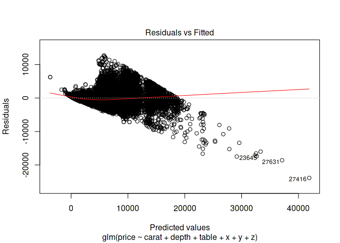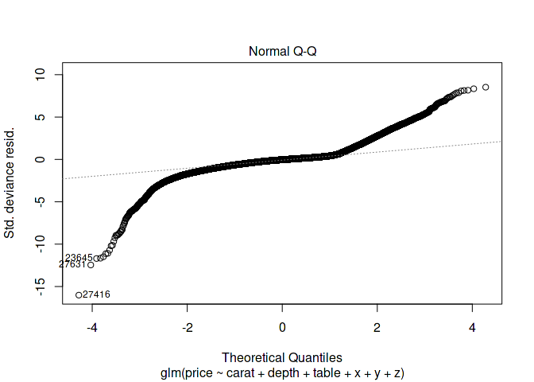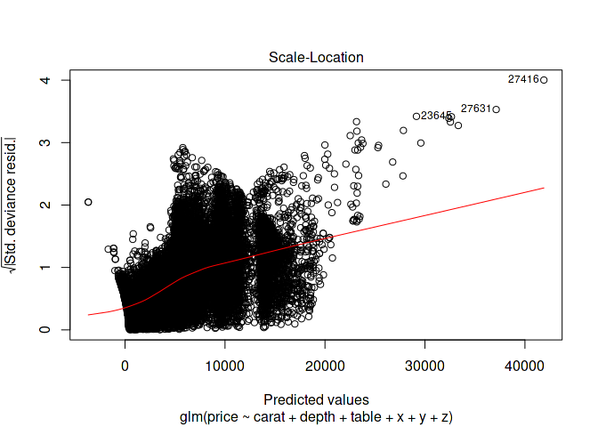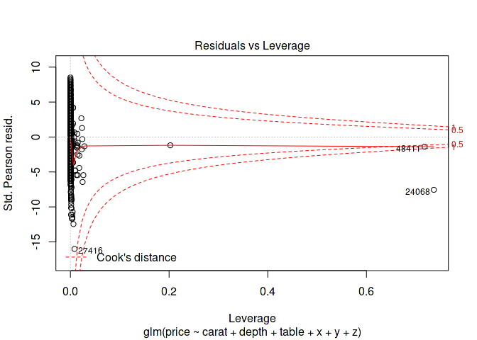

Generalized Linear Models
=========================

Logistic
--------

    [, 1]    mpg     Miles/(US) gallon
    [, 2]    cyl     Number of cylinders
    [, 3]    disp    Displacement (cu.in.)
    [, 4]    hp  Gross horsepower
    [, 5]    drat    Rear axle ratio
    [, 6]    wt  Weight (1000 lbs)
    [, 7]    qsec    1/4 mile time
    [, 8]    vs  V/S
    [, 9]    am  Transmission (0 = automatic, 1 = manual)
    [,10]    gear    Number of forward gears
    [,11]    carb    Number of carburetors

``` r
mpg_bin <- function(mpg) {
  if (mpg > 22) {
    return('good')
  } else {
    return('poor')
  }
}

mpg_bin_int <- function(mpg) {
  if (mpg > 22) {
    return(1)
  } else {
    return(0)
  }
}

mtcars$mpg_bin <- sapply(X = mtcars$mpg, FUN = mpg_bin)
mtcars$mpg_bin_int <- sapply(X = mtcars$mpg, FUN = mpg_bin_int)
head(mtcars)
```

    ##                    mpg cyl disp  hp drat    wt  qsec vs am gear carb
    ## Mazda RX4         21.0   6  160 110 3.90 2.620 16.46  0  1    4    4
    ## Mazda RX4 Wag     21.0   6  160 110 3.90 2.875 17.02  0  1    4    4
    ## Datsun 710        22.8   4  108  93 3.85 2.320 18.61  1  1    4    1
    ## Hornet 4 Drive    21.4   6  258 110 3.08 3.215 19.44  1  0    3    1
    ## Hornet Sportabout 18.7   8  360 175 3.15 3.440 17.02  0  0    3    2
    ## Valiant           18.1   6  225 105 2.76 3.460 20.22  1  0    3    1
    ##                   mpg_bin mpg_bin_int
    ## Mazda RX4            poor           0
    ## Mazda RX4 Wag        poor           0
    ## Datsun 710           good           1
    ## Hornet 4 Drive       poor           0
    ## Hornet Sportabout    poor           0
    ## Valiant              poor           0

``` r
m <- glm(formula = as.factor(mpg_bin) ~ cyl + hp + wt + as.factor(am),
         data = mtcars,
         family = binomial(link = 'logit'))
```

    ## Warning: glm.fit: fitted probabilities numerically 0 or 1 occurred

``` r
summary(m)
```

    ## 
    ## Call:
    ## glm(formula = as.factor(mpg_bin) ~ cyl + hp + wt + as.factor(am), 
    ##     family = binomial(link = "logit"), data = mtcars)
    ## 
    ## Deviance Residuals: 
    ##      Min        1Q    Median        3Q       Max  
    ## -1.35924  -0.00017   0.00000   0.00000   1.35930  
    ## 
    ## Coefficients:
    ##                  Estimate Std. Error z value Pr(>|z|)
    ## (Intercept)      -73.3121 10328.2144  -0.007    0.994
    ## cyl                8.9415  2581.9822   0.003    0.997
    ## hp                 0.3275     0.7501   0.437    0.662
    ## wt                 2.1764     3.1433   0.692    0.489
    ## as.factor(am)1    -3.4853     9.8480  -0.354    0.723
    ## 
    ## (Dispersion parameter for binomial family taken to be 1)
    ## 
    ##     Null deviance: 38.0243  on 31  degrees of freedom
    ## Residual deviance:  5.2874  on 27  degrees of freedom
    ## AIC: 15.287
    ## 
    ## Number of Fisher Scoring iterations: 21

``` r
broom::tidy(m)
```

    ##             term    estimate    std.error    statistic   p.value
    ## 1    (Intercept) -73.3120582 1.032821e+04 -0.007098232 0.9943365
    ## 2            cyl   8.9414791 2.581982e+03  0.003463029 0.9972369
    ## 3             hp   0.3274562 7.501192e-01  0.436538924 0.6624458
    ## 4             wt   2.1764112 3.143263e+00  0.692405086 0.4886830
    ## 5 as.factor(am)1  -3.4853254 9.848018e+00 -0.353911369 0.7234053

``` r
m <- glm(formula = as.factor(mpg_bin_int) ~ cyl + hp + wt + as.factor(am),
         data = mtcars,
         family = binomial(link = 'logit'))
```

    ## Warning: glm.fit: fitted probabilities numerically 0 or 1 occurred

``` r
summary(m)
```

    ## 
    ## Call:
    ## glm(formula = as.factor(mpg_bin_int) ~ cyl + hp + wt + as.factor(am), 
    ##     family = binomial(link = "logit"), data = mtcars)
    ## 
    ## Deviance Residuals: 
    ##      Min        1Q    Median        3Q       Max  
    ## -1.35930   0.00000   0.00000   0.00017   1.35924  
    ## 
    ## Coefficients:
    ##                  Estimate Std. Error z value Pr(>|z|)
    ## (Intercept)       73.3121 10328.2144   0.007    0.994
    ## cyl               -8.9415  2581.9822  -0.003    0.997
    ## hp                -0.3275     0.7501  -0.437    0.662
    ## wt                -2.1764     3.1433  -0.692    0.489
    ## as.factor(am)1     3.4853     9.8480   0.354    0.723
    ## 
    ## (Dispersion parameter for binomial family taken to be 1)
    ## 
    ##     Null deviance: 38.0243  on 31  degrees of freedom
    ## Residual deviance:  5.2874  on 27  degrees of freedom
    ## AIC: 15.287
    ## 
    ## Number of Fisher Scoring iterations: 21

``` r
broom::tidy(m)
```

    ##             term   estimate    std.error    statistic   p.value
    ## 1    (Intercept) 73.3120582 1.032821e+04  0.007098232 0.9943365
    ## 2            cyl -8.9414791 2.581982e+03 -0.003463029 0.9972369
    ## 3             hp -0.3274562 7.501192e-01 -0.436538924 0.6624458
    ## 4             wt -2.1764112 3.143263e+00 -0.692405086 0.4886830
    ## 5 as.factor(am)1  3.4853254 9.848018e+00  0.353911369 0.7234053

``` r
results  <- broom::tidy(m)
results$or <- exp(results$estimate)
results
```

    ##             term   estimate    std.error    statistic   p.value
    ## 1    (Intercept) 73.3120582 1.032821e+04  0.007098232 0.9943365
    ## 2            cyl -8.9414791 2.581982e+03 -0.003463029 0.9972369
    ## 3             hp -0.3274562 7.501192e-01 -0.436538924 0.6624458
    ## 4             wt -2.1764112 3.143263e+00 -0.692405086 0.4886830
    ## 5 as.factor(am)1  3.4853254 9.848018e+00  0.353911369 0.7234053
    ##             or
    ## 1 6.902753e+31
    ## 2 1.308474e-04
    ## 3 7.207548e-01
    ## 4 1.134479e-01
    ## 5 3.263304e+01

Survival Analysis
-----------------

<https://rpubs.com/daspringate/survival>

``` r
library(survival)
head(heart)
```

    ##   start stop event        age      year surgery transplant id
    ## 1     0   50     1 -17.155373 0.1232033       0          0  1
    ## 2     0    6     1   3.835729 0.2546201       0          0  2
    ## 3     0    1     0   6.297057 0.2655715       0          0  3
    ## 4     1   16     1   6.297057 0.2655715       0          1  3
    ## 5     0   36     0  -7.737166 0.4900753       0          0  4
    ## 6    36   39     1  -7.737166 0.4900753       0          1  4

Survival of patients on the waiting list for the Stanford heart transplant program.

    start, stop, event:  Entry and exit time and status for this interval of time
    age:     age-48 years
    year:    year of acceptance (in years after 1 Nov 1967)
    surgery:     prior bypass surgery 1=yes
    transplant:  received transplant 1=yes
    id:  patient id

``` r
s <- Surv(heart$start, heart$stop, heart$event)
```

``` r
cox <- coxph(Surv(heart$start, heart$stop, heart$event) ~ age + year + as.factor(surgery) + as.factor(transplant),
             data = heart)
summary(cox)
```

    ## Call:
    ## coxph(formula = Surv(heart$start, heart$stop, heart$event) ~ 
    ##     age + year + as.factor(surgery) + as.factor(transplant), 
    ##     data = heart)
    ## 
    ##   n= 172, number of events= 75 
    ## 
    ##                            coef exp(coef) se(coef)      z Pr(>|z|)  
    ## age                     0.02717   1.02754  0.01371  1.981   0.0476 *
    ## year                   -0.14635   0.86386  0.07047 -2.077   0.0378 *
    ## as.factor(surgery)1    -0.63721   0.52877  0.36723 -1.735   0.0827 .
    ## as.factor(transplant)1 -0.01025   0.98980  0.31375 -0.033   0.9739  
    ## ---
    ## Signif. codes:  0 '***' 0.001 '**' 0.01 '*' 0.05 '.' 0.1 ' ' 1
    ## 
    ##                        exp(coef) exp(-coef) lower .95 upper .95
    ## age                       1.0275     0.9732    1.0003    1.0555
    ## year                      0.8639     1.1576    0.7524    0.9918
    ## as.factor(surgery)1       0.5288     1.8912    0.2574    1.0860
    ## as.factor(transplant)1    0.9898     1.0103    0.5352    1.8307
    ## 
    ## Concordance= 0.636  (se = 0.037 )
    ## Rsquare= 0.084   (max possible= 0.969 )
    ## Likelihood ratio test= 15.11  on 4 df,   p=0.004476
    ## Wald test            = 14.49  on 4 df,   p=0.005877
    ## Score (logrank) test = 15.03  on 4 df,   p=0.004631

``` r
plot(survfit(cox), xlab = 'days', ylab = 'Survival Rate', conf.int = TRUE)
```

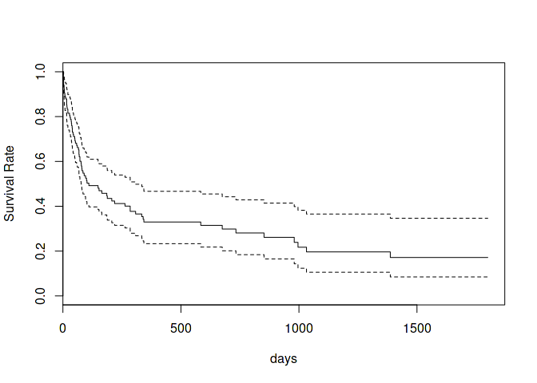

``` r
cox <- coxph(Surv(heart$start, heart$stop, heart$event) ~ age + year + strata(as.factor(surgery)) + as.factor(transplant),
             data = heart)
summary(cox)
```

    ## Call:
    ## coxph(formula = Surv(heart$start, heart$stop, heart$event) ~ 
    ##     age + year + strata(as.factor(surgery)) + as.factor(transplant), 
    ##     data = heart)
    ## 
    ##   n= 172, number of events= 75 
    ## 
    ##                            coef exp(coef) se(coef)      z Pr(>|z|)  
    ## age                     0.02681   1.02718  0.01367  1.962   0.0498 *
    ## year                   -0.14924   0.86136  0.07010 -2.129   0.0333 *
    ## as.factor(transplant)1 -0.02178   0.97846  0.31588 -0.069   0.9450  
    ## ---
    ## Signif. codes:  0 '***' 0.001 '**' 0.01 '*' 0.05 '.' 0.1 ' ' 1
    ## 
    ##                        exp(coef) exp(-coef) lower .95 upper .95
    ## age                       1.0272     0.9735    1.0000    1.0551
    ## year                      0.8614     1.1610    0.7508    0.9882
    ## as.factor(transplant)1    0.9785     1.0220    0.5268    1.8173
    ## 
    ## Concordance= 0.606  (se = 0.042 )
    ## Rsquare= 0.057   (max possible= 0.957 )
    ## Likelihood ratio test= 10.17  on 3 df,   p=0.01721
    ## Wald test            = 9.72  on 3 df,   p=0.02106
    ## Score (logrank) test = 9.9  on 3 df,   p=0.01944

``` r
plot(survfit(cox), xlab = 'days', ylab = 'Survival Rate', conf.int = TRUE, col = 1:2)
legend("bottomleft", legend = c(1, 2), lty = 1, col = 1:2, text.col = 1:2, title = 'rx')
```

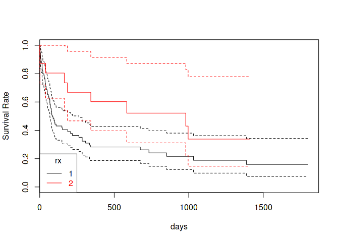

Model Diagnostics
=================

``` r
m1 <- glm(price ~ carat, data = diamonds)
m2 <- glm(price ~ carat + as.factor(cut), data = diamonds)
m3 <- glm(price ~ carat + as.factor(cut) + depth, data = diamonds)
m4 <- glm(price ~ carat + as.factor(cut) + depth +  table, data = diamonds)
```

``` r
head(fortify(m1))
```

    ##   price carat         .hat   .sigma      .cooksd     .fitted   .resid
    ## 1   326  0.23 4.515399e-05 1548.572 6.001647e-06 -472.382688 798.3827
    ## 2   326  0.21 4.706148e-05 1548.571 8.922178e-06 -627.511200 953.5112
    ## 3   327  0.23 4.515399e-05 1548.572 6.016690e-06 -472.382688 799.3827
    ## 4   334  0.29 3.982758e-05 1548.576 9.656791e-07   -6.997151 340.9972
    ## 5   335  0.31 3.818413e-05 1548.576 2.780364e-07  148.131362 186.8686
    ## 6   336  0.24 4.422500e-05 1548.573 4.925361e-06 -394.818432 730.8184
    ##   .stdresid
    ## 1 0.5155756
    ## 2 0.6157543
    ## 3 0.5162214
    ## 4 0.2202069
    ## 5 0.1206747
    ## 6 0.4719441

``` r
plot(m1)
```

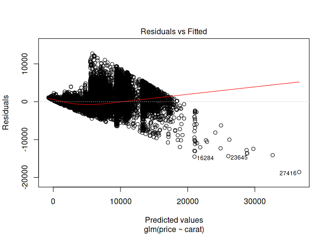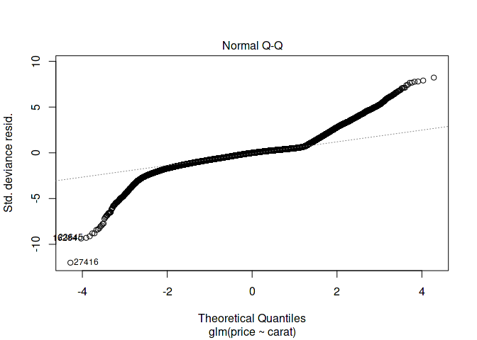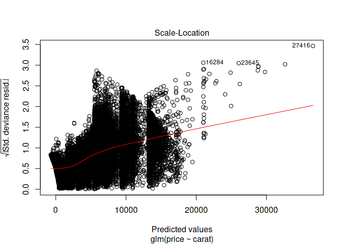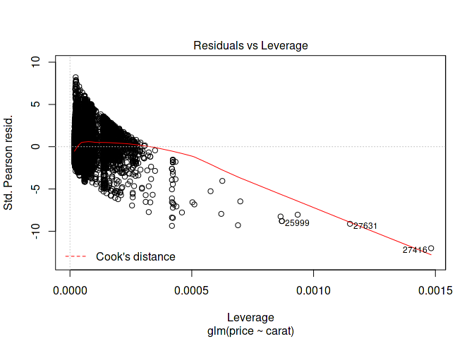

``` r
anova(m1, m2, m3, m4)
```

    ## Analysis of Deviance Table
    ## 
    ## Model 1: price ~ carat
    ## Model 2: price ~ carat + as.factor(cut)
    ## Model 3: price ~ carat + as.factor(cut) + depth
    ## Model 4: price ~ carat + as.factor(cut) + depth + table
    ##   Resid. Df Resid. Dev Df   Deviance
    ## 1     53938 1.2935e+11              
    ## 2     53934 1.2321e+11  4 6133201436
    ## 3     53933 1.2297e+11  1  246635400
    ## 4     53932 1.2270e+11  1  264127832

``` r
AIC(m1, m2, m3, m4)
```

    ##    df      AIC
    ## m1  3 945466.5
    ## m2  7 942854.2
    ## m3  8 942748.1
    ## m4  9 942634.2

``` r
BIC(m1, m2, m3, m4)
```

    ##    df      BIC
    ## m1  3 945493.2
    ## m2  7 942916.5
    ## m3  8 942819.3
    ## m4  9 942714.2

Cross Validation
----------------

``` r
library(boot)
```

    ## 
    ## Attaching package: 'boot'

    ## The following object is masked from 'package:survival':
    ## 
    ##     aml

``` r
cv1 <- cv.glm(data = diamonds, glmfit = m1, K = 5)

# raw cross-validation error based on MSE
# adjusted cross-validation error
cv1$delta
```

    ## [1] 2398335 2398293

``` r
cv2 <- cv.glm(data = diamonds, glmfit = m2, K = 5)
cv3 <- cv.glm(data = diamonds, glmfit = m3, K = 5)
cv4 <- cv.glm(data = diamonds, glmfit = m4, K = 5)
```

``` r
cv_results <- as.data.frame(rbind(cv1$delta, cv2$delta, cv3$delta, cv4$delta))
names(cv_results) <- c('error', 'adjusted_error')
cv_results$model <- sprintf('model_%s', 1:4)
cv_results
```

    ##     error adjusted_error   model
    ## 1 2398335        2398293 model_1
    ## 2 2284836        2284771 model_2
    ## 3 2280489        2280399 model_3
    ## 4 2275920        2275794 model_4

Bootstrap
=========

Regularization
==============

LASSO
-----

``` r
head(mtcars)
```

    ##                    mpg cyl disp  hp drat    wt  qsec vs am gear carb
    ## Mazda RX4         21.0   6  160 110 3.90 2.620 16.46  0  1    4    4
    ## Mazda RX4 Wag     21.0   6  160 110 3.90 2.875 17.02  0  1    4    4
    ## Datsun 710        22.8   4  108  93 3.85 2.320 18.61  1  1    4    1
    ## Hornet 4 Drive    21.4   6  258 110 3.08 3.215 19.44  1  0    3    1
    ## Hornet Sportabout 18.7   8  360 175 3.15 3.440 17.02  0  0    3    2
    ## Valiant           18.1   6  225 105 2.76 3.460 20.22  1  0    3    1
    ##                   mpg_bin mpg_bin_int
    ## Mazda RX4            poor           0
    ## Mazda RX4 Wag        poor           0
    ## Datsun 710           good           1
    ## Hornet 4 Drive       poor           0
    ## Hornet Sportabout    poor           0
    ## Valiant              poor           0

``` r
library(useful)
mtcars_x <- build.x(mpg_bin_int ~ mpg + cyl + disp + hp + drat + wt + qsec +
                      as.factor(vs) + as.factor(am) + as.factor(gear) + as.factor(carb),
                    data = mtcars, contrasts = FALSE)
mtcars_y <- build.y(mpg_bin_int ~ mpg + cyl + disp + hp + drat + wt + qsec +
                      as.factor(vs) + as.factor(am) + as.factor(gear) + as.factor(carb),
                    data = mtcars)
```

``` r
library(glmnet)
```

    ## Loading required package: Matrix

    ## Loading required package: foreach

    ## Loaded glmnet 2.0-8

``` r
set.seed(42)
```

``` r
cars_lasso <- cv.glmnet(x = mtcars_x, y = mtcars_y, family = "binomial", nfolds = 5)
```

    ## Warning in lognet(x, is.sparse, ix, jx, y, weights, offset, alpha, nobs, :
    ## one multinomial or binomial class has fewer than 8 observations; dangerous
    ## ground

    ## Warning in lognet(x, is.sparse, ix, jx, y, weights, offset, alpha, nobs, :
    ## one multinomial or binomial class has fewer than 8 observations; dangerous
    ## ground

    ## Warning in lognet(x, is.sparse, ix, jx, y, weights, offset, alpha, nobs, :
    ## one multinomial or binomial class has fewer than 8 observations; dangerous
    ## ground

    ## Warning in lognet(x, is.sparse, ix, jx, y, weights, offset, alpha, nobs, :
    ## one multinomial or binomial class has fewer than 8 observations; dangerous
    ## ground

``` r
plot(cars_lasso)
```

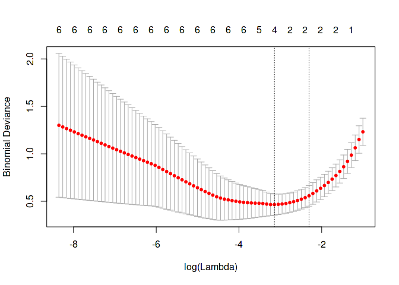

``` r
cars_lasso$lambda.min
```

    ## [1] 0.04313855

``` r
cars_lasso$lambda.1se
```

    ## [1] 0.09965564

``` r
coef(cars_lasso, s = "lambda.1se")
```

    ## 18 x 1 sparse Matrix of class "dgCMatrix"
    ##                           1
    ## (Intercept)      -3.1813145
    ## (Intercept)       .        
    ## mpg               0.1949356
    ## cyl              -0.3485168
    ## disp              .        
    ## hp                .        
    ## drat              .        
    ## wt                .        
    ## qsec              .        
    ## as.factor(vs)1    .        
    ## as.factor(am)1    .        
    ## as.factor(gear)4  .        
    ## as.factor(gear)5  .        
    ## as.factor(carb)2  .        
    ## as.factor(carb)3  .        
    ## as.factor(carb)4  .        
    ## as.factor(carb)6  .        
    ## as.factor(carb)8  .

``` r
plot(cars_lasso$glmnet.fit, xvar = "lambda")
```

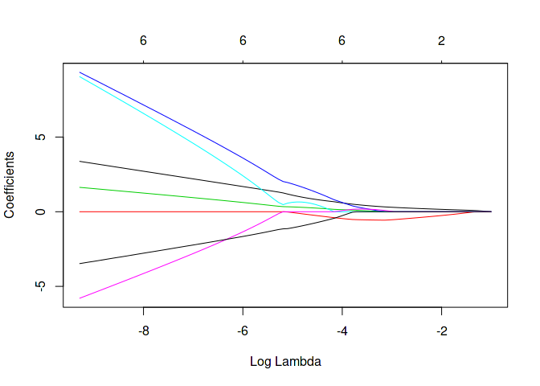

Ridge
-----

``` r
set.seed(42)
cars_ridge <- cv.glmnet(x = mtcars_x, y = mtcars_y, family = "binomial", nfolds = 5, alpha = 0)
```

    ## Warning in lognet(x, is.sparse, ix, jx, y, weights, offset, alpha, nobs, :
    ## one multinomial or binomial class has fewer than 8 observations; dangerous
    ## ground

    ## Warning in lognet(x, is.sparse, ix, jx, y, weights, offset, alpha, nobs, :
    ## one multinomial or binomial class has fewer than 8 observations; dangerous
    ## ground

    ## Warning in lognet(x, is.sparse, ix, jx, y, weights, offset, alpha, nobs, :
    ## one multinomial or binomial class has fewer than 8 observations; dangerous
    ## ground

    ## Warning in lognet(x, is.sparse, ix, jx, y, weights, offset, alpha, nobs, :
    ## one multinomial or binomial class has fewer than 8 observations; dangerous
    ## ground

``` r
plot(cars_ridge)
```

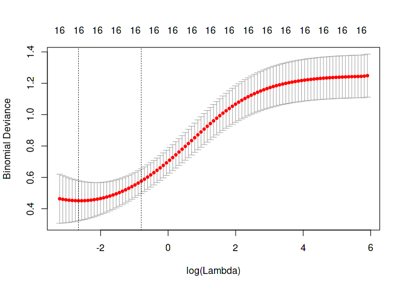

``` r
cars_ridge$lambda.min
```

    ## [1] 0.07030508

``` r
cars_ridge$lambda.1se
```

    ## [1] 0.4519262

``` r
coef(cars_ridge, s = "lambda.1se")
```

    ## 18 x 1 sparse Matrix of class "dgCMatrix"
    ##                             1
    ## (Intercept)      -3.189377552
    ## (Intercept)       .          
    ## mpg               0.047319785
    ## cyl              -0.134165116
    ## disp             -0.001388835
    ## hp               -0.002636723
    ## drat              0.334558875
    ## wt               -0.192346503
    ## qsec              0.080938621
    ## as.factor(vs)1    0.279408171
    ## as.factor(am)1    0.274165432
    ## as.factor(gear)4  0.282063664
    ## as.factor(gear)5  0.240723129
    ## as.factor(carb)2  0.290728883
    ## as.factor(carb)3 -0.143111551
    ## as.factor(carb)4 -0.352780633
    ## as.factor(carb)6 -0.369120102
    ## as.factor(carb)8 -0.131939348

``` r
plot(cars_ridge$glmnet.fit, xvar = "lambda")
```

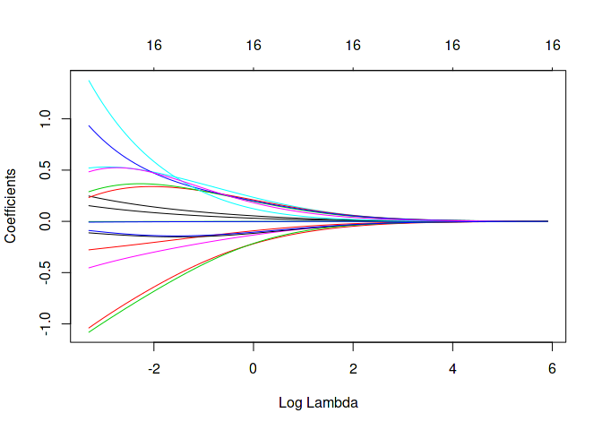

Parallelization and optimizing alpha
------------------------------------

``` r
library(parallel)
library(doParallel)
```

    ## Loading required package: iterators

``` r
set.seed(42)

# building a 2 layered CV
# buld a vector specifying membership for each fold
# to make sure an observation is on the same fold
folds <- sample(rep(x = 1:5, length.out = nrow(mtcars_x)))

# alphas
alphas <- seq(from = 0.5, to = 1, by = 0.05)
```

``` r
set.seed(42)
cl <- makeCluster(2)
registerDoParallel(cl)

par_results <- foreach(i = 1:length(alphas),
                       .errorhandling = 'remove',
                       .inorder = FALSE,
                       .multicombine = TRUE,
                       .export = c("mtcars_x", "mtcars_y", 'alphas', 'folds'),
                       .packages = 'glmnet') %dopar% {
                         print(alphas[i])
                         cv.glmnet(x = mtcars_x, y = mtcars_y, family = 'binomial',
                                   nfolds = 5, foldid = folds, alpha = alphas[i])
                       }
```

    ## Warning in e$fun(obj, substitute(ex), parent.frame(), e$data): already
    ## exporting variable(s): mtcars_x, mtcars_y, alphas, folds

``` r
stopCluster(cl)
```

``` r
sapply(par_results, class)
```

    ##  [1] "cv.glmnet" "cv.glmnet" "cv.glmnet" "cv.glmnet" "cv.glmnet"
    ##  [6] "cv.glmnet" "cv.glmnet" "cv.glmnet" "cv.glmnet" "cv.glmnet"
    ## [11] "cv.glmnet"

``` r
extract_glmnet <- function(glmnet_object) {
  lambda_min <- glmnet_object$lambda.min
  lambda_1se <- glmnet_object$lambda.1se
  
  min_i <- which(glmnet_object$lambda == lambda_min)
  se1_i <- which(glmnet_object$lambda == lambda_1se)
  
  data.frame(lambda_min = lambda_min, error_min = glmnet_object$cvm[min_i],
             lambda_1se = lambda_1se, error_1se = glmnet_object$cvm[se1_i])
}

ldf <- lapply(par_results, extract_glmnet)

# using base R Reduce function
en_alpha <- Reduce(rbind, ldf)
en_alpha
```

    ##    lambda_min error_min lambda_1se error_1se
    ## 1  0.04937093 0.5243807 0.18160501 0.6477668
    ## 2  0.04925866 0.5257812 0.18119207 0.6564148
    ## 3  0.04955621 0.5257279 0.16609273 0.6401875
    ## 4  0.05509905 0.5230462 0.16826453 0.6438780
    ## 5  0.05615177 0.5125492 0.14236520 0.6075758
    ## 6  0.05240832 0.5009226 0.14582926 0.6122012
    ## 7  0.04913280 0.4887088 0.13671493 0.5986245
    ## 8  0.04624263 0.4787175 0.12867287 0.5889794
    ## 9  0.04793172 0.4721890 0.11072849 0.5607349
    ## 10 0.04540900 0.4668725 0.10490067 0.5566294
    ## 11 0.04313855 0.4651642 0.09965564 0.5576061

``` r
# tidyverse
en_alpha <- purrr::reduce(ldf, rbind)
en_alpha
```

    ##    lambda_min error_min lambda_1se error_1se
    ## 1  0.04937093 0.5243807 0.18160501 0.6477668
    ## 2  0.04925866 0.5257812 0.18119207 0.6564148
    ## 3  0.04955621 0.5257279 0.16609273 0.6401875
    ## 4  0.05509905 0.5230462 0.16826453 0.6438780
    ## 5  0.05615177 0.5125492 0.14236520 0.6075758
    ## 6  0.05240832 0.5009226 0.14582926 0.6122012
    ## 7  0.04913280 0.4887088 0.13671493 0.5986245
    ## 8  0.04624263 0.4787175 0.12867287 0.5889794
    ## 9  0.04793172 0.4721890 0.11072849 0.5607349
    ## 10 0.04540900 0.4668725 0.10490067 0.5566294
    ## 11 0.04313855 0.4651642 0.09965564 0.5576061

``` r
en_alpha$alpha <- alphas

en_alpha
```

    ##    lambda_min error_min lambda_1se error_1se alpha
    ## 1  0.04937093 0.5243807 0.18160501 0.6477668  0.50
    ## 2  0.04925866 0.5257812 0.18119207 0.6564148  0.55
    ## 3  0.04955621 0.5257279 0.16609273 0.6401875  0.60
    ## 4  0.05509905 0.5230462 0.16826453 0.6438780  0.65
    ## 5  0.05615177 0.5125492 0.14236520 0.6075758  0.70
    ## 6  0.05240832 0.5009226 0.14582926 0.6122012  0.75
    ## 7  0.04913280 0.4887088 0.13671493 0.5986245  0.80
    ## 8  0.04624263 0.4787175 0.12867287 0.5889794  0.85
    ## 9  0.04793172 0.4721890 0.11072849 0.5607349  0.90
    ## 10 0.04540900 0.4668725 0.10490067 0.5566294  0.95
    ## 11 0.04313855 0.4651642 0.09965564 0.5576061  1.00

``` r
library(ggplot2)
library(tidyr)
```

    ## 
    ## Attaching package: 'tidyr'

    ## The following object is masked from 'package:Matrix':
    ## 
    ##     expand

``` r
gathered <- gather(en_alpha, type, lambda, -alpha, -error_min, -error_1se)
gathered <- gather(gathered, error_type, error, -alpha, -type, -lambda)

ggplot(data = gathered, aes(x = alpha, y = error)) + geom_point() + facet_grid(type ~ error_type)
```

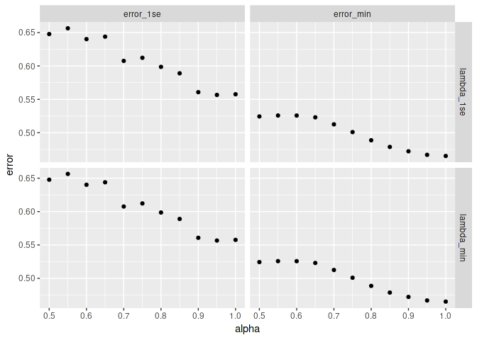

Decision Trees
==============

``` r
library(rpart)

mtcars_tree <- rpart(mpg ~ cyl + disp + hp + drat + wt + qsec +
                        as.factor(vs) +as.factor(am) + as.factor(gear) + as.factor(carb),
                      data = mtcars)
mtcars_tree
```

    ## n= 32 
    ## 
    ## node), split, n, deviance, yval
    ##       * denotes terminal node
    ## 
    ## 1) root 32 1126.04700 20.09062  
    ##   2) cyl>=5 21  198.47240 16.64762  
    ##     4) hp>=192.5 7   28.82857 13.41429 *
    ##     5) hp< 192.5 14   59.87214 18.26429 *
    ##   3) cyl< 5 11  203.38550 26.66364 *

``` r
library(rpart.plot)
rpart.plot(mtcars_tree)
```

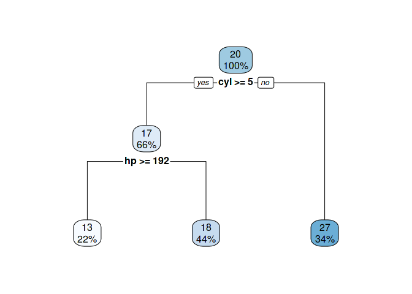

``` r
mtcars_tree_bin <- rpart(as.factor(mpg_bin) ~ cyl + disp + hp + drat + wt + qsec +
                        as.factor(vs) +as.factor(am) + as.factor(gear) + as.factor(carb),
                      data = mtcars)
mtcars_tree_bin
```

    ## n= 32 
    ## 
    ## node), split, n, loss, yval, (yprob)
    ##       * denotes terminal node
    ## 
    ## 1) root 32 9 poor (0.28125000 0.71875000)  
    ##   2) hp< 96 8 0 good (1.00000000 0.00000000) *
    ##   3) hp>=96 24 1 poor (0.04166667 0.95833333) *

``` r
rpart.plot(mtcars_tree_bin)
```

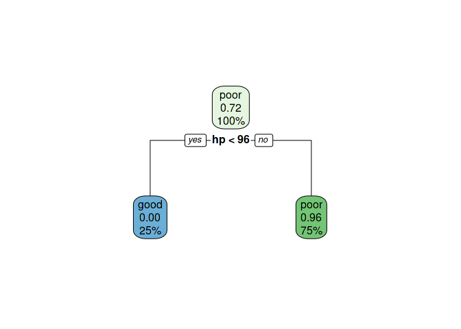
